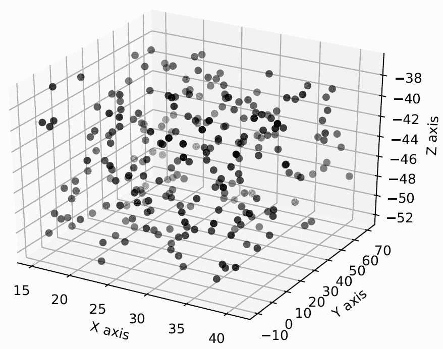
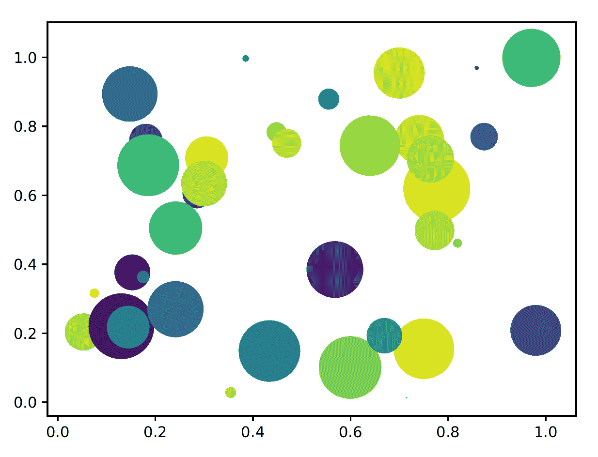
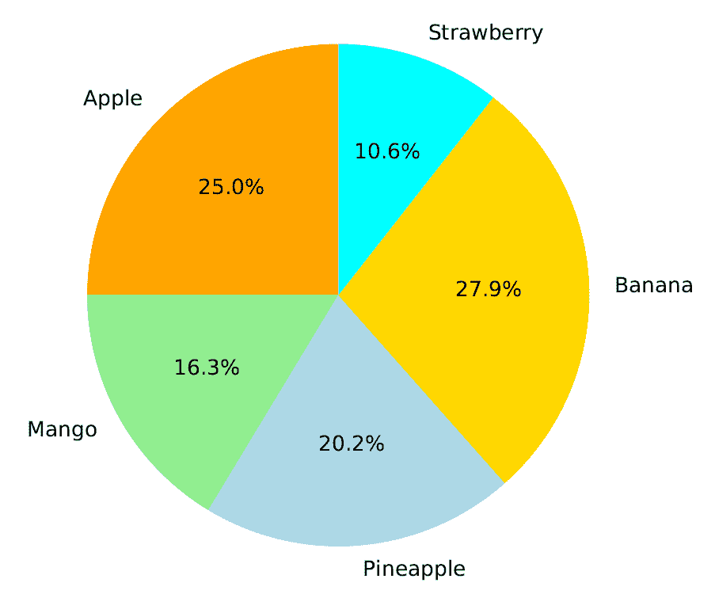
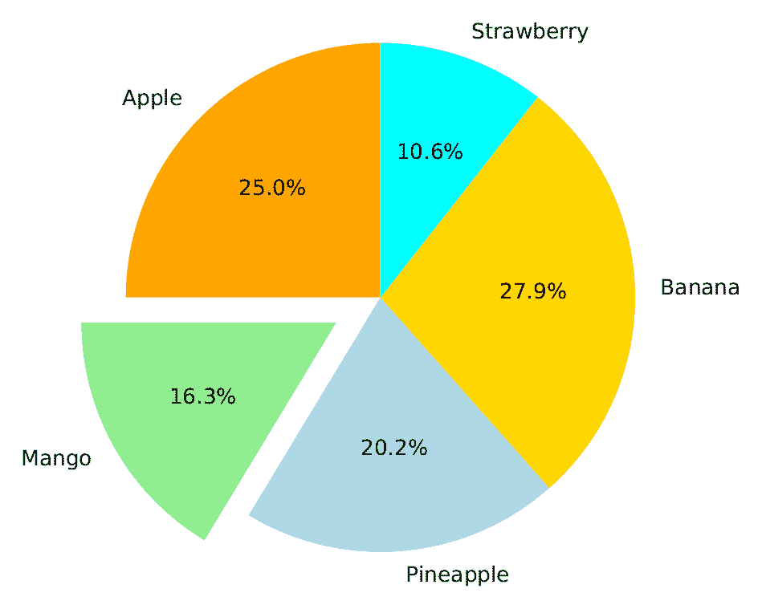
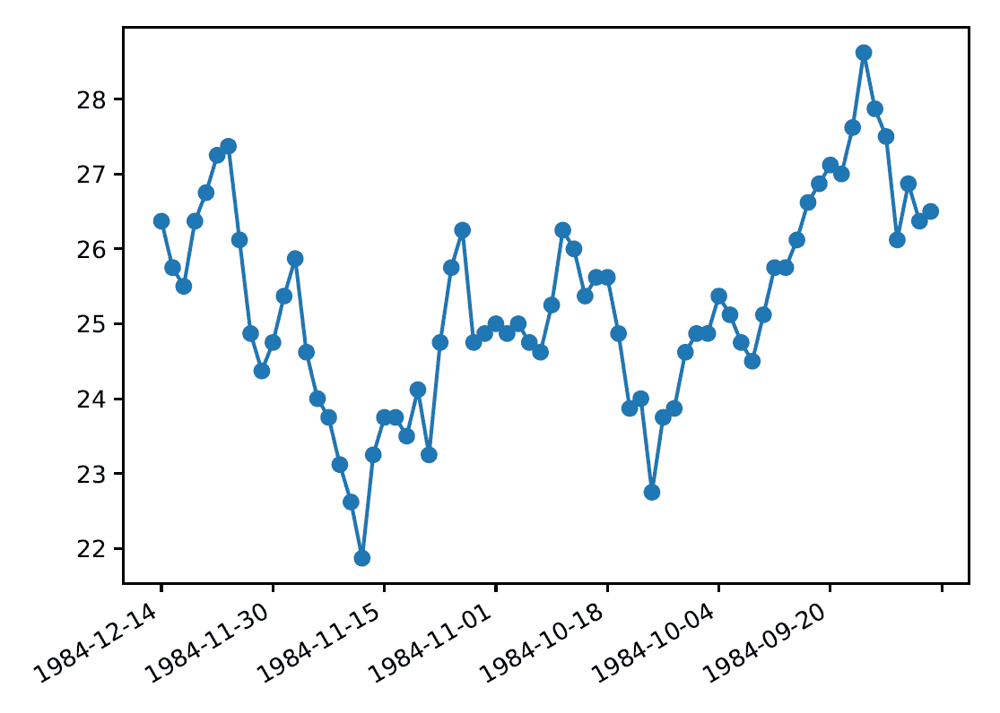
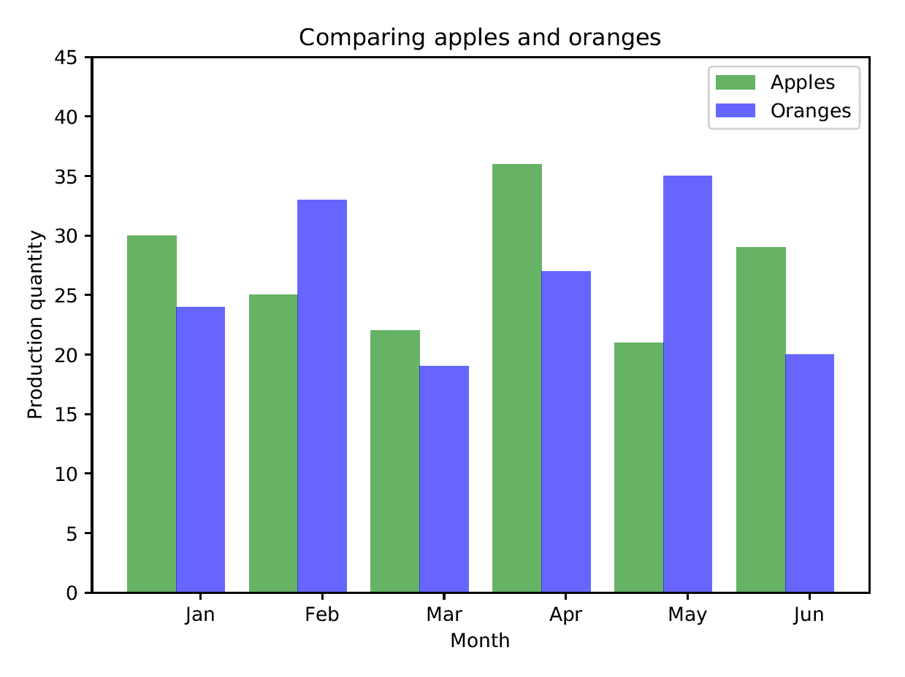
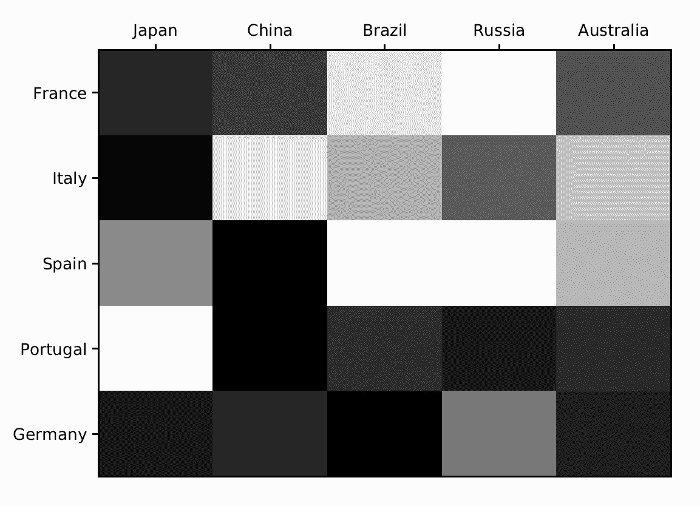
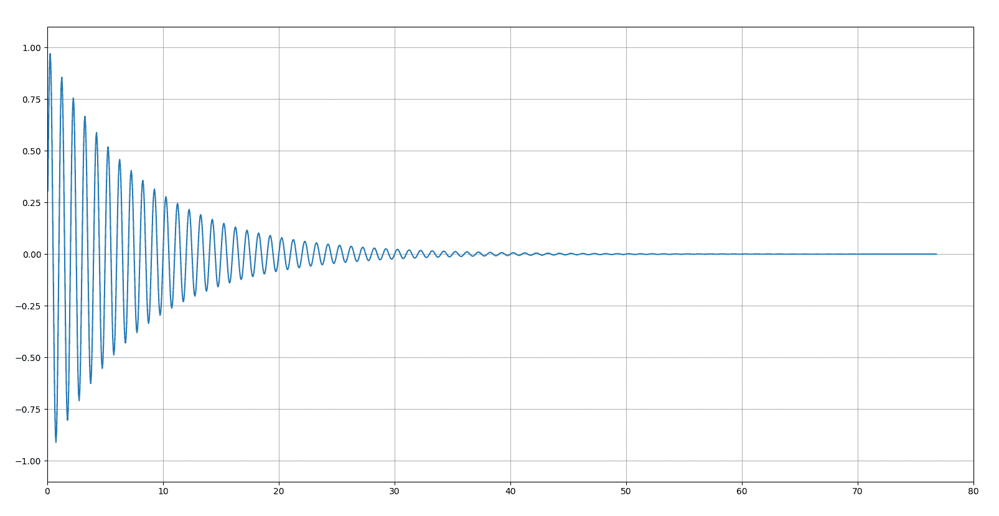
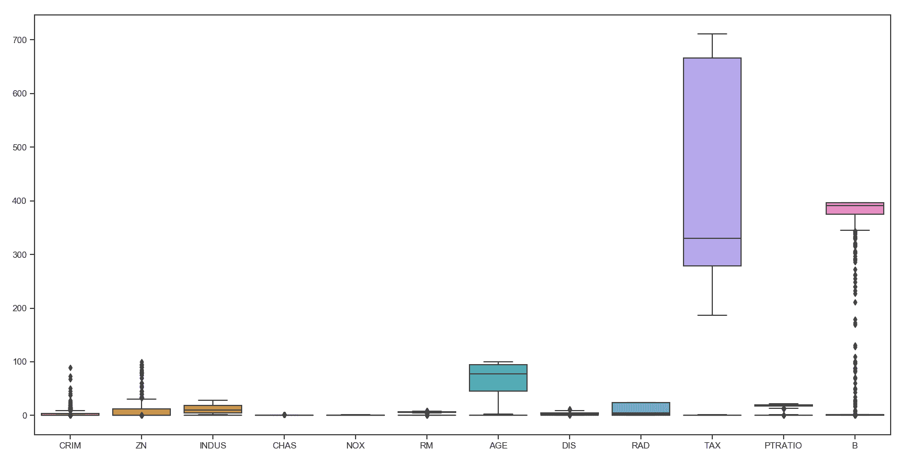
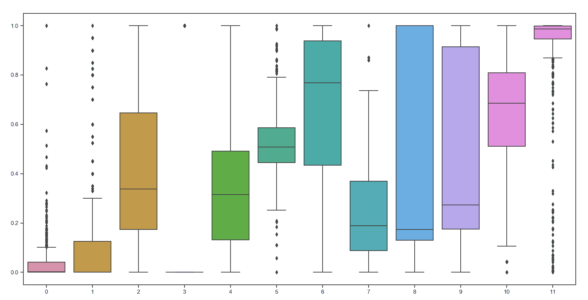

# 第五章：可视化数据

在本章中，我们将介绍以下食谱：

+   绘制三维散点图

+   绘制气泡图

+   动画气泡图

+   绘制饼图

+   绘制日期格式的时间序列数据

+   绘制直方图

+   可视化热图

+   动态信号动画

+   使用 Seaborn 库进行操作

# 技术要求

为了处理本章中的食谱，您将需要以下文件（可在 GitHub 上找到）：

+   `scatter_3d.py`

+   `bubble_plot.py`

+   `dynamic_bubble_plot.py`

+   `pie_chart.py`

+   `time_series.py`

+   `aapl.csv`

+   `histogram.py`

+   `heatmap.py`

+   `moving_wave_variable.py`

+   `seaborn.boxplot.py`

# 数据可视化简介

**数据可视化**是机器学习的一个重要支柱。它帮助我们制定正确的策略来理解数据。数据的视觉表示有助于我们选择正确的算法。数据可视化的一个主要目标是使用图表和图表清晰地传达信息。

在现实世界中，我们经常遇到数值数据。我们希望通过图表、线条、点、条形等来编码这些数值数据，以直观地显示这些数字中包含的信息。这使得复杂的数据分布更容易理解和使用。这个过程在各种情况下都得到应用，包括比较分析、跟踪增长、市场分布、民意调查等等。

我们使用不同的图表来展示变量之间的模式或关系。我们使用直方图来显示数据的分布。当我们想要查找特定的测量值时，我们使用表格。在本章中，我们将探讨各种场景并讨论在这些情况下我们可以使用哪些可视化。

# 绘制三维散点图

可以使用散点图来表示定量变量之间的关系。这种图表的一个版本是三维散点图，用于展示三个变量之间的关系。

# 准备工作

在本食谱中，您将学习如何绘制三维散点图并在三维中可视化它们。

# 如何做到...

让我们看看如何绘制三维散点图：

1.  创建一个新的 Python 文件并导入以下包（完整的代码在您已提供的 `scatter_3d.py` 文件中）：

```py
import numpy as np 
import matplotlib.pyplot as plt  
```

1.  创建空图，如下所示：

```py
# Create the figure 
fig = plt.figure() 
ax = fig.add_subplot(111, projection='3d') 
```

1.  定义我们应该生成的值的数量：

```py
# Define the number of values 
n = 250 
```

1.  创建一个 `lambda` 函数来生成给定范围内的值：

```py
# Create a lambda function to generate the random values in the given range 
f = lambda minval, maxval, n: minval + (maxval - minval) * np.random.rand(n) 
```

1.  使用 `lambda` 函数生成 x、y 和 z 值：

```py
# Generate the values 
x_vals = f(15, 41, n) y_vals = f(-10, 70, n) 
z_vals = f(-52, -37, n) 
```

1.  按照以下方式绘制这些值：

```py
# Plot the values 
ax.scatter(x_vals, y_vals, z_vals, c='k', marker='o') 
ax.set_xlabel('X axis') 
ax.set_ylabel('Y axis') 
ax.set_zlabel('Z axis') 

plt.show() 
```

如果您运行前面的代码，您将看到以下输出：



# 它是如何工作的...

散点图帮助我们理解两个定量特征之间是否存在统计关联。如果一个变量增加，另一个变量倾向于减少，我们有一个不一致的关联。如果一个变量增加，另一个变量也倾向于增加，我们有一个一致的关联。如果一个变量变化，而另一个变量倾向于不变化，我们没有任何关联。为了分析这种趋势，分析标记的位置。如果标记在图形的三维空间中的任何方向上接近形成一条直线，则对应变量的相关性很高。如果标记在图中均匀分布，则相关性低，或为零。

# 更多...

三维散点图用于显示三个变量之间的关系。可以通过匹配标记的颜色或大小添加第四个变量，将另一个变量添加到图中。

# 参见

+   请参考 Matplotlib 的官方文档，链接为[`matplotlib.org/gallery/mplot3d/scatter3d.html`](https://matplotlib.org/gallery/mplot3d/scatter3d.html)。

+   请参考伊利诺伊大学提供的*可视化您的数据：散点图*（[`guides.library.illinois.edu/visualize-your-data/scatter-plots`](http://guides.library.illinois.edu/visualize-your-data/scatter-plots)）。

# 绘制气泡图

**气泡图**是一种图表，其中每个表示的实体由三个不同的数值参数定义。前两个参数用作两个笛卡尔轴的值，而第三个参数用于确定气泡的半径。气泡图用于描述各个科学领域的关联关系。

# 准备工作

让我们看看如何绘制气泡图。在二维气泡图中，每个圆的大小代表该特定点的振幅。

# 如何做到这一点...

让我们看看如何绘制气泡图：

1.  创建一个新的 Python 文件，并导入以下包（完整的代码在您已经提供的`bubble_plot.py`文件中）：

```py
import numpy as np 
import matplotlib.pyplot as plt  
```

1.  定义我们应该生成的值的数量：

```py
# Define the number of values 
num_vals = 40 
```

1.  为`x`和`y`生成随机值：

```py
# Generate random values 
x = np.random.rand(num_vals) 
y = np.random.rand(num_vals) 
```

1.  定义气泡图中每个点的面积值：

```py
# Define area for each bubble 
# Max radius is set to a specified value 
max_radius = 25 
area = np.pi * (max_radius * np.random.rand(num_vals)) ** 2   
```

1.  定义颜色：

```py
# Generate colors 
colors = np.random.rand(num_vals) 
```

1.  绘制这些值：

```py
# Plot the points 
plt.scatter(x, y, s=area, c=colors, alpha=1.0) 

plt.show() 
```

如果您运行此代码，您将看到以下输出：



# 它是如何工作的...

之前显示的变量可以根据它们的大小以及它们相对于数值轴的位置进行比较。实际上，气泡图的*x*轴和*y*轴是数值尺度，因此数据表示的位置描述了两个数值，而图形的面积取决于第三个参数的值。

在绘制气泡图时，需要注意以下事实：圆的面积与半径的平方成正比，因此如果半径与第三个值成比例，结果将不成比例地强调第三个值。为了有一个正确权衡的刻度，半径必须与第三个值的平方根成比例。在绘制气泡图时，这种错误是常见的。

# 更多...

气泡图可以被视为散点图的一种变体，其中点被气泡所取代。如果数据有三个系列，每个系列包含一组数据，则可以使用此类图表代替散点图。

# 参见

+   参考 Matplotlib 的官方文档位于[`matplotlib.org/api/_as_gen/matplotlib.pyplot.scatter.html`](https://matplotlib.org/api/_as_gen/matplotlib.pyplot.scatter.html)。

+   参考位于[`matplotlib.org/users/pyplot_tutorial.html`](https://matplotlib.org/users/pyplot_tutorial.html)的`pyplot`教程。

# 动画气泡图

动画气泡图是一种动态的气泡图。它允许通过时间和交互式地高效可视化相关性。它特别有用，因为它允许我们有效地和交互式地可视化变量之间的相关性如何随时间变化。

# 准备工作

让我们看看如何动画气泡图。当您想要可视化瞬态和动态数据时，这将很有用。

# 如何做到这一点...

让我们看看如何动画气泡图：

1.  创建一个新的 Python 文件并导入以下包（完整的代码在您已经提供的`dynamic_bubble_plot.py`文件中）：

```py
import numpy as np 
import matplotlib.pyplot as plt 
from matplotlib.animation import FuncAnimation  
```

1.  让我们定义一个`tracker`函数，该函数将动态更新气泡图：

```py
def tracker(cur_num): 
    # Get the current index  
    cur_index = cur_num % num_points 
```

1.  定义颜色：

```py
    # Set the color of the datapoints  
    datapoints['color'][:, 3] = 1.0 
```

1.  更新圆的大小：

```py
    # Update the size of the circles  
    datapoints['size'] += datapoints['growth'] 
```

1.  更新集合中最旧数据点的位置：

```py
    # Update the position of the oldest datapoint  
    datapoints['position'][cur_index] = np.random.uniform(0, 1, 2) 
    datapoints['size'][cur_index] = 7 
    datapoints['color'][cur_index] = (0, 0, 0, 1) 
    datapoints['growth'][cur_index] = np.random.uniform(40, 150) 
```

1.  更新散点图的参数：

```py
    # Update the parameters of the scatter plot  
    scatter_plot.set_edgecolors(datapoints['color']) 
    scatter_plot.set_sizes(datapoints['size']) 
    scatter_plot.set_offsets(datapoints['position']) 
```

1.  定义`main`函数并创建一个空图：

```py
if __name__=='__main__': 
    # Create a figure  
    fig = plt.figure(figsize=(9, 7), facecolor=(0,0.9,0.9)) 
    ax = fig.add_axes([0, 0, 1, 1], frameon=False) 
    ax.set_xlim(0, 1), ax.set_xticks([]) 
    ax.set_ylim(0, 1), ax.set_yticks([]) 
```

1.  定义在任何给定时间点图上将会有的点的数量：

```py
    # Create and initialize the datapoints in random positions  
    # and with random growth rates. 
    num_points = 20 
```

1.  使用随机值定义`datapoints`：

```py
    datapoints = np.zeros(num_points, dtype=[('position', float, 2), 
            ('size', float, 1), ('growth', float, 1), ('color', float, 4)]) 
    datapoints['position'] = np.random.uniform(0, 1, (num_points, 2)) 
    datapoints['growth'] = np.random.uniform(40, 150, num_points) 
```

1.  创建将在每一帧更新的散点图：

```py
    # Construct the scatter plot that will be updated every frame 
    scatter_plot = ax.scatter(datapoints['position'][:, 0], datapoints['position'][:, 1], 
                      s=datapoints['size'], lw=0.7, edgecolors=datapoints['color'], 
                      facecolors='none') 
```

1.  通过使用`tracker`函数开始动画：

```py
    # Start the animation using the 'tracker' function  
    animation = FuncAnimation(fig, tracker, interval=10) 

    plt.show() 
```

如果您运行此代码，您将看到以下输出：


# 它是如何工作的...

在这个菜谱中，我们简单地使用了一系列随时间变化的气泡图，通过构建一个更新这些图参数的函数来构建动画。为此，我们首先构建了一个更新这些图参数的函数。然后，我们定义了跟踪当前参数的气泡图的代码。最后，我们使用`FuncAnimation()`函数从单个气泡图中创建动画。

# 更多...

Matplotlib 的`FuncAnimation()`函数通过重复调用一个特定的函数来创建动画。

# 参见

+   请参考 Matplotlib 的官方文档[`matplotlib.org/api/_as_gen/matplotlib.animation.FuncAnimation.html`](https://matplotlib.org/api/_as_gen/matplotlib.animation.FuncAnimation.html)。

+   参考 Matplotlib 动画[`matplotlib.org/api/animation_api.html`](https://matplotlib.org/api/animation_api.html)。

# 绘制饼图

圆形图，通常被称为饼图，是描述性统计中用于图形表示在类别（名义值）类别上测量的定量变量的方法，以避免无意中建立不存在的类别顺序。

# 准备工作

让我们看看如何绘制饼图。这在你想可视化一组标签的百分比时非常有用。

# 如何做到这一点...

让我们看看如何绘制饼图，如下所示：

1.  创建一个新的 Python 文件，并导入以下包（完整的代码在已经提供给你的`pie_chart.py`文件中）：

```py
import matplotlib.pyplot as plt  
```

1.  定义标签和值：

```py
# Labels and corresponding values in counter clockwise direction 
data = {'Apple': 26,  
        'Mango': 17, 
        'Pineapple': 21,  
        'Banana': 29,  
        'Strawberry': 11} 
```

1.  定义用于可视化的颜色：

```py
# List of corresponding colors 
colors = ['orange', 'lightgreen', 'lightblue', 'gold', 'cyan'] 
```

1.  定义一个变量来突出显示饼图的一部分，使其与其他部分分离。如果你不想突出任何部分，将所有值设置为`0`：

```py
# Needed if we want to highlight a section 
explode = (0, 0, 0, 0, 0)   
```

1.  绘制饼图。请注意，如果你使用的是 Python 3，你应该在以下函数调用中使用`list(data.values())`：

```py
# Plot the pie chart 
plt.pie(data.values(), explode=explode, labels=data.keys(),  
        colors=colors, autopct='%1.1f%%', shadow=False, startangle=90) 

# Aspect ratio of the pie chart, 'equal' indicates tht we  
# want it to be a circle 
plt.axis('equal') 

plt.show() 
```

如果你运行此代码，你将看到以下输出：



1.  如果你将 explode 数组更改为(`0, 0.2, 0, 0, 0`)，它将突出显示芒果部分。你将看到以下输出：



# 它是如何工作的...

饼图是通过将圆分成角度幅度与频率类别成比例的切片来构建的。切片所标识的面积与频率成比例。为了使图表更清晰，不同的切片被填充了不同的颜色。

# 还有更多...

饼图用于显示产品和品牌的市场份额，或政治党派在选举中所占的百分比。当百分比差异很大或元素太多时，图表将无法正常工作，因为这会使饼图过于参差不齐。

# 参见

+   参考 Matplotlib 的官方文档[`matplotlib.org/api/_as_gen/matplotlib.pyplot.pie.html`](https://matplotlib.org/api/_as_gen/matplotlib.pyplot.pie.html)。

+   参考来自维基百科的饼图[`en.wikipedia.org/wiki/Pie_chart`](https://en.wikipedia.org/wiki/Pie_chart)。

# 绘制日期格式的时间序列数据

**时间序列**是一系列现象的观察结果，在连续的瞬间或时间间隔内进行。通常，即使不是必要的，它们也是均匀分布的或长度相同。商品价格趋势、股票市场指数、政府债券收益率和失业率只是时间序列的几个例子。

# 准备工作

让我们看看如何使用日期格式绘制时间序列数据。这将在可视化随时间变化的股票数据时很有用。

# 如何做...

让我们看看如何绘制日期格式化的时间序列数据，如下所示：

1.  创建一个新的 Python 文件并导入以下包（完整代码在已提供的`time_series.py`文件中）：

```py
import numpy 
import matplotlib.pyplot as plt 
from matplotlib.mlab import csv2rec 
from matplotlib.ticker import Formatter 
```

1.  定义一个用于格式化日期的函数。`__init__`函数设置了类变量：

```py
# Define a class for formatting 
class DataFormatter(Formatter): 
    def __init__(self, dates, date_format='%Y-%m-%d'): 
        self.dates = dates 
        self.date_format = date_format 
```

1.  在任何给定时间提取值，并以下列格式返回：

```py
    # Extract the value at time t at position 'position' 
    def __call__(self, t, position=0): 
        index = int(round(t)) 
        if index >= len(self.dates) or index < 0: 
            return '' 

        return self.dates[index].strftime(self.date_format) 
```

1.  定义`main`函数。我们将使用您已经提供的苹果股票报价 CSV 文件（`aapl.csv`）。加载 CSV 文件：

```py
    # Load csv file into numpy record array 
    data = csv2rec('aapl.csv') 
```

1.  从这些值中提取一个子集以进行绘图：

```py
    # Take a subset for plotting 
    data = data[-70:] 
```

1.  创建`formatter`对象并用日期初始化它：

```py
    # Create the date formatter object 
    formatter = DataFormatter(data.date) 
```

1.  定义*x*和*y*轴：

```py
    # X axis 
    x_vals = numpy.arange(len(data)) 

    # Y axis values are the closing stock quotes 
    y_vals = data.close  
```

1.  绘制数据：

```py
    # Plot data 
    fig, ax = plt.subplots() 
    ax.xaxis.set_major_formatter(formatter) 
    ax.plot(x_vals, y_vals, 'o-') 
    fig.autofmt_xdate() 
    plt.show() 
```

如果你运行此代码，你将看到以下输出：



# 它是如何工作的...

在这个菜谱中，我们使用日期格式绘制了时间序列数据。我们首先定义了一个用于格式化日期的类。我们在特定位置提取了时间*t*的值。然后，我们将 CSV 文件加载到 NumPy 记录数组中。因此，我们提取了用于绘图的子集，并创建了日期`formatter`对象。最后，我们设置了*x*和*y*轴并绘制了数据。

# 还有更多...

可视化是时间序列分析的基础。查看原始数据可以提供识别时间结构的工具，例如趋势、周期和季节性。然而，日期的格式化代表了一个你必须学习的操作，以便获得正确的轴可视化。

# 参考信息

+   请参考宾夕法尼亚州立大学的*时间序列基础*（[`newonlinecourses.science.psu.edu/stat510/node/41/`](https://newonlinecourses.science.psu.edu/stat510/node/41/)）。

# 绘制直方图

**直方图**是数值分布的再现，显示了分布的形状。它由相邻的矩形（箱）组成，其底边与轴对齐，并配备了度量单位。

更多信息请参考 Giuseppe Ciaburro 所著的《MATLAB for Machine Learning》一书。

# 准备工作

我们将在这个菜谱中查看如何绘制直方图。我们将比较两组数据并构建一个比较直方图。

# 如何做...

让我们看看如何绘制直方图，如下所示：

1.  创建一个新的 Python 文件并导入以下包（完整代码在已提供的`histogram.py`文件中）：

```py
import numpy as np 
import matplotlib.pyplot as plt  
```

1.  在这个菜谱中，我们将比较苹果和橙子的产量。让我们定义一些值：

```py
# Input data 
apples = [30, 25, 22, 36, 21, 29] 
oranges = [24, 33, 19, 27, 35, 20] 

# Number of groups 
num_groups = len(apples) 
```

1.  创建图形并定义其参数：

```py
# Create the figure 
fig, ax = plt.subplots() 

# Define the X axis 
indices = np.arange(num_groups) 

# Width and opacity of histogram bars 
bar_width = 0.4 
opacity = 0.6 
```

1.  绘制直方图：

```py
# Plot the values 
hist_apples = plt.bar(indices, apples, bar_width,  
        alpha=opacity, color='g', label='Apples') 

hist_oranges = plt.bar(indices + bar_width, oranges, bar_width, 
        alpha=opacity, color='b', label='Oranges') 
```

1.  设置绘图参数：

```py
plt.xlabel('Month') 
plt.ylabel('Production quantity') 
plt.title('Comparing apples and oranges') 
plt.xticks(indices + bar_width, ('Jan', 'Feb', 'Mar', 'Apr', 'May', 'Jun')) 
plt.ylim([0, 45]) 
plt.legend() 
plt.tight_layout() 

plt.show() 
```

如果你运行此代码，你将看到以下输出：



# 它是如何工作的...

直方图是一种特殊的笛卡尔图，横轴上有离散值，纵轴上有大小，通过柱子的高度表示，我们称之为箱。在物理学中，直方图使我们能够研究实验的结果，因为它们为我们提供了图形指示，说明了计数或频率是如何根据考虑的离散值分布的。

要构建直方图，请执行以下步骤：

1.  首先，你必须决定测试的数量。

1.  然后，你必须选择分箱，即在横轴上变量域的区间划分。因此，你必须定义区间的数量，其中第*j*个箱将具有预定的宽度。

1.  最后，你必须计算出现次数以与个别箱关联。

# 更多内容...

在以下情况下，直方图最有用：

+   要表示的数据是数值类型。

+   你想要可视化数据分布的形式，以便查看它是否为正态分布，并分析一个过程是否可以（或不能）满足所施加的要求。

+   你想要确定两个或更多过程输出是否不同。

+   你想要快速传达数据分布。

+   你想要检查在某个时间段内过程是否发生了变化。

# 参考信息

+   请参阅莱斯特大学提供的*直方图*（[`www2.le.ac.uk/offices/ld/resources/numerical-data/histograms`](https://www2.le.ac.uk/offices/ld/resources/numerical-data/histograms)）。

+   请参阅 Matplotlib 的官方文档[`matplotlib.org/api/_as_gen/matplotlib.pyplot.bar.html`](https://matplotlib.org/api/_as_gen/matplotlib.pyplot.bar.html)。

# 可视化热图

**热图**是一种图表，其中矩阵中包含的个别值通过颜色的渐变来表示。分形图和树形图通常使用相同的颜色编码系统来表示变量的层次。例如，如果我们测量网页上的点击次数或鼠标指针最常经过的区域，我们将获得一个以暖色突出显示的特定区域的热图，即那些最能吸引我们注意力的区域。

# 准备工作

我们将探讨如何在这个配方中可视化热图。这是一个数据点的图示表示，其中两个组是点对点关联的。矩阵中包含的个别值在图中表示为颜色值。

# 如何做...

让我们看看如何可视化热图：

1.  创建一个新的 Python 文件，并导入以下包（完整的代码在提供的`heatmap.py`文件中）：

```py
import numpy as np 
import matplotlib.pyplot as plt 
```

1.  定义两组：

```py
# Define the two groups  
group1 = ['France', 'Italy', 'Spain', 'Portugal', 'Germany']  
group2 = ['Japan', 'China', 'Brazil', 'Russia', 'Australia'] 
```

1.  生成一个随机的二维矩阵：

```py
# Generate some random values 
data = np.random.rand(5, 5) 
```

1.  创建一个图形：

```py
# Create a figure 
fig, ax = plt.subplots() 
```

1.  创建热图：

```py
# Create the heat map 
heatmap = ax.pcolor(data, cmap=plt.cm.gray) 
```

1.  绘制这些值：

```py
# Add major ticks at the middle of each cell 
ax.set_xticks(np.arange(data.shape[0]) + 0.5, minor=False) 
ax.set_yticks(np.arange(data.shape[1]) + 0.5, minor=False) 

# Make it look like a table  
ax.invert_yaxis() 
ax.xaxis.tick_top() 

# Add tick labels 
ax.set_xticklabels(group2, minor=False) 
ax.set_yticklabels(group1, minor=False) 

plt.show() 
```

如果你运行此代码，你将看到以下输出：



# 它是如何工作的...

我们已经说过，热图是一种数据图形表示类型，其中值通过不同的颜色范围来表示。其表示通常包括以下内容：

+   **暖色**：红色、橙色和黄色，用于最感兴趣的区域

+   **冷色**：绿色或蓝色，用于表现较差的区域

通常，热图需要大量的数据样本，它们的主要目的是获取关于特定变量趋势的有用数据。这种分析方法使我们能够评估分析区域内感兴趣变量的分布。这样，特定区域暖色浓度的集中将突出变量取最高值的地方。

# 还有更多...

热图的创造者是 Cormac Kinney，他在 20 世纪 90 年代中期开发了这个解决方案，为股市操作员提供了一个收集各种金融数据的极快工具。

# 参见

+   请参考 Matplotlib 官方文档中的*创建带注释的热图*[`matplotlib.org/gallery/images_contours_and_fields/image_annotated_heatmap.html`](https://matplotlib.org/gallery/images_contours_and_fields/image_annotated_heatmap.html)。

+   请参考 Matplotlib 的官方文档[`matplotlib.org/api/_as_gen/matplotlib.pyplot.pcolor.html`](https://matplotlib.org/api/_as_gen/matplotlib.pyplot.pcolor.html)。

# 动画动态信号

当我们可视化实时信号时，看看波形是如何建立起来的是很不错的。一个**动态系统**是一个数学模型，它代表了一个具有有限自由度的对象，该对象根据确定性法则随时间演变。动态系统由相空间中的一个向量来识别，即系统状态的空间，其中**状态**是一个术语，表示一组物理量，称为**状态变量**，它们表征了系统的动力学。

# 准备工作

在这个菜谱中，我们将探讨如何动画化动态信号，并在实时遇到时可视化它们。

# 如何做到...

让我们看看如何动画化动态信号，如下所示：

1.  创建一个新的 Python 文件并导入以下包（完整的代码在您已经提供的`moving_wave_variable.py`文件中）：

```py
import numpy as np 
import matplotlib.pyplot as plt 
import matplotlib.animation as animation  
```

1.  创建一个生成阻尼正弦波信号的函数：

```py
# Generate the signal 
def generate_data(length=2500, t=0, step_size=0.05): 
    for count in range(length): 
        t += step_size 
        signal = np.sin(2*np.pi*t) 
        damper = np.exp(-t/8.0) 
        yield t, signal * damper  
```

1.  定义一个`initializer`函数来初始化绘图参数：

```py
# Initializer function 
def initializer(): 
    peak_val = 1.0 
    buffer_val = 0.1 
```

1.  按照以下方式设置这些参数：

```py
    ax.set_ylim(-peak_val * (1 + buffer_val), peak_val * (1 + buffer_val)) 
    ax.set_xlim(0, 10) 
    del x_vals[:] 
    del y_vals[:] 
    line.set_data(x_vals, y_vals) 
    return line 
```

1.  定义一个函数来绘制值：

```py
def draw(data): 
    # update the data 
    t, signal = data 
    x_vals.append(t) 
    y_vals.append(signal) 
    x_min, x_max = ax.get_xlim() 
```

1.  如果值超出了当前的*x*轴限制，那么更新并扩展图表：

```py
    if t >= x_max: 
        ax.set_xlim(x_min, 2 * x_max) 
        ax.figure.canvas.draw() 

    line.set_data(x_vals, y_vals) 

    return line 
```

1.  定义`main`函数：

```py
if __name__=='__main__': 
    # Create the figure 
    fig, ax = plt.subplots() 
    ax.grid() 
```

1.  提取以下行：

```py
    # Extract the line 
    line, = ax.plot([], [], lw=1.5) 
```

1.  创建变量并将它们初始化为空列表：

```py
    # Create the variables 
    x_vals, y_vals = [], [] 
```

1.  使用`animator`对象定义并开始动画：

```py
    # Define the animator object 
    animator = animation.FuncAnimation(fig, draw, generate_data,  
            blit=False, interval=10, repeat=False, init_func=initializer) 

    plt.show() 
```

如果您运行此代码，您将看到以下输出：



# 它是如何工作的...

在这个菜谱中，我们动画化了动态信号，并将它们实时可视化。为此，我们使用了阻尼正弦波。当我们荡秋千时，我们知道在初始推动后，它会振荡一段时间然后停止。秋千是一个摆的例子，其运动由阻尼正弦波表示。**阻尼正弦波**是一个振幅随时间增加而趋近于零的正弦函数。

# 更多内容...

**正弦波**用于描述许多振荡现象。当正弦波被抑制时，每个后续峰值随时间减小。最常见的阻尼形式是指数阻尼，其中后续峰值的包络是指数衰减曲线。

# 参见

+   参考 Matplotlib 的官方文档[`matplotlib.org/api/_as_gen/matplotlib.animation.FuncAnimation.html`](https://matplotlib.org/api/_as_gen/matplotlib.animation.FuncAnimation.html)。

+   参考 Matplotlib 动画[`matplotlib.org/api/animation_api.html`](https://matplotlib.org/api/animation_api.html)。

# 使用 Seaborn 库

箱线图，也称为**须状图**，是一种使用**简单分散度和位置指数**来描述样本分布的图表。箱线图可以水平或垂直绘制，通过两个段落的矩形分区来表示。矩形（箱）由第一个四分位数（25%分位数）和第三个四分位数（75%分位数）界定，并通过中位数（50%分位数）分割。

# 准备工作

在这个菜谱中，我们将绘制箱线图来展示波士顿数据集中包含的预测变量的分布，我们在第一章的*监督学习领域*中使用的*估算房价*菜谱中已经使用过这些数据，链接。

# 如何操作...

让我们看看如何使用`seaborn`库，如下所示：

1.  创建一个新的 Python 文件，并导入以下包（完整的代码在已提供的`seaborn.boxplot.py`文件中）：

```py
import pandas as pd
from sklearn import datasets
import seaborn as sns  
```

1.  加载`sklearn.datasets`库中包含的数据集：

```py
boston = datasets.load_boston()
```

1.  将数据转换为 pandas `DataFrame`：

```py
BostonDF = pd.DataFrame(boston.data, columns=boston.feature_names)
```

1.  提取前`12`个特征作为预测变量：

```py
    Predictors = BostonDF[BostonDF.columns[0:12]]
```

1.  使用`seaborn`库绘制箱线图：

```py
sns.set(style="ticks")
sns.boxplot(data = Predictors)
```

让我们查看以下输出中的结果：



我们可以看到预测变量有不同的值范围。这使得图表难以阅读；某些预测变量的变异性没有得到突出显示。在这些情况下，有必要对数据进行缩放。

1.  导入`sklearn.preprocessing.MinMaxScaler`库并缩放数据，如下所示：

```py
from sklearn.preprocessing import MinMaxScaler

scaler = MinMaxScaler()
DataScaled = scaler.fit_transform(Predictors)
```

1.  现在，我们再次绘制箱线图以查看差异：

```py
sns.set(style="ticks")
sns.boxplot(data = DataScaled)
```

结果如下截图所示：



在这种情况下，我们可以看到数据在 0-1 之间。这样，所有预测变量的数据变异性都是可识别的。

# 它是如何工作的...

Seaborn 库是一个基于 Matplotlib 的数据可视化库。它适用于绘制吸引人且信息丰富的统计图形，并且与 Pandas 数据结构紧密集成。Seaborn 提供了许多可以帮助我们进行数据源视觉分析的功能。

这些功能可以在[`seaborn.pydata.org/introduction.html`](http://seaborn.pydata.org/introduction.html)中查看。

# 更多内容...

在箱线图中，箱体外的部分（即须须）代表样本的最小值和最大值。通过这种方式，四个等量的范围，由四分位数界定，被图形化地表示出来。

# 参见

+   请参考 Seaborn 库的官方网站[`seaborn.pydata.org/index.html`](https://seaborn.pydata.org/index.html)。

+   请参考 Seaborn 的官方教程[`seaborn.pydata.org/tutorial.html`](https://seaborn.pydata.org/tutorial.html)。
