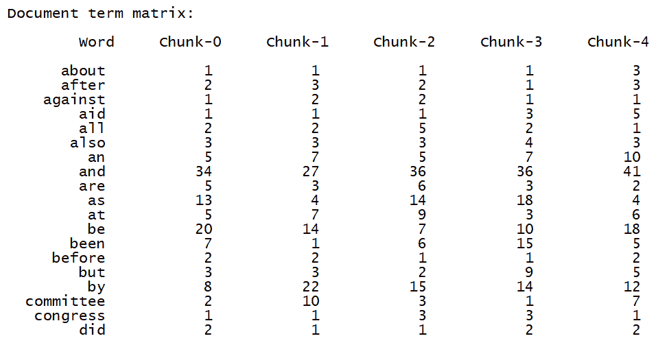

# 第七章：分析文本数据

在本章中，我们将涵盖以下食谱：

+   使用标记化进行数据预处理

+   对文本数据进行词干提取

+   使用词形还原将文本转换为基本形式

+   使用分块划分文本

+   构建词袋模型

+   构建文本分类器

+   识别名字的性别

+   分析句子的情感

+   使用主题建模在文本中识别模式

+   使用 spaCy 进行词性标注

+   使用 gensim 的 Word2Vec

+   使用浅层学习进行垃圾邮件检测

# 技术要求

为了完成本章的食谱，您需要以下文件（可在 GitHub 上找到）：

+   `tokenizer.py`

+   `stemmer.py`

+   `lemmatizer.py`

+   `chunking.py`

+   `bag_of_words.py`

+   `tfidf.py`

+   `` `gender_identification.py` ``

+   `sentiment_analysis.py`

+   `topic_modeling.py`

+   `data_topic_modeling.txt`

+   `PosTagging.py`

+   `GensimWord2Vec.py`

+   `LogiTextClassifier.py`

+   `spam.csv`

# 简介

文本分析和**自然语言处理**（NLP）是现代人工智能系统的一个基本组成部分。计算机擅长理解结构严格、变化有限的数据。然而，当我们处理非结构化、自由形式的文本时，事情开始变得困难。开发 NLP 应用具有挑战性，因为计算机很难理解其背后的概念。我们的交流方式也有很多微妙的变体，这些变体可能以方言、上下文、俚语等形式存在。

为了解决这个问题，基于机器学习的 NLP 应用被开发出来。这些算法在文本数据中检测模式，以便我们可以从中提取见解。人工智能公司大量使用 NLP 和文本分析来提供相关结果。NLP 最常见的一些应用包括搜索引擎、情感分析、主题建模、词性标注和实体识别。NLP 的目标是开发一套算法，以便我们可以用普通的英语与计算机交互。如果我们能实现这一点，那么我们就无需编程语言来指导计算机应该做什么。在本章中，我们将探讨一些专注于文本分析和如何从文本数据中提取有意义信息的食谱。

在本章中，我们将大量使用名为**自然语言工具包**（NLTK）的 Python 包。在继续之前，请确保您已经安装了它：

+   您可以在[`www.nltk.org/install.html`](http://www.nltk.org/install.html)找到安装步骤。

+   您还需要安装`NLTK Data`，它包含许多语料库和训练模型。这是文本分析的一个基本组成部分！您可以在[`www.nltk.org/data.html`](http://www.nltk.org/data.html)找到安装步骤。

# 使用标记化进行数据预处理

**分词**是将文本分割成一系列有意义的片段的过程。这些片段被称为**标记**。例如，我们可以将一大段文本分割成单词，或者将其分割成句子。根据手头的任务，我们可以定义自己的条件将输入文本分割成有意义的标记。让我们看看如何做到这一点。

# 准备工作

分词是文本计算分析的第一步，涉及将字符序列分割成称为**标记**的最小分析单位。标记包括各种文本部分类别（单词、标点、数字等），也可以是复杂单位（如日期）。在这个菜谱中，我们将展示如何将一个复杂的句子分割成许多标记。

# 如何做到这一点...

让我们看看如何使用分词进行数据预处理：

1.  创建一个新的 Python 文件并添加以下行（完整的代码在已经提供给你的`tokenizer.py`文件中）。让我们`导入`包和语料库：

```py
import nltk
nltk.download('punkt')
```

1.  让我们定义一些用于分析的样本`text`：

```py
text = "Are you curious about tokenization? Let's see how it works! We need to analyze a couple of sentences with punctuations to see it in action." 
```

1.  让我们从句子分词开始。NLTK 提供了一个句子标记器，所以让我们`导入`它：

```py
# Sentence tokenization 
from nltk.tokenize import sent_tokenize 
```

1.  在输入`text`上运行句子标记器并提取标记：

```py
sent_tokenize_list = sent_tokenize(text) 
```

1.  打印句子列表以查看是否正确工作：

```py
print("Sentence tokenizer:")
print(sent_tokenize_list) 
```

1.  单词分词在 NLP 中非常常用。NLTK 附带了几种不同的单词分词器。让我们从基本的单词分词器开始：

```py
# Create a new word tokenizer 
from nltk.tokenize import word_tokenize 

print("Word tokenizer:")
print(word_tokenize(text)) 
```

1.  如果你想要将这个标点符号分割成单独的标记，那么你需要使用`WordPunct`标记器：

```py
# Create a new WordPunct tokenizer 
from nltk.tokenize import WordPunctTokenizer 

word_punct_tokenizer = WordPunctTokenizer() 
print("Word punct tokenizer:")
print(word_punct_tokenizer.tokenize(text)) 
```

1.  如果你运行此代码，你将在你的终端上看到以下输出：

```py
Sentence tokenizer:
['Are you curious about tokenization?', "Let's see how it works!", 'We need to analyze a couple of sentences with punctuations to see it in action.']

Word tokenizer:
['Are', 'you', 'curious', 'about', 'tokenization', '?', 'Let', "'s", 'see', 'how', 'it', 'works', '!', 'We', 'need', 'to', 'analyze', 'a', 'couple', 'of', 'sentences', 'with', 'punctuations', 'to', 'see', 'it', 'in', 'action', '.']

Word punct tokenizer:
['Are', 'you', 'curious', 'about', 'tokenization', '?', 'Let', "'", 's', 'see', 'how', 'it', 'works', '!', 'We', 'need', 'to', 'analyze', 'a', 'couple', 'of', 'sentences', 'with', 'punctuations', 'to', 'see', 'it', 'in', 'action', '.']
```

# 它是如何工作的...

在这个菜谱中，我们展示了如何将一个复杂的句子分割成许多标记。为此，使用了`nltk.tokenize`包的三个方法——`sent_tokenize`、`word_tokenize`和`WordPunctTokenizer`：

+   `sent_tokenize`函数返回文本的句子标记副本，使用 NLTK 推荐的句子标记器。

+   `word_tokenize`将字符串标记化以分割除句点以外的标点符号。

+   `WordPunctTokenizer`使用正则表达式`\w+|[^\w\s]+`将文本标记化为一个由字母和非字母字符组成的序列。

# 还有更多...

分词是一个过程，根据所分析的语言，可能是一个非常复杂的任务。例如，在英语中，我们可能满足于考虑没有空格的字符序列和各种标点符号。在像日语或中文这样的语言中，其中单词不是由空格分开，而是由不同符号的组合，这可能会完全改变意义，任务也更为复杂。但一般来说，即使在单词由空格分开的语言中，也必须定义精确的标准，因为标点符号通常是模糊的。

# 参见

+   `nltk.tokenize`包的官方文档：[`www.nltk.org/api/nltk.tokenize.html`](https://www.nltk.org/api/nltk.tokenize.html)

+   *分词*（来自斯坦福大学自然语言处理组）：[`nlp.stanford.edu/IR-book/html/htmledition/tokenization-1.html`](https://nlp.stanford.edu/IR-book/html/htmledition/tokenization-1.html)

# 词干提取文本数据

当我们处理文本文档时，我们会遇到不同形式的单词。考虑单词**play**。这个单词可以以各种形式出现，如 play、plays、player、playing 等。这些都是具有相似意义的单词家族。在文本分析过程中，提取这些单词的基本形式是有用的。这将帮助我们提取一些统计数据来分析整个文本。**词干提取**的目标是将这些不同形式减少到共同的基形式。这使用启发式过程来截断单词的末尾以提取基形式。

# 准备工作

在这个菜谱中，我们将使用`nltk.stem`包，它提供了一个用于从单词中移除形态词缀的处理接口。对于不同的语言，有不同的词干提取器可用。对于英语，我们将使用`PorterStemmer`、`LancasterStemmer`和`SnowballStemmer`。

# 如何操作...

让我们看看如何词干提取文本数据：

1.  创建一个新的 Python 文件，并导入以下包（完整的代码在已经提供给你的`stemmer.py`文件中）：

```py
from nltk.stem.porter import PorterStemmer 
from nltk.stem.lancaster import LancasterStemmer 
from nltk.stem.snowball import SnowballStemmer 
```

1.  让我们定义一些用于操作的`words`，如下所示：

```py
words = ['table', 'probably', 'wolves', 'playing', 'is',  
        'dog', 'the', 'beaches', 'grounded', 'dreamt', 'envision'] 
```

1.  我们将定义一个我们想要使用的`stemmers`列表：

```py
# Compare different stemmers stemmers = ['PORTER', 'LANCASTER', 'SNOWBALL'] 
```

1.  初始化所有三个词干提取器所需的必要对象：

```py
stemmer_porter = PorterStemmer() stemmer_lancaster = LancasterStemmer() stemmer_snowball = SnowballStemmer('english') 
```

1.  为了以整洁的表格形式打印输出数据，我们需要以正确的方式对其进行格式化：

```py
formatted_row = '{:>16}' * (len(stemmers) + 1) 
print('\n', formatted_row.format('WORD', *stemmers), '\n')
```

1.  让我们遍历`words`列表，并使用以下三个词干提取器对其进行词干提取：

```py
for word in words: stemmed_words = [stemmer_porter.stem(word), stemmer_lancaster.stem(word), stemmer_snowball.stem(word)] print(formatted_row.format(word, *stemmed_words)) 
```

1.  如果你运行此代码，你将在你的终端中看到以下输出。观察 LANCASTER 词干提取器对几个单词的不同行为：


# 它是如何工作的...

所有三种词干提取算法基本上都旨在实现相同的目标。三种词干提取算法之间的区别基本上在于它们操作的严格程度。如果你观察输出，你会看到 LANCASTER 词干提取器比其他两个词干提取器更严格。PORTER 词干提取器在严格性方面是最小的，而 LANCASTER 是最严格的。从 LANCASTER 词干提取器得到的词干往往显得混乱和模糊。该算法非常快，但它会大量减少单词。因此，一个好的经验法则是使用 SNOWBALL 词干提取器。

# 还有更多...

词干提取是将单词的屈折形式还原到其词根形式的过程，称为**词干**。词干不一定对应于单词的形态学词根（词元）：通常，相关单词被映射到相同的词干就足够了，即使后者不是单词的有效词根。创建词干提取算法一直是计算机科学中的一个普遍问题。词干提取过程应用于搜索引擎的查询扩展，以及其他自然语言处理问题。

# 参见

+   波特词干提取算法的官方分发主页，由其作者马丁·波特编写和维护：[`tartarus.org/martin/PorterStemmer/`](https://tartarus.org/martin/PorterStemmer/)

+   `nltk.stem`包的官方文档：[`www.nltk.org/api/nltk.stem.html`](https://www.nltk.org/api/nltk.stem.html)

+   *词干提取*（来自维基百科）：[`en.wikipedia.org/wiki/Stemming`](https://en.wikipedia.org/wiki/Stemming)

# 使用词形还原将文本转换为它的基本形式

词形还原的目标也是将单词还原到其基本形式，但这是一种更结构化的方法。在先前的菜谱中，您看到我们使用词干提取器获得的基词实际上并没有什么意义。例如，单词 wolves 被还原为 wolv，这并不是一个真正的单词。词形还原通过使用词汇和词的形态学分析来解决这个问题。它移除了屈折词尾，如-ing 或-ed，并返回单词的基本形式。这种基本形式被称为词元。如果您对单词`wolves`进行词形还原，您将得到`wolf`作为输出。输出取决于标记是动词还是名词。

# 准备工作

在这个菜谱中，我们将使用`nltk.stem`包将单词的屈折形式还原到其规范形式，称为**词元**。

# 如何做到这一点...

让我们看看如何使用词形还原将文本转换为它的基本形式：

1.  创建一个新的 Python 文件并导入以下包（完整代码在已提供的`lemmatizer.py`文件中）：

```py
import nltk
nltk.download('wordnet')
from nltk.stem import WordNetLemmatizer 
```

1.  让我们定义与我们在词干提取过程中使用的相同的一组单词：

```py
words = ['table', 'probably', 'wolves', 'playing', 'is', 'dog', 'the', 'beaches', 'grounded', 'dreamt', 'envision'] 
```

1.  我们将比较两个词形还原器：`NOUN`和`VERB`词形还原器。让我们列出它们：

```py
# Compare different lemmatizers 
lemmatizers = ['NOUN LEMMATIZER', 'VERB LEMMATIZER'] 
```

1.  基于词形还原器`WordNet`创建对象：

```py
lemmatizer_wordnet = WordNetLemmatizer() 
```

1.  为了以表格形式打印输出，我们需要以正确的方式格式化它：

```py
formatted_row = '{:>24}' * (len(lemmatizers) + 1) 
print('\n', formatted_row.format('WORD', *lemmatizers), '\n') 
```

1.  遍历单词并对它们进行词形还原：

```py
for word in words: 
    lemmatized_words = [lemmatizer_wordnet.lemmatize(word, pos='n'), 
           lemmatizer_wordnet.lemmatize(word, pos='v')] 
    print(formatted_row.format(word, *lemmatized_words)) 
```

1.  如果您运行此代码，您将看到以下输出：


观察当词形还原器对单词进行词形还原时，`NOUN`和`VERB`词形还原器的区别，如图所示的前一个截图

# 它是如何工作的...

词形还原是将单词的屈折形式还原为其规范形式的过程，称为词元。在自然语言处理过程中，词形还原是自动确定给定单词的单词的算法过程。这个过程可能涉及其他语言处理活动，如形态学和语法分析。在许多语言中，单词以不同的屈折形式出现。规范形式与其词性的组合称为单词的**词素**。在结构词理学中，词素是构成语言词汇的最小单位。因此，每种语言的词汇可能对应于词典中的词元形式。

# 还有更多...

在 NLTK 中，对于词形还原，有`WordNet`可用，但这个资源仅限于英语语言。这是一个包含大量英语词汇的大型词汇数据库。在这个包中，名词、动词、形容词和副词被分组为认知同义词集（**synsets**），每个集合都表达一个独特概念。synsets 通过语义和词汇概念关系相互连接。通过浏览器可以导航这个显著相关的单词和概念的网络。`WordNet`根据单词的意义分组单词，不仅连接词形（字母字符串），还连接特定的单词。因此，在网络中彼此靠近的单词在语义上是区分的。此外，`WordNet`还标记单词之间的语义关系。

# 参见

+   Giuseppe Ciaburro 所著的《Keras 2.x Projects》，由 Packt Publishing 出版

+   `nltk.stem`包的官方文档：[`www.nltk.org/api/nltk.stem.html`](https://www.nltk.org/api/nltk.stem.html)

+   *词形还原*（来自维基百科）：[`en.wikipedia.org/wiki/Lemmatisation`](https://en.wikipedia.org/wiki/Lemmatisation)

# 使用块划分文本

**块划分**指的是根据任何随机条件将输入文本分割成片段。这与分词不同，因为没有任何限制，并且块不需要有任何意义。这在文本分析中非常常用。在处理大型文本文档时，最好分块进行。

# 如何做到这一点...

让我们看看如何使用块划分来划分文本：

1.  创建一个新的 Python 文件并导入以下包（完整代码在已提供的`chunking.py`文件中）：

```py
import numpy as np 
nltk.download('brown')
from nltk.corpus import brown 
```

1.  让我们定义一个函数来`split`文本成块。第一步是根据空格划分文本：

```py
# Split a text into chunks  
def splitter(data, num_words): 
    words = data.split(' ') 
    output = [] 
```

1.  初始化一些必需的变量：

```py
    cur_count = 0 
    cur_words = [] 
```

1.  让我们遍历`words`：

```py
    for word in words: 
        cur_words.append(word) 
        cur_count += 1 
```

1.  一旦达到所需的单词数量，重置变量：

```py
        if cur_count == num_words: 
            output.append(' '.join(cur_words)) 
            cur_words = [] 
            cur_count = 0 
```

1.  将块追加到`output`变量中，并返回它：

```py
    output.append(' '.join(cur_words) ) 

    return output 
```

1.  我们现在可以定义主函数。从`brown`语料库加载数据。我们将使用前 10,000 个单词：

```py
if __name__=='__main__': 
    # Read the data from the Brown corpus 
    data = ' '.join(brown.words()[:10000]) 
```

1.  定义每个块中的单词数量：

```py
    # Number of words in each chunk  
    num_words = 1700 
```

1.  初始化一些相关变量：

```py
    chunks = [] 
    counter = 0 
```

1.  在此文本 `data` 上调用 `splitter` 函数并打印输出：

```py
    text_chunks = splitter(data, num_words) 

    print("Number of text chunks =", len(text_chunks)) 
```

1.  如果你运行此代码，你将在终端中看到生成的分块数量被打印出来：

```py
Number of text chunks = 6
```

# 它是如何工作的...

分块（也称为**浅层解析**）是对一个命题的分析，该命题由一个主语和一个谓语以简单形式构成。主语通常是名词短语，而谓语是由一个动词和零个或多个补语及副词构成的动词短语。一个分块由一个或多个相邻的标记组成。

对于分块问题有众多方法。例如，在指定的任务中，一个分块被表示为一个由方括号分隔的词组，其中有一个表示分块类型的标签。所使用的数据集是从给定的语料库中提取与期刊文章相关的部分，并从语料库的句法树中提取信息块得到的。

# 还有更多...

布朗大学当代美国英语标准语料库（或简称 `brown` 语料库）是由亨利·库切拉（Henry Kucera）和 W. Nelson Francis 在 1960 年代在罗德岛普罗维登斯的布朗大学编制的语料库。它包含 500 个英文文本摘录，这些文本摘录来自 1961 年在美国出版的作品，总共有大约一百万个单词。

# 参考以下内容

+   `nltk.corpus` 包的官方文档：[`www.nltk.org/api/nltk.corpus.html`](https://www.nltk.org/api/nltk.corpus.html)

+   *自然语言处理基础*（来自萨格勒布大学）：[`www.fer.unizg.hr/_download/repository/TAR-02-NLP.pdf`](https://www.fer.unizg.hr/_download/repository/TAR-02-NLP.pdf)

# 构建词袋模型

当涉及到处理由数百万个单词组成的文本文档时，将它们转换为数值表示是必要的。这样做的原因是为了使它们能够用于机器学习算法。这些算法需要数值数据以便分析并输出有意义的信息。这就是**词袋**方法出现的地方。这基本上是一个从所有文档中的所有单词中学习词汇的模型。它通过构建文档中所有单词的直方图来对每个文档进行建模。

# 准备工作

在这个菜谱中，我们将使用 `sklearn.feature_extraction.text` 包构建一个词袋模型来提取文档词矩阵。

# 如何实现...

让我们看看如何构建一个词袋模型，如下所示：

1.  创建一个新的 Python 文件并导入以下包（完整的代码已在提供的 `bag_of_words.py` 文件中）：

```py
import numpy as np 
from nltk.corpus import brown 
from chunking import splitter 
```

1.  让我们定义 `main` 函数。从 `brown` 语料库中加载输入 `data`：

```py
if __name__=='__main__': 
    # Read the data from the Brown corpus 
    data = ' '.join(brown.words()[:10000]) 
```

1.  将文本数据分为五个分块：

```py
    # Number of words in each chunk  
    num_words = 2000 

    chunks = [] 
    counter = 0 

    text_chunks = splitter(data, num_words) 
```

1.  创建一个基于以下文本分块的字典：

```py
    for text in text_chunks: 
        chunk = {'index': counter, 'text': text} 
        chunks.append(chunk) 
        counter += 1 
```

1.  下一步是提取文档词矩阵。这基本上是一个矩阵，它计算文档中每个单词的出现次数。我们将使用`scikit-learn`来完成这项任务，因为它在这方面比 NLTK 有更好的支持。导入以下包：

```py
    # Extract document term matrix 
    from sklearn.feature_extraction.text import CountVectorizer 
```

1.  定义对象并提取文档词矩阵：

```py
    vectorizer = CountVectorizer(min_df=5, max_df=.95) 
    doc_term_matrix = vectorizer.fit_transform([chunk['text'] for chunk in chunks]) 
```

1.  从`vectorizer`对象中提取词汇并打印：

```py
    vocab = np.array(vectorizer.get_feature_names()) 
    print("Vocabulary:")
    print(vocab)
```

1.  打印`文档词矩阵`：

```py
    print("Document term matrix:") 
    chunk_names = ['Chunk-0', 'Chunk-1', 'Chunk-2', 'Chunk-3', 'Chunk-4'] 
```

1.  要以表格形式打印它，你需要按以下方式格式化：

```py
    formatted_row = '{:>12}' * (len(chunk_names) + 1) 
    print('\n', formatted_row.format('Word', *chunk_names), '\n') 
```

1.  遍历单词并打印每个单词在不同片段中出现的次数：

```py
    for word, item in zip(vocab, doc_term_matrix.T): 
        # 'item' is a 'csr_matrix' data structure 
        output = [str(x) for x in item.data] 
        print(formatted_row.format(word, *output)) 
```

1.  如果你运行此代码，你将在终端中看到两个主要输出。第一个输出是词汇表，如下面的截图所示：

```py
Vocabulary:
['about' 'after' 'against' 'aid' 'all' 'also' 'an' 'and' 'are' 'as' 'at'
 'be' 'been' 'before' 'but' 'by' 'committee' 'congress' 'did' 'each'
 'education' 'first' 'for' 'from' 'general' 'had' 'has' 'have' 'he'
 'health' 'his' 'house' 'in' 'increase' 'is' 'it' 'last' 'made' 'make'
 'may' 'more' 'no' 'not' 'of' 'on' 'one' 'only' 'or' 'other' 'out' 'over'
 'pay' 'program' 'proposed' 'said' 'similar' 'state' 'such' 'take' 'than'
 'that' 'the' 'them' 'there' 'they' 'this' 'time' 'to' 'two' 'under' 'up'
 'was' 'were' 'what' 'which' 'who' 'will' 'with' 'would' 'year' 'years']
```

1.  第二件事是文档词矩阵，它相当长。前几行看起来如下：



# 它是如何工作的...

考虑以下句子：

+   **句子 1**: 褐色的狗正在跑步。

+   **句子 2**: 黑色的狗在黑色的房间里。

+   **句子 3**: 在房间里跑步是禁止的。

如果你考虑这三个句子，你将拥有以下九个独特的单词：

+   the

+   brown

+   dog

+   is

+   running

+   black

+   in

+   room

+   forbidden

现在，让我们将每个句子转换成直方图，使用每个句子中单词的数量。每个特征向量将是九维的，因为我们有九个独特的单词：

+   **句子 1**: [1, 1, 1, 1, 1, 0, 0, 0, 0]

+   **句子 2**: [2, 0, 1, 1, 0, 2, 1, 1, 0]

+   **句子 3**: [0, 0, 0, 1, 1, 0, 1, 1, 1]

一旦我们提取了这些特征向量，我们可以使用机器学习算法来分析它们。

# 更多内容...

词袋模型是一种在信息检索和自然语言处理中用于通过忽略词序来表示文档的方法。在这个模型中，每个文档被认为包含单词，类似于证券交易所；这允许基于列表管理这些单词，其中每个股票包含列表中的某些单词。

# 相关内容

+   `sklearn.feature_extraction.text.CountVectorizer()`函数的官方文档：[`scikit-learn.org/stable/modules/generated/sklearn.feature_extraction.text.CountVectorizer.html`](https://scikit-learn.org/stable/modules/generated/sklearn.feature_extraction.text.CountVectorizer.html)

+   *词袋模型*（来自维基百科）：[`en.wikipedia.org/wiki/Bag-of-words_model`](https://en.wikipedia.org/wiki/Bag-of-words_model)

# 构建文本分类器

文本分类的主要目的是将文本文档分类到不同的类别中。这是 NLP 中的一个重要分析技术。我们将使用一种基于**tf-idf**统计方法的技巧，它代表**词频**-**逆文档频率**。这是一个分析工具，帮助我们了解一个词在文档集中的重要性。这作为了一个用于分类文档的特征向量。

# 准备工作

在这个菜谱中，我们将使用词频-逆文档频率方法来评估一个词在集合或语料库中对于一个文档的重要性，并构建一个文本分类器。

# 如何操作...

让我们看看如何构建一个文本分类器：

1.  创建一个新的 Python 文件并导入以下包（完整的代码在已经提供给你的`tfidf.py`文件中）：

```py
from sklearn.datasets import fetch_20newsgroups 
```

1.  让我们选择一个类别列表并使用字典映射命名它们。这些类别是我们刚刚导入的新闻组数据集的一部分：

```py
category_map = {'misc.forsale': 'Sales', 'rec.motorcycles': 'Motorcycles', 
 'rec.sport.baseball': 'Baseball', 'sci.crypt': 'Cryptography', 
 'sci.space': 'Space'}
```

1.  根据我们刚刚定义的类别加载训练数据：

```py
training_data = fetch_20newsgroups(subset='train',  
        categories=category_map.keys(), shuffle=True, random_state=7) 
```

1.  导入特征提取器：

```py
# Feature extraction 
from sklearn.feature_extraction.text import CountVectorizer 
```

1.  使用训练数据提取特征：

```py
vectorizer = CountVectorizer() X_train_termcounts = vectorizer.fit_transform(training_data.data) print("Dimensions of training data:", X_train_termcounts.shape)
```

1.  我们现在准备好训练分类器了。我们将使用多项式朴素贝叶斯分类器：

```py
# Training a classifier 
from sklearn.naive_bayes import MultinomialNB 
from sklearn.feature_extraction.text import TfidfTransformer 
```

1.  定义几个随机的输入句子：

```py
input_data = [ "The curveballs of right handed pitchers tend to curve to the left", "Caesar cipher is an ancient form of encryption", "This two-wheeler is really good on slippery roads" 
] 
```

1.  定义`tfidf_transformer`对象并对其进行训练：

```py
# tf-idf transformer 
tfidf_transformer = TfidfTransformer() 
X_train_tfidf = tfidf_transformer.fit_transform(X_train_termcounts) 
```

1.  一旦我们有了特征向量，就使用这些数据训练多项式朴素贝叶斯分类器：

```py
# Multinomial Naive Bayes classifier 
classifier = MultinomialNB().fit(X_train_tfidf, training_data.target) 
```

1.  使用词频转换输入数据：

```py
X_input_termcounts = vectorizer.transform(input_data) 
```

1.  使用`tfidf_transformer`模块转换输入数据：

```py
X_input_tfidf = tfidf_transformer.transform(X_input_termcounts) 
```

1.  使用训练好的分类器预测这些输入句子的输出类别：

```py
# Predict the output categories 
predicted_categories = classifier.predict(X_input_tfidf) 
```

1.  按照以下方式打印输出：

```py
# Print the outputs 
for sentence, category in zip(input_data, predicted_categories): 
    print('\nInput:', sentence, '\nPredicted category:', \
            category_map[training_data.target_names[category]])
```

1.  如果你运行此代码，你将在你的终端中看到以下输出：

```py
Dimensions of training data: (2968, 40605)

Input: The curveballs of right handed pitchers tend to curve to the left 
Predicted category: Baseball

Input: Caesar cipher is an ancient form of encryption 
Predicted category: Cryptography

Input: This two-wheeler is really good on slippery roads 
Predicted category: Motorcycles
```

# 它是如何工作的...

tf-idf 技术常用于信息检索。目标是理解文档中每个词的重要性。我们想要识别在文档中多次出现的词。同时，像**is**和**be**这样的常见词并不能真正反映内容的本质。因此，我们需要提取真正的指示词。每个词的重要性随着计数的增加而增加。同时，随着它出现的频率增加，这个词的频率也会增加。这两者往往相互平衡。我们从每个句子中提取词频。一旦我们将其转换为特征向量，我们就可以训练分类器来对这些句子进行分类。

**词频**（**TF**）衡量一个词在给定文档中出现的频率。由于多个文档的长度不同，直方图中的数字往往变化很大。因此，我们需要对其进行归一化，以便使其成为公平的竞争环境。为了实现归一化，我们可以将词频除以给定文档中的总词数。**逆文档频率**（**IDF**）衡量一个给定词的重要性。当我们计算 TF 时，所有词都被视为同等重要。为了平衡常见词的频率，我们需要降低它们的权重并放大罕见词。我们需要计算包含给定词的文档数量与总文档数量的比率，然后除以总文档数量。IDF 是通过取该比率的负算法来计算的。

# 还有更多...

简单的词，如**is**或**the**，在各种文档中出现的频率很高。然而，这并不意味着我们可以根据这些词来表征文档。同时，如果一个词只出现一次，那么它也没有用。因此，我们寻找出现次数较多但不会造成噪声的词。这被公式化为 tf-idf 技术，并用于分类文档。搜索引擎经常使用这个工具按相关性排序搜索结果。

# 参见

+   参考官方文档中的`sklearn.feature_extraction.text.TfidfTransformer()`函数：[`scikit-learn.org/stable/modules/generated/sklearn.feature_extraction.text.TfidfTransformer.html`](https://scikit-learn.org/stable/modules/generated/sklearn.feature_extraction.text.TfidfTransformer.html)

+   参考以下页面：*什么是 tf-idf？*：[`www.tfidf.com/`](http://www.tfidf.com/)

# 识别姓名的性别

识别姓名的性别是 NLP 中的一个有趣任务。我们将使用启发式方法，即姓名的最后几个字符是其定义特征。例如，如果姓名以**la**结尾，那么它很可能是女性姓名，如 Angela 或 Layla。另一方面，如果姓名以**im**结尾，那么它很可能是男性姓名，如 Tim 或 Jim。由于我们不确定要使用确切多少个字符，我们将进行实验。

# 准备工作

在这个菜谱中，我们将使用名称语料库提取标记的名称，然后我们将根据名称的最后一部分来分类性别。

# 如何实现...

让我们看看如何识别性别：

1.  创建一个新的 Python 文件并导入以下包（完整的代码在已经提供给你的`gender_identification.py`文件中）：

```py
import nltk
nltk.download('names')

import random from nltk.corpus import names from nltk import NaiveBayesClassifier from nltk.classify import accuracy as nltk_accuracy 
```

1.  我们需要定义一个函数来从输入词中提取特征：

```py
# Extract features from the input word def gender_features(word, num_letters=2): return {'feature': word[-num_letters:].lower()} 
```

1.  让我们定义主函数。我们需要一些标记的训练数据：

```py
if __name__=='__main__': 
    # Extract labeled names 
    labeled_names = ([(name, 'male') for name in names.words('male.txt')] + 
            [(name, 'female') for name in names.words('female.txt')]) 
```

1.  初始化随机数生成器并打乱训练数据：

```py
    random.seed(7) 
    random.shuffle(labeled_names) 
```

1.  定义一些输入名称进行实验：

```py
    input_names = ['Leonardo', 'Amy', 'Sam'] 
```

1.  由于我们不知道需要考虑多少个结尾字符，我们将从 `1` 到 `5` 扫描参数空间。每次，我们将提取以下特征：

```py
    # Sweeping the parameter space 
    for i in range(1, 5): 
        print('\nNumber of letters:', i) 
        featuresets = [(gender_features(n, i), gender) for (n, gender) in labeled_names] 
```

1.  将其分为训练集和测试集：

```py
        train_set, test_set = featuresets[500:], featuresets[:500] 
```

1.  我们将使用朴素贝叶斯分类器来完成这项工作：

```py
        classifier = NaiveBayesClassifier.train(train_set) 
```

1.  对参数空间中的每个值评估 `classifier` 模型：

```py
        # Print classifier accuracy 
        print('Accuracy ==>', str(100 * nltk_accuracy(classifier, test_set)) + str('%')) 

# Predict outputs for new inputs 
        for name in input_names: 
            print(name, '==>', classifier.classify(gender_features(name, i))) 
```

1.  如果你运行此代码，你将在你的终端中看到以下输出：

```py
Number of letters: 1
Accuracy ==> 76.2%
Leonardo ==> male
Amy ==> female
Sam ==> male

Number of letters: 2
Accuracy ==> 78.6%
Leonardo ==> male
Amy ==> female
Sam ==> male

Number of letters: 3
Accuracy ==> 76.6%
Leonardo ==> male
Amy ==> female
Sam ==> female

Number of letters: 4
Accuracy ==> 70.8%
Leonardo ==> male
Amy ==> female
Sam ==> female
```

# 它是如何工作的...

在这个菜谱中，我们使用了语料库的名称来提取标记的名称，然后根据名称的最后一部分对性别进行分类。朴素贝叶斯分类器是一种监督学习分类器，它使用贝叶斯定理来构建模型。这个主题在第二章的*构建朴素贝叶斯分类器*菜谱中有所涉及，即*构建分类器*。

# 更多内容...

贝叶斯分类器被称为朴素，因为它天真地假设在感兴趣的特定类别中，某个特定特征的呈现或缺失与其他特征的呈现或缺失无关，这极大地简化了计算。让我们继续构建朴素贝叶斯分类器。

# 相关内容

+   第二章*，构建分类器*

+   *《Keras 2.x 项目》* 由 Giuseppe Ciaburro 编著，来自 Packt Publishing

+   `nltk.classify` 包的官方文档：[`www.nltk.org/api/nltk.classify.html?highlight=naivebayesclassifier`](http://www.nltk.org/api/nltk.classify.html?highlight=naivebayesclassifier)

+   *贝叶斯定理*（来自斯坦福哲学百科全书）：[`plato.stanford.edu/entries/bayes-theorem/`](https://plato.stanford.edu/entries/bayes-theorem/)

# 分析句子的情感

**情感分析**是自然语言处理中最受欢迎的应用之一。情感分析是指确定给定文本是正面还是负面的过程。在某些变体中，我们将中性视为第三个选项。这项技术通常用于发现人们对特定主题的看法。这用于分析各种形式中用户的情感，如营销活动、社交媒体、电子商务等。

# 准备工作

在这个菜谱中，我们将通过使用 `movie_reviews` 语料库中的数据，使用朴素贝叶斯分类器来分析句子的情感。

# 如何做到这一点...

让我们看看如何分析句子的情感：

1.  创建一个新的 Python 文件并导入以下包（完整的代码在已经提供给你的 `sentiment_analysis.py` 文件中）：

```py
import nltk.classify.util 
from nltk.classify import NaiveBayesClassifier 
from nltk.corpus import movie_reviews 
```

1.  定义一个提取特征的功能：

```py
def extract_features(word_list): 
    return dict([(word, True) for word in word_list]) 
```

1.  我们需要为此准备训练数据，因此我们将使用 NLTK 中的电影评论：

```py
if __name__=='__main__': 
    # Load positive and negative reviews   
    positive_fileids = movie_reviews.fileids('pos') 
    negative_fileids = movie_reviews.fileids('neg') 
```

1.  让我们将它们分为正面和负面评论：

```py
    features_positive = [(extract_features(movie_reviews.words(fileids=[f])),  
            'Positive') for f in positive_fileids] 
    features_negative = [(extract_features(movie_reviews.words(fileids=[f])),  
            'Negative') for f in negative_fileids] 
```

1.  将数据分为训练集和测试集：

```py
    # Split the data into train and test (80/20) 
    threshold_factor = 0.8 
    threshold_positive = int(threshold_factor * len(features_positive)) 
    threshold_negative = int(threshold_factor * len(features_negative)) 
```

1.  提取特征：

```py
    features_train = features_positive[:threshold_positive] + features_negative[:threshold_negative] 
    features_test = features_positive[threshold_positive:] + features_negative[threshold_negative:]   
    print("Number of training datapoints:", len(features_train))
    print("Number of test datapoints:", len(features_test))
```

1.  我们将使用一个 `NaiveBayesClassifier`。定义对象并对其进行训练：

```py
    # Train a Naive Bayes classifier 
    classifier = NaiveBayesClassifier.train(features_train) 
    print("Accuracy of the classifier:", nltk.classify.util.accuracy(classifier, features_test))
```

1.  `classifier` 对象包含了它在分析过程中获得的最具信息量的单词。这些单词基本上在将评论分类为正面或负面评论方面具有很大的影响力。让我们把它们打印出来：

```py
    print("Top 10 most informative words:")
    for item in classifier.most_informative_features()[:10]:
        print(item[0])
```

1.  创建几个随机的输入句子：

```py
    # Sample input reviews 
    input_reviews = [ 
        "It is an amazing movie",  
        "This is a dull movie. I would never recommend it to anyone.", 
        "The cinematography is pretty great in this movie",  
        "The direction was terrible and the story was all over the place"  
    ] 
```

1.  在这些输入句子上运行分类器并获取预测：

```py
    print("Predictions:") 
    for review in input_reviews: 
        print("Review:", review) 
        probdist = classifier.prob_classify(extract_features(review.split())) 
        pred_sentiment = probdist.max() 
```

1.  打印输出：

```py
        print("Predicted sentiment:", pred_sentiment) 
        print("Probability:", round(probdist.prob(pred_sentiment), 2))
```

1.  如果你运行此代码，你将在终端中看到三个主要输出。第一个是准确性，如下面的代码片段所示：

```py
Number of training datapoints: 1600
Number of test datapoints: 400
Accuracy of the classifier: 0.735
```

1.  下一个项目是最具信息量的单词列表：

```py
Top 10 most informative words:

outstanding
insulting
vulnerable
ludicrous
uninvolving
astounding
avoids
fascination
seagal
anna
```

1.  最后一个项目是预测列表，这些预测基于输入句子：

```py
Predictions:

Review: It is an amazing movie
Predicted sentiment: Positive
Probability: 0.61

Review: This is a dull movie. I would never recommend it to anyone.
Predicted sentiment: Negative
Probability: 0.77

Review: The cinematography is pretty great in this movie
Predicted sentiment: Positive
Probability: 0.67

Review: The direction was terrible and the story was all over the place
Predicted sentiment: Negative
Probability: 0.63
```

# 工作原理...

在这里，我们使用了 NLTK 的朴素贝叶斯分类器。在特征提取函数中，我们基本上提取了所有唯一的单词。然而，NLTK 分类器需要数据以字典的形式排列。因此，我们以这种方式排列它，以便 NLTK `classifier` 对象可以接受它。一旦我们将数据分为训练集和测试集，我们就训练了分类器，以将句子分类为正面或负面。

如果你查看最具信息量的单词，你可以看到我们有诸如“杰出”这样的词来表示正面评论，以及诸如“侮辱”这样的词来表示负面评论。这是有趣的信息，因为它告诉我们哪些单词被用来表示强烈的反应。

# 更多内容...

情感分析这个术语指的是使用 NLP 技术、文本分析和计算语言学在书面或口语文本来源中查找信息。如果从大量数据中提取这种主观信息，并且因此从大量人群的意见中提取，情感分析也可以称为**意见挖掘**。

# 相关内容

+   `nltk.corpus` 包的官方文档：[`www.nltk.org/api/nltk.corpus.html`](https://www.nltk.org/api/nltk.corpus.html)

+   `nltk.classify` 包的官方文档：[`www.nltk.org/api/nltk.classify.html?highlight=naivebayesclassifier`](http://www.nltk.org/api/nltk.classify.html?highlight=naivebayesclassifier)

+   *情感分析*（来自斯坦福大学）：[`web.stanford.edu/class/cs124/lec/sentiment.pdf`](https://web.stanford.edu/class/cs124/lec/sentiment.pdf)

# 使用主题建模在文本中识别模式

**主题建模**指的是在文本数据中识别隐藏模式的过程。目标是揭示一组文档中的隐藏主题结构。这将帮助我们更好地组织文档，以便我们可以用于分析。这是 NLP 研究的一个活跃领域。

# 准备工作

在这个菜谱中，我们将使用名为`gensim`的库，通过主题建模来识别文本中的模式。

# 如何操作...

让我们看看如何通过主题建模来识别文本中的模式：

1.  创建一个新的 Python 文件，并导入以下包（完整的代码在已经提供给你的 `topic_modeling.py` 文件中）：

```py
from nltk.tokenize import RegexpTokenizer   
from nltk.stem.snowball import SnowballStemmer 
from gensim import models, corpora 
from nltk.corpus import stopwords 
```

1.  定义一个函数来加载数据。我们将使用你已提供的`data_topic_modeling.txt`文本文件：

```py
# Load input data 
def load_data(input_file): 
    data = [] 
    with open(input_file, 'r') as f: 
        for line in f.readlines(): 
            data.append(line[:-1]) 

    return data 
```

1.  让我们定义一个`class`来预处理文本。这个预处理器将负责创建所需的对象并从输入文本中提取相关特征：

```py
# Class to preprocess text 
class Preprocessor(object): 
    # Initialize various operators 
    def __init__(self): 
        # Create a regular expression tokenizer 
        self.tokenizer = RegexpTokenizer(r'\w+') 
```

1.  我们需要一个停用词列表，这样我们就可以从分析中排除它们。这些是常见的词，如**in**、**the**、**is**等等：

```py
        # get the list of stop words  
        self.stop_words_english = stopwords.words('english') 
```

1.  定义`SnowballStemmer`模块：

```py
        # Create a Snowball stemmer  
        self.stemmer = SnowballStemmer('english') 
```

1.  定义一个处理函数，该函数负责分词、去除停用词和词干提取：

```py
    # Tokenizing, stop word removal, and stemming 
    def process(self, input_text): 
        # Tokenize the string 
        tokens = self.tokenizer.tokenize(input_text.lower()) 
```

1.  从文本中去除停用词：

```py
        # Remove the stop words  
        tokens_stopwords = [x for x in tokens if not x in self.stop_words_english] 
```

1.  对标记执行词干提取：

```py
        # Perform stemming on the tokens  
        tokens_stemmed = [self.stemmer.stem(x) for x in tokens_stopwords] 
```

1.  返回处理后的标记：

```py
        return tokens_stemmed 
```

1.  现在我们已经准备好定义主函数。从文本文件中加载数据：

```py
if __name__=='__main__': 
    # File containing linewise input data  
    input_file = 'data_topic_modeling.txt' 

    # Load data 
    data = load_data(input_file) 
```

1.  定义一个基于我们定义的类的对象：

```py
    # Create a preprocessor object 
    preprocessor = Preprocessor() 
```

1.  我们需要处理文件中的文本并提取处理后的标记：

```py
    # Create a list for processed documents 
    processed_tokens = [preprocessor.process(x) for x in data] 
```

1.  创建一个基于分词文档的字典，以便它可以用于主题建模：

```py
    # Create a dictionary based on the tokenized documents 
    dict_tokens = corpora.Dictionary(processed_tokens) 
```

1.  我们需要使用处理后的标记创建文档-词矩阵，如下所示：

```py
    # Create a document term matrix 
    corpus = [dict_tokens.doc2bow(text) for text in processed_tokens] 
```

1.  假设我们知道文本可以分为两个主题。我们将使用一种称为**潜在狄利克雷分配**（**LDA**）的主题建模技术。定义所需的参数并初始化`LdaModel`对象：

```py
    # Generate the LDA model based on the corpus we just created 
    num_topics = 2 
    num_words = 4 

    ldamodel = models.ldamodel.LdaModel(corpus,  
            num_topics=num_topics, id2word=dict_tokens, passes=25) 
```

1.  一旦它识别出两个主题，我们可以通过查看最有贡献的单词来看到它是如何区分这两个主题的：

```py
    print("Most contributing words to the topics:")
    for item in ldamodel.print_topics(num_topics=num_topics, num_words=num_words):
        print ("Topic", item[0], "==>", item[1])
```

1.  完整的代码在`topic_modeling.py`文件中。如果你运行此代码，你将在你的终端看到以下输出：

```py
Most contributing words to the topics:
Topic 0 ==> 0.057*"need" + 0.034*"order" + 0.034*"work" + 0.034*"modern"
Topic 1 ==> 0.057*"need" + 0.034*"train" + 0.034*"club" + 0.034*"develop"
```

# 它是如何工作的...

**主题建模**通过识别文档中的重要单词或主题来工作。这些单词往往决定了主题的内容。我们使用正则表达式分词器，因为我们只想得到单词，而不想得到任何标点符号或其他类型的标记。因此，我们使用它来提取标记。去除停用词是另一个重要步骤，因为这有助于我们消除由**is**或**the**等词引起的噪声。之后，我们需要对单词进行词干提取以得到它们的基形式。整个流程被包装为文本分析工具中的预处理块。这正是我们在做的事情！

我们使用一种称为 LDA 的技术来建模主题。LDA 基本上将文档表示为不同主题的混合，这些主题倾向于产生单词。这些单词以一定的概率产生。目标是找到这些主题！这是一个生成模型，试图找到负责生成给定文档集的主题集。

# 还有更多...

如您从输出中看到的，我们有诸如 talent 和 train 这样的词来表征体育主题，而我们有 encrypt 来表征密码学主题。我们正在处理一个非常小的文本文件，这就是为什么一些词可能看起来不太相关。显然，如果你处理更大的数据集，准确性将会提高。

# 参考以下内容

+   `gensim`库的官方文档：[`radimrehurek.com/gensim/install.html`](https://radimrehurek.com/gensim/install.html)

+   *潜在狄利克雷分配简介*（来自麻省理工学院）: [`blog.echen.me/2011/08/22/introduction-to-latent-dirichlet-allocation/`](http://blog.echen.me/2011/08/22/introduction-to-latent-dirichlet-allocation/)

+   *主题建模*（来自哥伦比亚大学）: [`www.cs.columbia.edu/~blei/topicmodeling.html`](http://www.cs.columbia.edu/~blei/topicmodeling.html)

# 使用 spaCy 进行词性标注

**词性标注**（**PoS tagging**）是指为与特定词汇类别相对应的单词进行标记的过程。常见的语言类别包括名词、动词、形容词、冠词、代词、副词、连词等等。

# 准备工作

在这个菜谱中，我们将使用名为`spacy`的库来进行词性标注。

# 如何操作...

让我们看看如何使用`spacy`进行词性标注：

1.  创建一个新的 Python 文件并导入以下包（完整的代码在已经提供给你的`PosTagging.py`文件中）：

```py
import spacy
```

1.  加载`en_core_web_sm`模型：

```py
nlp = spacy.load('en_core_web_sm')
```

1.  让我们定义一个输入文本：

```py
 Text = nlp(u'We catched fish, and talked, and we took a swim now and then to keep off sleepiness')
```

作为来源，我使用了基于马克·吐温的小说《哈克贝利·费恩历险记》的一段文字。

1.  最后，我们将进行词性标注：

```py
for token in Text:
    print(token.text, token.lemma_, token.pos_, token.tag_, token.dep_,
          token.shape_, token.is_alpha, token.is_stop) 
```

1.  以下结果被返回：

```py
We -PRON- PRON PRP nsubj Xx True False
catched catch VERB VBD ROOT xxxx True False
fish fish NOUN NN dobj xxxx True False
, , PUNCT , punct , False False
and and CCONJ CC cc xxx True True
talked talk VERB VBD conj xxxx True False
, , PUNCT , punct , False False
and and CCONJ CC cc xxx True True
we -PRON- PRON PRP nsubj xx True True
took take VERB VBD conj xxxx True False
a a DET DT det x True True
swim swim NOUN NN dobj xxxx True False
now now ADV RB advmod xxx True True
and and CCONJ CC cc xxx True True
then then ADV RB advmod xxxx True True
to to PART TO aux xx True True
keep keep VERB VB conj xxxx True True
off off PART RP prt xxx True True
sleepiness sleepiness NOUN NN dobj xxxx True False
```

# 它是如何工作的...

词性标注涉及为文档/语料库中的每个单词分配一个标签。所使用的标签集的选择取决于语言。输入是一个单词字符串和要使用的标签集，输出是每个单词与最佳标签的关联。一个单词可能有多个兼容的标签（**歧义**）。词性标注器的任务是通过对单词所在上下文中的最合适的标签进行选择来解决这些歧义。

# 还有更多...

为了进行词性标注，我们使用了`spacy`库。这个库可以提取语言特征，例如词性标注、依存标签和命名实体，并自定义分词器以及与基于规则的匹配器协同工作。

要安装`en_core_web_sm`模型，请使用以下代码：

```py
$ python -m spacy download en
```

# 相关内容

+   `spacy`库的官方文档：[`spacy.io/usage/linguistic-features`](https://spacy.io/usage/linguistic-features)

+   *词性标注*（来自纽约大学）: [`cs.nyu.edu/courses/fall16/CSCI-UA.0480-006/lecture4-hmm.pdf`](https://cs.nyu.edu/courses/fall16/CSCI-UA.0480-006/lecture4-hmm.pdf)

# 使用 gensim 进行 Word2Vec

**词嵌入**使我们能够记住单词的语义和句法信息，从未知语料库开始，构建一个向量空间，其中单词的向量在相同的语言环境中出现时更接近，也就是说，如果它们被识别为语义相似。Word2Vec 是一组用于生成词嵌入的模板；该包最初由 Tomas Mikolov 用 C 语言编写，后来在 Python 和 Java 中实现。

# 准备工作

在这个菜谱中，我们将使用 `gensim` 库构建 Word2Vec 模型。

# 如何操作...

让我们看看如何使用 `gensim` 进行词嵌入：

1.  创建一个新的 Python 文件并导入以下包（完整的代码在您已经提供的 `GensimWord2Vec.py` 文件中）：

```py
import gensim
from nltk.corpus import abc
```

1.  基于 Word2Vec 方法构建模型：

```py
model= gensim.models.Word2Vec(abc.sents())
```

1.  让我们从数据中提取词汇并将其放入一个 `list`：

```py
 X= list(model.wv.vocab)
```

1.  现在，我们将找到与单词 `'science'` 的相似性：

```py
data=model.wv.most_similar('science')
```

1.  最后，我们将 `print` `data`：

```py
print(data)
```

将返回以下结果：

```py
[('law', 0.938495397567749), ('general', 0.9232532382011414), ('policy', 0.9198083877563477), ('agriculture', 0.918685793876648), ('media', 0.9151924252510071), ('discussion', 0.9143469929695129), ('practice', 0.9138249754905701), ('reservoir', 0.9102856516838074), ('board', 0.9069126844406128), ('tight', 0.9067160487174988)]
```

# 工作原理...

Word2Vec 是一个简单的双层人工神经网络，旨在处理自然语言；该算法需要输入语料库并返回一组向量，这些向量代表文本中单词的语义分布。对于语料库中包含的每个单词，以唯一的方式构建一个向量，以在创建的多维空间中表示它作为一个点。在这个空间中，如果单词被识别为语义上更相似，它们将更接近。

# 更多内容...

在这个菜谱中，我们使用了澳大利亚国家语料库（`abc`），这是一个优秀的语言数据集合，包括基于文本和数字的数据。要使用这个语料库，您必须使用以下代码下载它：

```py
import nltk
nltk.download('abc')
```

# 相关内容

+   `gensim` 库的官方文档：[`radimrehurek.com/gensim/`](https://radimrehurek.com/gensim/)

+   *Word2vec*（来自维基百科）：[`en.wikipedia.org/wiki/Word2vec`](https://en.wikipedia.org/wiki/Word2vec)

# 浅层学习用于垃圾邮件检测

**垃圾邮件**意味着发送大量不受欢迎的消息（通常是商业性质的）。它可以通过任何媒介实现，但最常用的媒介是电子邮件和短信。垃圾邮件的主要目的是广告，从最常见的商业优惠到非法材料的销售提议，如盗版软件和处方药，以及从可疑的金融项目到真正的欺诈尝试。

# 准备工作

在这个菜谱中，我们将使用逻辑回归模型进行垃圾邮件检测。为此，将使用为手机垃圾邮件研究收集的标记短信消息集合。这个数据集包含 5,574 条真实的非编码英语消息，根据它们是否合法（`ham`）或垃圾邮件（`spam`）进行标记。

# 如何操作...

让我们看看如何进行浅层学习垃圾邮件检测：

1.  创建一个新的 Python 文件并导入以下包（完整的代码在您已经提供的 `LogiTextClassifier.py` 文件中）：

```py
import pandas as pd
from sklearn.feature_extraction.text import TfidfVectorizer
from sklearn.linear_model.logistic import LogisticRegression
from sklearn.model_selection import train_test_split
```

1.  加载您提供的 `spam.csv` 文件：

```py
df = pd.read_csv('spam.csv', sep=',',header=None, encoding='latin-1')
```

1.  让我们提取用于训练和测试的数据：

```py
X_train_raw, X_test_raw, y_train, y_test = train_test_split(df[1],df[0])
```

1.  我们需要将 DataFrame 中包含的文本数据 `vectorize`：

```py
vectorizer = TfidfVectorizer()
X_train = vectorizer.fit_transform(X_train_raw)
```

1.  我们现在可以构建逻辑回归模型：

```py
classifier = LogisticRegression(solver='lbfgs', multi_class='multinomial')
classifier.fit(X_train, y_train)
```

1.  定义两个短信消息作为测试数据：

```py
X_test = vectorizer.transform( ['Customer Loyalty Offer:The NEW Nokia6650 Mobile from ONLY å£10 at TXTAUCTION!', 'Hi Dear how long have we not heard.'] )
```

1.  最后，我们将使用模型进行预测：

```py
predictions = classifier.predict(X_test)
print(predictions)
```

将返回以下结果：

```py
['spam' 'ham']
```

这些表明第一条短信被识别为`垃圾邮件`，而第二条短信被识别为`正常邮件`。

# 它是如何工作的...

逻辑回归分析是一种估计回归函数的方法，该函数最好地将二元属性的概率与一组解释变量联系起来。**逻辑攻击**是一种非线性回归模型，当因变量是二元的时使用。模型的目标是确定一个观测值可以生成因变量一个或另一个值的概率；它也可以根据其特征将观测值分类为两个类别。

# 还有更多...

除了因变量的测量尺度外，逻辑回归分析与线性回归分析的区别在于，对于这种分析，假设*y*服从正态分布，而如果*y*是二元的，其分布显然是二项分布。同样，在线性回归分析中，从回归得到的*y*估计值从-∞到+∞变化，而在逻辑回归分析中，*y*估计值在 0 到 1 之间变化。

# 参见

+   `sklearn.linear_model.LogisticRegression()`函数的官方文档：[`scikit-learn.org/stable/modules/generated/sklearn.linear_model.LogisticRegression.html`](https://scikit-learn.org/stable/modules/generated/sklearn.linear_model.LogisticRegression.html)

+   `sklearn.feature_extraction.text.TfidfVectorizer()`函数的官方文档：[`scikit-learn.org/stable/modules/generated/sklearn.feature_extraction.text.TfidfVectorizer.html`](https://scikit-learn.org/stable/modules/generated/sklearn.feature_extraction.text.TfidfVectorizer.html)

+   *Regression Analysis with R*，作者 Giuseppe Ciaburro，由 Packt Publishing 出版

+   *Logistic Regression*（来自谢菲尔德大学）：[`www.sheffield.ac.uk/polopoly_fs/1.233565!/file/logistic_regression_using_SPSS_level1_MASH.pdf`](https://www.sheffield.ac.uk/polopoly_fs/1.233565!/file/logistic_regression_using_SPSS_level1_MASH.pdf)
