# 第十三章：深度神经网络

在本章中，我们将介绍以下食谱：

+   构建感知器

+   构建单层神经网络

+   使用深度神经网络构建深度神经网络

+   创建矢量量化器

+   构建用于序列数据分析的循环神经网络

+   可视化 OCR 数据库中的字符

+   使用神经网络构建光学字符识别器

+   在人工神经网络中实现优化算法

# 技术要求

为了处理本章中的食谱，你需要以下文件（可在 GitHub 上获取）：

+   `perceptron.py`

+   `single_layer.py`

+   `data_single_layer.txt`

+   `deep_neural_network.py`

+   `vector_quantization.py`

+   `data_vq.txt`

+   `recurrent_network.py`

+   `visualize_characters.py`

+   `ocr.py`

+   `IrisClassifier.py`

# 简介

我们的大脑非常擅长识别和识别事物。我们希望机器能够做到同样的。神经网络是一个模仿人类大脑以模拟我们的学习过程的框架。神经网络被设计用来从数据中学习并识别潜在的模式。与所有学习算法一样，神经网络处理数字。因此，如果我们想要实现任何涉及图像、文本、传感器等现实世界任务，我们必须在将它们输入神经网络之前将它们转换为数值格式。我们可以使用神经网络进行分类、聚类、生成和其他许多相关任务。

神经网络由**神经元**层组成。这些神经元模仿人类大脑中的生物神经元。每一层基本上是一组独立的神经元，它们与相邻层的神经元相连。输入层对应于我们提供的输入数据，输出层包含我们期望的输出。所有介于输入层和输出层之间的层都称为**隐藏层**。如果我们设计一个具有更多隐藏层的神经网络，那么我们给它更多的自由度，以更高的精度进行自我训练。

假设我们希望神经网络根据我们的需求对数据进行分类。为了使神经网络按预期工作，我们需要提供标记的训练数据。然后神经网络将通过优化`成本`函数来自我训练。这个`成本`函数是实际标签与神经网络预测标签之间的误差。我们持续迭代，直到误差低于某个阈值。

深度神经网络究竟是什么？深度神经网络是由许多隐藏层组成的神经网络。通常，这属于深度学习的范畴。这是一个致力于研究这些由多层组成的神经网络的领域，这些网络被用于许多垂直领域。

# 构建感知器

让我们以一个**感知器**开始我们的神经网络冒险。感知器是一个执行所有计算的单一神经元。这是一个非常简单的模型，但它是构建复杂神经网络的基石。以下是其外观：


神经元使用不同的权重组合输入，然后添加一个偏置值来计算输出。这是一个简单的线性方程，将输入值与感知器的输出联系起来。

# 准备工作

在这个菜谱中，我们将使用一个名为`neurolab`的库来定义一个具有两个输入的感知器。在继续之前，请确保您已安装它。您可以在[`pythonhosted.org/neurolab/install.html`](https://pythonhosted.org/neurolab/install.html)找到安装说明。让我们继续看看如何设计和开发这个神经网络。

# 如何操作...

让我们看看如何构建一个感知器：

1.  创建一个新的 Python 文件，并导入以下包（完整的代码在提供的`perceptron.py`文件中）： 

```py
import numpy as np 
import neurolab as nl 
import matplotlib.pyplot as plt 
```

1.  定义一些输入数据和相应的标签：

```py
# Define input data 
data = np.array([[0.3, 0.2], [0.1, 0.4], [0.4, 0.6], [0.9, 0.5]]) 
labels = np.array([[0], [0], [0], [1]])
```

1.  让我们绘制这些数据以查看数据点的位置：

```py
# Plot input data 
plt.figure() 
plt.scatter(data[:,0], data[:,1]) 
plt.xlabel('X-axis') 
plt.ylabel('Y-axis') 
plt.title('Input data')
```

1.  让我们定义一个具有两个输入的`perceptron`。此函数还需要我们指定输入数据中的最小值和最大值：

```py
# Define a perceptron with 2 inputs; 
# Each element of the list in the first argument  
# specifies the min and max values of the inputs 
perceptron = nl.net.newp([[0, 1],[0, 1]], 1) 
```

1.  让我们训练`perceptron`模型：

```py
# Train the perceptron 
error = perceptron.train(data, labels, epochs=50, show=15, lr=0.01) 
```

1.  让我们绘制结果，如下所示：

```py
# plot results 
plt.figure() 
plt.plot(error) 
plt.xlabel('Number of epochs') 
plt.ylabel('Training error') 
plt.grid() 
plt.title('Training error progress') 

plt.show() 
```

如果您运行此代码，您将看到两个图表。第一个图表显示了输入数据，如下所示：

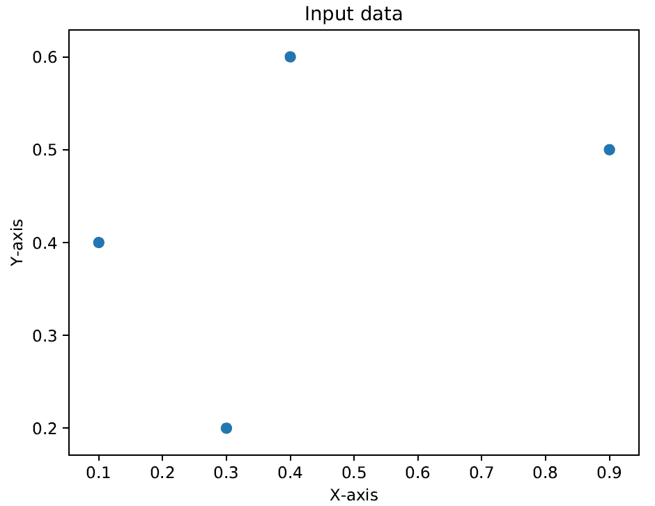

第二个图表显示了训练错误进度，如下所示：


# 它是如何工作的...

在这个菜谱中，我们使用了一个执行所有计算的单一神经元。为了训练`perceptron`，以下参数被设置。`epochs`的数量指定了通过我们的训练数据集的完整遍历次数。`show`参数指定了我们希望显示进度的频率。`lr`参数指定了`perceptron`的学习率。它是算法在参数空间中搜索时的步长大小。如果这个值很大，那么算法可能会更快地移动，但可能会错过最优值。如果这个值很小，那么算法将击中最优值，但会较慢。因此，这是一个权衡；因此，我们选择`0.01`的值。

# 还有更多…

我们可以将`perceptron`的概念理解为任何接受多个输入并产生一个输出的东西。这是神经网络的最简单形式。1958 年，Frank Rosenblatt 提出了`perceptron`的概念，它是一个具有输入层和输出层以及旨在最小化错误的训练规则的物体。这个称为**误差反向传播**的学习函数根据网络的实际输出与给定输入之间的差异，依赖于网络的实际输出和期望输出，来改变连接权重（突触）。

# 参考以下内容

+   参考`neurolab`库的官方文档：[`pythonhosted.org/neurolab/`](https://pythonhosted.org/neurolab/)

+   *参考《神经网络基础入门》（来自威斯康星大学麦迪逊分校）：[`pages.cs.wisc.edu/~bolo/shipyard/neural/local.html`](http://pages.cs.wisc.edu/~bolo/shipyard/neural/local.html)

# 构建单层神经网络

在之前的配方中，*构建感知器*，我们学习了如何创建`感知器`；现在让我们创建一个单层神经网络。单层神经网络由单层中的多个神经元组成。总体而言，我们将有一个输入层、一个隐藏层和一个输出层，如下面的图所示：

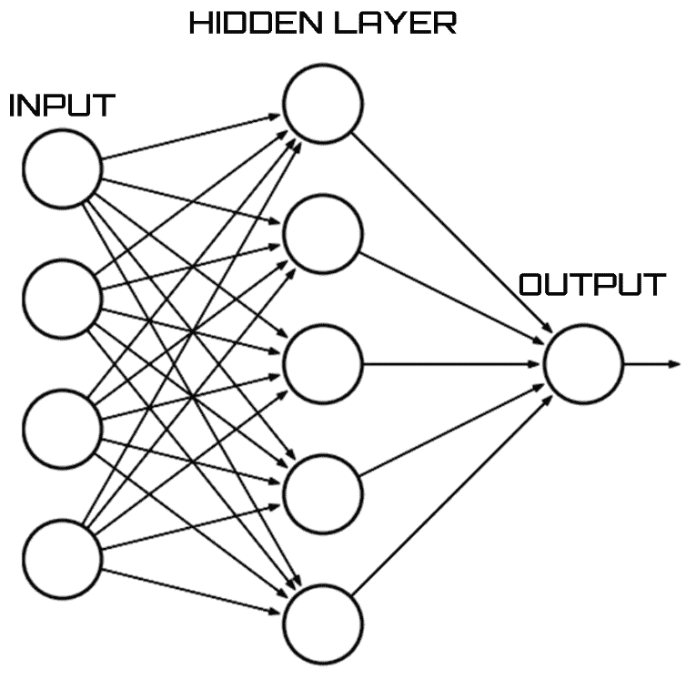

# 准备工作

在这个配方中，我们将学习如何使用`neurolab`库创建单层神经网络。

# 如何做到这一点...

让我们看看如何构建一个单层神经网络：

1.  创建一个新的 Python 文件，并导入以下包（完整的代码在提供的`single_layer.py`文件中给出）：

```py
import numpy as np 
import matplotlib.pyplot as plt 
import neurolab as nl  
```

1.  我们将使用`data_single_layer.txt`文件中的数据。让我们加载这个文件：

```py
# Define input data 
input_file = 'data_single_layer.txt' 
input_text = np.loadtxt(input_file) 
data = input_text[:, 0:2] 
labels = input_text[:, 2:]
```

1.  让我们绘制输入数据：

```py
# Plot input data 
plt.figure() 
plt.scatter(data[:,0], data[:,1]) 
plt.xlabel('X-axis') 
plt.ylabel('Y-axis') 
plt.title('Input data') 
```

1.  让我们提取最小值和最大值：

```py
# Min and max values for each dimension 
x_min, x_max = data[:,0].min(), data[:,0].max() 
y_min, y_max = data[:,1].min(), data[:,1].max() 
```

1.  让我们定义一个具有隐藏层中两个神经元的单层神经网络：

```py
# Define a single-layer neural network with 2 neurons; 
# Each element in the list (first argument) specifies the  
# min and max values of the inputs 
single_layer_net = nl.net.newp([[x_min, x_max], [y_min, y_max]], 2) 
```

1.  训练神经网络 50 个周期：

```py
# Train the neural network 
error = single_layer_net.train(data, labels, epochs=50, show=20, lr=0.01) 
```

1.  按如下方式绘制结果：

```py
# Plot results 
plt.figure() 
plt.plot(error) 
plt.xlabel('Number of epochs') 
plt.ylabel('Training error') 
plt.title('Training error progress') 
plt.grid() 
plt.show() 
```

1.  让我们在新的测试数据上测试神经网络：

```py
print(single_layer_net.sim([[0.3, 4.5]]))
print(single_layer_net.sim([[4.5, 0.5]]))
print(single_layer_net.sim([[4.3, 8]]))
```

如果你运行此代码，你将看到两个图表。第一个图表显示输入数据，如下所示：

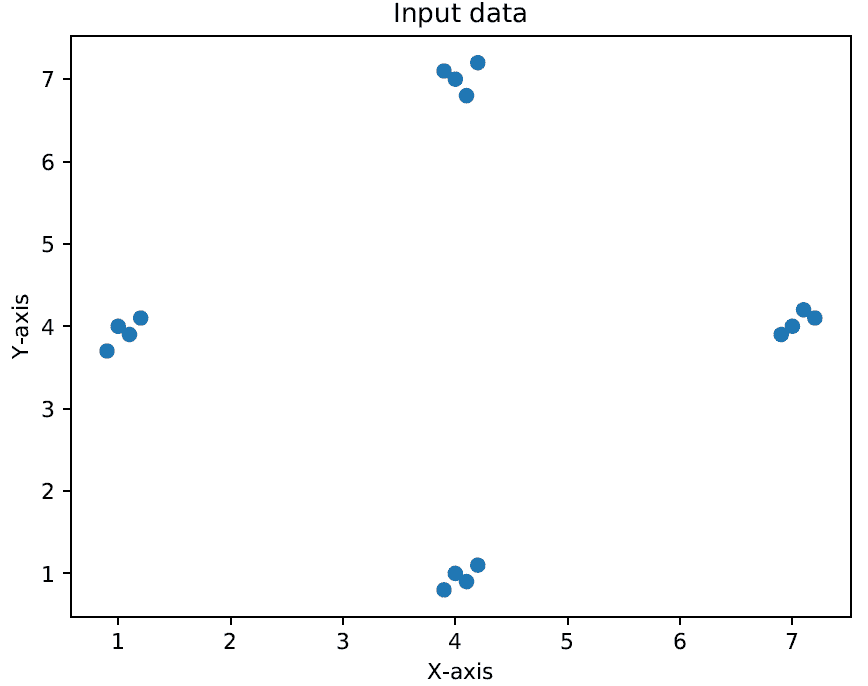

第二个图表显示训练错误进度，如下所示：

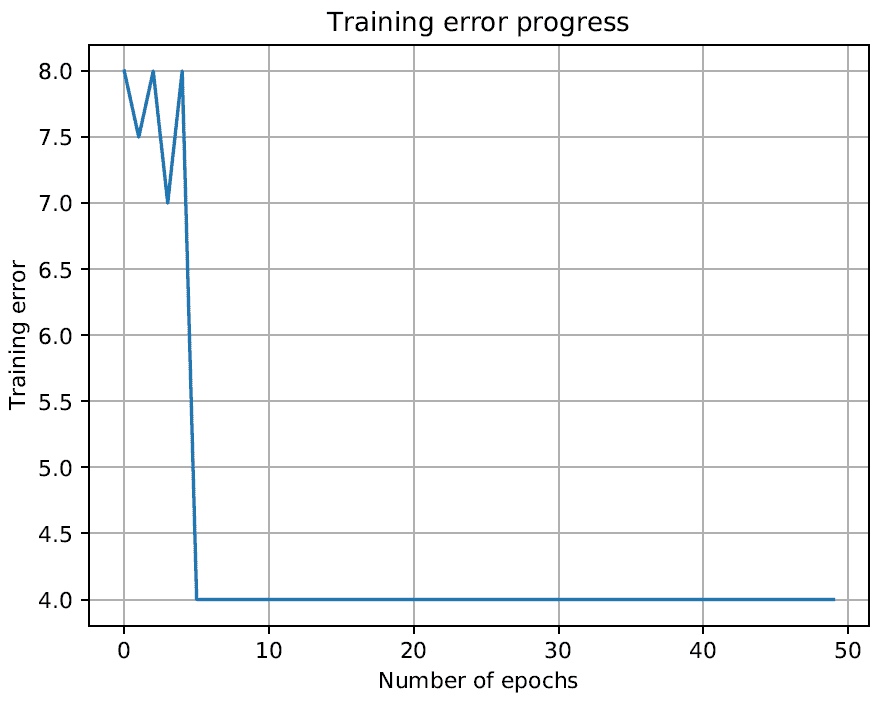

你将在你的终端上看到以下打印信息，指示输入测试点属于何处：

```py
    [[ 0\.  0.]]
    [[ 1\.  0.]]
    [[ 1\.  1.]]

```

你可以根据我们的标签验证输出是否正确。

# 它是如何工作的...

单层神经网络具有以下架构：输入形成输入层，执行处理的中间层称为隐藏层，输出形成输出层。隐藏层可以将输入转换为所需的输出。理解隐藏层需要了解权重、偏置和激活函数。

# 更多内容...

权重对于将输入转换为影响输出的因素至关重要；它们是监控所有神经元如何影响彼此的数值参数。相关的概念类似于线性回归中的斜率，其中权重乘以输入以相加并形成输出。

偏置类似于添加到线性方程中的截距。它也是一个用于调节输出以及神经元输入加权总和的附加参数。

激活函数是一个数学函数，它将输入转换为输出并确定神经元接收的总信号。没有激活函数，神经网络将表现得像线性函数。

# 参见

+   参考官方的`neurolab`库文档：[`pythonhosted.org/neurolab/`](https://pythonhosted.org/neurolab/)

+   *参考《神经网络入门》*（来自耶鲁大学）：[`euler.stat.yale.edu/~tba3/stat665/lectures/lec12/lecture12.pdf`](http://euler.stat.yale.edu/~tba3/stat665/lectures/lec12/lecture12.pdf)

# 构建深度神经网络

我们现在准备好构建一个**深度神经网络**。深度神经网络由一个输入层、多个隐藏层和一个输出层组成。这看起来如下所示：

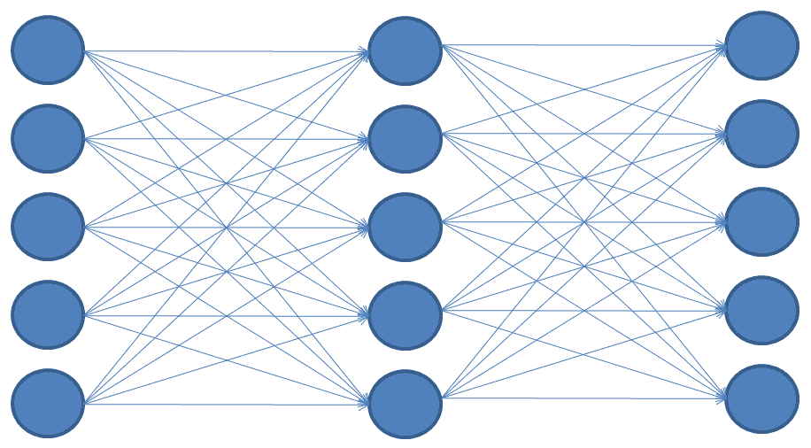

上述图表描述了一个具有一个输入层、一个隐藏层和一个输出层的多层神经网络。在深度神经网络中，输入层和输出层之间有许多隐藏层。

# 准备工作

在这个菜谱中，我们将构建一个深度神经网络。深度学习形成了一个具有众多隐藏层的先进神经网络。深度学习是一个庞大的主题，并且在构建人工智能中是一个重要的概念。在这个菜谱中，我们将使用生成的训练数据和定义一个具有两个隐藏层的多层神经网络。

# 如何操作...

让我们看看如何构建一个深度神经网络：

1.  创建一个新的 Python 文件，并导入以下包（完整的代码在提供的`deep_neural_network.py`文件中）：

```py
import neurolab as nl 
import numpy as np 
import matplotlib.pyplot as plt
```

1.  让我们定义参数以生成一些训练数据：

```py
# Generate training data 
min_value = -12 
max_value = 12 
num_datapoints = 90
```

1.  这组训练数据将包括我们定义的函数，该函数将转换值。我们期望神经网络能够根据我们提供的输入和输出值自行学习：

```py
x = np.linspace(min_value, max_value, num_datapoints) 
y = 2 * np.square(x) + 7 
y /= np.linalg.norm(y) 
```

1.  重新塑形数组：

```py
data = x.reshape(num_datapoints, 1) 
labels = y.reshape(num_datapoints, 1) 
```

1.  绘制输入数据：

```py
plt.figure() 
plt.scatter(data, labels) 
plt.xlabel('X-axis') 
plt.ylabel('Y-axis') 
plt.title('Input data') 
```

1.  定义一个具有两个隐藏层的深度神经网络，其中每个隐藏层包含 10 个神经元，输出层包含一个神经元：

```py
multilayer_net = nl.net.newff([[min_value, max_value]], [10, 10, 1]) 
```

1.  将训练算法设置为梯度下降：

```py
multilayer_net.trainf = nl.train.train_gd 
```

1.  训练网络：

```py
error = multilayer_net.train(data, labels, epochs=800, show=100, goal=0.01) 
```

1.  预测训练输入的输出以查看性能：

```py
predicted_output = multilayer_net.sim(data)
```

1.  绘制训练错误：

```py
plt.figure() 
plt.plot(error) 
plt.xlabel('Number of epochs') 
plt.ylabel('Error') 
plt.title('Training error progress')
```

1.  让我们创建一组新的输入并运行神经网络以查看其性能：

```py
x2 = np.linspace(min_value, max_value, num_datapoints * 2) 
y2 = multilayer_net.sim(x2.reshape(x2.size,1)).reshape(x2.size) 
y3 = predicted_output.reshape(num_datapoints) 
```

1.  绘制输出：

```py
plt.figure() 
plt.plot(x2, y2, '-', x, y, '.', x, y3, 'p') 
plt.title('Ground truth vs predicted output') 
plt.show() 
```

如果你运行此代码，你将看到三个图表。第一个图表显示了输入数据，如下所示：

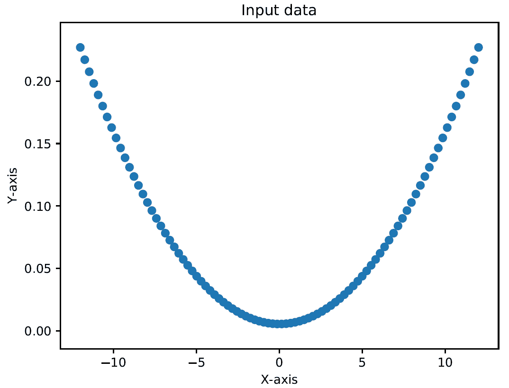

第二个图表显示了训练错误进度，如下所示：

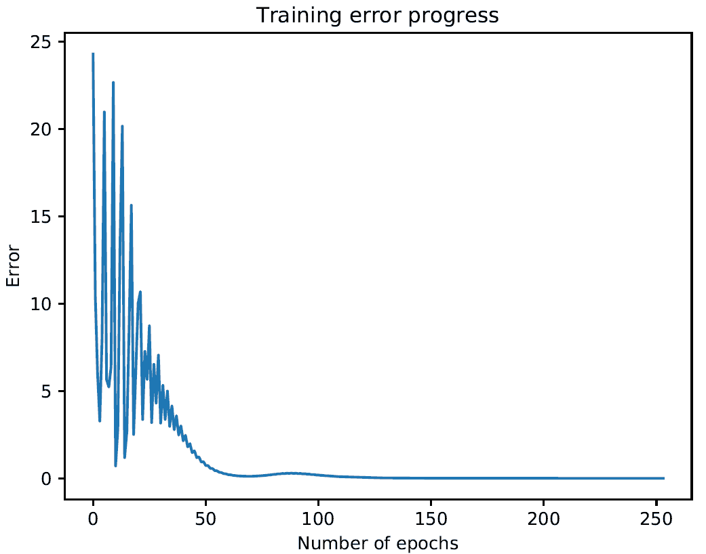

第三个图表显示了神经网络的输出，如下所示：

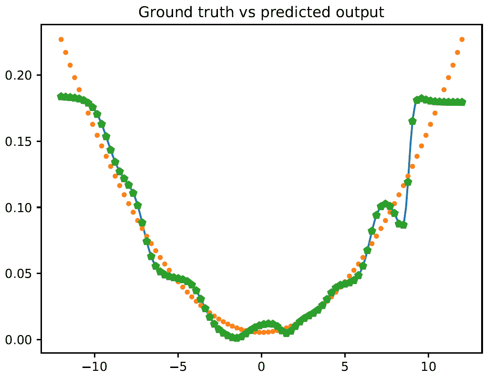

你将在你的终端上看到以下内容：

```py
Epoch: 100; Error: 4.634764957565494;
Epoch: 200; Error: 0.7675153737786798;
Epoch: 300; Error: 0.21543996465118723;
Epoch: 400; Error: 0.027738499953293118;
Epoch: 500; Error: 0.019145948877988192;
Epoch: 600; Error: 0.11296232736352653;
Epoch: 700; Error: 0.03446237629842832;
Epoch: 800; Error: 0.03022668735279662;
The maximum number of train epochs is reached
```

# 它是如何工作的...

在这个菜谱中，我们将使用生成的训练数据来训练一个具有两个隐藏层的多层深度神经网络。为了训练模型，使用了梯度下降算法。**梯度下降**是一种迭代方法，用于任何学习模型的错误校正。梯度下降方法是一个迭代过程，通过更新权重和偏差的误差乘以激活函数的导数（反向传播）。在这个方法中，最陡下降步长被替换为上一步的类似大小。梯度是曲线的斜率，因为它就是激活函数的导数。

# 更多内容...

每一步寻找梯度下降的目标是找到全局成本最小值，其中错误最低。这正是模型与数据拟合良好，预测更准确的地方。

# 参考以下内容

+   参考官方的`neurolab`库文档：[`pythonhosted.org/neurolab/lib.html`](https://pythonhosted.org/neurolab/lib.html)

+   关于梯度下降的一些笔记（由斯图加特大学的 Marc Toussaint 提供）：[`ipvs.informatik.uni-stuttgart.de/mlr/marc/notes/gradientDescent.pdf`](https://ipvs.informatik.uni-stuttgart.de/mlr/marc/notes/gradientDescent.pdf)

# 创建一个向量量化器

你也可以使用神经网络进行向量量化。**向量量化**是**N**维度的舍入。这在计算机视觉、NLP 和机器学习等多个领域都非常常用。

# 准备工作

在之前的菜谱中，我们已经讨论了**向量量化**的概念：*使用向量量化压缩图像*和*使用视觉代码簿和向量量化创建特征*。在这个菜谱中，我们将定义一个具有两层的人工神经网络——输入层有 10 个神经元，输出层有 4 个神经元。然后我们将使用这个网络将空间划分为四个区域。

在开始之前，你需要进行更改以修复库中的错误。你需要打开以下文件：`neurolab | net.py`。然后找到以下内容：

```py
inx = np.floor (cn0 * pc.cumsum ()). astype (int)
```

将前面的行替换为以下内容：

```py
inx = np.floor (cn0 * pc.cumsum ())
```

# 如何操作...

让我们看看如何创建一个向量量化器：

1.  创建一个新的 Python 文件并导入以下包（完整的代码在提供的`vector_quantization.py`文件中给出）：

```py
import numpy as np 
import matplotlib.pyplot as plt 
import neurolab as nl 
```

1.  让我们加载`data_vq.txt`文件中的输入数据：

```py
input_file = 'data_vq.txt' 
input_text = np.loadtxt(input_file) 
data = input_text[:, 0:2] 
labels = input_text[:, 2:]
```

1.  定义一个**学习向量量化**（**LVQ**）神经网络，具有两层。最后一个参数中的数组指定了每个输出的百分比权重（它们应该加起来为 1）：

```py
net = nl.net.newlvq(nl.tool.minmax(data), 10, [0.25, 0.25, 0.25, 0.25]) 
```

1.  训练 LVQ 神经网络：

```py
error = net.train(data, labels, epochs=100, goal=-1) 
```

1.  创建一个用于测试和可视化的值网格：

```py
xx, yy = np.meshgrid(np.arange(0, 8, 0.2), np.arange(0, 8, 0.2)) 
xx.shape = xx.size, 1 
yy.shape = yy.size, 1 
input_grid = np.concatenate((xx, yy), axis=1) 
```

1.  在这个网格上评估网络：

```py
output_grid = net.sim(input_grid) 
```

1.  定义我们数据中的四个类别：

```py
class1 = data[labels[:,0] == 1] 
class2 = data[labels[:,1] == 1] 
class3 = data[labels[:,2] == 1] 
class4 = data[labels[:,3] == 1] 
```

1.  定义所有这些类别的网格：

```py
grid1 = input_grid[output_grid[:,0] == 1] 
grid2 = input_grid[output_grid[:,1] == 1] 
grid3 = input_grid[output_grid[:,2] == 1] 
grid4 = input_grid[output_grid[:,3] == 1] 
```

1.  绘制输出：

```py
plt.plot(class1[:,0], class1[:,1], 'ko', class2[:,0], class2[:,1], 'ko',  
                class3[:,0], class3[:,1], 'ko', class4[:,0], class4[:,1], 'ko') 
plt.plot(grid1[:,0], grid1[:,1], 'b.', grid2[:,0], grid2[:,1], 'gx', 
                grid3[:,0], grid3[:,1], 'cs', grid4[:,0], grid4[:,1], 'ro') 
plt.axis([0, 8, 0, 8]) 
plt.xlabel('X-axis') 
plt.ylabel('Y-axis') 
plt.title('Vector quantization using neural networks') 
plt.show() 
```

如果你运行这段代码，你会看到以下图表，其中空间被划分为区域。每个区域对应于空间中向量量化区域列表中的一个桶：

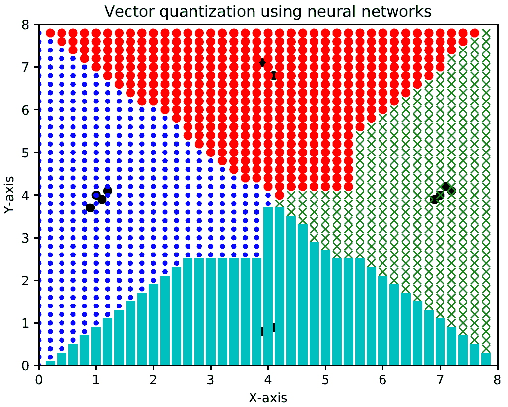

# 它是如何工作的...

在这个菜谱中，我们定义了一个具有两层的人工神经网络：输入层有 10 个神经元，输出层有 4 个神经元。这个神经网络首先被训练，然后用来将空间划分为四个区域。每个区域对应于空间中向量量化区域列表中的一个桶。

# 更多内容...

**向量量化**基于将大量点（向量）划分为显示相同数量点更接近它们的组。每个组由其质心点标识，这与大多数聚类算法类似。

# 参考以下内容

+   请参考`neurolab`库的官方文档：[`pythonhosted.org/neurolab/`](https://pythonhosted.org/neurolab/)

# 构建用于序列数据分析的循环神经网络

循环神经网络在分析序列和时间序列数据方面非常出色。**循环神经网络**（**RNN**）是一种信息双向流动的神经网络模型。换句话说，在前馈网络中，信号的传播仅以连续的方式进行，从输入到输出，而循环网络则不同。在它们中，这种传播也可以发生在前一个神经层之后的神经层之间，或者在同一层内的神经元之间，甚至是一个神经元与其自身之间。

# 准备工作

当我们处理序列和时间序列数据时，我们不能仅仅扩展通用模型。数据中的时间依赖性非常重要，我们需要在我们的模型中考虑这一点。让我们使用`neurolab`库构建一个循环神经网络。

# 如何操作...

让我们看看如何构建用于序列数据分析的循环神经网络：

1.  创建一个新的 Python 文件，并导入以下包（完整的代码在提供的`recurrent_network.py`文件中，请查阅）：

```py
import numpy as np 
import matplotlib.pyplot as plt 
import neurolab as nl 
```

1.  定义一个基于输入参数创建波形的函数：

```py
def create_waveform(num_points): 
    # Create train samples 
    data1 = 1 * np.cos(np.arange(0, num_points)) 
    data2 = 2 * np.cos(np.arange(0, num_points)) 
    data3 = 3 * np.cos(np.arange(0, num_points)) 
    data4 = 4 * np.cos(np.arange(0, num_points)) 
```

1.  为每个区间创建不同的振幅以创建随机波形：

```py
    # Create varying amplitudes 
    amp1 = np.ones(num_points) 
    amp2 = 4 + np.zeros(num_points)  
    amp3 = 2 * np.ones(num_points)  
    amp4 = 0.5 + np.zeros(num_points)  
```

1.  将数组组合以创建输出数组。这些数据对应于输入，振幅对应于标签：

```py
    data = np.array([data1, data2, data3, data4]).reshape(num_points * 4, 1) 
    amplitude = np.array([[amp1, amp2, amp3, amp4]]).reshape(num_points * 4, 1) 

    return data, amplitude  
```

1.  定义一个函数，用于在数据通过训练好的神经网络后绘制输出：

```py
# Draw the output using the network 
def draw_output(net, num_points_test): 
    data_test, amplitude_test = create_waveform(num_points_test) 
    output_test = net.sim(data_test) 
    plt.plot(amplitude_test.reshape(num_points_test * 4)) 
    plt.plot(output_test.reshape(num_points_test * 4))
```

1.  定义`main`函数，并开始创建样本数据：

```py
if __name__=='__main__': 
    # Get data 
    num_points = 30 
    data, amplitude = create_waveform(num_points) 
```

1.  创建一个具有两层结构的循环神经网络：

```py
    # Create network with 2 layers 
    net = nl.net.newelm([[-2, 2]], [10, 1], [nl.trans.TanSig(), nl.trans.PureLin()]) 
```

1.  为每一层设置初始化函数：

```py
    # Set initialized functions and init 
    net.layers[0].initf = nl.init.InitRand([-0.1, 0.1], 'wb') 
    net.layers[1].initf= nl.init.InitRand([-0.1, 0.1], 'wb') 
    net.init() 
```

1.  训练循环神经网络：

```py
    # Training the recurrent neural network 
    error = net.train(data, amplitude, epochs=1000, show=100, goal=0.01) 
```

1.  从网络中计算训练数据的输出：

```py
    # Compute output from network 
    output = net.sim(data) 
```

1.  绘制训练误差图：

```py
    # Plot training results 
    plt.subplot(211) 
    plt.plot(error) 
    plt.xlabel('Number of epochs') 
    plt.ylabel('Error (MSE)') 
```

1.  绘制结果：

```py
    plt.subplot(212) 
    plt.plot(amplitude.reshape(num_points * 4)) 
    plt.plot(output.reshape(num_points * 4)) 
    plt.legend(['Ground truth', 'Predicted output'])
```

1.  创建一个随机长度的波形，并查看网络能否预测它：

```py
    # Testing on unknown data at multiple scales 
    plt.figure() 

    plt.subplot(211) 
    draw_output(net, 74) 
    plt.xlim([0, 300]) 
```

1.  创建另一个较短长度的波形，并查看网络能否预测它：

```py
    plt.subplot(212) 
    draw_output(net, 54) 
    plt.xlim([0, 300]) 

    plt.show() 
```

如果您运行此代码，您将看到两个图表。第一个图表显示了训练误差和训练数据的性能，如下所示：

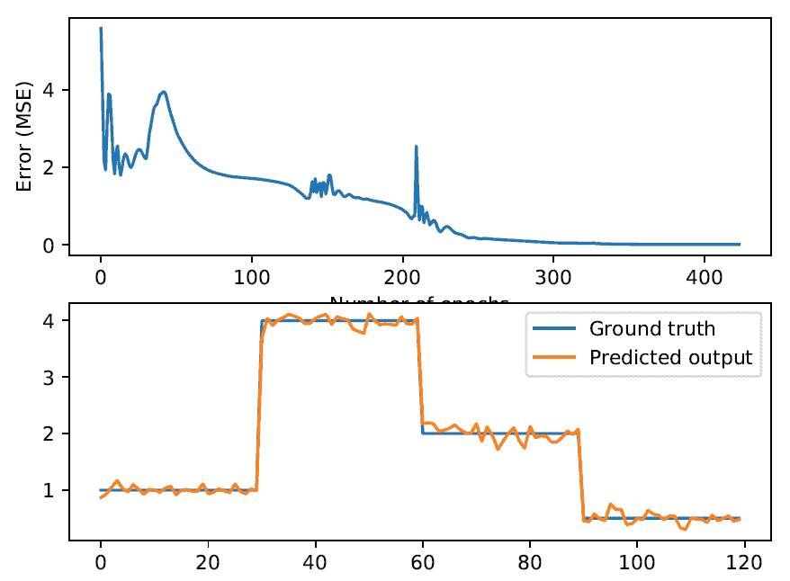

第二个图显示了训练好的循环神经网络在任意长度序列上的表现，如下所示：

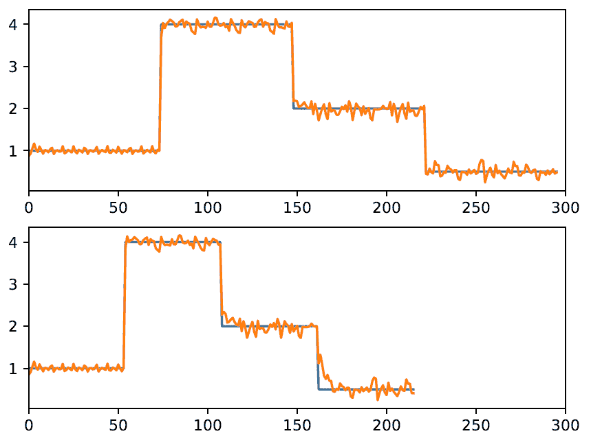

在您的终端上，您将看到以下内容：

```py
Epoch: 100; Error: 1.2635865600014597;
Epoch: 200; Error: 0.4001584483592344;
Epoch: 300; Error: 0.06438997423142029;
Epoch: 400; Error: 0.03772354900253485;
Epoch: 500; Error: 0.031996105192696744;
Epoch: 600; Error: 0.011933337009068408;
Epoch: 700; Error: 0.012385370178600663;
Epoch: 800; Error: 0.01116995004102195;
Epoch: 900; Error: 0.011191016373572612;
Epoch: 1000; Error: 0.010584255803264013;
The maximum number of train epochs is reached
```

# 它是如何工作的...

在这个菜谱中，首先，我们创建了一个具有波形特性的合成信号，即表示给定时间波形形状的曲线。然后我们构建了一个循环神经网络，以查看网络能否预测随机长度的波形。

# 更多内容...

递归网络与前馈网络的区别在于它们与过去决策相关的反馈循环，因此将它们的输出暂时作为输入接受。可以说，递归网络具有记忆功能。序列中存在信息，并且这些信息被用来执行前馈网络无法执行的任务。

# 参考以下内容

+   参考官方`neurolab`库文档：[`pythonhosted.org/neurolab/`](https://pythonhosted.org/neurolab/)

+   参考耶鲁大学的*递归神经网络*（[`euler.stat.yale.edu/~tba3/stat665/lectures/lec21/lecture21.pdf`](http://euler.stat.yale.edu/~tba3/stat665/lectures/lec21/lecture21.pdf)）

# 可视化 OCR 数据库中的字符

我们现在将探讨如何使用神经网络进行**光学字符识别（OCR**）。这指的是在图像中识别手写字符的过程。我们一直特别关注自动识别书写的问题，以便实现人与机器之间更简单的交互。特别是在过去几年里，由于强大的经济利益和现代计算机处理数据能力的不断提高，这个问题已经得到了有趣的发展，并且越来越高效的解决方案。特别是，一些国家，如日本，以及亚洲国家，在研究和财务资源方面投入了大量资金，以实现最先进的 OCR。

# 准备工作

在这个菜谱中，我们将显示数据集中包含的手写数字。我们将使用在[`ai.stanford.edu/~btaskar/ocr`](http://ai.stanford.edu/~btaskar/ocr)可用的数据集。下载后的默认文件名是`letter.data`。首先，让我们看看如何与数据交互并可视化它。

# 如何操作...

让我们看看如何可视化 OCR 数据库中的字符：

1.  创建一个新的 Python 文件，并导入以下包（完整的代码在提供的`visualize_characters.py`文件中给出）：

```py
import cv2 
import numpy as np 
```

1.  定义输入文件名：

```py
# Load input data  
input_file = 'letter.data'  
```

1.  定义可视化参数：

```py
# Define visualization parameters  
scaling_factor = 10 
start_index = 6 
end_index = -1 
h, w = 16, 8 
```

1.  保持循环读取文件，直到用户按下*Escape*键。将行分割为制表符分隔的字符：

```py
# Loop until you encounter the Esc key 
with open(input_file, 'r') as f: 
    for line in f.readlines(): 
        data = np.array([255*float(x) for x in line.split('\t')[start_index:end_index]]) 
```

1.  将数组重塑为所需的形状，调整大小，并显示：

```py
        img = np.reshape(data, (h,w)) 
        img_scaled = cv2.resize(img, None, fx=scaling_factor, fy=scaling_factor) 
        cv2.imshow('Image', img_scaled) 
```

1.  如果用户按下*Escape*，则中断循环：

```py
        c = cv2.waitKey() 
        if c == 27: 
            break 
```

如果运行此代码，你将看到一个显示字符的窗口。

# 工作原理...

在这个菜谱中，我们展示了数据集中包含的手写数字。为此，执行以下任务：

+   加载输入数据

+   定义可视化参数

+   循环直到遇到*Escape*键

# 还有更多...

OCR 问题的方法基本上有两种类型：一种是基于模式匹配或模型比较，另一种是基于结构分析。通常，这两种技术会结合使用，并在识别和速度方面提供显著的结果。

# 参考以下内容

+   参考官方的`OpenCV`库文档：[`opencv.org/`](https://opencv.org/)

# 使用神经网络构建光学字符识别器

现在我们知道了如何与数据交互，让我们构建一个基于神经网络的 OCR 系统。图像分类和索引的操作基于对图像内容的自动分析，这构成了图像分析的主要应用领域。自动图像识别系统的目标是，通过数学模型和计算机实现，描述图像的内容，同时尽可能遵守人类视觉系统的原则。

# 准备工作

在这个食谱中，我们将构建一个基于神经网络的 OCR 系统。

# 如何做到这一点...

让我们看看如何使用神经网络构建光学字符识别器：

1.  创建一个新的 Python 文件，并导入以下包（完整的代码在提供的`ocr.py`文件中给出）：

```py
import numpy as np 
import neurolab as nl 
```

1.  定义输入文件名：

```py
input_file = 'letter.data' 
```

1.  当我们处理涉及大量数据的神经网络时，训练需要花费很多时间。为了演示如何构建这个系统，我们将只使用`20`个数据点：

```py
num_datapoints = 20 
```

1.  如果你查看数据，你会看到有七个不同的字符在

    前二十行。让我们定义它们：

```py
orig_labels = 'omandig' 
num_output = len(orig_labels) 
```

1.  我们将使用 90%的数据进行训练，剩余的 10%用于测试。定义训练和测试参数：

```py
num_train = int(0.9 * num_datapoints) 
num_test = num_datapoints - num_train 
```

1.  数据集文件中每行的起始和结束索引被指定：

```py
start_index = 6 
end_index = -1 
```

1.  创建数据集：

```py
data = [] 
labels = [] 
with open(input_file, 'r') as f: 
    for line in f.readlines(): 
        # Split the line tabwise 
        list_vals = line.split('\t')
```

1.  添加一个错误检查来查看字符是否在我们的标签列表中（如果标签不在我们的地面真实标签中，则跳过它）：

```py
        if list_vals[1] not in orig_labels: 
            continue 
```

1.  提取标签，并将其追加到主列表中：

```py
        label = np.zeros((num_output, 1)) 
        label[orig_labels.index(list_vals[1])] = 1 
        labels.append(label) 
```

1.  提取字符，并将其追加到主列表中：

```py
        cur_char = np.array([float(x) for x in list_vals[start_index:end_index]]) 
        data.append(cur_char) 
```

1.  一旦我们有足够的数据，就退出循环：

```py
        if len(data) >= num_datapoints: 
            break 
```

1.  将此数据转换为 NumPy 数组：

```py
data = np.asfarray(data) 
labels = np.array(labels).reshape(num_datapoints, num_output) 
```

1.  提取我们数据中的维数：

```py
num_dims = len(data[0]) 
```

1.  训练神经网络直到`10,000`个 epoch：

```py
net = nl.net.newff([[0, 1] for _ in range(len(data[0]))], [128, 16, num_output]) 
net.trainf = nl.train.train_gd 
error = net.train(data[:num_train,:], labels[:num_train,:], epochs=10000,  
        show=100, goal=0.01) 
```

1.  预测测试输入的输出：

```py
predicted_output = net.sim(data[num_train:, :])
print("Testing on unknown data:")
for i in range(num_test):
    print("Original:", orig_labels[np.argmax(labels[i])])
    print("Predicted:", orig_labels[np.argmax(predicted_output[i])])
```

1.  如果你运行此代码，你将在训练结束时在你的终端上看到以下内容：

```py
Epoch: 5000; Error: 0.032178530603536336;
Epoch: 5100; Error: 0.023122560947574727;
Epoch: 5200; Error: 0.040615342668364626;
Epoch: 5300; Error: 0.01686314983574041;
The goal of learning is reached
```

神经网络的输出如下所示：

```py
Testing on unknown data:
Original: o
Predicted: o
Original: m
Predicted: m
```

# 它是如何工作的...

在这个食谱中，我们使用神经网络来识别手写数字。为此，执行以下任务：

+   加载和处理输入数据

+   创建数据集

+   将数据和标签转换为 NumPy 数组

+   提取维数

+   创建和训练神经网络

+   预测测试输入的输出

# 更多内容...

术语**手写识别**（**HWR**）指的是计算机接收并解释来自纸张文件、照片和触摸屏等来源的作为文本的清晰手写输入的能力。书写文本可以通过光学扫描（OCR）或**智能文字识别**在纸张上检测到。

# 参考以下内容

+   参考官方的`neurolab`库文档：[`pythonhosted.org/neurolab/`](https://pythonhosted.org/neurolab/)

+   参考*光学字符识别*（来自维基百科）：[`en.wikipedia.org/wiki/Optical_character_recognition`](https://en.wikipedia.org/wiki/Optical_character_recognition)

+   参考*手写识别*（来自维基百科）：[`en.wikipedia.org/wiki/Handwriting_recognition`](https://en.wikipedia.org/wiki/Handwriting_recognition)

# 在人工神经网络中实现优化算法

到目前为止，我们已经构建了几个神经网络并获得了令人满意的总体性能。我们使用`loss`函数来评估模型的性能，这是一种数学方法，用来衡量我们的预测有多错误。为了提高基于神经网络的模型性能，在训练过程中，通过修改权重来尝试最小化`loss`函数，使我们的预测尽可能正确。为此，使用优化器：它们是调节模型参数的算法，根据`loss`函数返回的结果来更新模型。在实践中，优化器通过克服权重来以尽可能准确的形式塑造模型：`loss`函数告诉优化器它是在正确的还是错误的方向上移动。

# 准备工作

在这个菜谱中，我们将使用 Keras 库构建一个神经网络，并通过采用几个优化器来提高模型的性能。为此，将使用`iris`数据集。我指的是**鸢尾花数据集**，这是一个由英国统计学家和生物学家罗纳德·费希尔在 1936 年的论文《*The use of multiple measurements in taxonomic problems as an example of linear discriminant analysis*》中引入的多变量数据集。

# 如何做到这一点...

让我们看看如何在人工神经网络中实现优化算法：

1.  创建一个新的 Python 文件，并导入以下包（完整的代码在提供的`IrisClassifier.py`文件中）： 

```py
from sklearn.datasets import load_iris
from sklearn.model_selection import train_test_split
from sklearn.preprocessing import OneHotEncoder
from keras.models import Sequential
from keras.layers import Dense 
```

1.  从`sklearn`数据集导入数据：

```py
IrisData = load_iris() 
```

1.  将数据分为输入和目标：

```py
X = IrisData.data
Y = IrisData.target.reshape(-1, 1) 
```

对于目标，数据被转换为单列。

1.  让我们将类别标签编码为`One Hot Encode`：

```py
Encoder = OneHotEncoder(sparse=False)
YHE = Encoder.fit_transform(Y)
```

1.  将数据拆分为训练和测试：

```py
XTrain, XTest, YTrain, YTest = train_test_split(X, YHE, test_size=0.30)
```

1.  让我们构建模型：

```py
model = Sequential()
```

1.  将添加三个层：输入层、隐藏层和输出层。

```py
model.add(Dense(10, input_shape=(4,), activation='relu'))
model.add(Dense(10, activation='relu'))
model.add(Dense(3, activation='softmax'))
```

1.  让我们编译模型：

```py
model.compile(optimizer='SGD',loss='categorical_crossentropy', metrics=['accuracy'])
```

以下三个参数被传递：

+   `optimizer='SGD'`：随机梯度下降优化器。包括对动量、学习率衰减和 Nesterov 动量的支持。

+   `loss='categorical_crossentropy'`：我们在这里使用了`categorical_crossentropy`参数。当使用`categorical_crossentropy`时，你的目标应该以分类格式（我们有三个类别；每个样本的目标必须是一个三维向量，除了对应于样本类别的索引处的 1 之外，其余都是 0）。

+   `metrics=['accuracy']`：`metric`是一个用于评估的函数

    在训练和测试期间评估你的模型性能。

1.  让我们训练模型：

```py
model.fit(XTrain, YTrain, verbose=2, batch_size=5, epochs=200)
```

1.  最后，使用未见过的数据测试模型：

```py
results = model.evaluate(XTest, YTest)
print('Final test set loss:' ,results[0])
print('Final test set accuracy:', results[1])
```

返回以下结果：

```py
Final test set loss: 0.17724286781416998
Final test set accuracy: 0.9555555568801032
```

1.  现在我们来看看如果我们使用不同的优化器会发生什么。为此，只需在编译方法中更改优化器参数，如下所示：

```py
model.compile(optimizer='adam',loss='categorical_crossentropy', metrics=['accuracy'])
```

`adam`优化器是一种基于一阶、梯度优化随机目标函数的算法，它基于低阶矩的自适应估计。

返回以下结果：

```py
Final test set loss: 0.0803464303414027
Final test set accuracy: 0.9777777777777777
```

# 它是如何工作的...

正如我们在*构建深度神经网络*配方中所说的，梯度下降是一种用于任何学习模型中错误校正的迭代方法。梯度下降方法是通过迭代更新权重和偏置与误差乘以激活函数的导数（反向传播）的过程。在此方法中，最陡下降步长被替换为上一步的类似大小。梯度是曲线的斜率，正如它是激活函数的导数一样。 SGD 优化器基于这种方法。

# 还有更多...

优化问题通常非常复杂，以至于无法通过解析方法确定解决方案。复杂性主要取决于变量的数量和约束条件，这些定义了问题的大小，然后是可能存在的非线性函数。只有当变量数量很少且函数极其简单时，才能找到解析解。在实践中，为了解决优化问题，必须求助于迭代算法，即给定当前解的近似值，通过适当的操作序列确定新的近似值。因此，从初始近似值开始，确定了一系列近似值。

# 参考以下内容

+   参考 Keras 优化器的官方文档: [`keras.io/optimizers/`](https://keras.io/optimizers/)

+   参考来自芝加哥大学的《*深度神经网络优化*》: [`ttic.uchicago.edu/~shubhendu/Pages/Files/Lecture6_pauses.pdf`](https://ttic.uchicago.edu/~shubhendu/Pages/Files/Lecture6_pauses.pdf)
