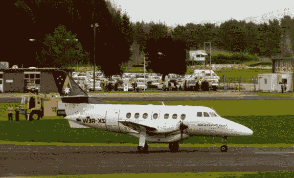

# 第十五章：自动化机器学习和迁移学习

在本章中，我们将介绍以下配方：

+   使用 Auto-WEKA

+   使用 AutoML 和 TPOT 生成机器学习管道

+   使用 Auto-Keras

+   使用 auto-sklearn

+   使用 MLBox 进行选择和泄漏检测

+   带有迁移学习的卷积神经网络

+   迁移学习 – 使用 ResNet-50 预训练图像分类器

+   迁移学习 – 使用 VGG16 模型进行特征提取

+   使用重新训练的 GloVe 嵌入进行迁移学习

# 技术要求

为了处理本章中的配方，您需要以下文件（可在 GitHub 上找到）：

+   `TPOTIrisClassifier.py`

+   `AKClassifier.py`

+   `MLBoxRegressor.py`

+   `ASKLClassifier.py`

+   `ImageTransferLearning.py`

+   `PretrainedImageClassifier.py`

+   `ExtractFeatures.py`

+   `PTGloveEMB.py`

# 简介

**自动化机器学习**（**AutoML**）指的是那些能够自动化将机器学习应用于现实世界问题端到端过程的应用。通常，科学分析师必须在将数据提交给机器学习算法之前，通过一系列的初步程序来处理数据。在前几章中，您看到了通过这些算法进行适当数据分析的必要步骤。您看到了如何通过使用几个库来构建基于深度神经网络的模型是多么简单。在某些情况下，这些技能超出了分析师所拥有的，他们必须寻求行业专家的支持来解决该问题。

AutoML 的诞生源于创建一个能够自动化整个机器学习过程的应用的需求，以便用户可以利用这些服务。通常，机器学习专家必须执行以下任务：

+   数据准备

+   选择特征

+   选择合适的模型类别

+   选择和优化模型超参数

+   后处理机器学习模型

+   分析获得的结果

AutoML 自动化所有这些操作。它提供了产生更简单、创建更快且通常优于手工设计的解决方案的优势。存在许多 AutoML 框架；在接下来的几节中，我们将探讨其中的一些。

# 使用 Auto-WEKA

Weka 是一个完全用 Java 编写的软件环境。**Weka**，即**Waikato 知识分析环境**的缩写，是在新西兰的 Waikato 大学开发的机器学习软件。它是开源的，并按照 GNU 通用公共许可证进行分发。使用它，可以基于机器学习构建许多模型。

然而，每个算法都有自己的超参数，这些参数可能会极大地改变它们的性能。研究人员的任务是找到这些参数的正确组合，以最大化模型的性能。Auto-WEKA 自动解决了选择学习算法及其超参数设置的问题。

# 准备就绪

在这个菜谱中，你将学习如何在三个主要步骤中使用 Auto-WEKA。要使用这个库，必须先安装它。有关系统要求和安装程序的详细信息，请参阅[`www.cs.ubc.ca/labs/beta/Projects/autoweka/manual.pdf`](https://www.cs.ubc.ca/labs/beta/Projects/autoweka/manual.pdf)。

# 如何操作...

让我们看看如何使用 Auto-WEKA，如下所示：

1.  **构建实验定义并实例化**：在这个步骤中，你指定要使用哪个数据集以及要执行哪种类型的超参数搜索。然后，实验被完全实例化，以便 Auto-WEKA 可以识别要使用的分类器。在这个阶段，Auto-WEKA 将所有路径转换为绝对路径。

1.  **实验执行**：Auto-WEKA 通过使用多个随机种子运行相同的实验来利用多个核心；唯一的要求是所有实验都有一个相似的文件系统。

1.  **分析阶段**：当 Auto-WEKA 使用基于模型的优化方法时，它会生成一个超参数轨迹，这些超参数是由优化方法在特定时间识别为最佳的超参数。分析的最简单形式是检查在所有种子中找到的最佳超参数，并使用训练好的模型对新数据集进行预测。

# 它是如何工作的...

为了选择学习算法并设置其超参数，Auto-WEKA 使用一种完全自动化的方法，利用贝叶斯优化方面的最新创新。

# 更多内容...

Auto-WEKA 是第一个使用贝叶斯优化来自动实例化高度参数化机器学习框架的库。后来，AutoML 也被其他库所应用。

# 参考以下内容

+   参考官方 Auto-WEKA 网站：[`www.cs.ubc.ca/labs/beta/Projects/autoweka/`](https://www.cs.ubc.ca/labs/beta/Projects/autoweka/)

+   参考以下文档：*Auto-WEKA 2.0：在 WEKA 中进行自动模型选择和超参数优化*：[`www.cs.ubc.ca/labs/beta/Projects/autoweka/papers/16-599.pdf`](https://www.cs.ubc.ca/labs/beta/Projects/autoweka/papers/16-599.pdf)

+   参考以下文档：*Auto-WEKA：分类算法的联合选择和超参数优化*：[`www.cs.ubc.ca/labs/beta/Projects/autoweka/papers/autoweka.pdf`](https://www.cs.ubc.ca/labs/beta/Projects/autoweka/papers/autoweka.pdf)

# 使用 AutoML 和 TPOT 生成机器学习管道

**TPOT**是一个 Python 自动化机器学习工具，通过使用遗传编程优化机器学习管道。在人工智能中，遗传算法是进化算法类的一部分。进化算法的一个特点是使用从自然进化中借鉴的技术来寻找问题的解决方案。寻找问题解决方案的过程被委托给一个迭代过程，该过程通过选择和重组越来越精细的解决方案，直到达到最优性标准。在遗传算法中，通过进化压力将解决方案种群推向一个既定目标。

# 准备工作

在本教程中，你将学习如何使用 TPOT 构建最佳性能模型，从`iris`数据集对鸢尾花物种（setosa、virginica 和 versicolor）进行分类。要使用此库，必须安装它。有关系统要求和安装过程的信息，请参阅[`epistasislab.github.io/tpot/installing/`](https://epistasislab.github.io/tpot/installing/)。

# 如何做到这一点...

让我们看看如何使用 AutoML 通过 TPOT 生成机器学习管道：

1.  创建一个新的 Python 文件并导入以下包（完整代码已在提供的`TPOTIrisClassifier.py`文件中给出）：

```py
from tpot import TPOTClassifier
from sklearn.datasets import load_iris
from sklearn.model_selection import train_test_split
import numpy as np
```

1.  让我们按照以下方式导入鸢尾花数据集：

```py
IrisData = load_iris()
```

1.  让我们按照以下方式分割数据集：

```py
XTrain, XTest, YTrain, YTest = train_test_split(IrisData.data.astype(np.float64),
    IrisData.target.astype(np.float64), train_size=0.70, test_size=0.30)
```

1.  现在，我们可以构建分类器：

```py
TpotCL = TPOTClassifier(generations=5, population_size=50, verbosity=2)
```

1.  然后，我们可以训练模型：

```py
TpotCL.fit(XTrain, YTrain)
```

1.  然后，我们将使用未见过的数据(`XTest`)来评估模型性能：

```py
print(TpotCL.score(XTest, YTest))
```

1.  最后，我们将导出模型管道：

```py
TpotCL.export('TPOTIrisPipeline.py')
```

如果你运行此代码，将返回一个大约 97%测试准确率的管道。

# 它是如何工作的...

TPOT 通过结合灵活的管道表达式树表示和随机搜索算法（如遗传编程）来自动化机器学习管道的构建。在本教程中，你学习了如何使用 TPOT 搜索最佳管道来从鸢尾花数据集对鸢尾花物种进行分类。

# 还有更多...

TPOT 是在`scikit-learn`的基础上构建的，因此，鉴于前几章广泛使用了`scikit-learn`库，生成的所有代码对我们来说都非常熟悉。TPOT 是一个处于积极开发中的平台，因此它将不断更新。

# 参见

+   TPOT 工具的官方文档：[`epistasislab.github.io/tpot/`](https://epistasislab.github.io/tpot/)

+   *通过基于树的管道优化自动化生物医学数据科学*，作者：Randal S. Olson, Ryan J. Urbanowicz, Peter C. Andrews, Nicole A. Lavender, La Creis Kidd, 和 Jason H. Moore (2016)

# 使用 Auto-Keras

Auto-Keras 是一个开源的 AutoML 软件库，旨在提供轻松访问深度学习模型。Auto-Keras 具有许多功能，允许您自动设置深度学习模型的架构和参数。其易用性、简单安装和大量示例使其成为一个非常受欢迎的框架。Auto-Keras 由德克萨斯 A&M 大学的 DATA 实验室和社区贡献者开发。

# 准备工作

在本食谱中，您将学习如何使用 Auto-Keras 库来分类手写数字。要安装 Auto-Keras 包，我们可以使用以下`pip`命令：

```py
$ pip install autokeras 
```

在撰写本书时，Auto-Keras 仅兼容 Python 3.6。对于安装过程，请参考官方网站[`autokeras.com/`](https://autokeras.com/)。

# 如何操作...

让我们看看如何使用 Auto-Keras：

1.  创建一个新的 Python 文件并导入以下包（完整的代码已包含在您已提供的`AKClassifier.py`文件中）：

```py
from keras.datasets import mnist
import autokeras as ak
```

1.  让我们按照以下方式导入`mnist`数据集：

```py
(XTrain, YTrain), (XTest, YTest) = mnist.load_data()
```

1.  在定义分类器之前，我们必须给包含输入数据的数组赋予新的形式，而不改变其内容：

```py
XTrain = XTrain.reshape(XTrain.shape + (1,))
XTest = XTest.reshape(XTest.shape + (1,))
```

1.  现在，我们可以构建分类器：

```py
AKClf = ak.ImageClassifier()
```

1.  然后，我们可以训练模型：

```py
AKClf.fit(XTrain, YTrain)
```

1.  最后，我们将使用未见过的数据（`XTest`）来使用模型：

```py
Results = AKClf.predict(XTest)
```

# 工作原理...

在本食谱中，我们仅用几行代码就构建了一个分类器，通过提供一系列手写数字的图像，可以正确地分类数字。

# 更多内容…

这是一个允许我们自动创建基于机器学习的算法的包，无需担心训练参数的设置，正如您在前几章中看到的，这些参数对于模型的成功至关重要。

# 参考信息

+   参考 Auto-Keras 库的官方文档：[`autokeras.com/`](https://autokeras.com/)

+   参考 Haifeng Jin、Qingquan Song 和 Xia Hu 合著的《*Auto-Keras: Efficient Neural Architecture Search with Network Morphism*》（arXiv:1806.10282）。

# 使用 auto-sklearn

Auto-sklearn 在`scikit-learn`机器学习库上工作。它代表了一个基于监督机器学习的平台，可直接使用。它自动为新数据集搜索正确的机器学习算法并优化其超参数。

# 准备工作

在本食谱中，您将学习如何使用 auto-sklearn 构建分类器。为了导入数据，将使用`sklearn.datasets.load_digits`函数。此函数加载并返回用于分类问题的数字数据集。每个数据点是数字的 8x8 图像。

# 如何操作...

让我们看看如何使用 auto-sklearn：

1.  创建一个新的 Python 文件并导入以下包（完整的代码已包含在您已提供的`ASKLClassifier.py`文件中）：

```py
import autosklearn.classification
import sklearn.model_selection
import sklearn.datasets
import sklearn.metrics
```

1.  让我们按照以下方式导入`digits`数据集：

```py
Input, Target = sklearn.datasets.load_digits()
```

1.  让我们按照以下方式分割数据集：

```py
XTrain, XTest, YTrain, YTest = sklearn.model_selection.train_test_split(Input, Target, random_state=3)
```

1.  现在，我们可以构建分类器：

```py
ASKModel = autosklearn.classification.AutoSklearnClassifier()
```

1.  然后，我们可以训练模型：

```py
ASKModel.fit(XTrain, YTrain)
```

1.  最后，我们将使用未见过的数据（`XTest`）来使用模型：

```py
YPred = ASKModel.predict(XTest)
print("Accuracy score", sklearn.metrics.accuracy_score(YTest, YPred))
```

# 它是如何工作的...

Auto-sklearn 使用贝叶斯优化来调整`scikit-learn`中实现的传统机器学习算法的超参数。自动搜索最佳的机器学习算法和优化的参数。

# 还有更多...

Auto-sklearn 是一个很好的选择来自动化选择和优化自动学习模型的过程，因为它创建了极其精确的机器学习模型，避免了选择、训练和测试不同模型的繁琐任务。

# 参见

+   `auto-sklearn`包的官方文档：[`automl.github.io/auto-sklearn/stable/`](https://automl.github.io/auto-sklearn/stable/)

+   由 Feurer 等人撰写的《高效且鲁棒的自动化机器学习》，发表于《神经信息处理系统进展》

# 使用 MLBox 进行选择和泄漏检测

MLBox 是一个机器学习的自动化库。它支持分布式数据处理、清理、格式化以及分类和回归的多种算法。它允许进行极其鲁棒的功能选择和泄漏检测。它还提供了堆叠模型，这意味着结合一组模型信息以生成一个旨在比单个模型表现更好的新模型。

# 准备工作

要使用这个库，必须先安装它。有关系统要求和安装过程的信息，请参阅[`mlbox.readthedocs.io/en/latest/installation.html`](https://mlbox.readthedocs.io/en/latest/installation.html)。

在这个菜谱中，你将学习设置使用 MLBox 管道的严格必要条件。通过使用已经在第一章，“监督学习领域”中使用的波士顿数据集，我们将解决回归问题。

# 如何操作...

让我们看看如何使用 MLBox 进行选择和泄漏检测：

1.  导入以下包（完整代码在已经为你提供的`MLBoxRegressor.py`文件中）：

```py
from mlbox.preprocessing import *
from mlbox.optimisation import *
from mlbox.prediction import *
```

1.  让我们导入数据，如下所示：

```py
paths = ["train.csv","test.csv"] 
target_name = "SalePrice"
```

使用此代码，我们已经设置了数据集的路径列表以及我们试图预测的目标名称。

1.  现在，我们将读取和预处理这些文件：

```py
data = Reader(sep=",").train_test_split(paths, target_name)
data = Drift_thresholder().fit_transform(data)
```

1.  为了评估模型，将使用以下代码：

```py
Optimiser().evaluate(None, data)
```

在这种情况下，使用了默认配置。

1.  最后，为了在测试集上进行预测，使用以下代码：

```py
Predictor().fit_predict(None, data)
```

如果你想要配置管道（步骤、参数和值），必须使用以下可选步骤。

1.  为了测试和优化整个管道，我们将使用以下代码：

```py
space = {

       'ne__numerical_strategy' : {"space" : [0, 'mean']},

        'ce__strategy' : {"space" : ["label_encoding", "random_projection", "entity_embedding"]},

        'fs__strategy' : {"space" : ["variance", "rf_feature_importance"]},
        'fs__threshold': {"search" : "choice", "space" : [0.1, 0.2, 0.3]},

        'est__strategy' : {"space" : ["XGBoost"]},
        'est__max_depth' : {"search" : "choice", "space" : [5,6]},
        'est__subsample' : {"search" : "uniform", "space" : [0.6,0.9]}

        }

best = opt.optimise(space, data, max_evals = 5)
```

1.  最后，为了在测试集上进行预测，我们将使用以下代码：

```py
Predictor().fit_predict(best, data)
```

# 它是如何工作的...

MLBox 通过以下三个步骤构建整个管道：

1.  **预处理**：与这一阶段相关的所有操作都使用了`mlbox.preprocessing`子包。在这一阶段，我们进行输入文件的读取和清理，然后移除漂移变量。

1.  **优化**：与这一阶段相关的所有操作都使用了`mlbox.mlbox.optimisation`子包。在这一阶段，整个流程被优化。采用的超参数优化方法使用了`hyperopt`库。这个库为要优化的参数创建了一个高维空间，并选择最佳参数组合以降低验证分数。

1.  **预测**：与这一阶段相关的所有操作都使用了`mlbox.prediction`子包。在这一阶段，我们使用测试数据和前一个阶段中确定的最佳超参数进行预测。

# 还有更多...

MLBox 提供了高级算法和技术，如超参数优化、堆叠、深度学习、泄漏检测、实体嵌入、并行处理等。目前，MLBox 的使用仅限于 Linux。MLBox 最初是用 Python 2 开发的，后来扩展到了 Python 3。

# 参考阅读

+   MLBox 的官方文档：[`mlbox.readthedocs.io/en/latest/`](https://mlbox.readthedocs.io/en/latest/)

+   安装指南：[`mlbox.readthedocs.io/en/latest/installation.html`](https://mlbox.readthedocs.io/en/latest/installation.html)

# 基于迁移学习的卷积神经网络

**迁移学习**是一种基于机器学习的方法，它利用在解决问题的过程中获得的知识记忆，并将其应用于不同（但相关）的问题。当训练数据供应有限时，就需要使用迁移学习。这可能是因为数据稀缺或收集、标记成本高昂，或者难以获取。随着大量数据的日益增多，迁移学习选项的使用频率越来越高。

**卷积神经网络**（**CNNs**）本质上是一种**人工神经网络**（**ANNs**）。实际上，就像后者一样，CNNs 由通过加权分支（权重）相互连接的神经元组成；网络的训练参数再次是权重和偏差。在 CNNs 中，神经元之间的连接模式受到了动物世界中视觉皮层结构的启发。大脑的这一部分（视觉皮层）中的单个神经元对观察到的某个狭窄区域的特定刺激做出反应，这个区域被称为**感受野**。不同神经元的感受野部分重叠，以覆盖整个视野。单个神经元对其感受野内发生的刺激的反应可以通过卷积运算进行数学近似。

# 准备工作

在这个菜谱中，你将学习如何使用 Keras 中的迁移学习来构建图像识别模型。为此，我们将使用 MobileNet 模型和 Keras 高级神经网络 API 来训练从`Caltech256`数据集中提取的模型图像，我们在第十章图像内容分析中已经使用过这个数据集。`Caltech256`在这个领域非常受欢迎！它包含 256 个类别的图像，每个类别包含数千个样本。

# 如何做到...

让我们使用 Keras 中的迁移学习来构建一个图像识别模型；在本节中，我们将逐步解释代码：

1.  创建一个新的 Python 文件并导入以下包（完整的代码在已经为你提供的`ImageTransferLearning.py`文件中）：

```py
from keras.layers import Dense,GlobalAveragePooling2D
from keras.applications import MobileNet
from keras.applications.mobilenet import preprocess_input
from keras.preprocessing.image import ImageDataGenerator
from keras.models import Model
```

1.  让我们导入`MobileNet`模型并丢弃最后的 1,000 个神经元层：

```py
BasicModel=MobileNet(input_shape=(224, 224, 3), weights='imagenet',include_top=False)
```

1.  让我们定义 Keras 模型架构：

```py
ModelLayers=BasicModel.output
ModelLayers=GlobalAveragePooling2D()(ModelLayers)
ModelLayers=Dense(1024,activation='relu')(ModelLayers) 
ModelLayers=Dense(1024,activation='relu')(ModelLayers) 
ModelLayers=Dense(512,activation='relu')(ModelLayers) 
OutpModel=Dense(3,activation='softmax')(ModelLayers) 
```

1.  现在，我们可以基于之前定义的架构构建一个模型：

```py
ConvModel=Model(inputs=BasicModel.input,outputs=OutpModel)
```

1.  现在，我们可以进入训练阶段。由于采用了基于迁移学习的方法，因此没有必要对整个模型进行训练。这是因为 MobileNet 已经训练好了。让我们定义最后的密集层为可训练层：

```py
for layer in ConvModel.layers[:20]:
    layer.trainable=False
for layer in ConvModel.layers[20:]:
    layer.trainable=True
```

1.  让我们将训练数据加载到`ImageDataGenerator`中：

```py
TrainDataGen=ImageDataGenerator(preprocessing_function=preprocess_input)
```

`ImageDataGenerator`是一个内置的 Keras 类，它创建具有实时数据增强的 tensor 图像数据组。数据将以组的形式被卷绕。

1.  让我们定义一些依赖项和训练数据的路径：

```py
TrainGenerator=TrainDataGen.flow_from_directory('training_images/', #'train/'
                                                 target_size=(224,224),
                                                 color_mode='rgb',
                                                 batch_size=32,
                                                 class_mode='categorical',
                                                 shuffle=True)
```

1.  让我们编译 Keras 模型：

```py
ConvModel.compile(optimizer='Adam',loss='categorical_crossentropy',metrics=['accuracy'])
```

以下三个参数被传递：

+   `optimizer='adam'`：这是一个基于自适应低阶矩估计的一阶、基于梯度的随机目标函数优化算法。

+   `loss='categorical_crossentropy'`：我们在这里使用了`categorical_crossentropy`参数。当使用

    `categorical_crossentropy`，你的目标应该以分类格式（我们有 10 个类别；每个样本的目标必须是一个 10 维向量，除了对应于样本类别的索引处有一个 1 之外，其余都是 0）。

+   `metrics=['accuracy']`：一个指标是一个在训练和测试期间用于评估模型性能的函数。

1.  最后，我们将定义训练的步长并拟合模型，如下所示：

```py
StepSizeTrain=TrainGenerator.n//TrainGenerator.batch_size
ConvModel.fit_generator(generator=TrainGenerator,
 steps_per_epoch=StepSizeTrain,
 epochs=10)
```

打印以下结果：

```py
Found 60 images belonging to 3 classes.
Epoch 1/10
1/1 [==============================] - 31s 31s/step - loss: 1.1935 - acc: 0.3125
Epoch 2/10
1/1 [==============================] - 21s 21s/step - loss: 2.7700 - acc: 0.5714
Epoch 3/10
1/1 [==============================] - 24s 24s/step - loss: 0.0639 - acc: 1.0000
Epoch 4/10
1/1 [==============================] - 21s 21s/step - loss: 0.2819 - acc: 0.7500
Epoch 5/10
1/1 [==============================] - 26s 26s/step - loss: 0.0012 - acc: 1.0000
Epoch 6/10
1/1 [==============================] - 21s 21s/step - loss: 0.0024 - acc: 1.0000
Epoch 7/10
1/1 [==============================] - 22s 22s/step - loss: 8.7767e-04 - acc: 1.0000
Epoch 8/10
1/1 [==============================] - 24s 24s/step - loss: 1.3191e-04 - acc: 1.0000
Epoch 9/10
1/1 [==============================] - 25s 25s/step - loss: 9.6636e-04 - acc: 1.0000
Epoch 10/10
1/1 [==============================] - 21s 21s/step - loss: 3.2019e-04 - acc: 1.0000
```

# 它是如何工作的...

在这个菜谱中，你学习了如何在图像识别问题中使用迁移学习。通过迁移学习，可以在大型且可访问的数据集上使用预训练模型，以找到具有可重用特征的输出层，这是通过使用这些输出作为输入来训练一个需要较少参数的较小网络来完成的。这个网络只需要知道从预训练模型获得的模式之间的关系以及要解决的特定问题。作为一个预训练模型，我们使用了 MobileNet 模型。

`MobileNet` 是由谷歌提出的一种架构，特别适合于基于视觉的应用。与具有相同深度网络的普通卷积相比，MobileNet 使用深度可分离卷积，显著减少了参数数量。因此，基于 MobileNet 模型的神经网络更轻。普通卷积被深度卷积替换，随后是一个称为**深度可分离卷积**的局部卷积。

迁移学习过程随后分为两个阶段：

+   首先，几乎所有的神经网络层都在一个非常大且通用的数据集上进行了训练，以便获取全局概念

+   后来，我们使用了特定的数据集来训练剩余的层，并决定是否通过微调传播错误

# 还有更多…

在这个配方中，我们使用了微调；实际上，我们并没有简单地替换最终层，我们还训练了一些之前的层。在我们使用的网络中，初始层被用来获取通用功能（利用 MobileNet 训练网络的潜力），而后续层被用来最终确定特定活动获得的经验。使用这个程序，我们冻结了前 20 层，同时追踪后续层以满足我们的需求。这种方法有助于在更少的训练时间内实现更好的性能。

微调可以通过以下步骤实现：

1.  我们从一个在类似问题上预训练的网络开始，通过调整类别数量来替换输出层。

1.  权重的初始值是预训练网络的值，除了连续层之间的连接，其权重是随机初始化的。

1.  我们针对新数据集的独特性（不需要很大）进行新的训练迭代（SGD），以优化权重。

在微调过程中，模型参数将被精确调整以适应某些观察结果。

# 参考以下内容

+   参考 Keras 应用模型：[`keras.io/applications/`](https://keras.io/applications/)

+   参考以下内容：《MobileNets：适用于移动视觉应用的效率卷积神经网络》：[`arxiv.org/pdf/1704.04861.pdf`](https://arxiv.org/pdf/1704.04861.pdf)

+   参考以下内容：《迁移学习与计算机视觉》（耶鲁大学）：[`euler.stat.yale.edu/~tba3/stat665/lectures/lec18/lecture18.pdf`](http://euler.stat.yale.edu/~tba3/stat665/lectures/lec18/lecture18.pdf)

+   参考以下内容：《迁移学习综述》，S. J. Pan 和 Q. Yang，发表在《IEEE 知识数据工程杂志》：[`www.cse.ust.hk/~qyang/Docs/2009/tkde_transfer_learning.pdf`](https://www.cse.ust.hk/~qyang/Docs/2009/tkde_transfer_learning.pdf)

# 使用 ResNet-50 预训练图像分类器进行迁移学习

**残差网络**（**ResNet**）代表了一种架构，通过使用新的创新类型的块（称为**残差块**）和残差学习的概念，使得研究人员能够达到经典前馈模型因梯度退化问题而无法达到的深度。

预训练模型是在大量数据上训练的，因此它们允许我们获得优异的性能。因此，我们可以采用与我们要解决的问题相似的预训练模型，以避免数据不足的问题。由于形成此类模型的计算成本，它们以可用的格式提供。例如，Keras 库提供了 Xception、VGG16、VGG19、ResNet、ResNetV2、ResNeXt、InceptionV3、InceptionResNetV2、MobileNet、MobileNetV2、DenseNet 和 NASNet 等模型。

# 准备工作

在这个菜谱中，你将学习如何使用预训练模型来预测单个图像的类别。为此，将使用 ResNet-50 模型。此模型来自`keras.applications`库。

# 如何做...

现在，我们将使用一个预训练模型来对单个图像进行分类；在本节中，我们将逐步解释代码：

1.  创建一个新的 Python 文件并导入以下包（完整的代码在已经为你提供的`PretrainedImageClassifier.py`文件中）：

```py
from keras.applications.resnet50 import ResNet50
from keras.preprocessing import image
from keras.applications.resnet50 import preprocess_input, decode_predictions
import numpy as np
```

1.  让我们定义预训练模型：

```py
PTModel = ResNet50(weights='imagenet')
```

1.  让我们定义要分类的图像：

```py
ImgPath = 'airplane.jpg'
Img = image.load_img(ImgPath, target_size=(224, 224))
```

1.  在这里，我们将一个图像实例转换为一个`numpy`数组，数据类型为`float32`：

```py
InputIMG = image.img_to_array(Img)
```

1.  现在，我们将获得的`numpy`数组扩展到预训练模型所需的形状：

```py
InputIMG = np.expand_dims(InputIMG, axis=0)
```

1.  然后，我们将预处理数据：

```py
InputIMG = preprocess_input(InputIMG)
```

1.  最后，我们将使用预训练模型对输入图像进行分类：

```py
PredData = PTModel.predict(InputIMG)
```

1.  为了评估模型性能，我们将使用`decode_predictions`函数，如下所示：

```py
print('Predicted:', decode_predictions(PredData, top=3)[0])
```

`keras.applications.resnet50.decode_predictions`函数将结果解码为一个包含元组的列表（类别、描述和概率）。以下结果被打印出来：

```py
Predicted: [('n02690373', 'airliner', 0.80847234), ('n04592741', 'wing', 0.17411195), ('n04552348', 'warplane', 0.008112171)]
```

较高的概率（`0.80847234`）告诉我们它是一架飞机；事实上，以下就是作为输入提供的图像：



# 它是如何工作的...

而不是试图估计一个函数`G`，该函数给定一个`x`，返回`G(x)`，ResNet 学习这两个值之间的差异——一个称为**残差**的值。在网络中的残差层，发生了一个经典的卷积，并将输入加到结果上。如果输入和输出的大小不同，输入在添加到输出之前会通过另一个 1×1 滤波器卷积进行转换，以确保它具有相同的特征图数量。通过填充来保留特征图的大小。这种技术的优点是，L2 正则化，它倾向于将权重推向零，不会让我们忘记之前学到的内容，而只是简单地保留它。

# 还有更多…

有不同深度的 ResNet 实现；最深的达到 152 层。还有一个 1,202 层的原型，但由于过拟合，它实现了更差的结果。这个架构赢得了 2015 年 ILSVRC，错误率为 3.6%。为了理解这个结果的价值，只需考虑人类通常能达到的错误率大约在 5-10%，这取决于他们的技能和知识。多亏了这些结果，ResNet 模型目前在计算机视觉领域是当前最先进的。

# 相关内容

+   `keras.applications`模型的官方文档：[`keras.io/applications/`](https://keras.io/applications/)

+   *《深度残差学习用于图像识别》*（由 Kaiming He、Xiangyu Zhang、Shaoqing Ren 和 Jian Sun 著）：[`arxiv.org/abs/1512.03385`](https://arxiv.org/abs/1512.03385)

+   *预训练模型*（来自多伦多大学）：[`www.cs.toronto.edu/~frossard/tags/pre-trained-models/`](https://www.cs.toronto.edu/~frossard/tags/pre-trained-models/)

# 使用 VGG16 模型进行特征提取的迁移学习

如我们在第十四章的*使用 PCA 和 t-SNE 可视化 MNIST 数据集*食谱中所述，在重要维度的数据集中，数据被转换成一系列的表示函数。这个过程将输入数据转换成一系列功能，被称为**特征提取**。这是因为特征的提取是从一系列初始测量数据开始的，并产生导出的值，这些值可以保留原始数据集中的信息，但排除冗余数据。在图像的情况下，特征提取的目标是获取计算机可以识别的信息。

# 准备工作

在这个食谱中，你将学习如何从一系列图像中提取特征。然后，我们将使用这些特征通过 k-means 算法对图像进行分类。在这个食谱中，我们将使用 VGG16 预训练模型和`klearn.cluster.KMeans`函数。

# 如何操作...

让我们使用 VGG16 模型执行特征提取过程：

1.  创建一个新的 Python 文件并导入以下包（完整的代码在已经为你提供的`ExtractFeatures.py`文件中）：

```py
from keras.applications.vgg16 import VGG16
from keras.preprocessing import image
from keras.applications.vgg16 import preprocess_input
import numpy as np
from sklearn.cluster import KMeans
```

1.  让我们定义预训练模型：

```py
model = VGG16(weights='imagenet', include_top=False)
```

1.  让我们初始化将要提取的特征列表：

```py
VGG16FeatureList = []
```

1.  对于数据集中的每个图像，我们必须进行特征提取：

```py
import os
for path, subdirs, files in os.walk('training_images'):
    for name in files:
        img_path = os.path.join(path, name)
        print(img_path)
```

这样，我们已经恢复了文件夹中每个图像的路径。所使用的图像包含在`training_images`文件夹中，我们在*使用迁移学习的卷积神经网络*食谱中已经使用过它。这是一系列从`Caltech256`数据集中提取的图像。

1.  让我们按照以下方式导入图像：

```py
img = image.load_img(img_path, target_size=(224, 224))
```

1.  我们将取一个图像实例并将其转换为`float32`类型的 NumPy 数组：

```py
        img_data = image.img_to_array(img)
```

1.  现在，我们将根据预训练模型所需形状扩展获得的 NumPy 数组：

```py
        img_data = np.expand_dims(img_data, axis=0)
```

1.  然后，我们将预处理数据：

```py
        img_data = preprocess_input(img_data)
```

1.  我们将使用预训练模型从输入图像中提取特征：

```py
        VGG16Feature = model.predict(img_data)
```

1.  在这一点上，我们将创建一个包含获取到的特征的数组：

```py
        VGG16FeatureNp = np.array(VGG16Feature)
```

1.  现在，我们将获得的数组添加到我们正在构建的特征列表中（每个图像一个元素）：

```py
        VGG16FeatureList.append(VGG16FeatureNp.flatten())
```

1.  我们将最终列表转换为数组：

```py
VGG16FeatureListNp = np.array(VGG16FeatureList)
```

1.  现在，我们可以使用从图像中获得的特征按类型对它们进行分组。记住，这些图像来自三个类别：飞机、汽车和摩托车。因此，我们预计图像将被标记为三个不同的标签。为此，我们使用以下`KMeans`算法：

```py
KmeansModel = KMeans(n_clusters=3, random_state=0)
```

1.  在定义模型后，我们继续训练它：

```py
KmeansModel.fit(VGG16FeatureListNp)
```

1.  最后，我们打印出所使用图像的标签：

```py
print(KmeansModel.labels_)
```

以下结果被打印出来：

```py
[2 2 2 2 2 2 2 2 2 2 2 2 2 2 2 2 2 2 2 2 
 0 0 0 0 0 0 0 0 0 0 0 0 0 0 0 0 0 0 0 0
 1 1 1 1 1 1 1 1 1 1 1 1 1 1 1 1 1 1 1 1]
```

如你所见，60 张图像已经正确地标记在三个可用的类别中。

# 它是如何工作的……

在这个菜谱中，你学习了如何从一系列图像中提取特征。由于我们可用的图像数量有限，我们使用了预训练模型（VGG16）来正确提取后续识别所需的信息。这个程序有助于理解如何通过无监督模型自动识别图像。在提取特征后，我们使用它们通过 KMeans 算法对图像进行分类。

# 还有更多……

VGG16 是由牛津大学的 K. Simonyan 和 A. Zisserman 提出的一种卷积神经网络模型，在论文*非常深的卷积神经网络在大规模图像识别中的应用*中进行了介绍。该模型在图像识别（准确率达到 92.7%）方面取得了优异的成绩。测试是在 ImageNet 数据集上进行的，该数据集包含超过 1400 万张属于 1000 个类别的图像。

# 参见

+   参考第十四章中*使用 PCA 和 t-SNE 可视化 Mnist 数据集*的菜谱第十四章*，无监督表示学习*

+   参考论文*非常深的卷积神经网络在大规模图像识别中的应用*：[`arxiv.org/abs/1409.1556`](https://arxiv.org/abs/1409.1556)

# 使用预训练 GloVe 嵌入的迁移学习

**GloVe**是一种用于获取单词向量表示的无监督学习算法。训练是在从代码文件中的文本中提取的单词共现的全球统计聚合上进行的。这些表示在单词的向量空间中显示出有趣的线性子结构。在这个菜谱中，你将学习如何使用预训练的 GloVe 嵌入模型来对形容词进行分类，以描述一个人的正面或负面特征。

# 准备工作

要遵循此食谱，您需要下载 `glove.6B.100d.txt` 文件。此文件可在 [`nlp.stanford.edu/projects/glove/`](https://nlp.stanford.edu/projects/glove/) 获取。预训练的词向量有多个版本：

+   **glove.6B**: 6B 令牌，400K 词汇量，不区分大小写，50d、100d、200d 和 300d 向量——822 MB

+   **glove.42B.300d**: 42B 令牌，1.9M 词汇量，不区分大小写，300d 向量——1.75 GB

+   **glove.840B.300d**: 840B 令牌，2.2M 词汇量，区分大小写，300d 向量——2.03 GB

+   **Twitter**: 27B 令牌，1.2M 词汇量，不区分大小写，25d、50d、100d 和 200d 向量——1.42 GB

# 如何做到这一点...

让我们分类用于描述人的积极和消极态度的形容词：

1.  创建一个新的 Python 文件并导入以下包（完整的代码已包含在您已提供的 `PTGloveEMB.py` 文件中）：

```py
from numpy import array
from numpy import zeros
from numpy import asarray
from keras.preprocessing.text import Tokenizer
from keras.preprocessing.sequence import pad_sequences
from keras.models import Sequential
from keras.layers import Dense
from keras.layers import Flatten
from keras.layers import Embedding
```

1.  让我们定义用于描述人的 10 个积极和 10 个消极形容词：

```py
Adjectives = ['Wonderful',
        'Heroic',
        'Glamorous',
 'Valuable',
        'Excellent',
        'Optimistic',
        'Peaceful',
        'Romantic',
        'Loving',
        'Faithful',
        'Aggressive',
        'Arrogant',
        'Bossy',
        'Boring',
        'Careless',
        'Selfish',
        'Deceitful',
        'Dishonest',
        'Greedy',
        'Impatient']
```

1.  让我们定义之前定义的形容词的标签（`1` = 积极，`0` = 消极）：

```py
AdjLabels = array([1,1,1,1,1,1,1,1,1,1,0,0,0,0,0,0,0,0,0,0])
```

1.  让我们分词形容词并准备词汇表：

```py
TKN = Tokenizer()
TKN.fit_on_texts(Adjectives)
VocabSize = len(TKN.word_index) + 1
```

1.  让我们将形容词编码为整数序列并将序列列表转换为二维 NumPy 数组：

```py
EncodedAdjectives = TKN.texts_to_sequences(Adjectives)
PaddedAdjectives = pad_sequences(EncodedAdjectives, maxlen=4, padding='post')
```

1.  让我们加载预训练模型：

```py
EmbeddingsIndex = dict()
f = open('glove.6B.100d.txt',encoding="utf8")
for line in f:
  Values = line.split()
  Word = Values[0]
  Coefs = asarray(Values[1:], dtype='float32')
  EmbeddingsIndex[Word] = Coefs
f.close()
```

1.  我们将为分词形容词创建一个权重矩阵：

```py
EmbeddingMatrix = zeros((VocabSize, 100))
for word, i in TKN.word_index.items():
  EmbeddingVector = EmbeddingsIndex.get(word)
  if EmbeddingVector is not None:
    EmbeddingMatrix[i] = EmbeddingVector
```

1.  现在，我们准备好定义 `keras` 顺序模型：

```py
AdjModel = Sequential()
PTModel = Embedding(VocabSize, 100, weights=[EmbeddingMatrix], input_length=4, trainable=False)
AdjModel.add(PTModel)
AdjModel.add(Flatten())
AdjModel.add(Dense(1, activation='sigmoid'))
print(AdjModel.summary())
```

以下摘要将被打印：

```py
_________________________________________________________________
Layer (type) Output Shape Param # 
=================================================================
embedding_13 (Embedding) (None, 4, 100) 2100 
_________________________________________________________________
flatten_10 (Flatten) (None, 400) 0 
_________________________________________________________________
dense_17 (Dense) (None, 1) 401 
=================================================================
Total params: 2,501
Trainable params: 401
Non-trainable params: 2,100
```

如您所见，只有部分参数已被训练。

1.  让我们编译和拟合模型：

```py
AdjModel.compile(optimizer='adam', loss='binary_crossentropy', metrics=['acc'])
AdjModel.fit(PaddedAdjectives, AdjLabels, epochs=50, verbose=1)
```

1.  最后，我们将评估模型的表现：

```py
loss, accuracy = AdjModel.evaluate(PaddedAdjectives, AdjLabels, verbose=1)
print('Model Accuracy: %f' % (accuracy*100))
```

以下结果将被返回：

```py
Model Accuracy: 100.000000
```

# 它是如何工作的...

为了定量捕捉区分积极形容词和消极形容词所必需的细微差别，模型必须将多个数字与词组合相关联。一组词的简单方法就是两个词向量之间的向量差。GloVe 被设计成尽可能紧密地捕捉由几个词并置所指定的意义。

# 还有更多…

在迁移学习中，网络的权重被调整和转移，以便我们可以使用这些知识来追求多个不同的目标。为了从迁移学习中获得良好的性能，必须满足某些条件：初始数据和最终数据集之间不应相差太大，并且它们必须共享相同的预处理操作。

到目前为止，您已经看到了如何将迁移学习的概念应用于实际案例的几个示例。实际上，在实践中，迁移学习有多种类型：`归纳迁移学习`、`无监督迁移学习`、`归纳推理迁移学习` 和 `实例迁移学习`。我们正在努力深化这些概念。

要了解这些方法之间的差异，我们将查看术语——领域和任务。通过术语**领域**，我们指的是网络使用的类型的数据，而通过术语**任务**，我们指的是网络打算做什么。我们还将使用术语**源**和**目标**来区分已经在大量数据上训练过的网络和我们打算构建的网络。

# 归纳迁移学习

监督机器学习中最简单的一种形式是`归纳学习`。它完全基于观察。给定一组初始的输入输出示例，智能体通过提出假设来重建迁移函数。智能体被设计用来观察与外部世界的交互。特别是，智能体会分析其决策的反馈。人工智能体的感知可以如下使用：

+   做出决策（反应性智能体）

+   提高智能体的决策能力（机器学习）

在`归纳迁移学习`方法中，两个网络（源网络和目标网络）处理的信息类型相同（图像、声音等），而网络执行的任务不同。在这种情况下，迁移学习的目的是利用在源网络的训练中恢复的`归纳偏差`来提高目标网络的表现。通过术语**归纳偏差**，我们指的是算法在训练阶段恢复的一系列关于数据分布的假设。

# 无监督迁移学习

在无监督迁移学习中，两个网络（源网络和目标网络）处理的信息类型相同（图像、声音等），而网络执行的任务不同，就像归纳迁移学习一样。这两种方法实质性的区别在于无监督迁移学习中没有可用的标记数据。

# 归纳迁移学习

在归纳迁移学习中，两个网络（源网络和目标网络）处理的信息不同，而网络执行的任务相似。这种方法基于归纳推理的概念，它将推理从特定的（训练）案例带到特定的案例（测试）。与需要先解决更一般的问题再解决更具体问题的归纳不同，在归纳中，我们试图得到我们真正需要的答案，而不是更一般的答案。

# 实例迁移学习

在源域和目标域完全相似的场景中很难找到。更可能的是，找到一部分数据，这部分数据与目标域的数据更接近，但位于源域，而源域的大小远大于目标域。在实例迁移学习中，我们寻找源域中与目标域有强相关性的训练样本。一旦找到，它们将在目标活动的学习阶段被重新使用；这样，分类的准确性就得到了提高。

# 参考以下内容

+   参考以下文献：《*全局词向量表示*》（作者：Jeffrey Pennington, Richard Socher, 和 Christopher D. Manning）：[`www.aclweb.org/anthology/D14-1162`](https://www.aclweb.org/anthology/D14-1162)

+   参考以下文献：《*迁移学习算法综述*》（作者：Mohsen Kaboli）：[`hal.archives-ouvertes.fr/hal-01575126/document`](https://hal.archives-ouvertes.fr/hal-01575126/document)
