# 第一章：开始使用机器学习和 Python

**人工智能**（**AI**）超越人类知识的概念通常被称为“技术奇点”。一些来自 AI 研究界及其他领域的预测表明，这一奇点可能会在未来 30 年内到来。无论它的时间表如何，有一点是明确的：AI 的崛起突显了分析能力和机器学习技能日益重要。掌握这些学科不仅能帮助我们理解和与越来越复杂的 AI 系统互动，还能让我们积极参与塑造其发展与应用，确保它们造福人类。

在本章中，我们将从机器学习的一些基本而重要的概念开始我们的机器学习之旅。我们将从机器学习的定义开始，探讨我们为何需要它，以及它在几十年来的发展历程。接下来，我们将讨论典型的机器学习任务，并探索几种处理数据和模型的基本技巧。

在本章的最后，我们将设置 Python 软件，这是机器学习和数据科学领域最流行的编程语言，并安装本书所需的库和工具。

我们将详细讨论以下主题：

+   机器学习简介

+   了解前提条件

+   开始了解三种类型的机器学习

+   深入探讨机器学习的核心

+   数据预处理和特征工程

+   模型结合

+   安装软件并进行设置

# 机器学习简介

在这一部分，我们将通过简要介绍机器学习、为何需要机器学习、机器学习与自动化的区别以及机器学习如何改善我们的生活，来开启我们的机器学习之旅。

**机器学习**是一个大约在 1960 年左右被创造的术语，由两个词组成——**机器**，对应计算机、机器人或其他设备，和**学习**，指的是旨在获取或发现事件模式的活动，而这正是人类擅长的事情。有趣的例子包括人脸识别、语言翻译、回复电子邮件、做出数据驱动的商业决策，以及创建各种类型的内容。你将在本书中看到更多这样的例子。

## 了解我们为何需要机器学习

为什么我们需要机器学习，为什么我们希望机器像人类一样学习呢？我们可以从三个主要角度来理解：维护、风险减轻和性能提升。

首先，当然，计算机和机器人可以全天候工作，不会感到疲倦。从长远来看，机器的成本远低于人工。而且，对于涉及大量庞大数据集或复杂计算的复杂问题，让计算机完成所有工作不仅更合理，而且更具智能。由人类设计的算法驱动的机器能够学习潜在的规则和内在的模式，从而有效地执行任务。

学习机器比人类更适合处理那些日常的、重复的或繁琐的任务。除此之外，机器学习的自动化可以减轻由于疲劳或注意力不集中而导致的风险。自动驾驶汽车，如*图 1.1*所示，是一个很好的例子：一辆车能够通过感知环境并做出决策，而无需人类输入。另一个例子是在生产线上使用机器人臂，这能显著减少伤害和成本。


图 1.1：自动驾驶汽车的示例

假设人类不会感到疲劳，或者我们有足够的资源雇佣足够的轮班工人；那么机器学习是否还会有一席之地？当然会！有许多已报告和未报告的案例表明，机器在某些方面表现得与领域专家相当，甚至更好。由于算法是通过从事实真相和人类专家所做的最经过深思熟虑的决策中学习，机器可以与专家一样表现出色。

事实上，即使是最优秀的专家也会犯错误。机器通过利用来自个体专家的集体智慧，可以最大程度地减少做出错误决策的机会。一项主要研究表明，机器在诊断某些类型的癌症时优于医生，这正是这种理念的证明（[`www.nature.com/articles/d41586-020-00847-2`](https://www.nature.com/articles/d41586-020-00847-2)）。**AlphaGo**（[`deepmind.com/research/case-studies/alphago-the-story-so-far`](https://deepmind.com/research/case-studies/alphago-the-story-so-far)）可能是机器战胜人类最著名的例子——DeepMind 创建的 AI 程序在一场五局围棋比赛中击败了世界围棋冠军李世石。

此外，从经济和社会障碍的角度来看，部署学习机器比训练个人成为专家更加具备可扩展性。当前的诊断设备能够达到与合格医生相似的性能水平。我们可以在一周内将数千台诊断设备分布到全球各地，但几乎不可能在同一时间内招募并分配相同数量的合格医生。

你可能会反驳：如果我们有足够的资源和能力雇佣最优秀的领域专家，并随后汇聚他们的意见——机器学习是否还会有一席之地？可能不会（至少目前如此）——学习机器可能无法超越最聪明的人的联合努力。然而，配备学习机器的个人却能够超越最优秀的专家团队。这是一种新兴的概念，称为**基于 AI 的辅助**或**AI 与人类智能结合**，它倡导机器与人类的共同努力。它为用户提供支持、指导或解决方案。更重要的是，它能够适应并从用户互动中学习，随着时间的推移不断提升性能。

我们可以将之前的陈述总结为以下不等式：

*人类 + 机器学习 → 最智能且不知疲倦的人类 ≥ 机器学习 > 人类*

**人工智能生成内容** (**AIGC**)是近年来的一个突破。它利用 AI 技术创造或协助创造各种类型的内容，如文章、产品描述、音乐、图像和视频。

机器人参与的医学手术是人类与机器学习协同作用的一个极好例子。*图 1.2*展示了手术室中机器人臂与外科医生的合作：


图 1.2：AI 辅助手术

## 区分机器学习和自动化

那么，机器学习是否仅仅等同于涉及编程和执行人工编写或人工策划规则集的自动化呢？一种流行的误解认为，机器学习与自动化相同，因为它执行指令性和重复性的任务，并且不再深入思考。如果答案是*是的*，那么我们为什么不能仅仅雇佣许多软件程序员，继续编写新规则或扩展旧规则呢？

一个原因是，定义、维护和更新规则随着时间推移变得越来越昂贵。活动或事件的可能模式数量可能是巨大的，因此，穷举所有模式在实际操作中是不可行的。尤其当事件是动态的、不断变化的或实时演变时，问题变得更加复杂。开发学习算法，让计算机从大量数据中学习、提取模式并自行解决问题，变得更加容易和高效。

机器学习与传统编程的区别可以从*图 1.3*中看出：

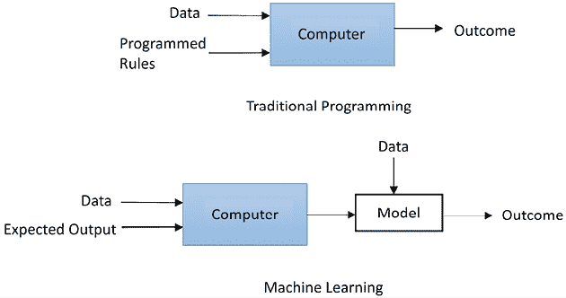

图 1.3：机器学习与传统编程的对比

在传统编程中，计算机遵循一组预定义的规则来处理输入数据并生成结果。在机器学习中，计算机试图模仿人类思维。它与输入数据、预期输出和环境进行互动，并推导出由一个或多个数学模型表示的模式。然后，这些模型用于与未来的输入数据互动并生成结果。与自动化不同，在机器学习的设置中，计算机并不会收到明确的指令性编码。

数据量正在呈指数增长。如今，文本、音频、图像和视频数据的洪流难以估量。**物联网**（**IoT**）是新型互联网的最新发展，它将日常设备互联起来。物联网将把家电和自动驾驶汽车的数据带到前台。这一趋势可能会继续，我们将拥有更多生成和处理的数据。除了数据量的增加，近年来可用数据的质量也在不断提高，部分原因是存储成本降低。这推动了机器学习算法和数据驱动解决方案的发展。

## 机器学习应用

阿里巴巴的联合创始人马云在 2018 年的一次演讲中解释道，过去 20 年是 IT 的时代，但未来 30 年将是**数据技术**（**DT**）的时代（[`www.alizila.com/jack-ma-dont-fear-smarter-computers/`](https://www.alizila.com/jack-ma-dont-fear-smarter-computers/)）。在 IT 时代，企业因计算机软件和基础设施而不断壮大。如今，大多数行业的企业已经收集了大量数据，现在正是利用 DT 来解锁洞察、推导模式并推动新业务增长的最佳时机。广义上讲，机器学习技术使企业能够更好地理解客户行为、与客户互动并优化运营管理。

对于我们个人来说，机器学习技术已经在每天不断改善我们的生活。我们都熟悉的一个机器学习应用就是垃圾邮件过滤。另一个是在线广告，根据广告商收集到的关于我们的信息，自动投放广告。请继续关注接下来的章节，您将学习如何开发算法来解决这两个问题以及更多问题。

搜索引擎是我们无法想象没有的机器学习应用。它涉及信息检索，解析我们所寻找的内容，查询相关的最佳记录，并应用上下文排序和个性化排序，根据主题相关性和用户偏好对页面进行排序。电子商务和媒体公司在推荐系统的应用上处于前沿，这些系统帮助客户更快找到产品、服务和文章。

机器学习的应用是无限的，我们每天都能听到新的例子：信用卡欺诈检测、总统选举预测、即时语音翻译、机器人顾问、AI 生成艺术、客服聊天机器人以及由生成性 AI 技术提供的医学或法律咨询——应有尽有！

在 1983 年的*战争游戏*电影中，一台计算机做出了生死攸关的决策，这些决策本可能导致第三次世界大战。就我们所知，当时的技术并未能完成如此壮举。然而，在 1997 年，深蓝超计算机成功击败了一位世界象棋冠军([`en.wikipedia.org/wiki/Deep_Blue_(chess_computer)`](https://en.wikipedia.org/wiki/Deep_Blue_(chess_computer)))。在 2005 年，一辆斯坦福大学的自动驾驶汽车在沙漠中自主行驶了超过 130 英里([`en.wikipedia.org/wiki/DARPA_Grand_Challenge_(2005)`](https://en.wikipedia.org/wiki/DARPA_Grand_Challenge_(2005)))。2007 年，另一支队伍的汽车在城市道路上行驶了超过 60 英里([`en.wikipedia.org/wiki/DARPA_Grand_Challenge_(2007)`](https://en.wikipedia.org/wiki/DARPA_Grand_Challenge_(2007)))。2011 年，沃森计算机在一场问答比赛中击败了人类对手([`en.wikipedia.org/wiki/Watson_(computer)`](https://en.wikipedia.org/wiki/Watson_(computer)))。正如前面提到的，AlphaGo 程序在 2016 年击败了世界顶级围棋选手。截至 2023 年，ChatGPT 已经在多个行业广泛应用，如客户支持、内容生成、市场研究以及培训与教育([`www.forbes.com/sites/bernardmarr/2023/05/30/10-amazing-real-world-examples-of-how-companies-are-using-chatgpt-in-2023`](https://www.forbes.com/sites/bernardmarr/2023/05/30/10-amazing-real-world-examples-of-how-companies-are-using-chatgpt-in-2023))。

如果我们假设计算机硬件是限制因素，那么我们可以尝试预测未来。美国著名发明家和未来学家雷·库兹韦尔就是这样做的，他在 2017 年预测，人工智能将在大约 2029 年达到人类水平的智能([`aibusiness.com/responsible-ai/ray-kurzweil-predicts-that-the-singularity-will-take-place-by-2045`](https://aibusiness.com/responsible-ai/ray-kurzweil-predicts-that-the-singularity-will-take-place-by-2045))。接下来会发生什么？

迫不及待想开始自己的机器学习之旅吗？让我们从先决条件和机器学习的基本类型开始。

# 了解先决条件

模拟人类智能的机器学习是人工智能的一个子领域——这是计算机科学中的一个领域，专注于创建系统。软件工程是计算机科学中的另一个领域。通常，我们可以将 Python 编程视为一种软件工程。机器学习与线性代数、概率论、统计学和数学优化也有着紧密的关系。我们通常基于统计学、概率论和线性代数构建机器学习模型，然后通过数学优化来优化这些模型。

阅读本书的大多数人应该已经具备了良好的，或至少足够的 Python 编程能力。那些对数学知识不太自信的人，可能会想知道应该花多少时间学习或复习前面提到的科目。别担心；我们将在本书中不深入探讨数学细节的情况下，让机器学习为我们所用。这只需要一些概率论和线性代数的基础 101 知识，这有助于我们理解机器学习技术和算法的机制。而且它会变得越来越容易，因为我们将在 Python 这个我们喜欢且熟悉的语言中，从零开始和使用流行的包来构建模型。

对于那些想学习或复习概率论和线性代数的人，可以随时查找基础的概率论和基础线性代数资源。网上有许多资源，例如，[`people.ucsc.edu/~abrsvn/intro_prob_1.pdf`](https://people.ucsc.edu/~abrsvn/intro_prob_1.pdf)，哈佛大学的在线课程*Introduction to Probability*（[`pll.harvard.edu/course/introduction-probability-edx`](https://pll.harvard.edu/course/introduction-probability-edx)），讲授*概率 101*，以及关于基础线性代数的论文：[`www.maths.gla.ac.uk/~ajb/dvi-ps/2w-notes.pdf`](http://www.maths.gla.ac.uk/~ajb/dvi-ps/2w-notes.pdf)。

想要系统学习机器学习的人可以报读计算机科学、人工智能，近年来也有数据科学与人工智能的硕士课程。同时，也有各种数据科学训练营。不过，训练营的选择通常较为严格，因为它们更侧重于就业导向，而且课程时长通常较短，范围从 4 到 10 周不等。另一个选择是免费的**大规模开放在线课程**（**MOOCs**），例如 Andrew Ng 的著名机器学习课程。最后但同样重要的是，行业博客和网站是我们了解最新进展的好资源。

机器学习不仅仅是一项技能，它也有点像运动。我们可以参加几种机器学习竞赛，例如 Kaggle（[www.kaggle.com](https://www.kaggle.com)）——有时是为了不错的现金奖励，有时是为了乐趣，但大多数时候是为了发挥我们的特长。不过，要赢得这些竞赛，我们可能需要利用某些技巧，这些技巧仅在竞赛环境中有用，而不适用于解决商业问题的环境。没错——**没有免费的午餐**定理（[`en.wikipedia.org/wiki/No_free_lunch_theorem`](https://en.wikipedia.org/wiki/No_free_lunch_theorem)）在这里适用。在机器学习的背景下，这一定理表明，没有任何单一算法能够在所有可能的数据集和问题领域中普遍优越。

接下来，我们将看看三种机器学习类型。

# 入门三种机器学习类型

一个机器学习系统接收输入数据——这些数据可以是数值的、文本的、视觉的或视听的。系统通常有一个输出——这可以是一个浮点数，比如自驾车的加速度，或者是一个整数，表示一个类别（也称为**类**），例如通过图像识别分辨出猫或老虎。

机器学习的主要任务是探索和构建能够从历史数据中学习并对新输入数据做出预测的算法。对于数据驱动的解决方案，我们需要定义一个评估函数，称为**损失**或**代价函数**，它用于衡量模型学习的效果。在这种设置下，我们创建一个优化问题，目标是以最有效和最优化的方式进行学习。

根据学习数据的性质，机器学习任务大致可以分为以下三类：

+   **无监督学习**：当学习数据仅包含指示信号而没有附加任何描述（我们称之为**无标签数据**）时，必须由我们来找出数据背后的结构，发现隐藏的信息，或者确定如何描述数据。无监督学习可用于检测异常情况，如欺诈或设备故障，或将具有相似在线行为的客户分组进行营销活动。数据可视化使数据更易理解，降维则从噪声数据中提取相关信息，这些也属于无监督学习的范畴。

+   **监督学习**：当学习数据除了指示信号外，还附带描述、目标或期望输出（我们称之为**有标签数据**）时，学习目标是找到一个将输入映射到输出的一般规则。学习到的规则随后用于为新数据标注未知的输出。标签通常由事件日志系统提供，或者由人类专家评估。如果可行，标签也可以通过人类评审员、众包等方式生成。

监督学习通常用于日常应用中，比如人脸和语音识别、产品或电影推荐、销售预测和垃圾邮件检测。

+   **强化学习**：学习数据提供反馈，系统根据反馈适应动态条件，最终实现特定目标。系统根据反馈评估其性能并作出相应反应。最著名的实例包括用于工业自动化的机器人、自驾车和国际象棋大师 AlphaGo。强化学习与监督学习的关键区别在于与环境的互动。

下图展示了机器学习任务的类型：

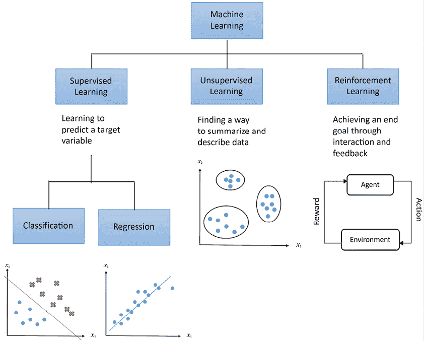

图 1.4：机器学习任务类型

如图所示，我们可以将监督学习进一步细分为回归和分类。**回归**训练并预测连续值的响应，例如预测房价，而**分类**则尝试找到适当的类别标签，比如分析正/负情感和预测贷款违约。

如果并非所有学习样本都被标记，但有一些被标记了，那么我们就有**半监督** **学习**。这利用未标记的数据（通常是大量的）进行训练，除了少量的标记数据。半监督学习适用于获取完全标记数据集代价昂贵，并且标记小部分数据更加实际的情况。例如，标记高光谱遥感图像通常需要熟练的专家，而获取未标记数据相对容易。

对这些抽象概念感到有些困惑吗？别担心，我们将在本书后面遇到许多这些类型的机器学习任务的具体例子。例如，在*第二章*，*使用朴素贝叶斯构建电影推荐引擎*中，我们将深入探讨监督学习分类及其流行的算法和应用。同样，在*第五章*，*使用回归算法预测股票价格*中，我们将探索监督学习回归。

我们将在*第八章*，*使用聚类和主题建模在新闻组数据集中发现潜在主题*中重点介绍无监督学习技术和算法。最后但同样重要的是，第三种机器学习任务——强化学习，将在*第十五章*，*在复杂环境中使用强化学习做出决策*中介绍。

除了根据学习任务对机器学习进行分类外，我们还可以按时间顺序进行分类。

## 机器学习算法发展的简要历史

事实上，我们拥有一个完整的机器学习算法“动物园”，这些算法经历了不同程度的流行。我们可以大致将它们分为五种主要的方式：基于逻辑的学习、统计学习、人工神经网络、遗传算法和深度学习。

**基于逻辑的**系统是最早占主导地位的。它们使用由人工专家指定的基本规则，系统利用这些规则尝试通过形式逻辑、背景知识和假设进行推理。

**统计学习**理论试图找到一个函数来形式化变量之间的关系。在 1980 年代中期，**人工神经网络**（**ANNs**）开始崭露头角。人工神经网络模仿动物的大脑，由相互连接的神经元组成，这些神经元也是生物神经元的模仿。它们试图建模输入与输出值之间的复杂关系，并捕捉数据中的模式。人工神经网络在 1990 年代被统计学习系统所取代。

**遗传算法**（**GA**）在 1990 年代很受欢迎。它们模仿生物进化过程，尝试通过变异和交叉等方法找到最优解。

在 2000 年代，集成学习方法引起了人们的关注，这些方法结合了多个模型以提高性能。

自 2010 年代末以来，我们看到**深度学习**成为主导力量。深度学习这个术语大约在 2006 年被提出，指的是具有多层的深度神经网络。深度学习的突破源于**图形处理单元**（**GPU**）的整合和应用，它们大大加速了计算。大数据集的可用性也推动了深度学习的革命。

GPU 最初是为了渲染视频游戏而开发的，擅长并行矩阵和向量代数。人们认为深度学习与人类学习的方式相似。因此，它可能实现“有感知的机器”的承诺。当然，在本书中，我们将在*第十一章*《使用卷积神经网络对服装图像进行分类》和*第十二章*《利用循环神经网络进行序列预测》中深入探讨深度学习，在*第六章*《使用人工神经网络预测股价》中也有简要讨论。

机器学习算法持续快速发展，研究领域涵盖**迁移学习**、**生成模型**和强化学习，这些是 AIGC 的核心支柱。我们将在*第十三章*《通过 Transformer 模型推动语言理解与生成》和*第十四章*《使用 CLIP 构建图像搜索引擎：一种多模态方法》中探讨这些最新进展。

我们中的一些人可能听说过**摩尔定律**——这是一种经验法则，声称计算机硬件随时间呈指数级增长。该法则由英特尔的联合创始人戈登·摩尔（Gordon Moore）于 1965 年首次提出。根据摩尔定律，芯片上的晶体管数量每两年应该翻一倍。在下图中，你可以看到这一规律得到了很好的验证（气泡的大小对应 GPU 中晶体管的平均数量）：

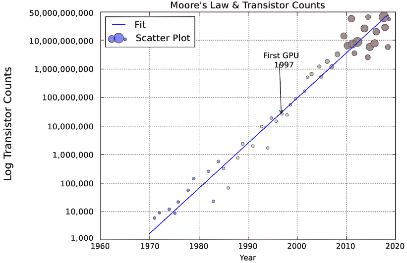

图 1.5：过去几十年的晶体管数量

共识似乎是，摩尔定律将在接下来的几十年继续有效。这为雷·库兹韦尔（Ray Kurzweil）预测在 2029 年实现真正的机器智能提供了一些可信度。

# 深入挖掘机器学习的核心

在讨论了机器学习算法的分类后，我们现在将深入探讨机器学习的核心——用数据进行概括、不同层次的概括以及如何达到合适的概括层次的方法。

## 用数据进行概括

数据的好处是它在世界上有大量存在。坏处是处理这些数据非常困难。挑战来自于数据的多样性和噪声。我们人类通常处理进入我们耳朵和眼睛的数据。这些输入会转化为电信号或化学信号。在一个非常基础的层面，计算机和机器人也处理电信号。

这些电信号随后会被转化为 0 和 1。然而，在本书中我们使用 Python 进行编程，在这个层面上，通常我们将数据表示为数字或文本。然而，文本并不是特别方便，因此我们需要将其转化为数值。

特别是在监督学习的背景下，我们有一个类似于考试复习的场景。我们有一组练习题和实际考试。我们应该能够在没有提前接触相同问题的情况下回答考试问题。这被称为**泛化**——我们从练习题中学到一些东西，并希望能够将这些知识应用于其他类似的问题。在机器学习中，这些练习题被称为**训练集**或**训练样本**。机器学习模型从这些样本中推导出模式。而实际考试则是**测试集**或**测试样本**。模型最终将在这些测试集中应用。学习效果通过学习模型与测试的兼容性来衡量。

有时，在练习题和实际考试之间，我们会进行模拟考试来评估自己在实际考试中的表现，并帮助复习。这些模拟考试在机器学习中被称为**验证集**或**验证样本**。它们帮助我们验证模型在模拟环境中的表现，然后我们根据结果对模型进行微调，以实现更高的准确度。

传统的程序员会与业务分析师或其他专家进行沟通，然后实现一个税收规则，例如将某个值与另一个对应的值相乘。而在机器学习环境中，我们可以给计算机提供一堆输入和输出示例；或者，如果我们想更有雄心，可以将实际的税法文本输入程序。我们可以让机器消耗这些数据并自动推导出税收规则，就像自动驾驶汽车不需要太多明确的人类输入一样。

在物理学中，我们也遇到几乎相同的情况。我们想要了解宇宙如何运作，并用数学语言来制定规律。由于我们不知道宇宙如何运作，唯一能做的就是在尝试制定规律时测量所产生的误差，并尽量减少它。在监督学习任务中，我们将结果与期望值进行比较。在无监督学习中，我们通过相关指标来衡量我们的成功。例如，我们希望数据点根据相似性进行分组，形成簇；这些指标可以是簇内数据点的相似度，或者两个簇之间数据点的差异度。在强化学习中，程序通过评估自己的操作来进行学习，例如，在国际象棋游戏中使用预定义的函数来评估其走法。

除了数据的正确泛化外，还有两种泛化层次，过拟合和欠拟合，我们将在下一节中探讨这两个层次。

## 过拟合、欠拟合与偏差-方差权衡

在本节中，我们将详细探讨两种泛化层次，并深入分析偏差-方差权衡。

### 过拟合

达到合适的拟合模型是机器学习任务的目标。那么，如果模型出现过拟合怎么办？**过拟合**意味着模型对现有观察数据**拟合得过于完美**，但无法预测未来新的观察数据。让我们看一下以下的类比。

如果我们做很多考试的练习题，可能会开始找到一些与学科内容无关的答题方法。例如，给定只有五道练习题，我们可能会发现，如果选择题中有两次出现*土豆*，一次出现*西红柿*，三次出现*香蕉*，答案总是*A*；如果有一次出现*土豆*，三次出现*西红柿*，两次出现*香蕉*，答案总是*B*。然后我们可能会得出这样的结论：这总是成立的，并在之后应用这样的理论，尽管学科或答案与土豆、西红柿或香蕉无关。更糟糕的是，我们可能会逐字记住每一道题的答案。这样，我们在练习题上会得分很高，并希望实际考试中的问题与练习题相同。然而，实际上，我们在考试中的得分会很低，因为考试中很少会出现完全相同的问题。

记忆现象可能导致过拟合。这种情况发生在我们从训练集中过度提取信息，使得我们的模型只在这些训练数据上表现良好。然而，过拟合并不会帮助我们将模型推广到新数据，并从中推导出真正的规律。因此，模型在处理之前未见过的数据集时表现很差。我们称这种情况为机器学习中的**高方差**。让我们快速回顾一下方差：*方差*衡量的是预测结果的分散程度，即预测结果的变化性。它可以通过以下方式计算：

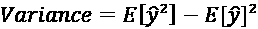

这里，*ŷ* 是预测值，E[] 是期望或期望值，表示基于概率分布的随机变量的平均值。

以下示例展示了典型的过拟合情况，其中回归曲线试图完美地适应所有观察到的样本：

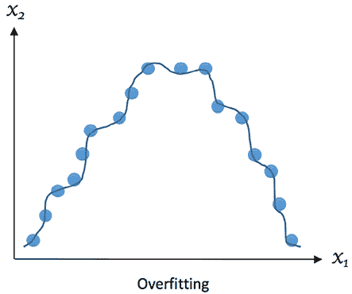

图 1.6：过拟合示例

过拟合发生在我们尝试基于相对于少量观察样本过多的参数来描述学习规则，而不是描述潜在关系，例如之前的土豆、西红柿和香蕉的例子，其中我们仅从五个学习样本中推导出三个参数。过拟合还发生在我们使模型过于复杂，以至于它完美拟合所有训练样本，就像之前提到的，记住所有问题的答案。

### 欠拟合

相反的情况是**欠拟合**。当模型欠拟合时，它在训练集上的表现不好，在测试集上也不会表现好，这意味着它未能捕捉到数据的潜在趋势。如果我们用的数据不足来训练模型，就像我们不复习足够的材料而无法通过考试；如果我们尝试为数据拟合错误的模型，也会发生这种情况，就像我们如果采取错误的方法和错误的学习方式，做任何练习或考试都会得低分。我们将这些情况描述为机器学习中的**高** **偏差**，尽管它的方差较低，因为训练集和测试集中的表现一致，都是不好的。如果你需要快速回顾一下偏差，下面是它的定义：**偏差**是预测值和真实值之间的差异。它的计算方法如下：

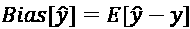

这里，*ŷ* 是预测值，*y* 是真实值。

以下示例展示了典型的欠拟合情况，其中回归曲线没有很好地拟合数据，或者没有捕捉到数据的潜在模式：

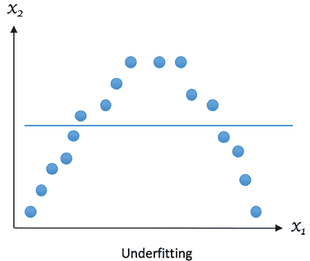

图 1.7：欠拟合示例

现在，让我们看看一个良好拟合的示例应该是什么样子：

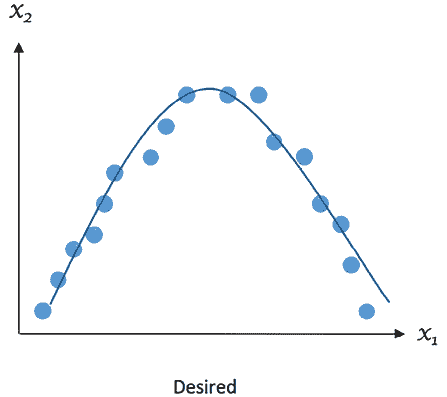

图 1.8：期望拟合的示例

## 偏差-方差权衡

显然，我们希望避免过拟合和欠拟合。回想一下，**偏差**是学习算法中由不正确假设引起的误差；高偏差会导致欠拟合。**方差**衡量模型预测对数据集变化的敏感度。因此，我们需要避免偏差或方差过高的情况。那么，是否意味着我们应该始终尽量将偏差和方差都降到最低？答案是，如果可能的话，应该是的。但在实践中，偏差和方差之间存在明确的权衡关系，减少一个会增加另一个。这就是所谓的**偏差-方差权衡**。听起来有点抽象？让我们看下一个例子。

假设我们被要求构建一个模型，基于电话民调数据预测候选人当选为美国下任总统的概率。该民调使用邮政编码进行调查。我们从某个邮政编码随机选择样本，估计该候选人获胜的概率为 61%。然而，事实证明他们输了选举。我们的模型出错的地方在哪里？我们首先可能想到的是样本数量过少，仅来自一个邮政编码。这个问题也来源于高偏差，因为某个地区的人们通常有相似的人口特征，尽管这样做会导致估算结果的方差较小。那么，能否通过使用来自更多邮政编码的样本来解决这个问题呢？是的，但不要太高兴。这可能会导致估算结果的方差同时增加。我们需要找到最佳的样本大小——即选择最佳的邮政编码数量，以实现最低的整体偏差和方差。

最小化模型的总误差需要谨慎平衡偏差和方差。给定一组训练样本，*x*[1]、*x*[2]、……、*x*[n]，以及它们的目标值，*y*[1]、*y*[2]、……、*y*[n]，我们希望找到一个回归函数*ŷ*(*x*)，使得它尽可能准确地估计出真实关系 *y*(*x*)。我们通过**均方误差**（**MSE**）来衡量估算误差，即回归模型的好坏：


*E*表示期望。这个误差可以通过以下公式分解为偏差和方差两个部分（尽管理解这一点需要一点基本的概率论知识）：

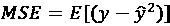

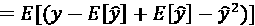

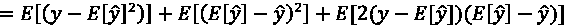

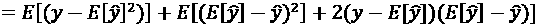

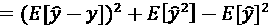

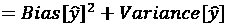

其中，*Bias*项衡量估算误差，*Variance*项描述了估算值*ŷ*相对于其均值*E*[*ŷ*]的波动幅度。学习模型*ŷ*(*x*)越复杂，训练样本数量越大，偏差就越小。然而，这也会导致模型进行更多的调整，以更好地适应增多的数据点。结果，方差会增大。

我们通常采用交叉验证技术，以及正则化和特征降维，来找到平衡偏差和方差、减少过拟合的最优模型。接下来我们将讨论这些内容。

你可能会问为什么我们只关注过拟合问题：欠拟合呢？这是因为欠拟合很容易识别：如果模型在训练集上表现不佳，则会发生。发生这种情况时，我们需要找到一个更好的模型或调整一些参数以更好地拟合数据，这在任何情况下都是必须的。另一方面，过拟合很难察觉。通常情况下，当我们得到一个在训练集上表现良好的模型时，会过于高兴并认为它已经可以立即投入生产。这可能非常危险。我们应该采取额外措施，确保出色的性能不是由于过拟合造成的，并且这种出色的性能适用于排除训练数据的数据。

## 使用交叉验证避免过拟合

你将在本书的后续多次看到交叉验证的实际运用。因此，如果你发现这部分内容难以理解，请不要恐慌，因为你很快就会成为交叉验证的专家。

请记住，在练习问题和实际考试之间，有模拟考试，我们可以评估我们在实际考试中的表现如何，并利用这些信息进行必要的复习。在机器学习中，验证过程有助于评估模型如何推广到独立或未见数据集的能力。在传统的验证设置中，原始数据通常被分成三个子集，通常为 60%的训练集，20%的验证集，以及其余的 20%作为测试集。如果在划分后有足够的训练样本，并且我们只需要一个模拟性能的粗略估计，那么这种设置就足够了。否则，交叉验证更可取。交叉验证有助于减少变异性，从而限制过拟合。

在一轮交叉验证中，原始数据被分为两个子集，分别用于**训练**和**测试**（或**验证**）。记录测试性能。类似地，通过不同的划分执行多轮交叉验证。所有轮次的测试结果最终平均以生成模型预测性能的更可靠估计。

当训练样本非常大时，通常将其分为训练、验证和测试（三个子集），并在后两者上进行性能检查。在这种情况下，交叉验证不太理想，因为为每一轮训练模型的计算成本很高。但如果你能负担得起，没有理由不使用交叉验证。当数据量不那么大时，交叉验证绝对是个不错的选择。

目前主要有两种交叉验证方案：穷举式和非穷举式。在**穷举式方案**中，我们在每轮中留下固定数量的观测值作为测试（或验证）样本，使用其余的观测值作为训练样本。这个过程会重复进行，直到所有可能的不同样本子集都被用于测试一次。例如，我们可以应用**留一交叉验证**（**LOOCV**），让每个样本都成为一次测试集。对于一个大小为 *n* 的数据集，LOOCV 需要进行 *n* 轮交叉验证。当 *n* 较大时，这可能会非常慢。下图展示了 LOOCV 的工作流：

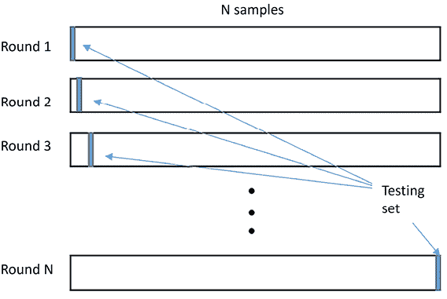

图 1.9：留一交叉验证的工作流

另一方面，**非穷举式方案**，顾名思义，并不会尝试所有可能的分区。这个方案中最常用的一种是**k 折交叉验证**。首先，我们将原始数据随机分为 **k 个等大小** 的折叠。在每次试验中，这些折叠中的一个会成为测试集，其余的数据将成为训练集。

我们将这个过程重复 *k* 次，每个折叠都作为指定的测试集。最后，我们将 *k* 组测试结果进行平均，以便评估。常见的 *k* 值为 3、5 和 10。下表展示了五折交叉验证的设置：

| **轮次** | **折叠 1** | **折叠 2** | **折叠 3** | **折叠 4** | **折叠 5** |
| --- | --- | --- | --- | --- | --- |
| 1 | **测试** | 训练 | 训练 | 训练 | 训练 |
| 2 | 训练 | **测试** | 训练 | 训练 | 训练 |
| 3 | 训练 | 训练 | **测试** | 训练 | 训练 |
| 4 | 训练 | 训练 | 训练 | **测试** | 训练 |
| 5 | 训练 | 训练 | 训练 | 训练 | **测试** |

表 1.1：五折交叉验证的设置

与 LOOCV 相比，K 折交叉验证通常具有较低的方差，因为我们使用的是一组样本，而不是单个样本进行验证。

我们还可以多次随机将数据分为训练集和测试集。这种方法正式称为**留出法**。这个算法的问题在于，有些样本可能永远不会进入测试集，而有些样本可能会被多次选入测试集。

最后但同样重要的是，**嵌套交叉验证**是交叉验证的组合。它包括以下两个阶段：

+   **内部交叉验证**：这个阶段用于找到最佳拟合，可以实现为 *k* 折交叉验证。

+   **外部交叉验证**：这个阶段用于性能评估和统计分析。

我们将在整本书中非常密集地使用交叉验证。在此之前，让我们通过类比来了解交叉验证，这将帮助我们更好地理解它。

一位数据科学家计划开车上班，他的目标是每天都在早上 9 点之前到达。他需要决定出发时间和路线。他尝试了周一、周二和周三这三天的不同参数组合，并记录了每次试验的到达时间。然后，他找出了最佳的调度并每天应用它。然而，效果并没有预期的好。

事实证明，调度**模型**对前面三天收集到的数据点发生了过拟合，可能在周四和周五效果不佳。更好的解决方案是，在周四和周五上测试从周一到周三得到的最佳参数组合，并根据不同的学习日和测试日组合，重复这一过程。这种类比交叉验证确保了所选调度在整个星期内都能有效。

总之，交叉验证通过结合对不同数据子集的预测性能评估，得出了更准确的模型表现评估。这项技术不仅减少了方差，避免了过拟合，还能让我们了解一个模型在实际中的总体表现。

## 通过正则化避免过拟合

另一种防止过拟合的方法是**正则化**。回想一下，模型的不必要复杂性是过拟合的来源。正则化通过在我们试图最小化的误差函数中添加额外的参数，从而惩罚复杂模型。

根据奥卡姆剃刀原理，应该偏好简单的方法。威廉·奥卡姆是一位僧侣和哲学家，大约在 1320 年，他提出了一个观点：应该选择最简单的、符合数据的假设。这样做的一个理由是，我们可以创造出比复杂模型更少的简单模型。例如，直观上，我们知道高次多项式模型比线性模型更多。原因在于，一条直线（*y* = *ax* + *b*）只由两个参数控制——截距 *b* 和斜率 *a*。直线的系数可以在二维空间内变化。而二次多项式则为二次项增加了一个额外的系数，我们可以通过系数在三维空间内进行表示。因此，使用**高次多项式函数**找到一个完全拟合所有训练数据点的模型要容易得多，因为它的搜索空间远大于线性函数。然而，这些容易得到的模型在泛化能力上远不如线性模型，更容易发生过拟合。当然，简单模型所需的计算时间也较少。下图展示了我们如何分别尝试将线性函数和高次多项式函数拟合到数据上：

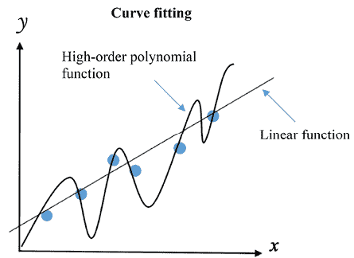

图 1.10：用线性函数和多项式函数拟合数据

线性模型更为优选，因为它可能更好地推广到从底层分布中抽取的更多数据点。我们可以使用正则化通过对高阶多项式施加惩罚来减少其影响。即使从训练数据中学习到一个不那么准确且不那么严格的规则，这也能抑制模型的复杂性。

在本书中，我们将频繁使用正则化，从*第四章*《*使用逻辑回归预测在线广告点击率*》开始。现在，让我们看一个类比，帮助你更好地理解正则化。

一位数据科学家希望给他的机器人看门狗配备识别陌生人和朋友的能力。他为其提供了以下学习样本：

| 男性 | 年轻 | 高 | 戴眼镜 | 穿灰色 | **朋友** |
| --- | --- | --- | --- | --- | --- |
| 女性 | 中年 | 一般 | 无眼镜 | 穿黑色 | **陌生人** |
| 男性 | 年轻 | 矮小 | 戴眼镜 | 穿白色 | **朋友** |
| 男性 | 年长 | 矮小 | 无眼镜 | 穿黑色 | **陌生人** |
| 女性 | 年轻 | 一般 | 戴眼镜 | 穿白色 | **朋友** |
| 男性 | 年轻 | 矮小 | 无眼镜 | 穿红色 | **朋友** |

表 1.2：机器人看门狗的训练样本

机器人可能会迅速学会以下规则：

+   任何中年女性，身高一般，未戴眼镜且穿着黑色衣服的，都是陌生人

+   任何身材矮小的中年男性，戴眼镜且穿着黑色衣服的，都是陌生人

+   其他任何人都是他的朋友

尽管这些规则完全符合训练数据，但它们似乎过于复杂，不太可能很好地推广到新访客。相比之下，数据科学家限制了学习的方面。一个对数百个其他访客有效的松散规则可能如下：任何没有眼镜、穿黑色衣服的人都是陌生人。

除了惩罚复杂性，我们还可以通过早期停止训练过程来防止过拟合。如果我们限制模型的学习时间或设置某些内部停止标准，更有可能得到一个更简单的模型。通过这种方式控制模型复杂度，因此，过拟合变得不太可能。这种方法在机器学习中称为**早期停止**。

最后但同样重要的是，值得注意的是正则化应保持在适度水平，或者更准确地说，需要对其进行微调以达到最佳水平。正则化过小不会产生任何影响；正则化过大则会导致欠拟合，因为它会使模型远离真实值。我们将在*第四章*《*使用逻辑回归预测在线广告点击率*》、*第五章*《*使用回归算法预测股票价格*》和*第六章*《*使用人工神经网络预测股票价格*》中探讨如何实现最佳正则化。

## 通过特征选择和降维来避免过拟合

我们通常将数据表示为一个数字网格（**矩阵**）。每一列代表一个变量，在机器学习中我们称之为**特征**。在监督学习中，其中一个变量实际上不是特征，而是我们试图预测的标签。在监督学习中，每一行是一个样本，我们可以用它来进行训练或测试。

特征的数量对应于数据的维度。我们的机器学习方法依赖于维度的数量与样本数量之间的关系。例如，文本和图像数据是高维的，而传感器数据（如温度、压力或 GPS）则维度相对较少。

拟合高维数据在计算上是昂贵的，并且容易出现过拟合，因为其复杂度较高。更高的维度也无法进行可视化，因此我们不能使用简单的诊断方法。

并不是所有特征都是有用的，它们可能只是增加了结果的随机性。因此，通常需要进行良好的特征选择。**特征选择**是挑选出一个重要特征子集，以便更好地构建模型的过程。在实际应用中，并不是数据集中的每个特征都包含有助于区分样本的信息；一些特征要么是冗余的，要么是无关的，因此可以在损失较小的情况下丢弃。

原则上，特征选择归结为多次二进制决策，即是否包含某个特征。对于 *n* 个特征，我们可以得到 *2*^n 个特征集，对于特征数量较多时，这个数字可能非常大。例如，10 个特征时，我们有 1,024 种可能的特征集（例如，如果我们在决定穿什么衣服，特征可以是温度、降雨、天气预报和我们要去的地方）。基本上，我们有两个选择：要么从所有特征开始，并逐步去除特征，要么从最小的特征集开始，并逐步添加特征。然后，我们将每次迭代中的最佳特征集进行比较。在某一时刻，暴力评估变得不可行。因此，发明了更先进的特征选择算法，用于提取最有用的特征/信号。我们将在*第四章*，*使用逻辑回归预测在线广告点击率*中详细讨论如何进行特征选择。

另一种常见的降维方法是将高维数据转化为低维空间。这被称为**降维**或**特征投影**。我们将在*第七章*，*使用文本分析技术挖掘 20 个新闻组数据集*中详细讨论这一点，届时我们将把文本数据编码为二维空间；以及在*第九章*，*使用支持向量机识别面孔*中，我们将讨论如何将高维图像数据投影到低维空间。

在本节中，我们讨论了机器学习的目标是找到数据的最佳泛化，并避免不良的泛化。在接下来的两节中，我们将探讨如何通过机器学习的各个阶段的技巧来接近这一目标，包括下一节中的数据预处理和特征工程，以及随后一节中的建模。

# 数据预处理和特征工程

数据预处理和特征工程在机器学习中起着至关重要的基础作用。这就像为一栋建筑奠定基础——基础越强大、准备得越充分，最终的结构（机器学习模型）就会越好。下面是它们关系的细分：

+   **预处理为高效学习准备数据**：来自各种来源的原始数据通常包含不一致、错误和无关信息。预处理通过清理、组织和转换数据，将其转化为适合所选机器学习算法的格式。这使得算法能够更轻松高效地理解数据，从而提高模型性能。

+   **预处理有助于提高模型的准确性和泛化能力**：通过处理缺失值、异常值和不一致性，预处理减少了数据中的噪音。这使得模型能够专注于数据中的真实模式和关系，从而提高预测的准确性，并在未见过的数据上实现更好的泛化能力。

+   **特征工程提供有意义的输入变量**：原始数据经过转换和处理，生成新的特征或选择相关特征。新特征可能会改善模型性能并产生有价值的洞见。

总体而言，数据预处理和特征工程是机器学习工作流中至关重要的一步。通过投入时间和精力进行适当的预处理和特征工程，你为构建可靠、准确和具有广泛泛化能力的机器学习模型奠定了基础。在本节中，我们将首先讨论预处理阶段。

## 预处理与探索

在学习过程中，我们需要高质量的学习材料。我们无法从胡言乱语中学习，因此会自动忽略那些不合理的内容。机器学习系统无法识别胡言乱语，因此我们需要通过清理输入数据来帮助它。人们常说，清理数据占机器学习的很大一部分。有时，数据清理工作已经为我们完成，但你不应依赖这种情况。

要决定如何清理数据，我们需要熟悉数据。有些项目尝试自动探索数据并做出一些智能的操作，比如生成报告。遗憾的是，目前我们还没有普遍的解决方案，因此你需要做一些工作。

我们可以做两件事，它们并不是互相排斥的：首先，扫描数据，其次，可视化数据。这还取决于我们处理的数据类型——无论是数字网格、图像、音频、文本，还是其他什么类型。

最终，数字网格是最方便的形式，我们将始终致力于拥有数值特征。假设在本节的其余部分我们有一张数字表格。

我们想知道哪些特征有缺失值，缺失值如何分布，以及我们拥有哪些类型的特征。值大致可以遵循正态分布、二项分布、泊松分布，或其他分布。特征可以是二元的：要么是，是或否，正或负，等等。它们也可以是分类的：属于某个类别，例如大陆（非洲、亚洲、欧洲、南美洲、北美洲等）。分类变量也可以是有序的，例如高、中、低。特征也可以是定量的，例如温度（以度数表示）或价格（以美元表示）。现在，让我们深入探讨如何应对每种情况。

### 处理缺失值

很多时候，我们会缺失某些特征的值。这可能由于各种原因发生。始终拥有一个值可能不方便、昂贵，甚至是不可能的。也许我们过去无法测量某个数量，因为我们没有合适的设备，或者根本没有意识到这个特征是相关的。然而，我们只能接受过去的缺失值。

有时，我们很容易就能发现缺失值，只需通过扫描数据或统计某个特征的值的数量，并将这个数量与根据行数预计的值的数量进行比较，就能发现缺失值。某些系统会用例如 999,999 或-1 来编码缺失值。如果有效值远小于 999,999，那么这种做法是合理的。如果幸运的话，你可能会有数据字典或元数据提供的信息，帮助你了解特征的详细情况。

一旦我们知道缺失值的存在，就会出现如何处理它们的问题。最简单的答案是忽略它们。然而，某些算法无法处理缺失值，程序会直接拒绝继续执行。在其他情况下，忽略缺失值会导致结果不准确。第二种解决方案是用固定值替代缺失值——这叫做**插补**。我们可以用某一特征有效值的算术**平均值**、**中位数**或**众数**来进行插补。理想情况下，我们会有一些相对可靠的变量的先验知识。例如，我们可能知道某个地点的季节性温度平均值，可以根据日期对缺失的温度值进行插补。我们将在*第十章*，*机器学习最佳实践*中详细讨论如何处理缺失数据。类似的，接下来几节的技术将在后续章节中讨论和应用，以防你对它们的使用方式感到不确定。

### 标签编码

人类能够处理各种类型的值。机器学习算法（有些例外）要求数值型的值。如果我们提供一个字符串，例如`Ivan`，除非我们使用专门的软件，否则程序不会知道如何处理。在这个例子中，我们处理的是一个类别特征——可能是名字。我们可以把每个独特值看作一个标签。（在这个特定例子中，我们还需要决定如何处理大小写——`Ivan`和`ivan`是否相同？）。然后我们可以用一个整数替换每个标签——**标签编码**。

以下示例展示了标签编码的工作原理：

| **标签** | **编码标签** |
| --- | --- |
| 非洲 | 1 |
| 亚洲 | 2 |
| 欧洲 | 3 |
| 南美洲 | 4 |
| 北美洲 | 5 |
| 其他 | 6 |

表 1.3：标签编码示例

这种方法在某些情况下可能会有问题，因为学习者可能会得出有顺序的结论（除非这是预期的，例如，*bad=0*，*ok=1*，*good=2*，和*excellent=3*）。在前面的映射表中，`Asia`和`North America`在编码后相差`4`，这有点不直观，因为很难量化它们。下一节的独热编码采用了不同的方法。

### 独热编码

**一对 K**，或者说**独热编码**，方案使用虚拟变量来编码类别特征。最初，这一方法应用于数字电路。虚拟变量具有二进制值，如比特，因此它们取值为零或一（相当于真或假）。例如，如果我们想要编码大洲，我们将有虚拟变量，如`is_asia`，如果该大洲是`Asia`，则为真，否则为假。一般来说，我们需要的虚拟变量数量等于独特值的数量减去一（或者有时是独特值的确切数量）。我们可以从虚拟变量中自动确定一个标签，因为它们是互斥的。

如果虚拟变量的值都是假值，那么正确的标签就是没有虚拟变量的标签。下表展示了大陆的编码方式：

| **大陆** | **是否为非洲** | **是否为亚洲** | **是否为欧洲** | **是否为南美洲** | **是否为北美洲** |
| --- | --- | --- | --- | --- | --- |
| 非洲 | 1 | 0 | 0 | 0 | 0 |
| 亚洲 | 0 | 1 | 0 | 0 | 0 |
| 欧洲 | 0 | 0 | 1 | 0 | 0 |
| 南美洲 | 0 | 0 | 0 | 1 | 0 |
| 北美 | 0 | 0 | 0 | 0 | 1 |
| 其他 | 0 | 0 | 0 | 0 | 0 |

表 1.4: 独热编码示例

编码会生成一个矩阵（数字网格），其中包含许多零（假值）和偶尔的 1（真值）。这种类型的矩阵称为**稀疏矩阵**。稀疏矩阵表示由`scipy`包很好地处理，稍后我们将在本章中讨论它。

### 密集嵌入

虽然独热编码是一种简单且稀疏的分类特征表示，**密集嵌入**提供了一个紧凑的、连续的表示，能够基于数据中的共现模式捕捉语义关系。例如，使用密集嵌入，可能将大陆类别表示为类似于以下的三维连续向量：

+   非洲: [0.9, -0.2, 0.5]

+   亚洲: [-0.1, 0.8, 0.6]

+   欧洲: [0.6, 0.3, -0.7]

+   南美洲: [0.5, 0.2, 0.1]

+   北美洲: [0.4, 0.3, 0.2]

+   其他: [-0.8, -0.5, 0.4]

在这个例子中，你可能会注意到南美和北美的向量比非洲和亚洲的向量更接近。密集嵌入能够捕捉类别之间的相似性。在另一个例子中，你可能会看到欧洲和北美的向量更接近，这基于文化上的相似性。

我们将在*第七章*，*使用文本分析技术挖掘 20 个新闻组数据集*中进一步探讨密集嵌入。

### 缩放

不同特征的值可能相差几个数量级。有时，这意味着较大的值会主导较小的值。这取决于我们使用的算法。为了某些算法能够正常工作，我们需要对数据进行缩放。

以下是我们可以应用的几种常见策略：

+   标准化会移除特征的均值，并将其除以标准差。如果特征值是正态分布的，我们将得到一个**高斯分布**，它围绕零对称，方差为一。

+   如果特征值不是正态分布的，我们可以去除中位数并除以四分位数范围。**四分位数范围**是指第一四分位数和第三四分位数之间的范围（或第 25^(th)和第 75^(th)百分位数）。

+   零到一之间的范围是特征缩放中常见的范围选择。

在本书中的许多项目中，我们将使用缩放。

数据预处理的高级版本通常称为特征工程。我们将在接下来的部分讨论这一点。

## 特征工程

**特征工程**是创建或改进特征的过程。特征通常是基于常识、领域知识或先前的经验来创建的。特征创建有一些常见的技术；然而，并不能保证创建新特征会改善你的结果。有时，我们可以使用无监督学习找到的簇作为额外的特征。**深度神经网络**通常能够自动推导出特征。

我们将简要介绍一些特征工程技术：多项式转换和分箱。

### 多项式转换

如果我们有两个特征，*a*和*b*，我们可能会怀疑它们之间存在多项式关系，例如 *a*² + *ab* + *b*²。我们可以将一个新特征视为 *a* 和 *b* 的**交互**，例如它们的乘积 *ab*。交互不一定是乘积——虽然这是最常见的选择——它也可以是和、差或比率。如果我们使用比率来避免除以零，我们应该在除数和被除数上都加上一个小常数。

多项式关系中的特征数量和多项式的阶数没有限制。然而，如果我们遵循奥卡姆剃刀原理，我们应该避免使用高阶多项式和多个特征的交互。在实际应用中，复杂的多项式关系往往更难计算，并且容易过拟合，但如果你确实需要更好的结果，它们可能值得考虑。我们将在*第十章《机器学习最佳实践》*中的*最佳实践 12*——*在没有领域知识的情况下进行特征工程*部分中看到多项式转换的应用。

### 分箱

有时候，将特征值分到几个箱子里是有用的。例如，我们可能只关心某一天是否下雨。根据降水值，我们可以将值二值化，如果降水值不为零，则为真值，否则为假值。我们也可以使用统计方法将值分为高、中、低三个箱子。在营销中，我们通常更关心年龄段，比如 18 至 24 岁，而不是具体的年龄，比如 23 岁。

分箱过程不可避免地会导致信息的丢失。然而，根据你的目标，这可能不是问题，实际上还可能减少过拟合的机会。当然，这样做会提高速度，并减少内存或存储需求及冗余。

任何现实世界中的机器学习系统都应该有两个模块：一个数据预处理模块，我们在本节中已经覆盖，另一个是建模模块，将在下一节中介绍。

# 模型组合

一个模型接受数据（通常是预处理过的数据）并产生预测结果。如果我们使用多个模型呢？通过结合各个模型的预测结果，我们能做出更好的决策吗？我们将在本节讨论这一点。

让我们从一个类比开始。在高中时，我们会和其他同学一起坐在一起学习，但考试时我们不应该一起合作。原因当然是，老师想知道我们学到了什么，如果我们只是从朋友那里抄答案，我们可能什么也没学到。后来，在生活中我们发现团队合作很重要。例如，这本书是整个团队的成果，或者可能是多个团队的成果。

显然，一个团队可以比单个个体产生更好的结果。然而，这与奥卡姆剃刀原理相悖，因为单个个体相比团队可以提出更简单的理论。在机器学习中，我们仍然倾向于让模型通过以下模型组合方案进行合作：

+   投票和平均

+   Bagging

+   提升

+   堆叠

现在我们来深入探讨它们。

## 投票和平均

这可能是最容易理解的模型集成类型。它只是意味着最终的输出将是多个模型预测输出值的**多数**或**平均值**。也可以为集成中的各个模型分配不同的权重；例如，某些更可靠的模型可能会被赋予两个投票权。

然而，结合彼此高度相关的模型的结果并不能保证显著的改进。最好通过使用不同的特征或不同的算法来某种程度上多样化模型。如果你发现两个模型高度相关，例如，你可以决定从集成中移除一个模型，并按比例增加另一个模型的权重。

## Bagging

**自助聚合**（**Bootstrap aggregating**，简称**bagging**）是由著名统计学家、加州大学伯克利分校的 Leo Breiman 于 1994 年提出的算法，它将**自助法**应用于机器学习问题。自助法是一种统计程序，通过有放回地抽样数据，从现有数据集中创建多个数据集。自助法可以用来衡量模型的属性，例如偏差和方差。

一般来说，bagging 算法遵循以下步骤：

1.  我们通过有放回地抽样生成新的训练集。

1.  对于每个生成的训练集，我们拟合一个新的模型。

1.  我们通过平均或多数投票来结合模型的结果。

下图说明了使用分类作为示例的 bagging 步骤（圆圈和叉号代表来自两个类别的样本）：

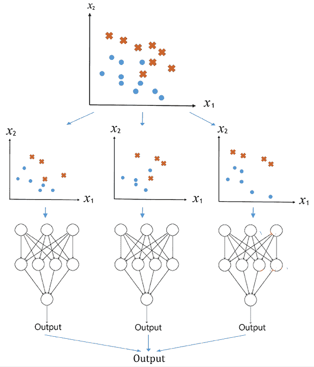

图 1.11：用于分类的 bagging 工作流

正如你所想的，bagging 可以减少过拟合的可能性。

我们将在*第三章*中深入研究 bagging，*使用基于树的算法预测在线广告点击率*。

## 提升

在监督学习的背景下，我们将**弱学习器**定义为比基线稍好一点的学习器，例如随机分配类别或平均值。就像蚂蚁一样，弱学习器个体很弱，但它们组合在一起，能做出令人惊讶的事情。

考虑到每个单独学习者的强度并使用权重是有意义的。这个总体思想叫做**提升**。在提升过程中，所有模型是按顺序训练的，而不是像集成方法（bagging）那样并行训练。每个模型都在相同的数据集上训练，但每个数据样本的权重不同，会考虑到前一个模型的成功。模型训练完成后，权重会被重新分配，用于下一轮训练。通常，对于预测错误的样本，会增加其权重，以加强对这些样本的预测难度。

下图展示了提升过程的步骤，仍以分类为例（圆圈和叉号代表来自两个类别的样本，圆圈或叉号的大小表示分配给它的权重）：

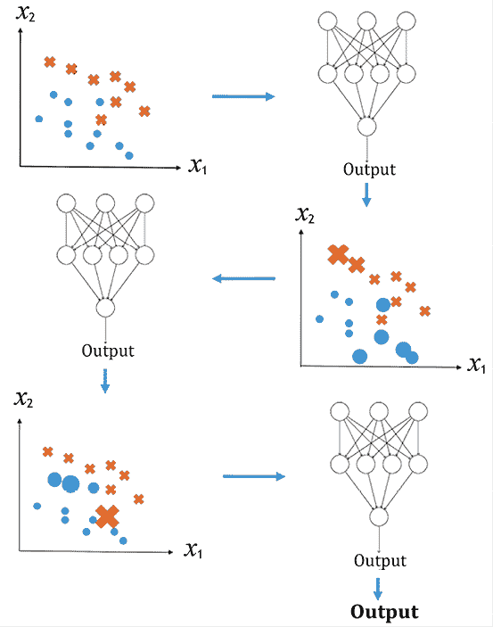

图 1.12：分类任务中的提升工作流程

有许多种提升算法；这些提升算法的主要区别在于它们的加权方案。如果你曾为考试学习过，可能已经应用了类似的技巧，通过识别自己在练习题中遇到困难的类型，并集中精力攻克难题。

Viola-Jones 是一个流行的人脸检测框架，它利用提升算法高效地识别图像中的人脸。在图像或视频中检测人脸属于监督学习。我们给学习者提供包含人脸区域的示例。这里存在不平衡问题，因为通常没有人脸的区域要远多于有脸的区域（大约多 1 万倍）。

一系列分类器逐步筛选出这些负面图像区域。每个阶段，分类器使用越来越多的特征，并在较少的图像窗口上进行处理。其思想是将大部分时间花费在包含人脸的图像区域上。在这种情况下，使用提升（boosting）来选择特征并结合结果。

## 堆叠

**堆叠（Stacking）**方法是将机器学习模型的输出值作为另一个算法的输入值。你当然可以将更高层次算法的输出再作为另一个预测器的输入。你可以使用任何任意拓扑结构，但出于实际原因，你应该先尝试简单的设置，这也符合奥卡姆剃刀原则。

一个有趣的事实是，堆叠常被用于 Kaggle 比赛中的获胜模型。例如，奥托集团产品分类挑战赛的第一名（[www.kaggle.com/c/otto-group-product-classification-challenge](https://www.kaggle.com/c/otto-group-product-classification-challenge)）就是由一个包含 30 多种不同模型的堆叠模型获得的。

到目前为止，我们已经讨论了在数据预处理和建模阶段更容易达到机器学习模型正确泛化所需的一些技巧。我知道你迫不及待想开始一个机器学习项目。让我们通过设置工作环境来做好准备。

# 安装软件和设置

正如书名所示，Python 是我们在整本书中实现所有机器学习算法和技术的编程语言。我们还将使用许多流行的 Python 包和工具，如 NumPy、SciPy、scikit-learn、TensorFlow 和 PyTorch。在本章结束时，确保你已经正确设置了工具和工作环境，即使你已经是 Python 专家或对上述一些工具非常熟悉。

## 设置 Python 和环境

本书中我们将使用 Python 3。Anaconda 的 Python 3 发行版是数据科学和机器学习从业者的最佳选择之一。

**Anaconda** 是一个免费的 Python 发行版，专为数据分析和科学计算设计。它有自己的包管理器 `conda`。该发行版（[`docs.anaconda.com/free/anaconda/`](https://docs.anaconda.com/free/anaconda/)，根据你的操作系统或 Python 版本 3.7 到 3.11）包含大约 700 个 Python 包（截至 2023 年），使其非常方便。对于普通用户来说，**Miniconda**（[`conda.io/miniconda.html`](https://conda.io/miniconda.html)）发行版可能是更好的选择。Miniconda 包含了 `conda` 包管理器和 Python。显然，Miniconda 占用的磁盘空间比 Anaconda 要小得多。

安装 Anaconda 和 Miniconda 的过程是相似的。你可以按照[`docs.conda.io/projects/conda/en/latest/user-guide/install/`](https://docs.conda.io/projects/conda/en/latest/user-guide/install/)上的说明进行操作。首先，你需要根据你的操作系统和 Python 版本下载合适的安装程序，如下所示：

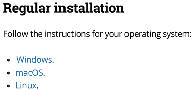

图 1.13：根据你的操作系统选择的安装入口

按照你的操作系统列出的步骤操作。你可以选择图形用户界面（GUI）或命令行界面（CLI）。我个人认为后者更容易。

Anaconda 附带了自己的 Python 安装。在我的机器上，Anaconda 安装程序在我的主目录中创建了一个 `anaconda` 目录，并大约需要 900 MB 的空间。类似地，`Miniconda` 安装程序会在你的主目录中安装一个 `miniconda` 目录。

安装完毕后，随时可以进行尝试。验证是否正确设置 Anaconda 的一种方法是，在 Linux/Mac 的终端或 Windows 的命令提示符中输入以下命令（从现在开始，我们只提到终端）：

```py
python 
```

上述命令行将显示你的 Python 运行环境，如下图所示：

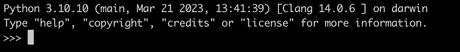

图 1.14：在终端中运行“python”后的截图

如果您没有看到此信息，请检查系统路径或 Python 的运行路径。

总结这一部分，我想强调为什么 Python 是机器学习和数据科学中最受欢迎的语言。首先，Python 因其高可读性和简洁性而闻名，使得构建机器学习模型变得更加容易。我们可以花更少的时间去担心正确的语法和编译，从而有更多的时间去寻找合适的机器学习解决方案。其次，我们拥有大量的 Python 库和框架来支持机器学习：

| **任务** | **Python 库** |
| --- | --- |
| **数据分析** | NumPy、SciPy 和 pandas |
| **数据可视化** | Matplotlib 和 Seaborn |
| **建模** | scikit-learn、TensorFlow、Keras 和 PyTorch |

表 1.5：机器学习中常用的 Python 库

下一步是设置一些本书中将要使用的包。

## 安装主要的 Python 包

在本书的大多数项目中，我们将使用 NumPy ([`www.numpy.org/`](http://www.numpy.org/))、SciPy ([`scipy.org/`](https://scipy.org/))、`pandas` 库 ([`pandas.pydata.org/`](https://pandas.pydata.org/))、scikit-learn ([`scikit-learn.org/stable/`](http://scikit-learn.org/stable/))、TensorFlow ([`www.tensorflow.org/`](https://www.tensorflow.org/)) 和 PyTorch ([`pytorch.org/`](https://pytorch.org/))。

在接下来的章节中，我们将介绍几种本书中主要使用的 Python 包的安装方法。

Conda 环境提供了一种为不同项目隔离依赖项和包的方法。因此，建议为新项目创建并使用一个环境。我们可以使用以下命令创建一个名为“`pyml`”的环境：

```py
conda create --name pyml python=3.10 
```

在这里，我们还指定了 Python 版本 `3.10`，虽然这是可选的，但强烈推荐使用。这样做是为了避免默认使用最新版本的 Python，因为它可能与许多 Python 包不兼容。例如，在编写本文时（2023 年底），PyTorch 不支持 Python `3.11`。

为了激活新创建的环境，我们使用以下命令：

```py
conda activate pyml 
```

激活的环境会显示在提示符前，如下所示：

```py
(pyml) hayden@haydens-Air ~ % 
```

### NumPy

NumPy 是使用 Python 进行机器学习的基础包。它提供了强大的工具，包括以下内容：

+   *N*维数组（`ndarray`）类及其多个子类，代表矩阵和数组

+   各种复杂的数组函数

+   有用的线性代数功能

NumPy 的安装说明可以在 [`numpy.org/install/`](https://numpy.org/install/) 找到。或者，您也可以通过 `conda` 或 `pip` 在命令行中安装，具体如下：

```py
conda install numpy 
```

或

```py
pip install numpy 
```

验证安装的快捷方式是按照如下方式在 Python 中导入：

```py
>>> import numpy 
```

如果没有出现错误信息，则表示安装成功。

### SciPy

在机器学习中，我们主要使用 NumPy 数组来存储由特征向量组成的数据向量或矩阵。SciPy ([`scipy.org/`](https://scipy.org/)) 使用 NumPy 数组，并提供各种科学和数学函数。在终端中安装 SciPy 与以下方式类似：

```py
conda install scipy 
```

或

```py
pip install scipy 
```

### pandas

我们还使用 `pandas` 库 ([`pandas.pydata.org/`](https://pandas.pydata.org/)) 在本书后面进行数据整理。获取 `pandas` 的最佳方法是通过 `pip` 或 `conda`，例如：

```py
conda install pandas 
```

### scikit-learn

`scikit-learn` 库是一个优化性能的 Python 机器学习包，其大部分代码运行速度几乎与等效的 C 代码一样快。NumPy 和 SciPy 也是如此。`scikit-learn` 需要安装 NumPy 和 SciPy。如 [`scikit-learn.org/stable/install.html`](http://scikit-learn.org/stable/install.html) 中的安装指南所述，安装 `scikit-learn` 的最简单方法是使用 `pip` 或 `conda`，如下所示：

```py
pip install -U scikit-learn 
```

或

```py
conda install -c conda-forge scikit-learn 
```

这里，我们使用“`-c conda-forge`”选项告诉 `conda` 在 `conda-forge` 渠道中搜索软件包，这是一个由社区驱动的渠道，提供广泛的开源软件包。

### TensorFlow

TensorFlow 是由 Google Brain 团队发明的 Python 友好的开源库，用于高性能数值计算。它使机器学习更快速，深度学习更容易，具有基于 Python 的便捷前端 API 和基于高性能 C++ 的后端执行。TensorFlow 2 在其首个成熟版本 1.0 的基础上进行了大规模重设计，并于 2019 年底发布。

TensorFlow 因其深度学习模块而广为人知。然而，其最强大之处在于**计算图**，其算法基于此构建。基本上，计算图用于通过张量传达输入与输出之间的关系。

例如，如果我们想评估线性关系 *y = 3 * a + 2 * b*，我们可以在以下计算图中表示它：

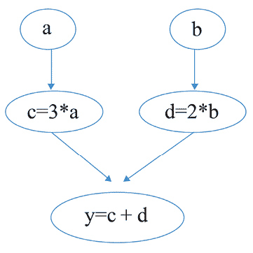

图 1.15：y = 3 * a + 2 * b 机器的计算图

这里，*a* 和 *b* 是输入张量，*c* 和 *d* 是中间张量，y 是输出。

您可以将计算图视为由边缘连接的节点网络。每个节点是一个张量，每条边缘是一个操作或函数，它接受其输入节点并将值返回给其输出节点。为了训练机器学习模型，TensorFlow 构建计算图并相应地计算**梯度**（梯度是向量，提供达到最优解的最陡峭方向）。在接下来的章节中，您将看到使用 `TensorFlow` 训练机器学习模型的示例。

如果你有兴趣深入了解 TensorFlow 和计算图，我们强烈建议你访问 [`www.tensorflow.org/guide/data`](https://www.tensorflow.org/guide/data)。

TensorFlow 允许在 CPU 和 GPU 之间轻松部署计算，这使得大规模的高成本机器学习成为可能。在本书中，我们将重点使用 CPU 作为计算平台。因此，按照 [`www.tensorflow.org/install/`](https://www.tensorflow.org/install/) 的说明，安装 TensorFlow 2 的命令行如下：

```py
conda install -c conda-forge tensorflow 
```

或者

```py
pip install tensorflow 
```

你可以通过在 Python 中导入 PyTorch 来验证安装是否成功。

### PyTorch

PyTorch 是一个开源机器学习库，主要用于开发深度学习模型。它提供了一个灵活高效的框架来构建神经网络并在 GPU 上执行计算。PyTorch 由 Facebook 的 AI 研究实验室开发，并在研究和工业界广泛使用。

与 TensorFlow 类似，PyTorch 的计算基于 **有向无环图**（**DAG**）。不同之处在于，PyTorch 使用 **动态计算图**，允许在运行时即时构建计算图，而 TensorFlow 使用 **静态** 计算图，计算图结构在执行前已定义并执行。这种动态特性使得模型设计更加灵活，调试更加简便，也便于动态控制流，因此适用于广泛的应用。

由于其灵活性、易用性和高效的计算能力，PyTorch 已成为深度学习领域研究人员和从业人员的热门选择。其直观的界面和强大的社区支持使其成为多种应用的有力工具，包括计算机视觉、自然语言处理、强化学习等。

要安装 PyTorch，建议根据系统和方法查阅 [`pytorch.org/get-started/locally/`](https://pytorch.org/get-started/locally/) 上的最新安装指令。

例如，我们通过 `conda` 在 Mac 上安装最新稳定版本（截至 2023 年底为 `2.2.0`），使用以下命令：

```py
conda install pytorch::pytorch torchvision  -c pytorch 
```

**最佳实践**

如果你在安装过程中遇到问题，请阅读说明页面上提供的平台和软件包特定的建议。本书中的所有 PyTorch 代码都可以在 CPU 上运行，除非特别指出仅适用于 GPU。不过，如果你希望加快神经网络模型的训练并充分享受 PyTorch 的优势，建议使用 GPU。如果你有显卡，请参考安装说明并设置适当的计算平台。例如，我在 Windows 上使用 GPU 安装时使用以下命令：

```py
conda install pytorch torchvision pytorch-cuda=11.8 -c pytorch -c nvidia 
```

要检查是否正确安装了带有 GPU 支持的 PyTorch，可以运行以下 Python 代码：

```py
>>> import torch
>>> torch.cuda.is_available()
True 
```

另外，你可以使用 Google Colab ([`colab.research.google.com/`](https://colab.research.google.com/))，免费使用 GPU 训练一些神经网络模型。

我们将会大量使用其他一些包，例如**Matplotlib**用于绘图和可视化，**Seaborn**用于可视化，**NLTK**用于自然语言处理任务，**transformers**用于基于大型数据集预训练的先进模型，**OpenAI Gym**用于强化学习。每当我们首次遇到某个包时，我们会提供安装详情。

# 总结

我们刚刚完成了 Python 和机器学习之旅的第一步！在本章中，我们熟悉了机器学习的基础知识。我们从机器学习的定义、重要性和简短历史开始，还了解了最近的发展动态。我们还学习了典型的机器学习任务，并探索了几种处理数据和模型的基本技术。现在，我们已经掌握了基本的机器学习知识，并且设置好了相关的软件和工具，让我们为接下来的实际机器学习示例做好准备吧。

在下一章中，我们将构建一个电影推荐引擎，作为我们的第一个机器学习项目！

# 练习

1.  你能说出机器学习和传统编程（基于规则的自动化）之间的区别吗？

1.  什么是过拟合，我们如何避免它？

1.  列举两种特征工程方法。

1.  列举两种组合多个模型的方法。

1.  如果你感兴趣，可以安装 Matplotlib ([`matplotlib.org/`](https://matplotlib.org/))。我们将在本书中使用它进行数据可视化。

# 加入我们书籍的 Discord 社区

加入我们社区的 Discord 空间，和作者及其他读者一起讨论：

[`packt.link/yuxi`](https://packt.link/yuxi)


