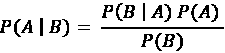
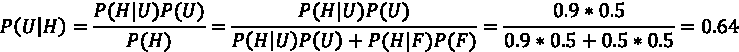
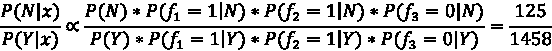
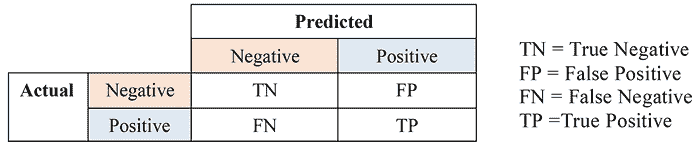

# 第二章：使用朴素贝叶斯构建电影推荐引擎

如承诺的那样，在本章中，我们将以机器学习分类，特别是二元分类，开始我们的监督学习之旅。本章的目标是构建一个电影推荐系统，这是从现实生活中的一个例子学习分类的一个很好的起点——电影流媒体服务提供商已经在做这件事，我们也可以做到。

在本章中，您将学习分类的基本概念，包括分类的作用、不同类型及应用，重点解决一个二元分类问题，使用一种简单而强大的算法——朴素贝叶斯。最后，本章将演示如何微调模型，这是一项每个数据科学或机器学习从业者都应该掌握的重要技能。

我们将详细讨论以下主题：

+   开始分类

+   探索朴素贝叶斯

+   实现朴素贝叶斯

+   使用朴素贝叶斯构建电影推荐系统

+   评估分类性能

+   使用交叉验证调整模型

# 开始分类

电影推荐可以被看作一个机器学习分类问题。例如，如果预测您会喜欢某部电影，因为您曾喜欢或观看过类似的电影，那么它会出现在您的推荐列表中；否则，它不会。让我们从学习机器学习分类的基本概念开始。

**分类**是监督学习的主要实例之一。给定一个包含观测值及其相关类别输出的训练数据集，分类的目标是学习一个通用规则，将**观测值**（也称为**特征**或**预测变量**）正确映射到目标**类别**（也称为**标签**或**类**）。换句话说，一个训练好的分类模型会在模型从训练样本的特征和目标中学习后生成，如*图 2.1*的前半部分所示。当新的或未见过的数据输入时，训练好的模型将能够确定它们的目标类别。类信息将根据已知的输入特征，使用训练好的分类模型进行预测，如*图 2.1*的后半部分所示：


图 2.1：分类中的训练和预测阶段

一般来说，分类根据类别输出的可能性有三种类型——**二元**、**多类**和**多标签分类**。我们将在本节中逐一介绍它们。

## 二元分类

二分类将观测值分类为两种可能类别之一。我们每天遇到的垃圾邮件过滤就是二分类的典型应用，它识别电子邮件（输入观测值）是垃圾邮件还是非垃圾邮件（输出类别）。客户流失预测是另一个常见的例子，预测系统从**客户关系管理**（**CRM**）系统中获取客户细分数据和活动数据，并识别哪些客户可能会流失。

营销和广告行业的另一个应用是在线广告的点击预测——即根据用户的兴趣信息和浏览历史，预测广告是否会被点击。最后但同样重要的是，二分类也在生物医学科学中得到了应用，例如，在癌症早期诊断中，根据 MRI 图像将患者分类为高风险或低风险组。

如*图 2.2*所示，二分类尝试找到一种方法，将数据分为两个类别（分别用点和叉表示）：


图 2.2：二分类示例

别忘了，预测一个人是否喜欢某部电影也是一个二分类问题。

## 多类分类

这种分类方法也称为**多项式分类**。与二分类只有两种可能类别不同，它允许多于两个的类别。手写数字识别是一个常见的分类实例，自 20 世纪初以来，已进行大量研究和开发。例如，一个分类系统可以学习读取并理解手写的邮政编码（大多数国家的数字从 0 到 9），从而自动对信封进行分类。

手写数字识别已成为学习机器学习过程中的*“Hello, World!”*，由**国家标准与技术研究院**（**NIST**）构建的扫描文档数据集，称为**修改版国家标准与技术研究院**（**MNIST**），是一个常用的基准数据集，用于测试和评估多类分类模型。*图 2.3*展示了从 MNIST 数据集中提取的四个样本，分别代表数字“`9`”、“`2`”、“`1`”和“`3`”：


图 2.3：来自 MNIST 数据集的样本

另一个例子，在*图 2.4*中，多类分类模型尝试找到分隔边界，将数据分为以下三种不同的类别（分别用点、叉和三角形表示）：


图 2.4：多类分类示例

## 多标签分类

在前两种类型的分类中，目标类别是互斥的，每个样本只能分配*一个，且仅有一个*标签。而在多标签分类中则正好相反。由于现代应用中类别组合的特性，越来越多的研究关注多标签分类。例如，一张同时捕捉到大海和日落的图片可以同时属于这两种概念场景，而在二分类情况下，它只能是猫或狗的图像，或者在多类别情况下只能是橙子、苹果或香蕉中的一种水果。同样，冒险电影常常与其他类型的电影结合，如奇幻、科幻、恐怖和剧情片。

另一个典型的应用是蛋白质功能分类，因为一个蛋白质可能具有多种功能——存储、抗体、支撑、运输等等。

解决*n*标签分类问题的典型方法是将其转化为一组*n*二分类问题，每个二分类问题由一个独立的二分类器处理。

请参考*图 2.5*，查看如何将多标签分类问题重构为多个二分类问题：


图 2.5：将三标签分类转化为三个独立的二分类问题

再次使用蛋白质功能分类的例子，我们可以将其转化为几个二分类问题，例如：它是用来存储的吗？它是用来抗体的吗？它是用来支撑的吗？

为了解决这些问题，研究人员开发了许多强大的分类算法，其中朴素贝叶斯、**支持向量机**（**SVMs**）、决策树、逻辑回归和神经网络常常被使用。

在接下来的章节中，我们将介绍朴素贝叶斯的机制及其深入实现，以及其他重要概念，包括分类器调优和分类性能评估。请关注接下来的章节，了解其他分类算法。

# 探索朴素贝叶斯

**朴素贝叶斯**分类器属于概率分类器的范畴。它计算每个预测**特征**（也称为**属性**或**信号**）属于每个类别的概率，从而对所有类别的概率分布做出预测。当然，从得到的概率分布中，我们可以得出数据样本最有可能关联的类别。朴素贝叶斯具体做的事情，如其名所示，包含以下内容：

+   **贝叶斯**：也就是说，它根据贝叶斯定理，将观察到的输入特征在给定可能类别下的概率映射到在观察到的证据基础上给定类别的概率。

+   **朴素**：即假设预测特征是相互独立的，从而简化概率计算。

我将在下一节通过实例来解释贝叶斯定理。

## 贝叶斯定理通过实例

在深入了解分类器之前，理解贝叶斯定理非常重要。让*A*和*B*表示任何两个事件。事件可能是“明天会下雨”，“从一副扑克牌中抽出两张国王”或者“一个人患有癌症”。在贝叶斯定理中，*P*(*A* | *B*)表示在*B*为真的情况下，*A*发生的概率。它可以通过以下公式计算：



这里，*P*(*B* | *A*)是给定*B*发生时*B*的概率，而*P*(*A*)和*P*(*B*)分别是*B*和*A*发生的概率。是不是太抽象了？让我们通过以下具体的例子来考虑：

+   **例子 1**：给定两个硬币，其中一个是不公平的，90%的翻转结果为正面，10%的结果为反面，另一个是公平的。随机选择一个硬币并进行翻转。如果我们得到正面，那个硬币是那个不公平的硬币的概率是多少？

我们可以通过首先将*U*表示为选择不公平硬币的事件，*F*表示公平硬币，*H*表示出现正面的事件来解决这个问题。因此，在出现正面时，*P(U | H)*是选择不公平硬币的概率，可以通过以下公式计算：


如我们所知，*P*(*H* | *U*)为`0.9`。*P*(*U*)为`0.5`，因为我们从两个硬币中随机选择一个。然而，推导出出现正面的概率*P*(*H*)并不那么简单，因为两种事件可能导致以下情况，其中*U*是选择不公平硬币，*F*是选择公平硬币：


现在，*P*(*U* | *H*)变为以下形式：



所以，在贝叶斯定理下，得到正面时选择不公平硬币的概率是`0.64`。

+   **例子 2**：假设一位医生报告了以下癌症筛查测试结果，涉及 10,000 人：

|  | **癌症** | **无癌症** | **总计** |
| --- | --- | --- | --- |
| **筛查阳性** | 80 | 900 | 980 |
| **筛查阴性** | 20 | 9000 | 9020 |
| **总计** | 100 | 9900 | 10000 |

表 2.1：癌症筛查结果示例

这表明 100 名癌症患者中有 80 人被正确诊断，另外 20 人未被诊断出；癌症在 9,900 名健康人中有 900 人被误诊。

如果某个人的筛查结果为阳性，那么他实际上患有癌症的概率是多少？我们将患癌症和筛查结果为阳性分别表示为*C*和*Pos*。因此，*P*(*Pos* |*C*) = `80/100` = `0.8`，*P*(*C*) = `100/10000` = `0.01`，*P*(*Pos*) = `980/10000` = `0.098`。

我们可以应用贝叶斯定理来计算*P*(*C* | *Pos*)：


给定一个阳性筛查结果，受试者患癌症的几率是 8.16%，这比在没有进行筛查的情况下（假设 100/10000=1%）高出很多。

+   **例子 3**：在一个工厂中，三台机器 *A*、*B* 和 *C* 分别占据了 35%、20% 和 45% 的灯泡生产份额。每台机器生产的次品灯泡比例分别为 1.5%、1% 和 2%。一只由该工厂生产的灯泡被鉴定为次品，表示为事件 *D*。分别求出这只灯泡是由机器 *A*、*B* 或 *C* 制造的概率。

再次，我们可以简单地遵循贝叶斯定理：


所以，根据贝叶斯定理，这个灯泡是由 *A*、*B* 或 *C* 机器制造的概率分别是 `0.323`、`0.123` 和 `0.554`。

此外，无论哪种方式，我们甚至不需要计算 *P*(*D*)，因为我们知道以下情况：


我们还知道以下概念：


所以，我们有以下公式：


这种简便的方法得出了与原始方法相同的结果，但速度更快。现在你理解了贝叶斯定理是朴素贝叶斯的核心，我们可以轻松地继续进行分类器本身的内容。

## 朴素贝叶斯的原理

让我们从讨论算法背后的魔力开始——朴素贝叶斯是如何工作的。给定一个数据样本，*x*，它有*n*个特征，*x*[1]、*x*[2]、...、*x*[n]（*x* 代表一个特征向量，并且 *x* = (*x*[1]、*x*[2]、...、*x*[n]）），朴素贝叶斯的目标是确定这个样本属于 *K* 个可能类别 *y*[1]、*y*[2]、...、*y*[K] 中每一个的概率，即 *P(y*[K] *|x)* 或 *P*(*x*[1]、*x*[2]、...、*x*[n])，其中 *k* = 1, 2, …, *K*。

这看起来和我们刚刚处理的没什么不同：*x* 或 *x*[1]、*x*[2]、...、*x*[n]。这是一个联合事件，表示一个样本观察到特征值 *x*[1]、*x*[2]、...、*x*[n]。*y*[K] 是样本属于类别 *k* 的事件。我们可以直接应用贝叶斯定理：


让我们详细看一下每个组成部分：

+   *P*(*y*[k]) 描述了类别的分布情况，并没有进一步观察特征的知识。因此，它也被称为贝叶斯概率术语中的**先验概率**。先验概率可以是预定的（通常是均匀的，即每个类别的发生机会相同），也可以通过一组训练样本进行学习。

+   *P*(*y*[k]|*x*)，与先前的 *P*(*y*[k]) 相比，是**后验概率**，它包含了额外的观察信息。

+   *P*(*x* |*y*[K])，或 *P*(*x*[1]*, x*[2]*,..., x*[n]|*y*[k])，是给定样本属于类别*y*[k]时，*n*个特征的联合分布。这表示具有这些值的特征共同发生的可能性。在贝叶斯术语中，这被称为**似然**。显然，随着特征数量的增加，计算似然将变得困难。在朴素贝叶斯中，这是通过特征独立性假设来解决的。*n*个特征的联合条件分布可以表示为单个特征条件分布的联合乘积：


每个条件分布可以通过一组训练样本高效地学习得到。

+   *P*(*x*)，也称为**证据**，仅依赖于特征的整体分布，而与特定类别无关，因此它是一个归一化常数。因此，后验概率与先验概率和似然成正比：


*图 2.6* 总结了如何训练朴素贝叶斯分类模型并将其应用于新数据：


图 2.6：朴素贝叶斯分类的训练和预测阶段

朴素贝叶斯分类模型是通过使用标记数据进行训练的，每个实例都与一个类别标签相关联。在训练过程中，模型学习给定每个类别时特征的概率分布。这涉及到计算给定每个类别时观察到每个特征值的似然。一旦训练完成，模型就可以应用于新的、未标记的数据。为了对一个新实例进行分类，模型使用贝叶斯定理计算给定观察到的特征下每个类别的概率。

在我们深入探讨朴素贝叶斯的实现之前，让我们通过一个简化的电影推荐示例来看一下朴素贝叶斯分类器的应用。给定四个（伪）用户，他们是否喜欢三部电影，*m*[1]*，m*[2]*，*和*m*[3]（用 1 或 0 表示），以及他们是否喜欢目标电影（表示为事件*Y*）或不喜欢（表示为事件*N*），如以下表格所示，我们需要预测另一个用户喜欢该电影的可能性：

|  | **ID** | **m1** | **m2** | **m3** | **用户是否喜欢目标电影** |
| --- | --- | --- | --- | --- | --- |
| **训练数据** | 1 | 0 | 1 | 1 | **Y** |
| 2 | 0 | 0 | 1 | **N** |
| 3 | 0 | 0 | 0 | **Y** |
| 4 | 1 | 1 | 0 | **Y** |
| **测试案例** | 5 | 1 | 1 | 0 | **?** |

表 2.2：电影推荐的玩具数据示例

用户是否喜欢三部电影，*m*[1]*，m*[2]*，*和*m*[3]，是我们可以用来预测目标类别的特征（信号）。我们拥有的训练数据是包含评分和目标信息的四个样本。

现在，让我们首先计算先验，*P*(*Y*) 和 *P*(*N*)。通过训练集，我们可以轻松获得以下数据：


另外，我们也可以假设一个均匀先验，例如*P*(*Y*) = 50%。

为了简化起见，我们将用户喜欢三部电影与否的事件分别表示为*f*[1]*, f*[2]*,* 和 *f*[3]。为了计算后验概率 *P*(*Y| x*)*，其中 *x* = (1, 1, 0)，第一步是计算可能性，*P*(*f*[1] *= 1*| *Y*), *P*(*f*[2] *= 1*| *Y*), 和 *P*(*f*[3] *= 0*| *Y*)，同样地，*P*(*f*[1] *= 1*| *N*), *P*(*f*[2] *= 1*| *N*), 和 *P*(*f*[3] *= 0*| *N*)，基于训练集计算。然而，你可能注意到，由于在*N*类中没有看到 *f*[1] *= 1*，我们会得到 *P*(*f*[1] *= 1*| *N*) *= 0*。因此，我们将得到如下结果：


这意味着我们将不加思索地通过任何方式预测类别 = *Y*。

为了消除零乘法因子（未知的可能性），我们通常会为每个特征分配一个初始值为 1 的值，即我们从 1 开始计算每个特征的可能值。这种技术也被称为**拉普拉斯平滑**。通过这种修改，我们现在得到如下结果：


这里，给定类别*N*，0 + 1 表示有零个*m*[1]的点赞，加上+1 平滑；1 + 2 表示有一个数据点（ID = 2），加上 2（2 个可能的值）+ 1 平滑。给定类别*Y*，1 + 1 表示有一个*m*[1]的点赞（ID = 4），加上+1 平滑；3 + 2 表示有 3 个数据点（ID = 1, 3, 4），加上 2（2 个可能的值）+ 1 平滑。

同样地，我们可以计算以下内容：


现在，我们可以按如下方式计算两个后验概率之间的比率：



另外，请记住这一点：


所以，最后我们得到了以下结果：


新用户喜欢目标电影的概率为`92.1%`。

我希望在经历了理论和一个玩具示例后，你现在对朴素贝叶斯有了扎实的理解。让我们准备在下一部分实现它。

# 实现朴素贝叶斯

在手动计算完电影偏好示例之后，正如我们承诺的那样，我们将从头开始实现朴素贝叶斯。然后，我们将使用`scikit-learn`包来实现它。

## 从头实现朴素贝叶斯

在我们开发模型之前，先定义一下我们刚才使用的玩具数据集：

```py
>>> import numpy as np
>>> X_train = np.array([
...     [0, 1, 1],
...     [0, 0, 1],
...     [0, 0, 0],
...     [1, 1, 0]])
>>> Y_train = ['Y', 'N', 'Y', 'Y']
>>> X_test = np.array([[1, 1, 0]]) 
```

对于模型，从先验开始，我们首先按标签对数据进行分组，并按类别记录它们的索引：

```py
>>> def get_label_indices(labels):
...     """
...     Group samples based on their labels and return indices
...     @param labels: list of labels
...     @return: dict, {class1: [indices], class2: [indices]}
...     """
...     from collections import defaultdict
...     label_indices = defaultdict(list)
...     for index, label in enumerate(labels):
...         label_indices[label].append(index)
...     return label_indices 
```

看看我们得到的结果：

```py
>>> label_indices = get_label_indices(Y_train)
>>> print('label_indices:\n', label_indices)
    label_indices:
    defaultdict(<class 'list'>, {'Y': [0, 2, 3], 'N': [1]}) 
```

使用`label_indices`，我们计算先验概率：

```py
>>> def get_prior(label_indices):
...     """
...     Compute prior based on training samples
...     @param label_indices: grouped sample indices by class
...     @return: dictionary, with class label as key, corresponding
...              prior as the value
...     """
...     prior = {label: len(indices) for label, indices in
...                                      label_indices.items()}
...     total_count = sum(prior.values())
...     for label in prior:
...         prior[label] /= total_count
...     return prior 
```

看看计算得到的先验：

```py
>>> prior = get_prior(label_indices)
>>> print('Prior:', prior)
 Prior: {'Y': 0.75, 'N': 0.25} 
```

计算完`prior`后，我们继续计算`likelihood`，即条件概率`P(feature|class)`：

```py
>>> def get_likelihood(features, label_indices, smoothing=0):
...     """
...     Compute likelihood based on training samples
...     @param features: matrix of features
...     @param label_indices: grouped sample indices by class
...     @param smoothing: integer, additive smoothing parameter
...     @return: dictionary, with class as key, corresponding
...              conditional probability P(feature|class) vector 
...              as value
...     """
...     likelihood = {}
...     for label, indices in label_indices.items():
...         likelihood[label] = features[indices, :].sum(axis=0)
...                                + smoothing
...         total_count = len(indices)
...         likelihood[label] = likelihood[label] /
...                                 (total_count + 2 * smoothing)
...     return likelihood 
```

在这里，我们将`smoothing`值设置为 1，也可以设置为 0 表示没有平滑，或者设置为其他任何正值，只要能够获得更好的分类性能：

```py
>>> smoothing = 1
>>> likelihood = get_likelihood(X_train, label_indices, smoothing)
>>> print('Likelihood:\n', likelihood)
Likelihood:
 {'Y': array([0.4, 0.6, 0.4]), 'N': array([0.33333333, 0.33333333, 0.66666667])} 
```

如果你觉得这些内容有点困惑，可以随时查看*图 2.7*来刷新一下记忆：


图 2.7：计算先验和似然的简单示例

在准备好先验和似然后，我们可以计算测试/新样本的后验概率：

```py
>>> def get_posterior(X, prior, likelihood):
...     """
...     Compute posterior of testing samples, based on prior and
...     likelihood
...     @param X: testing samples
...     @param prior: dictionary, with class label as key,
...                   corresponding prior as the value
...     @param likelihood: dictionary, with class label as key,
...                        corresponding conditional probability
...                            vector as value
...     @return: dictionary, with class label as key, corresponding
...              posterior as value
...     """
...     posteriors = []
...     for x in X:
...         # posterior is proportional to prior * likelihood
...         posterior = prior.copy()
...         for label, likelihood_label in likelihood.items():
...             for index, bool_value in enumerate(x):
...                 posterior[label] *= likelihood_label[index] if
...                   bool_value else (1 - likelihood_label[index])
...         # normalize so that all sums up to 1
...         sum_posterior = sum(posterior.values())
...         for label in posterior:
...             if posterior[label] == float('inf'):
...                 posterior[label] = 1.0
...             else:
...                 posterior[label] /= sum_posterior
...         posteriors.append(posterior.copy())
...     return posteriors 
```

现在，让我们使用这个预测函数预测我们一个样本测试集的类别：

```py
>>> posterior = get_posterior(X_test, prior, likelihood)
>>> print('Posterior:\n', posterior)
Posterior:
 [{'Y': 0.9210360075805433, 'N': 0.07896399241945673}] 
```

这正是我们之前得到的结果。我们已经成功从零开始开发了朴素贝叶斯，现在可以开始使用`scikit-learn`实现了。

## 使用 scikit-learn 实现朴素贝叶斯

从头编写代码并实现你自己的解决方案是学习机器学习模型的最佳方式。当然，你也可以通过直接使用 scikit-learn API 中的`BernoulliNB`模块（[`scikit-learn.org/stable/modules/generated/sklearn.naive_bayes.BernoulliNB.html`](https://scikit-learn.org/stable/modules/generated/sklearn.naive_bayes.BernoulliNB.html)）来走捷径：

```py
>>> from sklearn.naive_bayes import BernoulliNB 
```

让我们初始化一个具有平滑因子（在`scikit-learn`中指定为`alpha`）为`1.0`，并且从训练集学习的`prior`（在`scikit-learn`中指定为`fit_prior=True`）的模型：

```py
>>> clf = BernoulliNB(alpha=1.0, fit_prior=True) 
```

要使用`fit`方法训练朴素贝叶斯分类器，我们使用以下代码行：

```py
>>> clf.fit(X_train, Y_train) 
```

要使用`predict_proba`方法获取预测概率结果，我们使用以下代码行：

```py
>>> pred_prob = clf.predict_proba(X_test)
>>> print('[scikit-learn] Predicted probabilities:\n', pred_prob)
[scikit-learn] Predicted probabilities:
 [[0.07896399 0.92103601]] 
```

最后，我们做如下操作，使用`predict`方法直接获取预测的类别（0.5 是默认的阈值，如果类别`Y`的预测概率大于 0.5，则分配类别`Y`；否则，使用类别`N`）：

```py
>>> pred = clf.predict(X_test)
>>> print('[scikit-learn] Prediction:', pred)
[scikit-learn] Prediction: ['Y'] 
```

使用 scikit-learn 得到的预测结果与我们使用自己解决方案得到的结果一致。既然我们已经从零开始和使用`scikit-learn`实现了算法，为什么不直接用它来解决电影推荐问题呢？

# 使用朴素贝叶斯构建电影推荐系统

在完成了玩具示例之后，现在是时候使用一个真实数据集构建一个电影推荐系统（或更具体地说，构建一个电影偏好分类器）了。我们这里使用一个电影评分数据集（[`grouplens.org/datasets/movielens/`](https://grouplens.org/datasets/movielens/)）。该数据集由 GroupLens 研究小组从 MovieLens 网站（[`movielens.org`](http://movielens.org)）收集。

为了演示，我们将使用稳定的小型数据集——MovieLens 1M 数据集（可以从[`files.grouplens.org/datasets/movielens/ml-1m.zip`](https://files.grouplens.org/datasets/movielens/ml-1m.zip)或[`grouplens.org/datasets/movielens/1m/`](https://grouplens.org/datasets/movielens/1m/)下载），它包含约 100 万条评分，评分范围从 1 到 5，分半星递增，由 6,040 个用户对 3,706 部电影进行评分（最后更新于 2018 年 9 月）。

解压`ml-1m.zip`文件，你将看到以下四个文件：

+   `movies.dat`：它以`MovieID::Title::Genres`格式包含电影信息。

+   `ratings.dat`：它包含用户电影评分，格式为`UserID::MovieID::Rating::Timestamp`。在本章中，我们将只使用此文件中的数据。

+   `users.dat`：它包含用户信息，格式为`UserID::Gender::Age::Occupation::Zip-code`。

+   `README`

让我们尝试根据用户对其他电影的评分（再次，评分范围从 1 到 5）预测用户是否喜欢某部电影。

## 准备数据

首先，我们导入所有必要的模块，并将`ratings.dat`读取到`pandas` DataFrame 对象中：

```py
>>> import numpy as np
>>> import pandas as pd
>>> data_path = 'ml-1m/ratings.dat'
>>> df = pd.read_csv(data_path, header=None, sep='::', engine='python')
>>> df.columns = ['user_id', 'movie_id', 'rating', 'timestamp']
>>> print(df)
         user_id  movie_id  rating  timestamp
0              1      1193       5  978300760
1              1       661       3  978302109
2              1       914       3  978301968
3              1      3408       4  978300275
4              1      2355       5  978824291
...          ...       ...     ...        ...
1000204     6040      1091       1  956716541
1000205     6040      1094       5  956704887
1000206     6040       562       5  956704746
1000207     6040      1096       4  956715648
1000208     6040      1097       4  956715569
[1000209 rows x 4 columns] 
```

现在，让我们看看这个百万行数据集中有多少独特的用户和电影：

```py
>>> n_users = df['user_id'].nunique()
>>> n_movies = df['movie_id'].nunique()
>>> print(f"Number of users: {n_users}")
Number of users: 6040
>>> print(f"Number of movies: {n_movies}")
Number of movies: 3706 
```

接下来，我们将构建一个 6,040（用户数量）行和 3,706（电影数量）列的矩阵，其中每一行包含用户的电影评分，每一列代表一部电影，使用以下函数：

```py
>>> def load_user_rating_data(df, n_users, n_movies):
...    data = np.zeros([n_users, n_movies], dtype=np.intc)
              movie_id_mapping = {}
              for user_id, movie_id, rating in zip(df['user_id'], df['movie_id'], df['rating']):
                    user_id = int(user_id) - 1
                    if movie_id not in movie_id_mapping:
                         movie_id_mapping[movie_id] = len(movie_id_mapping)
                   data[user_id, movie_id_mapping[movie_id]] = rating
              return data, movie_id_mapping
>>> data, movie_id_mapping = load_user_rating_data(df, n_users, n_movies) 
```

除了评分矩阵`data`，我们还记录了`电影 ID`与列索引的映射。列索引从 0 到 3,705，因为我们有 3,706 部电影。

始终建议分析数据分布，以识别数据集中是否存在类别不平衡问题。我们进行如下操作：

```py
>>> values, counts = np.unique(data, return_counts=True)
... for value, count in zip(values, counts):
...     print(f'Number of rating {value}: {count}')
Number of rating 0: 21384031
Number of rating 1: 56174
Number of rating 2: 107557
Number of rating 3: 261197
Number of rating 4: 348971
Number of rating 5: 226310 
```

如你所见，大多数评分是未知的；对于已知评分，35%的评分为 4 分，其次是 26%的评分为 3 分，23%的评分为 5 分，然后是 11%和 6%的评分为 2 分和 1 分。

由于大多数评分是未知的，我们选择评分已知最多的电影作为目标电影，以便更容易进行预测验证。我们按以下方式查找每部电影的评分数量：

```py
>>> print(df['movie_id'].value_counts())
2858    3428
260     2991
1196    2990
1210    2883
480     2672
        ...
3458       1
2226       1
1815       1
398        1
2909       1
Name: movie_id, Length: 3706, dtype: int64 
```

因此，目标电影是 ID，我们将把其他电影的评分作为特征。我们只使用目标电影有评分的行，以便验证预测的准确性。我们将数据集按如下方式构建：

```py
>>> target_movie_id = 2858
>>> X_raw = np.delete(data, movie_id_mapping[target_movie_id], axis=1)
>>> Y_raw = data[:, movie_id_mapping[target_movie_id]]
>>> X = X_raw[Y_raw > 0]
>>> Y = Y_raw[Y_raw > 0]
>>> print('Shape of X:', X.shape)
Shape of X: (3428, 3705)
>>> print('Shape of Y:', Y.shape)
Shape of Y: (3428,) 
```

我们可以将评分大于 3 的电影视为喜欢的（被推荐的）电影：

```py
>>> recommend = 3
>>> Y[Y <= recommend] = 0
>>> Y[Y > recommend] = 1
>>> n_pos = (Y == 1).sum()
>>> n_neg = (Y == 0).sum()
>>> print(f'{n_pos} positive samples and {n_neg} negative samples.')
2853 positive samples and 575 negative samples. 
```

作为解决分类问题的一条经验法则，我们始终需要分析标签分布，并查看数据集是否平衡（或不平衡）。

**最佳实践**

处理分类问题中的不平衡数据集需要仔细考虑并采用适当的技术，以确保模型能够有效地从数据中学习并生成可靠的预测。以下是几种应对类别不平衡的策略：

+   **过采样**：我们可以通过生成合成样本或复制现有样本来增加少数类实例的数量。

+   **欠采样**：我们可以通过随机删除样本来减少多数类实例的数量。请注意，我们甚至可以结合过采样和欠采样来获得更平衡的数据集。

+   **类别加权**：我们还可以在模型训练期间为少数类样本分配更高的权重。通过这种方式，我们可以对少数类的误分类进行更严重的惩罚。

接下来，为了全面评估分类器的表现，我们可以将数据集随机划分为两个集合：训练集和测试集，分别模拟学习数据和预测数据。通常，原始数据集中包含在测试集中的比例可以是 20%、25%、30%或 33.3%。

**最佳实践**

以下是选择测试集划分的一些指南：

+   **小规模数据集**：如果你的数据集较小（例如，少于几千个样本），较大的测试集划分（例如，25%到 30%）可能更为合适，以确保有足够的数据进行训练和测试。

+   **中到大规模数据集**：对于中到大规模的数据集（例如，数万到数百万的样本），较小的测试集划分（例如，20%）可能仍然为评估提供足够的数据，同时允许更多数据用于训练。20%的测试集划分在这种情况下是一个常见的选择。

+   **简单模型**：较少复杂的模型通常不容易发生过拟合，因此使用较小的测试集划分可能是可行的。

+   **复杂模型**：像深度学习模型这样的复杂模型更容易发生过拟合。因此，建议使用更大的测试集划分（例如，30%）。

我们使用`scikit-learn`中的`train_test_split`函数进行随机划分，并保留每个类别的样本比例：

```py
>>> from sklearn.model_selection import train_test_split
>>> X_train, X_test, Y_train, Y_test = train_test_split(X, Y,
...     test_size=0.2, random_state=42) 
```

在实验和探索过程中，指定一个固定的`random_state`（例如，`42`）是一个好的做法，以确保每次程序运行时生成相同的训练集和测试集。这可以确保我们在引入随机性并进一步进行时，分类器能够在固定的数据集上正常运行并表现良好。

我们检查训练集和测试集的大小如下：

```py
>>> print(len(Y_train), len(Y_test))
2742 686 
```

`train_test_split`函数的另一个优点是，结果中的训练集和测试集将具有相同的类别比例。

## 训练朴素贝叶斯模型

接下来，我们在训练集上训练一个朴素贝叶斯模型。你可能会注意到输入特征的值从 0 到 5，而不是我们玩具示例中的 0 或 1。因此，我们使用来自 scikit-learn 的`MultinomialNB`模块（[`scikit-learn.org/stable/modules/generated/sklearn.naive_bayes.MultinomialNB.html`](https://scikit-learn.org/stable/modules/generated/sklearn.naive_bayes.MultinomialNB.html)），而不是`BernoulliNB`模块，因为`MultinomialNB`可以处理整数特征以及分数计数。我们导入该模块，初始化一个平滑因子为`1.0`、`prior`从训练集学习得到的模型，并根据训练集训练该模型，如下所示：

```py
>>> from sklearn.naive_bayes import MultinomialNB
>>> clf = MultinomialNB(alpha=1.0, fit_prior=True)
>>> clf.fit(X_train, Y_train) 
```

然后，我们使用训练好的模型对测试集进行预测。我们得到预测概率如下：

```py
>>> prediction_prob = clf.predict_proba(X_test)
>>> print(prediction_prob[0:10])
[[7.50487439e-23 1.00000000e+00]
 [1.01806208e-01 8.98193792e-01]
 [3.57740570e-10 1.00000000e+00]
 [1.00000000e+00 2.94095407e-16]
 [1.00000000e+00 2.49760836e-25]
 [7.62630220e-01 2.37369780e-01]
 [3.47479627e-05 9.99965252e-01]
 [2.66075292e-11 1.00000000e+00]
 [5.88493563e-10 9.99999999e-01]
 [9.71326867e-09 9.99999990e-01]] 
```

对于每个测试样本，我们输出类别 0 的概率，接着是类别 1 的概率。

我们得到测试集的预测类别如下：

```py
>>> prediction = clf.predict(X_test)
>>> print(prediction[:10])
[[1\. 1\. 1\. 0\. 0\. 0\. 1\. 1\. 1\. 1.] 
```

最后，我们通过分类准确度来评估模型的性能，准确度是正确预测的比例：

```py
>>> accuracy = clf.score(X_test, Y_test)
>>> print(f'The accuracy is: {accuracy*100:.1f}%')
The accuracy is: 71.6% 
```

分类准确率约为 72%，这意味着我们构建的朴素贝叶斯分类器能大约三分之二的时间正确地为用户推荐电影。理想情况下，我们还可以利用`movies.dat`文件中的电影类型信息，以及`users.dat`文件中的用户人口统计信息（性别、年龄、职业和邮政编码）。显然，相似类型的电影通常会吸引相似的用户，而相似人口统计特征的用户可能有相似的电影偏好。我们将把这部分留给你作为练习，进一步探索。

到目前为止，我们已经深入介绍了第一个机器学习分类器，并通过预测准确度评估了其性能。还有其他分类指标吗？让我们在下一节看看。

# 评估分类性能

除了准确率外，还有几个评估指标可以帮助我们深入了解分类性能，避免类别不平衡的影响。具体如下：

+   混淆矩阵

+   精确度

+   召回率

+   F1 得分

+   曲线下面积

**混淆矩阵**通过预测值和真实值总结测试实例，并以列联表的形式呈现：



图 2.8：混淆矩阵的列联表

为了说明这一点，我们可以计算我们朴素贝叶斯分类器的混淆矩阵。我们使用`scikit-learn`中的`confusion_matrix`函数来计算，但也可以很容易自己编写代码：

```py
>>> from sklearn.metrics import confusion_matrix
>>> print(confusion_matrix(Y_test, prediction, labels=[0, 1]))
[[ 60  47]
 [148 431]] 
```

从结果的混淆矩阵可以看出，有 47 个假阳性案例（模型错误地将不喜欢的电影判定为喜欢），和 148 个假阴性案例（模型未能检测到喜欢的电影）。因此，分类准确度仅是所有真实案例的比例：


**精确度**衡量的是正确的正类预测所占的比例，在我们的案例中如下：


**召回率**，另一方面，衡量的是被正确识别的真实正例的比例，在我们的案例中如下：


召回率也称为**真正率**。

**F1 得分**全面包含了精确度和召回率，并等同于它们的**调和平均数**：


我们通常更看重**F1 得分**，而非单独的精确度或召回率。

让我们使用`scikit-learn`中的相应函数计算这三个指标，具体如下：

```py
>>> from sklearn.metrics import precision_score, recall_score, f1_score
>>> precision_score(Y_test, prediction, pos_label=1)
0.9016736401673641
>>> recall_score(Y_test, prediction, pos_label=1)
0.7443868739205527
>>> f1_score(Y_test, prediction, pos_label=1)
0.815515610217597 
```

另一方面，负类（不喜欢）也可以根据上下文视为正类。例如，将`0`类分配为`pos_label`，我们将得到以下结果：

```py
>>> f1_score(Y_test, prediction, pos_label=0)
0.38095238095238093 
```

为了获取每个类别的精确率、召回率和 f1 得分，我们可以不需要像之前那样耗费精力调用三个函数处理所有类别标签，快速的方法是调用`classification_report`函数：

```py
>>> from sklearn.metrics import classification_report
>>> report = classification_report(Y_test, prediction)
>>> print(report)
              precision    recall  f1-score   support
         0.0       0.29      0.56      0.38       107
         1.0       0.90      0.74      0.82       579
   micro avg       0.72      0.72      0.72       686
   macro avg       0.60      0.65      0.60       686
weighted avg       0.81      0.72      0.75       686 
```

这里，`weighted avg`是根据各类别比例计算的加权平均值。

分类报告提供了分类器在每个类别上的表现的全面视图。因此，它在类别不平衡的分类任务中非常有用，因为在这种情况下，我们可以通过将每个样本分类为占主导地位的类别来轻松获得高准确率，但少数类别的精确率、召回率和 f1 得分将显著较低。

精确率、召回率和 f1 得分同样适用于**多类**分类，在这种情况下，我们可以简单地将我们感兴趣的类别视为正类，其他类别视为负类。

在调整二分类器的过程中（即尝试不同的超参数组合，例如我们朴素贝叶斯分类器中的平滑因子），如果有一组参数能够在同时达到最高的平均 f1 得分和各类别的个别 f1 得分，那将是最理想的情况。然而，通常情况并非如此。有时，某个模型的平均 f1 得分高于另一个模型，但某个特定类别的 f1 得分却显著较低；有时，两个模型的平均 f1 得分相同，但一个模型在某个类别上的 f1 得分较高，而在另一个类别上的得分较低。在这种情况下，我们如何判断哪个模型效果更好呢？**曲线下面积**（**AUC**）是**接收器操作特性**（**ROC**）的一个综合指标，经常用于二分类任务。

ROC 曲线是将不同概率阈值下的真实正例率与假正例率进行比较的图形，阈值范围从 0 到 1。对于一个测试样本，如果其正类的概率大于阈值，则分配为正类；否则，使用负类。总结一下，真实正例率等同于召回率，而假正例率是错误地将负类标识为正类的比例。让我们编写代码并展示我们模型在`0.0`、`0.1`、`0.2`、……、`1.0`等阈值下的 ROC 曲线：

```py
>>> pos_prob = prediction_prob[:, 1]
>>> thresholds = np.arange(0.0, 1.1, 0.05)
>>> true_pos, false_pos = [0]*len(thresholds), [0]*len(thresholds)
>>> for pred, y in zip(pos_prob, Y_test):
...     for i, threshold in enumerate(thresholds):
...         if pred >= threshold:
...            # if truth and prediction are both 1
...             if y == 1:
...                 true_pos[i] += 1
...            # if truth is 0 while prediction is 1
...             else:
...                 false_pos[i] += 1
...         else:
...             break 
```

接下来，让我们计算所有阈值设置下的真实正例率和假正例率（记住，正测试样本有`516.0`个，负测试样本有`1191`个）：

```py
>>> n_pos_test = (Y_test == 1).sum()
>>> n_neg_test = (Y_test == 0).sum()
>>> true_pos_rate = [tp / n_pos_test for tp in true_pos]
>>> false_pos_rate = [fp / n_neg_test for fp in false_pos] 
```

现在，我们可以使用`matplotlib`绘制 ROC 曲线：

```py
>>> import matplotlib.pyplot as plt
>>> plt.figure()
>>> lw = 2
>>> plt.plot(false_pos_rate, true_pos_rate,
...          color='darkorange', lw=lw)
>>> plt.plot([0, 1], [0, 1], color='navy', lw=lw, linestyle='--')
>>> plt.xlim([0.0, 1.0])
>>> plt.ylim([0.0, 1.05])
>>> plt.xlabel('False Positive Rate')
>>> plt.ylabel('True Positive Rate')
>>> plt.title('Receiver Operating Characteristic')
>>> plt.legend(loc="lower right")
>>> plt.show() 
```

参见*图 2.9*中的 ROC 曲线结果：


图 2.9：ROC 曲线

在图表中，虚线是基准线，表示随机猜测，其中真正例率与假正例率线性增加；其 AUC 为 0.5。实线是我们模型的 ROC 曲线，其 AUC 略低于 1。在理想情况下，真正例样本的概率为 1，因此 ROC 曲线从 100% 的真正例和 0% 的假正例点开始。这样的完美曲线的 AUC 为 1。为了计算我们模型的准确 AUC，可以借助 `scikit-learn` 的 `roc_auc_score` 函数：

```py
>>> from sklearn.metrics import roc_auc_score
>>> roc_auc_score(Y_test, pos_prob)
0.6857375752586637 
```

什么 AUC 值表明分类器表现良好？不幸的是，并没有一个“魔法”数字。我们使用以下经验法则作为一般指导：AUC 在 `0.7` 到 `0.8` 之间的分类模型被认为是可接受的，`0.8` 到 `0.9` 之间的是优秀的，任何高于 `0.9` 的则是卓越的。再次强调，在我们的案例中，我们只使用了非常稀疏的电影评分数据。因此，`0.69` 的 AUC 实际上是可以接受的。

你已经学习了几种分类指标，我们将在下一节探讨如何正确衡量它们以及如何微调我们的模型。

# 使用交叉验证来调整模型

将评估限制在一个固定的数据集上可能会产生误导，因为它很大程度上依赖于为该数据集选择的具体数据点。我们可以简单地避免采用来自一个固定测试集的分类结果，这也是我们之前实验中所做的。相反，我们通常采用 **k** 折交叉验证技术来评估模型在实际中的整体表现。

在 *k* 折交叉验证设置中，原始数据首先随机划分为 *k* 个大小相等的子集，并且通常保持类别比例。然后，这些 *k* 个子集依次作为测试集，用于评估模型。在每次试验中，其余的 *k*-1 个子集（不包括保留的一折）构成训练集，用于训练模型。最后，计算所有 *k* 次试验的平均性能，以生成整体结果：


图 2.10：三折交叉验证示意图

从统计学角度看，*k* 折交叉验证的平均性能是评估模型整体表现的更好估计。给定与机器学习模型和/或数据预处理算法相关的不同参数集，甚至是两个或多个不同的模型，模型调优和/或模型选择的目标是选择一个分类器的参数集，以便获得最佳的平均性能。牢记这些概念后，我们可以开始调整我们的朴素贝叶斯分类器，结合交叉验证和 ROC 曲线的 AUC 测量。

在*k*折交叉验证中，通常将*k*设置为 3、5 或 10。如果训练集较小，推荐使用较大的*k*（5 或 10），以确保每个折叠中有足够的训练样本。如果训练集较大，较小的值（如 3 或 4）就足够了，因为较高的*k*会导致在大数据集上训练时计算成本过高。

我们将使用`scikit-learn`的`StratifiedKFold`类中的`split()`方法将数据分割成保持类分布的块：

```py
>>> from sklearn.model_selection import StratifiedKFold
>>> k = 5
>>> k_fold = StratifiedKFold(n_splits=k, random_state=42) 
```

在初始化 5 折生成器后，我们选择探索以下参数的不同值：

+   `alpha`：表示平滑因子，每个特征的初始值。

+   `fit_prior`：表示是否使用专门为训练数据调整的先验。

我们从以下选项开始：

```py
>>> smoothing_factor_option = [1, 2, 3, 4, 5, 6]
>>> fit_prior_option = [True, False]
>>> auc_record = {} 
```

然后，对于`k_fold`对象的`split()`方法生成的每个折叠，我们重复分类器初始化、训练和预测的过程，并使用上述参数组合之一，记录结果 AUC：

```py
>>> for train_indices, test_indices in k_fold.split(X, Y):
...     X_train_k, X_test _k= X[train_indices], X[test_indices]
...     Y_train_k, Y_test_k = Y[train_indices], Y[test_indices]
...     for alpha in smoothing_factor_option:
...         if alpha not in auc_record:
...             auc_record[alpha] = {}
...         for fit_prior in fit_prior_option:
...             clf = MultinomialNB(alpha=alpha,
...                                 fit_prior=fit_prior)
...             clf.fit(X_train_k, Y_train_k)
...             prediction_prob = clf.predict_proba(X_test_k)
...             pos_prob = prediction_prob[:, 1]
...             auc = roc_auc_score(Y_test_k, pos_prob)
...             auc_record[alpha][fit_prior] = auc +
...                        auc_record[alpha].get(fit_prior, 0.0) 
```

最后，我们展示如下结果：

```py
>>> for smoothing, smoothing_record in auc_record.items():
...     for fit_prior, auc in smoothing_record.items():
...         print(f'    {smoothing}        {fit_prior}  
...               {auc/k:.5f}')
smoothing  fit prior  auc
    1        True    0.65647
    1        False    0.65708
    2        True    0.65795
    2        False    0.65823
    3        True    0.65740
    3        False    0.65801
    4        True    0.65808
    4        False    0.65795
    5        True    0.65814
    5        False    0.65694
    6        True    0.65663
    6        False    0.65719 
```

(`2`, `False`)的设置能够提供最佳的平均 AUC，值为`0.65823`。

最后，我们使用最佳超参数组合（`2`, `False`）重新训练模型并计算 AUC：

```py
>>> clf = MultinomialNB(alpha=2.0, fit_prior=False)
>>> clf.fit(X_train, Y_train)
>>> pos_prob = clf.predict_proba(X_test)[:, 1]
>>> print('AUC with the best model:', roc_auc_score(Y_test,
...       pos_prob))
AUC with the best model:  0.6862056720417091 
```

经过微调的模型达到了`0.686`的 AUC 值。通常，使用交叉验证调整模型超参数是提高学习性能和减少过拟合的最有效方法之一。

# 总结

在本章中，你了解了机器学习分类的基本概念，包括分类类型、分类性能评估、交叉验证和模型调优。你还了解了简单却强大的分类器——朴素贝叶斯。我们深入探讨了朴素贝叶斯的机制和实现，并通过几个示例进行说明，其中最重要的一个是电影推荐项目。

使用朴素贝叶斯进行二分类是本章的主要讨论内容。在下一章中，我们将使用另一种二分类算法——**决策树**来解决广告点击率预测问题。

# 练习

1.  如前所述，我们仅从电影评分数据中提取了用户与电影的关系，其中大多数评分是未知的。你能否还利用`movies.dat`和`users.dat`文件中的数据？

1.  熟能生巧——另一个可以加深理解的好项目是心脏病分类。数据集可以直接从[`archive.ics.uci.edu/ml/datasets/Heart+Disease`](https://archive.ics.uci.edu/ml/datasets/Heart+Disease)下载。

1.  别忘了使用你在本章中学到的技术，微调从练习 2 中得到的模型。它能达到的最佳 AUC 是多少？

# 参考文献

为了确认在本章中使用了 MovieLens 数据集，我想引用以下论文：

F. Maxwell Harper 和 Joseph A. Konstan. 2015\. *电影 Lens 数据集：历史与背景*. ACM **互动智能系统学报** (**TiiS**) 5, 4, 文章 19 (2015 年 12 月)，19 页。DOI：[`dx.doi.org/10.1145/2827872`](http://dx.doi.org/10.1145/2827872)。

# 加入我们书籍的 Discord 讨论区

加入我们社区的 Discord 讨论区，与作者及其他读者进行交流：

[`packt.link/yuxi`](https://packt.link/yuxi)


