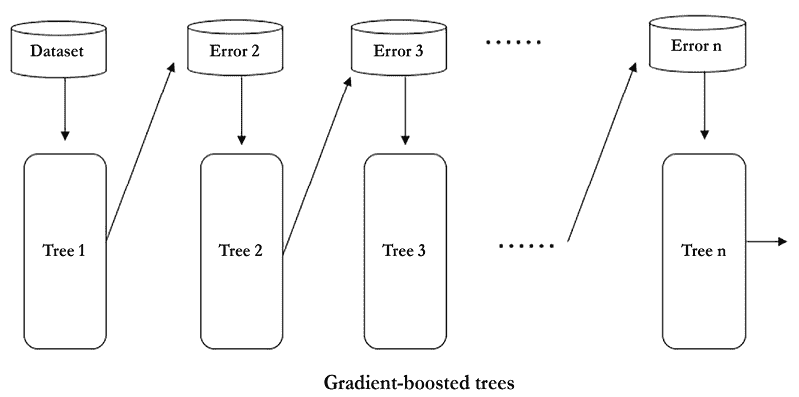

# 第三章：使用基于树的算法预测在线广告点击率

在上一章中，我们构建了一个电影推荐系统。在本章和下一章中，我们将解决数字广告中最具数据驱动问题之一：广告点击率预测——给定用户及其访问的页面，预测他们点击某个广告的可能性。我们将重点学习基于树的算法（包括决策树、随机森林模型和提升树），并利用它们来解决这个价值数十亿美元的问题。

我们将探索从根到叶子的决策树，以及集成版本，即一片树的森林。这不仅仅是一个理论章节，还包含了许多手工计算和从零开始实现树模型的部分。我们将使用 scikit-learn 和 XGBoost，这是一个流行的 Python 包，用于基于树的算法。

本章将涉及以下主题：

+   广告点击率预测的简要概述

+   从根到叶子探索决策树

+   从头开始实现决策树

+   使用 scikit-learn 实现决策树

+   使用决策树预测广告点击率

+   集成决策树——随机森林

+   集成决策树——梯度提升树

# 广告点击率预测的简要概述

在线展示广告是一个数十亿美元的行业。在线展示广告有不同的格式，包括由文本、图像和 Flash 组成的横幅广告，以及富媒体广告，如音频和视频。广告商或其代理商将广告投放到各种网站，甚至移动应用程序上，以接触潜在客户并传递广告信息。

在线展示广告已成为机器学习应用的最佳示例之一。显然，广告商和消费者都对精准定位的广告充满兴趣。在过去 20 年里，行业在很大程度上依赖机器学习模型预测广告定位的有效性：例如，某个年龄段的观众对某产品感兴趣的可能性，某些家庭收入群体的顾客看到广告后会购买某产品的可能性，频繁访问体育网站的用户会花更多时间阅读某个广告的可能性，等等。最常见的效果衡量标准是**点击率**（**CTR**），即某个广告被点击的次数与其总展示次数的比率。通常，在没有点击诱饵或垃圾内容的情况下，较高的 CTR 表示广告定位准确，在线广告活动成功。

点击率预测包含了机器学习的潜力和挑战。它主要涉及二分类问题，即预测给定页面（或应用）上的某个广告是否会被用户点击，预测特征来自以下三个方面：

+   广告内容和信息（类别、位置、文本、格式等）

+   页面内容和发布者信息（类别、上下文、领域等）

+   用户信息（年龄、性别、位置、收入、兴趣、搜索历史、浏览历史、设备等）

假设我们作为一个广告代理机构，代表多个广告主进行广告投放，我们的工作是为正确的受众投放合适的广告。假设我们手头有一个现有数据集（以下小段示例；实际上，预测特征的数量可能会达到数千个），该数据集来自一个月前运行的数百万条广告记录，我们需要开发一个分类模型来学习并预测未来的广告投放结果：


图 3.1：用于训练和预测的广告样本

如你在*图 3.1*中看到的，特征大多是类别型的。事实上，数据可以是数值型或类别型的。让我们在下一节中更详细地探讨这一点。

# 从两种数据类型开始——数值型和类别型

乍一看，前述数据集中的特征是**类别型**的——例如，男性或女性、四个年龄组之一、预定义的站点类别之一，以及用户是否对体育感兴趣。这类数据与我们之前处理的**数值型**特征数据有所不同。

**类别型特征**，也称为**定性特征**，表示具有可计数选项的不同特征或类别。类别型特征可能有，也可能没有逻辑顺序。例如，家庭收入从低到中到高是一个**有序**特征，而广告的类别则不是有序的。

数值型（也叫**定量**）特征则具有数学意义，作为一种测量方式，当然也是有序的。例如，物品的计数（例如，家庭中孩子的数量、房屋中的卧室数量以及距离某个事件的天数）是离散的数值型特征；个体的身高、温度和物体的重量是连续的数值型特征。心电图数据集（[`archive.ics.uci.edu/ml/datasets/Cardiotocography`](https://archive.ics.uci.edu/ml/datasets/Cardiotocography)）包含了离散型（例如每秒加速度的次数或每秒胎动的次数）和连续型（例如长期变异性的均值）数值特征。

类别型特征也可以取数字值。例如，1 到 12 可以表示一年中的月份，1 和 0 可以表示成年人和未成年人。但这些值并不具有数学含义。

你之前学习的朴素贝叶斯分类器适用于数值型和类别型特征，因为似然值，*P*(*x* |*y*) 或 *P*(*feature* |*class*)，的计算方式是相同的。

假设我们正在考虑使用朴素贝叶斯预测点击率，并且尝试向我们的广告客户解释模型。然而，我们的客户可能会发现很难理解每个属性的先验和可能性及其乘积。那么，有没有一种分类器，既易于解释又能直接处理分类数据呢？决策树就是答案！

# 从根节点到叶节点探索决策树

决策树是一种树形图，即一个顺序图，展示了所有可能的决策选择及其相应的结果。从决策树的**根节点**开始，每个内部**节点**表示做出决策的依据。每个节点的分支表示一个选择如何导致下一个节点。最后，每个**终端节点**，即**叶子**，代表产生的结果。

例如，我们刚刚做出了几个决策，导致我们使用决策树来解决广告问题：


图 3.2：使用决策树找到合适的算法

第一个条件，或称根节点，是特征类型是数值型还是类别型。假设我们的广告点击流数据主要包含类别特征，那么它会走右侧分支。在下一个节点，我们的工作需要能够被非技术客户理解，因此它会走右侧分支并到达选择决策树分类器的叶节点。

你还可以查看路径，看看它们适合哪些问题。决策树分类器以决策树的形式工作。它通过一系列基于特征值和相应条件的测试（表现为内部节点）将观察结果映射到类分配（表示为叶节点）。在每个节点，会提出一个关于特征值和特征特性的问询；根据问题的答案，观察结果会被分割成子集。进行顺序测试，直到得出关于观察结果目标标签的结论。从根节点到叶节点的路径代表了决策过程和分类规则。

在一个更简化的场景中，如*图 3.3*所示，我们希望预测自驾车广告上的**点击**或**不点击**，我们可以手动构建一个适用于现有数据集的决策树分类器。例如，如果一个用户对科技感兴趣并且拥有汽车，他们更有可能点击广告；而在这个子集之外的人假设不太可能点击广告。然后，我们使用训练过的树来预测两个新的输入，其结果分别是**点击**和**不点击**：


图 3.3：使用训练过的决策树预测点击/不点击

在决策树构建完成后，分类新样本是非常简单的，如你刚刚看到的那样：从根节点开始，应用测试条件并按相应分支进行，直到达到叶节点，并将与该叶节点关联的类标签分配给新样本。

那么，如何构建一个合适的决策树呢？

## 构建决策树

决策树是通过将训练样本划分为连续的子集来构建的。这个划分过程会在每个子集上递归地重复进行。在每个节点的划分中，会根据子集中特征的值进行条件测试。当子集内的所有样本属于同一类，或再进行分裂不能改善该子集的类纯度时，该节点的递归划分结束。

**重要说明**

**类纯度**是指在数据子集中目标变量（类标签）的同质性。如果大多数实例属于同一类别，则认为子集具有较高的类纯度。换句话说，具有高类纯度的子集大多数包含相同类标签的实例，而具有低类纯度的子集则包含来自多个类的实例。

理论上，要对具有*n*种不同值的特征（无论是数值型还是类别型）进行划分，有*n*种不同的二叉分裂方法（如图*3.4*所示，通过**是**或**否**来进行条件测试），更不用说其他的划分方式（例如图*3.4*中的三路和四路分裂）：


图 3.4：二叉分裂和多路分裂的示例

如果不考虑划分特征的顺序，对于一个*m*维数据集，已经有*n*^m 种可能的树形结构。

已经开发了许多算法来高效地构建准确的决策树。常见的包括以下几种：

+   **迭代二分法 3**（**ID3**）：该算法通过贪心搜索的方式，以自上而下的顺序选择最佳属性进行数据集的划分，每次迭代都不进行回溯。

+   **C4.5**：这是 ID3 的改进版本，引入了回溯机制。它会遍历已构建的树，并在纯度得到改善时，用叶节点替换分支节点。

+   **分类与回归树**（**CART**）：该算法使用二叉分裂来构建决策树，我们稍后会更详细地讨论。CART 的灵活性、效率、可解释性和鲁棒性使其成为各种分类和回归任务的热门选择。

+   **卡方自动交互检测法**（**CHAID**）：该算法常用于直接营销。它涉及复杂的统计概念，但基本原理是确定合并预测变量的最佳方式，从而最有效地解释结果。

这些算法的基本思想是通过在选择最显著特征进行数据划分时进行一系列局部优化来贪婪地生长树。数据集根据该特征的最优值进行划分。我们将在下一节讨论显著特征的度量和特征的最优分割值。

首先，我们将更详细地研究 CART 算法，然后我们将实现它作为最著名的决策树算法。它使用二元分割构建树，并将每个节点生长为左右子节点。在每次分割中，它贪婪地搜索最显著的特征及其值的组合；所有可能的组合都会被尝试并通过度量函数进行测试。选定的特征和值作为分割点，算法随后将数据集划分如下：

+   拥有此值特征（对于分类特征）或更大值（对于数值特征）的样本成为右子节点

+   剩余的样本成为左子节点

这个分割过程会重复进行，并递归地将输入样本划分为两个子组。当以下任一标准满足时，分割过程停止：

+   **新节点的最小样本数**：当样本数不大于进一步分割所需的最小样本数时，分割停止，以防止树过度调整到训练集，从而导致过拟合。

+   **树的最大深度**：当节点的深度达到最大树深度时，节点停止生长。深度定义为从根节点到终端节点之间发生的分割次数。更深的树对训练集更加具体，可能导致过拟合。

没有分支的节点成为叶子节点，该节点的样本的主导类别就是预测值。一旦所有分割过程完成，树就构建好了，并且在终端节点处标注了分配的标签，所有内部节点上方的分割点（特征和值）也已显示。

如承诺的那样，在研究了选择最优分割特征和数值的度量标准后，我们将从头开始实现 CART 决策树算法。

## 衡量分割的度量标准

在选择最佳的特征和值组合作为分割点时，可以使用两个标准，例如**基尼不纯度**和**信息增益**，来衡量分割的质量。

### 基尼不纯度

基尼不纯度，顾名思义，衡量数据点的类别分布的不纯度率，或者类别混合率。对于一个具有*K*类的数据集，假设来自类别*k(1 ≤ k ≤ K)*的数据占整个数据集的比例*f*[k]*(0 ≤ f*[k]* ≤ 1)，则该数据集的*基尼不纯度*可以表示为：


较低的基尼不纯度意味着数据集更加纯净。例如，当数据集只包含一个类别时，假设该类别的比例为`1`，其他类别的比例为`0`，其基尼不纯度为 1 – (1² + 0²) = 0。再举个例子，假设数据集记录了大量掷硬币的结果，正面和反面各占一半样本。此时基尼不纯度为 1 – (0.5² + 0.5²) = 0.5。

在二元分类情况下，基尼不纯度在不同的正类比例下可以通过以下代码块进行可视化：

```py
>>> import matplotlib.pyplot as plt
>>> import numpy as np 
```

正类的比例从`0`变化到`1`：

```py
>>> pos_fraction = np.linspace(0.00, 1.00, 1000) 
```

基尼不纯度相应地被计算出来，接着是**基尼不纯度**与**正类比例**的图示：

```py
>>> gini = 1 – pos_fraction**2 – (1-pos_fraction)**2 
```

这里，`1-pos_fraction`是负类比例：

```py
>>> plt.plot(pos_fraction, gini)
>>> plt.ylim(0, 1)
>>> plt.xlabel('Positive fraction')
>>> plt.ylabel('Gini impurity')
>>> plt.show() 
```

请参见*图 3.5*以获取最终结果：


图 3.5：基尼不纯度与正类比例的关系

如你所见，在二元分类情况下，如果正类比例为 50%，则不纯度将达到最高值`0.5`；如果正类比例为 100%或 0%，则不纯度为`0`。

给定数据集的标签，我们可以实现基尼不纯度计算函数，如下所示：

```py
>>> def gini_impurity(labels):
...     # When the set is empty, it is also pure
...     if len(labels) == 0:
...         return 0
...     # Count the occurrences of each label
...     counts = np.unique(labels, return_counts=True)[1]
...     fractions = counts / float(len(labels))
...     return 1 - np.sum(fractions ** 2) 
```

尝试一些示例：

```py
>>> print(f'{gini_impurity([1, 1, 0, 1, 0]):.4f}')
0.4800
>>> print(f'{gini_impurity([1, 1, 0, 1, 0, 0]):.4f}')
0.5000
>>> print(f'{gini_impurity([1, 1, 1, 1]):.4f}')
0.0000 
```

为了评估划分的质量，我们只需将所有结果子组的基尼不纯度加总，并结合每个子组的比例作为相应的权重因子。同样，基尼不纯度的加权和越小，表示划分越好。

看看下面的自动驾驶汽车广告示例。在这里，我们分别根据用户的性别和对技术的兴趣来划分数据：


图 3.6：根据性别或对技术的兴趣划分数据

第一轮划分的加权基尼不纯度可以按以下方式计算：


第二次划分如下：


因此，根据用户对技术的兴趣来划分数据比根据性别划分更为有效。

### 信息增益

另一个指标，**信息增益**，衡量的是划分后纯度的改善，或者说是通过划分减少的不确定性。信息增益越高，表示划分效果越好。我们通过比较划分前后的**熵**来获得信息增益。

熵是一个表示不确定性的概率度量。给定一个*K*类数据集，且*f*[k] *(0 ≤* *f*[k] *≤ 1)* 表示来自类别 *k (1 ≤ k ≤ K)* 的数据比例，则该数据集的*熵*定义如下：


较低的熵意味着数据集更加纯净，模糊性更小。在完美的情况下，若数据集仅包含一个类别，则熵为：


在掷硬币的例子中，熵变为：


类似地，我们可以通过以下代码，直观地展示在二分类情况下，正类比例变化时熵的变化：

```py
>>> pos_fraction = np.linspace(0.001, 0.999, 1000)
>>> ent = - (pos_fraction * np.log2(pos_fraction) +
...         (1 - pos_fraction) * np.log2(1 - pos_fraction))
>>> plt.plot(pos_fraction, ent)
>>> plt.xlabel('Positive fraction')
>>> plt.ylabel('Entropy')
>>> plt.ylim(0, 1)
>>> plt.show() 
```

这将给出以下输出：


图 3.7：熵与正类比例的关系

如你所见，在二分类情况下，如果正类比例为 50%，熵会在`1`时达到最大；如果正类比例为 100%或 0%，熵将降到`0`。

给定数据集的标签，可以按如下方式实现`entropy`计算函数：

```py
>>> def entropy(labels):
...     if len(labels) == 0:
...         return 0
...     counts = np.unique(labels, return_counts=True)[1]
...     fractions = counts / float(len(labels))
...     return - np.sum(fractions * np.log2(fractions)) 
```

用一些例子来测试一下：

```py
>>> print(f'{entropy([1, 1, 0, 1, 0]):.4f}')
0.9710
>>> print(f'{entropy([1, 1, 0, 1, 0, 0]):.4f}')
1.0000
>>> print(f'{entropy([1, 1, 1, 1]):.4f}')
-0.0000 
```

现在你已经完全理解了熵的概念，我们可以探讨一下信息增益如何衡量分割后不确定性的减少，定义为分割前（父节点）与分割后（子节点）熵的差异：

*信息增益* = *熵*（*前*） - *熵*（*后*） = *熵*（*父节点*） - *熵*（*子节点*）

分割后的熵是各子节点熵的加权和，这与加权基尼不纯度类似。

在构建树节点的过程中，我们的目标是寻找能够获得最大信息增益的分割点。由于父节点的熵不变，我们只需要衡量分割后子节点的熵。最佳分割是子节点熵最低的那个分割。

为了更好地理解这一点，让我们再次查看自动驾驶汽车广告的例子。

对于第一个选项，分割后的熵可以按如下方式计算：


第二种分割方式如下：


为了探索，我们还可以计算信息增益，方法如下：


#1 *信息增益* = 0.971 - 0.951 = 0.020

#2 *信息增益* = 0.971 - 0.551 = 0.420

根据**信息增益 = 基于熵的评估**，第二次分割是更优的，这也是基尼不纯度准则得出的结论。

通常，选择这两个指标中的一个——基尼不纯度和信息增益——对训练出的决策树性能影响较小。它们都衡量了分割后子节点的加权不纯度。我们可以将它们合并为一个函数来计算加权不纯度：

```py
>>> criterion_function = {'gini': gini_impurity,
...                       'entropy': entropy}
>>> def weighted_impurity(groups, criterion='gini'):
...     """
...     Calculate weighted impurity of children after a split
...     @param groups: list of children, and a child consists a
...                    list of class labels
...     @param criterion: metric to measure the quality of a split,
...                       'gini' for Gini impurity or 'entropy' for
...                           information gain
...     @return: float, weighted impurity
...     """
...     total = sum(len(group) for group in groups)
...     weighted_sum = 0.0
...     for group in groups:
...         weighted_sum += len(group) / float(total) *
...                           criterion_functioncriterion
...     return weighted_sum 
```

用我们刚刚手动计算的例子来测试，如下所示：

```py
>>> children_1 = [[1, 0, 1], [0, 1]]
>>> children_2 = [[1, 1], [0, 0, 1]]
>>> print(f"Entropy of #1 split: {weighted_impurity(children_1,
...       'entropy'):.4f}")
Entropy of #1 split: 0.9510
>>> print(f"Entropy of #2 split: {weighted_impurity(children_2,
...       'entropy'):.4f}")
Entropy of #2 split: 0.5510 
```

现在你已经牢牢掌握了分割评估指标，我们将在下一部分中从零开始实现 CART 树算法。

# 从零开始实现决策树

我们手动在一个玩具数据集上开发 CART 树算法，步骤如下：


图 3.8：一个广告数据的示例

首先，我们通过尝试每个特征的所有可能值来决定第一个划分点，即根节点。我们利用刚刚定义的`weighted_impurity`函数来计算每个可能组合的加权基尼不纯度，如下所示：

如果我们根据用户是否对科技感兴趣来划分数据，我们就有第 1、第 5 和第 6 个样本作为一组，剩余的样本作为另一组。第一组的类别为`[1, 1, 0]`，第二组的类别为`[0, 0, 0, 1]`：

```py
Gini(interest, tech) = weighted_impurity([[1, 1, 0], [0, 0, 0, 1]])
                     = 0.405 
```

如果我们根据用户是否对时尚感兴趣来划分数据，我们就有第 2 和第 3 个样本作为一组，剩余的样本作为另一组。第一组的类别为`[0, 0]`，第二组的类别为`[1, 0, 1, 0, 1]`：

```py
Gini(interest, Fashion) = weighted_impurity([[0, 0], [1, 0, 1, 0, 1]])
                        = 0.343 
```

同样地，我们有以下情况：

```py
Gini(interest, Sports) = weighted_impurity([[0, 1], [1, 0, 0, 1, 0]]) 
                       = 0.486
Gini(occupation, professional) = weighted_impurity([[0, 0, 1, 0],
                                                    [1, 0, 1]]) = 0.405
Gini(occupation, student) = weighted_impurity([[0, 0, 1, 0],
                                               [1, 0, 1]]) = 0.405
Gini(occupation, retired) = weighted_impurity([[1, 0, 0, 0, 1, 1], [1]])
                          = 0.429 
```

根节点选择用户兴趣特征中的“时尚”值，因为这个组合实现了最低的加权不纯度或最高的信息增益。我们现在可以构建树的第一层，如下所示：


图 3.9：根据“是否对时尚感兴趣？”划分数据

如果我们对一层深的树感到满意，我们可以在这里停止，将右分支标签**0**和左分支标签**1**作为多数类标签分配。

或者，我们可以继续深入，从左分支构建第二层（右分支无法再分割）：

```py
Gini(interest, tech) = weighted_impurity([[0, 1],
    [1, 1, 0]]) = 0.467
Gini(interest, Sports) = weighted_impurity([[1, 1, 0],
    [0, 1]]) = 0.467
Gini(occupation, professional) = weighted_impurity([[0, 1, 0],
    [1, 1]]) = 0.267
Gini(occupation, student) = weighted_impurity([[1, 0, 1],
    [0, 1]]) = 0.467
Gini(occupation, retired) = weighted_impurity([[1, 0, 1, 1],
    [0]]) = 0.300 
```

使用由`(occupation, professional)`指定的第二个划分点，具有最低的基尼不纯度，我们的树变成了这样：


图 3.10：根据“职业是否为专业？”进一步划分数据

只要树的深度不超过最大深度且节点包含足够的样本，我们就可以继续划分过程。

现在树构建的过程已经清楚了，是时候开始编码了。

我们首先定义一个工具函数，根据特征和值将节点划分为左右子节点：

```py
>>> def split_node(X, y, index, value):
...     x_index = X[:, index]
...     # if this feature is numerical
...     if X[0, index].dtype.kind in ['i', 'f']:
...         mask = x_index >= value
...     # if this feature is categorical
...     else:
...         mask = x_index == value
...     # split into left and right child
...     left = [X[~mask, :], y[~mask]]
...     right = [X[mask, :], y[mask]]
...     return left, right 
```

我们检查特征是数值型还是类别型，并相应地划分数据。

有了划分测量和生成函数，我们现在定义贪心搜索函数，它尝试所有可能的划分，并根据选择标准返回最佳划分及其结果的子节点：

```py
>>> def get_best_split(X, y, criterion):
...     best_index, best_value, best_score, children =
...                                        None, None, 1, None
...     for index in range(len(X[0])):
...         for value in np.sort(np.unique(X[:, index])):
...             groups = split_node(X, y, index, value)
...             impurity = weighted_impurity(
...                         [groups[0][1], groups[1][1]], criterion)
...             if impurity < best_score:
...                 best_index, best_value, best_score, children =
...                                index, value, impurity, groups
...     return {'index': best_index, 'value': best_value,
...             'children': children} 
```

选择和划分过程会在每个后续子节点上以递归方式进行。当满足停止标准时，过程会在某个节点停止，并将主要标签分配给该叶节点：

```py
>>> def get_leaf(labels):
...     # Obtain the leaf as the majority of the labels
...     return np.bincount(labels).argmax() 
```

最后，递归函数将它们全部连接起来：

+   如果两个子节点之一为空，它就会分配一个叶节点

+   如果当前分支的深度超过允许的最大深度，它就会分配一个叶节点

+   如果节点不包含进行进一步分裂所需的足够样本，它将分配一个叶节点

+   否则，程序将继续按照最优分裂点进行进一步分裂

这可以通过以下函数实现：

```py
>>> def split(node, max_depth, min_size, depth, criterion):
...     left, right = node['children']
...     del (node['children'])
...     if left[1].size == 0:
...         node['right'] = get_leaf(right[1])
...         return
...     if right[1].size == 0:
...         node['left'] = get_leaf(left[1])
...         return
...     # Check if the current depth exceeds the maximal depth
...     if depth >= max_depth:
...         node['left'], node['right'] =
...                         get_leaf(left[1]), get_leaf(right[1])
...         return
...     # Check if the left child has enough samples
...     if left[1].size <= min_size:
...         node['left'] = get_leaf(left[1])
...     else:
...         # It has enough samples, we further split it
...         result = get_best_split(left[0], left[1], criterion)
...         result_left, result_right = result['children']
...         if result_left[1].size == 0:
...             node['left'] = get_leaf(result_right[1])
...         elif result_right[1].size == 0:
...             node['left'] = get_leaf(result_left[1])
...         else:
...             node['left'] = result
...             split(node['left'], max_depth, min_size,
...                                       depth + 1, criterion)
...     # Check if the right child has enough samples
...     if right[1].size <= min_size:
...         node['right'] = get_leaf(right[1])
...     else:
...         # It has enough samples, we further split it
...         result = get_best_split(right[0], right[1], criterion)
...         result_left, result_right = result['children']
...         if result_left[1].size == 0:
...             node['right'] = get_leaf(result_right[1])
...         elif result_right[1].size == 0:
...             node['right'] = get_leaf(result_left[1])
...         else:
...             node['right'] = result
...             split(node['right'], max_depth, min_size,
...                                         depth + 1, criterion) 
```

该函数首先从节点字典中提取左右子节点。然后检查左子节点或右子节点是否为空。如果为空，它会给相应的子节点分配一个叶节点。接着，它检查当前深度是否超过树允许的最大深度。如果超过，则为左右子节点都分配叶节点。如果左子节点有足够的样本进行分裂（大于 `min_size`），它将使用 `get_best_split` 函数计算最佳分裂。如果结果分裂产生空子节点，它将为相应子节点分配叶节点；否则，它会递归地对左子节点调用 `split` 函数。右子节点执行类似的步骤。

最后，树构建的入口点如下：

```py
>>> def train_tree(X_train, y_train, max_depth, min_size,
...                criterion='gini'):
...     X = np.array(X_train)
...     y = np.array(y_train)
...     root = get_best_split(X, y, criterion)
...     split(root, max_depth, min_size, 1, criterion)
...     return root 
```

现在，让我们使用前面的手工计算例子来测试它：

```py
>>> X_train = [['tech', 'professional'],
...            ['fashion', 'student'],
...            ['fashion', 'professional'],
...            ['sports', 'student'],
...            ['tech', 'student'],
...            ['tech', 'retired'],
...            ['sports', 'professional']]
>>> y_train = [1, 0, 0, 0, 1, 0, 1]
>>> tree = train_tree(X_train, y_train, 2, 2) 
```

为了验证模型生成的树与我们手工构建的树是相同的，我们编写一个函数来显示这棵树：

```py
>>> CONDITION = {'numerical': {'yes': '>=', 'no': '<'},
...              'categorical': {'yes': 'is', 'no': 'is not'}}
>>> def visualize_tree(node, depth=0):
...     if isinstance(node, dict):
...         if node['value'].dtype.kind in ['i', 'f']:
...             condition = CONDITION['numerical']
...         else:
...             condition = CONDITION['categorical']
...         print('{}|- X{} {} {}'.format(depth * '  ',
...             node['index'] + 1, condition['no'], node['value']))
...         if 'left' in node:
...             visualize_tree(node['left'], depth + 1)
...         print('{}|- X{} {} {}'.format(depth * '  ',
...             node['index'] + 1, condition['yes'], node['value']))
...         if 'right' in node:
...             visualize_tree(node['right'], depth + 1)
...     else:
...         print(f"{depth * '  '}[{node}]")
>>> visualize_tree(tree)
|- X1 is not fashion
 |- X2 is not professional
   [0]
 |- X2 is professional
   [1]
|- X1 is fashion
 [0] 
```

我们可以通过以下数值例子进行测试：

```py
>>> X_train_n = [[6, 7],
...             [2, 4],
...             [7, 2],
...             [3, 6],
...             [4, 7],
...             [5, 2],
...             [1, 6],
...             [2, 0],
...             [6, 3],
...             [4, 1]]
>>> y_train_n = [0, 0, 0, 0, 0, 1, 1, 1, 1, 1]
>>> tree = train_tree(X_train_n, y_train_n, 2, 2)
>>> visualize_tree(tree)
|- X2 < 4
 |- X1 < 7
   [1]
 |- X1 >= 7
   [0]
|- X2 >= 4
 |- X1 < 2
   [1]
 |- X1 >= 2
   [0] 
```

我们的决策树模型生成的树与我们手工制作的树相同。

现在，在通过从头实现一个决策树后，你对决策树有了更深入的理解，我们可以继续使用 scikit-learn 实现决策树。

# 使用 scikit-learn 实现决策树

在这里，我们将使用 scikit-learn 的决策树模块（[`scikit-learn.org/stable/modules/generated/sklearn.tree.DecisionTreeClassifier.html`](https://scikit-learn.org/stable/modules/generated/sklearn.tree.DecisionTreeClassifier.html)），该模块已经得到充分开发和优化：

```py
>>> from sklearn.tree import DecisionTreeClassifier
>>> tree_sk = DecisionTreeClassifier(criterion='gini',
...                                max_depth=2, min_samples_split=2)
>>> tree_sk.fit(X_train_n, y_train_n) 
```

为了可视化我们刚刚构建的树，我们利用内置的 `export_graphviz` 函数，如下所示：

```py
>>> from sklearn.tree import export_graphviz
>>> export_graphviz(tree_sk, out_file='tree.dot',
...                 feature_names=['X1', 'X2'], impurity=False,
...                 filled=True, class_names=['0', '1']) 
```

运行此命令将生成一个名为 `tree.dot` 的文件，可以通过 **Graphviz** 转换为 PNG 图像文件（介绍和安装说明可在 [`www.graphviz.org`](http://www.graphviz.org) 找到），方法是在终端中运行以下命令：

```py
dot -Tpng tree.dot -o tree.png 
```

请参考*图 3.11*查看结果：


图 3.11：树形结构可视化

生成的树与我们之前构建的树基本相同。

我知道你迫不及待想使用决策树来预测广告点击率。让我们继续下一部分。

# 使用决策树预测广告点击率

经过几个示例后，现在是时候使用你刚刚学过并练习过的决策树算法来预测广告点击率了。我们将使用 Kaggle 机器学习竞赛的数据集，*点击率预测*（[`www.kaggle.com/c/avazu-ctr-prediction`](https://www.kaggle.com/c/avazu-ctr-prediction)）。该数据集可以从[`www.kaggle.com/c/avazu-ctr-prediction/data`](https://www.kaggle.com/c/avazu-ctr-prediction/data)下载。

只有`train.gz`文件包含标注样本，因此我们只需要下载此文件并解压（这可能需要一些时间）。在本章中，我们将仅关注从`train.gz`解压出的`train.csv`文件中的前 300,000 个样本。

原始文件中的字段如下：


图 3.12：数据集的描述和示例值

我们通过运行以下命令来快速查看文件的开头：

```py
head train | sed 's/,,/, ,/g;s/,,/, ,/g' | column -s, -t 
```

与简单的`head train`不同，输出更加整洁，因为所有列都对齐了：


图 3.13：数据的前几行

不要被匿名化和哈希化的值吓到。它们是分类特征，每个可能的值都对应着一个真实且有意义的值，但由于隐私政策，它们以这种方式呈现。可能`C1`代表用户性别，`1005`和`1002`分别表示男性和女性。

现在，让我们通过使用`pandas`来读取数据集。没错，`pandas`在处理表格数据时非常高效：

```py
>>> import pandas as pd
>>> n_rows = 300000
>>> df = pd.read_csv("train.csv", nrows=n_rows) 
```

文件的前 300,000 行已加载并存储在一个 DataFrame 中。快速查看 DataFrame 的前五行：

```py
>>> print(df.head(5))
id  click      hour C1 banner_pos   site_id ... C16 C17 C18 C19     C20 C21
0  1.000009e+18      0 14102100 1005          0 1fbe01fe ... 50 1722 0  35 -1 79
1  1.000017e+19      0 14102100 1005          0 1fbe01fe ... 50 1722 0  35 100084 79
2  1.000037e+19      0 14102100 1005          0 1fbe01fe ... 50 1722 0  35 100084 79
3  1.000064e+19      0 14102100 1005          0 1fbe01fe ... 50 1722 0  35 100084 79
4  1.000068e+19      0 14102100 1005          1 fe8cc448 ... 50 2161 0  35 -1 157 
```

目标变量是`click`列：

```py
>>> Y = df['click'].values 
```

对于其余的列，有几个列应从特征中移除（`id`、`hour`、`device_id`和`device_ip`），因为它们不包含太多有用的信息：

```py
>>> X = df.drop(['click', 'id', 'hour', 'device_id', 'device_ip'],
                axis=1).values
>>> print(X.shape)
(300000, 19) 
```

每个样本有`19`个预测属性。

接下来，我们需要将数据划分为训练集和测试集。通常，我们通过随机选择样本来进行划分。然而，在我们的案例中，样本是按时间顺序排列的，正如`hour`字段所示。显然，我们不能使用未来的样本来预测过去的样本。因此，我们将前 90%作为训练样本，其余的作为测试样本：

```py
>>> n_train = int(n_rows * 0.9)
>>> X_train = X[:n_train]
>>> Y_train = Y[:n_train]
>>> X_test = X[n_train:]
>>> Y_test = Y[n_train:] 
```

如前所述，决策树模型可以接受分类特征。然而，由于 scikit-learn 中的树基算法（截至 2024 年初的当前版本为 1.4.1）仅允许数值输入，我们需要将分类特征转换为数值特征。但请注意，通常我们不需要这么做；例如，我们之前从零开始开发的决策树分类器就可以直接接受分类特征。

我们现在将使用`scikit-learn`中的`OneHotEncoder`模块将基于字符串的分类特征转换为 one-hot 编码向量。one-hot 编码在*第一章*、*机器学习与 Python 入门*中简要提到过。简而言之，它将具有*k*个可能值的分类特征转换为*k*个二进制特征。例如，具有三个可能值`news`、`education`和`sports`的网站类别特征，将被编码为三个二进制特征，如`is_news`、`is_education`和`is_sports`，其值为`1`或`0`。

我们初始化一个`OneHotEncoder`对象如下：

```py
>>> from sklearn.preprocessing import OneHotEncoder
>>> enc = OneHotEncoder(handle_unknown='ignore') 
```

我们在训练集上拟合模型如下：

```py
>>> X_train_enc = enc.fit_transform(X_train)
>>> X_train_enc[0]
<1x8385 sparse matrix of type '<class 'numpy.float64'>'
with 19 stored elements in Compressed Sparse Row format>
>>> print(X_train_enc[0])
  (0, 2)		1.0
  (0, 6)		1.0
  (0, 188)		1.0
  (0, 2608)		1.0
  (0, 2679)		1.0
  (0, 3771)		1.0
  (0, 3885)		1.0
  (0, 3929)		1.0
  (0, 4879)		1.0
  (0, 7315)		1.0
  (0, 7319)		1.0
  (0, 7475)		1.0
  (0, 7824)		1.0
  (0, 7828)		1.0
  (0, 7869)		1.0
  (0, 7977)		1.0
  (0, 7982)		1.0
  (0, 8021)		1.0
  (0, 8189)		1.0 
```

每个转换后的样本都是一个稀疏向量。

我们使用训练好的 one-hot 编码器对测试集进行转换，如下所示：

```py
>>> X_test_enc = enc.transform(X_test) 
```

记住，我们在之前的 one-hot 编码器中指定了`handle_unknown='ignore'`参数。这是为了防止因遇到未见过的分类值而导致错误。以之前的网站类别例子为例，如果有一个样本值为`movie`，那么所有三个转换后的二进制特征（`is_news`、`is_education`和`is_sports`）的值都会变成`0`。如果我们没有指定`ignore`，将会抛出错误。

到目前为止，我们进行交叉验证的方式是显式地将数据划分为折叠，并重复写一个`for`循环来逐个检查每个超参数。为了减少这种冗余，我们将引入一种更优雅的方法，使用来自 scikit-learn 的`GridSearchCV`模块。`GridSearchCV`隐式处理整个过程，包括数据拆分、折叠生成、交叉训练与验证，最后进行最佳参数的全面搜索。剩下的工作就是指定要调整的超参数以及每个超参数要探索的值。为了演示目的，我们将只调整`max_depth`超参数（其他超参数，如`min_samples_split`和`class_weight`，也强烈推荐调整）：

```py
>>> from sklearn.tree import DecisionTreeClassifier
>>> parameters = {'max_depth': [3, 10, None]} 
```

我们为最大深度选择了三个选项——`3`、`10`和无限制。我们初始化一个使用基尼不纯度作为度量，并且将`30`作为进一步分裂所需的最小样本数的决策树模型：

```py
>>> decision_tree = DecisionTreeClassifier(criterion='gini',
...                                        min_samples_split=30) 
```

分类度量应该是 ROC 曲线的 AUC，因为这是一个不平衡的二分类问题（在 300,000 个训练样本中，只有 51,211 个是点击，正样本 CTR 为 17%；我鼓励你自己去计算类分布）。至于网格搜索，我们使用三折交叉验证（因为训练集相对较小），并选择通过 AUC 衡量的最佳超参数：

```py
>>> grid_search = GridSearchCV(decision_tree, parameters,
...                            n_jobs=-1, cv=3, scoring='roc_auc') 
```

注意，`n_jobs=-1`意味着我们使用所有可用的 CPU 处理器：

```py
>>> grid_search.fit(X_train, y_train)
>>> print(grid_search.best_params_)
{'max_depth': 10} 
```

我们使用具有最佳参数的模型对任何未来的测试案例进行预测，如下所示：

```py
>>> decision_tree_best = grid_search.best_estimator_
>>> pos_prob = decision_tree_best.predict_proba(X_test)[:, 1]
>>> from sklearn.metrics import roc_auc_score
>>> print(f'The ROC AUC on testing set is: {roc_auc_score(Y_test,
...           pos_prob):.3f}')
The ROC AUC on testing set is: 0.719 
```

我们在最优决策树模型上能达到的 AUC 值是 0.72。这看起来并不是很高，但点击率涉及许多复杂的人为因素，这就是为什么预测点击率并不是一项容易的任务。尽管我们可以进一步优化超参数，0.72 的 AUC 实际上已经相当不错了。作为对比，随机选择 17%的样本进行点击会生成 AUC 值`0.499`：

```py
>>> pos_prob = np.zeros(len(Y_test))
>>> click_index = np.random.choice(len(Y_test),
...                   int(len(Y_test) * 51211.0/300000),
...                   replace=False)
>>> pos_prob[click_index] = 1
>>> print(f'The ROC AUC on testing set using random selection is: {roc_auc_score(Y_test, pos_prob):.3f}')
The ROC AUC on testing set using random selection is: 0.499 
```

我们的决策树模型显著优于随机预测器。回头看，我们可以看到，决策树是一个基于训练数据集在每一步进行贪心搜索，寻找最佳分裂点的过程。然而，这往往会导致过拟合，因为最优分裂点很可能仅对训练样本有效。幸运的是，集成方法可以纠正这一点，随机森林就是一种通常优于简单决策树的集成树模型。

**最佳实践**

以下是为树算法准备数据的两个最佳实践：

+   **编码类别特征**：如前所述，我们需要在将类别特征输入模型之前进行编码。独热编码和标签编码是常用的选择。

+   **缩放数值特征**：我们需要注意数值特征的尺度，以防止尺度较大的特征在树的分裂决策中占主导地位。归一化或标准化通常用于此目的。

# 集成决策树——随机森林

**集成**技术中的**袋装法**（即**自助聚合**），我在*第一章*《*机器学习与 Python 入门*》中简要提到过，能够有效克服过拟合问题。回顾一下，不同的训练样本集从原始训练数据中随机抽取并有放回地选取；每个得到的样本集用于拟合一个单独的分类模型。然后，这些分别训练的模型的结果通过**多数投票**结合在一起，做出最终决策。

如前文所述，树袋装法可以减少决策树模型的高方差，因此通常比单一的决策树表现更好。然而，在某些情况下，如果一个或多个特征是强指示器，个体树会在很大程度上根据这些特征构建，因此可能高度相关。聚合多个相关树不会有太大区别。为了让每棵树都不相关，随机森林在搜索每个节点的最佳分裂点时只考虑特征的随机子集。个体树现在基于不同的特征顺序集进行训练，这保证了更多的多样性和更好的表现。随机森林是树袋装模型的一种变体，具有额外的**基于特征的袋装**。

要在我们的点击率预测项目中使用随机森林，我们可以使用来自 scikit-learn 的包。与我们在前一节中实现决策树的方式类似，我们只需调整 `max_depth` 参数：

```py
>>> from sklearn.ensemble import RandomForestClassifier
>>> random_forest = RandomForestClassifier(n_estimators=100,
...                     criterion='gini', min_samples_split=30,
...                     n_jobs=-1) 
```

除了 `max_depth`、`min_samples_split` 和 `class_weight`，这些是与单个决策树相关的重要超参数之外，还强烈推荐与随机森林（一组树）相关的超参数，例如 `n_estimators`。我们如下微调 `max_depth`：

```py
>>> grid_search = GridSearchCV(random_forest, parameters,
...                            n_jobs=-1, cv=3, scoring='roc_auc')
>>> grid_search.fit(X_train, y_train)
>>> print(grid_search.best_params_)
{'max_depth': None} 
```

我们使用具有最优参数 `None` 的模型来预测任何未来未见案例（节点扩展直至满足另一个停止标准）：

```py
>>> random_forest_best = grid_search.best_estimator_
>>> pos_prob = random_forest_best.predict_proba(X_test)[:, 1]
>>> print(f'The ROC AUC on testing set using random forest is: {roc_auc_
...       score(Y_test, pos_prob):.3f}')
The ROC AUC on testing set using random forest is: 0.759 
```

结果表明，随机森林模型大大提升了性能。

让我们总结几个关键的超参数调整：

+   `max_depth`：这是单个树的最大深度。如果太深可能会过拟合，如果太浅可能会欠拟合。

+   `min_samples_split`：此超参数表示在节点进一步分割所需的最小样本数。过小的值往往会导致过拟合，而过大的值可能会引入欠拟合。`10`、`30` 和 `50` 可能是良好的起始选项。

上述两个超参数通常与单个决策树相关。以下两个参数更与随机森林或树集合相关：

+   `max_features`：此参数表示每次最佳分割点搜索考虑的特征数。通常情况下，对于一个 *m* 维数据集，推荐使用 （四舍五入）。在 scikit-learn 中可以指定为 `max_features="sqrt"`。其他选项包括 `log2`，20%，和原始特征的 50%。

+   `n_estimators`：此参数表示用于多数投票考虑的树的数量。一般来说，树越多，性能越好，但计算时间越长。通常设置为 `100`、`200`、`500` 等。

接下来，我们将讨论梯度提升树。

# 集成决策树 - 梯度提升树

**提升**，这是另一种集成技术，采用迭代方法而不是并行组合多个学习器。在提升树中，不再单独训练个体树。具体来说，在**梯度提升树**（GBT）（也称为**梯度提升机**）中，个体树按顺序训练，其中每棵树旨在纠正前一棵树的错误。以下两个图表说明了随机森林和 GBT 之间的差异。

随机森林模型独立构建每棵树，使用数据集的不同子集，然后通过多数投票或平均结果结合：


图 3.14：随机森林工作流程

GBT 模型一次构建一棵树，并在此过程中不断组合结果：



图 3.15：GBT 工作流程

GBT 通过不断改进集成模型的预测来工作，通过依次添加经过训练的决策树，每棵树都集中在前一棵树的残差上。它是这样工作的：

+   **初始化**：该过程从一个初始的简单模型开始，通常是一个单一的决策树，它作为集成方法的起始点。

+   **顺序训练**：后续的决策树按顺序训练，每棵树都试图纠正前一棵树的错误。每棵新树都是在集成模型前一棵树的预测残差（实际值与预测值之间的差异）上进行训练的。

+   **加法建模**：每棵新决策树都以最小化总体误差的方式被添加到集成模型中。这些树通常是浅层的，具有有限的节点数，以避免过拟合并提高泛化能力。

+   **学习率**：GBT 引入了一个学习率参数，它控制每棵树对集成模型的贡献。较低的学习率会导致学习进程较慢，但能够提升集成模型的整体表现和稳定性。

+   **集成预测**：最终预测是通过将所有树的预测结果结合起来得到的。

我们将使用`XGBoost`包（[`xgboost.readthedocs.io/en/latest/`](https://xgboost.readthedocs.io/en/latest/)）来实现 GBT。我们首先通过以下命令使用`conda`安装`XGBoost Python API`：

```py
conda install -c conda-forge xgboost 
```

我们也可以使用`pip`，如下所示：

```py
pip install xgboost 
```

如果你遇到问题，请安装或升级`CMake`（一个跨平台的构建系统生成器），如下所示：

```py
pip install CMake 
```

现在，让我们看看接下来的步骤。你将看到我们如何使用 GBT 预测点击：

1.  我们导入 XGBoost 并初始化 GBT 模型：

    ```py
    >>> import xgboost as xgb
    >>> model = xgb.XGBClassifier(learning_rate=0.1, max_depth=10,
    ...                           n_estimators=1000) 
    ```

我们将学习率设置为`0.1`，它决定了我们在每一步（在每棵树上，GBT 中的每一步）学习的速度。我们将在*第四章*，*使用逻辑回归预测在线广告点击率*中详细讨论学习率。`max_depth`的值为 10，表示每棵树的最大深度。此外，我们将在 GBT 模型中按顺序训练 1,000 棵树。

1.  接下来，我们将在之前准备的训练集上训练 GBT 模型：

    ```py
    >>> model.fit(X_train_enc, Y_train) 
    ```

1.  我们使用训练好的模型对测试集进行预测，并相应地计算 ROC AUC：

    ```py
    >>> pos_prob = model.predict_proba(X_test_enc)[:, 1]
    >>> print(f'The ROC AUC on testing set using GBT is: {roc_auc_score(Y_test, pos_prob):.3f}')
    The ROC AUC on testing set using GBT is: 0.771 
    ```

我们使用 XGBoost GBT 模型达到了`0.77`的 AUC。

在本节中，你了解了另一种树集成方法——GBT，并将其应用于我们的广告点击预测。

**最佳实践**

所以，你在本章中学到了几种基于树的算法——太棒了！但是，选择合适的算法可能会有点棘手。这里有一个实用的指南：

+   **决策树（CART）**：这是最简单且最易解释的算法。我们通常将其用于较小的数据集。

+   **随机森林**：它对过拟合更具鲁棒性，能够处理较大或复杂的数据集。

+   **GBT**：这是被认为是最强大的算法，适用于复杂问题，也是行业中最流行的基于树的算法。然而，它也容易发生过拟合。因此，建议使用超参数调优和正则化技术来避免过拟合。

# 总结

在本章中，我们首先介绍了一个典型的机器学习问题——在线广告点击率预测及其固有的挑战，包括分类特征。然后，我们研究了可以处理数值特征和分类特征的基于树的算法。

接下来，我们深入讨论了决策树算法：它的原理、不同类型、如何构建树，以及衡量节点分裂有效性的两个指标（基尼不纯度和熵）。在手动构建树之后，我们从零开始实现了该算法。

你还学习了如何使用 scikit-learn 中的决策树包，并将其应用于预测 CTR。我们通过采用基于特征的随机森林袋装算法，继续提高性能。最后，本章以几种调优随机森林模型的方法结束，并介绍了两种不同的集成决策树方法：随机森林和 GBT 建模。袋装（Bagging）和提升（Boosting）是两种可以提高学习性能的模型集成方法。

更多的练习总是有助于磨练你的技能。我建议在进入下一章之前，完成以下练习，我们将使用另一种算法：**逻辑回归**来解决广告点击率预测问题。

# 练习

1.  在决策树点击率预测项目中，你是否可以调整其他超参数，如`min_samples_split`和`class_weight`？你能够达到的最高 AUC 是多少？

1.  在基于随机森林的点击率预测项目中，你是否可以调整其他超参数，如`min_samples_split`、`max_features`和`n_estimators`，在 scikit-learn 中？你能够达到的最高 AUC 是多少？

1.  在基于 GBT 的点击率预测项目中，你可以调整哪些超参数？你能够达到的最高 AUC 是多少？你可以阅读[`xgboost.readthedocs.io/en/latest/python/python_api.html#module-xgboost.sklearn`](https://xgboost.readthedocs.io/en/latest/python/python_api.html#module-xgboost.sklearn)来找出答案。

# 加入我们书籍的 Discord 空间

加入我们社区的 Discord 空间，与作者和其他读者讨论：

[`packt.link/yuxi`](https://packt.link/yuxi)


