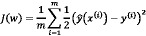
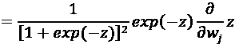
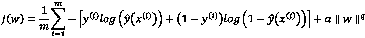
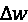

# 第四章：使用逻辑回归预测在线广告点击率

在上一章中，我们使用基于树的算法预测了广告点击率。在本章中，我们将继续探索解决数十亿美元问题的旅程。我们将重点学习一种非常（可能是最）可扩展的分类模型——逻辑回归。我们将探讨逻辑函数是什么，如何训练逻辑回归模型，如何为模型添加正则化，以及适用于非常大数据集的逻辑回归变种。除了在分类中的应用外，我们还将讨论如何使用逻辑回归和随机森林模型来选择重要特征。你不会感到无聊，因为我们将有很多从零开始的实现，使用 scikit-learn 和 TensorFlow。

在本章中，我们将讨论以下主题：

+   将分类特征转换为数值型特征——独热编码和原始编码

+   使用逻辑回归对数据进行分类

+   训练逻辑回归模型

+   使用在线学习训练大规模数据集

+   处理多类分类问题

+   使用 TensorFlow 实现逻辑回归

# 将分类特征转换为数值型特征——独热编码和原始编码

在*第三章*，*使用基于树的算法预测在线广告点击率*中，我提到过**独热编码**如何将分类特征转换为数值特征，以便在 scikit-learn 和 TensorFlow 的树算法中使用。如果我们使用独热编码将分类特征转换为数值特征，就不会将算法的选择局限于能够处理分类特征的基于树的算法。

我们能想到的最简单的解决方案是，将具有 *k* 个可能值的分类特征映射到一个数值特征，数值范围从 1 到 *k*。例如，`[Tech, Fashion, Fashion, Sports, Tech, Tech, Sports]` 变成 `[1, 2, 2, 3, 1, 1, 3]`。然而，这将引入顺序特性，例如 `Sports` 大于 `Tech`，以及距离特性，例如 `Sports` 距离 `Fashion` 比 `Tech` 更近。

相反，独热编码将分类特征转换为 *k* 个二进制特征。每个二进制特征表示是否存在相应的可能值。因此，前面的示例变成了以下内容：


图 4.1：使用独热编码将用户兴趣转换为数值特征

之前，我们使用了来自 scikit-learn 的 `OneHotEncoder` 将字符串矩阵转换为二进制矩阵，但在这里，让我们来看看另一个模块 `DictVectorizer`，它也提供了高效的转换。它将字典对象（分类特征：值）转换为独热编码向量。

例如，看看以下代码，它对包含分类特征的字典列表执行独热编码：

```py
>>> from sklearn.feature_extraction import DictVectorizer
>>> X_dict = [{'interest': 'tech', 'occupation': 'professional'},
...           {'interest': 'fashion', 'occupation': 'student'},
...           {'interest': 'fashion','occupation':'professional'},
...           {'interest': 'sports', 'occupation': 'student'},
...           {'interest': 'tech', 'occupation': 'student'},
...           {'interest': 'tech', 'occupation': 'retired'},
...           {'interest': 'sports','occupation': 'professional'}]
>>> dict_one_hot_encoder = DictVectorizer(sparse=False)
>>> X_encoded = dict_one_hot_encoder.fit_transform(X_dict)
>>> print(X_encoded)
[[ 0\.  0\. 1\. 1\.  0\. 0.]
 [ 1\.  0\. 0\. 0\.  0\. 1.]
 [ 1\.  0\. 0\. 1\.  0\. 0.]
 [ 0\.  1\. 0\. 0\.  0\. 1.]
 [ 0\.  0\. 1\. 0\.  0\. 1.]
 [ 0\.  0\. 1\. 0\.  1\. 0.]
 [ 0\.  1\. 0\. 1\.  0\. 0.]] 
```

我们也可以通过执行以下操作查看映射：

```py
>>> print(dict_one_hot_encoder.vocabulary_)
{'interest=fashion': 0, 'interest=sports': 1,
'occupation=professional': 3, 'interest=tech': 2,
'occupation=retired': 4, 'occupation=student': 5} 
```

当处理新数据时，我们可以通过以下方式进行转换：

```py
>>> new_dict = [{'interest': 'sports', 'occupation': 'retired'}]
>>> new_encoded = dict_one_hot_encoder.transform(new_dict)
>>> print(new_encoded)
[[ 0\. 1\. 0\. 0\. 1\. 0.]] 
```

我们可以像这样将编码后的特征逆向转换回原始特征：

```py
>>> print(dict_one_hot_encoder.inverse_transform(new_encoded))
[{'interest=sports': 1.0, 'occupation=retired': 1.0}] 
```

需要注意的一点是，如果在新数据中遇到一个新的（训练数据中未出现过的）类别，它应该被忽略（否则，编码器会抱怨未见过的类别值）。`DictVectorizer`会隐式处理这个问题（而`OneHotEncoder`需要指定`ignore`参数）：

```py
>>> new_dict = [{'interest': 'unknown_interest',
               'occupation': 'retired'},
...             {'interest': 'tech', 'occupation':
               'unseen_occupation'}]
>>> new_encoded = dict_one_hot_encoder.transform(new_dict)
>>> print(new_encoded)
[[ 0\.  0\. 0\. 0\.  1\. 0.]
 [ 0\.  0\. 1\. 0\.  0\. 0.]] 
```

有时，我们更倾向于将具有*k*个可能值的类别特征转换为一个数值特征，取值范围从*1*到*k*。这就是**顺序编码**，我们进行顺序编码是为了在学习中利用顺序或排名知识；例如，大、中、小分别变为 3、2 和 1；好和坏分别变为 1 和 0，而独热编码无法保留这样的有用信息。我们可以通过使用`pandas`轻松实现顺序编码，例如：

```py
>>> import pandas as pd
>>> df = pd.DataFrame({'score': ['low',
...                              'high',
...                              'medium',
...                              'medium',
...                              'low']})
>>> print(df)
    score
0     low
1    high
2  medium
3  medium
4     low
>>> mapping = {'low':1, 'medium':2, 'high':3}
>>> df['score'] = df['score'].replace(mapping)
>>> print(df)
   score
0      1
1      3
2      2
3      2
4      1 
```

我们根据定义的映射将字符串特征转换为顺序值。

**最佳实践**

处理由独热编码导致的高维度可能是具有挑战性的。这可能会增加计算复杂性或导致过拟合。以下是一些在使用独热编码时处理高维度的策略：

+   **特征选择**：这可以减少独热编码特征的数量，同时保留最有信息量的特征。

+   **降维**：它将高维特征空间转换为低维表示。

+   **特征聚合**：与其为每个类别单独进行独热编码，不如考虑将具有相似特征的类别进行聚合。例如，将罕见类别归为“其他”类别。

我们已经讨论了如何将类别特征转换为数值特征。接下来，我们将讨论逻辑回归，这是一种只接受数值特征的分类器。

# 使用逻辑回归进行数据分类

在上一章中，我们仅使用了来自 4000 万样本中的前 30 万个样本来训练基于树的模型。之所以这样做，是因为在大数据集上训练树模型的计算代价和时间开销非常大。由于我们不再局限于直接接受类别特征的算法（这要感谢独热编码），我们应该转向一种适合大数据集的高可扩展性算法。如前所述，逻辑回归是最具可扩展性的分类算法之一，甚至可能是最具可扩展性的。

## 开始使用逻辑函数

在深入了解算法之前，我们先介绍一下**逻辑函数**（更常称为**sigmoid 函数**），它是该算法的核心。它基本上将输入映射到 0 到 1 之间的输出值，其定义如下：


我们定义逻辑函数如下：

```py
>>> import numpy as np
>>> import matplotlib.pyplot as plt
>>> def sigmoid(input):
...     return 1.0 / (1 + np.exp(-input)) 
```

接下来，我们可视化输入变量在`-8`到`8`之间的变化，结果如下：

```py
>>> z = np.linspace(-8, 8, 1000)
>>> y = sigmoid(z)
>>> plt.plot(z, y)
>>> plt.axhline(y=0, ls='dotted', color='k')
>>> plt.axhline(y=0.5, ls='dotted', color='k')
>>> plt.axhline(y=1, ls='dotted', color='k')
>>> plt.yticks([0.0, 0.25, 0.5, 0.75, 1.0])
>>> plt.xlabel('z')
>>> plt.ylabel('y(z)')
>>> plt.show() 
```

请参考下方截图查看结果：


图 4.2：逻辑函数

在 S 形曲线中，所有输入都会被转换到 0 到 1 的范围内。对于正输入，较大的值使得输出接近 1；对于负输入，较小的值使得输出接近 0；当输入为 0 时，输出是中点，即 0.5。

## 从逻辑函数跳转到逻辑回归

现在你对逻辑函数有了一些了解，映射到源自它的算法就容易多了。在逻辑回归中，函数输入*z*是特征的加权和。给定一个具有*n*个特征的数据样本*x*，其中 *x*[1]*, x*[2]*, …, x*[n]（*x*代表特征向量，*x* = (*x*[1]*, x*[2]*, …, x*[n]*)），以及模型的**权重**（也叫**系数**）*w*（*w*表示向量(*w*[1]*, w*[2]*, …, w*[n]）），*z*表示如下：


这里，*T*是转置操作符。

有时，模型会带有一个**截距**（也叫**偏置**），*w*[0]，它表示固有的偏差或基线概率。在这种情况下，前述的线性关系变为：


至于输出*y*(*z*)的范围在 0 到 1 之间，在算法中，它表示目标为*1*或正类的概率：


因此，逻辑回归是一种概率分类器，类似于朴素贝叶斯分类器。

逻辑回归模型，或者更具体地说，其权重向量*w*，是通过训练数据学习得到的，目的是使得正样本尽可能接近*1*，负样本尽可能接近 0。在数学上，权重的训练目标是最小化定义为**均方误差**（**MSE**）的成本函数，该函数衡量真实值与预测值之间差值的平方的平均值。给定*m*个训练样本：


这里，*y*^((i))的值要么是`1`（正类），要么是`0`（负类），而需要优化的权重所对应的成本函数*J*(*w*)表示如下：



然而，前述的成本函数是**非凸**的，这意味着在寻找最优的*w*时，会发现许多局部（次优）最优解，且该函数不会收敛到全局最优解。

**凸**函数和**非凸**函数的示例分别如图所示：


图 4.3：凸函数和非凸函数的示例

在凸函数示例中，只有一个全局最优解，而在非凸函数示例中，有两个最优解。

更多关于凸函数和非凸函数的信息，请查看 [`web.stanford.edu/class/ee364a/lectures/functions.pdf`](https://web.stanford.edu/class/ee364a/lectures/functions.pdf)。

为了克服这个问题，在实践中，我们使用导致凸优化问题的成本函数，该函数定义如下：


我们可以更详细地查看单个训练样本的成本：


当真实值 *y*^((i)) *= 1* 时，如果模型完全自信地正确预测（正类的概率为 100%），样本成本 *j* 为 *0*；当预测概率  下降时，成本 *j* 会增加。如果模型错误地预测正类没有任何机会，则成本无限高。我们可以通过以下方式进行可视化：

```py
>>> y_hat = np.linspace(0.001, 0.999, 1000)
>>> cost = -np.log(y_hat)
>>> plt.plot(y_hat, cost)
>>> plt.xlabel('Prediction')
>>> plt.ylabel('Cost')
>>> plt.xlim(0, 1)
>>> plt.ylim(0, 7)
>>> plt.show() 
```

请参考以下图表查看最终结果：


图 4.4：当 y=1 时逻辑回归的成本函数

相反，当真实值 *y*^((i)) *= 0* 时，如果模型完全自信地正确预测（正类的概率为 *0*，或负类的概率为 100%），样本成本 *j* 为 *0*；当预测概率  增加时，成本 *j* 会增加。当模型错误地预测没有负类的可能性时，成本将变得无限高。我们可以使用以下代码进行可视化：

```py
>>> y_hat = np.linspace(0.001, 0.999, 1000)
>>> cost = -np.log(1 - y_hat)
>>> plt.plot(y_hat, cost)
>>> plt.xlabel('Prediction')
>>> plt.ylabel('Cost')
>>> plt.xlim(0, 1)
>>> plt.ylim(0, 7)
>>> plt.show() 
```

下图是结果输出：


图 4.5：当 y=0 时逻辑回归的成本函数

最小化这个替代的成本函数实际上等同于最小化基于 MSE 的成本函数。选择它而不是 MSE 版本的优点包括：

+   它是凸的，因此可以找到最优的模型权重

+   预测的对数和如下所示，它简化了关于权重的导数计算，稍后我们将讨论这一点：


或者：


+   由于对数函数，以下成本函数也被称为**对数损失**，简称**log loss**：


现在成本函数已经准备好，我们如何训练逻辑回归模型以最小化成本函数？让我们在下一节中看看。

# 训练逻辑回归模型

现在，问题如下：我们如何获得最优的 *w* 使得 *J*(*w*) 最小化？我们可以通过梯度下降法来实现。

## 使用梯度下降法训练逻辑回归模型

**梯度下降**（也叫**最速下降法**）是一种通过一阶迭代优化最小化损失函数的方法。在每次迭代中，模型参数会根据目标函数在当前点的负导数移动一个小步长。这意味着待优化的点会迭代地沿着目标函数的最小值方向向下移动。我们刚才提到的步长比例称为**学习率**，也叫**步长**。它可以用一个数学方程总结如下：


在这里，左边的 *w* 是学习一步后的权重向量，右边的 *w* 是学习前的权重， 是学习率， 是一阶导数，梯度。

为了使用梯度下降训练逻辑回归模型，我们从成本函数 *J*(*w*) 对 *w* 的导数开始。这可能需要一些微积分的知识，但不用担心，我们将一步步讲解：

1.  我们首先计算  对 *w* 的导数。我们在这里以 *j-th* 权重 *w*[j] 为例（注意 *z=w*^T*x*，为简便起见我们省略了 ^((i))）：





1.  然后，我们按如下方式计算样本成本 *J*(*w*) 的导数：


1.  最后，我们按以下方式计算 *m* 个样本的整体成本：


1.  然后，我们将其推广到 ：


1.  结合前面的推导，权重可以如下更新：


在这里，*w* 在每次迭代中都会更新。

1.  经过大量迭代后，学习到的参数 *w* 将用于通过以下方程对新样本 *x*’ 进行分类：


默认情况下，决策阈值为 `0.5`，但它可以是其他值。例如，在避免假阴性时，比如预测火灾发生（正类）时的警报，决策阈值可以低于 `0.5`，如 `0.3`，具体取决于我们的警觉性以及我们希望多主动地防止正类事件的发生。另一方面，当假阳性类是需要避免的情况时，例如在质量保证中预测产品成功率（正类），决策阈值可以大于 `0.5`，如 `0.7`，或者低于 `0.5`，具体取决于你设定的标准。

通过对基于梯度下降的训练和预测过程的深入理解，我们现在将从头实现逻辑回归算法：

1.  我们首先定义计算预测值的函数！[](img/B21047_04_032.png)，使用当前的权重：

    ```py
    >>> def compute_prediction(X, weights):
    ...     """
    ...     Compute the prediction y_hat based on current weights
    ...     """
    ...     z = np.dot(X, weights)
    ...     return sigmoid(z) 
    ```

1.  通过这种方式，我们可以继续以梯度下降的方式更新权重函数，步骤如下：


看一下以下代码：

```py
>>> def update_weights_gd(X_train, y_train, weights,
                                           learning_rate):
...     """
...     Update weights by one step
...     """
...     predictions = compute_prediction(X_train, weights)
...     weights_delta = np.dot(X_train.T, y_train - predictions)
...     m = y_train.shape[0]
...     weights += learning_rate / float(m) * weights_delta
...     return weights 
```

1.  然后，实现计算成本 *J*(*w*) 的函数：

    ```py
    >>> def compute_cost(X, y, weights):
    ...     """
    ...     Compute the cost J(w)
    ...     """
    ...     predictions = compute_prediction(X, weights)
    ...     cost = np.mean(-y * np.log(predictions)
                          - (1 - y) * np.log(1 - predictions))
    ...     return cost 
    ```

1.  接下来，我们通过执行以下代码将所有这些函数连接到模型训练函数中：

    +   在每次迭代中更新`weights`向量

    +   每`100`次迭代（可以是其他值）打印当前的成本，以确保`cost`在减少，并且一切都在正确的轨道上。

它们在以下函数中实现：

```py
>>> def train_logistic_regression(X_train, y_train, max_iter,
                                  learning_rate, fit_intercept=False):
...     """ Train a logistic regression model
...     Args:
...         X_train, y_train (numpy.ndarray, training data set)
...         max_iter (int, number of iterations)
...         learning_rate (float)
...         fit_intercept (bool, with an intercept w0 or not)
...     Returns:
...         numpy.ndarray, learned weights
...     """
...     if fit_intercept:
...         intercept = np.ones((X_train.shape[0], 1))
...         X_train = np.hstack((intercept, X_train))
...     weights = np.zeros(X_train.shape[1])
...     for iteration in range(max_iter):
...         weights = update_weights_gd(X_train, y_train,
                                       weights, learning_rate)
...         # Check the cost for every 100 (for example)      
             iterations
...         if iteration % 100 == 0:
...             print(compute_cost(X_train, y_train, weights))
...     return weights 
```

1.  最后，我们使用训练好的模型预测新输入的结果，方法如下：

    ```py
    >>> def predict(X, weights):
    ...     if X.shape[1] == weights.shape[0] - 1:
    ...         intercept = np.ones((X.shape[0], 1))
    ...         X = np.hstack((intercept, X))
    ...     return compute_prediction(X, weights) 
    ```

实现逻辑回归非常简单，就像你刚刚看到的那样。现在让我们通过一个玩具示例来进一步研究：

```py
>>> X_train = np.array([[6, 7],
...                     [2, 4],
...                     [3, 6],
...                     [4, 7],
...                     [1, 6],
...                     [5, 2],
...                     [2, 0],
...                     [6, 3],
...                     [4, 1],
...                     [7, 2]])
>>> y_train = np.array([0,
...                     0,
...                     0,
...                     0,
...                     0,
...                     1,
...                     1,
...                     1,
...                     1,
...                     1]) 
```

我们训练一个逻辑回归模型，进行`1000`次迭代，学习率为`0.1`，基于包含截距的权重：

```py
>>> weights = train_logistic_regression(X_train, y_train,
             max_iter=1000, learning_rate=0.1, fit_intercept=True)
0.574404237166
0.0344602233925
0.0182655727085
0.012493458388
0.00951532913855
0.00769338806065
0.00646209433351
0.00557351184683
0.00490163225453
0.00437556774067 
```

成本的下降意味着模型随着时间的推移在优化。我们可以通过以下方式检查模型在新样本上的表现：

```py
>>> X_test = np.array([[6, 1],
...                    [1, 3],
...                    [3, 1],
...                    [4, 5]])
>>> predictions = predict(X_test, weights)
>>> print(predictions)
array([ 0.9999478 , 0.00743991, 0.9808652 , 0.02080847]) 
```

为了可视化这一点，使用`0.5`作为分类决策阈值执行以下代码：

```py
>>> plt.scatter(X_train[:5,0], X_train[:5,1], c='b', marker='x')
>>> plt.scatter(X_train[5:,0], X_train[5:,1], c='k', marker='.')
>>> for i, prediction in enumerate(predictions):
        marker = 'X' if prediction < 0.5 else 'o'
        c = 'b' if prediction < 0.5 else 'k'
        plt.scatter(X_test[i,0], X_test[i,1], c=c, marker=marker) 
```

蓝色填充的交叉表示从类 0 预测的测试样本，而黑色填充的圆点表示从类 1 预测的测试样本：

```py
>>> plt.show() 
```

请参考以下截图查看结果：


图 4.6：玩具示例的训练集和测试集

我们训练的模型能正确预测新样本的类别（填充的交叉和填充的圆点）。

## 使用梯度下降进行逻辑回归预测广告点击率

现在，我们将在我们的点击预测项目中部署我们刚刚开发的算法。

我们将从仅使用 10,000 个训练样本开始（你很快就会明白为什么我们不从 270,000 开始，就像在上一章中那样）：

```py
>>> import pandas as pd
>>> n_rows = 300000
>>> df = pd.read_csv("train.csv", nrows=n_rows)
>>> X = df.drop(['click', 'id', 'hour', 'device_id', 'device_ip'],
                                                     axis=1).values
>>> Y = df['click'].values
>>> n_train = 10000
>>> X_train = X[:n_train]
>>> Y_train = Y[:n_train]
>>> X_test = X[n_train:]
>>> Y_test = Y[n_train:]
>>> from sklearn.preprocessing import OneHotEncoder
>>> enc = OneHotEncoder(handle_unknown='ignore')
>>> X_train_enc = enc.fit_transform(X_train)
>>> X_test_enc = enc.transform(X_test) 
```

我们在`10000`次迭代中训练逻辑回归模型，学习率为`0.01`，并带有偏差：

```py
>>> import timeit
>>> start_time = timeit.default_timer()
>>> weights = train_logistic_regression(X_train_enc.toarray(),
              Y_train, max_iter=10000, learning_rate=0.01,
              fit_intercept=True)
0.6820019456743648
0.4608619713011896
0.4503715555130051
…
…
…
0.41485094023829017
0.41477416506724385
0.41469802145452467
>>> print(f"--- {(timeit.default_timer() - start_time :.3f} seconds ---")
--- 183.840 seconds --- 
```

优化模型花费了 184 秒。训练后的模型在测试集上的表现如下：

```py
>>> pred = predict(X_test_enc.toarray(), weights)
>>> from sklearn.metrics import roc_auc_score
>>> print(f'Training samples: {n_train}, AUC on testing set: {roc_auc_score(Y_test, pred):.3f}')
Training samples: 10000, AUC on testing set: 0.703 
```

现在，让我们使用 100,000 个训练样本（`n_train = 100000`）并重复相同的过程。它将需要超过一个小时——这比拟合 10 倍大小数据集的时间多 22 倍。正如我在本章开始时提到的，逻辑回归分类器在处理大型数据集时表现良好。但我们的测试结果似乎与此相矛盾。我们如何有效地处理更大的训练数据集，不仅是 100,000 个样本，而是数百万个样本？让我们在下一节中看看更高效的训练逻辑回归模型的方法。

## 使用随机梯度下降（SGD）训练逻辑回归模型

在基于梯度下降的逻辑回归模型中，**所有**训练样本都用于每次迭代中更新权重。因此，如果训练样本数量很大，整个训练过程将变得非常耗时和计算昂贵，正如您在我们的最后一个例子中所见到的。

幸运的是，一个小小的调整就可以使逻辑回归适用于大型数据集。每次权重更新，只消耗**一个**训练样本，而不是整个训练集。模型根据单个训练样本计算的误差前进一步。一旦所有样本都被使用，一次迭代就完成了。这种进阶版本的梯度下降被称为**SGD**。用公式表达，对于每次迭代，我们执行以下操作：


SGD 通常比梯度下降收敛速度快得多，后者通常需要大量迭代次数。

要实现基于 SGD 的逻辑回归，我们只需要稍微修改`update_weights_gd`函数：

```py
>>> def update_weights_sgd(X_train, y_train, weights,
                                           learning_rate):
...     """ One weight update iteration: moving weights by one
            step based on each individual sample
...     Args:
...     X_train, y_train (numpy.ndarray, training data set)
...     weights (numpy.ndarray)
...     learning_rate (float)
...     Returns:
...     numpy.ndarray, updated weights
...     """
...     for X_each, y_each in zip(X_train, y_train):
...         prediction = compute_prediction(X_each, weights)
...         weights_delta = X_each.T * (y_each - prediction)
...         weights += learning_rate * weights_delta
...     return weights 
```

在`train_logistic_regression`函数中，应用了 SGD：

```py
>>> def train_logistic_regression_sgd(X_train, y_train, max_iter,
                              learning_rate, fit_intercept=False):
...     """ Train a logistic regression model via SGD
...     Args:
...     X_train, y_train (numpy.ndarray, training data set)
...     max_iter (int, number of iterations)
...     learning_rate (float)
...     fit_intercept (bool, with an intercept w0 or not)
...     Returns:
...     numpy.ndarray, learned weights
...     """
...     if fit_intercept:
...         intercept = np.ones((X_train.shape[0], 1))
...         X_train = np.hstack((intercept, X_train))
...     weights = np.zeros(X_train.shape[1])
...     for iteration in range(max_iter):
...         weights = update_weights_sgd(X_train, y_train, weights,
                                                     learning_rate)
...         # Check the cost for every 2 (for example) iterations
...         if iteration % 2 == 0:
...             print(compute_cost(X_train, y_train, weights))
...     return weights 
```

现在，让我们看看 SGD 有多强大。我们将使用 10 万个训练样本，选择`10`作为迭代次数，`0.01`作为学习率，并打印出每两次迭代的当前成本：

```py
>>> start_time = timeit.default_timer()
>>> weights = train_logistic_regression_sgd(X_train_enc.toarray(),
        Y_train, max_iter=10, learning_rate=0.01, fit_intercept=True)
0.4127864859625796
0.4078504597223988
0.40545733114863264
0.403811787845451
0.4025431351250833
>>> print(f"--- {(timeit.default_timer() - start_time)}.3fs seconds ---")
--- 25.122 seconds ---
>>> pred = predict(X_test_enc.toarray(), weights)
>>> print(f'Training samples: {n_train}, AUC on testing set: {roc_auc_score(Y_test, pred):.3f}')
Training samples: 100000, AUC on testing set: 0.732 
```

训练过程仅用时 25 秒完成！

成功从头开始实现基于 SGD 的逻辑回归算法后，我们使用 scikit-learn 的`SGDClassifier`模块来实现它：

```py
>>> from sklearn.linear_model import SGDClassifier
>>> sgd_lr = SGDClassifier(loss='log_loss', penalty=None,
             fit_intercept=True, max_iter=20,
             learning_rate='constant', eta0=0.01) 
```

在这里，`'``log_loss'`作为`loss`参数表明成本函数是对数损失，`penalty`是减少过拟合的正则化项，我们将在下一节中进一步讨论，`max_iter`是迭代次数，另外两个参数意味着学习率是`0.01`，在训练过程中保持不变。应注意，默认的`learning_rate`是`'optimal'`，随着更新的进行，学习率会稍微降低。这对于在大型数据集上找到最优解是有益的。

现在，训练模型并测试它：

```py
>>> sgd_lr.fit(X_train_enc.toarray(), Y_train)
>>> pred = sgd_lr.predict_proba(X_test_enc.toarray())[:, 1]
>>> print(f'Training samples: {n_train}, AUC on testing set: {roc_auc_score(Y_test, pred):.3f}')
Training samples: 100000, AUC on testing set: 0.732 
```

快速简单！

## 训练带有正则化的逻辑回归模型

正如我在前一节简要提到的，逻辑回归的`SGDClassifier`中的`penalty`参数与模型的**正则化**有关。正则化有两种基本形式，**L1**（也称为**Lasso**）和**L2**（也称为**Ridge**）。无论哪种方式，正则化都是原始成本函数之外的一个额外项：


这里，是乘以正则化项的常数，*q*可以是*1*或*2*，代表 L1 或 L2 正则化，其中以下适用：


训练一个逻辑回归模型是减少以权重 *w* 为函数的成本的过程。如果到达某个点时，某些权重（例如 *w*[i]、*w*[j] 和 *w*[k]）非常大，整个成本将由这些大权重决定。在这种情况下，学习到的模型可能只是记住了训练集，无法很好地推广到未见过的数据。正则化项的引入是为了惩罚大权重，因为权重现在成为了最小化成本的一部分。

正则化通过消除过拟合来起到作用。最后，参数 α 提供了对数损失和泛化之间的权衡。如果 *α* 太小，它不能压缩大的权重，模型可能会遭遇高方差或过拟合；另一方面，如果 *α* 太大，模型可能会过度泛化，无法很好地拟合数据集，表现出欠拟合的症状。*α* 是调优的一个重要参数，用于获得最佳的带正则化的逻辑回归模型。

在选择 L1 和 L2 形式时，通常的经验法则是看是否预期进行 **特征选择**。在 **机器学习** (**ML**) 分类中，特征选择是选择一组重要特征以用于构建更好的模型的过程。在实践中，数据集中的并非每个特征都包含有助于区分样本的信息；有些特征是冗余的或无关的，因此可以在损失较小的情况下丢弃。

在逻辑回归分类器中，特征选择只能通过 L1 正则化来实现。为了理解这一点，我们假设有两个权重向量，*w*[1]= (*1, 0*) 和 *w*[2]= (*0.5, 0.5*)；假设它们产生相同的对数损失，两个权重向量的 L1 和 L2 正则化项如下：


两个向量的 L1 项是相等的，而 *w*[2] 的 L2 项小于 *w*[1] 的 L2 项。这表明，L2 正则化相比 L1 正则化对由极大和极小权重组成的权重施加了更多的惩罚。换句话说，L2 正则化偏向于所有权重的相对较小值，避免任何权重出现极大或极小的值，而 L1 正则化允许某些权重具有显著较小的值，某些则具有显著较大的值。只有使用 L1 正则化，某些权重才能被压缩到接近或完全为 *0*，这使得特征选择成为可能。

在 scikit-learn 中，正则化类型可以通过 `penalty` 参数指定，选项包括 `none`（无正则化）、`"l1"`、`"l2"` 和 `"elasticnet"`（L1 和 L2 的混合），而乘数 α 可以通过 alpha 参数指定。

## 使用 L1 正则化进行特征选择

我们在此讨论通过 L1 正则化进行特征选择。

初始化一个带有 L1 正则化的 SGD 逻辑回归模型，并基于 10,000 个样本训练模型：

```py
>>> sgd_lr_l1 = SGDClassifier(loss='log_loss',
                          penalty='l1',
                          alpha=0.0001,
                          fit_intercept=True,
                          max_iter=10,
                          learning_rate='constant',
                          eta0=0.01,
                          random_state=42)
>>> sgd_lr_l1.fit(X_train_enc.toarray(), Y_train) 
```

使用训练好的模型，我们可以获得其系数的绝对值：

```py
>>> coef_abs = np.abs(sgd_lr_l1.coef_)
>>> print(coef_abs)
[[0\. 0.16654682 0\. ... 0\. 0\. 0.12803394]] 
```

底部的 `10` 个系数及其值如下所示：

```py
>>> print(np.sort(coef_abs)[0][:10])
[0\. 0\. 0\. 0\. 0\. 0\. 0\. 0\. 0\. 0.]
>>> bottom_10 = np.argsort(coef_abs)[0][:10] 
```

我们可以通过以下代码查看这 10 个特征：

```py
>>> feature_names = enc.get_feature_names_out()
>>> print('10 least important features are:\n', feature_names[bottom_10])
10 least important features are:
 ['x0_1001' 'x8_84c2f017' 'x8_84ace234'  'x8_84a9d4ba' 'x8_84915a27'
'x8_8441e1f3' 'x8_840161a0' 'x8_83fbdb80' 'x8_83fb63cd' 'x8_83ed0b87'] 
```

它们分别是来自 `X_train` 中第 `0` 列（即 `C1` 列）的 `1001`，来自第 `8` 列（即 `device_model` 列）的 `84c2f017`，依此类推。

同样，前 10 个系数及其值可以通过以下方式获得：

```py
>>> print(np.sort(coef_abs)[0][-10:])
[0.67912376 0.70885933 0.75157162 0.81783177 0.94672827 1.00864062
 1.08152137 1.130848   1.14859459 1.37750805]
>>> top_10 = np.argsort(coef_abs)[0][-10:]
>>> print('10 most important features are:\n', feature_names[top_10])
10 most important features are:
 ['x4_28905ebd' 'x3_7687a86e' 'x18_61' 'x18_15' 'x5_5e3f096f' 'x5_9c13b419' 'x2_763a42b5' 'x3_27e3c518' 'x2_d9750ee7' 'x5_1779deee'] 
```

它们分别是来自 `X_train` 中第 `4` 列（即 `site_category`）的 `28905ebd`，来自第 `3` 列（即 `site_domain`）的 `7687a86e`，依此类推。

在本节中，你已经了解了如何使用 L1 正则化的逻辑回归进行特征选择，在该方法中，不重要特征的权重被压缩到接近 0 或者完全为 0。除了 L1 正则化的逻辑回归，随机森林是另一种常用的特征选择技术。我们将在下一节进一步探讨。

## 使用随机森林进行特征选择

总结一下，随机森林是对一组独立决策树的袋装方法。每棵树在每个节点寻找最佳分割点时都会考虑特征的随机子集。在决策树中，只有那些重要的特征（以及它们的分割值）被用来构建树节点。考虑到整个森林：一个特征在树节点中使用得越频繁，它的重要性就越大。

换句话说，我们可以根据特征在所有树的节点中出现的频率对特征重要性进行排名，并选择最重要的特征。

在 scikit-learn 中训练好的 `RandomForestClassifier` 模块包含一个名为 `feature_importances_` 的属性，表示特征重要性，计算方式为特征在树节点中出现的比例。同样，我们将在一个包含 100,000 个广告点击样本的数据集上使用随机森林进行特征选择：

```py
>>> from sklearn.ensemble import RandomForestClassifier
>>> random_forest = RandomForestClassifier(n_estimators=100,
                 criterion='gini', min_samples_split=30, n_jobs=-1)
>>> random_forest.fit(X_train_enc.toarray(), Y_train) 
```

在拟合随机森林模型后，我们可以通过以下方式获取特征重要性分数：

```py
>>> feature_imp = random_forest.feature_importances_
>>> print(feature_imp)
[1.22776093e-05 1.42544940e-03 8.11601536e-04 ... 7.51812083e-04 8.79340746e-04 8.49537255e-03] 
```

看一下底部 10 个特征分数以及相应的 10 个最不重要特征：

```py
>>> feature_names = enc.get_feature_names()
>>> print(np.sort(feature_imp)[:10])
[0\. 0\. 0\. 0\. 0\. 0\. 0\. 0\. 0\. 0.]
>>> bottom_10 = np.argsort(feature_imp)[:10]
>>> print('10 least important features are:\n', feature_names[bottom_10])
10 least important features are:
 ['x5_f0222e42' 'x8_7d196936' 'x2_ba8f6070' 'x2_300ede9d' 'x5_72c55d0b' 'x2_4390d4c5' 'x5_69e5a5ec' 'x8_023a5294' 'x11_15541' 'x6_2022d54e'] 
```

现在，看看前 10 个特征分数以及相应的 10 个最重要特征：

```py
>>> print(np.sort(feature_imp)[-10:])
[0.00849437 0.00849537 0.00872154 0.01010324 0.0109653  0.01099363 0.01319093 0.01471638 0.01802233 0.01889752]
>>> top_10 = np.argsort(feature_imp)[-10:]
>>> print('10 most important features are:\n', feature_names[top_10])
10 most important features are:
 ['x3_7687a86e' 'x18_157' 'x17_-1' 'x14_1993' 'x8_8a4875bd' 'x2_d9750ee7' 'x3_98572c79' 'x16_1063' 'x15_2' 'x18_33'] 
```

本节中，我们讲解了如何使用随机森林进行特征选择。我们使用随机森林对广告点击数据进行了特征排名。你能否使用前 10 或 20 个特征来构建另一个用于广告点击预测的逻辑回归模型？

# 在大数据集上进行在线学习训练

到目前为止，我们的模型已在不超过 300,000 个样本上进行了训练。如果超过这个数字，内存可能会被超载，因为它需要存储过多数据，程序也可能会崩溃。在本节中，我们将探讨如何使用 **在线学习** 在大规模数据集上进行训练。

SGD 从梯度下降演变而来，通过依次使用单个训练样本逐步更新模型，而不是一次性使用完整的训练集。我们可以通过在线学习技术进一步扩展 SGD。在在线学习中，训练所需的新数据是按顺序或实时提供的，而不像离线学习环境中那样一次性提供。每次加载并预处理一小块数据进行训练，从而释放用于存储整个大数据集的内存。除了更好的计算可行性外，在线学习还因其对实时生成新数据并需要更新模型的适应性而被使用。例如，股票价格预测模型通过及时的市场数据以在线学习方式进行更新；点击率预测模型需要包括反映用户最新行为和兴趣的最新数据；垃圾邮件检测器必须对不断变化的垃圾邮件发送者做出反应，考虑动态生成的新特征。

以前通过先前的数据集训练的现有模型，现在可以仅基于最新可用的数据集进行更新，而不是像在离线学习中那样，基于之前和当前的数据集一起从头开始重建模型：


图 4.7：在线学习与离线学习

在前面的例子中，在线学习允许模型继续使用新到达的数据进行训练。然而，在离线学习中，我们必须使用新到达的数据和旧数据一起重新训练整个模型。

scikit-learn 中的 `SGDClassifier` 模块通过 `partial_fit` 方法实现在线学习（而 `fit` 方法用于离线学习，正如你所见）。我们将使用 1,000,000 个样本来训练模型，其中每次输入 100,000 个样本，以模拟在线学习环境。此外，我们还将用另外 100,000 个样本对训练好的模型进行测试，如下所示：

```py
>>> n_rows = 100000 * 11
>>> df = pd.read_csv("train.csv", nrows=n_rows)
>>> X = df.drop(['click', 'id', 'hour', 'device_id', 'device_ip'],
                                                      axis=1).values
>>> Y = df['click'].values
>>> n_train = 100000 * 10
>>> X_train = X[:n_train]
>>> Y_train = Y[:n_train]
>>> X_test = X[n_train:]
>>> Y_test = Y[n_train:] 
```

如下所示，将编码器应用于整个训练集：

```py
>>> enc = OneHotEncoder(handle_unknown='ignore')
>>> enc.fit(X_train) 
```

初始化一个 SGD 逻辑回归模型，并将迭代次数设置为 `1`，以便部分拟合模型并启用在线学习：

```py
>>> sgd_lr_online = SGDClassifier(loss='log_loss',
                              penalty=None,
                              fit_intercept=True,
                              max_iter=1,
                              learning_rate='constant',
                              eta0=0.01,
                              random_state=42) 
```

对每 `100000` 个样本进行循环，并部分拟合模型：

```py
>>> start_time = timeit.default_timer()
>>> for i in range(10):
...     x_train = X_train[i*100000:(i+1)*100000]
...     y_train = Y_train[i*100000:(i+1)*100000]
...     x_train_enc = enc.transform(x_train)
...     sgd_lr_online.partial_fit(x_train_enc.toarray(), y_train,
                                                    classes=[0, 1]) 
```

同样，我们使用 `partial_fit` 方法进行在线学习。此外，我们还指定了 `classes` 参数，这是在线学习中必需的：

```py
>>> print(f"--- {(timeit.default_timer() - start_time):.3f} seconds ---")
--- 87.399s seconds --- 
```

将训练好的模型应用于测试集，即接下来的 100,000 个样本，如下所示：

```py
>>> x_test_enc = enc.transform(X_test)
>>> pred = sgd_lr_online.predict_proba(x_test_enc.toarray())[:, 1]
>>> print(f'Training samples: {n_train * 10}, AUC on testing set: {roc_auc_score(Y_test, pred):.3f}')
Training samples: 10000000, AUC on testing set: 0.762 
```

在在线学习中，仅用 100 万个样本进行训练只需 87 秒，并且能得到更好的准确度。

到目前为止，我们一直在使用逻辑回归进行二分类。我们可以用它处理多分类问题吗？可以。不过，我们确实需要做一些小的调整。让我们在下一节中看看。

# 处理多类别分类

另一个值得注意的事情是逻辑回归算法如何处理多类分类。尽管在多类情况下我们与 scikit-learn 分类器的交互方式与二分类时相同，但了解逻辑回归在多类分类中的工作原理是很有用的。

对于超过两个类别的逻辑回归也被称为**多项式逻辑回归**，后来更常被称为**softmax 回归**。正如你在二分类情况下看到的，模型由一个权重向量 *w* 表示，目标属于 *1* 或正类的概率如下所示：


在 *K* 类的情况下，模型由 *K* 个权重向量 *w*[1]、*w*[2]、...、*w*[K] 表示，目标属于类 *k* 的概率如下所示：


请查看以下项：


上述项规范化了以下概率（*k* 从 *1* 到 *K*），使其总和为 *1*：


二分类情况下的代价函数表示如下：



类似地，多类情况下的代价函数变为如下：


在这里， 函数只有在  为真时才为 *1*，否则为 0。

在定义了代价函数之后，我们以与在二分类情况下推导步长  相同的方式，得到 *j* 权重向量的步长 ：


类似地，所有 *K* 个权重向量在每次迭代中都会被更新。经过足够的迭代后，学习到的权重向量 *w*[1]、*w*[2]、...、*w*[K] 将用于通过以下方程对新的样本 *x*’ 进行分类：


为了更好地理解，我们来用一个经典数据集进行实验——手写数字分类：

```py
>>> from sklearn import datasets
>>> digits = datasets.load_digits()
>>> n_samples = len(digits.images) 
```

由于图像数据存储在 8*8 矩阵中，我们需要将其展开，方法如下：

```py
>>> X = digits.images.reshape((n_samples, -1))
>>> Y = digits.target 
```

然后我们将数据分割如下：

```py
>>> from sklearn.model_selection import train_test_split
>>> X_train, X_test, Y_train, Y_test = train_test_split(X, Y,
                                    test_size=0.2, random_state=42) 
```

然后，我们结合网格搜索和交叉验证来找到最佳的多类逻辑回归模型，如下所示：

```py
>>> from sklearn.model_selection import GridSearchCV
>>> parameters = {'penalty': ['l2', None],
...               'alpha': [1e-07, 1e-06, 1e-05, 1e-04],
...               'eta0': [0.01, 0.1, 1, 10]}
>>> sgd_lr = SGDClassifier(loss='log_loss',
                       learning_rate='constant',
                       fit_intercept=True,
                       max_iter=50,
                       random_state=42)
>>> grid_search = GridSearchCV(sgd_lr, parameters,
                               n_jobs=-1, cv=5)
>>> grid_search.fit(X_train, Y_train)
>>> print(grid_search.best_params_)
{'alpha': 1e-05, 'eta0': 0.01, 'penalty': 'l2' } 
```

我们首先定义要为模型调优的超参数网格。在用一些固定参数初始化分类器后，我们设置网格搜索交叉验证。我们在训练集上训练并找到最佳的超参数组合。

为了使用最佳模型进行预测，我们应用以下方法：

```py
>>> sgd_lr_best = grid_search.best_estimator_
>>> accuracy = sgd_lr_best.score(X_test, Y_test)
>>> print(f'The accuracy on testing set is: {accuracy*100:.1f}%')
The accuracy on testing set is: 94.7% 
```

它看起来与前一个例子差别不大，因为 `SGDClassifier` 在内部处理了多类情况。你可以自行计算混淆矩阵作为练习。观察模型在各个类上的表现会很有意思。

下一部分将是一个奖励部分，我们将使用 TensorFlow 实现逻辑回归，并以点击预测作为例子。

# 使用 TensorFlow 实现逻辑回归

我们将使用 TensorFlow 实现逻辑回归，再次以点击预测为示例。我们使用前 100,000 个样本中的 90%进行训练，剩余的 10%用于测试，并假设 `X_train_enc`、`Y_train`、`X_test_enc` 和 `Y_test` 包含正确的数据：

1.  首先，我们导入 TensorFlow，将 `X_train_enc` 和 `X_test_enc` 转换为 NumPy 数组，并将 `X_train_enc`、`Y_train`、`X_test_enc` 和 `Y_test` 转换为 `float32`：

    ```py
    >>> import tensorflow as tf
    >>> X_train_enc = enc.fit_transform(X_train).toarray().astype('float32')
    >>> X_test_enc = enc.transform(X_test).toarray().astype('float32')
    >>> Y_train = Y_train.astype('float32')
    >>> Y_test = Y_test.astype('float32') 
    ```

在 TensorFlow 中，通常使用 NumPy 数组形式的数据进行操作。此外，TensorFlow 默认使用 float32 进行计算，以提高计算效率。

1.  我们使用 `tf.data` 模块对数据进行洗牌和分批：

    ```py
    >>> batch_size = 1000
    >>> train_data = tf.data.Dataset.from_tensor_slices((X_train_enc, Y_train))
    >>> train_data = train_data.repeat().shuffle(5000).batch(batch_size).prefetch(1) 
    ```

对于每次权重更新，仅消耗**一个批次**的样本，而不是单个样本或整个训练集。模型根据批次样本计算的误差进行一步更新。在本例中，批次大小为 1,000。

`tf.data` 提供了一套高效加载和预处理机器学习数据的工具和实用程序。它旨在处理大规模数据集，并支持高效的数据管道构建，用于训练和评估。

1.  然后，我们定义逻辑回归模型的权重和偏差：

    ```py
    >>> n_features = X_train_enc.shape[1]
    >>> W = tf.Variable(tf.zeros([n_features, 1]))
    >>> b = tf.Variable(tf.zeros([1])) 
    ```

1.  然后，我们创建一个梯度下降优化器，通过最小化损失来寻找最佳系数。我们使用 Adam（Adam：*一种随机优化方法*，Kingma，D. P.，和 Ba，J.（2014））作为我们的优化器，它是一种改进的梯度下降方法，具有自适应学习率（起始学习率为`0.001`）：

    ```py
    >>> learning_rate = 0.001
    >>> optimizer = tf.optimizers.Adam(learning_rate) 
    ```

1.  我们定义优化过程，在该过程中计算当前的预测值和成本，并根据计算的梯度更新模型系数：

    ```py
    >>> def run_optimization(x, y):
    ...     with tf.GradientTape() as tape:
    ...         logits = tf.add(tf.matmul(x, W), b)[:, 0]
    ...         loss = tf.reduce_mean(
                         tf.nn.sigmoid_cross_entropy_with_logits(
                                             labels=y, logits=logits))
            # Update the parameters with respect to the gradient calculations
    ...     gradients = tape.gradient(loss, [W, b])
    ...     optimizer.apply_gradients(zip(gradients, [W, b])) 
    ```

在这里，`tf.GradientTape` 允许我们跟踪 TensorFlow 计算，并计算相对于给定变量的梯度。

1.  我们运行训练 5,000 步（每步使用一个批次的随机样本）：

    ```py
    >>> training_steps = 5000
    >>> for step, (batch_x, batch_y) in
                  enumerate(train_data.take(training_steps), 1):
    ...     run_optimization(batch_x, batch_y)
    ...     if step % 500 == 0:
    ...         logits = tf.add(tf.matmul(batch_x, W), b)[:, 0]
    ...         loss = tf.reduce_mean(
                           tf.nn.sigmoid_cross_entropy_with_logits(
                                 labels=batch_y, logits=logits))
    ...         print("step: %i, loss: %f" % (step, loss))
    step: 500, loss: 0.448672
    step: 1000, loss: 0.389186
    step: 1500, loss: 0.413012
    step: 2000, loss: 0.445663
    step: 2500, loss: 0.361000
    step: 3000, loss: 0.417154
    step: 3500, loss: 0.359435
    step: 4000, loss: 0.393363
    step: 4500, loss: 0.402097
    step: 5000, loss: 0.376734 
    ```

每 500 步，我们计算并打印当前的成本，以检查训练性能。如你所见，训练损失总体上在减少。

1.  模型训练完成后，我们使用它对测试集进行预测，并报告 AUC 指标：

    ```py
    >>> logits = tf.add(tf.matmul(X_test_enc, W), b)[:, 0]
    >>> pred = tf.nn.sigmoid(logits)
    >>> auc_metric = tf.keras.metrics.AUC()
    >>> auc_metric.update_state(Y_test, pred)
    >>> print(f'AUC on testing set: {auc_metric.result().numpy():.3f}')
    AUC on testing set: 0.736 
    ```

我们能够通过基于 TensorFlow 的逻辑回归模型实现 AUC 值 `0.736`。你还可以调整学习率、训练步骤数和其他超参数，以获得更好的性能。这将在本章末尾作为一个有趣的练习。

**最佳实践**

批次大小的选择在 SGD 中可能会显著影响训练过程和模型的性能。以下是选择批次大小的一些最佳实践：

+   **考虑计算资源**：较大的批次大小需要更多的内存和计算资源，而较小的批次大小可能导致收敛速度较慢。选择一个适合硬件内存限制并最大化计算效率的批次大小。

+   **经验测试**：尝试不同的批量大小，并在验证数据集上评估模型性能。选择在收敛速度和模型性能之间取得最佳平衡的批量大小。

+   **批量大小与学习率**：批量大小的选择可能与学习率相互作用。较大的批量大小可能需要较高的学习率来防止收敛过慢，而较小的批量大小可能从较小的学习率中受益，以避免不稳定。

+   **考虑数据的性质**：数据的性质也会影响批量大小的选择。例如，在样本高度相关或存在时间依赖性的任务中（例如，时间序列数据），较小的批量大小可能更有效。

你可能会好奇我们是如何在包含 4000 万样本的整个数据集上高效地训练模型的。你将使用如**Spark** ([`spark.apache.org/`](https://spark.apache.org/)) 和 `PySpark` 模块等工具来扩展我们的解决方案。

# 小结

在本章中，我们继续进行在线广告点击率预测项目。这一次，我们通过使用独热编码技术克服了分类特征的挑战。随后，我们转向了新的分类算法——逻辑回归，因为它对大数据集具有较高的可扩展性。关于逻辑回归算法的深入讨论从介绍逻辑函数开始，进而引出了算法本身的机制。接着，我们讲解了如何使用梯度下降法训练逻辑回归模型。

在手动实现逻辑回归分类器并在我们的点击率数据集上进行测试之后，你学习了如何使用更加先进的方式训练逻辑回归模型，采用了 SGD，并相应地调整了我们的算法。我们还练习了如何使用基于 SGD 的 scikit-learn 逻辑回归分类器，并将其应用于我们的项目。

接着，我们继续解决使用逻辑回归时可能遇到的问题，包括 L1 和 L2 正则化用于消除过拟合、大规模数据集的在线学习技术以及处理多分类场景。你还学习了如何使用 TensorFlow 实现逻辑回归。最后，本章以将随机森林模型应用于特征选择作为替代 L1 正则化逻辑回归的方法结束。

回顾我们的学习历程，自*第二章*《使用朴素贝叶斯构建电影推荐引擎》开始，我们就一直在处理分类问题。现在我们已经覆盖了机器学习中所有强大且流行的分类模型。接下来，我们将进入回归问题的解决，回归是监督学习中与分类并列的任务。你将学习回归模型，包括线性回归和回归决策树。

# 练习题

1.  在基于逻辑回归的点击率预测项目中，你能否调整`penalty`、`eta0`和`alpha`等超参数，来优化`SGDClassifier`模型的表现？你能达到的最高测试 AUC 是多少？

1.  你能否尝试在在线学习解决方案中使用更多的训练样本，比如 1000 万个样本？

1.  在基于 TensorFlow 的解决方案中，你能否调整学习率、训练步数以及其他超参数，以获得更好的性能？

# 加入我们书籍的 Discord 空间

加入我们社区的 Discord 空间，与作者和其他读者一起讨论：

[`packt.link/yuxi`](https://packt.link/yuxi)


