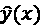

# 第五章：使用回归算法预测股票价格

在上一章中，我们使用逻辑回归预测了广告点击。在本章中，我们将解决一个人人都感兴趣的问题——预测股票价格。通过智能投资致富——谁不感兴趣呢？股市波动和股价预测一直以来都是金融、交易甚至技术公司积极研究的课题。使用机器学习技术预测股票价格的各种方法已被开发出来。在此，我们将专注于学习几种流行的回归算法，包括线性回归、回归树和回归森林以及支持向量回归，利用它们来解决这个价值数十亿（甚至数万亿）美元的问题。

在本章中，我们将涵盖以下主题：

+   什么是回归分析？

+   挖掘股票价格数据

+   开始进行特征工程

+   使用线性回归进行估算

+   使用决策树回归进行估算

+   实现回归森林

+   评估回归性能

+   使用三种回归算法预测股票价格

# 什么是回归分析？

**回归分析**是机器学习中监督学习的主要类型之一。在回归分析中，训练集包含观测值（也称为特征）及其相关的**连续**目标数值。回归的过程包括两个阶段：

+   第一阶段是探索观测值和目标之间的关系。这是训练阶段。

+   第二阶段是利用第一阶段的模式生成未来观测的目标。这是预测阶段。

整个过程如下图所示：


图 5.1：回归中的训练和预测阶段

回归分析和分类的主要区别在于回归分析的输出值是连续的，而分类的输出值是离散的。这导致这两种监督学习方法在应用领域上有所不同。分类主要用于确定所需的成员资格或特征，正如您在前几章中看到的那样，例如电子邮件是否为垃圾邮件，新闻组主题或广告点击率。相反，回归分析主要涉及估算结果或预测响应。

使用线性回归估算连续目标的示例如下，我们试图拟合一条直线以适应一组二维数据点：


图 5.2：线性回归示例

典型的机器学习回归问题包括以下内容：

+   根据位置、面积以及卧室和浴室数量预测房价

+   根据系统进程和内存信息估算功耗

+   预测零售需求

+   预测股票价格

我在本节中讲解了回归分析，并将在下一节简要介绍它在股市和交易中的应用。

# 挖掘股票价格数据

在本章中，我们将作为股票量化分析师/研究员，探讨如何使用几种典型的机器学习回归算法预测股票价格。我们从对股市和股票价格的简要概述开始。

## 股市和股票价格的简要概述

公司股票代表对公司所有权的认定。每一股股票代表公司资产和收益的某个比例，具体比例依据总股数而定。股票可以在股东和其他各方之间通过股票交易所和组织进行交易。主要的股票交易所包括纽约证券交易所、纳斯达克、伦敦证券交易所集团和香港证券交易所。股票交易价格的波动基本上是由供求法则决定的。

一般来说，投资者希望以低价买入，高价卖出。这听起来很简单，但实施起来非常具有挑战性，因为很难准确预测股票价格是会上涨还是下跌。主要有两种研究方向试图理解导致价格变化的因素和条件，甚至预测未来的股票价格，**基本面分析**和**技术分析**：

+   **基本面分析**：这一流派关注影响公司价值和经营的基础因素，包括从宏观角度来看整体经济和行业的情况，从微观角度来看公司的财务状况、管理层和竞争对手。

+   **技术分析**：相反，这一领域通过对过去交易活动的统计研究来预测未来的价格走势，包括价格波动、交易量和市场数据。利用机器学习技术预测价格现在已经成为技术分析中的一个重要话题。

许多量化交易公司使用机器学习来增强自动化和算法交易。

理论上，我们可以应用回归技术来预测某一特定股票的价格。然而，很难确保我们选取的股票适合用于学习——其价格应该遵循一些可学习的模式，且不能受到前所未有的事件或不规则情况的影响。因此，我们将在这里重点关注一个最流行的**股票指数**，以更好地说明和概括我们的价格回归方法。

首先让我们来了解什么是股票指数。股票指数是衡量整体股市一部分价值的统计指标。一个指数包含了几个股票，这些股票足够多样化，能够代表整个市场的一部分。此外，指数的价格通常是通过选定股票价格的加权平均计算得出的。

**纳斯达克综合指数**是全球历史最悠久、最常被关注的指数之一。它包括所有在纳斯达克交易所上市的股票，涵盖了广泛的行业。纳斯达克主要列出技术公司股票，包括苹果、亚马逊、微软和谷歌（字母表）等已建立的大公司，以及新兴的成长型公司。

你可以在雅虎财经查看它的每日价格和表现，网址是[`finance.yahoo.com/quote/%5EIXIC/history?p=%5EIXIC`](https://finance.yahoo.com/quote/%5EIXIC/history?p=%5EIXIC)。例如：


图 5.3：雅虎财经每日价格和表现的截图

在每个交易日，股票价格会发生变化并实时记录。五个展示价格在一个单位时间（通常为一天，但也可以是一个星期或一个月）内波动的数值是关键交易指标，具体如下：

+   **开盘**：某个交易日的起始价格

+   **收盘**：当天的最终价格

+   **最高**：当天股票交易的最高价格

+   **最低**：当天股票交易的最低价格

+   **交易量**：当天市场闭盘前的总交易股数

我们将重点关注纳斯达克，并利用其历史价格和表现来预测未来的价格。在接下来的部分中，我们将探讨如何开发价格预测模型，特别是回归模型，并研究哪些可以作为指标或预测特征。

# 开始进行特征工程

当谈到机器学习算法时，通常第一个问题是可用的特征是什么，或者预测变量是什么。

用于预测纳斯达克未来价格的驱动因素，包括历史和当前的**开盘**价格以及历史表现（**最高**，**最低**，和**交易量**）。请注意，不应包括当前或当天的表现（**最高**，**最低**，和**交易量**），因为我们根本无法预见股票在当天交易中达到的最高和最低价格，或者在市场闭盘前的交易总量。

仅用前面提到的四个指标来预测收盘价似乎不太可行，并可能导致欠拟合。因此，我们需要考虑如何生成更多的特征，以提高预测能力。在机器学习中，**特征工程**是通过创建特征来提高机器学习算法性能的过程。特征工程在机器学习中至关重要，通常是我们在解决实际问题时花费最多精力的地方。

特征工程通常需要足够的领域知识，并且可能非常困难且耗时。实际上，用于解决机器学习问题的特征通常不是直接可用的，而是需要专门设计和构建的。

在做出投资决策时，投资者通常会查看一段时间内的历史价格，而不仅仅是前一天的价格。因此，在我们的股票价格预测案例中，我们可以计算过去一周（五个交易日）、过去一个月和过去一年的平均收盘价，作为三个新特征。我们也可以自定义时间窗口大小，例如过去一个季度或过去六个月。除了这三个平均价格特征，我们还可以通过计算三个不同时间框架内每对平均价格之间的比率，生成与价格趋势相关的新特征，例如过去一周和过去一年的平均价格比率。

除了价格，成交量是投资者分析的另一个重要因素。类似地，我们可以通过计算不同时间框架内的平均成交量以及每对平均值之间的比率来生成新的基于成交量的特征。

除了时间窗口中的历史平均值，投资者还会非常关注股票的波动性。波动性描述的是在一定时间内某只股票或指数价格变化的程度。从统计学的角度来看，它基本上是收盘价的标准差。我们可以通过计算特定时间框架内的收盘价标准差以及成交量的标准差，轻松生成新的特征集。类似地，可以将每对标准差值之间的比率也包含在我们生成的特征池中。

最后但同样重要的是，回报是投资者密切关注的一个重要金融指标。回报是某股票/指数在特定期间内收盘价的涨跌幅。例如，日回报和年回报是我们常听到的金融术语。

它们的计算方式如下：


这里，*price*[i] 是第 *i* 天的价格，*price*[i][-1] 是前一天的价格。周回报和月回报可以以类似方式计算。基于日回报，我们可以生成某一特定天数的移动平均值。

例如，给定过去一周的每日回报，*return*[i:i-1]、*return*[i-1:i-2]、*return*[i-2:i-3]、*return*[i-3:i-4] 和 *return*[i-4:i-5]，我们可以按如下方式计算该周的移动平均值：


总结来说，我们可以通过应用特征工程技术生成以下预测变量：


图 5.4：生成的特征 (1)


图 5.5：生成的特征 (2)

最终，我们能够总共生成 31 组特征，以及以下六个原始特征：

+   OpenPrice[i]：该特征表示开盘价

+   OpenPrice[i-1]：该特征表示前一日的开盘价

+   ClosePrice[i-1]：该特征表示前一日的收盘价

+   HighPrice[i-1]：该特征表示过去一天的最高价格

+   LowPrice[i-1]：该特征表示过去一天的最低价格

+   Volume[i-1]：该特征表示过去一天的成交量

## 获取数据并生成特征

为了方便参考，我们将在这里实现生成特征的代码，而不是在后续部分。我们将首先获取项目所需的数据集。

在整个项目中，我们将从 Yahoo Finance 获取股票指数价格和表现数据。例如，在历史数据[`finance.yahoo.com/quote/%5EIXIC/history?p=%5EIXIC`](https://finance.yahoo.com/quote/%5EIXIC/history?p=%5EIXIC)页面上，我们可以将`Time Period`更改为`Dec 01, 2005 – Dec10, 2005`，在`Show`中选择`Historical Prices`，在`Frequency`中选择`Daily`（或者直接打开此链接：[`finance.yahoo.com/quote/%5EIXIC/history?period1=1133395200&period2=1134172800&interval=1d&filter=history&frequency=1d&includeAdjustedClose=true`](https://finance.yahoo.com/quote/%5EIXIC/history?period1=1133395200&period2=1134172800&interval=1d&filter=history&frequency=1d&includeAdjustedClose=true)），然后点击**Apply**按钮。点击**Download data**按钮下载数据并将文件命名为`20051201_20051210.csv`。

我们可以如下加载刚才下载的数据：

```py
>>> mydata = pd.read_csv('20051201_20051210.csv', index_col='Date')
>>> mydata
               Open         High         Low          Close
Date
2005-12-01 2244.850098  2269.389893	2244.709961	2267.169922	
2005-12-02 2266.169922	 2273.610107	2261.129883	2273.370117
2005-12-05 2269.070068	 2269.479980	2250.840088	2257.639893
2005-12-06 2267.760010	 2278.159912	2259.370117	2260.760010
2005-12-07 2263.290039	 2264.909912	2244.620117	2252.010010
2005-12-08 2254.800049	 2261.610107	2233.739990	2246.459961
2005-12-09 2247.280029	 2258.669922	2241.030029	2256.729980
              Adj Close  Volume    
Date
2005-12-01 2267.169922	  2010420000
2005-12-02 2273.370117	  1758510000
2005-12-05 2257.639893	  1659920000
2005-12-06 2260.760010	  1788200000
2005-12-07 2252.010010	  1733530000
2005-12-08 2246.459961	  1908360000
2005-12-09 2256.729980	  1658570000 
```

注意，输出的是一个 pandas DataFrame 对象。`Date`列是索引列，其余列是相应的财务变量。在接下来的代码行中，您将看到 pandas 如何在**关系型**（或表格型）数据上简化数据分析和转换的强大功能。

首先，我们通过一个子函数实现特征生成，该子函数直接从原始的六个特征中创建特征，如下所示：

```py
>>> def add_original_feature(df, df_new):
...     df_new['open'] = df['Open']
...     df_new['open_1'] = df['Open'].shift(1)
...     df_new['close_1'] = df['Close'].shift(1)
...     df_new['high_1'] = df['High'].shift(1)
...     df_new['low_1'] = df['Low'].shift(1)
...     df_new['volume_1'] = df['Volume'].shift(1) 
```

然后，我们开发了一个生成六个与平均收盘价相关特征的子函数：

```py
>>> def add_avg_price(df, df_new):
...     df_new['avg_price_5'] =
                     df['Close'].rolling(5).mean().shift(1)
...     df_new['avg_price_30'] =
                     df['Close'].rolling(21).mean().shift(1)
...     df_new['avg_price_365'] =
                     df['Close'].rolling(252).mean().shift(1)
...     df_new['ratio_avg_price_5_30'] =
                 df_new['avg_price_5'] / df_new['avg_price_30']
...     df_new['ratio_avg_price_5_365'] =
                 df_new['avg_price_5'] / df_new['avg_price_365']
...     df_new['ratio_avg_price_30_365'] =
                df_new['avg_price_30'] / df_new['avg_price_365'] 
```

同样，生成与平均成交量相关的六个特征的子函数如下：

```py
>>> def add_avg_volume(df, df_new):
...     df_new['avg_volume_5'] =
                  df['Volume'].rolling(5).mean().shift(1)
...     df_new['avg_volume_30'] = 
                  df['Volume'].rolling(21).mean().shift(1)
...     df_new['avg_volume_365'] =
                      df['Volume'].rolling(252).mean().shift(1)
...     df_new['ratio_avg_volume_5_30'] =
                df_new['avg_volume_5'] / df_new['avg_volume_30']
...     df_new['ratio_avg_volume_5_365'] =
               df_new['avg_volume_5'] / df_new['avg_volume_365']
...     df_new['ratio_avg_volume_30_365'] =
               df_new['avg_volume_30'] / df_new['avg_volume_365'] 
```

至于标准差，我们为与价格相关的特征开发了以下子函数：

```py
>>> def add_std_price(df, df_new):
...     df_new['std_price_5'] =
               df['Close'].rolling(5).std().shift(1)
...     df_new['std_price_30'] =
               df['Close'].rolling(21).std().shift(1)
...     df_new['std_price_365'] =
               df['Close'].rolling(252).std().shift(1)
...     df_new['ratio_std_price_5_30'] =
               df_new['std_price_5'] / df_new['std_price_30']
...     df_new['ratio_std_price_5_365'] =
               df_new['std_price_5'] / df_new['std_price_365']
...     df_new['ratio_std_price_30_365'] =
               df_new['std_price_30'] / df_new['std_price_365'] 
```

同样，生成六个基于成交量的标准差特征的子函数如下：

```py
>>> def add_std_volume(df, df_new):
...     df_new['std_volume_5'] =
                 df['Volume'].rolling(5).std().shift(1)
...     df_new['std_volume_30'] =
                 df['Volume'].rolling(21).std().shift(1)
...     df_new['std_volume_365'] =
                 df['Volume'].rolling(252).std().shift(1)
...     df_new['ratio_std_volume_5_30'] =
                df_new['std_volume_5'] / df_new['std_volume_30']
...     df_new['ratio_std_volume_5_365'] =
                df_new['std_volume_5'] / df_new['std_volume_365']
...     df_new['ratio_std_volume_30_365'] =
               df_new['std_volume_30'] / df_new['std_volume_365'] 
```

使用以下子函数生成七个基于回报的特征：

```py
>>> def add_return_feature(df, df_new):
...     df_new['return_1'] = ((df['Close'] - df['Close'].shift(1))  
                               / df['Close'].shift(1)).shift(1)
...     df_new['return_5'] = ((df['Close'] - df['Close'].shift(5))
                               / df['Close'].shift(5)).shift(1)
...     df_new['return_30'] = ((df['Close'] -
           df['Close'].shift(21)) / df['Close'].shift(21)).shift(1)
...     df_new['return_365'] = ((df['Close'] -
         df['Close'].shift(252)) / df['Close'].shift(252)).shift(1)
...     df_new['moving_avg_5'] =
                    df_new['return_1'].rolling(5).mean().shift(1)
...     df_new['moving_avg_30'] =
                    df_new['return_1'].rolling(21).mean().shift(1)
...     df_new['moving_avg_365'] =
                   df_new['return_1'].rolling(252).mean().shift(1) 
```

最后，我们将所有前面的子函数汇总成主要的特征生成函数：

```py
>>> def generate_features(df):
...     """
...     Generate features for a stock/index based on historical price and performance
...     @param df: dataframe with columns "Open", "Close", "High", "Low", "Volume", "Adj Close"
...     @return: dataframe, data set with new features
...     """
...     df_new = pd.DataFrame()
...     # 6 original features
...     add_original_feature(df, df_new)
...     # 31 generated features
...     add_avg_price(df, df_new)
...     add_avg_volume(df, df_new)
...     add_std_price(df, df_new)
...     add_std_volume(df, df_new)
...     add_return_feature(df, df_new)
...     # the target
...     df_new['close'] = df['Close']
...     df_new = df_new.dropna(axis=0)
...     return df_new 
```

注意，这里的窗口大小是`5`、`21`和`252`，而不是`7`、`30`和`365`，分别代表每周、每月和每年的窗口。这是因为一年有 252 个（四舍五入后的）交易日，一个月有 21 个交易日，一周有 5 个交易日。

我们可以将这种特征工程策略应用于从 1990 年到 2023 年上半年查询的 NASDAQ 综合指数数据，如下所示（或直接从此页面下载： [`finance.yahoo.com/quote/%5EIXIC/history?period1=631152000&period2=1688083200&interval=1d&filter=history&frequency=1d&includeAdjustedClose=true`](https://finance.yahoo.com/quote/%5EIXIC/history?period1=631152000&period2=1688083200&interval=1d&filter=history&frequency=1d&includeAdjustedClose=true)）：

```py
>>> data_raw = pd.read_csv('19900101_20230630.csv', index_col='Date')
>>> data = generate_features(data_raw) 
```

看一下带有新特征的数据是什么样子的：

```py
>>> print(data.round(decimals=3).head(5)) 
```

前面的命令行生成了以下输出：


图 5.6：DataFrame 前五行的打印输出

既然所有特征和驱动因素已经准备就绪，我们现在将专注于回归算法，它们基于这些预测特征来估计连续的目标变量。

# 使用线性回归进行估计

第一个想到的回归模型是 **线性回归**。这是否意味着用线性函数拟合数据点，正如其名字所暗示的那样？让我们来探索一下。

## 线性回归是如何工作的？

简单来说，线性回归尝试用一条直线（在二维空间中）或一个平面（三维空间中）拟合尽可能多的数据点。它探索观察值与目标之间的线性关系，这种关系用线性方程或加权求和函数表示。给定一个数据样本 *x*，其中包含 *n* 个特征，*x*[1]，*x*[2]，…，*x*[n]（*x* 表示特征向量，*x = (x*[1]*, x*[2]*, …, x*[n]*)*），以及线性回归模型的权重（也叫做 **系数**）*w*（*w* 表示一个向量 (*w*[1]，*w*[2]，…，*w*[n]）），目标 *y* 表达如下：


此外，有时线性回归模型会带有截距项（也叫偏差），*w*[0]，所以之前的线性关系变为：


看起来熟悉吗？你在*第四章*《使用逻辑回归预测在线广告点击率》中学到的 **逻辑回归** 算法，实际上是在线性回归的基础上加上了逻辑变换，它将连续的加权和映射到 *0*（负类）或 *1*（正类）。同样，线性回归模型，或特别是它的权重向量 *w*，是从训练数据中学习的，目标是最小化定义为 **均方误差** (**MSE**) 的估计误差，它衡量真值和预测值之间差异的平方平均值。给定 *m* 个训练样本，(*x*^((1))，*y*^((1)))，(*x*^((2))，*y*^((2)))，…，(*x*^((i))，*y*^((i)))…，(*x*^((m))，*y*^((m)))，损失函数 *J(w)* 关于待优化权重的表达式如下：


这里， 是预测结果。

同样，我们可以通过梯度下降法得到最优的 *w*，使得 *J*(*w*) 最小化。以下是导出的梯度，即一阶导数！[](img/B21047_04_027.png)：


结合梯度和学习率！[](img/B21047_05_010.png)，权重向量 *w* 可以在每一步中按如下方式更新：


在经过大量迭代后，学习到的 *w* 用于预测一个新样本 *x’*，如下所示：


在了解了线性回归背后的数学理论后，我们将在下一部分从头实现它。

## 从头实现线性回归

现在你已经对基于梯度下降的线性回归有了透彻的了解，我们将从头实现它。

我们首先定义计算预测的函数，，并使用当前的权重：

```py
>>> def compute_prediction(X, weights):
...     """
...     Compute the prediction y_hat based on current weights
...     """
...     return np.dot(X, weights) 
```

然后，我们继续用梯度下降的方式更新权重 *w*，如下所示：

```py
>>> def update_weights_gd(X_train, y_train, weights,
learning_rate):
...     predictions = compute_prediction(X_train, weights)
...     weights_delta = np.dot(X_train.T, y_train - predictions)
...     m = y_train.shape[0]
...     weights += learning_rate / float(m) * weights_delta
...     return weights 
```

接下来，我们还添加计算损失 *J(w)* 的函数：

```py
>>> def compute_loss(X, y, weights):
...     """
...     Compute the loss J(w)
...     """
...     predictions = compute_prediction(X, weights)
...     return np.mean((predictions - y) ** 2 / 2.0) 
```

现在，将所有函数与模型训练函数结合在一起，执行以下任务：

1.  在每次迭代中更新权重向量

1.  每 `500` 次（或者可以是任意数字）迭代时输出当前的成本，以确保成本在下降，且一切都在正确的轨道上：

让我们通过执行以下命令来看看是如何做到的：

```py
>>> def train_linear_regression(X_train, y_train, max_iter, learning_rate, fit_intercept=False, display_loss=500):
...     """
...     Train a linear regression model with gradient descent, and return trained model
...     """
...     if fit_intercept:
...         intercept = np.ones((X_train.shape[0], 1))
...         X_train = np.hstack((intercept, X_train))
...     weights = np.zeros(X_train.shape[1])
...     for iteration in range(max_iter):
...         weights = update_weights_gd(X_train, y_train,
                                       weights, learning_rate)
...         # Check the cost for every 500 (by default) iterations
...         if iteration % 500 == 0:
...             print(compute_loss(X_train, y_train, weights))
...     return weights 
```

最后，使用训练好的模型预测新输入值的结果，如下所示：

```py
>>> def predict(X, weights):
...     if X.shape[1] == weights.shape[0] - 1:
...         intercept = np.ones((X.shape[0], 1))
...         X = np.hstack((intercept, X))
...     return compute_prediction(X, weights) 
```

实现线性回归与实现逻辑回归非常相似，正如你刚刚所看到的。让我们通过一个小示例来进一步检验：

```py
>>> X_train = np.array([[6], [2], [3], [4], [1],
                        [5], [2], [6], [4], [7]])
>>> y_train = np.array([5.5, 1.6, 2.2, 3.7, 0.8,
                        5.2, 1.5, 5.3, 4.4, 6.8]) 
```

使用 `100` 次迭代训练线性回归模型，学习率为 `0.01`，基于包含截距的权重：

```py
>>> weights = train_linear_regression(X_train, y_train,
            max_iter=100, learning_rate=0.01, fit_intercept=True) 
```

检查模型在新样本上的表现，如下所示：

```py
>>> X_test = np.array([[1.3], [3.5], [5.2], [2.8]])
>>> predictions = predict(X_test, weights)
>>> import matplotlib.pyplot as plt
>>> plt.scatter(X_train[:, 0], y_train, marker='o', c='b')
>>> plt.scatter(X_test[:, 0], predictions, marker='*', c='k')
>>> plt.xlabel('x')
>>> plt.ylabel('y')
>>> plt.show() 
```

请参考以下截图查看结果：


图 5.7：在玩具数据集上进行线性回归

我们训练的模型正确地预测了新样本（由星号表示）。

让我们在另一个数据集上试试，来自 scikit-learn 的糖尿病数据集：

```py
>>> from sklearn import datasets
>>> diabetes = datasets.load_diabetes()
>>> print(diabetes.data.shape)
(442, 10)
>>> num_test = 30
>>> X_train = diabetes.data[:-num_test, :]
>>> y_train = diabetes.target[:-num_test] 
```

使用 `5000` 次迭代训练线性回归模型，学习率为 `1`，基于包含截距的权重（每 `500` 次迭代显示一次损失）：

```py
>>> weights = train_linear_regression(X_train, y_train,
              max_iter=5000, learning_rate=1, fit_intercept=True)
2960.1229915
1539.55080927
1487.02495658
1480.27644342
1479.01567047
1478.57496091
1478.29639883
1478.06282572
1477.84756968
1477.64304737
>>> X_test = diabetes.data[-num_test:, :]
>>> y_test = diabetes.target[-num_test:]
>>> predictions = predict(X_test, weights)
>>> print(predictions)
[ 232.22305668 123.87481969 166.12805033 170.23901231
  228.12868839 154.95746522 101.09058779 87.33631249
  143.68332296 190.29353122 198.00676871 149.63039042
   169.56066651 109.01983998 161.98477191 133.00870377
   260.1831988 101.52551082 115.76677836 120.7338523
   219.62602446 62.21227353 136.29989073 122.27908721
   55.14492975 191.50339388 105.685612 126.25915035
   208.99755875 47.66517424]
>>> print(y_test)
[ 261\. 113\. 131\. 174\. 257\. 55\. 84\. 42\. 146\. 212\. 233.
  91\. 111\. 152\. 120\. 67\. 310\. 94\. 183\. 66\. 173\. 72.
  49\. 64\. 48\. 178\. 104\. 132\. 220\. 57.] 
```

该估计与真实值非常接近。

接下来，让我们利用 scikit-learn 来实现线性回归。

## 使用 scikit-learn 实现线性回归

到目前为止，我们已经在权重优化中使用了梯度下降法，但与逻辑回归一样，线性回归也可以使用**随机梯度下降**（**SGD**）。为了使用它，我们只需用我们在*第四章*《使用逻辑回归预测在线广告点击率》中创建的 `update_weights_sgd` 函数替换 `update_weights_gd` 函数。

我们也可以直接使用 scikit-learn 中基于 SGD 的回归算法 `SGDRegressor`：

```py
>>> from sklearn.linear_model import SGDRegressor
>>> regressor = SGDRegressor(loss='squared_error',
                         penalty='l2',
                         alpha=0.0001,
                         learning_rate='constant',
                         eta0=0.2,
                         max_iter=100,
                         random_state=42) 
```

这里，`'squared_error'`作为`loss`参数表示成本函数为均方误差（MSE）；`penalty`是正则化项，可以是`None`、`l1`或`l2`，类似于*第四章*中的`SGDClassifier`，*使用逻辑回归预测在线广告点击率*，用于减少过拟合；`max_iter`是迭代次数；其余两个参数表示学习率为`0.2`，并在最多`100`次训练迭代过程中保持不变。训练模型并输出糖尿病数据集测试集上的预测结果，过程如下：

```py
>>> regressor.fit(X_train, y_train)
>>> predictions = regressor.predict(X_test)
>>> print(predictions)
[213.10213626 108.68382244 152.18820636 153.81308148 208.42650616 137.24771808  88.91487772  73.83269079 131.35148348 173.65164632 178.16029669 135.26642772 152.92346973  89.39394334 149.98088897 117.62875063 241.90665387  86.59992328 101.90393228 105.13958969 202.13586812  50.60429115 121.43542595 106.34058448  41.11664041 172.53683431  95.43229463 112.59395222 187.40792     36.1586737 ] 
```

你也可以使用 TensorFlow 实现线性回归。让我们在下一节中看看。

## 使用 TensorFlow 实现线性回归

首先，我们导入 TensorFlow 并构建模型：

```py
>>> import tensorflow as tf
>>> layer0 = tf.keras.layers.Dense(units=1,
                      input_shape=[X_train.shape[1]])
>>> model = tf.keras.Sequential(layer0) 
```

它使用一个线性层（或者你可以把它看作一个线性函数）将输入的`X_train.shape[1]`维度与输出的`1`维度连接。

接下来，我们指定损失函数为 MSE，并使用学习率为`1`的梯度下降优化器`Adam`：

```py
>>> model.compile(loss='mean_squared_error',
             optimizer=tf.keras.optimizers.Adam(1)) 
```

现在，我们将在糖尿病数据集上训练模型 100 次，过程如下：

```py
>>> model.fit(X_train, y_train, epochs=100, verbose=True)
Epoch 1/100
412/412 [==============================] - 1s 2ms/sample - loss: 27612.9129
Epoch 2/100
412/412 [==============================] - 0s 44us/sample - loss: 23802.3043
Epoch 3/100
412/412 [==============================] - 0s 47us/sample - loss: 20383.9426
Epoch 4/100
412/412 [==============================] - 0s 51us/sample - loss: 17426.2599
Epoch 5/100
412/412 [==============================] - 0s 44us/sample - loss: 14857.0057
……
Epoch 96/100
412/412 [==============================] - 0s 55us/sample - loss: 2971.6798
Epoch 97/100
412/412 [==============================] - 0s 44us/sample - loss: 2970.8919
Epoch 98/100
412/412 [==============================] - 0s 52us/sample - loss: 2970.7903
Epoch 99/100
412/412 [==============================] - 0s 47us/sample - loss: 2969.7266
Epoch 100/100
412/412 [==============================] - 0s 46us/sample - loss: 2970.4180 
```

这还会打印出每次迭代的损失。最后，我们使用训练好的模型进行预测：

```py
>>> predictions = model.predict(X_test)[:, 0]
>>> print(predictions)
[231.52155  124.17711  166.71492  171.3975   227.70126  152.02522
 103.01532   91.79277  151.07457  190.01042  190.60373  152.52274
 168.92166  106.18033  167.02473  133.37477  259.24756  101.51256
 119.43106  120.893005 219.37921   64.873634 138.43217  123.665634
  56.33039  189.27441  108.67446  129.12535  205.06857   47.99469 ] 
```

接下来，你将学习的回归算法是决策树回归。

# 使用决策树回归进行估算

**决策树回归**也称为**回归树**。通过将回归树与它的兄弟——分类树进行对比，理解回归树就变得容易了，而分类树你已经非常熟悉了。在本节中，我们将深入探讨使用决策树算法进行回归任务。

## 从分类树到回归树的过渡

在分类中，决策树通过递归二叉分裂构建，每个节点分裂成左子树和右子树。在每个分区中，它贪婪地搜索最重要的特征组合及其值作为最优分割点。分割的质量通过两个子节点标签的加权纯度来衡量，具体是通过基尼不纯度或信息增益。

在回归中，树的构建过程几乎与分类树相同，只有两个不同之处，因为目标值变为连续值：

+   分割点的质量现在通过两个子节点的加权 MSE 来衡量；子节点的 MSE 等同于所有目标值的方差，加权 MSE 越小，分割效果越好。

+   **平均**值作为终端节点的目标值，成为叶子值，而不是分类树中标签的多数值

为确保你理解回归树，我们将通过一个小型房价估算示例，使用**房屋类型**和**卧室数量**：


图 5.8：房价玩具数据集

我们首先定义用于计算的 MSE 和加权 MSE 函数：

```py
>>> def mse(targets):
...     # When the set is empty
...     if targets.size == 0:
...         return 0
...     return np.var(targets) 
```

然后，我们定义了节点分割后的加权 MSE：

```py
>>> def weighted_mse(groups):
...     total = sum(len(group) for group in groups)
...     weighted_sum = 0.0
...     for group in groups:
...         weighted_sum += len(group) / float(total) * mse(group)
...     return weighted_sum 
```

通过执行以下命令来测试：

```py
>>> print(f'{mse(np.array([1, 2, 3])):.4f}')
0.6667
>>> print(f'{weighted_mse([np.array([1, 2, 3]), np.array([1, 2])]):.4f}')
0.5000 
```

为了构建房价回归树，我们首先列举所有可能的特征和值对，并计算相应的 MSE：

```py
MSE(type, semi) = weighted_mse([[600, 400, 700], [700, 800]]) = 10333
MSE(bedroom, 2) = weighted_mse([[700, 400], [600, 800, 700]]) = 13000
MSE(bedroom, 3) = weighted_mse([[600, 800], [700, 400, 700]]) = 16000
MSE(bedroom, 4) = weighted_mse([[700], [600, 700, 800, 400]]) = 17500 
```

最低的 MSE 是通过`type, semi`这一对得到的，因此根节点由这个分割点构成。此分割的结果如下：


图 5.9：使用(type=semi)进行分割

如果我们对一个单层回归树感到满意，我们可以通过将两个分支都指定为叶子节点来停止，并且该值为包含样本的目标值的平均值。或者，我们可以继续向下构建第二层，从右分支开始（左分支无法进一步分裂）：

```py
MSE(bedroom, 2) = weighted_mse([[], [600, 400, 700]]) = 15556
MSE(bedroom, 3) = weighted_mse([[400], [600, 700]]) = 1667
MSE(bedroom, 4) = weighted_mse([[400, 600], [700]]) = 6667 
```

通过指定`bedroom, 3`这一对（是否至少有三间卧室）作为第二个分割点，它具有最低的 MSE，我们的树如下图所示：


图 5.10：使用(bedroom>=3)进行分割

我们可以通过将平均值分配给两个叶子节点来完成树的构建。

## 实现决策树回归

现在，既然你已经清楚了回归树构建的过程，是时候开始编写代码了。

我们将在本节中定义的节点分割工具函数与我们在*第三章*《基于树算法预测在线广告点击率》中使用的完全相同，它基于特征和值对，将节点中的样本分割为左分支和右分支：

```py
>>> def split_node(X, y, index, value):
...     x_index = X[:, index]
...     # if this feature is numerical
...     if type(X[0, index]) in [int, float]:
...         mask = x_index >= value
...     # if this feature is categorical
...     else:
...         mask = x_index == value
...     # split into left and right child
...     left = [X[~mask, :], y[~mask]]
...     right = [X[mask, :], y[mask]]
...     return left, right 
```

接下来，我们定义贪心搜索函数，尝试所有可能的分割，并返回具有最小加权均方误差（MSE）的分割：

```py
>>> def get_best_split(X, y):
...     """
...     Obtain the best splitting point and resulting children for the data set X, y
...     @return: {index: index of the feature, value: feature value, children: left and right children}
...     """
...     best_index, best_value, best_score, children =
                                     None, None, 1e10, None
...     for index in range(len(X[0])):
...         for value in np.sort(np.unique(X[:, index])):
...             groups = split_node(X, y, index, value)
...             impurity = weighted_mse(
                                [groups[0][1], groups[1][1]])
...             if impurity < best_score:
...                 best_index, best_value, best_score, children
                                   = index, value, impurity, groups
...     return {'index': best_index, 'value': best_value,
                'children': children} 
```

前述的选择和分割过程会在每个后续的子节点中递归发生。当满足停止标准时，节点处的过程停止，样本的平均值`targets`将被分配给该终端节点：

```py
>>> def get_leaf(targets):
...     # Obtain the leaf as the mean of the targets
...     return np.mean(targets) 
```

最后，这是一个递归函数`split`，它将所有内容连接在一起。它检查是否满足停止条件，如果满足，则分配叶子节点，否则继续分割：

```py
>>> def split(node, max_depth, min_size, depth):
...     """
...     Split children of a node to construct new nodes or assign them terminals
...     @param node: dict, with children info
...     @param max_depth: maximal depth of the tree
...     @param min_size: minimal samples required to further split a child
...     @param depth: current depth of the node
...     """
...     left, right = node['children']
...     del (node['children'])
...     if left[1].size == 0:
...         node['right'] = get_leaf(right[1])
...         return
...     if right[1].size == 0:
...         node['left'] = get_leaf(left[1])
...         return
...     # Check if the current depth exceeds the maximal depth
...     if depth >= max_depth:
...         node['left'], node['right'] = get_leaf(
                             left[1]), get_leaf(right[1])
...         return
...     # Check if the left child has enough samples
...     if left[1].size <= min_size:
...         node['left'] = get_leaf(left[1])
...     else:
...         # It has enough samples, we further split it
...         result = get_best_split(left[0], left[1])
...         result_left, result_right = result['children']
...         if result_left[1].size == 0:
...             node['left'] = get_leaf(result_right[1])
...         elif result_right[1].size == 0:
...             node['left'] = get_leaf(result_left[1])
...         else:
...             node['left'] = result
...             split(node['left'], max_depth, min_size, depth + 1)
...     # Check if the right child has enough samples
...     if right[1].size <= min_size:
...         node['right'] = get_leaf(right[1])
...     else:
...         # It has enough samples, we further split it
...         result = get_best_split(right[0], right[1])
...         result_left, result_right = result['children']
...         if result_left[1].size == 0:
...             node['right'] = get_leaf(result_right[1])
...         elif result_right[1].size == 0:
...             node['right'] = get_leaf(result_left[1])
...         else:
...             node['right'] = result
...             split(node['right'], max_depth, min_size,
                       depth + 1) 
```

回归树构建的入口点如下：

```py
>>> def train_tree(X_train, y_train, max_depth, min_size):
...     root = get_best_split(X_train, y_train)
...     split(root, max_depth, min_size, 1)
...     return root 
```

现在，让我们通过手动计算的示例来测试一下：

```py
>>> X_train = np.array([['semi', 3],
...                     ['detached', 2],
...                     ['detached', 3],
...                     ['semi', 2],
...                     ['semi', 4]], dtype=object)
>>> y_train = np.array([600, 700, 800, 400, 700])
>>> tree = train_tree(X_train, y_train, 2, 2) 
```

为了验证训练得到的树与我们手动构建的树相同，我们编写了一个显示树的函数：

```py
>>> CONDITION = {'numerical': {'yes': '>=', 'no': '<'},
...              'categorical': {'yes': 'is', 'no': 'is not'}}
>>> def visualize_tree(node, depth=0):
...     if isinstance(node, dict):
...         if type(node['value']) in [int, float]:
...             condition = CONDITION['numerical']
...         else:
...             condition = CONDITION['categorical']
...         print('{}|- X{} {} {}'.format(depth * ' ',
                  node['index'] + 1, condition['no'],
                  node['value']))
...         if 'left' in node:
...             visualize_tree(node['left'], depth + 1)
...         print('{}|- X{} {} {}'.format(depth * ' ',
                 node['index'] + 1, condition['yes'],
                 node['value']))
...         if 'right' in node:
...             visualize_tree(node['right'], depth + 1)
...     else:
...         print('{}[{}]'.format(depth * ' ', node))
>>> visualize_tree(tree)
|- X1 is not detached
  |- X2 < 3
    [400.0]
  |- X2 >= 3
    [650.0]
|- X1 is detached
  [750.0] 
```

现在，通过从零实现回归树，你已经对它有了更好的理解，我们可以直接使用 scikit-learn 中的`DecisionTreeRegressor`包（[`scikit-learn.org/stable/modules/generated/sklearn.tree.DecisionTreeRegressor.html`](https://scikit-learn.org/stable/modules/generated/sklearn.tree.DecisionTreeRegressor.html)）。让我们将它应用于一个预测加利福尼亚房价的示例。数据集包含作为目标变量的房屋中位数价格、收入中位数、住房中位年龄、总房间数、总卧室数、人口、住户数、纬度和经度作为特征。它来自 StatLib 库（[`www.dcc.fc.up.pt/~ltorgo/Regression/cal_housing.html`](https://www.dcc.fc.up.pt/~ltorgo/Regression/cal_housing.html)），可以通过`sklearn.datasets.fetch_california_housing`函数直接加载，代码如下：

```py
>>> housing = datasets.fetch_california_housing() 
```

我们将最后 10 个样本用于测试，其他样本用于训练`DecisionTreeRegressor`决策树，代码如下：

```py
>>> num_test = 10 # the last 10 samples as testing set
>>> X_train = housing.data[:-num_test, :]
>>> y_train = housing.target[:-num_test]
>>> X_test = housing.data[-num_test:, :]
>>> y_test = housing.target[-num_test:]
>>> from sklearn.tree import DecisionTreeRegressor
>>> regressor = DecisionTreeRegressor(max_depth=10,
                                      min_samples_split=3,
                                      random_state=42)
>>> regressor.fit(X_train, y_train) 
```

然后，我们将训练好的决策树应用到测试集上：

```py
>>> predictions = regressor.predict(X_test)
>>> print(predictions)
[1.29568298 1.29568298 1.29568298 1.11946842 1.29568298 0.66193704 0.82554167 0.8546936  0.8546936  0.8546936 ] 
```

与真实值比较预测结果，如下所示：

```py
>>> print(y_test)
[1.12  1.072 1.156 0.983 1.168 0.781 0.771 0.923 0.847 0.894] 
```

我们看到预测结果非常准确。

在本节中，我们实现了回归树。有没有回归树的集成版本呢？让我们接下来看看。

# 实现回归森林

在*第三章*，*基于树的算法预测在线广告点击率*中，我们探讨了**随机森林**作为一种集成学习方法，通过将多个决策树结合起来，分别训练并在每棵树的节点中随机子抽样训练特征。在分类中，随机森林通过对所有树的决策进行多数投票来做出最终决定。在回归中，随机森林回归模型（也叫做**回归森林**）将所有决策树的回归结果平均后作为最终决策。

在这里，我们将使用 scikit-learn 中的回归森林包`RandomForestRegressor`，并将其应用到加利福尼亚房价预测的示例中：

```py
>>> from sklearn.ensemble import RandomForestRegressor
>>> regressor = RandomForestRegressor(n_estimators=100,
                                  max_depth=10,
                                  min_samples_split=3,
                                  random_state=42)
>>> regressor.fit(X_train, y_train)
>>> predictions = regressor.predict(X_test)
>>> print(predictions)
[1.31785493 1.29359614 1.24146512 1.06039979 1.24015576 0.7915538 0.90307069 0.83535894 0.8956997  0.91264529] 
```

你已经学习了三种回归算法。那么，我们应该如何评估回归性能呢？让我们在接下来的部分中找出答案。

# 评估回归性能

到目前为止，我们已经深入讨论了三种流行的回归算法，并通过使用几个著名的库从零实现了它们。我们需要通过以下指标来评估模型在测试集上的表现，而不是仅仅通过输出预测值来判断模型的好坏，这些指标能为我们提供更深入的见解：

+   如我所提到的，MSE（均方误差）衡量的是对应于期望值的平方损失。有时，MSE 会取平方根，以便将该值转换回目标变量的原始尺度。这就得到了**均方根误差**（**RMSE**）。此外，RMSE 的一个优点是对大误差的惩罚更为严厉，因为我们首先计算的是误差的平方。

+   相反，**平均绝对误差**（**MAE**）衡量的是绝对损失。它使用与目标变量相同的尺度，并让我们了解预测值与实际值的接近程度。

对于 MSE 和 MAE 而言，值越小，回归模型越好。

+   R²（读作**r 平方**）表示回归模型拟合的好坏。它是回归模型能够解释的因变量变化的比例。其值范围从`0`到`1`，表示从无拟合到完美预测。R²有一个变种叫做**调整后的**R²，它会根据模型中的特征数与数据点数的比值进行调整。

让我们在一个线性回归模型上计算这三个指标，使用 scikit-learn 中的相应函数：

1.  我们将再次使用糖尿病数据集，并通过网格搜索技术对线性回归模型的参数进行微调：

    ```py
    >>> diabetes = datasets.load_diabetes()
    >>> num_test = 30 # the last 30 samples as testing set
    >>> X_train = diabetes.data[:-num_test, :]
    >>> y_train = diabetes.target[:-num_test]
    >>> X_test = diabetes.data[-num_test:, :]
    >>> y_test = diabetes.target[-num_test:]
    >>> param_grid = {
    ...     "alpha": [1e-07, 1e-06, 1e-05],
    ...     "penalty": [None, "l2"],
    ...     "eta0": [0.03, 0.05, 0.1],
    ...     "max_iter": [500, 1000]
    ... }
    >>> from sklearn.model_selection import GridSearchCV
    >>> regressor = SGDRegressor(loss='squared_error',
                                 learning_rate='constant',
                                 random_state=42)
    >>> grid_search = GridSearchCV(regressor, param_grid, cv=3) 
    ```

1.  我们获得了最优的参数集：

    ```py
    >>> grid_search.fit(X_train, y_train)
    >>> print(grid_search.best_params_)
    {'alpha': 1e-07, 'eta0': 0.05, 'max_iter': 500, 'penalty': None}
    >>> regressor_best = grid_search.best_estimator_ 
    ```

1.  我们用最优模型预测测试集：

    ```py
    >>> predictions = regressor_best.predict(X_test) 
    ```

1.  我们基于 MSE、MAE 和 R²指标评估测试集的性能：

    ```py
    >>> from sklearn.metrics import mean_squared_error,
        mean_absolute_error, r2_score
    >>> print(mean_squared_error(y_test, predictions))
    1933.3953304460413
    >>> print(mean_absolute_error(y_test, predictions))
    35.48299900764652
    >>> print(r2_score(y_test, predictions))
    0.6247444629690868 
    ```

现在你已经了解了三种（或者四种，可以这么说）常用且强大的回归算法和性能评估指标，让我们利用它们来解决股票价格预测问题。

# 使用三种回归算法预测股票价格

以下是预测股票价格的步骤：

1.  之前，我们基于 1990 年到 2023 年上半年的数据生成了特征，现在我们将继续使用 1990 年到 2022 年的数据构建训练集，使用 2023 年上半年的数据构建测试集：

    ```py
    >>> data_raw = pd.read_csv('19900101_20230630.csv', index_col='Date')
    >>> data = generate_features(data_raw)
    >>> start_train = '1990-01-01'
    >>> end_train = '2022-12-31'
    >>> start_test = '2023-01-01'
    >>> end_test = '2023-06-30'
    >>> data_train = data.loc[start_train:end_train]
    >>> X_train = data_train.drop('close', axis=1).values
    >>> y_train = data_train['close'].values
    >>> print(X_train.shape)
    (8061, 37)
    >>> print(y_train.shape)
    (8061,) 
    ```

`dataframe`数据中的所有字段除了`'close'`都是特征列，`'close'`是目标列。我们有`8,061`个训练样本，每个样本是`37`维的。我们还拥有`124`个测试样本：

```py
>>> data_train = data.loc[start_train:end_train]
>>> X_train = data_train.drop('close', axis=1).values
>>> y_train = data_train['close'].values
>>> print(X_test.shape)
(124, 37) 
```

**最佳实践**

时间序列数据通常表现出时间依赖性，即某个时间点的值受前一个时间点值的影响。忽略这些依赖性可能导致模型性能差。我们需要使用训练集和测试集划分来评估模型，确保测试集的数据来自训练集之后的时间段，以模拟现实中的预测场景。

1.  我们将首先尝试基于 SGD 的线性回归。在训练模型之前，你应该意识到基于 SGD 的算法对特征尺度差异很大的数据非常敏感；例如，在我们的案例中，`open`特征的平均值大约是 3,777，而`moving_avg_365`特征的平均值大约是 0.00052。因此，我们需要将特征归一化为相同或可比的尺度。我们通过移除均值并使用`StandardScaler`将数据重新缩放到单位方差来实现这一点：

    ```py
    >>> from sklearn.preprocessing import StandardScaler
    >>> scaler = StandardScaler() 
    ```

1.  我们使用`scaler`对两个数据集进行缩放，`scaler`由训练集教得：

    ```py
    >>> X_scaled_train = scaler.fit_transform(X_train)
    >>> X_scaled_test = scaler.transform(X_test) 
    ```

1.  现在，我们可以通过搜索具有最佳参数集的基于 SGD 的线性回归。我们指定`l2`正则化和`5000`次最大迭代，并调整正则化项乘数`alpha`和初始学习率`eta0`：

    ```py
    >>> param_grid = {
    ...     "alpha": [1e-4, 3e-4, 1e-3],
    ...     "eta0": [0.01, 0.03, 0.1],
    ... }
    >>> lr = SGDRegressor(penalty='l2', max_iter=5000, random_state=42) 
    ```

1.  对于交叉验证，我们需要确保每次拆分中的训练数据在相应的测试数据之前，从而保持时间序列的时间顺序。在这里，我们使用 scikit-learn 的`TimeSeriesSplit`方法：

    ```py
    >>> from sklearn.model_selection import TimeSeriesSplit
    >>> tscv = TimeSeriesSplit(n_splits=3)
    >>> grid_search = GridSearchCV(lr, param_grid, cv=tscv, scoring='r2')
    >>> grid_search.fit(X_scaled_train, y_train) 
    ```

在这里，我们创建了一个 3 折时间序列特定的交叉验证器，并在网格搜索中使用它。

1.  选择最佳的线性回归模型并对测试样本进行预测：

    ```py
    >>> print(grid_search.best_params_)
    {'alpha': 0.0001, 'eta0': 0.1}
    >>> lr_best = grid_search.best_estimator_
    >>> predictions_lr = lr_best.predict(X_scaled_test) 
    ```

1.  通过 R²测量预测性能：

    ```py
    >>> print(f'R²: {r2_score(y_test, predictions_lr):.3f}')
    R²: 0.959 
    ```

我们通过精调的线性回归模型实现了`0.959`的 R²。

**最佳实践**

使用时间序列数据时，由于时间模式的复杂性，可能会存在过拟合的风险。如果没有正确地进行正则化，模型可能会捕捉到噪声而不是实际的模式。我们需要应用正则化技术，如 L1 或 L2 正则化，以防止过拟合。此外，在进行超参数调优的交叉验证时，考虑使用时间序列特定的交叉验证方法来评估模型性能，同时保持时间顺序。

1.  类似地，让我们尝试一个决策树。我们调整树的最大深度`max_depth`；进一步分割节点所需的最小样本数`min_samples_split`；以及形成叶节点所需的最小样本数`min_samples_leaf`，如下所示：

    ```py
    >>> param_grid = {
    ...     'max_depth': [20, 30, 50],
    ...     'min_samples_split': [2, 5, 10],
    ...     'min_samples_leaf': [1, 3, 5]
    ... }
    >>> dt = DecisionTreeRegressor(random_state=42)
    >>> grid_search = GridSearchCV(dt, param_grid, cv=tscv,
                                   scoring='r2', n_jobs=-1)
    >>> grid_search.fit(X_train, y_train) 
    ```

请注意，这可能需要一些时间；因此，我们使用所有可用的 CPU 核心进行训练。

1.  选择最佳的回归森林模型并对测试样本进行预测：

    ```py
    >>> print(grid_search.best_params_)
    {'max_depth': 30, 'min_samples_leaf': 3, 'min_samples_split': 2}
    >>> dt_best = grid_search.best_estimator_
    >>> predictions_dt = dt_best.predict(X_test) 
    ```

1.  如下所示测量预测性能：

    ```py
    >>> print(f'R²: {r2_score(y_test, predictions_rf):.3f}')
    R²: 0.912 
    ```

通过调整过的决策树，获得了`0.912`的 R²。

1.  最后，我们尝试了一个随机森林。我们指定 30 棵决策树进行集成，并调整每棵树使用的相同超参数集，如下所示：

    ```py
    >>> param_grid = {
    ...     'max_depth': [20, 30, 50],
    ...     'min_samples_split': [2, 5, 10],
    ...     'min_samples_leaf': [1, 3, 5]
    ... }
    >>> rf = RandomForestRegressor(n_estimators=30, n_jobs=-1, random_state=42)
    >>> grid_search = GridSearchCV(rf, param_grid, cv=tscv,
                                   scoring='r2', n_jobs=-1)
    >>> grid_search.fit(X_train, y_train) 
    ```

请注意，这可能需要一些时间；因此，我们使用所有可用的 CPU 核心进行训练（通过`n_jobs=-1`表示）。

1.  选择最佳的回归森林模型并对测试样本进行预测：

    ```py
    >>> print(grid_search.best_params_)
    {'max_depth': 30, 'min_samples_leaf': 1, 'min_samples_split': 5}
    >>> rf_best = grid_search.best_estimator_
    >>> predictions_rf = rf_best.predict(X_test) 
    ```

1.  如下所示测量预测性能：

    ```py
    >>> print(f'R²: {r2_score(y_test, predictions_rf):.3f}')
    R²: 0.937 
    ```

通过调整过的森林回归器，获得了`0.937`的 R²。

1.  我们还绘制了三种算法生成的预测值，并与真实值进行对比：


图 5.11：使用三种算法的预测值与真实值的对比

可视化是通过以下代码生成的：

```py
>>> plt.rc('xtick', labelsize=10)
>>> plt.rc('ytick', labelsize=10)
>>> plt.plot(data_test.index, y_test, c='k')
>>> plt.plot(data_test.index, predictions_lr, c='b')
>>> plt.plot(data_test.index, predictions_dt, c='g')
>>> plt.plot(data_test.index, predictions_rf, c='r')
>>> plt.xticks(range(0, 130, 10), rotation=60)
>>> plt.xlabel('Date', fontsize=10)
>>> plt.ylabel('Close price', fontsize=10)
>>> plt.legend(['Truth', 'Linear regression', 'Decision tree', 'Random forest'], fontsize=10)
>>> plt.show() 
```

在本节中，我们使用三种回归算法分别构建了一个股票预测器。总体来看，线性回归优于其他两种算法。

股市以其剧烈波动而闻名。与本章中更为稳定的系统或明确的项目不同，股票价格是波动的，受到难以量化的复杂因素的影响。此外，甚至是最复杂的模型也难以捕捉其行为。因此，在现实世界中准确预测股市一直是一个众所周知的难题。这使得探索不同机器学习模型的能力成为一项引人入胜的挑战。

# 摘要

本章中，我们使用机器学习回归技术进行了股票（具体来说是股票指数）价格预测项目。回归估计一个连续的目标变量，而分类则估计离散的输出。

我们从简要介绍股市及其影响交易价格的因素开始。接着，我们深入讨论了三种流行的回归算法：线性回归、回归树和回归森林。我们涵盖了它们的定义、原理及从零开始的实现，使用了包括 scikit-learn 和 TensorFlow 在内的几个流行框架，并应用于玩具数据集。你还学习了用于评估回归模型的指标。最后，我们将本章所学应用于解决股票价格预测问题。

在接下来的章节中，我们将继续进行股票价格预测项目，但这次我们将使用强大的**神经网络**。我们将看看它们是否能够超越本章中通过三种回归模型取得的成果。

# 练习

1.  如前所述，你能否向我们的股票预测系统添加更多信号，比如其他主要指数的表现？这样做是否能提升预测效果？

1.  尝试将这三种回归模型进行集成，例如通过对预测结果进行平均，看看你是否能取得更好的表现。

# 加入我们书籍的 Discord 空间

加入我们社区的 Discord 空间，与作者和其他读者进行讨论：

[`packt.link/yuxi`](https://packt.link/yuxi)


