# 第六章：使用人工神经网络预测股票价格

继续上章的股票价格预测项目，在本章中，我们将深入介绍神经网络模型。我们将从构建最简单的神经网络开始，并通过向其中添加更多计算单元来深入探讨。我们将介绍神经网络的构建模块和其他重要概念，包括激活函数、前向传播和反向传播。我们还将使用 scikit-learn、TensorFlow 和 PyTorch 从头开始实现神经网络。我们将关注如何在不发生过拟合的情况下高效地使用神经网络进行学习，采用 Dropout 和早停技术。最后，我们将训练一个神经网络来预测股票价格，看看它是否能超越我们在上一章中使用的三种回归算法的结果。

本章将涉及以下内容：

+   解密神经网络

+   构建神经网络

+   选择正确的激活函数

+   防止神经网络过拟合

+   使用神经网络预测股票价格

# 解密神经网络

这可能是媒体中最常提到的模型之一，**人工神经网络**（**ANNs**）；更常见的叫法是**神经网络**。有趣的是，神经网络曾被大众（错误地）认为等同于机器学习或人工智能。

人工神经网络（ANN）只是机器学习中众多算法之一，而机器学习是人工智能的一个分支。它是实现**通用人工智能**（**AGI**）的途径之一，AGI 是一种假设中的人工智能类型，能够像人类一样思考、学习和解决问题。

尽管如此，它仍然是最重要的机器学习模型之一，并且随着**深度学习**（**DL**）革命的推进，神经网络也在快速发展。

首先，让我们理解神经网络是如何工作的。

## 从单层神经网络开始

我们从解释网络中的不同层开始，然后介绍激活函数，最后介绍使用反向传播训练网络。

### 神经网络中的层

一个简单的神经网络由三层组成——**输入层**、**隐藏层**和**输出层**，如下图所示：

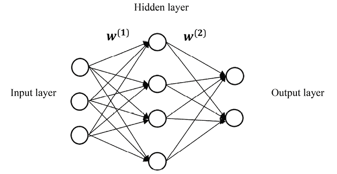

图 6.1：一个简单的浅层神经网络

**层**是**节点**（也称为**单元**）的概念集合，模拟生物大脑中的神经元。输入层表示输入特征**x**，每个节点是一个预测特征，*x*。输出层表示目标变量。

在二分类问题中，输出层只包含一个节点，其值表示正类的概率。在多分类问题中，输出层由*n*个节点组成，其中*n*是可能的类别数，每个节点的值表示预测该类别的概率。在回归问题中，输出层只包含一个节点，其值表示预测结果。

隐藏层可以视为从前一层提取的潜在信息的组合。可以有多个隐藏层。使用具有两个或更多隐藏层的神经网络进行学习称为**深度学习**。在本章中，我们将首先聚焦于一个隐藏层。

两个相邻的层通过概念性边（类似于生物大脑中的突触）连接，这些边传递来自一个神经元的信号到下一个层中的另一个神经元。**边**通过模型的权重*W*进行参数化。例如，前图中的*W*^((1))连接输入层和隐藏层，*W*^((2))连接隐藏层和输出层。

在标准神经网络中，数据仅从输入层传递到输出层，通过一个或多个隐藏层。因此，这种网络被称为**前馈**神经网络。基本上，逻辑回归是一个没有隐藏层的前馈神经网络，输出层直接与输入层连接。添加隐藏层在输入层和输出层之间引入了非线性。这使得神经网络能够更好地学习输入数据与目标之间的潜在关系。

## 激活函数

**激活函数**是应用于神经网络中每个神经元输出的数学操作。它根据神经元接收到的输入来决定该神经元是否应被激活（即，其输出值是否应传播到下一层）。

假设输入*x*是*n*维的，隐藏层由*H*个隐藏单元组成。连接输入层和隐藏层的权重矩阵*W*^((1))的大小是*n*乘*H*，其中每一列，，表示与第*h*个隐藏单元相关的输入系数。隐藏层的输出（也称为**激活**）可以用以下数学公式表示：

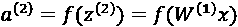

这里，*f(z)* 是一个激活函数。顾名思义，激活函数检查每个神经元的激活程度，模拟我们大脑的工作方式。它们的主要目的是为神经元的输出引入非线性，使得网络能够学习并执行输入与输出之间的复杂映射。典型的激活函数包括逻辑函数（在神经网络中更常被称为**sigmoid**函数）和**tanh**函数，后者被认为是逻辑函数的重新缩放版本，以及**ReLU**（**Rectified Linear Unit**的简称），它在深度学习中经常使用：

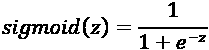

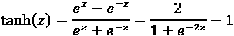

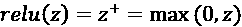

我们绘制这三种激活函数如下：

+   **逻辑**（**sigmoid**）函数，其中输出值的范围为`(0, 1)`：

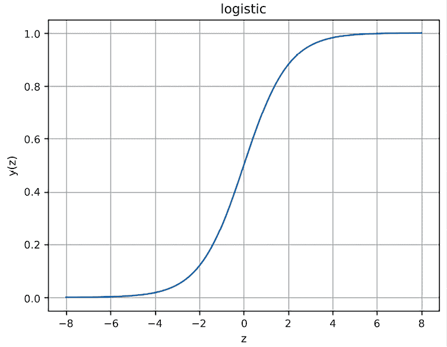

图 6.2：逻辑函数

可视化通过以下代码生成：

```py
>>> import numpy as np
>>> import matplotlib.pyplot as plt
>>> def sigmoid(z):
        return 1.0 / (1 + np.exp(-z))
>>> z = np.linspace(-8, 8, 1000)
>>> y = sigmoid(z)
>>> plt.plot(z, y)
>>> plt.xlabel('z')
>>> plt.ylabel('y(z)')
>>> plt.title('logistic')
>>> plt.grid()
>>> plt.show() 
```

+   **tanh**函数图像，其中输出值的范围为`(-1, 1)`：

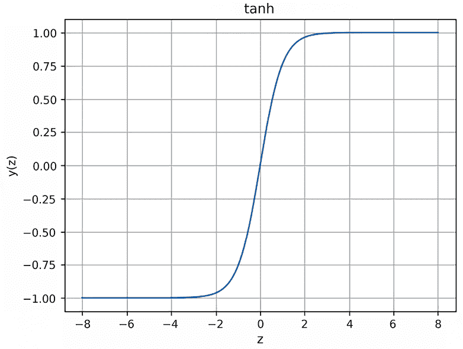

图 6.3：tanh 函数

可视化通过以下代码生成：

```py
>>> def tanh(z):
        return (np.exp(z) - np.exp(-z)) / (np.exp(z) + np.exp(-z))
>>> z = np.linspace(-8, 8, 1000)
>>> y = tanh(z)
>>> plt.plot(z, y)
>>> plt.xlabel('z')
>>> plt.ylabel('y(z)')
>>> plt.title('tanh')
>>> plt.grid()
>>> plt.show() 
```

+   **ReLU**函数图像，其中输出值的范围为`(0, +inf)`：

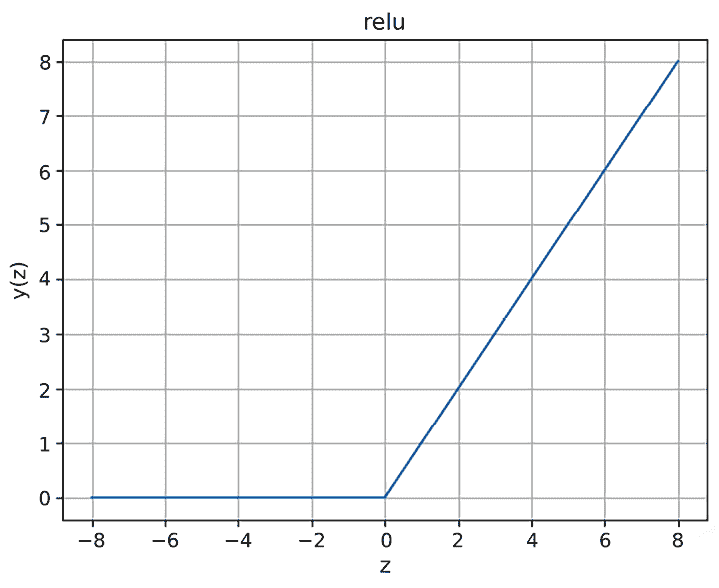

图 6.4：ReLU 函数

可视化通过以下代码生成：

```py
>>> relu(z):
        return np.maximum(np.zeros_like(z), z)
>>> z = np.linspace(-8, 8, 1000)
>>> y = relu(z)
>>> plt.plot(z, y)
>>> plt.xlabel('z')
>>> plt.ylabel('y(z)')
>>> plt.title('relu')
>>> plt.grid()
>>> plt.show() 
```

至于输出层，假设有一个输出单元（回归或二分类），且连接隐层和输出层的权重矩阵*W*^((2))的大小为*H* × *1*。在回归问题中，输出可以通过以下数学公式表示（为保持一致性，我这里使用*a*^((3))而非*y*）：


**普适逼近定理**是理解神经网络如何实现学习的关键概念。该定理指出，具有单个隐层且隐层包含有限数量神经元的前馈神经网络，能够逼近任何连续函数，并达到任意精度，只要隐层的神经元数量足够大。在训练过程中，神经网络通过调整其参数（权重）来学习逼近目标函数。通常，这是通过优化算法实现的，例如梯度下降法，算法通过迭代更新参数，以最小化预测输出与真实目标之间的差异。让我们在下一节中详细了解这个过程。

## 反向传播

那么，我们如何获得模型的最优权重，*W = {W(1), W(2)}*呢？与逻辑回归类似，我们可以通过梯度下降法学习所有权重，目标是最小化**均方误差**（**MSE**）代价函数或其他损失函数，*J(W)*。不同之处在于，梯度！[](img/B21047_06_007.png)是通过**反向传播**计算的。每次通过网络的前向传播后，都会执行反向传播来调整模型的参数。

正如“*back*”这个词在名称中所暗示的那样，梯度的计算是从后往前进行的：首先计算最后一层的梯度，然后计算第一层的梯度。至于“*propagation*”，它意味着在计算一个层的梯度时，部分计算结果会在计算前一层梯度时被重复使用。误差信息是层层传播的，而不是单独计算的。

在单层网络中，反向传播的详细步骤如下：

1.  我们从输入层到输出层遍历整个网络，并计算隐藏层的输出值，*a*^((2))，以及输出层的输出值，*a*^((3))。这是前向传播步骤。

1.  对于最后一层，我们计算代价函数相对于输出层输入的导数：

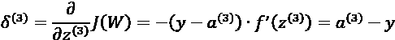

1.  对于隐藏层，我们计算代价函数相对于隐藏层输入的导数：

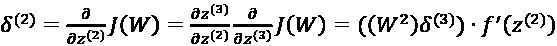

1.  我们通过应用**链式法则**计算梯度：

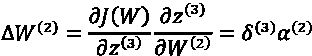

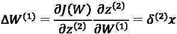

1.  我们用计算出的梯度和学习率更新权重！[](img/B21047_06_012.png)：

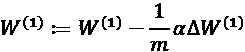


这里，*m*是样本的数量。

我们通过以下步骤反复更新所有权重，使用最新的权重直到代价函数收敛或模型完成足够的迭代。

链式法则是微积分中的一个基本概念，它允许你找到复合函数的导数。你可以在斯坦福大学的数学课程中了解更多相关内容（[`mathematics.stanford.edu/events/chain-rule-calculus`](https://mathematics.stanford.edu/events/chain-rule-calculus)），或者在麻省理工学院的微分数学课程*第 6 模块，微分应用*中学习（[`ocw.mit.edu/courses/18-03sc-differential-equations-fall-2011/`](https://ocw.mit.edu/courses/18-03sc-differential-equations-fall-2011/)）。

这可能一开始不容易理解，因此在接下来的章节中，我们将从零开始实现它，这将帮助你更好地理解神经网络。

## 向神经网络添加更多层：深度学习（DL）

在实际应用中，神经网络通常有多个隐藏层。这就是深度学习（DL）得名的原因——使用具有“堆叠”隐藏层的神经网络进行学习。一个深度学习模型的示例如下：

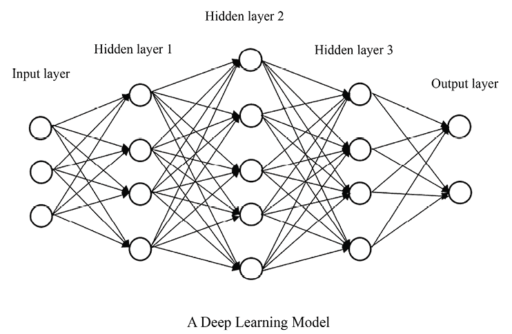

图 6.5：一个深度神经网络

在多层隐藏层的堆栈中，一个隐藏层的输入是其前一个层的输出，正如你在*图 6.5*中看到的那样。特征（信号）是从每个隐藏层提取的。来自不同层的特征表示来自不同层次的模式。超越浅层神经网络（通常只有一个隐藏层），一个具有正确网络架构和参数的深度学习模型（通常有两个或更多隐藏层）能够更好地从数据中学习复杂的非线性关系。

让我们看一些深度学习的典型应用，让你更有动力开始即将到来的深度学习项目。

**计算机视觉**被广泛认为是深度学习取得巨大突破的领域。你将在*第十一章*《使用卷积神经网络对服装图像进行分类》和*第十四章*《使用 CLIP 构建图像搜索引擎：一种多模态方法》中学到更多内容。现在，以下是计算机视觉中的一些常见应用：

+   图像识别，如人脸识别和手写数字识别。手写数字识别以及常见的评估数据集 MNIST 已成为深度学习中的“Hello, World！”项目。

+   基于图像的搜索引擎在其图像分类和图像相似度编码组件中大量使用深度学习技术。

+   机器视觉，这是自动驾驶汽车的关键部分，能够感知摄像头视图并做出实时决策。

+   从黑白照片恢复颜色以及艺术风格转移，巧妙地融合两种不同风格的图像。谷歌艺术与文化（[`artsandculture.google.com/`](https://artsandculture.google.com/)）中的人工艺术作品令人印象深刻。

+   基于文本描述的逼真图像生成。这在创建视觉故事内容和帮助营销广告创作中有应用。

**自然语言处理**（**NLP**）是另一个你可以看到深度学习在其现代解决方案中占主导地位的领域。你将在*第十二章*《使用递归神经网络进行序列预测》和*第十三章*《利用 Transformer 模型推进语言理解与生成》中学到更多内容。但现在让我们快速看一些示例：

+   机器翻译，深度学习极大地提高了其准确性和流畅性，例如基于句子的**谷歌神经机器翻译**（**GNMT**）系统。

+   文本生成通过学习句子和段落中单词之间复杂的关系，利用深度神经网络再现文本。如果你能在 J. K. 罗琳或莎士比亚的作品上充分训练模型，你就能成为一位虚拟的 J. K. 罗琳或莎士比亚。

+   图像描述（也称为图像到文本）利用深度神经网络来检测和识别图像中的物体，并用易于理解的句子“描述”这些物体。它结合了计算机视觉和自然语言处理（NLP）领域的最新突破。示例可以在[`cs.stanford.edu/people/karpathy/deepimagesent/generationdemo/`](https://cs.stanford.edu/people/karpathy/deepimagesent/generationdemo/)找到（由斯坦福大学的 Andrej Karpathy 开发）。

+   在其他常见的自然语言处理任务中，如情感分析和信息检索与提取，深度学习模型已经取得了最先进的性能。

+   **人工智能生成内容**（**AIGC**）是近年来的一个重大突破。它使用深度学习技术来创建或辅助创作各种类型的内容，如文章、产品描述、音乐、图像和视频。

类似于浅层网络，我们通过梯度下降法在深度神经网络中学习所有的权重，目标是最小化 MSE 损失函数，*J(W)*。梯度，，是通过反向传播计算的。不同之处在于，我们反向传播的不止一层隐藏层。在接下来的章节中，我们将从浅层网络开始，逐步实现深度神经网络。

# 构建神经网络

本实操部分将从实现一个浅层网络开始，随后使用 scikit-learn 构建一个包含两层的深度网络。然后，我们将用 TensorFlow 和 PyTorch 实现一个深度网络。

## 从零开始实现神经网络

为了演示激活函数的工作原理，我们将在这个示例中使用 sigmoid 作为激活函数。

我们首先定义`sigmoid`函数及其导数函数：

```py
>>> def sigmoid_derivative(z):
...     return sigmoid(z) * (1.0 - sigmoid(z)) 
```

如果你有兴趣验证它，你可以自行推导导数。

然后我们定义训练函数，该函数接受训练数据集、隐藏层单元数（我们将仅使用一个隐藏层作为示例）和迭代次数：

```py
>>> def train(X, y, n_hidden, learning_rate, n_iter):
...     m, n_input = X.shape
...     W1 = np.random.randn(n_input, n_hidden)
...     b1 = np.zeros((1, n_hidden))
...     W2 = np.random.randn(n_hidden, 1)
...     b2 = np.zeros((1, 1))
...     for i in range(1, n_iter+1):
...         Z2 = np.matmul(X, W1) + b1
...         A2 = sigmoid(Z2)
...         Z3 = np.matmul(A2, W2) + b2
...         A3 = Z3
...
...         dZ3 = A3 - y
...         dW2 = np.matmul(A2.T, dZ3)
...         db2 = np.sum(dZ3, axis=0, keepdims=True)
...
...         dZ2 = np.matmul(dZ3, W2.T) * sigmoid_derivative(Z2)
...         dW1 = np.matmul(X.T, dZ2)
...         db1 = np.sum(dZ2, axis=0)
...
...         W2 = W2 - learning_rate * dW2 / m
...         b2 = b2 - learning_rate * db2 / m
...         W1 = W1 - learning_rate * dW1 / m
...         b1 = b1 - learning_rate * db1 / m
...
...         if i % 100 == 0:
...             cost = np.mean((y - A3) ** 2)
...             print('Iteration %i, training loss: %f' %
                                                  (i, cost))
...     model = {'W1': W1, 'b1': b1, 'W2': W2, 'b2': b2}
...     return model 
```

请注意，除了权重 *W* 外，我们还使用偏置 *b*。在训练之前，我们首先随机初始化权重和偏置。在每次迭代中，我们将网络的所有层馈送上最新的权重和偏置，然后使用反向传播算法计算梯度，最后用得到的梯度更新权重和偏置。为了检查训练性能，我们每 100 次迭代输出一次损失和 MSE。

为了测试模型，我们将再次使用加利福尼亚房价作为示例数据集。提醒一下，使用梯度下降时通常建议进行数据归一化。因此，我们将通过去除均值并缩放到单位方差来标准化输入数据：

```py
>>> from sklearn import datasets
>>> housing = datasets.fetch_california_housing()
>>> num_test = 10 # the last 10 samples as testing set
>>> from sklearn import preprocessing
>>> scaler = preprocessing.StandardScaler()
>>> X_train = housing.data[:-num_test, :]
>>> X_train = scaler.fit_transform(X_train)
>>> y_train = housing.target[:-num_test].reshape(-1, 1)
>>> X_test = housing.data[-num_test:, :]
>>> X_test = scaler.transform(X_test)
>>> y_test = housing.target[-num_test:] 
```

使用缩放后的数据集，我们现在可以训练一个包含`20`个隐藏单元、学习率为`0.1`，并进行`2000`次迭代的单层神经网络：

```py
>>> n_hidden = 20
>>> learning_rate = 0.1
>>> n_iter = 2000
>>> model = train(X_train, y_train, n_hidden, learning_rate, n_iter)
Iteration 100, training loss: 0.557636
Iteration 200, training loss: 0.519375
Iteration 300, training loss: 0.501025
Iteration 400, training loss: 0.487536
Iteration 500, training loss: 0.476553
Iteration 600, training loss: 0.467207
Iteration 700, training loss: 0.459076
Iteration 800, training loss: 0.451934
Iteration 900, training loss: 0.445621
Iteration 1000, training loss: 0.440013
Iteration 1100, training loss: 0.435024
Iteration 1200, training loss: 0.430558
Iteration 1300, training loss: 0.426541
Iteration 1400, training loss: 0.422920
Iteration 1500, training loss: 0.419653
Iteration 1600, training loss: 0.416706
Iteration 1700, training loss: 0.414049
Iteration 1800, training loss: 0.411657
Iteration 1900, training loss: 0.409502
Iteration 2000, training loss: 0.407555 
```

然后，我们定义一个预测函数，该函数将接受一个模型并生成回归结果：

```py
>>> def predict(x, model):
...     W1 = model['W1']
...     b1 = model['b1']
...     W2 = model['W2']
...     b2 = model['b2']
...     A2 = sigmoid(np.matmul(x, W1) + b1)
...     A3 = np.matmul(A2, W2) + b2
...     return A3 
```

最后，我们将训练好的模型应用到测试集上：

```py
>>> predictions = predict(X_test, model) 
```

打印出预测结果及其真实值以进行对比：

```py
>>> print(predictions[:, 0])
[1.11805681 1.1387508  1.06071523 0.81930286 1.21311999 0.6199933 0.92885765 0.81967297 0.90882797 0.87857088]
>>> print(y_test)
[1.12  1.072 1.156 0.983 1.168 0.781 0.771 0.923 0.847 0.894] 
```

在成功构建了一个从零开始的神经网络模型之后，我们将开始使用 scikit-learn 实现它。

## 使用 scikit-learn 实现神经网络

我们将使用`MLPRegressor`类（**MLP**代表**多层感知器**，是神经网络的别名）来实现神经网络：

```py
>>> from sklearn.neural_network import MLPRegressor
>>> nn_scikit = MLPRegressor(hidden_layer_sizes=(16, 8),
                         activation='relu',
                         solver='adam',
                         learning_rate_init=0.001,
                         random_state=42,
                         max_iter=2000) 
```

`hidden_layer_sizes`超参数表示隐藏神经元的数量。在这个例子中，网络包含两个隐藏层，分别有`16`个节点和`8`个节点。使用 ReLU 激活函数。

Adam 优化器是随机梯度下降算法的替代品。它基于训练数据自适应地更新梯度。有关 Adam 的更多信息，请查看[`arxiv.org/abs/1412.6980`](https://arxiv.org/abs/1412.6980)中的论文。

我们在训练集上拟合神经网络模型，并在测试数据上进行预测：

```py
>>> nn_scikit.fit(X_train, y_train.ravel())
>>> predictions = nn_scikit.predict(X_test)
>>> print(predictions)
[1.19968791 1.2725324  1.30448323 0.88688675 1.18623612 0.72605956 0.87409406 0.85671201 0.93423154 0.94196305] 
```

然后，我们计算预测的 MSE：

```py
>>> from sklearn.metrics import mean_squared_error
>>> print(mean_squared_error(y_test, predictions))
0.010613171947751738 
```

我们已经使用 scikit-learn 实现了神经网络。接下来，我们将在下一部分使用 TensorFlow 实现神经网络。

## 使用 TensorFlow 实现神经网络

在 TensorFlow 2.x 中，通过 Keras 模块（[`keras.io/`](https://keras.io/)）启动一个深度神经网络模型非常简单。让我们按照以下步骤使用 TensorFlow 实现神经网络：

1.  首先，我们导入必要的模块并设置随机种子，推荐使用随机种子以确保模型的可重复性：

    ```py
    >>> import tensorflow as tf
    >>> from tensorflow import keras
    >>> tf.random.set_seed(42) 
    ```

1.  接下来，我们通过将一系列层实例传递给构造函数来创建一个 Keras 顺序模型，其中包括两个完全连接的隐藏层，分别包含`16`个节点和`8`个节点。同时，使用 ReLU 激活函数：

    ```py
    >>> model = keras.Sequential([
    ...     keras.layers.Dense(units=16, activation='relu'),
    ...     keras.layers.Dense(units=8, activation='relu'),
    ...     keras.layers.Dense(units=1)
    ... ]) 
    ```

1.  我们通过使用 Adam 优化器，学习率为`0.01`，并将 MSE 作为学习目标来编译模型：

    ```py
    >>> model.compile(loss='mean_squared_error',
    ...               optimizer=tf.keras.optimizers.Adam(0.01)) 
    ```

1.  在定义模型之后，我们现在开始在训练集上进行训练：

    ```py
    >>> model.fit(X_train, y_train, epochs=300)
    Train on 496 samples
    Epoch 1/300
    645/645 [==============================] - 1s 1ms/step - loss: 0.6494
    Epoch 2/300
    645/645 [==============================] - 1s 1ms/step - loss: 0.3827
    Epoch 3/300
    645/645 [==============================] - 1s 1ms/step - loss: 0.3700
    ……
    ……
    Epoch 298/300
    645/645 [==============================] - 1s 1ms/step - loss: 0.2724
    Epoch 299/300
    645/645 [==============================] - 1s 1ms/step - loss: 0.2735
    Epoch 300/300
    645/645 [==============================] - 1s 1ms/step - loss: 0.2730
    1/1 [==============================] - 0s 82ms/step 
    ```

我们使用`300`次迭代来拟合模型。在每次迭代中，都会显示训练损失（MSE）。

1.  最后，我们使用训练好的模型对测试案例进行预测，并打印出预测结果及其 MSE：

    ```py
    >>> predictions = model.predict(X_test)[:, 0]
    >>> print(predictions)
    [1.2387774  1.2480505  1.229521   0.8988129  1.1932802  0.75052583 0.75052583 0.88086814 0.9921638  0.9107932 ]
    >>> print(mean_squared_error(y_test, predictions))
    0.008271122735361234 
    ```

如你所见，我们在 TensorFlow Keras API 中逐层添加神经网络模型。我们从第一个隐藏层（16 个节点）开始，然后是第二个隐藏层（8 个节点），最后是输出层（1 个单元，目标变量）。这与构建乐高积木非常相似。

在工业界，神经网络通常使用 PyTorch 实现。让我们在下一部分看看如何实现。

## 使用 PyTorch 实现神经网络

我们现在将按照以下步骤使用 PyTorch 实现神经网络：

1.  首先，我们导入必要的模块并设置随机种子，推荐使用随机种子以确保模型的可重复性：

    ```py
    >>> import torch
    >>> import torch.nn as nn
    >>> torch.manual_seed(42) 
    ```

1.  接下来，我们通过将一个包含两个全连接隐藏层（分别有 `16` 个节点和 `8` 个节点）实例的层列表传递给构造函数，创建一个 `torch.nn` Sequential 模型。每个全连接层中都使用了 ReLU 激活函数：

    ```py
    >>> model = nn.Sequential(nn.Linear(X_train.shape[1], 16),
                          nn.ReLU(),
                          nn.Linear(16, 8),
                          nn.ReLU(),
                          nn.Linear(8, 1)) 
    ```

1.  我们初始化一个学习率为`0.01`、目标为 MSE 的 Adam 优化器：

    ```py
    >>> loss_function = nn.MSELoss()
    >>> optimizer = torch.optim.Adam(model.parameters(), lr=0.01) 
    ```

1.  定义完模型后，我们需要在使用它训练 PyTorch 模型之前，从输入的 NumPy 数组中创建张量对象：

    ```py
    >>> X_train_torch = torch.from_numpy(X_train.astype(np.float32))
    >>> y_train_torch = torch.from_numpy(y_train.astype(np.float32)) 
    ```

1.  现在我们可以在与 PyTorch 兼容的训练集上训练模型。我们首先定义一个训练函数，在每个周期内调用它，如下所示：

    ```py
    >>> def train_step(model, X_train, y_train, loss_function, optimizer):
            pred_train = model(X_train)
            loss = loss_function(pred_train, y_train)

            model.zero_grad()
            loss.backward()
            optimizer.step()
            return loss.item() 
    ```

1.  我们用`500`次迭代来训练模型。在每 100 次迭代中，显示训练损失（MSE）如下：

    ```py
    >>> for epoch in range(500):
            loss = train_step(model, X_train_torch, y_train_torch,
                              loss_function, optimizer)      
            if epoch % 100 == 0:
                print(f"Epoch {epoch} - loss: {loss}")
    Epoch 0 - loss: 4.908532619476318
    Epoch 100 - loss: 0.5002815127372742
    Epoch 200 - loss: 0.40820521116256714
    Epoch 300 - loss: 0.3870624303817749
    Epoch 400 - loss: 0.3720889091491699 
    ```

1.  最后，我们使用训练好的模型预测测试样本并输出预测值及其 MSE：

    ```py
    >>> X_test_torch = torch.from_numpy(X_test.astype(np.float32))
    >>> predictions = model(X_test_torch).detach().numpy()[:, 0]
    >>> print(predictions)
    [1.171479  1.130001  1.1055213 0.8627995 1.0910968 0.6725116 0.8869568 0.8009699 0.8529027 0.8760005]
    >>> print(mean_squared_error(y_test, predictions))
    0.006939044434639928 
    ```

事实证明，使用 PyTorch 开发神经网络模型就像搭建乐高一样简单。

PyTorch 和 TensorFlow 都是流行的深度学习框架，它们的流行程度可能会因应用领域、研究社区、行业采纳和个人偏好等不同因素而有所不同。然而，截至 2023 年，PyTorch 的普及度更高，整体用户基础更大，根据 Papers With Code（[`paperswithcode.com/trends`](https://paperswithcode.com/trends)）和 Google Trends（[`trends.google.com/trends/explore?geo=US&q=tensorflow,pytorch&hl=en`](https://trends.google.com/trends/explore?geo=US&q=tensorflow,pytorch&hl=en)）的数据。因此，接下来我们将专注于本书中的 PyTorch 实现。

接下来，我们将讨论如何选择合适的激活函数。

# 选择合适的激活函数

到目前为止，我们在实现中使用了 ReLU 和 sigmoid 激活函数。你可能会想知道如何为你的神经网络选择合适的激活函数。接下来将给出详细的建议，告诉你什么时候选择特定的激活函数：

+   **Linear**：*f(z) = z*。你可以将其解释为没有激活函数。我们通常在回归网络的输出层中使用它，因为我们不需要对输出进行任何转换。

+   **Sigmoid**（逻辑）将层的输出转换为 0 和 1 之间的范围。你可以将其理解为输出预测的概率。因此，我们通常在**二分类**网络的输出层中使用它。除此之外，有时我们也会在隐藏层中使用它。然而，需要注意的是，sigmoid 函数是单调的，但其导数并非单调。因此，神经网络可能会陷入一个次优解。

+   **Softmax**：正如在*第四章*《使用逻辑回归预测在线广告点击率》中提到的，softmax 是一种广义的逻辑函数，用于多类别分类。因此，我们在**多类别分类**网络的输出层中使用它。

+   **Tanh** 是一种比 sigmoid 更好的激活函数，具有更强的梯度。正如本章早些时候的图表所示，tanh 函数的导数比 sigmoid 函数的导数更陡峭。它的取值范围是 `-1` 到 `1`。在隐藏层中，常常使用 `tanh` 函数。

+   **ReLU** 可能是当今使用最频繁的激活函数。它是前馈网络中隐藏层的“默认”激活函数。它的取值范围是从 `0` 到无穷大，且该函数及其导数都是单调的。与 `tanh` 相比，ReLU 有几个优势。首先是稀疏性，意味着在任何给定时刻，只有一部分神经元被激活。这有助于减少训练和推理的计算成本，因为只需计算较少的神经元。ReLU 还可以缓解梯度消失问题，即在反向传播过程中，梯度变得非常小，导致学习变慢或停滞。ReLU 对于正输入不饱和，允许梯度在训练过程中更自由地流动。ReLU 的一个缺点是无法适当地映射输入的负部分，所有负输入都会被转换为 0。为了解决 ReLU 中的“负值消失”问题，**Leaky ReLU** 被发明出来，它在负部分引入了一个小的斜率。当 *z < 0* 时，*f(z) = az*，其中 *a* 通常是一个小值，如 `0.01`。

总结一下，ReLU 通常用于隐藏层激活函数。如果 ReLU 效果不好，可以尝试 Leaky ReLU。Sigmoid 和 tanh 可以用于隐藏层，但不建议在层数很多的深度网络中使用。在输出层，回归网络使用线性激活（或没有激活）；二分类网络使用 sigmoid；多分类问题则使用 softmax。

选择合适的激活函数非常重要，同样避免神经网络中的过拟合也是如此。接下来我们看看如何做到这一点。

# 防止神经网络中过拟合

神经网络之所以强大，是因为它能够从数据中提取层次特征，只要有合适的架构（合适的隐藏层数和隐藏节点数）。它提供了极大的灵活性，并且可以拟合复杂的数据集。然而，如果网络在学习过程中没有足够的控制，这一优势就会变成劣势。具体来说，如果网络仅仅擅长拟合训练集而不能推广到未见过的数据，就可能导致过拟合。因此，防止过拟合对于神经网络模型的成功至关重要。

目前主要有三种方法可以对神经网络进行限制：L1/L2 正则化、dropout 和提前停止。在*第四章*《使用逻辑回归预测在线广告点击率》中我们练习了第一种方法，接下来将在本节讨论另外两种方法。

## Dropout

**丢弃**意味着在神经网络的学习阶段忽略某些隐藏节点。这些隐藏节点是根据指定的概率随机选择的。在训练过程的前向传播中，随机选择的节点会暂时不用于计算损失；在反向传播中，随机选择的节点也不会暂时更新。

在下图中，我们选择了网络中的三个节点，在训练过程中忽略它们：

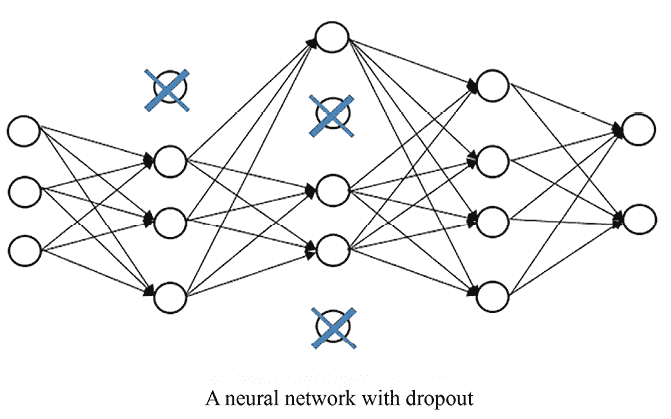

图 6.6：在神经网络中需要忽略的三个节点

请记住，常规层的节点与前一层和下一层的节点是完全连接的。如果网络规模过大，模型会记住个别节点对之间的相互依赖，导致过拟合。丢弃通过在每次迭代中暂时停用某些节点来打破这种依赖关系。因此，它有效地减少了过拟合，并且不会同时扰乱学习过程。

在每次迭代中随机选择的节点比例也称为丢弃率。在实践中，我们通常将丢弃率设置为不超过 50%。如果丢弃率过高，会过度影响模型的学习能力，减慢训练速度，并降低模型从数据中提取有用模式的能力。

**最佳实践**

确定丢弃率需要通过经验进行实验，测试不同丢弃率对模型性能的影响。以下是一个典型的方法：

1.  从一个较低的丢弃率（例如`0.1`或`0.2`）开始，并在你的数据集上训练模型。监控模型在验证集上的性能指标。

1.  逐渐以小幅度（例如`0.1`）增加丢弃率，并每次重新训练模型。在每次训练后监控性能指标。

1.  评估在不同丢弃率下获得的性能。注意过拟合问题，因为过高的丢弃率可能会影响模型性能；如果丢弃率过低，模型可能无法有效防止过拟合。

在 PyTorch 中，我们使用`torch.nn.Dropout`对象将丢弃添加到层中。以下是一个示例：

```py
>>> model_with_dropout = nn.Sequential(nn.Linear(X_train.shape[1], 16),
                                   nn.ReLU(),
                                   nn.Dropout(0.1),
                                   nn.Linear(16, 8),
                                   nn.ReLU(),
                                   nn.Linear(8, 1)) 
```

在前面的示例中，训练过程中在每次迭代时随机忽略了来自第一隐藏层的 10%节点。

请记住，丢弃只应发生在训练阶段。在预测阶段，所有节点应该重新完全连接。因此，在评估模型或使用训练好的模型进行预测之前，我们需要通过`.eval()`方法将模型切换到评估模式，以禁用丢弃。我们可以在下面的加利福尼亚住房示例中看到：

1.  首先，我们使用 Adam 优化器和学习率`0.01`，以 MSE 为学习目标来编译模型（带丢弃）：

    ```py
    >>> optimizer = torch.optim.Adam(model_with_dropout.parameters(), lr=0.01) 
    ```

1.  接下来，我们可以训练模型（带丢弃）`1,000`次迭代：

    ```py
    >>> for epoch in range(1000):
            loss = train_step(model_with_dropout, X_train_torch, y_train_torch,
                              loss_function, optimizer)
            if epoch % 100 == 0:
                print(f"Epoch {epoch} - loss: {loss}")
    Epoch 0 - loss: 4.921249866485596
    Epoch 100 - loss: 0.5313398838043213
    Epoch 200 - loss: 0.4458008408546448
    Epoch 300 - loss: 0.4264270067214966
    Epoch 400 - loss: 0.4085545539855957
    Epoch 500 - loss: 0.3640516400337219
    Epoch 600 - loss: 0.35677382349967957
    Epoch 700 - loss: 0.35208994150161743
    Epoch 800 - loss: 0.34980857372283936
    Epoch 900 - loss: 0.3431631028652191 
    ```

每 100 次迭代，显示一次训练损失（MSE）。

1.  最后，我们使用训练好的模型（带有 dropout）来预测测试案例并输出均方误差（MSE）：

    ```py
    >>> model_with_dropout.eval()
    >>> predictions = model_with_dropout (X_test_torch).detach().numpy()[:, 0]
    >>> print(mean_squared_error(y_test, predictions))
     0.005699420832357341 
    ```

如前所述，别忘了在评估带有 dropout 的模型之前运行`model_with_dropout.eval()`。否则，dropout 层将继续随机关闭神经元，导致对相同数据进行多次评估时结果不一致。

## 提前停止

顾名思义，使用**提前停止**训练的网络将在模型性能在一定次数的迭代内没有改进时停止训练。模型性能是通过与训练集不同的验证集来评估的，目的是衡量其泛化能力。在训练过程中，如果经过若干次（比如 50 次）迭代后性能下降，说明模型发生了过拟合，无法再很好地进行泛化。因此，在这种情况下，提前停止学习有助于防止过拟合。通常，我们会通过验证集来评估模型。如果验证集上的指标在超过*n*个训练周期内没有改善，我们就会停止训练过程。

我们还将演示如何在 PyTorch 中应用提前停止，并使用加利福尼亚房价示例：

1.  首先，我们像之前一样重新创建模型和优化器：

    ```py
    >>> model = nn.Sequential(nn.Linear(X_train.shape[1], 16),
                          nn.ReLU(),
                          nn.Linear(16, 8),
                          nn.ReLU(),
                          nn.Linear(8, 1))
    >>> optimizer = torch.optim.Adam(model.parameters(), lr=0.01) 
    ```

1.  接下来，我们定义提前停止标准，即测试损失在`100`个周期内没有改进：

    ```py
    >>> patience = 100
    >>> epochs_no_improve = 0
    >>> best_test_loss = float('inf') 
    ```

1.  现在我们采用提前停止，并将模型训练至最多`500`个迭代周期：

    ```py
    >>> import copy
    >>> best_model = model
    >>> for epoch in range(500):
            loss = train_step(model, X_train_torch, y_train_torch,
                              loss_function, optimizer)      
            predictions = model(X_test_torch).detach().numpy()[:, 0]
            test_loss = mean_squared_error(y_test, predictions)
            if test_loss > best_test_loss:
                epochs_no_improve += 1
                if epochs_no_improve > patience:
                    print(f"Early stopped at epoch {epoch}")
                    break
            else:
                epochs_no_improve = 0
                best_test_loss = test_loss
                best_model = copy.deepcopy(model)
    Early stopped at epoch 224 
    ```

在每一步训练后，我们计算测试损失并将其与之前记录下来的最佳损失进行比较。如果测试损失有所改善，我们使用`copy`模块保存当前模型，并重置`epochs_no_improve`计数器。然而，如果测试损失在 100 次连续迭代中没有改善，我们就会停止训练过程，因为已经达到了容忍阈值（`patience`）。在我们的例子中，训练在第`224`个周期后停止。

1.  最后，我们使用先前记录下来的最佳模型来预测测试案例，并输出预测结果及其均方误差（MSE）：

    ```py
    >>> predictions = best_model(X_test_torch).detach().numpy()[:, 0]
    >>> print(mean_squared_error(y_test, predictions))
    0.005459465255681108 
    ```

这比我们在传统方法中得到的`0.0069`要好，也比使用 dropout 防止过拟合得到的`0.0057`要好。

虽然通用逼近定理保证神经网络能够表示任何函数，但它并不保证良好的泛化性能。如果模型的容量相对于数据分布的复杂度过大，就可能发生过拟合。因此，通过正则化和提前停止等技术来控制模型的容量，对于确保学习到的函数能够很好地泛化到未见过的数据至关重要。

现在你已经了解了神经网络及其实现，接下来我们将利用它们来解决股票价格预测问题。

# 使用神经网络预测股票价格

在本节中，我们将使用 PyTorch 构建股票预测器。我们将从特征生成和数据准备开始，然后构建网络并进行训练。之后，我们将微调网络以提升股票预测器的性能。

## 训练一个简单的神经网络

我们通过以下步骤准备数据并训练一个简单的神经网络：

1.  我们加载股票数据，生成特征，并标记 `generate_features` 函数，这个函数我们在 *第五章*，*使用回归算法预测股票价格* 中开发过：

    ```py
    >>> data_raw = pd.read_csv('19900101_20230630.csv', index_col='Date')
    >>> data = generate_features(data_raw) 
    ```

1.  我们使用 1990 到 2022 年的数据构建训练集，并使用 2023 年上半年的数据构建测试集：

    ```py
    >>> start_train = '1990-01-01'
    >>> end_train = '2022-12-31'
    >>> start_test = '2023-01-01'
    >>> end_test = '2023-06-30'
    >>> data_train = data.loc[start_train:end_train]
    >>> X_train = data_train.drop('close', axis=1).values
    >>> y_train = data_train['close'].values
    >>> data_test = data.loc[start_test:end_test]
    >>> X_test = data_test.drop('close', axis=1).values
    >>> y_test = data_test['close'].values 
    ```

1.  我们需要将特征标准化到相同或可比较的尺度。我们通过去除均值并缩放到单位方差来实现这一点：

    ```py
    >>> from sklearn.preprocessing import StandardScaler
    >>> scaler = StandardScaler() 
    ```

我们使用训练集教授的缩放器对两个数据集进行重新缩放：

```py
>>> X_scaled_train = scaler.fit_transform(X_train)
>>> X_scaled_test = scaler.transform(X_test) 
```

1.  接下来，我们需要从输入的 NumPy 数组中创建张量对象，然后使用它们来训练 PyTorch 模型：

    ```py
    >>> X_train_torch = torch.from_numpy(X_scaled_train.astype(np.float32))
    >>> X_test_torch = torch.from_numpy(X_scaled_test.astype(np.float32))
    >>> y_train = y_train.reshape(y_train.shape[0], 1)
    >>> y_train_torch = torch.from_numpy(y_train.astype(np.float32)) 
    ```

1.  我们现在使用 `torch.nn` 模块构建一个神经网络：

    ```py
    >>> torch.manual_seed(42)
    >>> model = nn.Sequential(nn.Linear(X_train.shape[1], 32),
                              nn.ReLU(),
                              nn.Linear(32, 1)) 
    ```

我们开始时的网络有一个包含 `32` 个节点的隐藏层，后面接着一个 ReLU 函数。

1.  我们通过使用 Adam 作为优化器，学习率为 `0.3`，MSE 作为学习目标来编译模型：

    ```py
    >>> loss_function = nn.MSELoss()
    >>> optimizer = torch.optim.Adam(model.parameters(), lr=0.3) 
    ```

1.  定义模型后，我们进行 `1,000` 次迭代的训练：

    ```py
    >>> for epoch in range(1000):
            loss = train_step(model, X_train_torch, y_train_torch,
                              loss_function, optimizer)
            if epoch % 100 == 0:
                print(f"Epoch {epoch} - loss: {loss}")
    Epoch 0 - loss: 24823446.0
    Epoch 100 - loss: 189974.171875
    Epoch 200 - loss: 52102.01171875
    Epoch 300 - loss: 17849.333984375
    Epoch 400 - loss: 8928.6689453125
    Epoch 500 - loss: 6497.75927734375
    Epoch 600 - loss: 5670.634765625
    Epoch 700 - loss: 5265.48828125
    Epoch 800 - loss: 5017.7021484375
    Epoch 900 - loss: 4834.28466796875 
    ```

1.  最后，我们使用训练好的模型来预测测试数据并显示指标：

    ```py
    >>> predictions = model(X_test_torch).detach().numpy()[:, 0]
    >>> from sklearn.metrics import mean_squared_error, mean_absolute_error, r2_score
    >>> print(f'MSE: {mean_squared_error(y_test, predictions):.3f}')
    MSE: 30051.643
    >>> print(f'MAE: {mean_absolute_error(y_test, predictions):.3f}')
    MAE: 137.096
    >>> print(f'R²: {r2_score(y_test, predictions):.3f}')
    R²: 0.954 
    ```

我们通过一个简单的神经网络模型达到了 *R*² 为 `0.954`。

## 微调神经网络

我们能做得更好吗？当然可以，我们还没有微调超参数。我们将在 PyTorch 中通过以下步骤进行模型微调：

1.  TensorBoard 提供了在模型训练和评估过程中记录各种指标和可视化的功能。你可以与 PyTorch 一起使用 TensorBoard 来跟踪和可视化诸如损失、准确率、梯度和模型架构等指标。我们依赖于 PyTorch `utils` 中的 `tensorboard` 模块，所以我们首先导入它：

    ```py
    >>> from torch.utils.tensorboard import SummaryWriter 
    ```

1.  我们希望调整隐藏层中隐节点的数量（这里，我们使用的是一个隐藏层），训练迭代次数和学习率。我们选择了以下超参数值来进行实验：

    ```py
    >>> hparams_config = {
            "hidden_size": [16, 32],
            "epochs": [1000, 3000],
            "lr": [0.1, 0.3],
        } 
    ```

在这里，我们尝试了两个隐层节点数选项，`16` 和 `32`；我们使用了两个迭代次数选项，`300` 和 `1000`；还使用了两个学习率选项，`0.1` 和 `0.3`。

1.  在初始化优化的超参数后，我们将对每个超参数组合进行迭代，并通过调用帮助函数 `train_validate_model` 来训练和验证模型，具体如下：

    ```py
    >>> def train_validate_model(hidden_size, epochs, lr):
            model = nn.Sequential(nn.Linear(X_train.shape[1], hidden_size),
                                      nn.ReLU(),
                                      nn.Linear(hidden_size, 1))
            optimizer = torch.optim.Adam(model.parameters(), lr=lr)
            # Create the TensorBoard writer
            writer_path = f"runs/{experiment_num}/{hidden_size}/{epochs}/{lr}"
            writer = SummaryWriter(log_dir=writer_path)
            for epoch in range(epochs):
                loss = train_step(model, X_train_torch, y_train_torch, loss_function, 
                                  optimizer)
                predictions = model(X_test_torch).detach().numpy()[:, 0]
                test_mse = mean_squared_error(y_test, predictions)
                writer.add_scalar(
                    tag="train loss",
                    scalar_value=loss,
                    global_step=epoch,
                )
                writer.add_scalar(
                    tag="test loss",
                    scalar_value=test_mse,
                    global_step=epoch,
                )
            test_r2 = r2_score(y_test, predictions)
            print(f'R²: {test_r2:.3f}\n')
            # Add the hyperparameters and metrics to TensorBoard
            writer.add_hparams(
                {
                    "hidden_size": hidden_size,
                    "epochs": epochs,
                    "lr": lr,
                },
                {
                    "test MSE": test_mse,
                    "test R²": test_r2,
                },
            ) 
    ```

在每个超参数组合中，我们根据给定的超参数（包括隐藏节点的数量、学习率和训练迭代次数）构建并拟合一个神经网络模型。这里与之前做的没有太大区别。但在训练模型时，我们还会通过 `add_scalar` 方法更新 TensorBoard，记录超参数和指标，包括训练损失和测试损失。

TensorBoard 编写器对象非常直观。它为训练和验证过程中的模型图和指标提供可视化。

最后，我们计算并显示测试集预测的 *R*²。我们还使用 `add_hparams` 方法记录测试集的 MSE 和 *R*²，并附上给定的超参数组合。

1.  现在我们通过迭代八种超参数组合来微调神经网络：

    ```py
    >>> torch.manual_seed(42)
    >>> experiment_num = 0
    >>> for hidden_size in hparams_config["hidden_size"]:
            for epochs in hparams_config["epochs"]:
                for lr in hparams_config["lr"]:
                    experiment_num += 1
                    print(f"Experiment {experiment_num}: hidden_size = {hidden_size}, 
                            epochs = {epochs}, lr = {lr}")
                    train_validate_model(hidden_size, epochs, lr) 
    ```

你将看到以下输出：

```py
Experiment 1: hidden_size = 16, epochs = 1000, lr = 0.1
R²: 0.771
Experiment 2: hidden_size = 16, epochs = 1000, lr = 0.3
R²: 0.952
Experiment 3: hidden_size = 16, epochs = 3000, lr = 0.1
R²: 0.969
Experiment 4: hidden_size = 16, epochs = 3000, lr = 0.3
R²: 0.977
Experiment 5: hidden_size = 32, epochs = 1000, lr = 0.1
R²: 0.877
Experiment 6: hidden_size = 32, epochs = 1000, lr = 0.3
R²: 0.957
Experiment 7: hidden_size = 32, epochs = 3000, lr = 0.1
R²: 0.970
Experiment 8: hidden_size = 32, epochs = 3000, lr = 0.3
R²: 0.959 
```

使用超参数组合 `(hidden_size=16, epochs=3000, learning_rate=0.3)` 的实验 4 表现最佳，我们获得了 *R*² 为 `0.977`。

**最佳实践**

神经网络的超参数调优可以显著影响模型性能。以下是一些神经网络超参数调优的最佳实践：

+   **定义搜索空间**：确定需要调整的超参数及其范围。常见的超参数包括学习率、批量大小、隐藏层数量、每层神经元数量、激活函数、丢弃率等。

+   **使用交叉验证**：这有助于防止过拟合，并提供更稳健的模型性能估计。

+   **监控性能指标**：在训练和验证过程中，跟踪相关的指标，如损失、准确率、精确度、召回率、均方误差（MSE）、*R*² 等。

+   **早停法**：在训练过程中监控验证损失，当验证损失持续增加，而训练损失减少时，停止训练。

+   **正则化**：使用 L1 和 L2 正则化以及丢弃法等正则化技术，防止过拟合并提高模型的泛化性能。

+   **尝试不同的架构**：尝试不同的网络架构，包括层数、每层神经元数量和激活函数。可以尝试深度与浅层网络、宽网络与窄网络。

+   **使用并行化**：如果计算资源允许，可以将超参数搜索过程并行化，以加速实验过程。可以使用像 TensorFlow 的 `tf.distribute.Strategy` 或 PyTorch 的 `torch.nn.DataParallel` 这样的工具，将训练分布到多个 GPU 或机器上。

1.  你会注意到，在这些实验开始后，会创建一个新的文件夹 `runs`。它包含每次实验的训练和验证性能。在 8 次实验完成后，是时候启动 TensorBoard 了。我们使用以下命令：

    ```py
    tensorboard --host 0.0.0.0 --logdir runs 
    ```

启动后，你会看到美观的仪表板，访问地址为 `http://localhost:6006/`。你可以在这里看到预期结果的截图：

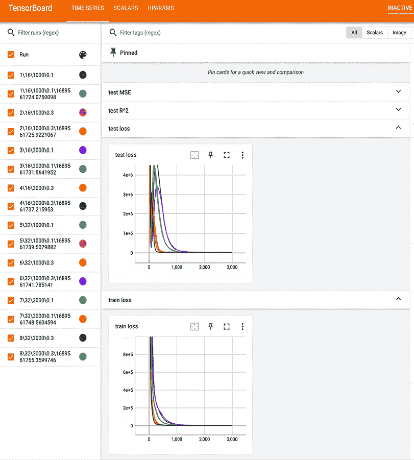

图 6.7：TensorBoard 截图

火车和测试损失的时间序列提供了有价值的见解。它们让我们能够评估训练进度，并识别过拟合或欠拟合的迹象。过拟合可以通过观察训练损失随时间下降，而测试损失保持停滞或上升来识别。另一方面，欠拟合则表现为训练损失和测试损失值较高，表明模型未能充分拟合训练数据。

1.  接下来，我们点击 **HPARAMS** 标签查看超参数日志。你可以看到所有的超参数组合及其对应的指标（MSE 和 *R*²）以表格形式展示，如下所示：

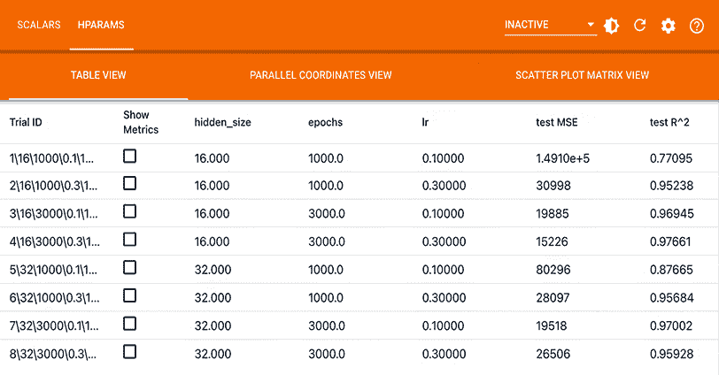

图 6.8：TensorBoard 超参数调优的截图

再次可以看到，实验 4 的表现最好。

1.  最后，我们使用最优模型进行预测：

    ```py
    >>> hidden_size = 16
    >>> epochs = 3000
    >>> lr = 0.3
    >>> best_model = nn.Sequential(nn.Linear(X_train.shape[1], hidden_size),
                               nn.ReLU(),
                               nn.Linear(hidden_size, 1))
    >>> optimizer = torch.optim.Adam(best_model.parameters(), lr=lr)
    >>> for epoch in range(epochs):
        train_step(best_model, X_train_torch, y_train_torch, loss_function,
                   optimizer
    >>> predictions = best_model(X_test_torch).detach().numpy()[:, 0] 
    ```

1.  如下所示，绘制预测值与真实值的对比图：

    ```py
    >>> import matplotlib.pyplot as plt
    >>> plt.rc('xtick', labelsize=10)
    >>> plt.rc('ytick', labelsize=10)
    >>> plt.plot(data_test.index, y_test, c='k')
    >>> plt.plot(data_test.index, predictions, c='b')
    >>> plt.xticks(range(0, 130, 10), rotation=60)
    >>> plt.xlabel('Date' , fontsize=10)
    >>> plt.ylabel('Close price' , fontsize=10)
    >>> plt.legend(['Truth', 'Neural network'] , fontsize=10)
    >>> plt.show() 
    ```

请参考以下截图以查看结果：

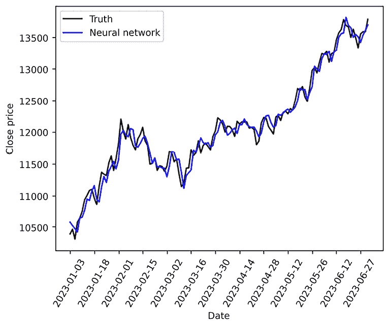

图 6.9：股票价格的预测与真实值对比

微调后的神经网络在预测股票价格方面表现良好。

在本节中，我们通过微调超参数进一步改进了神经网络股票预测器。你可以自由地增加更多的隐藏层，或应用丢弃法（dropout）或早停法（early stopping），看看是否能获得更好的结果。

# 摘要

在这一章中，我们再次进行了股票预测项目的工作，不过这次是使用神经网络。我们从详细解释神经网络开始，包括基本组件（层、激活函数、前向传播和反向传播），并过渡到深度学习（DL）。接着，我们使用 scikit-learn、TensorFlow 和 PyTorch 从头开始进行实现。我们还学习了避免过拟合的方法，如丢弃法和早停法。最后，我们将本章所学应用于解决股票价格预测问题。

在下一章中，我们将探索自然语言处理（NLP）技术和无监督学习。

# 练习

1.  如前所述，能否在神经网络股票预测器中使用更多的隐藏层并重新调整模型？你能得到更好的结果吗？

1.  在第一个练习之后，能否应用丢弃法和/或早停法，看看能否打破当前最佳的 *R*² 值 `0.977`？

# 加入我们书籍的 Discord 社区

加入我们社区的 Discord 空间，与作者和其他读者进行讨论：

[`packt.link/yuxi`](https://packt.link/yuxi)


