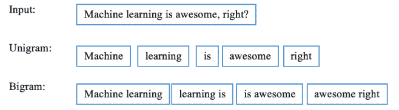
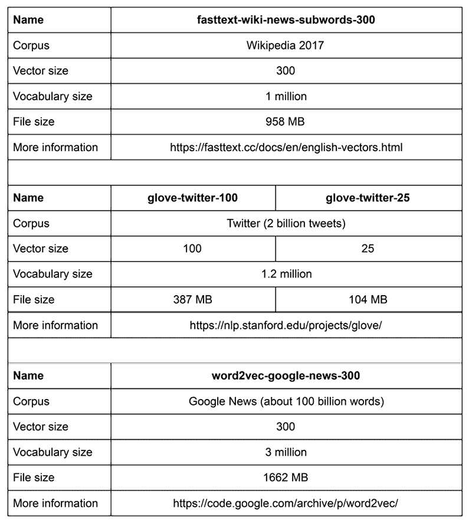

# 第七章：使用文本分析技术挖掘 20 个新闻组数据集

在之前的章节中，我们学习了一些基本的机器学习概念和监督学习算法。从这一章开始，作为我们学习旅程的第二步，我们将详细讲解与文本分析相关的几种重要无监督学习算法和技术。为了让我们的旅程更加有趣，我们将从一个**自然语言处理**（**NLP**）问题开始——探索 20 个新闻组数据。你将获得实践经验，学习如何处理文本数据，特别是如何将单词和短语转换为计算机可读的数值，并如何清理意义不大的词语。我们还将通过将文本数据映射到二维空间，以无监督学习的方式进行可视化。

我们将详细讨论以下每个主题：

+   计算机如何理解语言——自然语言处理（NLP）

+   了解流行的 NLP 库并学习 NLP 基础

+   获取新闻组数据

+   探索新闻组数据

+   思考文本数据的特征

+   使用 t-SNE 可视化新闻组数据

+   使用密集向量表示词语——词嵌入

# 计算机如何理解语言——自然语言处理（NLP）

在*第一章*，*机器学习与 Python 入门*中，我提到过，机器学习驱动的程序或计算机擅长通过处理和利用数据发现事件模式。当数据结构良好或定义明确时，例如在 Microsoft Excel 电子表格表格或关系数据库表格中，为什么机器学习比人类更擅长处理这些数据是直观显而易见的。计算机读取这些数据的方式与人类相同——例如，`revenue: 5,000,000` 表示收入为 500 万，`age: 30` 表示年龄为 30；然后计算机会处理各种数据，并以比人类更快的方式生成洞察。然而，当数据是非结构化的，例如人类沟通使用的词语、新闻文章，或某人用另一种语言的演讲时，似乎计算机无法像人类一样理解这些词语（尽管如此）。尽管计算机在理解词语和自然语言方面取得了显著进展，但在许多方面仍无法达到人类级别的理解。

## 什么是 NLP？

关于词语、原始文本或广义上的**自然语言**，世界上有大量的信息。自然语言指的是人类用来相互沟通的任何语言。自然语言可以有多种形式，包括但不限于以下内容：

+   文本，例如网页、短信、电子邮件和菜单

+   音频，如语音和 Siri 的命令

+   手势与符号

+   许多其他形式，如歌曲、乐谱和摩尔斯电码

这个列表是无尽的，我们随时都被自然语言包围着（没错，现在你在读这本书时也是如此）。考虑到这种非结构化数据（自然语言数据）的重要性，我们必须找到方法让计算机理解和推理自然语言，并从中提取数据。配备了 NLP 技术的程序在某些领域已经可以做很多事情，这已经显得有些神奇了！

自然语言处理（NLP）是机器学习的一个重要子领域，处理的是机器（计算机）与人类（自然）语言之间的交互。NLP 任务的数据可以以不同的形式存在，例如社交媒体帖子、网页，甚至医疗处方中的文本，或者语音邮件、控制系统命令，甚至是你最喜欢的歌曲或电影中的音频。如今，NLP 已经广泛应用到我们的日常生活中：我们无法离开机器翻译，天气预报脚本被自动生成，我们觉得语音搜索很方便，我们可以迅速获得问题的答案（例如“加拿大的人口是多少？”），得益于智能问答系统，语音转文字技术帮助有特殊需求的人，等等。

生成式人工智能及其应用，如 ChatGPT，正在进一步推动 NLP 的边界。想象一下这样一个世界，你可以与一个虚拟助手对话，它不仅可以全面回答你的问题，还可以生成各种创意文本格式，如诗歌、代码、剧本、音乐作品、电子邮件、信件等等。通过分析大量的文本数据，它可以学习语言的基本模式和结构，使其能够生成接近人类质量的文本内容。例如，你可以让 ChatGPT 为你的朋友写一首幽默的生日诗，为你的商业制作一封引人注目的营销邮件，甚至为一个新的博客文章头脑风暴一些创意点子。

## 自然语言处理（NLP）的历史

如果机器能够像人类一样理解语言，我们就认为它们是智能的。1950 年，著名数学家艾伦·图灵在一篇文章《计算机机械与智能》中提出了一个测试作为机器智能的标准。现在这个测试被称为**图灵测试**（[`plato.stanford.edu/entries/turing-test/`](https://plato.stanford.edu/entries/turing-test/)），其目的是检验计算机是否能够充分理解语言，从而使人类误以为机器是另一个人。可能你并不惊讶，因为至今没有计算机通过图灵测试，但 1950 年代被认为是自然语言处理历史的起点。

理解语言可能很困难，但自动将文本从一种语言翻译成另一种语言会更容易吗？在我第一次参加编程课程时，实验手册中有粗粒度机器翻译的算法。这种翻译方式涉及查阅字典中的单词，并生成新语言的文本。一种更为实际可行的方法是收集已经由人类翻译的文本，并用这些文本训练计算机程序。在 1954 年，乔治城–IBM 实验（[`en.wikipedia.org/wiki/Georgetown%E2%80%93IBM_experiment`](https://en.wikipedia.org/wiki/Georgetown%E2%80%93IBM_experiment)）中，科学家们声称机器翻译将在三到五年内解决。不幸的是，能够超过人类专家翻译的机器翻译系统至今尚未出现。但自从引入深度学习以来，机器翻译已大大发展，并在某些领域取得了令人难以置信的成就，例如社交媒体（Facebook 开源了一个神经机器翻译系统，[`ai.facebook.com/tools/translate/`](https://ai.facebook.com/tools/translate/)），实时对话（微软翻译、SwiftKey 键盘和 Google Pixel Buds），以及基于图像的翻译，如 Google 翻译。

会话代理或聊天机器人是自然语言处理中的另一个热门话题。计算机能够与我们对话，重新定义了商业运作的方式。在 2016 年，微软的 AI 聊天机器人 Tay（[`blogs.microsoft.com/blog/2016/03/25/learning-tays-introduction/`](https://blogs.microsoft.com/blog/2016/03/25/learning-tays-introduction/)）被推出，模拟一个年轻女孩并实时与 Twitter（现为 X）上的用户进行对话。她通过用户发布和评论的内容学习如何说话。然而，她被恶意用户的推文淹没，自动学会了他们的不良行为，并开始在她的动态中输出不当的内容。最终，她在 24 小时内被终止了。像 ChatGPT 这样的生成式 AI 模型是另一个活跃的研究领域，推动了可能性的边界。它们在创造性文本格式或特定任务中可能有所帮助，但实现真正的人类水平的对话理解仍然是一个持续的追求。

## 自然语言处理应用

还有一些文本分析任务，试图以某种方式组织知识和概念，使它们更容易被计算机程序操作。

我们组织和表示概念的方式被称为**本体论**。本体论定义了概念及其之间的关系。例如，我们可以有一个所谓的三元组，如（`"python"`，`"language"`，`"is-a"`），表示两个概念之间的关系，例如*Python 是一种语言*。

与前述案例相比，NLP 的一个重要用例是**词性标注**（**PoS tagging**），这在很大程度上是一个较低级别的应用。词性是一个词类，如名词或动词。词性标注试图确定句子或更大文档中每个词的适当标签。

以下表格给出了英语 PoS 的示例：

| **词性** | **示例** |
| --- | --- |
| 名词 | 大卫, 机器 |
| 代词 | 他们, 她的 |
| 形容词 | 很棒, 了不起 |
| 动词 | 阅读, 写作 |
| 副词 | 非常, 相当 |
| 介词 | 出, 在 |
| 连词 | 和, 但是 |
| 感叹词 | 哎呀, 哎哟 |
| 冠词 | 一, 这 |

表 7.1: PoS 示例

有多种涉及监督学习的现实世界 NLP 应用，例如之前提到的 PoS 标签，以及**情感分析**。一个典型的例子是识别新闻情感，这可能在二进制情况下是积极或消极的，或者在多类分类中是积极的、中性的或消极的。新闻情感分析为股市交易提供了重要信号。

另一个我们可以轻易想到的例子是新闻主题分类，其中类别可能是互斥的，也可能不是。在刚才讨论的新闻组例子中，类别是互斥的（尽管稍有重叠），如技术、体育和宗教。然而，需要意识到新闻文章偶尔可能被分配多个类别（多标签分类）。例如，如果涉及到意外的政治参与，关于奥运会的文章可能被标记为体育和政治。

最后，一个也许意想不到但很有趣的应用是**命名实体识别**（**NER**）。命名实体是明确类别的短语，如人名、公司名、地理位置、日期和时间、数量和货币值。NER 是信息提取的重要子任务，旨在寻找和识别这些实体。例如，我们可以对以下句子进行 NER：`SpaceX[组织]`，一家由著名技术企业家`Elon Musk[人物]`创立，总部位于`加利福尼亚[地点]`的公司，宣布将为首次轨道飞行制造下一代直径为`9[数量]`米的发射车和飞船。

其他关键的 NLP 应用包括：

+   **语言翻译**：NLP 推动机器翻译系统，实现从一种语言到另一种语言的自动翻译。像 Google Translate 和 Microsoft Translator 这样的平台利用 NLP 提供实时翻译服务。

+   **语音识别**：NLP 在语音识别系统中至关重要，将口语转换为书面文本。像 Siri、Alexa 和 Google Assistant 这样的虚拟助手依赖于 NLP 来理解用户命令并适当地回应。

+   **文本摘要**：NLP 可以自动生成简明扼要的长文本摘要，提供内容的快速概览。文本摘要对于信息检索和内容策划非常有用。

+   **语言生成**：NLP 模型，如**生成预训练变换器**（**GPTs**），可以生成类人文本，包括创意写作、诗歌和对话生成。

+   **信息检索**：NLP 帮助从大量的非结构化数据中检索信息，如网页、文档和新闻文章。搜索引擎使用 NLP 技术来理解用户查询并检索相关结果。

+   **聊天机器人、问答系统和虚拟助手**：NLP 为聊天机器人和虚拟助手提供支持，提供交互式和对话式的体验。这些系统可以回答查询、协助任务，并引导用户完成各种流程。

在下一章中，我们将讨论如何将无监督学习（包括聚类和主题建模）应用于文本数据。我们将从本章的后续部分开始，介绍 NLP 的基础知识。

# 参观流行的 NLP 库并学习 NLP 基础

现在我们已经介绍了一些 NLP 的实际应用，我们将参观 Python NLP 库的核心工具包。这些包处理广泛的 NLP 任务，如情感分析、文本分类和 NER。

## 安装著名的 NLP 库

Python 中最著名的 NLP 库包括**自然语言工具包**（**NLTK**）、**spaCy**、**Gensim**和**TextBlob**。scikit-learn 库也具有令人印象深刻的与 NLP 相关的功能。让我们更详细地了解它们：

+   **NLTK**：这个库（[`www.nltk.org/`](http://www.nltk.org/)）最初是为教育目的开发的，现在也被广泛应用于工业界。据说，如果不提到 NLTK，就不能谈论 NLP。它是构建基于 Python 的 NLP 应用程序最著名和领先的平台之一。你可以通过在终端中运行以下命令来简单安装它：

```py
sudo pip install -U nltk 
```

如果你使用`conda`，执行以下命令：

```py
conda install nltk 
```

+   **spaCy**：这个库（`https://spacy.io/`）在行业中比 NLTK 更强大。主要有两个原因：首先，`spaCy`是用 Cython 编写的，内存优化效果更好（现在你可以理解`spaCy`中的`Cy`是什么意思），并且在 NLP 任务中表现优异；其次，`spaCy`使用最先进的算法解决核心 NLP 问题，例如用于标注和命名实体识别（NER）的**卷积神经网络**（**CNN**）模型。然而，对于初学者来说，它可能显得较为复杂。如果你有兴趣，下面是安装说明。

在终端中运行以下命令：

```py
pip install -U spacy 
```

对于`conda`，执行以下命令：

```py
conda install -c conda-forge spacy 
```

+   **Gensim**：这个库 ([`radimrehurek.com/gensim/`](https://radimrehurek.com/gensim/)) 由 Radim Rehurek 开发，近年来逐渐受到欢迎。它最初在 2008 年设计，用于给定一篇文章后生成相似文章的列表，因此得名（`generate similar` --> `Gensim`）。后来，Radim Rehurek 在效率和可扩展性方面对其进行了大幅改进。再次提醒，你可以通过运行以下命令行轻松安装它：

```py
pip install --upgrade gensim 
```

如果使用 `conda`，你可以在终端中执行以下命令行：

```py
conda install -c conda-forge gensim 
```

在安装 Gensim 之前，你需要确保已经安装了依赖项 NumPy 和 SciPy。

+   **TextBlob**：这个库 ([`textblob.readthedocs.io/en/dev/`](https://textblob.readthedocs.io/en/dev/)) 是一个相对较新的库，建立在 NLTK 之上。它通过易于使用的内置函数和方法，以及对常见任务的包装，简化了自然语言处理（NLP）和文本分析。我们可以通过在终端运行以下命令行安装 `TextBlob`：

```py
pip install -U textblob 
```

或者，使用 conda：

```py
conda install -c conda-forge textblob 
```

`TextBlob` 有一些在 NLTK 中（目前）没有的有用功能，比如拼写检查与纠正、语言检测和翻译。

### 语料库

NLTK 提供了 100 多个大型且结构良好的文本数据集，称为 NLP 中的 **语料库**。以下是 NLTK 提供的一些主要语料库：

+   **Gutenberg Corpus**：来自 Gutenberg 项目的文学作品集合，包含多种语言的数千本书籍。

+   **Reuters Corpus**：来自路透社新闻服务的新闻文章集合，广泛用于文本分类和主题建模任务。

+   **Web and Chat Text**：一个包含网络文本和聊天对话的集合，展示了非正式语言和互联网俚语。

+   **Movie Reviews Corpus**：一个包含电影评论的语料库，常用于情感分析和文本分类任务。

+   **Treebank Corpus**：来自 Penn Treebank 的解析和标注句子集合，用于训练和评估句法分析器。

+   **WordNet**：一个英语词汇数据库，包含同义词集（同义词的组合）和上位词（“是”关系）。

语料库可以用作检查单词出现频率的词典，也可以作为模型学习和验证的训练池。一些更有用且有趣的语料库包括 Web Text 语料库、Twitter（X）样本、莎士比亚语料库、情感极性语料库、名字语料库（该语料库包含流行名字的列表，我们很快就会探索这些），WordNet 和 Reuters 基准语料库。完整列表可以在 [`www.nltk.org/nltk_data`](http://www.nltk.org/nltk_data) 查找到。

在使用任何这些语料库资源之前，我们需要先通过在 Python 解释器中运行以下代码下载它们：

```py
>>> import nltk
>>> nltk.download() 
```

一个新窗口会弹出，询问你要下载哪些集合（下图中的**Collections**标签）或语料库（下图中的**Corpora**标签），以及数据存储的位置：


图 7.1：NLTK 安装中的“Collections”标签

安装整个流行的包是最快的解决方案，因为它包含了当前学习和未来研究所需的所有重要语料库。安装特定的语料库，如下图所示，也是可以的：


图 7.2：NLTK 安装中的“Corpora”标签

一旦你想要探索的包或语料库安装完成，你可以查看**Names**语料库（确保这个语料库已经安装以便进行本例的操作）。

首先，导入名称语料库：

```py
>>> from nltk.corpus import names 
```

我们可以查看列表中的前`10`个名称：

```py
>>> print(names.words()[:10])
['Abagael', 'Abagail', 'Abbe', 'Abbey', 'Abbi', 'Abbie',
'Abby', 'Abigael', 'Abigail', 'Abigale'] 
```

总共有`7944`个名称，如下所示，执行以下命令后得到的输出：

```py
>>> print(len(names.words()))
7944 
```

其他语料库也很有趣，值得探索。

除了易于使用且丰富的语料库池，更重要的是，NLTK 还擅长许多 NLP 和文本分析任务，包括标记化、词性标注、命名实体识别（NER）、词干提取和词形还原。接下来我们将讨论这些任务。

## 标记化

给定一个文本序列，**标记化**是将其拆分成碎片的任务，这些碎片可以是单词、字符或句子。通常会去除一些字符，如标点符号、数字和表情符号。剩下的碎片就是所谓的**标记**，用于进一步处理。

由一个词组成的标记在计算语言学中也称为**单词单元**（unigrams）；由两个连续词组成的标记称为**二元组**（bigrams）；由三个连续词组成的标记称为**三元组**（trigrams）；而**n-grams**是由*n*个连续词组成的。这里是一个标记化的例子：



图 7.3：标记化示例

我们可以使用 NLTK 中的`word_tokenize`函数实现基于单词的标记化。我们将以输入文本`'''I am reading a book.`, 然后是`It is Python Machine Learning By Example,`, 接着是`4th edition.'''`作为示例，如下命令所示：

```py
>>> from nltk.tokenize import word_tokenize
>>> sent = '''I am reading a book.
...           It is Python Machine Learning By Example,
...           4th edition.'''
>>> print(word_tokenize(sent))
['I', 'am', 'reading', 'a', 'book', '.', 'It', 'is', 'Python', 'Machine', 'Learning', 'By', 'Example', ',', '3rd', 'edition', '.'] 
```

得到了单词标记。

`word_tokenize`函数会保留标点符号和数字，只丢弃空格和换行符。

你可能认为词语标记化仅仅是通过空格和标点符号分割句子。这里有一个有趣的例子，表明标记化比你想象的要复杂：

```py
>>> sent2 = 'I have been to U.K. and U.S.A.'
>>> print(word_tokenize(sent2))
['I', 'have', 'been', 'to', 'U.K.', 'and', 'U.S.A', '.'] 
```

例如，分词器能准确地将`'U.K.'`和`'U.S.A'`识别为标记，而不是将`'U'`和`'.'`跟在`'K'`后面。

spaCy 还具有出色的分词功能。它使用一个精确训练的模型，该模型会不断更新。要安装它，我们可以运行以下命令：

```py
python -m spacy download en_core_web_sm 
```

然后，我们加载`en_core_web_sm`模型（如果您尚未下载该模型，可以运行`python -m spacy download en_core_web_sm`来下载），并使用此模型解析句子：

```py
>>> import spacy
>>> nlp = spacy.load('en_core_web_sm')
>>> tokens2 = nlp(sent2)
>>> print([token.text for token in tokens2])
['I', 'have', 'been', 'to', 'U.K.', 'and', 'U.S.A.'] 
```

我们还可以根据句子对文本进行分段。例如，在相同的输入文本中，使用 NLTK 的`sent_tokenize`函数，得到以下命令：

```py
>>> from nltk.tokenize import sent_tokenize
>>> print(sent_tokenize(sent))
['I am reading a book.',
'It's Python Machine Learning By Example,\n          4th edition.'] 
```

返回两个基于句子的标记，因为输入文本中有两个句子。

## PoS 标注

我们可以应用 NLTK 的现成标注器，或者组合多个标注器来定制标注过程。直接使用内置的标注功能`pos_tag`也很容易，例如在`pos_tag(input_tokens)`中使用，但幕后实际上是通过一个预先构建的监督学习模型进行预测。该模型是基于一个由正确标注的单词构成的大型语料库训练的。

重新使用之前的示例，我们可以如下进行 PoS 标注：

```py
>>> import nltk
>>> tokens = word_tokenize(sent)
>>> print(nltk.pos_tag(tokens))
[('I', 'PRP'), ('am', 'VBP'), ('reading', 'VBG'), ('a', 'DT'), ('book', 'NN'), ('.', '.'), ('It', 'PRP'), ('is', 'VBZ'), ('Python', 'NNP'), ('Machine', 'NNP'), ('Learning', 'NNP'), ('By', 'IN'), ('Example', 'NNP'), (',', ','), ('4th', 'CD'), ('edition', 'NN'), ('.', '.')] 
```

每个标记后会返回其 PoS 标签。我们可以使用`help`函数查看标签的含义。例如，查找`PRP`和`VBP`会得到以下输出：

```py
>>> nltk.help.upenn_tagset('PRP')
PRP: pronoun, personal
   hers herself him himself hisself it itself me myself one oneself ours ourselves ownself self she thee theirs them themselves they thou thy us
>>> nltk.help.upenn_tagset('VBP')
VBP: verb, present tense, not 3rd person singular
   predominate wrap resort sue twist spill cure lengthen brush terminate appear tend stray glisten obtain comprise detest tease attract emphasize mold postpone sever return wag ... 
```

在 spaCy 中，获取 PoS 标签也很简单。`token`对象从输入句子解析后具有一个名为`pos_`的属性，它就是我们要查找的标签。让我们为每个标记打印`pos_`，如下所示：

```py
>>> print([(token.text, token.pos_) for token in tokens2])
[('I', 'PRON'), ('have', 'VERB'), ('been', 'VERB'), ('to', 'ADP'), ('U.K.', 'PROPN'), ('and', 'CCONJ'), ('U.S.A.', 'PROPN')] 
```

我们刚刚尝试了使用 NLP 包进行 PoS 标注。那么 NER 呢？让我们在下一部分看看。

## 命名实体识别（NER）

给定一个文本序列，NER 任务是定位并识别具有确定类别的单词或短语，例如人名、公司名、地点名和日期。我们来看一个使用 spaCy 进行 NER 的示例。

首先，像往常一样对输入句子`The book written by Hayden Liu in 2024 was sold at $30 in America`进行分词，如下所示：

```py
>>> tokens3 = nlp('The book written by Hayden Liu in 2024 was sold at $30 in America') 
```

结果`token`对象包含一个名为`ents`的属性，它表示命名实体。我们可以按如下方式提取每个识别出的命名实体的标签：

```py
>>> print([(token_ent.text, token_ent.label_) for token_ent in tokens3.ents])
[('Hayden Liu', 'PERSON'), ('2024', 'DATE'), ('30', 'MONEY'), ('America', 'GPE')] 
```

从结果中我们可以看到，`Hayden Liu`是`PERSON`，`2024`是`DATE`，`30`是`MONEY`，`America`是`GPE`（国家）。完整的命名实体标签列表请参考[`spacy.io/api/annotation#section-named-entities`](https://spacy.io/api/annotation#section-named-entities)。

## 词干提取和词形还原

单词**词干提取**是将屈折或派生词还原为其词根形式的过程。例如，*machine*是*machines*的词干，而*learning*和*learned*是从*learn*派生出的词干。

**词形还原（lemmatization）**是词干提取（stemming）的谨慎版本。在进行词干提取时，它会考虑单词的词性（PoS）。同时，它会追溯到单词的词元（基本或标准形式）。我们将在稍后详细讨论这两种文本预处理技术——词干提取和词形还原。现在，让我们快速看看它们在 NLTK 中的实现步骤：

1.  导入`porter`作为三种内置词干提取算法之一（另外两种分别是`LancasterStemmer`和`SnowballStemmer`），并按如下方式初始化词干提取器：

    ```py
    >>> from nltk.stem.porter import PorterStemmer
    >>> porter_stemmer = PorterStemmer() 
    ```

1.  如下代码所示，对`machines`和`learning`进行词干提取：

    ```py
    >>> porter_stemmer.stem('machines')
    'machin'
    >>> porter_stemmer.stem('learning')
    'learn' 
    ```

词干提取有时会在必要时截断字母，就像在前面的命令输出中看到的`machin`。

1.  现在，导入一个基于内置 WordNet 语料库的词形还原算法，并初始化词形还原器：

    ```py
    >>> from nltk.stem import WordNetLemmatizer
    >>> lemmatizer = WordNetLemmatizer() 
    ```

与词干提取类似，我们对`machines`和`learning`进行词形还原：

```py
>>> lemmatizer.lemmatize('machines')
'machine'
>>> lemmatizer.lemmatize('learning')
'learning' 
```

为什么`learning`没有变化？算法默认会为名词找到词元，除非你特别指定。如果你希望将`learning`视为动词，可以在`lemmatizer.lemmatize('learning', nltk.corpus.wordnet.VERB)`中指定，这将返回`learn`。

## 语义和主题建模

Gensim 以其强大的语义和主题建模算法而闻名。主题建模是一个典型的文本挖掘任务，旨在发现文档中隐藏的语义结构。用简单的英语来说，语义结构就是单词出现的分布。这显然是一个无监督学习任务。我们需要做的是输入纯文本，让模型找出抽象的主题。例如，我们可以使用主题建模根据评论中表达的共同主题将电商网站上的产品评论进行分组。我们将在*第八章*《通过聚类和主题建模发现新闻组数据集中的潜在主题》中详细学习主题建模。

除了强大的语义建模方法，gensim 还提供以下功能：

+   **词嵌入（Word embedding）**：也称为**词向量化**，这是一种创新的单词表示方式，能够保留单词的共现特征。在本章后面，我们将深入探讨词嵌入。

+   **相似度查询**：此功能检索与给定查询对象相似的对象。这是基于词嵌入技术构建的功能。

+   **分布式计算**：此功能使得从数百万文档中高效学习成为可能。

最后但同样重要的是，正如第一章《机器学习与 Python 入门》中所提到的，scikit-learn 是本书中我们贯穿始终使用的主要包。幸运的是，它提供了我们所需的所有文本处理功能，例如分词，并且具备全面的机器学习功能。此外，它还内置了一个加载器，用于加载 20 个新闻组数据集。

现在工具已经准备好并正确安装，接下来是数据呢？

# 获取新闻组数据

本章中的项目是关于 20 个新闻组数据集。顾名思义，它由从新闻组文章中提取的文本组成。最初由 Ken Lang 收集，现在广泛用于机器学习技术，特别是自然语言处理（NLP）技术的文本应用实验。

数据包含大约 20,000 篇文档，分布在 20 个在线新闻组中。新闻组是互联网上一个人们可以就某一主题提问和回答问题的地方。数据已经经过一定程度的清理，并且已被划分为训练集和测试集。切分点是在某个特定日期。

原始数据来源于[`qwone.com/~jason/20Newsgroups/`](http://qwone.com/~jason/20Newsgroups/)，列出了 20 个不同的主题，具体如下：

+   `comp.graphics`

+   `comp.os.ms-windows.misc`

+   `comp.sys.ibm.pc.hardware`

+   `comp.sys.mac.hardware`

+   `comp.windows.x`

+   `rec.autos`

+   `rec.motorcycles`

+   `rec.sport.baseball`

+   `rec.sport.hockey`

+   `sci.crypt`

+   `sci.electronics`

+   `sci.med`

+   `sci.space`

+   `misc.forsale`

+   `talk.politics.misc`

+   `talk.politics.guns`

+   `talk.politics.mideast`

+   `talk.religion.misc`

+   `alt.atheism`

+   `soc.religion.christian`

数据集中的所有文档都是英文的。我们可以很容易地从新闻组的名称推断出主题。

该数据集已经标注，每篇文档由文本数据和一个组标签组成。这也使得它非常适合用于监督学习，如文本分类。在本章结束时，您可以根据到目前为止在本书中学到的内容，尝试使用该数据集进行分类练习。

一些新闻组之间关系密切，甚至有重叠——例如，那五个计算机相关的组（`comp.graphics`、`comp.os.ms-windows.misc`、`comp.sys.ibm.pc.hardware`、`comp.sys.mac.hardware`和`comp.windows.x`）。一些新闻组之间的关系则不太密切，比如基督教组（`soc.religion.christian`）和棒球组（`rec.sport.baseball`）。

因此，这是无监督学习（如聚类）的一个完美用例，借此我们可以看到相似的主题是否被归类在一起，而不相关的主题是否被分开。此外，我们甚至可以使用主题建模技术发现超越原始 20 个标签的抽象主题。

目前，我们专注于探索和分析文本数据。我们将从获取数据开始。

您可以手动从原始网站或其他许多在线仓库下载数据集。然而，也有很多不同版本的数据集——有些已经以某种方式进行了清理，有些则是原始数据。为了避免混淆，最好使用一致的数据获取方法。scikit-learn 库提供了一个实用函数来加载数据集。数据集一旦下载，将自动缓存。我们无需重复下载同一数据集。

在大多数情况下，缓存数据集，特别是对于相对较小的数据集，是一种良好的实践。其他 Python 库也提供数据下载工具，但并非所有库都实现了自动缓存。这是我们喜爱 scikit-learn 的另一个原因。

和往常一样，我们首先导入 20 个新闻组数据的加载器函数，如下所示：

```py
>>> from sklearn.datasets import fetch_20newsgroups 
```

然后，我们下载包含所有默认参数的数据集，如下所示：

```py
>>> groups = fetch_20newsgroups()
Downloading 20news dataset. This may take a few minutes.
Downloading dataset from https://ndownloader.figshare.com/files/5975967 (14 MB) 
```

我们还可以指定一个或多个特定的主题组以及特定的部分（训练集、测试集或两者），并仅加载该数据的子集。加载器函数的所有参数和选项总结在下表中：

| **参数** | **默认值** | **示例值** | **描述** |
| --- | --- | --- | --- |
| `subset` | `'train'` | `'train','test','all'` | 要加载的数据集：训练集、测试集或两者。 |
| `data_home` | `~/scikit_learn_data` | `~/myfolder` | 存储和缓存文件的目录。 |
| `categories` | `None` | `['sci.space', 'alt.atheism']` | 要加载的新闻组列表。如果是 `None`，则加载所有新闻组。 |
| `shuffle` | `True` | `True, False` | 布尔值，指示是否洗牌数据。 |
| `random_state` | `42` | `7, 43` | 用于洗牌数据的随机种子整数。 |
| `remove` | `0` | `('headers','footers','quotes')` | 元组，指示要省略每个新闻组帖子中的“头部、尾部和引用”部分。默认情况下不删除任何内容。 |
| `download_if_missing` | `True` | `True, False` | 布尔值，指示如果在本地找不到数据是否下载数据。 |

表 7.2：fetch_20newsgroups() 函数的参数列表

记住，`random_state` 对于可重复性很有用。每次运行脚本时，你都能获得相同的数据集。否则，在不同的顺序下处理洗牌数据集可能会带来不必要的变化。

在本节中，我们加载了新闻组数据。接下来，让我们来探索它。

# 探索新闻组数据

在我们通过任何方式下载 20 个新闻组数据集后，`groups` 的 `data` 对象会被缓存到内存中。`data` 对象以键值字典的形式存在。它的键如下：

```py
>>> groups.keys()
dict_keys(['data', 'filenames', 'target_names', 'target', 'DESCR']) 
```

`target_names` 键提供了 20 个新闻组的名称：

```py
>>> groups['target_names']
   ['alt.atheism', 'comp.graphics', 'comp.os.ms-windows.misc', 'comp.sys.ibm.pc.hardware', 'comp.sys.mac.hardware', 'comp.windows.x', 'misc.forsale', 'rec.autos', 'rec.motorcycles', 'rec.sport.baseball', 'rec.sport.hockey', 'sci.crypt', 'sci.electronics', 'sci.med', 'sci.space', 'soc.religion.christian', 'talk.politics.guns', 'talk.politics.mideast', 'talk.politics.misc', 'talk.religion.misc'] 
```

`target` 键对应一个新闻组，但它被编码为一个整数：

```py
>>> groups.target
array([7, 4, 4, ..., 3, 1, 8]) 
```

那么，这些整数的不同值是什么呢？我们可以使用 NumPy 的 `unique` 函数来弄清楚：

```py
>>> import numpy as np
>>> np.unique(groups.target)
array([ 0, 1, 2, 3, 4, 5, 6, 7, 8, 9, 10, 11, 12, 13, 14, 15, 16, 17, 18, 19]) 
```

它们的范围是从 `0` 到 `19`，表示 `groups['target_names']` 中的第 1、2、3、…、20 个新闻组主题。

在多个主题或类别的上下文中，了解主题的分布非常重要。平衡的类别分布最容易处理，因为没有类别被低估或高估。然而，通常我们会遇到偏斜的分布，一个或多个类别占主导地位。

我们将使用`seaborn`包（[`seaborn.pydata.org/`](https://seaborn.pydata.org/)）来计算类别的直方图，并利用`matplotlib`包（[`matplotlib.org/`](https://matplotlib.org/)）绘制它。我们可以通过`pip`来安装这两个包，如下所示：

```py
python -m pip install -U matplotlib
pip install seaborn 
```

对于`conda`，你可以执行以下命令行：

```py
conda install -c conda-forge matplotlib
conda install seaborn 
```

记得在安装`seaborn`之前先安装`matplotlib`，因为`matplotlib`是`seaborn`包的一个依赖项。

现在，让我们显示类别的分布，如下所示：

```py
>>> import seaborn as sns
>>> import matplotlib.pyplot as plt
>>> sns.histplot(groups.target, bins=20)
>>> plt.xticks(range(0, 20, 1))
>>> plt.show() 
```

请参见以下截图以查看结果：


图 7.4：新闻组类别分布

如你所见，分布大致均匀，所以这是我们不必担心的一点。

可视化数据是很好的方法，可以帮助我们大致了解数据的结构，可能出现的问题，以及是否有任何我们需要处理的不规律现象。

其他键非常直观：`data`包含所有新闻组文档，`filenames`存储每个文档在你的文件系统中的路径。

现在，让我们通过执行以下命令来查看第一篇文档及其主题编号和名称：

```py
>>> groups.data[0]
"From: lerxst@wam.umd.edu (where's my thing)\nSubject: WHAT car is this!?\nNntp-Posting-Host: rac3.wam.umd.edu\nOrganization: University of Maryland, College Park\nLines: 15\n\n I was wondering if anyone out there could enlighten me on this car I saw\nthe other day. It was a 2-door sports car, looked to be from the late 60s/\nearly 70s. It was called a Bricklin. The doors were really small. In addition,\nthe front bumper was separate from the rest of the body. This is \nall I know. If anyone can tellme a model name, engine specs, years\nof production, where this car is made, history, or whatever info you\nhave on this funky looking car, please e-mail.\n\nThanks,\n- IL\n ---- brought to you by your neighborhood Lerxst ----\n\n\n\n\n"
>>> groups.target[0]
7
>>> groups.target_names[groups.target[0]]
'rec.autos' 
```

如果`random_state`没有固定（默认值为`42`），你可能会在运行前面的脚本时得到不同的结果。

如你所见，第一篇文档来自`rec.autos`新闻组，且被分配了编号`7`。阅读这篇文章，我们可以轻松判断它是关于汽车的。实际上，`car`这个词在文档中出现了好几次。诸如`bumper`之类的词也显得非常与汽车相关。然而，像`doors`这样的词不一定与汽车相关，因为它们也可能与家庭装修或其他话题相关。

顺便提一下，区分`doors`和`door`，或者同一个词的不同大小写（如`Doors`）并没有太大意义。只有在一些少见的情况下，大小写才是重要的—例如，如果我们试图了解一篇文档是否是关于名为`The Doors`的乐队，还是关于常见的`the doors`（木门或其他材料的门）这个概念。

# 思考文本数据的特征

从前面的分析中，我们可以得出结论，如果我们想要判断一篇文档是否来自`rec.autos`新闻组，诸如`car`、`doors`和`bumper`等词的出现与否可以是非常有用的特征。一个词的出现与否是一个布尔变量，我们还可以查看某些词的计数。例如，`car`在文档中出现多次。也许一个词在文本中出现的次数越多，文档与汽车相关的可能性就越大。

## 计算每个词项的出现次数

看起来我们只关心某些词语的出现次数，或者相关的度量，而不关心词语的顺序。因此，我们可以将文本视为一组词。这被称为**词袋模型**（**BoW**）。这是一个非常基础的模型，但在实践中效果相当好。我们还可以选择定义一个更复杂的模型，考虑词语的顺序和词性标记（PoS 标签）。然而，这种模型在计算上会更加昂贵，并且编程上更为复杂。实际上，基础的 BoW 模型在大多数情况下已经足够了。我们可以试试看，看看 BoW 模型是否合理。

我们首先将文档转换为矩阵，每行表示每个新闻组文档，每列表示一个词元，或者具体来说，首先是单字词 n-gram。矩阵中每个元素的值表示该词（列）在文档（行）中出现的次数。我们使用的是来自 scikit-learn 的`CountVectorizer`类来完成这项工作：

```py
>>> from sklearn.feature_extraction.text import CountVectorizer 
```

计数转换函数的重要参数和选项总结在下表中：

| **构造函数参数** | **默认值** | **示例值** | **描述** |
| --- | --- | --- | --- |
| `ngram_range` | `(1,1)` | `(1,2), (2,2)` | 输入文本中要提取的 n-gram 的上下限，例如`(1,1)`表示单词级 n-gram，`(1,2)`表示单词级和双词级 n-gram。 |
| `stop_words` | `None` | `'english' 或列表 ['a','the', 'of'] 或 None` | 要使用的停用词列表：可以是 `'english'`，即内建列表，或者是自定义的输入列表。如果是`None`，则不删除任何词语。 |
| `lowercase` | `True` | `True, False` | 是否将所有字符转换为小写字母。 |
| `max_features` | `None` | `None, 200, 500` | 要考虑的前（最常见的）词元数，如果是`None`，则考虑所有词元。 |
| `binary` | `False` | `True, False` | 如果为 true，所有非零计数变为 1。 |

表 7.3：CountVectorizer()函数的参数列表

我们首先用`500`个最常见的特征初始化计数向量化器（500 个最频繁的词元）：

```py
>>>  count_vector = CountVectorizer(max_features=500) 
```

如下所示，将其拟合到原始文本数据中：

```py
>>> data_count = count_vector.fit_transform(groups.data) 
```

现在，计数向量化器捕获前 500 个特征，并从原始文本输入中生成一个词元计数矩阵：

```py
>>> data_count
<11314x500 sparse matrix of type '<class 'numpy.int64'>'
      with 798221 stored elements in Compressed Sparse Row format>
>>> data_count[0]
<1x500 sparse matrix of type '<class 'numpy.int64'>'
      with 53 stored elements in Compressed Sparse Row format> 
```

结果计数矩阵是一个稀疏矩阵，每行仅存储非零元素（因此，只有 798,221 个元素，而不是`11314 * 500 = 5,657,000`）。例如，第一篇文档被转换为由`53`个非零元素组成的稀疏向量。

如果你有兴趣查看整个矩阵，随时可以运行以下代码：

```py
>>> data_count.toarray() 
```

如果你只想查看第一行，可以运行以下代码：

```py
>>> data_count.toarray()[0] 
```

让我们来看一下从前面的命令得出的以下输出：


图 7.5：计数向量化输出

那么，这 500 个最重要的特征是什么呢？它们可以在以下输出中找到：

```py
>>> print(count_vector. get_feature_names_out())
['00' '000' '10' '100' '11' '12' '13' '14' '145' '15' '16' '17' '18' '19' '1993' '20' '21' '22' '23' '24' '25' '26' '27' '30' '32' '34' '40' '50' '93' 'a86' 'able' 'about' 'above' 'ac' 'access' 'actually' 'address' 'after'
……
……
……
 'well' 'were' 'what' 'when' 'where' 'whether' 'which' 'while' 'who' 'whole' 'why' 'will' 'win' 'window' 'windows' 'with' 'without' 'won' 'word' 'work' 'works' 'world' 'would' 'writes' 'wrong' 'wrote' 'year' 'years' 'yes' 'yet' 'you' 'your'] 
```

我们的第一次尝试看起来并不完美。显然，最常见的标记是数字，或者像`a86`这样的字母和数字的组合，这些并不传递重要信息。此外，还有许多没有实际意义的词汇，如`you`、`the`、`them`和`then`。此外，一些词汇包含相同的信息，例如`tell`和`told`、`use`和`used`、`time`和`times`。让我们来解决这些问题。

## 文本预处理

我们首先保留只有字母的单词，这样像`00`和`000`以及字母和数字的组合如`b8f`将被移除。过滤函数定义如下：

```py
>>> data_cleaned = []
>>> for doc in groups.data:
...     doc_cleaned = ' '.join(word for word in doc.split()
                                             if word.isalpha())
...     data_cleaned.append(doc_cleaned) 
```

这将生成一个清理过的新闻组数据版本。

## 去除停用词

我们没有提到`stop_words`作为`CountVectorizer`中的一个重要参数。**停用词**是那些对区分文档帮助不大的常见词汇。通常，停用词会给词袋模型增加噪音，因此可以去除。

没有通用的停用词列表。因此，根据你使用的工具或软件包，你会移除不同的停用词集合。以 scikit-learn 为例——你可以查看如下的列表：

```py
>>> from sklearn.feature_extraction import _stop_words
>>> print(_stop_words.ENGLISH_STOP_WORDS)
frozenset({latter', 'somewhere', 'further', 'full', 'de', 'under', 'beyond', 'than', 'must', 'has', 'him', 'hereafter', 'they', 'third', 'few', 'most', 'con', 'thereby', 'ltd', 'take', 'five', 'alone', 'yours', 'above', 'hereupon', 'seeming', 'least', 'over', 'amongst', 'everyone', 'anywhere', 'yourself', 'these', 'name', 'even', 'in', 'forty', 'part', 'perhaps', 'sometimes', 'seems', 'down', 'among', 'still', 'own', 'wherever', 'same', 'about', 'because', 'four', 'none', 'nothing', 'could'
……
……
'myself', 'except', 'whom', 'up', 'six', 'get', 'sixty', 'those', 'whither', 'once', 'something', 'elsewhere', 'my', 'both', 'another', 'one', 'a', 'hasnt', 'everywhere', 'thin', 'not', 'eg', 'someone', 'seem', 'detail', 'either', 'being'}) 
```

要从新闻组数据中去除停用词，我们只需指定`stop_words`参数：

```py
>>> count_vector_sw = CountVectorizer(stop_words="english", max_features=500) 
```

除了停用词之外，你可能会注意到一些名字出现在特征中，比如`andrew`。我们可以使用刚刚处理过的 NLTK 中的`Names`语料库来过滤名字。

## 减少词汇的屈折形式和派生形式

如前所述，我们有两种基本策略来处理来自相同词根的单词——词干提取（stemming）和词形还原（lemmatization）。词干提取是一种更快捷的方法，必要时通过切割字母来实现；例如，*words* 在词干提取后变成 *word*。词干提取的结果不一定是一个有效的单词。例如，*trying* 和 *try* 会变成 *tri*。而词形还原则较慢但更准确。它通过字典查找，保证返回一个有效的单词。回想一下，我们之前使用 NLTK 实现了词干提取和词形还原。

将所有这些（预处理、去除停用词、词形还原和计数向量化）结合起来，我们得到如下结果：

```py
>>> all_names = set(names.words())
>>> def get_cleaned_data(groups, lemmatizer, remove_words):
        data_cleaned = []
        for doc in groups.data:
...         doc = doc.lower()
...         doc_cleaned = ' '.join(lemmatizer.lemmatize(word)
                                  for word in doc.split()
                                  if word.isalpha() and
                                  word not in remove_words)
...         data_cleaned.append(doc_cleaned)
        return data_cleaned
>>> data_cleaned = get_cleaned_data(groups, lemmatizer, all_names)
>>> data_cleaned_count = count_vector_sw.fit_transform(data_cleaned) 
```

现在这些特征更加有意义：

```py
>>> print(count_vector_sw.get_feature_names_out())
['able', 'accept', 'access', 'according', 'act', 'action', 'actually', 'add', 'address', 'ago', 'agree', 'algorithm', 'allow', 'american', 'anonymous', 'answer', 'anybody', 'apple', 'application', 'apr', 'april', 'arab', 'area', 'argument', 'armenian', 'article', 'ask', 'asked',
……
……
'video', 'view', 'wa', 'want', 'wanted', 'war', 'water', 'way', 'weapon', 'week', 'went', 'western', 'white', 'widget', 'win', 'window', 'woman', 'word', 'work', 'working', 'world', 'worth', 'write', 'written', 'wrong', 'year', 'york', 'young'] 
```

我们刚刚将每个原始新闻组文档的文本转换为一个大小为`500`的稀疏向量。对于每个文档的向量，每个元素表示该单词标记在该文档中出现的次数。此外，这 500 个单词标记是基于文本预处理、去除停用词和词形还原后的整体出现次数来选择的。现在，你可能会问，“这样的出现向量是否足够具有代表性，或者这样的出现向量是否能传递足够的信息，帮助我们区分该文档与其他主题的文档？”你将在下一节中找到答案。

# 使用 t-SNE 可视化新闻组数据

我们可以通过可视化那些表示向量来轻松回答这些问题。如果我们能看到来自同一主题的文档向量聚成一簇，那说明我们在将文档映射为向量时做得很好。那么，怎么做到的呢？它们有 500 维，而我们只能可视化最多三维的数据。我们可以借助 t-SNE 来进行降维。

## 什么是降维？

**降维**是一种重要的机器学习技术，它减少特征的数量，同时尽可能保留更多信息。通常通过获得一组新的主特征来执行降维。

如前所述，处理高维数据时，很难进行可视化。给定一个三维图，我们有时并不容易直接观察出任何发现，更别提 10 维、100 维或 1,000 维了。此外，高维数据中的某些特征可能是相关的，从而带来冗余。这就是为什么我们需要降维的原因。

降维不仅仅是从原始特征空间中去除一对特征。它是将原始特征空间转化为一个维度较低的新空间。数据转换可以是线性的，比如著名的**主成分分析**（**PCA**），它将高维空间中的数据映射到一个低维空间，在这个空间中数据的方差被最大化，我们将在*第九章*《用支持向量机识别面孔》中讨论这一点；也可以是非线性的，比如神经网络和即将介绍的 t-SNE。**非负矩阵分解**（**NMF**）是另一种强大的算法，我们将在*第八章*《用聚类和主题建模发现新闻组数据集中的潜在主题》中详细学习。

归根结底，大多数降维算法都属于**无监督学习**范畴，因为在数据转换中并没有使用目标或标签信息（如果有的话）。

## t-SNE 降维

**t-SNE**代表**t-分布随机邻域嵌入**。它是一种流行的非线性降维技术，由 Laurens van der Maaten 和 Geoffrey Hinton 开发（[`www.cs.toronto.edu/~hinton/absps/tsne.pdf`](https://www.cs.toronto.edu/~hinton/absps/tsne.pdf)）。t-SNE 在各个领域的数据可视化中得到了广泛应用，包括计算机视觉、自然语言处理、生物信息学和计算基因组学。

顾名思义，t-SNE 将高维数据嵌入低维（通常是二维或三维）空间，同时尽可能保持数据的局部结构和成对相似性。它首先通过为相似数据点分配较高的概率，为不相似的数据点分配极小的概率，来对数据点周围的邻居建模概率分布。注意，相似度和邻居距离是通过欧几里得距离或其他度量来衡量的。然后，t-SNE 构建一个投影到低维空间，其中输入分布和输出分布之间的散度被最小化。原始的高维空间被建模为高斯分布，而输出的低维空间则被建模为 t 分布。

我们将在此使用来自 scikit-learn 的`TSNE`类实现 t-SNE：

```py
>>> from sklearn.manifold import TSNE 
```

现在，让我们使用 t-SNE 来验证我们的计数向量表示。

我们选择了三个不同的主题，`talk.religion.misc`、`comp.graphics`和`sci.space`，并可视化这三个主题的文档向量。

首先，加载这三个标签的文档，如下所示：

```py
>>> categories_3 = ['talk.religion.misc', 'comp.graphics', 'sci.space']
>>> groups_3 = fetch_20newsgroups(categories=categories_3)
>>> data_cleaned = get_cleaned_data(groups_3, lemmatizer, all_names)
>>> data_cleaned_count_3 = count_vector_sw.fit_transform(data_cleaned) 
```

我们通过相同的过程，使用输入`groups_3`生成了一个包含 500 个特征的计数矩阵`data_cleaned_count_3`。你可以参考前面章节中的步骤，只需重复相同的代码。

接下来，我们应用 t-SNE 将 500 维矩阵降到二维矩阵：

```py
>>> tsne_model = TSNE(n_components=2, perplexity=40,
                     random_state=42, learning_rate=500)
>>> data_tsne = tsne_model.fit_transform(data_cleaned_count_3.toarray()) 
```

我们在`TSNE`对象中指定的参数如下：

+   `n_components`：输出维度

+   `perplexity`：算法中考虑为邻居的最近数据点的数量，通常值在 5 到 50 之间

+   `random_state`：程序可重复性的随机种子

+   `learning_rate`：影响寻找最佳映射空间过程的因素，通常值在 10 到 1,000 之间

注意，`TSNE`对象只接受稠密矩阵，因此我们使用`toarray()`将稀疏矩阵`data_cleaned_count_3`转换为稠密矩阵。

我们刚刚成功地将输入维度从 500 降到了 2。最后，我们可以轻松地在二维散点图中可视化，其中 *x* 轴是第一维度，*y* 轴是第二维度，颜色 `c` 基于每个原始文档的主题标签：

```py
>>> plt.scatter(data_tsne[:, 0], data_tsne[:, 1], c=groups_3.target)
>>> plt.show() 
```

请参阅以下截图以查看最终结果：


图 7.6：将 t-SNE 应用于来自三个不同主题的数据

来自三个主题的数据点呈现不同的颜色——绿色、紫色和黄色。我们可以观察到三个明显的聚类。同一主题的数据点彼此接近，而不同主题的数据点则相距较远。显然，计数向量是原始文本数据的良好表示，因为它们保持了三个不同主题之间的区分。

你也可以尝试调整参数，看看是否能获得一个更好的图形，其中三个聚类被更好地分开。

计数向量化在保持文档差异性方面表现良好。那么，如何保持相似性呢？我们也可以使用来自重叠主题的文档进行检验，譬如这五个主题——`comp.graphics`、`comp.os.ms-windows.misc`、`comp.sys.ibm.pc.hardware`、`comp.sys.mac.hardware` 和 `comp.windows.x`：

```py
>>> categories_5 = ['comp.graphics', 'comp.os.ms-windows.misc', 'comp.sys.ibm.pc.hardware', 'comp.sys.mac.hardware', 'comp.windows.x']
>>> groups_5 = fetch_20newsgroups(categories=categories_5) 
```

相似的过程（包括文本清理、计数向量化和 t-SNE）会重复进行，最终得到的图形如下所示：


图 7.7：对来自五个相似主题的数据应用 t-SNE

来自这五个与计算机相关的主题的数据点分布杂乱无章，这意味着它们在语境上是相似的。总结来说，计数向量是原始文本数据的简单而又出色的表示方法，因为它们在保持相关主题之间的相似性方面表现优异。现在问题出现了：我们能否改进单词（术语）计数表示？接下来让我们进入下一部分，探索稠密向量表示。

## 使用稠密向量表示单词——单词嵌入

单词计数表示会产生一个高维稀疏向量，其中每个元素代表特定单词的频率。回想一下，为了避免这个问题，我们之前只查看了`500`个最常见的单词。否则，我们必须用一个超过 100 万维的向量表示每个文档（取决于词汇表的大小）。此外，单词计数表示缺乏捕捉单词语义或上下文的能力。它只考虑单词在文档或语料库中的频率。相反，**单词嵌入**将单词表示在**稠密**（**连续**）的向量空间中。

## 使用浅层神经网络构建嵌入模型

单词嵌入将每个单词映射到一个固定维度的稠密向量。它的维度远低于词汇表的大小，通常只有几百维。例如，单词*machine*可以表示为向量`[1.4, 2.1, 10.3, 0.2, 6.81]`。

那么，我们如何将一个单词嵌入到向量中呢？一种解决方案是**word2vec**（见 *Efficient Estimation of Word Representations in Vector Space*，Tomas Mikolov、Kai Chen、Greg Corrado 和 Jeff Dean， [`arxiv.org/pdf/1301.3781`](https://arxiv.org/pdf/1301.3781)）；该方法训练一个**浅层神经网络**，根据周围的其他单词预测一个单词，这叫做**连续词袋模型**（**CBOW**），或者根据一个单词预测它周围的其他单词，这叫做**跳字模型**（skip-gram）。训练好的神经网络的**权重**（**系数**）就是相应单词的嵌入向量。让我们来看一个具体的例子。

给定语料库中的句子*我喜欢通过实例学习 Python 机器学习*，以及`5`作为**词窗口**的大小，我们可以得到以下 CBOW 神经网络的训练集：

| **神经网络输入** | **神经网络输出** |
| --- | --- |
| `(I, love, python, machine)` | `(reading)` |
| `(love, reading, machine, learning)` | `(python)` |
| `(reading, python, learning, by)` | `(machine)` |
| `(python, machine, by, example)` | `(learning)` |

表 7.4：CBOW 神经网络的输入和输出

在训练过程中，神经网络的输入和输出是独热编码向量，值为 1 表示词语存在，值为 0 表示词语不存在。我们可以从语料库中逐句构建数百万个训练样本。在网络训练完成后，连接输入层和隐藏层的权重会嵌入每个输入词。

基于跳字模型的神经网络以类似的方式将词嵌入。但它的输入和输出是 CBOW 的反向版本。给定相同的句子，*我喜欢通过实例学习 Python 机器学习*，以及`5`作为词窗口的大小，我们可以得到以下跳字模型神经网络的训练集：

| **神经网络输入** | **神经网络输出** |
| --- | --- |
| `(reading)` | `(i)` |
| `(reading)` | `(love)` |
| `(reading)` | `(python)` |
| `(reading)` | `(machine)` |
| `(python)` | `(love)` |
| `(python)` | `(reading)` |
| `(python)` | `(machine)` |
| `(python)` | `(learning)` |
| `(machine)` | `(reading)` |
| `(machine)` | `(python)` |
| `(machine)` | `(learning)` |
| `(machine)` | `(by)` |
| `(learning)` | `(python)` |
| `(learning)` | `(machine)` |
| `(learning)` | `(by)` |
| `(learning)` | `(example)` |

表 7.5：跳字模型神经网络的输入和输出

嵌入向量是实数值，每个维度编码词汇中单词的某个意义方面。这有助于保持单词的语义信息，而不是像使用词频方法的独热编码那样丢失它。一个有趣的现象是，语义相似的单词的向量在几何空间中相互接近。例如，*聚类*（clustering）和*分组*（grouping）都指机器学习中的无监督聚类，因此它们的嵌入向量非常接近。词嵌入能够捕捉单词及其**上下文**的意义。

**最佳实践**

可视化词嵌入是一个有用的工具，可以帮助探索模式、识别单词之间的关系，并评估嵌入模型的效果。以下是一些可视化词嵌入的最佳实践：

+   **降维**：词嵌入通常具有高维向量。为了可视化它们，我们需要降低它们的维度。可以使用 PCA 或 t-SNE 等技术将高维数据投影到二维或三维空间，同时保持数据点之间的距离。

+   **聚类**：将相似的单词嵌入聚类在一起，以识别具有相似意义或上下文的单词群体。

## 利用预训练的嵌入模型

训练一个单词嵌入神经网络可能既费时又消耗计算资源。幸运的是，许多组织和研究机构（如 Google、Meta AI Research、OpenAI、斯坦福 NLP 小组和 Hugging Face）已经基于不同种类的语料库开发了预训练的单词嵌入模型，并使其可以供开发者和研究人员在各种 NLP 任务中使用。我们可以直接使用这些**预训练**模型将单词映射到向量。以下是一些流行的预训练单词嵌入模型：



图 7.8：流行的预训练单词嵌入模型配置

一旦我们为单个单词获取了嵌入向量，就可以通过对文档中所有单词的向量进行平均来表示一个文档样本。

**最佳实践**

一旦你拥有了文档中所有单词的嵌入向量，就将它们聚合成一个单一的向量表示整个文档。常见的聚合方法包括平均和求和。更复杂的方法包括以下几种：

+   加权平均，其中权重基于单词重要性，如 TF-IDF 分数

+   最大/最小池化，即对所有单词嵌入的每个维度取最大值或最小值

生成的文档样本向量将被下游预测任务所使用，如分类、搜索引擎中的相似性排名和聚类。

现在让我们来玩一下`gensim`，一个流行的自然语言处理（NLP）包，拥有强大的单词嵌入模块。

首先，我们导入包并加载一个预训练模型，`glove-twitter-25`，如下所示：

```py
>>> import gensim.downloader as api
>>> model = api.load("glove-twitter-25")
[==================================================] 100.0%
104.8/104.8MB downloaded 
```

如果你运行这行代码，你会看到进度条。`glove-twitter-25`模型是最小的模型之一，所以下载不会花费太长时间。

我们可以通过以下方式获取一个单词（例如`computer`）的嵌入向量：

```py
>>> vector = model['computer']
>>> print('Word computer is embedded into:\n', vector)
Word computer is embedded into:
[ 0.64005 -0.019514 0.70148 -0.66123 1.1723 -0.58859 0.25917
-0.81541 1.1708 1.1413 -0.15405 -0.11369 -3.8414 -0.87233
  0.47489 1.1541 0.97678 1.1107 -0.14572 -0.52013 -0.52234
 -0.92349 0.34651 0.061939 -0.57375 ] 
```

结果是一个 25 维的浮动向量，正如预期的那样。

我们还可以通过`most_similar`方法获取与`computer`最相关的前 10 个单词，如下所示：

```py
>>> similar_words = model.most_similar("computer")
>>> print('Top ten words most contextually relevant to computer:\n',
           similar_words)
Top ten words most contextually relevant to computer:
 [('camera', 0.907833456993103), ('cell', 0.891890287399292), ('server', 0.8744666576385498), ('device', 0.869352400302887), ('wifi', 0.8631256818771362), ('screen', 0.8621907234191895), ('app', 0.8615544438362122), ('case', 0.8587921857833862), ('remote', 0.8583616018295288), ('file', 0.8575270771980286)] 
```

结果看起来很有前景。

最后，我们通过一个简单的示例展示如何生成文档的嵌入向量，如下所示：

```py
>>> doc_sample = ['i', 'love', 'reading', 'python', 'machine',
                 'learning', 'by', 'example']
>>> doc_vector = np.mean([model[word] for word in doc_sample],
                                                           axis=0)
>>> print('The document sample is embedded into:\n', doc_vector)
The document sample is embedded into:
 [-0.17100249 0.1388764 0.10616798 0.200275 0.1159925 -0.1515975
  1.1621187 -0.4241785 0.2912 -0.28199488 -0.31453252 0.43692702
 -3.95395 -0.35544625 0.073975 0.1408525 0.20736426 0.17444688
  0.10602863 -0.04121475 -0.34942 -0.2736689 -0.47526264 -0.11842456
 -0.16284864] 
```

生成的向量是八个输入单词嵌入向量的**平均值**。

在传统的 NLP 应用中，如文本分类和信息检索任务中，单词频率起着重要作用，单词计数表示仍然是一个优秀的解决方案。在更复杂的领域中，如文本摘要、机器翻译和问答系统，需要理解和单词间的语义关系，单词嵌入得到了广泛应用，并且比传统方法提取了更优的特征。

# 总结

在本章中，你学习了自然语言处理（NLP）作为机器学习一个重要子领域的基本概念，包括分词、词干提取与词形还原以及词性标注。我们还探索了三个强大的 NLP 包，并使用 NLTK 和 spaCy 完成了一些常见任务。随后，我们继续了主要项目，探索了 20 个新闻组数据。我们首先使用分词技术提取特征，经过文本预处理、停用词去除和词形还原。接着，我们进行了降维并用 t-SNE 进行可视化，证明了计数向量化是文本数据的良好表示方法。接下来，我们采用了更现代的表示技术——词嵌入，并展示了如何利用预训练的嵌入模型。

我们在使用降维作为无监督方法挖掘 20 个新闻组数据时玩得很开心。接下来，在下一章中，我们将继续我们的无监督学习之旅，专注于主题建模和聚类。

# 练习

1.  你认为排名前 500 的单词标记都包含有价值的信息吗？如果不是，你能否添加另一份停用词表？

1.  你能否使用词干提取（stemming）而不是词形还原（lemmatization）来处理 20 个新闻组数据？

1.  你能将`CountVectorizer`中的`max_features`从`500`增加到`5000`，看看 t-SNE 可视化会受到怎样的影响吗？

1.  尝试使用 Gensim 中的`word2vec-google-news-300`模型表示本章讨论的三个主题的数据，并用 t-SNE 进行可视化。评估与使用词频表示法在*图 7.6*中展示的结果相比，是否有所改善。

# 加入我们书籍的 Discord 空间

加入我们社区的 Discord 空间，与作者和其他读者进行讨论：

[`packt.link/yuxi`](https://packt.link/yuxi)


