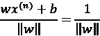
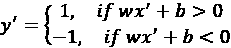
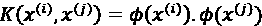
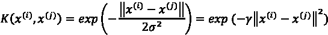

# 第九章：使用支持向量机识别人脸

在上一章中，我们使用聚类和主题建模技术发现了潜在的主题。本章将继续我们对监督学习和分类的探索，特别是强调**支持向量机**（**SVM**）分类器。

在高维空间中，SVM 是最受欢迎的算法之一。该算法的目标是找到一个决策边界，以便将不同类别的数据分开。我们将详细讨论它是如何工作的。同时，我们将使用 scikit-learn 实现该算法，并将其应用于解决各种现实生活中的问题，包括我们的主要项目——人脸识别。本章还将介绍一种称为**主成分分析**的降维技术，它可以提升图像分类器的性能，此外还会涉及支持向量回归。

本章探讨以下主题：

+   使用 SVM 寻找分隔边界

+   使用 SVM 分类人脸图像

+   使用支持向量回归进行估计

# 使用 SVM 寻找分隔边界

SVM 是另一种优秀的分类器，尤其在高维空间或维度数量大于样本数量的情况下表现出色。

在机器学习分类中，SVM 找到一个最优的超平面，能够最好地将不同类别的观察数据分开。

**超平面**是一个具有* n - 1 *维度的平面，它将观察的* n *维特征空间分割为两个空间。例如，在二维特征空间中的超平面是一个直线，在三维特征空间中，超平面是一个面。选择最佳超平面是为了最大化其在每个空间中到最近点的距离，这些最近点就是所谓的**支持向量**。

以下的玩具示例展示了在二分类问题中，支持向量和分隔超平面（以及稍后我会解释的距离边界）是什么样子的：


图 9.1：二分类中支持向量和超平面的示例

支持向量机（SVM）的最终目标是找到一个最优的超平面，但迫切的问题是“我们如何找到这个最优超平面？”在接下来的探索中，你会得到答案。这并不像你想象的那么困难。我们首先要看的，是如何找到一个超平面。

## 场景 1 – 确定分隔超平面

首先，你需要理解什么样的超平面才是分隔超平面。在以下示例中，超平面*C*是唯一正确的，它成功地按标签将观察结果分隔开，而超平面*A*和*B*都未能做到这一点：


图 9.2：合格与不合格超平面的示例

这是一个容易观察到的现象。接下来，让我们以正式或数学的方式表达一个分隔超平面。

在二维空间中，一条直线可以由一个斜率向量 *w*（表示为二维向量）和一个截距 *b* 来定义。类似地，在 *n* 维空间中，一个超平面可以由一个 *n* 维向量 *w* 和截距 *b* 来定义。任何位于超平面上的数据点 *x* 都满足 *wx + b = 0*。如果满足以下条件，则该超平面是分隔超平面：

+   对于来自某一类别的任意数据点 *x*，它满足 *wx* + *b* > *0*

+   对于来自另一个类别的任意数据点 *x*，它满足 *wx* + *b* < *0*

然而，*w* 和 *b* 可能有无数种解。你可以在一定范围内移动或旋转超平面 *C*，它仍然保持分隔超平面。接下来，你将学习如何从多个可能的分隔超平面中识别出最佳超平面。

## 场景 2 - 确定最优超平面

看下面的例子：超平面 *C* 更受青睐，因为它能够最大化正侧最近数据点与自身之间的距离和负侧最近数据点与自身之间的距离之和：


图 9.3：最优和次优超平面的示例

正侧最近的点可以构成一个与决策超平面平行的超平面，我们称之为**正超平面**；相反，负侧最近的点可以构成**负超平面**。正负超平面之间的垂直距离被称为**间隔**，其值等于前述两者的距离之和。如果间隔最大化，则该**决策**超平面被认为是**最优**的。

训练后的 SVM 模型中的最优（也叫**最大间隔**）超平面和距离间隔如以下图所示。再次强调，位于间隔上的样本（每一类别各两个样本，另一个类别一个样本，如图所示）即为所谓的**支持向量**：


图 9.4：最优超平面和距离间隔的示例

我们可以通过首先描述正负超平面来从数学上进行解释，具体如下：


这里， 是正超平面上的一个数据点， 是负超平面上的一个数据点。

点与决策超平面之间的距离可以通过以下方式计算：


同样，点与决策超平面之间的距离如下：



所以边距变成了 。因此，我们需要最小化 ，以最大化边距。重要的是，为了符合正负超平面上的支持向量是离决策超平面最近的数据点这一事实，我们添加了一个条件：没有数据点位于正负超平面之间：


这里， 是一个观察值。这可以进一步组合成如下形式：


总结一下，决定 SVM 决策超平面的 *w* 和 *b*，是通过以下优化问题进行训练和求解的：

+   最小化 

+   约束条件为 ，对于训练集中的 ，，…………，以及 

为了解决这个优化问题，我们需要借助二次规划技术，这超出了我们学习旅程的范围。因此，我们不会详细讲解计算方法，而是使用 scikit-learn 中的 `SVC` 和 `LinearSVC` 模块来实现分类器，这两个模块分别基于 `libsvm` ([`www.csie.ntu.edu.tw/~cjlin/libsvm/`](https://www.csie.ntu.edu.tw/~cjlin/libsvm/)) 和 `liblinear` ([`www.csie.ntu.edu.tw/~cjlin/liblinear/`](https://www.csie.ntu.edu.tw/~cjlin/liblinear/))，这两个是流行的开源 SVM 机器学习库。不过，理解 SVM 的计算概念始终是很有价值的。

*Pegasos: SVM 的原始估计子梯度求解器*（《数学编程》，2011 年 3 月，第 127 卷，第 1 期，页码 3–30）由 Shai Shalev-Shwartz 等人编写，*大规模线性 SVM 的对偶坐标下降法*（《第 25 届国际机器学习大会论文集》，页码 408–415）由 Cho-Jui Hsieh 等人编写，是非常好的学习材料。它们涵盖了两种现代方法：子梯度下降法和坐标下降法。

然后，学习到的模型参数 *w* 和 *b* 会被用来根据以下条件对新样本 *x*’ 进行分类：



此外， 可以表示为数据点 *x*’ 到决策超平面的距离，也可以解释为预测的置信度：值越大，数据点离决策边界越远，因此预测的确定性越高。

虽然你可能迫不及待想实现 SVM 算法，但我们还是先退后一步，看看一个常见场景，在这个场景中数据点并不是严格线性可分的。试着在以下示例中找到一个分割超平面：


图 9.5：一个数据点不能严格线性分割的示例

如何处理那些无法严格线性分隔包含离群值的观察值集的情况呢？让我们在下一节中探讨。

## 场景 3 – 处理离群值

为了处理无法线性分隔包含离群值的观察值集的场景，我们实际上可以允许离群值的误分类，并尝试最小化由此引入的误差。样本  的误分类误差 （也称为 **铰链损失**）可以表示如下：


连同我们希望减少的最终项 ，我们希望最小化的最终目标值变为如下：


对于包含 *m* 个样本的训练集 ，，… ，… 和 ，其中超参数 *C* 控制两项之间的权衡，以下公式适用：

+   如果选择了较大的 *C* 值，误分类的惩罚会变得相对较高。这意味着数据分隔的经验法则变得更加严格，模型可能容易过拟合，因为在训练过程中允许的错误很少。具有大 *C* 值的 SVM 模型具有低偏差，但可能会遭遇高方差。

+   相反，如果 *C* 的值足够小，误分类的影响会变得相对较低。这个模型允许比大 *C* 值模型更多的误分类数据点。因此，数据分隔变得不那么严格。这样的模型具有低方差，但可能会受到高偏差的影响。

下图展示了大与小的 *C* 值之间的对比：


图 9.6：*C* 值如何影响分隔的严格性和边际

参数 *C* 决定了偏差与方差之间的平衡。它可以通过交叉验证进行微调，接下来我们将进行实践。

## 实现 SVM

我们已经大致讲解了 SVM 分类器的基础知识。现在，让我们立即将其应用于一个简单的二分类数据集。我们将使用 scikit-learn 中经典的乳腺癌威斯康星数据集（[`scikit-learn.org/stable/modules/generated/sklearn.datasets.load_breast_cancer.html`](https://scikit-learn.org/stable/modules/generated/sklearn.datasets.load_breast_cancer.html)）。

让我们看看以下步骤：

1.  我们首先加载数据集并进行一些基础分析，如下所示：

    ```py
    >>> from sklearn.datasets import load_breast_cancer
    >>> cancer_data = load_breast_cancer()
    >>> X = cancer_data.data
    >>> Y = cancer_data.target
    >>> print('Input data size :', X.shape)
    Input data size : (569, 30)
    >>> print('Output data size :', Y.shape)
    Output data size : (569,)
    >>> print('Label names:', cancer_data.target_names)
    Label names: ['malignant' 'benign']
    >>> n_pos = (Y == 1).sum()
    >>> n_neg = (Y == 0).sum()
    >>> print(f'{n_pos} positive samples and {n_neg} negative samples.')
    357 positive samples and 212 negative samples. 
    ```

如你所见，数据集包含 569 个样本，具有 30 个特征；其标签是二元的，其中 63% 的样本为正样本（良性）。再次提醒，在尝试解决任何分类问题之前，请始终检查类别是否不平衡。在这种情况下，它们是相对平衡的。

1.  接下来，我们将数据分为训练集和测试集：

    ```py
    >>> from sklearn.model_selection import train_test_split
    >>> X_train, X_test, Y_train, Y_test = train_test_split(X, Y, random_state=42) 
    ```

为了保证可复现性，别忘了指定随机种子。

1.  我们现在可以将 SVM 分类器应用于数据。我们首先初始化一个 `SVC` 模型，并将 `kernel` 参数设置为 `linear`（线性核指的是使用线性决策边界来分隔输入空间中的类。我将在 *场景 5* 中解释什么是核）和惩罚超参数 `C` 设置为默认值 `1.0`：

    ```py
    >>> from sklearn.svm import SVC
    >>> clf = SVC(kernel='linear', C=1.0, random_state=42) 
    ```

1.  然后，我们在训练集上拟合我们的模型，如下所示：

    ```py
    >>> clf.fit(X_train, Y_train) 
    ```

1.  然后，我们使用训练好的模型对测试集进行预测，直接获得预测准确率：

    ```py
    >>> accuracy = clf.score(X_test, Y_test)
    >>> print(f'The accuracy is: {accuracy*100:.1f}%')
    The accuracy is: 95.8% 
    ```

我们的第一个 SVM 模型表现得非常好，达到了 `95.8%` 的准确率。那么，如何处理多个主题呢？SVM 如何处理多类分类？

## 场景 4 – 处理多于两类的情况

SVM 和许多其他分类器可以应用于多类情况。我们可以采取两种典型方法，**一对多**（也称为 **一对全**）和 **一对一**。

### 一对多

在一对多设置中，对于 *K* 类问题，我们构建 *K* 个不同的二元 SVM 分类器。对于第 *k* 个分类器，它将第 *k* 类作为正类，剩余的 *K-1* 类作为负类整体；表示为 (*w*[k]*, b*[k]) 的超平面被训练用来分隔这两类。为了预测一个新样本 *x*’ 的类别，它比较从 *1* 到 *K* 的各个分类器得出的预测结果 。正如我们在前一部分讨论的，值较大的  表示 *x*’ 属于正类的置信度更高。因此，它将 *x*’ 分配给预测结果中值最大的类别 *i*：


下图展示了一对多策略如何在三类情况下工作：


图 9.7：使用一对多策略的三类分类示例

例如，如果我们有以下内容（*r*、*b* 和 *g* 分别表示红十字、蓝点和绿方块类）：

*w*[r]*x’*+*b*[r] = 0.78

*w*[b]*x’*+*b*[b] = 0.35

*w*[g]*x’*+*b*[g] = -0.64

我们可以说 *x*’ 属于红十字类，因为 *0.78 > 0.35 > -0.64*。

如果我们有以下内容：

*w*[r]*x’*+*b*[r] = -0.78

*w*[b]*x’*+*b*[b] = -0.35

*w*[g]*x’*+*b*[g] = -0.64

那么我们可以确定 *x*’ 属于蓝点类，无论符号如何，因为 -*0.35 > -0.64 > -0.78*。

### 一对一

在一对一策略中，我们通过构建一组 SVM 分类器进行成对比较，以区分每对类之间的数据点。这将产生  个不同的分类器。

对于与类*i*和*j*相关联的分类器，超平面(*w*[ij],*b*[ij])仅在基于*i*（可以看作正例）和*j*（可以看作负例）的观测数据上进行训练；然后，它会根据*w*[ij]*x’*+*b*[ij]的符号，将类*i*或*j*分配给新样本*x*’。最后，拥有最多分配的类被视为*x*’的预测结果。获得最多投票的类为最终胜者。

下图展示了在三类问题中一对一策略的工作原理：


图 9.8：使用一对一策略的三类分类示例

一般来说，使用一对多设置的 SVM 分类器与使用一对一设置的分类器在准确性上表现相似。这两种策略的选择主要取决于计算的需求。

尽管一对一方法需要更多的分类器，，与一对多方法(*K*)相比，每对分类器只需要在数据的小子集上进行学习，而不是在一对多设置下使用整个数据集。因此，在一对一设置下训练 SVM 模型通常更加节省内存和计算资源；因此，在实际应用中，正如 Chih-Wei Hsu 和 Chih-Jen Lin 在其论文《多类支持向量机方法比较》中所述，它更为优选（*IEEE Transactions on Neural Networks*, 2002 年 3 月，卷 13，第 415-425 页）。

### scikit-learn 中的多类问题

在 scikit-learn 中，分类器会自动处理多类问题，我们不需要显式编写额外的代码来启用此功能。你可以看到，在以下的葡萄酒分类示例中（[`scikit-learn.org/stable/modules/generated/sklearn.datasets.load_wine.html#sklearn.datasets.load_wine`](https://scikit-learn.org/stable/modules/generated/sklearn.datasets.load_wine.html#sklearn.datasets/load_wine)），如何简单地处理包含三类的数据：

1.  我们首先加载数据集并进行一些基本分析，如下所示：

    ```py
    >>> from sklearn.datasets import load_wine
    >>> wine_data = load_wine()
    >>> X = wine_data.data
    >>> Y = wine_data.target
    >>> print('Input data size :', X.shape)
    Input data size : (178, 13)
    >>> print('Output data size :', Y.shape)
    Output data size : (178,)
    >>> print('Label names:', wine_data.target_names)
    Label names: ['class_0' 'class_1' 'class_2']
    >>> n_class0 = (Y == 0).sum()
    >>> n_class1 = (Y == 1).sum()
    >>> n_class2 = (Y == 2).sum()
    >>> print(f'{n_class0} class0 samples,\n{n_class1} class1 samples,\n{n_class2} class2 samples.')
    59 class0 samples,
    71 class1 samples,
    48 class2 samples. 
    ```

如你所见，该数据集包含 178 个样本和 13 个特征；其标签有三个可能的值，分别占 33%、40%和 27%。

1.  接下来，我们将数据分为训练集和测试集：

    ```py
    >>> X_train, X_test, Y_train, Y_test = train_test_split(X, Y, random_state=42) 
    ```

1.  现在我们可以将 SVM 分类器应用于数据。我们首先初始化一个`SVC`模型并将其拟合到训练集上：

    ```py
    >>> clf = SVC(kernel='linear', C=1.0, random_state=42)
    >>> clf.fit(X_train, Y_train) 
    ```

在`SVC`模型中，多类支持是根据一对一方案隐式处理的。

1.  接下来，我们使用训练好的模型对测试集进行预测，并直接获得预测准确率：

    ```py
    >>> accuracy = clf.score(X_test, Y_test)
    >>> print(f'The accuracy is: {accuracy*100:.1f}%')
    The accuracy is: 97.8% 
    ```

我们的 SVM 模型在这个多类问题中也表现良好，达到了`97.8%`的准确率。

1.  我们还检查了它在各个类上的表现：

    ```py
    >>> from sklearn.metrics import classification_report
    >>> pred = clf.predict(X_test)
    >>> print(classification_report(Y_test, pred))
                  precision    recall  f1-score   support
               0       1.00      1.00      1.00        15
               1       1.00      0.94      0.97        18
               2       0.92      1.00      0.96        12
        accuracy                           0.98        45
       macro avg       0.97      0.98      0.98        45
    weighted avg       0.98      0.98      0.98        45 
    ```

看起来很棒！这个例子是不是太简单了？也许是。那在复杂情况下我们该怎么办呢？当然，我们可以调整核函数和 C 超参数的值。如前所述，C 的作用是控制分隔的严格程度，可以通过调节它来实现偏差和方差之间的最佳平衡。那核函数呢？它意味着什么，线性核函数还有什么替代方案？

在接下来的章节中，我们将解答这两个问题。你将看到核技巧如何让支持向量机（SVM）变得如此强大。

## 场景 5 – 使用核函数解决线性不可分问题

到目前为止，我们找到的超平面都是线性的，例如，在二维特征空间中的一条直线，或者在三维空间中的一个平面。然而，在以下例子中，我们无法找到一个线性超平面来分隔两个类别：


图 9.9：线性不可分案例

直观地，我们观察到来自一个类别的数据点比来自另一个类别的数据点离原点更近。到原点的距离提供了可区分的信息。所以我们添加了一个新特征，*z*=(*x*[1]²+*x*[2]²)²，并将原始的二维空间转换为三维空间。在新的空间中，如下图所示，我们可以找到一个超平面来分隔数据（见*图 9.10*左下角的图），或者在二维视图中找到一条直线（见*图 9.10*右下角的图）。通过添加这个新特征，数据集在更高维的空间中变得线性可分，(*x*[1]*,x*[2]*,z*)：


图 9.10：将不可分案例变为可分

基于类似的逻辑，**带核函数的 SVM**被发明出来，用于通过转换原始特征空间！[](img/B21047_09_038.png)，将其映射到一个更高维的特征空间，通过变换函数！[](img/B21047_09_039.png)，使得变换后的数据集！[](img/B21047_09_040.png)变得线性可分。

通过使用观测值！[](img/B21047_09_042.png)，学习到了一个线性超平面！[](img/B21047_09_041.png)。对于一个未知样本*x*’，首先将其转换为！[](img/B21047_09_043.png)；然后通过！[](img/B21047_09_044.png)确定预测的类别。

带有核函数的 SVM 能够实现非线性分隔，但它并不会显式地将每个原始数据点映射到高维空间，然后在新空间中进行昂贵的计算。相反，它以一种巧妙的方式实现这一点。

在求解 SVM 优化问题的过程中，特征向量*x*^((1))、*x*^((2))、…、*x*^((m))仅以成对的点积形式出现，即*x*^((i)) *x*^((j))，尽管我们在本书中不会数学展开这个内容。使用核函数时，新的特征向量是！[](img/B21047_09_045.png)，它们的成对点积可以表示为！[](img/B21047_09_046.png)。从计算效率角度来看，先在两个低维向量上隐式进行成对操作，然后再将结果映射到高维空间，是一种有效的方法。事实上，存在一个满足此要求的函数*K*：



函数*K*就是所谓的**核函数**。它是进行转换的数学公式。

有不同类型的核，每种类型适用于不同的数据。

有了核函数，转换！[](img/B21047_09_048.png)变得隐式，非线性决策边界可以通过简单地将术语！[](img/B21047_09_049.png)替换为！[](img/B21047_09_050.png)来高效学习。

数据被转换为更高维的空间。你实际上不需要显式计算这个空间；核函数只需与原始数据一起工作，并进行支持向量机（SVM）所需的计算。

最常用的核函数可能是**径向基函数**（**RBF**）核（也称为**高斯**核），定义如下：



在高斯函数中，标准差！[](img/B21047_09_053.png)控制着允许的变化量或分散量：标准差越大！[](img/B21047_09_053.png)（或标准差越小！[](img/B21047_09_055.png)），钟形曲线的宽度越大，数据点分布的范围也越广。因此，！[](img/B21047_09_055.png)作为**核系数**决定了核函数拟合观测值的严格程度或一般程度。较大的！[](img/B21047_09_055.png)意味着允许的小方差和相对准确的拟合训练样本，这可能导致过拟合。相反，较小的！[](img/B21047_09_055.png)意味着允许的方差较大，且训练样本的拟合较松散，这可能会导致欠拟合。

为了说明这种权衡，让我们对一个玩具数据集应用不同值的 RBF 核：

```py
>>> import numpy as np
>>> import matplotlib.pyplot as plt
>>> X = np.c_[# negative class
...           (.3, -.8),
...           (-1.5, -1),
...           (-1.3, -.8),
...           (-1.1, -1.3),
...           (-1.2, -.3),
...           (-1.3, -.5),
...           (-.6, 1.1),
...           (-1.4, 2.2),
...           (1, 1),
...           # positive class
...           (1.3, .8),
...           (1.2, .5),
...           (.2, -2),
...           (.5, -2.4),
...           (.2, -2.3),
...           (0, -2.7),
...           (1.3, 2.1)].T
>>> Y = [-1] * 8 + [1] * 8 
```

八个数据点来自一类，另有八个来自另一类。我们以核系数的三个值`1`、`2`和`4`为例进行说明：

```py
>>> gamma_option = [1, 2, 4] 
```

在每个核系数下，我们拟合一个单独的 SVM 分类器，并可视化训练后的决策边界：

```py
>>> for i, gamma in enumerate(gamma_option, 1):
...     svm = SVC(kernel='rbf', gamma=gamma)
...     svm.fit(X, Y)
...     plt.scatter(X[:, 0], X[:, 1], c=['b']*8+['r']*8, zorder=10)
...     plt.axis('tight')
...     XX, YY = np.mgrid[-3:3:200j, -3:3:200j]
...     Z = svm.decision_function(np.c_[XX.ravel(), YY.ravel()])
...     Z = Z.reshape(XX.shape)
...     plt.pcolormesh(XX, YY, Z > 0 , cmap=plt.cm.Paired)
...     plt.contour(XX, YY, Z, colors=['k', 'k', 'k'],
...            linestyles=['--', '-', '--'], levels=[-.5, 0, .5])
...     plt.title('gamma = %d' % gamma)
...     plt.show() 
```

请参考以下截图查看最终结果：


图 9.11：在不同的 gamma 值下，SVM 分类决策边界

我们可以观察到，较大的  会导致较窄的区域，这意味着对数据集的拟合更严格；较小的  会导致较宽的区域，这意味着对数据集的拟合较松散。当然， 可以通过交叉验证进行微调，以获得最佳性能。

其他常见的核函数包括**多项式**核函数：


以及**Sigmoid**核函数：


在缺乏分布先验知识的情况下，RBF 核函数通常更受欢迎，因为多项式核函数有一个额外的可调参数（多项式阶数 *d*），而经验性的 Sigmoid 核函数在某些参数下可以与 RBF 核函数的表现相当。因此，我们会在给定数据集时讨论线性（也可以看作没有核函数）与 RBF 核函数之间的选择。

## 在选择线性核函数和 RBF 核函数时

当然，线性可分性是选择合适核函数的经验法则，因为它简单高效。然而，大多数情况下，除非你对数据集有足够的先验知识，或者其特征的维度较低（1 到 3），否则很难识别出线性可分性。

一些常见的先验知识是，文本数据通常是线性可分的，而来自 XOR 函数的数据（[`en.wikipedia.org/wiki/XOR_gate`](https://en.wikipedia.org/wiki/XOR_gate)）则不是。

现在，让我们看一下在以下三种场景中，线性核函数相较于 RBF 更受青睐。

**场景 1**：特征数量和样本数量都很大（超过 104 或 105）。由于特征空间的维度足够高，RBF 转换所增加的特征不会提供性能提升，反而会增加计算开销。UCI 机器学习库中的一些例子属于这一类型（UCI 机器学习库是一个广泛用于机器学习算法经验分析的数据库和数据生成器集合）：

+   **URL 声誉数据集**：[`archive.ics.uci.edu/ml/datasets/URL+Reputation`](https://archive.ics.uci.edu/ml/datasets/URL+Reputation)（实例数量：2,396,130；特征数量：3,231,961）。该数据集用于基于词汇和主机信息检测恶意 URL。

+   **YouTube 多视角视频游戏数据集**：[`archive.ics.uci.edu/ml/datasets/YouTube+Multiview+Video+Games+Dataset`](https://archive.ics.uci.edu/ml/datasets/YouTube+Multiview+Video+Games+Dataset)（实例数量：120,000；特征数量：1,000,000）。该数据集用于主题分类。

**场景 2**：特征的数量与训练样本的数量相比明显较大。除了*场景 1*中提到的原因外，RBF 核函数更容易出现过拟合。这样的场景出现在以下几个例子中：

+   **Dorothea 数据集**：[`archive.ics.uci.edu/ml/datasets/Dorothea`](https://archive.ics.uci.edu/ml/datasets/Dorothea)（实例数量：1,950；特征数量：100,000）。该数据集旨在用于药物发现，通过化学化合物的结构分子特征，将其分类为活性或非活性。

+   **Arcene 数据集**：[`archive.ics.uci.edu/ml/datasets/Arcene`](https://archive.ics.uci.edu/ml/datasets/Arcene)（实例数量：900；特征数量：10,000）。这是一个用于癌症检测的质谱数据集。

**场景 3**：实例数量与特征数量相比显著较大。对于低维数据集，RBF 核通常通过将其映射到更高维空间来提升性能。然而，由于训练复杂度，通常在样本数超过 106 或 107 时，RBF 核在训练集上的效率较低。示例数据集包括以下内容：

+   *异质性活动识别数据集*：[`archive.ics.uci.edu/ml/datasets/Heterogeneity+Activity+Recognition`](https://archive.ics.uci.edu/ml/datasets/Heterogeneity+Activity+Recognition)（实例数量：`43,930,257`；特征数量：`16`）。该数据集旨在进行人类活动识别。

+   *HIGGS 数据集*：[`archive.ics.uci.edu/ml/datasets/HIGGS`](https://archive.ics.uci.edu/ml/datasets/HIGGS)（实例数量：11,000,000；特征数量：28）。该数据集旨在区分产生希格斯玻色子的信号过程和背景过程。

除了这三种场景，你还可以考虑尝试使用 RBF 核。

选择线性核与 RBF 核的规则可以总结如下：

| **场景** | **线性** | **RBF** |
| --- | --- | --- |
| 先验知识 | 如果线性可分 | 如果非线性可分 |
| 1 到 3 维可视化数据 | 如果线性可分 | 如果非线性可分 |
| 特征数量和实例数量都很大。 | 首选 |  |
| 特征 >> 实例 | 首选 |  |
| 实例 >> 特征 | 首选 |  |
| 其他 |  | 首选 |

表 9.1：选择线性核与 RBF 核的规则

再次强调，**首选**意味着我们可以**从这个选项开始**；并不意味着这是唯一的选择。

接下来，让我们看看如何分类人脸图像。

# 使用 SVM 分类人脸图像

最后，是时候利用你刚刚学到的所有知识，构建一个基于 SVM 的人脸图像分类器了。我们将分部分进行，首先探索图像数据集。

## 探索人脸图像数据集

我们将使用**LFW 人脸数据集**（**LFW**）([`scikit-learn.org/stable/modules/generated/sklearn.datasets.fetch_lfw_people.html`](https://scikit-learn.org/stable/modules/generated/sklearn.datasets.fetch_lfw_people.html))，该数据集包含了超过 5,000 位名人的 13,000 多张精选人脸图像。每个类别有不同数量的图像样本。

首先，我们加载人脸图像数据，如下所示：

```py
>>> from sklearn.datasets import fetch_lfw_people
Downloading LFW metadata: https://ndownloader.figshare.com/files/5976012
Downloading LFW metadata: https://ndownloader.figshare.com/files/5976009
Downloading LFW metadata: https://ndownloader.figshare.com/files/5976006
Downloading LFW data (~200MB): https://ndownloader.figshare.com/files/5976015
>>> face_data = fetch_lfw_people(min_faces_per_person=80) 
```

我们只加载至少有`80`个样本的类别，以确保有足够的训练数据。注意，如果你遇到`ImportError: The Python Imaging Library (PIL) is required to load data from jpeg files`的错误，请在终端中安装`pillow`包，方法如下：

```py
pip install pillow 
```

如果遇到`urlopen`错误，可以手动从以下链接下载四个数据文件：

+   `pairsDevTrain.txt`：[`ndownloader.figshare.com/files/5976012`](https://ndownloader.figshare.com/files/5976012)

+   `pairsDevTest.txt`：[`ndownloader.figshare.com/files/5976009`](https://ndownloader.figshare.com/files/5976009)

+   `pairs.txt`：[`ndownloader.figshare.com/files/5976006`](https://ndownloader.figshare.com/files/5976006)

+   `lfw-funneled.tgz`：[`ndownloader.figshare.com/files/5976015`](https://ndownloader.figshare.com/files/5976015)

然后，你可以将它们放在一个指定的文件夹中，例如当前路径`./`。因此，加载图像数据的代码如下：

```py
>>> face_data = fetch_lfw_people(data_home='./',
                                 min_faces_per_person=80,   
                                 download_if_missing=False ) 
```

接下来，我们查看刚刚加载的数据：

```py
>>> X = face_data.data
>>> Y = face_data.target
>>> print('Input data size :', X.shape)
Input data size : (1140, 2914)
>>> print('Output data size :', Y.shape)
Output data size : (1140,)
>>> print('Label names:', face_data.target_names)
Label names: ['Colin Powell' 'Donald Rumsfeld' 'George W Bush' 'Gerhard Schroeder' 'Tony Blair'] 
```

这个五类数据集包含`1,140`个样本，每个样本有`2,914`个维度。作为一种好的实践，我们分析标签分布如下：

```py
>>> for i in range(5):
...     print(f'Class {i} has {(Y == i).sum()} samples.')
Class 0 has 236 samples.
Class 1 has 121 samples.
Class 2 has 530 samples.
Class 3 has 109 samples.
Class 4 has 144 samples. 
```

数据集相当不平衡。我们在构建模型时要考虑这一点。

现在，让我们绘制一些人脸图像：

```py
>>> fig, ax = plt.subplots(3, 4)
>>> for i, axi in enumerate(ax.flat):
...     axi.imshow(face_data.images[i], cmap='bone')
...     axi.set(xticks=[], yticks=[],
...             xlabel=face_data.target_names[face_data.target[i]])
...
>>> plt.show() 
```

你将看到以下 12 张带有标签的图像：


图 9.12：来自 LFW 人脸数据集的样本

现在我们已经完成了探索性数据分析，接下来我们将在下一部分进入模型开发阶段。

## 构建基于 SVM 的图像分类器

首先，我们将数据拆分为训练集和测试集：

```py
>>> X_train, X_test, Y_train, Y_test = train_test_split(X, Y,
                                                        random_state=42) 
```

在这个项目中，维度数大于样本数。这是一个 SVM 能够有效解决的分类问题。在我们的解决方案中，我们将通过交叉验证调整超参数，包括惩罚项`C`、核函数（线性或 RBF）以及（对于 RBF 核）。

然后，我们初始化一个常见的 SVM 模型：

```py
>>> clf = SVC(class_weight='balanced', random_state=42) 
```

数据集不平衡，因此我们设置`class_weight='balanced'`以强调少数类。

我们使用 scikit-learn 的 GridSearchCV 模块在多个候选参数中搜索最佳超参数组合。我们将探索以下超参数候选值：

```py
>>> parameters = {'C': [10, 100, 300],
...               'gamma': [0.0001,  0.0003, 0.001],
...               'kernel' : ['rbf', 'linear'] }
>>> from sklearn.model_selection import GridSearchCV
>>> grid_search = GridSearchCV(clf, parameters, n_jobs=-1, cv=5) 
```

如果你不确定要为 RBF 核选择哪个合适的 gamma 值，选择`1`除以特征维度通常是一个可靠的选择。因此，在这个例子中，`1/2914 = 0.0003`。

我们刚刚初始化的`GridSearchCV`模型将进行五折交叉验证（`cv=5`），并将在所有可用的核心上并行运行（`n_jobs=-1`）。然后我们通过简单地应用`fit`方法来进行超参数调优：

```py
>>> grid_search.fit(X_train, Y_train) 
```

我们通过以下代码获取最佳超参数集：

```py
>>> print('The best model:\n', grid_search.best_params_)
The best model:
 {'C': 300, 'gamma': 0.001, 'kernel': 'rbf'} 
```

然后，我们通过以下代码获得在最佳参数集下的五折交叉验证平均性能：

```py
>>> print('The best averaged performance:', grid_search.best_score_)
 The best averaged performance: 0.8456140350877192 
```

然后，我们获取最佳超参数集的 SVM 模型，并将其应用到测试集上：

```py
>>> clf_best = grid_search.best_estimator_
>>> pred = clf_best.predict(X_test) 
```

接着，我们计算准确率和分类报告：

```py
>>> print(f'The accuracy is: {clf_best.score(X_test,
...       Y_test)*100:.1f}%')
The accuracy is: 89.8%
>>> from sklearn.metrics import classification_report
>>> print(classification_report(Y_test, pred,
...           target_names=face_data.target_names))
                   precision    recall  f1-score   support
     Colin Powell       0.90      0.88      0.89        64
  Donald Rumsfeld       0.90      0.84      0.87        32
    George W Bush       0.89      0.94      0.92       127
Gerhard Schroeder       0.90      0.90      0.90        29
       Tony Blair       0.90      0.85      0.88        33
        Accuracy                            0.90       285
        macro avg       0.90      0.88      0.89       285
     weighted avg       0.90      0.90      0.90       285 
```

需要注意的是，我们基于原始训练集对模型进行调优，训练集会被划分为若干折进行交叉训练和验证，然后将最佳模型应用到原始测试集上。我们通过这种方式检验分类性能，以衡量模型的泛化能力，从而确保能够在全新的数据集上做出正确的预测。最佳 SVM 模型达到了`89.8%`的准确率。

另外，scikit-learn 中还有一个 SVM 分类器，`LinearSVC`（[`scikit-learn.org/stable/modules/generated/sklearn.svm.LinearSVC.html`](https://scikit-learn.org/stable/modules/generated/sklearn.svm.LinearSVC.html)）。它与`SVC`有何不同？`LinearSVC`与具有线性核的`SVC`相似，但它基于`liblinear`库实现，优化优于使用线性核的`libsvm`，并且其惩罚函数更加灵活。

通常，使用`LinearSVC`模型训练比`SVC`模型训练更快。这是因为具有高可扩展性的`liblinear`库是为大规模数据集设计的，而`libsvm`库的计算复杂度超过二次，无法很好地处理超过 10⁵ 个训练实例的数据。但同样，`LinearSVC`模型仅限于线性核。

## 使用 PCA 提升图像分类性能

我们还可以通过使用**主成分分析**（**PCA**）来压缩输入特征，从而改进图像分类器（参考 Jonathon Shlens 的《主成分分析教程》）。这会减少原始特征空间的维度，并保留特征之间最重要的内部关系。简单来说，PCA 将原始数据投影到一个包含最重要方向（坐标）的较小空间中。我们希望，在特征数量超过训练样本数的情况下，通过使用 PCA 进行降维，减少特征的数量可以防止过拟合。

以下是 PCA 的工作原理：

1.  **数据标准化**：在应用 PCA 之前，必须通过减去均值并除以每个特征的标准差来对数据进行标准化。这一步骤确保所有特征处于相同的尺度上，并防止某个特征在分析中占主导地位。

1.  **协方差矩阵计算（Covariance Matrix Calculation）**：PCA 计算标准化数据的协方差矩阵。协方差矩阵显示每对特征之间的变化关系。协方差矩阵的对角元素表示单个特征的方差，而非对角元素表示特征对之间的协方差。

1.  **特征分解（Eigendecomposition）**：下一步是对协方差矩阵进行特征分解。特征分解将协方差矩阵分解成其特征向量和特征值。特征向量表示主成分，而相应的特征值则表示每个主成分所解释的方差量。

1.  **选择主成分（Selecting Principal Components）**：根据特征值的大小降序排列主成分。第一个主成分（PC1）解释了最高的方差，其次是 PC2、PC3 等。通常，你会选择一部分主成分，它们解释了总方差中的重要部分（例如，95% 或更多）。

1.  **投影（Projection）**：最后，将数据投影到选定的主成分上，以创建原始数据的低维表示。这种低维表示保留了数据中的大部分方差信息，同时减少了特征的数量。

如果你感兴趣，可以阅读更多关于 PCA 的内容，链接为 [`www.kaggle.com/nirajvermafcb/principal-component-analysis-explained`](https://www.kaggle.com/nirajvermafcb/principal-component-analysis-explained)。我们将使用来自 scikit-learn 的 `PCA` 模块（[`scikit-learn.org/stable/modules/generated/sklearn.decomposition.PCA.html`](https://scikit-learn.org/stable/modules/generated/sklearn.decomposition.PCA.html)）来实现 PCA。我们首先应用 PCA 降维，然后在降维后的数据上训练分类器。

在机器学习中，我们通常将多个连续的步骤串联在一起，视为一个“模型”。我们称这个过程为**管道化（pipelining）**。我们利用来自 scikit-learn 的 `pipeline` API（[`scikit-learn.org/stable/modules/generated/sklearn.pipeline.Pipeline.html`](https://scikit-learn.org/stable/modules/generated/sklearn.pipeline.Pipeline.html)）来简化这一过程。

现在，让我们初始化一个 PCA 模型、一个 SVC 模型，并将这两个模型通过管道连接起来：

```py
>>> from sklearn.decomposition import PCA
>>> pca = PCA(n_components=100, whiten=True, random_state=42)
>>> svc = SVC(class_weight='balanced', kernel='rbf',
...           random_state=42)
>>> from sklearn.pipeline import Pipeline
>>> model = Pipeline([('pca', pca),
...                  ('svc', svc)]) 
```

PCA 组件将原始数据投影到 100 维空间中，接着使用带有 RBF 核的 SVC 分类器。然后，我们在一些选项中执行网格搜索，以寻找最佳模型：

```py
>>> parameters_pipeline = {'svc__C': [1, 3, 10],
...                       'svc__gamma': [0.01,  0.03, 0.003]}
>>> grid_search = GridSearchCV(model, parameters_pipeline ,
                               n_jobs=-1, cv=5)
>>> grid_search.fit(X_train, Y_train) 
```

**最佳实践**  

在网格搜索 SVM 的超参数（如 C 和 gamma）的初始值时，选择合理的初值非常重要，这样可以高效地找到最佳值。以下是一些最佳实践：

+   **从粗略网格开始**：从一个覆盖 C 和 gamma 范围广泛的粗略网格开始。这可以让你快速探索超参数空间，找到有潜力的区域。

+   **考虑特定的知识**：在选择初始值时，结合有关问题的先验知识或领域专长。例如，如果你知道数据集噪声较大或包含异常值，可能需要优先考虑较大的 C 值，以便在决策边界上提供更多的灵活性。

+   **使用交叉验证**：这有助于评估初始值对未见数据的泛化能力，并指导网格搜索的优化。

+   **迭代优化网格**：基于初步交叉验证的结果，围绕表现良好的区域迭代地优化网格。缩小 C 和 gamma 的取值范围，将搜索重点放在可能包含最优值的区域。

最后，我们打印出最佳超参数集和最佳模型的分类性能：

```py
>>> print('The best model:\n', grid_search.best_params_)
The best model:
 {'svc__C': 1, 'svc__gamma': 0.01}
>>> print('The best averaged performance:', grid_search.best_score_)
The best averaged performance: 0.8619883040935671
>>> model_best = grid_search.best_estimator_
>>> print(f'The accuracy is: {model_best.score(X_test, Y_test)*100:.1f}%')
The accuracy is: 92.3%
>>> pred = model_best.predict(X_test)
>>> print(classification_report(Y_test, pred,
                                target_names=face_data.target_names))
                   precision    recall  f1-score   support
     Colin Powell       0.94      0.94      0.94        64
  Donald Rumsfeld       0.93      0.84      0.89        32
    George W Bush       0.91      0.97      0.94       127
Gerhard Schroeder       0.92      0.79      0.85        29
       Tony Blair       0.94      0.91      0.92        33
        accuracy                            0.92       285
        macro avg       0.93      0.89      0.91       285
     weighted avg       0.92      0.92      0.92       285 
```

由 PCA 和 SVM 分类器组成的模型实现了`92.3%`的准确率。PCA 提高了基于 SVM 的图像分类器的性能。

在 SVM 成功应用于图像分类之后，我们将探讨其在回归中的应用。

# 使用支持向量回归进行估计

顾名思义，SVR 是支持向量家族的一部分，是**支持向量机**（**SVM**）的回归兄弟（或者我们也可以直接称其为**SVC**）。

回顾一下，SVC 寻求一个最佳的超平面，将不同类别的观测值尽可能分开。而在 SVR 中，我们的目标是找到一个决策超平面（由斜率向量*w*和截距*b*定义），使得两个超平面 （负超平面）和 （正超平面）可以覆盖最优超平面的 带域。与此同时，最优超平面尽可能平坦，这意味着*w*越小越好，如下图所示：


图 9.13：在 SVR 中找到决策超平面

这意味着通过求解以下优化问题来推导出最优的*w*和*b*：

+   最小化 

+   受限于 ，给定一个训练集 、 、…… ……， 

支持向量回归（SVR）的理论与支持向量机（SVM）非常相似。在接下来的部分中，让我们来看看 SVR 的实现。

## 实现 SVR

同样，要解决前述的优化问题，我们需要求助于二次规划技术，这些技术超出了我们学习之旅的范围。因此，我们不会详细介绍计算方法，而是使用 scikit-learn 的`SVR`包([`scikit-learn.org/stable/modules/generated/sklearn.svm.SVR.html`](https://scikit-learn.org/stable/modules/generated/sklearn.svm.SVR.html))来实现回归算法。

支持向量机（SVM）中使用的重要技术，如惩罚项作为偏差与方差之间的权衡，以及核函数（例如 RBF）处理线性不可分的问题，都是可以迁移到 SVR 中的。scikit-learn 中的`SVR`包也支持这些技术。

让我们这次用`SVR`解决之前的糖尿病预测问题，正如我们在*第五章*《使用回归算法预测股票价格》中所做的那样：

1.  首先，我们加载数据集并检查数据大小，如下所示：

    ```py
    >>> from sklearn import datasets
    >>> diabetes = datasets.load_diabetes()
    >>> X = diabetes.data
    >>> Y = diabetes.target
    >>> print('Input data size :', X.shape)
    Input data size : (442, 10)
    >>> print('Output data size :', Y.shape)
    Output data size : (442,) 
    ```

1.  接下来，我们将最后 30 个样本指定为测试集，其余样本作为训练集：

    ```py
    >>> num_test = 30   
    >>> X_train = diabetes.data[:-num_test, :]
    >>> y_train = diabetes.target[:-num_test]
    >>> X_test = diabetes.data[-num_test:, :]
    >>> y_test = diabetes.target[-num_test:] 
    ```

1.  现在我们可以将 SVR 回归模型应用于数据。首先，我们初始化一个`SVC`模型，并将其拟合到训练集上：

    ```py
    >>> from sklearn.svm import SVR
    >>> regressor = SVR(C=100, kernel='linear')
    >>> regressor.fit(X_train, y_train) 
    ```

在这里，我们从线性核函数开始。

1.  我们用训练好的模型在测试集上进行预测，并获得预测性能：

    ```py
    >>> from sklearn.metrics import r2_score
    >>> predictions = regressor.predict(X_test)
    >>> print(r2_score(y_test, predictions))
    0.5868189735154503 
    ```

使用这个简单的模型，我们能够获得*R*²为`0.59`。

1.  让我们通过网格搜索进一步改进，找出以下选项中的最佳模型：

    ```py
    >>> parameters = {'C': [300, 500, 700],
                      'gamma': [0.3, 0.6, 1],
                      'kernel' : ['rbf', 'linear']}
    >>> regressor = SVR()
    >>> grid_search = GridSearchCV(regressor, parameters, n_jobs=-1,
                                   cv=5)
    >>> grid_search.fit(X_train, y_train) 
    ```

1.  在对 18 组超参数进行搜索后，我们找到了以下超参数组合下的最佳模型：

    ```py
    >>> print('The best model:\n', grid_search.best_params_)
    The best model: {'C': 300, 'gamma': 1.5, 'kernel': 'rbf'} 
    ```

1.  最后，我们使用最好的模型进行预测并评估其性能：

    ```py
    >>> model_best = grid_search.best_estimator_
    >>> predictions = model_best.predict(X_test)
    >>> print(r2_score(Y_test, predictions)) 
    ```

经过微调后，我们将*R*²得分提升到`0.68`。

与用于分类的支持向量机（SVM）不同，SVM 的目标是将数据分成不同的类别，而支持向量回归（SVR）则侧重于找到一个最适合数据的函数，通过最小化预测误差并允许一定的容忍度。

# 总结

在本章中，我们继续了使用支持向量机（SVM）进行监督学习的旅程。你学习了 SVM 的原理、核函数技巧、SVM 的实现方法以及其他机器学习分类的重要概念，包括多类分类策略和网格搜索，同时也学到了使用 SVM 的一些实用技巧（例如选择核函数和调优参数）。最后，我们通过真实的应用案例来实践所学内容，包括人脸识别。你还学习了 SVM 在回归中的扩展，即支持向量回归（SVR）。

在下一章中，我们将回顾你在本书中学到的内容，并研究现实世界机器学习的最佳实践。本章旨在让你的学习万无一失，为整个机器学习工作流程和生产化做好准备。这将是对一般机器学习技术的总结，然后我们将进入最后三章更复杂的主题。

# 练习

1.  你能使用`LinearSVC`模块实现 SVM 吗？你需要调整哪些超参数，能达到的人脸识别的最佳性能是多少？

1.  你能在图像识别项目中分类更多类别吗？举个例子，你可以设置`min_faces_per_person=50`。通过网格搜索和交叉验证，你能达到最佳性能吗？

1.  探索使用 SVR 进行股票价格预测。你可以重用*第五章*中的数据集和特征生成函数，*使用回归算法预测股票价格*。

# 加入我们书籍的 Discord 空间

加入我们社区的 Discord 空间，与作者和其他读者进行讨论：

[`packt.link/yuxi`](https://packt.link/yuxi)


