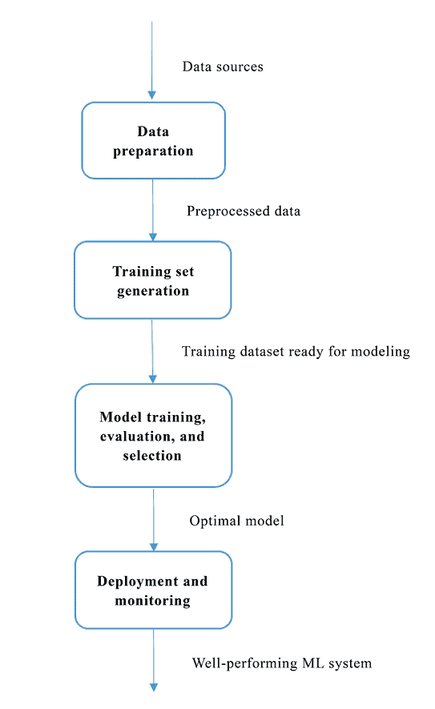
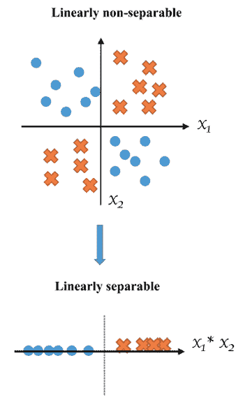
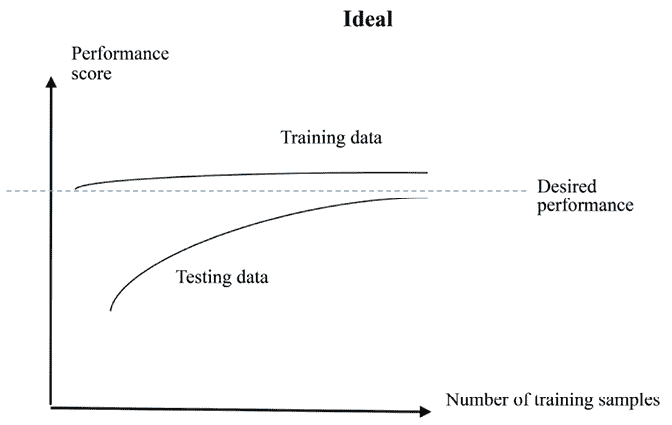
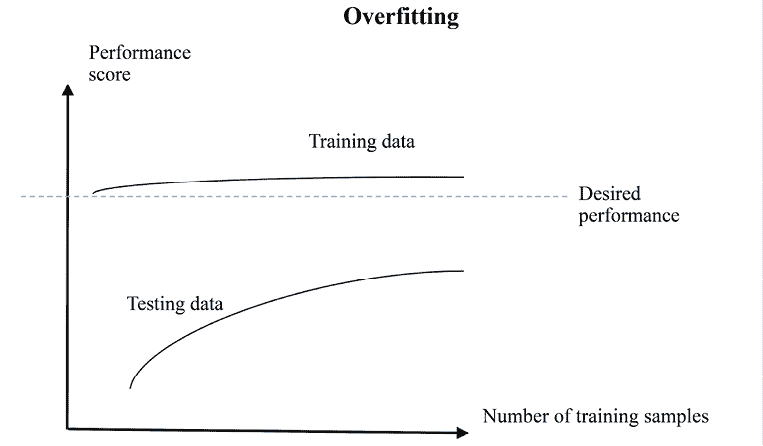
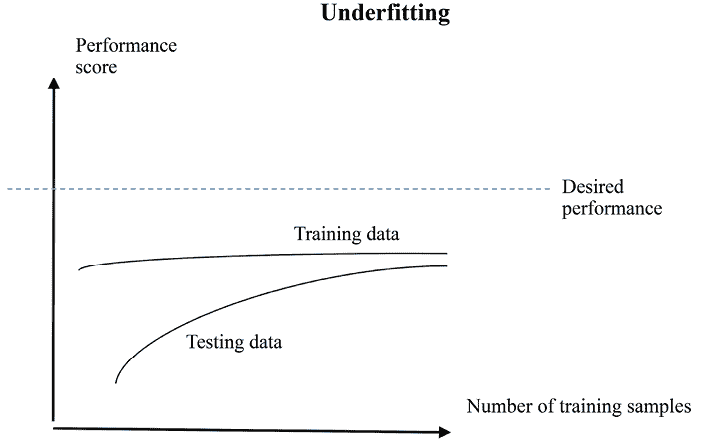

# 第十章：机器学习最佳实践

在处理了多个涵盖重要机器学习概念、技术和广泛使用的算法的项目之后，你已经对机器学习生态系统有了全面的了解，并且在使用机器学习算法和 Python 解决实际问题方面积累了扎实的经验。然而，当我们开始从零开始在现实世界中开展项目时，仍会面临一些问题。本章旨在通过 21 条最佳实践，帮助我们为此做好准备，贯穿整个机器学习解决方案的工作流程。

本章将涵盖以下主题：

+   机器学习解决方案工作流程

+   数据准备阶段的最佳实践

+   训练集生成阶段的最佳实践

+   模型训练、评估和选择阶段的最佳实践

+   部署与监控阶段的最佳实践

# 机器学习解决方案工作流程

通常，解决机器学习问题的主要任务可以总结为四个方面，如下所示：

+   数据准备

+   训练集生成

+   模型训练、评估与选择

+   部署与监控

从数据源开始，到最终的机器学习系统，机器学习解决方案基本上遵循如下模式：



图 10.1：机器学习解决方案的生命周期

在接下来的部分中，我们将学习这些四个阶段的典型任务、常见挑战以及最佳实践。

# 数据准备阶段的最佳实践

没有数据就无法构建机器学习系统。因此，**数据收集**应当是我们首先关注的重点。

## 最佳实践 1 – 完全理解项目目标

在开始收集数据之前，我们应该确保完全理解项目的目标和业务问题，因为这将指导我们选择哪些数据来源，以及在哪些领域需要充足的领域知识和专业技能。例如，在前面的章节中，*第五章*，*使用回归算法预测股价*，我们的目标是预测股票指数的未来价格，因此我们首先收集了其历史表现的数据，而不是收集与之无关的欧洲股票的历史表现数据。在*第三章*，*使用基于树的算法预测在线广告点击率*中，业务问题是优化广告投放，目标是提高点击率，因此我们收集了点击流数据，记录谁在什么页面点击或未点击了哪个广告，而不是仅仅使用广告在网页域名中展示的数量。

## 最佳实践 2 – 收集所有相关字段

确定了目标后，我们可以缩小潜在的数据源进行调查。现在的问题是：是否有必要收集数据源中所有领域的数据，还是仅仅一个属性的子集就足够了？如果我们能事先知道哪些属性是关键指标或预测因素，那将是最理想的。然而，实际上很难确保由领域专家挑选的属性能够产生最佳的预测结果。因此，对于每个数据源，建议收集与项目相关的所有字段，尤其是在重新收集数据既费时又几乎不可能的情况下。

例如，在股价预测的案例中，我们收集了所有字段的数据，包括**Open**、**High**、**Low**和**Volume**，尽管最初我们不确定**high**和**low**预测的用处。然而，获取股市数据非常迅速且容易。在另一个例子中，如果我们想要通过抓取在线文章进行主题分类并自己收集数据，我们应该尽可能多地存储信息。否则，如果某些信息没有被收集，但后来发现它很有价值，例如文章中的超链接，文章可能已经从网页上删除；如果它仍然存在，重新抓取这些页面的成本可能会很高。

在收集了我们认为有用的数据集之后，我们需要通过检查其**一致性**和**完整性**来确保数据质量。一致性是指数据分布随时间的变化情况。完整性是指在字段和样本中的数据量。这将在以下两个实践中详细解释。

## 最佳实践 3 – 维护字段值的一致性和标准化

在一个已经存在的数据集或我们从零开始收集的数据集中，我们经常看到不同的值表示相同的含义。例如，在`Country`字段中，我们看到*American*、*US*和*U.S.A*，在`Gender`字段中，我们看到*male*和*M*。有必要统一或标准化字段中的值，否则在后期阶段，算法会混淆处理不同的特征值，即使它们具有相同的含义。例如，我们只保留`Gender`字段中的三种选项：*M*、*F*和*gender-diverse*，并替换其他替代值。记录哪些值被映射到字段的默认值也是一个很好的做法。

此外，同一字段中值的格式也应保持一致。例如，在*age*字段中，可能会有真实年龄值，如*21*和*35*，也可能会有不正确的年龄值，如*1990*和*1978*；在*rating*字段中，可能会看到基数数字和英文数字，如*1*、*2*、*3*，以及*one*、*two*、*three*。应该进行转换和重新格式化，以确保数据的一致性。

## 最佳实践 4 – 处理缺失数据

由于各种原因，现实世界中的数据集很少完全干净，通常包含缺失或损坏的值。它们通常被呈现为空白、*Null*、*-1, 999999*、*unknown* 或其他任何占位符。带有缺失数据的样本不仅提供不完整的预测信息，还会使机器学习模型困惑，因为它无法确定 *-1* 或 *unknown* 是否具有特定含义。准确定位并处理缺失数据是非常重要的，以避免在后期模型的性能受到影响。

这里有三种基本策略，我们可以用来处理缺失数据问题：

+   丢弃包含任何缺失值的样本。

+   丢弃任何样本中包含缺失值的字段。

+   根据属性的已知部分推断缺失值。这个过程称为**缺失数据填补**。典型的填补方法包括用所有样本中字段的平均值或中位数替换缺失值，或者对于分类数据，用最频繁出现的值替换。

前两种策略实现简单；然而，它们牺牲了数据的丢失，特别是当原始数据集不够大时。第三种策略并不放弃任何数据，而是试图填补空缺。

让我们看看每种策略在一个包含六个样本（年龄、收入）的数据集中如何应用 - (30, 100), (20, 50), (35, *unknown*), (25, 80), (30, 70), 和 (40, 60)。

+   如果我们使用第一种策略处理这个数据集，它将变成 (30, 100), (20, 50), (25, 80), (30, 70), 和 (40, 60)。

+   如果我们采用第二种策略，数据集变成了 (30), (20), (35), (25), (30), 和 (40)，只有第一个字段保留了下来。

+   如果我们决定补全未知值而不是跳过它，例如样本 (35, *unknown*) 可以被转换为 (35, 72)，其中第二个字段的值是其余值的平均值，或者转换为 (35, 70)，其中第二个字段的值是中位数。

在 scikit-learn 中，`SimpleImputer` 类 ([`scikit-learn.org/stable/modules/generated/sklearn.impute.SimpleImputer.html`](https://scikit-learn.org/stable/modules/generated/sklearn.impute.SimpleImputer.html)) 提供了一个写得很好的填补转换器。我们可以用它来做下面这个小例子：

```py
>>> import numpy as np
>>> from sklearn.impute import SimpleImputer 
```

在 `numpy` 中，用 `np.nan` 表示未知值，如下所示：

```py
>>> data_origin = [[30, 100],
...                [20, 50],
...                [35, np.nan],
...                [25, 80],
...                [30, 70],
...                [40, 60]] 
```

使用平均值初始化填补转换器，并从原始数据中获取平均值：

```py
>>> imp_mean = SimpleImputer(missing_values=np.nan, strategy='mean')
>>> imp_mean.fit(data_origin) 
```

补全缺失值如下：

```py
>>> data_mean_imp = imp_mean.transform(data_origin)
>>> print(data_mean_imp)
[[ 30\. 100.]
 [ 20\. 50.]
 [ 35\. 72.]
 [ 25\. 80.]
 [ 30\. 70.]
 [ 40\. 60.]] 
```

同样地，使用中位数初始化填补转换器，如下所示：

```py
>>> imp_median = SimpleImputer(missing_values=np.nan, strategy='median')
>>> imp_median.fit(data_origin)
>>> data_median_imp = imp_median.transform(data_origin)
>>> print(data_median_imp)
[[ 30\. 100.]
 [ 20\. 50.]
 [ 35\. 70.]
 [ 25\. 80.]
 [ 30\. 70.]
 [ 40\. 60.]] 
```

当新样本出现时，可以使用训练好的转换器填补缺失值（在任何属性中），例如用平均值，如下所示：

```py
>>> new = [[20, np.nan],
...        [30, np.nan],
...        [np.nan, 70],
...        [np.nan, np.nan]]
>>> new_mean_imp = imp_mean.transform(new)
>>> print(new_mean_imp)
[[ 20\. 72.]
 [ 30\. 72.]
 [ 30\. 70.]
 [ 30\. 72.]] 
```

请注意，年龄字段中的 `30` 是原始数据集中这六个年龄值的平均值。

现在我们已经看到了填补工作的方式及其实施，让我们通过以下示例来探讨填充缺失值和丢弃缺失数据策略如何影响预测结果：

1.  首先，我们加载糖尿病数据集，如下所示：

    ```py
    >>> from sklearn import datasets
    >>> dataset = datasets.load_diabetes()
    >>> X_full, y = dataset.data, dataset.target 
    ```

1.  通过添加 25% 的缺失值来模拟一个损坏的数据集：

    ```py
    >>> m, n = X_full.shape
    >>> m_missing = int(m * 0.25)
    >>> print(m, m_missing)
    442 110 
    ```

1.  随机选择`m_missing`个样本，如下所示：

    ```py
    >>> np.random.seed(42)
    >>> missing_samples = np.array([True] * m_missing + [False] * (m - m_missing))
    >>> np.random.shuffle(missing_samples) 
    ```

1.  对于每个缺失的样本，随机选择 `n` 个特征中的一个：

    ```py
    >>> missing_features = np.random.randint(low=0, high=n, size=m_missing) 
    ```

1.  用`nan`表示缺失值，如下所示：

    ```py
    >>> X_missing = X_full.copy()
    >>> X_missing[np.where(missing_samples)[0], missing_features] = np.nan 
    ```

1.  然后，我们通过丢弃包含缺失值的样本来处理这个损坏的数据集：

    ```py
    >>> X_rm_missing = X_missing[~missing_samples, :]
    >>> y_rm_missing = y[~missing_samples] 
    ```

1.  通过交叉验证方式，在移除了缺失样本的数据集上，估计使用这种策略的平均回归分数 *R*²，如下所示：

    ```py
    >>> from sklearn.ensemble import RandomForestRegressor
    >>> from sklearn.model_selection import cross_val_score
    >>> regressor = RandomForestRegressor(random_state=42,
                                      max_depth=10, n_estimators=100)
    >>> score_rm_missing = cross_val_score(regressor,X_rm_missing,
                                              y_rm_missing).mean()
    >>> print(f'Score with the data set with missing samples removed: {score_rm_missing:.2f}')
    Score with the data set with missing samples removed: 0.38 
    ```

1.  现在，我们通过使用均值来填补缺失值来处理这个损坏的数据集，如下所示：

    ```py
    >>> imp_mean = SimpleImputer(missing_values=np.nan, strategy='mean')
    >>> X_mean_imp = imp_mean.fit_transform(X_missing) 
    ```

1.  类似地，通过估计平均 *R*² 来衡量使用这种策略的效果，如下所示：

    ```py
    >>> regressor = RandomForestRegressor(random_state=42,
                                          max_depth=10,
                                          n_estimators=100)
    >>> score_mean_imp = cross_val_score(regressor, X_mean_imp, y).mean()
    >>> print(f'Score with the data set with missing values replaced by mean: {score_mean_imp:.2f}')
    Score with the data set with missing values replaced by mean: 0.41 
    ```

1.  在这种情况下，填补策略比丢弃策略更有效。那么，填补后的数据集与原始完整数据集相比有多大差距？我们可以通过在原始数据集上估计平均回归分数来再次检查，如下所示：

    ```py
    >>> regressor = RandomForestRegressor(random_state=42,
                                          max_depth=10,
                                          n_estimators=500)
    >>> score_full = cross_val_score(regressor, X_full, y).mean()
    >>> print(f'Score with the full data set: {score_full:.2f}')
    Score with the full data set: 0.42 
    ```

结果表明，在补充后的数据集中丢失了少量信息。

然而，并不能保证填补策略总是更好，有时，丢弃带有缺失值的样本可能更有效。因此，通过交叉验证比较不同策略的性能是一个很好的实践，正如我们之前所做的。

## 最佳实践 5 – 存储大规模数据

随着数据规模的不断增长，我们往往不能简单地将数据安装在我们的单个本地机器上，需要将其存储在云端或分布式文件系统中。由于这主要是一本关于 Python 机器学习的书籍，我们只会涉及一些你可以深入了解的基本领域。存储大数据的两种主要策略是 **扩展** 和 **扩展**：

+   **扩展** 方法通过增加更多磁盘等方式来增加存储容量，如果数据超出了当前系统容量。这在快速访问平台上非常有用。

+   在**扩展性**方法中，存储容量随着存储集群中新增节点的加入而逐步增长。Hadoop 分布式文件系统（HDFS）（[`hadoop.apache.org/`](https://hadoop.apache.org/)）和 Spark（[`spark.apache.org/`](https://spark.apache.org/)）用于在扩展集群中存储和处理大数据，其中数据分布在成百上千个节点上。此外，还有基于云的分布式文件服务，如亚马逊 Web Services 中的 S3（[`aws.amazon.com/s3/`](https://aws.amazon.com/s3/)）、Google Cloud 中的 Google Cloud Storage（[`cloud.google.com/storage/`](https://cloud.google.com/storage/)）和 Microsoft Azure 中的 Storage（[`azure.microsoft.com/en-us/services/storage/`](https://azure.microsoft.com/en-us/services/storage/)）。它们具有大规模可扩展性，设计用于安全且持久的存储。

除了选择合适的存储系统以增加容量外，你还需要关注以下做法：

+   **数据分区**：将数据划分为更小的分区或碎片。这可以将负载分配到多个服务器或节点，从而实现更好的并行处理和检索。

+   **数据压缩和编码**：实施数据压缩技术以减少存储空间，并优化数据检索时间。

+   **复制和冗余**：将数据复制到多个存储节点或地理位置，以确保数据的可用性和容错性。

+   **安全性和访问控制**：实施强大的访问控制机制，确保只有授权人员能够访问敏感数据。

在数据准备充分的情况下，可以安全地进入训练集生成阶段。让我们来看下一部分。

# 训练集生成阶段的最佳实践

这个阶段的典型任务可以总结为两个主要类别：**数据预处理**和**特征工程**。

首先，数据预处理通常包括类别型特征编码、特征缩放、特征选择和降维。

## 最佳实践 6 – 识别具有数值值的类别型特征

一般来说，类别型特性容易辨认，因为它们传递的是定性信息，如风险等级、职业和兴趣。然而，如果特性具有离散且可计数（有限）数量的数值，例如表示月份的 1 到 12，或者表示真假值的 1 和 0 时，判断就会变得复杂。

判断某个特性是类别型还是数值型的关键在于它是否提供数学或排名的含义；如果有，则是数值型特性，例如从 1 到 5 的产品评分；否则，是类别型特性，例如月份或星期几。

## 最佳实践 7 – 决定是否对类别型特征进行编码

如果某个特征被视为类别型特征，我们需要决定是否对其进行编码。这取决于我们在后续阶段将使用哪些预测算法。朴素贝叶斯和基于树的算法可以直接处理类别型特征，而其他算法通常不能，在这种情况下，编码是必需的。

由于特征生成阶段的输出是模型训练阶段的输入，*特征生成阶段的步骤应与预测算法兼容*。因此，我们应将特征生成和预测模型训练这两个阶段作为一个整体来看待，而不是将其视为两个孤立的部分。接下来的两个实用建议也强调了这一点。

## 最佳实践 8 – 决定是否选择特征，如果选择，应该如何操作

在*第四章*《使用逻辑回归预测在线广告点击率》中，你已经看到了如何使用基于 L1 正则化的逻辑回归和随机森林进行特征选择。特征选择的好处包括以下几点：

+   降低预测模型的训练时间，因为冗余或无关特征已被剔除

+   由于前述原因，减少过拟合

+   可能提升性能，因为预测模型将从具有更重要特征的数据中学习

请注意，我们使用了*可能*这个词，因为无法绝对确定特征选择一定会提高预测精度。因此，最好通过交叉验证比较进行特征选择与不进行特征选择的表现。例如，通过执行以下步骤，我们可以通过`SVC`模型以交叉验证方式估算特征选择的影响，进而衡量其对分类准确率的平均影响：

1.  首先，我们从`scikit-learn`加载手写数字数据集，如下所示：

    ```py
    >>> from sklearn.datasets import load_digits
    >>> dataset = load_digits()
    >>> X, y = dataset.data, dataset.target
    >>> print(X.shape)
    (1797, 64) 
    ```

1.  接下来，估算原始数据集（64 维）的准确率，具体如下所示：

    ```py
    >>> from sklearn.svm import SVC
    >>> from sklearn.model_selection import cross_val_score
    >>> classifier = SVC(gamma=0.005, random_state=42)
    >>> score = cross_val_score(classifier, X, y).mean()
    >>> print(f'Score with the original data set: {score:.2f}')
    Score with the original data set: 0.90 
    ```

1.  然后，基于随机森林进行特征选择，并根据特征的重要性分数对其进行排序：

    ```py
    >>> from sklearn.ensemble import RandomForestClassifier
    >>> random_forest = RandomForestClassifier(n_estimators=100,
                                               criterion='gini',
                                               n_jobs=-1,
                                               random_state=42)
    >>> random_forest.fit(X, y)
    >>> feature_sorted = np.argsort(random_forest.feature_importances_) 
    ```

1.  现在选择不同数量的前几个特征来构建新数据集，并在每个数据集上估算准确率，具体如下：

    ```py
    >>> K = [10, 15, 25, 35, 45]
    >>> for k in K:
    ...     top_K_features = feature_sorted[-k:]
    ...     X_k_selected = X[:, top_K_features]
    ...     # Estimate accuracy on the data set with k
              selected features
    ...     classifier = SVC(gamma=0.005)
    ...     score_k_features = cross_val_score(classifier,
                                  X_k_selected, y).mean()
    ...     print(f'Score with the dataset of top {k} features:
                  {score_k_features:.2f}')
    ...
    Score with the dataset of top 10 features: 0.86
    Score with the dataset of top 15 features: 0.92
    Score with the dataset of top 25 features: 0.95
    Score with the dataset of top 35 features: 0.93
    Score with the dataset of top 45 features: 0.90 
    ```

如果我们使用随机森林选择的前 25 个特征，SVM 分类性能可以从`0.9`提升到`0.95`。

## 最佳实践 9 – 决定是否降维，如果降维，应该如何操作

特征选择和降维的区别在于，前者是从原始数据空间中选择特征，而后者则是从原始空间的投影空间中选择特征。降维具有与特征选择相似的以下优点：

+   降低预测模型的训练时间，因为冗余或相关特征已被合并为新的特征

+   由于同样的原因，减少过拟合

+   可能提高性能，因为预测模型将从具有较少冗余或相关特征的数据中学习

再次强调，降维并不能保证产生更好的预测结果。为了检验其效果，建议在模型训练阶段集成降维方法。以之前的手写数字示例为例，我们可以衡量基于**主成分分析**（**PCA**）的降维效果，其中我们保留不同数量的主要成分来构建新数据集，并估算每个数据集的准确度：

```py
>>> from sklearn.decomposition import PCA
>>> # Keep different number of top components
>>> N = [10, 15, 25, 35, 45]
>>> for n in N:
...     pca = PCA(n_components=n)
...     X_n_kept = pca.fit_transform(X)
...     # Estimate accuracy on the data set with top n components
...     classifier = SVC(gamma=0.005)
...     score_n_components =
                   cross_val_score(classifier, X_n_kept, y).mean()
...     print(f'Score with the dataset of top {n} components: 
                                    {score_n_components:.2f}')
Score with the dataset of top 10 components: 0.94
Score with the dataset of top 15 components: 0.95
Score with the dataset of top 25 components: 0.93
Score with the dataset of top 35 components: 0.91
Score with the dataset of top 45 components: 0.90 
```

如果我们使用 PCA 生成的前 15 个特征，SVM 分类性能可以从`0.9`提高到`0.95`。

## 最佳实践 10 – 决定是否重新缩放特征

如在*第五章*《使用回归算法预测股票价格》和*第六章*《使用人工神经网络预测股票价格》中所见，基于 SGD 的线性回归、SVR 和神经网络模型要求特征通过去均值并缩放到单位方差进行标准化。那么，什么时候需要特征缩放，什么时候不需要呢？

一般而言，朴素贝叶斯和基于树的算法对不同尺度的特征不敏感，因为它们独立地看待每个特征。

在大多数情况下，涉及任何形式的样本距离（或空间分离）的学习算法都需要缩放/标准化的输入，如 SVC、SVR、k-means 聚类和**k 近邻**（**KNN**）算法。对于任何使用 SGD 进行优化的算法（例如带有梯度下降的线性回归或逻辑回归，以及神经网络），特征缩放也是必须的。

到目前为止，我们已经涵盖了数据预处理的技巧，接下来将讨论特征工程的最佳实践，作为训练集生成的另一个主要方面。我们将从两个角度进行探讨。

## 最佳实践 11 – 利用领域专业知识进行特征工程

如果我们幸运地拥有足够的领域知识，我们可以应用它来创建领域特定的特征；我们利用我们的商业经验和洞察力，识别数据中的信息，并制定与预测目标相关的新数据。例如，在*第五章*《使用回归算法预测股票价格》中，我们根据投资者在做出投资决策时通常关注的因素，设计并构建了用于股票价格预测的特征集。

虽然特定的领域知识是必需的，但有时我们仍然可以应用一些通用的技巧。例如，在与客户分析相关的领域，如营销和广告，一天中的时间、一周中的日子和月份通常是重要的信号。在`Date`列中给定数据点的值为*2020/09/01*，`Time`列中的值为*14:34:21*，我们可以创建新特征，包括*下午*、*星期二*和*九月*。在零售业中，通常会聚合一段时间内的信息以提供更好的洞察力。例如，过去三个月内客户访问店铺的次数，或者上一年每周平均购买产品的次数，可以成为客户行为预测的良好预测指标。

## 最佳实践 12 – 在没有领域专业知识的情况下进行特征工程

如果不幸我们缺乏领域知识，我们如何生成特征？不要惊慌。有几种通用方法可以遵循，例如二值化、离散化、交互和多项式转换。

### 二值化和离散化

**二值化**是将数值特征转换为二进制特征的过程，具有预设阈值。例如，在垃圾邮件检测中，对于特征（或术语）*prize*，我们可以生成新特征`whether_term_prize_occurs`：任何频率大于 1 的术语值变为 1；否则为 0。特征*每周访问次数*可用于生成新特征`is_frequent_visitor`，判断其值是否大于或等于 3。我们使用 scikit-learn 来实现这种二值化，如下所示：

```py
>>> from sklearn.preprocessing import Binarizer
>>> X = [[4], [1], [3], [0]]
>>> binarizer = Binarizer(threshold=2.9)
>>> X_new = binarizer.fit_transform(X)
>>> print(X_new)
[[1]
 [0]
 [1]
 [0]] 
```

**离散化**是将数值特征转换为具有有限可能值的分类特征的过程。二值化可以看作是离散化的一种特殊情况。例如，我们可以生成*年龄组*特征：“*18-24*”适用于 18 到 24 岁的年龄，“*25-34*”适用于 25 到 34 岁的年龄，“*34-54*”，和“*55+*”。

### 交互

这包括两个数值特征的求和、乘积或任何操作，以及两个分类特征的联合条件检查。例如，*每周访问次数*和*每周购买产品数量*可用于生成*每次访问购买产品数量*特征；*兴趣和职业*，如*体育*和*工程师*，可以形成*职业和兴趣*，例如*对体育感兴趣的工程师*。

### 多项式转换

这是生成多项式和交互特征的过程。对于两个特征*a*和*b*，生成的二次多项式特征包括*a*²、*ab*和*b*²。在 scikit-learn 中，我们可以使用`PolynomialFeatures`类（[`scikit-learn.org/stable/modules/generated/sklearn.preprocessing.PolynomialFeatures.html`](https://scikit-learn.org/stable/modules/generated/sklearn.preprocessing.PolynomialFeatures.html)）来执行多项式转换，如下所示：

```py
>>> from sklearn.preprocessing import PolynomialFeatures
>>> X = [[2, 4],
...      [1, 3],
...      [3, 2],
...      [0, 3]]
>>> poly = PolynomialFeatures(degree=2)
>>> X_new = poly.fit_transform(X)
>>> print(X_new)
[[ 1\. 2\. 4\. 4\. 8\. 16.]
 [ 1\. 1\. 3\. 1\. 3\. 9.]
 [ 1\. 3\. 2\. 9\. 6\. 4.]
 [ 1\. 0\. 3\. 0\. 0\. 9.]] 
```

请注意，生成的新特征包括*1*（偏置，截距）、*a*、*b*、*a*²、*ab*和*b*²。

## 最佳实践 13 – 记录每个特征的生成过程

我们已经讨论了如何结合领域知识进行特征工程的规则，总的来说，还有一件事值得注意：记录每个特征的生成过程。听起来这似乎微不足道，但实际上我们常常忘记特征是如何获得或创建的。在模型训练阶段经过一些失败的尝试后，我们通常需要回到这一阶段，尝试创建更多的特征，以期提高性能。我们必须清楚特征是如何生成的，以及哪些特征没有发挥作用，哪些特征有更多潜力。

## 最佳实践 14 – 从文本数据中提取特征

我们将从传统的特征提取方法——tf 和 tf-idf 开始。然后，我们将继续介绍一种现代方法：词嵌入。具体来说，我们将讨论使用`Word2Vec`模型的词嵌入，以及神经网络模型中的嵌入层。

### tf 和 tf-idf

在*第七章*，*《使用文本分析技术挖掘 20 个新闻组数据集》*和*第八章*，*《通过聚类和主题建模发现新闻组数据集中的潜在主题》*中，我们深入处理了文本数据，并根据**词频**（**tf**）和**词频-逆文档频率**（**tf-idf**）提取了文本特征。两种方法都将每个文档的单词（术语）视为一个单词集合或**词袋**（**BoW**），忽略单词顺序但保留单词的多重性。tf 方法仅使用词汇的计数，而 tf-idf 则通过为每个 tf 分配一个与文档频率成反比的加权因子来扩展 tf。通过引入 idf 因子，tf-idf 减小了那些频繁出现的常见术语（如“get”和“make”）的权重，强调那些罕见但传达重要含义的术语。因此，通常从 tf-idf 提取的特征比从 tf 提取的特征更具代表性。

正如你可能记得的，一个文档通常由一个非常稀疏的向量表示，只有当前出现的术语才有非零值。该向量的维度通常很高，这由词汇表的大小和独特术语的数量决定。此外，这种独热编码方法将每个术语视为独立项，并且不考虑单词之间的关系（在语言学中称为“上下文”）。

### 词嵌入

相反，另一种方法称为**词嵌入**，它能够捕捉词汇的意义及其上下文。在这种方法中，一个词通过一个浮动数值的向量来表示。它的维度远小于词汇表的大小，通常仅为几百。

嵌入向量是实值的，每个维度表示词汇表中单词的某个意义方面。这有助于保留单词的语义信息，而不是像在使用 tf 或 tf-idf 的 one-hot 编码方法中那样丢弃它。一个有趣的现象是，语义相似的单词的向量在几何空间中是彼此接近的。例如，*clustering* 和 *grouping* 两个词都指代机器学习中的无监督聚类，因此它们的嵌入向量是相近的。

以下是获得词嵌入的一些常见方法：

+   **Word2Vec**：使用 Skip-gram 或连续词袋（CBOW）模型，在你的特定语料库上训练自己的 Word2Vec 嵌入。我们在*第七章*中讨论过这个内容，*使用文本分析技术挖掘 20 个新闻组数据集*。像 Python 中的 Gensim 这样的库提供了易于使用的接口来训练 Word2Vec 嵌入。我们稍后会展示一个简单的示例。

+   **预训练嵌入**：使用在大语料库上训练的预训练词嵌入。我们在*第七章*中也讨论过这个内容。常见的例子包括：

    +   FastText

    +   **GloVe**（**全局词向量表示**）

    +   **BERT**（**双向编码器表示变换器**）

    +   **GPT**（**生成式预训练变换器**）

    +   **USE**（**通用句子编码器**）嵌入

+   **训练带嵌入层的自定义模型**：如果你有特定的领域或数据集，可以使用自定义神经网络模型训练自己的词嵌入。

### Word2Vec 嵌入

在深入研究训练自定义词嵌入模型之前，我们先看一个基本的`Word2Vec`模型训练示例，使用`gensim`：

我们首先导入`gensim`模块：

```py
>>> from gensim.models import Word2Vec 
```

我们定义了一些用于训练的示例句子：

```py
>>> sentences = [
    ["i", "love", "machine", "learning", "by", "example"],
    ["machine", "learning", "and", "deep", "learning", "are", "fascinating"],
    ["word", "embedding", "is", "essential", "for", "many", "nlp", "tasks"],
    ["word2vec", "produces", "word", "embeddings"]
] 
```

在实际操作中，你需要将句子格式化为类似`sentences`对象的单词列表。

然后，我们创建一个 Word2Vec 模型，设置多个参数，如`vector_size`（嵌入维度）、`window`（上下文窗口大小）、`min_count`（词频的最小值）和`sg`（训练算法—`0`表示 CBOW，`1`表示 Skip-gram）：

```py
>>> model = Word2Vec(sentences=sentences, vector_size=100, window=5,
                     min_count=1, sg=0) 
```

训练完成后，我们可以使用模型的`wv`属性来访问词向量。这里，我们展示单词*machine*的嵌入向量：

```py
>>> vector = model.wv["machine"]
>>> print("Vector for 'machine':", vector)
Vector for 'machine': [ 9.2815855e-05  3.0779743e-03 -6.8117767e-03 -1.3753572e-03 7.6693585e-03  7.3465472e-03 -3.6724545e-03  2.6435424e-03 -8.3174659e-03  6.2051434e-03 -4.6373457e-03 -3.1652437e-03 9.3113342e-03  8.7273103e-04  7.4911476e-03 -6.0739564e-03 5.1591368e-03  9.9220201e-03 -8.4587047e-03 -5.1362212e-03 -7.0644980e-03 -4.8613679e-03 -3.7768795e-03 -8.5355258e-03 7.9550967e-03 -4.8430962e-03  8.4243221e-03  5.2609886e-03 -6.5501807e-03  3.9575580e-03  5.4708594e-03 -7.4282014e-03 -7.4055856e-03 -2.4756377e-03 -8.6252270e-03 -1.5801827e-03 -4.0236043e-04  3.3001360e-03  1.4415972e-03 -8.8241365e-04 -5.5940133e-03  1.7302597e-03 -8.9826871e-04  6.7939684e-03 3.9741215e-03  4.5290575e-03  1.4341431e-03 -2.6994087e-03 -4.3666936e-03 -1.0321270e-03  1.4369689e-03 -2.6467817e-03 -7.0735654e-03 -7.8056543e-03 -9.1217076e-03 -5.9348154e-03 -1.8470082e-03 -4.3242811e-03 -6.4605214e-03 -3.7180765e-03 4.2892280e-03 -3.7388816e-03  8.3797537e-03  1.5337169e-03 -7.2427099e-03  9.4338059e-03  7.6304432e-03  5.4950463e-03 -6.8496312e-03  5.8225882e-03  4.0093577e-03  5.1861661e-03 4.2569390e-03  1.9407619e-03 -3.1710821e-03  8.3530620e-03 9.6114948e-03  3.7916750e-03 -2.8375010e-03  6.6632601e-06 1.2186278e-03 -8.4594022e-03 -8.2233679e-03 -2.3177716e-04 1.2370384e-03 -5.7435711e-03 -4.7256653e-03 -7.3463405e-03 8.3279097e-03  1.2112247e-04 -4.5090448e-03  5.7024667e-03 9.1806483e-03 -4.0998533e-03  7.9661217e-03  5.3769764e-03 5.8786790e-03  5.1239668e-04  8.2131373e-03 -7.0198057e-03] 
```

请记住，这只是一个基本示例。在实际应用中，你可能需要更彻底地预处理数据，调整超参数，并在更大的语料库上训练，以获得更好的嵌入。

#### 自定义神经网络中的嵌入层

在用于 NLP 任务的完整深度神经网络中，我们通常会将嵌入层与其他层（如全连接（dense）层或循环层）结合使用（我们将在*第十二章*中讨论循环层，*使用循环神经网络进行序列预测*），以构建一个更复杂的模型。嵌入层使网络能够学习输入数据中单词的有意义表示。

让我们来看一个简化的例子，展示如何使用嵌入层进行词向量表示。在 PyTorch 中，我们使用 `nn.Embedding` 模块（[`pytorch.org/docs/stable/generated/torch.nn.Embedding.html`](https://pytorch.org/docs/stable/generated/torch.nn.Embedding.html)）来实现嵌入层：

```py
>>> import torch
>>> import torch.nn as nn
>>> input_data = torch.LongTensor([[1, 2, 3, 4], [5, 1, 6, 3]])
>>> # Define the embedding layer
>>> vocab_size = 10  # Total number of unique words
>>> embedding_dim = 3  # Dimensionality of the embeddings
>>> embedding_layer = nn.Embedding(vocab_size, embedding_dim)
...
>>> embedded_data = embedding_layer(input_data) 
>>> print("Embedded Data:\n", embedded_data)
Embedded Data:
tensor([[[-1.2462,  0.4035,  0.4463],
        [-0.5218,  0.8302, -0.6920],
        [-0.4720, -1.2894,  1.0763],
        [-2.2879, -0.4834,  0.3416]],
       [[ 1.5886, -0.3489, -0.4579],
        [-1.2462,  0.4035,  0.4463],
        [-1.2322, -0.5981, -0.1349],
        [-0.4720, -1.2894,  1.0763]]], grad_fn=<EmbeddingBackward0>) 
```

在这个例子中，我们首先从 PyTorch 中导入必要的模块。我们定义了一些包含单词索引的示例输入数据（例如，1 代表 *I*，2 代表 *love*，3 代表 *machine*，4 代表 *learning*）。然后，我们使用 `nn.Embedding` 定义嵌入层，其中 `vocab_size` 为词汇表中独特单词的总数，`embedding_dim` 为嵌入的目标维度。嵌入层通常是神经网络模型中的第一层，位于输入层之后。在完成网络训练后，当我们将输入数据传递通过嵌入层时，它会返回每个输入单词索引的嵌入向量。输出 `embedded_data` 的形状为 `(sample size, sequence length, embedding_dim)`，在我们的例子中为 `(2, 4, 3)`。

再次说明，这是一个简化的例子。实际上，嵌入层通常涉及到更复杂的架构，并且有更多的层次，以便处理和解读嵌入向量，执行特定任务，如分类、情感分析或序列生成。请留意即将到来的 *第十二章*。

想了解 tf-idf 与词嵌入的选择吗？在传统的自然语言处理（NLP）应用中，例如简单的文本分类和主题建模，tf 或 tf-idf 仍然是一个非常出色的特征提取方法。在更复杂的领域，如文本摘要、机器翻译、命名实体识别、问答和信息检索中，词嵌入被广泛使用，并且相比传统方法，提供了显著增强的特征。

现在你已经回顾了数据和特征生成的最佳实践，让我们接下来看看模型训练。

# 模型训练、评估和选择阶段的最佳实践

在给定的监督学习问题中，许多人首先问的问题通常是 *解决这个问题的最佳分类或回归算法是什么？* 然而，并没有一刀切的解决方案，也没有免费的午餐。没有人能在尝试多个算法并对最优算法进行微调之前知道哪个算法效果最好。在本节中，我们将深入探讨与此相关的最佳实践。

## 最佳实践 15 – 选择合适的算法开始

由于算法需要调节多个参数，耗尽所有算法并对每个算法进行微调可能是极其耗时且计算开销巨大的。我们应该根据以下通用指导原则，挑选一到三个算法开始（注意，我们这里关注的是分类问题，但理论也适用于回归问题，并且通常回归中也有对应的算法）。

在筛选潜在算法之前，我们需要明确几个方面，具体如下：

+   训练数据集的大小

+   数据集的维度

+   数据是否线性可分

+   特征是否独立

+   偏差与方差的容忍度与权衡

+   是否需要在线学习

现在，让我们从上述角度出发，看看如何选择合适的算法来开始。

### 朴素贝叶斯

这是一个非常简单的算法。对于相对较小的训练数据集，如果特征独立，朴素贝叶斯通常能表现良好。对于大型数据集，尽管实际情况未必如此，但在假设特征独立的前提下，朴素贝叶斯依然能表现出色。由于其计算简洁，朴素贝叶斯的训练通常比其他任何算法都要快。然而，这也可能导致较高的偏差（但低方差）。

### 逻辑回归

这可能是最广泛使用的分类算法，也是机器学习从业者在面对分类问题时通常会尝试的第一个算法。当数据是线性可分或近似**线性可分**时，它表现良好。即使数据不可线性分离，也有可能将线性不可分的特征转化为可分特征，然后应用逻辑回归。

在以下实例中，原始空间中的数据是线性不可分的，但通过两个特征的交互作用，转化后的空间中的数据变得可分：



图 10.2：将特征从线性不可分转化为可分

此外，逻辑回归通过使用 SGD 优化，能够极大地扩展到大数据集，这使其在解决大数据问题时非常高效。同时，它也使得在线学习成为可能。尽管逻辑回归是一个低偏差、高方差的算法，但我们通过加入 L1、L2 或两者的混合正则化来克服可能的过拟合问题。

### 支持向量机（SVM）

这个方法足够通用，可以适应数据的线性可分性。对于可分的数据集，使用线性核的 SVM 与逻辑回归的表现相当。除此之外，如果使用非线性核（如 RBF），SVM 也能很好地处理非可分数据集。而逻辑回归在高维数据集上可能会遇到挑战，而 SVM 仍能表现良好。一个很好的例子是新闻分类，其中特征的维度通常达到数万维。总的来说，使用合适的核和参数，SVM 能实现非常高的准确性，但这可能会以大量计算和高内存消耗为代价。

### 随机森林（或决策树）

数据的线性可分性对该算法并不重要，它可以直接处理类别特征而无需编码，这提供了极大的使用便利。此外，训练后的模型非常容易解释，并且可以向非机器学习从业者说明，这一点是大多数其他算法无法做到的。另外，随机森林增强了决策树算法，通过集成多个独立的树来减少过拟合。其性能可与 SVM 相媲美，同时相比于 SVM 和神经网络，微调随机森林模型要容易得多。

### 神经网络

神经网络非常强大，特别是随着深度学习的发展。然而，找到合适的拓扑结构（层、节点、激活函数等）并不容易，更不用说耗时的训练和调优过程了。因此，它们并不适合作为一般机器学习问题的起始算法。然而，对于计算机视觉和许多 NLP 任务，神经网络仍然是首选模型。总之，以下是使用神经网络特别有益的一些场景：

+   **复杂模式**：当任务涉及学习数据中的复杂模式或关系，而这些模式对于传统算法来说可能很难捕捉时。

+   **大量数据**：当你有足够的数据可用于训练时，神经网络通常表现得很好，因为它们能够从大量数据集中学习。

+   **非结构化数据**：神经网络擅长处理非结构化数据类型，如图像、音频和文本，而传统方法可能在提取有意义特征时遇到困难。在情感分析、机器翻译、命名实体识别和文本生成等 NLP 任务中，神经网络，特别是循环神经网络和变换器模型，已经展现了卓越的性能。在图像分类、目标检测、图像分割和图像生成任务中，深度神经网络彻底改变了计算机视觉领域。

## 最佳实践 16 – 减少过拟合

在讨论算法的优缺点时，我们提到了避免过拟合的方法。这里我们正式总结如下：

+   **更多数据，若可能**：增加训练数据集的规模。更多数据可以帮助模型学习到相关的模式，并减少其记忆噪声的倾向。

+   **简化，若可能**：模型越复杂，过拟合的可能性越高。复杂模型包括具有过深深度的树或森林、具有高次多项式转换的线性回归、以及具有复杂核函数的 SVM。

+   **交叉验证**：这是我们在本书所有章节中培养出的一个良好习惯。

+   **正则化**：这通过添加惩罚项来减少因在给定训练集上完美拟合模型而导致的误差。

+   **早停法**：在训练过程中监控模型在验证集上的表现。当验证集上的表现开始下降时，停止训练，表明模型开始出现过拟合。

+   **Dropout**（丢弃法）：在神经网络中，在训练过程中应用丢弃层。丢弃法在每次前向传播时随机丢弃一部分神经元，从而防止对特定神经元的依赖。

+   **特征选择**：选择一个相关特征的子集。去除无关或冗余的特征可以防止模型对噪声进行拟合。

+   **集成学习**：这涉及将一组弱模型结合成一个更强的模型。

那么，我们如何判断一个模型是出现了过拟合，还是另一种极端，欠拟合呢？我们来看看下一节。

## 最佳实践 17 – 诊断过拟合与欠拟合

**学习曲线**通常用来评估模型的偏差和方差。学习曲线是一种图表，比较了在一定数量的训练样本上，交叉验证的训练和测试得分。

对于一个在训练样本上拟合良好的模型，训练样本的表现应该超过期望值。理想情况下，随着训练样本数量的增加，模型在测试样本上的表现会有所提升；最终，测试样本的表现会接近训练样本的表现。

当测试样本上的表现收敛到一个远低于训练表现的值时，可以得出过拟合的结论。在这种情况下，模型无法推广到未见过的实例。

对于一个在训练样本上表现都不佳的模型，容易识别出欠拟合：训练和测试样本上的表现都低于学习曲线中期望的表现。

下面是一个理想情况下学习曲线的例子：



图 10.3：理想学习曲线

过拟合模型的学习曲线示例如下图所示：



图 10.4：过拟合学习曲线

欠拟合模型的学习曲线可能如下图所示：



图 10.5：欠拟合学习曲线

要生成学习曲线，你可以使用 scikit-learn 中的 `learning_curve` 模块 ([`scikit-learn.org/stable/modules/generated/sklearn.model_selection.learning_curve.html#sklearn.model_selection.learning_curve`](https://scikit-learn.org/stable/modules/generated/sklearn.model_selection.learning_curve.html#sklearn.model_selection.learning_curve))，以及在 [`scikit-learn.org/stable/auto_examples/model_selection/plot_learning_curve.html`](https://scikit-learn.org/stable/auto_examples/model_selection/plot_learning_curve.html) 定义的 `plot_learning_curve` 函数。

## 最佳实践 18 - 在大规模数据集上建模

我们在*第四章*《使用逻辑回归预测在线广告点击率》中积累了处理大规模数据集的经验。这里有一些技巧可以帮助你更高效地在大规模数据上建模。

首先，从一个较小的子集开始，例如一个可以在本地机器上运行的子集。这有助于加速早期实验。显然，你不想在整个数据集上进行训练，只是为了判断 SVM 或随机森林哪个效果更好。相反，你可以随机采样数据点，并在选定的子集上快速运行几个模型。

第二个建议是选择可扩展的算法，如逻辑回归、线性 SVM 和基于 SGD 的优化算法。这一点非常直观。

这里还有其他在大规模数据集上建模的最佳实践：

+   **采样和子集选择**：在开始模型开发时，使用较小的子集来快速迭代和实验。一旦模型架构和参数调整完毕，再扩展到完整的数据集。

+   **分布式计算**：利用像 Apache Spark 这样的分布式计算框架，在多个节点或集群上处理大规模数据处理和模型训练。

+   **特征工程**：专注于相关特征，避免不必要的维度。如果需要，可以使用像 PCA 或 t-SNE 这样的降维技术来减少特征空间。

+   **并行化**：探索并行化训练的技术，如数据并行或模型并行，以利用多个 GPU 或分布式系统。

+   **内存管理**：通过使用数据生成器、从存储流式传输数据以及在不再需要时释放内存来优化内存使用。

+   **优化的库**：选择针对大规模数据优化的库和框架，如 TensorFlow、PyTorch、scikit-learn 和 XGBoost。

+   **增量学习**：对于流式数据或动态数据集，考虑使用增量学习技术，在新数据到达时更新模型。

最后但同样重要的是，别忘了保存训练好的模型。训练大规模数据集需要很长时间，如果可能的话，你希望避免重复这一过程。我们将在*最佳实践 19 - 保存、加载和重用模型*中详细探讨保存和加载模型的内容，这是部署和监控阶段的一部分。

# 部署和监控阶段的最佳实践

完成前面三个阶段的所有过程后，我们现在拥有了一个完善的数据预处理流水线和一个正确训练的预测模型。机器学习系统的最后阶段包括保存前面阶段产生的模型，并将它们部署到新数据上，同时监控它们的性能并定期更新预测模型。我们还需要实现监控和日志记录，以跟踪模型的性能、训练进度以及训练过程中可能出现的问题。

## 最佳实践 19 – 保存、加载和重用模型

当机器学习被部署时，新的数据应经过与前面阶段相同的数据预处理程序（缩放、特征工程、特征选择、降维等）。预处理后的数据将输入到训练好的模型中。我们不能在每次新数据到来时重新运行整个过程并重新训练模型。相反，我们应该在相应阶段完成后保存已经建立的预处理模型和训练好的预测模型。在部署模式下，这些模型会提前加载，并用来从新数据中生成预测结果。接下来，让我们探讨如何使用 pickle、TensorFlow 和 PyTorch 保存和加载模型的方法。

### 使用 pickle 保存和恢复模型

我们从使用 `pickle` 开始。通过糖尿病示例来说明这一点，其中我们对数据进行标准化，并使用 `SVR` 模型，如下所示：

```py
>>> dataset = datasets.load_diabetes()
>>> X, y = dataset.data, dataset.target
>>> num_new = 30 # the last 30 samples as new data set
>>> X_train = X[:-num_new, :]
>>> y_train = y[:-num_new]
>>> X_new = X[-num_new:, :]
>>> y_new = y[-num_new:] 
```

对训练数据进行缩放预处理，如下命令所示：

```py
>>> from sklearn.preprocessing import StandardScaler
>>> scaler = StandardScaler()
>>> scaler.fit(X_train) 
```

现在使用 `pickle` 保存已建立的标准化器和 `scaler` 对象，如下所示：

```py
>>> import pickle
>>> pickle.dump(scaler, open("scaler.p", "wb" )) 
```

这会生成一个 `scaler.p` 文件。

然后，继续在缩放数据上训练一个 `SVR` 模型，如下所示：

```py
>>> X_scaled_train = scaler.transform(X_train)
>>> from sklearn.svm import SVR
>>> regressor = SVR(C=20)
>>> regressor.fit(X_scaled_train, y_train) 
```

使用 `pickle` 保存训练好的 `regressor` 对象，如下所示：

```py
>>> pickle.dump(regressor, open("regressor.p", "wb")) 
```

这会生成一个 `regressor.p` 文件。

在部署阶段，我们首先从前面两个文件加载保存的标准化器和 `regressor` 对象，如下所示：

```py
>>> my_scaler = pickle.load(open("scaler.p", "rb" ))
>>> my_regressor = pickle.load(open("regressor.p", "rb")) 
```

然后，我们使用标准化器对新数据进行预处理，并使用刚加载的 `regressor` 对象进行预测，如下所示：

```py
>>> X_scaled_new = my_scaler.transform(X_new)
>>> predictions = my_regressor.predict(X_scaled_new) 
```

### 在 TensorFlow 中保存和恢复模型

我还将演示如何在 TensorFlow 中保存和恢复模型。作为示例，我们将在癌症数据集上训练一个简单的逻辑回归模型，保存训练好的模型，并在接下来的步骤中重新加载：

1.  导入必要的 TensorFlow 模块，并从 `scikit-learn` 加载癌症数据集并对数据进行重缩放：

    ```py
    >>> import tensorflow as tf
    >>> from tensorflow import keras
    >>> from sklearn import datasets
    >>> cancer_data = datasets.load_breast_cancer()
    >>> X = cancer_data.data
    >>> X = scaler.fit_transform(X)
    >>> y = cancer_data.target 
    ```

1.  使用 Keras Sequential API 构建一个简单的逻辑回归模型，并指定几个参数：

    ```py
    >>> learning_rate = 0.005
    >>> n_iter = 10
    >>> tf.random.set_seed(42)
    >>> model = keras.Sequential([
    ...     keras.layers.Dense(units=1, activation='sigmoid')
    ... ])
    >>> model.compile(loss='binary_crossentropy',
    ...         optimizer=tf.keras.optimizers.Adam(learning_rate)) 
    ```

1.  使用数据训练 TensorFlow 模型：

    ```py
    >>> model.fit(X, y, epochs=n_iter)
    Epoch 1/10 
    18/18 [==============================] - 0s 943us/step - loss: 0.2288 
    Epoch 2/10 
    18/18 [==============================] - 0s 914us/step - loss: 0.1591 
    Epoch 3/10 
    18/18 [==============================] - 0s 825us/step - loss: 0.1303 
    Epoch 4/10 
    18/18 [==============================] - 0s 865us/step - loss: 0.1147 
    Epoch 5/10 
    18/18 [==============================] - 0s 795us/step - loss: 0.1042 
    Epoch 6/10 
    18/18 [==============================] - 0s 796us/step - loss: 0.0971 
    Epoch 7/10 
    18/18 [==============================] - 0s 862us/step - loss: 0.0917 
    Epoch 8/10 
    18/18 [==============================] - 0s 913us/step - loss: 0.0871 
    Epoch 9/10 
    18/18 [==============================] - 0s 795us/step - loss: 0.0835 
    Epoch 10/10 
    18/18 [==============================] - 0s 767us/step - loss: 0.0806 
    ```

1.  显示模型的架构：

    ```py
    >>> model.summary()
    Model: "sequential"
    _________________________________________________________________
    Layer (type)                 Output Shape              Param #
    =================================================================
    dense (Dense)                multiple                  31
    =================================================================
    Total params: 31
    Trainable params: 31
    Non-trainable params: 0
    _________________________________________________________ 
    ```

我们将检查是否能够稍后恢复相同的模型。

1.  希望前面的步骤你已经熟悉。如果不熟悉，可以随时查看我们的 TensorFlow 实现。现在我们将模型保存到一个路径中：

    ```py
    >>> path = './model_tf'
    >>> model.save(path) 
    ```

之后，你会看到一个名为`model_tf`的文件夹被创建。该文件夹包含训练模型的架构、权重和训练配置。

1.  最后，我们从之前的路径加载模型，并显示加载后的模型路径：

    ```py
    >>> new_model = tf.keras.models.load_model(path)
    >>> new_model.summary()
    Model: "sequential"
    _________________________________________________________
    Layer (type)                 Output Shape              Param #
    =========================================================
    dense (Dense)                multiple                  31
    =========================================================
    Total params: 31
    Trainable params: 31
    Non-trainable params: 0
    _________________________________________________________ 
    ```

我们刚刚重新加载了完全相同的模型。

### 在 PyTorch 中保存和恢复模型

最后，让我们来看一下如何在 PyTorch 中保存和恢复模型。同样，我们将在相同的癌症数据集上训练一个简单的逻辑回归模型，保存训练好的模型，并在接下来的步骤中重新加载它：

1.  转换用于建模的`torch`张量：

    ```py
    >>> X_torch = torch.FloatTensor(X)
    >>> y_torch = torch.FloatTensor(y.reshape(y.shape[0], 1)) 
    ```

1.  使用`nn.sequential`模块以及损失函数和优化器构建一个简单的逻辑回归模型：

    ```py
    >>> torch.manual_seed(42)
    >>> model = nn.Sequential(nn.Linear(X.shape[1], 1),
                              nn.Sigmoid())
    >>> loss_function = nn.BCELoss()
    >>> optimizer = torch.optim.Adam(model.parameters(), lr=learning_rate) 
    ```

1.  重用我们在*第六章 - 使用人工神经网络预测股票价格*中开发的`train_step`函数，并将`PyTorch`模型在数据上训练 10 轮：

    ```py
    >>> def train_step(model, X_train, y_train, loss_function, optimizer):
            pred_train = model(X_train)
            loss = loss_function(pred_train, y_train)
            model.zero_grad()
            loss.backward()
            optimizer.step()
        return loss.item()
    >>> for epoch in range(n_iter):
            loss = train_step(model, X_torch, y_torch, loss_function, optimizer)
            print(f"Epoch {epoch} - loss: {loss}")
    Epoch 0 - loss: 0.8387020826339722
    Epoch 1 - loss: 0.7999904751777649
    Epoch 2 - loss: 0.76298588514328
    Epoch 3 - loss: 0.7277476787567139
    Epoch 4 - loss: 0.6943162679672241
    Epoch 5 - loss: 0.6627081036567688
    Epoch 6 - loss: 0.6329135298728943
    Epoch 7 - loss: 0.6048969030380249
    Epoch 8 - loss: 0.5786024332046509
    Epoch 9 - loss: 0.5539639592170715 
    ```

1.  显示模型的架构：

    ```py
    >>> print(model)
    Sequential(
      (0): Linear(in_features=30, out_features=1, bias=True)
      (1): Sigmoid()
    ) 
    ```

我们将看看是否可以稍后检索到相同的模型。

1.  希望之前的步骤对你来说是熟悉的。如果不是，可以随时查看我们的 PyTorch 实现。现在，我们将模型保存到一个路径：

    ```py
    >>> path = './model.pth '
    >>> torch.save(model, path) 
    ```

之后，你会看到一个名为`model.pth`的文件夹被创建。该文件夹包含整个训练模型的架构、权重和训练配置。

1.  最后，我们从之前的路径加载模型，并显示加载后的模型路径：

    ```py
    >>> new_model = torch.load(path)
    >>> print(new_model)
    Sequential(
      (0): Linear(in_features=30, out_features=1, bias=True)
      (1): Sigmoid()
    ) 
    ```

我们刚刚重新加载了完全相同的模型。

## 最佳实践 20 - 监控模型性能

机器学习系统现在已启动并运行。为了确保一切正常，我们需要定期进行性能检查。为此，除了实时预测之外，我们还应该同时记录真实值。以下是一些监控模型性能的最佳实践：

+   **定义评估指标**：选择与问题目标相符的评估指标。准确率、精确度、召回率、F1 分数、AUC-ROC、*R*²和均方误差是一些常见的指标。

+   **基线性能**：建立一个基线模型或简单的基于规则的方法，以比较模型的性能。这为理解模型是否有价值提供了背景。

+   **学习曲线**：绘制学习曲线，展示训练和验证损失或评估指标随周期的变化。这有助于识别过拟合或欠拟合问题，如在*最佳实践 17 - 诊断过拟合和欠拟合*中所提到的。

继续使用本章前面提到的糖尿病示例，我们进行如下性能检查：

```py
>>> from sklearn.metrics import r2_score
>>> print(f'Health check on the model, R²: {r2_score(y_new,
          predictions):.3f}')
Health check on the model, R²: 0.613 
```

我们应该记录性能并设置警报以监控性能衰退。

## 最佳实践 21 - 定期更新模型

如果表现变差，可能是数据的模式发生了变化。我们可以通过更新模型来解决这个问题。根据模型是否支持在线学习，模型可以通过新的数据集进行在线更新，或使用最新的数据完全重新训练。以下是本章最后部分的一些最佳实践：

+   **监控模型表现**：持续监控模型表现指标。如果出现显著下降，这通常意味着模型需要更新。

+   **定期更新**：根据数据变化频率和业务需求实施模型更新计划。这样可以确保模型保持相关性，避免不必要的更新。

+   **在线更新**：对于支持在线学习的模型，使用新数据逐步更新模型。这适用于基于梯度下降算法或朴素贝叶斯的模型。在线更新可以减少重新训练整个模型的需要，并使模型随着时间推移适应变化的模式。

+   **版本控制**：保持模型和数据集的版本控制，以便跟踪变更，并在必要时进行回滚。这有助于在一段时间内对比模型表现，并在更新导致表现下降时恢复到先前版本。

+   **定期审计**：定期审查模型表现，重新评估业务目标，并在必要时更新评估指标。

记住，监控应该是一个持续的过程，从模型开发到部署和维护，确保你的机器学习模型始终有效、值得信赖，并与业务目标保持一致。

# 总结

本章的目的是为你准备好应对真实世界中的机器学习问题。我们从机器学习解决方案的通用工作流程开始：数据准备、训练集生成、算法训练、评估与选择，最后是系统部署和监控。然后，我们深入探讨了每个阶段的典型任务、常见挑战和最佳实践。

实践出真知。最重要的最佳实践就是实践本身。通过一个真实世界的项目开始，深化你的理解，并应用你所学到的知识。

在下一章，我们将开始我们的深度学习之旅，使用卷积神经网络对服装图片进行分类。

# 练习

1.  你能使用词嵌入提取文本特征，并开发一个多类分类器来分类新闻组数据吗？（请注意，使用词嵌入可能无法比 tf-idf 获得更好的结果，但它是一个很好的实践。）

1.  你能在 Kaggle ([www.kaggle.com](https://www.kaggle.com)) 上找到一些挑战并实践你在整本书中学到的内容吗？

# 加入我们书籍的 Discord 讨论空间

加入我们社区的 Discord 讨论空间，与作者和其他读者交流：

[`packt.link/yuxi`](https://packt.link/yuxi)


