# 第十二章：使用循环神经网络（RNN）进行序列预测

在上一章中，我们关注了**卷积神经网络**（**CNNs**），并利用它们处理图像相关任务。在本章中，我们将探索**循环神经网络**（**RNNs**），它们适用于顺序数据和时间依赖数据，如日常温度、DNA 序列以及顾客随时间变化的购物交易。你将学习循环架构的工作原理，并看到该模型的变体。接着我们将研究它们的应用，包括情感分析、时间序列预测和文本生成。

本章将涵盖以下主题：

+   跟踪顺序学习

+   通过示例学习 RNN 架构

+   训练一个 RNN 模型

+   克服长期依赖问题，使用**长短期记忆**（**LSTM**）

+   使用 RNN 分析电影评论情感

+   重新审视使用 LSTM 进行股票价格预测

+   用 LSTM 写你自己的《战争与和平》

# 引入序列学习

本书中我们迄今解决的机器学习问题都是时间独立的。例如，广告点击率不依赖于用户历史的广告点击，我们之前的方法中也没有考虑这一点；在面部分类中，模型只输入当前的面部图像，而不是之前的图像。然而，生活中有很多情形是依赖时间的。例如，在金融欺诈检测中，我们不能仅仅看当前交易；我们还需要考虑之前的交易，以便基于它们的差异进行建模。另一个例子是**词性**（**PoS**）标注，我们为一个词分配词性（动词、名词、副词等）。我们不仅要关注给定的词，还必须查看一些前面的词，有时还需要查看后面的词。

在像上述提到的时间依赖情况中，当前的输出不仅依赖于当前输入，还依赖于之前的输入；请注意，之前输入的长度是没有固定的。使用机器学习解决这类问题叫做**序列学习**或**序列建模**。显然，时间依赖事件叫做**序列**。除了发生在不重叠时间间隔的事件（例如金融交易和电话通话）之外，文本、语音和视频也是顺序数据。

你可能会想，为什么我们不能通过直接输入整个序列来常规建模顺序数据。这可能会带来很大的限制，因为我们必须固定输入大小。一个问题是，如果一个重要事件位于固定窗口之外，我们将丧失信息。但是我们能否使用一个非常大的时间窗口呢？请注意，特征空间会随着窗口大小的增加而增加。如果我们希望覆盖某一时间窗口中的足够事件，特征空间将变得过于庞大。因此，过拟合可能是另一个问题。

我希望你现在明白了为什么我们需要用不同的方式建模顺序数据。在接下来的章节中，我们将讨论现代序列学习中使用的建模技术之一：RNN。

# 通过示例学习 RNN 架构

正如你所想，RNN 的突出特点在于其递归机制。我们将在下一节开始详细解释这一点，之后会讨论不同类型的 RNN 以及一些典型的应用。

## 递归机制

回想一下，在前馈网络（如普通神经网络和 CNN）中，数据是单向流动的，从输入层到输出层。而在 RNN 中，递归架构允许数据回流至输入层。这意味着数据不局限于单向传播。具体来说，在 RNN 的一个隐藏层中，前一个时间点的输出将成为当前时间点输入的一部分。下图展示了 RNN 中数据的一般流动方式：

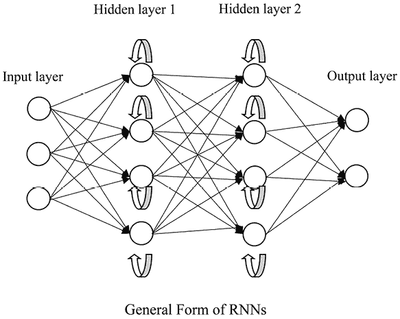

图 12.1：RNN 的一般形式

这种递归结构使得 RNN 能够很好地处理顺序数据，包括时间序列（如每日温度、每日产品销量和临床脑电图记录）以及具有顺序的通用连续数据（如句子中的单词和 DNA 序列）。以金融欺诈检测器为例，前一交易的输出特征会作为当前交易的训练输入。最终，对一笔交易的预测依赖于所有先前的交易。接下来，我将通过数学和可视化的方式解释递归机制。

假设我们有一些输入 *x*[t]。这里，*t* 代表时间步或顺序位置。在前馈神经网络中，我们通常假设不同 *t* 的输入是相互独立的。我们将时间步 *t* 时隐藏层的输出表示为 *h*[t] = *f*(*x*[t])，其中 *f* 是隐藏层的抽象函数。

这在下图中有所体现：

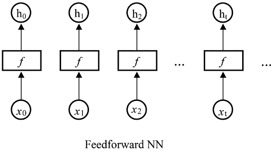

图 12.2：前馈神经网络的一般形式

相反，RNN 中的反馈循环将前一状态的信息传递给当前状态。在某一时间步 *t* 的 RNN 隐藏层输出可以表示为 *h*[t] = *f*(*h*[t][−1], *x*[t])。这在下图中有所体现：


图 12.3：随时间步展开的递归层

相同的任务，*f*，在序列的每个元素上执行，输出 *h*[t] 依赖于先前计算中生成的输出 *h*[t][−1]。这种链式结构捕获了迄今为止计算的“记忆”。这也是 RNN 在处理序列数据时如此成功的原因。

此外，由于递归结构的存在，RNN 在处理不同组合的输入序列和/或输出序列时也具有很大的灵活性。在接下来的章节中，我们将讨论基于输入和输出的不同 RNN 分类，包括以下内容：

+   多对一

+   一对多

+   多对多（同步）

+   多对多（未同步）

我们将从多对一 RNN 开始。

## 多对一 RNN

最直观的 RNN 类型可能是**多对一**。多对一 RNN 可以拥有任意数量的时间步输入序列，但在处理完整个序列后，它只会生成一个输出。以下图表展示了多对一 RNN 的一般结构：

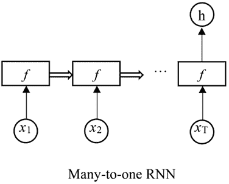

图 12.4：多对一 RNN 的一般形式

在这里，*f* 表示一个或多个递归隐藏层，每个隐藏层接收来自前一个时间步的输出。以下是三个隐藏层堆叠的示例：

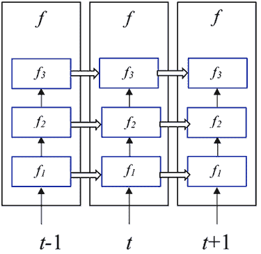

图 12.5：三个递归层堆叠的示例

多对一 RNN 广泛应用于序列数据的分类。情感分析就是一个很好的例子，其中 RNN 会读取整个客户评论，并分配一个情感评分（正面、 中立或负面情感）。类似地，我们也可以在新闻文章的主题分类中使用这种类型的 RNN。识别歌曲的类型是另一个应用，因为模型可以读取整个音频流。我们还可以使用多对一 RNN 来判断患者是否正在发生癫痫发作，这可以通过脑电图（EEG）迹线来实现。

## 一对多 RNN

**一对多** RNN 完全是多对一 RNN 的相反。它们仅接收一个输入（而非序列），并生成一系列输出。典型的一对多 RNN 如下图所示：

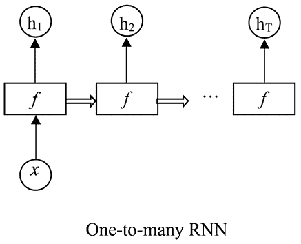

图 12.6：一对多 RNN 的一般形式

再次说明，*f* 代表一个或多个递归隐藏层。

请注意，这里的“一”指的是单个时间步或非序列输入，而不是输入特征的数量。

一对多 RNN 通常用作序列生成器。例如，我们可以根据起始音符和/或风格生成一段音乐。类似地，我们可以使用一对多 RNN 和指定的起始词像专业编剧一样编写电影剧本。图像标注是另一个有趣的应用：RNN 接受图像并输出图像的描述（一个句子的词语）。

## 多对多（同步）RNN

第三种类型的 RNN——多对多（同步）RNN，允许输入序列中的每个元素都有一个输出。让我们看看以下多对多（同步）RNN 中数据的流动方式：


图 12.7：多对多（同步）RNN 的一般形式

如你所见，每个输出都是基于其对应的输入和所有之前的输出计算得出的。

这种类型的 RNN 的一个常见应用场景是时间序列预测，在这里我们希望根据当前和之前观察到的数据，在每个时间步进行滚动预测。以下是一些我们可以利用多对多（同步）RNN 进行时间序列预测的例子：

+   一个商店每天的产品销售量

+   股票的每日收盘价

+   一个工厂每小时的电力消耗

它们还广泛用于解决自然语言处理（NLP）问题，包括词性标注、命名实体识别和实时语音识别。

## 多对多（不同步）RNN

有时，我们只希望在处理完整个输入序列之后再生成输出序列。这是多对多 RNN 的**不同步**版本。

请参考下图，了解一个多对多（不同步）RNN 的一般结构：

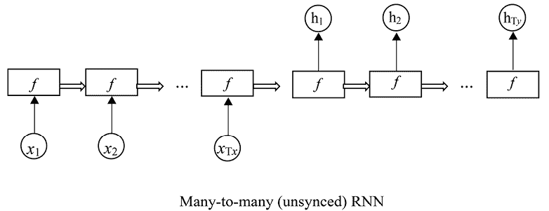

图 12.8：多对多（不同步）RNN 的一般形式

请注意，输出序列的长度（前面图中的 T*y*）可以与输入序列的长度（前面图中的 T*x*）不同。这为我们提供了一些灵活性。

这种类型的 RNN 是机器翻译的首选模型。例如，在法英翻译中，模型首先读取法语的完整句子，然后生成翻译后的英语句子。多步预测是另一个常见的例子：有时，我们被要求在给定过去一个月的数据时预测未来几天的销售额。

你现在已经了解了基于模型输入和输出的四种类型的 RNN。

等等，那一对一 RNN 呢？并没有这种东西。一对一只是一个普通的前馈模型。

在本章稍后的部分，我们将应用这些类型的 RNN 来解决项目问题，包括情感分析和词语生成。现在，让我们弄清楚如何训练一个 RNN 模型。

# 训练 RNN 模型

为了说明我们如何优化 RNN 的权重（参数），我们首先在网络上标注权重和数据，如下所示：

+   *U*表示连接输入层和隐藏层的权重。

+   *V*表示隐藏层与输出层之间的权重。请注意，这里我们仅使用一个递归层以简化问题。

+   *W*表示递归层的权重；即反馈层的权重。

+   *x*[t]表示时间步*t*的输入。

+   *s*[t]表示时间步*t*的隐藏状态。

+   *h*[t]表示时间步*t*的输出。

接下来，我们展开简单的 RNN 模型，涵盖三个时间步：*t* - 1，*t*，和*t* + 1，如下所示：

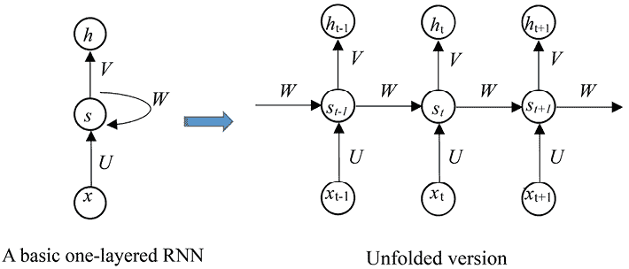

图 12.9：展开递归层

我们将层之间的数学关系描述如下：

+   我们让*a*表示隐藏层的激活函数。在 RNN 中，我们通常选择 tanh 或 ReLU 作为隐藏层的激活函数。

+   给定当前输入*x*[t]和之前的隐藏状态*s*[t][−1]，我们通过*s*[t] = *a*(*Ux*[t] + *Ws*[t][−1])计算当前的隐藏状态。

随时可以再读一遍*第六章*，*使用人工神经网络预测股票价格*，以复习你对神经网络的知识。

+   类似地，我们根据以下公式计算*s*[t][−1]：

*s*[t][-2]:*s*[t][-1]=a(*Ux*[t][-1]+*Ws*[t][-2])

+   我们重复这个过程，直到*s*[1]，它依赖于：

*s*[0]:*s*[1]=a(*Ux*[1]+*Ws*[0])

我们通常将*s*[0]设置为全零。

+   我们让*g*表示输出层的激活函数。如果我们想执行二分类任务，它可以是一个 sigmoid 函数；对于多分类任务，它可以是 softmax 函数；对于回归问题，它可以是一个简单的线性函数（即没有激活函数）。

+   最后，我们计算时间步*t*的输出：

*h*[t]:*h*[t]=*g*(*Vs*[t])

由于隐藏状态在各个时间步之间的依赖关系（即，*s*[t]依赖于*s*[t][−1]，*s*[t][−1]依赖于*s*[t][−2]，以此类推），递归层为网络引入了记忆，它能够捕捉并保留所有之前时间步的信息。

就像我们在传统神经网络中做的那样，我们应用反向传播算法来优化 RNN 中的所有权重：*U*、*V*和*W*。然而，正如你可能已经注意到的，某个时间步的输出间接地依赖于所有之前的时间步（*h*^t 依赖于*s*[t]，而*s*[t]依赖于所有之前的时间步）。因此，我们需要计算当前时间步之外的所有先前时间步的损失。因此，权重的梯度是这样计算的。例如，如果我们想要计算时间步*t* = 4 的梯度，我们需要反向传播前四个时间步（*t* = 3，*t* = 2，*t* = 1，*t* = 0），并将这五个时间步的梯度加总起来。这种版本的反向传播算法被称为**时间反向传播**（**BPTT**）。

循环神经网络（RNN）的结构使其能够从输入序列的最开始捕捉信息。这提升了序列学习的预测能力。你可能会想，传统的 RNN 能否处理长序列。理论上它们是可以的，但实际上由于**梯度消失**问题，它们无法有效处理长序列。梯度消失意味着梯度在长时间步长下会变得极小，从而阻碍了权重的更新。我将在下一节详细解释这个问题，并介绍一种变体架构——LSTM，它有助于解决这一问题。

# 通过 LSTM 克服长期依赖问题

让我们从传统 RNN 的梯度消失问题开始。这个问题是怎么产生的呢？回想一下，在反向传播过程中，梯度会随着每个时间步的传递而衰减（即，*s*[t]=*a*(*Ux*[t]+*Ws*[t-1])；长输入序列中的早期元素对当前梯度的计算几乎没有贡献。这意味着传统 RNN 只能捕捉短时间窗口内的时序依赖。然而，时间步之间的远距离依赖有时是预测中的关键信号。包括 LSTM 和**门控循环单元**（**GRU**）在内的 RNN 变体正是为了解决需要学习长期依赖关系的问题。

本书将重点介绍 LSTM，因为它比 GRU 更为流行。LSTM 是十年前提出的，比 GRU 更成熟。如果你有兴趣深入了解 GRU 及其应用，可以查阅 Yuxi Hayden Liu（Packt Publishing）所著的《Hands-On Deep Learning Architectures with Python》一书。

在 LSTM 中，我们使用了一个门控机制来处理长期依赖。它的“魔力”来源于一个记忆单元和三个基于循环单元的门控结构。“门”（gate）这个词源自于电路中的逻辑门（[`en.wikipedia.org/wiki/Logic_gate`](https://en.wikipedia.org/wiki/Logic_gate)）。它本质上是一个 Sigmoid 函数，其输出值范围从 `0` 到 `1`。`0` 表示“关闭”逻辑，而 `1` 表示“开启”逻辑。

LSTM 版本的循环单元如下图所示，在传统版本之后以便对比：

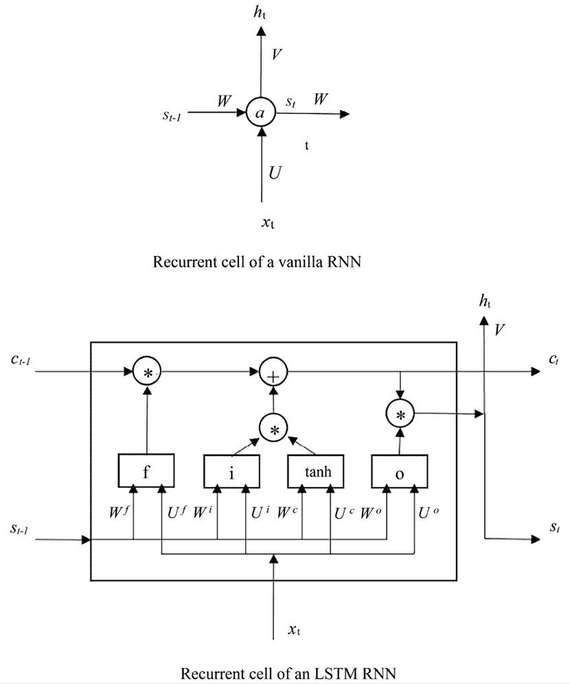

图 12.10：传统 RNN 和 LSTM RNN 的循环单元对比

让我们从左到右详细看一下 LSTM 循环单元：

+   *c*[t] 是**记忆单元**。它从输入序列的最开始就开始记忆信息。

+   *f* 代表**遗忘门**。它决定了从之前的记忆状态 *c*[t][−1] 中需要遗忘多少信息，或者换句话说，需要传递多少信息。设 *W*^f 为遗忘门和先前隐藏状态 *s*[t][−1] 之间的权重，*U*^f 为遗忘门和当前输入 *x*[t] 之间的权重。

+   *i* 代表 **输入门**。它控制从当前输入中传递多少信息。*W*^i 和 *U*^i 是连接输入门与前一个隐藏状态 *s*[t][−1] 和当前输入 *x*[t] 的权重。

+   *tanh* 是隐藏状态的激活函数。它充当了普通 RNN 中的 *a*。它的输出是基于当前输入 *x*[t]，以及相关的权重 *U*^c，前一个隐藏状态 *s*[t][−1] 和相应的权重 *W*^c 计算出来的。

+   `o` 作为 **输出门**。它定义了从内部记忆中提取多少信息作为整个循环单元的输出。像往常一样，*W*^o 和 *U*^o 是分别与前一个隐藏状态和当前输入相关的权重。

我们描述这些组件之间的关系如下：

+   忘记门的输出，*f*，在时间步 *t* 的计算为：

*f* = *sigmoid*(*W*^f * s*[t-1] + *U*^f * x*[t])

+   输入门的输出，*i*，在时间步* t *的计算为：

*i* = *sigmoid*(*W*^i * s*[t-1] + *U*^i * x*[t])

+   tanh 激活函数的输出，*c’*，在时间步 *t* 的计算为：

*c’* = *tanh*(*W*^c * s*[t-1] + *U*^c * x*[t])

+   输出门的输出，*o*，在时间步 *t* 的计算为：

*o* = *sigmoid*(*W*^o * s*[t-1] + *U*^o * x*[t])

+   记忆单元 *c*[t] 在时间步 *t* 被更新为 *c*[t] = *f*.**c*[t-1] + *i*.**c’*（其中，操作符 .* 表示逐元素乘法）。同样，sigmoid 函数的输出值在 0 到 1 之间。因此，忘记门 *f* 和输入门 *i* 分别控制从先前的记忆 *c*[t][−1] 和当前记忆输入 *c’* 中携带多少信息。

+   最后，我们通过 *s*[t] = *o*.**c*[t] 更新隐藏状态 *s*[t]，其中 *o* 是输出门，控制更新后的记忆单元 *c*[t] 被用于整个单元的输出的程度。

**最佳实践**

LSTM 通常被认为是实际应用中 RNN 模型的默认选择，因为它能够有效地捕捉序列数据中的长期依赖关系，同时缓解梯度消失问题。然而，GRU 也常用于特定任务和数据集特征的情况下。LSTM 和 GRU 的选择取决于以下因素：

+   **模型复杂度**：LSTM 通常比 GRU 有更多的参数，因为它们有额外的门控机制。如果你有有限的计算资源或处理较小的数据集，GRU 由于其更简单的架构可能更适合。

+   **训练速度**：GRU 通常比 LSTM 训练速度更快。如果训练时间是一个考虑因素，GRU 可能是更好的选择。

+   **性能**：LSTM 通常在需要建模序列数据中长期依赖关系的任务中表现更好。如果你的任务涉及捕捉复杂的时间模式并且担心过拟合，那么 LSTM 可能更合适。

一如既往，我们应用**BPTT**算法训练 LSTM RNN 中的所有权重，包括与三个门和 tanh 激活函数相关的四组权重，分别是*U*和*W*。通过学习这些权重，LSTM 网络高效地显式建模了长期依赖关系。因此，LSTM 是实际应用中首选的 RNN 模型。

接下来，您将学习如何使用 LSTM RNN 解决实际问题。我们将从对电影评论情感进行分类开始。

# 使用 RNN 分析电影评论情感

现在，进入我们的第一个 RNN 项目：电影评论情感分析。我们将以 IMDb（[`www.imdb.com/`](https://www.imdb.com/)）电影评论数据集（[`ai.stanford.edu/~amaas/data/sentiment/`](https://ai.stanford.edu/~amaas/data/sentiment/)）为例。该数据集包含 25,000 条用于训练的高人气电影评论和另外 25,000 条用于测试的评论。每条评论都标记为 1（正面）或 0（负面）。我们将通过以下三个部分构建基于 RNN 的电影情感分类器：*分析与预处理电影评论数据，开发简单的 LSTM 网络*，以及*通过多个 LSTM 层提升性能*。

## 数据分析与预处理

我们将从数据分析和预处理开始，具体步骤如下：

1.  PyTorch 的`torchtext`内置了 IMDb 数据集，因此我们首先加载该数据集：

    ```py
    >>> from torchtext.datasets import IMDB
    >>> train_dataset = list(IMDB(split='train'))
    >>> test_dataset = list(IMDB(split='test'))
    >>> print(len(train_dataset), len(test_dataset))
    25000 25000 
    ```

我们将加载 25,000 个训练样本和 25,000 个测试样本。

如果在运行代码时遇到任何错误，请考虑安装`torchtext`和`portalocker`包。你可以使用以下命令通过`conda`安装：

```py
conda install -c torchtext
conda install -c conda-forge portalocker 
```

或者，通过`pip`安装：

```py
pip install portalocker 
```

1.  现在，让我们探索训练集中的词汇：

    ```py
    >>> import re
    >>> from collections import Counter, OrderedDict
    >>> def tokenizer(text):
            text = re.sub('<[^>]*>', '', text)
            emoticons = re.findall('(?::|;|=)(?:-)?(?:\)|\(|D|P)', text.lower())
            text = re.sub('[\W]+', ' ', text.lower()) +\
                                  ' '.join(emoticons).replace('-', '')
            tokenized = text.split()
            return tokenized
    >>>
    >>> token_counts = Counter()
    >>> train_labels = []
    >>> for label, line in train_dataset:
            train_labels.append(label)
            tokens = tokenizer(line)
            token_counts.update(tokens)
    >>> print('Vocab-size:', len(token_counts))
    Vocab-size: 75977
    >>> print(Counter(train_labels))
    Counter({1: 12500, 2: 12500}) 
    ```

在这里，我们定义一个函数，从给定的文档（在本例中为电影评论）中提取令牌（单词）。该函数首先移除类似 HTML 的标签，然后提取并标准化表情符号，去除非字母数字字符，并将文本分割成单词列表以供进一步处理。我们将令牌及其出现次数存储在`Counter`对象`token_counts`中。

如上所示，训练集包含大约 76,000 个独特的词汇，并且正负样本数量完全平衡，正样本标记为“`2`”，负样本标记为“`1`”。

1.  我们将词汇令牌输入到嵌入层`nn.Embedding`中。嵌入层需要整数输入，因为它专门设计用于处理离散的类别数据（如单词索引），并将其转化为神经网络可以处理并学习的连续表示。因此，我们需要首先将每个令牌编码为唯一的整数，如下所示：

    ```py
    >>> from torchtext.vocab import vocab
    >>> sorted_by_freq_tuples = sorted(token_counts.items(), key=lambda x: x[1],
                                       reverse=True)
    >>> ordered_dict = OrderedDict(sorted_by_freq_tuples)
    >>> vocab_mapping = vocab(ordered_dict) 
    ```

我们使用 PyTorch 中的`vocab`模块，根据语料库中单词的频率创建词汇表（令牌映射）。但这个词汇表还不完整，接下来两个步骤我们将说明原因。

1.  在检查训练集中文档的长度时，你会注意到它们的长度从 10 个词到 2498 个词不等。通常的做法是对序列进行填充，以确保批处理时长度一致。因此，我们将特殊符号`"<pad>"`（表示填充）插入词汇映射，位置为索引`0`，作为**占位符**：

    ```py
    >>> vocab_mapping.insert_token("<pad>", 0) 
    ```

1.  我们还需要在推理过程中处理未见过的单词。与之前的步骤类似，我们将特殊符号`"<unk>"`（代表“未知”）插入到词汇映射中，位置为索引`1`。该符号表示词汇表外的单词或在训练数据中找不到的单词：

    ```py
    >>> vocab_mapping.insert_token("<unk>", 1)
    >>> vocab_mapping.set_default_index(1) 
    ```

我们还将默认的词汇映射设置为`1`。这意味着`"<unk>"`（索引 1）被用作未见过的或词汇表外单词的默认索引。

让我们来看一下以下示例，展示给定单词的映射，包括一个未见过的单词：

```py
>>> print([vocab_mapping[token] for token in ['this', 'is', 'an', 'example']])
[11, 7, 35, 462]
>>> print([vocab_mapping[token] for token in ['this', 'is', 'example2']])
[11, 7, 1] 
```

到目前为止，我们已经完成了完整的词汇映射。

**最佳实践**

在 RNN 中使用特殊符号如`<pad>`和`<unk>`是处理变长序列和词汇表外单词的常见做法。以下是它们使用的一些最佳实践：

+   使用`<pad>`符号将序列填充为固定长度。这样可以确保所有输入序列具有相同的长度，这是神经网络中高效批处理所必需的。将填充添加到序列的末尾，而不是开头，以保持输入数据的顺序。在对文本数据进行分词时，为`<pad>`符号分配一个唯一的整数索引，并确保它在嵌入矩阵中对应一个零向量。

+   使用`<unk>`符号表示不在模型词汇表中的词汇表外单词。在推理时，将任何不在词汇表中的单词替换为`<unk>`符号，以确保模型能够处理输入。

+   在训练过程中，排除`<pad>`符号对损失的贡献，以避免扭曲学习过程。

+   监控数据集中`<unk>`符号的分布，以评估词汇表外单词的普遍性，并相应地调整词汇表的大小。

1.  接下来，我们定义一个函数，定义如何将样本批次进行整理：

    ```py
    >>> import torch
    >>> import torch.nn as nn
    >>> device = torch.device("cuda" if torch.cuda.is_available() else "cpu")
    >>> text_transform = lambda x: [vocab[token] for token in tokenizer(x)]
    >>> def collate_batch(batch):
            label_list, text_list, lengths = [], [], []
            for _label, _text in batch:
                label_list.append(1\. if _label == 2 else 0.)
                processed_text = [vocab_mapping[token] for token in tokenizer(_text)] 
                text_list.append(torch.tensor(processed_text, dtype=torch.int64))
                lengths.append(len(processed_text))
            label_list = torch.tensor(label_list)
            lengths = torch.tensor(lengths)
            padded_text_list = nn.utils.rnn.pad_sequence(
                                    text_list, batch_first=True)
            return padded_text_list.to(device), label_list.to(device),
                                                          lengths.to(device) 
    ```

除了像以前那样生成输入和标签输出外，我们还会生成给定批次中每个样本的长度信息。注意，在这里我们将原始标签中的正标签从 2 转换为 1，以进行标签标准化和适配二元分类的损失函数。长度信息用于高效处理变长序列。取一个包含四个样本的小批次，并检查处理后的批次：

```py
>>> from torch.utils.data import DataLoader
>>> torch.manual_seed(0)
>>> dataloader = DataLoader(train_dataset, batch_size=4, shuffle=True,
                            collate_fn=collate_batch)
>>> text_batch, label_batch, length_batch = next(iter(dataloader))
>>> print(text_batch)
tensor([[   46,     8,   287,    21,    16,     2,    76,  3987,     3,   226, 10,   381,     2,   461,    14,    65,     9,  1208,    17,     8, 13,   856,     2,   156,    70,   398,    50,    32,  2338,    67, 103,     6,   110,    19,     9,     2,   130,     2,   153,    12, 14,    65,  1002,    14,     4,  1143,   226,     6,  1061,    31, 2,  1317,   293,    10,    61,   542,  1459,    24,     6,   105,
...
...
...
0,     0,     0,     0,     0,     0,     0,     0,     0,     0, 0,     0,     0,     0,     0,     0,     0,     0,     0,     0, 0,     0,     0,     0,     0,     0,     0]], device='cuda:0')
>>> print(label_batch)
>>> tensor([0., 1., 1., 0.], device='cuda:0')
>>> print(length_batch)
tensor([106,  76, 247, 158], device='cuda:0')
>>> print(text_batch.shape)
torch.Size([4, 247]) 
```

你可以看到，处理过的文本序列已标准化为 247 个标记的长度，第一、第二和第四个样本使用 0 进行填充。

1.  最后，我们对训练集和测试集进行批处理：

    ```py
    >>> batch_size = 32
    >>> train_dl = DataLoader(train_dataset, batch_size=batch_size, 
                              shuffle=True, collate_fn=collate_batch)
    >>> test_dl = DataLoader(test_dataset, batch_size=batch_size,
                             shuffle=False, collate_fn=collate_batch) 
    ```

生成的数据加载器已准备好用于情感预测。

让我们继续构建 LSTM 网络。

## 构建一个简单的 LSTM 网络

现在，训练和测试数据加载器已经准备好，我们可以构建第一个 RNN 模型，该模型包含一个将输入单词标记编码的嵌入层，一个 LSTM 层，随后是一个全连接层：

1.  首先，我们定义网络超参数，包括输入维度和嵌入层的嵌入维度：

    ```py
    >>> vocab_size = len(vocab_mapping)
    >>> embed_dim = 32 
    ```

我们还定义了 LSTM 层和全连接层中的隐藏节点数量：

```py
>>> rnn_hidden_dim = 50
>>> fc_hidden_dim = 32 
```

1.  接下来，我们构建我们的 RNN 模型类：

    ```py
    >>> class RNN(nn.Module):
            def __init__(self, vocab_size, embed_dim, rnn_hidden_dim, fc_hidden_dim):
                super().__init__()
                self.embedding = nn.Embedding(vocab_size,
                                              embed_dim,
                                              padding_idx=0)
                self.rnn = nn.LSTM(embed_dim, rnn_hidden_dim,
                                   batch_first=True)
                self.fc1 = nn.Linear(rnn_hidden_dim, fc_hidden_dim)
                self.relu = nn.ReLU()
                self.fc2 = nn.Linear(fc_hidden_dim, 1)
                self.sigmoid = nn.Sigmoid()
            def forward(self, text, lengths):
                out = self.embedding(text)
                out = nn.utils.rnn.pack_padded_sequence(
                                                out, lengths.cpu().numpy(),
                                              enforce_sorted=False,
                                              batch_first=True)
                out, (hidden, cell) = self.rnn(out)
                out = hidden[-1, :, :]
                out = self.fc1(out)
                out = self.relu(out)
                out = self.fc2(out)
                out = self.sigmoid(out)
                return out 
    ```

`nn.Embedding`层用于将输入的单词索引转换为密集的词嵌入。`padding_idx`参数设置为 0，表示在嵌入过程中应忽略填充标记。

递归层`nn.LSTM`接受嵌入的输入序列并按顺序处理。`batch_first=True`表示输入的第一维是批次大小。

全连接隐藏层`fc1`位于 LSTM 层之后，对全连接层的输出应用 ReLU 激活函数。

最后一层只有一个输出，因为该模型用于二分类（情感分析）。

在前向传递方法中，`pack_padded_sequence`用于打包和填充序列，以便在 LSTM 层中高效处理。打包后的序列通过 LSTM 层处理，并提取最终的隐藏状态（`hidden[-1, :, :]`）。

1.  接着，我们创建一个 LSTM 模型的实例，使用我们之前定义的特定超参数。我们还确保将模型放置在指定的计算设备上（如果有 GPU，则使用 GPU）进行训练和推理：

    ```py
    >>> model = RNN(vocab_size, embed_dim, rnn_hidden_dim, fc_hidden_dim)
    >>> model = model.to(device) 
    ```

1.  至于损失函数，我们使用`nn.BCELoss()`，因为这是一个二分类问题。我们还设置了相应的优化器，并尝试使用学习率为`0.003`，如下所示：

    ```py
    >>> loss_fn = nn.BCELoss()
    >>> optimizer = torch.optim.Adam(model.parameters(), lr=0.003) 
    ```

1.  现在，我们定义一个训练函数，负责训练模型进行一次迭代：

    ```py
    >>> def train(model, dataloader, optimizer):
            model.train()
            total_acc, total_loss = 0, 0
            for text_batch, label_batch, length_batch in dataloader:
                optimizer.zero_grad()
                pred = model(text_batch, length_batch)[:, 0]
                loss = loss_fn(pred, label_batch)
                loss.backward()
                optimizer.step()
                total_acc += ((pred>=0.5).float() == label_batch)
                                                      .float().sum().item()
                total_loss += loss.item()*label_batch.size(0)
            total_loss /= len(dataloader.dataset)
            total_acc /= len(train_dl.dataset)
            print(f'Epoch {epoch+1} - loss: {total_loss:.4f} - accuracy:
                   {total_acc:.4f}') 
    ```

它还显示了每次迭代结束时的训练损失和准确率。

1.  然后，我们训练模型 10 次迭代：

    ```py
    >>> torch.manual_seed(0)
    >>> num_epochs = 10
    >>> for epoch in range(num_epochs):
            train(model, train_dl, optimizer)
    Epoch 1 - loss: 0.5899 - accuracy: 0.6707
    Epoch 2 - loss: 0.4354 - accuracy: 0.8019
    Epoch 3 - loss: 0.2762 - accuracy: 0.8888
    Epoch 4 - loss: 0.1766 - accuracy: 0.9341
    Epoch 5 - loss: 0.1215 - accuracy: 0.9563
    Epoch 6 - loss: 0.0716 - accuracy: 0.9761
    Epoch 7 - loss: 0.0417 - accuracy: 0.9868
    Epoch 8 - loss: 0.0269 - accuracy: 0.9912
    Epoch 9 - loss: 0.0183 - accuracy: 0.9943
    Epoch 10 - loss: 0.0240 - accuracy: 0.9918 
    ```

经过 10 次迭代后，训练准确率接近 100%。

1.  最后，我们在测试集上评估性能：

    ```py
    >>> def evaluate(model, dataloader):
            model.eval()
            total_acc = 0
            with torch.no_grad():
            for text_batch, label_batch, lengths in dataloader:
                pred = model(text_batch, lengths)[:, 0]
                total_acc += ((pred>=0.5).float() == label_batch)
                                                     .float().sum().item()
    print(f'Accuracy on test set: {100 * total_acc/len(dataloader.dataset)} %')
    >>> evaluate(model, test_dl)
    Accuracy on test set: 86.1 % 
    ```

我们获得了 86%的测试准确率。

## 堆叠多个 LSTM 层

我们还可以堆叠两个（或更多）递归层。以下图示展示了如何堆叠两个递归层：

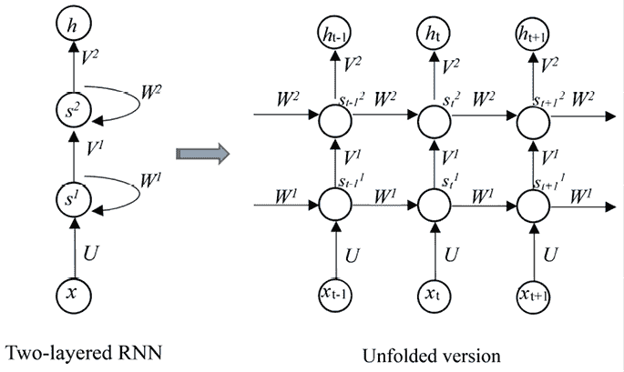

图 12.11：展开两个堆叠的递归层

在 PyTorch 中，堆叠多个 RNN 层非常简单。以 LSTM 为例，只需在`num_layers`参数中指定 LSTM 层的数量：

```py
>>> nn.LSTM(embed_dim, rnn_hidden_dim, num_layers=2, batch_first=True) 
```

在这个例子中，我们堆叠了两个 LSTM 层。可以尝试使用多层 RNN 模型，看看是否能超过之前的单层模型。

至此，我们刚刚完成了使用 RNN 进行情感分类项目的回顾。在下一个项目中，我们将重新探讨股票价格预测，并使用 RNN 解决它。

# 使用 LSTM 重新预测股票价格

回想一下在*第六章*《使用人工神经网络预测股票价格》中，我们从过去的价格和特定时间步内的表现中提取特征，然后训练标准神经网络。在本例中，我们将利用 RNN 作为顺序模型，利用五个连续时间步的特征，而不仅仅是一个。让我们通过以下步骤来查看过程：

1.  最初，我们加载股票数据，创建特征和标签，然后将其拆分为训练集和测试集，模仿我们在*第六章*中的做法：

    ```py
    >>> data_raw = pd.read_csv('19900101_20230630.csv', index_col='Date')
    >>> data = generate_features(data_raw)
    >>> start_train = '1990-01-01'
    >>> end_train = '2022-12-31'
    >>> start_test = '2023-01-01'
    >>> end_test = '2023-06-30'
    >>> data_train = data.loc[start_train:end_train]
    >>> X_train = data_train.drop('close', axis=1).values
    >>> y_train = data_train['close'].values
    >>> data_test = data.loc[start_test:end_test]
    >>> X_test = data_test.drop('close', axis=1).values
    >>> y_test = data_test['close'].values 
    ```

在这里，我们重用了在*第六章*中定义的特征和标签生成函数`generate_features`。类似地，我们使用`StandardScaler`对特征空间进行缩放，并将数据转换为`FloatTensor`：

```py
>>> from sklearn.preprocessing import StandardScaler
>>> scaler = StandardScaler()
>>> X_scaled_train = torch.FloatTensor(scaler.fit_transform(X_train))
>>> X_scaled_test = torch.FloatTensor(scaler.transform(X_test))
>>> y_train_torch = torch.FloatTensor(y_train)
>>> y_test_torch = torch.FloatTensor(y_test) 
```

1.  接下来，我们定义一个函数来创建序列：

    ```py
    >>> def create_sequences(data, labels, seq_length):
            sequences = []
            for i in range(len(data) - seq_length):
                seq = data[i:i+seq_length]
                label = labels[i+seq_length-1]
                sequences.append((seq, label))
            return sequences
    >>> seq_length = 5
    >>> sequence_train = create_sequences(X_scaled_train, y_train_torch, seq_length)
    >>> sequence_test = create_sequences(X_scaled_test, y_test_torch, seq_length) 
    ```

在这里，每个生成的序列由两部分组成：输入序列，包含五天连续的特征；标签，表示这五天期间最后一天的价格。我们分别为训练集和测试集生成序列。

1.  随后，我们为训练序列建立一个数据加载器，为模型构建和训练做准备：

    ```py
    >>> batch_size = 128
    >>> train_dl = DataLoader(sequence_train, batch_size=batch_size,
                              shuffle=True) 
    ```

在这个项目中，我们将批量大小设置为 128。

1.  现在，我们定义一个包含两层 LSTM 的 RNN 模型，后接一个全连接层和一个回归输出层：

    ```py
    >>> class RNN(nn.Module):
            def __init__(self, input_dim, rnn_hidden_dim, fc_hidden_dim):
                super().__init__()
                self.rnn = nn.LSTM(input_dim, rnn_hidden_dim, 2,
                                   batch_first=True)
                self.fc1 = nn.Linear(rnn_hidden_dim, fc_hidden_dim)
                self.relu = nn.ReLU()
                self.fc2 = nn.Linear(fc_hidden_dim, 1)
            def forward(self, x):
                out, (hidden, cell) = self.rnn(x)
                out = hidden[-1, :, :]
                out = self.fc1(out)
                out = self.relu(out)
                out = self.fc2(out)
                return out 
    ```

LSTM 层捕捉输入数据中的顺序依赖性，全连接层执行最终的回归任务。

1.  接下来，我们在指定输入维度和隐层维度后初始化模型，并使用 MSE 作为损失函数：

    ```py
    >>> rnn_hidden_dim = 16
    >>> fc_hidden_dim = 16
    >>> model = RNN(X_train.shape[1], rnn_hidden_dim, fc_hidden_dim)
    >>> device = torch.device("cuda" if torch.cuda.is_available() else "cpu")
    >>> model = model.to(device)
    >>> loss_fn = nn.MSELoss()
    >>> optimizer = torch.optim.Adam(model.parameters(), lr=0.01) 
    ```

小到中等的数值（如 16）通常作为 RNN 隐层维度的起始值，以提高计算效率。所选的优化器（Adam）和学习率（`0.01`）是可以调优的超参数，以获得更好的性能。

1.  接下来，我们将模型训练 1000 次，步骤如下：

    ```py
    >>> def train(model, dataloader, optimizer):
            model.train()
            total_loss = 0
            for seq, label in dataloader:
                optimizer.zero_grad()
                pred = model(seq.to(device))[:, 0]
                loss = loss_fn(pred, label.to(device))
                loss.backward()
                optimizer.step()
                total_loss += loss.item()*label.size(0)
            return total_loss/len(dataloader.dataset)
    >>> num_epochs = 1000
    >>> for epoch in range(num_epochs):
    >>>     loss = train(model, train_dl, optimizer)
    >>>     if epoch % 100 == 0:
    >>>         print(f'Epoch {epoch+1} - loss: {loss:.4f}')
    Epoch 1 - loss: 24611083.8868
    Epoch 101 - loss: 5483.5394
    Epoch 201 - loss: 11613.8535
    Epoch 301 - loss: 4459.1431
    Epoch 401 - loss: 4646.8745
    Epoch 501 - loss: 4046.1726
    Epoch 601 - loss: 3583.5710
    Epoch 701 - loss: 2846.1768
    Epoch 801 - loss: 2417.1702
    Epoch 901 - loss: 2814.3970 
    ```

训练期间每 100 次迭代显示一次 MSE。

1.  最后，我们将训练好的模型应用于测试集并评估性能：

    ```py
    >>> predictions, y = [], []
    >>> for seq, label in sequence_test:
            with torch.no_grad():
                pred = model.cpu()(seq.view(1, seq_length, X_test.shape[1]))[:, 0]
                predictions.append(pred)
                y.append(label)
    >>> from sklearn.metrics import mean_squared_error, mean_absolute_error, r2_score
    >>> print(f'R²: {r2_score(y, predictions):.3f}')
    R²: 0.897 
    ```

我们在测试集上获得了`R`²为`0.9`的结果。你可能会注意到，这并未超越我们之前的标准神经网络。原因是我们的训练数据集相对较小，仅有八千个样本。RNN 通常需要更大的数据集才能表现优异。

到目前为止，我们探讨的两个 RNN 模型都遵循了多对一结构。在接下来的项目中，我们将使用多对多结构创建一个 RNN，目标是生成一部“小说”。

# 使用 RNN 编写自己的《战争与和平》

在这个项目中，我们将解决一个有趣的语言建模问题——文本生成。

基于 RNN 的文本生成器可以根据我们输入的文本生成任何内容。训练文本可以来自小说，如*权力的游戏*，莎士比亚的诗歌，或电影剧本如*黑客帝国*。如果模型训练良好，生成的人工文本应与原文相似（但不完全相同）。在这一部分，我们将使用 RNN 编写我们自己的*战争与和平*，这是俄罗斯作家列夫·托尔斯泰所著的一部小说。你也可以根据你喜欢的任何书籍训练自己的 RNN。

我们将在构建训练集之前进行数据获取和分析。之后，我们将构建并训练一个用于文本生成的 RNN 模型。

## 获取和分析训练数据

我建议从目前不受版权保护的书籍中下载文本数据进行训练。《古腾堡计划》([www.gutenberg.org](https://www.gutenberg.org))是一个很好的选择，它提供超过 60,000 本版权已过期的免费电子书。

原作*战争与和平*可以从[`www.gutenberg.org/ebooks/2600`](http://www.gutenberg.org/ebooks/2600)下载，但请注意，需要进行一些清理工作，如去除额外的开头部分“*The Project Gutenberg EBook*”、目录和纯文本 UTF-8 文件的额外附录“*End of the Project Gutenberg EBook of War and Peace*”([`www.gutenberg.org/files/2600/2600-0.txt`](http://www.gutenberg.org/files/2600/2600-0.txt))。因此，我们将直接从[`cs.stanford.edu/people/karpathy/char-rnn/warpeace_input.txt`](https://cs.stanford.edu/people/karpathy/char-rnn/warpeace_input.txt)下载已清理的文本文件。让我们开始吧：

1.  首先，我们读取文件并将文本转换为小写字母：

    ```py
    >>> with open('warpeace_input.txt', 'r', encoding="utf8") as fp:
            raw_text = fp.read()
    >>> raw_text = raw_text.lower() 
    ```

1.  接着，我们通过打印出前 200 个字符来快速查看训练文本数据：

    ```py
    >>> print(raw_text[:200])
    "well, prince, so genoa and lucca are now just family estates of the
    buonapartes. but i warn you, if you don't tell me that this means war,
    if you still try to defend the infamies and horrors perpetr 
    ```

1.  接下来，我们统计唯一单词的数量：

    ```py
    >>> all_words = raw_text.split()
    >>> unique_words = list(set(all_words))
    >>> print(f'Number of unique words: {len(unique_words)}')
    Number of unique words: 39830 
    ```

然后，我们统计总字符数：

```py
>>> n_chars = len(raw_text)
>>> print(f'Total characters: {n_chars}')
Total characters: 3196213 
```

1.  从这 300 万个字符中，我们获得唯一的字符，如下所示：

    ```py
    >>> chars = sorted(list(set(raw_text)))
    >>> vocab_size = len(chars)
    >>> print(f'Total vocabulary (unique characters): {vocab_size}')
    Total vocabulary (unique characters): 57
    >>> print(chars)
    ['\n', ' ', '!', '"', "'", '(', ')', '*', ',', '-', '.', '/', '0', '1', '2', '3', '4', '5', '6', '7', '8', '9', ':', ';', '=', '?', 'a', 'b', 'c', 'd', 'e', 'f', 'g', 'h', 'i', 'j', 'k', 'l', 'm', 'n', 'o', 'p', 'q', 'r', 's', 't', 'u', 'v', 'w', 'x', 'y', 'z', 'à', 'ä', 'é', 'ê', '\ufeff'] 
    ```

原始训练文本由 57 个唯一字符和接近 40,000 个唯一单词组成。生成单词的难度远大于生成字符，因为生成单词需要一步计算 40,000 个概率，而生成字符只需要一步计算 57 个概率。因此，我们将字符视为一个 token，词汇表由 57 个字符组成。

那么，我们如何将字符输入到 RNN 模型中并生成输出字符呢？我们将在下一部分中见到。

## 为 RNN 文本生成器构建训练集

回顾一下，在一个同步的“多对多”RNN 中，网络接受一个序列并同时生成一个序列；模型捕捉序列中各元素之间的关系，并基于学习到的模式生成一个新的序列。对于我们的文本生成器，我们可以输入固定长度的字符序列，让它生成相同长度的序列，其中每个输出序列比输入序列向右偏移一个字符。以下示例将帮助你更好地理解这一点。

假设我们有一个原始文本样本“`learning`”，并且我们希望序列长度为 5。在这种情况下，我们可以有一个输入序列“`learn`”和一个输出序列“`earni`”。我们可以将它们输入到网络中，如下所示：

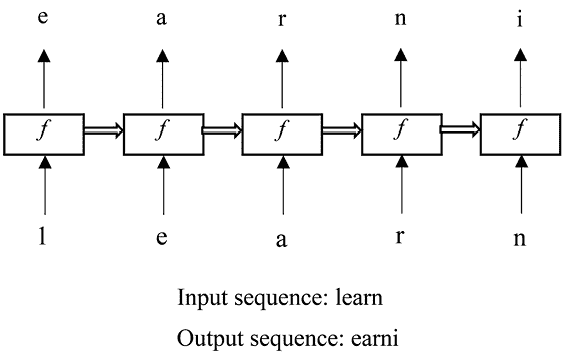

图 12.12：将训练集（“learn”，“earni”）输入 RNN

我们刚刚构造了一个训练样本`("learn","` “`earni`")。类似地，要从整个原始文本构造训练样本，首先，我们需要将原始文本拆分成固定长度的序列，*X*；然后，我们需要忽略原始文本的第一个字符，并将其拆分成与原序列长度相同的序列，*Y*。*X*中的一个序列是训练样本的输入，而*Y*中的对应序列是样本的输出。假设我们有一个原始文本样本“machine learning by example”，并且我们将序列长度设置为 5，我们将构造以下训练样本：

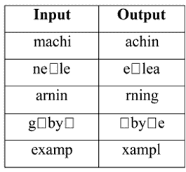

图 12.13：从“machine learning by example”构建的训练样本

在这里，表示空格。请注意，剩余的子序列“le”长度不足，因此我们将其丢弃。

我们还需要对输入和输出字符进行独热编码，因为神经网络模型只接受数字数据。我们简单地将 57 个独特字符映射到从 0 到 56 的索引，如下所示：

```py
>>> index_to_char = dict((i, c) for i, c in enumerate(chars))
>>> char_to_index = dict((c, i) for i, c in enumerate(chars))
>>> print(char_to_index)
{'\n': 0, ' ': 1, '!': 2, '"': 3, "'": 4, '(': 5, ')': 6, '*': 7, ',': 8, '-': 9, '.': 10, '/': 11, '0': 12, '1': 13, '2': 14, '3': 15, '4': 16, '5': 17, '6': 18, '7': 19, '8': 20, '9': 21, ':': 22, ';': 23, '=': 24, '?': 25, 'a': 26, 'b': 27, 'c': 28, 'd': 29, 'e': 30, 'f': 31, 'g': 32, 'h': 33, 'i': 34, 'j': 35, 'k': 36, 'l': 37, 'm': 38, 'n': 39, 'o': 40, 'p': 41, 'q': 42, 'r': 43, 's': 44, 't': 45, 'u': 46, 'v': 47, 'w': 48, 'x': 49, 'y': 50, 'z': 51, 'à': 52, 'ä': 53, 'é': 54, 'ê': 55, '\ufeff': 56} 
```

例如，字符`c`变成了一个长度为 57 的向量，其中索引 28 的位置为`1`，其他索引位置都是`0`；字符`h`变成了一个长度为 57 的向量，其中索引 33 的位置为`1`，其他索引位置都是`0`。

现在字符查找字典已经准备好了，我们可以构建整个训练集，如下所示：

```py
>>> import numpy as np
>>> text_encoded = np.array(char_to_index[ch] for ch in raw_text],
                            dtype=np.int32)
>>> seq_length = 40
>>> chunk_size = seq_length + 1
>>> text_chunks = np.array([text_encoded[i:i+chunk_size]
                     for i in range(len(text_encoded)-chunk_size+1)]) 
```

在这里，我们将序列长度设置为`40`，并获得长度为`41`的训练样本，其中前 40 个元素表示输入，最后 40 个元素表示目标。

接下来，我们初始化训练数据集对象和数据加载器，这将用于模型训练：

```py
>>> import torch
>>> from torch.utils.data import Dataset
>>> class SeqDataset(Dataset):
    def __init__(self, text_chunks):
        self.text_chunks = text_chunks
    def __len__(self):
        return len(self.text_chunks)
    def __getitem__(self, idx):
        text_chunk = self.text_chunks[idx]
        return text_chunk[:-1].long(), text_chunk[1:].long()
>>> seq_dataset = SeqDataset(torch. from_numpy (text_chunks))
>>> batch_size = 64
>>> seq_dl = DataLoader(seq_dataset, batch_size=batch_size, shuffle=True,
                       drop_last=True) 
```

我们只需创建一个每批 64 个序列的数据加载器，在每个训练周期开始时打乱数据，并丢弃任何无法完整组成批次的剩余数据点。

我们终于准备好了训练集，现在是时候构建和拟合 RNN 模型了。让我们在下一节中进行操作。

## 构建和训练 RNN 文本生成器

我们首先构建 RNN 模型，如下所示：

```py
>>> class RNN(nn.Module):
    def __init__(self, vocab_size, embed_dim, rnn_hidden_dim):
        super().__init__()
        self.embedding = nn.Embedding(vocab_size, embed_dim)
        self.rnn_hidden_dim = rnn_hidden_dim
        self.rnn = nn.LSTM(embed_dim, rnn_hidden_dim,
                           batch_first=True)
        self.fc = nn.Linear(rnn_hidden_dim, vocab_size)
    def forward(self, x, hidden, cell):
        out = self.embedding(x).unsqueeze(1)
        out, (hidden, cell) = self.rnn(out, (hidden, cell))
        out = self.fc(out).reshape(out.size(0), -1)
        return out, hidden, cell
    def init_hidden(self, batch_size):
        hidden = torch.zeros(1, batch_size, self.rnn_hidden_dim)
        cell = torch.zeros(1, batch_size, self.rnn_hidden_dim)
        return hidden, cell 
```

这个类定义了一个序列到序列的模型，它接受标记化的输入，将标记索引转换为密集的向量表示，经过嵌入层处理后，通过 LSTM 层处理这些密集向量，并生成序列中下一个标记的 logits。

在这个类中，`init_hidden`方法初始化 LSTM 的隐藏状态和细胞状态。它接受`batch_size`作为参数，用于确定初始状态的批次大小。创建了两个张量：`hidden`和`cell`，它们都初始化为零。`forward`方法接收两个额外的输入：`hidden`和`cell`，它们对应于我们 RNN 模型的多对多架构。

还有一点需要注意的是，这里我们使用 logits 作为模型的输出，而不是概率，因为我们将从预测的 logits 中进行采样，以生成新的字符序列。

现在，让我们按照如下方式训练刚刚定义的 RNN 模型：

1.  首先，我们指定嵌入维度和 LSTM 隐藏层的大小，并初始化 RNN 模型对象：

    ```py
    >>> embed_dim = 256
    >>> rnn_hidden_dim = 512
    >>> model = RNN(vocab_size, embed_dim, rnn_hidden_dim)
    >>> model = model.to(device)
    >>> model
    RNN(
      (embedding): Embedding(57, 256)
      (rnn): LSTM(256, 512, batch_first=True)
      (fc): Linear(in_features=512, out_features=57, bias=True)
    ) 
    ```

相对较高的嵌入维度（如 256）有助于捕捉单词的更丰富的语义信息。这对于像文本生成这样的任务是有益的。然而，过高的维度会增加计算成本，并可能导致过拟合。256 维度在这些因素之间提供了一个良好的平衡。

文本生成通常要求模型学习序列中单词之间的长期依赖关系。512 的隐藏层大小能够较好地捕捉这些复杂的关系。

1.  下一步是定义损失函数和优化器。在多类分类的情况下，每个目标字符都有一个单独的 logit 输出，我们使用`CrossEntropyLoss`作为适当的损失函数：

    ```py
    >>> loss_fn = nn.CrossEntropyLoss()
    >>> optimizer = torch.optim.Adam(model.parameters(), lr=0.003) 
    ```

1.  现在，我们训练模型 10,000 个 epoch。在每个 epoch 中，我们在从数据加载器中选取的一个训练批次上训练我们的多对多 RNN，并且每 500 个 epoch 显示一次训练损失：

    ```py
    >>> num_epochs = 10000
    >>> for epoch in range(num_epochs):
            hidden, cell = model.init_hidden(batch_size)
            seq_batch, target_batch = next(iter(seq_dl))
            seq_batch = seq_batch.to(device)
            target_batch = target_batch.to(device)
            optimizer.zero_grad()
            loss = 0
            for c in range(seq_length):
                pred, hidden, cell = model(seq_batch[:, c],
                                           hidden.to(device),
                                           cell.to(device))
                loss += loss_fn(pred, target_batch[:, c])
            loss.backward()
            optimizer.step()
            loss = loss.item()/seq_length
            if epoch % 500 == 0:
                print(f'Epoch {epoch} - loss: {loss:.4f}')
    Epoch 0 - loss: 4.0255
    Epoch 500 - loss: 1.4560
    Epoch 1000 - loss: 1.2794
    ...
    8500 loss: - 1.2557
    Epoch 9000 - loss: 1.2014
    Epoch 9500 - loss: 1.2442 
    ```

对于给定序列中的每个元素，我们将前一个隐藏状态与当前输入一起馈送到递归层。

1.  模型训练完成，现在是时候评估其性能了。我们可以通过提供几个起始单词来生成文本，例如：

    ```py
    >>> from torch.distributions.categorical import Categorical
    >>> def generate_text(model, starting_str, len_generated_text=500):
        encoded_input = torch.tensor([char_to_index[s] for s in starting_str])
        encoded_input = torch.reshape(encoded_input, (1, -1))
        generated_str = starting_str
        model.eval()
        hidden, cell = model.init_hidden(1)
        for c in range(len(starting_str)-1):
            _, hidden, cell = model(encoded_input[:, c].view(1), hidden, cell) 
        last_char = encoded_input[:, -1]
            for _ in range(len_generated_text):
                logits, hidden, cell = model(last_char.view(1), hidden, cell)
                logits = torch.squeeze(logits, 0)
                last_char = Categorical(logits=logits).sample()
                generated_str += str(index_to_char[last_char.item()])
            return generated_str
    >>> model.to('cpu')
    >>> print(generate_text(model, 'the emperor', 500))
    the emperor!" said he.
    "finished! it's all with moscow, it's not get bald hills!" he added the civer with whom and desire to change. they really asked the imperor's field!" she said. alpaty. there happed the cause of the longle matestood itself. "the mercy tiresist between paying so impressions, and till the staff offsicilling petya, the chief dear body, returning quite dispatchma--he turned and ecstatically. "ars doing her dome." said rostov, and the general feelings of the bottom would be the pickled ha 
    ```

我们生成一个 500 字符的文本，起始输入为“the emperor”。具体来说，我们首先初始化 RNN 模型的隐藏状态和细胞状态。这个步骤是生成文本所必需的。然后，在`for`循环中，我们遍历起始文本中的字符，除了最后一个字符。对于输入中的每个字符，我们将其通过模型，更新隐藏状态和细胞状态。为了生成下一个字符索引，我们预测所有可能字符的 logits，并根据 logits 使用`Categorical`分布进行采样。这样，我们就成功地使用了多对多类型的 RNN 来生成文本。

随意调整模型，使基于 RNN 的文本生成器能够写出更现实且有趣的*《战争与和平》*版本。

具有多对多结构的 RNN 是一种序列到序列（seq2seq）模型，它接收一个序列并输出另一个序列。一个典型的例子是机器翻译，其中一种语言的单词序列被转化为另一种语言的序列。最先进的 seq2seq 模型是**Transformer**模型，它由 Google Brain 开发。我们将在下一章中讨论它。

# 摘要

在本章中，我们完成了三个自然语言处理项目：情感分析、股票价格预测和使用 RNN 进行文本生成。我们从对递归机制和不同 RNN 结构的详细解释开始，探讨了不同输入和输出序列的形式。你还了解了 LSTM 如何改进传统的 RNN。

在下一章中，我们将重点讨论 Transformer，这一近期最先进的序列学习模型，以及生成模型。

# 练习

1.  使用双向递归层（你可以轻松地自己学习）并将其应用到情感分析项目中。你能超越我们所取得的成果吗？提示：在 LSTM 层中将 `bidirectional` 参数设置为 `True`。

1.  随意调整文本生成器中的超参数，看看你能否生成一个更现实且有趣的*《战争与和平》*版本。

1.  你能否在你喜欢的任何一本书上训练一个 RNN 模型，以写出你自己的版本？

# 加入我们书籍的 Discord 空间

加入我们社区的 Discord 空间，与作者和其他读者进行讨论：

[`packt.link/yuxi`](https://packt.link/yuxi)


