# 第十三章：通过 Transformer 模型推进语言理解和生成

在上一章节中，我们专注于 RNN，并使用它们处理序列学习任务。然而，RNN 容易受到梯度消失问题的影响。在本章节中，我们将探讨 Transformer 神经网络架构，它是为序列到序列任务设计的，特别适用于**自然语言处理**（**NLP**）。其关键创新是自注意力机制，使得模型能够对输入序列的不同部分进行不同权重的加权，从而比 RNN 更有效地捕捉长程依赖关系。

我们将学习两种利用 Transformer 架构的前沿模型，并深入探讨它们的实际应用，如情感分析和文本生成。预计在前一章节所涉及的任务中，性能将得到提升。

本章节将涵盖以下主题：

+   理解自注意力

+   探索 Transformer 架构

+   使用**双向编码器表示从变换器**（**BERT**）和 Transformer 改善情感分析

+   生成文本使用**生成预训练变换器**（**GPT**）

# 理解自注意力

Transformer 神经网络架构围绕自注意力机制展开。那么，让我们首先通过这一点来开启本章节。**自注意力**是一种用于机器学习的机制，特别是在 NLP 和计算机视觉领域。它允许模型对输入序列的不同部分的重要性进行加权。

自注意力是一种特定类型的注意力机制。在传统的注意力机制中，重要性权重存在于两个不同输入数据集之间。例如，基于注意力的英法翻译模型可能会聚焦于与当前生成的法语目标单词相关的英文源句子的特定部分（例如，名词、动词）。然而，在自注意力中，重要性加权发生在同一输入序列中的任意两个元素之间。它关注同一序列中的不同部分是如何相互关联的。在英法翻译中，自注意力模型分析每个英语单词与其他所有英语单词的相互作用。通过理解这些关系，模型能够生成更加细致和准确的法语翻译。

在自然语言处理的背景下，传统的循环神经网络按顺序处理输入序列。由于这种顺序处理的方式，RNN 只能很好地处理较短的序列，并捕捉标记之间的较短范围依赖关系。相反，基于自注意力的模型可以同时处理序列中的所有输入标记。对于给定的标记，模型根据它们与给定标记的相关性分配不同的注意力权重，而不考虑它们的位置。因此，它可以捕捉输入中不同标记之间的关系及其长距离依赖关系。基于自注意力的模型在多个序列到序列的任务（如机器翻译、文本摘要和查询回答）中优于 RNN。

让我们讨论自注意力在以下示例中在序列学习任务中的关键作用：

“我读过 Hayden Liu 的*Python 机器学习实例*，确实是一本好书。”显然，这里的*it*指的是*Python 机器学习实例*。当 Transformer 模型处理这个句子时，自注意力将把*it*与*Python 机器学习实例*关联起来。

我们可以使用基于自注意力的模型来总结文档（例如本章）。与顺序学习的循环神经网络不同，自注意力不受句子顺序的限制，可以识别句子之间的关系（即使是远距离的关系），这确保了摘要反映了整体信息。

给定输入序列中的一个标记，自注意力机制允许模型以不同的注意力水平查看序列中的其他标记。在接下来的部分，我们将详细解释自注意力机制的工作原理。

## 键（Key）、值（Value）和查询（Query）的表示

自注意力机制应用于序列中的每个标记。其目标是通过捕捉长距离上下文的嵌入向量来表示每个标记。输入标记的嵌入向量由三个向量组成：键（key）、值（value）和查询（query）。对于给定的标记，基于自注意力的模型学习这三个向量以计算嵌入向量。

以下描述了三个向量的含义。为了帮助理解，我们使用一个类比，将模型对序列的理解比作一名侦探调查带有大量线索的犯罪现场。为了解决案件（理解序列的含义），侦探需要弄清楚哪些线索（标记）最重要以及线索如何连接（标记如何相互关联）。

+   键向量*K*表示标记的核心信息。它捕捉标记所持有的关键信息，但不包含详细信息。在我们的侦探类比中，一个线索的键向量可能包含见证者看到犯罪的信息，但不包含他们看到的细节。

+   值向量*V*包含标记的完整信息。在我们的侦探示例中，一个线索的值向量可以是来自证人的详细陈述。

+   最后，查询向量 *Q* 代表了在整个序列上下文中理解给定 token 的重要性。它是一个关于 token 与当前任务相关性的问题。在侦探的调查过程中，他们的关注点会根据当前寻找的目标而改变。可能是使用的武器、受害者、动机，或者其他一些因素。查询向量代表了侦探在调查中的当前关注点。

这三个向量是从输入 token 的嵌入（embedding）中派生出来的。我们再用侦探的例子来讨论它们是如何协同工作的：

+   首先，我们基于 key 和 query 向量计算注意力得分。基于查询向量 *Q*，模型分析每个 token，并计算其 key 向量 *K* 和查询向量 *Q* 之间的相关性得分。高得分表示 token 对上下文的重要性较高。在侦探的例子中，他们试图弄清楚一个线索与当前调查重点的相关性。例如，当侦探在调查犯罪现场位置时，他们会认为关于建筑的线索 A 与此高度相关。注意，侦探还没有查看线索 A 的详细信息，就像注意力得分是基于 key 向量计算的，而不是基于 value 向量。模型（侦探）将在下一个阶段——嵌入向量生成中使用 value 向量（线索的详细信息）。

+   接下来，我们使用 value 向量 *V* 和注意力权重生成 token 的嵌入向量。侦探已经决定了为每个线索分配多少权重（注意力得分），现在他们将结合每个线索的详细信息（value 向量），以创建对犯罪现场的全面理解（嵌入向量）。

    术语“`query`”，“`key`”和“`value`”灵感来自信息检索系统。

    让我们用搜索引擎的例子来说明。给定一个查询，搜索引擎会对每个文档候选项的 key 进行匹配过程，并单独给出排名得分。基于文档的详细信息和排名得分，搜索引擎创建一个搜索结果页面，并检索到与之相关的具体值。

我们已经讨论了 self-attention 机制中的 key、value 和 query 向量，以及它们如何协同工作，使得模型能够从输入序列中捕捉到重要信息。生成的上下文感知嵌入向量封装了序列中 token 之间的关系。希望侦探的犯罪现场类比能帮助你更好地理解。接下来的章节中，我们将看到上下文感知嵌入向量是如何在数学上生成的。

### 注意力得分计算与嵌入向量生成

我们有一个 token 序列（*x*[1]，*x*[2]，…*x*[i]，…*x*[n]）。这里，*n* 是序列的长度。

对于给定的令牌，注意力分数的计算从计算序列中每个令牌与该令牌之间的相似度分数开始。相似度分数通过计算当前令牌的查询向量与其他令牌的键向量的点积来得到：

*s*[ij]=*q*[i]∙*k*[j]

在这里，*s*[ij]是令牌*x*[i]和*x*[j]之间的相似度分数，*q*[i]是*x*[i]的查询向量，*k*[j]是*x*[j]的查询向量。相似度分数衡量了令牌*x*[j]与当前令牌*x*[i]的相关性。

你可能会注意到，原始的相似度分数并不直接反映相对相关性（它们可能为负数或大于 1）。回想一下，`softmax`函数对原始分数进行归一化，将它们转化为概率，使得它们的总和为 1。因此，我们需要使用`softmax`函数对它们进行归一化。归一化后的分数就是我们所需要的注意力分数：

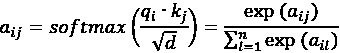

在这里，*a*[ij]是令牌*x*[i]和*x*[j]之间的相似度分数，d 是键向量的维度，而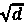的除法是用于缩放。注意力权重(*a*[i][1],*a*[i][2],…,*a*[i][n])表示当前令牌对序列中所有其他令牌的概率分布。

使用归一化后的注意力权重，我们现在可以计算当前令牌的嵌入向量。嵌入向量*z*[i]是序列中所有令牌的值向量*v*的加权和，其中每个权重是当前令牌*x*[i]与相应令牌*x*[j]之间的注意力分数*a*[ij]：

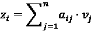

这个加权和向量被视为当前令牌的上下文感知表示，考虑到它与所有其他令牌的关系。

以序列*python machine learning by example*为例，我们按以下步骤计算第一个单词*python*的自注意力嵌入向量：

1.  我们计算序列中每个单词与单词*python*之间的点积。它们分别是*q*[1]∙*k*[1]，*q*[1]∙*k*[2]，*q*[1]∙*k*[3]，*q*[1]∙*k*[4]，和*q*[1]∙*k*[5]。在这里，*q*[1]是第一个单词的查询向量，而*k*[1]到*k*[5]分别是五个单词的键向量。

1.  我们使用除法和`softmax`激活函数对结果的点积进行归一化，从而找到注意力权重：

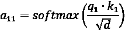

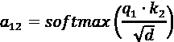

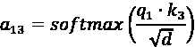

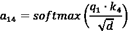

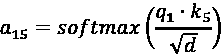

1.  然后，我们将得到的注意力权重与值向量相乘，*v*[1]，*v*[2]，*v*[3]，*v*[4]，*v*[5]，并将结果加起来：

*z*[1] = *a*[11].*v*[1]+*a*[12].*v*[2]+*a*[13].*v*[3]+*a*[14].*v*[4]+*a*[15].*v*[5]

*z*[1]是序列中第一个单词*python*的上下文感知嵌入向量。我们对序列中的每个剩余单词重复这一过程，以获得其上下文感知嵌入。

在自注意力机制的训练过程中，键（key）、查询（query）和值（value）向量是通过三个权重矩阵*W*[k]、*W*[q]和*W*[v]使用线性变换创建的：

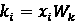

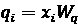

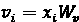

在这里，*W*[k]是键变换的权重矩阵，*W*[q]是查询变换的权重矩阵，*W*[v]是值变换的权重矩阵。这三个权重矩阵是可学习的参数。在模型训练过程中，它们通常通过基于梯度的优化算法进行更新。

现在，让我们看看如何在 PyTorch 中模拟计算*z*[1]：

1.  首先，假设我们有以下整数表示映射，表示输入`python machine learning by example`中的标记：

    ```py
    >>> import torch
    >>> sentence = torch.tensor(
            [0, # python
             8, # machine    
             1, # learning
             6, # by
             2] # example
        ) 
    ```

每个整数对应于词汇中相应标记的索引。

1.  我们还假设已经有了可以使用的嵌入向量来模拟我们的词汇：

    ```py
    >>> torch.manual_seed(0)
    >>> embed = torch.nn.Embedding(10, 16)
    >>> sentence_embed = embed(sentence).detach()
    >>> sentence_embed
    tensor([[-1.1258, -1.1524, -0.2506, -0.4339,  0.8487,  0.6920, -0.3160, 
             -2.1152,
              0.3223, -1.2633,  0.3500,  0.3081,  0.1198,  1.2377,  1.1168, 
             -0.2473],
            [-0.8834, -0.4189, -0.8048,  0.5656,  0.6104,  0.4669,  1.9507, 
             -1.0631,
             -0.0773,  0.1164, -0.5940, -1.2439, -0.1021, -1.0335, -0.3126,  
              0.2458],
            [-1.3527, -1.6959,  0.5667,  0.7935,  0.5988, -1.5551, -0.3414,  
              1.8530,
              0.7502, -0.5855, -0.1734,  0.1835,  1.3894,  1.5863,  0.9463, 
             -0.8437],
            [ 1.6459, -1.3602,  0.3446,  0.5199, -2.6133, -1.6965, -0.2282,  
              0.2800,
              0.2469,  0.0769,  0.3380,  0.4544,  0.4569, -0.8654,  0.7813, 
             -0.9268],
             [-0.6136,  0.0316, -0.4927,  0.2484,  0.4397,  0.1124,  0.6408, 
               0.4412,
              -0.1023,  0.7924, -0.2897,  0.0525,  0.5229,  2.3022, -1.4689, 
              -1.5867]]) 
    ```

在这里，我们的模拟词汇有 10 个标记，嵌入维度是 16。`detach()`用于创建一个新的张量，该张量与原始张量共享相同的底层数据，但与计算图断开连接。另外，注意你可能会得到不同的嵌入结果，因为某些操作是非确定性的。

1.  接下来，我们假设有以下三组权重矩阵*W*[k]、*W*[q]和*W*[v]：

    ```py
    >>> d = sentence_embed.shape[1]
    >>> w_key = torch.rand(d, d)
    >>> w_query = torch.rand(d, d)
    >>> w_value = torch.rand(d, d) 
    ```

对于矩阵操作，确保向量*Q*和*K*具有相同的维度是至关重要的，以确保它们在一致的特征空间内操作。然而，向量*V*允许具有不同的维度。在这个示例中，为了简化起见，我们将保持三个向量的维度一致。所以，我们选择 16 作为共同维度。

1.  现在，我们可以相应地计算*python*标记的键向量*k*[1]、查询向量*q*[1]和值向量*v*[1]：

    ```py
    >>> token1_embed = sentence_embed[0]
    >>> key_1 = w_key.matmul(token1_embed)
    >>> query_1 = w_query.matmul(token1_embed)
    >>> value_1 = w_value.matmul(token1_embed) 
    ```

看看*k*[1]：

```py
>>> key_1
tensor([-1.1371, -0.5677, -0.9324, -0.3195, -2.8886, -1.2679, -1.1153,  
         0.2904, 0.3825,  0.3179, -0.4977, -3.8230,  0.3699, -0.3932, 
        -1.8788, -3.3556]) 
```

1.  我们还可以直接计算键矩阵（由各个标记的键向量组成）如下：

    ```py
    >>> keys = sentence_embed.matmul(w_key.T)
    >>> keys[0]
    tensor([-1.1371, -0.5677, -0.9324, -0.3195, -2.8886, -1.2679, -1.1153,  
             0.2904, 0.3825,  0.3179, -0.4977, -3.8230,  0.3699, -0.3932, 
            -1.8788, -3.3556]) 
    ```

类似地，值矩阵可以直接计算如下：

```py
>>> values = sentence_embed.matmul(w_value.T) 
```

1.  通过键矩阵和查询向量*q*[1]，我们可以得到注意力权重向量*a*[1]=(*a*[11]、*a*[12]、*a*[13]、*a*[14]、*a*[15])：

    ```py
    >>> import torch.nn.functional as F
    >>> a1 = F.softmax(query_1.matmul(keys.T) / d ** 0.5, dim=0)
    >>> a1
    tensor([3.2481e-01, 4.2515e-01, 6.8915e-06, 2.5002e-01, 1.5529e-05]) 
    ```

1.  最后，我们将得到的注意力权重与值向量相乘，以获得第一个标记的上下文感知嵌入向量：

    ```py
    >>> z1 = a1.matmul(values)
    >>> z1
    tensor([-0.7136, -1.1795, -0.5726, -0.4959, -0.6838, -1.6460, -0.3782, -1.0066,
            -0.4798, -0.8996, -1.2138, -0.3955, -1.3302, -0.3832, -0.8446, -0.8470]) 
    ```

这是基于三个玩具权重矩阵*W*[k]、*W*[q]和*W*[v]的*python*标记的自注意力版本嵌入向量。

实际上，我们通常使用不止一组可训练的权重矩阵*W*[k]、*W*[q]和*W*[v]。这就是为什么自注意力通常被称为**多头自注意力**。每个注意力头都有自己的键、查询和值变换的可学习参数。使用多个注意力头可以捕捉序列中不同方面的关系。接下来我们来深入了解这一点。

## 多头注意力

单头注意力机制虽然有效，但可能无法捕捉序列内的多样化关系。多头注意力通过使用多个查询、键和值矩阵（多个“头”）来扩展这一机制。每个头部**独立**操作，可以**并行**关注输入序列的不同部分。这使得模型能够同时捕捉多样化的关系。

以之前的示例序列 *python machine learning by example* 为例，一个注意力头可能会专注于局部依赖，识别出“`machine learning`”作为一个名词短语；另一个注意力头可能会强调语义关系，推测“`examples`”是关于“`machine learning`”的。这就像是多个分析师在检查同一句话。每个分析师专注于不同的方面（例如，一个分析语法，一个分析词序，另一个分析情感）。通过结合他们的见解，你能获得对句子的更全面理解。

最后，来自所有注意力头的输出被拼接并线性变换，生成最终的注意力输出。

在本节中，我们介绍了一个具有可训练参数的自注意力机制。在接下来的章节中，我们将深入探讨围绕自注意力机制构建的 Transformer 架构。

# 探索 Transformer 的架构

Transformer 架构被提出作为 RNNs 在序列到序列任务中的替代方案。它大量依赖自注意力机制来处理输入和输出序列。

我们将从查看 Transformer 模型的高层次架构开始（该图像基于论文 *Attention Is All You Need*，由 Vaswani 等人提供）：

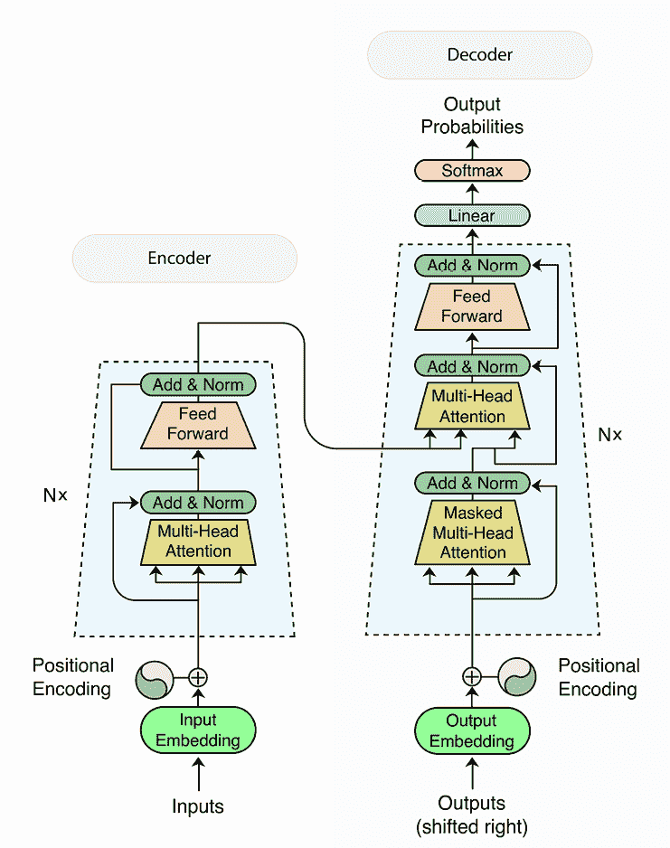

图 13.1：Transformer 架构

如你所见，Transformer 由两部分组成：**编码器**（左侧的大矩形）和**解码器**（右侧的大矩形）。编码器对输入序列进行加密。它具有**多头注意力层**和常规的前馈层。另一方面，解码器生成输出序列。它具有一个掩蔽的多头注意力层（我们稍后会详细讨论），以及一个多头注意力层和常规的前馈层。

在步骤 *t* 时，Transformer 模型接收输入步骤 *x*[1], *x*[2], …, *x*[t] 和输出步骤 *y*[1], *y*[2], …, *y*[t][−1]，然后预测 *y*[t]。这与多对多的 RNN 模型没有不同。在下一节中，我们将探索 Transformer 中使其与 RNN 区别开来的重要元素，包括编码器-解码器结构、位置编码和层归一化。

## 编码器-解码器结构

编码器-解码器结构是 Transformer 架构中的关键元素。它利用模型处理序列到序列任务的能力。以下是编码器组件和解码器组件的详细拆解，并通过类比帮助你理解。

**编码器**组件处理输入序列并创建上下文表示。通常，编码器组件是由多个编码器堆叠而成。每个编码器由一个自注意力层和一个前馈神经网络组成。我们已经介绍了自注意力允许每个标记关注序列中的其他标记。与像 RNN 这样的顺序模型不同，Transformer 能够捕捉标记之间的关系（即使是远距离的关系），而前馈神经网络为模型的学习能力增加了非线性。我们在深度神经网络中也见过这种情况。

假设你想在餐厅点餐。Transformer 中的编码器工作原理类似于你阅读菜单并生成自己的理解。编码器接收菜单（输入的单词序列），它通过自注意力分析这些单词，就像你阅读每道菜肴的描述和其配料（单词之间的关系）。在编码器（可能是多个编码器堆叠在一起）消化了菜单的信息后，它创建一个简化的表示，编码的上下文，捕捉菜单的精髓。这个编码器的输出就像你对菜单的理解。

对于由多个相同编码器块组成的编码器组件，每个编码器的输出作为后续块的输入，构成了堆叠结构。这种堆叠方法提供了一种强大的方式来捕捉更复杂的关系，并创建对输入序列更丰富的理解。在 RNN 中我们看到了类似的方法。如果你有疑问，原始设计中在*Attention Is All You Need*中使用了六个编码器块。编码器的数量并非神奇数字，而是需要通过实验来确定。

**解码器**组件利用编码器提供的上下文表示生成输出序列。与编码器类似，解码器组件也由多个堆叠的解码器块组成。同样，每个解码器块包含一个自注意力层和一个前馈神经网络。然而，解码器中的自注意力与编码器中的自注意力略有不同。它关注的是输出序列，但只考虑它已经构建的上下文。这意味着，对于给定的标记，解码器自注意力仅考虑之前处理过的标记和当前标记之间的关系。回想一下，编码器中的自注意力可以一次性关注整个输入序列。因此，我们称解码器中的自注意力为**掩蔽自注意力**。

除了一个掩蔽自注意力层和一个前馈神经网络，解码器块还具有一个额外的注意力层，称为**编码器-解码器注意力**。它关注编码器提供的上下文表示，以确保生成的输出序列与编码的上下文相关。

回到餐厅点餐的类比。现在，你（解码器）想要下单（生成输出序列）。解码器使用编码器-解码器自注意力来考虑编码后的上下文（你对菜单的理解）。编码器-解码器自注意力确保输出的生成是基于你对菜单的理解，而不是其他人的。解码器使用**掩蔽自注意力**来逐字生成输出（你点的菜肴）。掩蔽自注意力确保你不会“偷看”还未“点餐”（生成）的未来菜肴（单词）。随着每个生成的词（你点的菜肴），解码器可以基于编码后的上下文来调整对所需输出序列（餐点）的理解。

类似于编码器，在堆叠的解码器组件中，每个解码器块的输出作为下一个解码器块的输入。由于编码器-解码器自注意力机制，解码器块的数量通常与编码器块的数量相同。

在训练过程中，模型会同时接收输入序列和目标输出序列。它通过最小化预测结果与实际目标序列之间的差异来学习生成目标输出序列。

在本节中，我们深入探讨了 Transformer 的编码器-解码器结构。编码器堆栈提取输入序列的上下文表示。解码器则逐个生成输出序列的标记，关注编码后的上下文以及之前生成的标记。

## 位置编码

虽然强大，自注意力机制在仅基于内容区分元素的重要性方面存在困难。例如，给定句子“白色狐狸跳过棕色狗”，自注意力可能会因为`fox`和`dog`在语法角色（名词）上相似，而给它们分配相似的重要性。为了解决这个局限性，引入了**位置编码**来将位置信息注入自注意力机制。

位置编码是一个固定大小的向量，包含序列中标记的位置信息。它通常是基于数学函数计算的。一种常见的方法是使用正弦和余弦函数的组合，如下所示：

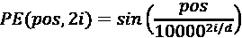

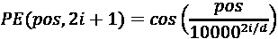

在这里，*i* 是维度索引，*pos* 是标记的位置，*d* 是嵌入向量的维度。*PE*(*pos*, 2*i*) 表示位置 *pos* 的位置编码中第 2*i* 维的值；*PE*(*pos*, 2*i*+1) 表示位置 *pos* 的位置编码中第 2*i*+1 维的值。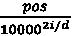 为不同维度引入了不同的频率。

让我们尝试使用四维向量对简单句子“`Python machine learning`”中的单词位置进行编码。对于第一个单词“Python”，我们有以下内容：

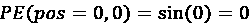

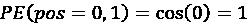

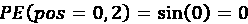

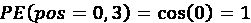

对于第二个词“machine”，我们得到以下结果：

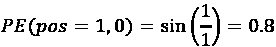

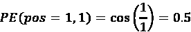

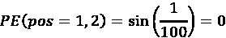

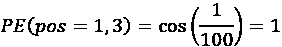

所以，我们为“Python”提供了位置编码 `[0, 1, 0, 1]`，为“machine”提供了位置编码 `[0.8, 0.5, 0, 1]`。我们将留给你一个练习，自己完成第三个词的位置编码。

在为每个位置计算位置编码向量之后，它们会被加到相应标记的嵌入表示中。如图 *13.1* 所示，位置编码在输入嵌入进入编码器组件之前被加到输入嵌入中。同样，位置编码会在输出嵌入进入解码器组件之前加到输出嵌入中。现在，当自注意力学习标记之间的关系时，它会同时考虑内容（标记本身）和它们的位置相关信息。

位置编码是 Transformer 中自注意力的重要补充。由于 Transformer 本身不像 RNN 那样固有地理解标记的顺序，因此额外的位置信息使得它能够有效地捕捉序列依赖关系。在下一部分，我们将研究 Transformer 中另一个关键组件——层归一化。

## 层归一化

一个 Transformer 由多个层（由多头自注意力组成的编码器和解码器块）构成，它可能会遇到梯度爆炸或梯度消失的问题。这使得网络在训练过程中很难有效学习。**层归一化**通过对每一层的输出进行归一化，帮助解决了这一问题。

归一化是独立应用于每一层的激活，包括自注意力层和前馈网络。这意味着每一层的输出都会保持在一个特定的范围内，以防止梯度过大或过小。因此，层归一化能够稳定训练过程，并提高 Transformer 的学习效率。

我们已经深入理解了 Transformer 架构及其组成部分，包括编码器、解码器、多头自注意力、掩蔽自注意力、位置编码和层归一化。接下来，我们将学习基于 Transformer 架构的模型 BERT 和 GPT，并探讨它们的应用，包括情感分析和文本生成。

# 使用 BERT 和 Transformer 改进情感分析

**BERT** ([`arxiv.org/abs/1810.04805v2`](https://arxiv.org/abs/1810.04805v2)) 是一个基于 Transformer 架构的模型。近年来，它在各种语言理解任务中取得了显著的成功。

正如其名称所示，双向性是 BERT 与早期 Transformer 模型之间的一个显著区别。传统模型通常以单向方式处理序列，而 BERT 则以双向方式处理整个上下文。这种双向上下文理解使得模型在捕捉序列中的细微关系时更加有效。

BERT 基本上是一个训练过的 Transformer 编码器堆叠。它在大量未标记的文本数据上进行自监督预训练。在预训练过程中，BERT 专注于理解文本的上下文意义。预训练完成后，BERT 可以针对特定的下游任务进行微调。

让我们先来讨论一下预训练工作。

## 预训练 BERT

BERT 的预训练目标是捕捉丰富的上下文化单词表示。它通过在**大量语料**上进行自监督训练，处理未标记的文本数据。预训练过程包括两个主要任务：**掩蔽语言模型**（**MLM**）任务和**下一句预测**（**NSP**）任务。以下是具体分解。

### MLM

在 MLM 任务中，句子中的随机单词被替换为特殊标记`[MASK]`。BERT 将修改后的句子作为输入，并尝试基于周围的单词预测原始被掩蔽的单词。在这个填空游戏中，BERT 被训练去理解单词的意义和上下文。

值得注意的是，在 MLM 任务中，模型使用**双向**上下文进行训练——即每个掩蔽单词的左右上下文。这提高了掩蔽单词预测的准确性。因此，通过处理大量的训练样本，BERT 在理解单词意义和捕捉不同上下文中的关系方面变得更为出色。

### NSP

NSP 任务帮助模型理解句子之间的关系和话语级别的信息。在训练过程中，句子对会从训练语料库中随机抽取。对于每一对句子，第二个句子有 50%的概率跟随第一个句子出现，也有 50%的概率不跟随第一个句子。将两个句子连接起来形成一个训练样本。特殊的`[CLS]`和`[SEP]`标记用于格式化训练样本：

+   `[CLS]`（分类）标记被添加到训练样本的开始位置。对应于`[CLS]`标记的输出用于表示整个输入序列，用于分类任务。

+   `[SEP]`（分隔符）标记用于分隔两个连接的输入句子。

BERT 的预训练过程如下图所示（请注意，图中的“C”是“Class”的缩写）：

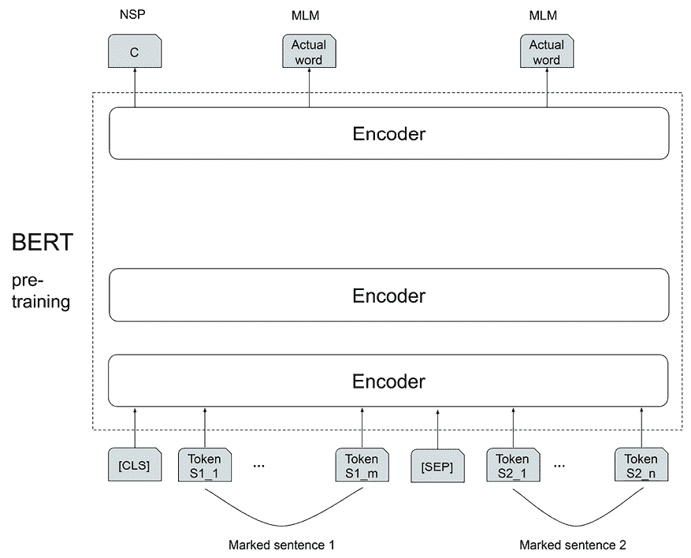

图 13.2：BERT 预训练

如你在预训练图中所见，模型在连接的句子上进行训练，以预测第二个句子是否跟随第一个句子。它会接收正确的标签（是否是下一个句子）作为反馈，并调整其参数以提高预测准确性。通过这种句子配对任务，BERT 学会了理解句子之间的关系以及思想在文本中的连贯流动。

有趣的是，图表显示 BERT 的预训练同时结合了 MLM 和 NSP 任务。模型在句子中预测被遮盖的标记，同时还判断句子对是否是连续的。

虽然 MLM 任务侧重于词汇级的上下文化，NSP 任务有助于 BERT 更广泛地理解句子之间的关系。预训练后，BERT 可以**微调**以适应特定的下游 NLP 任务。接下来我们来看如何进行微调。

## BERT 的微调

BERT 通常会针对目标任务（如情感分析或命名实体识别）进行微调。任务特定的层被添加到预训练模型之上，并在与任务相关的标注数据上训练模型。以下是微调的逐步过程：

1.  我们首先收集特定于下游任务的标注数据。

1.  接下来，我们需要选择一个预训练的 BERT 模型。有多种选择，例如 BERT-base 和 BERT-large。你应该选择适合下游任务和计算能力的模型。

1.  根据所选的 BERT 模型，我们使用相应的分词器来对输入进行分词。Hugging Face 的 tokenizers 包中提供了多种分词器（[`huggingface.co/docs/tokenizers/python/latest/index.html`](https://huggingface.co/docs/tokenizers/python/latest/index.html)）。但你应该使用与模型匹配的分词器。

1.  有趣的部分来了——架构修改。我们可以在预训练的 BERT 模型上添加任务特定的层。例如，你可以为情感分析添加一个带有 sigmoid 激活的单神经元。

1.  我们接着定义任务特定的损失函数和目标，以进行训练。再次以情感分析为例，你可以使用二元交叉熵损失函数。

1.  最后，我们在标注数据上训练修改后的 BERT 模型。

1.  我们通常会执行超参数调优，以找到最佳的模型配置，包括学习率、批次大小和正则化。

微调 BERT 利用了预训练期间获得的知识，并将其适应于特定任务。通过这种迁移学习策略，BERT 无需从头开始，因此能够更快学习新知识，并且需要更少的数据。在接下来的部分，我们将使用 BERT 提升电影评论的情感预测。

## 对预训练 BERT 模型进行情感分析的微调

在*第十二章*《使用循环神经网络进行序列预测》中，我们开发了一个 LSTM 模型用于电影评论情感预测。在接下来的步骤中，我们将对同一任务微调预训练的 BERT 模型：

1.  首先，我们从 PyTorch 内置数据集中读取 IMDb 评论数据：

    ```py
    >>> from torchtext.datasets import IMDB
    >>> train_dataset = list(IMDB(split='train'))
    >>> test_dataset = list(IMDB(split='test'))
    >>> print(len(train_dataset), len(test_dataset))
    25000 25000 
    ```

我们加载了 25,000 个训练样本和 25,000 个测试样本。

1.  然后，我们将原始数据分为文本和标签数据，因为我们需要对文本数据进行分词：

    ```py
    >>> train_texts = [train_sample[1] for train_sample in train_dataset]
    >>> train_labels = [train_sample[0] for train_sample in train_dataset]
    >>> test_texts = [test_sample[1] for test_sample in test_dataset]
    >>> test_labels = [test_sample[0] for test_sample in test_dataset] 
    ```

我们已经完成了数据准备，并进入分词步骤。

1.  现在，我们需要选择一个合适的预训练模型和相应的分词器。考虑到我们有限的计算资源，我们选择了`distilbert-base-uncased`模型。可以将其视为 BERT 的一个更小（“蒸馏”）、更快的版本。它保留了 BERT 的大部分功能，但参数更少。“uncased”部分意味着该模型是基于小写文本训练的。为了确保一切顺利，我们将使用与模型匹配的`distilbert-base-uncased`分词器。

1.  如果你还没有安装 Hugging Face 的 transformers 包，可以通过命令行按如下方式安装：

    ```py
    pip install transformers==4.32.1 
    ```

或者，使用以下方式：

```py
conda install -c huggingface transformers=4.32.1 
```

截至目前，我们使用的是`4.32.1`版本。可以自由地使用此版本进行复制，因为 transformers 包会经常更新。

1.  Hugging Face 的预训练模型可以加载并在本地下载和缓存。我们按如下方式加载`distilbert-base-uncased`分词器：

    ```py
    >>> import transformers
    >>> from transformers import DistilBertTokenizerFast
    >>> tokenizer = DistilBertTokenizerFast.from_pretrained('distilbert-base-uncased') 
    ```

我们也可以提前手动下载一个`transformers`模型，并从指定的本地路径读取。要获取`distilbert-base-uncased`预训练模型和分词器，可以在[`huggingface.co/models`](https://huggingface.co/models)搜索`distilbert-base-uncased`，并点击`distilbert-base-uncased`的链接。模型和分词器文件可以在**Files**选项卡中找到，或者直接在[`huggingface.co/distilbert-base-uncased/tree/main`](https://huggingface.co/distilbert-base-uncased/tree/main)查看。下载所有文件**除了**`flax_model.msgpack`、`model.safetensors`、`rust_model.ot`和`tf_model.h5`（因为我们只需要 PyTorch 模型），并将它们放在名为`distilbert-base-uncased`的文件夹中。最后，我们将能够按如下方式从`distilbert-base-uncased`路径加载分词器：

```py
>>> tokenizer = DistilBertTokenizerFast.from_pretrained(
                                             'distilbert-base-uncased',
                                             local_files_only=True) 
```

1.  现在，我们对训练集和测试集中的输入文本进行分词：

    ```py
    >>> train_encodings = tokenizer(train_texts, truncation=True,
                                    padding=True)
    >>> test_encodings = tokenizer(test_texts, truncation=True, padding=True) 
    ```

看一下第一个训练样本的编码结果：

```py
>>> train_encodings[0]
Encoding(num_tokens=512, attributes=[ids, type_ids, tokens, offsets, attention_mask, special_tokens_mask, overflowing]) 
```

在这里，生成的编码对象最多只能容纳 512 个标记。如果原始文本更长，它将被截断。属性是与编码过程相关的信息列表，包括`ids`（表示标记 ID）和`attention_mask`（指定哪些标记应被关注，哪些应被忽略）。

1.  接下来，我们将所有数据字段，包括标签，封装在一个`Dataset`类中：

    ```py
    >>> import torch
    >>> class IMDbDataset(torch.utils.data.Dataset):
        def __init__(self, encodings, labels):
            self.encodings = encodings
            self.labels = labels
        def __getitem__(self, idx):
            item = {key: torch.tensor(val[idx])
                for key, val in self.encodings.items()}
            item['labels'] = torch.tensor([0., 1.] 
                                   if self.labels[idx] == 2
                                   else [1., 0.])
            return item
        def __len__(self):
            return len(self.labels) 
    ```

请注意，我们将正标签（表示为“`2`”）和负标签（表示为“`1`”）转换为格式`[0, 1]`和`[1, 0]`。我们做出这个调整是为了与 DistilBERT 要求的标签格式对齐。

1.  然后，我们为训练数据和测试数据生成自定义的`Dataset`对象：

    ```py
    >>> train_encoded_dataset = IMDbDataset(train_encodings, train_labels)
    >>> test_encoded_dataset = IMDbDataset(test_encodings, test_labels) 
    ```

1.  根据生成的数据集，我们创建批量数据加载器，并为模型微调和评估做好准备：

    ```py
    >>> batch_size = 32
    >>> train_dl = torch.utils.data.DataLoader(train_encoded_dataset,
                                               batch_size=batch_size,
                                               shuffle=True)       
    >>> test_dl = torch.utils.data.DataLoader(test_encoded_dataset,
                                              batch_size=batch_size,
                                              shuffle=False) 
    ```

1.  完成数据准备和分词后，下一步是加载预训练模型并使用我们刚刚准备好的数据集进行微调。加载预训练模型的代码如下：

    ```py
    >>> from transformers import DistilBertForSequenceClassification
    >>> device = torch.device("cuda" if torch.cuda.is_available() else "cpu")
    >>> model = DistilBertForSequenceClassification.from_pretrained(
                                                   'distilbert-base-uncased',
                                                  local_files_only=True)
    >>> model.to(device) 
    ```

我们加载了前面提到的预训练`distilbert-base-uncased`模型。同时，我们确保模型被放置在指定的计算设备上（如果有 GPU，强烈推荐使用 GPU）进行训练和推理。

`transformers`包提供了多种预训练模型。你可以在[`huggingface.co/docs/transformers/index#supported-models-and-frameworks`](https://huggingface.co/docs/transformers/index#supported-models-and-frameworks)上浏览它们。

1.  我们设置了相应的`Adam`优化器，学习率为`0.00005`，如下所示：

    ```py
    >>> optimizer = torch.optim.Adam(model.parameters(), lr=5e-5) 
    ```

1.  现在，我们定义了一个训练函数，负责训练（微调）模型一次：

    ```py
    >>> def train(model, dataloader, optimizer):
        model.train()
        total_loss = 0
        for batch in dataloader:
            optimizer.zero_grad()
            input_ids = batch['input_ids'].to(device)
            attention_mask = batch['attention_mask'].to(device)
            labels = batch['labels'].to(device)
            outputs = model(input_ids, attention_mask=attention_mask, 
                            labels=labels)
            loss = outputs['loss']

            optimizer.zero_grad()
            loss.backward()
            optimizer.step()
            total_loss += loss.item()*len(batch)
        return total_loss/len(dataloader.dataset) 
    ```

这与我们使用的训练函数类似，只不过 BERT 需要同时输入 token ID 和`attention_mask`。

1.  同样，我们定义了评估函数，用于评估模型的准确率：

    ```py
    >>> def evaluate(model, dataloader):
        model.eval()
        total_acc = 0
        with torch.no_grad():
            for batch in dataloader:
                input_ids = batch['input_ids'].to(device)
                attention_mask = batch['attention_mask'].to(device)
                labels = batch['labels'].to(device)
                outputs = model(input_ids, attention_mask=attention_mask)
                logits = outputs['logits']
                pred = torch.argmax(logits, 1)
                 total_acc += (pred == torch.argmax(labels, 1)).float().sum().item()
        return  total_acc/len(dataloader.dataset) 
    ```

1.  然后，我们训练模型进行一次迭代，并在结束时显示训练损失和准确率：

    ```py
    >>> torch.manual_seed(0)
    >>> num_epochs = 1
    >>> for epoch in range(num_epochs):
    >>>     train_loss = train(model, train_dl, optimizer)
    >>>     train_acc = evaluate(model, train_dl)
    >>>     print(f'Epoch {epoch+1} - loss: {train_loss:.4f} -
                    accuracy: {train_acc:.4f}')
    Epoch 1 - loss: 0.0242 - accuracy: 0.9642 
    ```

训练过程需要一些时间，训练准确率为 96%。如果资源和时间允许，你可以进行更多的迭代训练。

1.  最后，我们在测试集上评估模型性能：

    ```py
    >>> test_acc = evaluate(model, test_dl)
    >>> print(f'Accuracy on test set: {100 * test_acc:.2f} %')
    Accuracy on test set: 92.75 % 
    ```

我们通过对预训练的 DistilBERT 模型进行一次 epoch 的微调，获得了 93%的测试准确率。这相比于在*第十二章*中使用 LSTM 得到的 86%测试准确率，取得了显著提升。

**最佳实践**

如果你正在处理大型模型或数据集并使用 GPU，建议监控 GPU 内存使用情况，以避免 GPU 内存不足。

在 PyTorch 中，你可以使用`torch.cuda.mem_get_info()`来检查 GPU 内存使用情况。它会告诉你关于可用和已分配 GPU 内存的信息。另一个小技巧是`torch.cuda.empty_cache()`，它会尝试释放 GPU 内存分配器未使用的缓存内存回系统。最后，如果你不再使用某个模型，可以运行`del model`来释放它占用的内存。

## 使用 Trainer API 训练 Transformer 模型

Hugging Face 中包含的 Trainer API 是训练基于 Transformer 模型的快捷方式。它让你能够轻松地在自己的任务上微调这些预训练模型，提供了一个简单的高级接口。无需再像之前那样与大量的训练代码作斗争。

在接下来的步骤中，我们将更方便地使用`Trainer` API 对 BERT 模型进行微调：

1.  再次加载预训练模型并创建相应的优化器：

    ```py
    >>> model = DistilBertForSequenceClassification.from_pretrained(
                                                    'distilbert-base-uncased',
                                                    local_files_only=True)
    >>> model.to(device)
    >>> optim = torch.optim.Adam(model.parameters(), lr=5e-5) 
    ```

1.  要执行`Trainer`脚本，需要安装 accelerate 包。使用以下命令来安装`accelerate`：

    ```py
    conda install -c conda-forge accelerate 
    ```

或者

```py
pip install accelerate 
```

1.  接下来，我们准备必要的配置并初始化一个`Trainer`对象来训练模型：

    ```py
    >>> from transformers import Trainer, TrainingArguments
    >>> training_args = TrainingArguments(
            output_dir='./results',
            num_train_epochs=1,   
            per_device_train_batch_size=32,
            logging_dir='./logs',
            logging_steps=50,
        )
    >>> trainer = Trainer(
        model=model,
        args=training_args,
        train_dataset=train_encoded_dataset,
        optimizers=(optim, None)
    ) 
    ```

这里，`TrainingArguments`配置定义了训练的轮数、训练批次大小以及每次记录训练指标的步骤数。我们还告诉 Trainer 使用哪个模型，训练的数据是什么，以及使用什么优化器——第二个元素（`None`）表示这次没有学习率调度器。

1.  你可能会注意到，前一步`Trainer`初始化时并没有涉及评估指标和测试数据集。我们来添加这些并重写初始化：

    ```py
    >>> from datasets import load_metric
    >>> import numpy as np
    >>> metric = load_metric("accuracy")
    >>> def compute_metrics(eval_pred):
            logits, labels = eval_pred
            pred = np.argmax(logits, axis=-1)
            return metric.compute(predictions=pred, 
                                  references=np.argmax(labels, 1))
    >>> trainer = Trainer(
            model=model,
            compute_metrics=compute_metrics,
            args=training_args,
            train_dataset=train_encoded_dataset,
            eval_dataset=test_encoded_dataset,
            optimizers=(optim, None)
        ) 
    ```

`compute_metrics`函数根据预测标签和真实标签计算准确率。`Trainer`将使用这个指标来衡量模型在指定测试集（`test_encoded_dataset`）上的表现。

1.  现在，我们只用一行代码来训练模型：

    ```py
    >>> trainer.train()
    Step     Training Loss
    50       0.452500
    100      0.321200
    150      0.325800
    200      0.258700
    250      0.244300
    300      0.239700
    350      0.256700
    400      0.234100
    450      0.214500
    500      0.240600
    550      0.209900
    600      0.228900
    650      0.187800
    700      0.194800
    750      0.189500
    TrainOutput(global_step=782, training_loss=0.25071206544061453, metrics={'train_runtime': 374.6696, 'train_samples_per_second': 66.725, 'train_steps_per_second': 2.087, 'total_flos': 3311684966400000.0, 'train_loss': 0.25071206544061453, 'epoch': 1.0}) 
    ```

模型仅根据我们的指定训练了一个 epoch，且每 50 步就会显示训练损失。

1.  只需再写一行代码，我们就可以在测试数据集上评估训练好的模型：

    ```py
    >>> print(trainer.evaluate())
    {'eval_loss': 0.18415148556232452, 'eval_accuracy': 0.929, 'eval_runtime': 122.457, 'eval_samples_per_second': 204.153, 'eval_steps_per_second': 25.519, 'epoch': 1.0} 
    ```

我们利用 Trainer API 得到了相同的 93%的测试准确率，并且所需的代码明显更少。

**最佳实践**

以下是微调 BERT 的一些最佳实践：

+   **数据至关重要**：你应该优先使用高质量且标注良好的数据。

+   **从小做起**：你可以从较小的预训练模型开始，比如 BERT-base 或 DistilBERT。它们相比于较大的模型（如 BERT-large）对计算资源的需求更低。

+   **自动化超参数调优**：你可以利用自动化超参数调优库（例如 Hyperopt、Optuna）来搜索最佳超参数。这可以节省你的时间，并让计算机进行繁重的计算工作。

+   **实施提前停止**：在训练过程中，你应该监控验证损失。如果验证损失在一段时间后不再变得更好，那么就应该停止训练。这种提前停止策略可以防止不必要的训练迭代。记住，微调 BERT 可能需要一些时间和资源。

在这一部分，我们讨论了基于 Transformer 编码器的 BERT 模型，并利用它来增强情感分析。接下来的部分，我们将探讨另一种基于 Transformer 的模型，**GPT**。

# 使用 GPT 生成文本

BERT 和 GPT 都是基于 Transformer 架构的最先进的自然语言处理模型。然而，它们在架构、训练目标和使用场景上有所不同。我们将首先了解更多关于 GPT 的内容，然后用微调后的 GPT 模型生成我们自己的*战争与和平*。

## GPT 的预训练和自回归生成

GPT（*通过生成预训练改善语言理解*，作者：Alec Radford 等，2018）是一个**仅解码器**的 Transformer 架构，而 BERT 是仅编码器。这意味着 GPT 在解码器中使用了屏蔽自注意力，并且强调预测序列中的下一个标记。

可以将 BERT 看作是一位超级侦探。它接收到一个句子，其中一些单词被隐藏（屏蔽），并且必须根据线索（周围的单词）在两个方向上推测出这些单词是什么，就像从各个角度观察犯罪现场。而 GPT 则更像是一位创造性的故事讲述者。它使用**自回归**语言模型目标进行预训练。它从一个起始词开始，逐个添加单词，利用之前的单词作为灵感，类似于我们写故事的方式。这个过程会一直重复，直到达到所需的序列长度。

“自回归”一词意味着它以顺序的方式逐个标记地生成文本。

BERT 和 GPT 都在大规模数据集上进行了预训练。然而，由于它们的训练方法不同，它们在微调时具有不同的优势和应用场景。BERT 擅长理解单词和句子之间的关系。它可以用于情感分析和文本分类等任务。另一方面，GPT 更擅长生成语法正确且流畅的文本。这使得它在文本生成、机器翻译和摘要等任务中表现更好。

在下一部分，我们将像在*第十二章*《使用循环神经网络进行序列预测》中那样写我们自己的*《战争与和平》*版本，但这次我们将通过微调 GPT 模型来实现。

## 使用 GPT 写你自己的*《战争与和平》*版本

为了说明，我们将使用 GPT-2，这是一个比 GPT-1 更强大但比 GPT-3 更小的开源模型，来生成我们自己的*《战争与和平》*版本，以下是具体步骤：

1.  在我们开始之前，让我们快速看看如何使用 GPT-2 模型生成文本：

    ```py
    >>> from transformers import pipeline, set_seed
    >>> generator = pipeline('text-generation', model='gpt2')
    >>> set_seed(0)
    >>> generator("I love machine learning",
                  max_length=20,
                  num_return_sequences=3)
    [{'generated_text': 'I love machine learning, so you should use machine learning as your tool for data production.\n\n'},
    {'generated_text': 'I love machine learning. I love learning and I love algorithms. I love learning to control systems.'},
    {'generated_text': 'I love machine learning, but it would be pretty difficult for it to keep up with the demands and'}] 
    ```

```py
I love machine learning,” and it produces three alternative sequences with a maximum length of 20 tokens each.
```

1.  为了生成我们自己的*《战争与和平》*版本，我们需要基于原始的*《战争与和平》*文本微调 GPT-2 模型。我们首先需要加载基于 GPT-2 的标记器：

    ```py
    >>> from transformers import TextDataset, GPT2Tokenizer
    >>> tokenizer = GPT2Tokenizer.from_pretrained('gpt2', local_files_only=True) 
    ```

1.  接下来，我们为经过标记化的*《战争与和平》*文本创建一个`Dataset`对象：

    ```py
    >>> text_dataset = TextDataset(tokenizer=tokenizer,
                                   file_path='warpeace_input.txt',
                                   block_size=128) 
    ```

我们通过标记化`'warpeace_input.txt'`文件中的文本（我们在*第十二章*中使用的文件）准备了一个数据集（`text_dataset`）。我们将`tokenizer`参数设置为之前创建的 GPT-2 标记器，并将`block_size`设置为`128`，指定每个标记序列的最大长度。

```py
>>> len(text_dataset)
>>> 6176 
```

我们基于原始文本生成了`6176`个训练样本。

1.  回顾一下*第十二章*，我们必须手动创建训练数据。幸运的是，这次我们使用了 Hugging Face 的`DataCollatorForLanguageModeling`类来自动生成输入序列和输出标记。这个数据聚合器是专为语言建模任务设计的，我们试图预测被屏蔽的标记。让我们看看如何创建数据聚合器，具体如下：

    ```py
    >>> from transformers import DataCollatorForLanguageModeling
    >>> data_collator = DataCollatorForLanguageModeling(tokenizer=tokenizer,
                                                        mlm=False) 
    ```

数据整理器帮助组织和批处理输入数据，以训练语言模型。我们将`mlm`参数设置为 False。如果设置为`True`，它将启用掩码语言建模，其中 tokens 会被随机掩盖，模型需要预测这些被掩盖的部分，就像我们在 BERT 中做的那样。在我们这里，它被关闭，意味着模型是使用自回归方法进行训练的。这种方法非常适合文本生成任务，因为模型学习逐字生成新文本。

1.  完成分词和数据整理后，下一步是加载预训练的 GPT-2 模型并创建相应的优化器：

    ```py
    >>> import torch
    >>> from transformers import GPT2LMHeadModel
    >>> model = GPT2LMHeadModel.from_pretrained('gpt2')
    >>> model.to(device)
    >>> optim = torch.optim.Adam(model.parameters(), lr=5e-5) 
    ```

我们使用`GPT2LMHeadModel`进行文本生成。它预测序列中下一个 token 的概率分布。

1.  接下来，我们准备必要的配置并初始化一个`Trainer`对象来训练模型：

    ```py
    >>> from transformers import Trainer, TrainingArguments
    >>> training_args = TrainingArguments(
            output_dir='./gpt_results',
            num_train_epochs=20,   
            per_device_train_batch_size=16,
            logging_dir='./gpt_logs',
            save_total_limit=1,
            logging_steps=500,
        )
    >>> trainer = Trainer(
        model=model,
        args=training_args,
        data_collator=data_collator,
        train_dataset=train_dataset,
        optimizers=(optim, None)
    ) 
    ```

模型将在`text_dataset`数据集上进行训练，该数据集分成`16`个样本批次，进行`20`轮训练。我们还设置了保存的检查点的总数限制。在这种情况下，只有最新的检查点会被保存。这是为了减少空间消耗。在`trainer`中，我们提供了`DataCollatorForLanguageModeling`实例来组织数据进行训练。

1.  现在，我们准备好训练模型了：

    ```py
    >>> trainer.train()
    Step    Training Loss
    500        3.414100
    1000       3.149500
    1500       3.007500
    2000       2.882600
    2500       2.779100
    3000       2.699200
    3500       2.621700
    4000       2.548800
    4500       2.495400
    5000       2.447600
    5500       2.401400
    6000       2.367600
    6500       2.335500
    7000       2.315100
    7500       2.300400
    TrainOutput(global_step=7720, training_loss=2.640813370936893, metrics={'train_runtime': 1408.7655, 'train_samples_per_second': 87.68, 'train_steps_per_second': 5.48, 'total_flos': 8068697948160000.0, 'train_loss': 2.640813370936893, 'epoch': 20.0}) 
    ```

1.  在基于*《战争与和平》*训练 GPT-2 模型后，我们最终使用它生成了我们自己的版本。我们首先开发了以下函数，用于根据给定的模型和提示文本生成文本：

    ```py
    >>> def generate_text(prompt_text, model, tokenizer, max_length):
            input_ids = tokenizer.encode(prompt_text, 
                                         return_tensors="pt").to(device)

            # Generate response
            output_sequences = model.generate(
                input_ids=input_ids,
                max_length=max_length,
                num_return_sequences=1,
                no_repeat_ngram_size=2,
                top_p=0.9,
            )
            # Decode the generated responses
            responses = []
            for response_id in output_sequences:
                response = tokenizer.decode(response_id,
                                            skip_special_okens=True)
                responses.append(response)
            return responses 
    ```

在生成过程中，我们首先使用分词器对输入的提示文本进行分词，并将分词后的序列转换为 PyTorch 张量。然后，我们基于分词后的输入使用给定的模型生成文本。在这里，`no_repeat_ngram_size`防止重复相同的 n-gram 短语，以保持文本的新鲜感。另一个有趣的设置是`top_p`，它控制生成文本的多样性。它考虑最可能的多个 token，而不仅仅是最可能的一个。最后，我们使用分词器解码生成的响应，将其转换回人类语言。

1.  我们使用相同的提示文本“`the emperor`”，以下是我们版本的*《战争与和平》*，共 100 个字：

    ```py
    >>> prompt_text = "the emperor"
    >>> responses = generate_text(prompt_text, model, tokenizer, 100)
    >>> for response in responses:
            print(response)
    the emperor's, and the Emperor Francis, who was in attendance on him, was present.
    The Emperor was present because he had received the news that the French troops were advancing on Moscow, that Kutuzov had been wounded, the Emperor's wife had died, a letter from Prince Andrew had come from Prince Vasili, Prince Bolkonski had seen at the palace, news of the death of the Emperor, but the most important news was that … 
    ```

我们成功地使用微调后的 GPT-2 模型生成了我们自己的*《战争与和平》*版本。它比 LSTM 版本的*第十二章*阅读体验要好。

GPT 是一种仅解码的 Transformer 架构。它的核心是一次生成一个 token。与一些其他基于 Transformer 的模型不同，它不需要额外的步骤（编码）来理解输入的内容。这使得它能够专注于生成自然流畅的文本，像一个创造性的作家。一旦 GPT 在大量文本数据上进行训练，我们可以通过小型数据集对其进行微调，适应特定任务。可以把它想象成教一个大师级的故事讲述者，去写关于特定主题的内容，比如历史或科幻。在我们的例子中，我们通过微调 GPT-2 模型生成了自己的*《战争与和平》*版本。

虽然 BERT 专注于双向预训练，GPT 是自回归的，预测序列中的下一个单词。你可能会想，是否存在一种结合了双向理解和自回归生成的模型？答案是有的——**双向和自回归 Transformer**（**BART**）。它由 Facebook AI 推出（《BART: 双向和自回归 Transformer 用于序列到序列学习》，Lewis 等，2019 年），旨在结合两者的优势。

# 总结

本章主要讲解了 Transformer，这是一种强大的神经网络架构，专为序列到序列任务设计。其关键成分——自注意力机制，使模型能够专注于序列中最重要的信息部分。

我们进行了两个 NLP 项目：情感分析和文本生成，使用了两种最先进的 Transformer 模型——BERT 和 GPT。与上一章的工作相比，我们观察到了更高的性能。我们还学习了如何使用 Hugging Face 库微调这些 Transformer 模型，该库是加载预训练模型、执行不同 NLP 任务以及在你自己的数据上微调模型的一站式平台。除此之外，它还提供了一些额外工具，帮助切割文本、检查模型表现，甚至生成一些文本。

在下一章中，我们将聚焦于另一个 OpenAI 的前沿模型——CLIP，并实现基于自然语言的图像搜索。

# 练习

1.  你能计算出示例句子“`python machine learning`”中第三个单词“`learning`”的位置信息编码吗？请使用一个四维向量。

1.  你能为主题分类微调一个 BERT 模型吗？你可以以新闻组数据集为例。

1.  你能微调一个 BART 模型（[`huggingface.co/facebook/bart-base`](https://huggingface.co/facebook/bart-base)）来编写你自己的《战争与和平》版本吗？

# 加入我们书籍的 Discord 空间

加入我们社区的 Discord 空间，与作者和其他读者进行讨论：

[`packt.link/yuxi`](https://packt.link/yuxi)


