# 第十四章：使用 CLIP 构建图像搜索引擎：一种多模态方法

在上一章中，我们重点介绍了 Transformer 模型，如 BERT 和 GPT，利用它们在序列学习任务中的能力。在本章中，我们将探讨一种多模态模型，它能够无缝连接视觉和文本数据。通过其双编码器架构，该模型学习视觉和文本概念之间的关系，使其在涉及图像和文本的任务中表现出色。我们将深入探讨其架构、关键组件和学习机制，并进行模型的实际实现。接下来，我们将构建一个具备文本到图像和图像到图像能力的多模态图像搜索引擎。最后，我们将完成一个令人兴奋的零样本图像分类项目！

本章将涵盖以下主题：

+   介绍 CLIP 模型

+   开始使用数据集

+   构建 CLIP 模型架构

+   使用文字查找图像

# 介绍 CLIP 模型

我们在 *第十一章*《使用卷积神经网络对服装图像进行分类》中探讨了计算机视觉，在 *第十二章*《使用循环神经网络进行序列预测》和 *第十三章*《通过 Transformer 模型提升语言理解和生成》中探讨了自然语言处理。在本章中，我们将深入研究一个连接计算机视觉与自然语言处理领域的模型——由 OpenAI 开发的 **对比语言-图像预训练**（**CLIP**）模型。与传统的专门处理计算机视觉或自然语言处理的模型不同，CLIP 被训练以统一的方式理解这两种 **模态**（图像和文本）。因此，CLIP 在理解和生成图像与自然语言之间的关系方面表现卓越。

在机器学习/人工智能中，**模态**是指表示信息的特定方式。常见的模态包括文本、图像、音频、视频，甚至传感器数据。

想深入了解 CLIP 的工作原理吗？让我们一起探索并发现它是如何工作的！

## 理解 CLIP 模型的机制

CLIP 旨在同时学习图像及其对应文本描述的表示。该模型学习将相似的图像和文本对关联起来，并将不相似的图像和文本对分开。其独特的架构（见下图 *Figure 14.1*）使其能够在图像与文本描述之间建立语义联系：

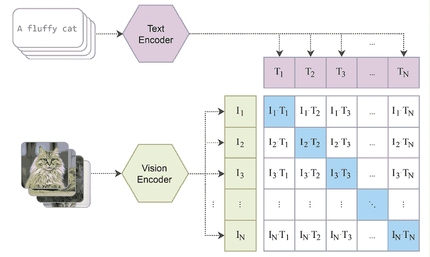

图 14.1：CLIP 架构（图基于《从自然语言监督中学习可迁移视觉模型》中的图 1：[`arxiv.org/pdf/2103.00020.pdf`](https://arxiv.org/pdf/2103.00020.pdf)）

如您所见，它采用了一个双编码器架构，集成了视觉编码器和文本编码器。视觉编码器和文本编码器的输出被投射到一个共享空间中。然后，它基于这些图像-文本对的相似性来评估它们的位置。这个共享的语义空间使得 CLIP 能够执行各种视觉-语言任务，如图像分类、物体检测和图像检索。

以下是 CLIP 模型的关键组件。

### 视觉编码器

CLIP 中的视觉编码器（也称为图像编码器）负责处理和编码图像输入。它通常实现为**卷积神经网络（CNN）**。回想一下，CNN 非常适合图像相关任务，因为它们可以有效地捕捉图像中的层次化特征。对于输入图像，视觉编码器的输出是一个固定大小的向量表示。这个嵌入向量捕捉了图像的语义内容。

视觉编码器使用了两种主要架构。第一种版本是基于 ResNet-50 模型的**修改版 ResNet 模式**。此外，平均池化层被替换为注意力池化机制。这个注意力池化通过多头注意力的单层实现，查询条件是最近引入的**视觉变换器（Vision Transformer）**（`https://huggingface.co/google/vit-base-patch16-224`）。它在 Transformer 之前还包括了一个额外的归一化层，这是唯一的调整。

需要注意的是，生成的视觉嵌入存在于与文本编码器嵌入**共享的空间**中。这个共享空间的投射使得视觉和文本表示可以直接进行比较。如果图像和文本描述在语义上相关，它们将在这个空间中被映射到更接近的位置。例如，一张猫的图片和对应的文本“a fluffy cat”将在该空间中靠得很近，表示它们的语义相似性。

视觉编码器在一个包含图像及其相关文本描述的大规模、多样化数据集上进行了预训练。例如，OpenAI 在 CLIP 论文中提到（[`openai.com/index/clip`](https://openai.com/index/clip)）他们的模型是在一个包含 4 亿对图像-文本的集合上训练的，这些数据通过爬取互联网获得。预训练过程使得视觉编码器能够学习丰富且通用的视觉表示。此外，所学到的表示是任务无关的。因此，我们可以对 CLIP 模型进行微调，以适应各种文本-图像应用。

### 文本编码器

同样，文本编码器负责处理和编码文本输入。该过程从分词开始。分词后的文本通过嵌入层转换成固定大小的高维向量。此外，为了保留文本中的重要序列信息，我们会在嵌入中加入**位置编码**。最终生成的嵌入能够捕捉文本的语义内容。

文本编码器实现为一个具有特定架构的 Transformer。例如，OpenAI 团队使用了一个 12 层、512 宽的模型，配备 8 个注意力头和总共 6300 万个参数，最大序列长度限制为 76。

如前所述，文本嵌入与视觉编码器的嵌入位于共享空间中。这使得视觉和文本输入可以直接比较，实现跨模态理解。同样，在多样化数据集上进行预训练使得模型能够从不同语言背景中学习可泛化的上下文理解。文本编码器可以与视觉编码器协作，针对各种下游任务进行微调。

### 对比学习

对比学习是 CLIP 中的训练策略。它教会模型区分相似和不相似的图像-文本对。在训练过程中，CLIP 会接收正向和负向的图像-文本对。正向对由语义相关的图像和描述组成；而负向对则是将一张图像与随机选取的描述配对，形成不匹配。

对比学习的核心是将正向对的嵌入拉近共享嵌入空间，同时将负向对的嵌入推得更远。这种分离是通过**对比损失函数**实现的。让我们来详细分析对比损失的计算：

1.  嵌入生成：

给定*N*张图像*I*和相应的文本描述*T*，CLIP 模型首先使用其双重编码器（视觉编码器和文本编码器）架构生成图像嵌入！[](img/B21047_14_001.png)和文本嵌入！[](img/B21047_14_002.png)。

1.  相似度矩阵计算：

由于嵌入！[](img/B21047_14_001.png)`和`！[](img/B21047_14_002.png)位于同一空间，我们可以计算成对的相似度*S*。对于图像*i*和文本*j*，它们的相似度！[](img/B21047_14_005.png)是图像嵌入！[](img/B21047_14_006.png)与文本嵌入！[](img/B21047_14_007.png)的余弦相似度：

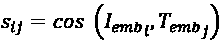

这里，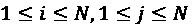。目标是最大化*N*个正向对的图像和文本嵌入的相似性，同时最小化*N*² − *N*个负向配对的嵌入相似性。

1.  目标矩阵创建：

接下来，我们构造用于学习的目标（“理想”）矩阵 *Y*。`这里，` 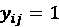 如果图像 *i* 和文本 *j* 是 `正对`（对角元素）；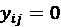 对于所有其他对（非对角元素）。

1.  交叉熵损失计算：

给定相似度矩阵 *S* 和目标矩阵 *Y*，我们接着计算图像和文本模态的交叉熵损失。这里是图像对齐的损失：

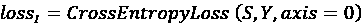

它衡量的是模型在给定文本描述的情况下，预测正确图像的能力。

测量模型在给定图像的情况下预测正确描述的文本对齐损失是：

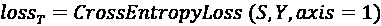

1.  最终损失计算：

对比损失是图像基础损失和文本基础损失的平均值：

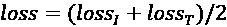

在训练过程中，模型的参数会被更新以最小化对比损失函数。这驱使模型学习嵌入，使得正确配对的图像和文本对齐，而将不匹配的对分开。

对比学习目标有助于有效的跨模态检索和理解。结合双编码器架构，一个预训练的 CLIP 模型可以执行各种下游的图像-文本任务，而无需特定任务的重新训练。那么，这些典型的应用和场景有哪些呢？让我们接下来看看。

## 探索 CLIP 模型的应用

在本节中，我们将解释 CLIP 模型的一些常见应用和使用场景。

### 零样本图像分类

在零样本学习的设置中，CLIP 面对的是一个它没有经过显式训练的任务。例如，它可能被要求将图像分类到从未见过的类别中，或在预训练期间没有见过类似示例的情况下，为图像生成描述。

第一个零样本应用是基于文本描述的图像分类。由于模型的预训练知识，我们不需要进行任何特定任务的训练。模型可以根据图像与描述的对齐情况来对图像进行分类。

例如，给定三张未见过的图像（*图像 1*：一张红色复古车停在城市街道上的照片；*图像 2*：一幅描绘红色汽车在城市环境中的画作；*图像 3*：一幅描绘城市的卡通插画，城市中有一辆红色汽车），我们将查询文本“在城市街道上停放的复古红色汽车”传递给 CLIP 模型。它可能会正确地将 *图像 1* 排名为与查询最相关的图像，因为它展示了街道上的红色复古车。由于其卡通风格，*图像 3* 可能会被评为最不相关的图像，因为它与查询的对齐程度最低。

零样本学习能力使得 CLIP 在标签样本稀缺甚至无法获取的任务中也能发挥作用。我们已经看到，它能够为那些在预训练期间从未见过的类别对图像进行分类。在下一节中，我们将使用它进行零样本文本分类。

### 零样本文本分类

类似地，CLIP 还可以根据图像对新的文本描述进行分类。在零样本设置下，我们不需要为微调提供标注的示例。该模型可以根据文本与图像的匹配度对文本输入进行分类。

例如，给定一张山脉景观的查询图像和三种可能的描述（*文本 1*：“一览宁静的山脉景观”，“*文本 2*：“山脉的壮丽峰峦与山谷”，“*文本 3*：“山区的徒步小道”），CLIP 模型可能会因与查询图像的最高匹配度而将*文本 1* 评分为最相关的描述。

我们已经讨论过 CLIP 用于零样本图像和文本分类。事实上，我们可以将其扩展到内容检索。接下来让我们看看下一部分。

### 图像与文本检索

CLIP 可用于根据给定的文本查询检索相关的图像，反之亦然。

例如，在图像检索中，我们将文本查询“顽皮的小狗”传递给图像搜索引擎。CLIP 模型检索出与“顽皮的小狗”描述最匹配的图像，并根据它们与文本查询的匹配度进行排序。类似地，CLIP 也可以用来检索并排序准确描述图像内容的标题。

我们已经展示了 CLIP 的跨模态检索能力。在下一部分，我们将探讨其在跨模态生成中的应用。

### 图像与文本生成

除了从现有内容池中检索，我们还可以使用 CLIP 基于文本提示生成图像，或为图像提供文本描述。

例如，我们可以通过给 CLIP 模型提供类似“一个机器人骑自行车的超现实主义画作”这样的提示，生成艺术图像。我们还可以要求 CLIP 模型描述一张现代厨房的图片，它可能回答：“一个现代化的厨房设计。”

事实上，CLIP 可以回答关于给定图像的许多问题，不仅仅是提供描述。

视觉问答（VQA）

CLIP 可以被调整用于视觉问答任务。它可以根据对视觉和文本模态的理解，回答关于图像的问题。例如，我们可以用该模型回答诸如“这是什么动物？”或者“照片中有多少人？”之类的问题。

### 迁移学习

最后，我们可以对 CLIP 进行微调，应用于特定的下游任务，例如物体检测、情感分析和自定义分类任务。

在预训练过程中，CLIP 模型通过多样的图像和文本，获得跨模态的广泛理解。利用迁移学习，我们不需要进行大量任务特定的训练，它可以广泛应用于视觉和 NLP 的各种任务。

迫不及待地想要开始实现 CLIP 吗？让我们从深入了解包含图像和标题的数据集开始，这将是我们训练过程中的基础。

# 开始使用数据集

我们将使用由 M. Hodosh, P. Young 和 J. Hockenmaier 创建的`Flickr8k`数据集（[`hockenmaier.cs.illinois.edu/8k-pictures.html`](https://hockenmaier.cs.illinois.edu/8k-pictures.html)），该数据集在《*将图像描述框架化为排序任务：数据、模型与评估指标*》一文中有所描述，刊登在《*人工智能研究期刊*》第 47 卷，853–899 页（[`www.jair.org/index.php/jair/article/view/10833/25855`](https://www.jair.org/index.php/jair/article/view/10833/25855)）。该数据集通常应用于各种计算机视觉任务，尤其是图像标题生成。

`Flickr8k`数据集包含来自 Flickr 照片共享网站的 8,000 张图像。这些图像涵盖了各种各样的场景、物体和活动。数据集中的每张图像都与五个英文句子相关联，这些句子作为标题，提供了图像内容的文本描述。

`Flickr8k`数据集的一个常见用途是图像标题生成，目标是训练模型为图像生成类人化的标题。`Flickr8k`数据集常被研究人员和实践者用作图像标题生成模型的基准。它使我们能够评估模型理解和描述视觉内容的能力，并以自然语言表达。

还有一个扩展版本叫做`Flickr30k`，它包含了 30,000 张带有对应标题的图像。这个更大的数据集提供了更广泛和多样化的图像集用于训练和评估，但它也消耗更多的计算资源。因此，在本章中我们将重点关注`Flickr8k`数据集。

## 获取 Flickr8k 数据集

若要获取`Flickr8k`数据集，只需在[`illinois.edu/fb/sec/1713398`](https://illinois.edu/fb/sec/1713398)提交请求。收到请求后，数据集链接将通过电子邮件发送给你。链接之一将引导你下载文件`Flickr8k_Dataset.zip`，你可以从中提取 8,091 个图像文件。另一个链接会引导你下载名为`Flickr8k_text.zip`的文件。我们将使用提取的`Flickr8k.token.txt`文件，其中包含了`Flickr8k`数据集的原始标题。第一列的格式为“图像路径 # 标题编号”，第二列则是对应的标题。

数据集也可以在 Kaggle 上获取，例如[`www.kaggle.com/datasets/adityajn105/flickr8k/data`](https://www.kaggle.com/datasets/adityajn105/flickr8k/data)。`captions.txt`文件包含了与`Flickr8k.token.txt`文件相似的信息，但更易于使用，因为第一列仅包含图像路径。为了简化操作，我们将使用`captions.txt`文件，而不是原始的`Flickr8k.token.txt`文件。

## 加载 Flickr8k 数据集

在从`Flickr8k_Dataset.zip`中提取所有图像并准备好标题文本文件后，我们现在可以将`Flickr8k`数据集加载到自定义的 PyTorch Dataset 对象中。请按照以下步骤进行：

1.  首先，我们导入必要的软件包：

    ```py
    >>> import os
    >>> from PIL import Image
    >>> import torch
    >>> from torch.utils.data import Dataset, DataLoader
    >>> import torchvision.transforms as transforms 
    ```

在这里，`Image`包将用于加载图像文件。

1.  我们将图像目录和标题文件路径设置如下：

    ```py
    >>> image_dir = "flickr8k/Flicker8k_Dataset"
    >>> caption_file = "flickr8k/captions.txt" 
    ```

在这里，我们将所有提取的图像放入`flickr8k/Flicker8k_Dataset`文件夹，并将`captions.txt`文件放在同一根目录`flickr8k`下。

1.  接下来，我们加载`DistilBRET`分词器，就像在上一章中所做的那样，*《使用 Transformer 模型推进语言理解与生成》*：

    ```py
    >>> from transformers import DistilBertTokenizer
    >>> tokenizer = DistilBertTokenizer.from_pretrained(
                                             'distilbert-base-uncased') 
    ```

1.  现在，我们为`Flickr8k`数据集创建一个自定义的 PyTorch Dataset 类，如下所示：

    ```py
    >>> class Flickr8kDataset(Dataset):
            def __init__(self, image_dir, caption_file):
                self.image_dir = image_dir
                self.transform = transforms.Compose([
                                    transforms.Resize((224, 224)),
                                    transforms.ToTensor(),
                                 ])
                self.image_paths, self.captions = 
                self.read_caption_file(caption_file)
            def read_caption_file(self, caption_file):
                image_paths = []
                captions = []
                with open(caption_file, "r") as file:
                    lines = file.readlines()
                    for line in lines[1:]:
                        parts = line.strip().split(",")
                         image_paths.append(os.path.join(self.image_dir,
                                                         parts[0]))
                         captions.append(parts[1])
                self.caption_encodings = tokenizer(captions, truncation=True,
                                                   padding=True,
                                                   max_length=200)
                return image_paths, captions
            def __len__(self):
                return len(self.image_paths)

            def __getitem__(self, idx):
                item = {key: torch.tensor(val[idx]) for key, val in
                                                self.caption_encodings.items()}
                caption = self.captions[idx]
                item["caption"] = caption
                img_path = self.image_paths[idx]
                img = Image.open(img_path).convert("RGB")
                img = self.transform(img)
                item['image'] = img
                return item 
    ```

在初始化时，我们使用`torchvision`中的`transforms`模块定义一个`n`图像转换函数，包括将图像调整为（224，224）像素并转换为张量；我们逐行读取标题文件，提取图像路径和标题，并将它们存储在`image_paths`和`captions`列表中。标题使用给定的分词器进行标记化和编码，支持截断、填充以及最大长度为 200 个标记。结果存储在`caption_encodings`中。

从数据集中获取一个项目时，经过标记化和编码的标题会与原始标题一起存储在`item`对象中。相应索引的图像也会被加载、转换，并添加到`item`中。

1.  我们初始化一个自定义的`Dataset`类实例，如下所示：

    ```py
    >>> flickr8k_dataset = Flickr8kDataset(image_dir=image_dir,
                                           caption_file=caption_file) 
    ```

看看一个数据样本：

```py
>>> item_sample = next(iter(flickr8k_dataset))
{'input_ids': tensor([ 101, 1037, 2775, 1999, 1037, 5061, 4377, 2003, 
        8218, 2039, 1037, 2275, 1997, 5108, 1999, 2019, 4443, 2126, 1012, 
         102,    0,    0,    0,    0,    0,    0,    0,    0,    0,    0, 
           0,    0,    0,    0,    0,    0,    0,    0,    0]),
 'attention_mask': tensor([1, 1, 1, 1, 1, 1, 1, 1, 1, 1, 1, 1, 1, 1, 1, 
           1, 1, 1, 1, 1, 0, 0, 0, 0, 0, 0, 0, 0, 0, 0, 0, 0, 0, 0, 0, 0,
           0, 0, 0]),
 'caption': 'A child in a pink dress is climbing up a set of stairs in an entry way.',
 'image': tensor([[[0.3216, 0.4353, 0.4549,  ..., 0.0157, 0.0235, 0.0235],
          [0.3098, 0.4431, 0.4667,  ..., 0.0314, 0.0275, 0.0471],
          [0.3020, 0.4588, 0.4745,  ..., 0.0314, 0.0275, 0.0392],
          ...,
          [0.7294, 0.5882, 0.6706,  ..., 0.8314, 0.6471, 0.6471],
          [0.6902, 0.6941, 0.8627,  ..., 0.8235, 0.6588, 0.6588],
          [0.8118, 0.8196, 0.7333,  ..., 0.8039, 0.6549, 0.6627]],
         [[0.3412, 0.5020, 0.5255,  ..., 0.0118, 0.0235, 0.0314],
          [0.3294, 0.5059, 0.5412,  ..., 0.0353, 0.0392, 0.0824],
          [0.3098, 0.5176, 0.5529,  ..., 0.0353, 0.0510, 0.0863],
          ...,
          [0.4235, 0.3137, 0.4784,  ..., 0.8667, 0.7255, 0.7216],
          [0.3765, 0.5059, 0.6627,  ..., 0.8549, 0.7216, 0.7216],
          [0.4941, 0.5804, 0.4784,  ..., 0.8392, 0.7216, 0.7216]],
         [[0.3804, 0.4902, 0.4980,  ..., 0.0118, 0.0157, 0.0196],
          [0.3608, 0.5059, 0.5176,  ..., 0.0275, 0.0235, 0.0235],
          [0.3647, 0.5255, 0.5333,  ..., 0.0196, 0.0235, 0.0275],
          ...,
          [0.1216, 0.1098, 0.2549,  ..., 0.9176, 0.8235, 0.7961],
          [0.0784, 0.1804, 0.2902,  ..., 0.9137, 0.8118, 0.7843],
          [0.1843, 0.2588, 0.2824,  ..., 0.9176, 0.8039, 0.7686]]])} 
```

该标题是`一个穿粉色裙子的孩子正在爬上入口处的一组楼梯`*。*让我们使用以下脚本显示图像本身：

```py
>>> import matplotlib.pyplot as plt
>>> import numpy as np
>>> npimg = item_sample['image'].numpy()
>>> plt.imshow(np.transpose(npimg, (1, 2, 0))) 
```

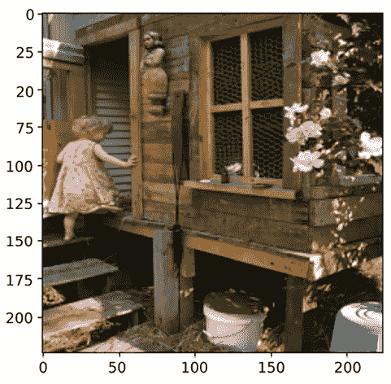

图 14.2：Flickr8k 数据样本的图像（照片来源：Rick & Brenda Beerhorst，Flickr：[`www.flickr.com/photos/studiobeerhorst/1000268201/`](https://www.flickr.com/photos/studiobeerhorst/1000268201/))

1.  数据准备的最后一步是创建一个`DataLoader`对象来处理批次和洗牌。我们将批次大小设置为 32，并基于之前创建的数据集初始化一个`DataLoader`：

    ```py
    >>> batch_size = 32
    >>> data_loader = DataLoader(flickr8k_dataset, batch_size=batch_size, shuffle=True) 
    ```

数据集准备好后，让我们继续开发下一节中的 CLIP 模型。

## 构建 CLIP 模型

视觉编码器和文本编码器是 CLIP 模型的两个主要组成部分。我们将从视觉编码器开始。

### 视觉编码器

实现视觉编码器非常简单。我们利用 PyTorch 的`vision`库，它提供了多种预训练的图像模型，包括`ResNets`和`VisionTransformer`。在这里，我们选择 ResNet50 作为我们的视觉编码器示例。

视觉编码器确保每个图像被编码为一个固定大小的向量，其维度与模型的输出通道匹配（对于 ResNet50，向量大小为`2048`）：

```py
>>> import torch.nn as nn
>>> from torchvision.models import resnet50
>>> class VisionEncoder(nn.Module):
        def __init__(self):
            super().__init__()
            pretrained_resnet50 = resnet50(pretrained=True)
            self.model = nn.Sequential(*list(
                                       pretrained_resnet50.children())[:-1])
            for param in self.model.parameters():
                param.requires_grad = False
        def forward(self, x):
            x= self.model(x)
            x = x.view(x.size(0), -1)
            return x 
```

在初始化时，我们加载预训练的 ResNet50 模型。然后，我们去除最终的分类层，因为我们将 ResNet50 模型用作特征提取器，而不是分类器。在这里，我们通过将模型的`requires_grad`训练属性设置为 false，冻结模型的参数。你也可以通过使参数可训练来微调预训练的 ResNet50 模型组件。`forward`方法用于从输入图像中提取图像嵌入。

我们刚刚基于预训练的 ResNet50 模型实现了`VisionEncoder`模块。我们使用模型的隐藏层输出作为每张图像的固定大小向量表示。由于我们忽略了其最终的分类层，在这种情况下，ResNet50 模型被用作图像特征提取器。

接下来，我们将继续处理文本编码器模块。

### 文本编码器

为了简化，我们将使用 DistilBERT 作为文本编码器。我们通过利用`[CLS]`标记的最终表示来提取句子的完整表示。预期是这个表示能够捕获句子的整体意义（在本例中是图片的描述）。从概念上讲，这类似于应用于图像的过程，其中图像被转换为固定大小的向量。对于 DistilBERT（以及 BERT），每个标记的输出表示是一个大小为`768`的向量。

我们使用以下代码实现文本编码器：

```py
>>> from transformers import DistilBertModel
>>> class TextEncoder(nn.Module):
        def __init__(self):
            super().__init__()
            self.model = DistilBertModel.from_pretrained(
                                              'distilbert-base-uncased')
            for param in self.model.parameters():
                param.requires_grad = False
        def forward(self, input_ids, attention_mask=None):
            outputs = self.model(input_ids=input_ids,
                                 attention_mask=attention_mask)
            return outputs.last_hidden_state[:, 0, :] 
```

在初始化时，我们首先从 Hugging Face Transformers 库加载一个预训练的 DistilBERT 模型。然后，通过将所有参数的`requires_grad`设置为`False`，我们冻结 DistilBERT 模型的参数。同样，你也可以通过使参数可训练来微调预训练的 DistilBERT 模型。在前向传播中，我们将输入传入 DistilBERT 模型，并从模型的输出中提取最后的隐藏状态。最后，我们返回与`[CLS]`标记对应的向量，作为输入描述的嵌入表示。

我们刚刚实现了`TextEncoder`模块，用于使用 DistilBERT 模型对文本输入进行编码。它使用`[CLS]`标记表示作为输入文本序列的固定大小向量表示。与我们在视觉编码器中所做的类似，为了简化操作，我们冻结了 DistilBERT 模型中的参数，并将其用作文本特征提取器，而不进行进一步的训练。

## 对比学习的投影头

在将图像和文本编码为固定大小的向量（图像为 2,048，文本为 768）后，下一步是将它们投影到共享空间中。这个过程使得图像和文本嵌入向量能够进行比较。我们稍后可以训练 CLIP 模型，以区分相关和不相关的图像-文本对。

我们开发了以下头部投影模块，将初始的 2,048 维图像向量或 768 维文本向量转换为共享的 256 维空间：

```py
>>> class ProjectionHead(nn.Module):
        def __init__(self, embedding_dim, projection_dim=256, dropout=0.1):
            super().__init__()
            self.projection = nn.Linear(embedding_dim, projection_dim)
            self.gelu = nn.GELU()
            self.fc = nn.Linear(projection_dim, projection_dim)
            self.dropout = nn.Dropout(dropout)
            self.layer_norm = nn.LayerNorm(projection_dim)
        def forward(self, x):
            projection = self.projection(x)
            x = self.gelu(projection)
            x = self.fc(x)
            x = self.dropout(x)
            x = projection + x
            x = self.layer_norm(x)
            return x 
```

在这里，我们首先创建一个线性投影层，将输入向量的大小从`embedding_dim`转换为`projection_dim`。然后，我们应用**高斯误差线性单元**（**GELU**）激活函数来引入非线性。接着，我们添加另一个全连接层，并加入一个 dropout 层进行正则化。最后，我们应用层归一化以提高训练效率。

GELU 是一种激活函数，它将非线性引入神经网络。其定义为：

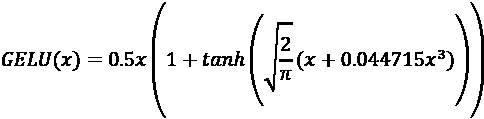

与 ReLU 相比，GELU 要复杂得多（如你所见），因此具有更平滑的梯度。此外，GELU 在更深或更复杂的网络中通常表现得比 ReLU 更好。然而，ReLU 由于其简单性和在许多场景中的有效性，仍然保持着广泛的应用。

**最佳实践**

层归一化被用于深度神经网络中，用于归一化每一层的输入。其目的是提高训练稳定性和模型的泛化能力。与批量归一化不同，批量归一化是对整个数据批次进行归一化，而层归一化是对每个单独的数据样本在特征维度上进行归一化。

对于每一个数据点，层归一化是独立地在各特征上应用的。因此，层归一化对于小批量或在线训练非常有利，而批量归一化则更适合大批量或大数据集。它们都是深度学习中稳定训练的有价值技术。你可以根据数据集大小和批量大小等因素来选择使用哪种方法。

在这个上下文中，`embedding_dim`表示输入向量的大小（对于图像为 2,048，对于文本为 768），而`projection_dim`表示输出向量的大小，在我们这个例子中是 256。

总结来说，这个投影头模块的设计是将输入的图像和文本表示向量转换到同一低维空间。除了使用线性投影外，我们还加入了非线性并采用了正则化技术，如 dropout 和层归一化。最终生成的投影向量将成为对比学习的基础构件。接下来，我们将探讨它们如何被用来学习图像和文本之间的语义关系。

### CLIP 模型

本节是整个过程的关键！我们将利用之前构建的模块来实现主要的 CLIP 模型，如下所示：

```py
>>> import torch.nn.functional as F
>>> class CLIPModel(nn.Module):
        def __init__(self, image_embedding=2048, text_embedding=768):
            super().__init__()
            self.vision_encoder = VisionEncoder()
            self.text_encoder = TextEncoder()
            self.image_projection = ProjectionHead(embedding_dim=image_embedding)
            self.text_projection = ProjectionHead(embedding_dim=text_embedding)
        def forward(self, batch):
            image_features = self.vision_encoder(batch["image"])
            text_features = self.text_encoder(
                input_ids=batch["input_ids"], 
                attention_mask=batch["attention_mask"]
            )
            image_embeddings = self.image_projection(image_features)
            text_embeddings = self.text_projection(text_features)
            logits = text_embeddings @ image_embeddings.T
            images_similarity = image_embeddings @ image_embeddings.T
            texts_similarity = text_embeddings @ text_embeddings.T
            targets = F.softmax((images_similarity + texts_similarity)/2 , dim=-1)
            texts_loss = F.cross_entropy(logits, targets)
            images_loss = F.cross_entropy(logits.T, targets.T)
            loss = (images_loss + texts_loss) / 2
            return loss.mean() 
```

初始化过程是显而易见的，我们分别为图像和文本创建`VisionEncoder`和`TextEncoder`的实例，以及它们对应的头部投影`ProjectionHead`实例。在前向传递中，我们使用视觉编码器将输入图像编码为固定大小的向量，使用文本编码器将输入文本编码。回想一下，编码后的图像和文本向量的输出大小分别为 2048 和 768。随后，我们使用单独的投影模块将编码向量投影到共享空间中，如前所述。在这个共享空间中，两个编码具有相似的形状（在我们的例子中是 256）。接下来，我们计算对比损失。具体细节如下：

1.  首先，我们通过矩阵乘法（`text_embeddings @ image_embeddings.T`）计算文本和图像嵌入的相似度。这里，PyTorch 中的`@`操作符执行矩阵乘法，或者在此上下文中执行点积操作，而`.T`是我们之前讨论过的转置操作。回想一下，在线性代数中，计算点积是衡量两个向量相似度的常见方法。更高的结果表示更大的相似度。

1.  接下来，我们计算图像嵌入之间的相似度，以及文本之间的相似度。

1.  然后，我们将图像和文本的相似度结合起来，生成目标分布。

1.  我们计算预测的 logits 与目标分布之间的交叉熵损失，分别针对图像和文本。

1.  最后，我们将图像和文本损失的平均值作为最终的对比损失。

我们刚刚开发了一个模块来使用对比损失训练 CLIP 模型。该模型接受一个包含图像和文本数据的批次，编码它们，然后将它们投影到共享空间中。接着，计算相似度并计算对比损失。目标是将相似的图像和文本表示拉近，而将不相似的图像和文本表示推远。

现在，所有模块都已准备好，训练 CLIP 模型的时间到了。

# 用文字找到图片

在本节中，我们将首先训练我们在前几节实现的 CLIP 模型。然后，我们将使用训练好的模型根据查询检索图像。最后，我们将使用预训练的 CLIP 模型进行图像搜索和零-shot 预测。

## 训练 CLIP 模型

让我们按照以下步骤训练 CLIP 模型：

1.  首先，我们创建一个 CLIP 模型并将其移动到系统设备（GPU 或 CPU）：

    ```py
    >>> device = torch.device("cuda" if torch.cuda.is_available() else "cpu")
    >>> model = CLIPModel().to(device) 
    ```

1.  接下来，我们初始化一个 Adam 优化器来训练模型，并设置学习率：

    ```py
    >>> optimizer = torch.optim.Adam(model.parameters(), lr=0.001) 
    ```

1.  如我们在前几章中所做的那样，我们定义以下训练函数来更新模型：

    ```py
    >>> def train(model, dataloader, optimizer):
            model.train()
            total_loss = 0
            b = 0
            for batch in dataloader:
                optimizer.zero_grad()
                batch = {k: v.to(device) for k, v in batch.items()
                                             if k != "caption"}
                loss = model(batch)
                optimizer.zero_grad()
                loss.backward()
                optimizer.step()
                total_loss += loss.item()*len(batch)

            return total_loss/len(dataloader.dataset) 
    ```

1.  我们训练模型三轮：

    ```py
    >>> num_epochs = 3
    >>> for epoch in range(num_epochs):
            train_loss = train(model, data_loader, optimizer)
            print(f'Epoch {epoch+1} - loss: {train_loss:.4f}')
    Epoch 1 - loss: 0.2551
    Epoch 2 - loss: 0.1504
    Epoch 3 - loss: 0.1274 
    ```

训练在三轮迭代后完成。现在，让我们使用训练好的 CLIP 模型进行图像搜索。

## 获取图像和文本的嵌入以识别匹配项

为了找到与文本查询（或反之）匹配的图像，关键过程是获得图像候选和文本查询的投影嵌入。目标是获取在其嵌入和文本嵌入之间达到最高相似度得分的图像。

为了举例说明，我们将使用单个批次的图像数据作为图像候选池。让我们来看看在这个样本池中搜索相关图像的步骤：

1.  首先，我们从`data_loader`中采样一个 32 个数据点的批次：

    ```py
    >>> torch.manual_seed(0)
    >>> data_loader = DataLoader(flickr8k_dataset, batch_size=batch_size,
                                 shuffle=True)
    >>> sample_batch = next(iter(data_loader)) 
    ```

1.  接下来，我们使用之前训练的 CLIP 模型计算所采样图像的投影嵌入：

    ```py
    >>> batch_image_features = model.vision_encoder(sample_batch["image"].to(device))
    >>> batch_image_embeddings = model.image_projection(batch_image_features) 
    ```

1.  我们现在定义图像搜索函数，如下所示：

    ```py
    >>> def search_top_images(model, image_embeddings, query, n=1):
            encoded_query = tokenizer([query])
            batch = {
                key: torch.tensor(values).to(device)
                for key, values in encoded_query.items()
            }
            model.eval()
            with torch.no_grad():
                text_features = model.text_encoder(
                    input_ids=batch["input_ids"],
                    attention_mask=batch["attention_mask"])
                text_embeddings = model.text_projection(text_features)
            dot_similarity = text_embeddings @ image_embeddings.T
            values, indices = torch.topk(dot_similarity.squeeze(0), n)
            return indices 
    ```

在这里，我们首先计算给定文本查询的投影文本嵌入。接下来，我们计算文本嵌入与每个图像候选的预计算图像嵌入之间的点积相似度。我们检索与最高相似度得分对应的前 n 个索引。别忘了将训练好的模型设置为评估模式，这表示在推理过程中不应计算梯度。

1.  现在让我们观察它的表现！首先，我们使用刚才定义的图像搜索函数搜索“`奔跑的狗`”并展示搜索结果：

    ```py
    >>> query = "a running dog"
    >>> top_image_ids = search_top_images(model, batch_image_embeddings, query, 2)
    >>> print("Query:", query)
    >>> for id in top_image_ids:
            image = sample_batch["image"][id]
            npimg = image.numpy()
            plt.imshow(np.transpose(npimg, (1, 2, 0)))
            plt.title(f"Query: {query}")
            plt.show() 
    ```

以下截图展示了结果：

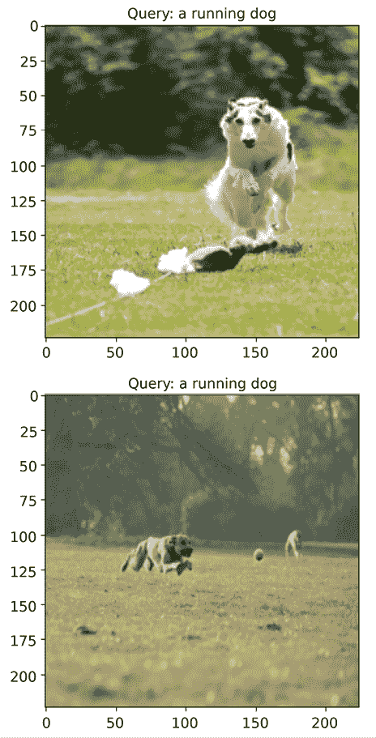

图 14.3：查询“奔跑的狗”返回的图像（顶部照片由 Ron Mandsager 提供，Flickr: [`www.flickr.com/photos/remandsager/3540416981/`](https://www.flickr.com/photos/remandsager/3540416981/); 底部照片由 Rob Burns-Sweeney 提供，Flickr: [`www.flickr.com/photos/mulberryphotographic/3368207495/`](https://www.flickr.com/photos/mulberryphotographic/3368207495/))

这两张检索到的图像与查询高度相关。

1.  在结束本节之前，让我们尝试另一个查询，“`孩子跳进游泳池`”：

    ```py
    >>> query = " kids jumping into a pool "
    >>> top_image_ids = search_top_images(model, batch_image_embeddings, query)
    >>> print("Query:", query)
    >>> for id in top_image_ids:
            image = sample_batch["image"][id]
            npimg = image.numpy()
            plt.imshow(np.transpose(npimg, (1, 2, 0)))
            plt.title(f"Query: {query}")
            plt.show() 
    ```

以下截图展示了结果：

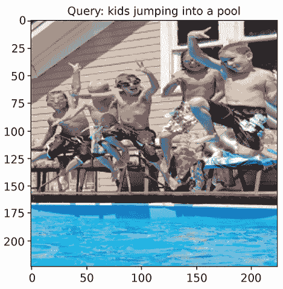

图 14.4：查询“孩子跳进游泳池”返回的图像（照片由 Alecia 提供，Flickr: [`www.flickr.com/photos/jnjsmom2007/2602415701/`](https://www.flickr.com/photos/jnjsmom2007/2602415701/))

检索到的图像正是我们要找的。

我们实现的 CLIP 模型采用了预训练的 ResNet50 模型作为视觉编码器，预训练的 DistilBERT 模型作为文本编码器。请记住，我们将 ResNet50 和 DistilBERT 的参数冻结，利用它们作为图像和文本特征提取器。如果需要，您可以通过允许它们的参数可训练来微调这些模型。这将是本章的练习。我们使用`Flickr8k`数据集训练了我们的 CLIP 模型，并进行了图像搜索作为性能评估。从下一节开始，我们将使用预训练的 CLIP 模型，它从一个更大、更具多样性的数据集学习，用于执行图像搜索、图像到图像的搜索和零样本预测。

## 使用预训练的 CLIP 模型进行图像搜索

一个流行的库 SentenceTransformers（[`www.sbert.net/index.html`](https://www.sbert.net/index.html)）提供了一个 OpenAI CLIP 模型的封装。`SentenceTransformer`包是为句子和文本嵌入而开发的。它提供了预训练模型，将句子编码为语义空间中的高维向量。

让我们执行以下任务进行图像搜索，使用从`SentenceTransformer`获得的预训练 CLIP 模型：

1.  首先，使用以下命令安装`SentenceTransformers`库：

    ```py
    pip install -U sentence-transformers 
    ```

或者

```py
conda install -c conda-forge sentence-transformers 
```

1.  导入`SentenceTransformers`库并加载预训练的 CLIP 模型：

    ```py
    >>> from sentence_transformers import SentenceTransformer, util
    >>> model = SentenceTransformer('clip-ViT-B-32') 
    ```

在这里，我们使用基于**Vision Transformer**（**ViT**）的 CLIP 模型。 "B-32"的标记表示 ViT 模型的大小，这意味着它有比基础 ViT 模型多 32 倍的参数。

1.  接下来，我们需要使用刚加载的 CLIP 模型，为所有`Flickr8k`图像候选计算图像嵌入：

    ```py
    >>> import glob
    >>> image_paths = list(glob.glob('flickr8k/Flicker8k_Dataset/*.jpg'))
    >>> all_image_embeddings = []
    >>> for img_path in image_paths:
            img = Image.open(img_path)
            all_image_embeddings.append(model.encode(img, convert_to_tensor=True)) 
    ```

`model.encode()`方法可以接受文本或图像，并生成相应的嵌入。在这里，我们将所有生成的图像嵌入存储在`all_image_embeddings`中。

1.  类似于我们在前一部分做的那样，我们定义图像搜索功能如下：

    ```py
    >>> def search_top_images(model, image_embeddings, query, top_k=1):
            query_embeddings = model.encode([query], convert_to_tensor=True,
                                            show_progress_bar=False)
            hits = util.semantic_search(query_embeddings,  image_embeddings,
                                        top_k=top_k)[0]
            return hits 
    ```

在这里，我们再次使用`model.encode()`方法来获取给定查询的嵌入。我们使用`util.semantic_search`实用程序函数根据嵌入的相似性，获取给定文本查询的前 k 个图像。

1.  现在，让我们使用刚才定义的图像搜索功能搜索“`a swimming dog`”并显示搜索结果：

    ```py
    >>> query = "a swimming dog"
    >>> hits = search_top_images(model, all_image_embeddings, query)
    >>> for hit in hits:
            img_path = image_paths[hit['corpus_id']]
            image = Image.open(img_path)
            plt.imshow(image)
            plt.title(f"Query: {query}")
            plt.show() 
    ```

以下截图展示了结果：

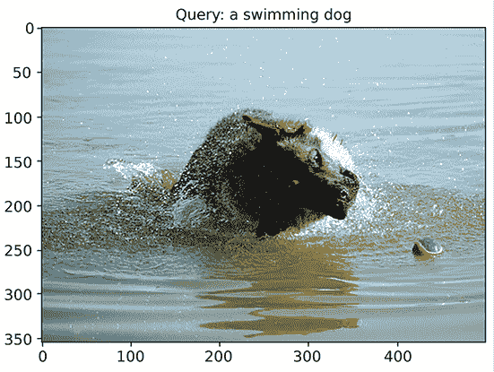

图 14.5：为查询“游泳的狗”检索到的图像（照片来自 Julia，Flickr：[`www.flickr.com/photos/drakegsd/408233586/`](https://www.flickr.com/photos/drakegsd/408233586/))

这个方法非常准确。

1.  我们可以超越文本到图像的搜索，执行**图像到图像**的搜索：

    ```py
    >>> image_query =
           Image.open("flickr8k/Flicker8k_Dataset/240696675_7d05193aa0.jpg") 
    ```

我们将选择一张随机图像，`240696675_7d05193aa0.jpg`，作为查询图像，将其输入图像搜索功能，并显示返回的与查询图像相似的图像：

```py
>>> hits = search_top_images(model, all_image_embeddings, image_query, 3)[1:]
>>> plt.imshow(image_query)
>>> plt.title(f"Query image")
>>> plt.show()
>>> for hit in hits:
        img_path = image_paths[hit['corpus_id']]
        image = Image.open(img_path)
        plt.imshow(image)
        plt.title(f"Similar image")       
        plt.show() 
```

请注意，我们跳过了第一张检索到的图像，因为它就是查询图像。

以下截图展示了结果：

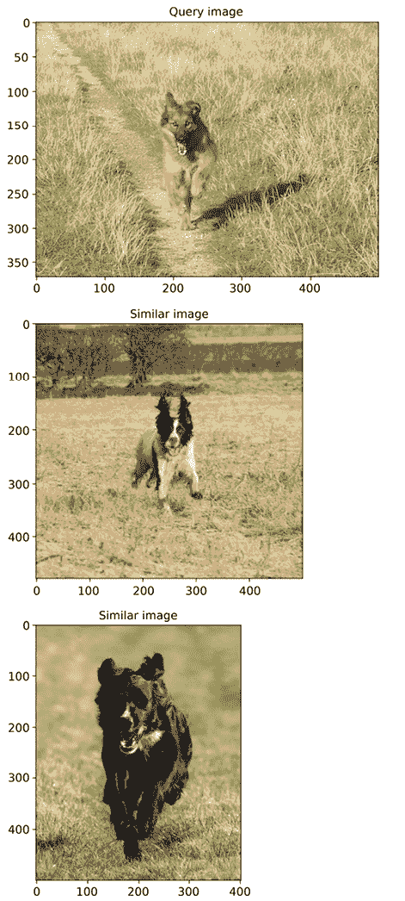

图 14.6：查询图像和相似图像（顶部照片来自 Rose，Flickr：[`www.flickr.com/photos/rosespics/240696675/`](https://www.flickr.com/photos/rosespics/240696675/); 中间照片来自 Mark Dowling，Flickr：[`www.flickr.com/photos/markdowlrods/421932359/`](https://www.flickr.com/photos/markdowlrods/421932359/); 底部照片来自 Rob，Flickr：[`www.flickr.com/photos/mind_the_goat/3419634480/`](https://www.flickr.com/photos/mind_the_goat/3419634480/))

我们可以看到，检索到的图像与查询图像高度相似。

预训练的 CLIP 模型在文本到图像和图像到图像的搜索任务中表现出色。值得注意的是，模型可能没有专门在 `Flickr8k` 数据集上进行训练，但在零样本学习中表现良好，正如您在本节中所看到的。最后，让我们看一个零样本预测的另一个例子——对 CIFAR-100 数据集进行分类。

## 零样本分类

本章的最后部分，我们将利用 CLIP 模型对 `CIFAR-100` 数据集进行分类。`CIFAR-10` 和 `CIFAR-100` ([`www.cs.toronto.edu/~kriz/cifar.html`](https://www.cs.toronto.edu/~kriz/cifar.html)) 都是从 80 Million Tiny Images 数据集中提取的标注子集，该数据集由 Alex Krizhevsky、Vinod Nair 和 Geoffrey Hinton 精心策划。`CIFAR-100` 数据集包含 60,000 张 32x32 彩色图像，这些图像被分类为 100 个类别，每个类别恰好包含 600 张图像。我们可以直接从 PyTorch 加载数据集，其中包括 50,000 张用于训练的图像和 10,000 张用于测试的图像。

让我们执行以下任务以分类 `CIFAR-100` 数据集：

1.  首先，我们从 PyTorch 加载 `CIFAR-100` 数据集：

    ```py
    >>> from torchvision.datasets import CIFAR100
    >>> cifar100 = CIFAR100(root="CIFAR100", download=True, train=False) 
    ```

在这里，我们只加载包含 10,000 个样本的测试子集。

1.  检查数据集的类别：

    ```py
    >>> print(cifar100.classes)
    >>> print("Number of classes in CIFAR100 dataset:", len(cifar100.classes))
    ['apple', 'aquarium_fish', 'baby', 'bear', 'beaver', 'bed', 'bee', 'beetle', 'bicycle', 'bottle', 'bowl', 'boy', 'bridge', 'bus', 'butterfly', 'camel', 'can', 'castle', 'caterpillar', 'cattle', 'chair', 'chimpanzee', 'clock', 'cloud', 'cockroach', 'couch', 'crab', 'crocodile', 'cup', 'dinosaur', 'dolphin', 'elephant', 'flatfish', 'forest', 'fox', 'girl', 'hamster', 'house', 'kangaroo', 'keyboard', 'lamp', 'lawn_mower', 'leopard', 'lion', 'lizard', 'lobster', 'man', 'maple_tree', 'motorcycle', 'mountain', 'mouse', 'mushroom', 'oak_tree', 'orange', 'orchid', 'otter', 'palm_tree', 'pear', 'pickup_truck', 'pine_tree', 'plain', 'plate', 'poppy', 'porcupine', 'possum', 'rabbit', 'raccoon', 'ray', 'road', 'rocket', 'rose', 'sea', 'seal', 'shark', 'shrew', 'skunk', 'skyscraper', 'snail', 'snake', 'spider', 'squirrel', 'streetcar', 'sunflower', 'sweet_pepper', 'table', 'tank', 'telephone', 'television', 'tiger', 'tractor', 'train', 'trout', 'tulip', 'turtle', 'wardrobe', 'whale', 'willow_tree', 'wolf', 'woman', 'worm']
    Number of classes in CIFAR100 dataset: 100 
    ```

共有 100 个类别。

1.  我们从一个样本开始：

    ```py
    >>> sample_index = 0
    >>> img, class_id = cifar100[index]
    >>> print(f"Class of the sample image: {class_id} - {cifar100.classes[class_id]}")
    Class of the sample image: 49 - mountain 
    ```

我们将尝试是否能正确地将其分类为“`mountain`”（山脉）。

1.  然后，我们使用预训练的 CLIP 模型生成所选数据样本的图像嵌入：

    ```py
    >>> sample_image_embeddings = model.encode(img, convert_to_tensor=True) 
    ```

1.  现在，这里有一个巧妙的方法。我们将每个类别视为文本描述，目标是找到最合适的描述来对给定图像进行分类。因此，我们需要为 100 个类别生成文本嵌入：

    ```py
    >>> class_text = model.encode(cifar100.classes, convert_to_tensor=True) 
    ```

1.  让我们为给定图像搜索最佳的类别文本描述，如下所示：

    ```py
    >>> hits = util.semantic_search(sample_image_embeddings,  class_text, top_k=1)[0]
    >>> pred = hits[0]['corpus_id']
    >>> print(f"Predicted class of the sample image: {pred}")  
    Predicted class of the sample image: 49 
    ```

我们可以正确预测样本图像的类别。那么整个数据集呢？我们将在接下来的步骤中评估其性能。

1.  同样，我们计算数据集中所有图像的图像嵌入：

    ```py
    >>> all_image_embeddings = []
    >>> class_true = []
    >>> for img, class_id in cifar100:
            class_true.append(class_id)
            all_image_embeddings.append(model.encode(img, convert_to_tensor=True)) 
    ```

我们还会记录真实的类别信息。

1.  现在，我们为每张图像搜索最佳的类别文本描述：

    ```py
    >>> class_pred = []
    >>> for hit in util.semantic_search(all_image_embeddings,  class_text, top_k=1):
            class_pred.append(hit[0]['corpus_id']) 
    ```

最后，我们评估分类准确率：

```py
>>> from sklearn.metrics import accuracy_score
>>> acc = accuracy_score(class_true, class_pred)
>>> print(f"Accuracy of zero-shot classification: {acc * 100}%")
Accuracy of zero-shot classification: 55.15% 
```

我们在 100 类 CIFAR 数据集上获得了 55% 的分类准确率。

本项目演示了 CLIP 如何用于零样本分类。该模型在训练时没有见过特定的图像-标签对，但仍能预测图像的文本标签。根据您的具体使用案例，可以自由调整文本描述和图像。例如，您可以将几个相似的细分类别合并为一个粗类，如将 “`boy`” （男孩）、“`girl`”（女孩）、“`man`”（男人）和“`woman`”（女人）合并为“`people`”（人类）。

使用 CLIP 进行零样本分类非常强大，但其性能受限于预训练模型所使用的训练数据。直观地说，可以通过利用在更大数据集上预训练的模型来改善这一点。另一种方法是知识蒸馏，它将复杂且高性能的模型的知识转移到一个更小、更快的模型中。你可以在*Distilling the Knowledge in a Neural Network*（2015 年），作者 Geoffrey Hinton、Oriol Vinyals 和 Jeff Dean 中阅读更多关于知识蒸馏的内容（[`arxiv.org/abs/2006.05525`](https://arxiv.org/abs/2006.05525)）。

# 总结

本章介绍了 CLIP，这是一种强大的深度学习模型，设计用于跨模态任务，例如根据文本查询查找相关图像或反之亦然。我们了解到，模型的双编码器架构和对比学习机制使其能够在共享空间中理解图像和文本。

我们实现了自定义版本的 CLIP 模型，使用了 DistilBERT 和 ResNet50 模型。在探索`Flickr8k` 数据集后，我们构建了一个 CLIP 模型，并探索了其在文本到图像和图像到图像搜索中的能力。CLIP 在零样本迁移学习方面表现出色。我们通过使用预训练的 CLIP 模型进行图像搜索和`CIFAR-100` 分类展示了这一点。

在下一章中，我们将重点介绍第三类机器学习问题：强化学习。你将学习强化学习模型如何通过与环境的互动来实现其学习目标。

# 练习

1.  微调我们自实现的 CLIP 模型中使用的预训练 ResNet50 和 DistilBERT 模型。

1.  你能在 10 类`CIFAR-10`数据集上进行零样本分类吗？

1.  使用`CIFAR-100` 数据集的训练集微调 CLIP 模型，并查看是否能在测试集上获得更好的性能。

# 参考文献

+   *从自然语言监督中学习可迁移的视觉模型*，Alec Radford 等著。

+   `Flickr8k` 数据集：*将图像描述构建为排序任务：数据、模型和评估指标*，*人工智能研究杂志*，第 47 卷，第 853–899 页

+   `CIFAR-100` 数据集：*从微小图像中学习多层次特征*，Alex Krizhevsky，2009 年。

# 加入我们书籍的 Discord 讨论区

加入我们社区的 Discord 讨论区，与作者和其他读者交流：

[`packt.link/yuxi`](https://packt.link/yuxi)


