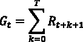
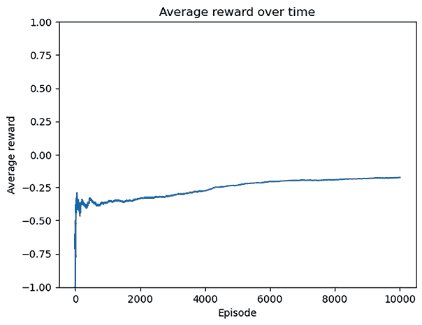

# 第十五章：在复杂环境中通过强化学习做决策

在上一章，我们专注于图像和文本联合学习的多模态模型。本书的最后一章将讲解强化学习，这是书籍开头提到的第三类机器学习任务。你将看到从经验中学习和与环境互动学习与之前讲解的监督学习和无监督学习的区别。

本章将涵盖以下内容：

+   设置工作环境

+   用示例介绍强化学习

+   使用动态规划解决 FrozenLake 环境问题

+   执行蒙特卡罗学习

+   使用 Q-learning 算法解决出租车问题

# 设置工作环境

让我们开始设置本章所需的工作环境，包括 Gymnasium（它基于 OpenAI Gym），这是一个为你提供各种环境的工具包，帮助你开发学习算法。

# 介绍 OpenAI Gym 和 Gymnasium

**OpenAI Gym** 是一个开发和比较强化学习算法的工具包。它提供了一系列环境或“任务”，强化学习智能体可以在这些环境中互动并学习。这些环境从简单的网格世界游戏到复杂的现实世界场景仿真不等，允许研究人员和开发者实验各种强化学习算法。它由 OpenAI 开发，旨在构建安全且有益的 **人工通用智能**（**AGI**）。

OpenAI Gym 的一些关键特点包括：

+   **环境接口**：Gym 提供了一个一致的接口，用于与环境进行交互，使得智能体能够观察状态、采取行动并获得奖励（我们将在后文学习这些术语）。

+   **丰富的环境集合**：Gym 提供了多样化的环境集合，包括经典控制任务、Atari 游戏、机器人仿真等。这使得研究人员和开发者能够在各个领域评估算法。

+   **易用的 API**：Gym 的 API 简单易用，适合初学者和有经验的研究人员。开发者可以快速原型化并测试强化学习算法，利用 Gym 提供的环境。

+   **基准测试**：Gym 通过提供标准化的环境和评估指标，促进了基准测试。这使得研究人员能够比较不同算法在常见任务上的表现。

+   **社区贡献**：Gym 是一个开源项目，社区积极贡献新的环境、算法和扩展功能到该工具包中。这一合作努力帮助不断扩展和改进 Gym 的能力。

总体而言，OpenAI Gym 为强化学习社区提供了一个宝贵的资源，提供了一个标准化的平台用于研究、实验和基准测试。

Gym 曾是一个开创性的库，并且在许多年里为简洁性设定了标准。然而，它不再由 OpenAI 团队积极维护。意识到这一点，一些开发者主动创建了**Gymnasium**（[`gymnasium.farama.org/index.html`](https://gymnasium.farama.org/index.html)），并得到了 OpenAI 的批准。Gymnasium 作为 Gym 的继任者应运而生，OpenAI 的原始开发者偶尔会为其开发做出贡献，确保其可靠性和持续性。在本章中，我们将使用 Gymnasium，这是 Gym 的**维护分支**。

## 安装 Gymnasium

安装 Gymnasium 库的一种方式是通过`pip`，如下所示：

```py
pip install gymnasium 
```

推荐使用以下命令安装`toy-text`扩展：

```py
pip install gymnasium [toy-text] 
```

`toy-text`扩展提供了额外的基于文本的玩具环境，例如 FrozenLake 环境（稍后讨论），供强化学习实验使用。

安装后，您可以通过运行以下代码来检查可用的 Gymnasium 环境：

```py
>>> import gymnasium as gym
>>> print(gym.envs.registry.keys())
dict_keys(['CartPole-v0', 'CartPole-v1', 'MountainCar-v0', 'MountainCarContinuous-v0', 'Pendulum-v1', 'Acrobot-v1', 'phys2d/CartPole-v0', 'phys2d/CartPole-v1', 'phys2d/Pendulum-v0', 'LunarLander-v2', 'LunarLanderContinuous-v2', 'BipedalWalker-v3', 'BipedalWalkerHardcore-v3', 'CarRacing-v2', 'Blackjack-v1', 'FrozenLake-v1', 'FrozenLake8x8-v1', 'CliffWalking-v0', 'Taxi-v3', 'tabular/Blackjack-v0', 'tabular/CliffWalking-v0', 'Reacher-v2', 'Reacher-v4', 'Pusher-v2', 'Pusher-v4', 'InvertedPendulum-v2', 'InvertedPendulum-v4', 'InvertedDoublePendulum-v2', 'InvertedDoublePendulum-v4', 'HalfCheetah-v2', 'HalfCheetah-v3', 'HalfCheetah-v4', 'Hopper-v2', 'Hopper-v3', 'Hopper-v4', 'Swimmer-v2', 'Swimmer-v3', 'Swimmer-v4', 'Walker2d-v2', 'Walker2d-v3', 'Walker2d-v4', 'Ant-v2', 'Ant-v3', 'Ant-v4', 'Humanoid-v2', 'Humanoid-v3', 'Humanoid-v4', 'HumanoidStandup-v2', 'HumanoidStandup-v4', 'GymV21Environment-v0', 'GymV26Environment-v0']) 
```

您可以在[`gymnasium.farama.org/environments/toy_text/`](https://gymnasium.farama.org/environments/toy_text/)和[`gymnasium.farama.org/environments/atari/`](https://gymnasium.farama.org/environments/atari/)查看环境列表，包括行走、登月、赛车和 Atari 游戏。您可以通过访问[`gymnasium.farama.org/content/basic_usage/`](https://gymnasium.farama.org/content/basic_usage/)来轻松体验 Gymnasium 的介绍。

为了对不同的强化学习算法进行基准测试，我们需要在一个标准化的环境中应用它们。Gymnasium 是完美的选择，提供了多种通用环境。这类似于在监督学习和无监督学习中使用 MNIST、ImageNet 和汤森路透新闻等数据集作为基准。

Gymnasium 为强化学习环境提供了一个易于使用的接口，我们可以编写**智能体**与之交互。那么，什么是强化学习？什么是智能体？让我们在下一节中看看。

# 通过示例介绍强化学习

在本章中，我们将首先介绍强化学习的元素，并通过一个有趣的例子来讲解，接着介绍如何衡量来自环境的反馈，并介绍解决强化学习问题的基本方法。

## 强化学习的元素

你可能在小时候玩过超级马里奥（或索尼克）。在这个视频游戏中，你控制马里奥同时收集金币并避开障碍物。如果马里奥撞到障碍物或掉进空隙，游戏就结束了，你会尽力在游戏结束前收集尽可能多的金币。

强化学习与超级马里奥游戏非常相似。强化学习就是学习该做什么。它涉及观察环境中的情况，并确定正确的行动以最大化数值奖励。

以下是强化学习任务中各元素的列表（我们还将每个元素与超级马里奥和其他示例相连接，以便更容易理解）：

+   **环境**：环境是一个任务或模拟。在超级马里奥游戏中，游戏本身就是环境。在自动驾驶中，道路和交通就是环境。在围棋下棋的上下文中，棋盘是环境。环境的输入是来自**智能体**的行动，输出是发给智能体的**状态**和**奖励**。

+   **智能体**：智能体是根据强化学习模型采取**行动**的组件。它与环境互动，并观察状态，将其输入到模型中。智能体的目标是解决环境问题——也就是说，找到一组最佳行动来最大化奖励。在超级马里奥游戏中，智能体是马里奥，在自动驾驶中，自动驾驶汽车就是智能体。

+   **行动**：这是智能体可能的移动。在强化学习任务的开始阶段，当模型开始学习环境时，行动通常是随机的。超级马里奥的可能行动包括向左和向右移动、跳跃和蹲下。

+   **状态**：状态是来自环境的观察结果。它们在每个时间步上以数字方式描述当前的情况。在国际象棋游戏中，状态是棋盘上所有棋子的位置信息。在超级马里奥中，状态包括马里奥的位置和时间帧内的其他元素。在一个学习走路的机器人中，它的两条腿的位置就是状态。

+   **奖励**：每当智能体采取一个行动时，它会从环境中获得数值反馈，这个反馈叫做**奖励**。奖励可以是正数、负数或零。超级马里奥中的奖励可以是，例如，马里奥收集到一个金币时是+1，避开一个障碍物是+2，撞到障碍物是-10，或者在其他情况下为 0。

下图总结了强化学习的过程：


图 15.1：强化学习过程

强化学习过程是一个迭代循环。一开始，智能体从环境中观察到初始状态，*s*[0]。然后，智能体根据模型采取行动，*a*[0]。在智能体移动后，环境进入一个新的状态，*s*[1]，并给予反馈奖励，*R*[1]。然后，智能体根据模型使用*s*[1]和*R*[1]作为输入，采取行动，*a*[1]。这个过程会继续，直到终止、完成，或者永远持续下去。

强化学习模型的目标是最大化总奖励。那么，我们如何计算总奖励呢？是不是通过将所有时间步的奖励加起来？让我们在下一节中看看。

## 累积奖励

在时间步* t *时，**累积奖励**（也叫**回报**）*G*[1]可以表示为：



这里，*T*是终止时间步长或无限。*G*[t]表示在时间*t*采取行动*a*[t]之后的未来总奖励。在每个时间步长*t*，强化学习模型试图学习最佳的行动，以最大化*G*[t]。

然而，在许多现实世界的情况下，事情并非总是这样简单，我们只是把所有未来奖励加总起来。看看以下例子：

股票 A 在第 1 天结束时上涨 6 美元，第 2 天结束时下跌 5 美元。股票 B 在第 1 天下跌 5 美元，第 2 天上涨 6 美元。经过两天后，两只股票都上涨了 1 美元。那么，如果我们知道这一点，我们在第 1 天开始时会选择买哪只股票？显然是股票 A，因为我们不会亏损，甚至可以在第 2 天开始时卖出赚取 6 美元的利润。

两只股票的总奖励相同，但我们更倾向于股票 A，因为我们更关心即时回报而非远期回报。同样，在强化学习中，我们会对远期奖励进行折扣，折扣因子与时间跨度有关。较长的时间跨度应该对累积奖励的影响较小。这是因为较长的时间跨度包含了更多无关信息，从而具有更高的方差。

我们定义一个折扣因子*！[](img/B21047_15_002.png)*，其值介于 0 和 1 之间。我们重写累积奖励，结合折扣因子：


如你所见，*！[](img/B21047_15_004.png)*越大，折扣越小，反之亦然。如果*！[](img/B21047_15_005.png)*，则实际上没有折扣，模型会根据所有未来奖励的总和来评估一个行动。如果*！[](img/B21047_15_006.png)*，模型只关注即时奖励*R*[t][+1]。

现在我们知道如何计算累积奖励，接下来要讨论的是如何最大化它。

## 强化学习的方法

解决强化学习问题的主要方法有两种，目的是寻找最优的行动来最大化累积奖励。一种是基于策略的方法，另一种是基于价值的方法。

### 基于策略的方法

**策略**是一个函数 ，它将每个输入状态映射到一个行动：


它可以是确定性的或随机的：

+   **确定性**：从输入状态到输出行动是单一映射

+   **随机性**：这给出了所有可能行动的概率分布！[](img/B21047_15_009.png)

在**基于策略**的方法中，模型学习最优策略，将每个输入状态映射到最佳行动。智能体直接学习针对它所遇到的任何情况（状态）的最佳行动（策略）。

在基于策略的算法中，模型从一个随机的策略开始。然后计算该策略的价值函数，这一步称为**策略评估步骤**。之后，基于价值函数，找到一个新的、更优的策略，这就是**策略改进步骤**。这两个步骤会不断重复，直到找到最优策略。

假设你正在训练一名赛车手。在基于策略的方法中，你直接教导赛车手在赛道的不同部分（状态）上采取最佳操作（策略），以实现最快的圈速（奖励）。你不会告诉他们每个弯道的估计结果（奖励），而是通过反馈和练习指导他们朝着最优赛车路线前进。

### 基于价值的方法

状态的**价值** *V* 被定义为从该状态开始收集的预期未来累计奖励：


在**基于价值**的方法中，模型学习最大化输入状态价值的最优价值函数。换句话说，智能体采取行动到达能够实现最大价值的状态。

在基于价值的算法中，模型从随机的价值函数开始。然后通过迭代的方式找到一个新的、更优的价值函数，直到达到最优价值函数。

现在，假设你是一个寻宝猎人。在基于价值的方法中，你学习迷宫中不同位置（状态）的估计宝藏（价值）。这帮助你选择通向宝藏（奖励）潜力更高区域的路径，而无需预定义的行动路线（策略）。

我们已经了解到，解决强化学习问题有两种主要的方法。在下一部分中，我们将分别通过基于策略和基于价值的方式，使用动态规划方法来解决一个具体的强化学习示例（FrozenLake）。

# 使用动态规划解决 FrozenLake 环境

本节将重点讨论基于策略和基于价值的动态规划算法。但我们首先通过模拟 FrozenLake 环境开始。它模拟了一个简单的网格世界场景，其中智能体在一个冰面地形的网格中导航，目标是到达目标格子。

## 模拟 FrozenLake 环境

FrozenLake 是一个典型的 OpenAI Gym（现为 Gymnasium）环境，具有**离散**状态。它的目标是在一个网格中将智能体从起始格子移动到目标格子，同时避开陷阱。网格的大小为 4 * 4（FrozenLake-v1）或 8 * 8（FrozenLake8x8-v1）。网格中有四种类型的格子：

+   **起始格子**：这是状态 0，且奖励为 0。

+   **目标格子**：它是 4 * 4 网格中的状态 15，提供 +1 奖励并结束一个回合。

+   **冰冻格子**：在 4 * 4 网格中，状态 1、2、3、4、6、8、9、10、13 和 14 是可走的格子，给予 0 奖励。

+   **洞方格**：在 4 * 4 的网格中，状态 5、7、11 和 12 是洞方格。它会给予 0 奖励并终止剧集。

这里，**剧集**指的是强化学习环境的模拟。它包含从初始状态到终止状态的状态列表、一系列动作和奖励。在 4 * 4 的 FrozenLake 环境中，代理可以移动到 16 个方格中的任何一个，因此有 16 个可能的状态。而可选的动作有四种：向左移动（0）、向下移动（1）、向右移动（2）和向上移动（3）。

这个环境的棘手之处在于，由于冰面滑溜，代理不会总是朝着它打算的方向移动，而是可能会朝任何其他可行方向移动，或者停在原地，且这些都有一定的概率。例如，即使代理打算向上移动，它也可能会向右移动。

现在让我们按照以下步骤模拟 4 * 4 的 FrozenLake 环境：

1.  要模拟任何 OpenAI Gym 环境，我们需要先在文档中查找其名称，地址为[`gymnasium.farama.org/environments/toy_text/frozen_lake/`](https://gymnasium.farama.org/environments/toy_text/frozen_lake/)。在我们的例子中，我们得到`FrozenLake-v1`。

1.  我们导入`gym`库并创建一个`FrozenLake`实例：

    ```py
    >>> env = gym.make("FrozenLake-v1" , render_mode="rgb_array")
    >>> n_state = env.observation_space.n
    >>> print(n_state)
    16
    >>> n_action = env.action_space.n
    >>> print(n_action)
    4 
    ```

环境使用`FrozenLake-v1`标识符进行初始化。此外，`render_mode`参数设置为`rgb_array`，表示环境应将其状态渲染为 RGB 数组，适合于可视化目的。

我们还获取了环境的维度。

1.  每次我们运行一个新的剧集时，都需要重置环境：

    ```py
    >>> env.reset()
    (0, {'prob': 1}) 
    ```

这意味着代理从状态 0 开始。同样，存在 16 个可能的状态，0、1、…、15。

1.  我们渲染环境以显示它：

    ```py
    >>> import matplotlib.pyplot as plt
    >>> plt.imshow(env.render()) 
    ```

如果遇到错误，您可以安装`pyglet`库，该库通过画布渲染将`Matplotlib`图形嵌入窗口，使用以下命令：

```py
pip install pyglet 
```

您将看到一个 4 * 4 的矩阵，代表 FrozenLake 网格，以及代理所在的方格（状态 0）：


图 15.2：FrozenLake 的初始状态

1.  现在让我们开始移动代理。我们选择向右移动，因为那是可行的：

    ```py
    >>> new_state, reward, terminated, truncated, info = env.step(2)
    >>> is_done = terminated or truncated
    >>> env.render()
    >>> print(new_state)
    4
    >>> print(reward)
    0.0
    >>> print(is_done)
    False
    >>> print(info)
    {'prob': 0.3333333333333333} 
    ```

我们执行一个“向右”（2）动作，但代理以 33.33%的概率向下移动到状态 4，并获得 0 奖励，因为剧集尚未完成。

让我们看看渲染结果：

```py
>>> plt.imshow(env.render()) 
```


图 15.3：代理向右移动的结果

您可能会得到完全不同的结果，因为代理有 33.33%的概率直接移动到状态 1，或者由于冰面**滑溜**的特性，33.33%的概率停留在状态 0。

在 Gymnasium 中，"**terminated**"和"**truncated**"指的是强化学习环境中剧集结束的不同方式。当一个剧集被 terminated 时，意味着该剧集按照环境规则自然结束。当一个剧集被 truncated 时，意味着剧集在未自然结束之前被人工终止。

1.  接下来，我们定义一个函数，用于模拟在给定策略下的 FrozenLake 游戏，并返回总奖励（作为简单的开始，我们假设折扣因子为 ）：

    ```py
    >>> def run_episode(env, policy):
    ...     state, _= env.reset()
    ...     total_reward = 0
    ...     is_done = False
    ...     while not is_done:
    ...         action = policy[state].item()
    ...         state, reward, terminated, truncated, info = env.step(action)
    ...         is_done = terminated or truncated
    ...         total_reward += reward
    ...         if is_done:
    ...             break
    ...     return total_reward 
    ```

这里，`policy`是一个 PyTorch 张量，`.item()`用于提取张量中元素的值。

1.  现在让我们使用随机策略来与环境进行互动。我们将实现一个随机策略（其中采取随机动作），并计算 1,000 次游戏中的平均总奖励：

    ```py
    >>> import torch
    >>> n_episode = 1000
    >>> total_rewards = []
    >>> for episode in range(n_episode):
    ...     random_policy = torch.randint(high=n_action, size=(n_state,))
    ...     total_reward = run_episode(env, random_policy)
    ...     total_rewards.append(total_reward)
    ...
    >>> print(f'Average total reward under random policy:
              {sum(total_rewards)/n_episode}')
    Average total reward under random policy: 0.016 
    ```

平均而言，如果我们采取随机动作，智能体到达目标的概率为 1.6%。这告诉我们，解决 FrozenLake 环境并不像你想象的那么容易。

1.  作为附加步骤，您可以查看转移矩阵。**转移矩阵 T**(*s*, *a*, *s’*)包含从状态*s*采取动作*a*到达状态*s’*的概率。以状态 6 为例：

    ```py
    >>> print(env.env.P[6])
    {0: [(0.3333333333333333, 2, 0.0, False), (0.3333333333333333, 5, 0.0, True), (0.3333333333333333, 10, 0.0, False)], 1: [(0.3333333333333333, 5, 0.0, True), (0.3333333333333333, 10, 0.0, False), (0.3333333333333333, 7, 0.0, True)], 2: [(0.3333333333333333, 10, 0.0, False), (0.3333333333333333, 7, 0.0, True), (0.3333333333333333, 2, 0.0, False)], 3: [(0.3333333333333333, 7, 0.0, True), (0.3333333333333333, 2, 0.0, False), (0.3333333333333333, 5, 0.0, True)]} 
    ```

返回字典的键 0、1、2、3 表示四个可能的动作。每个键的值是一个与动作相关联的元组列表。元组的格式是（转移概率， 新状态，奖励，是否为终止状态）。例如，如果智能体打算从状态 6 采取动作 1（向下），它将以 33.33%的概率移动到状态 5（H），并获得 0 奖励，随后游戏结束；它还将以 33.33%的概率移动到状态 10，获得 0 奖励；它还将以 33.33%的概率移动到状态 7（H），获得 0 奖励并终止游戏。

在本节中，我们已经尝试了随机策略，结果只有 1.6%的成功率。但这为下一节做好了准备，在那里我们将使用基于值的动态规划算法——**值迭代算法**，来找到最优策略。

## 使用值迭代算法解决 FrozenLake 问题

值迭代是一种迭代算法。它从随机的策略值*V*开始，然后根据**贝尔曼最优性方程**（[`en.wikipedia.org/wiki/Bellman_equation`](https://en.wikipedia.org/wiki/Bellman_equation)）反复更新值，直到这些值收敛。

值完全收敛通常是困难的。因此，存在两种收敛标准。一个是设定固定的迭代次数，比如 1,000 次或 10,000 次。另一个是设定一个阈值（比如 0.0001 或 0.00001），当所有值的变化小于该阈值时，我们终止过程。

重要的是，在每次迭代中，算法并不是对所有动作的值取期望（平均值），而是选择最大化策略值的动作。迭代过程可以表示如下：


这是贝尔曼方程在状态值函数 V(s)中的表示。这里，是最优值函数；表示从状态*s*采取行动*a*后，转移到状态的转移概率；而是在状态下，通过采取行动*a*所获得的奖励。

一旦我们获得最优值，就可以相应地轻松计算出最优策略：


让我们使用值迭代算法来求解 FrozenLake 环境，如下所示：

1.  首先，我们设置`0.99`为折扣因子，`0.0001`为收敛阈值：

    ```py
    >>> gamma = 0.99
    >>> threshold = 0.0001 
    ```

1.  我们开发了值迭代算法，该算法计算最优值：

    ```py
    >>> def value_iteration(env, gamma, threshold):
    ...     """
    ...     Solve a given environment with value iteration algorithm
    ...     @param env: Gymnasium environment
    ...     @param gamma: discount factor
    ...     @param threshold: the evaluation will stop once values for all states are less than the threshold
    ...     @return: values of the optimal policy for the given environment
    ...     """
    ...     n_state = env.observation_space.n
    ...     n_action = env.action_space.n
    ...     V = torch.zeros(n_state)
    ...     while True:
    ...         V_temp = torch.empty(n_state)
    ...         for state in range(n_state):
    ...             v_actions = torch.zeros(n_action)
    ...             for action in range(n_action):
    ...                 for trans_prob, new_state, reward, _ in \
                                           env.env.P[state][action]:
    ...                     v_actions[action] += trans_prob * (
                                         reward + gamma * V[new_state])
    ...             V_temp[state] = torch.max(v_actions)
    ...         max_delta = torch.max(torch.abs(V - V_temp))
    ...         V = V_temp.clone()
    ...         if max_delta <= threshold:
    ...             break
    ...     return V 
    ```

`value_iteration`函数执行以下任务：

+   初始时，策略值设置为全 0

+   基于贝尔曼最优性方程更新值：


+   计算所有状态之间值的最大变化

+   如果最大变化大于收敛阈值，则继续更新值

+   否则，终止迭代过程，并将最后的值作为最优值返回

1.  我们应用该算法解决 FrozenLake 环境，并使用指定的参数：

    ```py
    >>> V_optimal = value_iteration(env, gamma, threshold) 
    ```

看一下结果中的最优值：

```py
>>> print('Optimal values:\n', V_optimal)
Optimal values:
tensor([0.5404, 0.4966, 0.4681, 0.4541, 0.5569, 0.0000, 0.3572, 0.0000, 0.5905, 0.6421, 0.6144, 0.0000, 0.0000, 0.7410, 0.8625, 0.0000]) 
```

1.  由于我们已经得到了最优值，可以从这些值中提取最优策略。我们开发了以下函数来实现这一点：

    ```py
    >>> def extract_optimal_policy(env, V_optimal, gamma):
    ...     """
    ...     Obtain the optimal policy based on the optimal values
    ...     @param env: Gymnasium environment
    ...     @param V_optimal: optimal values
    ...     @param gamma: discount factor
    ...     @return: optimal policy
    ...     """
    ...     n_state = env.observation_space.n
    ...     n_action = env.action_space.n
    ...     optimal_policy = torch.zeros(n_state)
    ...     for state in range(n_state):
    ...         v_actions = torch.zeros(n_action)
    ...         for action in range(n_action):
    ...             for trans_prob, new_state, reward, _ in
                                       env.env.P[state][action]:
    ...                 v_actions[action] += trans_prob * (
                               reward + gamma * V_optimal[new_state])
    ...         optimal_policy[state] = torch.argmax(v_actions)
    ...     return optimal_policy 
    ```

1.  然后，我们根据最优值获得最优策略：

    ```py
    >>> optimal_policy = extract_optimal_policy(env, V_optimal, gamma) 
    ```

看一下结果中的最优策略：

```py
>>> print('Optimal policy:\n', optimal_policy)
Optimal policy:
tensor([0., 3., 3., 3., 0., 0., 0., 0., 3., 1., 0., 0., 0., 2., 1., 0.]) 
```

这意味着，在状态 0 中最优动作是 0（左），在状态 1 中是 3（上），依此类推。如果你看这个网格，可能会觉得这不太直观。但记住，网格是滑的，智能体可能会朝着与期望方向不同的方向移动。

1.  如果你怀疑这是否是最优策略，可以使用该策略运行 1,000 次实验，并通过检查平均奖励来评估其效果，具体如下：

    ```py
    >>> def run_episode(env, policy):
            state, _ = env.reset()
            total_reward = 0
            is_done = False
            while not is_done:
                action = policy[state].item()
                state, reward, terminated, truncated, info = env.step(action)
                is_done = terminated or truncated
                total_reward += reward
                if is_done:
                    break
            return total_reward
    >>> n_episode = 1000
    >>> total_rewards = []
    >>> for episode in range(n_episode):
    ...     total_reward = run_episode(env, optimal_policy)
    ...     total_rewards.append(total_reward) 
    ```

这里，我们定义了`run_episode`函数来模拟一次实验。然后，我们打印出 1,000 次实验的平均奖励：

```py
>>> print('Average total reward under the optimal policy:', sum(total_rewards) / n_episode)
Average total reward under the optimal policy: 0.738 
```

值迭代算法保证在有限状态和动作空间的有限环境中收敛到最优值函数。它为解决强化学习问题中的最优策略提供了一种计算上高效的方法，尤其是当环境的动态已知时。在值迭代算法计算出的最优策略下，智能体在 FrozenLake 中 74%的时间能够到达目标方块。

**最佳实践**

折扣因子是强化学习中的一个重要参数，尤其对于基于价值的模型来说。较高的因子（接近 1）使智能体优先考虑长期奖励，导致更多的探索，而较低的因子（接近 0）则使其关注即时奖励。折扣因子的典型调优策略包括网格搜索和随机搜索。这两者在大范围内可能计算开销较大。自适应调优是另一种方法，其中我们在训练过程中动态调整折扣因子。你可以从一个中等的值（例如 0.9）开始。如果智能体似乎过于关注即时奖励、快速收敛并忽视探索，尝试增加折扣因子。如果智能体不断探索而无法确定良好的策略，尝试减少折扣因子。

我们能否通过基于策略的方法做类似的事情？我们将在下一节中看到。

## 使用策略迭代算法解决 FrozenLake 问题

**策略迭代**算法有两个组成部分：策略评估和策略改进。与价值迭代类似，它从一个任意的策略开始，并进行多次迭代。

在每次迭代的策略评估步骤中，我们首先计算最新策略的值，基于**贝尔曼期望方程**：


在策略改进步骤中，我们基于最新的策略值推导出改进后的策略，依然基于**贝尔曼最优性方程**：


这两步会重复直到策略收敛。收敛时，最新的策略及其价值即为最优策略和最优价值。

让我们开发策略迭代算法，并使用它来解决 FrozenLake 环境，如下所示：

1.  我们从`policy_evaluation`函数开始，计算给定策略的值：

    ```py
    >>> def policy_evaluation(env, policy, gamma, threshold):
    ...  """
    ...     Perform policy evaluation
    ...     @param env: Gymnasium environment
    ...     @param policy: policy matrix containing actions and
            their probability in each state
    ...     @param gamma: discount factor
    ...     @param threshold: the evaluation will stop once values
            for all states are less than the threshold
    ...     @return: values of the given policy
    ...  """
    ...     n_state = policy.shape[0]
    ...     V = torch.zeros(n_state)
    ...     while True:
    ...         V_temp = torch.zeros(n_state)
    ...         for state in range(n_state):
    ...             action = policy[state].item()
    ...             for trans_prob, new_state, reward, _ in \
                                         env.env.P[state][action]:
    ...                 V_temp[state] += trans_prob * 
                                         (reward + gamma * V[new_state])
    ...         max_delta = torch.max(torch.abs–V - V_temp))
    ...         V = V_temp.clone()
    ...         if max_delta <= threshold:
    ...             break
    ...     return V 
    ```

这个函数执行以下任务：

+   用全 0 初始化策略值

+   基于贝尔曼期望方程更新值

+   计算所有状态下值的最大变化

+   如果最大变化大于阈值，它会继续更新值

+   否则，它终止评估过程并返回最新的值

1.  接下来，我们在以下函数中开发第二个组件，即策略改进：

    ```py
    >>> def policy_improvement(env, V, gamma):
    ...  """"""
    ...     Obtain an improved policy based on the values
    ...     @param env: Gymnasium environment
    ...     @param V: policy values
    ...     @param gamma: discount factor
    ...     @return: the policy
    ...  """"""
    ...     n_state = env.observation_space.n
    ...     n_action = env.action_space.n
    ...     policy = torch.zeros(n_state)
    ...     for state in range(n_state):
    ...         v_actions = torch.zeros(n_action)
    ...         for action in range(n_action):
    ...             for trans_prob, new_state, reward, _ in
                                          env.env.P[state][action]:
    ...                 v_actions[action] += trans_prob * (
                                      reward + gamma * V[new_state])
    ...         policy[state] = torch.argmax(v_actions)
    ...     return policy 
    ```

它基于贝尔曼最优性方程从输入的策略值中推导出一个新的、更好的策略。

1.  有了这两个组件，我们现在开发整个策略迭代算法：

    ```py
    >>> def policy_iteration(env, gamma, threshold):
    ...  """
    ...     Solve a given environment with policy iteration algorithm
    ...     @param env: Gymnasium environment
    ...     @param gamma: discount factor
    ...     @param threshold: the evaluation will stop once values for all states are less than the threshold
    ...     @return: optimal values and the optimal policy for the given environment
    ...  """
    ...     n_state = env.observation_space.n
    ...     n_action = env.action_space.n
    ...     policy = torch.randint(high=n_action,
                                   size=(n_state,)).float()
    ...     while True:
    ...         V = policy_evaluation(env, policy, gamma, threshold)
    ...         policy_improved = policy_improvement(env, V, gamma)
    ...         if torch.equal(policy_improved, policy):
    ...             return V, policy_improved
    ...         policy = policy_improved 
    ```

这个函数执行以下任务：

+   初始化一个随机策略

+   执行策略评估以更新策略值

+   执行策略改进以生成新的策略

+   如果新策略与旧策略不同，它会更新策略，并运行另一次策略评估和改进迭代

+   否则，它终止迭代过程并返回最新的策略及其值

1.  接下来，我们使用策略迭代来解决 FrozenLake 环境：

    ```py
    >>> V_optimal, optimal_policy = policy_iteration(env, gamma, threshold) 
    ```

1.  最后，我们显示最优策略及其值：

    ```py
    >>> print('Optimal values'\n', V_optimal)
    Optimal values:
    tensor([0.5404, 0.4966, 0.4681, 0.4541, 0.5569, 0.0000, 0.3572, 0.0000, 0.5905, 0.6421, 0.6144, 0.0000, 0.0000, 0.7410, 0.8625, 0.0000])
    >>> print('Optimal policy'\n', optimal_policy)
    Optimal policy:
    tensor([0., 3., 3., 3., 0., 0., 0., 0., 3., 1., 0., 0., 0., 2., 1., 0.]) 
    ```

我们得到了与价值迭代算法相同的结果。

**最佳实践**

基于策略的方法依赖于估计期望奖励相对于策略参数的梯度。实际上，我们使用像 REINFORCE 这样的技术，它使用简单的蒙特卡洛估计，以及**近端策略优化**（**PPO**）采用稳定的梯度估计。你可以在这里阅读更多内容：[`professional.mit.edu/course-catalog/reinforcement-learning`](https://professional.mit.edu/course-catalog/reinforcement-learning)（*第八章*，*策略梯度方法*）。

我们刚刚通过策略迭代算法解决了 FrozenLake 环境。你可能会想知道如何在价值迭代和策略迭代算法之间做选择。请查看以下表格：


表 15.4：选择策略迭代和价值迭代算法之间的区别

我们通过动态规划方法解决了强化学习问题。这些方法需要环境的完全已知的转移矩阵和奖励矩阵，而且对于具有大量状态的环境，其可扩展性有限。在下一部分，我们将继续学习蒙特卡洛方法，它不需要环境的先验知识，且具有更好的可扩展性。

# 执行蒙特卡洛学习

**蒙特卡洛**（**MC**）强化学习是一种**无模型**的方法，这意味着它不需要已知的转移矩阵和奖励矩阵。在这一部分，你将了解在 Gymnasium 的 21 点环境中进行蒙特卡洛策略评估，并通过蒙特卡洛控制算法解决该环境。21 点是一个典型的具有未知转移矩阵的环境。首先让我们模拟 21 点环境。

## 模拟 21 点环境

21 点是一款流行的卡片游戏，游戏规则如下：

+   玩家与庄家对战，若玩家手中卡片的总值高于庄家的且不超过 21 点，则玩家获胜。

+   2 到 10 的牌值为 2 到 10。

+   J、K 和 Q 牌的价值为 10。

+   一张王牌的价值可以是 1 或 11（称为“可用”王牌）。

+   开始时，双方各发两张随机牌，但庄家的牌只有一张对玩家公开。玩家可以请求更多的卡片（称为**要牌**）或停止继续要牌（称为**停牌**）。在玩家决定停牌前，如果他们的卡片总和超过 21 点（称为**爆牌**），则玩家会输。停牌后，庄家会继续抽牌，直到其卡片总和达到 17 点。如果庄家卡片的总和超过 21 点，玩家获胜。如果双方都没有爆牌，则点数较高的一方获胜，或者可能平局。

Gymnasium 中的 21 点环境（[`gymnasium.farama.org/environments/toy_text/blackjack/`](https://gymnasium.farama.org/environments/toy_text/blackjack/)）的公式如下：

+   环境的回合开始时，每方各发两张牌，且仅观察到庄家的其中一张牌。

+   如果出现胜利或平局，回合结束。

+   如果玩家赢了，本回合的最终奖励为 +1；如果玩家输了，奖励为 -1；如果平局，奖励为 0。

+   在每一轮中，玩家可以选择两种动作之一，摸牌（1）或停牌（0）。

现在让我们模拟 Blackjack 环境，并探索它的状态和动作：

1.  首先，创建一个 `Blackjack` 实例：

    ```py
    >>> env = gym.make('Blackjack'v1') 
    ```

1.  重置环境：

    ```py
    >>> env.reset(seed=0)
    ((11, 10, False), {}) 
    ```

它返回初始状态（一个三维向量）：

+   玩家当前的点数（此例中为 `11`）

+   赌场公开牌的点数（此例中为 `10`）

+   是否有可用的 A 牌（此例中为 `False`）

只有当玩家拥有一张可以算作 11 点而不会爆掉的 A 牌时，`usable ace` 变量才为 `True`。如果玩家没有 A 牌，或者虽然有 A 牌但已经爆掉，则该状态变量会变为 `False`。

以另一个状态示例 `(18, 6, True)` 来看，表示玩家拥有一张算作 11 点的 A 牌和一张 7 点，而庄家的公开牌是 6 点。

1.  现在让我们采取一些动作，看看环境是如何运作的。首先，由于我们只有 11 点，我们选择摸牌动作：

    ```py
    >>> env.step(1)
    ((12, 10, False), 0.0, False, False, {}) 
    ```

它返回一个状态 `(12, 10, False)`，奖励为 0，并且该回合未结束（即 `False`）。

1.  由于我们只有 12 点，让我们再摸一张牌：

    ```py
    >>> env.step(1)
    ((13, 10, False), 0.0, False, False, {}) 
    ```

1.  我们有 13 点，认为已经足够了。于是我们通过停牌动作（0）停止抽牌：

    ```py
    >>> env.step(0)
    ((13, 10, False), -1.0, True, False, {}) 
    ```

赌场获得一些牌并击败了玩家。所以玩家输了，获得了 -1 的奖励。回合结束。

随时可以在 Blackjack 环境中进行尝试。一旦你熟悉了环境，就可以进入下一节，进行简单策略上的 MC 策略评估。

## 执行蒙特卡罗策略评估

在上一节中，我们应用了动态规划来进行策略评估，也就是策略的价值函数。然而，在大多数现实情况中，由于转移矩阵事先不可知，这种方法无法使用。在这种情况下，我们可以使用 MC 方法来评估价值函数。

为了估计价值函数，MC 方法使用经验均值回报，而不是期望回报（如在动态规划中）。有两种方法来计算经验均值回报。一个是首次访问方法，它仅对所有回合中状态 *s* 的**首次出现**进行回报平均。另一个是每次访问方法，它对所有回合中状态 *s* 的**每次出现**进行回报平均。

显然，首次访问方法计算量较小，因此使用得更为广泛。本章只介绍首次访问方法。

在本节中，我们实验了一种简单策略，直到总点数达到 18（或 19，或 20，如果你愿意的话）才停止抽牌。我们对这种简单策略进行了首次访问 MC 评估，如下所示：

1.  我们首先需要定义一个函数，模拟在简单策略下的 Blackjack 回合：

    ```py
    >>> def run_episode(env, hold_score):
    ...     state , _ = env.reset()
    ...     rewards = []
    ...     states = [state]
    ...     while True:
    ...         action = 1 if state[0] < hold_score else 0
    ...         state, reward, terminated, truncated, info = env.step(action)
    ...         is_done = terminated or truncated
    ...         states.append(state)
    ...         rewards.append(reward)
    ...         if is_done:
    ...             break
    ...     return states, rewards 
    ```

在每轮回合中，如果当前得分小于`hold_score`，代理将选择“补牌”，否则选择“停牌”。

1.  在 MC 设置中，我们需要跟踪所有步骤中的状态和奖励。在首次访问值评估中，我们只对所有回合中状态首次出现时的回报进行平均。我们定义一个函数来评估简单的 Blackjack 策略，使用首次访问 MC：

    ```py
    >>> from collections import defaultdict
    >>> def mc_prediction_first_visit(env, hold_score, gamma, n_episode):
    ...     V = defaultdict(float)
    ...     N = defaultdict(int)
    ...     for episode in range(n_episode):
    ...         states_t, rewards_t = run_episode(env, hold_score)
    ...         return_t = 0
    ...         G = {}
    ...         for state_t, reward_t in zip(
                               states_t[1::-1], rewards_t[::-1]):
    ...             return_t = gamma * return_t + reward_t
    ...             G[state_t] = return_t
    ...         for state, return_t in G.items():
    ...             if state[0] <= 21:
    ...                 V[state] += return_t
    ...                 N[state] += 1
    ...     for state in V:
    ...         V[state] = V[state] / N[state]
    ...     return V 
    ```

该函数执行以下任务：

+   使用`run_episode`函数在简单 Blackjack 策略下运行`n_episode`个回合

+   对于每个回合，计算每个状态首次访问时的`G`回报

+   对于每个状态，通过从所有回合中对其首次返回值进行平均来获得该状态的值

+   返回结果值

请注意，在这里我们忽略玩家爆牌的状态，因为我们知道这些状态的值为`-1`。

1.  我们将`hold_score`指定为`18`，折扣率指定为`1`，因为 Blackjack 回合较短，并且将模拟 500,000 个回合：

    ```py
    >>> hold_score = 18
    >>> gamma = 1
    >>> n_episode = 500000 
    ```

1.  现在我们将所有变量代入，以执行 MC 首次访问评估：

    ```py
    >>> value = mc_prediction_first_visit(env, hold_score, gamma, n_episode) 
    ```

然后我们打印出结果值：

```py
>>> print(value)
defaultdict(<class 'float'>, {(13, 10, False): -0.2743235693191795, (5, 10, False): -0.3903118040089087, (19, 7, True): 0.6293800539083558, (17, 7, True): -0.1297709923664122, (18, 7, False): 0.4188926663428849, (13, 7, False): -0.04472843450479233, (19, 10, False): -0.016647081864473168, (12, 10, False): -0.24741546832491254, (21, 10, True):
……
……
……
2, 2, True): 0.07981220657276995, (5, 5, False): -0.25877192982456143, (4, 9, False): -0.24497991967871485, (15, 5, True): -0.011363636363636364, (15, 2, True): -0.08379888268156424, (5, 3, False): -0.19078947368421054, (4, 3, False): -0.2987012987012987}) 
```

我们刚刚计算了所有可能的 280 个状态的值：

```py
>>> print('Number of states:', len(value))
Number of states: 280 
```

我们刚刚在 Blackjack 环境下使用 MC 方法计算了 280 个状态在简单策略下的值。Blackjack 环境的转移矩阵事先是未知的。此外，如果我们采用动态规划方法，获取转移矩阵（大小为 280 * 280）将非常昂贵。在基于 MC 的解决方案中，我们只需要模拟一系列的回合并计算经验平均值。以类似的方式，我们将在下一节中搜索最优策略。

## 执行在线蒙特卡洛控制

**MC 控制**用于为转移矩阵未知的环境寻找最优策略。MC 控制有两种类型，在线策略和离线策略。在**在线策略方法**中，我们执行策略并迭代地评估和改进它；而在离线策略方法中，我们使用由其他策略生成的数据训练最优策略。

在本节中，我们专注于在线策略方法。其工作原理与策略迭代方法非常相似。它在以下两个阶段之间迭代：评估和改进，直到收敛：

+   在评估阶段，我们不再评估状态值，而是评估**动作值**，通常称为**Q 值**。Q 值 *Q*(*s*, *a*)是状态-动作对(*s*, *a*)在给定策略下，采取动作*a*时的值。评估可以采用首次访问或每次访问的方式进行。

+   在改进阶段，我们通过在每个状态中分配最优动作来更新策略：


现在我们通过遵循以下步骤，使用在线 MC 控制搜索最优的 Blackjack 策略：

1.  我们首先开发一个函数，通过在给定的 Q 值下执行最佳动作来完成一局游戏：

    ```py
    >>> def run_episode(env, Q, n_action):
    ...     state, _ = env.reset()
    ...     rewards = []
    ...     actions = []
    ...     states = []
    ...     action = torch.randint(0, n_action, [1]).item()
    ...     while True:
    ...         actions.append(action)
    ...         states.append(state)
    ...         state, reward, terminated, truncated, info = env.step(action)
    ...         is_done = terminated or truncated
    ...         rewards.append(reward)
    ...         if is_done:
    ...             break
    ...         action = torch.argmax(Q[state]).item()
    ...     return states, actions, rewards 
    ```

这作为改进阶段。具体来说，它执行以下任务：

+   初始化一个情节

+   采取随机行动作为开始探索

+   第一次行动后，根据给定的 Q 值表采取行动，即 

+   存储每个情节中的状态、动作和奖励，这些将用于评估

1.  接下来，我们开发了基于策略的蒙特卡罗控制算法：

    ```py
    >>> def mc_control_on_policy(env, gamma, n_episode):
    ...     G_sum = defaultdict(float)
    ...     N = defaultdict(int)
    ...     Q = defaultdict(lambda: torch.empty(env.action_space.n))
    ...     for episode in range(n_episode):
    ...         states_t, actions_t, rewards_t =
                           run_episode(env,  Q,  env.action_space.n)
    ...         return_t = 0
    ...         G = {}
    ...         for state_t, action_t, reward_t in zip(state_t[::-1], 
                                                       actions_t[::-1],
                                                       rewards_t[::-1]):
    ...             return_t = gamma * return_t + reward_t
    ...             G[(state_t, action_t)] = return_t
    ...         for state_action, return_t in G.items():
    ...             state, action = state_action
    ...             if state[0] <= 21:
    ...                 G_sum[state_action] += return_t
    ...                 N[state_action] += 1
    ...                 Q[state][action] =
                              G_sum[state_action] / N[state_action]
    ...     policy = {}
    ...     for state, actions in Q.items():
    ...         policy[state] = torch.argmax(actions).item()
    ...     return Q, policy 
    ```

这个函数执行以下任务：

+   随机初始化 Q 值

+   运行`n_episode`个情节

+   对于每个情节，执行策略改进并获取训练数据；对生成的状态、动作和奖励执行首次访问策略评估；并更新 Q 值

+   最后，确定最优的 Q 值和最优策略

1.  现在 MC 控制函数已经准备好，我们计算最优策略：

    ```py
    >>> gamma = 1
    >>> n_episode = 500000
    >>> optimal_Q, optimal_policy = mc_control_on_policy(env, gamma, n_episode) 
    ```

看一下最优策略：

```py
>>> print(optimal_policy)
{(16, 8, True): 1, (11, 2, False): 1, (15, 5, True): 1, (14, 9, False): 1, (11, 6, False): 1, (20, 3, False): 0, (9, 6, False):
0, (12, 9, False): 0, (21, 2, True): 0, (16, 10, False): 1, (17, 5, False): 0, (13, 10, False): 1, (12, 10, False): 1, (14, 10, False): 0, (10, 2, False): 1, (20, 4, False): 0, (11, 4, False): 1, (16, 9, False): 0, (10, 8,
……
……
1, (18, 6, True): 0, (12, 2, True): 1, (8, 3, False): 1, (13, 3, True): 0, (4, 7, False): 1, (18, 8, True): 0, (6, 5, False): 1, (17, 6, True): 0, (19, 9, True): 0, (4, 4, False): 0, (14, 5, True): 1, (12, 6, True): 0, (4, 9, False): 1, (13, 4, True): 1, (4, 8, False): 1, (14, 3, True): 1, (12, 4, True): 1, (4, 6, False): 0, (12, 5, True): 0, (4, 2, False): 1, (4, 3, False): 1, (5, 4, False): 1, (4, 1, False): 0} 
```

你可能想知道这个最优策略是否真的是最优的，并且比之前的简单策略（在 18 点时停止）更好。让我们分别在最优策略和简单策略下模拟 100,000 个 21 点情节：

1.  我们从模拟简单策略下的一个情节的函数开始：

    ```py
    >>> def simulate_hold_episode(env, hold_score):
    ...     state, _ = env.reset()
    ...     while True:
    ...         action = 1 if state[0] < hold_score else 0
    ...         state, reward, terminated, truncated, info = env.step(action)
    ...         is_done = terminated or truncated
    ...         if is_done:
    ...             return reward 
    ```

1.  接下来，我们在最优策略下工作的模拟函数：

    ```py
    >>> def simulate_episode(env, policy):
    ...     state, _ = env.reset()
    ...     while True:
    ...         action = policy[state]
    ...         state, reward, terminated, truncated, info = env.step(action)
    ...         is_done = terminated or truncated
    ...         if is_done:
    ...             return reward 
    ```

1.  然后我们运行了 100,000 个情节，分别记录它们的胜利次数：

    ```py
    >>> n_episode = 100000
    >>> hold_score = 18
    >>> n_win_opt = 0
    >>> n_win_hold = 0
    >>> for _ in range(n_episode):
    ...     reward = simulate_episode(env, optimal_policy)
    ...     if reward == 1:
    ...         n_win_opt += 1
    ...     reward = simulate_hold_episode(env, hold_score)
    ...     if reward == 1:
    ...         n_win_hold += 1 
    ```

我们按以下方式打印结果：

```py
>>> print(f'Winning probability under the simple policy: {n_win_hold/n_episode}')
Winning probability under the simple policy: 0.40256
>>>print(f'Winning probability under the optimal policy: {n_win_opt/n_episode}')
Winning probability under the optimal policy: 0.43148 
```

在最优策略下玩的胜率为 43%，而在简单策略下只有 40%的胜率。

在这一部分中，我们使用无模型算法 MC 学习解决了 21 点环境。在 MC 学习中，Q 值会在情节结束时进行更新。这可能对长时间过程有问题。在接下来的部分中，我们将讨论 Q-learning，它会在情节中的每一步更新 Q 值。你将看到它如何提高学习效率。

# 使用 Q-learning 算法解决 21 点问题

Q-learning 也是一种无模型学习算法。它在情节中的每一步更新 Q 函数。我们将展示如何使用 Q-learning 来解决 21 点环境。

## 引入 Q-learning 算法

**Q-learning**是一种**离策略**学习算法，它基于由行为策略生成的数据优化 Q 值。行为策略是一个贪婪策略，它采取在给定状态下获得最高回报的动作。行为策略生成学习数据，目标策略（我们尝试优化的策略）根据以下方程更新 Q 值：


在这里， 是从状态 *s* 执行动作 *a* 后得到的结果状态，*r* 是相关奖励。 表示行为策略在给定状态  下生成的最高 Q 值。超参数  和  分别是学习率和折扣因子。Q 学习方程基于当前的 Q 值、即时奖励和智能体通过在下一个状态中采取最佳动作所能期望的未来潜在奖励，来更新一个状态-动作对的 Q 值（估计的未来奖励）。

从另一个策略生成的经验中学习，使得 Q 学习能够在每个回合的每一步优化其 Q 值。我们从贪心策略中获得信息，并立即使用这些信息更新目标值。

还有一点需要注意的是，目标策略是 epsilon 贪心策略，这意味着它以概率 （值从 0 到 1）采取随机动作，并以概率  采取贪心动作。epsilon 贪心策略结合了**利用**和**探索**：它在探索不同动作的同时，利用最佳动作。

## 开发 Q 学习算法

现在是时候开发 Q 学习算法来解决 Blackjack 环境了：

1.  我们从定义 epsilon 贪心策略开始：

    ```py
    >>> def epsilon_greedy_policy(n_action, epsilon, state, Q):
    ...     probs = torch.ones(n_action) * epsilon / n_action
    ...     best_action = torch.argmax(Q[state]).item()
    ...     probs[best_action] += 1.0 - epsilon
    ...     action = torch.multinomial(probs, 1).item()
    ...     return action 
    ```

给定  可能的动作，每个动作的选择概率为 ，具有最高状态-动作值的动作会以额外的概率  被选择。

1.  我们将从一个较大的探索因子开始 ，随着时间的推移逐渐减少，直到其值达到`0.1`。我们将起始值和最终值  定义如下：

    ```py
    >>> epsilon = 1.0
    >>> final_epsilon = 0.1 
    ```

1.  接下来，我们实现 Q 学习算法：

    ```py
    >>> def q_learning(env, gamma, n_episode, alpha, epsilon, final_epsilon):
            n_action = env.action_space.n
            Q = defaultdict(lambda: torch.zeros(n_action))
            epsilon_decay = epsilon / (n_episode / 2)
            for episode in range(n_episode):
                state, _ = env.reset()
                is_done = False
                epsilon = max(final_epsilon, epsilon - epsilon_decay)
                while not is_done:
                    action = epsilon_greedy_policy(n_action, epsilon, state, Q)
                    next_state, reward, terminated, truncated, info = env.step(action)
                    is_done = terminated or truncated
                    delta = reward + gamma * torch.max(
                                               Q[next_state]) - Q[state][action]
                    Q[state][action] += alpha * delta
                    total_reward_episode[episode] += reward
                    if is_done:
                        break
                    state = next_state
            policy = {}
            for state, actions in Q.items():
                policy[state] = torch.argmax(actions).item()
            return Q, policy 
    ```

我们初始化动作值函数 Q，并计算 epsilon 贪心探索策略的 epsilon 衰减率。在每个回合中，我们让智能体按照 epsilon 贪心策略采取行动，并根据离策略学习方程在每一步更新 Q 函数。探索因子也会随着时间推移而减少。我们运行`n_episode`个回合，最后通过选择每个状态下的最大 Q 值的动作，从学到的动作值函数 Q 中提取最优策略。

1.  然后，我们初始化一个变量来存储每个 10,000 个回合的表现，通过奖励来衡量：

    ```py
    >>> n_episode = 10000
    >>> total_reward_episode = [0] * n_episode 
    ```

1.  最后，我们执行 Q 学习以获得 Blackjack 问题的最优策略，使用以下超参数：

    ```py
    >>> gamma = 1
    >>> alpha = 0.003
    >>> optimal_Q, optimal_policy = q_learning(env, gamma, n_episode, alpha,
                                               epsilon, final_epsilon) 
    ```

在这里，折扣率  和学习率  用于更大的探索。

1.  在学习了 10,000 个回合后，我们绘制每个回合的滚动平均奖励，结果如下：

    ```py
    >>> rolling_avg_reward = [total_reward_episode[0]]
    >>> for i, reward in enumerate(total_reward_episode[1:], 1):
            rolling_avg_reward.append((rolling_avg_reward[-1]*i + reward)/(i+1))
    >>> plt.plot(rolling_avg_reward)
    >>> plt.title('Average reward over time')
    >>> plt.xlabel('Episode')
    >>> plt.ylabel('Average reward')
    >>> plt.ylim([-1, 1])
    >>> plt.show() 
    ```

请参见以下截图获取最终结果：



图 15.5：每回合的平均奖励

平均奖励在整个训练过程中稳步上升，最终收敛。这表明，模型在训练后已经能够熟练地解决问题。

1.  最后，我们模拟了 100,000 轮比赛，验证了我们使用 Q-learning 获得的最优策略，并计算了获胜机会：

    ```py
    >>> n_episode = 100000
    >>> n_win_opt = 0
    >>> for _ in range(n_episode):
    ...     reward = simulate_episode(env, optimal_policy)
    ...     if reward == 1:
    ...         n_win_opt += 1
    >>>print(f'Winning probability under the optimal policy: {n_win_opt/n_episode}')
    Winning probability under the optimal policy: 0.42398 
    ```

在最优策略下玩耍有 42% 的获胜机会。

在这一部分，我们通过离策略 Q-learning 解决了 Blackjack 问题。该算法通过从贪婪策略生成的经验中学习，在每一步优化 Q 值。

# 总结

本章首先配置了工作环境，然后探讨了强化学习的核心概念，并结合实际案例进行了讲解。接着，我们深入研究了 FrozenLake 环境，使用动态规划技术，如价值迭代和策略迭代，有效地解决了该问题。随后，我们在 Blackjack 环境中引入了蒙特卡洛学习，用于价值估计和控制。最后，我们实现了 Q-learning 算法来解决同样的问题，全面回顾了强化学习技术。

# 练习

1.  你能尝试使用价值迭代或策略迭代算法解决 8 * 8 FrozenLake 环境吗？

1.  你能实现每次访问的 MC 策略评估算法吗？

# 加入我们书籍的 Discord 空间

加入我们的社区 Discord 空间，与作者和其他读者进行讨论：

[`packt.link/yuxi`](https://packt.link/yuxi)


[packt.com](https://www.packt.com)

订阅我们的在线数字图书馆，全面访问超过 7,000 本书籍和视频，以及行业领先的工具，帮助你规划个人发展并推进职业生涯。欲了解更多信息，请访问我们的网站。

# 为什么订阅？

+   节省学习时间，更多时间进行编码，来自 4,000 多名行业专业人士的实用电子书和视频

+   通过为你量身定制的技能计划，提升你的学习效率

+   每月免费获取一本电子书或视频

+   完全可搜索，便于轻松获取重要信息

+   复制、粘贴、打印并收藏内容

在 [www.packt.com](https://www.packt.com)，你还可以阅读一系列免费的技术文章，注册各种免费的电子邮件通讯，并享受 Packt 书籍和电子书的独家折扣和优惠。

# 你可能喜欢的其他书籍

如果你喜欢这本书，你可能对 Packt 出版的其他书籍感兴趣：


**《精通 PyTorch - 第二版》**

Ashish Ranjan Jha

ISBN：978-1-80107-430-8

+   使用 PyTorch 实现文本、视觉和音乐生成模型

+   在 PyTorch 中构建深度 Q 网络（DQN）模型

+   在移动设备（Android 和 iOS）上部署 PyTorch 模型

+   熟练掌握使用 fastai 在 PyTorch 中进行快速原型设计

+   使用 AutoML 高效执行神经架构搜索

+   使用 Captum 轻松解释机器学习模型

+   设计 ResNet、LSTM 和图神经网络（GNN）

+   使用 Hugging Face 创建语言和视觉转换模型


**构建 LLM 驱动的应用程序**

瓦伦蒂娜·阿尔托

ISBN: 978-1-83546-231-7

+   探索 LLM 架构的核心组件，包括编码器-解码器块和嵌入层

+   了解 GPT-3.5/4、Llama 2 和 Falcon LLM 等 LLM 的独特特性

+   使用 AI 协调器，如 LangChain，结合 Streamlit 进行前端开发

+   熟悉 LLM 的组件，如内存、提示和工具

+   学习如何使用非参数知识和向量数据库

+   理解 LFMs 对 AI 研究和行业应用的影响

+   通过微调定制你的 LLM

+   了解 LLM 驱动应用程序的伦理影响

# Packt 正在寻找像你这样的作者

如果你有兴趣成为 Packt 的作者，请访问[authors.packtpub.com](https://authors.packtpub.com)并今天就申请。我们已经与成千上万的开发者和技术专家合作，帮助他们将见解分享给全球技术社区。你可以提交一个通用申请，申请我们正在招聘作者的特定热门话题，或者提交你自己的创意。

# 分享你的想法

现在你已经完成了*《Python 机器学习实例 - 第四版》*，我们非常希望听到你的想法！如果你是通过亚马逊购买的这本书，请[点击这里直接前往亚马逊的评论页面](https://packt.link/r/1835085628)，分享你的反馈或在购买网站上留下评论。

你的评论对我们和技术社区非常重要，能帮助我们确保提供优质的内容。
