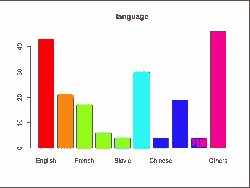
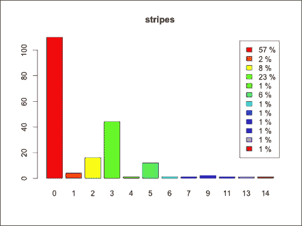
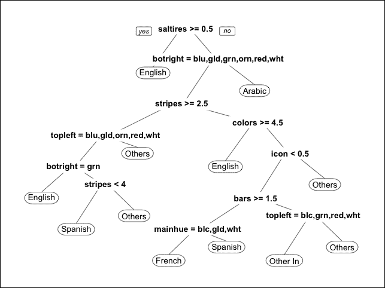
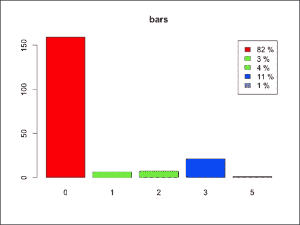
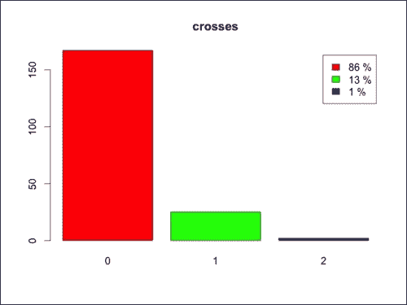
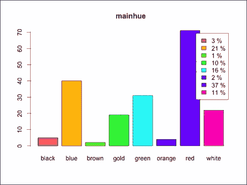
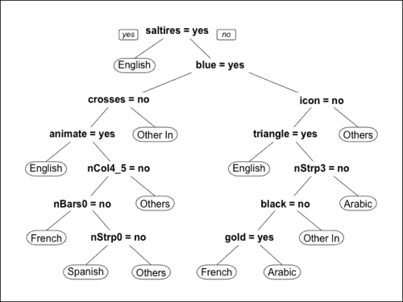
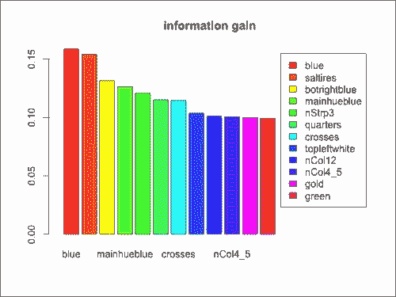

# 第四章。步骤 1 – 数据探索和特征工程

有不同类型的问题需要机器学习解决方案。例如，我们的目标可以是预测未来的结果或从数据中识别模式。起点是一组对象（例如，商品）或人（例如，超市的顾客）。在大多数情况下，机器学习技术从描述对象/人的某些特征开始识别解决方案。特征是数值和/或分类属性，它们是机器学习模型的基础。拥有正确的特征将提高模型的表现力和准确性，因此定义与问题相关的某些特征非常重要。

在本章中，你将：

+   构建机器学习解决方案

+   构建特征数据

+   清洗数据

+   探索定义的特征

+   修改特征

+   使用过滤器对特征进行排序

# 构建机器学习解决方案

在机器学习解决方案的哪个阶段我们正在定义特征？让我们看一下构建解决方案整个过程的概述。我们可以将方法分为三个步骤：

1.  定义我们将要使用的特征。

1.  应用一个或多个技术来解决问题。

1.  评估结果并优化性能。

在第一步，我们可以通过使用过滤器来评估每个特征的相关性，并选择最相关的特征。我们还可以定义一些特征组合，这些特征组合有助于描述数据。

在第二步，当我们构建模型时，我们可以使用一些技术（嵌入方法）来对特征进行排序并自动识别最相关的特征。

最后一步非常重要，因为我们有更多信息，这使我们能够识别更合适的特征集。例如，我们可以使用具有不同特征集的相同模型，并评估哪种特征组合表现更好。一个选项是使用一个包装器，该包装器包括使用所选特征集构建模型，迭代地添加（或删除）一个特征，如果它提高了模型准确性，则保留这种变化。

总之，特征选择是一个循环而不是一个步骤，它发生在过程的每个部分。本章展示了特征工程过程，该过程包括定义特征、转换它们以及确定它们的排名。步骤如下：

+   探索数据

+   定义/转换新特征

+   识别最相关的特征

尽管探索数据始终在开始时，但所有步骤都可以重复，直到我们找到令人满意的解决方案，因此它们不一定总是遵循相同的顺序。例如，在确定最相关的特征后，我们可以探索数据，识别新的模式，从而定义一些新的特征。

特征选择的过程与模型相关，在本章中，我们确定了一些适合许多模型的特征。

本章展示了国旗的示例。基于一个国家的国旗，我们的目标是确定该国的语言。假设我们知道所有国家的国旗和其中一些国家的语言，模型将估计其他国家的语言。

# 构建特征数据

本节展示了我们如何构建原始数据以构建特征。对于每个国家，数据包括：

+   国旗的图片

+   一些地理数据，例如大陆、地理象限、面积和人口

+   该国的语言和宗教

目标是构建一个从国旗预测国家语言的模型。大多数模型可以处理数值和/或分类数据，因此我们不能将国旗图片作为模型的特征。解决方案是定义一些特征，例如颜色的数量，来描述每个国旗。这样，我们就从一张表格开始，该表格的行对应国家，列对应国旗特征。

基于图片构建具有国旗属性的矩阵将花费很多时间。幸运的是，我们可以使用包含一些特征的数据库。我们拥有的数据仍然有些杂乱，因此我们需要对其进行清理和转换，以构建一个格式正确的特征表。

数据集中的特征显示了一些关于的信息：

+   国旗上的颜色

+   国旗上的图案

+   国旗中的一些附加元素，如文本或一些星星

+   一些地理数据，例如大陆、地理象限、面积和人口

+   该国的语言和宗教

将表格以正确格式引导的步骤如下：

1.  从[`archive.ics.uci.edu/ml/machine-learning-databases/flags/`](https://archive.ics.uci.edu/ml/machine-learning-databases/flags/)下载数据集和相关信息，并下载`flag.data`。

1.  打开 RStudio 并将工作目录设置为包含数据的文件夹：

    ```py
    setwd('path/containing/the/data')
    ```

1.  将数据加载到 R 环境中：

    ```py
    dfFlag <- read.csv('flag.data', header=FALSE)
    ```

现在，我们可以使用`str`查看`dfFlag`的结构：

```py
str(dfFlag)
'data.frame':    194 obs. of  30 variables:
 $ V1 : Factor w/ 194 levels "Afghanistan",..: 1 2 3 4 5 6 7 8 9 10 ...
 $ V2 : int  5 3 4 6 3 4 1 1 2 2 ...
 $ V3 : int  1 1 1 3 1 2 4 4 3 3 ...
 $ V4 : int  648 29 2388 0 0 1247 0 0 2777 2777 ...
 $ V5 : int  16 3 20 0 0 7 0 0 28 28 ...
 $ V6 : int  10 6 8 1 6 10 1 1 2 2 ...
 $ V7 : int  2 6 2 1 0 5 1 1 0 0 ...
 $ V8 : int  0 0 2 0 3 0 0 0 0 0 ...
 $ V9 : int  3 0 0 0 0 2 1 1 3 3 ...
 $ V10: int  5 3 3 5 3 3 3 5 2 3 ...
 $ V11: int  1 1 1 1 1 1 0 1 0 0 ...
 $ V12: int  1 0 1 0 0 0 0 0 0 0 ...
 $ V13: int  0 0 0 1 1 0 1 1 1 1 ...
 $ V14: int  1 1 0 1 1 1 0 1 0 1 ...
 $ V15: int  1 0 1 1 0 0 1 1 1 1 ...
 $ V16: int  1 1 0 0 0 1 0 1 0 0 ...
 $ V17: int  0 0 0 1 0 0 1 0 0 0 ...
 $ V18: Factor w/ 8 levels "black","blue",..:5 7 5 2 4 7 8 7 2 2 ...
 $ V19: int  0 0 0 0 0 0 0 0 0 0 ...
 $ V20: int  0 0 0 0 0 0 0 0 0 0 ...
 $ V21: int  0 0 0 0 0 0 0 0 0 0 ...
 $ V22: int  0 0 0 0 0 0 0 0 0 0 ...
 $ V23: int  1 1 1 0 0 1 0 1 0 1 ...
 $ V24: int  0 0 1 0 0 0 0 0 0 0 ...
 $ V25: int  0 0 0 1 0 0 0 1 0 0 ...
 $ V26: int  1 0 0 1 0 1 0 0 0 0 ...
 $ V27: int  0 1 0 1 0 0 1 0 0 0 ...
 $ V28: int  0 0 0 0 0 0 0 0 0 0 ...
 $ V29: Factor w/ 7 levels "black","blue",..: 1 6 4 2 2 6 7 1 2 2 ...
 $ V30: Factor w/ 8 levels "black","blue",..: 5 7 8 7 7 1 2 7 2 2 ...

```

`dfFlag`对象包含 30 列，其名称未定义。我们有描述`flag.description.txt`中数据的文档，这允许我们定义列名。前七列包含一些与国旗无关的属性。让我们开始定义一些包含特征名称的向量。第一列是国家的名称。以下是定义名称的步骤：

1.  定义国家名称：

    ```py
    nameCountry <- 'name'
    ```

1.  定义三个地理特征名称：`continent`、`zone`和`area`：

    ```py
    namesGeography <- c('continent', 'zone', 'area')
    ```

1.  定义包括语言在内的该国公民的三个特征名称：

    ```py
    namesDemography <- c('population', 'language', 'religion')
    ```

1.  定义一个包含七个属性且顺序正确的唯一向量：

    ```py
    namesAttributes <- c(nameCountry, namesGeography, namesDemography)
    ```

1.  定义描述条形、条纹和颜色的特征名称：

    ```py
    namesNumbers <- c('bars', 'stripes', 'colors')
    ```

1.  对于某些颜色，有一个变量，如果国旗包含该颜色则显示`1`，否则显示`0`。定义它们的名称：

    ```py
    namesColors <- c('red', 'green', 'blue', 'gold', 'white', 'black', 'orange')
    ```

1.  定义主要颜色的名称：

    ```py
    nameMainColor <- 'mainhue'
    ```

1.  定义显示包含在国旗中的图案/绘画（例如，一个形状、一张图片或一段文字）数量的属性名称：

    ```py
    namesDrawings <- c(
      'circles', 'crosses', 'saltires', 'quarters',
      'sunstars', 'crescent', 'triangle', 'icon', 'animate', 'text'
    )
    ```

1.  悬挂：四个角中的两个角的颜色：

    ```py
    namesAngles <- c('topleft', 'botright')
    ```

1.  定义包含所有名称且顺序正确的 `namesFlag`：

    ```py
    namesFlag <- c(namesNumbers, namesColors, nameMainColor, namesDrawings, namesAngles)
    ```

1.  设置绑定 `namesAttributes` 和 `namesFlag` 的 `dfFlag` 列名：

    ```py
    names(dfFlag) <- c(namesAttributes, namesFlag)
    ```

现在，数据框具有正确的列名。然而，一些列，如 `language`，包含数字而不是属性名称，文档显示了这些数字的含义。例如，对于语言，`1` 对应英语，`2` 对应西班牙语。我们可以使用以下步骤构建一个具有正确格式的数据表：

1.  将 `dfFlag` 转换为 `dtFlag` 数据表：

    ```py
    library(data.table)
    dtFlag <- data.table(dfFlag)
    ```

1.  显示 `continent` 列：

    ```py
    dtFlag[1:20, continent]
    [1] 5 3 4 6 3 4 1 1 2 2 6 3 1 5 5 1 3 1 4 1

    ```

1.  `continent` 列包含介于 `1` 和 `6` 之间的数字，文档显示 `1=N.America`、`2=S.America`、`3=Europe`、`4=Africa`、`5=Asia`、`6=Oceania`。然后，我们定义一个包含大陆的向量：

    ```py
    vectorContinents <- c('N.America', 'S.America', 'Europe', 'Africa', 'Asia', 'Oceania')
    ```

1.  将 `continent` 转换为 `factor` 类型，其级别为 `vectorContinents`：

    ```py
    dtFlag[, continent := factor(continent, labels=vectorContinents)]
    ```

1.  与 `continent` 类似，将 `zone` 转换为 `factor`：

    ```py
    vectorZones <- c('NE', 'SE', 'SW', 'NW')
    dtFlag[, zone := factor(zone, labels=vectorZones)]
    ```

1.  将 `language` 转换为 `factor`：

    ```py
    vectorLanguages <- c(
      'English', 'Spanish', 'French', 'German', 'Slavic',
      'Other Indo-European', 'Chinese', 'Arabic',
      'Japanese/Turkish/Finnish/Magyar', 'Others')
      dtFlag[, language := factor(language, labels=vectorLanguages)]
    ```

1.  将 `religion` 转换为 `factor`：

    ```py
    vectorReligions <- c(
      'Catholic', 'Other Christian', 'Muslim', 'Buddhist',
      'Hindu', 'Ethnic', 'Marxist', 'Others'
    )
    dtFlag[, religion := factor(religion, labels=vectorReligions)]
    ```

让我们来看看 `dtFlag`：

```py
str(dtFlag)
Classes 'data.table' and 'data.frame':	194 obs. of  30 variables:
 $ name      : Factor w/ 194 levels "Afghanistan",..: 1 2 3 4 5 6 7 8 9 10 ...
 $ continent : int  5 3 4 6 3 4 1 1 2 2 ...
 $ zone      : Factor w/ 4 levels "NE","SE","SW",..: 1 1 1 3 1 2 4 4 3 3 ...
 $ area      : int  648 29 2388 0 0 1247 0 0 2777 2777 ...
 $ population: int  16 3 20 0 0 7 0 0 28 28 ...
 $ language  : int  10 6 8 1 6 10 1 1 2 2 ...
 $ religion  : int  2 6 2 1 0 5 1 1 0 0 ...
 $ bars      : int  0 0 2 0 3 0 0 0 0 0 ...
 $ stripes   : int  3 0 0 0 0 2 1 1 3 3 ...
 $ colors    : int  5 3 3 5 3 3 3 5 2 3 ...
 $ red       : int  1 1 1 1 1 1 0 1 0 0 ...
 $ green     : int  1 0 1 0 0 0 0 0 0 0 ...
 $ blue      : int  0 0 0 1 1 0 1 1 1 1 ...
 $ gold      : int  1 1 0 1 1 1 0 1 0 1 ...
 $ white     : int  1 0 1 1 0 0 1 1 1 1 ...
 $ black     : int  1 1 0 0 0 1 0 1 0 0 ...
 $ orange    : int  0 0 0 1 0 0 1 0 0 0 ...
 $ mainhue   : Factor w/ 8 levels "black","blue",..: 5 7 5 2 4 7 8 7 2 2 ...
 $ circles   : int  0 0 0 0 0 0 0 0 0 0 ...
 $ crosses   : int  0 0 0 0 0 0 0 0 0 0 ...
 $ saltires  : int  0 0 0 0 0 0 0 0 0 0 ...
 $ quarters  : int  0 0 0 0 0 0 0 0 0 0 ...
 $ sunstars  : int  1 1 1 0 0 1 0 1 0 1 ...
 $ crescent  : int  0 0 1 0 0 0 0 0 0 0 ...
 $ triangle  : int  0 0 0 1 0 0 0 1 0 0 ...
 $ icon      : int  1 0 0 1 0 1 0 0 0 0 ...
 $ animate   : int  0 1 0 1 0 0 1 0 0 0 ...
 $ text      : int  0 0 0 0 0 0 0 0 0 0 ...
 $ topleft   : Factor w/ 7 levels "black","blue",..: 1 6 4 2 2 6 7 1 2 2 ...
 $ botright  : Factor w/ 8 levels "black","blue",..: 5 7 8 7 7 1 2 7 2 2 ...
 - attr(*, ".internal.selfref")=<externalptr> 

```

数据格式正确。尽管我们不得不正确地转换数据，但它仍然比手动定义特征花费的时间少得多。

# 探索和可视化特征

在定义了特征之后，我们可以探索它们并确定它们与问题的关系。在本节中，您将了解如何探索数据并定义一些简单的图表。

让我们从特征开始，例如，`mainhue`，它显示国旗的主要颜色。我们想要识别最常见的颜色，为此，我们可以使用 `table` 来计算每个可能值的出现次数。我们可以从 `dtFlag` 中提取 `mainhue` 列并对其应用 `table`：

```py
table(dtFlag[, mainhue])
black   blue  brown   gold  green orange    red  white 
 5     40      2     19     31      4     71     22

```

最常见的三种主要颜色是红色、蓝色和绿色。请注意，我们可以在方括号内放置 `table`，以获得相同的结果，但代码更简洁：`dtFlag[, table(mainhue)]`。

我们如何对任何其他列执行相同的操作？首先，让我们定义一个名为 `nameCol` 的字符串，它包含我们想要分析的列的名称。为了访问该列，我们可以在 `dtFlag` 的方括号中使用 `get(nameCol)`：

```py
nameCol <- 'mainhue'
dtFlag[, table(get(nameCol))]
```

这种表示法非常有用，因为我们可以很容易地使用名称字符串将其包含在函数中，从而可视化其他所有列的相同结果：

```py
listTableCol = lapply(
  namesAngles, function(nameCol){
    dtFlag[, table(get(nameCol))]
  })
listTableCol[[1]]
 black   blue   gold  green orange    red  white 
 12     43      6     32      4     56     41 

```

如果我们想制作一个图表呢？我们可以使用 `barplot` 制作直方图。让我们首先提取具有每个频率值的表格：

```py
nameCol <- 'language'
freqValues <- dtFlag[, table(get(nameCol))]
```

`freqValues` 方法包含说列表中任何语言的国家的数量。我们可以使用 `names` 提取一个语言向量：

```py
names(freqValues)
```

现在，我们已经拥有了构建直方图所需的所有必要数据（如果你还没有阅读第三章，请参阅`barplot`的文档）。此外，我们可以使用`rainbow`定义颜色：

```py
barplot(
  height = freqValues,
  names.arg = names(freqValues),
  main = nameCol,
  col = rainbow(length(freqValues)),
  ylab = 'number of flags'
)
```

获得的直方图如下：



如果我们想要探索一个属性，这个图表非常有用。为了仅用一行代码完成此操作，我们可以定义一个函数，为通用列`nameCol`构建此图表。此外，我们可以添加`legend`来显示百分比。为了显示`legend`，我们计算`percValues`，它包含显示该值的行百分比，并将其用作`legend.text`参数，如下所示：

```py
barplotAttribute <- function(dtData, nameCol)
{
  # define the frequency
  freqValues <- dtData[, table(get(nameCol))]
  # define the percentage
  percValues <- freqValues / sum(freqValues)
  percValues <- round(percValues * 100)
  percValues <- paste(percValues, '%')
  # generate the histogram
  barplot(
    height = freqValues,
    names.arg = names(freqValues),
    main = nameCol,
    col = rainbow(length(freqValues)),
    legend.text = percValues,
    ylab = 'number of flags'
  )
}
```

让我们将函数应用于另一列，例如`stripes`：

```py
barplotAttribute(dtFlag, 'stripes')
```



使用`for`循环，我们可以为每个标志属性生成相同的图表。我们需要时间在每张图表和下一张图表之间查看结果，所以我们使用`readline`停止程序。脚本会暂停，直到我们在控制台中按下*Enter*。这样，我们可以非常快速地探索所有特征，如下所示：

```py
for(nameCol in namesFlag)
{
  barplotAttribute(dtFlag, nameCol)
  readline()
}
```

通过这几行代码，我们已经观察到了每个特征的值出现的频率。

另一种快速探索是，给定一种颜色，计算包含该颜色的标志数量。例如，让我们计算包含红色部分的标志。有一个名为`red`的属性，其值为`1`表示标志包含红色部分，否则为`0`。如果我们对所有列值求和，我们将获得包含红色部分的标志总数，如下所示：

```py
dtFlag[, sum(red)]
[1] 153
dtFlag[, sum(get('red'))]
[1] 153

```

如我们之前所见，我们可以在方括号内使用`get`。我们如何为所有常见的颜色做同样的事情？`namesColors`向量包含了所有颜色属性的名称，如下所示：

```py
namesColors
[1] "red"    "green"  "blue"   "gold"   "white"  "black"  "orange"

```

`namesColors`的第一个元素是`red`，因此我们可以用它来计算包含红色的标志：

```py
dtFlag[, sum(get(namesColors[1]))]
[1] 153

```

我们可以使用`sapply`（请参阅文档）在`namesColors`的每个元素上应用一个函数。在这种情况下，该函数计算包含特定颜色的标志的数量：

```py
sapply(namesColors, function(nameColor){
  dtFlag[, sum(get(nameColor))]
})
red  green   blue   gold  white  black orange 
153     91     99     91    146     52     26 

```

最常见的颜色是红色和绿色。

到目前为止，我们已经探索了标志的特征；下一步是看看它们如何与国家的语言相关。一种快速的方法是使用决策树（请参阅第三章，*简单机器学习分析*）。

首先，让我们导入生成和可视化决策树的包：

```py
library('rpart')
library('rpart.plot')
```

决策树模型需要一个公式对象，用于定义变量之间的关系。在这种情况下，公式是`language ~ feature1 + feature2 + …`。我们可以通过添加`namesFlag`中包含的所有名称来构建公式，如下所示：

```py
formulaRpart <- 'language ~ '
for(name in namesFlag){
  formulaRpart <- paste(formulaRpart, '+', name)
}
formulaRpart <- formula(formulaRpart)
```

我们可以使用`rpart`构建模型，并使用`prp`可视化树：

```py
tree <- rpart(formula=formulaRpart, data=dtFlag)
prp(tree)
```



树的一些节点不易阅读。例如，`saltires` 如果旗帜上有十字，则显示 `1`，否则显示 `0`。第一个树节点表示 **saltires >= 0.5** 条件，因此左侧的旗帜上有十字。这反映了特征格式不正确的事实，因此下一步将是转换特征。

首先，让我们定义一个新的数据表 `dtFeatures`，其中包含特征和结果。从现在起，我们将修改 `dtFeatures`，直到所有特征都处于正确的格式，如下所示：

```py
dtFeatures <- dtFlag[, c('language', namesFlag), with=FALSE]
```

让我们定义一个函数来可视化表格。我们将重用此函数来跟踪特征转换过程中的进度，如下所示：

```py
plotTree <- function(dtFeatures){
  formulaRpart <- paste(names(dtFeatures)[1], '~')
  for(name in names(dtFeatures)[-1]){
    formulaRpart <- paste(formulaRpart, '+', name)
  }
  formulaRpart <- formula(formulaRpart)
  tree <- rpart(formula=formulaRpart, data=dtFeatures)
  prp(tree)
}
plotTree(dtFeatures)
```

图表与之前完全相同。

到目前为止，我们已经看到了一些探索特征的技术。数据探索使我们能够调查数据性质，这是清理当前特征和定义其他特征的开端。此外，我们构建了一些函数，允许我们仅用一行代码生成一些图表。我们可以使用这些函数来跟踪特征转换。

# 修改特征

我们的特性是描述旗帜的属性，其中一些可能不在正确的格式中。在本节中，我们将查看每个特征，并在必要时对其进行转换。

为了跟踪我们已经处理过的特征，让我们开始定义一个空向量 `namesProcessed`，其中包含我们已经处理过的特征。当我们转换一个特征时，我们将特征名称添加到 `namesProcessed` 中：

```py
namesProcessed <- c()
```

让我们从数值列开始，例如 `red`，它有两种可能的结果：`0`，如果旗帜包含红色，否则为 `1`。`red` 变量定义了一个属性，因此它应该是分类的而不是数值的。然后，我们可以将 `red` 转换为特征，如果颜色是红色，则为 `yes`，否则为 `no`。

如果我们查看每个特征的图表，我们会注意到其中一些只显示两个值，总是 `0` 和 `1`。为了将每个值转换为 `yes` 和 `no` 格式，我们可以使用一个 `for` 循环。对于 `namesFlag` 中的每个特征，我们检查是否存在两种可能的值。如果是这样，我们将特征转换为因子。让我们从 `red` 开始：

```py
nameFeat <- 'red'
```

我们可以检查 `nameFeat` 是否显示两个值：

```py
length(unique(dtFeatures[, get(nameFeat)])) == 2
```

在这种情况下，答案是 `TRUE`，因此我们可以生成一个包含相同列的向量，对于 `0` 和 `1` 分别用 `no` 和 `yes` 表示。为此，我们使用 `factor`，指定标签为 `no` 和 `yes`，如下所示：

```py
vectorFactor <- dtFeatures[
  , factor(get(nameFeat), labels=c('no', 'yes'))
]
head(vectorFactor)
[1] yes yes yes yes yes yes
Levels: no yes

```

现在，我们可以使用`for`循环将每个显示两种可能结果的特性进行转换。对于每个特性，我们使用`if`检查它是否只有两个值。在生成`vectorFactor`后，我们使用方括号内的`eval`覆盖旧列。执行`dtFeatures[, eval('red') := vectorFactor]`与`dtFeatures[, red := vectorFactor]`相同，如下所示：

```py
for(nameFeat in namesFlag){
  if(length(unique(dtFeatures[, get(nameFeat)])) == 2){
    vectorFactor <- dtFeatures[
      , factor(get(nameFeat), labels=c('no', 'yes'))]
    dtFeatures[, eval(nameFeat) := vectorFactor]
    namesProcessed <- c(namesProcessed, nameFeat)
  }
}
```

让我们看看我们还没有转换的特征。`namesFlag`特征包含所有初始特征，而`namesProcessed`包含我们已经转换的特征。为了可视化不在`namesProcessed`中的特征，我们可以使用`setdiff`函数，该函数给出第一个向量中存在而第二个向量中不存在的元素，如下所示：

```py
setdiff(namesFlag, namesProcessed)
```

还有许多特征我们还没有分析。例如，`bars`是一个显示旗帜中垂直横杠数量的数值属性。如果我们使用`bars`作为数值特征，模型将识别语言和模型之间的关系。所有讲西班牙语国家的旗帜都包含零个或三个横杠，因此模型可以学习到“如果横杠少于四个，那么语言只能是西班牙语”这样的东西。然而，没有讲西班牙语的国家其旗帜有 1 个或 2 个横杠。一种解决方案是根据横杠的数量将国家分组，如下所示：

```py
barplotAttribute(dtFeatures, 'bars')
```



图表显示，具有显著数量旗帜的组是**0**和**3**横杠。因此，组可以如下所示：

+   没有横杠的旗帜

+   带有三个横杠的旗帜

+   所有其他旗帜

我们可以定义一个名为`nBars0`的新列，如果旗帜没有垂直横杠，则等于`TRUE`：

```py
dtFeatures[, nBars0 := bars == 0]
```

同样，我们定义`nBars3`，对于有三个横杠的旗帜，它为`TRUE`。我们不需要为剩余的旗帜定义一个列，因为它们可以通过检查`nBars0`和`nBars3`是否为`FALSE`来识别：

```py
dtFeatures[, nBars1_2 := bars %in% c(1, 2)]
dtFeatures[, nBars3 := bars == 3]
```

让我们删除初始的`bars`列并将`bars`添加到`namesProcessed`中：

```py
dtFeatures[, bars := NULL]
namesProcessed <- c(namesProcessed, 'bars')
```

我们执行的操作被称为**离散化**，因为我们从数值特征生成了一些离散特征。

同样，我们可以转换`stripes`和`colors`：

```py
barplotAttribute(dtFeatures, 'stripes')
dtFeatures[, nStrp0 := stripes == 0]
dtFeatures[, nStrp2 := stripes == 2]
dtFeatures[, nStrp3 := stripes == 3]
dtFeatures[, nStrp5 := stripes == 5]
dtFeatures[, stripes := NULL]
namesProcessed <- c(namesProcessed, 'stripes')

barplotAttribute(dtFeatures, 'colors')
dtFeatures[, nCol12 := colors %in% c(1, 2)]
dtFeatures[, nCol3 := colors == 3]
dtFeatures[, nCol4_5 := colors %in% c(4, 5)]
dtFeatures[, colors := NULL]
namesProcessed <- c(namesProcessed, 'colors')
```

让我们看看`namesDrawings`中我们还没有处理过的特征：

```py
for(nameCol in setdiff(namesDrawings, namesProcessed)){
  barplotAttribute(dtFeatures, nameCol)
  readline()
}
```



在所有这些特征中，大多数旗帜显示`0`。因此，我们可以将旗帜分为两类：`0`和其余部分。我们正在定义一个新的分类变量，如果值大于`0`则为`yes`，否则为`no`。这个过程被称为**二值化**，因为我们把一些数值特征转换成了只显示两个值的分类特征，如下所示：

```py
for(nameCol in setdiff(namesDrawings, namesProcessed)){
  dtFeatures[, eval(nameCol) := ifelse(get(nameCol) > 0, 'yes', 'no')]
  namesProcessed <- c(namesProcessed, nameCol)
}
```

让我们探索以下代码中显示的剩余特征：

```py
for(nameCol in setdiff(namesFlag, namesProcessed)){
  barplotAttribute(dtFeatures, nameCol)
  readline()
}
```

得到的图表如下：



剩下的三个特征是`topleft`、`botright`和`mainhue`。它们都是分类的，并且显示超过两个可能的值。例如，`mainhue`有八个选项。然而，只有少数标志以`black`、`brown`或`orange`为主要颜色。我们没有足够的信息来考虑不太常见的颜色。在这种情况下，我们可以为每个它们定义一个新的分类变量，称为`虚拟变量`。我们可以决定为至少有 15 个标志的每个可能颜色定义一个虚拟变量。对于`topleft`和`botright`的情况也是类似的，因此我们可以以相同的方式转换所有这些特征，如下所示：

```py
namesToDummy <- c("topleft", "botright", "mainhue")
for(nameCol in namesToDummy){
  frequencyColors <- dtFeatures[, list(.N), by=nameCol]
  for(color in frequencyColors[N > 20, get(nameCol)]){
    nameFeatNew <- paste(nameCol, color, sep='')
    dtFeatures[, eval(nameFeatNew) := get(nameCol) == color]
  }
  dtFeatures[, eval(nameCol) := NULL]
  namesProcessed <- c(namesProcessed, nameCol)
}
```

现在，我们已经转换了所有特征。然而，我们定义的一些新列属于`逻辑`类别。最好将它们可视化为主要显示`yes`或`no`的分类属性，因此最好将它们转换，如下所示：

```py
for(nameCol in names(dtFeatures)){
  if(dtFeatures[, class(get(nameCol))] == 'logical'){
    print(nameCol)
    dtFeatures[, eval(nameCol) := ifelse(get(nameCol), 'yes', 'no')]
  }
}
```

让我们看看以下代码如何改变决策树：

```py
plotTree(dtFeatures)
```

得到的图表如下：



决策树与之前的树相似。然而，决策树的每个节点都在检查一个结果为`yes`和`no`的条件。

在本章中，我们看到了三种转换特征的方法：

+   **离散化**：从一个数值变量开始，我们将所有可能的值分组到集合中。然后，对于每个集合，我们定义一个新的变量，如果数值变量属于该集合则显示`yes`，否则显示`no`。

+   **二值化**：从一个数值变量开始，我们通过定义两个集合来离散化一个数值变量。我们定义一个阈值，并检查变量是否高于或低于该阈值。

+   **虚拟变量**：从一个分类变量开始，我们识别最常见的输出。然后，对于每个常见输出，我们定义一个新的变量，如果变量等于该值则显示`yes`，否则显示`no`。

# 使用过滤器或降维对特征进行排序

在上一节中，我们定义了不同的特征。但它们是否真的与问题相关？有一些称为**嵌入式模型**的技术可以自动选择最相关的特征。我们也可以使用不同的特征集构建相同的机器学习模型，并选择性能更好的集合。这两种选择都很好，尽管它们需要大量的计算能力。

另一种方法是使用过滤器，这是一种识别最相关特征的技术。我们在应用任何机器学习模型之前使用过滤器，这样我们就能大幅减少算法的计算成本。一些过滤器会单独考虑每个特征，并且计算效率非常高。

一个简单的过滤器是**皮尔逊相关系数**，它是衡量变量之间线性关系的度量。相关系数是一个介于-1 和 1 之间的数字，这两个极端值表示两个变量之间存在清晰的线性关系。当绘制图表时，所有点都位于同一条线上。相关系数为 0 表示两个变量之间没有线性依赖关系。相关系数的绝对值越高，线性关系越强。在我们的案例中，我们可以测量每个标志属性与语言之间的相关性，并选择相关性系数较高的属性。

另一种考虑每个特征的技术是信息增益率。假设我们想要构建一个模型，但我们对标志一无所知。在这种情况下，我们能做的最好的事情就是识别最常见的语言，并假设每个国家都说那种语言。如果我们只知道哪些旗帜包含红色呢？模型肯定会比没有任何信息要好。好多少呢？一个特征的信息增益率是一个指数，它量化了添加该特征所带来的改进。

相关性和信息增益率分别考虑每个特征，因此它们完全忽略了它们之间的相互作用。例如，我们可以有两个对语言有重大影响的特征，并且它们之间关系非常紧密，以至于它们包含相同的信息。假设我们已经在模型中包含了一个这两个特征中的一个。添加另一个不会提供任何更多信息，尽管它本身可能非常相关。如果两个特征之间的关系是线性的，我们谈论的是**多重共线性**。

在其他情况下，我们有两个特征，如果单独考虑，它们的相关性很小，但如果一起考虑，则具有很大的影响。如果我们使用这种类型的过滤器对特征进行排序，我们将排除这两个特征，从而丢失一些有用的信息。

对特征进行排序的另一种方法是识别相关的特征组合。一种技术是**主成分分析**（PCA），它基于特征之间的相关性。从特征开始，PCA 定义了一组称为主成分的变量，它们彼此线性独立。主成分的数量等于或小于特征的数量，并且这些成分按方差排序。然后，可以选择具有高方差的成分子集。然而，PCA 有其局限性，因为它仅基于线性关系，并且它没有考虑到预测事物的属性（在我们的例子中是语言）。

有不同的技术，我们在这章中使用的是**信息增益比**，因为它简单且有意义。R 为我们提供了`FSelector`包，其中包含用于特征选择的工具。该包要求你在计算机上安装 JRE，如下所示：

```py
install.packages('FSelector')
library('FSelector')
```

让我们构建一个包含所有特征名称的`namesFeatures`向量。然后，我们可以使用`information.gain`函数计算它们的信息增益比，如下所示：

```py
namesFeatures <- names(dtFeatures)[-1]
dfGains <- information.gain(language~., dtFeatures)
```

`dfGains`方法是一个具有名为`attr_importance`字段的 DataFrame。特征名称是行名称，所以让我们添加另一个包含名称的列：

```py
dfGains$feature <- row.names(dfGains)
```

让我们将数据框转换为数据表：

```py
dtGains <- data.table(dfGains)
```

为了看到最相关的特征，我们可以按相关性对它们进行排序：

```py
dtGains <- dtGains[order(attr_importance, decreasing = T)]
 head(dtGains)
 attr_importance      feature
1:       0.1583055         blue
2:       0.1537296     saltires
3:       0.1313155 botrightblue
4:       0.1262545  mainhueblue
5:       0.1205012       nStrp3
6:       0.1149405     quarters

```

`blue`和`saltires`特征定义了非常相关的属性。为了可视化最相关的特征，我们可以构建一个包含前 12 个属性的图表，如下所示：

```py
dtGainsTop <- dtGains[1:12]
barplot(
  height = dtGainsTop[, attr_importance],
  names.arg = dtGainsTop[, feature],
  main = 'information gain',
  col = rainbow(nrow(dtGainsTop)),
  legend.text = dtGainsTop[, feature],
  xlim=c(0, 20)
)
```

获得直方图如下：



现在我们已经定义了特征排序，我们能够从最相关的特征构建模型。我们可以包括所有相关性高于所选阈值的特征，或者从顶部开始选择一定数量的特征。然而，我们还没有考虑到特征之间的交互。例如，在顶级特征中，我们有`旗帜包含蓝色`、`蓝色是主要颜色`和`右下角是蓝色`。尽管它们都非常相关，但它们都是关于`蓝色`的，所以它们是冗余的，我们可以排除其中一个。

总之，过滤器是快速且有用的方法来排序特征，但当我们构建模型时，我们必须非常小心地使用它们。

# 摘要

在本章中，你学习了如何进行特征选择。在加载和探索特征之后，你看到了如何使用离散化和二值化来转换它们。你还把分类特征转换为虚拟变量。你理解了特征选择的重要性，并使用信息增益比对特征进行了排序。在下一章中，我们将使用机器学习技术来预测语言。
