# 第七章。机器学习技术概述

有不同的机器学习技术，本章将概述最相关的技术。其中一些已经在前面的章节中介绍过，一些是新的。

在本章中，你将学习以下主题：

+   最相关的技术分支：监督学习和无监督学习

+   使用监督学习进行预测

+   使用无监督学习识别隐藏的模式和结构

+   这些技术的优缺点

# 概述

机器学习技术有不同的类别，在本章中我们将看到两个最相关的分支——监督学习和无监督学习，如下所示：

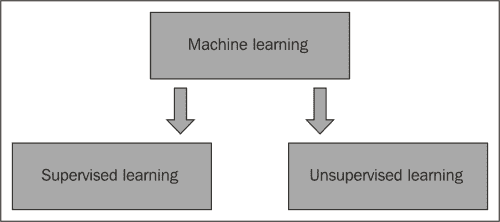

监督学习和无监督学习技术处理由特征描述的对象。监督学习技术的例子是决策树学习，无监督技术的例子是 k-means。在这两种情况下，算法都是从一组对象中学习的，区别在于它们的目标：监督技术预测已知性质的属性，而无监督技术识别新的模式。

监督学习技术预测对象的属性。算法从已知属性的训练集对象中学习，并预测其他对象的属性。监督学习技术分为两类：分类和回归。如果预测的属性是分类的，我们谈论分类；如果属性是数值的，我们谈论回归。

无监督学习技术识别一组对象的模式和结构。无监督学习的两个主要分支是聚类和降维。聚类技术根据对象的属性识别同质群体，例如 k-means。降维技术识别一组描述对象的显著特征，例如主成分分析。聚类和降维之间的区别在于所识别的属性是分类的或数值的，如下所示：

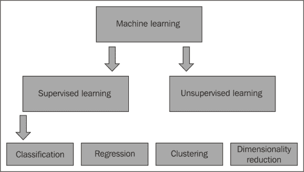

本章将展示每个分支的一些流行技术。为了说明技术，我们将重复使用第四章、*步骤 1 – 数据探索和特征工程*；第五章、*步骤 2 – 应用机器学习技术*；以及第六章、*步骤 3 – 验证结果*中的标志数据集，这些数据集可以在本书的支持代码包中找到。

# 监督学习

本章将向您展示一些流行的监督学习算法的示例。这些技术在面对商业问题时非常有用，因为它们可以预测未来的属性和结果。此外，可以测量每种技术及其/或参数的准确性，以便选择最合适的技术并以最佳方式设置它。

如预期，有两种技术类别：分类和回归。然而，大多数技术都可以在这两种情况下使用。以下每个小节介绍一个不同的算法。

## K 最近邻算法

K 最近邻算法是一种监督学习算法，用于分类或回归。给定一个新对象，算法从其最相似的**k**个邻居对象预测其属性。K 最近邻算法是一种懒惰学习算法，因为它直接查询训练数据来做出预测。

在分类属性的情况下，算法将其估计为相似对象中最常见的。在数值属性的情况下，它计算它们之间的中位数或平均值。为了说明哪些是**k**个最**相似**的对象，KNN 使用一个相似性函数来评估两个对象有多相似。为了测量相似性，起点通常是一个表示差异的距离矩阵。然后，算法计算新对象与每个其他对象的相似性，并选择**k**个最相似的对象。

在我们的例子中，我们将使用国旗数据集，特征是国旗上的条纹数量和颜色数量。我们想要从其国旗属性预测的属性是新国家的语言。

训练集由一些国家组成，这些国家没有两个国家的国旗特征相同。首先，让我们可视化这些数据。我们可以显示国家在图表中，其维度是两个特征，颜色是语言，如下所示：

我们有两个新国家：

+   7 条条纹和 4 种颜色

+   3 条条纹和 7 种颜色

我们想使用 4-最近邻算法确定两个新国家的语言。我们可以将这两个国家添加到图表中，并确定每个国家的 4 个最近点，如下所示：

关于图表右侧的国家，其最近的 4 个邻居都属于**其他**类别，因此我们估计该国的语言为**其他**。另一个国家的邻域是混合的：1 个英语国家，1 个其他印欧语系国家，以及 2 个西班牙国家。最常见的语言是西班牙语，所以我们估计它是一个讲西班牙语的国家。

KNN 是一种简单且可扩展的算法，在许多情况下都能取得良好的结果。然而，在存在许多特征的情况下，相似度函数考虑了所有这些特征，包括不那么相关的特征，这使得使用距离变得困难。在这种情况下，KNN 无法识别有意义的最近邻，这个问题被称为维度诅咒。一种解决方案是通过选择最相关的特征或使用降维技术来降低维度（这是下一节的主题）。

## 决策树学习

决策树学习是一种监督学习算法，它构建一个分类或回归树。树的每个叶子节点代表属性估计，每个节点根据特征的某个条件对数据进行分割。

决策树学习是一种贪婪方法，因为它使用训练集来构建一个不需要你查询数据的模型。所有其他监督学习技术也都是贪婪的。

算法的目标是定义最相关的特征，并根据它将集合分成两组。然后，对于每个组，算法识别其最相关的特征，并将组中的对象分成两部分。这个过程一直进行，直到我们识别出叶子节点作为对象的小组。对于每个叶子节点，如果它是分类的，算法估计特征为众数；如果是数值的，则估计为平均值。在构建树之后，如果我们有太多的叶子节点，我们可以定义一个停止分割树的级别。这样，每个叶子节点将包含一个合理大的组。这种停止分割的过程称为剪枝。通过这种方式，我们找到了一个更简单且更准确的预测。

在我们的例子中，我们想要根据不同的旗帜属性（如颜色和图案）确定一个新国家的语言。算法从训练集构建树学习。让我们可视化它：

在任何节点，如果答案是**true**，我们向左走，如果答案是**false**，我们向右走。首先，模型识别出最相关的属性是**十字形**。如果一个旗帜包含十字形，我们向左走，并确定相关国家是英国。否则，我们向右走，检查旗帜是否包含蓝色。然后，我们继续检查条件，直到达到叶子节点。

假设我们没有考虑西班牙国旗来构建树。我们如何估计西班牙的语言？从顶部开始，我们检查遇到的每个节点的条件。

这些是步骤：

1.  旗帜上不包含十字形，所以我们向左走。

1.  旗帜包含蓝色，所以我们向右走。

1.  旗帜上不包含十字架，所以`crosses = no`为`true`，我们向左走。

1.  旗帜上不包含动画图像，所以我们向右走。

1.  国旗有两种主要颜色，所以`number of colors not equal to 4 or 5`是`true`，我们向左移动。

1.  国旗没有任何条形，所以我们向左移动。

国旗没有垂直条纹，所以`nStrp0 = no`是`true`，我们向左移动，如图所示：

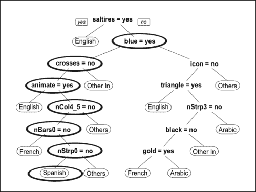

最后，估计的语言是`西班牙语`。

决策树学习可以处理数值和/或分类特征和属性，因此它可以在只需要少量数据准备的不同环境中应用。此外，它适用于有大量特征的情况，这与其他算法不同。一个缺点是算法可能会过拟合，即模型过于接近数据并且比现实更复杂，尽管剪枝可以帮助解决这个问题。

# 线性回归

线性回归是一种统计模型，用于识别数值变量之间的关系。给定一组由*y*属性和`x1, …,`和`xn`特征描述的对象，该模型定义了特征与属性之间的关系。这种关系由线性函数*y = a0 + a1 * x1 + … + an * xn*描述，而`a0, …,`和`an`是由方法定义的参数，使得关系尽可能接近数据。

在机器学习的情况下，线性回归可以用来预测数值属性。算法从训练数据集中学习以确定参数。然后，给定一个新的对象，模型将它的特征插入到线性函数中以估计属性。

在我们的例子中，我们想要从国家的面积估计其人口。首先，让我们可视化面积（以千平方公里为单位）和人口（以百万为单位）的数据，如图下所示：

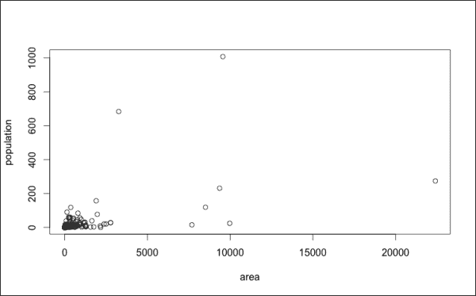

大多数国家的面积在 3000 千平方公里以下，人口在 2 亿以下，只有少数国家的面积和/或人口要高得多。因此，大多数点都集中在图表的左下角。为了分散点，我们可以使用对数面积和人口来转换特征，如图下所示：

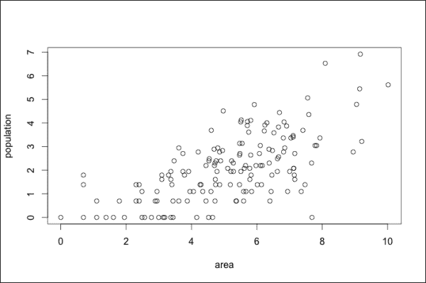

线性回归的目标是识别一个尽可能接近数据的线性关系。在我们的例子中，我们有两个维度，因此我们可以用一条线来可视化这种关系。给定区域，线性回归估计人口位于这条线上。让我们在以下图表中查看具有对数特征的示例：

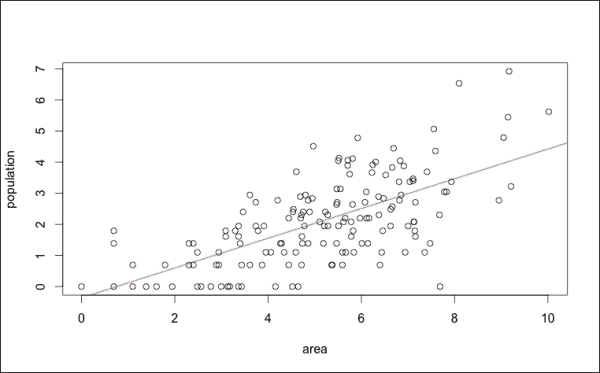

给定一个关于我们已知其面积的新国家，我们可以使用回归线来估计其人口。在图表中，有一个我们已知其面积的新国家。线性回归估计该点位于红色线上。

线性回归是一种非常简单和基本的技术。缺点是它需要数值特征和属性，因此在许多情况下不适用。然而，可以使用虚拟变量或其他技术将分类特征转换为数值格式。

另一个缺点是模型对特征和属性之间关系的假设很强。估计输出的函数是线性的，所以在某些情况下，它可能与真实关系相差甚远。此外，如果现实中特征之间相互影响，模型无法跟踪这种影响。可以使用使关系线性的转换来解决此问题。也可以定义新的特征来表示非线性交互。

线性回归非常基础，它是某些其他技术的起点。例如，逻辑回归预测一个值在 0 到 1 范围内的属性。

# 感知器

**人工神经网络**（**ANN**）是逻辑类似于生物神经系统的监督学习技术。简单的人工神经网络技术是单层感知器，它是一种分类技术，估计一个二进制属性，其值可以是 0 或 1。感知器的工作方式类似于神经元，即它将所有输入的影响相加，如果总和高于定义的阈值，则输出为 1。该模型基于以下参数：

+   每个特征的权重，定义其影响

+   估计输出为 1 的阈值

从特征开始，模型通过以下步骤估计属性

+   通过线性回归计算输出：将每个特征乘以其权重，并将它们相加

+   如果输出高于阈值，则估计属性为 1，否则为 0

模型如图所示：

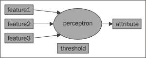

在开始时，算法使用定义好的系数集和阈值构建感知器。然后，算法使用训练集迭代地改进系数。在每一步中，算法估计每个对象的属性。然后，算法计算真实属性和估计属性之间的差异，并使用该差异来修改系数。在许多情况下，算法无法达到一个稳定的系数集，这些系数不再被修改，因此我们需要定义何时停止。最后，我们有一个由系数集定义的感知器，我们可以用它来估计新对象的属性。

感知器是神经网络的一个简单例子，它使我们能够轻松理解变量的影响。然而，感知器依赖于线性回归，因此它在同一程度上有限：特征影响是线性的，特征不能相互影响。

## 集成

每个算法都有一些弱点，导致结果不正确。如果我们能够使用不同的算法解决相同的问题并选择最佳结果会怎样？如果只有少数算法犯了同样的错误，我们可以忽略它们。我们无法确定哪个结果是正确的，哪个是错误的，但还有一个选择。通过在新对象上执行监督学习，我们可以应用不同的算法，并从中选择最常见或平均的结果。这样，如果大多数算法识别出正确的估计，我们将考虑它。集成方法基于这个原则：它们结合不同的分类或回归算法以提高准确性。

集成方法需要不同算法和/或训练数据集产生的结果之间的可变性。一些选项包括：

+   **改变算法配置**：算法是相同的，其参数在一个范围内变化。

+   **改变算法**：我们使用不同的技术来预测属性。此外，对于每种技术，我们可以使用不同的配置。

+   **使用不同的数据子集**：算法是相同的，每次它都从训练数据的不同随机子集中学习。

+   **使用不同的数据样本（袋装）**：算法是相同的，它从自助样本中学习，即从训练数据集中随机选择的一组对象。同一个对象可以被选择多次。

最终结果结合了所有算法的输出。在分类的情况下，我们使用众数，在回归的情况下，我们使用平均值或中位数。

我们可以使用任何监督学习技术的组合来构建集成算法，因此有几种选择。一个例子是随机森林，它通过袋装（在上一个列表中的最后一个要点中解释的技术）结合了决策树学习算法。

集成方法通常比单个算法表现更好。在分类的情况下，集成方法消除了仅影响算法一小部分的偏差。然而，不同算法的逻辑通常是相关的，相同的偏差可能很常见。在这种情况下，集成方法保留了偏差。

集成方法并不总是适用于回归问题，因为偏差会影响最终结果。例如，如果只有一个算法计算出一个非常偏差的结果，平均结果会受到很大影响。在这种情况下，中位数表现更好，因为它更加稳定，并且不受异常值的影响。

# 无监督学习

本章展示了某些无监督学习技术。当面对商业问题时，这些技术使我们能够识别隐藏的结构和模式，并执行探索性数据分析。此外，无监督学习可以简化问题，使我们能够构建更准确且更简化的解决方案。这些技术也可以用于解决本身的问题。

技术的两个分支是聚类和降维，其中大多数技术不适用于两种上下文。本章展示了某些流行技术。

## k-means

k-means 是一种基于质心的聚类技术。给定一组对象，算法识别*k*个同质簇。k-means 是基于质心的，因为每个簇由其质心表示，代表其平均对象。

算法的目的是识别*k*个质心。然后，k-means 将每个对象关联到最近的质心，定义*k*个簇。算法从一个随机的质心集合开始，并迭代地改变它们，以改进聚类。

在我们的例子中，数据是关于国家旗帜的，两个特征是条纹数量和颜色数量。我们选择国家子集的方式是确保没有任何两面旗帜具有相同的属性值。我们的目标是识别两个同质的国家群体。k-means 算法的第一步是确定两个随机质心。让我们在图表中可视化数据和质心：

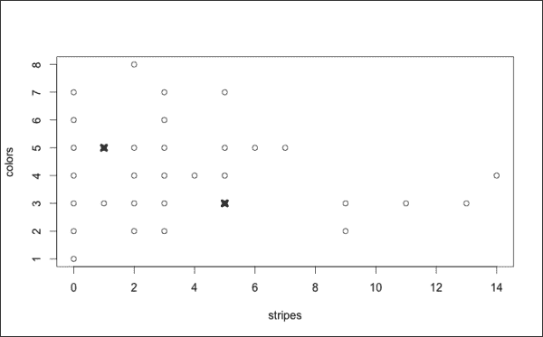

**o**代表国家旗帜，**x**代表质心。在运行 k-means 之前，我们需要定义一个距离，这是一种确定对象之间差异性的方法。例如，在上面的图表中，我们可以使用欧几里得距离，它表示连接两个点的线段的长度。该算法是迭代的，每一步包括以下步骤：

1.  对于每个点，确定距离最小的质心。然后，将该点分配到与最近质心相关的簇。

1.  以一种方式重新计算每个簇的质心，使其成为其对象的平均值。

最后，我们有两个簇，相关的质心代表平均对象。让我们可视化它们，如图所示：

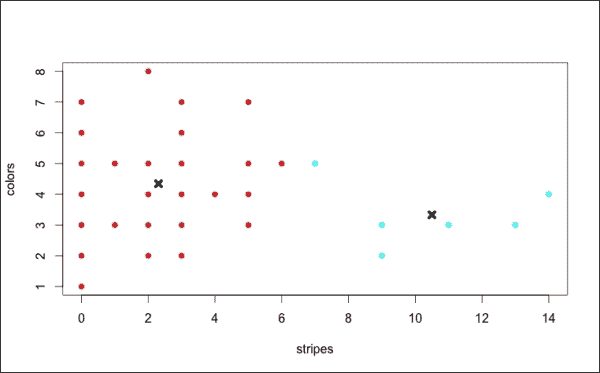

颜色代表簇，黑色**x**代表最终的质心。

k-means 是最受欢迎的聚类技术之一，因为它易于理解，并且不需要太多的计算能力。然而，该算法有一些局限性。它包含一个随机成分，因此如果我们对同一组数据运行两次，它可能会识别出不同的聚类。另一个缺点是它无法在特定环境中识别聚类，例如，当聚类具有不同的大小或复杂形状时。k-means 是一个非常简单和基本的算法，它是某些更复杂技术的起点。

## 层次聚类

层次聚类是聚类技术的一个分支。从一个对象集合开始，目标构建一个聚类层次。在聚合层次聚类中，每个对象最初属于不同的聚类。然后，算法将聚类合并，直到有一个包含所有对象的聚类。在确定了层次之后，我们可以在任何点上定义聚类并停止它们的合并。

在每次聚合步骤中，算法将两个最相似的聚类合并，并且有一些参数定义了相似性。首先，我们需要定义一种方法来衡量两个对象之间的相似程度。根据情况，有多种选择。然后，我们需要定义聚类之间的相似性；这些方法被称为**链接**。为了衡量相似性，我们首先定义一个距离函数，它是相反的。为了确定聚类 1 和聚类 2 之间的距离，我们测量聚类 1 中每个可能对象与聚类 2 中每个对象之间的距离。测量两个聚类之间距离的选项包括：

+   **单链接**：这是最小距离

+   **完全** **链接**：这是最大距离

+   **平均** **链接**：这是平均距离

根据链接方式的不同，算法的结果也会不同。

该示例使用与 k-means 相同的数据。国家旗帜由条纹和颜色数量表示，我们希望识别同质群体。我们使用的距离是欧几里得距离（仅仅是两点之间的距离）和链接方式为完全链接。首先，让我们从它们的层次结构中识别聚类，如图所示：

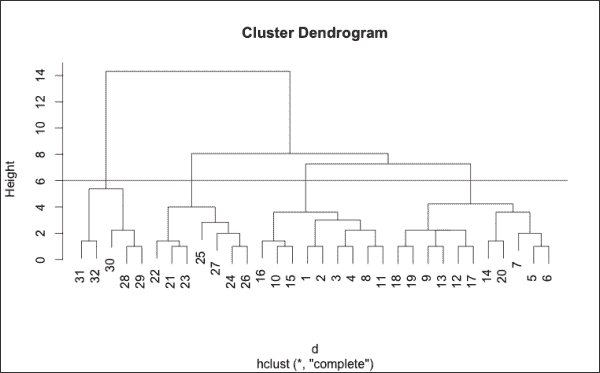

该图表称为**树状图**，图表底部每个对象属于不同的聚类。然后，向上合并聚类，直到所有对象属于同一个聚类。高度是算法合并聚类时的距离。例如，在高度 3 处，所有距离低于 3 的聚类已经合并。

红线位于高度 6 处，它定义了何时停止合并，其下方的对象被分为 4 个聚类。现在我们可以按照以下方式在图表中可视化聚类：

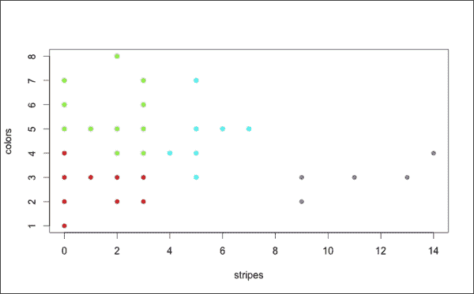

点的颜色代表簇。算法正确地识别了右侧的组，并且以良好的方式将左侧的组分为三部分。

层次聚类有多种选项，其中一些在某些情境下会产生非常好的结果。与 k-means 不同，该算法是确定性的，因此它总是导致相同的结果。

层次聚类的缺点之一是计算时间（`O(n³)`），这使得它无法应用于大型数据集。另一个缺点是需要手动选择算法配置和树状图切割。为了确定一个好的解决方案，我们通常需要用不同的配置运行算法，并可视化树状图以定义其切割。

## PCA

**主成分分析**（**PCA**）是一种将特征进行转换的统计过程。PCA 的原理基于线性相关性和方差的概念。在机器学习环境中，PCA 是一种降维技术。

从描述一组对象的特征开始，目标定义了其他彼此线性不相关的变量。输出是一个新的变量集，这些变量定义为初始特征的线性组合。此外，新变量根据其相关性进行排序。新变量的数量小于或等于初始特征的数量，并且可以选择最相关的特征。然后，我们能够定义一组更小的特征，从而降低问题维度。

算法从具有最高方差的特征组合开始定义，然后在每一步迭代地定义另一个特征组合，以最大化方差，条件是新组合与其他组合不线性相关。

在第四章的例子中，*步骤 1 – 数据探索和特征工程*，第五章，*步骤 2 – 应用机器学习技术*，以及第六章，*步骤 3 – 验证结果*中，我们定义了 37 个属性来描述每个国家国旗。应用 PCA 后，我们可以定义 37 个新的属性，这些属性是变量的线性组合。属性按相关性排序，因此我们可以选择前六个，从而得到一个描述国旗的小表格。这样，我们能够构建一个基于六个相关特征的监督学习模型来估计语言。

在存在大量特征的情况下，PCA 允许我们定义一组更小的相关变量。然而，这项技术并不适用于所有情境。一个缺点是结果取决于特征的缩放方式，因此有必要首先标准化变量。

处理监督学习问题时，我们可以使用 PCA 来降低其维度。然而，PCA 只考虑特征，而忽略了它们与预测属性之间的关系，因此它可能会选择与问题不太相关的特征组合。

# 摘要

在本章中，我们学习了机器学习技术的主要分支：监督学习和无监督学习。我们了解了如何使用监督学习技术，如 KNN、决策树、线性回归和神经网络来估计数值或分类属性。我们还看到，通过结合不同的监督学习算法的技术，即集成，可以提高性能。我们学习了如何使用 k-means 和层次聚类等聚类技术来识别同质群体。我们还理解了降维技术，如 PCA，对于将定义较小变量集的特征进行转换的重要性。

下一章将展示一个可以使用机器学习技术解决的商业问题的例子。我们还将看到监督学习和无监督学习技术的示例。
