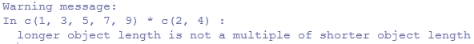

# 第一章. R 和机器学习入门

这本入门章节将帮助你开始学习 R 的基础，包括各种构造、有用的数据结构、循环和向量化。如果你已经是 R 高手，你可以快速浏览这些部分，然后直接进入下一部分，该部分将讨论机器学习作为一个领域实际上代表什么以及它涵盖的主要领域。我们还将讨论每个领域使用的不同机器学习技术和算法。最后，我们将通过查看 R 中最受欢迎的机器学习包来结束，其中一些将在后续章节中使用。

如果你是一位数据或机器学习爱好者，你肯定已经听说，哈佛商业评论将数据科学家的工作称为 21 世纪的“最性感的工作”。

### 注意

参考：[`hbr.org/2012/10/data-scientist-the-sexiest-job-of-the-21st-century/`](https://hbr.org/2012/10/data-scientist-the-sexiest-job-of-the-21st-century/)

目前市场上对数据科学家的需求巨大，主要是因为他们的主要工作是收集从非结构化和结构化数据中获取关键见解和信息，以帮助他们的企业和组织战略性地增长。

一些朋友可能会想知道机器学习或 R 与这些有什么关系！好吧，要成为一名成功的数据科学家，你工具箱中需要的主要工具之一是能够执行复杂统计计算、处理各种类型的数据以及构建模型的强大语言，而 R 正是这种完美的语言！机器学习构成了你成为数据分析师或数据科学家所需技能的基础，这包括使用各种技术构建模型以从数据中获得见解。

本书将为你提供一些必要的工具，帮助你熟练掌握 R 和机器学习，不仅通过观察概念，还通过将概念应用于现实世界的例子。足够说了；现在让我们开始我们的 R 机器学习之旅吧！

在本章中，我们将涵盖以下方面：

+   深入了解 R 的基础

+   理解 R 中的数据结构

+   使用函数

+   控制代码流程

+   进一步使用 R

+   理解机器学习基础知识

+   熟悉 R 中流行的机器学习包

# 深入了解 R 的基础

假设您至少熟悉 R 的基础知识或者之前使用过 R。因此，我们不会过多地讨论下载和安装。网上有大量资源提供了关于这方面的很多信息。我建议您使用 RStudio，这是一个**集成开发环境**（**IDE**），它比基本的 R**图形用户界面**（**GUI**）要好得多。您可以访问[`www.rstudio.com/`](https://www.rstudio.com/)获取更多关于它的信息。

### 注意

关于 R 项目的详细信息，您可以访问[`www.r-project.org/`](https://www.r-project.org/)以了解该语言的概述。除此之外，R 还拥有大量的优秀包可供使用，您可以在[`cran.r-project.org/`](https://cran.r-project.org/)查看与 R 及其包相关的所有信息，该网站包含所有存档。

您必须已经熟悉 R 交互式解释器，通常被称为**读取-评估-打印**循环（**REPL**）。这个解释器就像任何命令行界面一样，要求输入，并以`>`字符开始，这表示 R 正在等待您的输入。如果您的输入跨越多行，例如在编写函数时，您将在后续的每一行看到一个`+`提示，这意味着您还没有完成整个表达式的输入，R 正在要求您提供剩余的表达式。

R 也可以读取和执行包含命令和函数的完整文件，这些命令和函数保存在以`.R`扩展名保存的文件中。通常，任何大型应用程序都由几个`.R`文件组成。每个文件在应用程序中都有自己的角色，通常被称为模块。在接下来的几节中，我们将探讨 R 的一些主要功能和能力。

## 使用 R 作为科学计算器

R 中最基本的构造包括变量和算术运算符，可以用来执行像计算器一样的简单数学运算，甚至复杂的统计计算。

```py
> 5 + 6
[1] 11
> 3 * 2
[1] 6
> 1 / 0
[1] Inf

```

```py
1.
```

你也可以像任何其他编程语言一样给变量赋值并在其上操作。

```py
> num <- 6
> num ^ 2
[1] 36
> num
[1] 6     # a variable changes value only on re-assignment
> num <- num ^ 2 * 5 + 10 / 3
> num
[1] 183.3333

```

## 向量操作

R 中最基本的数据结构是向量。基本上，R 中的任何东西都是一个向量，即使是一个单独的数字，就像我们在前面的例子中看到的那样！向量基本上是一个序列或一组值。我们可以使用`:`运算符或`c`函数来创建向量，该函数将值连接起来以创建一个向量。

```py
> x <- 1:5
> x
[1] 1 2 3 4 5
> y <- c(6, 7, 8 ,9, 10)
> y
[1]  6  7  8  9 10
> z <- x + y
> z
[1]  7  9 11 13 15

```

```py
+ operator. This is known as vectorization and we will be discussing more about this later on. Some more operations on vectors are shown next:
```

```py
> c(1,3,5,7,9) * 2
[1]  2  6 10 14 18
> c(1,3,5,7,9) * c(2, 4)
[1]  2 12 10 28 18 # here the second vector gets recycled

```

**输出：**



```py
> factorial(1:5)
[1]   1   2   6  24 120
> exp(2:10)   # exponential function
[1]     7.389056    20.085537    54.598150   148.413159   403.428793  1096.633158
[7]  2980.957987  8103.083928 22026.465795
> cos(c(0, pi/4))   # cosine function
[1] 1.0000000 0.7071068
> sqrt(c(1, 4, 9, 16))
[1] 1 2 3 4
> sum(1:10)
[1] 55

```

在第二次操作中，我们尝试将一个较小的向量与一个较大的向量相乘，但我们仍然得到了一个结果！如果您仔细观察，R 也抛出了一个警告。在这种情况下发生的情况是，由于两个向量的大小不相等，这个较小的向量`c(2, 4)`被循环或重复，变成了`c(2, 4, 2, 4, 2)`，然后它与第一个向量`c(1, 3, 5, 7 ,9)`相乘，得到了最终的向量结果`c(2, 12, 10, 28, 18)`。这里提到的其他函数是 R 基础库中的标准函数，以及几个其他函数。

### 小贴士

**下载示例代码**

您可以从[`www.packtpub.com`](http://www.packtpub.com)的账户下载本书的示例代码文件。如果您在其他地方购买了这本书，您可以访问[`www.packtpub.com/support`](http://www.packtpub.com/support)并注册，以便将文件直接通过电子邮件发送给您。

您可以通过以下步骤下载代码文件：

+   使用您的电子邮件地址和密码登录或注册我们的网站。

+   将鼠标指针悬停在顶部的**支持**标签上

+   点击**代码下载与勘误**

+   在**搜索**框中输入书籍名称

+   选择您想要下载代码文件的书籍

+   从下拉菜单中选择您购买这本书的地方

+   点击**代码下载**

文件下载完成后，请确保您使用最新版本的以下软件解压缩或提取文件夹：

+   WinRAR / 7-Zip for Windows

+   Zipeg / iZip / UnRarX for Mac

+   7-Zip / PeaZip for Linux

## 特殊值

由于您将在数据分析和机器学习中处理大量混乱和脏数据，因此记住 R 中的一些特殊值很重要，这样您就不会在它们出现时感到太惊讶。

```py
> 1 / 0
[1] Inf
> 0 / 0
[1] NaN
> Inf / NaN
[1] NaN
> Inf / Inf
[1] NaN
> log(Inf)
[1] Inf
> Inf + NA
[1] NA

```

```py
TRUE and FALSE are logical data type values, similar to other programming languages.
```

```py
> vec <- c(0, Inf, NaN, NA)
> is.finite(vec)
[1]  TRUE FALSE FALSE FALSE
> is.nan(vec)
[1] FALSE FALSE  TRUE FALSE
> is.na(vec)
[1] FALSE FALSE  TRUE  TRUE
> is.infinite(vec)
[1] FALSE  TRUE FALSE FALSE

```

这些函数的名称相当直观。它们清楚地表明哪些值是有限的，哪些值是有限的，并分别检查`NaN`和`NA`值。其中一些函数在清理脏数据时非常有用。

# R 中的数据结构

在这里，我们将探讨 R 中存在的一些最有用的数据结构，并使用一些虚构的例子来更好地掌握它们的语法和结构。我们将在这里涵盖的主要数据结构包括：

+   向量

+   数组和矩阵

+   列表

+   数据框

这些数据结构在 R 内部以及各种 R 包和函数中广泛使用，包括我们将在后续章节中使用的机器学习函数和算法。因此，了解如何使用这些数据结构来高效地处理数据是至关重要的。
