# 第二章。让我们帮助机器学习

当你第一次听到机器学习这个词时，它听起来更像是一部科幻电影中的时髦词汇，而不是科技行业最新的趋势。和普通人谈论这个话题，他们的反应要么是对这个概念的一般好奇，要么是谨慎和恐惧，担心智能机器以某种终结者-天网的方式接管我们的世界。

我们生活在数字时代，时刻都被各种各样的信息包围。正如我们将在本章和接下来的章节中看到的，机器学习是一种喜欢数据的东西。事实上，这个领域最近的热潮和兴趣不仅是由计算技术的改进所推动，还由于每秒产生的数据量的指数级增长。最新的数据显示，每天大约有 2.5 亿亿字节的数据（即 2.5 后面跟着 18 个零）！

### 注意

**有趣的事实**：每分钟有超过 300 小时的视频数据上传到 YouTube

来源：[`www-01.ibm.com/software/data/bigdata/what-is-big-data.html`](https://www-01.ibm.com/software/data/bigdata/what-is-big-data.html)

深吸一口气，环顾四周。你周围的一切都在不断生成各种类型的数据；你的手机、你的汽车、交通信号灯、GPS、恒温器、气象系统、社交网络，等等！到处都是数据，我们可以用它做各种有趣的事情，并帮助系统学习。好吧，虽然听起来很吸引人，但让我们开始我们的机器学习之旅。通过本章，我们将涵盖：

+   理解机器学习

+   机器学习中的算法及其应用

+   算法系列：监督学习和无监督学习

# 理解机器学习

我们不是被教导计算机系统必须被编程来完成某些任务吗？它们可能在做事情时快上百万倍，但它们必须被编程。我们必须编写每一个步骤，然后这些系统才能工作并完成任务。那么，机器学习的概念本身不是一个非常矛盾的概念吗？

简单来说，机器学习是指一种教会系统学习执行某些任务的方法，比如学习一个函数。虽然听起来很简单，但它有点令人困惑，难以理解。之所以令人困惑，是因为我们对系统（特别是计算机系统）工作方式的看法和我们学习的方式这两个概念几乎不相交。它甚至更难以理解，因为学习虽然是人类的天赋能力，但很难用言语表达，更不用说教给系统了。

那么，什么是机器学习？在我们甚至尝试回答这个问题之前，我们需要理解在哲学层面上，它不仅仅是一种编程方式。机器学习包含了很多东西。

描述机器学习的方式有很多。继续从我们在上一章中提出的高级定义，让我们看看 1997 年汤姆·米切尔给出的定义：

> *"如果计算机程序就某个任务 T 和某些性能指标 P 而言，从经验 E 中学习，那么其性能 P，如 P 所测量的，随着经验 E 的提高而提高。"*

### 注意

**关于汤姆·米切尔教授的快速笔记**

1951 年出生，他是美国计算机科学家，卡内基梅隆大学（CMU）的教授。他也是 CMU 机器学习系的主任。他在机器学习、人工智能和认知神经科学领域做出了贡献，因此广为人知。他是多个机构的成员，如人工智能协会。

现在让我们通过一个例子来理解这个简洁而有力的定义。假设我们想要构建一个预测天气的系统。对于当前示例，系统的任务（T）将是预测某个地方的天气。为了执行这个任务，它需要依赖于过去的天气信息。我们将它称为经验 E。它的性能（P）是通过它在任何给定一天预测天气的好坏来衡量的。因此，我们可以概括地说，如果一个系统通过利用过去的信息（或经验 E）在预测天气（或任务 T）方面变得更好（或提高其性能 P），那么它就成功地学会了如何预测天气（或任务 T）。

如前例所示，这个定义不仅帮助我们从工程角度理解机器学习，还为我们提供了量化这些术语的工具。这个定义帮助我们认识到，学习特定任务涉及以经验形式理解和处理数据。它还提到，如果一个计算机程序通过经验 E 学习，那么它的性能 P 会随着经验 E 的提高而提高，这与我们学习的方式非常相似。

# 机器学习算法

到目前为止，我们已经对机器学习有了抽象的理解。我们理解了机器学习的定义，即当计算机程序利用经验 E 中的数据来执行任务 T 时，如果其性能 P 随着它而提高，那么任务 T 可以被学习。我们还看到了机器学习与传统的编程范式不同的地方，因为我们不是编写每一个步骤，而是让程序形成对问题空间的理解，并帮助我们解决问题。看到这样的程序在我们面前工作，确实令人惊讶。

在我们学习机器学习概念的过程中，我们一直把这个神奇的计算机程序当作一个神秘的黑色盒子，它为我们学习和解决问题。现在是我们揭开它的神秘面纱，揭开盖子，看到这些神奇算法的全貌的时候了。

我们将从机器学习中一些最常用和广泛使用的算法开始，探讨它们的复杂性、用法，并在必要时涉及一些数学知识。通过本章，你将了解不同算法家族。这个列表绝对不是详尽的，尽管算法将被相当详细地解释，但每个算法的深入理论理解超出了本书的范围。有大量的材料以书籍、在线课程、博客等形式轻松可用。

## 感知器

这就像是机器学习宇宙中的 `Hello World` 算法。它可能是最容易理解和使用的一类，但绝对不比其他算法弱。

1958 年由弗兰克·罗森布拉特（Frank Rosenblatt）发表，感知器算法因其保证在可分数据集中找到分隔符而受到广泛关注。

感知器是一个函数（或更确切地说是一个简化的神经元）它接受一个实数向量作为输入，并生成一个实数作为输出。

从数学上讲，感知器可以表示为：


在这里，`w1,…,wn` 是权重，`b` 是称为偏置的常数，`x1,…,xn` 是输入，`y` 是函数 `f` 的输出，该函数被称为激活函数。

算法如下：

1.  将权重向量 `w` 和偏置 `b` 初始化为小的随机数。

1.  根据函数 `f` 和向量 `x` 计算输出向量 `y`。

1.  更新权重向量 `w` 和偏置 `b` 以抵消错误。

1.  重复步骤 2 和 3，直到没有错误或错误低于某个阈值。

该算法试图通过使用称为训练数据集的标记数据集（训练数据集对应于前一小节中机器学习定义中的经验 E）来找到一个分隔符，将输入分为两类。算法首先随机分配权重向量 `w` 和偏置 `b` 的权重。然后根据函数 `f` 处理输入，并给出一个向量 `y`。然后，将生成的输出与训练数据集中的正确输出值进行比较，并相应地更新 `w` 和 `b`。为了理解权重更新过程，让我们考虑一个点，比如 `p1`，其正确输出值为 `+1`。现在，假设如果感知器错误地将 `p1` 分类为 `-1`，它将更新权重 `w` 和偏置 `b`，以通过一个小量（移动受到学习率的限制，以防止突然跳跃）在 `p1` 的方向上移动感知器，以便正确分类它。当找到正确的分隔符或分类输入的错误低于某个用户定义的阈值时，算法停止。

现在，让我们通过一个小例子来看看算法的实际应用。

为了使算法工作，我们需要一个线性可分的数据集。让我们假设数据是由以下函数生成的：

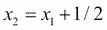

根据前面的方程，正确的分隔符将给出如下：

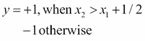

使用 R 中的均匀分布数据生成输入向量`x`的方法如下：

```py
#30 random numbers between -1 and 1 which are uniformly distributed
x1 <- runif(30,-1,1) 
x2 <- runif(30,-1,1)
#form the input vector x
x <- cbind(x1,x2)

```

现在我们有了数据，我们需要一个函数来将其分类为两个类别之一。

```py
#helper function to calculate distance from hyperplane
calculate_distance = function(x,w,b) {
 sum(x*w) + b
}

#linear classifier
linear_classifier = function(x,w,b) {
distances =apply(x, 1, calculate_distance, w, b)
return(ifelse(distances < 0, -1, +1))
}

```

辅助函数`calculate_distance`计算每个点到分隔符的距离，而`linear_classifier`类将每个点分类为属于类`-1`或类`+1`。

随后，感知器算法使用先前的分类器函数，通过训练数据集找到正确的分隔符。

```py
#function to calculate 2nd norm
second_norm = function(x) {sqrt(sum(x * x))}

#perceptron training algorithm
perceptron = function(x, y, learning_rate=1) {

w = vector(length = ncol(x)) # initialize w
b = 0 # Initialize b
k = 0 # count iterations

#constant with value greater than distance of furthest point
R = max(apply(x, 1, second_norm)) 

incorrect = TRUE # flag to identify classifier

#initialize plot
plot(x,cex=0.2)

#loop till correct classifier is not found
while (incorrect ) {

 incorrect =FALSE 

 #classify with current weights
 yc <- linear_classifier(x,w,b)
 #Loop over each point in the input x
 for (i in 1:nrow(x)) {
 #update weights if point not classified correctly
 if (y[i] != yc[i]) {
 w <- w + learning_rate * y[i]*x[i,]
 b <- b + learning_rate * y[i]*R²
 k <- k+1

 #currect classifier's components
 # update plot after ever 5 iterations
 if(k%%5 == 0){
 intercept <- - b / w[[2]]
 slope <- - w[[1]] / w[[2]]
 #plot the classifier hyper plane
 abline(intercept,slope,col="red")
 #wait for user input
 cat ("Iteration # ",k,"\n")
 cat ("Press [enter] to continue")
 line <- readline()
 }
 incorrect =TRUE
 }
 }
}

s = second_norm(w)
#scale the classifier with unit vector
return(list(w=w/s,b=b/s,updates=k))
}

```

现在是时候训练感知器了！

```py
#train the perceptron
p <- perceptron(x,Y)

```

图表将如下所示：

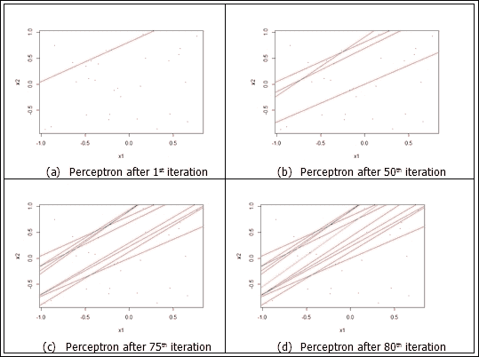

感知器正在寻找正确的分类器。正确的分类器用绿色显示

前面的图显示了感知器的训练状态。每个错误的分类器都用红线表示。如图所示，感知器在找到标记为绿色的正确分类器后结束。

如下所示，可以查看最终分隔符的放大视图：

```py
#classify based on calculated 
y <- linear_classifier(x,p$w,p$b)

plot(x,cex=0.2)

#zoom into points near the separator and color code them
#marking data points as + which have y=1 and – for others
points(subset(x,Y==1),col="black",pch="+",cex=2)
points(subset(x,Y==-1),col="red",pch="-",cex=2)

# compute intercept on y axis of separator
# from w and b
intercept <- - p$b / p$w[[2]]

# compute slope of separator from w
slope <- - p$w[[1]] /p$ w[[2]]

# draw separating boundary
abline(intercept,slope,col="green")

```

图表如下所示：


感知器找到的正确分类器函数

# 算法系列

机器学习领域中存在大量的算法，每年都有新的算法被设计出来。在这个领域正在进行着大量的研究，因此算法列表不断增长。事实上，这些算法被使用得越多，对其改进的发现也越多。机器学习是一个工业和学术界紧密合作的空间。

但是，正如蜘蛛侠被告知的那样，“能力越大，责任越大”，读者也应该理解手头的责任。在如此多的算法可用的情况下，了解它们是什么以及它们适合哪里是必要的。一开始可能会感到压倒性和困惑，但这时将它们分类到系列中会很有帮助。

机器学习算法可以根据多种方式进行分类。最常见的方法是将它们分为监督学习算法和无监督学习算法。

## 监督学习算法

监督学习是指那些在预定义的数据集上训练的算法，这个数据集被称为训练数据集。通常，训练数据集是一个包含输入元素和期望输出元素或信号的二元组。一般来说，输入元素是一个向量。监督学习算法使用训练数据集来产生期望的函数。然后，产生的函数（或更确切地说，推断出的函数）被用来正确地映射新数据，更准确地说是测试数据。

一个学习良好的算法能够以合理的方式正确确定未见数据的结果。这引入了泛化和过拟合的概念。

简而言之，泛化是指算法根据（有限的）训练数据泛化所需函数，以正确处理未见数据的概念。过拟合是泛化的相反概念，其中算法推断一个函数，使其正好映射到训练数据集（包括噪声）。当算法学到的函数与新的/未见的数据进行比较时，这可能导致巨大的误差。

泛化和过拟合都围绕着输入数据中的随机误差或噪声。虽然泛化试图最小化噪声的影响，但过拟合则相反，通过拟合噪声来实现。

使用监督方法要解决的问题可以分为以下步骤：

1.  **准备训练数据**：数据准备是所有机器学习算法最重要的步骤。由于监督学习使用标记的输入数据集（包含给定输入的对应输出的数据集），这一步骤变得更加重要。这些数据通常由人类专家或测量标记。

1.  **准备模型**：模型是输入数据集和学到的模式的表示。模型表示受输入特征和学习算法本身等因素的影响。推断函数的准确性也取决于这种表示是如何形成的。

1.  **选择算法**：根据要解决的问题和输入信息，然后选择一个算法来学习和解决问题。

1.  **检查和微调**：这是一个迭代步骤，其中算法在输入数据集上运行，并对参数进行微调以达到期望的输出水平。然后，算法在测试数据集上测试以评估其性能和测量误差。

在监督学习中，有两个主要的子类别：

1.  **基于回归的机器学习**：帮助回答诸如有多少？或有多少？等定量问题的学习算法。输出通常是连续值。更正式地说，这些算法根据训练数据和形成的模型预测未见/新数据的输出值。在这种情况下，输出值是连续的。线性回归、多元回归、回归树等是一些监督回归算法。

1.  **基于分类的机器学习**：帮助回答客观问题或是与否预测的学习算法。例如，像这个组件是否损坏？或这个肿瘤是否会导致癌症？等问题的预测。更正式地说，这些算法根据训练数据和形成的模型预测未见或新数据的类别标签。**支持向量机**（**SVM**）、决策树、随机森林等是一些常用的监督分类算法。

让我们详细看看一些监督学习算法。

### 线性回归

如前所述，回归帮助我们回答定量问题。回归的根源在统计学领域。研究人员使用线性关系来预测给定输入值`X`的输出值`Y`。这种线性关系称为线性回归或回归线。

数学上，线性回归表示为：

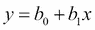

其中，`b[0]`是截距，即直线与`y`轴相交的点。

`b[1]`是直线的斜率，即`y`随`x`变化的改变量。

上述方程与表示直线的方式非常相似，因此得名线性回归。

现在，我们如何决定为我们的输入数据拟合哪条线，以便它能很好地预测未知数据？嗯，为此我们需要一个误差度量。可以有各种误差度量；最常用的是**最小二乘法**。

在我们定义最小二乘法之前，我们首先需要理解残差这个术语。残差简单地是 Y 与拟合值的偏差。数学上：

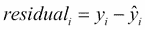

其中，`ŷ[i]`是`y`的偏差值。

最小二乘法表明，当残差的平方和最小时，模型与数据的最佳拟合发生。

数学上：

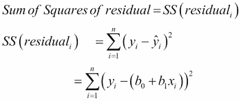

我们使用微积分来最小化残差平方和，并找到相应的系数。

现在我们已经理解了线性回归，让我们用一个现实世界的例子来看看它是如何应用的。

假设我们有一些与学校儿童身高和体重相关的数据。你内心的数据科学家突然开始思考这些儿童的体重和身高之间是否存在任何关系。正式来说，一个孩子的体重能否根据其给定的身高进行预测？

为了适应线性回归，第一步是理解数据并查看两个变量（`体重`和`身高`）之间是否存在相关性。由于在这种情况下我们只处理两个维度，使用散点图可视化数据将帮助我们快速理解它。这还将使我们能够确定变量之间是否存在某种线性关系。

让我们先准备我们的数据，并在散点图上可视化它，同时显示相关系数。

```py
#Height and weight vectors for 19 children

height <- c(69.1,56.4,65.3,62.8,63,57.3,59.8,62.5,62.5,59.0,51.3,64,56.4,66.5,72.2,65.0,67.0,57.6,66.6)

weight <- c(113,84,99,103,102,83,85,113,84,99,51,90,77,112,150,128,133,85,112)

plot(height,weight)
cor(height,weight)

```

**输出：**

```py
[1] 0.8848454

```

散点图看起来是这样的：

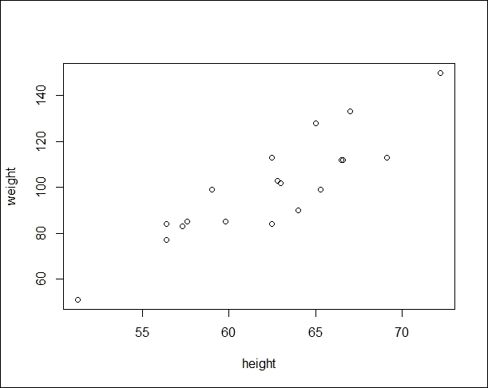

显示体重和身高维度数据点的图

上述散点图证明了我们对体重和身高之间具有线性关系的直觉是正确的。这可以通过相关函数进一步确认，它给出了`0.88`的值。

是时候为我们的数据集准备模型了！我们使用内置的`lm`或线性模型实用工具来找到系数`b[0]`和`b[1]`。

```py
#Fitting the linear model

model <- lm(weight ~ height) # weight = slope*weight + intercept

#get the intercept(b0) and the slope(b1) values
model

```

输出看起来是这样的：

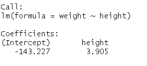

你可以通过以下命令进一步实验，以找出`lm`实用工具计算出的更多细节。我们鼓励你继续尝试这些命令。

```py
#check all attributes calculated by lm
attributes(model)

#getting only the intercept
model$coefficients[1] #or model$coefficients[[1]]

#getting only the slope
model$coefficients[2] #or model$coefficients[[2]]

#checking the residuals
residuals(model)

#predicting the weight for a given height, say 60 inches
model$coefficients[[2]]*50 + model$coefficients[[1]]

#detailed information about the model
summary(model)

```

作为最后一部分，让我们在我们的散点图上可视化回归线。

```py
#plot data points
 plot(height,weight)

#draw the regression line
abline(model)

```

散点图看起来如下所示：

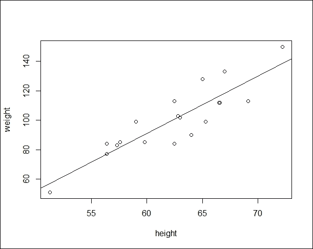

带有计算回归线的散点图

因此，我们看到了如何通过几行代码识别两个变量之间的关系并做出预测。但我们还没有完成。在决定是否使用线性回归之前，读者必须理解一些注意事项。

如果且仅当给定输入的输出值可以预测时，线性回归才能使用：

+   散点图形成线性模式

+   它们之间的相关性是中等到强的（超过`0.5`或`-0.5`）

如果只满足上述两个条件中的一个，可能会导致错误的预测或完全无效的模型。例如，如果我们只检查相关性并发现它很强，而跳过了查看散点图的步骤，那么这可能会导致无效的预测，因为你可能试图拟合一条直线，而数据本身是遵循曲线形状的（注意，曲线数据集也可以有很高的相关性值，因此这个错误）。

重要的是要记住**相关性不等于因果关系**。简单来说，两个变量之间的相关性并不一定意味着一个导致另一个。可能存在一种情况，由于一个被称为共同变量的第三变量，因果关系是间接相关的。用来描述这个问题的最常见例子是鞋码与阅读能力之间的关系。从调查数据（如果有的话！）可以推断出，较大的鞋码与较高的阅读能力相关，但这显然并不意味着大脚会导致良好的阅读技能。可能更有趣的是注意到，年幼的孩子脚小，还没有被教过阅读。在这种情况下，这两个变量更准确地与年龄相关。

你现在应该对之前我们使用的体重与身高示例得出类似的结论。嗯，之前的例子也存在着类似的谬误，但它作为一个易于使用的场景。请随意四处看看，并建模那些不受此影响的案例。

线性回归在金融领域得到应用，用于投资风险的量化等。它也在经济学领域被广泛用于趋势线分析等。

除了线性回归之外，**逻辑回归**、**逐步回归**、**多元自适应回归样条**（**MARS**）和其他一些监督回归学习算法。

### K-最近邻（KNN）

从实现和理解的角度来看，K-Nearest Neighbors 或 KNN 算法是最简单的算法之一。它们是另一种监督学习算法，帮助我们分类数据。

KNN 可以用引用 *“同类相吸”——柏拉图* 来简单描述，即相似的事物很可能具有相似的性质。KNN 利用这一概念根据其与邻居的相似性来标记数据点。

形式上，KNN 可以描述为通过将未标记（或未见）的数据点分配给最相似标记数据点（或训练样本）的类别来对它们进行分类的过程。

KNN 是一种监督学习算法。因此，它从一个被分类为不同类别的训练数据集开始。然后，算法选择测试数据集中的每个数据点，并根据选择的相似度度量，确定其 *k* 个最近邻（其中 k 是预先指定的）。然后，数据点被分配给 k 个最近邻中的大多数的类别。

KNN 的秘诀在于相似度度量。我们有各种相似度度量可供选择。选择哪种度量取决于问题的复杂性、数据的类型等因素。欧几里得距离就是这样一种广泛使用的度量，它是两点之间最短的直接路线。数学上，它表示为：

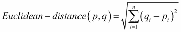

曼哈顿距离、余弦距离和闵可夫斯基距离是其他一些可以用于寻找最近邻的距离度量。

KNN 算法的下一个参数是 K-Nearest Neighbors 中的 `k`。`k` 的值决定了 KNN 模型对测试数据的泛化程度。训练数据过拟合和欠拟合之间的平衡取决于 `k` 的值。经过稍微思考，很容易理解较大的 `k` 将最小化由噪声数据引起的方差的影响，但同时也将削弱数据中的小但重要的模式。这个问题被称为 **偏差-方差权衡**。

k 的最佳值，尽管难以确定，但位于 `k=1` 到 `k=训练样本总数` 的极端之间。一种常见的做法是将 `k` 的值设置为训练实例的平方根，通常在 3 到 10 之间。尽管这是一种常见的做法，但 `k` 的值取决于要学习概念复杂性和训练样本数量。

追求 KNN 算法的下一步是准备数据。用于准备输入向量的特征应该处于相似的尺度。这一步骤的合理性在于距离公式依赖于特征的测量方式。例如，如果某些特征与其他特征相比具有较大的值范围，那么距离测量将主要由这些测量值决定。将特征缩放到相似尺度的方法称为**归一化**。与距离测量一样，有各种归一化方法可用。其中一种方法是 min-max 归一化，数学上表示为：

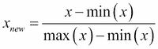

在我们开始示例以了解 KNN 之前，让我们概述执行 KNN 要执行的步骤：

1.  **收集数据并探索数据**：我们需要收集与要学习概念相关的数据。我们还需要探索数据，以了解各种特征，了解其值范围，并确定类标签。

1.  **归一化数据**：如前所述，KNN 对距离测量的依赖性使得我们非常重要的是要对数据进行归一化，以消除计算中的任何不一致性或偏差。

1.  **创建训练和测试数据集**：由于学习一个概念并准备一个可以推广到未见数据可接受水平的模型非常重要，我们需要准备训练和测试数据集。尽管测试数据集已标记，但它用于确定模型的准确性和泛化所学习概念的能力。通常的做法是将输入样本分为三分之二和三分之一，分别用于训练和测试数据集。同样重要的是，这两个数据集应该是所有类标签和数据点的良好混合，也就是说，这两个数据集应该是完整数据的有代表性的子集。

1.  **训练模型**：现在我们已经准备好了所有东西，我们可以使用训练数据集、测试数据集、标签和`k`的值来训练我们的模型，并为测试数据集中的数据点标记标签。

1.  **评估模型**：最后一步是评估学习到的模式。在这个步骤中，我们确定算法相对于已知标签预测测试数据集类标签的效果如何。通常为此准备一个混淆矩阵。

现在，让我们看看 KNN 的实际应用。当前的问题是根据某些特征对不同的花卉种类进行分类。对于这个特定的例子，我们将使用 Iris 数据集。这个数据集是 R 默认安装的一部分。

#### 收集和探索数据

第一步是收集和探索数据。让我们首先收集数据。

要检查您的系统是否有所需的数据库，只需输入名称：

```py
iris
#this should print the contents of data set onto the console.

```

如果您没有可用的数据集，不用担心！您可以按照以下方式下载：

```py
#skip these steps if you already have iris on your system
iris <- read.csv(url("http://archive.ics.uci.edu/ml/machine-learning-databases/iris/iris.data"), header = FALSE)

#assign proper headers
names(iris) <- c("Sepal.Length", "Sepal.Width", "Petal.Length", "Petal.Width", "Species")

```

现在我们有了数据，是时候探索和理解它了。为了探索数据集及其属性，我们使用以下命令：

```py
#to view top few rows of data
head(iris)

```

**输出：**

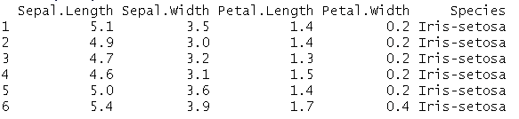

```py
#to view data types, sample values, categorical values, etc
str(iris)

```

**输出：**

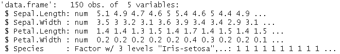

```py
#detailed view of the data set
summary(iris)

```

**输出：**

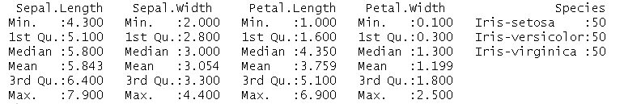

`summary`命令帮助我们更好地理解数据。它清楚地显示了不同的属性以及`min`、`max`、`median`和其他此类统计数据。这些有助于我们在接下来的步骤中，可能需要缩放或归一化数据或特征。

在第一步中，我们通常会对输入数据进行标记。由于我们当前的数据集已经标记，因此对于这个例子，我们可以跳过这一步。让我们通过视觉方式查看物种的分布情况。我们再次求助著名的散点图，但这次我们使用一个名为`ggvis`的包。

你可以安装`ggvis`如下：

```py
install.packages("ggvis")

```

为了可视化所有 3 种物种的花瓣宽度和长度，我们使用以下代码片段：

```py
#load the package
library(ggvis)

#plot the species
iris %>% ggvis(~Petal.Length, ~Petal.Width, fill = ~factor(Species)) %>% layer_points()

```

### **注意**

```py
%>%, to pass input data to ggvis and again uses the pipe operator to pass on the output to layer_points for final plotting. The ~ operator signifies to ggvis that Petal.Length is a variable in the input dataset (iris). Read more about ggvis at http://ggvis.rstudio.com/ggvis-basics.html.
```

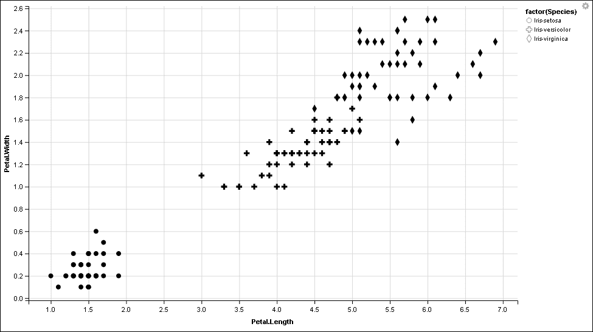

前面的图表清楚地表明，对于**Iris-setosa**花，花瓣宽度和长度之间存在高度相关性，而对于其他两种物种则稍微低一些。

### **注意**

尝试可视化萼片宽度和萼片长度，看看你是否能发现任何相关性。

#### 数据归一化

下一步是将数据进行归一化，以便所有特征都在相同的尺度上。如数据探索步骤所示，所有属性的值或多或少都在一个可比较的范围内。但是，为了这个例子，让我们编写一个最小-最大归一化函数：

```py
#normalization function

min_max_normalizer <- function(x)
{
num <- x - min(x) 
denom <- max(x) - min(x)
return (num/denom)
}

```

记住，归一化不会改变数据，它只是缩放它。因此，即使我们的数据不需要归一化，这样做也不会造成任何伤害。

### **注意**

**注意**

在接下来的步骤中，我们将使用未归一化的数据以使输出更清晰。

```py
#normalizing iris data set
normalized_iris <- as.data.frame(lapply(iris[1:4], min_max_normalizer))

#viewing normalized data
summary(normalized_iris)

```

以下是对归一化 DataFrame 的总结：

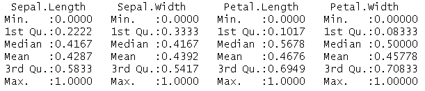

#### 创建训练集和测试集

现在我们已经将数据归一化，我们可以将其分为训练集和测试集。我们将遵循通常的三分之二对三分之一的数据分割规则。如前所述，这两个数据集应该代表整个数据，因此我们需要选择合适的样本。我们将利用 R 的`sample()`函数来准备我们的样本。

```py
#checking the data constituency
table(iris$Species)

```

**输出：**

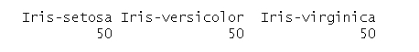

```py
#set seed for randomization
set.seed(1234)

# setting the training-test split to 67% and 33% respectively
random_samples <- sample(2, nrow(iris), replace=TRUE, prob=c(0.67, 0.33))

# training data set
iris.training <- iris[
random_samples ==1, 1:4] 

#training labels
iris.trainLabels <- iris[
random_samples ==1, 5]

# test data set
iris.test <- iris[
random_samples ==2, 1:4]

#testing labels
iris.testLabels <- iris[
random_samples ==2, 5]

```

#### 从数据中学习/训练模型

一旦我们在训练集和测试集中准备好了数据，我们就可以进行下一步，使用 KNN 从数据中学习。R 中的 KNN 实现位于类库中。KNN 函数需要以下输入：

+   `train`：包含训练数据的 DataFrame。

+   `test`：包含测试数据的 DataFrame。

+   `class`：包含类别标签的向量。也称为因子向量。

+   `k`：k-最近邻算法中 k 的值。

对于当前情况，让我们假设`k`的值为`3`。奇数通常在打破平局时表现良好。KNN 的执行如下：

```py
#setting library
library(class)

#executing knn for k=3
iris_model <- knn(train = iris.training, test = iris.test, cl = iris.trainLabels, k=3)

#summary of the model learnt
iris_model

```

**输出：**

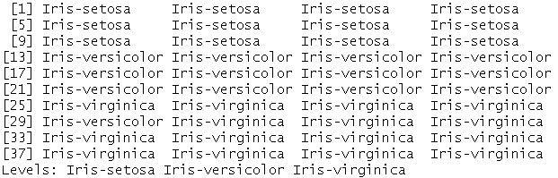

快速浏览输出显示，除了 virginica 中的一个 versicolor 标签之外，所有内容都是正确的。尽管这个标签很容易找到，但还有更好的方法来评估模型。

#### 评估模型

这将我们带到了最后一步，即评估模型。我们通过准备一个混淆矩阵或交叉表来完成这项工作，这有助于我们了解预测标签与测试数据的已知标签之间的关系。R 提供了一个名为`CrossTable()`的实用函数，该函数位于`gmodels`库中。让我们看看输出：

```py
#setting library
library(gmodels)

#Preparing cross table
CrossTable(x = iris.testLabels, y = iris_model, prop.chisq=FALSE)

```

**输出：**

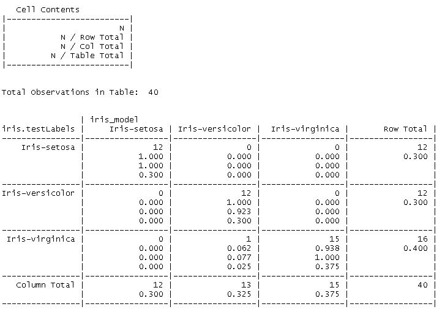

从前面的输出中，我们可以得出结论，该模型将 virginica 的一个实例标记为 versicolor，而所有其他测试数据点都被正确标记。这也帮助我们推断出选择`k=3`确实是足够的。我们敦促读者尝试用不同的`k`值运行相同的示例，并观察结果的变化。

KNN 是一个简单而强大的算法，它不对底层数据分布做出假设，因此可以在特征和类别之间的关系复杂或难以理解的情况下使用。

从另一方面来看，KNN 是一个资源密集型的算法，因为它需要大量的内存来处理数据。对距离度量和缺失数据的依赖需要额外的处理，这也是该算法的另一个开销。

尽管有其局限性，KNN 在许多实际应用中都有使用，例如文本挖掘、预测心脏病发作、预测癌症等等。KNN 还应用于金融和农业领域。

决策树、随机森林和支持向量机是一些最流行和广泛使用的监督分类算法。

## 无监督学习算法

无监督学习是指算法自己学习概念（们）。既然我们已经熟悉了监督学习的概念，让我们利用我们的知识来理解无监督学习。

与需要标记输入训练数据集的监督学习算法不同，无监督学习算法的任务是在没有任何标记训练数据集的情况下，在数据中寻找关系和模式。这些算法处理输入数据以挖掘规则、检测模式、总结和分组数据点，这有助于得出有意义的见解，并向用户描述数据。在无监督学习算法的情况下，不存在训练和测试数据集的概念。相反，如前所述，输入数据被分析并用于推导模式和关系。

与监督学习类似，无监督学习算法也可以分为两大类：

+   **基于关联规则的机器学习**：这些算法挖掘输入数据以识别模式和规则。这些规则解释数据集中变量之间的有趣关系，以描述频繁项集和数据中出现的模式。这些规则反过来又帮助从任何企业或组织的庞大数据存储库中发现有用的见解。流行的算法包括 Apriori 和 FP-Growth。

+   **基于聚类的机器学习**：与基于监督学习的分类算法类似，这些算法的主要目标是仅使用从输入数据中提取的特征，将输入数据点聚类或分组到不同的类别或类别中，而不需要其他外部信息。与分类不同，聚类中事先并不知道输出标签。一些流行的聚类算法包括 k-means、k-medoids 和层次聚类。

让我们看看一些无监督学习算法。

### Apriori 算法

这个震惊世界的算法由 Agarwal 和 Srikant 于 1993 年提出。该算法旨在处理事务数据，其中每个事务是一组物品或项集。简而言之，该算法识别出数据集中至少有 C 个事务的子集的项集。

正式地，设 `┬` 为一个物品集合，`D` 为一个事务集合，其中每个事务 `T` 是 `┬` 的一个子集。数学上：

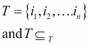

然后，一个关联规则是形式为 `X → Y` 的蕴涵，其中事务 `T` 包含 `┬` 的一个子集 `X`，并且：


如果在事务集合 `D` 中，包含 `X` 的 `c%` 事务也包含 `Y`，则蕴涵 `X → Y` 在事务集合 `D` 中成立，具有置信度因子 `c`。如果 `s%` 的事务在 `D` 中包含 `X U Y`，则关联规则 `X → Y` 被说成具有支持度因子 `s`。因此，给定一个事务集合 `D`，识别关联规则的任务意味着生成所有具有大于用户定义的阈值（称为 `minsup`，即最小支持度阈值）和 `minconf`（即最小置信度阈值）的置信度和支持度的规则。

广义上，该算法分为两个步骤。第一步是识别出现次数超过预定义阈值的项集。这样的项集被称为**频繁项集**。第二步是从识别出的频繁项集中生成满足最小置信度和支持度约束的关联规则。

可以使用以下伪代码更好地解释这两个相同的步骤：

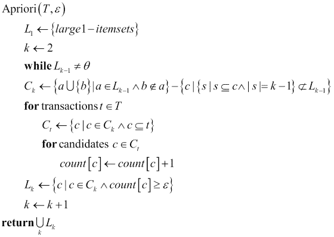

现在我们来看看算法的实际应用。所考虑的数据集是 UCI 机器学习仓库的`Adult`数据集。该数据集包含人口普查数据，具有性别、年龄、婚姻状况、国籍和职业等属性，以及工作类别、收入等经济属性。我们将使用这个数据集来识别人口普查信息与个人收入之间是否存在关联规则。

Apriori 算法存在于`arules`库中，所考虑的数据集命名为`Adult`。它也包含在默认的 R 安装中。

```py
# setting the apriori library
library(arules)

# loading data
data("Adult");

```

是时候探索我们的数据集并查看一些样本记录了：

```py
# summary of data set
summary(Adult);

# Sample 5 records
inspect(Adult[0:5]);

```

我们了解到数据集包含一些 `48k` 笔交易，有 115 列。我们还获得了关于项目集大小分布的信息。`inspect`函数让我们窥视样本交易以及每列所持有的值。

现在，让我们建立一些关系：

```py
# executing apriori with support=50% confidence =80%
rules <- apriori(Adult, parameter=list(support=0.5, confidence=0.8,target="rules"));

# view a summary
summary(rules);

#view top 3 rules
as(head(sort(rules, by = c("confidence", "support")), n=3), "data.frame")

```

Apriori 算法使用`Adult`数据集作为输入，以识别交易数据中的规则和模式。通过查看摘要，我们可以看到算法成功识别了满足支持度和置信度约束的`84`条规则，分别为`50%`和`80%`。现在我们已经识别了规则，让我们看看它们是什么：

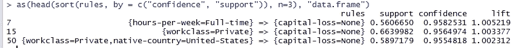

规则的形式为`X→ Y`，其中`X`是`lhs`或左侧，`Y`是`rhs`或右侧。前面的图像还显示了相应的置信度和支持度值。从输出中我们可以推断出，如果人们全职工作，那么他们面临资本损失的机会几乎为零（置信度因子 95.8%）。另一条规则帮助我们推断，为私营雇主工作的人面临资本损失的机会也几乎为零。这样的规则可以用于制定社会福利、经济改革等政策或方案。

除了 Apriori 之外，还有其他关联规则挖掘算法，如 FP Growth、ECLAT 等，这些算法多年来被用于各种应用。

### K-Means

在无监督聚类算法的世界中，最简单且最广泛使用的算法是 K-Means。正如我们最近所看到的，无监督学习算法在没有任何先前的标签或训练的情况下处理输入数据，以找出模式和关系。特别是聚类算法帮助我们聚类或划分数据点。

根据定义，聚类是指将对象分组到一组中，使得该组内的元素彼此之间比其他组中的元素更相似。K-Means 以无监督的方式执行同样的操作。

从数学上讲，给定一个包含 `n` 个观察值的集合 `{x1,x2,…,xn}`，其中每个观察值是一个 *d* 维向量，算法试图通过最小化一个目标函数将这些 *n* 个观察值划分为 `k (≤ n)` 个集合。

与其他算法一样，可以有不同目标函数。为了简单起见，我们将使用最广泛使用的函数，称为**簇内平方和**或**WCSS 函数**。

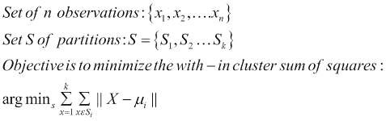

这里`μ[i]`是分区`S[i]`中点的均值。

该算法遵循一个简单的两步迭代过程，其中第一步称为分配步骤，随后是更新步骤。

+   通过设置`k`个分区的均值来初始化：`m1,m2…mk`

+   直到均值不再变化或变化低于某个阈值：

    1.  **分配步骤**：将每个观测值分配给一个使簇内平方和最小的分区，即分配给一个均值最接近观测值的分区。

    1.  **更新步骤**：对于`i`在`1 到 k`之间，根据该分区中的所有观测值更新每个均值`mi`。

该算法可以使用不同的初始化方法。最常见的是 Forgy 和随机分区方法。我鼓励你阅读更多关于这些内容。此外，除了输入数据集，算法还需要`k`的值，即要形成的聚类数量。最佳值可能取决于各种因素，通常根据用例来决定。

让我们看看算法的实际应用。

我们将再次使用 Iris 花卉数据集，我们之前已经用它来为 KNN 算法。对于 KNN，我们已经有物种标签，然后尝试在测试数据集中学习并分类数据点到正确的类别。

使用 K-Means，我们同样旨在实现相同的数据分区，但没有任何标记的训练数据集（或监督）。

```py
# prepare a copy of iris data set
kmean_iris <- iris

#Erase/ Nullify species labels
kmean_iris$Species <- NULL

#apply k-means with k=3
(clusters <- kmeans(kmean_iris, 3))

```

现在我们已经得到了`k-means`的输出，让我们看看它如何将各种物种进行分区。记住，`k-means`没有分区标签，只是将数据点分组。

```py
# comparing cluster labels with actual iris  species labels.
table(iris$Species, clusters$cluster)

```

**输出**：

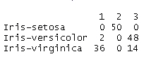

输出显示，setosa 物种与聚类标签 2 匹配，versicolor 与标签 3 匹配，等等。从视觉上看，很容易看出数据点是如何分组的：

```py
# plot the clustered points along sepal length and width
plot(kmean_iris[c("Sepal.Length", "Sepal.Width")], col=clusters$cluster,pch = c(15,16,17)[as.numeric(clusters$cluster)])

points(clusters$centers[,c("Sepal.Length", "Sepal.Width")], col=1:3, pch=8, cex=2)

```

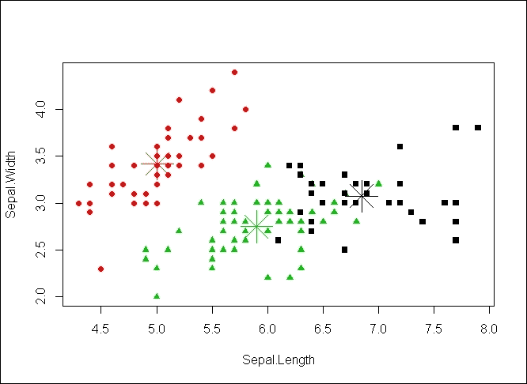

K-Means 在计算机图形学中的颜色量化等领域得到广泛应用；它与其他算法结合使用，用于自然语言处理、计算机视觉等。

`k-means`有不同变体（R 本身提供了三种不同的变体）。除了 k-means，其他无监督聚类算法还包括 k-medoids、层次聚类等。

# 摘要

通过本章，我们正式定义了机器学习的概念。我们讨论了机器学习算法实际上是如何学习一个概念的。我们还触及了各种其他概念，如泛化、过拟合、训练、测试、频繁项集等。我们还了解了机器学习算法的家族。我们探讨了不同的机器学习算法，以了解其背后的魔法以及它们的应用领域。

拥有这些知识，我们准备好解决一些现实世界的问题并拯救世界。

接下来的几章将基于本章的概念来解决具体问题和用例。准备好迎接一些行动吧！
