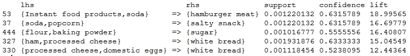

# 第三章. 使用市场篮子分析预测客户购物趋势

在上一章第二章之后，“让我们帮助机器学习”，你现在知道如何让机器从观察和数据点中学习，以便它们可以发现有趣的模式、趋势并进行预测。在本章中，我们将处理零售商、商店和电子商务市场今天面临的一个复杂问题。随着现代技术和创新的兴起，购物已经变成了一种相对愉快和享受的体验，我们可以在家中舒适地享受这种体验，甚至无需冒险去实体店，只需使用提供购物功能的网络或专用应用程序。由于有大量的零售商、商店、市场和服务商，竞争相当激烈，为了吸引顾客，他们必须使用他们能从消费者那里收集到的关于他们个人特征和购物模式的所有数据，并使用机器学习技术尝试使购物体验尽可能个性化，基于每个顾客。

你可能想知道机器学习如何帮助为每个用户个性化购物体验！答案在于两个方面：数据和算法。通过结合这两者，零售商能够找出消费者购买的最热门商品，客户的喜好和厌恶，销售上升和下降的峰值时间，人们倾向于购买的产品趋势组合，以及其他零售商提供的相同产品的产品评论和价格。零售商有自己的数据科学团队，他们汇总这些数据并应用各种机器学习算法，这些算法用于分析趋势产品并构建推荐引擎，预测客户最有可能购买的产品，并根据他们的兴趣和购物历史向客户提供建议。

在本章中，我们将重点关注基于产品的推荐，其中算法专注于客户购物交易数据，我们观察到客户购买的产品组合的常见模式，以检测和预测客户最有可能购买的产品以及他们过去购买的产品。本章我们将重点关注以下技术：

+   产品条件矩阵评估

+   频繁项集生成

+   关联规则挖掘

然而，使用关联规则和模式挖掘进行趋势分析有其局限性。它们不能根据客户的兴趣、他们购买和评价的产品等属性为每位客户提供更加个性化的购物体验。我们将在下一章中探讨这一点，我们将专注于用户基于协同过滤等算法，这些算法在构建推荐引擎时既考虑基于产品的特征，也考虑基于用户的特点。

最有趣的是，所有零售商和电子商务平台，例如 Staples、Macy's、Target、Amazon、Flipkart、Alibaba、Rakuten、Lazada 以及许多其他公司，都有自己的数据科学团队，这些团队解决包括我们之前讨论过的问题在内的各种问题。他们利用从客户购物交易、产品库存、配送、服务等级协议（SLAs）、评论、广告、点击率、跳出率、定价数据以及许多其他来源生成的大量数据。他们处理这些数据，并将其输入到基于机器学习的算法引擎中，以生成数据驱动的洞察力，从而提高业务的销售和利润。现在这无疑是市场上目前非常热门的一个领域。现在让我们进一步探讨一些帮助他们在做出如此伟大的数据驱动决策时使用的机器学习技术和算法！

# 检测和预测趋势

在本节中，我们将讨论我们所说的“趋势”究竟是什么，以及零售商如何检测和预测这些趋势。基本上，在零售环境中，趋势可以被定义为在一定时期内发生的一种特定模式或行为。这可能涉及在非常短的时间内售罄的产品或产品组合，甚至相反的情况。一个简单的例子就是一款热销智能手机在甚至上架到任何电子商务平台之前就被预订并售罄，或者像经典啤酒和尿布组合这样的产品组合，这在客户的购物篮或购物车中经常被找到！

我们如何甚至开始分析购物车或开始检测和预测购物趋势呢？就像我之前提到的，我们可以通过结合正确的数据和算法来实现这一点。假设我们领导着一个大型零售连锁店。首先，我们必须跟踪我们商店和网站上发生的每一笔交易。我们需要收集与购买的商品、缺货、一起购买的商品组合以及客户交易相关的数据点，作为开始。

一旦我们有了这些数据，我们就可以开始处理、归一化和汇总这些数据到机器可读的格式，这些格式可以轻松操作并输入到机器学习算法中，以基于购物趋势进行产品推荐。我们可以通过使用我们在第一章，“使用 R 和机器学习入门”中学到的合适的数据结构和构造来实现这一点。有几个机器学习算法可以帮助我们分析购物交易数据，并根据购物趋势推荐产品。这些算法主要遵循的范式通常被称为**市场篮子分析**。有趣的是，这些算法使用统计和机器学习概念，如概率、支持度、置信度、提升度、模式检测等，来确定哪些商品经常一起购买，这有助于我们分析购物交易、检测和预测趋势。这最终帮助我们为客户做出产品推荐，如果我们经营着一家零售连锁店，还可以明智地做出商业决策！请注意，在这两个算法中，我们将使用的数据仅基于纯购物交易数据。

在我们开始构建算法来分析购物车和交易之前，让我们首先看看市场篮子分析实际上意味着什么以及与之相关的概念。这将在我们稍后使用这些概念中的某些来实现机器学习算法以解决现实世界问题时派上用场。

# 市场篮子分析

市场篮子分析包括一些建模技术，这些技术通常由零售商和电子商务市场用来分析购物车和交易，以找出顾客购买最多的是什么，他们购买的商品类型，特定商品销售最旺盛的旺季是什么，等等。在本章中，我们将关注基于商品的交易模式，以检测和预测人们购买的商品以及他们最有可能购买的商品。让我们首先看看市场篮子分析的形式定义，然后我们将探讨与之相关的核心概念、指标和技术。最后，我们将总结如何实际使用这些结果来做出数据驱动的决策。

## 市场篮子分析实际上意味着什么？

市场篮子分析通常包括基于这样一个简单原则的几种建模技术：在购物时，如果你购买一组特定的商品（在机器学习术语中称为项集），你很可能还会购买与该项集相关的其他特定商品。我们分析人类的购物模式，并应用统计技术来生成频繁项集。这些项集包含人们最有可能一起购买的商品组合，基于过去的购物历史。

一个简单的项集例子就是人们在市场上经常同时购买啤酒和尿布。这个项集可以表示为 `{ beer, diapers }`。频繁项集是指比通常发生频率更高的项集，它由一个称为支持度的度量来指定，我们稍后会讨论这个度量。因此，从先前的例子中，你可以得出结论，如果我买了啤酒，我也很可能会买 `diapers`，并推荐这个产品给我。我们还可以通过分析购物购买来在这些项集之上建立项关联规则。一个关联规则的例子可以用项集表示，记作 `{ beer, diapers } -> { milk }`，这表示如果我同时购买啤酒和尿布，我很可能还会购买牛奶！

## 核心概念和定义

现在你已经知道了市场篮子分析实际上做什么，让我们来看看在算法和技术中广泛使用的定义和概念。

**事务数据集**指的是记录客户每日/每周购物交易的数据库或数据集，包括客户一起购买的各种商品。我们将举一个例子，这个例子我们将在本章的算法中再次使用。考虑以下数据集，你也可以从本章的 `shopping_transaction_log.csv` 文件中获取这个数据集。数据如下图所示：


前面的数据集中的每个单元格也被定义为项。项也用符号 In 表示，其中 `n` 表示第 `n` 个项号，例子在正式定义和构建算法伪代码或手动进行一些计算时用花括号括起来。例如，单元格组合 `(1, A)` 表示项 `I1`，其值表示为 `{ beer }`。

**项集**被定义为在任意购物交易中一起购买的项的集合或组。因此，这些项根据交易被认为是共同出现的。我们将项集表示为 `ISn`，其中 *n* 表示第 `n` 个项集号。项集值将被括在花括号中。前面数据集中的每一行表示一个特定的交易，项的组合形成项集。项集 `IS1` 表示为 `{ beer, diapers, bread }`。

**关联规则**或简称规则是具有**左侧**（**LHS**）和**右侧**（**RHS**）的陈述，表明如果我们购买左侧的物品，我们很可能也会对购买右侧的物品感兴趣。这表明项集相互关联。它们表示为 `ISx → ISy`，这意味着如果我的购物车中有项集 `x`，我也会对购买与之一起的项集 `y` 感兴趣。一个例子规则可以是 `{ beer } → { diapers }`，这表明如果我的购物车中有啤酒，我也有可能购买尿布！我们现在将看到一些指标，这些指标决定了如何衡量频繁项集和关联规则的力量。

项集的**频率**基本上是指特定项集在所有事务列表中出现的次数。请注意，项集可以是事务中较大项集的子集，仍然可以计数，因为子集表示包含特定物品集合的项集与其他产品一起被购买。我们可以用 `f(ISn)` 来表示它，其中 `ISn` 是特定的项集，函数 `f( )` 给出该项集在整个基于事务的数据集中的频率。以我们之前的示例数据集为例，`f(IS{beer, diapers})` 是六，这表明 `IS{beer, diapers}` 在我们的数据集中的所有事务数据中总共被购买了六次。

项集的**支持度**定义为我们的事务数据集中包含该特定项集的事务的分数。基本上，这意味着该项集被购买次数除以数据集中的事务总数。它可以表示为 ，其中 `S( )` 表示项集 `ISn` 的支持度。以我们之前的例子为例，`S(IS{beer, diapers})` 是 ，这给出了 `66.67%` 的支持度。关联规则的支持度类似，可以表示为 ，其中我们使用交集运算符来查看事务数据集中两个项集同时出现的频率。我们之前定义的规则 `S(IS{beer} → IS{diapers})` 的支持度再次是  或 `66.67%`，因为啤酒和尿布组合的项集总共出现了六次，正如我们之前看到的。在评估关联规则或频繁项集的结果时，支持度越高，越好。支持度更多地是关于衡量规则检测过去交易中已经发生的事情的质量。

关联规则的**置信度**定义为对于包含规则左侧项集的新事务，该事务也包含规则右侧项集的概率或可能性。一个规则的置信度可以表示为，其中`C( )`表示规则的置信度。请注意，由于支持率的计算涉及将项集频率除以分母中的事务总数，前面方程的右侧最终简化为获取分子和分母中项集的频率。因此，我们得到作为获取置信度的简化公式。我们之前规则的置信度`C(IS{beer} → IS{diapers})`是或`100%`，这意味着如果我的购物篮里有啤酒，购买尿布的概率是百分之百！这相当高，如果你回到数据集，你可以看到这是真的，因为对于涉及啤酒的每一笔交易，我们都可以看到与之相关的尿布。因此，你可以看到，进行预测和推荐并不是火箭科学，只是基于数据应用简单的数学和统计方法。记住，置信度更多地是关于检测基于过去交易数据预测未来可能发生的事情的规则质量。

关联规则的**提升度**定义为左侧（LHS）和右侧（RHS）两个项集组合的支持率之和与每个项集支持率乘积的比值。一个规则的提升度可以表示为，其中`L( )`表示规则的提升度。对于我们的示例规则`L(IS{beer} → IS{diapers})`，评估结果为，得到值为`1.125`，这是一个相当不错的值！一般来说，规则的提升度是衡量规则质量的一个指标。如果提升度`> 1`，则表示左侧项集的存在导致客户购买右侧项集的概率增加。这是确定项集关联和哪些商品影响人们购买其他商品的一种非常重要的方式，因为如果提升度的值为`= 1`，则表示左侧和右侧的项集是独立的，购买一个项集不会影响客户购买另一个项集。如果提升度`< 1`，则表示如果客户在左侧有一个项集，那么购买右侧项集的概率相对较低。

## 用于分析的技术

如果你被上一节中所有的数学信息压倒了，那就放松一下，深呼吸！你不需要记住所有东西，因为大多数时候，算法会为你计算一切！你需要擅长的是正确使用这些技术和算法，并解释结果以筛选出必要和有用的信息。前面提到的概念将在你开始实施和应用技术时有所帮助，我们将在本节中简要描述这些技术。我们将主要讨论三种技术，我们将在本章中探讨这些技术。

产品应急矩阵的评估是最简单的起点，它更多的是一种全局趋势捕捉机制，并在应急矩阵中显示一起购买的最顶级产品。我们稍后将使用的 R 包`arules`有一个名为**crossTable**的不错函数，它有助于将成对项目的联合发生情况交叉制表到应急矩阵中。我们将使用这个矩阵来预测客户最有可能与矩阵中的某些其他产品一起购买的产品。

频繁项集生成从产品应急矩阵的停止点开始，因为它有一个严重的限制，即在任何时间点都无法处理成对的产品。因此，为了进入可以包含任意数量产品的项集并从中检测模式，我们将使用机器学习构建自己的频繁项集生成器！使用这个工具，我们将能够获取具有特定支持值的频繁项集，这些项集表示可能一起购买的项目集合，从而为客户推荐产品的基础。

最后，我们将使用神奇的 Apriori 算法实现关联规则挖掘，该算法将频繁项集作为其规则生成过程的一部分。你已经在第二章中看到了这个演示，*让我们帮助机器学习*。然而，这次我们将使用其全部功能来查看产品项集之间的关联规则，使用我们之前讨论的指标来评估规则的质量，并使用这些规则对购物交易中的产品进行趋势预测和推荐。

## 基于数据的决策

你现在已经知道了市场篮子分析是什么，用于它的技术有哪些，以及它们能给我们带来什么结果。记住，市场篮子分析的结果是一组在交易中频繁共同出现的商品或产品。这可能是因为强大的支持度、置信度和提升度增强了其关联性，顾客倾向于购买它们，或者也可能是零售商将商品放置在商店或网站中一起或并排。然而，务必记住，强大的关联性并不总是偶然发生的，这正是零售商一直在试图通过我们之前讨论的技术来找出以提升销售额。

以下是一些基于市场篮子分析结果，零售商通常倾向于采取的一些关键数据驱动决策：

+   应将包含如尿布和啤酒这样的产品对的频繁项集通常放置在商店中并排，这将使顾客容易访问，并且他们倾向于购买更多。

+   应将包含大量不同商品或产品计数的频繁项集放置在特定类别或主题中，例如特殊的杂货组合或婴儿产品。对整个项集提供的折扣会吸引更多顾客。

+   来自频繁项集或关联矩阵的具有长列表的商品或产品项集的关联规则可以显示为产品建议和推荐，当顾客浏览购物或电子商务网站时，在特定于项集的产品页面上。应注意，这些规则的提升度至少应大于 1，就像我们之前讨论的那样。

+   可以基于市场篮子分析的结果构建推荐系统、定向广告和营销等。

如果在正确的时间和地点做出这些决策，将极大地帮助零售商提升销售额和获得良好的利润。

现在我们已经对市场篮子分析实际上做什么以及它是如何工作的有了坚实的理解，我们将从构建第一个技术的一个简单算法开始，即使用超市中购买的热门产品的产品关联矩阵进行产品推荐，然后继续构建更复杂的分析器和推荐器，利用 R 语言的强大机器学习功能。

# 评估产品关联矩阵

我们在这里将做几件事情。首先，我们将通过使用基于产品对购买频率的产品关联矩阵，分析一个属于超市的小型玩具数据集。然后我们将使用另一个数据集，通过支持度、提升度等其他指标构建关联矩阵。

我们第一个矩阵的数据包括超市销售的六种最受欢迎的产品，以及每种产品单独销售和与其他产品组合销售的次数。我们以`csv`文件的形式拥有这些数据，如图所示：


为了分析这些数据，我们首先需要了解它描述了什么。基本上，每个单元格的值表示该产品组合被售出的次数。因此，单元格组合 `(1, A)` 表示产品组合 `(牛奶, 牛奶)`，这基本上是牛奶被购买的次数。另一个例子是单元格组合 `(4, C)`，它与单元格组合 `(3, D)` 相似，表示购买黄油时面包被购买的次数。这通常也被称为列联表，在我们的案例中，它是一个产品列联表，因为它处理产品数据。让我们遵循我们的标准机器学习流程，获取数据，分析它，在我们的算法上运行它，并获取预期的结果。

## 获取数据

```py
top_supermarket_transactions.csv file in the same directory from which you run the following code snippet, which is also available in the file named ch3_product contingency matrix.R along with this book.
```

```py
> # reading in the dataset
> data <- read.csv("supermarket_transactions.csv")
> 
> # assigning row names to be same as column names
> # to build the contingency matrix
> row.names(data) <- data[[1]]
> data <- subset(data, select = c(-1))
>
> ## viewing the contingency matrix
> cat("Products Transactions Contingency Matrix")
Products Transactions Contingency Matrix
> data

```

**输出：**


## 分析并可视化数据

在这里，我们将对数据集进行一些探索性分析，看看数据告诉我们什么样的故事。为此，我们首先将查看以下代码片段中与购买牛奶和面包相关的交易：

```py
> ## Analyzing and visualizing the data
> # Frequency of products bought with milk
> data['milk', ]
 milk bread butter beer wine diapers
milk 10000  8758   5241  300  215     753
> 
> # Sorting to get top products bought with milk
> sort(data['milk', ], decreasing = TRUE)
 milk bread butter diapers beer wine
milk 10000  8758   5241     753  300  215
> 
> # Frequency of products bought with bread
> data['bread', ]
 milk bread butter beer wine diapers
bread 8758  9562   8865  427  322     353
> 
> # Sorting to get top products bought with bread
> sort(data['bread', ], decreasing = TRUE)
 bread butter milk beer diapers wine
bread  9562   8865 8758  427     353  322

```

因此，你可以看到，仅仅通过排序数据列，我们就能看到与面包或牛奶一起购买的顶级产品。在从矩阵中推荐顶级产品时，如果该产品已经在购物车中，我们将从推荐列表中删除该产品，因为，如果我买了面包，向我推荐面包就没有意义了。现在，我们将使用 mosaic 图可视化整个数据集。请注意，购买频率非常高的产品组合将具有高频率值，并在 mosaic 图中用显著区域表示。

```py
> # Visualizing the data
> mosaicplot(as.matrix(data), 
+            color=TRUE, 
+            title(main="Products Contingency Mosaic Plot"),
+            las=2
+            )

```

代码生成了以下 mosaic 图，我们使用颜色参数应用渐变，并使用`las`参数指定轴标签与轴成直角，以制作更干净的图形。


从前面的图中你可以注意到，现在很容易看出哪些产品与其他产品一起被大量购买。忽略相同的产品行和列值，我们可以轻松推断出像啤酒和尿布这样的产品组合被频繁购买！

### 注意

关于我们啤酒-尿布组合的背景故事实际上是在沃尔玛分析客户交易数据时发现的，当时他们发现，在周五，年轻的美国父亲们倾向于一起购买啤酒和尿布。他们会与朋友们庆祝周末，但作为父亲，他们也需要履行照顾孩子需求的基本职责。实际上，沃尔玛将啤酒和尿布并排放置在商店里，其销量显著上升！这正是分析学和机器学习的力量，它使我们能够发现未知和意外的模式。

## 全球推荐

现在，我们将根据客户购物车中选择的商品推荐产品。请注意，我们将其称为全球推荐，因为这些产品推荐既不是基于关联规则或频繁项集，这些是我们将在之后探讨的。它们纯粹是基于产品对购买计数的全球列联表。以下代码片段使我们能够从矩阵中为每个项目推荐前两个建议的产品：

```py
## Global Recommendations
cat("Recommendations based on global products contingency matrix")
items <- names(data)
for (item in items){
 cat(paste("Top 2 recommended items to buy with", item, "are: "))
 item.data <- subset(data[item,], select=names(data)[!names(data) %in% item])
 cat(names(item.data[order(item.data, decreasing = TRUE)][c(1,2)]))
 cat("\n")
}

```

这给我们以下输出：

```py
Top 2 recommended items to buy with milk are: bread butter
Top 2 recommended items to buy with bread are: butter milk
Top 2 recommended items to buy with butter are: bread milk
Top 2 recommended items to buy with beer are: wine diapers
Top 2 recommended items to buy with wine are: beer butter
Top 2 recommended items to buy with diapers are: beer milk

```

因此，你可以看到，基于从列联表中的产品对购买情况，我们得到了人们倾向于购买的前两个产品，这些产品是基于矩阵中捕捉到的全球趋势。现在我们将探讨更多基于其他指标生成更高级列联表的方法。

## 高级列联表

到目前为止，我们只是使用了基于产品购买频率的产品列联表。现在我们将探讨使用支持度和提升度等指标创建更多列联表，这些指标我们在之前已经讨论过，因为它们是客户在购物时可能一起购买的商品的更好指标。为此，我们将使用**综合 R 档案网络**（**CRAN**）仓库中可用的`arules`包。如果你没有安装，可以使用`install.packages('arules')`命令下载。一旦安装完成，我们将查看一个基于标准杂货的交易日志数据库，并使用我们在前几章中用于处理任何数据集或问题的标准机器学习方法来构建列联表。

首先，我们将从加载所需的包和数据到我们的工作空间开始，并查看交易数据的样貌：

```py
> # loading the required package
> library(arules)
> 
> # getting and loading the data
> data(Groceries)
> 
> # inspecting the first 3 transactions 
> inspect(Groceries[1:3])
 items 
1 {citrus fruit,semi-finished bread,margarine,ready soups}
2 {tropical fruit,yogurt,coffee} 
3 {whole milk}

```

每个先前的交易都是一个购买的产品集合，正如我们在前几节中讨论的那样。现在我们将构建几个基于不同矩阵的列联表，并查看客户可能感兴趣一起购买的前五对产品。以下代码片段显示了基于计数的商品列联表：

```py
> # count based product contingency matrix 
> ct <- crossTable(Groceries, measure="count", sort=TRUE)
> ct[1:5, 1:5]

```

**输出：**


这里我们看到的是一个与我们之前工作过的类似的矩阵。现在我们将创建一个基于支持的产品条件矩阵：

```py
> # support based product contingency matrix 
> ct <- crossTable(Groceries, measure="support", sort=TRUE)
> ct[1:5, 1:5]

```

**输出结果：**


最后，我们来看另一个基于之前讨论的度量提升的矩阵。如果你还记得，提升值越高，如果大于 1，客户同时购买两种产品的可能性就越强。

```py
> # lift based product contingency matrix 
> ct <- crossTable(Groceries, measure="lift", sort=TRUE)
> ct[1:5, 1:5]

```

**输出结果：**


从前面的矩阵中，你可以得到这样的见解，比如人们倾向于一起购买酸奶和全脂牛奶，或者苏打水和全脂牛奶实际上并不搭配，因为它的提升值小于`1`。这些类型的见解有助于在商店和购物网站上规划产品摆放，以实现更好的销售和推荐。

然而，这个模型的一些主要问题如下：

+   产品数量众多会导致矩阵变得非常大，难以处理，因为它需要更多的时间和空间来处理。

+   只能检测频繁项集中的项目对以进行推荐。从这个模型中可以找到超过两个项目的组合，但这需要与集合理论相关的额外逻辑。

+   面临推荐引擎中通常所说的冷启动问题，当新产品推出时，由于我们的历史数据没有与之相关的任何信息，我们无法预测推荐或它在市场上的销售情况。

# 频繁项集生成

现在，我们将探讨一种更好的技术来寻找模式和检测频繁购买的产品。为此，我们将使用频繁项集生成技术。我们将从头实现这个算法，因为尽管当我们解决任何机器学习或优化问题时，我们通常使用现成的机器学习算法，这些算法经过优化，可在各种 R 包中使用，但本书的主要目标之一是确保我们了解机器学习算法背后的具体运作。因此，我们将看到如何使用数学、统计学和逻辑原理构建一些这些算法。

## 开始

我们将使用的数据集是`shopping_transaction_log.csv`，我们在本章开头用它来解释市场篮子分析的概念。本节我们将使用的代码可在`ch3_frequent`项集`generation.R`文件中找到。我们首先将遍历所有函数，然后定义主函数，该函数利用所有辅助函数定义频繁项集生成的流程。

我们将首先加载一些库依赖项和实用函数：

```py
## load library dependencies 
library(dplyr)  # manipulating data frames
library(gridExtra)  # output clean formatted tables

## Utility function: Appends vectors to a list
list.append <- function (mylist, ...){
 mylist <- c(mylist, list(...))
 return(mylist)
}

```

## 数据检索和转换

接下来，我们将定义获取数据和将其转换为包含产品和购买频率的数据框所需格式的函数。我们还有一个函数，如果我们想删除购买频率低于某个阈值的商品，可以修剪这个数据框。

```py
## Step 1: Function to read the dataset into memory from file
get_transaction_dataset <- function(filename){
 df <- read.csv(filename, header = FALSE)
 dataset <- list()
 for (index in seq(nrow(df))){
 transaction.set <- as.vector(unlist(df[index,]))
 transaction.set <- transaction.set[transaction.set != ""]
 dataset <- list.append(dataset, transaction.set)
 }
 return(dataset)
} 

## Step 2: Function to convert dataset into a data frame
get_item_freq_table <- function(dataset){
 item.freq.table <- unlist(dataset) %>% table %>% data.frame
 return (item.freq.table)
}

## Step 3: Function to prune items based on minimum frequency
##         as specified by the user.
##         Here min freq <- item.min.freq
prune_item_freq_table <- function(item.freq.table, item.min.freq){
 pruned.item.table <- item.freq.table[item.freq.table$Freq >= 
 item.min.freq,]
 return (pruned.item.table)
}

```

## 构建项集关联矩阵

现在，我们将实现三个函数来帮助我们构建项集关联矩阵。我们首先构建第一个函数，该函数根据每个项集中项的数量，从我们的交易数据集中物品列表中返回不同的唯一项集组合。这有助于我们获取特定数量的项集。

```py
## Step 4: Function to get possible itemset combinations where 
##         each itemset has n number of items where n is specified ##         by the user. Here n <- num.items 
get_associated_itemset_combinations <- function(pruned.item.table, 
 num.items){
 itemset.associations <- c()
 itemset.association.matrix <- combn(pruned.item.table$., 
 num.items)
 for (index in seq(ncol(itemset.association.matrix))){
 itemset.associations <- c(itemset.associations,
 paste(itemset.association.matrix[,index],
 collapse = ", ")
 )
 }
 itemset.associations <- unique(itemset.associations)
 return (itemset.associations)
}

```

以下函数构建一个频率列联表，显示数据集中每个交易中每个项集的发生情况。这构成了获取构建我们的频繁项集所需数据的基础。项集关联矩阵在高级别上显示了在先前的函数中按交易生成的不同唯一项集的发生情况。

```py
## Step 5: Function to build an itemset association matrix where ##         we see a contingency table showing itemset association 
##         occurrence in each transaction of the dataset
build_itemset_association_matrix <- function(dataset, 
 itemset.association.labels,
 itemset.combination.nums){ 
 itemset.transaction.labels <- sapply(dataset, paste, 
 collapse=", ")
 itemset.associations <- lapply(itemset.association.labels, 
 function(itemset){
 unlist(strsplit(itemset, ", ", 
 fixed = TRUE)
 )
 }
 )
 # building the itemset association matrix
 association.vector <- c()
 for (itemset.association in itemset.associations){
 association.vector <- c(association.vector,
 unlist(
 lapply(dataset, 
 function(dataitem, 
 num.items=itemset.combination.nums){ 
 m <- match(dataitem, itemset.association)
 m <- length(m[!is.na(m)])
 if (m == num.items){
 1
 }else{
 NA
 }
 }
 )
 )
 )
 }

 itemset.association.matrix <- matrix(association.vector, 
 nrow = length(dataset))
 itemset.association.labels <- sapply(itemset.association.labels, 
 function(item) {
 paste0('{', paste(item, 
 collapse = ', '), '}')
 }
 ) 

 itemset.transaction.labels <- sapply(dataset, 
 function(itemset){
 paste0('{', paste(itemset, 
 collapse = ', '), '}')
 }
 )
 colnames(itemset.association.matrix) <- itemset.association.labels
 rownames(itemset.association.matrix) <- itemset.transaction.labels

 return (itemset.association.matrix)
}

```

一旦我们有了项集关联矩阵，我们就在以下函数中使用它，将这些单个项集发生次数加起来，以获取整个数据集中每个项集的总发生次数：

```py
## Step 6: Function to generate total occurrences of each itemset 
##         in the transactional dataset based on data from the 
##         association matrix
get_frequent_itemset_details <- function(itemset.association.matrix){
 frequent.itemsets.table <- apply(itemset.association.matrix, 
 2, sum, na.rm=TRUE)
 return (frequent.itemsets.table)
}

```

## 创建频繁项集生成工作流程

最后，我们将定义一个函数，该函数将利用所有前面的函数来创建生成频繁项集的工作流程。这里我们将使用的主要参数包括`data.file.path`，它包含数据集的位置，`itemset.combination.nums`，它表示每个项集中应包含的项的数量，`item.min.freq`，它表示每个项的最小购买计数阈值，以及`minsup`，它告诉我们生成频繁项集的最小支持度。

```py
## Step 7: Function containing entire workflow to generate 
##         frequent itemsets
frequent.itemsets.generator <- function(data.file.path, 
 itemset.combination.nums=2, 
 item.min.freq=2, minsup=0.2){
 # get the dataset
 dataset <- get_transaction_dataset(data.file.path)

 # convert data into item frequency table
 item.freq.table <- get_item_freq_table(dataset)
 pruned.item.table <- prune_item_freq_table(item.freq.table, 
 item.min.freq)

 # get itemset associations
 itemset.association.labels <- get_associated_itemset_combinations(pruned.item.table,
 itemset.combination.nums)
 itemset.association.matrix <- build_itemset_association_matrix(dataset, 
 itemset.association.labels, 
 itemset.combination.nums)

 # generate frequent itemsets
 frequent.itemsets.table <- get_frequent_itemset_details(itemset.association.matrix)
 frequent.itemsets.table <- sort(frequent.itemsets.table[frequent.itemsets.table > 0], 
 decreasing = TRUE)

 frequent.itemsets.names <- names(frequent.itemsets.table)
 frequent.itemsets.frequencies <- as.vector(frequent.itemsets.table)
 frequent.itemsets.support <- round((frequent.itemsets.frequencies * 100) / length(dataset), 
 digits=2)

 frequent.itemsets <- data.frame(Itemset=frequent.itemsets.names,
 Frequency=frequent.itemsets.frequencies,
 Support=frequent.itemsets.support)
 # apply minimum support cutoff to get frequent itemsets
 minsup.percentage <- minsup * 100
 frequent.itemsets <- subset(frequent.itemsets, 
 frequent.itemsets['Support'] >= minsup.percentage)
 frequent.itemsets.support <- sapply(frequent.itemsets.support,
 function(value){
 paste0(value,'%')
 }
 )

 # printing to console
 cat("\nItem Association Matrix\n")
 print(itemset.association.matrix)
 cat("\n\n")
 cat("\nValid Frequent Itemsets with Frequency and Support\n")
 print(frequent.itemsets)

 # displaying frequent itemsets as a pretty table
 if (names(dev.cur()) != "null device"){
 dev.off()
 }
 grid.table(frequent.itemsets)
}

```

## 检测购物趋势

现在是测试我们的算法的时候了！我们首先将生成所有频繁项集，其中包含两个物品，每个物品在整体数据集中至少购买过三次，并且最小支持度至少为 20%。为此，你必须在 R 控制台中运行以下函数。请记住，首先在内存中加载所有前面的函数。

```py
> frequent.itemsets.generator(
 data.file.path='shopping_transaction_log.csv', 
 itemset.combination.nums=2, item.min.freq=3, minsup=0.2)

```

我们得到以下项集列联矩阵，它用于生成频繁项集。左侧的行表示交易，每一列代表一个项集。


最终的频繁项集将以漂亮的表格形式在控制台和绘图部分显示，如下所示：


因此，你可以清楚地看到，项集 `{beer, diapers}` 是我们最频繁的项集，支持率约为 `67%`，在我们的数据集中总共发生了六次，关联矩阵显示了它发生的确切交易。因此，这个功能检测到人们购买啤酒和尿布或尿布和牛奶的频率更高，因此当他们在购物时，我们可以向他们推荐相同的产品。我们还将查看包含三个项目的频繁项集：

```py
> frequent.itemsets.generator(
 data.file.path='shopping_transaction_log.csv',
 itemset.combination.nums=3, item.min.freq=1, minsup=0.2)

```

这给我们以下表格，显示了频繁项集及其必要的统计数据：


因此，我们看到我们得到了两个支持率大于 20%的频繁项集。当然，请记住，这是一个小数据集，你拥有的包含购买交易的数据集越大，你将得到的模式越多，支持率也越强。

我们已经成功构建了一个生成频繁项集的算法！您可以使用这个相同的算法在新数据集上生成越来越多的频繁项集，然后我们可以在看到他们从任何频繁项集中购买一个或多个商品时立即开始推荐产品。一个简单的例子是，如果我们看到人们购买啤酒，我们可以向他们推荐尿布和牛奶，因为我们的算法在之前的频繁项集中检测到了这种购物趋势。

# 关联规则挖掘

我们现在将实现市场篮子分析的最终技术，以找出项集之间的关联规则，以检测和预测产品购买模式，这些模式可用于产品推荐和建议。我们将特别使用来自 `arules` 包的 Apriori 算法，该算法首先使用我们之前讨论的生成频繁项集的实现。一旦它有了频繁项集，算法就会根据支持度、置信度和提升度等参数生成必要的规则。我们还将展示如何使用 `arulesViz` 包可视化和交互这些规则。此实现的代码位于 `ch3_association` 规则 `mining.R` 文件中，您可以直接加载并按照书籍进行操作。

## 加载依赖和数据

我们将首先加载必要的包和数据依赖。请注意，我们将使用之前在处理高级列联矩阵的章节中讨论的 `Groceries` 数据集。

```py
> ## loading package dependencies
> library(arules) # apriori algorithm
> library(arulesViz)  # visualize association rules
> 
> ## loading dataset
> data(Groceries)

```

## 探索性分析

我们将在这里对我们的数据集进行一些基本的探索性分析，以了解我们正在处理的数据类型以及哪些产品在客户中最受欢迎。

```py
> ## exploring the data
> inspect(Groceries[1:3])
 items 
1 {citrus fruit,semi-finished bread,margarine,ready soups}
2 {tropical fruit,yogurt,coffee} 
3 {whole milk} 
> # viewing the top ten purchased products 
> sort(itemFrequency(Groceries, type="absolute"), 
+                    decreasing = TRUE)[1:10]

```

**输出：**


```py
> # visualizing the top ten purchased products
> itemFrequencyPlot(Groceries,topN=10,type="absolute")

```

```py
vegetables the most!
```


## 检测和预测购物趋势

我们现在将使用之前提到的 Apriori 算法生成关联规则，以检测购物趋势，以便我们可以预测顾客未来可能会购买什么，甚至向他们推荐。我们将从生成关联规则的正常工作流程开始：

```py
> # normal workflow
> metric.params <- list(supp=0.001, conf=0.5)
> rules <- apriori(Groceries, parameter = metric.params)
> inspect(rules[1:5])

```

**输出：**


解释这些规则的方式是观察左侧的物品和右侧的物品，并得出结论：如果顾客购物车中有左侧的物品，那么他购买右侧物品的可能性会增加。这种可能性可以使用剩余列中存在的指标进行量化。我们已经在市场篮子分析的概念中讨论了这些指标的重要性。从之前的规则中，我们可以得出结论，如果顾客购买蜂蜜，他有 73.3%的置信度会购买全脂牛奶。从之前的规则中，我们看到蜂蜜、可可、布丁和烹饪巧克力等物品都需要牛奶作为基本成分，这或许可以解释为什么人们倾向于将这些产品一起购买，并且我们可以向顾客推荐这些产品。请随意调整提升度、支持和置信度的参数，以从数据集中提取更多规则，以获得更多模式！

通常，Apriori 算法生成的规则中会有重复的关联规则，在检查规则集之前需要将其删除。您可以使用以下实用函数对生成的规则执行相同的操作：

```py
# pruning duplicate rules
prune.dup.rules <- function(rules){
 rule.subset.matrix <- is.subset(rules, rules)
 rule.subset.matrix[lower.tri(rule.subset.matrix, diag=T)] <- NA
 dup.rules <- colSums(rule.subset.matrix, na.rm=T) >= 1
 pruned.rules <- rules[!dup.rules]
 return(pruned.rules)
}

```

也可以通过特定的指标对规则进行排序，以查看最佳质量的规则。我们将使用之前按最佳置信度值排序的指标参数值来查看最佳规则。

```py
# sorting rules based on metrics
rules <- sort(rules, by="confidence", decreasing=TRUE)
rules <- prune.dup.rules(rules)
inspect(rules[1:5])

```

**输出：**


在之前的规则中，我们看到如`{ rice, sugar }`这样的项目集有很强的倾向与`{ whole milk }`一起购买。置信度值相当高（而且应该是这样的，因为我们已经对它们进行了排序！），为 100%，提升度也大于 1，表明项目集之间存在正相关。请注意，在大数据集中，支持值可能不是很高，这是完全正常的，因为我们正在搜索整个交易数据集中的一些特定模式，这些模式可能连 1%的总交易量都覆盖不了，因为交易类型繁多。然而，对于我们来说，检测这些模式以做出关于预测可能一起销售的产品并推荐给顾客的明智决策至关重要。接下来，我们将查看另一个按提升度排序的最佳质量规则的示例：

```py
> rules<-sort(rules, by="lift", decreasing=TRUE)
> rules <- prune.dup.rules(rules)
> inspect(rules[1:5])

```

**输出：**



我们看到这些规则具有非常高的提升度和良好的置信度，这使得它们成为顾客最倾向于一起购买的物品！

我们现在将探讨检测特定购物模式，这是我们之前讨论过的。一种实现方式是针对特定商品，并生成包含这些商品的关联规则。第一种方式是预测如果顾客在关联规则的右侧购买了某个商品，他们购物车中可能包含哪些商品。我们通过明确指定商品，如下所示，并分析交易数据集来完成这项工作：

```py
> # finding itemsets which lead to buying of an item on RHS
> metric.params <- list(supp=0.001,conf=0.5, minlen=2)
> rules<-apriori(data=Groceries, parameter=metric.params, 
+                appearance = list(default="lhs",rhs="soda"),
+                control = list(verbose=F))
> rules <- prune.dup.rules(rules)
> rules<-sort(rules, decreasing=TRUE, by="confidence")
> inspect(rules[1:5])

```

**输出：**


有趣的是，人们倾向于一起购买饮料，例如咖啡、水、啤酒以及其他杂项饮料，以及从之前的规则中提到的汽水。因此，你可以看到，使用这些规则预测用户何时可能购买汽水并采取相应行动是非常容易的。

我们还可以通过在关联规则的左侧明确设置特定的商品集值，使用以下技术来预测如果用户已经在他们的购物车中放入了一些特定的商品，他们将购买哪些商品：

```py
# finding items which are bought when we have an itemset on LHS
metric.params <- list(supp=0.001, conf = 0.3, minlen=2)
rules<-apriori(data=Groceries, parameter=metric.params, 
 appearance = list(default="rhs",
 lhs=c("yogurt", "sugar")),
 control=list(verbose=F))
#rules <- prune.dup.rules(rules)
rules<-sort(rules, decreasing=TRUE,by="confidence")
inspect(rules[1:5])

```

**输出：**


你可以从之前的规则中清楚地看到，如果人们在购物车中同时或单独购买了酸奶和糖，他们倾向于购买牛奶。因此，通过针对特定的商品集，你可以向客户提供基于特定产品的推荐。

## 可视化关联规则

有一个优秀的包`arulesViz`，它提供了一种交互式的方式来可视化关联规则并与它们交互。以下是对之前关联规则的一个示例可视化：

```py
> ## visualizing rules
> plot(rules, method="graph", interactive=TRUE, shading=TRUE)

```

由`arulesViz`生成的这个可视化是完全交互式的，你可以玩转顶点和边，根据你的意愿放置商品集，以从各种规则中找到更多和更多的趋势和模式。

这就结束了我们对市场篮子分析中使用的检测和预测购物交易日志趋势的主要技术的讨论，并据此采取行动。

# 摘要

在本章中，我们覆盖了大量的内容！我们从一个关于如何在零售领域检测和预测趋势的讨论开始。然后我们深入探讨了市场篮子分析的真实含义以及算法背后的核心概念、数学公式，以及用于评估从算法中获得的结果的关键指标，特别是支持度、置信度和提升度。我们还讨论了用于分析的最流行技术，包括列联表评估、频繁项集生成和关联规则挖掘。接下来，我们讨论了如何使用市场篮子分析进行数据驱动决策。最后，我们实现了自己的算法，并使用了一些流行的 R 库，如`arules`，将这些技术应用于一些真实世界的交易数据，以检测、预测和可视化趋势。请注意，这些机器学习技术只讨论基于购买和交易日志的产品推荐，纯粹基于购买和交易日志。这里缺少了人性化的元素，因为我们没有考虑到基于用户购买或评分的喜好和厌恶。

在下一章中，我们将解决这些问题的其中一些，并构建用于推荐产品的稳健推荐引擎，这些推荐将考虑到产品以及用户兴趣。
