# 第六章：信用风险检测与预测 - 预测分析

在上一章中，我们在金融领域覆盖了很多内容，我们接受了检测和预测可能成为潜在信用风险的银行客户的挑战。现在，我们对关于信用风险分析的主要目标有了很好的了解。此外，从数据集及其特征的描述性分析中获得的大量知识将对预测分析有用，正如我们之前提到的。

在本章中，我们将穿越预测分析的世界，这是机器学习和数据科学的核心。预测分析包括几个方面，如分类算法、回归算法、领域知识和业务逻辑，它们结合在一起构建预测模型并从数据中提取有用见解。我们在上一章的末尾讨论了各种机器学习算法，这些算法将适用于解决我们的目标，当我们使用给定的数据集和这些算法构建预测模型时，我们将在本章中探索其中的一些。

对预测分析的一个有趣的观点是，它为希望在未来加强其业务和利润的组织提供了很多希望。随着大数据的出现，现在大多数组织拥有的数据比他们能分析的数据还要多！虽然这是一个大挑战，但更严峻的挑战是从这些数据中选择正确的数据点并构建能够正确预测未来结果的预测模型。然而，这种方法有几个注意事项，因为每个模型基本上是基于公式、假设和概率的数学函数。此外，在现实世界中，条件和场景不断变化和演变，因此我们必须记住，今天构建的预测模型明天可能完全过时。

许多怀疑者认为，由于环境的不断变化，计算机模仿人类预测结果非常困难，甚至人类也无法预测，因此所有统计方法仅在理想假设和条件下才有价值。虽然这在某种程度上是正确的，但有了正确的数据、正确的思维方式和应用正确的算法和技术，我们可以构建稳健的预测模型，这些模型肯定可以尝试解决传统或蛮力方法无法解决的问题。

预测建模是一个困难的任务，尽管可能存在许多挑战，结果可能总是难以获得，但我们必须带着一点盐来接受这些挑战，并记住著名统计学家乔治·E·P·博克斯的名言：“本质上所有模型都是错误的，但其中一些是有用的！”这一点在我们之前讨论的内容中得到了充分的证实。始终记住，预测模型永远不会达到 100%完美，但如果它是基于正确的原则构建的，它将非常有用！

在本章中，我们将重点关注以下主题：

+   预测分析

+   如何预测信用风险

+   预测建模中的重要概念

+   获取数据

+   数据预处理

+   特征选择

+   使用逻辑回归建模

+   使用支持向量机建模

+   使用决策树建模

+   使用随机森林建模

+   使用神经网络建模

+   模型比较和选择

# 预测分析

在上一章中，我们已经就预测分析进行了相当多的讨论，以向您提供一个关于其含义的概述。在本节中，我们将更详细地讨论它。预测分析可以定义为机器学习领域的一个子集，它包括基于数据科学、统计学和数学公式的广泛监督学习算法，这些算法使我们能够使用这些算法和已经收集的数据来构建预测模型。这些模型使我们能够根据过去的观察预测未来可能发生的事情。结合领域知识、专业知识和商业逻辑，分析师可以使用这些预测进行数据驱动决策，这是预测分析最终的结果。

我们在这里讨论的数据是过去已经观察到的数据，并且在一段时间内为了分析而收集的数据。这些数据通常被称为历史数据或训练数据，它们被输入到模型中。然而，在预测建模方法中，我们大多数时候并不直接输入原始数据，而是使用从数据中提取的特征，这些特征经过适当的转换。数据特征与监督学习算法结合形成一个预测模型。在当前获得的这些数据可以输入到这个模型中，以预测正在观察的结果，并测试模型在各个准确度指标方面的性能。在机器学习领域，这种数据被称为测试数据。

我们在本章中执行预测分析将遵循的分析管道是一个标准流程，以下步骤简要解释：

1.  **获取数据**：在这里，我们获取构建预测模型所需的数据集。我们将对数据集进行一些基本的描述性分析，这已经在上一章中介绍过。一旦我们有了数据，我们就会进入下一步。

1.  **数据预处理**：在这个步骤中，我们执行数据转换，例如更改数据类型、特征缩放和归一化，如果需要，以准备数据供模型训练。通常这个步骤是在数据集准备步骤之后执行的。然而，在这种情况下，最终结果是一样的，因此我们可以按任何顺序执行这些步骤。

1.  **数据集准备**：在这个步骤中，我们使用一些比例，如 70:30 或 60:40，将数据实例从数据中分离成训练集和测试集。我们通常使用训练集来训练模型，然后使用测试集检查其性能和预测能力。通常数据按 60:20:20 的比例划分，我们除了其他两个数据集外，还有一个验证集。然而，在本章中，我们只保留两个数据集。

1.  **特征选择**：这个过程是迭代的，如果需要，甚至在后续阶段也会发生。在这个步骤中的主要目标是选择一组属性或特征，从训练数据集中选择，使预测模型能够给出最佳预测，最小化错误率并最大化准确性。

1.  **预测建模**：这是主要步骤，我们选择最适合解决该问题的机器学习算法，并使用算法构建预测模型，通过向其提供从训练数据集中的数据中提取的特征来构建预测模型。这个阶段的输出是一个预测模型，可以用于对未来数据实例的预测。

1.  **模型评估**：在这个阶段，我们使用测试数据集从预测模型中获得预测结果，并使用各种技术和指标来衡量模型的性能。

1.  **模型调优**：我们微调模型的各个参数，并在必要时再次进行特征选择。然后我们重新构建模型并重新评估它，直到我们对结果满意。

1.  **模型部署**：一旦预测模型给出令人满意的表现，我们就可以通过在任何应用程序中使用 Web 服务来部署这个模型，以提供实时或近实时的预测。这个步骤更多地关注围绕部署模型进行的软件和应用开发，因此我们不会涉及这个步骤，因为它超出了范围。然而，关于围绕预测模型构建 Web 服务以实现“预测即服务”的教程有很多。

**最后三个步骤是迭代的，如果需要，可以执行多次**。

尽管乍一看这个过程可能看起来相当复杂，但实际上它是一个非常简单且直接的过程，一旦理解，就可以用于构建任何类型的预测模型。需要记住的一个重要事情是，预测建模是一个迭代的过程，我们可能需要通过从模型预测中获得反馈并评估它们来多次分析数据和构建模型。因此，即使你的模型在第一次尝试时表现不佳，你也绝不能气馁，因为正如我们之前提到的，模型永远不可能完美，构建一个好的预测模型既是艺术也是科学！

在下一节中，我们将关注如何应用预测分析来解决我们的预测问题，以及在本章中我们将探索的机器学习算法类型。

# 如何预测信用风险

如果你还记得上一章的主要目标，我们当时处理的是来自德国银行的客户数据。我们将快速回顾我们的主要问题场景以刷新你的记忆。这些银行客户是潜在的候选人，他们向银行申请信用贷款，条件是他们必须每月支付一定的利息来偿还贷款金额。在理想的世界里，信用贷款会被自由发放，人们会毫无问题地偿还它们。不幸的是，我们并不生活在一个乌托邦的世界，因此将会有一些客户会违约，无法偿还贷款金额，这会给银行造成巨大的损失。因此，信用风险分析是银行关注的几个关键领域之一，他们分析与客户及其信用历史相关的详细信息。

现在回到主要问题，对于预测信用风险，我们需要分析客户相关的数据集，使用机器学习算法围绕它构建预测模型，并预测客户是否可能拖欠信用贷款，并可能被标记为潜在的信用风险。我们将遵循的过程是我们在上一节中讨论的。你已经从上一章中了解了数据及其相关的特征。我们将探索几个预测模型，了解模型工作背后的概念，然后构建这些模型以预测信用风险。一旦我们开始预测结果，我们将比较这些不同模型的性能，然后讨论业务影响以及如何从模型预测结果中得出见解。请注意，预测不是预测分析生命周期中的输出，我们从这些预测中得出的宝贵见解才是最终目标。像金融机构这样的企业只能从使用领域知识将预测结果和机器学习算法的原始数字转换为数据驱动决策中获得价值，这些决策在正确的时间执行时有助于业务增长。

对于这个场景，如果你对数据集记得很清楚，特征`credit.rating`是响应或类别变量，它表示客户的信用评级。我们将根据其他特征（独立变量）预测这个值，以预测其他客户的信用评级。在建模时，我们将使用属于监督学习算法家族的机器学习算法。这些算法用于预测，可以分为两大类：分类和回归。然而，它们有一些区别，我们现在将讨论。在回归的情况下，要预测的变量的值是连续值，例如根据不同的特征（如房间数量、房屋面积等）预测房屋价格。回归主要处理基于输入特征估计和预测响应值。在分类的情况下，要预测的变量的值具有离散且独特的标签，例如预测我们银行的客户信用评级，其中信用评级可以是好的，用`1`表示，或者坏，用`0`表示。分类主要处理对数据集中的每个数据元进行分类和识别组成员资格。逻辑回归等算法是回归模型的特殊情况，用于分类，其中算法将变量属于某个类别标签的概率估计为其他特征的函数。在本章中，我们将使用以下机器学习算法构建预测模型：

+   逻辑回归

+   支持向量机

+   决策树

+   随机森林

+   神经网络

我们选择这些算法是为了展示现有的各种监督机器学习算法的多样性，这样你不仅可以了解这些模型背后的概念，还可以学习如何使用它们构建模型，并使用各种技术比较模型性能。在我们开始分析之前，我们将简要回顾本书中提到的预测建模的一些基本概念，并详细讨论其中的一些，以便你对幕后发生的事情有一个良好的了解。

# 预测建模中的重要概念

当我们讨论机器学习流程时，已经探讨了几个概念。在本节中，我们将探讨预测建模中常用的典型术语，并详细讨论模型构建和评估概念。

## 准备数据

数据准备步骤，如前所述，涉及准备用于特征选择和构建预测模型所需的数据集。在这个背景下，我们经常使用以下术语：

+   **数据集**：它们通常是数据点的集合或观察结果。大多数数据集通常对应于某种形式的结构化数据，涉及二维数据结构，如数据矩阵或数据表（在 R 中通常使用数据框表示）包含各种值。例如，我们来自第五章的`german_credit_dataset.csv`文件，*信用风险检测与预测 – 描述性分析*。

+   **数据观察**：它们是数据集中的行，其中每行包含一组观察结果与一组属性。这些行也常被称为元组。对于我们数据集，包含有关客户信息的每行都是一个很好的例子。

+   **数据特征**：它们是数据集中的列，描述数据集中的每一行。这些特征通常被称为属性或变量。例如`credit.rating`、`account.balance`等特征构成了我们的信用风险数据集的特征。

+   **数据转换**：它指的是根据描述性分析中的观察结果，根据需要转换各种数据特征。数据类型转换、缺失值插补、缩放和归一化是最常用的技术。此外，对于分类变量，如果你的算法无法检测变量的不同级别，你需要将其转换为几个虚拟变量；这个过程被称为独热编码。

+   **训练数据**：它指的是仅用于训练预测模型的数据。机器学习算法从这个数据集中提取元组，并试图从各种观察实例中找出模式和进行学习。

+   **测试数据**：它指的是输入到预测模型中以获取预测结果的数据，然后我们使用该数据集中已经存在的类别标签来检查模型的准确性。我们从不使用测试数据来训练模型，因为这会偏置模型并给出不正确的评估。

## 构建预测模型

我们使用机器学习算法和数据特征来构建实际的预测模型，并最终在输入新的数据元组时开始给出预测。与构建预测模型相关的概念如下：

+   **模型训练**：它与构建预测模型类似，其中我们使用监督机器学习算法，并将训练数据特征输入其中来构建预测模型。

+   **预测模型**：它基于某种机器学习算法，本质上是一个数学模型，具有一些假设、公式和参数值。

+   **模型选择**：这是一个过程，其主要目标是从多个预测模型的迭代中选择一个预测模型。选择最佳模型的标准可能因我们想要选择的指标而异，例如最大化准确性、最小化错误率或获得最大的 AUC（我们将在后面讨论）。交叉验证是运行此迭代过程的好方法。

+   **超参数优化**：这基本上是尝试选择算法在模型中使用的一组超参数，使得模型的预测准确性最优。这通常通过网格搜索算法来完成。

+   **交叉验证**：这是一种模型验证技术，用于估计模型以通用方式的表现。它主要用于迭代过程，其中最终目标是优化模型并确保模型不会过度拟合数据，以便模型能够很好地泛化新数据并做出良好的预测。通常，会进行多轮交叉验证。每一轮交叉验证都涉及将数据分为训练集和测试集；使用训练数据来训练模型，然后使用测试集评估其性能。最终，我们得到一个模型，它是所有模型中最好的。

## 评估预测模型

预测建模中最重要的部分是测试创建的模型是否真正有用。这是通过在测试数据上评估模型并使用各种指标来衡量模型性能来完成的。我们将在下面讨论一些流行的模型评估技术。为了清楚地解释这些概念，我们将考虑一个与我们的数据相关的例子。让我们假设我们有 100 名客户，其中 40 名客户的信用评级不良，类别标签为 0，剩余的 60 名客户的信用评级良好，类别标签为 1。现在假设我们的模型将 40 个不良实例中的 22 个预测为不良，其余的 18 个预测为良好。模型还将 60 名良好客户中的 40 个预测为良好，其余的 20 个预测为不良。现在我们将看到我们将如何使用不同的技术来评估模型性能：

+   **预测值**：它们通常是离散值，属于特定的类别或类别，通常被称为类别标签。在我们的案例中，这是一个二元分类问题，我们处理两个类别，其中标签 1 表示信用评级良好的客户，0 表示信用评级不良。

+   **混淆矩阵**：这是一种很好的方式来查看模型是如何预测不同类别的。它是一个通常有两行两列的列联表，用于我们这样的二元分类问题。它报告了每个类别中预测实例的数量与实际类别值。对于我们的先前列举的例子，混淆矩阵将是一个 2x2 的矩阵，其中两行将表示预测的类别标签，两列将表示实际的类别标签。总共有坏（0）类别标签的预测实例数，实际上具有坏标签，被称为**真负**（**TN**），而剩余的错误预测为好的坏实例被称为**假正**（**FP**）。相应地，总共有好（1）类别标签的预测实例数，实际上被标记为好的，被称为**真正**（**TP**），而剩余的错误预测为坏的好的实例被称为**假负**（**FN**）。

    我们将在以下图中展示这一点，并讨论从混淆矩阵中导出的一些重要指标，这些指标也将在同一图中展示：

    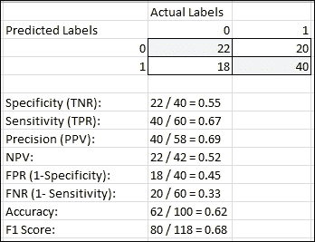

在先前的图中，2x2 矩阵中突出显示的值是我们模型正确预测的值。白色中的值是模型错误预测的。因此，我们可以很容易地推断以下指标：TN 是 22，**FP**是**18**，**TP**是**40**，**FN**是**20**。总**N**是**40**，总**P**是**60**，在我们的示例数据集中总和为 100 名客户。

**特异性**也称为**真阴性率**，可以用公式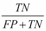表示，它给出了总真阴性数被正确预测的比例，这些真阴性数是所有实际为负的实例总数。在我们的案例中，特异性为**55%**。

**灵敏度**，也称为**真阳性率**和**召回率**，其公式为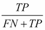，表示在所有实际为正的实例中，正确预测的总真阳性数所占的比例。我们的例子中灵敏度为**67%**。

**精确率**，也称为**阳性预测值**，其公式为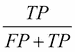，表示在所有正预测中实际正实例的数量。我们的例子中精确率为**69%**。

**负预测值**的公式为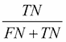，表示在所有负预测中实际负实例的数量。我们的例子中 NPV 为**52%**。

**假阳性率**，也称为**误报率**，基本上是特异性的倒数；其公式为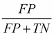，表示在所有负例中错误正预测的数量。我们的例子中 FPR 为**45%**。

**假阴性率**，也称为**漏报率**，基本上是敏感度的倒数；其公式为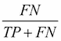，表示在所有正例中错误负预测的数量。我们的例子中 FNR 为**33%**。

**准确率**基本上是衡量模型在做出预测时准确性的指标，其公式为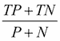。我们的预测准确率为**62%**。

**F1**分数是衡量模型准确性的另一个指标。它通过计算值的调和平均值来考虑精确率和召回率，公式表示为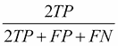。我们的模型 f1 分数为**68%**。

**接收者操作特征**（**ROC**）曲线基本上是一个图表，用于可视化模型性能，当我们改变其阈值时。ROC 图由 FPR 和 TPR 作为*x*轴和*y*轴分别定义，每个预测样本都可以拟合为 ROC 空间中的一个点。完美的图表将涉及所有数据点的 TPR 为 1 和 FPR 为 0。一个平均模型或基线模型将是一条从*(0, 0)*到*(1, 1)*的对角线，表示两个值都是`0.5`。如果我们的模型 ROC 曲线在基线对角线之上，则表明其性能优于基线。以下图解展示了典型的 ROC 曲线在一般情况下的样子：

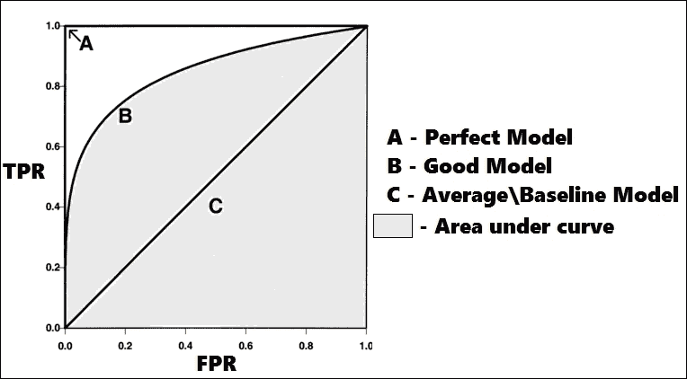

**曲线下面积**（**AUC**）基本上是从模型评估中获得的 ROC 曲线下的面积。AUC 是一个值，表示模型将随机选择的正实例排名高于随机选择的负实例的概率。因此，AUC 越高，越好。请查看文件`performance_plot_utils.R`（与章节代码包共享），其中包含一些实用函数，用于绘制和描述我们稍后评估模型时将使用的这些值。

这应该为你提供了关于预测建模中重要术语和概念足够的背景知识，现在我们将开始对数据进行预测分析！

# 获取数据

在第五章中，*信用风险检测与预测 – 描述性分析*，我们已经分析了德国银行的信用数据集并进行了几个转换。在本章中，我们将处理这个转换后的数据集。我们已经保存了转换后的数据集，你可以通过打开`credit_dataset_final.csv`文件来查看。我们将像往常一样在 R 中进行所有分析。要加载数据到内存中，请运行以下代码片段：

```py
> # load the dataset into data frame
> credit.df <- read.csv("credit_dataset_final.csv", header = TRUE, sep = ",")

```

这将数据集加载到一个数据框中，现在可以通过`credit.df`变量轻松访问。接下来，我们将关注数据转换和归一化。

# 数据预处理

在数据预处理步骤中，我们将主要关注两个方面：数据类型转换和数据归一化。最后，我们将数据分割成训练集和测试集以进行预测建模。你可以通过打开`data_preparation.R`文件来访问这一部分的代码。我们将使用一些实用函数，这些函数在下面的代码片段中提到。请记住，通过在 R 控制台中运行它们来将它们加载到内存中：

```py
## data type transformations - factoring
to.factors <- function(df, variables){
 for (variable in variables){
 df[[variable]] <- as.factor(df[[variable]])
 }
 return(df)
}

## normalizing - scaling
scale.features <- function(df, variables){
 for (variable in variables){
 df[[variable]] <- scale(df[[variable]], center=T, scale=T)
 }
 return(df)
}

```

前面的函数在数据框上操作以转换数据。对于数据类型转换，我们主要对分类变量进行分解，即将分类特征的类型从数值转换为因子。有几个数值变量，包括`credit.amount`、`age`和`credit.duration.months`，它们都有各种值。如果你还记得上一章中的分布，它们都是偏斜分布。这有多重不利影响，如引起共线性、梯度受到影响以及模型收敛时间更长。因此，我们将使用 z 分数标准化，其中，例如，一个名为 E 的特征的值，可以用以下公式计算：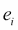，其中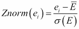代表特征 E 的整体均值，代表特征 E 的标准差。我们使用以下代码片段来对我们的数据进行这些转换：

```py
> # normalize variables
> numeric.vars <- c("credit.duration.months", "age", 
 "credit.amount")
> credit.df <- scale.features(credit.df, numeric.vars)
> # factor variables
> categorical.vars <- c('credit.rating', 'account.balance', 
+                       'previous.credit.payment.status',
+                       'credit.purpose', 'savings', 
+                       'employment.duration', 'installment.rate',
+                       'marital.status', 'guarantor', 
+                       'residence.duration', 'current.assets',
+                       'other.credits', 'apartment.type', 
+                       'bank.credits', 'occupation', 
+                       'dependents', 'telephone', 
+                       'foreign.worker')
> credit.df <- to.factors(df=credit.df, 
 variables=categorical.vars)

```

预处理完成后，我们将数据集分成训练集和测试集，比例为 60:40，其中训练集将包含 600 个元组，测试集将包含 400 个元组。它们将以以下随机方式选择：

```py
> # split data into training and test datasets in 60:40 ratio
> indexes <- sample(1:nrow(credit.df), size=0.6*nrow(credit.df))
> train.data <- credit.df[indexes,]
> test.data <- credit.df[-indexes,]

```

现在我们已经准备好了数据集，我们将在下一节中探讨特征的重要性和选择。

# 特征选择

特征选择的过程涉及通过使用它们训练预测模型并根据其重要性对变量或特征进行排名，然后试图找出哪些变量是该模型中最相关的特征。虽然每个模型通常都有自己的重要特征集，但在分类中，我们将在这里使用随机森林模型来尝试确定哪些变量可能在基于分类的预测中普遍重要。

我们进行特征选择有几个原因，包括：

+   在不损失太多信息的情况下移除冗余或不相关的特征

+   通过使用过多的特征防止模型过拟合

+   减少由过多特征引起的模型方差

+   减少模型的训练时间和收敛时间

+   构建简单且易于理解的模型

我们将使用递归特征消除算法进行特征选择，并使用预测模型进行评估算法。在这个过程中，我们将反复构建几个具有不同特征的机器学习模型。在每次迭代中，我们都会消除无关或冗余的特征，并检查获得最大准确率和最小误差的特征子集。由于这是一个迭代过程，遵循流行的贪婪爬山算法的原则，通常不可能进行穷举搜索并得到全局最优解，而且根据起始点不同，我们可能会陷入局部最优解，得到的特征子集可能与不同运行中获得的特征子集不同。然而，如果我们多次使用交叉验证运行它，通常大多数特征在获得的子集中将是恒定的。我们将使用随机森林算法，我们将在稍后详细解释。现在，只需记住它是一个集成学习算法，在其训练过程的每个阶段都使用多个决策树。这倾向于减少方差和过拟合，同时由于我们在算法的每个阶段引入了一些随机性，模型偏差略有增加。

本节代码位于`feature_selection.R`文件中。我们首先加载必要的库。如果你还没有安装它们，按照我们在前几章的做法进行安装：

```py
> library(caret)  # feature selection algorithm
> library(randomForest) # random forest algorithm

```

```py
the R console to load into memory for using it later:
```

```py
run.feature.selection <- function(num.iters=20, feature.vars, class.var){
 set.seed(10)
 variable.sizes <- 1:10
 control <- rfeControl(functions = rfFuncs, method = "cv", 
 verbose = FALSE, returnResamp = "all", 
 number = num.iters)
 results.rfe <- rfe(x = feature.vars, y = class.var, 
 sizes = variable.sizes, 
 rfeControl = control)
 return(results.rfe)
}

```

默认情况下，前面的代码使用交叉验证，将数据分为训练集和测试集。对于每次迭代，都会进行递归特征消除，并在测试集上对模型进行训练和测试，以检查准确率和误差。数据分区在每次迭代中都会随机变化，以防止模型过拟合，并最终给出一个通用的估计，即模型在一般情况下的表现。如果你观察，我们的函数默认运行 20 次迭代。记住，在我们的情况下，我们总是在训练数据上训练，该数据由函数内部分区进行交叉验证。变量`feature.vars`表示在训练数据集中可以使用`train.data[,-1]`子集访问的所有独立特征变量，要访问表示要预测的类变量的`class.var`，我们使用`train.data[,1]`进行子集操作。

### 注意

我们完全不接触测试数据，因为我们只打算用它来进行预测和模型评估。因此，我们不想通过使用这些数据来影响模型，因为这会导致评估结果不准确。

我们现在使用定义好的函数在训练数据上运行算法，以下代码展示了这一过程。运行可能需要一些时间，所以如果你看到 R 在返回结果时花费了一些时间，请耐心等待：

```py
rfe.results <- run.feature.selection(feature.vars=train.data[,-1], 
 class.var=train.data[,1])
# view results
rfe.results

```

查看结果后，我们得到以下输出：

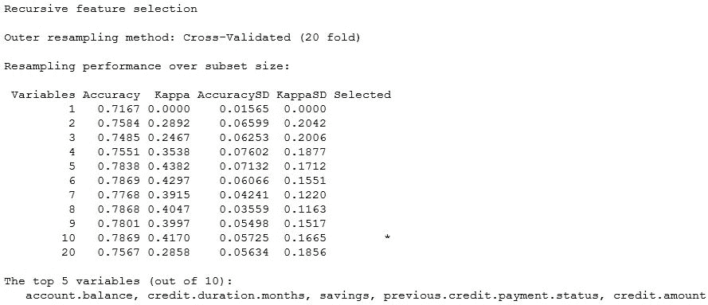

从输出中，你可以看到它从 20 个特征中找到了最重要的 10 个特征，并且默认返回了前五个特征。你可以进一步玩转这个结果变量，并使用 R 控制台中的`varImp(rfe.results)`命令查看所有变量的重要性。由于训练和测试数据分区是随机进行的，如果你记得，所以如果你看到与截图不同的值，请不要慌张。然而，根据我们的观察，前五个特征通常会保持一致。现在，我们将开始构建预测模型，使用不同的机器学习算法进行我们分析管道的下一阶段。然而，请记住，由于训练和测试集是随机选择的，你的集合可能给出的结果与我们在这里进行实验时描述的不同。

# 使用逻辑回归建模

逻辑回归是一种回归模型，其中因变量或类别变量不是连续的，而是分类的，就像在我们的案例中，信用评级是具有两个类别的因变量。原则上，逻辑回归通常被视为广义线性模型家族的一个特例。该模型通过估计概率来尝试找出类别变量与其他独立特征变量之间的关系。它使用逻辑或 Sigmoid 函数来估计这些概率。逻辑回归不直接预测类别，而是预测结果的概率。对于我们的模型，由于我们处理的是一个二元分类问题，我们将处理二项逻辑回归。

首先，我们将如下加载库依赖项，并分别分离测试特征和类别变量：

```py
library(caret) # model training and evaluation
library(ROCR) # model evaluation
source("performance_plot_utils.R") # plotting metric results
## separate feature and class variables
test.feature.vars <- test.data[,-1]
test.class.var <- test.data[,1]

```

现在我们将使用所有独立变量训练初始模型如下：

```py
> formula.init <- "credit.rating ~ ."
> formula.init <- as.formula(formula.init)
> lr.model <- glm(formula=formula.init, data=train.data, family="binomial")

```

我们可以使用`summary(lr.model)`命令查看模型细节，该命令显示基于其显著性值的各个变量及其重要性。我们在以下快照中展示了这些细节的一部分：


你可以看到模型自动对分类变量执行了一元编码，这基本上是在该变量中为每个类别都有一个变量。旁边带有星号的变量具有 p 值`< 0.05`（我们在上一章中讨论过），因此是显著的。

接下来，我们在测试数据上执行预测，并如下评估结果：

```py
> lr.predictions <- predict(lr.model, test.data, type="response")
> lr.predictions <- round(lr.predictions)
> confusionMatrix(data=lr.predictions, reference=test.class.var, positive='1')

```

运行此代码后，我们得到一个混淆矩阵以及相关的指标，我们之前已经讨论过，如下所示。看到我们实现了**71.75%**的整体准确率，这相当不错，考虑到这个数据集大多数客户都有良好的信用评级。它对不良信用评级的预测相当准确，这从**48%**的**特异性**中可以看出。**灵敏度**为**83%**，相当不错，**NPV**为**58%**，**PPV**为**76%**。

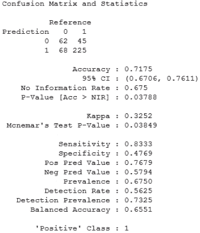

现在，我们将尝试使用一些选定的特征构建另一个模型，并看看它的表现如何。如果你还记得，我们在特征选择部分获得了一些对分类很重要的通用特征。我们仍然会为逻辑回归运行特征选择，以使用以下代码片段查看特征的重要性：

```py
formula <- "credit.rating ~ ."
formula <- as.formula(formula)
control <- trainControl(method="repeatedcv", number=10, repeats=2)
model <- train(formula, data=train.data, method="glm", 
 trControl=control)
importance <- varImp(model, scale=FALSE)
plot(importance)

```

我们从以下图中选择了前五个变量来构建下一个模型。正如你所见，阅读这个图相当简单。重要性越大，变量就越重要。你可以自由地添加更多变量，并使用它们构建不同的模型！

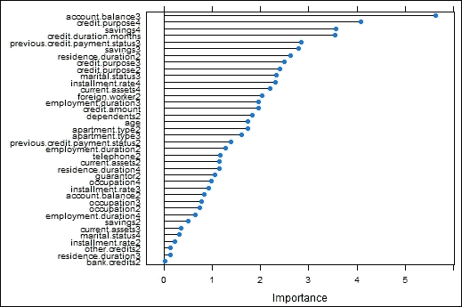

接下来，我们使用与之前类似的方法构建模型，并使用以下代码片段在测试数据上测试模型性能：

```py
> formula.new <- "credit.rating ~ account.balance + credit.purpose 
 + previous.credit.payment.status + savings 
 + credit.duration.months"
> formula.new <- as.formula(formula.new)
> lr.model.new <- glm(formula=formula.new, data=train.data, family="binomial")
> lr.predictions.new <- predict(lr.model.new, test.data, type="response") 
> lr.predictions.new <- round(lr.predictions.new)
> confusionMatrix(data=lr.predictions.new, reference=test.class.var, positive='1')

```

我们得到了以下混淆矩阵。然而，如果你查看模型评估结果，如以下输出所示，你会发现现在准确率略有提高，达到了**72.25%**。**灵敏度**大幅上升到**94%**，这是非常好的，但遗憾的是，这是以特异性下降为代价的，特异性下降到**27**%，你可以清楚地看到，更多的不良信用评级被预测为好，这在测试数据中的 130 个不良信用评级客户中有 95 个！**NPV**上升到**69%**，因为由于灵敏度更高，较少的正信用评级被错误地分类为假阴性。

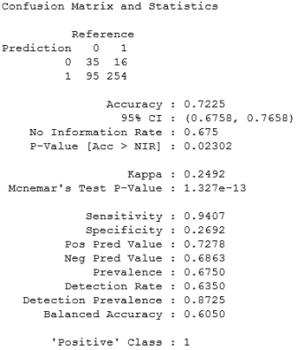

现在的问题是我们要选择哪个模型进行预测。这不仅仅取决于准确率，还取决于问题的领域和业务需求。如果我们预测一个客户的不良信用评级（**0**）为**好**（**1**），这意味着我们将批准该客户的信用贷款，而该客户最终可能不会偿还，这将给银行造成损失。然而，如果我们预测一个客户的良好信用评级（**1**）为**坏**（**0**），这意味着我们将拒绝他的贷款，在这种情况下，银行既不会盈利也不会遭受任何损失。这比错误地将不良信用评级预测为好要安全得多。

因此，我们选择我们的第一个模型作为最佳模型，现在我们将使用以下代码片段查看一些指标评估图：

```py
> lr.model.best <- lr.model
> lr.prediction.values <- predict(lr.model.best, test.feature.vars, type="response")
> predictions <- prediction(lr.prediction.values, test.class.var)
> par(mfrow=c(1,2))
> plot.roc.curve(predictions, title.text="LR ROC Curve")
> plot.pr.curve(predictions, title.text="LR Precision/Recall Curve")

```

我们从前面的代码中得到了以下图：

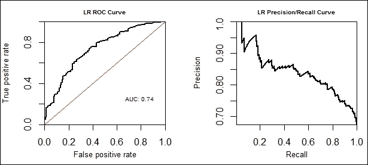

您可以从前面的图中看到，**AUC**为**0.74**，这对于一个开始来说相当不错。我们现在将使用类似的过程构建下一个预测模型，使用支持向量机，并看看它的表现如何。

# 使用支持向量机建模

支持向量机属于用于分类和回归的监督机器学习算法家族。考虑到我们的二分类问题，与逻辑回归不同，支持向量机算法将围绕训练数据构建模型，使得属于不同类别的训练数据点通过一个清晰的间隙分开，这个间隙被优化到最大分离距离。位于边缘的样本通常被称为支持向量。分隔两个类别的边缘中间部分称为最优分离超平面。

位于错误边缘的数据点被降低权重以减少其影响，这被称为软边缘，与我们之前讨论的硬边缘分离相比。支持向量机分类器可以是简单的线性分类器，其中数据点可以线性分离。然而，如果我们处理的是由多个特征组成的数据，而这些特征无法直接进行线性分离，那么我们就使用多个核来实现这一点，这些核形成了非线性支持向量机分类器。您将能够通过以下来自 R 中`svm`库官方文档的图来可视化支持向量机分类器实际的样子：

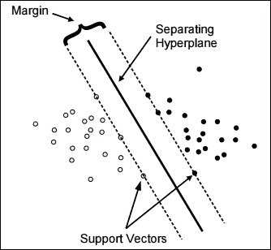

图片来源：[`cran.r-project.org/web/packages/e1071/vignettes/svmdoc.pdf`](https://cran.r-project.org/web/packages/e1071/vignettes/svmdoc.pdf)

从图中，你可以清楚地看到我们可以放置多个超平面来分隔数据点。然而，选择分隔超平面的标准是两个类别的分隔距离最大，支持向量是两个类别的代表性样本，如图中边缘所示。回顾非线性分类器的问题，SVM 除了用于线性分类的常规线性核之外，还有几个核可以用来实现这一点。这些包括多项式、**径向基** **函数**（**RBF**）以及几个其他核。这些非线性核函数背后的主要原理是，即使在线性特征空间中无法进行线性分隔，它们也能使分隔在更高维度的变换特征空间中发生，在那里我们可以使用超平面来分隔类别。需要记住的一个重要事情是维度的诅咒；由于我们可能最终要处理更高维度的特征空间，模型的泛化误差增加，模型的预测能力降低。如果我们有足够的数据，它仍然表现合理。在我们的模型中，我们将使用 RBF 核，也称为径向基函数，为此有两个重要的参数是成本和 gamma。

我们将首先加载必要的依赖项并准备测试数据特征：

```py
library(e1071) # svm model
library(caret) # model training\optimizations
library(kernlab) # svm model for hyperparameters
library(ROCR) # model evaluation
source("performance_plot_utils.R") # plot model metrics
## separate feature and class variables
test.feature.vars <- test.data[,-1]
test.class.var <- test.data[,1]

```

一旦完成这些，我们将使用训练数据和 RBF 核在所有训练集特征上构建 SVM 模型：

```py
> formula.init <- "credit.rating ~ ."
> formula.init <- as.formula(formula.init)
> svm.model <- svm(formula=formula.init, data=train.data, 
+                  kernel="radial", cost=100, gamma=1)
> summary(svm.model)

```

模型的属性如下所示，来自`summary`函数：

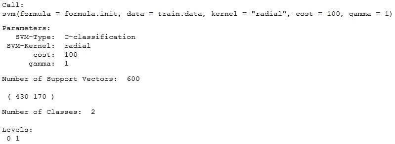

现在我们使用测试数据对这个模型进行预测并评估结果如下：

```py
> svm.predictions <- predict(svm.model, test.feature.vars)
> confusionMatrix(data=svm.predictions, reference=test.class.var, positive="1")
```

这给我们带来了如下混淆矩阵，就像我们在逻辑回归中看到的那样，模型性能的细节如下。我们观察到**准确率**是**67.5**%，**灵敏度**是**100**%，**特异性**是**0**%，这意味着这是一个非常激进的模型，它只是预测每个客户评价为好。这个模型显然存在主要类别分类问题，我们需要改进这一点。

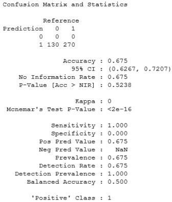

为了构建更好的模型，我们需要进行一些特征选择。我们已经在*特征选择*部分获得了前五个最佳特征。尽管如此，我们仍然会运行一个专门为 SVM 设计的特征选择算法来查看特征重要性，如下所示：

```py
> formula.init <- "credit.rating ~ ."
> formula.init <- as.formula(formula.init)
> control <- trainControl(method="repeatedcv", number=10, repeats=2)
> model <- train(formula.init, data=train.data, method="svmRadial", 
+                trControl=control)
> importance <- varImp(model, scale=FALSE)
> plot(importance, cex.lab=0.5)

```

这给我们一个图，我们看到前五个重要变量与我们的前五个最佳特征相似，但这个算法将年龄的重要性排名高于`credit.amount`，所以你可以通过构建具有不同特征的几个模型来测试这一点，看看哪一个给出最好的结果。对我们来说，从随机森林中选择的特征给出了更好的结果。变量重要性图如下所示：

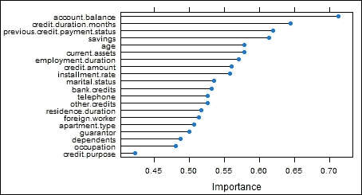

现在我们基于给我们最佳结果的五个特征构建一个新的 SVM 模型，并使用以下代码片段在测试数据上评估其性能：

```py
> formula.new <- "credit.rating ~ account.balance + 
 credit.duration.months + savings + 
 previous.credit.payment.status + credit.amount"
> formula.new <- as.formula(formula.new)
> svm.model.new <- svm(formula=formula.new, data=train.data, 
+                  kernel="radial", cost=100, gamma=1)
> svm.predictions.new <- predict(svm.model.new, test.feature.vars)
> confusionMatrix(data=svm.predictions.new, 
 reference=test.class.var, positive="1")

```

```py
1% to 66.5%. However, the most interesting part is that now our model is able to predict more bad ratings from bad, which can be seen from the confusion matrix. The specificity is now 38% compared to 0% earlier and, correspondingly, the sensitivity has gone down to 80% from 100%, which is still good because now this model is actually useful and profitable! You can see from this that feature selection can indeed be extremely powerful. The confusion matrix for the preceding observations is depicted in the following snapshot:
```


我们肯定会选择这个模型，并继续使用网格搜索算法进行模型优化，如下所示，以优化成本和 gamma 参数：

```py
cost.weights <- c(0.1, 10, 100)
gamma.weights <- c(0.01, 0.25, 0.5, 1)
tuning.results <- tune(svm, formula.new,
 data = train.data, kernel="Radial", 
 ranges=list(cost=cost.weights, gamma=gamma.weights))
print(tuning.results)

```

**输出结果：**

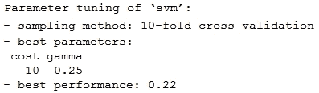

网格搜索图可以如下查看：

```py
> plot(tuning.results, cex.main=0.6, cex.lab=0.8,xaxs="i", yaxs="i")

```

**输出结果：**

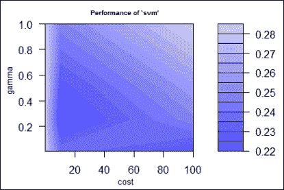

最暗的区域显示了给出最佳性能的参数值。我们现在选择最佳模型并再次评估，如下所示：

```py
> svm.model.best = tuning.results$best.model
> svm.predictions.best <- predict(svm.model.best,
 test.feature.vars)
> confusionMatrix(data=svm.predictions.best, 
 reference=test.class.var, positive="1")

```

观察从以下输出中获得的混淆矩阵结果（我们此后只描述我们跟踪的指标），我们看到整体**准确率**增加到**71**%，**灵敏度**到**86**%，**特异性**到**41**%，与之前的模型结果相比，这是非常好的：

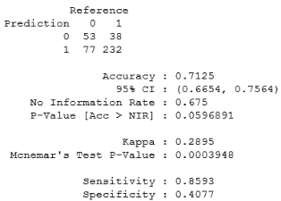

你可以看到超参数优化在预测建模中的强大作用！我们还会绘制一些评估曲线，如下所示：

```py
> svm.predictions.best <- predict(svm.model.best, test.feature.vars, decision.values = T)
> svm.prediction.values <- attributes(svm.predictions.best)$decision.values
> predictions <- prediction(svm.prediction.values, test.class.var)
> par(mfrow=c(1,2))
> plot.roc.curve(predictions, title.text="SVM ROC Curve")
> plot.pr.curve(predictions, title.text="SVM Precision/Recall Curve")

```

我们可以看到预测是如何在评估空间中绘制的，并且我们看到从以下 ROC 图中，AUC 在这种情况下为 0.69：


现在，假设我们想要根据这个 ROC 图优化模型，目标是最大化 AUC。我们现在将尝试这样做，但首先我们需要将分类变量的值编码为一些字母，因为 R 在表示只有数字的因子变量的列名时会引起一些问题。所以基本上，如果`credit.rating`的值为`0`、`1`，则它被转换为**X0**和**X1**；最终我们的类别仍然是不同的，没有任何变化。我们首先使用以下代码片段转换我们的数据：

```py
> transformed.train <- train.data
> transformed.test <- test.data
> for (variable in categorical.vars){
+   new.train.var <- make.names(train.data[[variable]])
+   transformed.train[[variable]] <- new.train.var
+   new.test.var <- make.names(test.data[[variable]])
+   transformed.test[[variable]] <- new.test.var
+ }
> transformed.train <- to.factors(df=transformed.train, variables=categorical.vars)
> transformed.test <- to.factors(df=transformed.test, variables=categorical.vars)
> transformed.test.feature.vars <- transformed.test[,-1]
> transformed.test.class.var <- transformed.test[,1]

```

现在我们再次使用网格搜索构建一个 AUC 优化的模型，如下所示：

```py
> grid <- expand.grid(C=c(1,10,100), sigma=c(0.01, 0.05, 0.1, 0.5, 
 1))
> ctr <- trainControl(method='cv', number=10, classProbs=TRUE,
 summaryFunction=twoClassSummary)
> svm.roc.model <- train(formula.init, transformed.train,
+                        method='svmRadial', trControl=ctr, 
+                        tuneGrid=grid, metric="ROC")

```

我们下一步是对测试数据进行预测并评估混淆矩阵：

```py
> predictions <- predict(svm.roc.model, 
 transformed.test.feature.vars)
> confusionMatrix(predictions, transformed.test.class.var, 
 positive = "X1")

```

这给我们以下结果：

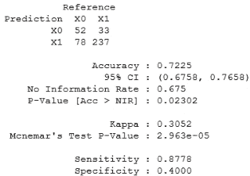

我们现在看到**准确率**进一步提高到**72**%，而**特异性**略有下降到**40**%，但**灵敏度**增加到**87**%，这是好的。我们再次绘制曲线，如下所示：

```py
> svm.predictions <- predict(svm.roc.model, transformed.test.feature.vars, type="prob")
> svm.prediction.values <- svm.predictions[,2]
> predictions <- prediction(svm.prediction.values, test.class.var)
> par(mfrow=c(1,2))
> plot.roc.curve(predictions, title.text="SVM ROC Curve")
> plot.pr.curve(predictions, title.text="SVM Precision/Recall Curve")

```

这给我们以下图表，与我们的早期迭代中做的一样：

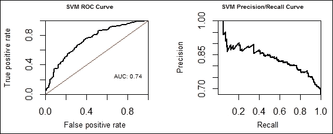

看到 AUC 确实从之前的 0.69 增加到现在的 0.74，这非常令人满意，这意味着基于 AUC 的优化算法确实有效，因为它在所有我们跟踪的方面都给出了比之前模型更好的性能。接下来，我们将探讨如何使用决策树构建预测模型。

# 使用决策树进行建模

决策树是再次属于监督机器学习算法家族的算法。它们也用于分类和回归，通常称为**CART**，代表**分类和回归树**。这些在决策支持系统、商业智能和运筹学中应用广泛。

决策树主要用于做出最有用的决策，以实现某些目标并基于这些决策设计策略。在核心上，决策树只是一个包含几个节点和条件边的流程图。每个非叶节点代表对某个特征的测试条件，每条边代表测试的结果。每个叶节点代表一个类标签，其中对最终结果进行预测。从根节点到所有叶节点的路径给出了所有的分类规则。决策树易于表示、构建和理解。然而，缺点是它们非常容易过拟合，并且这些模型通常泛化能力不佳。我们将遵循之前类似的分析流程，基于决策树构建一些模型。

我们首先加载必要的依赖项和测试数据特征：

```py
> library(rpart)# tree models 
> library(caret) # feature selection
> library(rpart.plot) # plot dtree
> library(ROCR) # model evaluation
> library(e1071) # tuning model
> source("performance_plot_utils.R") # plotting curves
> ## separate feature and class variables
> test.feature.vars <- test.data[,-1]
> test.class.var <- test.data[,1]

```

现在我们将使用以下所有特征构建一个初始模型：

```py
> formula.init <- "credit.rating ~ ."
> formula.init <- as.formula(formula.init)
> dt.model <- rpart(formula=formula.init, 
 method="class",data=train.data,control = 
 rpart.control(minsplit=20, cp=0.05))

```

我们使用以下代码在测试数据上预测和评估模型：

```py
> dt.predictions <- predict(dt.model, test.feature.vars, 
 type="class")
> confusionMatrix(data=dt.predictions, reference=test.class.var, 
 positive="1")

```

从以下输出中，我们看到模型的**准确率**大约为**68**%，**灵敏度**为**92**%，这是非常好的，但**特异性**仅为**18**%，这是我们应努力改进的：

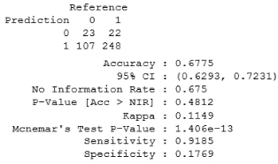

我们现在将尝试特征选择来改进模型。我们使用以下代码来训练模型并按其重要性对特征进行排序：

```py
> formula.init <- "credit.rating ~ ."
> formula.init <- as.formula(formula.init)
> control <- trainControl(method="repeatedcv", number=10, repeats=2)
> model <- train(formula.init, data=train.data, method="rpart", 
+                trControl=control)
> importance <- varImp(model, scale=FALSE)
> plot(importance)

```

这给我们以下图表，显示了不同特征的重要性：

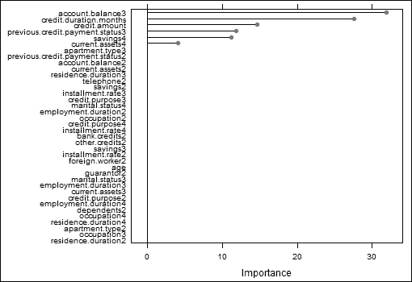

如果你仔细观察，决策树在模型构建中并没有使用所有特征，并且前五个特征与我们之前在讨论特征选择时获得的是相同的。我们现在将使用以下特征构建一个模型：

```py
> formula.new <- "credit.rating ~ account.balance + savings +
 credit.amount + 
 credit.duration.months + 
 previous.credit.payment.status"
> formula.new <- as.formula(formula.new)
> dt.model.new <- rpart(formula=formula.new, method="class",data=train.data, 
+                   control = rpart.control(minsplit=20, cp=0.05),
+                   parms = list(prior = c(0.7, 0.3)))

```

我们现在对测试数据进行预测并评估，如下所示：

```py
> dt.predictions.new <- predict(dt.model.new, test.feature.vars, 
 type="class")
> confusionMatrix(data=dt.predictions.new, 
 reference=test.class.var, positive="1")

```

这给我们以下混淆矩阵和其他指标：

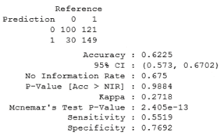

你现在可以看到，整体模型的**准确率**略有下降，达到了**62%**。然而，我们在不良信用评分预测方面取得了进步，我们预测在 130 个客户中有 100 个不良信用评分客户，这非常出色！因此，**特异性**上升到**77%**，而**灵敏度**下降到**55**%，但我们仍然将大量良好信用评分的客户分类为良好。尽管这个模型有些激进，但这是一个合理的模型，因为我们虽然拒绝了更多可能违约的客户的信用贷款，但我们同时也确保了合理数量的良好客户能够获得他们的信用贷款。

我们获得这些结果的原因是因为我们使用了一个名为先验的参数来构建模型，如果你检查前面的建模部分。这个先验参数基本上使我们能够对类别变量中的不同类别应用权重。如果你记得，在我们的数据集中有**700**个信用评分良好的人和**300**个信用评分不良的人，这是一个高度倾斜的数据集，所以在训练模型时，我们可以使用先验来指定这个变量中每个类别的相对重要性，从而调整每个类别的误分类的重要性。在我们的模型中，我们给予不良信用评分客户更多的重视。

你可以通过使用参数`prior = c(0.7, 0.3)`来反转先验概率，并给予良好信用评分客户更多的重视，这将给出以下混淆矩阵：

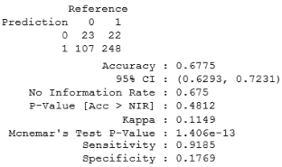

你现在可以清楚地看到，由于我们给予了良好信用评分更多的重视，**灵敏度**上升到**92%**，而**特异性**下降到**18%**。你可以看到，这为你提供了很大的灵活性，取决于你想要实现的目标。

要查看模型，我们可以使用以下代码片段：

```py
> dt.model.best <- dt.model.new
> print(dt.model.best)

```

**输出**：


为了可视化前面的树，你可以使用以下代码：

```py
> par(mfrow=c(1,1))
> prp(dt.model.best, type=1, extra=3, varlen=0, faclen=0)

```

这给我们以下树形图，我们可以看到，使用先验概率，现在在五个特征中只使用了`account.balance`这个特征，并且忽略了其他所有特征。你可以尝试通过使用`e1071`包中的`tune.rpart`函数进行超参数调整来进一步优化模型：

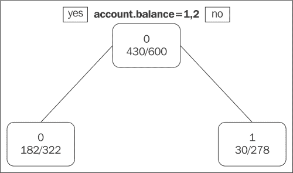

我们通过绘制以下指标评估曲线来完成我们的分析：

```py
> dt.predictions.best <- predict(dt.model.best, test.feature.vars, 
 type="prob")
> dt.prediction.values <- dt.predictions.best[,2]
> predictions <- prediction(dt.prediction.values, test.class.var)
> par(mfrow=c(1,2))
> plot.roc.curve(predictions, title.text="DT ROC Curve")
> plot.pr.curve(predictions, title.text="DT Precision/Recall 
 Curve")

```

**AUC**大约为**0.66**，这并不是最好的，但肯定比以下图中用红线表示的基线要好：


根据我们的业务需求，这个模型相当公平。我们将在本章后面讨论模型比较。现在我们将使用随机森林来构建我们的下一组预测模型。

# 使用随机森林建模

随机森林，也称为随机决策森林，是一种来自集成学习算法家族的机器学习算法。它用于回归和分类任务。随机森林实际上就是决策树集合或集成，因此得名。

算法的工作原理可以简要描述如下。在任何时刻，决策树集成中的每一棵树都是从一个自助样本中构建的，这基本上是带有替换的采样。这种采样是在训练数据集上进行的。在构建决策树的过程中，之前在所有特征中选择为最佳分割的分割不再进行。现在，每次分割时总是从特征的一个随机子集中选择最佳分割。这种随机性引入到模型中略微增加了模型的偏差，但大大减少了模型的方差，这防止了模型的过拟合，这在决策树的情况下是一个严重的问题。总的来说，这产生了性能更好的泛化模型。现在我们将开始我们的分析流程，通过加载必要的依赖项：

```py
> library(randomForest) #rf model 
> library(caret) # feature selection
> library(e1071) # model tuning
> library(ROCR) # model evaluation
> source("performance_plot_utils.R") # plot curves
> ## separate feature and class variables
> test.feature.vars <- test.data[,-1]
> test.class.var <- test.data[,1]

```

接下来，我们将使用所有特征构建初始训练模型，如下所示：

```py
> formula.init <- "credit.rating ~ ."
> formula.init <- as.formula(formula.init)
> rf.model <- randomForest(formula.init, data = train.data, 
 importance=T, proximity=T)

```

您可以使用以下代码查看模型详情：

```py
> print(rf.model)

```

**输出**：

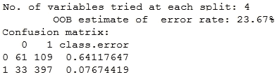

这给我们提供了关于**袋外误差**（**OOBE**）的信息，大约为**23**%，以及基于训练数据的混淆矩阵，以及它在每个分割中使用的变量数量。

接下来，我们将使用此模型在测试数据上进行预测，并评估它们：

```py
> rf.predictions <- predict(rf.model, test.feature.vars, 
 type="class")
> confusionMatrix(data=rf.predictions, reference=test.class.var, 
 positive="1")

```

```py
new model:
```

```py
formula.new <- "credit.rating ~ account.balance + savings +
 credit.amount + 
 credit.duration.months + 
 previous.credit.payment.status"
formula.new <- as.formula(formula.new)
rf.model.new <- randomForest(formula.new, data = train.data, 
 importance=T, proximity=T)

```

我们现在使用此模型在测试数据上进行预测，并如下评估其性能：

```py
> rf.predictions.new <- predict(rf.model.new, test.feature.vars, 
 type="class")
> confusionMatrix(data=rf.predictions.new,   reference=test.class.var, positive="1")

```

这给我们以下混淆矩阵作为输出，以及其他关键性能指标：

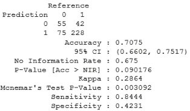

我们得到了略微降低的**准确率**为**71**%，这是显而易见的，因为我们已经消除了许多特征，但现在**特异性**已增加到**42**%，这表明它能够更准确地分类更多的坏实例。**灵敏度**略有下降至**84**%。现在我们将使用网格搜索来对此模型进行超参数调整，如下所示，以查看我们是否可以进一步提高性能。这里感兴趣的参数包括`ntree`，表示树的数量，`nodesize`，表示终端节点的最小大小，以及`mtry`，表示每次分割时随机采样的变量数量。

```py
nodesize.vals <- c(2, 3, 4, 5)
ntree.vals <- c(200, 500, 1000, 2000)
tuning.results <- tune.randomForest(formula.new, 
 data = train.data,
 mtry=3, 
 nodesize=nodesize.vals,
 ntree=ntree.vals)
print(tuning.results)

```

**输出**：

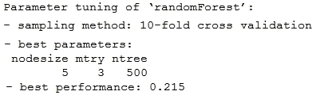

我们现在从先前的网格搜索中得到最佳模型，对测试数据进行预测，并使用以下代码片段评估其性能：

```py
> rf.model.best <- tuning.results$best.model
> rf.predictions.best <- predict(rf.model.best, test.feature.vars, 
 type="class")
> confusionMatrix(data=rf.predictions.best,
 reference=test.class.var, positive="1")

```

从以下输出中，我们可以得出几个观察结果。性能提高非常微不足道，因为整体**准确率**保持在**71%**，**特异性**保持在**42%**，**灵敏度**略有提高，从**84%**增加到**85%**：

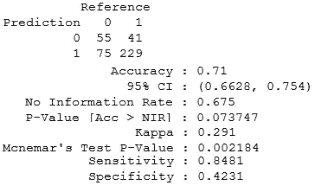

我们现在为这个模型绘制一些性能曲线，如下所示：

```py
> rf.predictions.best <- predict(rf.model.best, test.feature.vars, type="prob")
> rf.prediction.values <- rf.predictions.best[,2]
> predictions <- prediction(rf.prediction.values, test.class.var)
> par(mfrow=c(1,2))
> plot.roc.curve(predictions, title.text="RF ROC Curve")
> plot.pr.curve(predictions, title.text="RF Precision/Recall Curve")

```

我们观察到总**AUC**约为**0.7**，在以下图中比红色基线**AUC**的**0.5**要好得多：

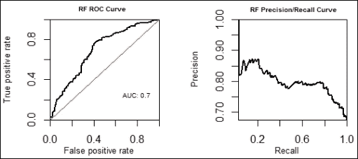

我们将要探索的最后一种算法是神经网络，我们将在下一节中使用它们来构建模型。

# 使用神经网络建模

神经网络，或者更具体地说，在这种情况下，人工神经网络，是一系列基于生物神经网络工作原理的机器学习模型，就像我们的神经系统一样。神经网络已经存在很长时间了，但最近，人们对于使用深度学习和人工智能构建高度智能系统的兴趣激增。深度学习利用深度神经网络，这些网络在输入层和输出层之间有大量的隐藏层。一个典型的神经网络可以用以下图示来表示：

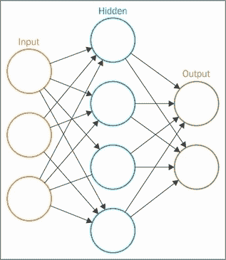

从图中，你可以推断出这个神经网络是一个由各种节点相互连接的网络，也称为神经元。每个节点代表一个神经元，它实际上就是一个数学函数。我们不可能详细说明如何从数学上表示一个节点，但在这里我们会给出要点。这些数学函数接收一个或多个带有权重的输入，这些输入在先前的图中表示为边，然后对这些输入进行一些计算以给出输出。在这些节点中使用的各种流行函数包括阶跃函数和 sigmoid 函数，这些函数你已经在逻辑回归算法中看到过使用。一旦输入被函数加权并转换，这些函数的激活就会发送到后续的节点，直到达到输出层。节点集合形成一层，就像在先前的图中，我们有三个层。

因此，神经网络依赖于多个神经元或节点以及它们之间的互连模式，学习过程用于在每次迭代（通常称为一个 epoch）中更新连接的权重，以及节点的激活函数，这些激活函数将带有权重的节点输入转换为输出激活，该激活通过层传递，直到我们得到输出预测。我们将从以下方式开始加载必要的依赖项：

```py
> library(caret) # nn models
> library(ROCR) # evaluate models
> source("performance_plot_utils.R") # plot curves
> # data transformation
> test.feature.vars <- test.data[,-1]
> test.class.var <- test.data[,1]

```

现在，我们不得不进行一些特征值编码，类似于我们在为 SVM 进行 AUC 优化时所做的那样。为了刷新你的记忆，你可以运行以下代码片段：

```py
> transformed.train <- train.data
> transformed.test <- test.data
> for (variable in categorical.vars){
+   new.train.var <- make.names(train.data[[variable]])
+   transformed.train[[variable]] <- new.train.var
+   new.test.var <- make.names(test.data[[variable]])
+   transformed.test[[variable]] <- new.test.var
+ }
> transformed.train <- to.factors(df=transformed.train, variables=categorical.vars)
> transformed.test <- to.factors(df=transformed.test, variables=categorical.vars)
> transformed.test.feature.vars <- transformed.test[,-1]
> transformed.test.class.var <- transformed.test[,1]

```

一旦我们准备好数据，我们将使用所有特征构建我们的初始神经网络模型，如下所示：

```py
> formula.init <- "credit.rating ~ ."
> formula.init <- as.formula(formula.init)
> nn.model <- train(formula.init, data = transformed.train, method="nnet")

```

```py
nnet package if you do not have it installed, so just select the option when it asks you and it will install it automatically and build the model. If it fails, you can install it separately and run the code again. Remember, it is an iterative process so the model building might take some time. Once the model converges, you can view the model details using the print(nn.model) command which will show several iteration results with different size and decay options, and you will see that it does hyperparameter tuning internally itself to try and get the best model!
```

我们现在在测试数据上执行预测并评估模型性能如下：

```py
> nn.predictions <- predict(nn.model, 
 transformed.test.feature.vars, type="raw")
> confusionMatrix(data=nn.predictions, 
 reference=transformed.test.class.var, 
 positive="X1")

```

您可以从以下输出中观察到，我们的模型具有**72%**的**准确率**，这相当不错。它很好地预测了负面评价为负面，这从**特异性**（**48%**）中可以看出，而且通常**灵敏度**在**84%**时表现良好。


我们现在将使用以下代码片段来绘制基于神经网络的模型的重要性特征：

```py
> formula.init <- "credit.rating ~ ."
> formula.init <- as.formula(formula.init)
> control <- trainControl(method="repeatedcv", number=10, repeats=2)
> model <- train(formula.init, data=transformed.train, method="nnet", 
 trControl=control)
> importance <- varImp(model, scale=FALSE)
> plot(importance)

```

这为我们提供了以下根据重要性排序的绘图排名变量：

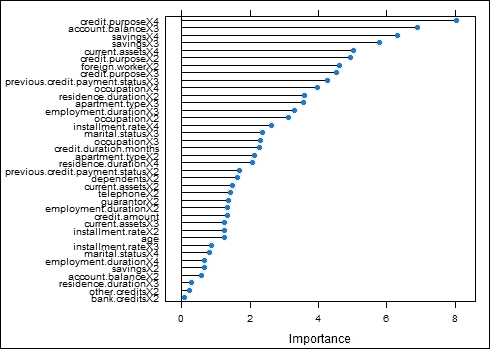

我们从先前的图中选择了最重要的特征，并按以下方式构建我们的下一个模型：

```py
> formula.new <- "credit.rating ~ account.balance + credit.purpose + savings + current.assets +
foreign.worker + previous.credit.payment.status"
> formula.new <- as.formula(formula.new)
> nn.model.new <- train(formula.new, data=transformed.train, method="nnet")

```

我们现在在测试数据上执行预测并评估模型性能：

```py
> nn.predictions.new <- predict(nn.model.new, 
 transformed.test.feature.vars, 
 type="raw")
> confusionMatrix(data=nn.predictions.new, 
 reference=transformed.test.class.var, 
 positive="X1")

```

这为我们提供了以下混淆矩阵，其中包含我们感兴趣的各个指标。从以下输出中我们可以观察到，**准确率**略有提高至**73%**，而**灵敏度**现在提高至**87**%，但以**特异性**为代价，它已降至**43%**：

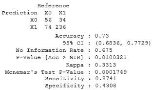

您可以检查它内部进行的超参数调整，如下所示：

```py
> plot(nn.model.new, cex.lab=0.5)

```

以下图显示了具有不同隐藏层节点数和权重衰减的各种模型的准确率：

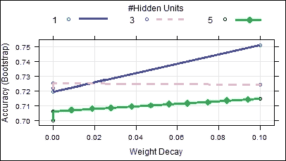

根据银行要求最小化损失的要求，我们选择最佳模型作为最初构建的初始神经网络模型，因为它具有与新模型相似的准确率，并且其**特异性**要高得多，这非常重要。我们现在绘制最佳模型的一些性能曲线如下：

```py
> nn.model.best <- nn.model
> nn.predictions.best <- predict(nn.model.best, transformed.test.feature.vars, type="prob")
> nn.prediction.values <- nn.predictions.best[,2]
> predictions <- prediction(nn.prediction.values, test.class.var)
> par(mfrow=c(1,2))
> plot.roc.curve(predictions, title.text="NN ROC Curve")
> plot.pr.curve(predictions, title.text="NN Precision/Recall Curve")

```

从以下图中我们可以观察到，**AUC**为**0.74**，这相当不错，并且比用红色表示的基线表现要好得多：

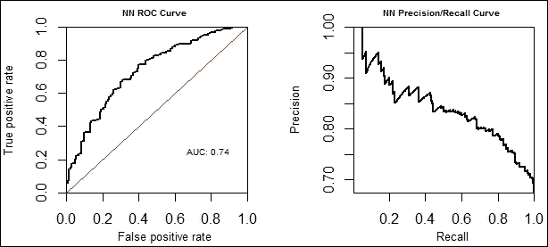

这标志着我们的预测建模会话的结束，我们将通过模型选择和比较来总结。

# 模型比较和选择

我们已经探索了各种机器学习技术，并构建了几个模型来预测客户的信用评级，因此现在的问题是我们应该选择哪个模型以及模型之间是如何相互比较的。我们的测试数据有 130 个客户的**不良信用评级**（**0**）和 270 个客户的**良好信用评级**（**1**）。

如果您还记得，我们之前讨论过在建模后使用领域知识和业务需求来解释结果并做出决策。目前，我们的决定是选择最佳模型以最大化德国银行的利润并最小化损失。让我们考虑以下条件：

+   如果我们错误地将信用评级差的客户预测为好，银行将损失其贷出的全部信用金额，因为他将违约支付，因此损失为 100%，可以用-1 表示，以方便计算。

+   如果我们正确地将信用评级差的客户预测为坏，我们就正确地拒绝了他信用贷款，因此既没有损失也没有利润。

+   如果我们正确地将信用评级好的客户预测为好，我们就正确地给他提供了信用贷款。假设银行对贷出的金额有利息，让我们假设利润是客户每月支付的利息的 30%。因此，利润表示为 30%或+0.3，以方便计算。

+   如果我们错误地将信用评级好的客户预测为坏，我们就错误地拒绝了他信用贷款，但在此情况下既没有利润也没有损失。

考虑到这些条件，我们将为各种模型制作一个比较表，包括我们之前为每个机器学习算法的最佳模型计算的一些指标。记住，考虑到所有模型性能指标和业务需求，没有一种模型在所有模型中都是最佳的。每个模型都有其自身的良好性能点，这在以下分析中是显而易见的：

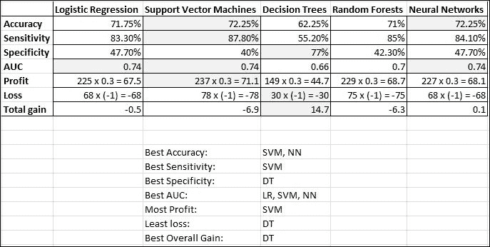

前表中突出显示的单元格显示了该特定指标的最佳性能。正如我们之前提到的，没有最佳模型，我们已经列出了针对每个指标表现最好的模型。考虑到总整体收益，决策树似乎是最优模型。然而，这是假设每个客户请求的信用贷款金额是恒定的。记住，如果每个客户请求的贷款金额不同，那么这种总收益的概念就无法比较，因为在这种情况下，一笔贷款的利润可能不同于另一笔，而损失也可能在不同贷款中不同。这种分析有些复杂，超出了本章的范围，但我们将简要说明如何计算。如果你还记得，有一个`credit.amount`特征，它指定了客户请求的信用金额。由于我们已经在训练数据中有了客户编号，我们可以将评级客户及其请求的金额进行汇总，并对那些产生损失和利润的客户进行汇总，然后我们将得到每种方法的银行总收益！

# 摘要

在本章中，我们探讨了监督学习领域中的几个重要方面。如果你从我们旅程的开始就跟随了这一章，并且勇敢地走到了最后，给自己鼓掌吧！你现在已经知道了构成预测分析的内容以及与之相关的一些重要概念。此外，我们还看到了预测模型是如何在实际中工作的，以及完整的预测分析流程。这将使你能够在未来构建自己的预测模型，并从模型预测中开始获得有价值的见解。我们还看到了如何实际使用模型进行预测，以及如何评估这些预测以测试模型性能，以便我们可以进一步优化模型，并根据指标和业务需求选择最佳模型。在我们得出结论并开始你自己的预测分析之旅之前，我想提到的是，你应该始终记住奥卡姆剃刀原理，它指出*在相互竞争的假设中，应该选择假设最少的那一个*，这也可以被解释为*有时，最简单的解决方案是最好的一个*。不要盲目地使用最新的包和技术来构建预测模型，因为首先你需要理解你正在解决的问题，然后从最简单的实现开始，这通常会带来比大多数复杂解决方案更好的结果。
