# 第二章：使用集成模型预测员工流失

如果你回顾了最近的机器学习竞赛，我相信你一定会注意到的一个关键观察结果是，大多数竞赛中所有三个获胜者的方案都包括非常好的特征工程，以及调优良好的集成模型。从这个观察结果中，我得出的一个结论是，好的特征工程和构建表现良好的模型是两个应该给予同等重视的领域，以便提供成功的机器学习解决方案。

虽然特征工程大多数时候是依赖于构建模型的人的创造力和领域专业知识，但构建一个表现良好的模型可以通过一种称为**集成学习**的哲学来实现。机器学习从业者经常使用集成技术来超越甚至最佳性能的个体机器学习算法产生的性能基准。在本章中，我们将学习这个激动人心的机器学习领域的以下主题：

+   集成学习的哲学

+   理解员工流失问题和数据集

+   使用 K 最近邻模型进行性能基准测试

+   Bagging

+   随机森林中的随机化

+   Boosting

+   Stacking

# 集成学习的哲学

集成学习，在机器学习从业者中非常著名，可以通过一个简单的现实世界、非机器学习示例来很好地理解。

假设你已经申请了一家非常有声望的企业的职位，并且你被邀请参加面试。仅凭一次与面试官的面试，你不太可能被选中工作。在大多数情况下，你将经历多轮面试，与几个面试官或面试官小组进行面试。组织对面试官的期望是，每位面试官都是特定领域的专家，并且面试官已经根据你在面试官领域专业知识中的经验评估了你的工作适应性。当然，你被选中工作取决于所有与你交谈的面试官的综合反馈。组织认为，由于你的选择是基于多个专家做出的综合决策，而不是仅基于一个专家的决策，这可能会存在某些偏见，因此你将更有可能在工作中取得成功。

现在，当我们谈论所有面试官反馈的整合时，整合可以通过几种方法发生：

+   **平均**：假设你的工作候选人资格是基于你在面试中通过一个截止分数。假设你已经见过十个面试官，每个面试官都对你进行了最高 10 分的评分，这代表面试官在他领域专业知识中对你经验的感知。现在，你的综合评分是通过简单地平均所有面试官给你的分数来计算的。

+   **多数投票**：在这种情况下，每位面试官并没有给出 10 分中的实际分数。然而，在 10 位面试官中，有 8 位确认您适合该职位。两位面试官表示不认可您的候选人资格。由于大多数面试官对您的面试表现感到满意，您被选中担任该职位。

+   **加权平均**：假设有四位面试官在您申请的职位中具备一些有益的次要技能，这些技能对于该职位并非必需。您接受了所有 10 位面试官的面试，每位面试官都给您打出了 10 分中的分数。与平均方法类似，在加权平均方法中，您的最终面试分数是通过平均所有面试官给出的分数来获得的。

然而，并非所有分数在计算最终分数时都同等重要。每个面试分数都会乘以一个权重，得到一个乘积。所有这些乘积相加，从而得到最终分数。每个面试的权重是测试候选人技能的重要性以及该技能对完成工作的重要性函数。显然，对于工作来说，“有益的”技能与“必需的”技能相比，权重较低。最终分数现在本质上代表了候选人拥有的必需技能的比例，这对您的选择有更大的影响。

与面试的类比类似，机器学习中的集成也基于综合学习产生模型。术语“综合学习”本质上代表通过应用多个机器学习算法或从属于大型数据集的多个数据子集中获得的学习。类似于面试，通过应用集成技术，从多个模型中学习多个模型。然而，通过应用平均、多数投票或加权平均技术对每个单独模型做出的预测进行综合，从而得出关于预测的最终结论。应用集成技术和预测综合技术的模型通常被称为**集成**。

每个机器学习算法都是特殊的，并且有自己独特的方式来建模底层的训练数据。例如，k-最近邻算法通过计算数据集中元素之间的距离来学习；朴素贝叶斯通过计算数据中每个属性属于特定类的概率来学习。可以使用不同的机器学习算法创建多个模型，并通过结合几个机器学习算法的预测来进行预测。同样，当数据集被划分为子集，并且使用专注于每个数据集的算法训练多个模型时，每个模型都非常专注，并且专门学习它所训练的数据子集的特性。在这两种情况下，通过整合多个算法和多个数据子集的模型，当我们通过结合多个模型的优势来综合预测时，我们会得到更好的预测。否则，使用单个模型进行预测是无法获得这种效果的。

集成学习的核心在于，当我们结合多个模型的预测而不是仅仅依赖单个模型进行预测时，我们可以获得更好的预测。这与“团结就是力量”的管理哲学没有不同，这通常被称为**协同效应**！

现在我们已经理解了集成学习的核心哲学，我们现在可以探索不同的集成技术类型了。然而，我们将通过在一个项目中实现它们来学习集成技术，该项目旨在预测员工的流失。正如我们已知的，在构建任何机器学习项目之前，对问题和数据有深入的理解非常重要。因此，在下一节中，我们首先关注理解当前面临的员工流失问题，然后研究与该问题相关联的数据集，最后通过探索性数据分析（EDA）理解数据集的特性。本节中我们获得的关键见解来自于一次性的练习，并将适用于我们在后续章节中应用的所有集成技术。

# 开始学习

要开始本节的学习，您需要从本章代码的 GitHub 链接下载`WA_Fn-UseC_-HR-Employee-Attrition.csv`数据集。

# 理解员工流失问题和数据集

人力资源分析有助于解释组织数据。它发现数据中与人员相关的发展趋势，并帮助人力资源部门采取适当的步骤，使组织运行顺畅并盈利。在企业环境中，员工流失是管理人员和人力资源人员必须应对的复杂挑战之一。有趣的是，可以部署机器学习模型来预测潜在的员工流失案例，从而帮助适当的人力资源人员或管理人员采取必要的步骤来留住员工。

在本章中，我们将构建机器学习集成，以预测潜在的离职案例。用于项目的职位离职数据集是由 IBM 的数据科学家创建的虚构数据集。`rsample`库包含了这个数据集，我们可以直接从库中使用这个数据集。

这是一个包含 31 个属性、1,470 条记录的小数据集。可以通过以下代码获取数据集的描述：

```py
setwd("~/Desktop/chapter 2") 
library(rsample) 
data(attrition) 
str(attrition) 
mydata<-attrition 
```

这将产生以下输出：

```py
'data.frame':1470 obs. of  31 variables: 
 $ Age                     : int  41 49 37 33 27 32 59 30 38 36 ... 
 $ Attrition               : Factor w/ 2 levels "No","Yes": 2 1 2 1 1 1 1 1 1 1 .... 
 $ BusinessTravel          : Factor w/ 3 levels "Non-Travel","Travel_Frequently",..: 3 2 3 2 3 2 3 3 2 3 ... 
 $ DailyRate               : int  1102 279 1373 1392 591 1005 1324 1358 216 1299 ... 
 $ Department              : Factor w/ 3 levels "Human_Resources",..: 3 2 2 2 2 2 2 2 2 2 ... 
 $ DistanceFromHome        : int  1 8 2 3 2 2 3 24 23 27 ... 
 $ Education               : Ord.factor w/ 5 levels "Below_College"<..: 2 1 2 4 1 2 3 1 3 3 ... 
 $ EducationField          : Factor w/ 6 levels "Human_Resources",..: 2 2 5 2 4 2 4 2 2 4 ... 
 $ EnvironmentSatisfaction : Ord.factor w/ 4 levels "Low"<"Medium"<..: 2 3 4 4 1 4 3 4 4 3 ... 
 $ Gender                  : Factor w/ 2 levels "Female","Male": 1 2 2 1 2 2 1 2 2 2 ... 
 $ HourlyRate              : int  94 61 92 56 40 79 81 67 44 94 ... 
 $ JobInvolvement          : Ord.factor w/ 4 levels "Low"<"Medium"<..: 3 2 2 3 3 3 4 3 2 3 ... 
 $ JobLevel                : int  2 2 1 1 1 1 1 1 3 2 ... 
 $ JobRole                 : Factor w/ 9 levels "Healthcare_Representative",..: 8 7 3 7 3 3 3 3 5 1 ... 
 $ JobSatisfaction         : Ord.factor w/ 4 levels "Low"<"Medium"<..: 4 2 3 3 2 4 1 3 3 3 ... 
 $ MaritalStatus           : Factor w/ 3 levels "Divorced","Married",..: 3 2 3 2 2 3 2 1 3 2 ... 
 $ MonthlyIncome           : int  5993 5130 2090 2909 3468 3068 2670 2693 9526 5237 ... 
 $ MonthlyRate             : int  19479 24907 2396 23159 16632 11864 9964 13335 8787 16577 ... 
 $ NumCompaniesWorked      : int  8 1 6 1 9 0 4 1 0 6 ... 
 $ OverTime                : Factor w/ 2 levels "No","Yes": 2 1 2 2 1 1 2 1 1 1 ... 
 $ PercentSalaryHike       : int  11 23 15 11 12 13 20 22 21 13 ... 
 $ PerformanceRating       : Ord.factor w/ 4 levels "Low"<"Good"<"Excellent"<..: 3 4 3 3 3 3 4 4 4 3 ... 
 $ RelationshipSatisfaction: Ord.factor w/ 4 levels "Low"<"Medium"<..: 1 4 2 3 4 3 1 2 2 2 ... 
 $ StockOptionLevel        : int  0 1 0 0 1 0 3 1 0 2 ... 
 $ TotalWorkingYears       : int  8 10 7 8 6 8 12 1 10 17 ... 
 $ TrainingTimesLastYear   : int  0 3 3 3 3 2 3 2 2 3 ... 
 $ WorkLifeBalance         : Ord.factor w/ 4 levels "Bad"<"Good"<"Better"<..: 1 3 3 3 3 2 2 3 3 2 ... 
 $ YearsAtCompany          : int  6 10 0 8 2 7 1 1 9 7 ... 
 $ YearsInCurrentRole      : int  4 7 0 7 2 7 0 0 7 7 ... 
 $ YearsSinceLastPromotion : int  0 1 0 3 2 3 0 0 1 7 ... 
 $ YearsWithCurrManager    : int  5 7 0 0 2 6 0 0 8 7 ... 
```

要查看数据集中的`Attrition`目标变量，请运行以下代码：

```py
table(mydata$Attrition) 
```

这将产生以下输出：

```py
 No   Yes  
1233  237  
```

在数据集中的 1,470 个观测值中，我们有 1,233 个样本（83.87%）是非离职案例，237 个离职案例（16.12%）。显然，我们正在处理一个*类别不平衡*的数据集。

我们现在将通过`corrplot`库使用以下代码可视化数据中的高度相关变量：

```py
# considering only the numeric variables in the dataset 
numeric_mydata <- mydata[,c(1,4,6,7,10,11,13,14,15,17,19,20,21,24,25,26,28:35)] 
# converting the target variable "yes" or "no" values into numeric 
# it defaults to 1 and 2 however converting it into 0 and 1 to be consistent 
numeric_Attrition = as.numeric(mydata$Attrition)- 1 
# create a new data frame with numeric columns and numeric target  
numeric_mydata = cbind(numeric_mydata, numeric_Attrition) 
# loading the required library 
library(corrplot) 
# creating correlation plot 
M <- cor(numeric_mydata) 
corrplot(M, method="circle") 
```

这将产生以下输出：

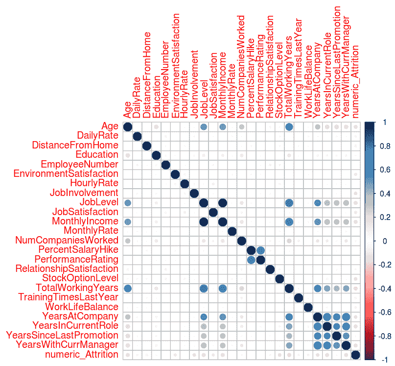

在前面的屏幕截图中，可能观察到单元格中的较深和较大的蓝色点表示单元格中对应行和列的变量之间存在强相关性。独立变量之间的高度相关性表明数据中存在冗余特征。数据中高度相关特征的存在问题被称为**多重共线性**。如果我们想要拟合一个回归模型，那么我们需要通过一些技术来处理数据中的高度相关变量，例如删除冗余特征或应用主成分分析或偏最小二乘回归，这些技术直观地减少了冗余特征。

从输出中我们可以推断出以下变量高度相关，如果我们要构建一个基于回归的模型，构建模型的人需要通过一些技术来处理这些变量，例如删除冗余特征或应用主成分分析或偏最小二乘回归，这些技术直观地减少了冗余特征。

`JobLevel`-`MonthlyIncome`；`JobLevel`-`TotalWorkingYears`；`MonthlyIncome`-`TotalWorkingYears`；`PercentSalaryHike`-`PerformanceRating`；`YearsAtCompany`-`YearsInCurrentRole`；`YearsAtCompany`-`YearsWithCurrManager`；`YearsWithCurrManager`-`YearsInCurrentRole`

现在，让我们绘制各种独立变量与依赖的`Attrition`变量之间的关系图，以了解独立变量对目标的影响：

```py
### Overtime vs Attiriton 
l <- ggplot(mydata, aes(OverTime,fill = Attrition)) 
l <- l + geom_histogram(stat="count") 

tapply(as.numeric(mydata$Attrition) - 1 ,mydata$OverTime,mean) 

No Yes
0.104364326375712 0.305288461538462
```

让我们运行以下命令以获取图形视图：

```py
print(l) 
```

前面的命令生成了以下输出：

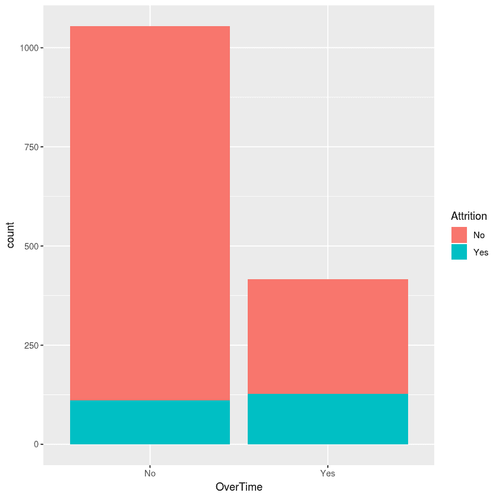

在前面的输出中，可以观察到加班的员工与未加班的员工相比，更容易出现离职现象：

让我们通过执行以下命令来计算员工的离职率：

```py
### MaritalStatus vs Attiriton 
l <- ggplot(mydata, aes(MaritalStatus,fill = Attrition)) 
l <- l + geom_histogram(stat="count") 

tapply(as.numeric(mydata$Attrition) - 1 ,mydata$MaritalStatus,mean) 
Divorced 0.100917431192661 
Married 0.12481426448737 
Single 0.25531914893617 
```

让我们运行以下命令以获取图形视图：

```py
print(l) 
```

前面的命令生成了以下输出：

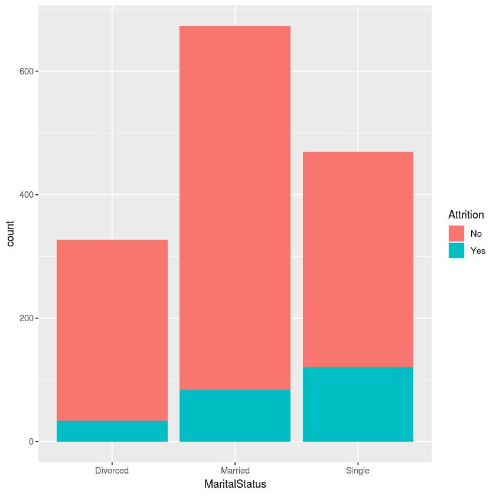

在前面的输出中，可以观察到单身员工有更高的流失率：

```py
###JobRole vs Attrition 
l <- ggplot(mydata, aes(JobRole,fill = Attrition)) 
l <- l + geom_histogram(stat="count") 

tapply(as.numeric(mydata$Attrition) - 1 ,mydata$JobRole,mean) 

Healthcare Representative    Human Resources 
               0.06870229    0.23076923 
    Laboratory Technician    Manager 
               0.23938224    0.04901961 
   Manufacturing Director    Research Director 
               0.06896552    0.02500000 
       Research Scientist    Sales Executive 
               0.16095890    0.17484663 
     Sales Representative 
               0.39759036 
mean(as.numeric(mydata$Attrition) - 1) 
[1] 0.161224489795918 
```

执行以下命令以获取相同情况的图形表示：

```py
print(l)
```

看看运行前面命令生成的以下输出：

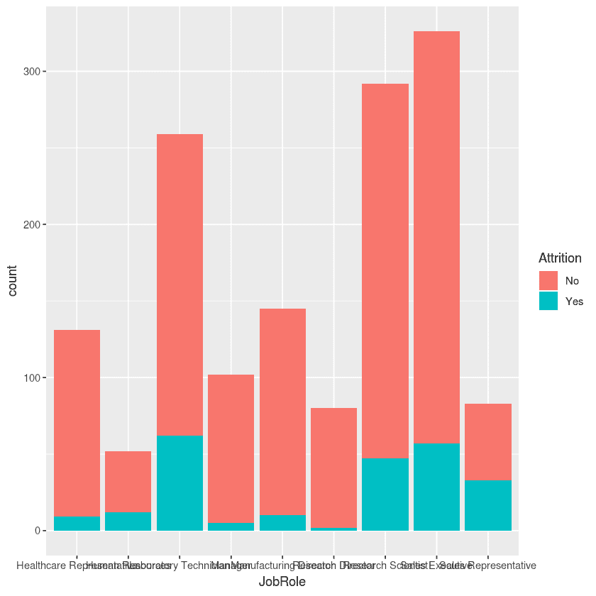

在前面的输出中，可以观察到实验室技术人员、销售代表和从事人力资源工作的员工比其他组织角色的员工流失率更高。

让我们执行以下命令来检查员工性别对流失率的影响：

```py
###Gender vs Attrition 
l <- ggplot(mydata, aes(Gender,fill = Attrition)) 
l <- l + geom_histogram(stat="count") 

tapply(as.numeric(mydata$Attrition) - 1 ,mydata$Gender,mean) 

Female 0.147959183673469 
Male 0.170068027210884 
```

运行以下命令以获取相同情况的图形表示：

```py
print(l)
```

这将产生以下输出：

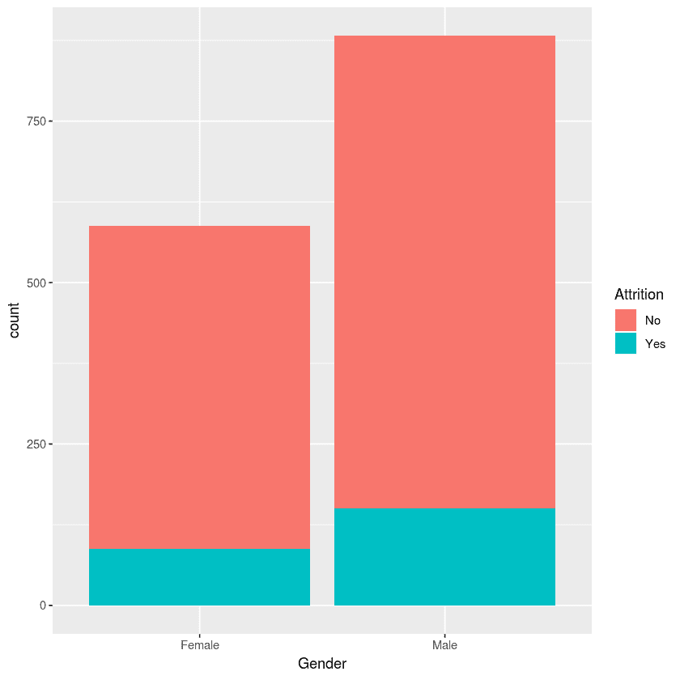

在前面的输出中，你可以看到员工的性别对流失率没有影响，换句话说，流失率在所有性别中观察到是相同的。

让我们通过执行以下命令来计算来自不同领域的员工的属性：

```py
###EducationField vs Attrition el <- ggplot(mydata, aes(EducationField,fill = Attrition)) 
l <- l + geom_histogram(stat="count") 

tapply(as.numeric(mydata$Attrition) - 1 ,mydata$EducationField,mean) 

Human Resources    Life Sciences    Marketing 
       0.2592593    0.1468647        0.2201258 
         Medical   Other Technical  Degree 
       0.1357759    0.1341463        0.2424242
```

让我们执行以下命令以获取图形表示：

```py
print(l)
```

这将产生以下输出：

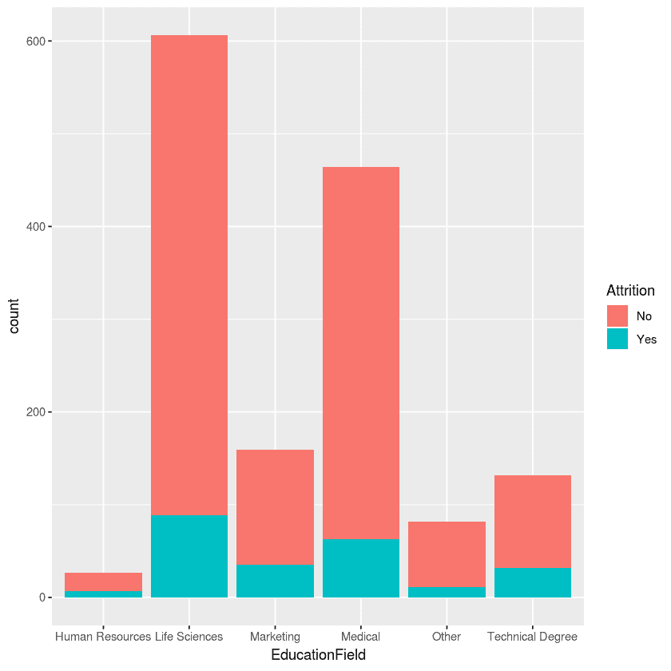

观察前面的图表，我们可以得出结论，拥有技术学位或人力资源学位的员工观察到有更高的流失率。看看下面的代码：

```py
###Department vs Attrition 
l <- ggplot(mydata, aes(Department,fill = Attrition)) 
l <- l + geom_histogram(stat="count") 

tapply(as.numeric(mydata$Attrition) - 1 ,mydata$Department,mean) 
Human Resources  Research & Development  Sales 
   0.1904762       0.1383975              0.2062780 
```

让我们执行以下命令来检查不同部门的流失率：

```py
print(l) 
```

这将产生以下输出：

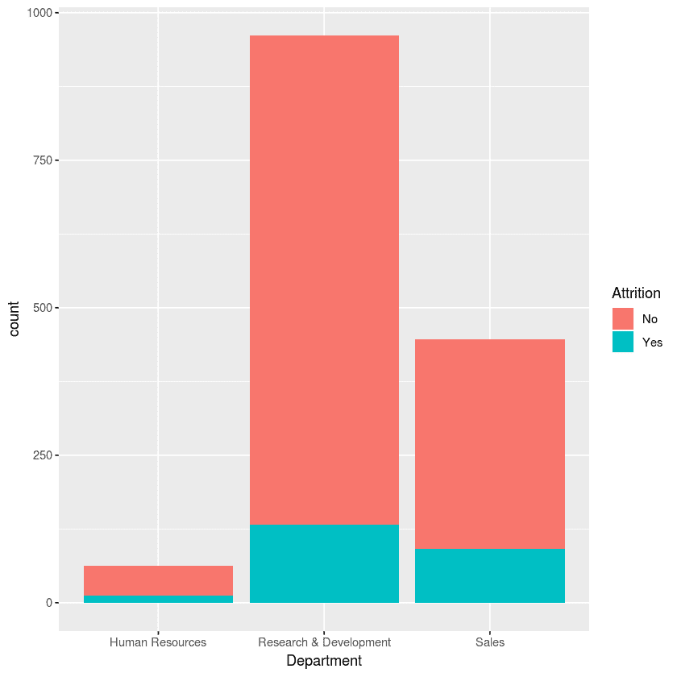

观察前面的图表，我们可以得出结论，研发部门与销售和人力资源部门的流失率相比较低。看看下面的代码：

```py
###BusinessTravel vs Attrition 
l <- ggplot(mydata, aes(BusinessTravel,fill = Attrition)) 
l <- l + geom_histogram(stat="count") 

tapply(as.numeric(mydata$Attrition) - 1 ,mydata$BusinessTravel,mean) 
 Non-Travel   Travel_Frequently   Travel_Rarely 
  0.0800000    0.2490975           0.1495686
```

执行以下命令以获取相同情况的图形表示：

```py
print(l) 
```

这将产生以下输出：

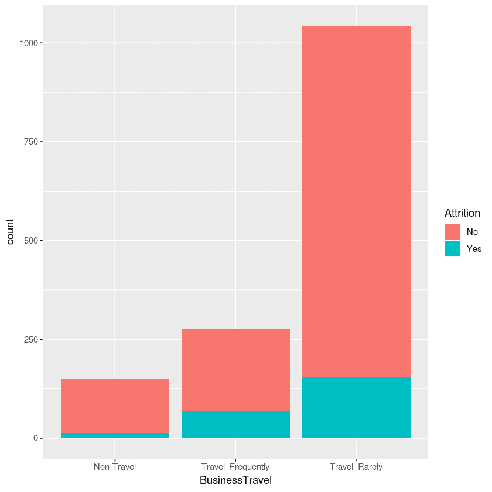

观察前面的图表，我们可以得出结论，经常出差的员工与没有出差状态或很少出差的员工相比，更容易出现流失。

让我们通过执行以下命令来计算员工的加班时间：

```py
### x=Overtime, y= Age, z = MaritalStatus , t = Attrition 
ggplot(mydata, aes(OverTime, Age)) +   
  facet_grid(.~MaritalStatus) + 
  geom_jitter(aes(color = Attrition),alpha = 0.4) +   
  ggtitle("x=Overtime, y= Age, z = MaritalStatus , t = Attrition") +   
  theme_light() 
```

这将产生以下输出：

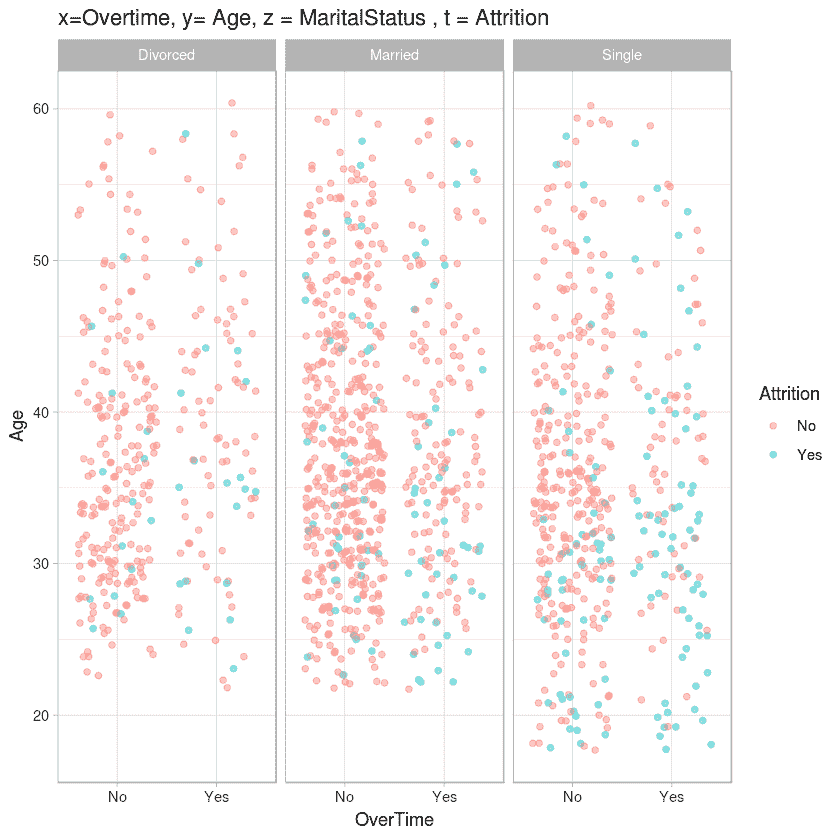

观察前面的图表，我们可以得出结论，年轻（年龄 < 35）且单身但加班的员工更容易出现流失：

```py
### MonthlyIncome vs. Age, by  color = Attrition 
ggplot(mydata, aes(MonthlyIncome, Age, color = Attrition)) +  
  geom_jitter() + 
  ggtitle("MonthlyIncome vs. Age, by  color = Attrition ") + 
  theme_light() 
```

这将产生以下输出：

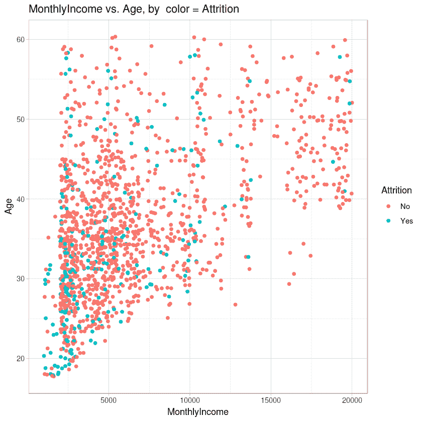

观察前面的图表，我们可以得出结论，年轻（年龄 < 30）的员工流失率较高，并且观察到大多数流失率发生在收入低于 7500 美元的员工中。

虽然我们已经了解了关于当前数据的许多重要细节，但实际上还有更多值得探索和学习的内容。然而，为了进入下一步，我们在这一 EDA 步骤处停止。需要注意的是，在现实世界中，数据可能不会像我们在这一磨损数据集中看到的那样非常干净。例如，数据中可能会有缺失值；在这种情况下，我们会进行缺失值插补。幸运的是，我们有一个完美的数据集，可以用来创建模型，而无需进行任何数据清洗或额外的预处理。

# 用于性能基准的 K-最近邻模型

在本节中，我们将实现 **k-最近邻**（**KNN**）算法，并在我们的 IBM 离职数据集上构建模型。当然，我们已经从 EDA 中了解到，我们手头的数据集中存在类别不平衡问题。然而，我们现在不会对数据集进行类别不平衡处理，因为这是一个独立的整个领域，并且该领域有几种技术可用，因此超出了本章中涵盖的机器学习集成主题的范围。我们将暂时将数据集视为现状，并构建机器学习模型。此外，对于类别不平衡数据集，Kappa 或精确率和召回率或接收者操作特征（ROC）曲线下的面积（AUROC）是合适的指标。然而，为了简化，我们将使用 *准确率* 作为性能指标。我们将采用 10 折交叉验证重复 10 次来评估模型性能。现在，让我们使用 KNN 算法构建我们的离职预测模型，如下所示：

```py
# Load the necessary libraries 
# doMC is a library that enables R to use multiple cores available on the sysem thereby supporting multiprocessing.  
library(doMC) 
# registerDoMC command instructs R to use the specified number of cores to execute the code. In this case, we ask R to use 4 cores available on the system 
registerDoMC(cores=4) 
# caret library has the ml algorithms and other routines such as cross validation etc.  
library(caret) 
# Setting the working directory where the dataset is located 
setwd("~/Desktop/chapter 2") 
# Reading the csv file into R variable called mydata 
mydata <- read.csv("WA_Fn-UseC_-HR-Employee-Attrition.csv") 
#Removing the non-discriminatory features (as identified during EDA) from the dataset  
mydata$EmployeeNumber=mydata$Over18=mydata$EmployeeCount=mydata$StandardHours = NULL 
# setting the seed prior to model building ensures reproducibility of the results obtained 
set.seed(10000) 
# setting the train control parameters specifying gold standard 10 fold cross validation  repeated 10 times 
fitControl = trainControl(method="repeatedcv", number=10,repeats=10) 
###creating a model on the data. Observe that we specified Attrition as the target and that model should learn from rest of the variables. We specified mydata as the dataset to learn. We pass the train control parameters and specify that knn algorithm need to be used to build the model. K can be of any length - we specified 20 as parameter which means the train command will search through 20 different random k values and finally retains the model that produces the best performance measurements. The final model is stored as caretmodel 
caretmodel = train(Attrition~., data=mydata, trControl=fitControl, method = "knn", tuneLength = 20) 
# We output the model object to the console  
caretmodel 
```

这将产生以下输出：

```py
k-Nearest Neighbors  
1470 samples 
  30 predictors 
   2 classes: 'No', 'Yes'  
No pre-processing 
Resampling: Cross-Validated (10 fold, repeated 10 times)  
Summary of sample sizes: 1323, 1323, 1324, 1323, 1324, 1322, ...  
Resampling results across tuning parameters: 
  k   Accuracy   Kappa        
   5  0.8216447  0.0902934591 
   7  0.8349033  0.0929511324 
   9  0.8374198  0.0752842114 
  11  0.8410920  0.0687849122 
  13  0.8406861  0.0459679081 
  15  0.8406875  0.0337742424 
  17  0.8400748  0.0315670261 
  19  0.8402770  0.0245499585 
  21  0.8398721  0.0143638854 
  23  0.8393945  0.0084393721 
  25  0.8391891  0.0063246624 
  27  0.8389174  0.0013913143 
  29  0.8388503  0.0007113939 
  31  0.8387818  0.0000000000 
  33  0.8387818  0.0000000000 
  35  0.8387818  0.0000000000 
  37  0.8387818  0.0000000000 
  39  0.8387818  0.0000000000 
  41  0.8387818  0.0000000000 
  43  0.8387818  0.0000000000 
Accuracy was used to select the optimal model using the largest value. 
The final value used for the model was k = 11\. 
```

从模型输出中我们可以看到，当 `k` `= 11` 时，表现最好的模型，我们使用这个 `k` 值获得了 84% 的准确率。在本章的其余部分，当我们实验几种集成技术时，我们将检查这个 KNN 获得的 84% 准确率是否会被击败。

在一个实际的项目构建情况下，仅仅确定最佳超参数是不够的。模型需要在包含最佳超参数的完整数据集上训练，并且模型需要保存以供将来使用。我们将在本节的其余部分回顾这些步骤。

在这种情况下，`caretmodel` 对象已经包含了训练好的模型，其中 `k = 11`，因此我们不会尝试使用最佳超参数重新训练模型。要检查最终模型，可以使用以下代码查询模型对象：

```py
caretmodel$finalModel 
```

这将产生以下输出：

```py
11-nearest neighbor model 
Training set outcome distribution: 
  No  Yes  
1233  237  
```

下一步是将您最好的模型保存到文件中，以便我们稍后可以加载它们并预测未见数据。可以使用 `saveRDS` R 命令将模型保存到本地目录：

```py
 # save the model to disk 
saveRDS(caretmodel, "production_model.rds") 
```

在这种情况下，`caretmodel` 模型被保存在工作目录中的 `production_model.rds` 文件中。现在该模型以文件形式序列化，可以随时加载，并可用于评估未见数据。加载和评估可以通过以下 R 代码实现：

```py
# Set the working directory to the directory where the saved .rds file is located  
setwd("~/Desktop/chapter 2") 
#Load the model  
loaded_model <- readRDS("production_model.rds") 
```

```py
#Using the loaded model to make predictions on unseen data 
final_predictions <- predict(loaded_model, unseen_data) 
```

请注意，`unseen_data`需要在通过`predict`命令评分之前读取。

代码中的一部分，其中最终模型在全部数据集上训练，保存模型，在需要时从文件中重新加载它，并集体评分未看到的资料，被称为构建机器学习生产化管道。这个管道对所有机器学习模型都是相同的，无论模型是使用单个算法还是使用集成技术构建。因此，在后面的章节中，当我们实现各种集成技术时，我们不会涵盖生产化管道，而只是停止在通过 10 折交叉验证重复 10 次获得性能度量。

# Bagging

Bootstrap aggregation 或**Bagging**是机器学习实践社区最早广泛采用的集成技术。Bagging 涉及从单个数据集中创建多个不同的模型。为了理解 Bagging，了解一个重要的统计技术——bootstrap，是很有必要的。

Bootstrapping 涉及创建数据集的多个随机子集。有可能同一个数据样本被多个子集选中，这被称为**带有替换的 bootstrap**。这种方法的优点是，它减少了由于使用整个数据集而导致的估计量的标准误差。这个技术可以通过一个例子来更好地解释。

假设你有一个包含 1,000 个样本的小数据集。根据样本，你需要计算代表该样本的总体平均。现在，直接做这件事的方法是以下公式：

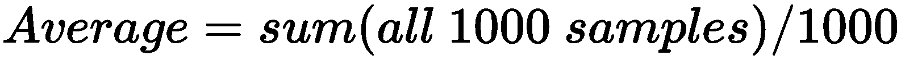

由于这是一个小样本，我们在估计总体平均时可能会出现误差。通过采用带有替换的 bootstrap 采样可以减少这种误差。在这种技术中，我们创建了 10 个子集，每个数据集包含 100 个项目。一个数据项可以在子集中随机表示多次，并且对数据子集中以及跨子集的数据项表示的次数没有限制。现在，我们取每个数据子集中样本的平均值，因此，我们最终得到 10 个不同的平均值。使用所有这些收集到的平均值，我们使用以下公式估计总体的平均：

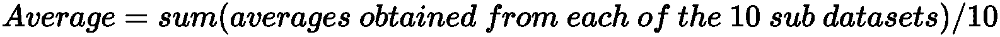

现在，我们有了更好的平均估计，因为我们已经将小样本外推以随机生成多个样本，这些样本代表了原始总体。

在袋装中，实际训练数据集通过带有替换的 bootstrap 抽样分成多个袋。假设我们最终得到 *n* 个袋，当机器学习算法应用于这些袋中的每一个时，我们获得 *n* 个不同的模型。每个模型都专注于一个袋。当需要对新未见数据做出预测时，这些 *n* 个模型中的每一个都会独立地对数据进行预测。通过结合所有 *n* 个模型的预测，得出一个观察值的最终预测。在分类的情况下，采用投票，并将多数视为最终预测。对于回归，考虑所有模型的预测平均值作为最终预测。

基于决策树的算法，如**分类和回归树**（**CART**），是不稳定的学习者。原因是训练数据集的微小变化会严重影响创建的模型。模型变化本质上意味着预测也会变化。袋装是一种非常有效的技术，可以处理对数据变化的极高敏感性。因为我们可以在数据集的子集上构建多个决策树模型，然后根据每个模型的预测得出最终预测，因此数据变化的影响被消除或不太明显。

在数据子集上构建多个模型时，会遇到一个直观的问题，那就是**过拟合**。然而，通过在不应用任何剪枝的情况下生长深度树，可以克服这个问题。

使用袋装法的一个缺点是，与使用独立机器学习算法构建模型相比，构建模型所需的时间更长。这是显而易见的，因为在袋装法中会构建多个模型，而不是一个单独的模型，构建这些多个模型需要时间。

现在，让我们编写 R 代码来实现袋装集成，并比较获得的性能与 KNN 算法获得的性能。然后，我们将探讨袋装方法的运作机制。

`caret` 库提供了一个框架，可以与任何独立的机器学习算法实现袋装。`ldaBag`、`plsBag`、`nbBag`、`treeBag`、`ctreeBag`、`svmBag` 和 `nnetBag` 是 `caret` 中提供的一些示例方法。在本节中，我们将使用三种不同的 `caret` 方法实现袋装，例如 `treebag`、`svmbag` 和 `nbbag`。

# 袋装分类和回归树（treeBag）实现

首先，加载必要的库并注册用于并行处理的核心数：

```py
library(doMC) 
registerDoMC(cores = 4)  
library(caret) 
#setting the random seed for replication 
set.seed(1234) 
# setting the working directory where the data is located 
setwd("~/Desktop/chapter 2") 
# reading the data 
mydata <- read.csv("WA_Fn-UseC_-HR-Employee-Attrition.csv") 
#removing the non-discriminatory features identified during EDA 
mydata$EmployeeNumber=mydata$Over18=mydata$EmployeeCount=mydata$StandardHours = NULL 
#setting up cross-validation 
cvcontrol <- trainControl(method="repeatedcv", repeats=10, number = 10, allowParallel=TRUE) 
# model creation with treebag , observe that the number of bags is set as 10 
train.bagg <- train(Attrition ~ ., data=mydata, method="treebag",B=10, trControl=cvcontrol, importance=TRUE) 
train.bagg 
```

这将产生以下输出：

```py
Bagged CART  
1470 samples 
  30 predictors 
   2 classes: 'No', 'Yes'  
No pre-processing 
Resampling: Cross-Validated (10 fold, repeated 10 times)  
Summary of sample sizes: 1324, 1323, 1323, 1322, 1323, 1322, ...  
Resampling results: 
  Accuracy  Kappa     
  0.854478  0.2971994 
```

我们可以看到，我们实现了 85.4%的更好准确率，而使用 KNN 算法获得的准确率是 84%。

# 支持向量机袋装（SVMBag）实现

在 SVMBag 和 NBBag 实现中，加载库、注册多进程、设置工作目录、从工作目录读取数据、从数据中移除非判别性特征以及设置交叉验证参数的步骤保持不变。因此，我们不在 SVMBag 或 NBBag 代码中重复这些步骤。相反，我们将专注于讨论 SVMBag 或 NBBag 特定的代码：

```py
# Setting up SVM predict function as the default svmBag$pred function has some code issue 
svm.predict <- function (object, x) 
{ 
 if (is.character(lev(object))) { 
    out <- predict(object, as.matrix(x), type = "probabilities") 
    colnames(out) <- lev(object) 
    rownames(out) <- NULL 
  } 
  else out <- predict(object, as.matrix(x))[, 1] 
  out 
} 
# setting up parameters to build svm bagging model 
bagctrl <- bagControl(fit = svmBag$fit, 
                      predict = svm.predict , 
                      aggregate = svmBag$aggregate) 
# fit the bagged svm model 
set.seed(300) 
svmbag <- train(Attrition ~ ., data = mydata, method="bag",trControl = cvcontrol, bagControl = bagctrl,allowParallel = TRUE) 
# printing the model results 
svmbag 
```

这将导致以下输出：

```py
Bagged Model  

1470 samples 
  30 predictors 
   2 classes: 'No', 'Yes'  

No pre-processing 
Resampling: Cross-Validated (10 fold, repeated 10 times)  
Summary of sample sizes: 1324, 1324, 1323, 1323, 1323, 1323, ...  
Resampling results: 
  Accuracy   Kappa     
  0.8777721  0.4749657 

Tuning parameter 'vars' was held constant at a value of 44 
```

你将看到我们达到了 87.7%的准确率，这比 KNN 模型的 84%准确率要高得多。

# 简单贝叶斯（nbBag）袋装化实现

我们现在将通过执行以下代码来实现`nbBag`实现：

```py
# setting up parameters to build svm bagging model 
bagctrl <- bagControl(fit = nbBag$fit, 
                      predict = nbBag$pred , 
                      aggregate = nbBag$aggregate) 
# fit the bagged nb model 
set.seed(300) 
nbbag <- train(Attrition ~ ., data = mydata, method="bag", trControl = cvcontrol, bagControl = bagctrl) 
# printing the model results 
nbbag 
```

这将导致以下输出：

```py
Bagged Model  

1470 samples 
  30 predictors 
   2 classes: 'No', 'Yes'  

No pre-processing 
Resampling: Cross-Validated (10 fold, repeated 10 times)  
Summary of sample sizes: 1324, 1324, 1323, 1323, 1323, 1323, ...  
Resampling results: 

  Accuracy   Kappa      
  0.8389878  0.00206872 

Tuning parameter 'vars' was held constant at a value of 44 
```

我们可以看到，在这种情况下，我们只达到了 83.89%的准确率，略低于 KNN 模型的 84%性能。

尽管我们只展示了`caret`方法中用于袋装化的三个示例，但代码在实现其他方法时保持不变。在代码中需要做的唯一更改是在`bagControl`中替换`fit`、`predict`和`aggregate`参数。例如，要实现使用神经网络算法的袋装化，我们需要将`bagControl`定义为以下内容：

```py
bagControl(fit = nnetBag$fit, predict = nnetBag$pred , aggregate = nnetBag$aggregate) 
```

可能需要注意，R 中需要有一个适当的库来运行`caret`方法，否则将导致错误。例如，`nbBag`需要在执行代码之前在系统上安装`klaR`库。同样，`ctreebag`函数需要安装`party`包。用户在使用`caret`袋装化之前需要检查系统上是否存在适当的库。

我们现在已经了解了通过袋装化技术实施项目的实现方法。下一小节将介绍袋装化的底层工作机制。这将有助于我们了解袋装化在内部如何处理我们的数据集，以便产生比独立模型性能更好的性能测量结果。

# 随机森林中的随机化

正如我们在袋装化中看到的，我们创建了多个袋装，每个模型都在这些袋装上进行训练。每个袋装都由实际数据集的子集组成，然而每个袋装中的特征或变量数量保持不变。换句话说，我们在袋装化中所做的是对数据集行进行子集化。

在随机森林中，当我们通过子集化行从数据集中创建袋装时，我们还子集化了需要包含在每个袋装中的特征（列）。

假设你的数据集中有 1,000 个观测值和 20 个特征。我们可以创建 20 个袋装，其中每个袋装有 100 个观测值（这是由于有放回的重新抽样而成为可能），并且每个袋装有五个特征。现在，训练了 20 个模型，每个模型只能看到分配给它的袋装。最终的预测是通过投票或基于问题是否为回归问题或分类问题进行平均得出的。

与袋装相比，随机森林的另一个关键区别是用于构建模型的机器学习算法。在袋装中，可以使用任何机器学习算法来创建模型，但是随机森林模型是专门使用 CART 构建的。

随机森林建模是另一种非常流行的机器学习算法。它是那些多次证明自己是最优算法之一的算法之一，尽管它在噪声数据集上应用。对于一个已经理解了自助法的个人来说，理解随机森林就像小菜一碟。

# 使用随机森林实现流失预测模型

让我们通过执行以下代码，通过随机森林建模来获取我们的流失模型：

```py
# loading required libraries and registering multiple cores to enable parallel processing 
library(doMC) 
library(caret) 
registerDoMC(cores=4) 
# setting the working directory and reading the dataset 
setwd("~/Desktop/chapter 2") 
mydata <- read.csv("WA_Fn-UseC_-HR-Employee-Attrition.csv") 
# removing the non-discriminatory features from the dataset as identified during EDA step 
mydata$EmployeeNumber=mydata$Over18=mydata$EmployeeCount=mydata$StandardHours = NULL 
# setting the seed for reproducibility 
set.seed(10000) 
# setting the cross validation parameters 
fitControl = trainControl(method="repeatedcv", number=10,repeats=10) 
# creating the caret model with random forest algorithm 
caretmodel = train(Attrition~., data=mydata, method="rf", trControl=fitControl, verbose=F) 
# printing the model summary 
caretmodel 
```

这将导致以下输出：

```py
Random Forest  

1470 samples 
  30 predictors 
   2 classes: 'No', 'Yes'  

No pre-processing 
Resampling: Cross-Validated (10 fold, repeated 10 times)  
Summary of sample sizes: 1323, 1323, 1324, 1323, 1324, 1322, ...  
Resampling results across tuning parameters: 

  mtry  Accuracy   Kappa     
   2    0.8485765  0.1014859 
  23    0.8608271  0.2876406 
  44    0.8572929  0.2923997 

Accuracy was used to select the optimal model using the largest value. 
The final value used for the model was mtry = 23\. 
```

我们看到，最佳的随机森林模型实现了 86%的更好准确率，而 KNN 的准确率是 84%。

# 提升

弱学习器是一种表现相对较差的算法——通常，弱学习器获得的准确率仅略高于随机水平。通常，如果不是总是观察到，弱学习器在计算上很简单。决策树桩或 1R 算法是弱学习器的例子。提升将弱学习器转换为强学习器。这本质上意味着提升不是一个进行预测的算法，而是与一个底层的弱机器学习算法一起工作以获得更好的性能。

提升模型是一系列在数据子集上学习的模型，这些子集与袋装集成技术类似。不同之处在于数据子集的创建。与袋装不同，用于模型训练的所有数据子集并不是在训练开始之前就创建好的。相反，提升通过一个机器学习算法构建第一个模型，该算法在整个数据集上进行预测。现在，有一些被错误分类的实例，这些实例是子集，并被第二个模型使用。第二个模型只从第一个模型输出的错误分类数据集中学习。

第二个模型的错误分类实例成为第三个模型的输入。构建模型的过程会重复进行，直到满足停止标准。对未见数据集中的观察值的最终预测是通过平均或投票所有模型对该特定、未见观察值的预测来得到的。

在提升算法家族中，各种算法之间存在着细微的差别，然而我们不会详细讨论它们，因为本章的目的是获得对机器学习集成的一般理解，而不是深入了解各种提升算法。

在获得更好的性能的同时，度量是提升集成最大的优势；模型可解释性困难、更高的计算时间、模型过拟合是使用提升时遇到的一些问题。当然，这些问题可以通过使用专门的技术来解决。

提升算法无疑是超级流行的，并且观察到在许多 Kaggle 和类似比赛中获胜者都在使用。有几种提升算法可供选择，例如**梯度提升机**（**GBMs**）、**自适应提升**（**AdaBoost**）、梯度树提升、**极端梯度提升**（**XGBoost**）和**轻梯度提升机**（**LightGBM**）。在本节中，我们将学习两种最受欢迎的提升算法的理论和实现，即 GBMs 和 XGBoost。在学习提升的理论概念及其优缺点之前，让我们首先开始关注使用 GBMs 和 XGBoost 实现员工流失预测模型。

# GBM 实现

让我们实现使用 GBM 的员工流失预测模型：

```py
# loading the essential libraries and registering the cores for multiprocessing 
library(doMC) 
library(mlbench) 
library(gbm) 
library(caret) 
registerDoMC(cores=4) 
# setting the working directory and reading the dataset 
setwd("~/Desktop/chapter 2") 
mydata <- read.csv("WA_Fn-UseC_-HR-Employee-Attrition.csv") 
# removing the non-discriminatory features as identified by EDA step 
mydata$EmployeeNumber=mydata$Over18=mydata$EmployeeCount=mydata$StandardHours = NULL 
# converting the target attrition feild to numeric as gbm model expects all numeric feilds in the dataset 
mydata$Attrition = as.numeric(mydata$Attrition) 
# forcing the attrition column values to be 0 and 1 instead of 1 and 2 
mydata = transform(mydata, Attrition=Attrition-1) 
# running the gbm model with 10 fold cross validation to identify the number of trees to build - hyper parameter tuning 
gbm.model = gbm(Attrition~., data=mydata, shrinkage=0.01, distribution = 'bernoulli', cv.folds=10, n.trees=3000, verbose=F) 
# identifying and printing the value of hyper parameter identified through the tuning above 
best.iter = gbm.perf(gbm.model, method="cv") 
print(best.iter) 
# setting the seed for reproducibility 
set.seed(123) 
# creating a copy of the dataset 
mydata1=mydata 
# converting target to a factor 
mydata1$Attrition=as.factor(mydata1$Attrition) 
# setting up cross validation controls 
fitControl = trainControl(method="repeatedcv", number=10,repeats=10) 
# runing the gbm model in tandem with caret  
caretmodel = train(Attrition~., data=mydata1, method="gbm", distribution="bernoulli",  trControl=fitControl, verbose=F, tuneGrid=data.frame(.n.trees=best.iter, .shrinkage=0.01, .interaction.depth=1, .n.minobsinnode=1)) 
# printing the model summary 
print(caretmodel) 
```

这将产生以下输出：

```py
2623 
Stochastic Gradient Boosting  

1470 samples 
  30 predictors 
   2 classes: '0', '1'  

No pre-processing 
Resampling: Cross-Validated (10 fold, repeated 10 times)  
Summary of sample sizes: 1323, 1323, 1323, 1322, 1323, 1323, ...  
Resampling results: 
  Accuracy   Kappa     
  0.8771472  0.4094991 
Tuning parameter 'n.trees' was held constant at a value of 2623 
Tuning parameter 'shrinkage' was held constant at a value of 0.01 
Tuning parameter 'n.minobsinnode' was held constant at a value of 1 
```

你会看到，使用 GBM 模型，我们实现了超过 87%的准确率，这比使用 KNN 实现的 84%的准确率要好。

# 使用 XGBoost 构建员工流失预测模型

现在，让我们使用 XGBoost 实现员工流失预测模型：

```py
# loading the required libraries and registering the cores for multiprocessing 
library(doMC) 
library(xgboost) 
library(caret) 
registerDoMC(cores=4) 
# setting the working directory and loading the dataset 
setwd("~/Desktop/chapter 2") 
mydata <- read.csv("WA_Fn-UseC_-HR-Employee-Attrition.csv") 
# removing the non-discriminatory features from the dataset as identified in EDA step 
mydata$EmployeeNumber=mydata$Over18=mydata$EmployeeCount=mydata$StandardHours = NULL 
# setting up cross validation parameters 
ControlParamteres <- trainControl(method = "repeatedcv",number = 10, repeats=10, savePredictions = TRUE, classProbs = TRUE) 
# setting up hyper parameters grid to tune   
parametersGrid <-  expand.grid(eta = 0.1, colsample_bytree=c(0.5,0.7), max_depth=c(3,6),nrounds=100, gamma=1, min_child_weight=2,subsample=0.5) 
# printing the parameters grid to get an intuition 
print(parametersGrid) 
# xgboost model building 
modelxgboost <- train(Attrition~., data = mydata, method = "xgbTree", trControl = ControlParamteres, tuneGrid=parametersGrid) 
# printing the model summary 
print(modelxgboost) 
```

这将产生以下输出：

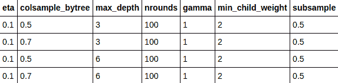

```py
eXtreme Gradient Boosting  
1470 samples 
  30 predictors 
   2 classes: 'No', 'Yes'  

No pre-processing 
Resampling: Cross-Validated (10 fold, repeated 10 times)  
Summary of sample sizes: 1323, 1323, 1322, 1323, 1323, 1322, ...  
Resampling results across tuning parameters: 

  max_depth  colsample_bytree  Accuracy   Kappa     
  3          0.5               0.8737458  0.3802840 
  3          0.7               0.8734728  0.3845053 
  6          0.5               0.8730674  0.3840938 
  6          0.7               0.8732589  0.3920721 

Tuning parameter 'nrounds' was held constant at a value of 100 
Tuning parameter 'min_child_weight' was held constant at a value of 2 
Tuning parameter 'subsample' was held constant at a value of 0.5 
Accuracy was used to select the optimal model using the largest value. 
The final values used for the model were nrounds = 100, max_depth = 3, eta = 0.1, gamma = 1, colsample_bytree = 0.5, min_child_weight = 2 and subsample = 0.5\. 
```

再次，我们观察到，使用 XGBoost 模型，我们实现了超过 87%的准确率，这比使用 KNN 实现的 84%的准确率要好。

# 堆叠

在我们迄今为止所学习的所有集成中，我们都以某种方式操纵了数据集，并暴露了数据集的子集以进行模型构建。然而，在堆叠中，我们不会对数据集做任何事情；相反，我们将应用一种不同的技术，该技术涉及使用多个机器学习算法。在堆叠中，我们使用各种机器学习算法构建多个模型。每个算法都有一种独特的学习数据特征的方式，最终的堆叠模型间接地结合了所有这些独特的学习方式。堆叠通过通过投票或平均（正如我们在其他类型的集成中所做的那样）获得最终预测，从而获得了几个机器学习算法的联合力量。

# 使用堆叠构建员工流失预测模型

让我们构建一个使用堆叠的员工流失预测模型：

```py
# loading the required libraries and registering the cpu cores for multiprocessing 
library(doMC) 
library(caret) 
library(caretEnsemble) 
registerDoMC(cores=4) 
# setting the working directory and loading the dataset 
setwd("~/Desktop/chapter 2") 
mydata <- read.csv("WA_Fn-UseC_-HR-Employee-Attrition.csv") 
# removing the non-discriminatory features from the dataset as identified in EDA step 
mydata$EmployeeNumber=mydata$Over18=mydata$EmployeeCount=mydata$StandardHours = NULL 
# setting up control paramaters for cross validation 
control <- trainControl(method="repeatedcv", number=10, repeats=10, savePredictions=TRUE, classProbs=TRUE) 
# declaring the ML algorithms to use in stacking 
algorithmList <- c('C5.0', 'nb', 'glm', 'knn', 'svmRadial') 
# setting the seed to ensure reproducibility of the results 
set.seed(10000) 
# creating the stacking model 
models <- caretList(Attrition~., data=mydata, trControl=control, methodList=algorithmList) 
# obtaining the stacking model results and printing them 
results <- resamples(models) 
summary(results) 
```

这将产生以下输出：

```py
summary.resamples(object = results) 

Models: C5.0, nb, glm, knn, svmRadial  
Number of resamples: 100  

Accuracy  
               Min.   1st Qu.    Median      Mean   3rd Qu.      Max. NA's 
C5.0      0.8082192 0.8493151 0.8639456 0.8625833 0.8775510 0.9054054    0 
nb        0.8367347 0.8367347 0.8378378 0.8387821 0.8424658 0.8435374    0 
glm       0.8299320 0.8639456 0.8775510 0.8790444 0.8911565 0.9387755    0 
knn       0.8027211 0.8299320 0.8367347 0.8370763 0.8438017 0.8630137    0 
svmRadial 0.8287671 0.8648649 0.8775510 0.8790467 0.8911565 0.9319728    0 

Kappa  Min.          1st Qu.     Median     Mean   3rd Qu.      Max.  NA's 
C5.0   0.03992485 0.29828006 0.37227344 0.3678459 0.4495049 0.6112590    0 
nb     0.00000000 0.00000000 0.00000000 0.0000000 0.0000000 0.0000000    0 
glm    0.26690604 0.39925723 0.47859218 0.4673756 0.5218094 0.7455280    0 
knn   -0.05965697 0.02599388 0.06782465 0.0756081 0.1320451 0.2431312    0 
svmRadial 0.24565 0.38667527 0.44195662 0.4497538 0.5192393 0.7423764    0 

# Identifying the correlation between results 
modelCor(results) 
```

这将产生以下输出：

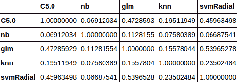

从相关性表的结果中我们可以看出，没有任何一个单独的机器学习算法的预测结果高度相关。高度相关的结果意味着算法产生了非常相似的预测。与接受单个预测相比，结合这些非常相似的预测可能并不会真正带来显著的好处。在这个特定的情况下，我们可以观察到没有任何算法的预测是高度相关的，因此我们可以直接进入下一步，即堆叠预测：

```py
# Setting up the cross validation control parameters for stacking the predictions from individual ML algorithms 
stackControl <- trainControl(method="repeatedcv", number=10, repeats=10, savePredictions=TRUE, classProbs=TRUE) 
# stacking the predictions of individual ML algorithms using generalized linear model 
stack.glm <- caretStack(models, method="glm", trControl=stackControl) 
# printing the stacked final results 
print(stack.glm) 
```

这将产生以下输出：

```py
A glm ensemble of 2 base models: C5.0, nb, glm, knn, svmRadial 
Ensemble results: 
Generalized Linear Model  
14700 samples 
    5 predictors 
    2 classes: 'No', 'Yes'  
No pre-processing 
Resampling: Cross-Validated (10 fold, repeated 10 times)  
Summary of sample sizes: 13230, 13230, 13230, 13230, 13230, 13230, ...  
Resampling results: 
  Accuracy   Kappa     
  0.8844966  0.4869556 
```

使用基于 GLM 的 stacking，我们达到了 88%的准确率。现在，让我们来检查使用随机森林建模而不是 GLM 来堆叠来自五个机器学习算法的每个算法的预测对观察结果的影响：

```py
# stacking the predictions of individual ML algorithms using random forest 
stack.rf <- caretStack(models, method="rf", trControl=stackControl) 
# printing the summary of rf based stacking 
print(stack.rf) 
```

这将产生以下输出：

```py
A rf ensemble of 2 base models: C5.0, nb, glm, knn, svmRadial 
Ensemble results: 
Random Forest  
14700 samples 
    5 predictors 
    2 classes: 'No', 'Yes'  
No pre-processing 
Resampling: Cross-Validated (10 fold, repeated 10 times)  
Summary of sample sizes: 13230, 13230, 13230, 13230, 13230, 13230, ...  
Resampling results across tuning parameters: 
  mtry  Accuracy   Kappa     
  2     0.9122041  0.6268108 
  3     0.9133605  0.6334885 
  5     0.9132925  0.6342740 
Accuracy was used to select the optimal model using the largest value.
The final value used for the model was mtry = 3\. 
```

我们看到，只需付出很少的努力，我们就能够通过堆叠预测实现 91%的准确率。现在，让我们来探讨堆叠的工作原理。

最后，我们发现了各种集成技术，这些技术可以为我们提供性能更好的模型。然而，在结束本章之前，还有一些事情我们需要注意。

在 R 中实现机器学习模型的方式不止一种。例如，可以使用`ipred`库中的函数来实现 bagging，而不是像本章中所做的那样使用`caret`。我们应该意识到，超参数调整是模型构建的重要组成部分，以便获得最佳性能的模型。超参数的数量以及这些超参数的可接受值取决于我们打算使用的库。这就是为什么我们在本章构建的模型中对超参数调整的关注较少。尽管如此，阅读库文档以了解可以使用库函数调整的超参数非常重要。在大多数情况下，将超参数调整纳入模型可以显著提高模型性能。

# 摘要

回顾一下，我们使用的是不平衡的数据集来构建流失模型。在模型构建之前使用技术来解决类别不平衡是获得更好的模型性能测量值的关键方面之一。我们使用了 bagging、随机化、boosting 和 stacking 来实现和预测流失模型。我们仅通过使用模型中现成的特征就实现了 91%的准确率。特征工程是一个关键方面，其作用在机器学习模型中不容忽视。这可能又是探索进一步提高模型性能的另一条途径。

在下一章中，我们将探讨通过构建个性化推荐引擎来推荐产品或内容的秘密配方。我已经准备好实施一个推荐笑话的项目。翻到下一章继续学习之旅。
