# 第八章：使用循环神经网络进行自动散文生成

我们几乎通过这本书互动了将近 200 页，但我意识到我还没有向你正确地介绍自己！我想现在是时候了。通过这本书的作者简介，你已经了解了我的一些信息；然而，我想告诉你一些关于我居住的城市的情况。我住在南印度的一个城市，名叫班加罗尔，也被称为班加罗尔。这座城市以其 IT 人才和人口多样性而闻名。我喜欢这座城市，因为它充满了大量的正能量。每天，我都会遇到来自各行各业的人——来自多个民族、多个背景、说多种语言的人等等。卡纳达语是位于班加罗尔的卡纳塔克邦的官方语言。尽管我能说一些卡纳达语，但我的口语水平并不如本土的卡纳达语使用者。当然，这是我要改进的一个领域，我正在努力提高。像我一样，许多从其他地方迁移到这个城市的人在与卡纳达语交流时也遇到了问题。有趣的是，不懂语言并没有阻止我们用当地人的语言与他们互动。猜猜看，是什么帮助我们解决了这个问题：像谷歌翻译、谷歌文本转语音等移动应用程序。这些应用程序是基于称为机器翻译和语音识别的自然语言处理技术构建的。这些技术反过来又作用于被称为**语言模型**的东西。语言模型是我们将在本章深入探讨的主题。

本章的目标包括探讨以下主题：

+   需要语言建模来解决自然语言处理任务

+   语言模型的工作原理

+   语言模型的应用

+   语言建模与神经网络之间的关系

+   循环神经网络

+   正常前馈网络与循环神经网络之间的区别

+   长短期记忆网络

+   一个使用循环神经网络自动生成文本的项目

# 理解语言模型

在英语中，字符*a*在单词和句子中出现的频率远高于字符*x*。同样，我们也可以观察到单词*is*出现的频率高于单词*specimen*。通过检查大量文本，我们可以学习字符和单词的概率分布。以下截图是一个显示给定语料库（文本数据集）中字母概率分布的图表：

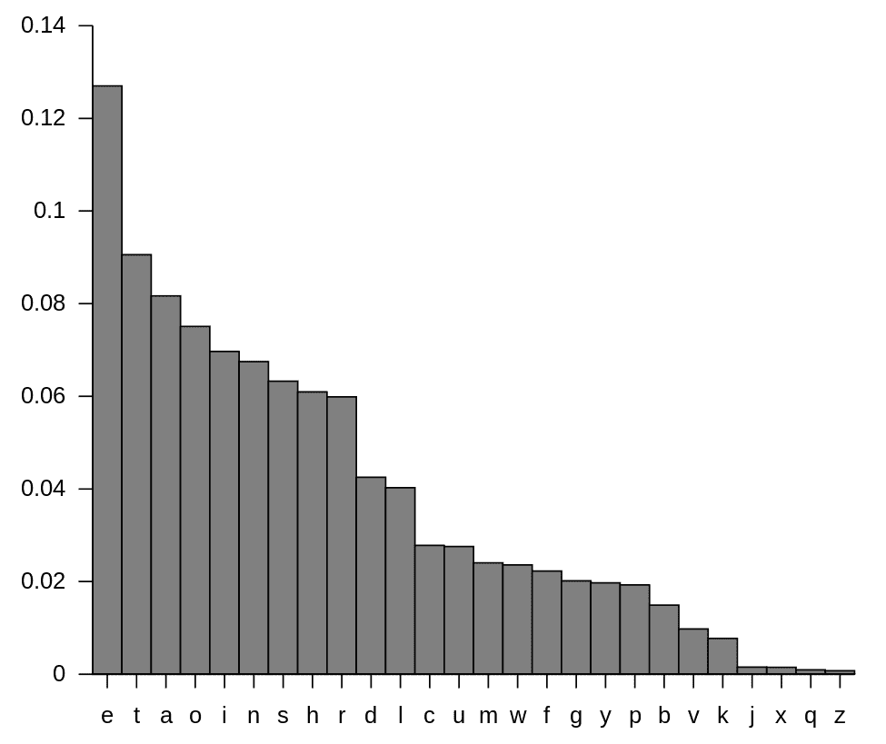

语料库中字母的概率分布

我们可以观察到字符的概率分布是非均匀的。这本质上意味着，即使由于噪声而丢失，我们也可以恢复单词中的字符。如果一个特定的字符在单词中缺失，它可以根据缺失字符周围的字符重建。缺失字符的重建不是随机进行的，而是通过选择给定缺失字符周围字符具有最高概率分布的字符来完成的。从技术上讲，句子中单词或词中字符的统计结构遵循最大熵的距离。

语言模型利用语言的统计结构来表达以下内容：

+   给定句子中的*w_1, w_2, w_3,...w_N*个词，语言模型会给这个句子分配一个概率*P(w_1, w_2, w_3,.... w_N)*。

+   然后它将下一个单词（在这种情况下为*w_4*）的概率分配为*P(w_4 | w_1, w_2, w_3)*。

语言模型使得在 NLP 中开发许多应用成为可能，以下列出其中一些：

+   **机器翻译**：P(enormous cyclone tonight) > P(gain typhoon this evening)

+   **拼写纠正**：P(satellite constellation) > P(satelitte constellation)

+   **语音识别**：P(I saw a van) > P(eyes awe of an)

+   **打字预测**：在谷歌搜索中的自动完成，打字辅助应用

现在我们来看一下如何计算单词的概率。考虑一个简单的句子，*Decembers are cold*。这个句子的概率如下表示：

*P("Decembers are cold") = P("December") * P ("are" | "Decembers") * P("cold" | "Decembers are")*

从数学上讲，句子中单词（或词中的字母）的概率计算可以表示如下：


俄罗斯数学家安德烈·马尔可夫描述了一个具有**马尔可夫属性**或**马尔可夫假设**的随机过程。这基本上意味着，人们可以仅基于过程的当前状态对未来进行预测，就像知道过程的全貌一样，因此独立于这样的历史。

基于马尔可夫的假设，我们可以将*cold*的条件概率重新写为如下：

*P("cold" | "Decembers are") 等同于 *P("cold" | "are")*

从数学上讲，马尔可夫的假设可以表示如下：


虽然这个数学公式代表了二元模型（一次考虑两个词），但它可以很容易地扩展到 n 元模型。在 n 元模型中，条件概率仅依赖于更多一些的先前词。

从数学上讲，n 元模型可以表示如下：


以埃兹拉·庞德（Ezra Pound）的著名诗歌 *A Girl* 作为我们构建 **bigram** 模型的语料库。以下就是文本语料库：

```py
The tree has entered my hands,
The sap has ascended my arms,
The tree has grown in my breast-Downward,
The branches grow out of me, like arms.
Tree you are,
Moss you are,
You are violets with wind above them.
A child - so high - you are,
And all this is folly to the world.
```

我们已经知道，在大词模型中，条件概率仅基于前一个单词来计算。因此，一个单词的概率可以按以下方式计算：


如果我们要计算在诗歌中给定单词 *my* 的条件下单词 *arms* 的概率，它是通过在诗歌中单词 *arms* 和 *my* 同时出现的次数除以单词 *my* 在诗歌中出现的次数来计算的。

我们看到，单词 *my arms* 在诗歌中只出现了一次（在句子 *The sap has ascended my arms* 中）。然而，单词 *my* 在诗歌中出现了三次（在句子 *The tree has entered my hands*，*The sap has ascended my arms* 和 *The tree has grown in my breast-Downward* 中）。

因此，给定 *my* 的条件下单词 *arms* 的条件概率是 1/3，形式上表示如下：

*P("arms" | "my") = P("arms", "my") / P("my") = 1 / 3*

为了计算第一个和最后一个单词的概率，分别在句子的开始和结尾添加了特殊标记 <BOS> 和 <EOS>。同样，可以通过乘以所有 bigram 概率来使用相同的方法计算句子或单词序列的概率。

由于语言建模涉及根据已存在的单词序列预测序列中的下一个单词，我们可以训练一个语言模型，从给定的起始序列创建序列中的后续单词。

# 探索循环神经网络

**循环神经网络**（**RNNs**）是一组用于处理序列数据的神经网络。RNN 通常用于实现语言模型。作为人类，我们的大部分语言理解都基于上下文。例如，让我们考虑句子 *Christmas falls in the month of --------*。用单词 *December* 来填补空白很容易。这里的本质思想是，关于最后一个单词的信息被编码在句子的前几个元素中。

RNN 架构背后的中心主题是利用数据的序列结构。正如其名所示，RNN 以循环的方式运行。本质上，这意味着对序列或句子中的每个元素执行相同的操作，其输出取决于当前输入和之前的操作。

RNN 通过将网络在时间 *t* 的输出与网络在时间 *t+1* 的输入循环连接来工作。这些循环允许信息从一个时间步到下一个时间步的持续。以下是一个表示 RNN 的电路图：

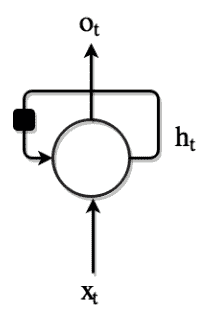

表示 RNN 的电路图

该图表示一个 RNN，它通过一个简单的循环来记住之前输入的信息。这个循环将来自上一个时间戳的信息添加到当前时间戳的输入中。在特定的时间步长*t*，*X[t]*是网络的输入，*O[t]*是网络的输出，*h[t]*是它从网络中先前节点记住的细节。在中间，有一个 RNN 单元，它包含类似于前馈网络的神经网络。

在 RNN 定义方面，一个需要深思的关键点是时间戳。定义中提到的时间戳与过去、现在和未来无关。它们只是代表序列或句子中的一个词或项目。

让我们考虑一个例子句子：*圣诞节假期棒极了*。在这个句子中，看一下以下时间戳：

+   *圣诞节*是 x[0]

+   *假期*是 x[1]

+   *是*是 x[2]；

+   *棒极了*是 x[3]

如果 t=1，那么看一下以下：

+   x[t] = *假期* → 当前时间戳的事件

+   x[t-1] = *圣诞节* → 上一个时间戳的事件

从前面的电路图中可以观察到，在 RNN 中，相同的操作在不同的节点上反复执行。图中还有一个代表单个时间步长延迟的黑方块。理解带有循环的 RNN 可能会有些困惑，所以让我们展开计算图。展开的 RNN 计算图如下所示：

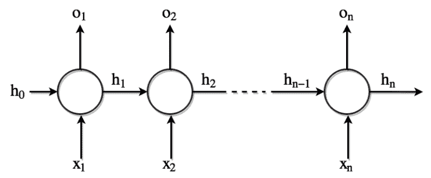

RNN—展开的计算图视图

在前面的图中，每个节点都与一个特定的时间相关联。在 RNN 架构中，每个节点在每个时间步长**x[t]**接收不同的输入。它还具有在每个时间步长**o[t]**产生输出的能力。网络还维护一个记忆状态**h[t]**，它包含关于时间*t*之前网络中发生的事情的信息。由于这是在网络的各个节点上运行的同一步骤，因此可以将整个网络以简化的形式表示，如图中 RNN 电路图所示。

现在，我们明白为什么在 RNN 中看到**循环**这个词，因为它对序列中的每个元素执行相同的任务，输出取决于之前的计算。理论上，RNN 可以利用任意长序列中的信息，但在实践中，它们被实现为只回顾几个步骤。

形式上，一个 RNN 可以用以下方程定义：


在方程中，*h[t]*是时间戳*t*处的隐藏状态。可以使用 Tanh、Sigmoid 或 ReLU 等激活函数来计算隐藏状态，并在方程中表示为![]。*W*是时间戳*t*处输入到隐藏层的权重矩阵。*X[t]*是时间戳*t*处的输入。*U*是时间戳*t-1*处的隐藏层到时间戳*t*处的隐藏层的权重矩阵，*h[t-1]*是时间戳*t*处的隐藏状态。

在反向传播过程中，RNN 通过学习*U*和*W*权重。在每个节点上，隐藏状态和当前输入的贡献由*U*和*W*决定。*U*和*W*的比例进而导致当前节点的输出生成。激活函数在 RNN 中添加了非线性，从而在反向传播过程中简化了梯度计算。以下图示展示了反向传播的概念：

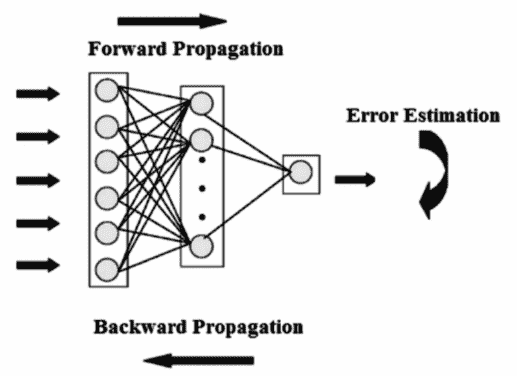

神经网络中的反向传播

以下图示展示了 RNN 的整体工作机制以及通过反向传播学习权重*U*和*W*的方式。它还展示了网络中使用*U*和*W*权重矩阵生成输出的情况，如图所示：

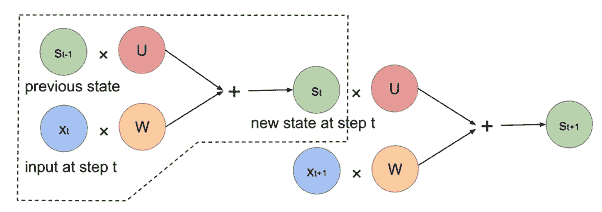

RNN 中权重的作用

# 前馈神经网络与 RNN 的比较

与其他神经网络相比，RNN 的一个基本区别在于，在所有其他网络中，输入之间是相互独立的。然而，在 RNN 中，所有输入都是相互关联的。在应用中，为了预测给定句子中的下一个单词，所有先前单词之间的关系有助于预测当前输出。换句话说，RNN 在训练过程中会记住所有这些关系。这与其他类型的神经网络不同。以下图示展示了前馈网络的表示：

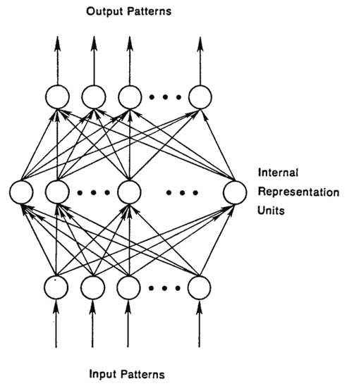

前馈神经网络架构

从前面的图中，我们可以看到前馈网络架构中不涉及任何循环。这与 RNN 电路图和 RNN 展开计算图中展示的 RNN 架构形成对比。前馈网络中的数学操作是在节点上执行的，信息直接通过，没有任何循环。

使用监督学习，输入被馈送到前馈网络后转换为输出。在这种情况下，输出可以是分类时的标签，或者回归时的数字。如果我们考虑图像分类，输入图像的标签可以是*猫*或*狗*。

前馈神经网络在标记图像上训练，直到预测标签的错误最小化。一旦训练完成，该模型能够对之前未见过的图像进行分类。一个训练好的前馈网络可以暴露于任何随机的照片集合；第一个照片的分类对模型需要分类的第二张或后续照片没有任何影响或影响。让我们通过一个例子来讨论这个问题，以便更好地理解这个概念：如果第一个图像被前馈网络识别为*狗*，这并不意味着第二个图像将被分类为*猫*。换句话说，模型得出的预测没有时间顺序的概念，标签的决定仅基于当前提供的输入。总结来说，在前馈网络中，不会使用历史预测信息来为当前预测提供信息。这与 RNN 非常不同，在 RNN 中，前一个预测被考虑是为了帮助当前预测。

另一个重要的区别是，前馈网络按设计将一个输入映射到一个输出，而 RNN 可以有多种形式：将一个输入映射到多个输出，多个输入到多个输出，或多个输入到一个输出。以下图展示了 RNN 可能实现的多种输入输出映射：


RNN 的输入输出映射可能性

让我们回顾一下使用 RNN 可能实现的输入输出映射的一些实际应用。前面图中的每个矩形都是一个向量，箭头代表函数，例如矩阵乘法。输入向量是下方的矩形（用红色着色），输出向量是上方的矩形（用蓝色着色）。中间的矩形（用绿色着色）是包含 RNN 状态的向量。

下面是图中展示的各种映射形式：

+   **一对一输入输出**：最左边的是没有使用 RNN 的普通处理模式，从固定大小的输入到固定大小的输出；例如，图像分类。

+   **一对一输入到多输出**：序列输出，例如，图像字幕将图像作为输入，然后输出一个单词句子。

+   **多输入到一对一输出**：序列输入，例如，情感分析，其中给定的句子作为输入提供给 RNN，输出是一个表示句子积极或消极情感的分类。

+   **多输入到多输出**：序列输入和序列输出；例如，对于机器翻译任务，RNN 读取英语句子作为输入，然后输出印地语或其他语言的句子。

+   **多输入到多输出**：同步序列输入和输出，例如，视频分类，我们希望为视频的每一帧进行标记。

现在我们来回顾一下前馈网络和 RNN 之间的最终区别。为了在前馈神经网络中设置权重而执行的反向传播的方式与在 RNN 中执行所谓的**时间反向传播**（**BPTT**）的方式不同。我们已经知道，神经网络中反向传播算法的目的是调整神经网络的权重，以最小化网络输出与对应输入的预期输出之间的误差。反向传播本身是一种监督学习算法，它允许神经网络根据特定错误进行纠正。反向传播算法包括以下步骤：

1.  向神经网络提供训练输入，并通过网络传播以获得输出

1.  将预测输出与实际输出进行比较，并计算误差

1.  计算误差相对于学习到的网络权重的导数

1.  修改权重以最小化误差

1.  重复

在前馈网络中，在输出仅在结束时才可用的情况下，在结束时运行反向传播是有意义的。在 RNN 中，输出在每个时间步产生，并且这种输出会影响后续时间步的输出。换句话说，在 RNN 中，一个时间步的误差取决于前一个时间步。因此，正常的反向传播算法不适用于 RNN。因此，使用称为 BPTT（时间反向传播）的不同算法来修改 RNN 中的权重。

# 时间反向传播

我们已经知道，循环神经网络（RNNs）是循环图，与无环方向图的前馈网络不同。在前馈网络中，误差导数是从上层计算的。然而，在 RNN 中，我们没有这样的层来进行误差导数计算。解决这个问题的简单方法是将 RNN 展开，使其类似于前馈网络。为了实现这一点，RNN 中的隐藏单元在每个时间步都会被复制。每个时间步的复制形成一层，类似于前馈网络中的层。每个时间步`t`层连接到时间步`t+1`中所有可能的层。因此，我们随机初始化权重，展开网络，然后使用反向传播来优化隐藏层中的权重。最低层通过传递参数进行初始化。这些参数也是作为反向传播的一部分进行优化的。时间反向传播算法包括以下步骤：

1.  向网络提供一系列输入和输出对的时序步骤

1.  展开网络，然后计算并累积每个时间步的误差

1.  收缩网络并更新权重

1.  重复

总结来说，使用 BPTT 时，错误是从最后一个时间步向后传播到第一个时间步，同时展开所有时间步。计算每个时间步的错误，这允许更新权重。以下图表是时间反向传播的可视化：

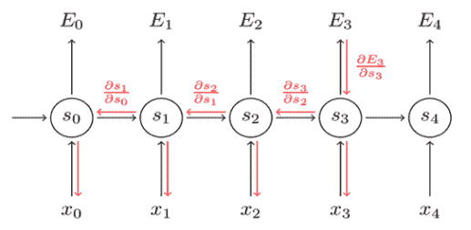

RNN 中的时间反向传播

应当注意，随着时间步数的增加，BPTT 算法的计算成本可能会变得非常高。

# RNN 中梯度的问题和解决方案

RNN 并不完美，它们有两个主要问题，即**梯度爆炸**和**梯度消失**。为了理解这些问题，我们首先了解什么是梯度。梯度是相对于其输入的偏导数。用简单的话来说，梯度衡量的是函数的输出在输入略有变化时会发生多少变化。

# 梯度爆炸

梯度爆炸与 BPTT 算法赋予权重极高重要性但缺乏合理依据的情况相关。这个问题导致网络不稳定。在极端情况下，权重的值可能会变得非常大，导致溢出并产生 NaN 值。

在训练网络时，可以通过观察以下细微迹象来检测梯度爆炸问题：

+   在训练过程中，模型权重会迅速变得非常大。

+   在训练过程中，模型权重变为 NaN 值。

+   在训练过程中，每个节点和层的错误梯度值始终大于 1.0。

有几种方法可以处理梯度爆炸问题。以下是一些流行的技术：

+   如果我们可以截断或压缩梯度，这个问题就可以轻易解决。这被称为**梯度裁剪**。

+   在训练过程中，通过减少先前时间步的权重更新也可能减少梯度爆炸问题。这种具有较少步更新技术的称为**时间截断反向传播**（**TBPTT**）。它是 BPTT 训练算法的一个修改版本，其中序列一次处理一个时间步，并且定期（*k1*时间步）对固定数量的时间步（*k2*时间步）执行 BPTT 更新。*k1*是更新之间的前向传递时间步数。*k2*是应用 BPTT 的时间步数。

+   通过检查网络权重的大小并对大权重值应用惩罚来执行权重正则化。

+   通过使用**长短期记忆单元**（**LSTMs**）或**门控循环单元**（**GRUs**）而不是普通的 RNN。

+   仔细初始化权重，如**Xavier**初始化或**He**初始化。

# 梯度消失

我们已经知道，长期依赖对于 RNN 正确运行非常重要。由于长期依赖，RNN 可能会变得太深。当激活函数的梯度非常小的时候，就会出现梯度消失问题。在反向传播过程中，当权重与低梯度相乘时，它们往往会变得非常小，并在网络中进一步消失。这使得神经网络忘记长期依赖。以下图表展示了导致梯度消失的原因：

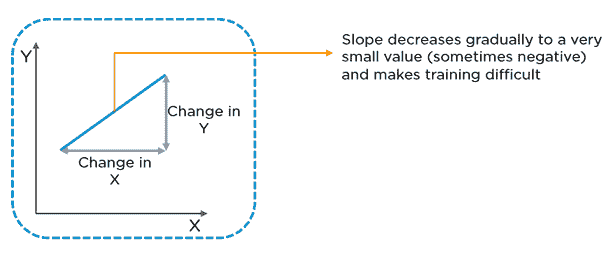

梯度消失的原因

总结来说，由于梯度消失问题，RNN 在记忆序列中非常远的先前单词时遇到困难，并且只能根据最近的单词进行预测。这可能会影响 RNN 预测的准确性。有时，模型可能无法预测或分类它应该执行的操作。

有几种方法可以处理梯度消失问题。以下是一些最流行的技术：

+   初始化网络权重为恒等矩阵，以最大限度地减少梯度消失的可能性。

+   将激活函数设置为 ReLU 而不是 `sigmoid` 或 `tanh`。这使得网络计算接近恒等函数。这效果很好，因为当错误导数在时间上向后传播时，它们保持为 0 或 1 的常数，因此不太可能遭受梯度消失问题。

+   使用 LSTM，它是常规循环网络的变体，旨在使捕获序列数据中的长期依赖变得容易。标准的 RNN 以一种方式运行，即隐藏状态激活受其附近的其他局部激活的影响，这对应于**短期记忆**，而网络权重受整个长序列中发生的计算的影响，这对应于**长期记忆**。RNN 被重新设计，使其具有可以像权重一样起作用并能够在长距离上保留信息的激活状态，因此得名 **长短期记忆**。

在 LSTM 中，而不是每个隐藏节点只是一个具有单个激活函数的节点，每个节点本身就是一个可以存储其他信息的记忆单元。具体来说，它维护自己的细胞状态。正常的 RNN 接收先前的隐藏状态和当前输入，并输出一个新的隐藏状态。LSTM 做的是同样的，但它还接收旧的细胞状态，并将输出新的细胞状态。

# 使用 RNN 构建自动散文生成器

在这个项目中，我们将尝试使用 RNN（递归神经网络）构建一个字符级语言模型，根据一些初始种子字符生成散文。字符级语言模型的主要任务是预测数据序列中所有先前字符之后的下一个字符。换句话说，RNN 的功能是逐字符生成文本。

首先，我们向 RNN 提供一大块文本作为输入，并要求它根据先前字符序列的概率分布来建模序列中下一个字符的概率分布。这些由 RNN 模型构思的概率分布将允许我们逐字符生成新文本。

构建语言模型的第一要求是确保模型可以使用它来计算各种字符的概率分布的文本语料库。输入文本语料库越大，RNN 对概率的建模就越好。

我们不需要费很大力气来获取训练 RNN 所需的庞大文本语料库。有一些经典文本（书籍），如《圣经》，可以用作语料库。最好的部分是许多经典文本已不再受版权保护。因此，这些文本可以自由下载并用于我们的模型中。

Project Gutenberg 是获取不再受版权保护的免费书籍的最佳场所。可以通过以下网址访问 Project Gutenberg：[`www.gutenberg.org`](http://www.gutenberg.org)。例如，《圣经》、《爱丽丝梦游仙境》等书籍都可以从 Project Gutenberg 获得。截至 2018 年 12 月，有 58,486 本书可供下载。这些书籍以多种格式提供，以便我们下载和使用，不仅限于本项目，还适用于任何需要大量文本语料库输入的项目。以下截图是 Project Gutenberg 的一个样本书籍及其可供下载的多种格式：


Sample book available from Project Gutenberg in various formats

无论下载的文件格式如何，Project Gutenberg 都会在实际书籍文本中添加标准的页眉和页脚文本。以下是在一本书中可以看到的页眉和页脚的示例：

```py
*** START OF THIS PROJECT GUTENBERG EBOOK ALICE'S ADVENTURES IN WONDERLAND ***

THE END
```

从 Project Gutenberg 网站下载的书籍文本中删除此页眉和页脚文本是至关重要的。对于下载的文本文件，可以在文本编辑器中打开文件并删除页眉和页脚。

对于本章的项目，让我们使用童年的最爱书籍作为文本语料库：刘易斯·卡罗尔的《爱丽丝梦游仙境》。虽然我们有从 Project Gutenberg 下载这本书的文本格式并将其用作文本语料库的选择，但 R 语言的`languageR`库使这项任务对我们来说更加容易。`languageR`库已经包含了《爱丽丝梦游仙境》的文本。在安装了`languageR`库之后，使用以下代码将文本数据加载到内存中并打印出加载的文本：

```py
# including the languageR library
library("languageR")
# loading the "Alice’s Adventures in Wonderland" to memory
data(alice)
# printing the loaded text
print(alice)
```

你将得到以下输出：

```py
[1] "ALICE"           "S"                "ADVENTURES"       "IN"               "WONDERLAND"      
[6] "Lewis"            "Carroll"          "THE"              "MILLENNIUM"       "FULCRUM"        
  [11] "EDITION"          "3"                "0"                "CHAPTER"          "I"              
  [16] "Down"             "the"              "Rabbit-Hole"      "Alice"            "was"            
  [21] "beginning"        "to"               "get"              "very"             "tired"          
  [26] "of"               "sitting"          "by"               "her"              "sister"         
  [31] "on"               "the"              "bank"             "and"              "of"             
  [36] "having"           "nothing"          "to"               "do"               "once"           
  [41] "or"               "twice"            "she"              "had"              "peeped"         
  [46] "into"             "the"              "book"             "her"              "sister"         
  [51] "was"              "reading"          "but"              "it"               "had"            
  [56] "no"         "pictures"         "or"               "conversations"    "in"              
```

从输出中我们可以看到，书籍文本存储为一个字符向量，其中向量的每个项目都是从书籍文本中通过标点符号分割出来的单词。也可能注意到，书籍文本中并没有保留所有的标点符号。

以下代码从字符向量中的单词重构句子。当然，在重构过程中，我们不会得到诸如句子边界之类的东西，因为字符向量中的标点符号没有字符向量项目那么多。现在，让我们从单个单词重构书籍文本：

```py
alice_in_wonderland<-paste(alice,collapse=" ")
print(alice_in_wonderland)
```

你将得到以下输出：

```py
[1] "ALICE S ADVENTURES IN WONDERLAND Lewis Carroll THE MILLENNIUM FULCRUM EDITION 3 0 CHAPTER I Down the Rabbit-Hole Alice was beginning to get very tired of sitting by her sister on the bank and of having nothing to do once or twice she had peeped into the book her sister was reading but it had no pictures or conversations in it and what is the use of a book thought Alice without pictures or conversation So she was considering in her own mind as well as she could for the hot day made her feel very sleepy and stupid whether the pleasure of making a daisy-chain would be worth the trouble of getting up and picking the daisies when suddenly a White Rabbit with pink eyes ran close by her There was nothing so VERY remarkable in that nor did Alice think it so VERY much out of the way to hear the Rabbit say to itself Oh dear Oh dear I shall be late when she thought it over afterwards it occurred to her that she ought to have wondered at this but at the time it all seemed quite natural but when the Rabbit actually TOOK A WATCH OUT OF ITS WAISTCOAT- POCKET and looked at it and then hurried on Alice started to her feet for it flashed across her mind that she had never before seen a rabbit with either a waistcoat-pocket or a watch to take out of it and burning with curiosity she ran across the field after it and fortunately was just in time to see it pop down a large rabbit-hole under the hedge In another moment down went Alice after it never once considering how in the world she was to get out again The rabbit-hole we .......
```

从输出中，我们可以看到一段长文本是由单词构成的。现在，我们可以继续对这段文本进行一些预处理，以便将其输入到 RNN 中，使模型学习字符之间的依赖关系以及序列中字符的条件概率。

需要注意的一件事是，与生成序列中下一个字符的字符级语言模型一样，你还可以构建一个词级语言模型。然而，字符级语言模型的优势在于它可以创建其自身的独特单词，而这些单词不在我们训练它的词汇表中。

现在，让我们学习 RNN 是如何工作的，以便理解序列中字符之间的依赖关系。假设我们只有四种可能的字母词汇，[*a*，*p*，*l*，*e*]，并且我们的目的是在训练序列*apple*上训练一个 RNN。这个训练序列实际上是四个独立的训练示例的来源：

+   在给定上下文*a*的情况下，字母*p*的概率应该是可能的，换句话说，在单词*apple*中，给定字母*a*的条件概率*p*。

+   与第一点类似，在上下文*ap*中，*p*应该是可能的。

+   在上下文*app*中，*字母 l*也应该是有可能的。

+   在上下文*appl*中，*字母 e*应该是有可能的。

我们开始使用 1-of-k 编码将单词 *apple* 中的每个字符编码成一个向量。1-of-k 编码表示单词中的每个字符都是零，除了在词汇表中字符索引处的单个 1。这样用 1-of-k 编码表示的每个字符随后通过步函数逐个输入到 RNN 中。RNN 接收这个输入并生成一个四维输出向量（每个字符一个维度，并且我们词汇表中有四个字符）。这个输出向量可以解释为 RNN 当前分配给序列中下一个字符的置信度。下面的图是 RNN 学习字符的可视化：

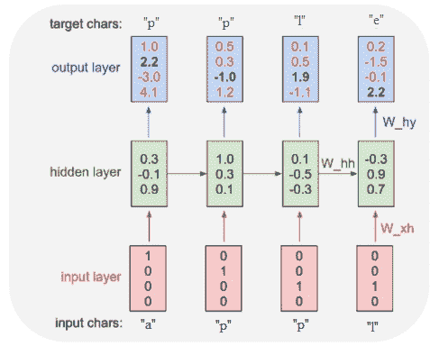

RNN 学习字符语言模型

在前面的图中，我们看到一个具有四维输入和输出层的 RNN。还有一个包含三个神经元的隐藏层。该图显示了当 RNN 接收字符 *a*、*p*、*p* 和 *l* 的输入时，正向传递中的激活情况。输出层包含 RNN 分配给每个后续字符的置信度。RNN 的期望是输出层中的绿色数字高于红色数字。绿色数字的高值使得可以根据输入预测正确的字符。

我们看到在第一次步长中，当 RNN 接收输入字符 *a* 时，它将 1.0 的置信度分配给下一个字母是 *a*，将 2.2 的置信度分配给字母 *p*，将 -3.0 分配给 *l*，将 4.1 分配给 *e*。根据我们的训练数据，我们考虑的序列是 *apple*；因此，在第一次步长中，以 *a* 作为输入时，下一个正确的字符是 *p*。我们希望我们的 RNN 在第一步（用绿色表示）中最大化置信度，并最小化所有其他字母（用红色表示）的置信度。同样，在每个四个时间步长中，我们都希望我们的 RNN 分配更高的置信度给期望的输出字符。

由于 RNN 完全由可微操作组成，我们可以运行反向传播算法来确定我们应该调整每个权重的方向，以增加正确目标（粗体绿色数字）的分数。

基于梯度方向，参数被更新，算法实际上通过一个很小的量在梯度相同方向上改变权重。理想情况下，如果梯度下降法成功运行并更新了权重，我们会看到正确选择的权重略有增加，而对于错误的字符，权重会降低。例如，我们会发现第一次步长中正确字符 *p* 的分数略有提高，比如说从 2.2 提高到 2.3。同时，字符 *a*、*l* 和 *e* 的分数会被观察到低于梯度下降之前分配的分数。

在 RNN 中，通过梯度下降更新参数的过程会重复多次，直到网络收敛，换句话说，直到预测与训练数据一致。

从技术角度来说，我们同时对每个输出向量运行标准的 softmax 分类器，也称为交叉熵损失。RNN 通过小批量随机梯度下降或自适应学习率方法（如 RMSProp 或 Adam）进行训练，以稳定更新。

你可能会注意到，当第一次输入字符*p*时，输出是*p*；然而，当相同的输入第二次被输入时，输出是*l*。因此，RNN 不能仅依赖于给定的输入。这就是 RNN 使用其循环连接来跟踪上下文以执行任务并做出正确预测的地方。没有上下文，网络要预测特定的正确输出将会非常困难。

当我们必须使用训练好的 RNN 模型生成文本时，我们将种子输入字符提供给网络，并得到关于下一个可能出现的字符的分布。然后从这个分布中进行采样，并将其反馈回网络，以获取下一个字母。这个过程会重复，直到达到最大字符数（直到达到特定用户定义的字符长度），或者直到模型遇到行尾字符，如<EOS>或<END>。

# 实施项目

现在我们知道了 RNN 如何构建字符级模型，让我们通过 RNN 实现项目，生成我们自己的单词和句子。通常，RNN 训练计算量很大，建议我们在**图形处理单元**（**GPU**）上运行代码。然而，由于基础设施限制，我们不会在项目代码中使用 GPU。`mxnet`库允许字符级语言模型（带有 RNN）在 CPU 上执行，因此让我们开始编写我们的项目代码：

```py
# including the required libraries
library("readr")
library("stringr")
library("stringi")
library("mxnet")
library("languageR")
```

要使用`languageR`库的《爱丽丝梦游仙境》书籍文本并将其加载到内存中，请使用以下代码：

```py
data(alice)
```

接下来，我们将测试数据转换为特征向量，并将其输入到 RNN 模型中。`make_data`函数读取数据集，清除任何非字母数字字符，将其拆分为单个字符，并将其分组为长度为`seq.len`的序列。在这种情况下，`seq.len`设置为`100`：

```py
make_data <- function(txt, seq.len = 32, dic=NULL) {
  text_vec <- as.character(txt)
  text_vec <- stri_enc_toascii(str = text_vec)
  text_vec <- str_replace_all(string = text_vec, pattern = "[^[:print:]]", replacement = "")
  text_vec <- strsplit(text_vec, '') %>% unlist
  if (is.null(dic)) {
    char_keep <- sort(unique(text_vec))
  } else char_keep <- names(dic)[!dic == 0]
```

要删除字典中不存在的术语，请使用以下代码：

```py
text_vec <- text_vec[text_vec %in% char_keep]
```

要构建字典并通过`-1`调整它以具有`1-lag`标签，请使用以下代码：

```py
dic <- 1:length(char_keep)
 names(dic) <- char_keep
 # reversing the dictionary
 rev_dic <- names(dic)
 names(rev_dic) <- dic
 # Adjust by -1 to have a 1-lag for labels
 num.seq <- (length(text_vec) - 1) %/% seq.len
 features <- dic[text_vec[1:(seq.len * num.seq)]]
 labels <- dic[text_vec[1:(seq.len*num.seq) + 1]]
 features_array <- array(features, dim = c(seq.len, num.seq))
 labels_array <- array(labels, dim = c(seq.len, num.seq))
 return (list(features_array = features_array, labels_array = labels_array, dic = dic, rev_dic
 = rev_dic))
 }
```

将序列长度设置为`100`，然后从`alice`数据字符向量中构建长文本序列。接着在`alice_in_wonderland`文本文件上调用`make_data()`函数。观察`seq.ln`和空字典作为输入。`seq.ln`决定了上下文，即 RNN 需要回溯多少个字符来生成下一个字符。在训练过程中，`seq.ln`被用来获取正确的权重：

```py
seq.len <- 100
 alice_in_wonderland<-paste(alice,collapse=" ")
 data_prep <- make_data(alice_in_wonderland, seq.len = seq.len, dic=NULL)
```

要查看准备好的数据，使用以下代码：

```py
print(str(data_prep))
```

这将给出以下输出：

```py
> print(str(data_prep))
List of 4
 $ features_array: int [1:100, 1:1351] 9 31 25 13 17 1 45 1 9 15 ...
 $ labels_array  : int [1:100, 1:1351] 31 25 13 17 1 45 1 9 15 51 ...
 $ dic           : Named int [1:59] 1 2 3 4 5 6 7 8 9 10 ...
  ..- attr(*, "names")= chr [1:59] " " "-" "[" "]" ...
 $ rev_dic       : Named chr [1:59] " " "-" "[" "]" ...
  ..- attr(*, "names")= chr [1:59] "1" "2" "3" "4" ...
```

要查看`features`数组，使用以下代码：

```py
# Viewing the feature array
View(data_prep$features_array)
```

这将给出以下输出：

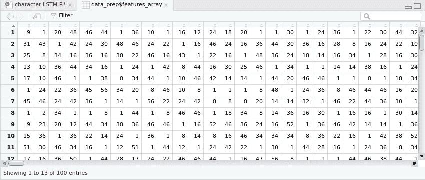

要查看`labels`数组，使用以下代码：

```py
# Viewing the labels array
View(data_prep$labels_array)
```

你将得到以下输出：

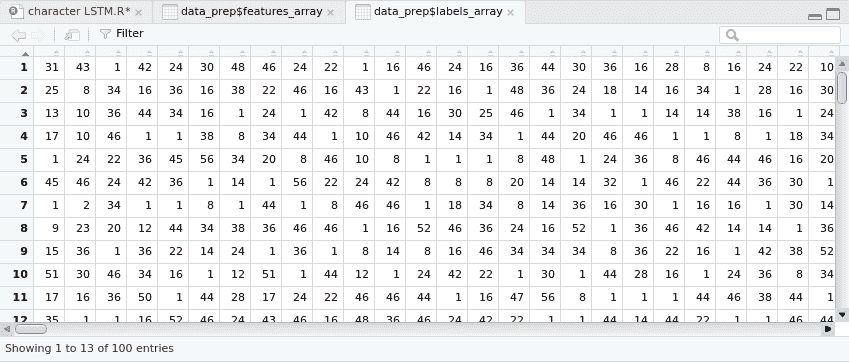

现在，让我们打印字典，它包括唯一的字符，使用以下代码：

```py
# printing the dictionary - the unique characters
print(data_prep$dic)
```

你将得到以下输出：

```py
> print(data_prep$dic)
    -  [  ]  *  0  3  a  A  b  B  c  C  d  D  e  E  f  F  g  G  h  H  i  I  j  J  k  K  l  L  m  M  n  N  o  O  p
 1  2  3  4  5  6  7  8  9 10 11 12 13 14 15 16 17 18 19 20 21 22 23 24 25 26 27 28 29 30 31 32 33 34 35 36 37 38
 P  q  Q  r  R  s  S  t  T  u  U  v  V  w  W  x  X  y  Y  z  Z
39 40 41 42 43 44 45 46 47 48 49 50 51 52 53 54 55 56 57 58 59
```

使用以下代码打印字符的索引：

```py
# printing the indexes of the characters
print(data_prep$rev_dic)
```

这将给出以下输出：

```py
  1   2   3   4   5   6   7   8   9  10  11  12  13  14  15  16  17  18  19  20  21  22  23  24  25  26  27  28
" " "-" "[" "]" "*" "0" "3" "a" "A" "b" "B" "c" "C" "d" "D" "e" "E" "f" "F" "g" "G" "h" "H" "i" "I" "j" "J" "k"
 29  30  31  32  33  34  35  36  37  38  39  40  41  42  43  44  45  46  47  48  49  50  51  52  53  54  55  56
"K" "l" "L" "m" "M" "n" "N" "o" "O" "p" "P" "q" "Q" "r" "R" "s" "S" "t" "T" "u" "U" "v" "V" "w" "W" "x" "X" "y"
 57  58  59
"Y" "z" "Z"
```

使用以下代码块获取特征和标签以训练模型，将数据分成 90:10 的训练和评估比例：

```py
X <- data_prep$features_array
Y <- data_prep$labels_array
dic <- data_prep$dic
rev_dic <- data_prep$rev_dic
vocab <- length(dic)
samples <- tail(dim(X), 1)
train.val.fraction <- 0.9
X.train.data <- X[, 1:as.integer(samples * train.val.fraction)]
X.val.data <- X[, -(1:as.integer(samples * train.val.fraction))]
X.train.label <- Y[, 1:as.integer(samples * train.val.fraction)]
X.val.label <- Y[, -(1:as.integer(samples * train.val.fraction))]
train_buckets <- list("100" = list(data = X.train.data, label = X.train.label))
eval_buckets <- list("100" = list(data = X.val.data, label = X.val.label))
train_buckets <- list(buckets = train_buckets, dic = dic, rev_dic = rev_dic)
eval_buckets <- list(buckets = eval_buckets, dic = dic, rev_dic = rev_dic)
```

使用以下代码创建训练和评估数据集的迭代器：

```py
vocab <- length(eval_buckets$dic)
batch.size <- 32
train.data <- mx.io.bucket.iter(buckets = train_buckets$buckets, batch.size = batch.size, data.mask.element = 0, shuffle = TRUE)
eval.data <- mx.io.bucket.iter(buckets = eval_buckets$buckets, batch.size = batch.size,data.mask.element = 0, shuffle = FALSE)
```

创建一个多层 RNN 模型以从字符级语言模型中采样。它有一个一对一的模型配置，因为对于每个字符，我们想要预测下一个字符。对于长度为`100`的序列，也有`100`个标签，对应相同的字符序列，但偏移量为+1。参数的`output_last_state`设置为`TRUE`，这是为了在推理时访问 RNN 单元的状态，我们可以看到使用了`lstm`单元。

```py
rnn_graph_one_one <- rnn.graph(num_rnn_layer = 3,
                               num_hidden = 96,
                               input_size = vocab,
                               num_embed = 64,
                               num_decode = vocab,
                               dropout = 0.2,
                               ignore_label = 0,
                               cell_type = "lstm",
                               masking = F,
                               output_last_state = T,
                               loss_output = "softmax",
                               config = "one-to-one")
```

使用以下代码可视化 RNN 模型：

```py
graph.viz(rnn_graph_one_one, type = "graph",
          graph.height.px = 650, shape=c(500, 500))
```

以下图表显示了结果输出：


现在，使用以下代码行将 CPU 设置为执行代码的设备：

```py
devices <- mx.cpu()
```

然后，通过 Xavier 初始化器初始化网络的权重：

```py
initializer <- mx.init.Xavier(rnd_type = "gaussian", factor_type = "avg", magnitude = 3)
```

使用`adadelta`优化器通过学习过程更新网络中的权重：

```py
optimizer <- mx.opt.create("adadelta", rho = 0.9, eps = 1e-5, wd = 1e-8,
                           clip_gradient = 5, rescale.grad = 1/batch.size)
```

使用以下代码行设置指标记录并定义一个自定义测量函数：

```py
logger <- mx.metric.logger()
epoch.end.callback <- mx.callback.log.train.metric(period = 1, logger = logger)
batch.end.callback <- mx.callback.log.train.metric(period = 50)
mx.metric.custom_nd <- function(name, feval) {
  init <- function() {
    c(0, 0)
  }
  update <- function(label, pred, state) {
    m <- feval(label, pred)
    state <- c(state[[1]] + 1, state[[2]] + m)
    return(state)
  }
  get <- function(state) {
    list(name=name, value = (state[[2]] / state[[1]]))
  }
  ret <- (list(init = init, update = update, get = get))
  class(ret) <- "mx.metric"
  return(ret)
}
```

**困惑度**是衡量预测模型变化性的一个指标。如果困惑度是预测错误的度量，定义一个函数来计算错误，使用以下代码行：

```py
mx.metric.Perplexity <- mx.metric.custom_nd("Perplexity", function(label, pred) {
  label <- mx.nd.reshape(label, shape = -1)
  label_probs <- as.array(mx.nd.choose.element.0index(pred, label))
  batch <- length(label_probs)
  NLL <- -sum(log(pmax(1e-15, as.array(label_probs)))) / batch
  Perplexity <- exp(NLL)
  return(Perplexity)
}
```

使用以下代码执行模型创建，你将看到在这个项目中我们运行了 20 次迭代：

```py
model <- mx.model.buckets(symbol = rnn_graph_one_one,
                          train.data = train.data, eval.data = eval.data,
                          num.round = 20, ctx = devices, verbose = TRUE,
                          metric = mx.metric.Perplexity,
                          initializer = initializer,
   optimizer = optimizer,
                          batch.end.callback = NULL,
                          epoch.end.callback = epoch.end.callback)
```

这将给出以下输出：

```py
Start training with 1 devices
[1] Train-Perplexity=23.490355102639
[1] Validation-Perplexity=17.6250266989171
[2] Train-Perplexity=14.4508382001841
[2] Validation-Perplexity=12.8179427398927
[3] Train-Perplexity=10.8156810097278
[3] Validation-Perplexity=9.95208184606089
[4] Train-Perplexity=8.6432934902383
[4] Validation-Perplexity=8.21806492033906
[5] Train-Perplexity=7.33073759154393
[5] Validation-Perplexity=7.03574648385079
[6] Train-Perplexity=6.32024660528852
[6] Validation-Perplexity=6.1394327776089
[7] Train-Perplexity=5.61888374338248
[7] Validation-Perplexity=5.59925324885983
[8] Train-Perplexity=5.14009899947491]
[8] Validation-Perplexity=5.29671693342219
[9] Train-Perplexity=4.77963053659987
[9] Validation-Perplexity=4.98471501141549
[10] Train-Perplexity=4.5523402301526
[10] Validation-Perplexity=4.84636357676712
[11] Train-Perplexity=4.36693337145912
[11] Validation-Perplexity=4.68806078057635
[12] Train-Perplexity=4.21294955131918
[12] Validation-Perplexity=4.53026345109037
[13] Train-Perplexity=4.08935886339982
[13] Validation-Perplexity=4.50495393289961
[14] Train-Perplexity=3.99260373800419
[14] Validation-Perplexity=4.42576079641165
[15] Train-Perplexity=3.91330125104996
[15] Validation-Perplexity=4.3941619024578
[16] Train-Perplexity=3.84730588206837
[16] Validation-Perplexity=4.33288830915229
[17] Train-Perplexity=3.78711049085869
[17] Validation-Perplexity=4.28723362252784
[18] Train-Perplexity=3.73198720637659
[18] Validation-Perplexity=4.22839393379393
[19] Train-Perplexity=3.68292148768833
[19] Validation-Perplexity=4.22187018296206
[20] Train-Perplexity=3.63728269095417
[20] Validation-Perplexity=4.17983276293299
```

接下来，保存模型以供以后使用，然后从磁盘加载模型以进行推理和逐字符采样文本，最后使用以下代码将预测的字符合并成一个句子：

```py
mx.model.save(model, prefix = "one_to_one_seq_model", iteration = 20)
# the generated text is expected to be similar to the training data
set.seed(0)
model <- mx.model.load(prefix = "one_to_one_seq_model", iteration = 20)
internals <- model$symbol$get.internals()
sym_state <- internals$get.output(which(internals$outputs %in% "RNN_state"))
sym_state_cell <- internals$get.output(which(internals$outputs %in% "RNN_state_cell"))
sym_output <- internals$get.output(which(internals$outputs %in% "loss_output"))
symbol <- mx.symbol.Group(sym_output, sym_state, sym_state_cell)
```

使用以下代码提供种子字符以开始文本：

```py
infer_raw <- c("e")
infer_split <- dic[strsplit(infer_raw, '') %>% unlist]
infer_length <- length(infer_split)
infer.data <- mx.io.arrayiter(data = matrix(infer_split), label = matrix(infer_split), batch.size = 1, shuffle = FALSE)
infer <- mx.infer.rnn.one(infer.data = infer.data,
                          symbol = symbol,
                          arg.params = model$arg.params,
                          aux.params = model$aux.params,
                          input.params = NULL,
                          ctx = devices)
pred_prob <- as.numeric(as.array(mx.nd.slice.axis(infer$loss_output, axis = 0, begin = infer_length-1, end = infer_length)))
pred <- sample(length(pred_prob), prob = pred_prob, size = 1) - 1
predict <- c(predict, pred)
for (i in 1:200) {
  infer.data <- mx.io.arrayiter(data = as.matrix(pred), label = as.matrix(pred), batch.size = 1,
shuffle = FALSE) 
  infer <- mx.infer.rnn.one(infer.data = infer.data,
                            symbol = symbol,
                            arg.params = model$arg.params,
                            aux.params = model$aux.params,
                            input.params = list(rnn.state = infer[[2]],
                            rnn.state.cell = infer[[3]]),
                            ctx = devices)
  pred_prob <- as.numeric(as.array(infer$loss_output))
  pred <- sample(length(pred_prob), prob = pred_prob, size = 1, replace = T) - 1
  predict <- c(predict, pred)
}
```

使用以下代码行来打印预测的文本，在处理预测字符并将它们合并成一个句子之前：

```py
predict_txt <- paste0(rev_dic[as.character(predict)], collapse = "")
predict_txt_tot <- paste0(infer_raw, predict_txt, collapse = "")
# printing the predicted text
print(predict_txt_tot)
```

这将给出以下输出：

```py
[1] "eNAHare I eat and in Heather where and fingo I ve next feeling or fancy to livery dust a large pived as a pockethion What isual child for of cigstening to get in a strutching voice into saying she got reaAlice glared in a Grottle got to sea-paticular and when she heard it would heard of having they began whrink bark of Hearnd again said feeting and there was going to herself up it Then does so small be THESE said Alice going my dear her before she walked at all can t make with the players and said the Dormouse sir your mak if she said to guesss I hadn t some of the crowd and one arches how come one mer really of a gomoice and the loots at encand something of one eyes purried asked to leave at she had Turtle might I d interesting tone hurry of the game the Mouse of puppled it They much put eagerly"
```

从输出中我们可以看到，我们的 RNN 能够自动生成文本。当然，生成的文本并不非常连贯，需要一些改进。我们可以依赖几种技术来提高连贯性，并从 RNN 生成更有意义的文本。以下是一些这些技术：

+   实现一个词级语言模型而不是字符级语言模型。

+   使用更大的 RNN 网络。

+   在我们的项目中，我们使用了 LTSM 单元来构建我们的 RNN。我们本可以使用更先进的 GRU 单元而不是 LSTM 单元。

+   我们运行了 20 次 RNN 训练迭代；这可能太少，无法得到正确的权重。我们可以尝试增加迭代次数，并验证 RNN 是否能产生更好的预测。

+   当前模型使用了 20%的 dropout。这可以改变以检查对整体预测的影响。

+   我们的语料库保留了很少的标点符号；因此，我们的模型在生成文本时没有预测标点符号作为字符的能力。在 RNN 训练的语料库中包含标点符号可能会产生更好的句子和单词结尾。

+   `seq.ln`参数决定了在预测下一个字符之前需要查找历史中的字符数量。在我们的模型中，我们将此设置为 100。这可能需要改变以检查模型是否产生更好的单词和句子。

由于空间和时间限制，我们不会在本章尝试这些选项。感兴趣的读者可以通过实验这些选项来使用字符 RNN 生成更好的单词和句子。

# 摘要

本章的主要主题是使用 RNN 自动生成文本。我们以关于语言模型及其在现实世界中的应用的讨论开始本章。然后，我们对循环神经网络及其在语言模型任务中的适用性进行了深入概述。讨论了传统前馈网络和 RNN 之间的差异，以更清楚地理解 RNN。然后，我们讨论了 RNN 经历的梯度爆炸和梯度消失问题及其解决方案。在获得 RNN 的详细理论基础后，我们继续实现了一个使用 RNN 的字符级语言模型。我们使用《爱丽丝梦游仙境》作为文本语料库输入来训练 RNN 模型，然后生成一个字符串作为输出。最后，我们讨论了一些改进我们的字符 RNN 模型的想法。

想必在玩老虎机时实施一个能让你更常赢的项目怎么样？这正是本书倒数第二章将要探讨的内容。第九章的标题是《用强化学习赢得老虎机》。来吧，让我们一起学习如何赚取免费的钱。
