# 第三章：在 FreeCAD 中设计机器人底盘

我们一直在谈论构建机器人，但如何制作一个**底盘**？你将如何设计一个足够简单，适合第一次构建的底盘？制作定制的底盘比购买现成的底盘需要更多的工作，但这是一种值得学习的技能。

在本章中，你将了解如何使用 FreeCAD 为底盘、其部件及其框架制作 3D 设计。我们将考虑我们将使用的材料以及我们需要对其进行的调整。

然后，你将把这个**CAD**设计带入现实世界，制作可打印的图纸，我们将在后面的章节中使用这些图纸来切割我们的机器人部件。你将学习并使用设计技能来制作机器人设计。

在本章中，我们将涵盖以下主题：

+   介绍 FreeCAD

+   在 FreeCAD 中制作机器人底盘草图

+   设计滚轮放置

+   从草图建模底盘部件

+   制作 FreeCAD 技术图纸

# 技术要求

FreeCAD 是免费软件。本章不需要任何付费软件，使其对广大受众都有用。

你将需要以下内容：

+   从 [freecadweb.org](http://freecadweb.org) 下载 FreeCAD 软件版本 0.20 或更高版本。

+   你的纸板测试适配。

本章的 FreeCAD 设计示例可在 GitHub 上找到：[`github.com/PacktPublishing/Robotics-at-Home-with-Raspberry-Pi-Pico/tree/main/ch-03`](https://github.com/PacktPublishing/Robotics-at-Home-with-Raspberry-Pi-Pico/tree/main/ch-03)。

# 介绍 FreeCAD

FreeCAD 是一个免费且开源的**3D CAD 设计**工具，可在大多数家用计算机平台上使用。在本节中，我们将向您介绍该软件并配置它以满足我们的需求。

如果你还没有安装，请在继续之前下载并安装 FreeCAD。如果你能使用全屏模式来适应所有工具栏和面板，我建议你使用全屏模式。

## FreeCAD 屏幕

我们将从你需要使用 FreeCAD 的概念开始。

让我们从启动 FreeCAD 时看到的屏幕概述开始：

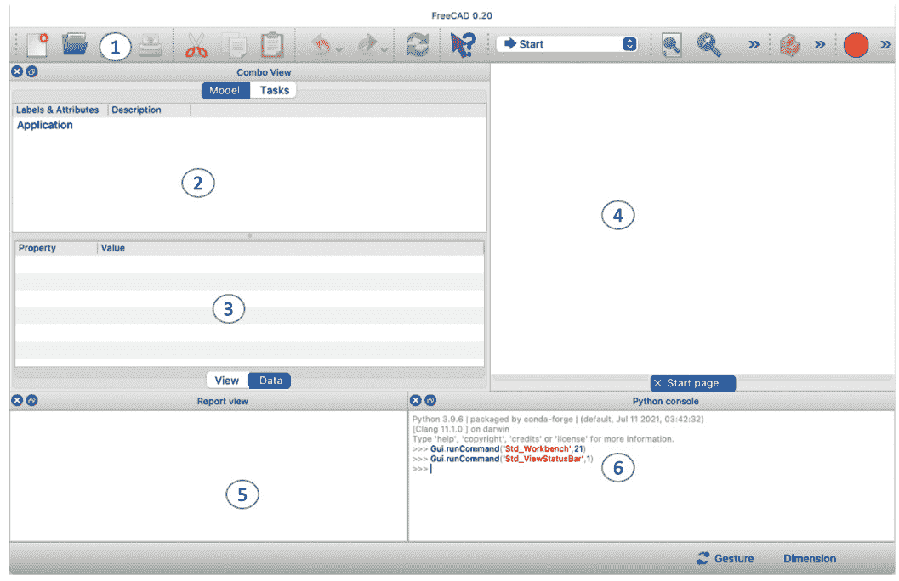

图 3.1 – FreeCAD 启动窗口

上述截图显示了 FreeCAD 的启动屏幕。重要区域如下：

1.  工具栏是一系列随着工作台变化的按钮。

1.  **组合**视图有两种模式：**模型**，显示模型树，和**任务**，显示与选择相关的任务。

1.  **属性**视图允许你查看和编辑属性。它仅在**模型**视图中可见。

1.  **主视图**显示你正在工作的草图、部件或装配体。

1.  **报告视图**显示系统输出的消息。

1.  **Python** 控制台显示与你的操作等价的 Python 代码。

你将使用这些视图来制作部件。在下一节中，我们将查看工作台，这是你有效使用 FreeCAD 所必需的。

## 选择工作台

FreeCAD 有许多对象类型——例如，零件、草图和图纸。**工作台**有操作来操纵和创建不同类型的对象。当你更改工作台时，工具栏和视图会改变。

让我们更详细地看看工具栏中的**工作台选择器**：

图 3.2 – 工作台选择器

*图 3.2*显示了**工作台选择器**部分。在左侧是此选择器在工具栏中的外观。点击此按钮将显示一个包含选项的扩展菜单，部分显示在右侧。这里突出显示的是**零件设计**、**草图**和**技术绘图**，这是我们将在本章中使用的工作台。以下是它们功能的快速概述：

+   **草图**是你输入 2D 几何图形以创建零件的地方。

+   **零件设计**用于根据草图设计 3D 零件。

+   **TechDraw**用于生成切割/钻孔的输出图纸。

重要提示

在**零件设计**工作台下方直接是**零件**工作台。它们看起来很相似。避免不小心选择**零件**而不是**零件设计**。

在使用 FreeCAD 时，请注意你正在使用的工作台。工具栏和你可以执行的操作会根据你的工作台选择而改变。

随着你使用它们，你会看到更多的工具台。我们将首先配置 FreeCAD。

## FreeCAD 设置

在开始之前，我们应该使 FreeCAD 的设置保持一致。

### 加载工作台

FreeCAD 不会加载所有工作台启动。因此，我们应该确保在我们继续之前，我们将使用的工作台已加载。

你可以通过**编辑**，然后**预设**——或者在 macOS 上**FreeCAD**，然后**预设**来访问**预设**面板。你应该会看到类似以下的内容：

图 3.3 – 预设面板：加载工作台

*图 3.3*显示了**预设**面板，其中选择了**工作台**面板。你可以通过以下步骤加载工作台：

1.  在**预设**面板中，点击**工作台**。

1.  点击**立即加载**按钮，位于**零件设计**、**草图**和**技术绘图**旁边。

1.  现在，检查这三个草图中的每个**自动加载**复选框。

1.  按下**应用**按钮。应该会出现三个额外的工作台。

其他预设将使事情更加一致。

### 显示预设

显示预设确保你的视图和导航方式与本章中的一致。请查看以下**预设**面板：

图 3.4 – 预设面板

*图 3.4*的左侧显示了**显示**预设。执行以下步骤：

1.  在**预设**面板中，点击**显示**然后选择**导航**标签。

1.  确保导航立方体已启用，并且其**角**位于**右上角**。

1.  将**3D 导航**系统设置为**手势**。手势导航非常适合鼠标、轨迹球和触摸板。

1.  我们还需要准备**草图绘制器**首选项。这些首选项会改变二维绘图模式的工作方式。在**首选项**下选择**草图绘制器**面板，以显示**图 3**.4*右侧的面板。

1.  确保**自动删除冗余**已启用。这将删除冗余约束并防止以后发生冲突。我们将在本章后面解释约束。

1.  单击**确定**以接受这些设置。

设置就绪后，我们可以开始创建草图。在下一节中，我们将创建一个文档并开始在其中绘制。

# 在 FreeCAD 中制作机器人底盘草图

我们将建模我们的机器人，回顾测试拟合草图，然后在三维中建模以指导切割底盘和安装部件。我们将部件建模为带有外部尺寸和所需螺丝孔的箱体。这样，我们就可以在不添加细节的情况下看到东西将放在哪里。我们的目标是这个：

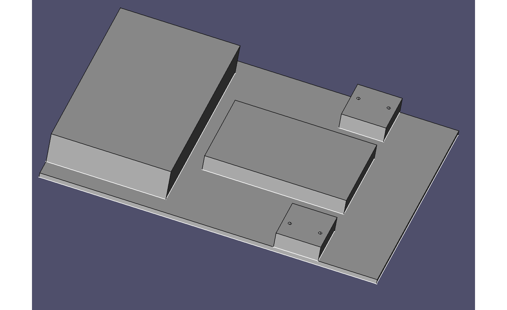

图 3.5 – 适合我们机器人的 3D CAD 箱体边界框

*图 3**.5* 展示了一个在箱体中的机器人模型。部件通过绘制矩形并拉入三维空间来建模。然后我们可以用这个作为指导来切割底盘板，然后组装底盘。

我们将首先绘制我们的机器人，然后在后面的章节中将其发展成三维部件。

## 准备文档

在 FreeCAD 中创建的一切都始于创建文档。以下截图显示了如何操作：

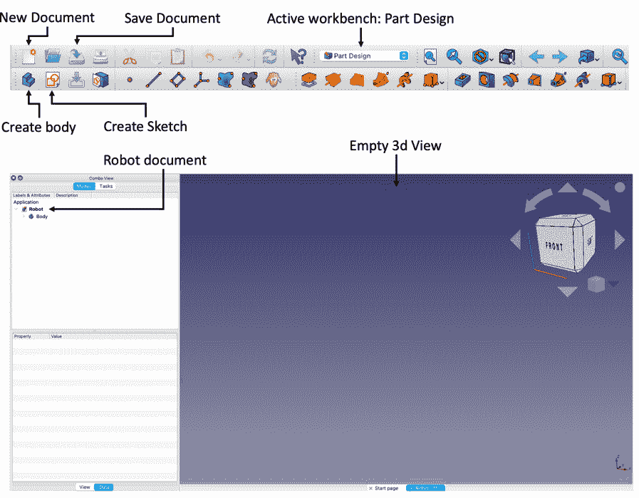

图 3.6 – 创建文档

*图 3**.6*显示了 FreeCAD 的注释截图。按照以下步骤开始：

1.  从**工作台**菜单中选择**Part Design**以进入此工作台。工具栏将类似于*图 3**.6*的顶部。

1.  通过单击工具栏图标创建新文档。您将看到一个空的三维视图，如图*图 3**.6*下方的截图所示。

1.  **Part Design** 3D 实体对象是一个**体**。在工具栏中单击**创建体**。

1.  将此文档保存为`Robot`—模型视图中名称已更改。

我们将有一些体，因此给它们命名是个好主意。首先，确保你有`Body`；我们应该将其重命名为更有意义的东西。按照以下步骤重命名：

1.  通过单击选择`Body`。

1.  按*Enter*键使其名称可编辑。

1.  输入新名称，`SketchMain`。按*Enter*键接受，体名称应更新。

1.  使用**保存**按钮或按*Ctrl*/*Cmd* + *S*保存此文档。

我们有一个空体，但我们需要在其中创建一些形状。我们将通过为它们创建主要草图并将它们拉入三维空间来完成此操作。让我们看看如何绘制草图。

## 绘制底盘轮廓

草图绘制是 FreeCAD 工作流程的关键部分。我们将从底盘部件的主要草图开始，并使用它们在三维中进行建模。如图*图 3**.6*所示，单击**创建草图**工具栏图标。

文档视图现在在右上角有一个导航立方体——它显示我们正在查看 3D 系统的哪一侧。以下图示显示了如何导航到这里：

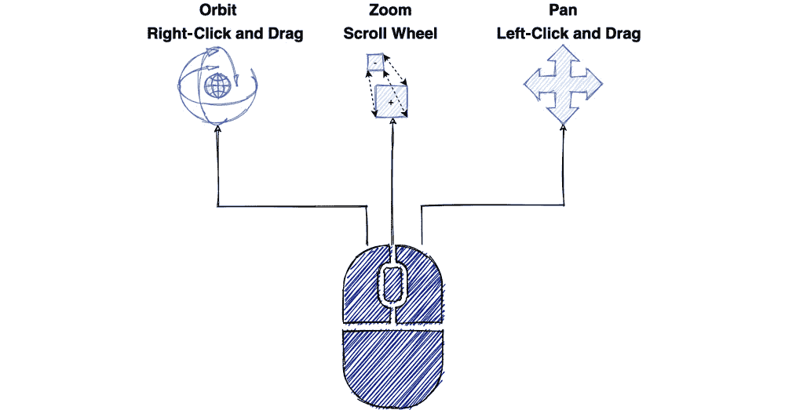

图 3.7 – 3D 手势导航

*图 3.7*显示了 3D 手势导航。按住鼠标左键并拖动以在 3D 中环绕/旋转相机。滚动鼠标滚轮以放大和缩小模型。使用鼠标右键进行平移，上下左右移动相机。你可以点击导航立方体的面来查看模型的不同的视图。

FreeCAD 正在等待你选择一个草图平面，如图所示：

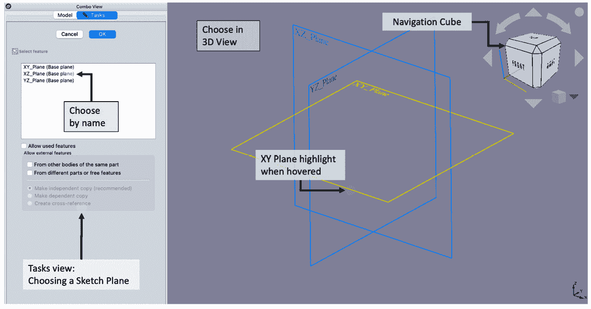

图 3.8 – 选择草图平面

*图 3.8*显示了一个选择平面的对话框，这是一个用于草图的平面表面。FreeCAD 要求你选择一个用于草图的表面。你有两种选择它的方法：

+   左侧的**任务**视图显示了一个基础平面选择列表。

+   你可以在 3D 视图中选择平面表面或平面。

对于这个草图，选择`XY_Plane`。这是水平平面。

重要提示

如果你发现很难选择东西，请注意，当你将鼠标悬停在 FreeCAD 对象附近时，它们会高亮显示，然后你点击来选择它们。这个悬停/点击操作对于选择至关重要。

点击**确定**进入**草图**工作台，如图所示：

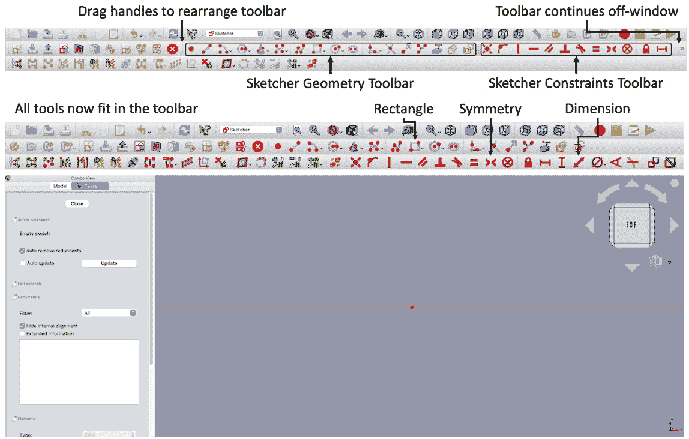

图 3.9 – 草图工作台

*图 3.9*显示了**草图**屏幕元素。顶部是工具栏。我们将主要使用两个工具栏——**草图几何**用于创建形状和线条，以及**草图约束**用于放置几何图形。工具栏的默认排列将项目放置在屏幕外，如图顶右所示。然而，我们可以拖动工具栏来重新排列它们，以便查看所有工具栏，如图中第二个工具栏截图所示。

第二个工具栏截图突出了**矩形**、**对称**和**尺寸**工具。我们将在以下部分使用这些工具。

在此之下，左侧的**任务**面板列出了约束和草图组件。右侧是主要的草图视图。导航立方体显示我们正在查看**顶部**的视图。*x*和*y*轴以十字交叉的形式划分屏幕。

让我们使用这些工具来绘制我们的底盘。按照以下步骤操作：

1.  在几何工具栏中点击**矩形**工具，如图 3.9*所示。

1.  创建一个穿过中心线的矩形——点击一次以放置一个角，然后再次点击以放置对角。它应该看起来像以下截图：

图 3.10 – 草图矩形

*图 3.10*的右侧显示了矩形。左侧的草图任务栏有**约束**和**元素**部分。元素是可以绘制的项目，例如线条。

Sketcher 使用 **约束** 来定位几何形状。这里，有八个约束：

+   其中四个带有中间点的十字；这些约束使矩形线端重合，因此它们相连。

+   另外四个约束两条水平线和两条垂直线。

让我们添加更多约束以定位和调整这个几何形状。

在*第一章*，“使用 Raspberry Pi Pico 计划机器人”，我们在测试适配中建议了 150 mm x 200 mm。看看下一个截图，了解如何调整矩形的大小：

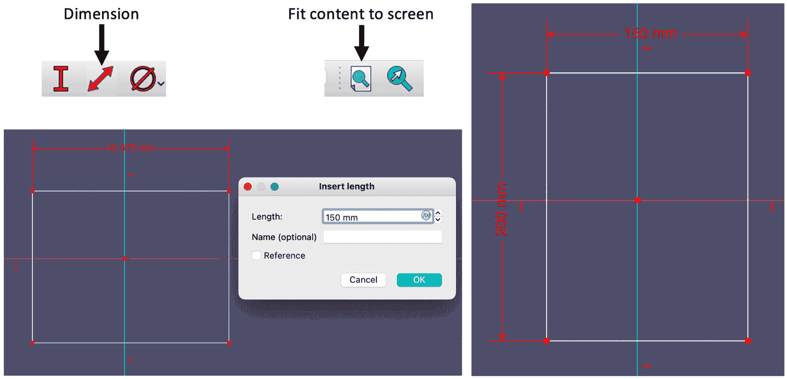

图 3.11 – 添加维度

*图 3**.11* 显示了将尺寸约束添加到矩形中。按照以下步骤添加约束：

1.  右键单击以放下 **矩形** 工具。右键单击放下您当前的工具。

1.  将鼠标悬停在顶部线上，使其变为黄色，然后点击将其变为绿色。

1.  使用 `150 mm`，然后按 *Enter*。

1.  如果东西没有在屏幕上显示，请使用 **调整内容以** **屏幕** 按钮。

1.  将右线标注为 200 mm。

小线条图标表示垂直或水平约束。FreeCAD 在您添加矩形时自动创建它们。

矩形有尺寸但不是完全约束的，它可以移动，因此我们需要将其锚定。

下一个序列显示了如何将其固定到原点：

图 3.12 – 添加对称性

*图 3**.12* 中的序列显示了如何向您的矩形添加对称性。上一个截图显示了 **对称** 按钮——左侧显示选择三个点，而右侧显示一个完全约束且具有对称性的草图。按照以下步骤：

1.  选择左上角点、右下角点和轴交叉处的中间点。

1.  点击 **对称** 以添加对称约束。

1.  当您这样做时，草图会改变颜色以显示草图已完全约束。点相对于原点被锁定。

**任务**面板也发生了变化，以显示草图状态。看看这个截图：

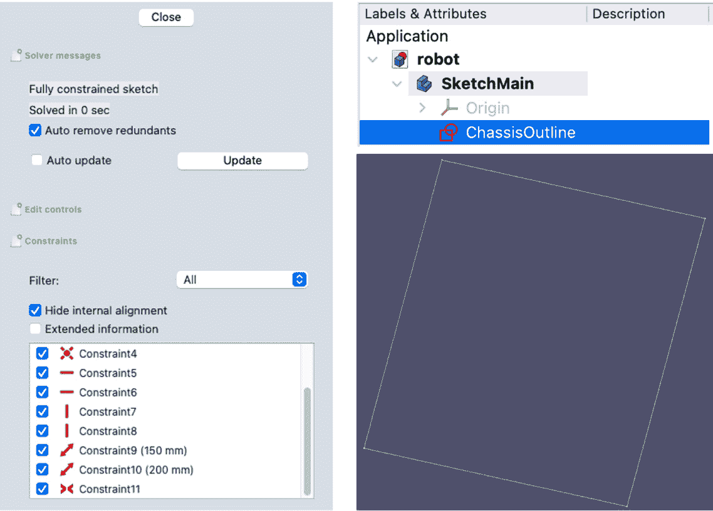

图 3.13 – 完全约束草图的“任务”面板

`ChassisOutline`。

此草图已标注尺寸并约束。然而，我们将创建一个进一步的草图作为上层部件的主要草图。

## 创建上部分的主要草图

我们将使用名为 `UpperParts` 的进一步草图来制作底盘顶部的部件。它将遵循测试适配，但会添加螺丝孔。它需要参考 `ChassisOutline` 草图中的几何形状，因为它们是相关的。

在同一 *XY* 平面上创建一个新的草图。我们将通过使用外部几何形状将此草图基于上一个草图。看看下面的截图：

图 3.14 – 导入外部几何形状

*图 3.14*显示了**外部几何**工具，你需要点击它，然后选择所有矩形边以在它们上方创建红色线条。这将链接到另一个草图或对象的几何形状。

接下来，我们将为电池盒和面包板创建草图元素：

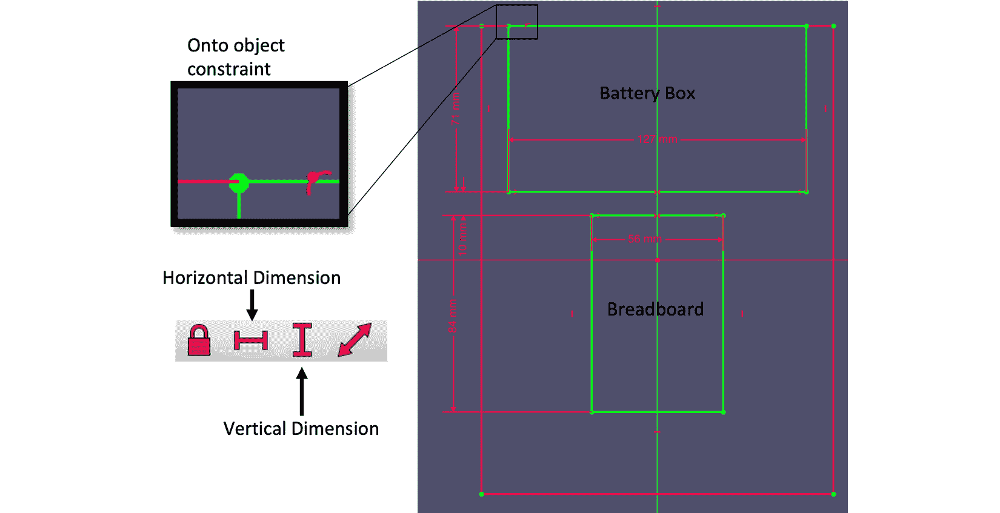

图 3.15 – 电池盒和面包板草图元素

中间的截图显示了底盘，上面有电池盒和面包板草图元素，左侧的特写截图显示了**Onto 对象** **约束**图标。右上角的空间显示了尺寸工具。按照以下步骤进行：

1.  绘制电池盒轮廓。通过从左上角开始绘制一个与底盘后线接触的矩形，FreeCAD 会在该左上角点和线之间添加一个自动的**Onto 对象**约束。这使得该点保持与线的接触。使用测试装配来设置尺寸。

1.  使矩形的底部点在垂直轴线上对称。草图应该变成亮绿色，以显示它已完全约束。

1.  接下来，创建面包板。这是一个矩形，顶部两个点在垂直轴上是对称的。使用测试装配的尺寸。

1.  我们希望在面包板和电池之间留出间隙。选择电池盒的左下角和面包板的左上角。在它们之间创建一个 10 毫米的垂直尺寸。草图应该再次完全约束。

重要提示

当添加对称性时，FreeCAD 应该移除线条的水平约束。这消除了**冗余约束**，如果约束与其他约束冲突，则可能导致问题。确保**自动移除冗余**被启用以防止这种情况发生！

### 草图故障排除

如果你在之前的草图中有困难，尝试以下步骤来解决一些常见问题：

+   **我看到有冲突的约束错误**：确保你已经遵循了前面的偏好步骤。**自动移除冗余**必须被启用。

+   **我无法使对称性工作**：你必须选择两个点（圆点），然后是一个最终的中心点或中线。选择顺序对于对称性很重要。

+   **我的尺寸很混乱**：你可以点击任何尺寸并将其拖动以将其移出路径。

+   **东西太近看不清楚**：使用鼠标滚轮放大，完成后缩小。

+   **我还在绘制线/圆**：如果你已经选择了工具，请右键单击任何位置以放下工具。

+   **我选择了我不想要的约束项**：你可以点击一个项目两次来取消选择它，或者在空白空间中点击以清除选择。

在绘制了这些部分后，我们继续绘制更复杂的电机部分。

### 绘制电机草图

底盘板上的其他元素是电机。电机在我们的测试装配中是以盒子形式出现的，但实际上，它们是一个复杂的组件。我们使用内置编码器的 N20 电机。它们需要支架来固定。

N20 电机支架有两种类型——支架孔靠近电机或远离电机。由于前者更常见，我们将使用这些。下一个图示显示了这些支架的尺寸图，带有电机：

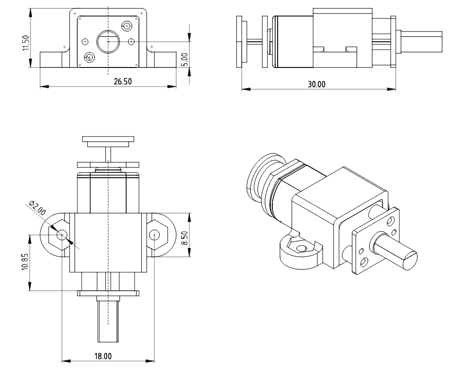

图 3.16 – 带编码器和支架的 N20 电机 FreeCAD 绘图

*图 3**.16*是一个带编码器和支架的 N20 电机尺寸草图。我们将使支架前部与变速箱中间分隔对齐，这样电机就不会滑动。

使用这张图纸，我们可以为两个电机创建矩形轮廓，如下面的截图所示：

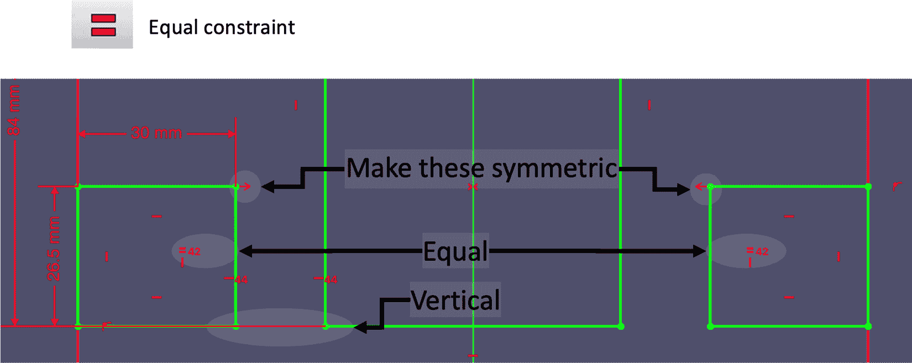

图 3.17 – 电机轮廓

*图 3**.17*显示了**等距约束**的符号，它设置线长度或圆直径相等。截图显示了放置好的电机轮廓矩形。

按照以下步骤进行：

1.  在左侧画一个矩形，确保我们将左上角约束在底盘的左侧。在右侧画一个类似的矩形。

1.  使电机顶部内点关于垂直轴线对称。

1.  选择两个电机上的内垂直线，然后使用等距约束。一个小的`=`符号会显示在项目旁边，以及参考编号。编号相同的项是相等的。

1.  使用**图 3**.16*作为参考，对左侧电机进行尺寸标注。

1.  选择电机右下角和面包板左下角。在它们之间创建一个水平约束以对齐。

我们所有的矩形都是绿色的，这表明这是一个完全约束的草图。我们根据测试装配绘制了机器人的顶部。

我们正在使用更多的绘图工具箱。现在是熟悉提供的工具及其快捷键的好时机。这些快捷键会变化，所以了解它们最好的方法是悬停在按钮上以获取工具提示。**绘图器**在开始使用其键盘快捷键时变得更快。

约束参考将有所帮助；请参见下表：

表 3.2 – FreeCAD 中的绘图器约束

表格显示了符号、名称和每个约束类型的描述之间的参考。您将在工具栏、主视图和屏幕左侧的约束列表中看到这些符号。

这些步骤将帮助创建电机孔——我们接下来的部分。

## 绘制电机孔

我们在草图中用圆表示孔；然而，真正的技巧是使用约束来放置它们。

我们可以从电机附件孔开始。面包板是自粘性的，不使用螺栓，我们将使用钩环点来使电池易于更换。

每个电机有两个孔。我们将使它们在两侧对称。参见图表：

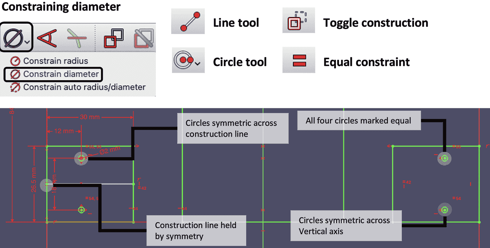

图 3.18 – 绘制好的电机孔

*图 3.18* 是带有工具注释的电机孔草图。接下来的步骤将展示如何：

1.  首先，在每个电机矩形两侧各添加两个圆圈。

1.  接下来，在左侧添加一条穿过电机块的构造线。选择该线并使用 **切换构造** 使其变为蓝色——构造保持几何形状在位，但保持在草图内部。使它与电机垂直对称。

1.  使左侧圆圈的中点沿此线对称，并测量它们之间的距离为 18 mm。

1.  使用水平尺寸将它们放置在外边缘内侧 12 mm 处。

1.  使用 **约束直径** 工具添加一个 2 mm 直径和所有 4 个孔的相等约束。

1.  最后，使用垂直轴使每个圆圈的中心与其左侧对应物对称。

完整的草图应看起来像这样：

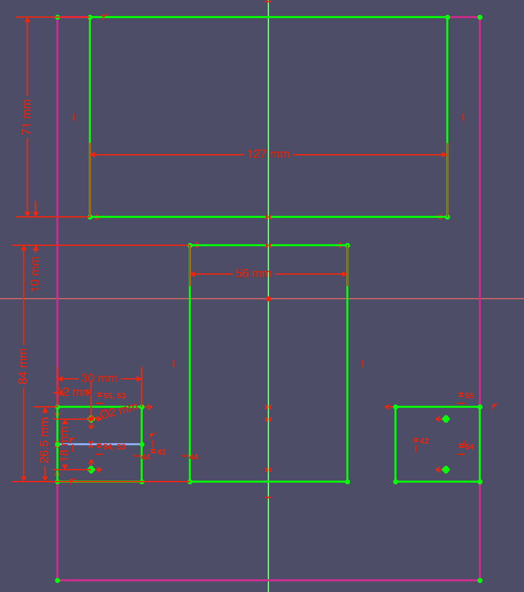

图 3.19 – 全底盘顶部草图

*图 3.19* 展示了整个草图，所有组件都绘制在底盘上，它们的孔也已被绘制并放置。关闭此草图。

上部草图应比 `ChassisOutline` 草图高出 3 mm，以考虑其厚度。以下截图显示了如何：

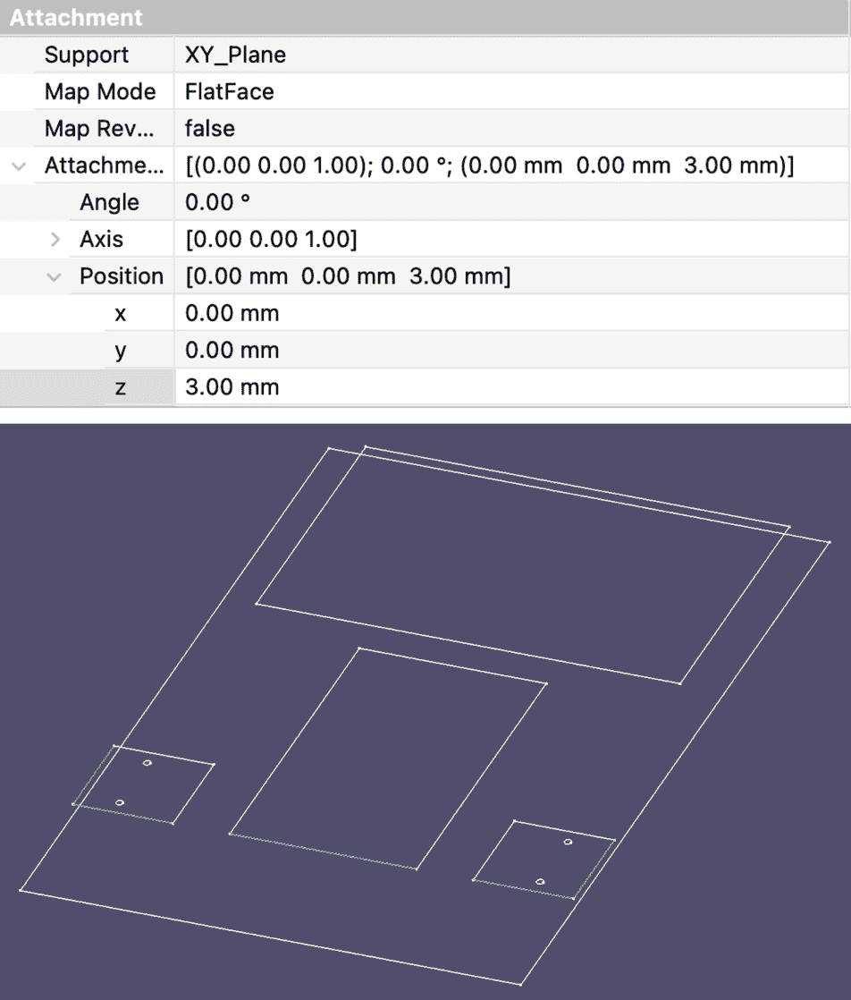

图 3.20 – 定位上部草图

*图 3.20* 展示了草图应该如何定位——首先，**数据**属性视图，然后是一个草图悬停在底盘上的 3D 视图。

要制作这个，选择 `UpperParts` 草图并执行以下操作：

1.  在 **数据** 选项卡属性树中，展开 **放置** 然后是 **位置**。

1.  将 `z` 设置为 `3` 以放置草图。

现在我们已经为底盘顶部建模了所有部分及其孔。底盘底部也有一个脚轮。在下一节中，我们将对其进行建模。

# 设计脚轮放置

电机和车轮靠近机器人的前方。脚轮平衡后部，使其成为带有两个驱动轮的三点设计。电池很重，所以将脚轮放在电池下方和后面可以帮助平衡机器人。我们可以使用电池盒来引导脚轮的放置。

我们需要创建一个 `LowerParts` 草图来放置脚轮和螺栓孔。我正在使用 Pololu ¾ 英寸脚轮，并将使用其数据表/规格作为指南。如果您有不同的脚轮，请检查其规格。Pimoroni 有这个部件的尺寸图。

以下截图显示了我们将制作的草图：

图 3.21 – 脚轮草图

注释草图显示了三个新的圆圈，用于脚轮的孔和轮廓。要绘制此草图，请按照以下步骤操作：

1.  将底盘的后边缘作为外部几何形状添加。

1.  为铸件轮廓绘制一个圆圈，使其中心位于垂直轴上。

1.  使用我的脚轮数据表，我将脚轮轮廓直径设置为 23 mm。

1.  在圆圈的中间和后部线条之间添加 20 毫米的垂直尺寸。

1.  对于孔，沿着这条线画一个圆圈，再画一个相对的圆圈。

1.  使孔径相等，并在滑轮中心点添加对称性。

1.  在孔之间添加水平约束。

1.  滑轮信息表明其孔间距为 15.5 毫米，并且作为一个`#2`螺纹，我们可以使用 2.5 毫米作为直径。使用这些来创建孔中间的尺寸和创建直径尺寸。

我们现在已经绘制了上板和下板部件。完成这些并练习了绘图技能后，是时候将这些转换为 3D 对象了。

# 从草图建模底盘部件

我们将开始制作 3D 部件。第一个部件是底盘板本身，需要两个步骤，然后我们再围绕它构建其他部件。

## 建模底盘板

以下截图显示了我们将如何制作 3D 底盘板：

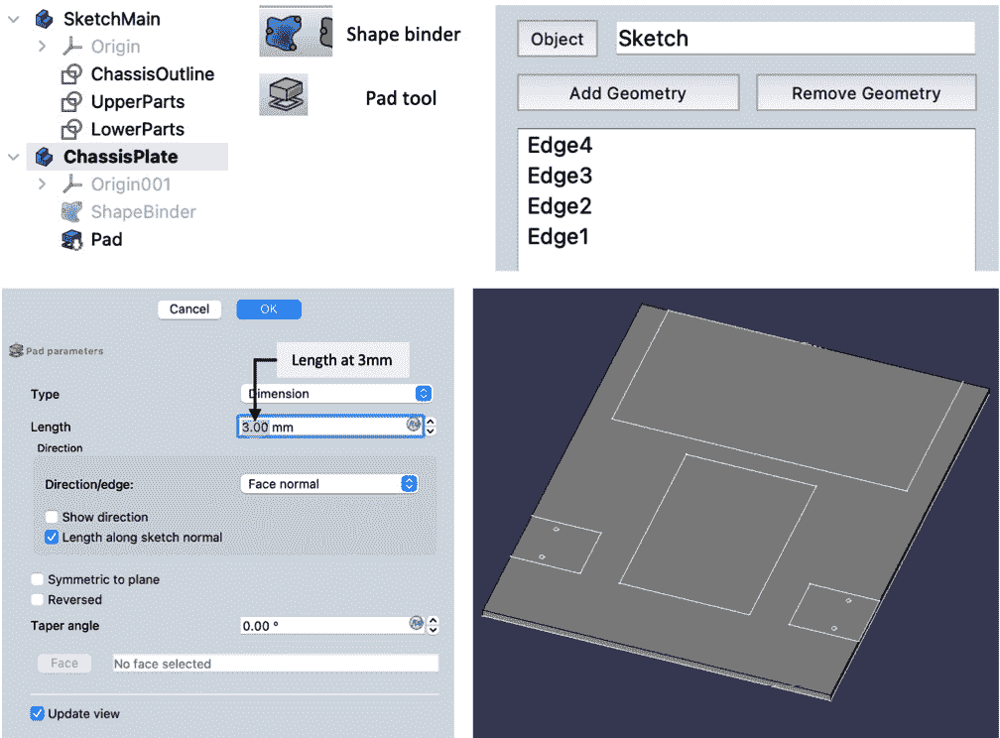

图 3.22 – 制作 3D 底盘板

顶部显示**垫片**工具，左下角显示**垫片****任务**面板，右部显示包含板的 3D 视图。我们已经将草图放入主草图，因此我们需要导入这些。对于从草图导入几何体，FreeCAD 有**形状绑定器**对象。确保你处于**部件设计**工作台，然后按照以下步骤进行操作：

1.  创建`ChassisPlate`体，并双击使其变为活动状态。

1.  点击**形状绑定器**，然后任务视图显示所选几何体的名称。

1.  选择`ChassisOutline`草图的外四条线。与绘图不同，你需要按住*Ctrl*或*Cmd*来完成此操作。

1.  然后，点击**形状绑定器**，然后任务视图显示所选几何体的名称。点击**确定**以接受。

1.  选择它创建的`ShapeBinder`对象，然后点击**垫片**工具。你将看到一个带有左侧参数的**任务**面板和一个右侧的预览。

1.  在**任务**面板中，将长度设置为 3 毫米以匹配苯乙烯板。这将更新预览。

1.  现在，按**确定**完成部件制作。

这项工作只是部分完成，因为我们还需要孔。按照以下说明创建上部孔：

1.  选择并隐藏我们刚刚制作的**垫片**可能会有帮助，使用空格键切换。

1.  选择四个电机孔——悬停在圆圈上并突出显示，然后点击以选择它们。

重要提示

在除**草图**以外的其他工作台上，要选择多个项目，请先点击第一个项目，然后按住*Ctrl*（在 Mac 上为*Cmd*）并点击以添加其他项目。如果你在按住*Cmd*/*Ctrl*的同时选择了不需要的项目，请再次点击该项目以取消选择。

以下截图显示了这种形状选择应该看起来是什么样子：

图 3.23 – 制作形状绑定器

**图 3**.23 的左侧显示了来自我们的草图的所有孔，全部选中。右侧显示了形状绑定器的工具栏图标，形状绑定器的 **任务** 面板，以及带有形状绑定器的 **模型** 树。

您现在可以使用这个形状绑定器在底盘上打孔。请看下面的截图：

图 3.24 – 切割到底盘中的孔

**图 3**.24 显示了我们在左上角使用 **凹槽** 工具切割孔的方法。下面是 **任务** 面板，包含切割选项。右手边的截图显示了 3D 输出。按照以下步骤操作：

1.  确保您已选择形状绑定器，然后点击 **凹槽** 工具。

1.  在对话框中，选择 **贯穿所有**，然后点击 **确定**。

我们已经为连接上层甲板的部件打孔。重复此过程为下部分孔创建形状绑定器，围绕两个万向轮孔进行挖槽，并通过所有部分进行填充。接下来，我们在 3D 中建模这些部件。

## 建模其他部分

我们按照制作孔的方法制作其他部分，使用形状绑定器并将它们填充到文档中的 3D 体内。

以下截图显示了如何制作电池盒：

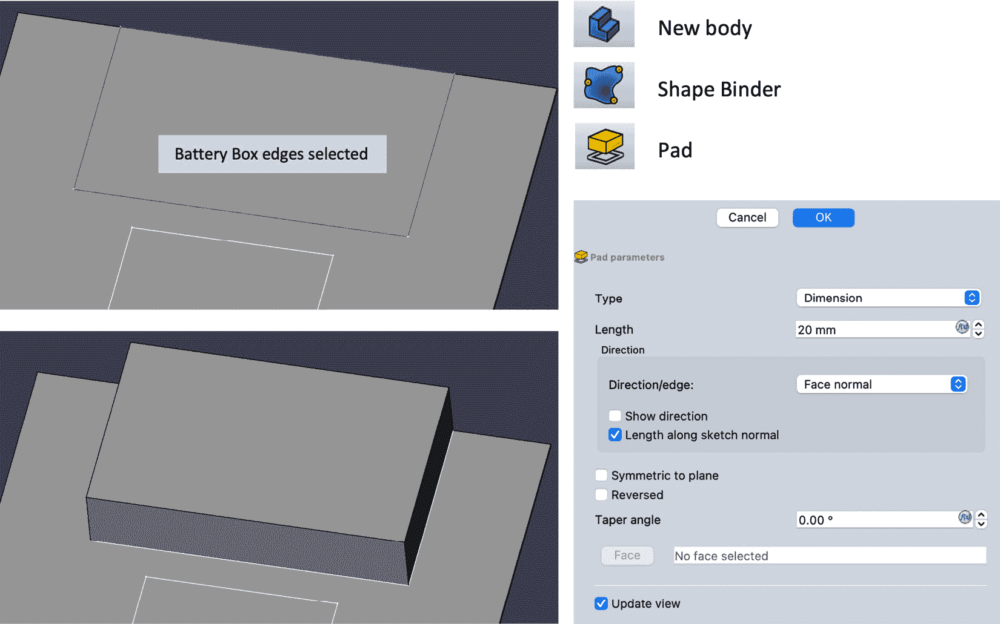

图 3.25 – 3D 中制作电池盒

**图 3**.25 显示了如何制作电池盒，左上角选择了边缘，右上角显示了使用的工具，左下角显示了 3D 中的电池盒，右下角显示了 **垫** 操作的 **任务** 面板。按照以下步骤操作：

1.  创建一个名为 `BatteryBox` 的主体。

1.  选择此框的外部线条，如顶部左侧面板所示。您可能需要隐藏 `ChassisPlate` 主体以选择所有边缘。

1.  点击 **形状绑定器** 在新主体中创建一个形状绑定器。

1.  选择该形状绑定器，点击 `20` `mm`，反向。

您现在应该看到前面的 3D 形状。我们可以以相同的方式制作其他部分——电机和面包板。请看下面的截图以查看整个上层甲板的轮廓：

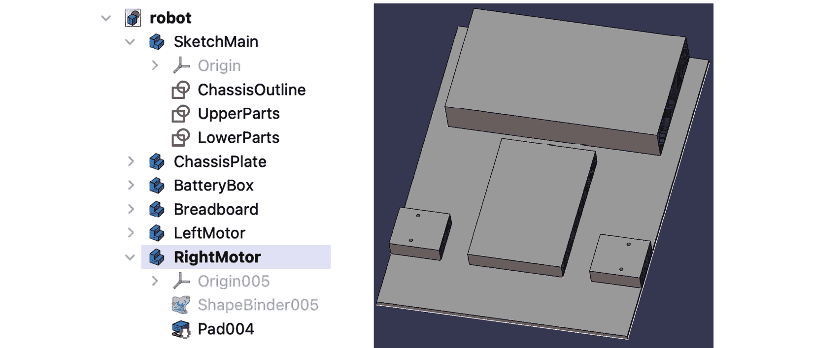

图 3.26 – 3D 建模的上层甲板

**图 3**.26 显示了左侧的 **模型** 树，其中包含我们的组件体。右侧显示了一个包含所有建模部分的 3D 视图。现在是保存的好时机！

底盘板部分现在已准备好，包括用于将其与其他部分连接的孔。在下一节中，我们将排除您可能遇到的任何问题。

## 模型的故障排除

这个列表应该能帮助您通过迄今为止的练习克服常见的 FreeCAD 陷阱：

+   **我找不到工具栏中的正确按钮**：记住工作台——当您启用 **草图** 时，您将拥有与 **零件设计** 中不同的工具栏。因此，请确保您已选择 **零件设计**！还要注意屏幕外的按钮。

+   **我点击了但没有自动约束**：您可以通过选择相关项和正确的约束工具来添加约束。

+   **我无法选择几何形状**：使用**空格**键或**隐藏项目**菜单来隐藏/显示几何形状，直到您想要选择的项清晰可见。

+   **有些孔无法切割**：确保孔不是构造几何形状。构造几何形状在草图中被涂成蓝色，在**切割**/**垫**操作中不被使用。

+   **事物并不完全对齐**：如果项目是白色的，它们没有被约束。使用尺寸和其他约束来告诉 FreeCAD 它们应该如何对齐。

重要提示

草图最好是有约束的。将事物拖动以**看起来**它们对齐可能会导致问题。尽量使用约束。如果它们是平行的，使用平行约束。如果它们相等，使用相等约束。如果它们相距 10 毫米，使用尺寸。

希望这涵盖了您遇到的问题，并且您有一个带有零件和螺栓孔的 3D 底盘。然而，我们缺少万向轮。在下一节中，我们将使用其草图将其制作成 3D。

## 在 3D 中建模万向轮

以下截图的左上角显示了创建万向轮的口袋操作参数：

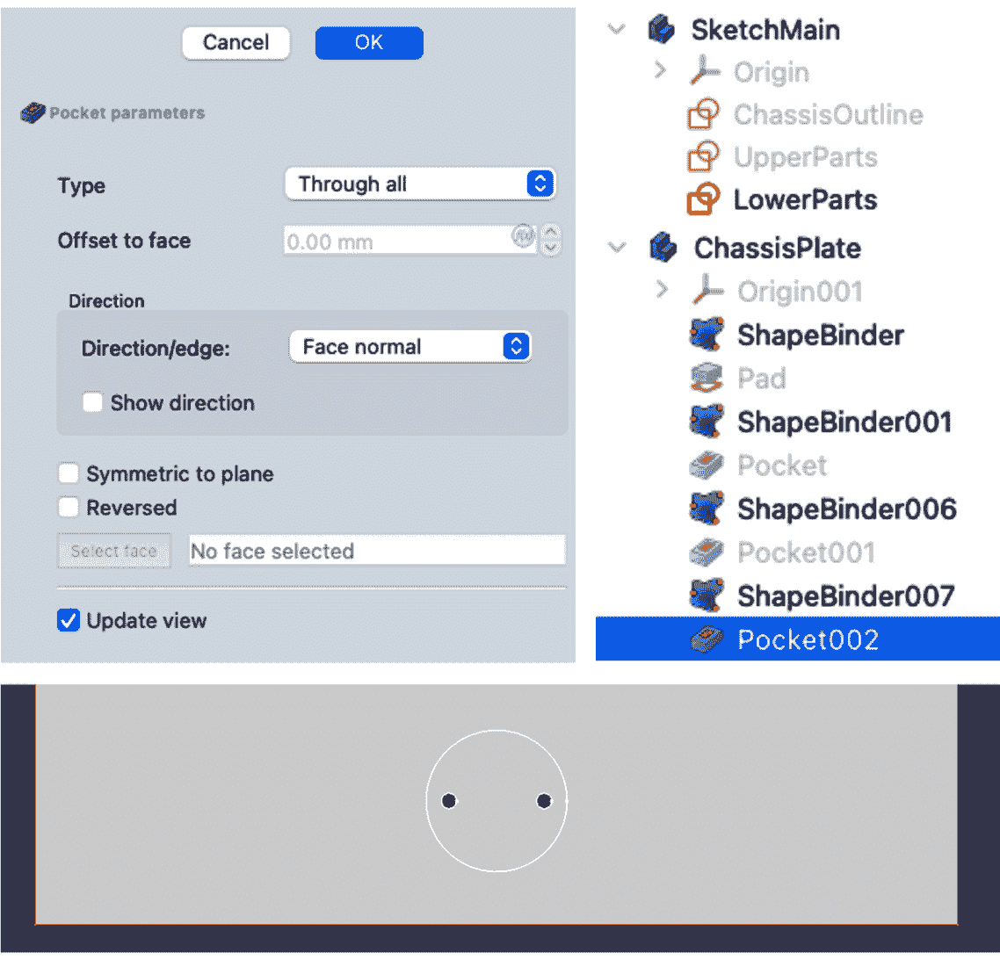

图 3.27 – 制作万向轮孔

上一张截图显示了制作万向轮孔的元素。左上角显示了**任务**面板——其中检查了孔的**反转**和**贯穿整个**字段。右上角显示了**模型**树，其中隐藏了其他草图、形状绑定器和末尾的口袋。底部面板显示了切割到底盘中的万向轮孔。

这些提示将有助于制作此对象：

+   看一下模型的底部。

+   隐藏最后的`ChassisPlate`，以便你可以看到草图圆圈。

+   选择两个圆圈，制作一个形状绑定器，然后再次显示底盘。

+   选择此形状绑定器用于孔，并制作一个**口袋**。

+   将口袋设置为**贯穿整个**。你可能需要检查**反转**来制作切割。**贯穿整个**只适用于同一实体的几何形状，其他实体将需要进一步的口袋操作。

我们可以使用我们的草图来制作 3D 万向轮体，使用与之前相同的过程。查看以下截图以了解我们如何实现这一点：

图 3.28 – 制作 3D 万向轮

上一张截图显示了制作万向轮的步骤。第一个面板显示了`ShapeBinder`对象的选取；右上角显示了填充的万向轮。要添加万向轮，请执行以下步骤：

1.  隐藏其他实体部分。制作一个`Caster`实体，并将`LowerParts`草图中的细节引入形状绑定器。

1.  将其垫至 23 毫米，反转。显示其他实体。

我们现在已经放置了万向轮及其螺栓孔。安装万向轮后，我们制作了一个粗糙的 3D 机器人模型。它缺少轮子和细节，但足以显示这将有效。我们将使用这个设计来制作零件，这些零件需要一个图纸——我们下一节将介绍这些。

# 制作 FreeCAD 技术图纸

我们的设计表明一切都会工作，但我们需要一种切割和钻孔苯乙烯板和棒的方法。FreeCAD 可以制作一个 **技术图纸** 来帮助我们。您已经看到了 *电机组件* 和 *底盘底座* 绘图。现在，您将看到如何制作自己的。

## 设置页面

我们将开始在 **TechDraw** 工作台中设置页面。以下截图显示了如何操作：

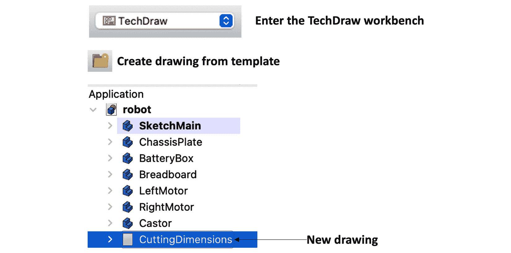

图 3.29 – 准备绘图页面

*图 3.28* 显示了我们在 **TechDraw** 中创建绘图页面的方法。

在工作台选择器中选择 **TechDraw** 工作台，如图 *图 3.28* 所示。然后，按照以下步骤操作：

1.  在工具栏中，点击 **从模板创建绘图** 图标。

1.  这显示了在文件选择器中的绘图模板。选择 `A4_Portrait_blank` 并打开此模板。

1.  这将在 `CuttingDimensions` 中添加一个新的绘图，如图 *图 3.28* 左侧所示。

我们现在有一个空白页面，您可以将其用于放置零件。我们将把零件投影到这张纸上——选择零件并让 **TechDraw** 绘制它们。

## 将零件添加到绘图

我们可以从将底盘板零件添加到我们的绘图开始。让我们看看以下截图中的操作：

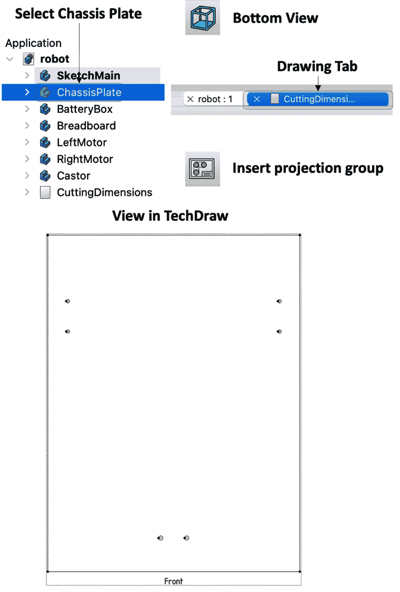

图 3.30 – 将底盘板添加到绘图中

上一张截图显示了我们将如何添加底盘板零件。以下步骤描述了此过程：

1.  首先，从 *图 3.29* 顶左所示的 `ChassisPlate`。这将带您进入 3D 视图。

1.  在 3D 视图中，使用 **底视图** 工具栏按钮或导航立方体来查看模型的底视图。

1.  使用视图下方的标签（中间右侧）返回到 `CuttingDimensions`。在 **模型** 视图中应保持选择 `ChassisPlate`。

1.  点击绘图中的 `ChassisPlate`。

1.  投影框架允许您在绘图中拖动它们。点击并拖动此框架到右侧，这样我们就可以在左侧放置其他零件。

1.  在 **任务** 面板中点击 **OK** 以完成插入投影组的操作。

现在，您已经有了底盘板零件；然而，框架很凌乱，添加孔中心和尺寸会更好。

## 准备绘图以打印

需要一些最后的润色，以便使此绘图准备好作为零件切割指南使用。以下图表显示了如何操作：

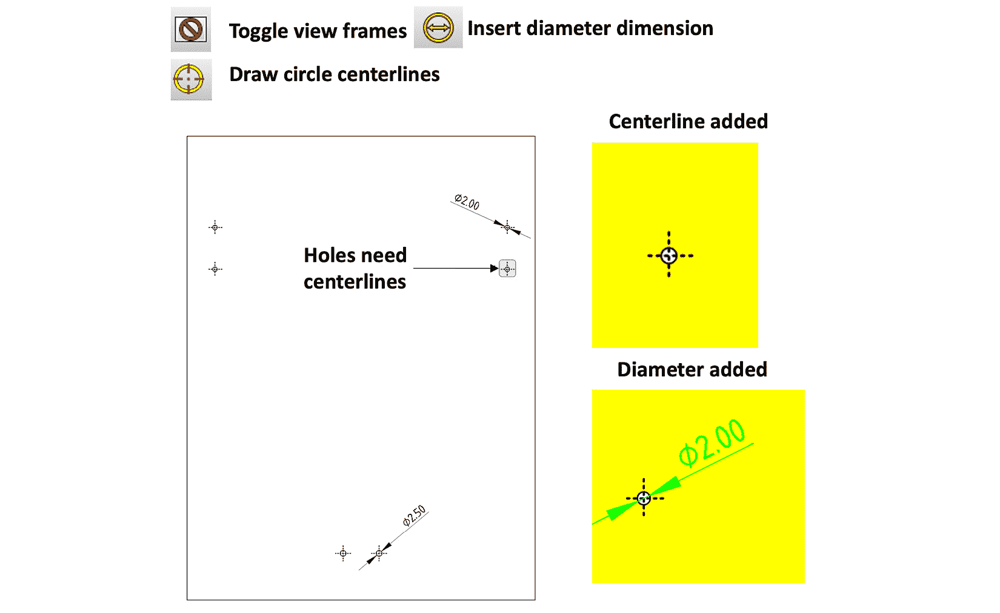

图 3.31 – 准备绘图以打印

*图 3.30* 在顶部有我们将要使用的过程图标。这些应该在工具栏中，但你可能需要移动工具栏才能看到它们。左下角显示的是没有中心线的我们的零件，右面显示的是添加了中心线，然后添加了直径。执行以下步骤：

1.  首先，我们可以通过在工具栏中点击 **切换视图框架** 来关闭框架。

1.  因此，我们可以钻孔，但我们需要中心线。首先选择一个圆圈。然后，使用**绘制圆圈中心线**工具添加中心线。

1.  我们还想要添加尺寸，以便我们知道需要钻多大。点击一个圆圈，然后点击**插入****直径尺寸**。

1.  为所有孔重复中心线。测量孔的尺寸，但在它们对称的地方，您不需要测量它们的对应部分。

您现在应该有了完成的图纸。您可以将其打印到 A4 纸上。打印时务必不要缩放。打印的图纸应该看起来像这样：

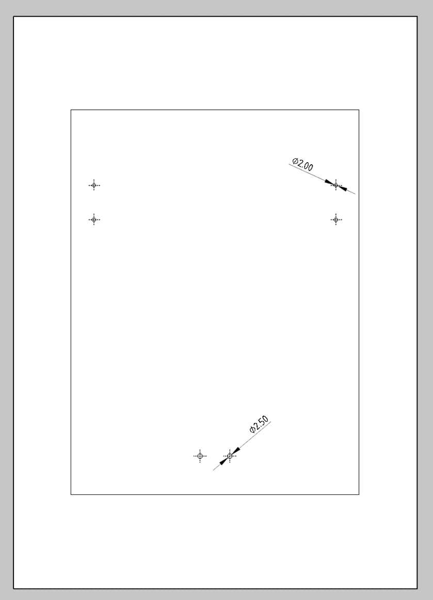

图 3.32 – 可打印的图纸

这张可打印的图纸看起来不错。您将能够使用这张打印件来制造零件，并且您已经学会了如何使用**TechDraw**投影零件。我们将在下一章制作这些零件！

# 概述

您已经对 FreeCAD 进行了简要的浏览，并在其中设计了对象，从草图到带有凸台和凹槽的 3D 对象。您已经看到了形状绑定器以重复使用几何形状，并在草图中使用约束来指定几何关系。您已经使用这些工具从多个部分构建了一个 3D 机器人设计。

最后，您看到了如何根据 3D 设计制作输出图纸，您可以带着它去车间。

在下一章中，我们将把这些设计带入车间，根据它们制造零件，然后将它们组装成定制的机器人。

# 练习

您可以遵循这些练习来提高和练习您的 FreeCAD 技能，并改进机器人模型。

下一张截图显示了向这个机器人添加一些装饰的建议。这个练习非常推荐。

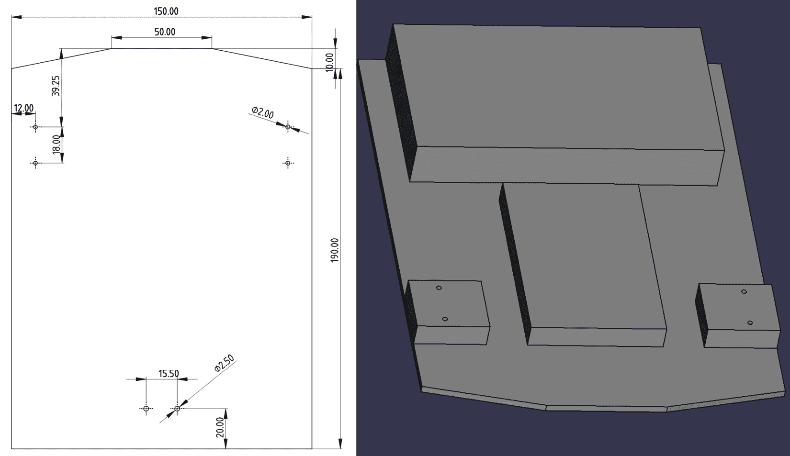

图 3.33 – 底盘前部的细节

上一张截图显示了一张左侧带有尺寸的图纸，用于在前底盘上切割一些角度细节。请注意，这里使用了测量值而不是角度，这应该会使后续的制造过程保持简单。右侧显示了该图的 3D 视图。

机器人看起来相当简单，底盘是矩形的。在底盘上添加一些切口可以增加细节，我们可以在以后为传感器定位在此基础上进行构建。使用前面的截图来获取尺寸。目标是使用新的草图切割`ChassisPlate`体，因为不建议修改`ChassisOutline`草图。

一些其他可选的读者练习如下：

+   考虑给电机添加轮子——它们可能需要一个轴。**提示**：在*YZ*平面上绘制草图。

+   您能否使用您的绘图技能复制像*图 3.16*中看到的那种装配图？

# 进一步阅读

这只是触及了 FreeCAD 的能力以及您如何使用它的一小部分。我建议您在以下来源进一步了解其使用：

+   由 *Daniel Falck* 和 *Brad Collette* 编写的 *“FreeCAD [如何操作]*”，由 *Packt Publishing* 出版——利用 Python 的力量进行实体建模。本指南介绍了工作台、多种建模技术以及如何在 FreeCAD 中使用 Python。

+   FreeCAD 论坛位于 [`forum.freecadweb.org/`](https://forum.freecadweb.org/)，有一个名为 *“使用 FreeCAD 的帮助”* 的主题，当遇到 FreeCAD 问题时，这是一个提问的好地方。

+   FreeCAD 还有一个维基百科，其中有一个关于 **“草图绘制器”* 工作台的优秀页面，位于 [`wiki.freecadweb.org/Sketcher_Workbench`](https://wiki.freecadweb.org/Sketcher_Workbench)，以及一个 *“入门”* 主题，位于 [`wiki.freecadweb.org/Getting_started`](https://wiki.freecadweb.org/Getting_started)。
