# 第九章：使用蓝牙 LE 远程操作 Raspberry Pi Pico 机器人

我们打算制造的机器人是移动的。我们已经有机器人能够在地面上行驶，能够感知并对其周围环境做出反应。然而，我们要么盲目地依赖它，要么用笔记本电脑连接到它。这两种情况都不太符合我们的需求。如果我们能够在它脱离连接并在地板上漫游时获得反馈会怎样？

在本章中，我们将看到蓝牙**低功耗**（**LE**）非常适合这项任务，它允许我们从机器人获取数据，使用应用程序来绘制数据图表，甚至可以从我们的智能手机上远程控制我们的机器人！

在本章中，我们将涵盖以下主要内容：

+   无线机器人连接选项

+   将蓝牙 LE 连接到 Raspberry Pi Pico

+   在 Raspberry Pi Pico 上制作蓝牙 LE 传感器馈电

+   使用蓝牙 LE 远程操作机器人

# 技术要求

本章需要以下设备：

+   来自*第八章*的机器人，*使用 Pico 感测距离以检测物体*

+   Adafruit Bluefruit LE UART 朋友 ADA2479

+   1 个八位单排 2.54-mm 插头（包含在模块中）

+   5 条带有 2.54-mm 杜邦接头的公对母跳线

+   可以访问 Android 或 iOS 智能手机

+   比利牛斯钩和环点

+   前几章的代码

+   如 Mu 或 Thonny 之类的 Raspberry Pi Pico 代码编辑器

+   一条 USB 微型线

你可以在此处找到本章的代码：[`github.com/PacktPublishing/Robotics-at-Home-with-Raspberry-Pi-Pico/tree/main/ch-09`](https://github.com/PacktPublishing/Robotics-at-Home-with-Raspberry-Pi-Pico/tree/main/ch-09)。

# 无线机器人连接选项

到目前为止，我们一直在与连接到计算机的机器人一起工作。我们向它发送代码，并使用 REPL 工具查看它正在做什么或打印出什么。虽然 REPL 工具可能很方便，但计算机和机器人之间有电线连接并不那么方便，并且限制了机器人的行驶距离或需要你带着笔记本电脑跟在它后面。以下图表显示了我们可以如何操作：

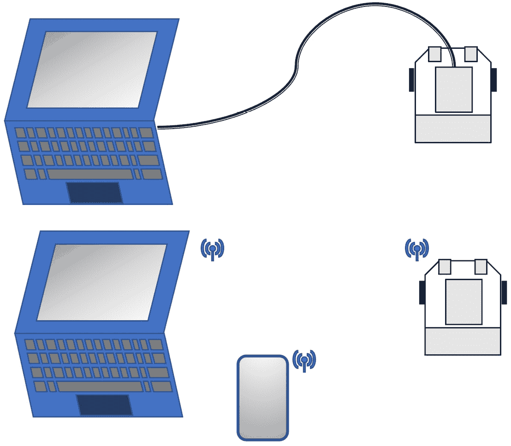

图 9.1 – 机器人连接

图表的上半部分显示了用线连接的物品。但下半部分显示计算机和机器人并没有物理上连接在一起。相反，它们正在使用无线方式相互发送数据。

一旦我们实现无线连接，我们也可以考虑将智能手机作为替代品。我们可以使用无线介质从机器人的传感器或代码发送数据，以查看正在发生的情况并对其进行监控。我们还可以发送控制信号来接管并驱动我们的机器人。

我们可以使用几种不同的无线协议。所有这些都需要我们的机器人配备一个**收发器**——发射器和接收器——板。

虽然一些机器人控制器，如 Raspberry Pi 4，具有板载收发器，但 Raspberry Pi Pico 则没有。因此，我们需要添加一个分线器。此外，它们还支持不同的协议和这些协议的不同实现。

我们可能会选择哪些收发器板，以及为什么？以下表格显示了比较：

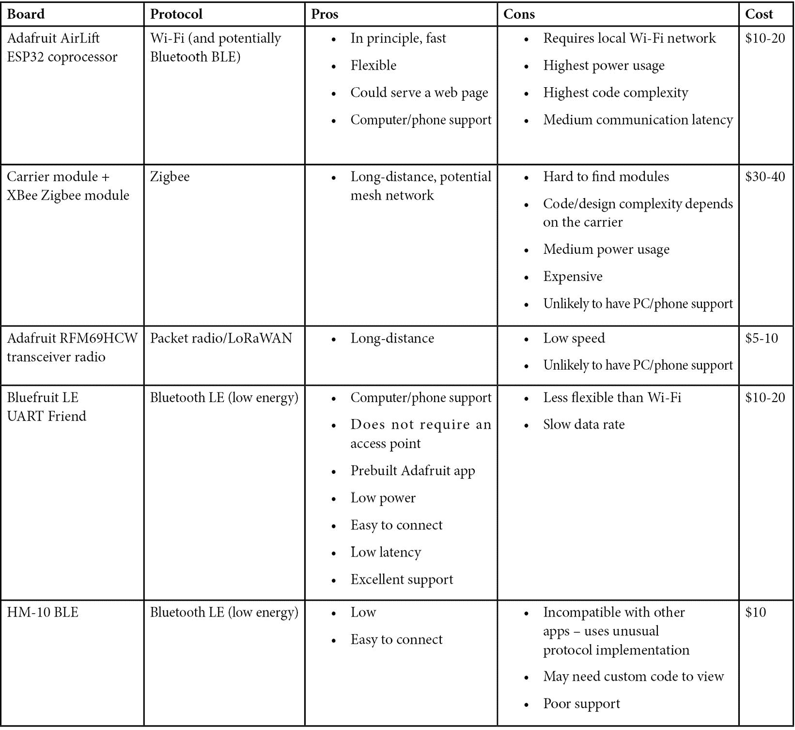

表 9.1 – Pico 的收发器模块

在前面的表格中，我选择了带有板载软件堆栈的板，以减少我们需要的代码量。我们不太关心速度，因为我们不打算发送相机数据；然而，延迟很重要，因为我们希望我们的机器人能够快速响应命令并发送最新的传感器数据。

支持很重要 – 我们希望选择那些从其供应商和社区获得良好支持的模块。例如，Adafruit 为其模块提供了出色的支持和文档，拥有 Discord 和其他论坛上的在线社区，以及 GitHub 上所有代码的可用性，这使它们的模块比价格更低、支持更差的选项具有更多的可信度。

Raspberry Pi Pico W – 带有板载 Wi-Fi 芯片的 Pico – 值得特别一提，这个 Pico 得到了 Raspberry Pi 社区的出色支持。然而，它增加了需要你提供图形化 Web 前端服务的复杂性，但这可能是一个非常不错的选择。

HM-10 模块非常容易获得，甚至可能非常便宜，但它们不寻常的协议意味着与它们连接需要更多的代码。

在这里，最有利的选项是 Adafruit Bluefruit 板。它功耗低且体积小。该板有**串行外设接口**（**SPI**）和**通用异步收发传输器**（**UART**；如下所述）版本。**蓝牙 LE**是蓝牙的低功耗变体，非常适合机器人与控制器等设备之间的短距离通信。其范围为 100 米。蓝牙 LE 的数据速率比常规蓝牙低三分之二，但在活动时电流消耗仅为一半。智能软件配置文件允许它频繁使用低功耗模式，并在需要时快速唤醒。

UART 不需要太多配置，仅使用两根线（与 SPI 或 I2C 使用的三根或更多线相比）。没有时钟线（只有速度上的协议）和地址，只有一对一的设备通信。我们已经在使用基于 USB 的 UART 与 Raspberry Pi Pico 进行通信。

我们将在我们的项目中使用 Adafruit Bluefruit LE UART Friend 板以简化操作。

它可以通过 Adafruit 直接或通过 Pimoroni 和 Mouser Electronics 等分销商广泛获得。

Adafruit Bluefruit 是一个基于蓝牙 LE 的开发板生态系统，因此有很多兼容的代码。此外，它与内置蓝牙 LE 收发器的计算机和手机兼容，Adafruit 还为计算机和手机提供了应用程序来与它们通信。这些应用程序将为我们节省时间，因为其他解决方案需要你构建自己的应用程序。

我们现在知道我们将使用哪个模块了。因此，我们可以利用它，让我们拿一块 Bluefruit LE UART 板并将其连接到我们的机器人上！

# 将蓝牙低功耗连接到 Raspberry Pi Pico

Bluefruit LE UART Friend 模块相对简单，可以连接。首先，模块需要焊接上引脚头，然后我们可以看看如何将其物理连接到机器人以及如何布线。然后我们将从我们的机器人和智能手机连接到它。

添加蓝牙低功耗（BLE）将使我们的机器人具有以下框图：

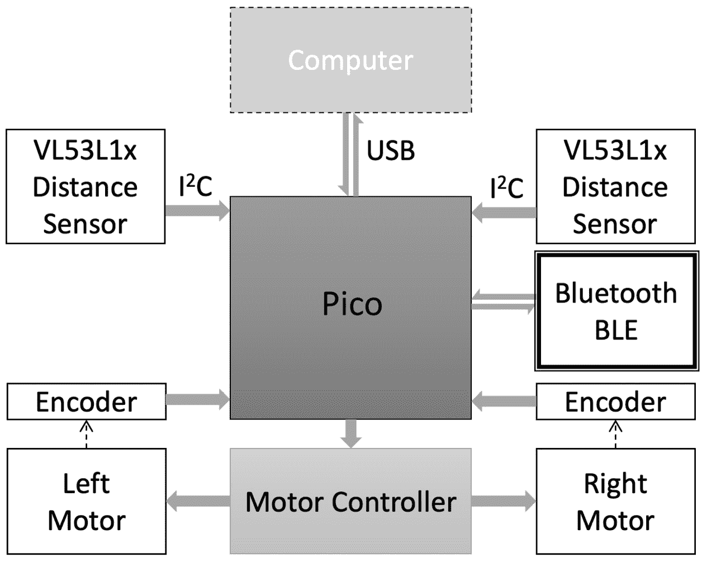

图 9.2 – 带蓝牙的机器人框图

上述图示显示了带有额外 Adafruit Bluefruit LE UART Friend（标记为 Bluefruit 模块）的机器人模块，通过 UART 连接到 Raspberry Pi Pico。

使用与*第八章*，*使用 Pico 检测物体距离*中模块相同的焊接技术，在板上焊接一组公头。

## 将蓝牙模块连接到机器人

我们希望将模块放置在最有可能限制和干扰蓝牙的设备上方。为此，我们在*第七章*，*计划和购买更多设备*中创建了一个分线架。

以下照片显示了引脚头应该如何连接：

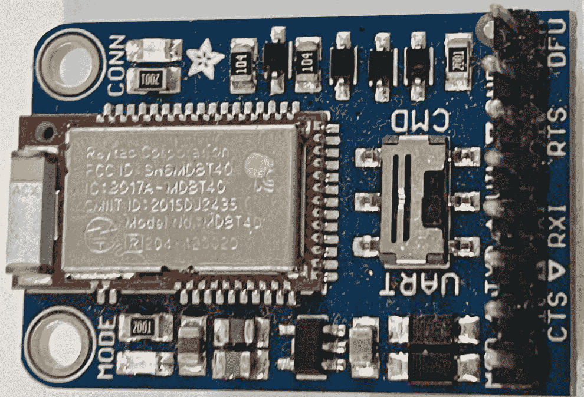

图 9.3 – 带有引脚头的 Adafruit 蓝牙低功耗 UART Friend

上一张图显示了带有引脚头的设备。它们应该焊接得足够高，以便在引脚名称上方，朝向与开关相同的方式。开关应处于 UART 模式。

我们希望附件足够牢固，不会因为电缆张力而滑动或尴尬地突出。你可以在搁板上钻孔以创建更持久的连接，但对于快速原型平台来说，使用魔术贴（钩和环）点是一个方便的方法。看看下面的照片：

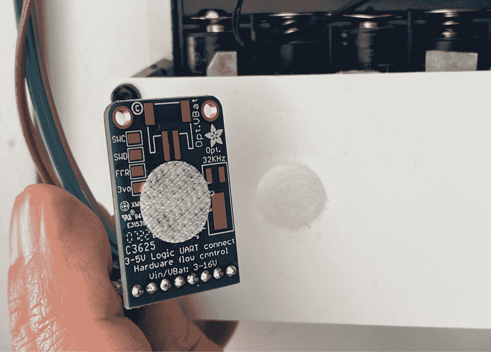

图 9.4 – Bluefruit 模块的魔术贴连接

上一张照片显示了带有魔术贴点的蓝牙分线模块，准备连接到机器人搁板上已经连接的魔术贴点。

魔术贴为我们提供了一个方便的方法来连接/断开模块，而不会滑动掉落。

接下来，我们需要将蓝牙分线板连接到 Raspberry Pi Pico。

## 将蓝牙分线板连接到 Raspberry Pi Pico

布线 Adafruit Bluefruit LE UART Friend 模块只需要五根线。以下照片显示了您需要的连接：

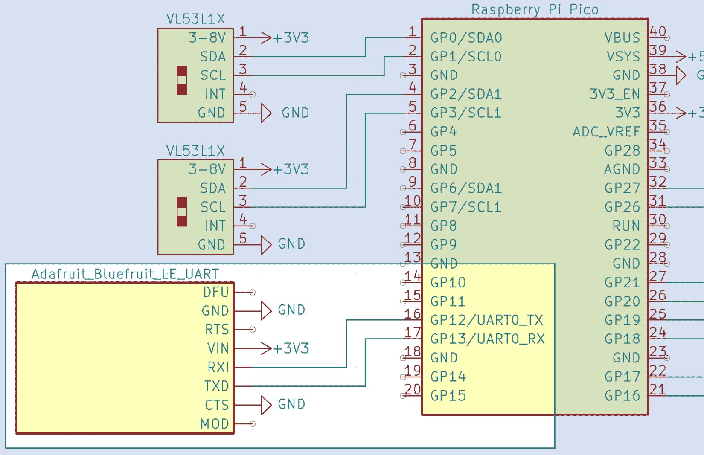

图 9.5 – 将 Bluefruit LE 模块连接到 Pico

上述图示以电路图的形式显示了 Bluefruit 模块和 Raspberry Pi Pico 之间的连接。

首先，将模块连接到电源和地，VIN 连接到 3.3V 电源。接下来，需要将 CTS 引脚连接到地，以便通过 UART 发送和接收数据。下一张图显示了 TX 和 RX 引脚的交互：

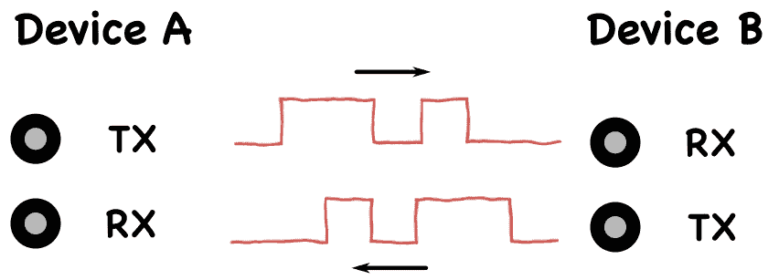

图 9.6 – 发送和接收引脚

仔细注意 UART 上的发送和接收引脚（如图 9.5 所示）。一个设备的 TX（发送）始终连接到另一个设备的 RX（接收）。最常见的接线错误是混淆这些引脚。

将 Bluefruit 的 RXI（接收输入）引脚连接到 Pico 的 PIN12，将 Pico 的 TX（发送）引脚 12 连接到 Bluefruit 的 TXD（发送数据），并将 Bluefruit 的 TXD 连接到 Pico 的 RX 引脚 13。

您现在应该已经建立了五个连接。蓝牙 LE 设备已准备好开启。让我们尝试一些代码来通过 UART 连接到它。

## 使用 UART 连接到 Bluefruit LE 设备

现在我们已经将电路板连接好，并且一部智能手机准备与之通信，那么我们如何让我们的 Raspberry Pi Pico 进行通信呢？让我们先制作一个 Hello Bluetooth 应用程序。

创建一个名为`bluetooth-hello-world`的文件夹。与之前的示例略有不同，我们可以将主文件命名为`code.py`，我们只需要将示例文件夹的内容拖放到 CircuitPy 卷中。

我们从`bluetooth-hello-world/code.py`开始，导入`board`和`busio`，后者包含 UART 总线的代码：

```py
import board
import busio
```

我们然后使用`board`中的 IO 引脚来创建一个 UART 对象：

```py
uart = busio.UART(board.GP12, board.GP13, baudrate=9600)
```

注意，我们可以在不同的引脚组合上为其他传感器和设备设置多个 UART。我们已指定`9600`是此设备的默认值，如其在数据表中所指定。

我们可以使用这个循环来检查任何输入 – 这就是我们知道有什么东西连接上：

```py
while True:
    if uart.read(32) is not None:
        uart.write("Hello, Bluetooth World!\n".encode())
```

在每个循环中，我们尝试读取最多 32 字节。如果我们得到任何东西（它不会显示`None`），那么我们就会发送一个`hello`消息。`uart.write`方法发送字节，而不是字符串，因此我们必须将字符串编码后才能发送。另外，注意末尾的`\n`字符 – 这是在输出中的换行符。

将此代码复制到 Pico 上，现在它将运行，等待连接。所以，让我们通过蓝牙 LE 将某物连接到我们的 Pico 上！

## 连接智能手机

智能手机是连接到机器人并查看正在发生什么的绝佳客户端。您可以使用 Android/iOS 智能手机通过在相应手机的应用商店中找到 Bluefruit LE Connect 应用程序来连接到 Bluefruit。

此应用程序是免费的。在[`learn.adafruit.com/introducing-the-adafruit-bluefruit-le-uart-friend/software-resources`](https://learn.adafruit.com/introducing-the-adafruit-bluefruit-le-uart-friend/software-resources)上提供了替代方案，包括具有类似功能的桌面应用程序。

加载 Bluefruit LE Connect 应用程序。以下截图显示了您将看到的内容：

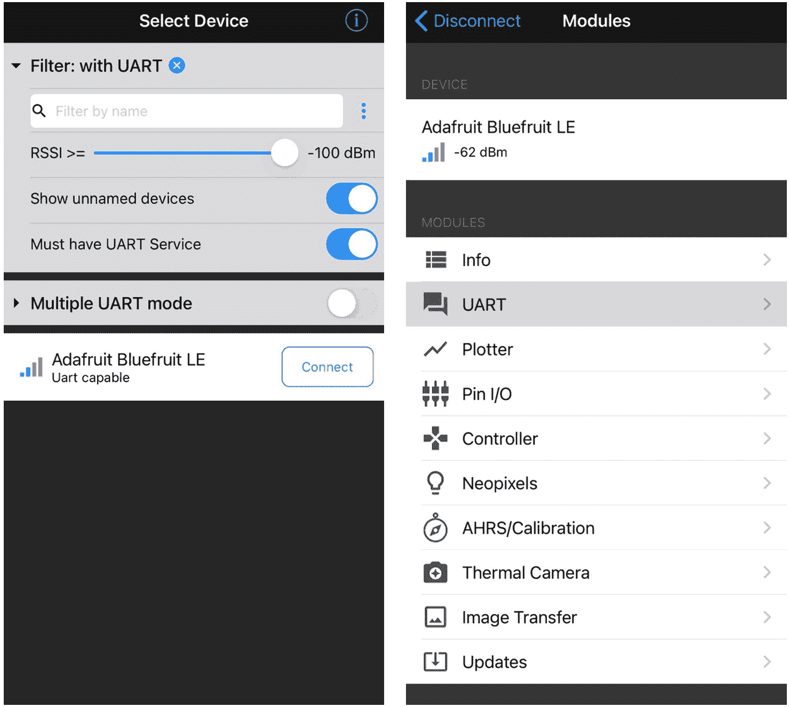

图 9.7 – 连接到蓝牙 LE UART 设备

在前面的截图中，左侧的面板显示了应用程序。当您的机器人开机并且 Adafruit Bluefruit LE 连接时，您应该在应用程序的列表中看到该设备。可能会有很多蓝牙设备；您可以通过打开 **必须具有 UART 服务** 开关来过滤这些设备。然后您可以点击 **连接** 按钮来连接到该设备。

在这样做的时候，您应该在机器人的 Bluefruit 板上看到一个稳定的蓝色灯光。您还会看到右侧的屏幕。Bluefruit LE Connect 可能会要求您更新蓝牙设备；如果是这样，请按照屏幕上的说明操作并在继续之前接受此更新。这可能需要一点时间。

在菜单中点击 **UART** 按钮以发送和接收数据。您应该会看到如下截图所示的屏幕：

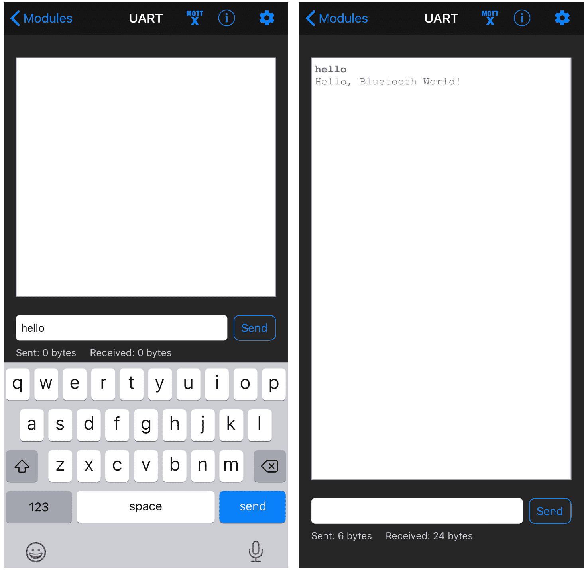

图 9.8 – 通过蓝牙 UART 交互

如前一张截图所示的 UART 屏幕允许您与模块交互并查看输出。左侧面板显示我正在输入 `hello`。请尝试自己操作并点击 **发送** 按钮将数据发送到模块——当您向其发送信息时，我们的代码将做出响应。

右侧面板显示机器人响应的消息。这里可能需要大约一秒钟的响应时间。如果您发送超过 32 个字符，它可能会发送两次消息。

您现在应该与模块建立了联系。如果没有，请尝试以下故障排除步骤。

## 解决 Bluefruit 模块的故障

以下步骤可以帮助您开始使用：

+   当模块通电时，Bluefruit 模块上应该有一个红灯。如果没有，请立即断开电源并验证电源（3.3V）和接地线路。

+   当您从智能手机连接到 Bluefruit 设备时，您应该看到一个稳定的蓝色灯光。如果没有，请验证您是否连接到了正确的设备。

+   如果您看不到 `Hello, Bluetooth World!` 消息，请验证 TX 和 RX 线路是否正确；线路反转是一个常见问题。

您现在应该已经将这个模块连接好，并且能够从机器人发送数据到监听设备。让我们利用这个功能发送传感器数据。

# 在 Raspberry Pi Pico 上通过蓝牙低功耗（BLE）获取传感器数据

到目前为止，您已经测试了基于传感器的示例，通过将笔记本电脑连接到它来查看控制台中的输出。然而，基于我们的 `hello world` 示例和第 *8 章* 中的距离感应，*使用 Pico 检测物体距离的感应*，我们不仅可以以文本形式查看传感器输出，还可以将其绘制在图表中。所以，让我们开始吧。

我们将把这个代码放在一个名为 `bluetooth-distance-sensors` 的文件夹中。将 `robot.py` 和 `pio_encoder.py` 文件复制进去。我们将添加 `code.py`。让我们从导入开始，结合传感器和总线设置：

```py
import board
import time
import busio
import robot
uart = busio.UART(board.GP12, board.GP13, baudrate=9600)
```

现在 UART 已经准备就绪，我们可以准备传感器：

```py
robot.left_distance.distance_mode = 1
robot.left_distance.start_ranging()
robot.right_distance.distance_mode = 1
robot.right_distance.start_ranging()
```

我们已经设置了两个传感器的量程和正确的模式。现在我们可以开始一个循环并获取传感器数据：

```py
while True:
    if robot.left_distance.data_ready and robot.right_distance.data_ready:
        sensor1 = robot.left_distance.distance
        sensor2 = robot.right_distance.distance
```

我们在获取距离之前等待数据准备就绪，并存储来自两个传感器的距离。现在我们可以将数据发送到 UART：

```py
        uart.write(f"{sensor1},{sensor2}\n".encode())
```

我们使用 f-string 将来自两个传感器的数据格式化成一行，用逗号分隔。我们还需要再次包括行结束符`\n`并将其编码成字节。

我们必须确保机器人上的传感器准备好进行下一次读取：

```py
        robot.left_distance.clear_interrupt()
        robot.right_distance.clear_interrupt()
```

在再次尝试之前，我们可以等待一段时间。在`if`块外但`while`循环内添加以下代码：

```py
    time.sleep(0.05)
```

这个延时完成了本例的代码。作为一个概述，这个循环将读取传感器，在有读数时发送数据，然后通过 UART 发送，之后将暂停一段时间再次进行。

如果你将此代码复制到机器人上，并通过**UART**菜单选项连接手机，你将能够看到随着你在传感器前移动物体，两个数值的变化。以下是一个示例截图：

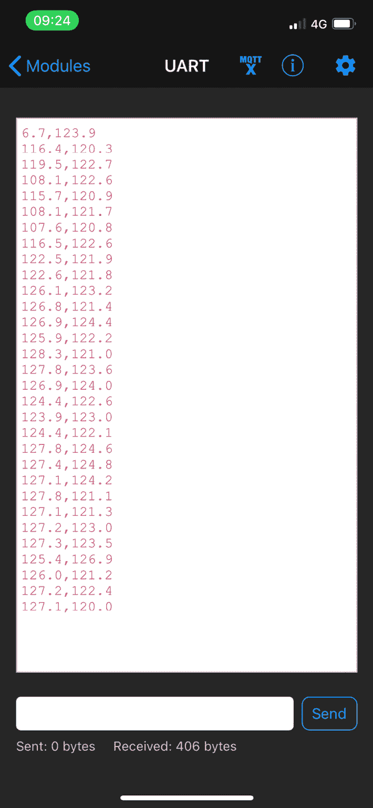

图 9.9 – 传感器输出文本

之前的截图显示了数据如何以纯文本数字的形式输出。你可以断开电脑，将机器人放在独立电池供电下，你应该仍然能够连接到它并看到传感器读数。

这个数据流很棒，因为我们有了机器人的远程视图。然而，我们现在可以更进一步，将此数据绘制成图表。

## 绘制数据图表

手机应用具有内置功能，可以以逗号分隔的格式绘制数据图表。我们可以用这个功能来输出数值数据，快速可视化正在发生的情况。

从 UART 屏幕，点击返回按钮回到此连接的选项菜单。然后，点击**绘图器**按钮进入绘图模式。

以下截图显示了如何进行操作：

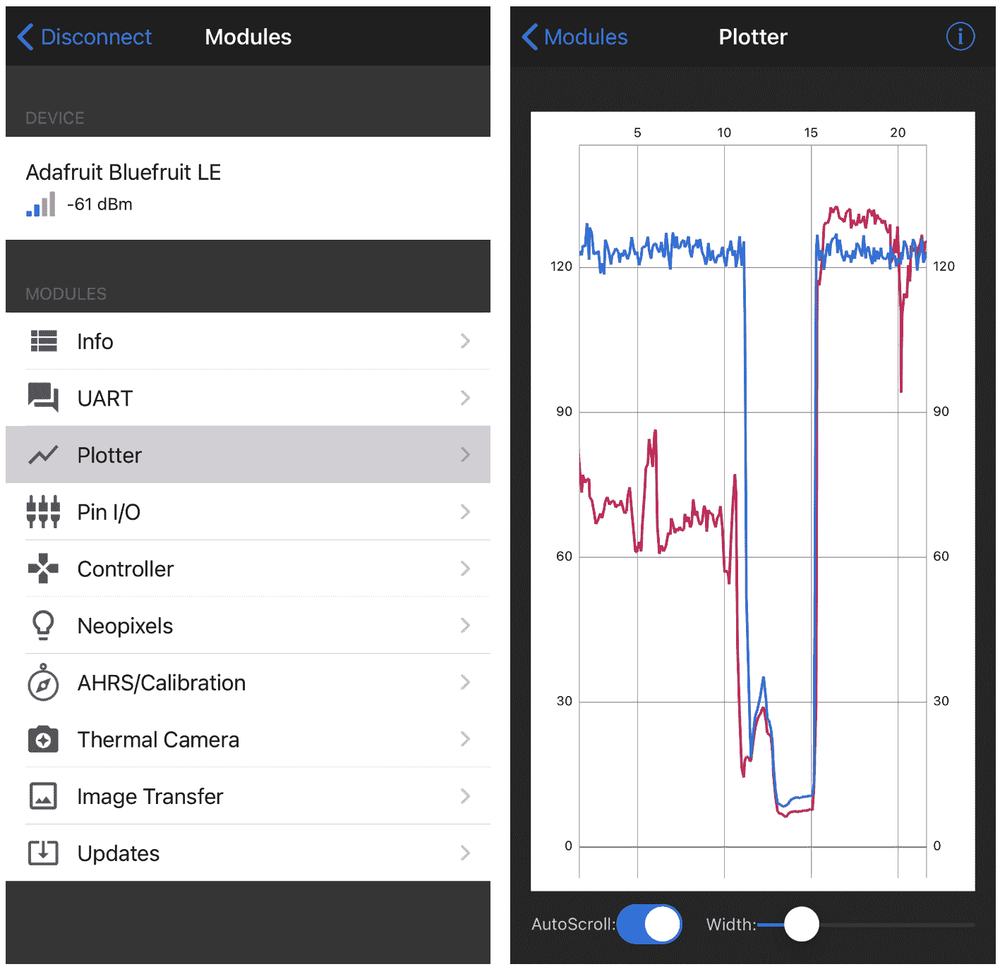

图 9.10 – 启用绘图功能

之前的截图显示了如何访问图形功能以及一个示例传感器数据图表。

应用程序将使用任何逗号分隔的数值数据，到目前为止我已经用六列数据进行了测试。如果输出看起来不完整，请确保你允许应用程序对蓝牙设备进行空中更新，因为这会显著提高吞吐量。

我们已经了解了如何获取机器人传感器数据并使用它来绘制传感器的情况。然而，我们可能还想使用我们的蓝牙服务来控制机器人。让我们在下一节中看看如何操作。

# 使用蓝牙低功耗（BLE）控制机器人

蓝牙低功耗（BLE）是一种双向媒介。在本节中，我们将了解如何从 UART 接收数据，以及如何将数据解码成控制信号。在本节结束时，你将能够用智能手机来控制你的机器人！

## 打印我们得到的数据

在我们尝试解码控制数据包之前，让我们先创建一个简单的应用，将 Bluefruit UART 输出的任何内容回显到 Raspberry Pi Pico 控制台中。

将以下代码放入 `bluetooth-print-incoming/code.py` 文件中。我们首先导入并设置 UART 端口：

```py
import board
import busio
uart = busio.UART(board.GP12,board.GP13,baudrate=9600, timeout=0.01)
print("Waiting for bytes on UART...")
```

这里的一个区别是，我添加了一个短暂的超时。如果没有这个短暂的超时，端口将等待整整一秒钟来读取字节数。你可能注意到了，在 Hello World 示例中，你得到输出之前需要一秒钟的时间，这就是原因。我们希望尽快获取控制数据。还有一个 `print` 语句，这样我们知道它已经准备好了。

现在我们有了主循环：

```py
while True:
    if uart.in_waiting:
        print(uart.read(32))
```

这个循环从端口读取数据。首先，它检查是否有等待的数据，然后尝试读取最多 32 个字节，并立即打印我们得到的内容，然后再次尝试。

如果你回到手机应用中的 **UART** 菜单选项，你将能够在手机上输入信息，并看到它们出现在 Pico 控制台中：

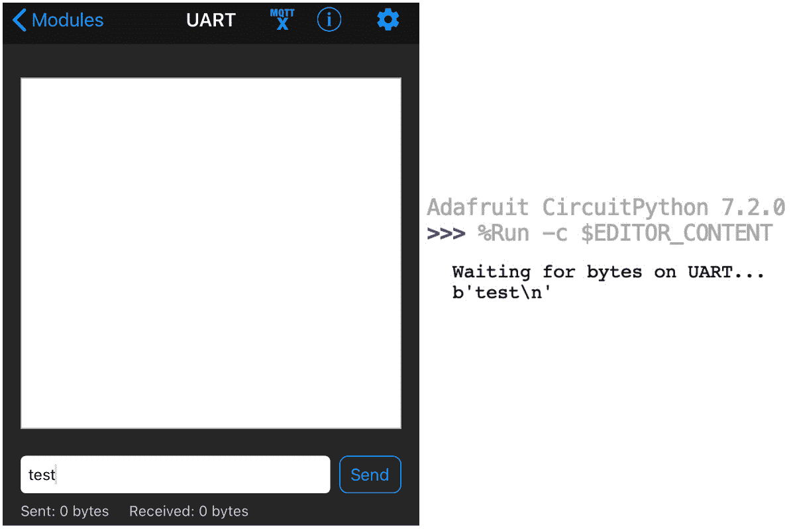

图 9.11 – 在 Pico 控制台中回显传入的蓝牙 UART 消息

*图 9.11* 显示了左侧手机的截图，准备发送消息。右侧的截图显示了消息出现在 Raspberry Pi Pico 控制台中。注意 `b` 前缀。这个前缀表示它是一个原始字节消息。我们将能够从这些消息中提取我们的按钮数据。

在下一节中，让我们看看智能手机应用如何使用这些数据进行控制。

## 按钮控制模式

在手机应用中，有几种不同的菜单模式可以与机器人交互。其中之一是 **控制器** 模式。以下截图显示了它的样子：

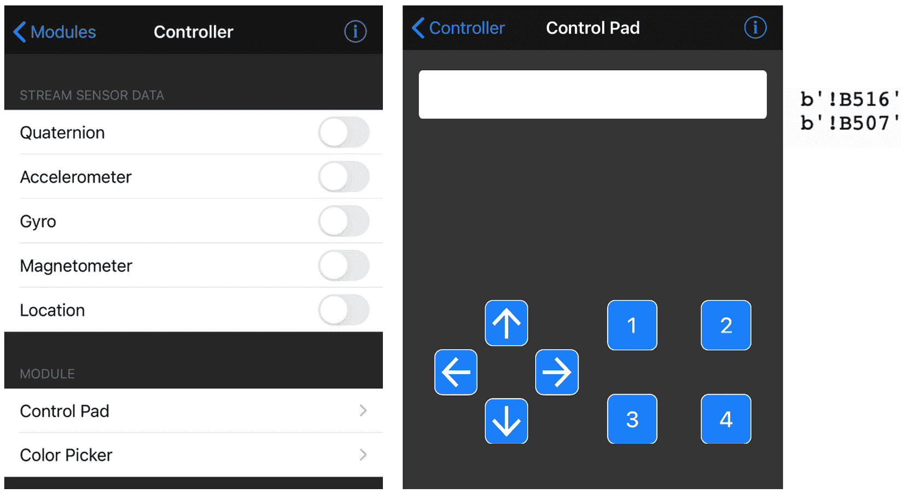

图 9.12 – Bluefruit 应用控制器模式

截图显示了控制器模式。最左侧的截图显示了初始 **控制器** 应用屏幕；从这个屏幕中，我们选择 **控制板**。

中间的截图显示了控制板。在这个截图中，左侧是一个方向垫，右侧是一组数字按钮。我们可以将这两个信号发送给机器人。

第三个、最右侧的截图显示了打印出来的控制信号的外观。这个输出看起来像一些奇怪的文本，但这是因为它是编码到数据 **包** 中的数据。一个包是在总线上的一段数据。

这些控制信号数据包编码了哪个按钮被改变以及它是被按下还是释放。现在尝试使用 `print-incoming` 应用程序按下一个按钮，你将看到一组控制代码。它们并不是特别适合人类阅读，所以我们需要解码它们。

让我们编写一些代码来检测和解码按钮控制数据包。

## 解码按钮控制数据包以驱动机器人

Adafruit 有一个库专门用于处理和解析这些数据包。将 CircuitPython 包中的 `adafruit_bluefruit_connect` 文件夹复制到你的 Pico 的 `CIRCUITY/lib` 目录下。

我们可以将这个函数导入到我们的代码中，并使用它来控制机器人。在你的电脑上创建一个名为 `bluetooth-teleoperation` 的文件夹。将最新的 `robot.py` 和 `pio_encoder.py` 文件复制到这个文件夹中。我们将以一个 `code.py` 文件开始，并包含导入语句：

```py
import board
import time
import busiofrom adafruit_bluefruit_connect.button_packet
import ButtonPacket
import robot
uart = busio.UART(board.GP12,board.GP13,baudrate=9600, timeout=0.01)
```

导入部分大多数都很熟悉，但我们添加了按钮数据包类型，这样我们就可以解码控制面板按钮。我们还设置了 UART 来接收数据。

键盘发送按键和释放信号。我们不希望机器人从手机那里什么都没有收到而继续行驶，所以我们将有一个停止时间。我们还将设置一个整体驾驶速度：

```py
stop_at = 0
speed = 0.8
```

现在，我们可以进入应用程序的主循环。我们首先会检查是否有等待的数据，如果有，就将其解码为按钮按压：

```py
while True:
  if uart.in_waiting:
    packet = ButtonPacket.from_stream(uart)
```

`from_stream` 函数可以直接从 UART 解码按钮数据包。它使我们免于考虑该数据包的字节数，通过尝试读取正确的字节数来释放我们。

如果我们有一个数据包，我们可以检查按钮是被按下还是释放，并确保在释放时停止机器人：

```py
    if packet:
      if not packet.pressed:
          robot.stop()
      elif packet.button == ButtonPacket.UP:
        robot.set_left(speed)
        robot.set_right(speed)
      elif packet.button == ButtonPacket.DOWN:
        robot.set_left(-speed)
        robot.set_right(-speed)
      elif packet.button == ButtonPacket.LEFT:
        robot.set_left(-speed)
        robot.set_right(speed)
      elif packet.button == ButtonPacket.RIGHT:
        robot.set_left(speed)
        robot.set_right(-speed)
```

上述代码首先检查你是否按下了按钮。然后，我们开始匹配按钮代码与不同的按钮，并根据你按下的按钮来改变电机速度以驱动或转向。

接下来，我们需要考虑超时。如果我们按下了按钮，我们应该重置超时，在外部循环中，我们应该检查超时：

```py
      stop_at = time.time() + 3
  if time.time() > stop_at:
    robot.stop()
```

在 `if` 数据包块的末尾，我们将 3 秒加到当前时间上；这将是我们超时的时间。然后，在 `while` 循环的底部，如果我们已经超过了 `stop_at` 时间，我们就停止机器人。

将此复制到 Pico 的 CircuitPython 上，你现在可以使用按钮来控制机器人。你可以将其从电脑上断开连接，打开电池电源，然后驾驶它。

你现在可以使用控制面板按钮来控制机器人。按下并保持按钮，它将在没有进一步按键的情况下行驶最多 3 秒；你需要多次按下以行驶更远。这个 3 秒的超时是在确保它不会跑掉和使其驾驶有趣之间的一种折衷。

## 故障排除

如果机器人没有响应，并且你已经尝试了前面的示例，请尝试这种方法进行故障排除。

在这样的代码中，添加 `print` 语句会有帮助。当你将机器人连接到电脑时，你只需使用 `print`。否则，使用 `uart.write(message.encode())`。尝试在 `while` 循环开始之前和代码处理按钮的地方添加这些语句。

通过在 `while` 循环之前打印，我们知道我们的代码已经开始（如果没有，我们可以将其连接到电脑以查找错误消息）。同样，我们可以在处理按钮时打印，以了解按钮信号是否被解码。

以这种方式打印可以让我们缩小问题所在的范围。通过检查我们未能看到的任何输出周围的行，我们可以看到可能有什么不正确，或者是否有线路需要验证。

现在你应该有一个可以远程控制的机器人！

# 摘要

在本章中，我们看到了如何将 Bluefruit LE 收发器连接到我们的机器人，然后使用它发送和接收数据。我们看到了机器人数据流向智能手机，数据从智能手机返回到机器人上的 Pico。

我们然后将这一概念提升到更高层次，发送格式化的数据以在手机上绘制传感器信息，使我们能够远程可视化机器人的状态。

最后，我们使用智能手机应用来控制和驱动机器人。在下一章中，我们将探讨 PID 算法，这是一种将传感器数据和输出在反馈回路中巧妙结合的方法，我们将使用我们新的远程数据绘图能力来调整它！

# 练习

这些练习让你扩展机器人代码的功能，并加深对主题的理解：

+   在蓝牙控制应用中，有四个数字按钮。你能扩展控制程序，使用这些按钮来控制机器人的速度吗？

+   蓝牙控制板应用还有一个小窗口来显示消息。尝试从机器人代码发送消息到应用，以便在此窗口中显示。

+   你能否使用编码器计数并绘制这些图表？也许在代码中将它们的总计数除以经过的时间，或者重置编码器计数并重新读取它们以绘制每秒的速率。

# 进一步阅读

+   Adafruit 对 Bluefruit UART LE Friend 的出色支持包括一个带有尺寸的产品页面 – [`www.adafruit.com/product/2479`](https://www.adafruit.com/product/2479)。此外，他们在 Adafruit 学习网站上提供了内容 [`learn.adafruit.com/introducing-the-adafruit-bluefruit-le-uart-friend/`](https://learn.adafruit.com/introducing-the-adafruit-bluefruit-le-uart-friend/)，包括更多连接和使用设备的方法、完整的数据表和规格，以及额外的软件。

Adafruit 还在他们的 Discord 上有一个`#help-with-radio`频道，有一个专门帮助解决与他们的收发器模块相关的问题、疑问和想法的社区。

+   想要了解更多关于蓝牙低功耗（Bluetooth LE）的信息，请查看穆罕默德·乌萨马·宾·阿夫塔布（Muhammad Usama bin Aftab）所著的《Building Bluetooth Low Energy Systems》。这本书详细探讨了适用于物联网（**IoT**）的无线网络通信系统。物联网的概念很好地转化为机器人技术。

# 第三部分：为 Raspberry Pi Pico 添加更多机器人行为

现在我们已经看到了一些传感器，我们可以添加更多有趣的机器人行为。我们将学习机器人算法，以更好地利用距离传感器和编码器。然后我们介绍惯性测量单元。最后，我们将探讨如何使用传感器在已知空间中定位机器人。

本部分包含以下章节：

+   *第十章*，*使用 PID 算法跟踪墙壁*

+   *第十一章*，*在 Raspberry Pi Pico 上使用编码器控制运动*

+   *第十二章*，*在 Raspberry Pi Pico 上使用 IMU 检测方向*

+   *第十三章*, *使用蒙特卡洛定位确定位置*

+   *第十四章*, *继续你的旅程 – 你的下一个机器人*
