# 第十三章：使用蒙特卡洛定位确定位置

我们现在在我们的机器人上有几个有趣的传感器。然而，我们还没有将它们结合起来理解机器人的位置。**蒙特卡洛模拟**是一种使用多个传感器和机器人世界模型来估计其在该世界中的位置和航向的方法。

你将学习如何制作一个用于机器人的测试场地，然后是如何用代码建模这个场地，以及如何通过蓝牙发送这些数据到电脑上查看。你将练习统计方法，让机器人开始猜测其位置。你将看到如何丰富编码器数据并移动猜测，然后将其与距离传感器数据集成以细化猜测，使用一种在面对噪声传感器数据时有效且能应对轻微不准确的方法。这将在蒙特卡洛猜测和检查循环中实现。

在本章中，我们将涵盖以下主要主题：

+   为我们的机器人创建训练区域

+   建模空间

+   使用传感器跟踪相对姿态

+   蒙特卡洛定位

# 技术要求

对于本章，你需要以下内容：

+   来自 *第十二章*，*在 Raspberry Pi Pico 上使用 IMU 检测方向* 的机器人和代码

+   带有蓝牙低功耗（LE）的 PC 或笔记本电脑

+   安装了 Python 3.7 以及 Python 的 `matplotlib`、`bleak` 和 `NumPy` 库

+   10 x 10-mm A1 片材泡沫板

+   胶管或电工胶带

+   一把卷尺

+   一把金属直尺、三角板和铅笔

+   一把锋利的工艺刀

+   1.5 平方米的地面空间

你可以在 [`github.com/PacktPublishing/Robotics-at-Home-with-Raspberry-Pi-Pico/tree/main/ch-13`](https://github.com/PacktPublishing/Robotics-at-Home-with-Raspberry-Pi-Pico/tree/main/ch-13) 找到本章的代码。

# 为我们的机器人创建训练区域

我们将估计机器人在空间中的位置。机器人需要一个已知的空间来工作，因此我们将为它构建一个简单的世界。这个训练区域，或称场地，大致基于 Pi Wars 中使用的那些（见 [`piwars.org/2022-competition/general-rules/`](https://piwars.org/2022-competition/general-rules/) 下的 *场地建设规则*），这是一个英国机器人竞赛，其中这个算法可以用于机器人进行自主竞赛。

让我们更仔细地看看场地。

## 我们将制作什么

下图显示了我们将制作的场地：

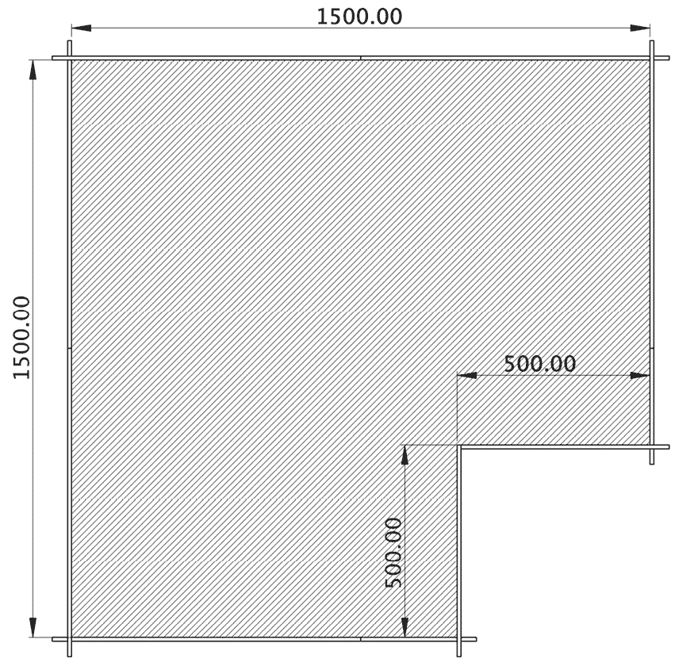

图 13.1 – 机器人测试场地

*图 13*。1 显示了一个带有尺寸的场地俯视图。场地主要是方形的，以保持制作和建模简单。为了帮助蒙特卡洛模拟工作，必须在一边有一个切口以防止旋转对称性——也就是说，你不能旋转场地，使其从多个角度看起来相同。

竞技场应该足够大，以便机器人可以在其中自由移动，但又不过分大，1,500 毫米是一个很好的折衷方案。竞技场的墙壁应该足够高，以便机器人的距离传感器不会错过它们。合理的墙面高度将是 200 毫米。我们将在本章中使用*mm*来保持一致性。

竞技场大小与机器人速度的关系

注意，您可能需要一个更大的竞技场来让机器人跑得更快，而较小的竞技场会给机器人更少的时间来检测其特征。

竞技场地板表面很重要；如果机器人的轮子打滑，那么计算将受到精度的影响。

接下来，我们可以看看我们将如何构建它。

## 我们将如何制作竞技场

我们将使用泡沫板来搭建竞技场，因为它轻便且易于切割；A1 板很容易买到，可以从这些板上切割出面板。

以下图表显示了我们可以如何制作竞技场：

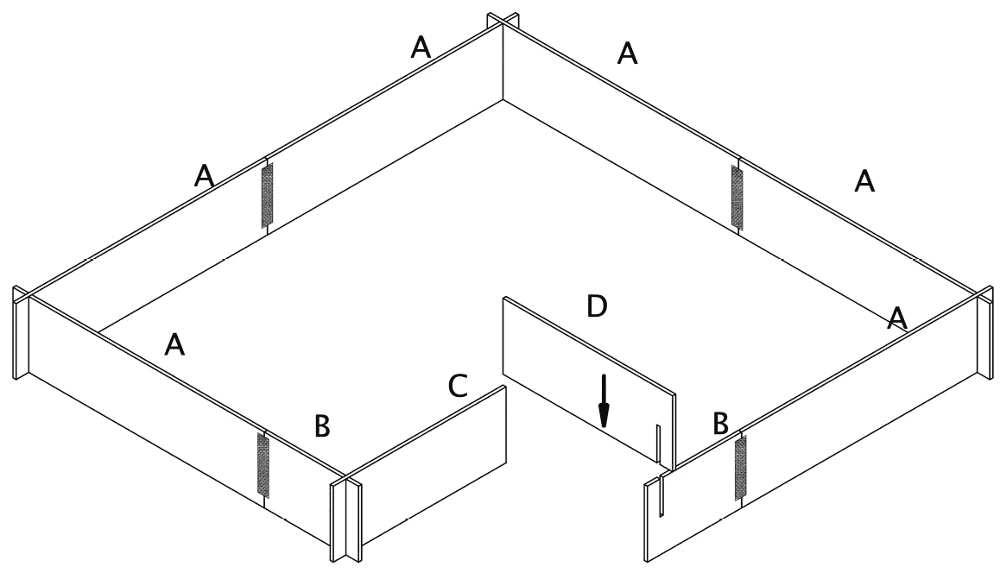

图 13.2 – 制作竞技场

*图 13**.2*展示了竞技场的 3D 视图。字母表示不同的部分。Dumont Cybernetics 团队启发了这种风格。我们可以将竞技场分成几部分，像面板*D*和*B*之间的那样拼接角落接缝，或者使用胶带（如胶带）制作铰接部分，如面板*A*和*B*之间的部分。这个竞技场是 1,500 毫米长，所以当不使用时可以拆卸并折叠成小尺寸。

以下图表显示了我们将需要的部件来制作这个：

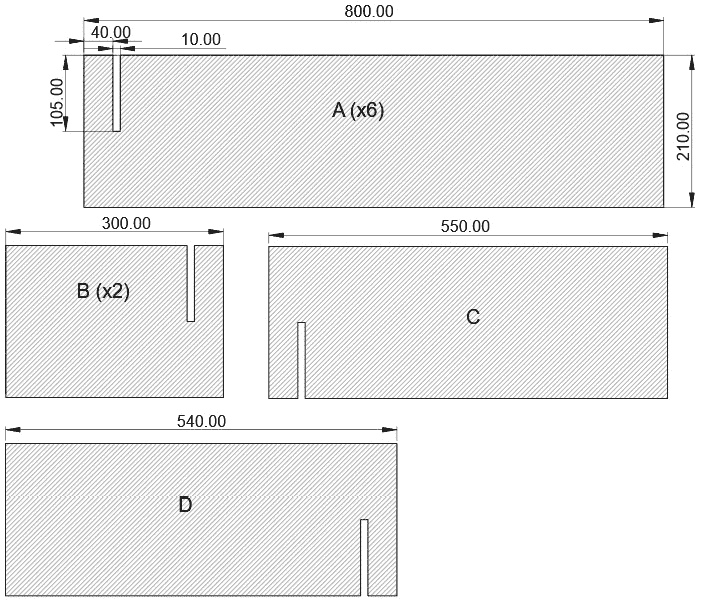

图 13.3 – 制作竞技场的部件图

*图 13**.3*显示了制作竞技场需要切割的部件。每个部件都有一个字母，表示您需要制作的部件数量，以及切割部件的尺寸。槽的轮廓都与面板**A**相同，以及墙面高度。

可以从一块板上切割出四个 A 面板，并留下一些材料。让我们看看如何切割它们。

## 切割技巧

您可以使用与*第四章*中切割塑料类似的方式切割泡沫板，即*在 Pico 周围搭建机器人*。使用卷尺、大尺子和三角板在铅笔上标记您将切割的位置。确保您用于切割的表面高度适中，这样长时间的重复切割不会使您的背部感到疼痛。

然后，沿着直金属边缘，多次用锋利的刀沿着切割线划过。对于第一次切割，目标只是划破顶部的塑料层，然后继续切割，直到穿过。注意要切割相同区域——这是一个让后续切割跟随早期切割的问题，即轻轻握住刀片。

我建议先切割墙面高度条带，然后再在它们上标记槽位和墙面长度。

这些板材通常夹有可丢弃的泡沫垫片；这有助于作为切割面，这样您就不会损坏下面的桌子或地板。

如果有撕裂，要么是你施加了过多的压力，要么需要更换你的刀片为锋利的新刀片。

注意切割槽位。墙壁的高度不需要非常精确；几毫米以内就足够了。现实世界通常不像模拟那样精确和清晰，而这个算法将能够应对这种情况。

一旦切割好部件，组装竞技场的角落，然后在内部接合处（不是槽位）制作胶带铰链。第一次拆卸时，沿着这些铰链折叠部件，然后在接合处的外面贴上胶带。使用电工胶带或胶带，这应该足够坚固。

现在我们有了真实的空间，我们需要对其进行建模，以便机器人可以使用它。

# 空间建模

Monte Carlo 系统的目标是模拟或模拟空间和机器人的位置。在本节中，我们将学习机器人代码如何表示这个空间。我们还将探讨如何使用计算机来可视化我们的机器人猜测。基于 Monte Carlo 的行为代码会频繁地将传感器读数与空间模型进行比较，因此我们应该在机器人上表示空间以优化这一点。

以下图表显示了计算机和机器人在此中的作用：

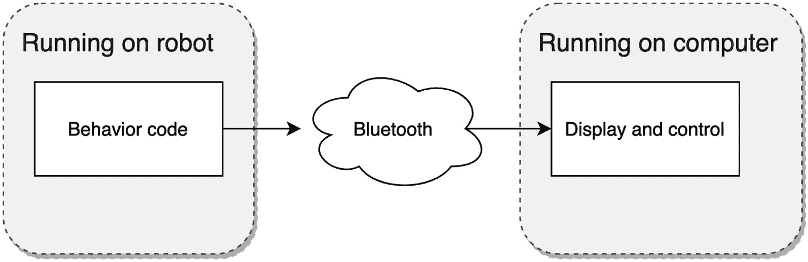

图 13.4 – 使用计算机可视化

*图 13**.4* 显示了该系统显示和控制架构的概述。行为代码在机器人上运行。计算机显示机器人代码的状态，以及启动和停止控制。竞技场和系统的状态都属于机器人。

让我们看看如何在机器人上表示竞技场。

## 将竞技场和机器人位置表示为数字

对于这种模型，竞技场的边界很重要。我们可以从获取角落的 2D *X* 和 *Y* 坐标开始。

看看以下竞技场的表示：


图 13.5 – 竞技场和姿态作为坐标

*图 13**.5* 显示了竞技场的简化版本。坐标描述了每个角落的数字。我们可以在代码中直接使用这些数字。这些角落可以连接成线段。线段是一组表示线段起点和终点的坐标。代码中的所有坐标都将使用毫米为单位。

我们的机器人在竞技场内的某个位置将有一个**姿态**。姿态描述了机器人在空间中的位置 – 在这种情况下，竞技场 2D 空间的任何位置，并面向 360 度中的任何角度。想象这就像一个地图针，有一个箭头指向航向。

*图 13**.5* 也显示了两个机器人姿态，*A* 和 *B*。每个姿态在竞技场内都有一个 mm 单位的 *X* 和 *Y* 坐标，并且每个姿态都有一个航向 theta (θ) 度。这三个数字将代表这个 2D 空间中的每个机器人姿态。在模拟开始时，机器人可以位于竞技场内的任何位置，并面向任何角度。

我们竞技场的表示以*0, 0*为左下角。朝向*0*面向右侧，正 theta 角度逆时针。例如，姿态*A*从右侧逆时针大约 30 度，姿态*B*从右侧 300 度。

在这个系统中，我们将有许多姿态估计，它们的行为类似于粒子。这里的蒙特卡洛模拟也被称为**粒子滤波器**，因为姿态是如何被操纵并根据传感器数据进行过滤的。

现在，让我们开发用于竞技场边界线段的代码。

### 将表示转换为代码

我们将以代码的形式表示竞技场并在计算机上渲染它。然后，我们将竞技场的表示移动到机器人上，计算机将从它那里获取数据。

在创建`arena.py`文件后，我们可以将其添加到其中：

```py
width = 1500
height = 1500
cutout_width = 500
cutout_height = 500
boundary_lines = [
    [(0,0), (0, height)],
    [(0, height), (width, height)],
    [(width, height), (width, cutout_height)],
    [(width, cutout_height), (width - cutout_width, cutout_height)],
    [(width - cutout_width, cutout_height), (width - cutout_width, 0)],
    [(width - cutout_width, 0), (0, 0)],
]
```

`boundary_lines`变量代表一个线段列表，每个线段都是一个包含起始和结束坐标的数组，读取为`[(start_x, start_y), (end_x, end_y)]`。我们也将竞技场的`width`和`height`值存储在这里。如果你的竞技场大小不同，请更新这些值。

我们可以使用`matplotlib`，一个 Python 的数学绘图库来显示这些。为此，首先在你的电脑上安装 Python 3.7（或更高版本），然后在终端中使用`python3 -mpip install matplotlib numpy`命令来获取库。对于 Linux，你可能需要在包管理器中安装额外的`python3-tk`包。

创建`display_arena.py`文件以绘制竞技场。该文件首先导入`matplotlib`。惯例是将数据绘图模块`pyplot`导入为`plt`：

```py
from matplotlib import pyplot as plt
import arena
for line in arena.boundary_lines:
    plt.plot([line[0][0], line[1][0]], [line[0][1], line[1][1]], color="black")
plt.show()
```

我们将遍历竞技场中的线。`plot`方法接受一条线的*X*坐标，然后是它的*Y*坐标，并允许我们指定线条颜色。运行`python3 display_arena.py`，这将为我们绘制竞技场：


图 13.6 – 竞技场的 matplotlib 绘制

上述图示显示了计算机根据我们的代码绘制的竞技场。它沿着左侧和底部有网格坐标。

现在，我们可以查看将此模型数据移动到机器人，它将使用该数据。

## 从机器人提供竞技场服务

机器人应该是竞技场数据的真相来源，因此让我们将竞技场模型放在那里。在你的电脑上创建一个`robot`文件夹，并将`arena.py`移动到其中。我们将把`robot`文件夹的内容复制到 Raspberry Pi Pico 上。从前面的章节中，将`robot.py`、`pid_controller.py`和`pio_encoder.py`复制到`robot`文件夹中。

然后，我们可以添加一些代码来从机器人提供我们的竞技场边界线。在`robot/code.py`中，从导入和辅助函数开始：

```py
import asyncio
import json
import arena
import robot
def send_json(data):
    robot.uart.write((json.dumps(data)+"\n").encode())
def read_json():
    data = robot.uart.readline()
    decoded = data.decode()
    return json.loads(decoded)
```

在机器人上，我们可以像在 *第十章* 中一样处理命令，即使用 PID 算法跟踪墙壁；然而，我们将使用 **JavaScript 对象表示法**（**JSON**），这是一种方便表示更复杂信息的方法。

我们发送的任何数据都会被转换为 JSON 格式，然后添加一个 `"\n"` 换行符以显示这是一个完整的消息。然后我们对其进行编码。我们接收到的数据使用 `json.loads` 进行解包，这将导致字典类型的数据结构。

然后，我们可以添加一个处理程序，当请求时发送回竞技场：

```py
async def command_handler():
    print("Starting handler")
    while True:
        if robot.uart.in_waiting:
            request = read_json()
            print("Received: ", request)
            if request["command"] == "arena":
                send_json({
                    "arena": arena.boundary_lines,
                })
        await asyncio.sleep(0.1)
asyncio.run(command_handler())
```

这将循环等待竞技场命令。它打印出接收到的任何 JSON 以供故障排除。它将使用 JSON 发送回竞技场数据。

通过在 UART 模式下通过 Bluefruit 应用发送 `{"command": "arena"}`，可以与机器人交互。机器人将以列表的形式发送边界线。然而，理想情况下，我们希望计算机使用 `matplotlib` 从机器人显示这些信息。我们首先需要将计算机连接到机器人。

## Bleak 库

使用 `python3 -mpip install bleak` 安装此库。Bleak 的文档在 [`bleak.readthedocs.io/en/latest/`](https://bleak.readthedocs.io/en/latest/)。

我们还需要关于 Adafruit Bluefruit 系统的信息。蓝牙低功耗（BLE）有设备 ID 和蓝牙上服务的 ID。有关详细信息，请参阅 [`learn.adafruit.com/introducing-adafruit-ble-bluetooth-low-energy-friend/uart-service`](https://learn.adafruit.com/introducing-adafruit-ble-bluetooth-low-energy-friend/uart-service)。我们将在下面的代码中使用这些信息。

我们将从列出设备的一个示例开始，以检查我们是否可以找到机器人的蓝牙 UART。创建 `find_devices.py` 文件并添加以下内容：

```py
import asyncio
import bleak
async def run():
    ble_uuid = "6E400001-B5A3-F393-E0A9-E50E24DCCA9E"
    ble_name = "Adafruit Bluefruit LE"
    devices = await bleak.BleakScanner.discover(service_uuids=[ble_uuid])
    print(f"Found {len(devices)} devices")
    print([device.name for device in devices])
    matching_devices = [device for device in devices if device.name==ble_name]
    if len(matching_devices) == 0:
        raise RuntimeError("Could not find robot")
    ble_device_info = matching_devices[0]
    print(f"Found robot {ble_device_info.name}...")
asyncio.run(run())
```

此代码首先导入 `asyncio` 和 `bleak` 库。run 函数需要是异步的，以便它可以等待 `bleak` 扫描器。

我们根据 Adafruit 文档定义 Adafruit Bluefruit 的 ID 和名称，然后请求 `bleak` 库使用 Adafruit UART 服务发现可用的设备。等待结果后，接下来的几行将打印这些信息。函数随后会筛选出具有匹配名称的设备，检查是否找到了它，并成功打印出来。

使用 `python3 find_devices.py` 运行此代码。如果机器人处于关闭状态，您将看到“找不到机器人”的错误。然而，在机器人开启状态下运行应该显示以下输出：

```py
Found 1 devices
['Adafruit Bluefruit LE']
Found robot Adafruit Bluefruit LE...
```

有时，`bleak` 可能会难以找到机器人并显示前面的错误。您需要重新运行示例以找到机器人。现在我们可以将此代码放入一个库中，以便在本书剩余的实验中使用。

## 创建一个蓝牙低功耗包装库

我们将把这个库命名为 `robot_ble_connection.py`。我们将从导入开始：

```py
import asyncio
import bleak
```

我们将连接处理放入一个类中：

```py
class BleConnection:
    ble_uuid = "6E400001-B5A3-F393-E0A9-E50E24DCCA9E"
    rx_gatt = "6E400003-B5A3-F393-E0A9-E50E24DCCA9E"
    tx_gatt = "6E400002-B5A3-F393-E0A9-E50E24DCCA9E"
    ble_name = "Adafruit Bluefruit LE"
```

查看[`learn.adafruit.com/introducing-adafruit-ble-bluetooth-low-energy-friend/gatt-service-details`](https://learn.adafruit.com/introducing-adafruit-ble-bluetooth-low-energy-friend/gatt-service-details)以了解这些变量的解释。

当我们创建处理连接的对象时，我们将有两个客户端代码可以提供的函数，一个用于连接完成，一个用于接收数据：

```py
    def __init__(self, receive_handler):
        self.ble_client = None
        self.receive_handler = receive_handler
```

`receive_handler`是一个可以与包含接收数据的 Python `bytes`对象一起调用的函数。我们将调整我们的接收处理程序，使其能够被`bleak`库使用来接收数据：

```py
    def _uart_handler(self, _, data: bytes):
        self.receive_handler(data)
```

现在，我们添加一个连接方法。这和`find_devices`示例的启动方式相同：

```py
    async def connect(self):
        print("Scanning for devices...")
        devices = await bleak.BleakScanner.discover(
            service_uuids=[self.ble_uuid]
        )
        matching_devices = [device for device in devices if device.name==self.ble_name]
        if len(matching_devices) == 0:
            raise RuntimeError("Could not find robot")
        ble_device_info = matching_devices[0]
        print(f"Found robot {ble_device_info.name}...")
```

然而，然后我们需要连接到这个设备并处理接收到的数据：

```py
        self.ble_client = bleak.BleakClient(ble_device_info.address)
        await self.ble_client.connect()
        print("Connected to {}".format(ble_device_info.name))
        self.notify_task = asyncio.create_task(
            self.ble_client.start_notify(self.rx_gatt, self._uart_handler)
        )
```

我们创建一个`BleakClient`对象，然后等待连接到机器人。连接后，它将创建一个后台任务来通知处理程序数据到达。这个`start_notify`方法使用`rx_gatt`从这个 Adafruit Bluefruit 设备接收 UART 数据。

我们需要能够关闭连接：

```py
    async def close(self):
        await self.ble_client.disconnect()
```

然后，这段代码的最后一部分可以向机器人发送数据：

```py
    async def send_uart_data(self, data):
        await self.ble_client.write_gatt_char(self. tx_gatt, data)
```

这将等待发送数据，并使用正确的 UUID 将数据传输到 UART。

这个`robot_ble_connection`库现在可以在代码中使用了。

## 在计算机屏幕上显示机器人的数据

我们可以使用`matplotlib`显示来自机器人的数据，通过前面的代码连接到机器人，并请求竞技场。这个演示将把`matplotlib`与蓝牙连接结合起来。

我们将把这个放在一个名为`display_from_robot.py`的新文件中，从导入开始：

```py
import asyncio
import json
import matplotlib.pyplot as plt
from robot_ble_connection import BleConnection
```

我们将把我们的显示系统放在一个名为`RobotDisplay`的类中：

```py
class RobotDisplay:
    def __init__(self):
        self.ble_connection = BleConnection(self.handle_data)
        self.buffer = ""
        self.arena = {}
        self.closed = False
        self.fig, self.axes = plt.subplots()
```

第一部分设置 BLE 连接，并使用一个`handle_data`方法准备它（这是 BLE 数据处理程序，我们很快将实现它）。

当数据通过 BLE 到达计算机时，整个消息可以跨越几个对`handle_data`方法的调用进行分割。我们在文本行中工作，所以我们将使用`self.buffer`来存储任何部分行，直到我们得到一个行结束符，表示一行完成。我们还有一个地方来存储来自机器人的竞技场，以及一个标志来检测应用程序是否关闭。显示系统通过`plt.subplots`准备好，它获取一个图形和坐标轴——我们将在`draw`方法中使用这些来绘制显示。

让我们为应用程序关闭创建一个处理程序：

```py
    def handle_close(self, _):
        self.closed = True
```

此处理程序将仅将`closed`标志设置为`True`，我们可以在以后进行检查。`matplotlib`将自动为我们创建一个应用程序窗口来显示输出。

接下来，我们将构建 BLE 数据处理器：

```py
    def handle_data(self, data):
        self.buffer += data.decode()
        while "\n" in self.buffer:
            line, self.buffer = self.buffer.split("\n", 1)
            print(f"Received data: {line}")
            try:
                message = json.loads(line)
            except ValueError:
                print("Error parsing JSON")
                return
            if "arena" in message:
                self.arena = message
```

这将解码传入的数据并将其收集到`self.buffer`变量中。当缓冲区有行结束符`"\n"`时，它将分割出单行并将其解码为 JSON。

然后，我们检查这个 JSON 是否包含竞技场数据。如果是，我们将其存储在`arena`数据成员中。

接下来，我们将竞技场线绘制放入一个方法中：

```py
    def draw(self):
        self.axes.clear()
        if self.arena:
            for line in self.arena["arena"]:
                self.axes.plot(
                    [line[0][0], line[1][0]], [line[0][1], line[1][1]], color="black"
                )
```

此函数使用 `self.axes.clear()` 函数清除之前的显示，然后重新绘制竞技场线条。

应用程序的 `main` 方法启动连接并请求机器人提供竞技场：

```py
    async def main(self):
        plt.ion()
        await self.ble_connection.connect()
        try:
            request = json.dumps({"command": "arena"}).encode()
            print(f"Sending request for arena: {request}")
            await self.ble_connection.send_uart_data(request)
            self.fig.canvas.mpl_connect("close_event", self.handle_close)
```

此函数通过 `plt.ion()` 启用 `matplotlib` 的交互模式 – 这意味着我们可以处理屏幕重绘的时间，这适合我们的数据模型。

我们随后调用并等待 BLE 的 `connect` 函数。一旦建立连接，我们将剩余部分包裹在一个 `try`/`finally` 块中，以确保如果此代码停止或中断，BLE 连接将被关闭。然后我们向机器人发送请求，要求获取竞技场。

此代码设置 `close` 处理器，以便我们可以检测窗口是否关闭，并立即基于关闭标志进入主 `while` 循环：

```py
            while not self.closed:
                self.draw()
                plt.draw()
                plt.pause(0.05)
                await asyncio.sleep(0.01)
        finally:
            await self.ble_connection.close()
```

主循环使用 `plt.draw()` 更新显示，然后等待 0.05 秒，给 `matplotlib` 处理交互事件的时间。它还有一个 0.01 秒的异步睡眠，给 BLE 任务运行的时间。这些睡眠和暂停必须频繁调用。最后，`finally` 确保我们关闭 BLE 连接。

我们接下来需要创建类的实例并启动 `main` 循环：

```py
robot_display = RobotDisplay()
asyncio.run(robot_display.main())
```

到目前为止，显示代码已完成。将 `robot` 文件夹发送到 Raspberry Pi Pico，并开启电池电源，使用以下命令启动显示代码：

```py
python3 display_from_robot.py
```

你应该看到 BLE 连接消息，然后在计算机上看到以下输出：

```py
Sending request for arena: b'{"command": "arena"}'
Received data: {"arena": [[[0, 0], [0, 1500]], [[0, 1500], [1500, 1500]], [[1500, 1500], [1500, 500]], [[1500, 500], [1000, 500]], [[1000, 500], [1000, 0]], [[1000, 0], [0, 0]]]}
```

大约 30 秒后，你应该看到计算机显示竞技场。这看起来与 *图 13**.6 相同，但现在数据来自机器人。

我们让计算机连接到机器人，并从它那里检索竞技场信息。机器人以简单的方式对空间进行了建模。

在下一节中，我们将更详细地探讨机器人姿态，在计算机上显示它们，并从编码器传感器更新它们。

# 使用传感器跟踪相对姿态

在本节中，我们将探讨什么是姿态，如何创建、发送和显示姿态，以及如何根据机器人的移动来移动姿态。

## 设置姿态

我们将在 `robot/code.py` 中使用 `ulab` 创建一些随机姿态，提供 CircuitPython 中的此功能。此库还提供了方便的方式来存储和处理数组。

导入 `ulab` 库和 `random` 以生成随机姿态：

```py
import asyncio
import json
import random
from ulab import numpy as np
```

在 `read_json` 函数之后，我们将添加一个 `Simulation` 类来保存姿态：

```py
class Simulation:
    def __init__(self):
        self.population_size = 20
        self.poses = np.array(
            [(
                int(random.uniform(0, arena.width)),
                int(random.uniform(0, arena.height)),
                int(random.uniform(0, 360))) for _ in range(self.population_size)],
            dtype=np.float,
        )
```

我们将创建一个包含 20 个随机姿态的小型种群。`poses` 变量是一个 `population_size` 个元素的 `NumPy` 数组，每个元素都是一个 *X*，*Y* 航向姿态。NumPy 允许我们指定数据类型；我们使用 `float` 类型，这样我们就可以在分数值中工作。

在 `Simulation` 之前添加一个函数，用于将 *X* 和 *Y* 姿态坐标发送到计算机：

```py
def send_poses(samples):
    send_json({
        "poses": np.array(samples[:,:2], dtype=np.int16).tolist(),
    })
```

`[:, :2]` 符号使我们能够从 `poses` 数组中的每个姿态提取前两个条目，即 *X* 和 *Y* 坐标。我们将这些转换为 `int16` 以减少发送的数据量 – UART 容易被姿态数据淹没。

命令处理程序现在可以在场地之后发送姿态：

```py
async def command_handler(simulation):
    print("Starting handler")
    while True:
        if robot.uart.in_waiting:
            request = read_json()
            print("Received: ", request)
            if request["command"] == "arena":
                send_json({
                    "arena": arena.boundary_lines,
                })
                send_poses(simulation.poses)
        await asyncio.sleep(0.1)
simulation = Simulation()
asyncio.run(command_handler(simulation))
```

现在，`command_handler`接收模拟并通过场地发送姿态。在我们开始处理程序之前，我们根据其类创建`simulation`。

此代码现在已准备好由计算机显示这些姿态。

## 显示姿态

我们现在可以增强我们的`matplotlib`文件`display_from_robot.py`，添加姿态。首先，我们将添加`numpy`到导入部分：

```py
import asyncio
import json
import numpy as np
import matplotlib.pyplot as plt
```

当我们在`__init__`方法中设置显示时，我们添加一个空的`poses`成员：

```py
        self.fig, self.axes = plt.subplots()
        self.poses = None
```

接下来，我们需要扩展`handle_data`以将姿态加载到`int16` NumPy 数组中：

```py
            if "arena" in message:
                self.arena = message
            if "poses" in message:
                self.poses = np.array(message["poses"], dtype=np.int16)
```

然后我们扩展`draw`方法以显示姿态，检查是否有加载的，如果有，将它们放入散点图，分割到*X*和*Y*组件以适应`matplotlib`：

```py
        if self.arena:
            for line in self.arena["arena"]:
                self.axes.plot(
                    [line[0][0], line[1][0]], [line[0][1], line[1][1]], color="black"
                )
        if self.poses is not None:
            self.axes.scatter(self.poses[:,0], self.poses[:,1], color="blue")
```

将`robot`文件夹发送到 Pico，然后在计算机上运行`display_from_robot.py`，在 BLE 启动后，你应该看到以下截图类似的内容：

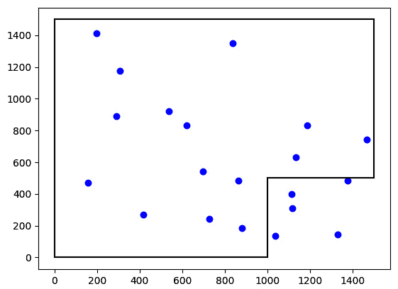

图 13.7 – 场地中绘制的姿态

*图 13.7*显示了场地中绘制的 20 个姿态，以点表示。每个点都是机器人可能位置的潜在猜测。其中一些在切割区域，稍后将被消除。

这些姿态需要在我们机器人移动时移动，所以让我们让我们的机器人移动。

## 带碰撞避免的移动

机器人在我们进行模拟时会移动，所以在机器人移动时避免碰撞会很好。我们将通过异步程序来完成这项工作，这样代码的其他部分也可以同时运行。以下架构图显示了这是如何工作的：

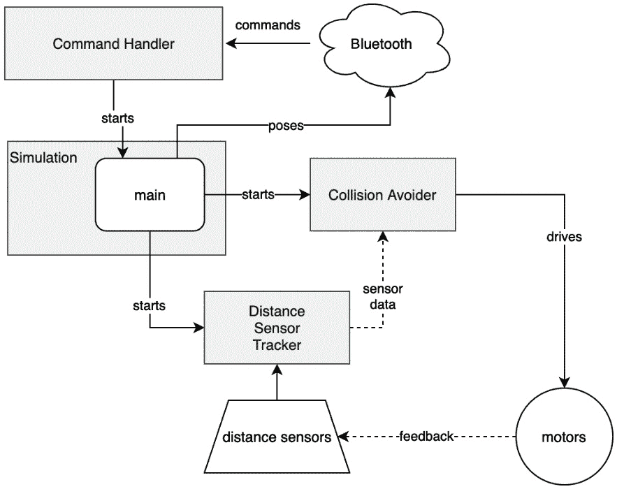

图 13.8 – 具有碰撞避免架构的模拟

`command handler`系统接受蓝牙命令请求。命令处理程序在`simulation`中启动`main`循环。模拟将启动一个`simulation` `main`方法，并通过蓝牙发送姿态。

我们将从`DistanceSensorTracker`开始，这是一个用于跟踪距离传感器及其最后读数的类。将此放在`robot/code.py`下的导入部分：

```py
class DistanceSensorTracker:
    def __init__(self):
        robot.left_distance.distance_mode = 2
        robot.right_distance.distance_mode = 2
        self.left = 300
        self.right = 300
```

我们在这里明确指定了传感器模式，调整它以适应场地的尺寸。我们还输入了起始值，直到有读数可用。

传感器追踪器循环在准备好时获取读数并重置传感器中断：

```py
    async def main(self):
        robot.left_distance.start_ranging()
        robot.right_distance.start_ranging()
        while True:
            if robot.left_distance.data_ready and robot.left_distance.distance:
                self.left = robot.left_distance.distance * 10
                robot.left_distance.clear_interrupt()
            if robot.right_distance.data_ready and robot.right_distance.distance:
                self.right = robot.right_distance.distance * 10
                robot.right_distance.clear_interrupt()
            await asyncio.sleep(0.01)     
```

我们将传感器读数乘以 10 以将其转换为毫米，然后存储它们。剩余的代码可以直接使用这些存储的读数。

接下来，我们将构建`CollisionAvoid`类，以使机器人远离传感器检测到的墙壁。在`DistanceSensorTracker`类之后添加此类：

```py
class CollisionAvoid:
    def __init__(self, distance_sensors):
        self.speed = 0.6
        self.distance_sensors = distance_sensors
```

这有一个初始的机器人速度，以及一个关于距离传感器追踪器的引用。然后有一个`main`碰撞避免循环：

```py
    async def main(self):
        while True:
            robot.set_right(self.speed)
            while self.distance_sensors.left < 300 or \
                    self.distance_sensors.right < 300:
                robot.set_left(-self.speed)
                await asyncio.sleep(0.3)
            robot.set_left(self.speed)
            await asyncio.sleep(0)
```

此循环启动右电机移动，如果看起来可能发生碰撞，它将设置左电机向后移动并等待然后再前进。`asyncio.sleep` 延迟意味着其他任务可以在机器人上继续。

在 `Simulation` 类内部，将传感器和 `collision_avoider` 添加到 `__init__` 方法中：

```py
        self.distance_sensors = DistanceSensorTracker()
        self.collision_avoider = CollisionAvoid(self.distance_sensors)
```

然后，我们在 `__init__` 模拟下方添加一个模拟 `main` 方法。这启动了其他组件的任务，然后循环发送姿态回计算机：

```py
    async def main(self):
        asyncio.create_task(self.distance_sensors.main())
        collision_avoider = asyncio.create_task(self.collision_avoider.main())
        try:
            while True:
                await asyncio.sleep(0.1)
                send_poses(self.poses)
        finally:
            collision_avoider.cancel()
            robot.stop()
```

此外，还有错误处理以停止机器人，如果这里发生任何错误 – 我们取消碰撞避免器任务（这将设置机器人的速度）并停止电机。这里的睡眠允许其他任务运行并避免 BLE UART 过载。

扩展 `command_handler` 方法以启动模拟的 `main` 任务。我们将基于显示 UI 中的 **启动** 按钮这样做。首先，我们将在处理程序的顶部存储任务状态：

```py
async def command_handler(simulation):
    print("Starting handler")
    simulation_task = None
    while True:
```

然后，我们将处理其中的 `start` 命令：

```py
            if request["command"] == "arena":
                send_json({
                    "arena": arena.boundary_lines,
                })
            elif request["command"] == "start":
                if not simulation_task:
                    simulation_task = asyncio.create_task(simulation.main())
```

如果尚未运行，启动按钮将运行模拟 `main` 任务。

### 在计算机上添加启动按钮

我们需要将相应的按钮添加到计算机显示代码中。打开 `display_from_robot.py`。在导入部分，添加以下内容：

```py
from matplotlib.widgets import Button
```

在 `RobotDisplay` 类中，我们可以添加一个辅助程序来发送 JSON 命令，就像我们在机器人上所做的那样。将其添加到机器人显示类中，在 `main` 方法之上：

```py
    async def send_command(self, command):
        request = (json.dumps({"command": command})  ).encode()
        print(f"Sending request: {request}")
        await self.ble_connection.send_uart_data(request)
```

为了使用 `await` 在 BLE `send_uart_data` 函数上，这必须是非同步的。

在 `main` 之上添加一个启动按钮处理程序，以便在按钮被按下时调用：

```py
    def start(self, _):
        self.button_task = asyncio.create_task(self.send_command("start"))
```

这将开始发送数据但不等待它 – 因此 `matplotlib` 事件循环不会卡在等待中。

我们可以用 `send_command` 方法替换 `main` 方法中的 JSON 发送：

```py
        await self.ble_connection.connect()
        try:
            await self.send_command("arena")
```

然后我们添加按钮。将高亮代码添加到 `main` 方法中：

```py
            self.fig.canvas.mpl_connect("close_event", self.handle_close)
            start_button = Button(plt.axes([0.7, 0.05, 0.1, 0.075]), "Start")
            start_button.on_clicked(self.start)
            while not self.closed:
```

代码使用 `send_command` 包装器在启动时请求竞技场。然后我们添加 `start_button`，使用 `plt.axes` 来定位它。

我们将一个 `on_clicked` 处理程序连接到 `start` 方法以启用按钮。

将 `robot` 文件夹发送到 Raspberry Pi Pico，并在计算机上运行 `display_from_robot.py`。我建议在连接时将机器人支撑起来以进行故障排除，然后在竞技场中测试它。显示将类似于以下截图：

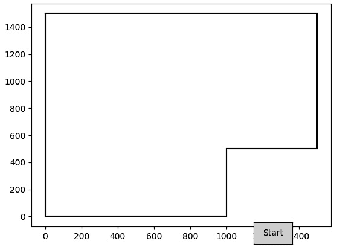

图 13.9 – 带按钮的竞技场显示

*图 13**.9* 显示了显示上的 **启动** 按钮。按下 **启动** 以使机器人运行 – 姿态将出现，机器人应该会在竞技场中避开墙壁。如果不这样做，下一节将有所帮助。

### 故障排除

如果你在这一步遇到困难，以下建议可能会有帮助：

+   如果距离传感器显示错误，请返回到 *第八章*，*使用 Pico 感测距离以检测物体*，并检查布线，使用那里的测试。

+   如果机器人转向过度并陷入角落，请在`robot.set_left(-self.speed)`之后降低 sleep 时间。

+   如果机器人移动速度非常快，可以减少`self.speed`的值，或者用更大齿轮比的电机替换——理想情况下，为 298:1，如*减速机器人*部分中*第十一章*所推荐。

当机器人现在正在避开墙壁时，当机器人移动时，姿态并没有改变。为了解决这个问题，我们可以在下一节中添加一个运动模型。

## 使用编码器移动姿态

我们希望姿态随着机器人的运动而移动，更新它们的位置和航向。轮子编码器提供了关于每个轮子运动的资料，我们可以将这些数据转换为姿态的旋转和平移。首先，我们需要在`robot/robot.py`中存储更多关于底盘形状的数据：

```py
ticks_per_revolution = encoder_poles * gear_ratio
ticks_to_mm = wheel_circumference_mm / ticks_per_revolution
ticks_to_m = ticks_to_mm / 1000
m_to_ticks = 1 / ticks_to_m
wheelbase_mm = 170
```

我们确保我们的 tick 转换是以毫米为单位的。然后我们添加轴距——这是每个轮子中央接触点之间的测量值。使用从您自己的机器人测量的值。我们可以使用轴距来计算机器人从编码器中的运动，如图所示以下图表：

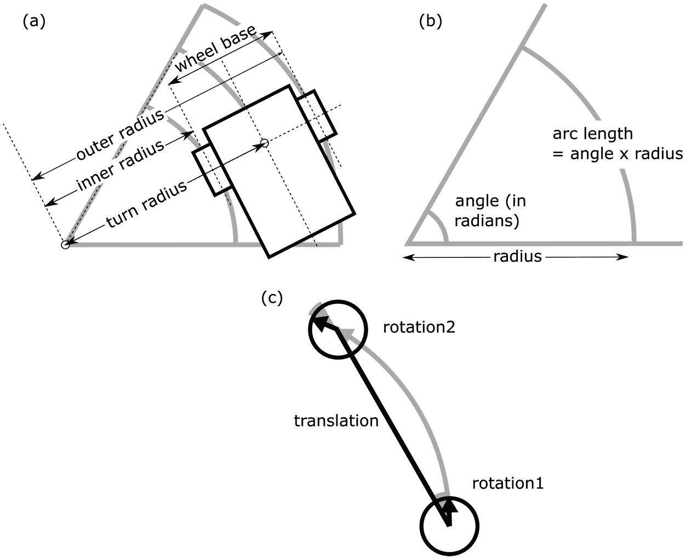

图 13.10 – 从编码器计算运动

*图 13.10 (a)*显示机器人沿着弧线移动。每个轮子编码器都会感应到在内部半径或外部半径上的弧线运动。我们的机器人使用差速驱动，因此我们可以假设所有运动都发生在两个轮子之间的轴上。机器人的中心，即我们的姿态，沿着转弯半径移动。我们可以使用这些信息，结合轮距——两个轮子之间的距离来计算弧线。

*图 13.10 (b)*将弧长与弧度和半径相关联。每个轮子都会行驶一段弧线，编码器会测量弧长。这个弧长是半径乘以角度（以弧度为单位）。我们将使用这个值来计算弧线。从两个轮子的运动（通过编码器测量的弧长）和轮距，我们可以得到半径和角度变化（`d_theta`）。

*图 13.10 (c)*表示机器人运动。尽管机器人沿着弧线移动，但在模拟中，我们将这种弧线运动简化为三个组件——*旋转 1*使机器人对齐以进行直线*平移*，然后*旋转 2*使机器人转向曲线末尾预期的航向。

将以下内容添加到`robot/code.py`中的`Simulation`类中：

```py
    def convert_odometry_to_motion(self, left_encoder_delta, right_encoder_delta):
        left_mm = left_encoder_delta * robot.ticks_to_mm
        right_mm = right_encoder_delta * robot.ticks_to_mm
        if left_mm == right_mm:
            return 0, left_mm, 0
```

此函数将编码器的变化（或增量）转换为*旋转 1*、*平移*和*旋转 2*的表示。编码器变化被转换为毫米单位的测量值。然后我们检查直线情况，如果存在，则仅返回平移组件。这可以防止`0`导致下一部分崩溃。

现在剩余的情况需要我们计算一个弧线：

```py
        radius = (robot.wheelbase_mm / 2) * (left_mm + right_mm) / (right_mm - left_mm)
        d_theta = (right_mm - left_mm) / robot.wheelbase_mm
        arc_length = d_theta * radius
```

第一行使用轴距和两个编码器移动来计算弧半径。然后，使用两个车轮的运动差异来计算 `d_theta`，即在这个弧中机器人航向的变化量。`d` 前缀代表增量。

弧长是 `d_theta` 乘以半径。因为这将相当频繁地被调用，所以我们假设弧长足够接近平移。

从这里，可以计算旋转分量：

```py
        rot1 = np.degrees(d_theta/2)
        rot2 = rot1
        return rot1, arc_length, rot2
```

如果我们假设弧是规则的，那么每个旋转分量是完整弧旋转的一半。我们还将此转换为度数。

我们可以编写一个方法来以这种方式移动姿态。按照以下步骤将此方法添加到 `Simulation` 中：

1.  定义方法并将第一次旋转添加到姿态旋转数组中（第三个元素）：

    ```py
        def move_poses(self, rot1, trans, rot2):
    ```

    ```py
            self.poses[:,2] += rot1
    ```

1.  然后，我们将平移项移动到新的姿态方向：

    ```py
            rot1_radians = np.radians(self.poses[:,2])
    ```

    ```py
            self.poses[:,0] += trans * np.cos(rot1_radians)
    ```

    ```py
            self.poses[:,1] += trans * np.sin(rot1_radians)
    ```

`rot1_radians` 变量将保存一个 `NumPy` 数组。这来自姿态数组的第二个元素，转换为弧度。`NumPy`（或 `ulab`）能够操作整个数组的能力在这里很有用。我们再次使用它来计算 *X* 和 *Y* 运动。`trans * np.cos` 将余弦函数应用于 `rot1_radians` 中的每个元素，并将其乘以平移项。

1.  然后，我们需要添加 `rot2` 项：

    ```py
            self.poses[:,2] += rot2
    ```

    ```py
            self.poses[:,2] = np.array([float(theta % 360) for theta in self.poses[:,2]])
    ```

最后，我们将角度限制在 0 到 360 度之间。

1.  接下来，我们需要将这些与获取编码器增量联系起来。首先，扩展 `Simulation.__init__` 方法以获取初始编码器读数：

    ```py
            self.collision_avoider = CollisionAvoid(self.distance_sensors)
    ```

    ```py
            self.last_encoder_left = robot.left_encoder.read()
    ```

    ```py
            self.last_encoder_right = robot.right_encoder.read()
    ```

我们将使用这个编码器数据在运动模型中，用机器人的运动移动所有姿态。然后在 `Simulation` 类中添加一个 `motion_model` 方法：

1.  它首先获取最新的编码器读数：

    ```py
        def motion_model(self):
    ```

    ```py
            new_encoder_left = robot.left_encoder.read()
    ```

    ```py
            new_encoder_right = robot.right_encoder.read()
    ```

1.  我们计算增量并将这些输入到 `convert_odometry_to_motion`：

    ```py
            rot1, trans, rot2 = self.convert_odometry_to_motion(
    ```

    ```py
                new_encoder_left - self.last_encoder_left, 
    ```

    ```py
                new_encoder_right - self.last_encoder_right)
    ```

1.  我们必须更新最后的编码器读数，以便下次获取增量：

    ```py
            self.last_encoder_left = new_encoder_left
    ```

    ```py
            self.last_encoder_right = new_encoder_right
    ```

1.  现在，我们将这些里程计值应用到我们的姿态上：

    ```py
            self.move_poses(rot1, trans, rot2)
    ```

我们现在需要调用这个运动模型。在 `Simulation.main` 中添加高亮代码：

```py
            while True:
                await asyncio.sleep(0.05)
                self.motion_model()
                send_poses(self.poses)
```

这将在发送姿态之前在每个周期应用运动模型。由于运动模型需要时间来运行，因此将睡眠时间减少以补偿，以保持 UART 数据率相似。将 `robot` 文件夹的内容复制到 Raspberry Pi Pico，并启动 `display_from_robot` 应用程序。

当你按下 **开始** 时，你现在应该看到姿态随着机器人在竞技场周围移动而移动。所有姿态都应该遵循相同的路径，但每个都是从不同的起点和方向开始的。

这些姿态正在移动，但现实世界很混乱，所以让我们给这个添加随机性。

## 姿态移动概率

机器人运动并不总是确定的；尽管我们有编码器，车轮可能会打滑，车轮尺寸可能会有细微差异，我们的计算可能不是 100%准确。想象一下，前面的姿态在一个簇或云中，然后我们的机器人向特定方向行驶。以下图表应该可以演示这一点：


图 13.11 – 移动概率分布

*图 13**.11 (a)* 展示了竞技场的一部分，竞技场坐标显示在坐标轴上。围绕点 (250,300) 的簇是初始机器人姿态猜测。粗线和角度弧表示 300 毫米、30 度的机器人移动。然而，由于运动的不可确定性，簇被分散开来。弧形是由于运动角度的不确定性造成的，弧的宽度代表机器人向前运动的不确定性。这种香蕉形状表示机器人可能到达的位置。这里的图像已经被夸张了，因为机器人的扩散应该远小于这个。

*图 13**.11 (b)* 展示了如何以 0 为均值（平均或最可能值）为中心来模拟这种不确定性，并在两侧进行变化。**概率分布**映射了在随机选择中某个值出现的可能性。每个点的海拔高度表示特定值出现的可能性。如果我们使用均匀分布，-1.0 和+1.0 之间的所有可能性都是相等的，这在我们用 *n=1* 表示的矩形中可以看到。然而，我们希望这种分布以均值为中心。如果我们从-1.0 到 1.0 的均匀分布中取两个样本并除以 2，我们就会得到 *n=2* 图。这大约是一个三角形。在这里，*n* 代表我们添加到一起的均匀随机样本选择数量。我们可以将这个曲线细化到 *n=4*，使用四个均匀样本的总和并除以 4；然而，理想曲线和每个均匀分布样本的时间成本之间的权衡使得 *n=2* 的三角形对于我们的目的来说已经足够好，可以用来使分布居中。

我们将在模型中使用 *n=2* 分布。在 `robot/code.py` 中，在 `class Simulation` 之前添加以下代码片段：

```py
def get_random_sample(mean, scale):
    return mean + (random.uniform(-scale, scale) + random.uniform(-scale, scale)) / 2
```

这段代码将添加两个样本，将均匀分布缩放到与模型变化相匹配的程度，然后除以 2，并加上均值。

我们还需要考虑的另一个因素是，我们做的运动越大，随机误差因子就越大。大的前进运动会影响旋转，而大的旋转会影响前进运动（平移）。通常将这些影响因子称为 `alpha`。让我们将这些值添加到我们的 `Simulation.__init__` 类中：

```py
        self.last_encoder_right = robot.right_encoder.read()
        self.alpha_rot = 0.09
        self.alpha_rot_trans = 0.05
        self.alpha_trans = 0.12
        self.alpha_trans_rot = 0.05        
```

我们这里有四个项。它们的值应该在 0 到 1 之间，并保持较低。值 `0.05` 将代表 5%的误差。调整它们以反映你在机器人中看到的误差。

我们将使用这个来对我们的模型应用随机性：

1.  在 `Simulation` 中 `move_poses` 之后添加以下方法：

    ```py
        def randomise_motion(self, rot1, trans, rot2):
    ```

1.  从 `alpha` 项计算缩放因子：

    ```py
            rot1_scale = self.alpha_rot * abs(rot1) + self.alpha_rot_trans * abs(trans)
    ```

    ```py
            trans_scale = self.alpha_trans * abs(trans) + self.alpha_trans_rot * (abs(rot1) + abs(rot2))
    ```

    ```py
            rot2_scale = self.alpha_rot * abs(rot2) + self.alpha_rot_trans * abs(trans)
    ```

旋转缩放因子基于每个元素的绝对值；它们不能为负。旋转缩放具有旋转因子和较低的平移因子。平移缩放具有平移因子（通常较大）和基于旋转的因子。

1.  我们现在将使用这个模型为每个姿态的运动生成噪声：

    ```py
            rot1_model = np.array([get_random_sample(rot1, rot1_scale) for _ in range(self.poses.shape[0])])
    ```

    ```py
            trans_model = np.array([get_random_sample(trans, trans_scale) for _ in range(self.poses.shape[0])])
    ```

    ```py
            rot2_model = np.array([get_random_sample(rot2, rot2_scale) for _ in range(self.poses.shape[0])])
    ```

这使用我们创建的缩放样本函数，以及我们的缩放因子。它使用计算出的旋转或平移作为平均值。我们对每个姿态维度运行这个循环，因此对于一个 200 的种群，我们将得到 200 个围绕计算测量值的随机样本，其变化按计算因子缩放。

1.  最后，我们返回这些模型：

    ```py
            return rot1_model, trans_model, rot2_model
    ```

现在我们有一个模型可以在我们的运动中生成噪声，这意味着它将通过模拟该测量的不确定性来补偿测量不准确。将高亮显示的代码添加到`motion_model`方法中：

```py
    def motion_model(self):
        """Apply the motion model"""
        new_encoder_left = robot.left_encoder.read()
        new_encoder_right = robot.right_encoder.read()
        rot1, trans, rot2 = self.convert_odometry_to_motion(
            new_encoder_left - self.last_encoder_left, 
            new_encoder_right - self.last_encoder_right)
        self.last_encoder_left = new_encoder_left
        self.last_encoder_right = new_encoder_right
        rot1_model, trans_model, rot2_model = self.randomise_motion(rot1, trans, rot2)
        self.move_poses(rot1_model, trans_model, rot2_model)
```

变更将`rot1`变量替换为`rot1_model`，并对其他姿态元素进行类似的替换。由于`rot1_model`具有与我们的姿态相同的元素数量，将其传递到`move_poses`中会将每个样本元素逐个添加到相应的姿态元素。这种方法利用了`NumPy`如何操作列表。

将`robot`文件夹复制到机器人上，并在您的电脑上运行`display_from_robot.py`应用程序。运动将会有点随机化。现在，让我们检查您的机器人代码是否按预期工作并表现良好。

### 故障排除

如果这个示例不起作用，请尝试以下方法：

+   运行机器人，使其支撑起来并连接到电脑，这样 Mu 编辑器的串口可以查看其状态。这将显示代码中是否存在任何错误。

+   如果运动太远或太短，请调整`robot/robot.py`中的测量值以匹配您的机器人，因为它们可能与示例值不同。

+   如果您看到传感器或 I2C 问题，请回溯检查布线和之前的传感器演示示例。同时，请确保您有新电池。

我们现在有了基于编码器的姿态运动模型。我们可以现在利用蒙特卡洛模拟将距离传感器和竞技场数据纳入考虑。

# 蒙特卡洛定位

我们机器人的姿态正在超出竞技场范围，距离传感器的读数应该显示哪些猜测（姿态）比其他猜测更有可能。**蒙特卡洛**模拟可以根据传感器的读数可能性改进这些猜测。

模拟移动姿态，然后观察传感器的状态以创建基于其可能性的权重，这个过程被称为**观测模型**。

模拟**重新采样**猜测值，通过选择它们，因此权重更高的更有可能。结果是新一代的猜测值。这种粒子跟随过滤的运动是为什么这也被称为**粒子滤波器**。

让我们从给我们的姿态分配权重开始，基于它们是否在竞技场内或外，然后我们将探讨如何从这些权重中进行重采样。

## 从位置生成姿态权重

初始权重生成可以基于一个简单的问题 – 机器人是否在竞技场内？如果不是，那么我们可以降低姿态概率。请注意，我们并没有消除这些，因为机器人可能被放置在竞技场地图之外，或者在你桌子上进行测试。我们只是给它们一个比那些在竞技场内的权重更低的概率。

在`robot/arena.py`文件中，执行以下操作：

1.  我们可以添加一个值来表示一个非常低的概率 – 接近但不是零：

    ```py
    low_probability = 10 ** -10
    ```

1.  添加一个函数来检查竞技场是否包含一个点：

    ```py
    def contains(x, y):
    ```

1.  首先，检查点是否在竞技场矩形之外：

    ```py
      if x < 0 or x > width \
    ```

    ```py
        or y < 0 or y > height:
    ```

    ```py
        return False
    ```

1.  然后，我们检查它是否在裁剪部分：

    ```py
      if x > (width - cutout_width) and y < cutout_height:
    ```

    ```py
        return False
    ```

1.  否则，这个点在竞技场中：

    ```py
      return True
    ```

我们可以在我们的`robot/code.py` `Simulation`类中添加一个`observation_model`方法来生成权重：

1.  我们将权重设置为`ones`，每个姿态一个权重：

    ```py
        def observation_model(self):
    ```

    ```py
            weights = np.ones(self.poses.shape[0], dtype=np.float)
    ```

1.  然后，我们可以遍历姿态，降低那些在竞技场之外的姿态的权重：

    ```py
            for index, pose in enumerate(self.poses):
    ```

    ```py
                if not arena.contains(pose[0], pose[1]):
    ```

    ```py
                    weights[index] = arena.low_probability
    ```

1.  然后我们返回权重：

    ```py
            return weights
    ```

到这一点，权重没有被使用。我们需要重新采样它们，以便它们能够作用于姿态。

## 重新采样姿态

当我们在机器人上逐步进行蒙特卡洛模拟时，我们希望下一代的粒子更倾向于更可能的状态。我们将使用以下图中展示的技术：


图 13.12 – 低方差重采样

*图 13**.12* 从**加权样本空间**开始，这是一个介于 0 和所有权重之和之间的数轴。在这个数轴下方是一个表示样本空间中 10 个样本（命名为*a*到*j*）的条形图。这些样本的权重通过它们的宽度来表示。阴影部分突出了不同的样本。

在图中，我们生成一个包含五个样本的新空间（n=5）。这个数字可能与原始空间相同（用于生成新一代），可能更小，用于通过 BLE 发送，也可能更大，用于插值。

重新采样原始集开始于将总权重除以新样本的数量，这将给出样本间隔大小为*sum/n*，显示为**样本间隔**。然后我们生成一个介于 0 和*sum/n*之间的单个均匀随机数，这将移动间隔。

我们可以查看加权样本空间并挑选出与每个间隔开始匹配的样本 – 这就是**权重索引**。这将产生**新的样本空间**。请注意，具有最高权重的样本*c*被采样更多次。随着样本群体的增大，重采样的空间将更准确地接近原始空间。

新样本没有权重，并且都被视为同等权重，但某些样本出现多次以表示它们的先前权重。

这种使用随机偏移间隔的技术被称为**低方差重采样**方法。我们现在将看到如何通过代码执行此操作：

1.  在 `robot/code.py` 中，在 `Simulation` 类内部，添加以下内容：

    ```py
        def resample(self, weights, sample_count):
    ```

    ```py
            samples = np.zeros((sample_count, 3))
    ```

`weights` 变量指的是权重列表，`sample_count` 指的是要获取的样本数量。此方法将从姿态数组中采样新的姿态。我们将设置一个 `samples` 变量来保存新的样本。

1.  接下来，我们根据 `sample_count` 设置间隔大小：

    ```py
            interval = np.sum(weights) / sample_count
    ```

    ```py
            shift = random.uniform(0, interval)
    ```

我们可以使用这个来设置间隔 `shift` 值——起始位置。

1.  当我们遍历原始样本（姿态）时，我们将存储累积权重，我们还将存储源样本集中的索引：

    ```py
            cumulative_weights = weights[0]
    ```

    ```py
            source_index = 0
    ```

1.  代码将循环，直到我们获得预期的样本数量。对于每个样本，都有一个 `weight_index` 参数：

    ```py
            for current_index in range(sample_count):
    ```

    ```py
                weight_index = shift + current_index * interval
    ```

1.  现在，我们从源样本中的 `cumulative_weights` 开始累加权重，直到它们达到权重索引：

    ```py
                while weight_index > cumulative_weights:
    ```

    ```py
                    source_index += 1
    ```

    ```py
                    source_index = min(len(weights) - 1, source_index)
    ```

    ```py
                    cumulative_weights += weights[source_index]
    ```

我们跟踪满足这个权重要求的源样本索引。

1.  我们可以使用这个 `source_index` 向我们的集合添加一个样本：

    ```py
                samples[current_index] = self.poses[source_index]
    ```

这将退出 `while` 循环，并成为 `for` 循环的结束。

1.  最后，我们返回新的样本集：

    ```py
            return samples
    ```

我们也可以增加我们的种群数量，同时只发送一个子集。在 `Simulation.__init__` 中更改种群大小：

```py
    def __init__(self):
        self.population_size = 200
```

我们在这里限制种群大小是因为 Pico 内存限制。

然后，我们可以在 `main` 循环（在 `Simulation.main` 中）中应用我们的观察模型：

```py
            while True:
                weights = self.observation_model()
                send_poses(self.resample(weights, 20))
                self.poses = self.resample(weights, self.population_size)
                await asyncio.sleep(0.05)
                self.motion_model()
```

在我们的循环中，我们使用观察模型来获取姿态的权重。我们使用 `resample` 方法来获取要发送的 20 个姿态。然后我们再次使用 `resample` 来获取新的姿态种群。更新我们的姿态、观察它们的状态、对姿态进行加权，然后重新采样的循环被称为**递归贝叶斯滤波器**。

如果你将 `robot` 文件夹发送到 Raspberry Pi Pico 并启动应用程序，你应该开始看到竞技场外样本数量的减少。由于我们从 200 个更大的集合中采样了 20 个，它们将会跳跃。

系统将样本空间减少到那些更有可能的情况。然而，我们可以包括距离传感器来改进这个过程。

## 集成距离传感器

我们的机器人有两个距离传感器。我们的代码将检查机器人感知的距离与模型数据。如果每个姿态是一个想象中的地图针，那么到最近障碍物的距离将是从这个针拉伸出的字符串，或者是一个带有感知端点的传感器光束——**光束端点模型**。有 200 个姿态，这可能会很慢。让我们看看一个更快的方法来模拟它们。

### 在我们的空间中模拟距离传感器

我们可以采取的一种方法是对机器人的位置进行估计，然后执行获取到最近障碍物距离所需的数学运算。然而，我们可以创建一个查找表来简化这个过程。

让我们看看以下图表：

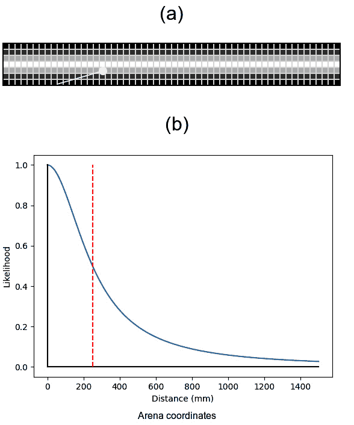

图 13.13 – 距离表示

*图 13**.13 (a)* 展示了一个基于距离的**似然场**。白色圆点是从距离传感器读取的距离读数的终点。这个网格的明亮中间线代表一个竞技场墙壁。每个网格方格都有一个介于 0 和 1 之间的值（以亮度表示），表示在此处检测到的距离被检测到墙壁的可能性有多大。我们不是问“这个距离测量是否匹配？”，而是可以问“这个距离传感器匹配的可能性有多大？”我们可以在系统启动时只计算这个网格一次，这样其他代码就可以快速查找网格以检查传感器读数。

*图 13**.13 (b)* 展示了似然如何随距离变化，距离从 0 到 1,500，以衰减函数的形式。*Y*轴显示了它是击中的可能性。虚线垂直线是一个值，目前为 250，在曲线改变方向的拐点。较小的拐点会使曲线更紧；较大的值会使曲线更宽。

让我们在`robot/arena.py`的顶部导入`numpy`：

```py
from ulab import numpy as np
```

我们将这些值转换为 50 mm²单元格的网格。由于某些姿态的距离端点可能超出边界，我们将给网格一个超扫描。扩展`robot/arena.py`库，如下所示：

```py
grid_cell_size = 50
overscan = 2
```

我们首先来看如何获取网格方格的距离。在`robot/arena.py`中，在定义`boundary_lines`之后，添加以下内容：

```py
def get_distance_to_segment(x, y, segment):
    x1, y1 = segment[0]
    x2, y2 = segment[1]
    if y1 == y2 and x >= min(x1, x2) and x <= max(x1, x2):
        return abs(y - y1)
    if x1 == x2 and y >= min(y1, y2) and y <= max(y1, y2):
        return abs(x - x1)
    return np.sqrt(
        min(
            (x - x1) ** 2 + (y - y1) ** 2, 
            (x - x2) ** 2 + (y - y2) ** 2
        )
    )
```

代码将线段解包为`x1`和`y1`，以及`x2`和`y2`。然后检查该线是否水平（相同的*Y*），以及被检查的点是在其上方还是下方；这可以通过减去*Y*值来实现捷径。代码可以重复这个过程来检查垂直线。

代码随后使用毕达哥拉斯定理，其中结果距离将是斜边。

我们将使用衰减函数将距离转换为似然，随着我们远离零，它将返回更低的值。以下函数将找到一个特定点的最近段距离，然后对其应用衰减函数：

```py
def get_distance_likelihood(x, y):
    min_distance = None
    for segment in boundary_lines:
        distance = get_distance_to_segment(x, y, segment)
        if min_distance is None or distance < min_distance:
            min_distance = distance
    return 1.0 / (1 + min_distance/100) ** 2
```

我们可以创建一个函数来生成这个网格。它首先创建一个填充零的 2D 浮点数组来存储网格值：

```py
def make_distance_grid():
    grid = np.zeros((
            width // grid_cell_size + 2 * overscan, 
            height // grid_cell_size + 2 * overscan
        ), dtype=np.float)
```

网格的宽度（以单元格计）是竞技场宽度除以单元格大小。然后我们在竞技场的两侧添加超扫描。高度使用类似的计算。

我们然后遍历网格的行和列来填充单元格数据：

```py
    for x in range(grid.shape[0]):
        column_x = x * grid_cell_size - (overscan * grid_cell_size)
        for y in range(grid.shape[1]):
            row_y = y * grid_cell_size - (overscan * grid_cell_size)
            grid[x, y] = get_distance_likelihood(
                column_x, row_y
            )
    return grid distance_grid = make_distance_grid()
```

这个循环获取每个单元格的竞技场*X*和*Y*坐标，并使用这些坐标来获取该位置的似然，将其存储在网格中。我们调用这个函数并将结果存储在`distance_grid`变量中，这样当导入`arena.py`文件时，这个计算就会运行。计算出的距离网格看起来像以下图表：

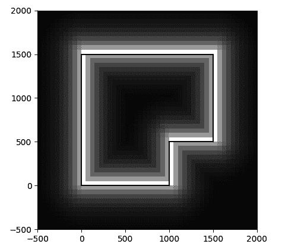

图 13.14 – 基于距离的似然场

*图 13**.14* 展示了基于距离的似然场。

扫描溢出范围从 -500 毫米到 2,000 毫米，边界线用黑色绘制。每个单元格的值基于其左下角坐标。

我们现在可以在观测模型中使用这个似然场。

### 从距离传感器生成权重

对于每个位姿，我们需要从传感器位置投射感测到的距离。请参见以下图表：

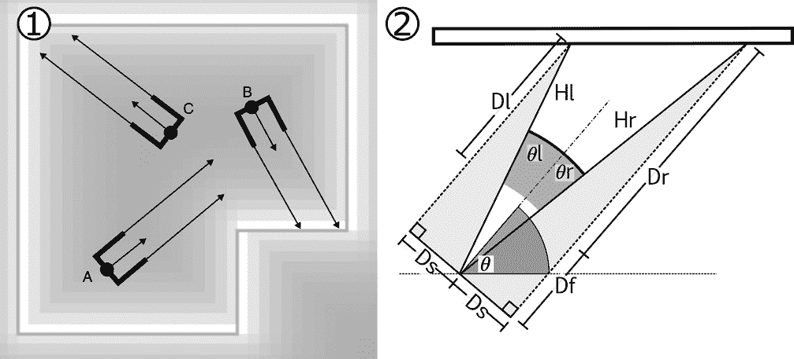

图 13.15 – 距离传感器几何

*图 13**.15 (1)* 将位姿 *A*、*B* 和 *C* 以点表示，并用箭头表示它们的航向。有暗条表示两个距离传感器相对于位姿的位置 – 它们向侧面和前方突出。从这个位置，我们将有传感器读数，由指向条前端的箭头表示。

通过将传感器距离与似然场投影，我们可以看到位姿 B 比位姿 C 更有可能匹配，而 A 是这里最不可能的位姿。

*图 13**.15 (2)* 展示了如何投影传感器。*Ds* 表示距离传感器向外延伸的距离（代码中的 `dist_side_mm`）。*Df* 表示传感器从机器人轮子向前延伸的距离。*Dr* 是从 *Df* 感测到的距离。我们必须将此距离添加到每个位姿中。从感测到的距离预先计算三角形使这个过程变得稍微容易一些。*θ* 是机器人的航向。使用 *SOHCAHTOA* 口诀，我们可以得到 *θr*，即从机器人航向到右侧传感器的角度，并使用勾股定理，我们可以得到 *Hr*，即斜边。相邻边将是 *Df* 和 *Dr*，对边是 *Ds*。然后我们可以将 *Hr* 在 *θr* 角度添加到每个位姿中，以获得每个位姿的正确传感器光束端点。同样的方法也可以应用于左侧传感器读取。虽然这个过程比较复杂，但比为每个位姿计算向侧面和前方投射的端点要快。

测量你机器人上距离传感器的位置相对于轮子的中间（或使用 CAD 绘图）。每个传感器要测量的活动部分是每个传感器顶部中间的亮面部分。

我们将在 `robot/robot.py` 文件中的 `wheelbase_mm` 定义之后添加这些距离传感器位置到我们的测量：

```py
dist_side_mm = 37
dist_forward_mm = 66
```

我们需要向 `robot/arena.py` 添加一个函数来查找距离网格中的位置：

1.  该函数将 `(x,y)` 位姿参数转换为网格坐标：

    ```py
    def get_distance_likelihood_at(x, y):
    ```

    ```py
      """Return the distance grid value at the given point."""
    ```

    ```py
      grid_x = int(x // grid_cell_size + overscan)
    ```

    ```py
      grid_y = int(y // grid_cell_size + overscan)
    ```

1.  超出范围的请求应返回一个极低的概率：

    ```py
      if grid_x < 0 or grid_x >= distance_grid.shape[0] or grid_y < 0 or grid_y >= distance_grid.shape[1]:
    ```

    ```py
        return low_probability
    ```

1.  然后，我们可以返回存储在网格位置的查询结果：

    ```py
      return distance_grid[grid_x, grid_y]
    ```

在 `robot/code.py` 文件中，我们可以向 `Simulation` 类添加一个方法来执行前面的三角形计算，以获取每个位姿的传感器端点：

1.  此方法将读取传感器数据，并通知我们它是否位于右侧：

    ```py
        def get_sensor_endpoints(self, sensor_reading, right=False):
    ```

1.  然后，我们计算三角形的相邻边和角度：

    ```py
            adjacent = sensor_reading + robot.dist_forward_mm
    ```

    ```py
            angle = np.atan(robot.dist_side_mm / adjacent)
    ```

    ```py
            if right:
    ```

    ```py
                angle = - angle
    ```

注意，如果角度在右侧，我们计算角度的负值。

1.  然后我们得到斜边——这将是车轮到传感器光束端点之间的距离：

    ```py
            hypotenuse = np.sqrt(robot.dist_side_mm**2 + adjacent**2)
    ```

1.  现在，我们使用 `numpy` 来帮助我们计算相对于每个姿态的角度，在转换姿态角度为弧度时：

    ```py
            pose_angles = np.radians(self.poses[:,2]) + angle
    ```

1.  我们可以构建一个端点列表，通过从每个姿态的坐标投影，使用计算出的角度作为斜边：

    ```py
            sensor_endpoints = np.zeros((self.poses.shape[0], 2), dtype=np.float)
    ```

    ```py
            sensor_endpoints[:,0] = self.poses[:,0] + hypotenuse * np.cos(pose_angles)
    ```

    ```py
            sensor_endpoints[:,1] = self.poses[:,1] + hypotenuse * np.sin(pose_angles)
    ```

    ```py
            return sensor_endpoints
    ```

我们最终返回这些计算出的列表。

我们现在在 `Simulation` 类中创建一个 `observe_the_distance_sensors` 方法，并将其应用于现有的权重集：

1.  首先，接受一个现有的权重列表作为参数：

    ```py
        def observe_distance_sensors(self, weights):
    ```

1.  然后我们为每一侧调用 `get_sensor_endpoints`：

    ```py
            left_sensor = self.get_sensor_endpoints(self.distance_sensors.left)
    ```

    ```py
            right_sensor = self.get_sensor_endpoints(self.distance_sensors.right, True)
    ```

我们现在有一个距离传感器投影的列表，针对每个姿态。我们可以在这些点中查找距离似然网格并将它们添加：

```py
        for index in range(self.poses.shape[0]):
            sensor_weight = arena. get_distance_likelihood_at(left_sensor[index,0], left_sensor[index,1])
            sensor_weight += arena. get_distance_likelihood_at(right_sensor[index,0], right_sensor[index,1])
```

1.  然后，我们可以将此乘以现有的权重（场内或场外）：

    ```py
                weights[index] *= sensor_weight
    ```

1.  现在，我们离开这个循环并返回修改后的权重：

    ```py
            return weights
    ```

然后，我们需要将此代码集成到 `observation_model` 中。进行以下突出显示的更改：

```py
    def observation_model(self):
        weights = np.ones(self.poses.shape[0], dtype=np.float)
        for index, pose in enumerate(self.poses):
            if not arena.contains(pose[0], pose[1]):
                weights[index] = arena.low_probability
        weights = self.observe_distance_sensors(weights)
        weights = weights / np.sum(weights)
        return weights
```

如果你将此代码发送到机器人，它将从两个距离传感器进行称重和重采样。机器人的姿态将开始形成在传感器可能位置周围的块状物。随着机器人过滤和移动它们，这些块状物将形成、散开并重新组合。以下图表显示了你在显示屏上将会看到的内容：

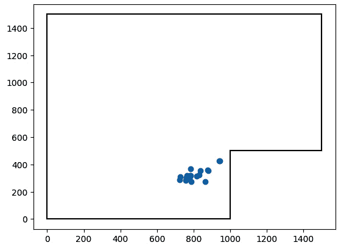

图 13.16 – 定位块状物

在 *图 13**.16 中，姿态已经聚集在一起形成一个块状物，大致代表机器人的位置，这个位置将在机器人绕场行驶时移动。

你可能会看到一个或几个块状物，它们可能与机器人精确地一起移动，或者看起来有点不对。这就是你需要调整模型以更好地适应情况的地方。

## 调整和改进蒙特卡洛模型

调整以下因素可以提高此模型：

+   GitHub 仓库中的 `ch-13/4.3-monte-carlo_perf` 文件夹包含本章代码的仪器化版本，用于故障排除。你需要调整 `robot.py` 和 `arena.py` 以适应你的设置，但此代码会报告问题并将跟踪回计算机进行诊断，显示在显示屏上的观察模型渲染的重量输出，如果你通过 USB 连接，还会发送性能数据。

+   在 `robot/robot.py` 中的测量值——轮径、轴距、齿轮比和编码器的测量精度将指导里程计模型。如果块状物的移动与速度和转向不匹配，这些很可能是嫌疑人。模型假设车轮大小相同，如果它始终向一侧拉，这可能是错误的。

+   同样，如果 `robot/robot.py` 中的距离传感器位置测量值不正确或传感器需要校准，位置将始终偏移。传感器可能会被强烈的阳光和闪烁的室内照明干扰。

+   在竞技场中，`get_distance_likelihood`因素，100，调整了围绕每个边界的可能性场的衰减。降低这个值将使场变得更紧密。

+   在`code.py`中，姿态的数量是一个主要因素。增加这个值将使模型更好，但请注意 Raspberry Pi Pico 的内存限制。

+   `code.py`中的 alpha 因素编码了您对运动模型的确定性；如果您更信任运动模型，请将这些值调低。

+   该模型还假设竞技场构建相当准确。这些假设中的错误可能会累积，使定位算法更难。

您需要花时间与这些因素打交道，以创建一个更有可能找到其位置的模型，或者更快地做到这一点。

让我们总结一下本章我们学到了什么。

# 摘要

在本章中，我们首先使用泡沫板结构为我们的机器人构建了一个测试竞技场，然后在代码中对其进行建模，并显示它以及距离传感器可能性场。我们将它放在机器人上，通过 BLE 发送，然后添加了姿态。

我们使用传感器建模了姿态的移动，向模型添加了不确定性。然后我们添加了距离传感器观察模型，生成了我们在重采样算法中使用的权重，以生成新的姿态。

我们通过查看调整因素来提高该系统的性能结束了本次讨论。

在下一章中，我们将总结您迄今为止的 Raspberry Pi Pico 机器人学习之旅，并讨论您如何通过改进这个机器人或构建更多机器人来继续您的旅程。

# 练习

以下练习将加深您对本章讨论主题的理解，并使机器人代码更完善：

+   可以通过存储先前状态并计算增量来添加 IMU。您可以通过取编码器计算与 IMU 角度的平均值来将这些值混合到`rot1`/`rot2`中，或者考虑是否有一个传感器比其他传感器更可靠。在使用之前，您需要校准 IMU。

+   机器人的姿态猜测会陷入**局部最大值**——基于传感器位置的良好但错误的猜测。考虑在每次种群中添加 10 个新的猜测，以推动代码尝试其他选项。

+   我们使用每个姿态的两个观察值——拥有更多的距离传感器可能会改善这一点，但会使模型变慢。

+   您能否在竞技场中添加一个目标区域？考虑如何使用 PID 来引导机器人向这个区域移动。也许可以用平均姿态来提供 PID。

+   您可以通过发送更多的姿态数据，包括方向，来改进可视化。您可能需要考虑使用`msgpack`库或切换到通过 SPI 的 Wi-Fi 或 BLE，因为数据量很容易超过 BLE UART 连接。

# 进一步阅读

这些进一步学习的辅助工具将让您继续阅读并深入了解蒙特卡洛算法及其特性：

+   由 Sebastian Thrun、Wolfram Burgard 和 Dieter Fox 合著，并由麻省理工学院出版社出版的《*概率机器人学*》详细介绍了蒙特卡洛粒子滤波器，以及卡尔曼滤波和其他基于概率的模型。

+   我强烈推荐 Khan Academy 上关于建模数据分布以学习和练习数据分布的材料。

+   来自波恩大学和 Cyrill Stachniss 的 21 个视频播放列表，可在[`www.youtube.com/playlist?list=PLgnQpQtFTOGQEn33QDVGJpiZLi-SlL7vA`](https://www.youtube.com/playlist?list=PLgnQpQtFTOGQEn33QDVGJpiZLi-SlL7vA)上找到，详细介绍了这里使用的主题。如果你想要更深入地研究这个主题，我强烈推荐它们。
