# 第十四章：继续您的旅程——您的下一个机器人

在整本书中，你已经学会了如何规划、设计、构建和编程一个机器人。我们通过一些动手经验、展示基本原理的例子以及改进它们的想法，涵盖了众多基本主题。在本章中，我们将简要回顾我们的知识，以进一步拓展。

考虑您的下一个机器人，我们将回答以下问题——您会如何规划和设计它？您可能需要研究哪些技能并进行实验？您会构建什么？

在本章中，我们将涵盖以下主要主题：

+   本书所学内容的总结

+   规划扩展这个机器人

+   规划您的下一个机器人

+   进一步建议学习的领域

# 技术要求

对于本章，你需要以下内容：

+   绘图工具，如笔和纸来绘制想法

+   纸板、尺子和切割工具进行测试适配

+   一台可以上网的电脑

+   绘图工具，如[`app.diagrams.net/`](https://app.diagrams.net/)

# 本书所学内容的总结

作为机器人构建者，您已经从基本的机器人计划开始。您学习了机器人学中有用的技能，设计、使用工具进行构建、编程、电子接口，或者整合结合所有这些的系统，那么让我们深入探讨。

## 使用 Raspberry Pi Pico 进行基本机器人技术

从第一章开始，我们了解了 Raspberry Pi Pico，为什么它是一个出色的机器人控制器，以及它与其他控制器相比的优势，考虑到 Pico 与其更大的 Raspberry Pi 家族之间的权衡。

我们介绍了如何编程 Raspberry Pi Pico 的方法，并为其选择了 CircuitPython。CircuitPython 对硬件有出色的访问权限，拥有一个不断增长的用于机器人中使用的许多电子模块的支持库。

我们参观了诸如接口端口等概念：

+   GPIO 用于从 Pico 外部控制和接口。

+   UART、SPI 和 I2C 形成数据总线，用于从设备发送和接收数据。

+   独特的**可编程输入/输出**（**PIO**）外围设备让您可以适应或构建接口。

然后，我们围绕 Raspberry Pi Pico 规划了一个机器人，考虑了其大小、类型和复杂性。我们计算了功率需求并指定了一个驱动板来控制电机功率。我们考虑了我们可能想要使用的传感器，以及所有这些决定都是权衡。

我们考虑了 GPIO 引脚的使用，确保所有选定的设备都能在 Raspberry Pi Pico 上一起使用。

然后，我们使用简单的纸板模板来测试适配我们的基本机器人设计，看看它是否是一个可行的计划，可以进入下一阶段。

我们研究了购买零件的商店，制定了一个购买零件清单，并购买了构建移动机器人的所需组件和工具。

在*第三章*和*第四章*中，我们在使用 FreeCAD 进行 3D 设计机器人之后，然后使用塑料板和简单工具构建了机器人。

在构建机器人平台后，在*第五章*中，我们使用 GPIO 来控制电机，展示了机器人的初始运动。然后，我们使用它沿着计划路径行驶，展示了我们可以按顺序控制它，并观察了没有传感器时的控制的一些不足。

在此之后，我们检查了机器人上的初始传感器。

## 通过传感器扩展 Raspberry Pi Pico 机器人

我们能够添加传感器，并学习了如何使用它们。在*第六章*中，我们使用了作为电机组件一部分的编码器传感器，然后在*第七章*中，我们指定了额外的传感器——我们将它们放置在哪里，需要对我们底盘进行的修改，以及需要购买哪些传感器。添加传感器时，机器人硬件的框图非常有用，可以查看连接在哪里。

以下图显示了我们在机器人上使用的传感器：

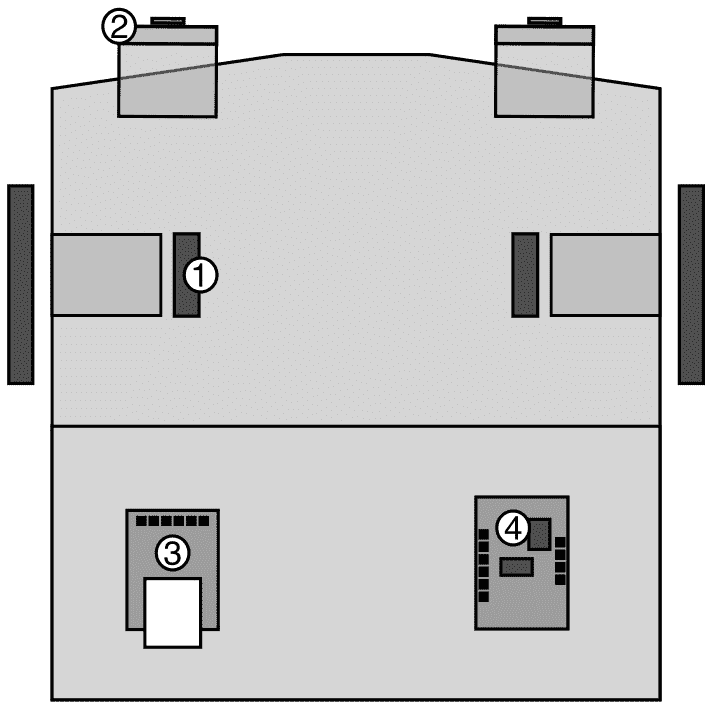

图 14.1 – 我们机器人上的传感器

上述图显示了我们在 Raspberry Pi Pico 机器人上使用的传感器。传感器被编号：

1.  编码器可以测量机器人电机的运动，以及通过扩展，机器人的车轮。我们可以使用这些来测量距离或速度。我们介绍了使用 Raspberry Pi Pico 的 PIO 系统连续读取这些传感器，以确保我们的代码不会错过编码器步数。

1.  距离传感器（从*第八章*）可以检测机器人前方物体的距离。我们使用 I2C 与它们接口，并研究了如何安装它们、连接它们以及从它们获取距离信息的程序。我们通过从物体上反射信号来感知它们，学习了这些传感器的工作原理。

1.  蓝牙（从*第九章*）不是一个传感器，而更像是一个通信系统。我们能够构建一个架子来安装蓝牙 LE 模块，将其连接，并编写代码，以便我们可以在 Raspberry Pi Pico 和智能手机之间进行通信。我们可以使用手机来控制机器人并显示或绘制来自机器人的数据。

1.  在*第十二章*中，我们添加了一个**惯性测量单元**（**IMU**），并学习了如何通过结合加速度计、陀螺仪和磁力计的结果来使用它来感知机器人的方向。首先，我们研究了如何通过 I2C 连接它，然后是如何校准（设置和定位）传感器以及获取初始读数。

除了添加传感器外，我们还开始探索我们的机器人可以使用它们做什么，并编写了利用它们的程序。

## 为 Raspberry Pi Pico 编写 CircuitPython 行为代码

我们编写了使机器人以智能方式使用传感器输入来驱动其电机的程序，将这些程序定义为行为。

第一个行为（来自*第五章*）遵循了预先规划的路径，仅使用电机；然而，没有传感器，这并不非常准确。在*第六章*中，我们学习了编码器传感器和测量编码器计数，然后看到了如何使用它们在固定计数时停止驱动。这段代码引入了传感器循环，通过传感器的反馈来控制电机。

在下一节中，从*第七章*开始，我们指定了更多要添加的外设。我们从*第八章*中的距离传感器开始，在那里我们学习了如何创建一个避免碰撞墙壁的行为。

在*第九章*中，我们连接了蓝牙设备，这使得我们可以观察和绘制传感器数据，从而开启了更多激动人心且复杂的行为。

当我们在*第十章*中学习了**比例-积分-微分**（**PID**）算法时，传感器反馈循环的范围变得更加有趣，这让我们能够设置平滑的电机对刺激的反应。我们用距离传感器演示了这一点，以保持与物体的已知距离。然后我们使用同样的技术来跟随墙壁，这在房间中间放置几个箱子时进行测试最为令人满意，观察机器人自主地绕它们导航。

PID 算法促使我们在*第十一章*中重新审视编码器。我们将计数转换为标准速度单位，然后使用 PID 算法来控制电机和车轮速度，以达到每秒米数的目标。这种改进使得机器人能够直线行驶，并控制其运动，使其以期望的速度行驶已知距离；例如，我们可以指示机器人以 0.17 米/秒的速度直线行驶 1 米。

在*第十二章*中引入 IMU 后，一旦我们连接并校准了它，我们就学习了如何使用 IMU 获取机器人的方向。然后我们将它与 PID 算法结合起来，使机器人转向面对北方，无论其初始航向如何。

我们还研究了如何使用 IMU 进行精确转向——90 度或其他角度。

在*第十三章*中，我们学习了蒙特卡洛模拟，我们使用编码器跟踪运动来模拟机器人的许多潜在姿态。我们使用传感器输入为每个姿态分配一个可能性权重。这些权重用于重采样算法，以选择最可能的姿态。传感器融合和统计的结合使机器人感觉智能，因为它在竞技场中估计其位置。我们还演示了两种行为同时运行，其中碰撞避免与蒙特卡洛模拟并行进行。

这个机器人有一些有趣的功能，但我们接下来该把它们用到哪里呢？

# 计划扩展这个机器人

我很少将机器人项目视为完整，尤其是那些学习和开发平台的项目。总有新的传感器尝试，新的编程算法制作，或者仅仅是需要解决的一些错误和怪癖。另一方面，有方法使机器人更加坚固，能够应对更恶劣的环境，例如使底盘更轻或电子设备更简单，所以让我们先考虑一些关于这个机器人的想法，并希望激发一些你自己的灵感。

## 可以添加的传感器

扩展这个机器人的第一种令人兴奋的方式是添加更多传感器。编程传感器以获取数据很有趣。这意味着你可能需要想出如何将它们整合到现有行为中并安装它们。

下图展示了一些可能感兴趣的传感器扩展选择：

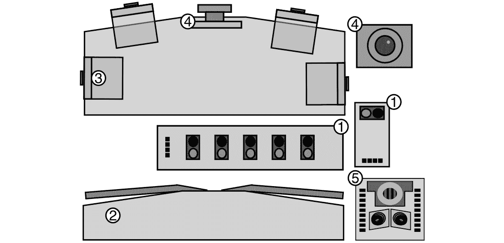

图 14.2 – 机器人传感器扩展

前面的图显示了可以扩展这个机器人的传感器选择以及你可以让它执行的事情。传感器类型已编号：

1.  **线检测器**或**反射传感器**：这些传感器通过一个红外（IR）LED 发光，然后检测它们指向的对象反射的光量，或者检测其亮度/暗度。制造商将这些传感器安装在机器人下方作为循线传感器。一些传感器，如 *SunFounder 5 通道线传感器*，带有光检测器阵列，可以用代码在地板上绘制线条进行跟随。单一传感器类型的例子是 TCRT5000。

1.  **碰撞开关**：在现代机器人中，制造商使用这些开关较少，距离传感器应该意味着它们不再需要。然而，你可以使用它们，这样如果机器人超过安全距离并撞到某物，它会立即断开或后退。它们通常是简单的开/关开关，带有长杠杆臂以延长它们感应的边缘。

1.  **额外的距离传感器**：我们使用了两个传感器并将它们移动到不同的位置。一套四个传感器可以增强现有的不同行为。它还提供了更多用于蒙特卡洛模拟的信息，并且可以用于迷宫跟随行为。

1.  **摄像头**：我们可以使用 Pico 的摄像头传感器，例如 OV7670 摄像头模块。它们连接起来很复杂，可能需要额外的 Raspberry Pi Pico。通过降采样并在其上运行边缘检测或机器学习算法，可以匹配对象。一个好的替代方案是带有板载处理的摄像头，如 HuskyLens ([`bit.ly/3Dzurrb`](https://bit.ly/3Dzurrb))。另一种类型的摄像头是 FLIR 红外热成像仪。

1.  **LIDAR 传感器**：这些传感器扫描并返回其视野中物体的深度。拥有多个距离传感器可以扩展蒙特卡洛模拟的准确性。然而，这些传感器会产生大量数据，可能需要一个更强大的 CPU 来控制它们。固态传感器功耗低、体积小、价格便宜。图 14.2 中展示了 LDRobot LD-07 固态 LIDAR。

光传感器可以读取它们上落下的光线量。你可以使用这些传感器来编程行为，使机器人向光或远离光移动，或者与光进行更复杂的交互。

机器人可以具有内部传感器，如热敏、电流和电压监控器，以监控其电池和电机，以便代码可以响应低电量或高电流情况。

光流传感器，如 PAA5100JE，通过机器人下方地面的流动来促进里程计算，可以用来检测机器人的整体速度；这可以补偿编码器可能忽略的问题，如轮子打滑。

我们已经介绍了一些关于我们机器人的传感器想法，但获取机器人信息的一种另一种方式是通过用户交互。

## 与机器人交互

本书中的机器人用户交互选项不多：

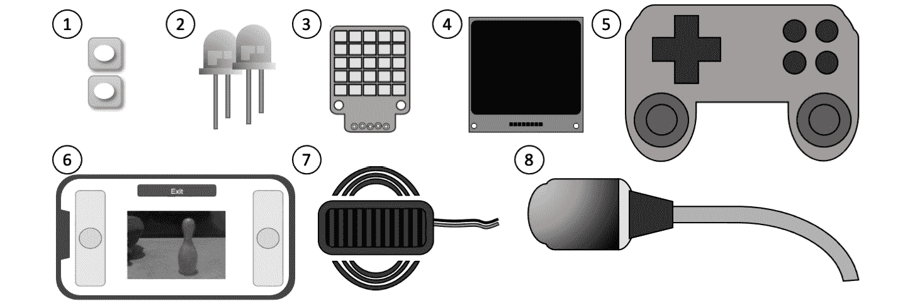

图 14.3 – 人机交互 I/O

*图 14.3* 展示了许多改善人与机器人交互的方法：

1.  **按钮**：在机器人上添加按钮以启动和停止行为。

1.  **LED 灯**：一些 LED 灯，可能具有不同的颜色，可以用来显示运行状态的反馈。大 LED 灯也可以用作前灯。

1.  **RGB LED 显示屏**：这些显示屏可以是条形或面板式，每个 LED 都可以设置为不同的颜色。它们可以提供更多的调试功能，也可以制作出可爱的小眼睛或面孔。它们使用多种接口，包括自定义的单针系统，以及 SPI 或 I2C。图中的 Pimoroni PIM435 使用的是 I2C。

1.  **OLED 屏幕**：这些屏幕可以直接在机器人上显示图片、旋钮、菜单、文本或图形。它们有单色或彩色两种，通常由 I2C 控制。例如，Velleman WPI438 I2C 屏幕就是这样一种单色 I2C 设备。

1.  **游戏手柄**：游戏手柄控制器将是控制机器人的一种好方法。然而，它可能需要一个更高级的蓝牙设置来与 Raspberry Pi Pico 接口。

1.  **手机网页应用**：我们一直在使用 BlueFruit 应用，但通过将蓝牙换成 Wi-Fi（例如使用 Raspberry Pi Pico-W），你可以编写更多交互式的手机控制代码。这将需要为前端编写更多的代码。在撰写本文时，智能手机上的绘图系统需要相当多的代码才能通过 Wi-Fi 生成，而且还没有方便的应用程序，例如 BlueFruit LE Connect。

1.  **蜂鸣器**：这些可以为机器人发出蜂鸣和嗡嗡声。你可以直接从 GPIO 引脚驱动一些这些蜂鸣器，用音乐音调表示程序的状态或产生有趣的声音。

1.  **麦克风**：有适用于 Raspberry Pi Pico 的 UART 兼容语音控制模块。它们有一组小命令来启动行为，并且，通过 LED 或蜂鸣器反馈，这可能是一种与机器人互动的新颖方式。

用户交互可以操纵行为，但我们需要一个合适的地方来安装这些 LED。我们能为机器人的底盘做些什么来改进和扩展它？

## 底盘和形状增强

机器人的底盘简单且轻便，但我们可以进一步改进，使其成为一个更坚固或更具美学吸引力的机器人：

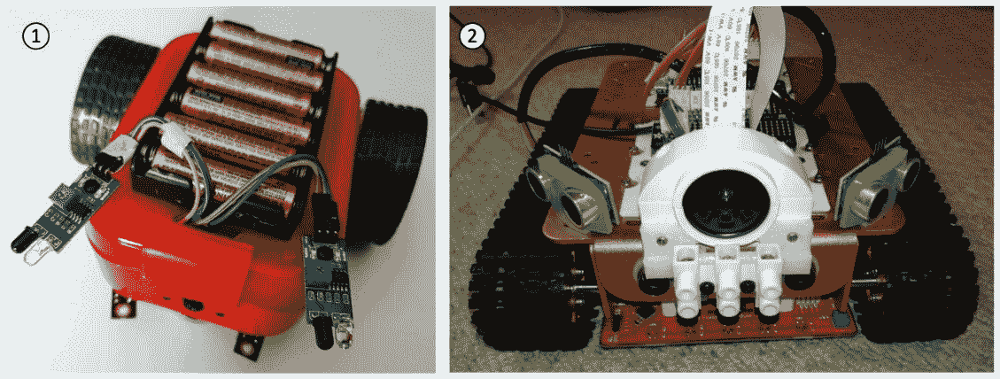

图 14.4 – 底盘增强

*图 14.4* 有两种改进机器人或其传感器的外壳方法的示例：

1.  *图 14.4* (*1*) 展示了一个改造为机器人的午餐盒。一个午餐盒、冰淇淋桶或带有孔洞的滚筒油漆托盘可以被制成机器人的整流罩，封装电子元件并固定其电线和电子元件。

1.  *图 14.4* (*2*) 展示了一个带有 3D 打印传感器支架的机器人。可以通过这种方式或通过真空成型或激光切割制作定制的整流罩和支架。参见本章后面的 *设计和制造* 部分。

无论你选择哪种方法，它都需要轻便且易于拆卸，以便电子元件易于访问，你可以更换电池。它可以通过螺栓或魔术贴固定在原位。

你需要考虑如何使控制装置易于访问——例如，将开关和充电端口放在外面。拥有一个整流罩可以邀请更多的装饰，使用颜色和风格面板。将此与 RGB LED 结合，可以制作出外观有趣的机器人。你可以从你最喜欢的科幻机器人那里获得风格灵感，并使用类似的配色方案。

## 电子增强

我们迄今为止使用的电子元件是由连接电缆连接在一起的模块，使用面包板组装它们。面包板非常适合原型设计，但占用大量空间和重量，容易受到移动和振动的影响，导致电线迅速松动或形成不良连接。它们看起来也很杂乱。我们能够研究什么来升级这一点？

这里有一些我们可以对机器人电子元件进行的坚固性增强：

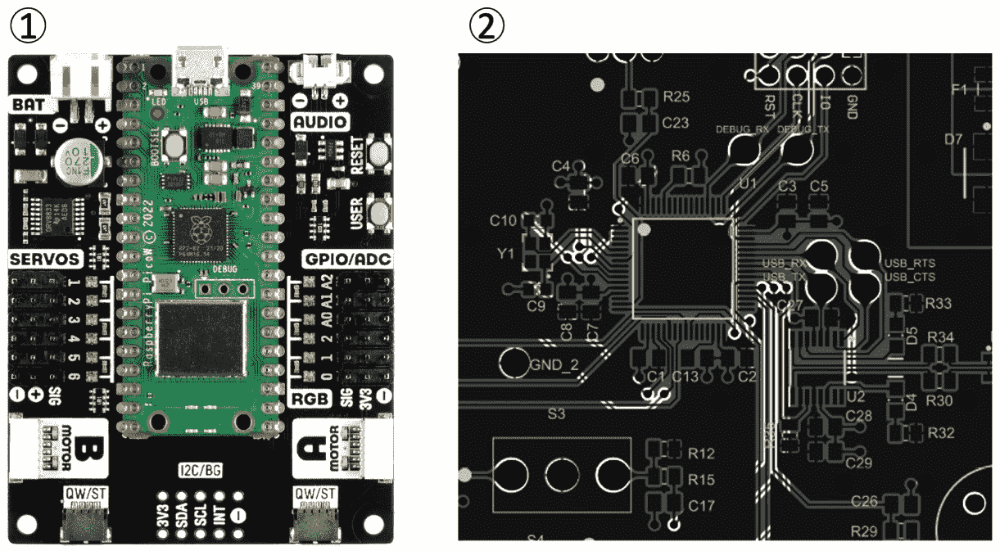

图 14.5 – 改善机器人电子元件

机器人中的电子元件可以做得更小、更轻、更整洁。尝试以下想法：

1.  在 *图 14.5* (*1*) 中展示的是 Pimoroni 的 Inventor 2040 W ([`shop.pimoroni.com/products/inventor-2040-w`](https://shop.pimoroni.com/products/inventor-2040-w))。适用于 Raspberry Pi Pico 或集成 RP2040 的电机和机器人板可以减少布线的数量。Inventor 2040 W 包含电机控制、灯光和伺服连接。

1.  焊接的电路板会更整洁。一个中间选项是使用条形板或穿孔板。这些预制印刷电路板可以模仿面包板条线的布线排列，允许你将面包板设计转移到它们上面。然后你可以将部件和电线焊接进去。连接到外部部件，如电机和传感器，的电线将会有它们的连接器焊接在板上。

*图 14.5*（*2*）显示了来自[`github.com/uwrobotics/MarsRoverHardware`](https://github.com/uwrobotics/MarsRoverHardware)的定制**印刷电路板**（**PCB**）。你可以使用如 KiCad 等软件下载或设计自己的 PCB。这很复杂，但为你提供了许多定制选项。你使用 PCB 视图来布置电路板并布置部件之间的连接。使用 PCB 可以使你制作出小、轻、整洁的机器人设计。此外，它还使你的设计可以采用表面贴装电子元件，这使得更多元件可用。你可以使用**设计规则**来确保所有连接都已制作，并且轨迹没有接触。在此之后，你就可以准备部件进行制造了。你可以将这些设计带到如 Seeed Studio（[`www.seeedstudio.com/`](https://www.seeedstudio.com/））这样的电路板制造商那里，他们为你打印电路板。

一些电路板制造商提供**印刷电路板组装**（**PCBA**）服务，在额外收费的情况下，他们会在将部件发送给你之前将元件、插座和连接器焊接在板上。使用 PCBA 服务意味着你只需在收到电路板后插入外部传感器，也许还需要将 Pico 插入插座。这意味着你不需要自己焊接表面贴装元件。只是要注意，这需要经验，并且你可能会在第一次制作时产生不正确的电路板。

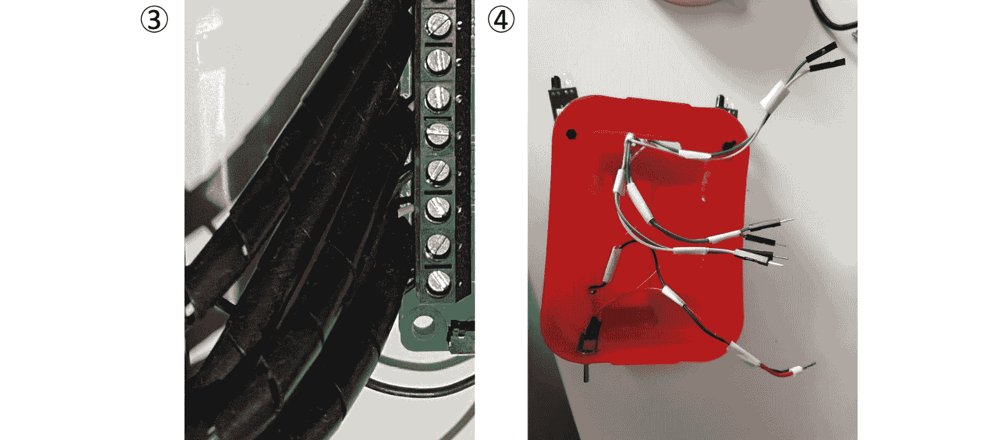

图 14.6 – 整理线路

1.  你可以使用 6 毫米螺旋缠绕带和电缆夹，如图*图 14.6*（*3*）所示，或只是使用胶带，如图*图 14.6*（*4*）所示，来整理机器人电缆。如果你努力将线路布置得很好，线路可以看起来很美观。

1.  对于连接器，我们由于它们的便利性而使用了杜邦连接器。然而，一旦你处于焊接电路板上，你可以考虑使用锁定连接器，例如 JST 或 Molex PicoBlade 连接器。这些连接器将电缆固定在原位，这样它们就不会因振动而松动或轻易被拉出，并且通过极化增加了额外的保护。你需要练习使用压接工具才能有效地使用这些连接器，但这对更好的机器人构建来说将是值得的。

借助坚固的车身和更整洁的电子设备，你可能可以进一步增加输出。让我们看看机器人输出可以做些什么。

## 你可以添加的输出

输出意味着机器人可以做更多的事情来移动或改变其周围环境。可以使用额外的电机，例如伺服电机，来制作有趣的机械装置，例如以下图中所示：

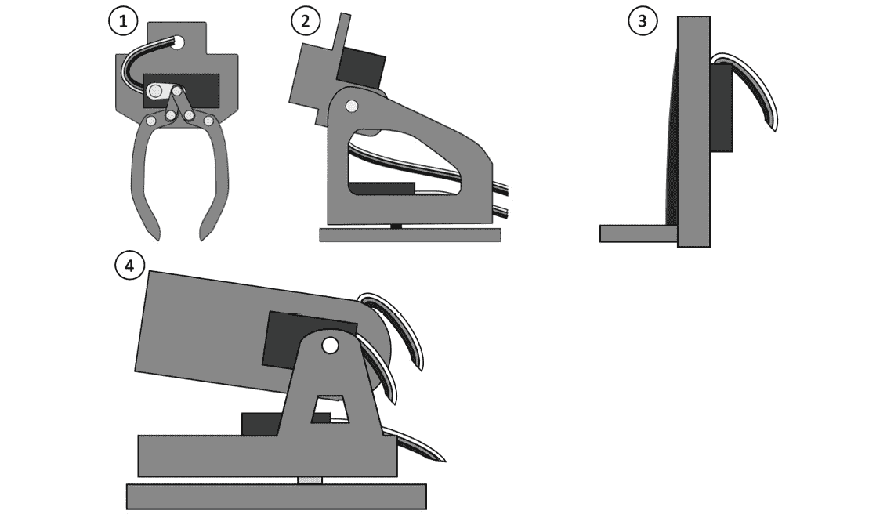

图 14.7 – 使用中的电机和输出

*图 14.7* 展示了使用更多电机来扩展机器人的几种有趣方式：

1.  **夹爪** – 夹爪可以抓取物品并将它们移动。Pololu 微型夹爪套件使用一个伺服电机来打开或关闭夹爪。将这些夹爪安装在机器人前面很有趣。

1.  **俯仰和倾斜机构** – 在这个机构上放置传感器意味着你可以将传感器指向特定的感兴趣点，或者使用头部用传感器进行扫视。一个伺服电机旋转头部左右（俯仰），另一个倾斜头部上下。Adafruit 微型俯仰倾斜套件是这方面的一个好例子。

1.  **升降机构** – 这些机构使用电机来升降平台，就像叉车一样。这可以与夹爪结合，制作出能够堆叠物体的机器人。

1.  **球发射器** – 发射器会让机器人能够瞄准目标，这会很有趣。像 PiWars 这样的机器人竞赛中就有涉及使用这些发射器的项目。需要电机来指引瞄准，并且需要一个电机或执行器来发射球。

这些只是几个例子；还有很多机制你可以购买或自己制作。你甚至可以使用像 MeArm 伺服机器人手臂套件这样的套件添加一个整个手臂。

现在我们已经看到了一些输出，也许我们可以更好地使用这些传感器和输出，结合更多的行为。

## 扩展代码和行为

机器人的代码和行为是让机器人活起来的关键。然而，我们可以以多种方式改进这个机器人的代码，如下面的图所示：

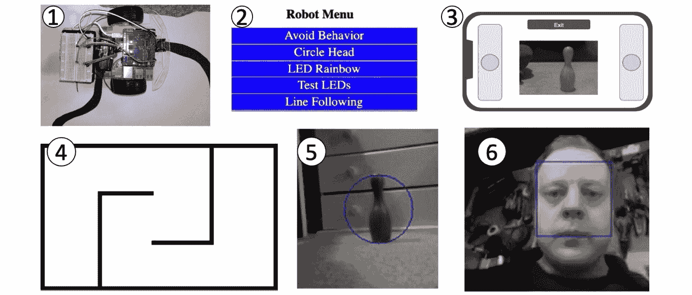

图 14.8 – 行为建议

*图 14.8* 展示了一些建议；以下列表涵盖了这些以及其他更多内容：

1.  **循线**：使用在传感器部分提到的线检测传感器，你可以编程机器人跟随地板上画出的线条。循线可以使用 *if-then, bang-bang* 控制，或者使用 PID 算法来实现平滑的循线。

1.  **菜单系统**：你可以将所有行为组合到一个菜单中进行选择。考虑如何整理每个程序，以便另一个程序可以接管。这种方法的变体是使用语音控制模块，以及蜂鸣声，来指示当前机器人的模式。

1.  **使用摄像头驾驶**：添加一个摄像头并将其提供给手机网页应用，这意味着你可以通过摄像头视图来驾驶机器人——一个机器人潜望镜。

1.  **迷宫解决**：使用更多的距离传感器，机器人将能够寻找出口并在迷宫中找到路径。根据迷宫的复杂程度，简单的规则，如始终向左转，可能有效，或者机器人可能有一个迷宫地图，并使用蒙特卡洛方法进行精确导航。例如，使用编码器的向左转方法可能能够记住它所采取的转弯和位置，然后回溯并尝试其他路线。

1.  **摄像头导航**：摄像头图像可以被缩放到低分辨率，并可以使用算法来检测图像强度或颜色超过阈值的变化。检测到的特征位置可以与 PID 算法结合，以相对于这些特征定位机器人。

1.  **摄像头识别**：识别要复杂得多，可能需要查看机器学习系统，如 TinyML。参见[`bit.ly/3xy3twx`](https://bit.ly/3xy3twx)了解 TinyML 对 CircuitPython 的端口新闻。你可以使用类似的技术与麦克风进行语音识别，但这可能足够强大，以至于需要多个 Raspberry Pi Pico 板。

以下建议未在图中展示，但代表了高级行为：

+   **同时定位与建图**（**SLAM**）：机器人可以使用其传感器构建其位置的地图，然后跟踪其相对于已映射内容的姿态。这种技术将使用多个传感器一起，并从我们已提到的激光雷达传感器中受益。然而，这种高级技术可能是一个深不可测的兔子洞！

+   **任务规划**和**运动规划**：结合受控转弯、受控移动和位置跟踪与跳斗或夹爪，意味着你可以创建行为来寻找、收集物品并将它们放置在收集点。

希望这些建议能够激发一些创造性的行为。代码、传感器和输出的组合可能性无穷无尽，你可以利用这些来提高你的知识，用机器人解决问题，并扩展你的工具箱。

然而，到目前为止，这些建议一直集中在扩展现有平台。那么，当我们扩展到考虑你的下一个机器人平台时会发生什么呢？

# 规划你的下一个机器人

在*第一章*中，*使用 Raspberry Pi Pico 规划机器人*，我们在*哪种机器人样式合适？*这一节中看到了几种样式。现在，让我们邀请更丰富的想象力，重新审视机器人可以有多么不同。

## 形状、形状和底盘

我们将再次考虑*第一章*中的样式以及你如何到达那里：

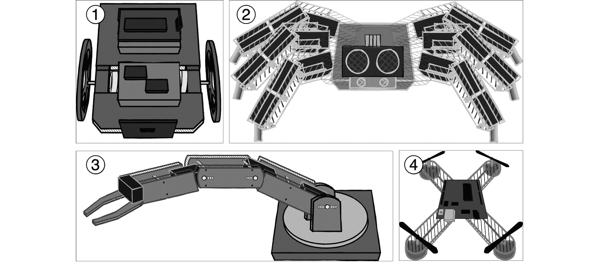

图 14.9 – 不同的机器人样式

前面的图显示了四种机器人样式。现在我们可以想象更多基于这些样式的变体：

1.  **更大的轮式平台**以容纳更多传感器和电子设备，可能还有更有趣的轮子排列。

1.  **六足机器人**有六条腿 – 用于探索行走和步态。这将使用大量的伺服电机。

1.  **机器人臂**，例如之前提到的 MeArm。这些可以是伺服电机或步进电机驱动。

1.  **四旋翼无人机**非常轻，但涉及到更有趣的 IMU 和 PID 应用。

以下图表显示了一些其他机器人想法：

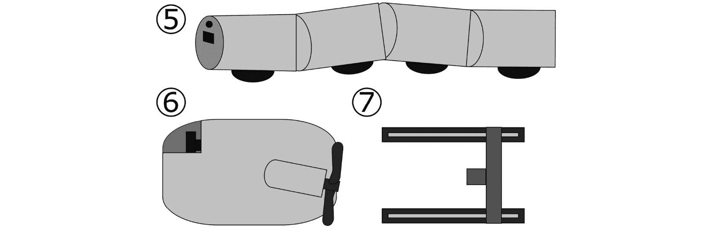

图 14.10 – 更多机器人类型

*图 14.10* 展示了一些你可以考虑用于你下一个项目的更多机器人类型；就想法而言，它们可能更具雄心：

1.  **蛇形机器人**由多个带有分布式电子的机器人段组成。这些段可以像火车上的车厢一样弯曲，动力和控制沿着段之间运行。你可以使用伺服电机来控制弯曲，段上的电机驱动轮子或履带提供牵引力以拉动蛇，并带有传感器。前段通常携带面向前方的传感器。

1.  使用**潜艇机器人**探索湖泊或池塘会很有趣。这需要考虑如何给浸没的电机供电，如果机器人失去电力，如何安全地回收它，以及如何通过水控制它，因为水会阻挡如蓝牙或 Wi-Fi 之类的射频信号。可能需要一根绳索。你还需要考虑重量、压载物和可移动推进器。一个有趣的变体可能是一种两栖浮动物体，它可以在陆地上行驶，在水中移动，并且可以下潜。

1.  *一种* **XY** 或 **龙门式机器人**通常使用步进电机，排列方式是每一组电机沿着每个轴移动。3D 打印机、CNC 铣床和激光切割机经常使用这种类型。它们也可以用来绘制图像，或者与抓取器一起拾取物体并将它们放置在某个地方。

这些机器人变体应该能给你带来灵感。接下来，让我们看看轮式平台的一些变体。

### 轮子的变体

轮式平台仍然是一种实用且直接的机器人风格。然而，你可以以许多令人兴奋的方式扩展这些轮子：

+   **履带**比轮子提供更大的牵引力，并能处理不平的表面。它们看起来也很吸引人。一些类型使用单个橡胶模具的履带，例如小型 Zumo 底盘上的履带，而其他类型使用由链节组成的履带，例如 Devastator 机器人底盘上的履带。根据这些类型，在尝试转向时可能会遇到摩擦问题，并且根据表面可能需要更大的扭矩。

+   **麦卡诺轮**是独特的。除了前进/后退和转向外，麦卡诺平台还可以“*横着爬行*”并几乎在任何方向上行驶；为此实现，你需要四个独立的电机和一些专业的控制算法。参见[`bit.ly/3y1Kjzp`](https://bit.ly/3y1Kjzp)获取示例。

+   **三联轮**是由三个轮子组成的集群，设置方式是单个轮子可以转动，或者整个集群可以转动；这使得它们可以根据相对大小爬上台阶。它们在机械上很复杂，但可以像普通轮子一样驾驶。它们应该是四轮或六轮驱动组合。

+   **独立驱动**使用可单独转向的轮子组件；火星探测车就有这些，每个轮子组件由步进电机或伺服电机驱动，每个轮子都可以单独驱动；它们可以横着爬行和转向。这些比麦卡诺轮更复杂，但更坚固。

现在，我们对下一个机器人的形状和如何在此基础上构建简单的轮式底盘有了些想法。您将使用什么过程来设计机器人？

### 设计阶段

您可以通过从草图和简单的纸板部件开始，就像我们在*第一章*中做的那样，*使用 Raspberry Pi Pico 规划机器人*，然后随着您对想要的设计越来越清晰，将设计带到 CAD 中。

我们将进一步探讨一些电子设备，但您希望在将它们纳入 CAD 设计之前，对尺寸和部件的安装位置有清晰的认识，以便在为机器人制造任何部件之前。

让我们来看看电子设备。

## 电子和传感器

您需要为每种形式和用例调整电子设备。例如，配备更大电机的机器人将自然需要更大的电机控制器和能够处理更多功率需求的电源系统。较大的电机驱动器包括 LM2575，能够处理 15 A 的电机在 36 V 的电压下工作。

配备伺服电机的机器人需要像 Adafruit 16 伺服控制器这样的控制器来处理多个伺服电机的电源和控制。配备步进电机的机器人可能需要类似的步进电机分线器，尽管根据所需的精度，四通道直流电机控制器也可以驱动步进电机。

潜水机器人需要防水，而多旋翼无人机需要高效率。对于这些，无刷电机是最合适的，它们需要由**电子速度控制器**（**ESCs**）驱动。一些轮式机器人也使用无刷电机，因为它们的效率很高。

对于较小的机器人，一个集成的电机控制器，如 Pimoroni Inventor 2040 W（在*电子增强*部分中看到）或 Pimoroni Servo 2040 可能是有意义的。例如，Servo 2040 可以控制 18 个电机，使其非常适合 6 足步态机器人。

当需要更多电池功率时，您可能需要从 AA 电池升级到锂离子或锂聚合物技术。此外，您还需要仔细考虑电池管理系统，以防止灾难性事件发生，并确保您有充电器。Pimoroni 的 Lipo SHIM 将帮助为这些电池充电并为 Raspberry Pi Pico 供电。

在传感器方面，您可以考虑之前描述的全套传感器。在规划时，请考虑哪些 Raspberry Pi Pico 引脚将被使用。[`pico.pinout.xyz/`](https://pico.pinout.xyz/)是此目的的一个极好的资源。

随着您使用更多的引脚和传感器，您可能需要使用更多的 I2C 传感器，这可能需要 I2C 多路复用器，如 TCA9548A 模块。如果传感器不是 I2C，只需要 GPIO 引脚，那么 PCF8574 通过 I2C 添加其他 GPIO 引脚。如果您需要添加更复杂的传感器，可能需要第二个 Raspberry Pi Pico 或基于 RP2040 的板。

您还可以考虑为扬声器添加 I2S 音频放大器，以产生比蜂鸣声更有趣的声音，并在 Pico 上添加麦克风以进行声音识别。

还值得考虑机器人应用是否需要强大的 CPU，如完整的 Raspberry Pi，并将 Raspberry Pi Pico 保留为 IO 协处理器。

对于像蛇形机器人这样的机器人，你可能需要考虑如何在各个段之间布线模块。如果你建造一个潜艇机器人，你将如何保护电子设备免受水进入？

接下来，我们将看看你可以尝试使用这些设计的代码类型。

## 代码和行为

选择代码有几个因素：

+   你需要什么样的控制代码来处理传感器、输出和机制？

+   机器人需要有多智能才能解决特定问题？

+   可能需要哪些安全因素，以及这将如何与形状和形式相互作用？例如，你可能需要什么样的控制系统来快速停止机器人？

腿式机器人的控制机制可能需要代码将伺服电机分组为具有多个关节的腿，然后平滑地在由步态定义的位置之间移动——行走策略。这些通常是顺序模式；它们可能会根据腿或脚传感器的反馈进行调整或继续遵循顺序。通常，步态代码控制运动，另一个程序以**马和骑手**配置引导这个步态代码。

对于机器人臂或蛇形机器人，研究**逆运动学**算法将有助于确定机器人各部分相对于其他部分的位置，选择伺服电机在臂或蛇上需要达到该点的角度。

使用更强大的 CPU 运行 Linux 的机器人可能需要超越简单的 Python 脚本，进入**机器人操作系统**（**ROS**）。

如果速度是一个问题，你可以考虑一个快速的控制器，如 Teensy，一个强大的控制器，如 Raspberry Pi，或者探索其他编程语言，如 C 和 Rust。你可以使用 C 来扩展 CircuitPython，并使用 Python 将不同的机器人功能粘合在一起。

如果你开始需要多个 RP2040 控制器，它们将如何相互通信和交互？通过 I2C 总线或 UART？你可能需要研究和考虑一个协议，以便它们可以相互发送请求。

你现在已经考虑了机器人的外形和底盘，它可能需要的电子设备，以及你想要的代码。了解更多构建机器人的方法或测试和展示代码的情况可以帮助你构建这些新的机器人设计。

# 进一步建议学习的领域

你对未来的机器人（甚至是一些未来的机器人）有一些想法，你想要构建。了解一些其他技能将允许你进一步设计这些设计并更具创造性。让我们深入探讨。

## 电子学

参考本章前面提到的**电子学增强**部分以获取灵感。为了回顾，请参阅以下内容：

+   了解如何使用条形板或 Veroboard 设计电路以及进一步的焊接技能。

+   学习使用 KiCad 等工具设计 PCB 板。你将 Raspberry Pi Pico（或者，如果你更勇敢，是 RP2040）等部件放入原理图编辑器中，以确定它们的连接。

+   考虑如何保持电缆整洁，也许在设计图纸和 CAD 设计中设计电缆路由，以制作一个非常整洁的机器人。

+   使用减少振动并只能单向连接的连接器，以减少错误。

有更多方法可以扩展你的机器人工具箱：

+   示波器用于查看电路波形，非常适合查看 PWM（参见*第五章*中的*脉冲宽度调制速度控制简介*部分）

+   逻辑分析仪用于调试数据总线和逻辑系统

+   台式电源用于测试电子设备，无需担心电池

+   更先进的焊接站

+   夹具用于固定电路板和组件，并测试这些连接

+   库存中的电子元件，如二极管、电阻器、电容器和电线

+   一些标准芯片，如运算放大器和稳压器，以及电机备件

另一项高级电子能力是查看**现场可编程门阵列**（**FPGA**）。这些设备允许你将数字电路编程到它们中，允许快速 I/O 辅助器超越 PIO，甚至小型 CPU 核心。它们不便宜也不容易使用，但它们在接口和原型设计新芯片方面提供了巨大的灵活性。

现在你已经看到了一些高级电子技术，我们可以看看更先进的制造技术。

## 设计和制造

我们使用手工具来构建这个机器人。然而，一些技术允许你创建更复杂的机器人形状。我们在本章的*底盘和形状改进*部分提到了它们。

许多这些工具的入门途径是练习使用 3D CAD，并学习 Blender 来创建更有机的形式。尝试 FreeCAD 之外的 3D CAD 替代品，如 Solvespace 或 Fusion 360，看看哪个更适合你，是值得的。最后，学习 Inkscape 程序进行 2D 绘图或制作用于 3D 形状的贴纸也是值得的。在设计过程中，你还应该清楚如何组装到达的零件。

所有制造方法在设计时都需要考虑系统的限制：例如，最小切割宽度、零件厚度以避免断裂，以及切割工具如何访问零件的不同表面。

让我们看看你可以如何制造零件的列表：

+   **激光切割**是我们切割零件的自然延伸。CAD 输出是用于切割成 2D 材料板的精确形状。设计组装方式类似于平板家具或使用支架。你可以用这种制造系统制作出令人印象深刻的设计。MeArm ([`mearm.com/`](https://mearm.com/)) 机器人臂或 OhBot 机器人头 ([`www.ohbot.co.uk/`](https://www.ohbot.co.uk/)) 就是使用激光切割制作的。

+   **CNC 铣削**允许你使用机器人控制的切割部件在材料上切割，可以切割木材、塑料和金属。它可以切割出不同深度的部件，形成复杂的形状，但主要从上方操作，不能从侧面或下方进行切割。

+   **3D 打印**提供了完全 3D 复杂部件的可能性，尤其是当它们可能是单个机器人设计的单件部件时。你可以使用这些部件进行迭代，随着设计的改进打印部件的改进。桌面 3D 打印机价格低廉，在家庭实验室中很有意义。

+   **真空成型**是将塑料板拉向模具（或凹模）以形成外壳的过程。这种技术允许制作薄而单件的塑料区域，可能非常适合机器人外壳（外壳）。你可以使用提到的其他技术来制作凹模。

+   **金属技术**，如焊接、切割和使用金属板，可能对大型机器人或可能被粗鲁对待的机器人有用。然而，大多数小型业余机器人不需要这些。一些金属结构可以通过使用铝型材、锯子和 T 型槽螺栓头简单地制作。

你在哪里可以找到这些机器进行制造？许多这些机器都很大且价格昂贵。如果你家里没有足够的空间，你可以考虑将设计发送给公司，让他们为你切割，例如 [`razorlab.online/`](https://razorlab.online/)。如果你是学校、学院或大学的一员，它可能在实验室里有这些设备。否则，请参阅本章后面的“建造机器人的地方”部分，以获取有关创客空间的信息。

前述技术将让你制作有趣且多样化的机器人设计，改进部件并探索不同的形状。如果你参与机器人社区，这些技术和帮助你学习它们的人会更容易获得。

## 机器人竞赛和社区

有许多机器人社区。本节的目的不是详尽无遗，而是帮助你开始参与其中。

### 社交媒体

这本书有一个位于 [`discord.gg/2VHYY3FkXV`](https://discord.gg/2VHYY3FkXV) 的 Discord 社区。你可以用这个社区来向我提问，并与其他机器人构建者讨论你的机器人。

Adafruit 有一个用于讨论机器人、电子和 CircuitPython 的 Discord 社区 - 更多信息请访问 [`blog.adafruit.com/2019/02/05/adafruit-community-server-on-discord-now-included-in-the-open-source-listings-discordapp-discord-opensource-circuitpython/`](https://blog.adafruit.com/2019/02/05/adafruit-community-server-on-discord-now-included-in-the-open-source-listings-discordapp-discord-opensource-circuitpython/)。

Twitter 上有一个活跃的机器人社区。我在那里是 `@orionrobots`，我经常分享和推广机器人推文；我会回答机器人问题，并将机器人构建者介绍到社区中。

以下许多社区都有 Twitter 账号或标签，值得一看。Twitter 还有一个`#MakersHour`标签，用于人们谈论制作任何东西，包括机器人。

我也在 YouTube 上[`youtube.com/orionrobots`](http://youtube.com/orionrobots)有账号，你可以看到我一直在建造的机器人，在 Mastodon 上`fosstodon.org/@orionrobots`，以及在 Facebook 上[`www.facebook.com/orionrobots`](https://www.facebook.com/orionrobots)。

机器人建造者詹姆斯·布鲁顿在[`twitter.com/XRobotsUK`](https://twitter.com/XRobotsUK)和 YouTube 上[`bit.ly/3RYScxp`](https://bit.ly/3RYScxp)以`@XRobotsUk`展示令人鼓舞的机器人建造。

另一位拥有社区的杰出机器人建造者是凯文·麦克利尔，他在[`www.youtube.com/c/kevinmcaleer28`](https://www.youtube.com/c/kevinmcaleer28)。此外，他在[`www.facebook.com/groups/smallrobots`](https://www.facebook.com/groups/smallrobots)拥有一个活跃的 Facebook 机器人社区，用于讨论我们在这本书中建造的机器人类型，并远远超出这些范围。

### 活动

PiWars 活动是在英国举办的机器人建造者竞赛，他们使用 Raspberry Pi 在自主和手动驾驶挑战中竞争，展示并提高机器人建造、驾驶和编码技能。这个社区是全球性的、欢迎的，并且乐于分享技术。你可以在其网站[`piwars.org/`](https://piwars.org/)上找到它。PiWars 还有一个[`twitter.com/piwarsrobotics`](https://twitter.com/piwarsrobotics)账号和一个 PiWars Discord 服务器[`discord.gg/sjABKje`](https://discord.gg/sjABKje)。

**英国微型鼠和机器人协会**（**UKMARS**）社区举办机器人竞赛，其中微型鼠竞赛是最古老的。微型鼠是一种在英国运行的迷宫跑机器人挑战赛，拥有一个活跃的机器人建造者社区。访问[`ukmars.org/`](https://ukmars.org/)获取更多信息。

**第一机器人竞赛**（**FRC**）在[`bit.ly/3BnWOWG`](https://bit.ly/3BnWOWG)举行，它激励人们建造机器人并在全球范围内进行机器人竞赛。这些活动在某些地区举行，最终在德克萨斯州的休斯顿举行锦标赛。区域活动意味着在前往德克萨斯州之前，团队可以进行面对面的比赛和合作。

Maker faires 是在全球范围内举办的活动，你所在的国家可能也有一些。制作者们来到这里展示、讨论和庆祝他们的创作。这些活动围绕制作者社区展开，为各种类型的制作者，包括机器人建造者，提供了极大的灵感和联系。有关详细信息，包括查找你附近的 maker faires，请参阅[`makerfaire.com/`](https://makerfaire.com/)。

如果你需要比在家更多的帮助、工具或空间来建造这些机器人，你可以在哪里建造？

### 建造机器人的地方

工具和经验对于构建机器人非常重要。虽然在线交流有所帮助，但与使用特定工具经验丰富的人一起工作几乎是无价的。你可以在以下图中找到类似的空间吗？

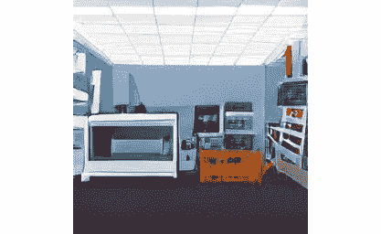

图 14.11 – 一个创客空间

创客空间、黑客空间或**制造实验室**（**Fab Labs**），如图 14.11 所示，是你可以前来获取高级工具的地方，例如 3D 打印机、激光切割机和数控机床，以及一系列的手工工具、电子设备和为他们提供的大型工作台。它们通常通过会员资格和少量捐赠即可访问。

这些空间通常光线充足。有知识的人会维护这些工具，并且也可以在构建过程中为你提供建议和培训。专家还可能建议一种不同的制造技术，这可能以更好的方式（更快、更便宜或更强）帮助你获得想要的结果。

这些空间也往往有安全系统，如烟雾或灰尘去除，这在焊接电子产品或切割木材等材料时是必不可少的。你还会发现，这些空间通常有尝试新技术的所需组件或材料。如果你想在购买大量设备之前尝试一种技术，使用少量材料或借用工具是至关重要的。强烈建议你寻找附近的 Fab Lab、创客空间或黑客空间。

一些程序员道场将机器人编程作为他们课程的一部分。程序员道场将更多地关注代码和算法，而不是构建机器人。运行代码俱乐部或 STEM 俱乐部的学校也可能愿意接受机器人编程和构建。

现在我们已经看到了一些社区，那么在代码领域还有哪些进一步探索的领域？

## 机器人系统和代码

在机器人上运行的软件具有巨大的探索潜力。有了添加额外控制器和内存或扩展到更大、更强大的控制器的功能，这个领域几乎没有什么限制。

在*第十三章*，*使用蒙特卡洛定位确定位置*中，我们看到了机器人如何使用模拟来帮助机器人理解其世界，因此你甚至可以考虑在虚拟环境中扩展这一点。虽然这对于机器人的算法来说是合适的，但将其扩展到完整的可视化和 3D 将是在重新发明轮子。使用 Godot 游戏引擎或 ROS Gazebo 系统等系统进行模拟将让你开始测试机器人算法，而不必在实际机器人上进行，让你能够使用传感器数据改进规划和 SLAM 技术。你可以为机器人构建 3D、具有物理功能的虚拟世界，并在那里测试代码。你需要解决在模拟中使用的语言和 CircuitPython 之间能够转移代码的问题。然而，当你转向更大的项目时，你可能需要考虑 CircuitPython 之外的语言。你可能能够调整一些东西，但请注意，当你尝试在现实世界中尝试相同的机器人代码时，PID 算法的值可能会发生变化。

在位置映射概念的基础上，有基于目标的算法和任务规划（在*扩展代码和行为*部分提到）。这包括规划机器人如何从一个位置到达另一个位置，以及如果机器人需要移动物品以完成该操作，它可能需要做什么。例如，PiWars 生态灾难([`bit.ly/3xBPIwz`](https://bit.ly/3xBPIwz))挑战要求规划如何将桶移动到特定位置而不碰倒其他桶。在随机放置的桶的情况下，这是一个很好的挑战，可以用来学习这些高级机器人算法。

我们之前简要提到了机器学习。有一些不同的技术，其中神经网络的变体在写作时是最受欢迎的类型。深度学习在大型控制器上使用 TensorFlow，在小型控制器（如 Raspberry Pi Pico）上使用 TinyML，提供了图像和声音识别的结果。这扩展到图像分析和图像分类。结合先进的计算机视觉技术和使用摄像头作为传感器的导航成为可能。然而，LIDAR 传感器仍然是可靠的距离信息来源。

另一种有趣的技巧是集群机器人，一群机器人作为一个单一系统工作。这些机器人需要通过射频（如 Wi-Fi、蓝牙或红外）相互通信。你需要编写能够规划多个机器人如何解决问题的代码。我建议研究鸟群和其他人工生命主题，以逐步解决此问题，并配合之前提到的规划技巧。

你现在已经看到了扩展你对机器人学了解的算法。让我们回顾一下我们看到了什么。

# 摘要

在本章中，我们回顾了在《*Raspberry Pi Pico Robotics for Workbench Wizards*》中学到的内容，以及我们使用这些技能构建的机器人。

我们随后调查了如何扩展这个机器人，构建额外的功能，例如传感器、输出，以及更有趣或更坚固的车身，并将代码扩展以实现惊人的功能。

我们进一步拓展，提供给你下一个机器人的想法和灵感或研究领域，你可以从一张白纸开始设计和构建。

最后，我们深入研究了电子领域的先进技术，如何制造更复杂的零件，你可以参与的机器人社区和空间，以及机器人编程可以走向何方。这一部分应该为继续构建机器人提供大量的灵感！

# 练习

以下练习将加深你对这些主题的理解，并使机器人的代码更加完善：

+   考虑对当前机器人进行有趣的改进，制定计划，然后开始行动。

+   加入机器人社区，并在 Discord、Facebook、Twitter 或 Mastodon 上参与机器人。

+   计划并构建你的下一个机器人或机器人相关的小工具。然后，与社区分享它！

你的机器人之旅现在才刚刚开始。我期待在机器人社区见到你，以及你创造的机器！

# 进一步阅读

你可以通过以下书籍和阅读区域继续你的机器人构建之旅：

+   在《*学习机器人编程*》一书中，作者是*丹尼·斯泰普尔*，由*Packt Publishing*出版，我讲述了使用树莓派构建机器人，包括另一个轮式机器人构建、视觉处理和语音控制，以及不同的电源系统。

+   《*Python 机器人项目*》由*迪瓦卡·瓦伊什教授*编写，由*Packt Publishing*出版，展示了如何构建几个小型机器人，探索其中的代码，并提供了可以与之尝试的机器学习项目。
