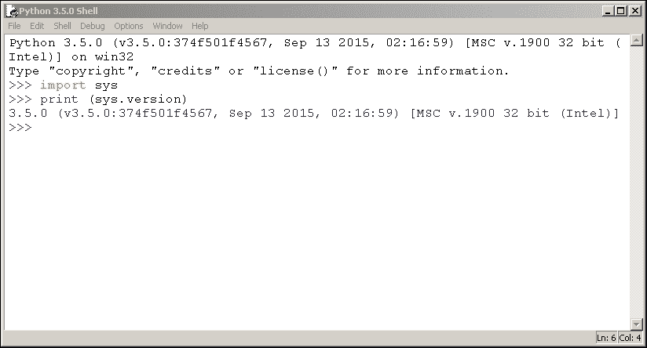
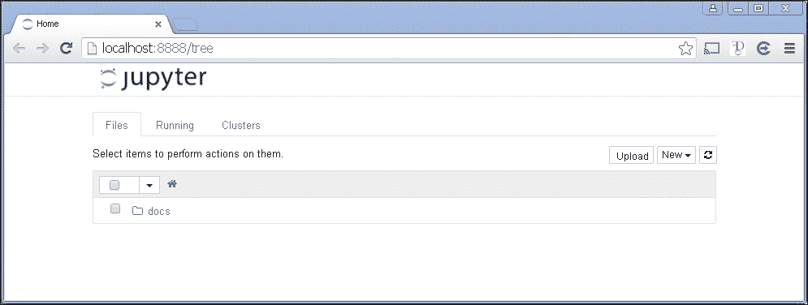
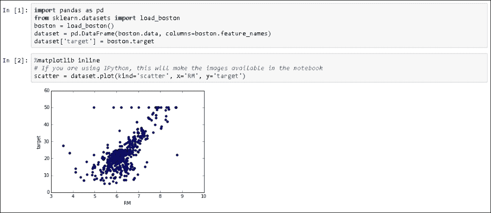

# 第一章。回归 – 数据科学的工作马

欢迎参加关于数据科学工作马——线性回归及其相关线性模型系列的介绍。

现在，互联互通和数据爆炸是现实，为能够实时读取和解释数据的企业打开了新的机会世界。一切都在促进数据和信息的产生和传播：无处不在的互联网在家中和工作中扩散，大量电子设备装在大量人口的口袋里，以及软件无处不在地产生关于每个过程和事件的数据。每天产生如此多的数据，人类由于数据量、速度和种类而无法处理。因此，机器学习和人工智能正在兴起。

线性回归及其衍生方法，源自统计学和计量经济学领域的漫长而辉煌的历史，可以为你提供一种简单、可靠和有效的工具，从数据中学习并采取行动。如果用正确的数据仔细训练，线性方法可以很好地与最复杂和最新的 AI 技术竞争，为你提供在日益增大的问题中难以匹敌的实现和可扩展性。

在本章中，我们将解释：

+   为什么线性模型可以作为数据科学管道中要评估的模型，或者作为立即开发可扩展的最小可行产品的捷径

+   安装 Python 和将其设置为数据科学任务的快速指南

+   在 Python 中实现线性模型所需的模块

# 回归分析和数据科学

想象一下，你是一名开发者，正在匆忙地开发一个非常酷的应用程序，这个应用程序将每天为数千名客户服务，使用你公司的网站。根据你在数据仓库中关于客户的信息，你的应用程序预计将迅速提供一个非常聪明且不太明显的答案。不幸的是，这个答案不能很容易地通过编程预定义，因此你需要采用一种典型的数据科学或预测分析的*从数据中学习*的方法。

在这个时代，这样的应用程序非常频繁地被发现在协助众多成功的网络企业中，例如：

+   在广告业务中，一个提供定向广告的应用程序

+   在电子商务中，一个批量应用程序筛选客户以提供更相关的商业报价，或者一个基于临时数据（如导航记录）的在线应用程序推荐购买的产品

+   在信贷或保险业务中，一个应用程序根据用户的信用评级和与公司的历史关系来决定是否进行在线查询

在机器学习应用于商业问题的用例不断增长的背景下，有无数的其它可能例子。所有这些应用的核心思想是，你不需要编程来定义你的应用程序应该如何行为，你只需通过提供有用的例子来设定一些期望的行为。应用程序会自行学习在任何情况下应该做什么。

在你清楚你应用程序的目的并决定使用基于数据的学习方法之后，你确信你不需要重新发明轮子。因此，你开始阅读关于数据科学和机器学习解决方案的教程和文档，这些解决方案应用于与你类似的问题（它们可能是关于数据科学、机器学习、统计学习和预测分析的论文、在线博客或书籍）。

在阅读了几页之后，你肯定会接触到许多复杂机器学习算法的奇迹，这些算法你之前可能从未听说过。

然而，你开始感到困惑。这并不仅仅是因为其背后的复杂数学；更多的是因为基于非常不同的技术的大量可能的解决方案。你也经常注意到，关于如何在生产环境中部署这些算法以及它们是否能够扩展到实时服务器请求的讨论完全缺失。

在这一点上，你完全不确定应该从哪里开始。这就是这本书将帮助你的时候。

让我们从一开始。

## 探索数据科学的承诺

在一个更加互联互通的世界和数据的日益可用性增长下，数据科学在近年来已经成为一个非常热门的话题。

在过去，分析解决方案有很强的约束：数据的可用性。有用的数据通常很少，并且总是昂贵且难以获取和存储。鉴于当前的数据爆炸，现在我们手头有大量且便宜的信息，这使得从数据中学习成为现实，从而打开了之前简单不切实际的广泛预测应用的大门。

此外，作为一个互联互通的世界的一部分，你的大多数客户现在都可以通过互联网或通过移动设备接触到（并且容易受到影响）。这仅仅意味着，在基于数据和其预测能力开发智能自动化解决方案方面做得聪明，可以直接并且几乎瞬间影响你的业务运作和表现。能够随时随地即时接触到你的客户，每天 24 小时，每年 365 天，如果你的公司知道该做什么，就能将数据转化为利润。在 21 世纪，正如不久前一篇令人难忘且尚未被反驳的文章在《连线》杂志上所说，“*数据是数字经济的新石油*”（[`www.wired.com/insights/2014/07/data-new-oil-digital-economy/`](http://www.wired.com/insights/2014/07/data-new-oil-digital-economy/)）。然而，就像石油一样，数据必须被提取、精炼和分配。

处于实质性专业知识（知道如何经营业务和盈利）、机器学习（从数据中学习）和黑客技能（整合各种系统和数据源）的交汇点，数据科学承诺找到利用你可用数据的工具组合，并将其转化为利润。

然而，硬币的另一面也有其存在。

## 挑战

不幸的是，将数据科学应用于商业问题中存在一些挑战性的问题：

+   能够处理非结构化数据或为完全不同的目的建模的数据

+   确定如何从异构源中提取此类数据并在及时的方式下整合它

+   从数据中学习一些有效的通用规则，使你能够正确预测你的问题

+   理解所学习的内容，并能够有效地向非技术性的管理层传达你的解决方案

+   在大数据输入下进行实时预测的扩展

前两点主要涉及需要数据操作技能的问题，但从第三点开始，我们真正需要一种数据科学方法来解决问题。

基于机器学习的数据科学方法需要仔细测试不同的算法，评估它们在问题上的预测能力，并最终选择最佳的一个来实施。这正是“数据科学”中的科学意义：提出各种不同的假设并对其进行实验，以找到最适合问题并能推广结果的那个。

不幸的是，在数据科学中并没有什么“白乌托邦”；没有单一假设能够成功适应所有的问题。换句话说，我们说“没有免费的午餐”（这是来自优化领域的一个著名定理的名称），这意味着在数据科学中没有算法或程序能够始终保证你获得最佳结果；每个算法的成功程度可能有所不同，这取决于问题。

数据以各种形状和形式出现，反映了我们所处世界的复杂性。现有的算法应该具有一定的复杂性以处理世界的复杂性，但不要忘记，它们只是模型。模型不过是对我们想要成功表示和复制的规则和法律系统的简化和近似，因为正如开尔文勋爵所说，“你只能控制你能测量的东西”。近似应该根据其有效性来评估，并且应用于实际问题的学习算法的有效性由许多因素（问题类型、数据质量、数据数量等）决定，以至于你真的无法事先知道什么会起作用，什么不会。在这样的前提下，你总是想先测试简单的解决方案，并尽可能遵循*奥卡姆剃刀原则*，在性能相当的情况下，倾向于更简单的模型而不是更复杂的模型。

有时，即使情况允许引入更复杂、性能更好的模型，其他因素仍可能倾向于采用更简单但性能较差的解决方案。事实上，最佳模型并不总是性能最佳的模型。根据问题和应用的上下文，诸如在生产线中实施简便性、可扩展到增长的数据量以及在实际环境中的性能等问题，可能会深刻地重新定义预测性能在选择最佳解决方案中的重要性。

在这种情况下，如果它们能提供对问题的可接受解决方案，仍然建议使用更简单、调优良好的模型或易于解释的模型。

## 线性模型

在你最初对使用哪种机器学习算法的问题进行概述时，你可能也偶然发现了线性模型，即线性回归和逻辑回归。它们都被作为基本工具、更复杂知识体系的基础块来介绍，在你希望获得最佳结果之前，你应该掌握这些知识。

线性模型已经被学者和实践者所熟知和研究很长时间。在迅速被纳入数据科学之前，线性模型一直是预测分析和数据挖掘中首先考虑的基本统计模型。它们也是统计学、经济学以及许多其他定量学科知识体系中的突出和相关的工具。

通过简单的检查（通过在线书店的查询、图书馆或直接通过谷歌图书——[`books.google.com/`](https://books.google.com/)），你会发现关于线性回归的出版物相当丰富。关于逻辑回归的出版物也相当丰富，以及关于其他不同变种的回归算法，所谓的广义线性模型，它们的公式被调整以面对和解决更复杂的问题。

作为实践者，我们深知线性模型的局限性。然而，我们不能忽视它们的强大正面关键点：简单和高效。我们也不能忽视线性模型确实是应用数据科学中最常用的学习算法之一，使它们成为数据分析（在商业以及许多科学领域）中的真正工作马。

它们远非手头最好的工具，但它们始终是数据科学发现之路上的一个良好起点，因为它们不需要对太多参数进行黑客攻击，而且训练速度非常快。因此，线性模型可以指出你手头数据的预测能力，识别最重要的变量，并允许你在应用更复杂的算法之前快速测试数据的有用转换。

在本书的过程中，你将学习如何基于线性回归模型构建原型，同时保持你的数据处理和操作流程对初始线性模型可能的开发迭代到更强大和复杂的模型（如神经网络或支持向量机）的适应性。

此外，你还将了解到有时你可能甚至不需要更复杂的模型。如果你真的在处理大量数据，在将一定量的输入数据输入到模型之后，使用简单或复杂的算法并不会那么重要了。它们都会发挥出它们最佳的能力。

大数据使简单的模型也能像复杂模型一样有效的能力，已经被 Alon Halevy、Peter Norvig 和 Fernando Pereira 共同撰写的一篇著名论文指出，这篇论文是关于*数据的不可思议有效性*的([`static.googleusercontent.com/media/research.google.com/it//pubs/archive/35179.pdf`](http://static.googleusercontent.com/media/research.google.com/it//pubs/archive/35179.pdf))。在此之前，这个想法已经因为微软研究人员 Michele Banko 和 Eric Brill 的一篇不太知名的论文而为人所知，这篇论文是关于*针对自然语言消歧的非常非常大的语料库的扩展*([`ucrel.lancs.ac.uk/acl/P/P01/P01-1005.pdf`](http://ucrel.lancs.ac.uk/acl/P/P01/P01-1005.pdf))。

简而言之，拥有更多数据的算法通常比其他算法（无论它们的复杂性如何）更胜一筹；在这种情况下，它可能就是一个线性模型。

然而，线性模型在数据科学流程的下游也可以很有帮助，而不仅仅是上游。因为它们训练速度快，部署也快，你不需要编写复杂的算法就能做到这一点，允许你使用任何你喜欢的脚本或编程语言来编写解决方案，从 SQL 到 JavaScript，从 Python 到 C/C++。

由于它们的实现简单，在构建使用神经网络或集成方法复杂解决方案之后，这些解决方案被逆向工程以找到一种方法，使它们可以作为线性模型在生产环境中可用，并实现更简单和可扩展的实现，这并不罕见。

## 你将在书中找到的内容

在接下来的几页中，本书将解释算法以及它们在 Python 中的实现，以解决实际的现实世界问题。

线性模型可以归类为监督算法，这些算法如果事先给出一些正确的例子来学习，就可以对数字和类别进行预测。得益于一系列示例，你将立即区分一个问题是否可以使用此算法解决。

由于线性模型家族的统计起源，我们不能忽视从统计角度开始。在说明线性模型的使用背景后，我们将提供理解算法基于何种统计基础以及为何创建算法的目的的所有基本要素。我们将使用 Python 评估线性模型的统计输出，提供有关所使用的不同统计测试的信息。

数据科学方法非常实用（为了解决业务影响的问题），线性模型的统计版本的实际许多限制实际上并不适用。然而，了解 R 平方系数的工作原理或能够评估回归的残差，或突出其预测变量的共线性，可以为你提供更多从回归建模工作中获得良好结果的方法。

从涉及单个预测变量的回归模型开始，我们将继续考虑多个变量，并且从仅预测数字过渡到估计在两个或多个类别中存在某个类别的概率。

我们将特别强调如何准备数据，包括要预测的目标变量（一个数字或一个类别）和预测变量；有助于正确预测的变量。无论你的数据由什么组成，数字、名词、文本、图像或声音，我们都会为你提供正确准备数据并将其转换的方法，以便你的模型表现最佳。

你还将了解到数据科学最基础的科学研究方法，这将帮助你理解为什么数据科学方法不仅仅是理论上的，而且非常实用，因为它允许获得在实际世界问题中真正可以工作的模型。

书的最后几页将涵盖处理大数据和模型复杂性的更高级技术。我们还将提供一些来自相关商业领域的示例，并详细说明如何构建线性模型、验证它，以及随后将其实现到生产环境中。

# 数据科学中的 Python

考虑到有许多用于创建线性模型的实用软件包，以及它是开发者中相当流行的编程语言这一事实，Python 是我们在这本书中展示所有代码的首选语言。

Python 于 1991 年作为一种通用、解释型、面向对象的语言创建，它逐渐稳步征服了科学界，并成长为一个成熟的数据处理和分析专用软件包生态系统。它允许你进行无数快速实验，轻松的理论发展，以及科学应用的快速部署。

作为一名开发者，你会发现使用 Python 有趣的原因有很多：

+   它提供了一套庞大、成熟的用于数据分析和机器学习的软件包系统。它保证你在数据分析过程中将获得所有你需要的东西，有时甚至更多。

+   它非常灵活。无论你的编程背景或风格如何（面向对象或过程式），你都会享受用 Python 编程。

+   如果你还不了解它，但熟悉其他语言，如 C/C++或 Java，学习和使用它非常简单。掌握基础知识后，没有比立即开始编码更好的学习方法了。

+   它是跨平台的；你的解决方案将在 Windows、Linux 和 Mac OS 系统上完美且平稳地运行。你不必担心可移植性问题。

+   虽然是解释型语言，但与其他主流数据分析语言（如 R 和 MATLAB）相比，它无疑非常快（尽管它不能与 C、Java 以及新兴的 Julia 语言相提并论）。

+   有一些软件包允许你调用其他平台，如 R 和 Julia，将一些计算外包给他们，从而提高你的脚本性能。此外，还有一些静态编译器，如 Cython，或即时编译器，如 PyPy，可以将 Python 代码转换为 C 代码，以实现更高的性能。

+   由于其最小的内存占用和卓越的内存管理，它可以在内存数据上比其他平台表现得更好。当使用各种迭代和重复的数据处理方法来加载、转换、切块、切片、保存或丢弃数据时，内存垃圾收集器通常会拯救你的日子。

## 安装 Python

作为第一步，我们将创建一个完全工作的数据科学环境，你可以用它来复制和测试书中的示例，并原型化你自己的模型。

无论你打算用哪种语言开发应用程序，Python 都将提供一种简单的方法来访问你的数据，从它构建模型，并提取你在生产环境中进行预测所需的正确参数。

Python 是一种开源的、面向对象的、跨平台的编程语言，与它的直接竞争对手（例如，C/C++ 和 Java）相比，生成的代码非常简洁且易于阅读。它允许你在很短的时间内构建一个可工作的软件原型，轻松维护它，并将其扩展到更大的数据量。由于它是一种通用语言，并且有大量可用的包，可以轻松快速地帮助你解决各种常见和特殊问题，Python 已经成为数据科学家工具箱中最常用的语言。

## 在 Python 2 和 Python 3 之间进行选择

在开始之前，重要的是要知道 Python 有两个主要分支：版本 2 和 3。由于许多核心功能已经改变，为其中一个版本编写的脚本通常与另一个版本不兼容（它们不会工作，并且会引发错误和警告）。尽管第三个版本是最新的，但旧版本仍然是科学领域使用最广泛的版本，也是许多操作系统的默认版本（主要是为了兼容升级）。当 2008 年发布第三个版本时，大多数科学包还没有准备好，因此科学界陷入了之前的版本。幸运的是，从那时起，几乎所有包都已更新，只剩下少数 Python 3 兼容的遗留问题（有关兼容性概述，请参阅 [`py3readiness.org/`](http://py3readiness.org/)）。

在这本书中，它应该面向广泛的开发者群体，我们一致认为使用 Python 3 而不是旧版本会更好。Python 3 是 Python 的未来；实际上，它是 Python 基金会唯一将继续开发和改进的版本。它将成为未来的默认版本。如果你目前正在使用版本 2 并且希望继续使用它，我们建议你每次启动解释器时都运行以下几行代码。这样做会使 Python 2 能够以最小或没有问题的方式执行大多数版本 3 的代码（代码将修补一些基本的不兼容性，在通过命令 `pip install future` 安装 future 包之后，并让你安全地运行本书中的所有代码）：

```py
from __future__ import unicode_literals 
# to make all string literals into unicode strings
from __future__ import print_function # To print multiple strings
from six import reraise as raise_ # Raising exceptions with a traceback
from __future__ import division # True division
from __future__ import absolute_import # Flexible Imports
```

### 小贴士

`from __future__ import` 命令应始终出现在你的脚本开头，否则你可能会遇到 Python 报错。

## 步骤安装

如果你从未使用过 Python（但这并不意味着你可能没有在机器上安装它），你首先需要从项目的官方网站下载安装程序，[`www.python.org/downloads/`](https://www.python.org/downloads/)（记住，我们使用的是版本 3），然后在你的本地机器上安装它。

本节为您提供了对可以在您的机器上安装的内容的完全控制。当你打算将 Python 作为你的原型设计和生产语言时，这非常有用。此外，它可以帮助你跟踪你使用的包的版本。无论如何，请务必注意，逐步安装确实需要时间和精力。相反，安装现成的科学发行版可以减轻安装程序的负担，并且可能有助于初始学习，因为它可以为你节省相当多的时间，尽管它会在你的计算机上一次性安装大量（大部分你可能永远不会使用）的包。因此，如果你想立即开始，并且不需要控制你的安装，请跳过这部分，继续下一节关于科学发行版的内容。

由于 Python 是一种多平台编程语言，你将找到适用于运行 Windows 或 Linux/Unix 类操作系统的计算机的安装程序。请记住，一些 Linux 发行版（如 Ubuntu）已经将 Python 打包在仓库中，这使得安装过程变得更加简单：

1.  打开 Python 命令行，在终端中输入 `python` 或者在 Python **IDLE** 图标上点击。然后，为了测试安装，请在 Python 交互式外壳或 REPL 中运行以下代码：

    ```py
    >>> import sys
    >>> print (sys.version)

    ```

    ### 小贴士

    **下载示例代码**

    你可以从你购买的所有 Packt 书籍的账户中下载示例代码文件。[`www.packtpub.com`](http://www.packtpub.com)。如果你在其他地方购买了这本书，你可以访问 [`www.packtpub.com/support`](http://www.packtpub.com/support) 并注册，以便将文件直接通过电子邮件发送给你。

    

如果抛出语法错误，这意味着你正在运行 Python 2 而不是 Python 3。否则，如果你没有遇到错误，并且看到你的 Python 版本是 3.x（在撰写本书时，最新版本是 3.5.0），那么恭喜你，你正在运行我们为本书选择的 Python 版本。

为了澄清，当在终端命令行中给出命令时，我们在命令前加上 `$>`。否则，如果是针对 Python REPL，则前面加上 `>>>`。

## 安装包

根据你的系统和过去的安装，Python 可能不会捆绑所有你需要的东西，除非你已经安装了一个发行版（另一方面，通常包含你需要的远不止这么多）。

要安装你需要的任何包，你可以使用 `pip` 或 `easy_install` 命令；然而，`easy_install` 将会在未来被弃用，而 `pip` 相对于它有许多重要优势。使用 `pip` 安装一切是首选的，因为：

+   它是 Python 3 的首选包管理器，并且从 Python 2.7.9 和 Python 3.4 开始，它默认包含在 Python 二进制安装程序中

+   它提供了卸载功能

+   如果由于任何原因包安装失败，它会回滚并使你的系统保持清晰。

命令 `pip` 在命令行上运行，使得安装、升级和删除 Python 包的过程变得非常简单。

正如我们提到的，如果你运行的是至少 Python 2.7.9 或 Python 3.4，`pip` 命令应该已经存在。为了验证你的本地机器上安装了哪些工具，如果有错误发生，直接使用以下命令进行测试：

```py
$> pip -V

```

在某些 Linux 和 Mac 安装中，命令以 `pip3` 的形式存在（如果你机器上同时安装了 Python 2 和 3，可能性更大），所以，如果你在查找 `pip` 时收到错误，也尝试运行以下命令：

```py
$> pip3 -V

```

或者，你也可以测试一下旧命令 `easy_install` 是否可用：

```py
$> easy_install --version

```

### 小贴士

尽管 `pip` 有优势，但在 Windows 上使用 `easy_install` 也是有意义的，因为 `pip` 不会安装二进制包（它会尝试构建它们）；因此，如果你在安装包时遇到意外的困难，`easy_install` 可以帮你解决问题。

如果你的测试以错误结束，你真的需要从头开始安装 `pip`（在这个过程中，同时也会安装 `easy_install`）。

要安装 `pip`，只需遵循 [`pip.pypa.io/en/stable/installing/`](https://pip.pypa.io/en/stable/installing/) 提供的说明。最安全的方法是从 [`bootstrap.pypa.io/get-pip.py`](https://bootstrap.pypa.io/get-pip.py) 下载 `get-pip.py` 脚本，然后使用以下命令运行它：

```py
$> python get-pip.py

```

顺便说一句，该脚本还将安装来自 [`pypi.python.org/pypi/setuptools`](https://pypi.python.org/pypi/setuptools) 的设置工具，其中包含 `easy_install`。

作为替代，如果你正在运行 Debian/Ubuntu 类 Unix 系统，那么使用 `apt-get` 安装一切将是一个快速的捷径：

```py
$> sudo apt-get install python3-pip

```

在检查了这个基本要求之后，你现在就可以安装运行本书提供的示例所需的全部包了。要安装一个通用包 `<pk>`，你只需要运行以下命令：

```py
$> pip install <pk>

```

或者，如果你更喜欢使用 `easy_install`，你也可以运行以下命令：

```py
$> easy_install <pk>

```

之后，`<pk>` 包及其所有依赖项将被下载并安装。

如果你不确定一个库是否已安装，只需尝试在其中导入一个模块。如果 Python 解释器抛出 `ImportError` 错误，可以得出结论，该包尚未安装。

让我们举一个例子。这是当 NumPy 库已经安装时发生的情况：

```py
>>> import numpy

```

如果没有安装，会发生以下情况：

```py
>>> import numpy 
Traceback (most recent call last):
File "<stdin>", line 1, in <module>
ImportError: No module named numpy

```

在后一种情况下，在导入之前，你需要通过 `pip` 或 `easy_install` 安装它。

请注意，不要将包与模块混淆。使用 `pip`，你安装一个包；在 Python 中，你导入一个模块。有时，包和模块有相同的名称，但在许多情况下它们并不匹配。例如，`sklearn` 模块包含在名为 `Scikit-learn` 的包中。

## 软件包升级

更常见的情况是，您会发现自己必须升级一个软件包，因为新版本要么是依赖项所必需的，要么具有您希望使用的附加功能。为此，首先通过查看以下示例中的`__version__`属性来检查您已安装的库版本，例如使用 NumPy 软件包：

```py
>>> import numpy
>>> numpy.__version__ # 2 underscores before and after
'1.9.2'

```

现在，如果您想将其更新到较新版本，比如 1.10.1 版本，您可以从命令行运行以下命令：

```py
$> pip install -U numpy==1.10.1

```

或者，尽管我们不推荐这样做，除非证明是必要的，您也可以使用以下命令：

```py
$> easy_install --upgrade numpy==1.10.1

```

最后，如果您只是想将其升级到最新可用版本，只需运行以下命令：

```py
$> pip install -U numpy

```

您还可以运行`easy_install`的替代命令：

```py
$> easy_install --upgrade numpy

```

## 科学发行版

如您至今所读，对于数据科学家来说，创建一个工作环境是一项耗时的工作。您首先需要安装 Python，然后，一个接一个地安装您需要的所有库（有时，安装过程可能不会像您之前所期望的那样顺利）。

如果您想节省时间和精力，并确保您有一个可用的 Python 环境，您可以简单地下载、安装并使用科学 Python 发行版。除了 Python 本身之外，发行版还包括各种预安装的软件包，有时它们甚至为您的使用设置了额外的工具和 IDE。其中一些在数据科学家中非常知名，在接下来的章节中，您将找到我们认为最有用和实用的两个软件包的一些关键特性。

为了立即专注于本书的内容，我们建议您首先下载并安装一个科学发行版，例如 Anaconda（据我们看来，这是最完整的一个）。然后，在练习本书中的示例之后，我们建议您决定完全卸载发行版，单独设置 Python，这可以仅伴随您项目所需的软件包。

再次提醒，如果可能的话，下载并安装包含 Python 3 的版本。

我们首先推荐你尝试的第一个包是 Anaconda ([`www.continuum.io/downloads`](https://www.continuum.io/downloads))，这是 Continuum Analytics 提供的一个 Python 发行版，包括近 200 个包，包括 NumPy、SciPy、Pandas、IPython、Matplotlib、Scikit-learn 和 Statsmodels。它是一个跨平台发行版，可以安装在具有其他现有 Python 发行版和版本的机器上，其基础版本是免费的。包含高级功能的附加组件需要单独收费。Anaconda 引入了 conda，一个二进制包管理器，作为命令行工具来管理你的包安装。正如其网站所述，Anaconda 的目标是提供适用于大规模处理、预测分析和科学计算的现成 Python 发行版。

作为第二个建议，如果你在 Windows 上工作，WinPython ([`winpython.sourceforge.net`](http://winpython.sourceforge.net)) 可能是一个相当有趣的替代方案（抱歉，没有 Linux 或 MacOS 版本）。WinPython 也是一个由社区维护的免费、开源 Python 发行版。它是为科学家设计的，包括许多基本包，如 NumPy、SciPy、Matplotlib 和 IPython（与 Anaconda 相同）。它还包括 Spyder 作为 IDE，如果你有使用 MATLAB 语言和界面的经验，这可能很有帮助。一个关键优势是它具有便携性（你可以将其放入任何目录，甚至 U 盘中，无需任何管理权限提升）。使用 WinPython，你可以在计算机上安装不同的版本，将一个版本从 Windows 计算机移动到另一个，只需替换其目录即可轻松替换旧版本。当你运行 WinPython 或其 shell 时，它将自动设置所有必要的环境变量，以便像常规安装和注册在系统上一样运行 Python。

最后，对于在 Windows 上工作的用户，另一个不错的选择可能是 Python(x,y)。Python(x,y) ([`python-xy.github.io`](http://python-xy.github.io)) 是由科学社区维护的一个免费、开源的 Python 发行版。它包含了许多包，例如 NumPy、SciPy、NetworkX、IPython 和 Scikit-learn。它还提供了 Spyder，这是一个受 MATLAB IDE 启发的交互式开发环境。

## 介绍 Jupyter 或 IPython

**IPython** 是由 Fernando Perez 在 2001 年启动的一个免费项目。它解决了 Python 在科学调查中的不足。作者认为 Python 缺乏一个用户编程接口，这个接口能够将科学方法（主要指实验和交互式发现）融入软件开发过程中。

科学方法意味着以可重复的方式快速进行不同假设的实验（数据科学中的数据探索和分析任务也是如此），当使用 IPython 时，你将能够在代码编写中更自然地实施探索性、迭代性、试错性研究策略。

最近，IPython 项目的大部分内容已迁移到一个名为 **Jupyter** 的新项目中（[`jupyter.org`](http://jupyter.org)）：



这个新项目扩展了原始 IPython 接口在以下广泛编程语言中的潜在可用性：

+   R ([`github.com/IRkernel/IRkernel`](https://github.com/IRkernel/IRkernel))

+   Julia ([`github.com/JuliaLang/IJulia.jl`](https://github.com/JuliaLang/IJulia.jl))

+   Scala ([`github.com/mattpap/IScala`](https://github.com/mattpap/IScala))

要获取可用内核的完整列表，请访问：[`github.com/ipython/ipython/wiki/IPython-kernels-for-other-languages`](https://github.com/ipython/ipython/wiki/IPython-kernels-for-other-languages)。

无论你使用什么语言进行开发，都可以使用相同的类似 IPython 的界面和交互式编程风格，这得益于强大的内核概念，内核是运行用户代码的程序，由前端界面进行通信；然后它们将执行代码的结果反馈给界面本身。

IPython（Python 是零内核，原始起点）可以简单地描述为一个可以通过控制台或基于网络的笔记本操作的交互式任务工具，它提供了特殊的命令，帮助开发者更好地理解和构建当前正在编写的代码。

与围绕编写脚本、运行它并最终评估其结果的脚本界面相反，IPython 允许你分块编写代码，依次运行每个块，并单独评估每个块的结果，检查文本和图形输出。除了图形集成外，它还通过可定制的命令、丰富的历史记录（以 JSON 格式）和计算并行性提供进一步的帮助，以增强处理重数计算时的性能。

在 IPython 中，你可以轻松地结合代码、注释、公式、图表和交互式绘图，以及丰富的媒体，如图片和视频，使其成为所有实验及其结果的完整科学草图板。此外，IPython 允许可重复研究，允许任何数据分析建模在不同的环境下轻松重建：



IPython 在你喜欢的浏览器（例如，可能是 Internet Explorer、Firefox 或 Chrome）上运行，启动时显示一个等待编写代码的单元。每个被单元包围的代码块都可以运行，其结果在单元后的空间中报告。图表可以在笔记本中（内联图表）或单独的窗口中表示。在我们的例子中，我们决定内联绘制我们的图表。

使用 Markdown 语言可以轻松地编写笔记，Markdown 是一种非常简单易用的标记语言 ([`daringfireball.net/projects/markdown`](http://daringfireball.net/projects/markdown))。

这种方法对于涉及基于数据开发代码的任务尤其有益，因为它自动完成了通常被忽视的记录和说明数据分析如何进行、其前提、假设以及中间/最终结果的职责。如果你的工作部分也包括展示你的工作并吸引内部或外部利益相关者参与项目，IPython 可以通过很少的额外努力为你施展讲述故事的魔法。在网页 [`github.com/ipython/ipython/wiki/A-gallery-of-interesting-IPython-Notebooks`](https://github.com/ipython/ipython/wiki/A-gallery-of-interesting-IPython-Notebooks) 上，有许多例子，其中一些可能对你工作的启发就像对我们一样。

实际上，我们必须承认，保持一个干净、最新的 IPython Notebook 在经理/利益相关者会议突然出现，需要我们匆忙展示工作状态时，帮了我们无数的忙。

作为额外的资源，IPython 为你提供了一个完整的魔法命令库，允许你执行一些有用的操作，例如测量命令执行所需的时间，或创建包含单元输出的文本文件。我们根据它们是否操作单行代码或整个单元中的代码来区分行魔法和单元魔法。例如，魔法命令 `%timeit` 测量在行魔法同一行上执行命令所需的时间，而 `%%time` 是一个单元魔法，它测量整个单元的执行时间。

如果你想了解更多关于魔法命令的信息，只需在 IPython 单元中输入 `%quickref` 并运行它：将出现一个完整的指南，展示所有可用的命令。

简而言之，IPython 让你可以：

+   查看分析每个步骤的中间（调试）结果

+   只运行代码的部分（或单元）

+   将中间结果以 JSON 格式存储，并具有版本控制它们的能力

+   展示你的工作（这将是一个文本、代码和图像的组合），通过 IPython Notebook Viewer 服务 ([`nbviewer.ipython.org/`](http://nbviewer.ipython.org/)) 分享，并轻松将其导出为 HTML、PDF 或甚至幻灯片

在本书中，IPython 是我们的首选工具，用于清晰有效地展示脚本和数据操作及其后续结果。

### 注意

对于关于 IPython 全部功能的完整论述，请参阅两本 Packt Publishing 出版的书籍：《IPython 交互式计算与可视化烹饪书》（作者：Cyrille Rossant，Packt Publishing，2014 年 9 月 25 日出版）和《学习 IPython 进行交互式计算与数据可视化》（作者：Cyrille Rossant，Packt Publishing，2013 年 4 月 25 日出版）。

为了说明目的，只需考虑每个 IPython 指令块都有一个编号的输入语句和一个输出语句，因此你将发现本书中的代码至少以两个块的形式呈现，当输出不是非常简单时；否则，只需期待只有输入部分：

```py
In:  <the code you have to enter>
Out: <the output you should get>
```

请注意，我们不对输入或输出进行编号。

虽然我们强烈推荐使用 IPython，但如果您使用 REPL 方法或 IDE 界面，您可以使用相同的指令并期望得到相同的结果（但输出格式和返回结果的扩展可能不同）。

# 用于线性模型的 Python 包和函数

线性模型在众多科学和商业应用中广泛使用，并且可以在许多不同的 Python 包中找到，以不同的函数形式存在。我们在本书中选择了几个用于展示。其中，Statsmodels 是我们选择用于展示模型统计特性的工具，而 Scikit-learn 则是我们推荐的用于轻松无缝准备数据、构建模型和部署模型的包。我们将专门使用 Statsmodels 构建的模型来展示线性模型的统计特性，并使用 Scikit-learn 来展示如何从数据科学的角度进行建模。

## NumPy

NumPy，由 Travis Oliphant 创建，是 Python 语言中每个分析解决方案的核心。它为用户提供多维数组，以及一套用于在这些数组上执行多个数学运算的函数。数组是沿着多个维度排列的数据块，并实现了数学向量矩阵。数组不仅用于存储数据，而且对于快速矩阵运算（向量化）也很有用，这在解决特定数据科学问题时是必不可少的。

在本书中，我们将主要使用 NumPy 的`linalg`模块；作为一个线性代数函数集合，它将有助于解释算法的细节：

+   网站：[`www.numpy.org/`](http://www.numpy.org/)

+   导入约定：`import numpy as np`

+   印刷时的版本：`1.9.2`

+   建议安装命令：`pip install numpy`

### 小贴士

作为 Python 社区广泛采用的约定，当导入 NumPy 时，建议将其别名为`np`：

```py
import numpy as np

```

在本书中展示的代码中，我们还将使用其他 Python 特性的导入约定。

## SciPy

由 Travis Oliphant、Pearu Peterson 和 Eric Jones 发起的一个原始项目，SciPy 补充了 NumPy 的功能，提供了更多科学算法，包括线性代数、稀疏矩阵、信号和图像处理、优化、快速傅里叶变换等。

`scipy.optimize` 包提供了几个常用的优化算法，用于详细说明如何使用不同的优化方法来估计线性模型：

+   网站：[`www.scipy.org/`](http://www.scipy.org/)

+   导入约定：`import scipy as sp`

+   印刷时的版本：`0.16.0`

+   建议安装命令：`pip install scipy`

## Statsmodels

之前是 Scikit 的一部分，Statsmodels 被认为是对 SciPy 统计函数的补充。它包括广义线性模型、离散选择模型、时间序列分析以及一系列描述性统计、参数和非参数检验。

在 Statsmodels 中，我们将使用`statsmodels.api`和`statsmodels.formula.api`模块，它们通过提供输入矩阵和公式的规范来提供拟合线性模型的函数：

+   网站：[http:/statsmodels.sourceforge.net/](http://http:/statsmodels.sourceforge.net/)

+   导入约定：`import statsmodels.api as sm` 和 `import statsmodels.formula.api as smf`

+   印刷时的版本：`0.6.1`

+   建议安装命令：`pip install statsmodels`

## Scikit-learn

Scikit-learn 最初是作为**SciPy 工具包**（**SciKits**）的一部分开始的，它是 Python 上数据科学操作的核心。它提供了您可能需要的所有数据预处理、监督学习和无监督学习、模型选择、验证和错误度量。期待我们在本书中详细讨论这个包。

Scikit-learn 始于 2007 年，是 David Cournapeau 的 Google Summer of Code 项目。自 2013 年以来，它已被法国国家研究院（INRA）的研究人员接管。

Scikit-learn 提供了数据预处理模块（`sklearn.preprocessing`、`sklearn.feature_extraction`）、模型选择和验证模块（`sklearn.cross_validation`、`sklearn.grid_search`和`sklearn.metrics`）以及一套完整的方法（`sklearn.linear_model`），其中目标值，无论是数字还是概率，都期望是输入变量的线性组合：

+   网站：[`scikit-learn.org/stable/`](http://scikit-learn.org/stable/)

+   导入约定：无；模块通常单独导入

+   印刷时的版本：`0.16.1`

+   建议安装命令：`pip install scikit-learn`

### 小贴士

注意导入的模块被命名为 `sklearn`。

# 摘要

在本章中，我们从数据科学的角度简要探讨了线性模型的有用性，并介绍了一些数据科学方法的基本概念，这些概念将在后续章节中详细解释，并将应用于线性模型。我们还提供了如何设置 Python 环境的详细说明；这些说明将在整本书中用于展示示例，并提供用于快速开发机器学习假设的有用代码片段。

在下一章中，我们将从统计基础开始介绍线性回归。从相关性的概念出发，我们将构建简单的线性回归（仅使用一个预测因子）并提供算法的公式。
