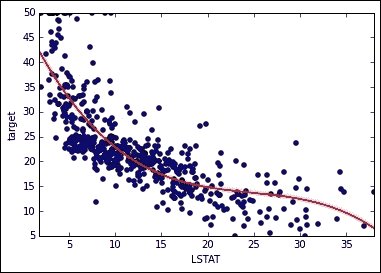

# 第三章：实际操作中的多元回归

在上一章中，我们介绍了线性回归作为基于统计学的机器学习监督方法。这种方法通过预测因子的组合来预测数值，这些预测因子可以是连续的数值或二元变量，假设我们手头的数据显示与目标变量之间存在某种关系（一种线性关系，可以通过相关性来衡量）。为了顺利引入许多概念并轻松解释该方法的工作原理，我们将示例模型限制在只有一个预测变量，将建模响应的所有负担都留给了它。

然而，在实际应用中，可能存在一些非常重要的原因决定着你想要建模的事件，但确实很少有一个变量能够单独登台并构建一个有效的预测模型。世界是复杂的（并且确实在原因和效果中相互关联），通常不考虑各种原因、影响因素和线索，很难轻易解释。通常需要更多的变量协同工作，才能从预测中获得更好和可靠的结果。

这种直觉决定性地影响了我们模型的复杂性，从这一点起，我们的模型将不再容易在二维图上表示。给定多个预测因子，每个预测因子都将构成其自身的维度，我们必须考虑我们的预测因子不仅与响应相关，而且彼此之间（有时非常严格）相关，这是数据的一个特征，称为**多重共线性**。

在开始之前，我们想就我们将要处理的主题选择说几句话。尽管在统计文献中有很多关于回归假设和诊断的出版物和书籍，但你在这里几乎找不到任何东西，因为我们将省略这些主题。我们将限制自己讨论可能影响回归模型结果的问题和方面，基于实际的数据科学方法，而不是纯粹统计的方法。

在这样的前提下，在本章中，我们将要：

+   将单变量回归的程序扩展到多元回归，同时关注可能的问题来源，如多重共线性

+   理解你线性模型方程中每个术语的重要性

+   让你的变量协同工作，通过变量间的交互作用提高你的预测能力

+   利用多项式展开来提高你的线性模型与非线性函数的拟合度

# 使用多个特征

为了回顾上一章中看到的工具，我们重新加载所有包和波士顿数据集：

```py
In: import numpy as np
 import pandas as pd
 import matplotlib.pyplot as plt
 import matplotlib as mpl
 from sklearn.datasets import load_boston
 from sklearn import linear_model

```

如果你正在 IPython 笔记本中编写代码（我们强烈建议这样做），以下魔法命令将允许你直接在界面上可视化图表：

```py
In: %matplotlib inline

```

我们仍在使用波士顿数据集，这是一个试图解释 70 年代波士顿不同房价的数据集，给定一系列在人口普查区层面的汇总统计数据：

```py
In: boston = load_boston()
 dataset = pd.DataFrame(boston.data, columns=boston.feature_names)
 dataset['target'] = boston.target

```

我们将始终通过保留一系列信息变量来工作，包括观测数量、变量名称、输入数据矩阵和手头的响应向量：

```py
In: observations = len(dataset)
 variables = dataset.columns[:-1]
 X = dataset.ix[:,:-1]
 y = dataset['target'].values

```

## 使用 Statsmodels 构建模型

作为将 Statsmodels 中之前所做的分析扩展到更多预测变量的第一步，让我们重新加载包中必要的模块（一个用于矩阵，另一个用于公式）：

```py
In: import statsmodels.api as sm
 import statsmodels.formula.api as smf

```

让我们也准备一个合适的输入矩阵，将其命名为`Xc`，在增加一个包含偏置向量的额外列之后（这是一个具有单位值的常量变量）：

```py
In: Xc = sm.add_constant(X)
 linear_regression = sm.OLS(y,Xc)
 fitted_model = linear_regression.fit()

```

在拟合了前面的指定模型后，让我们立即请求一个摘要：

```py
In: fitted_model.summary()
Out:

```


基本上，如前一章所述的各种统计度量陈述仍然有效。我们只是用几句话来强调一些我们之前无法提及的额外功能，因为它们与多个预测变量的存在有关。

首先，现在需要注意调整后的 R 平方。当与多个变量一起工作时，标准 R 平方会因为模型中插入的许多系数而膨胀。如果你使用太多的预测变量，其度量将明显偏离普通 R 平方。调整后的 R 平方考虑了模型的复杂性，并报告了一个更加现实的 R 平方度量。

### 小贴士

只需在普通 R 平方和调整后的 R 平方度量之间做一个比率。检查它们的差异是否超过 20%。如果超过，这意味着我们在模型规范中引入了一些冗余变量。自然地，比率差异越大，问题越严重。

在我们的例子中并非如此，因为差异相当小，大约在 0.741 和 0.734 之间，转换成比率得出*0.741/0.734 = 1.01*，即只是标准 R 平方的 1%以上。

然后，一次处理这么多变量时，也应检查系数的重要警告。涉及的风险是系数获取了嘈杂且无价值的信息。通常这样的系数不会远离零，并且会因为它们的大标准误差而明显。统计 t 检验是发现它们的正确工具。

### 小贴士

注意，具有低 p 值的变量是模型中移除的好候选，因为可能几乎没有证据表明它们的估计系数与零不同。

在我们的例子中，由于大部分不显著（p 值主要大于 0.05），`AGE`和`INDUS`变量在模型中由系数表示，其有用性可能受到严重质疑。

最后，条件数测试（`Cond. No.`）是另一个之前提到的统计量，现在在预测因子系统下获得了新的重要性。当尝试基于矩阵求逆进行优化时，它表示数值不稳定的结果。这种不稳定性的原因是多重共线性，我们将在接下来的段落中对其进行扩展。

### **提示**

当条件数超过 30 的分数时，有一个明确的信号表明不稳定的结果正在使结果变得不那么可靠。预测可能会受到错误的影响，当重新运行相同的回归分析时，系数可能会发生剧烈变化，无论是使用子集还是不同的观察数据集。

在我们的情况下，条件数远远超过 30，这是一个严重的警告信号。

## 使用公式作为替代

要使用`statsmodels.formula.api`获得相同的结果，从而解释一个由 Patsy 包（[`patsy.readthedocs.org/en/latest/`](http://patsy.readthedocs.org/en/latest/)）解释的公式，我们使用：

```py
linear_regression = smf.ols(formula = 'target ~ CRIM + ZN +INDUS + CHAS + NOX + RM + AGE + DIS + RAD + TAX + PTRATIO + B + LSTAT', data=dataset)
fitted_model = linear_regression.fit()

```

在这种情况下，你必须通过在公式的右侧命名它们来明确所有变量以进入模型构建。在拟合模型后，你可以使用之前看到的 Statsmodels 方法来报告系数和结果。

## **相关矩阵**

当尝试使用单个预测因子来建模响应时，我们使用了皮尔逊相关（皮尔逊是其发明者的名字）来估计预测因子和目标之间的线性关联系数。现在分析中变量更多，我们仍然非常感兴趣的是每个预测因子如何与响应相关；然而，我们必须区分预测因子的方差和目标方差之间的关联是由于独特方差还是相互方差。

由于独特方差引起的关联测量被称为**偏相关**，它表达了由于变量中独特存在的信息所能推测出的响应。它代表了变量在预测响应中的独特贡献，其作为直接原因对目标的影响（如果你可以将其视为原因的话，因为，如所见，相关性并不等同于因果关系）。

相互方差则是同时存在于变量和手头数据集中其他变量中的信息量。相互方差可能有多种原因；可能是一个变量引起或只是干扰了另一个（正如我们在上一章的*相关性不等于因果关系*部分所描述的）。相互方差，也称为**共线性**（两个变量之间）或**多重共线性**（三个或更多变量之间），具有重要作用，对经典统计方法来说是个令人担忧的问题，而对数据科学方法来说则不那么令人畏惧。

对于统计方法，必须说，高度或几乎完美的多重共线性不仅经常使系数估计变得不可能（矩阵求逆不起作用），而且，即使可行，它也会受到系数估计不准确的影响，导致系数的标准误差很大。然而，预测不会受到影响，这使我们转向数据科学观点。

实际上，存在多重共线性变量会使选择分析中正确的变量变得困难（由于方差是共享的，很难确定哪个变量是其因果来源），导致次优解，这些解只能通过增加分析中涉及的观测数量来解决。

要确定影响彼此的预测变量的方式和数量，合适的工具是相关矩阵，尽管当特征数量较多时阅读起来有些困难，但它仍然是确定共享方差存在最直接的方式：

```py
X = dataset.ix[:,:-1]
correlation_matrix = X.corr()
print (correlation_matrix)

```

这将给出以下输出：


初看之下，一些高相关性似乎出现在`TAX`、`NOX`、`INDUS`和`DIS`之间的绝对值 0.70 的顺序（在矩阵中用手标出）。这是可以解释的，因为`DIS`是就业中心的距离，`NOX`是污染指标，`INDUS`是该地区非住宅或商业建筑的比例，而`TAX`是财产税率。这些变量的正确组合可以很好地暗示生产区域。

一种更快但数值表示较少的方法是构建相关性的热图：

```py
In: 
def visualize_correlation_matrix(data, hurdle = 0.0):
 R = np.corrcoef(data, rowvar=0)
 R[np.where(np.abs(R)<hurdle)] = 0.0
 heatmap = plt.pcolor(R, cmap=mpl.cm.coolwarm, alpha=0.8)
 heatmap.axes.set_frame_on(False)
 heatmap.axes.set_yticks(np.arange(R.shape[0]) + 0.5, minor=False)
 heatmap.axes.set_xticks(np.arange(R.shape[1]) + 0.5, minor=False)
 heatmap.axes.set_xticklabels(variables, minor=False)
 plt.xticks(rotation=90)
 heatmap.axes.set_yticklabels(variables, minor=False)
 plt.tick_params(axis='both', which='both', bottom='off', \top='off', left = 'off', right = 'off')
 plt.colorbar()
 plt.show()

visualize_correlation_matrix(X, hurdle=0.5)

```

这将给出以下输出：


当相关系数达到 0.5（这相当于 25%的共享方差）时，热图立即揭示**PTRATIO**和**B**与其他预测变量之间关系不大。作为变量意义的提醒，**B**是一个量化该地区有色人种比例的指标，**PTRATIO**是该地区学校的师生比例。地图提供的另一个直觉是，一组变量，即**TAX**、**INDUS**、**NOX**和**RAD**，被证实存在强烈的线性关联。

一种更自动化的方式来检测此类关联（并解决矩阵求逆中的数值问题）是使用特征向量。用通俗易懂的话来说，特征向量是一种非常聪明的重新组合变量之间方差的方法，创建新的特征，累积所有共享的方差。这种重新组合可以通过使用 NumPy 的`linalg.eig`函数实现，从而得到特征值向量（代表每个新变量的重新组合方差量）和特征向量（一个矩阵，告诉我们新变量与旧变量之间的关系）：

```py
In: corr = np.corrcoef(X, rowvar=0)
 eigenvalues, eigenvectors = np.linalg.eig(corr)

```

在提取特征值后，我们按降序打印它们，并寻找任何值接近零或与其他值相比较小的元素。接近零的值可能代表正常方程和其他基于矩阵求逆的优化方法的一个真正问题。较小的值代表一个高但非关键的多重共线性来源。如果你发现任何这些低值，请记住它们在列表中的索引（Python 索引从零开始）。

```py
In: print (eigenvalues)
Out: [ 6.12265476  1.43206335  1.24116299  0.85779892  0.83456618  0.65965056  0.53901749  0.39654415  0.06351553  0.27743495  0.16916744  0.18616388  0.22025981]

```

通过它们在特征值列表中的索引位置，你可以从特征向量中召回它们的特定向量，该向量包含所有变量载荷——即与原始变量的关联程度。在我们的例子中，我们研究了索引为`8`的特征向量。在特征向量内部，我们注意到索引位置`2`、`8`和`9`的值，这些值在绝对值方面确实非常突出：

```py
In: print (eigenvectors[:,8])
Out: [-0.04552843  0.08089873  0.25126664 -0.03590431 -0.04389033 -0.04580522  0.03870705  0.01828389  0.63337285 -0.72024335 -0.02350903  0.00485021 -0.02477196]

```

现在，我们打印变量名称，以了解哪些变量通过它们的值对构建特征向量做出了如此大的贡献：

```py
In: print (variables[2], variables[8], variables[9])
Out: INDUS RAD TAX

```

找到多重共线性问题后，我们能为这样的变量采取什么补救措施？通常，移除其中一些是最佳解决方案，这将在探索第六章中变量选择如何工作的方式时自动执行，*实现泛化*。

# 重新审视梯度下降法

与上一章的内容相连续，我们继续用梯度下降法进行解释和实验。因为我们已经定义了数学公式及其用矩阵表示的 Python 代码翻译，所以我们现在不需要担心是否需要同时处理多个变量。使用矩阵表示法使我们能够轻松地将先前的介绍和例子扩展到多个预测变量，只需对算法进行一些小的修改。

特别要注意的是，通过在优化过程中引入更多需要估计的参数，我们实际上是在我们的拟合线上引入了更多维度（将其变成一个超平面，一个多维表面），这些维度具有一定的共性和差异需要考虑。

## 特征缩放

在估计系数时，由于特征之间的相似性可能导致估计值的方差增加，正如我们最初讨论的那样，处理不同的特征需要更多的注意。变量之间的多重共线性也有其他缺点，因为它也可能使矩阵求逆（正常方程系数估计的核心矩阵运算）变得非常困难，甚至不可能实现；这样的问题是由于算法的数学限制造成的。相反，梯度下降法根本不受相互相关性影响，即使在完全共线性的情况下，我们也能估计出可靠的系数。

无论如何，尽管它对影响其他方法的常见问题具有相当大的抵抗力，但其简单性也使其容易受到其他常见问题的攻击，例如每个特征中存在的不同尺度。事实上，你的数据中的一些特征可能表示的是以单位为单位的测量值，一些是十进制，还有一些是千位数，这取决于每个特征代表现实世界的哪个方面。在我们的房地产例子中，一个特征可能是房间数量，另一个可能是空气中某些污染物的百分比，最后是邻居中房屋的平均价值。当特征具有不同的尺度时，尽管算法将分别处理每个特征，但优化将由尺度更大的变量主导。在一个不同维度的空间中工作将需要更多的迭代才能收敛到解决方案（有时甚至可能根本无法收敛）。

解决方法非常简单；只需将所有特征置于相同的尺度上即可。这种操作称为**特征缩放**。特征缩放可以通过标准化或归一化实现。归一化将所有值缩放到零和一之间的区间（通常如此，但也可能使用不同的范围），而标准化则是通过减去均值并除以标准差来获得单位方差。在我们的例子中，标准化更可取，因为它可以轻松地将获得的标准化系数重新调整到原始尺度，并且通过将所有特征中心化到零均值，它使得错误表面对于许多机器学习算法来说更容易处理，比仅仅缩放变量的最大值和最小值要有效得多。

在应用特征缩放时，一个重要的提醒是，改变特征的范围意味着你将不得不使用缩放后的特征来进行预测，除非你能够重新计算系数，就像变量从未被缩放一样。

让我们尝试这个算法，首先使用基于 Scikit-learn `preprocessing`模块的标准规范化：

```py
In: from sklearn.preprocessing import StandardScaler
 observations = len(dataset)
 variables = dataset.columns
 standardization = StandardScaler()
 Xst = standardization.fit_transform(X)
 original_means = standardization.mean_
 originanal_stds = standardization.std_
 Xst = np.column_stack((Xst,np.ones(observations)))
 y  = dataset['target'].values

```

在前面的代码中，我们只是使用了 Scikit-learn 的`StandardScaler`类来标准化变量。这个类可以拟合一个数据矩阵，记录其列均值和标准差，并对自身以及任何其他类似矩阵进行转换，标准化列数据。使用这种方法，在拟合后，我们保留均值和标准差，因为它们将在我们稍后需要使用原始尺度重新计算系数时派上用场：

```py
In: import random

 def random_w( p ):
 return np.array([np.random.normal() for j in range(p)])
 def hypothesis(X,w):
 return np.dot(X,w)

 def loss(X,w,y):
 return hypothesis(X,w) - y

 def squared_loss(X,w,y):
 return loss(X,w,y)**2

 def gradient(X,w,y):
 gradients = list()
 n = float(len( y ))
 for j in range(len(w)):
 gradients.append(np.sum(loss(X,w,y) * X[:,j]) / n)
 return gradients

 def update(X,w,y, alpha=0.01):
 return [t - alpha*g for t, g in zip(w, gradient(X,w,y))]

 def optimize(X,y, alpha=0.01, eta = 10**-12, iterations = 1000):
 w = random_w(X.shape[1])
 path = list()
 for k in range(iterations):
 SSL = np.sum(squared_loss(X,w,y))
 new_w = update(X,w,y, alpha=alpha)
 new_SSL = np.sum(squared_loss(X,new_w,y))
 w = new_w
 if k>=5 and (new_SSL - SSL <= eta and \new_SSL - SSL >= -eta):
 path.append(new_SSL)
 return w, path
 if k % (iterations / 20) == 0:
 path.append(new_SSL)
 return w, path

 alpha = 0.02
 w, path = optimize(Xst, y, alpha, eta = 10**-12, \iterations = 20000)
 print ("These are our final standardized coefficients: " + ', \'.join(map(lambda x: "%0.4f" % x, w))) 

Out: These are our final standardized coefficients: -0.9204, 1.0810, 0.1430, 0.6822, -2.0601, 2.6706, 0.0211, -3.1044, 2.6588, -2.0759, -2.0622, 0.8566, -3.7487, 22.5328

```

我们正在使用的代码与上一章中使用的代码没有太大区别，除了它的输入现在由多个标准化变量组成。在这种情况下，算法在更少的迭代次数中达到收敛，并且使用了比之前更小的 alpha 值，因为在我们之前的例子中，我们的单个变量实际上是未标准化的。观察输出，我们现在需要一种方法来重新缩放系数以适应变量的特征，我们就能以非标准化的形式报告梯度下降的解。

另一点需要提及的是我们选择 alpha 的方法。经过一些测试，我们选择了`0.02`这个值，因为它在这个非常具体的问题上表现良好。Alpha 是学习率，在优化过程中它可以固定或可变，根据线搜索方法，通过修改其值以尽可能最小化优化过程中的每个单独步骤的成本函数。在我们的例子中，我们选择了固定的学习率，并且我们必须通过尝试几个优化值来确定哪个在更少的迭代次数中最小化了成本。

## 非标准化系数

给定一个线性回归的标准化系数向量及其偏差，我们可以回忆线性回归的公式，它是：


之前的公式，使用变量的均值和标准差转换预测变量，实际上（经过一些计算）等同于以下表达式：


在我们的公式中，代表变量的原始均值，而*δ*代表原始方差。

通过比较两个公式（第一个括号和第二个求和项）的不同部分，我们可以计算出将标准化系数转换为非标准化系数时的偏差和系数等价值。不重复所有数学公式，我们可以快速将它们实现为 Python 代码，并立即提供一个应用示例，展示这些计算如何转换梯度下降系数：

```py
In: unstandardized_betas = w[:-1] / originanal_stds
 unstandardized_bias  = w[-1]-np.sum((original_means /originanal_stds) * w[:-1])
 print ('%8s: %8.4f' % ('bias', unstandardized_bias))
 for beta,varname in zip(unstandardized_betas, variables):
 print ('%8s: %8.4f' % (varname, beta))

Out:

```


作为前一个代码片段的输出，你将得到一个与我们的先前估计相同的系数列表，无论是使用 Scikit-learn 还是 Statsmodels。

# 估计特征重要性

在确认了我们构建的线性模型的系数值，并探索了理解模型是否正确工作所需的基本统计信息之后，我们可以开始审计我们的工作，首先了解预测是如何构成的。我们可以通过考虑每个变量在构成预测值中的作用来获得这一点。对系数进行的第一次检查无疑是检查它们所表达的方向性，这仅仅由它们的符号决定。基于我们对主题的专长（因此，建议我们对正在工作的领域有所了解），我们可以检查所有系数是否都符合我们对方向性的预期。一些特征可能以我们预期的方式降低响应，从而正确地确认它们具有负号系数，而其他特征可能增加响应，因此正系数应该是正确的。当系数不符合我们的预期时，我们就有**反转**。反转并不罕见，实际上它们可以揭示事物以与我们预期不同的方式运作。然而，如果我们的预测变量之间存在大量多重共线性，反转可能只是由于估计的不确定性较高：一些估计可能如此不确定，以至于优化过程分配给它们错误的符号。因此，当线性回归不符合我们的预期时，最好不要急于得出任何结论；相反，仔细检查所有指向多重共线性的统计指标。

对变量对模型的影响进行第二次检查——也就是说，预测结果中有多少是由特征的变化所主导的。通常情况下，如果影响较小，由变量（例如，可能来自不可靠的来源，或者非常嘈杂——也就是说，测量不准确）引起的变化和反转以及其他困难对预测的破坏性较小，甚至可以忽略不计。

引入影响的概念也提出了使我们的模型在模型系数数量方面经济化的可能性。到目前为止，我们只是专注于这样一个观点，即尽可能好地拟合数据是可取的，我们没有检查我们的预测公式是否很好地推广到新数据。开始对预测变量进行排序可以帮助我们构建新的更简单的模型（只需选择模型中最重要的特征）并且简单的模型在生产阶段更不容易出错。

事实上，如果我们的目标不仅仅是用公式最大限度地拟合我们的现有数据，而且还要很好地拟合未来的数据，那么有必要应用奥卡姆剃刀的原则。这表明，在给出更多正确答案的情况下，简单的模型总是比更复杂的模型更可取。核心思想不是使解释（即线性模型）比应有的更复杂，因为复杂性可能隐藏过拟合。

## 检查标准化系数

将我们对线性模型的解释从单个变量扩展到大量变量，我们仍然可以将每个单个系数视为每个预测变量对响应变量单位变化的诱导（保持其他预测变量不变）。

直观上看，较大的系数似乎对线性组合的结果影响更大；然而，正如我们在回顾梯度下降时注意到的，不同的变量可能具有不同的尺度，它们的系数可能包含这一点。系数较小或较大可能只是因为变量相对于分析中涉及的其他特征的相对尺度。

通过标准化变量，我们将它们置于一个相似的尺度上，其中单位是变量的标准差。从高值到低值（范围较大）的变量往往具有更大的标准差，你应该预期它们会被缩小。通过这样做，大多数呈正态分布的变量应该会在范围*-3 < x < +3*内缩小，从而允许比较它们对预测的贡献。高度偏斜的分布不会在范围*-3 <x <+3*内进行标准化。这种转换无论如何都是有益的，因为它们的范围将被大大缩小，之后甚至可以比较不同的分布，因为那时它们都将代表相同的单位度量——即单位方差。标准化后，较大的系数可以解释为对建立结果（加权求和，因此结果将更接近较大的权重）的主要贡献。因此，我们可以自信地对我们变量进行排序，并找出那些贡献较小的变量。

让我们用一个例子来继续，这次我们将使用波士顿数据集。这次我们将使用 Scikit-learn 的`LinearRegression`方法，因为我们不需要对其统计属性进行线性模型，而只需要一个使用快速且可扩展算法的工作模型：

```py
In: linear_regression = linear_model.LinearRegression(normalize=False, fit_intercept=True)

```

在这样的初始化中，除了`fit_intercept`参数明确指出将偏差插入模型设计之外，`normalize`选项表示我们是否打算将所有变量重新缩放到零和一之间。这种转换与统计标准化不同，我们暂时将其设置为`False`状态以省略它：

```py
In: from sklearn.preprocessing import StandardScaler
 from sklearn.pipeline import make_pipeline
 standardization = StandardScaler()
 Stand_coef_linear_reg = make_pipeline(standardization,\linear_regression)

```

除了之前看到的`StandardScaler`之外，我们还从 Scikit-learn 导入方便的`make_pipeline`包装器，它允许我们在将数据馈送到线性回归分析之前自动执行一系列操作。现在，`Stand_coef_linear_reg`管道将在回归之前对数据进行统计标准化，从而输出标准化系数：

```py
In: linear_regression.fit(X,y)
for coef, var in sorted(zip(map(abs,linear_regression.coef_), \
 dataset.columns[:-1]), reverse=True):
 print ("%6.3f %s" % (coef,var))

Out: 

```


作为第一步，我们输出未标准化数据上的回归系数。如前所述，输出似乎主要由 NOX 变量的巨大系数主导，其绝对值约为 17.8，而忽略了 3.8 和更小的较小系数。然而，我们可能会质疑在标准化变量后是否仍然如此：

```py
In: Stand_coef_linear_reg.fit(X,y)
for coef, var in \
sorted(zip(map(abs,Stand_coef_linear_reg.steps[1][1].coef_), \
dataset.columns[:-1]), reverse=True):
 print ("%6.3f %s" % (coef,var))

Out: 

```


现在所有预测变量都在相似尺度上，我们可以轻松地提供每个系数的更现实解释。显然，涉及变量`LSTAT`、`DIS`、`RM`、`RAD`和`TAX`的单位变化似乎有更大的影响。`LSTAT`是低地位人口的比例，这一方面解释了其相关性。

使用标准化尺度无疑指出了最重要的变量，但它仍然不是每个变量预测能力的完整概述，因为：

+   标准化系数代表模型预测效果的好坏，因为大的系数对结果响应有重大影响：尽管拥有大的系数确实是一个变量重要性的提示，但它只告诉我们变量在减少估计误差和使我们的预测更准确中所起的部分作用。

+   标准化系数可以排序，但它们的单位，尽管在尺度上相似，但某种程度上是抽象的（每个变量的标准差）并且相对于手头的数据（因此我们不应该比较不同数据集的标准化系数，因为它们的标准差可能不同）

一种解决方案可能是将基于标准化系数的重要性估计整合，而不是使用与误差度量相关的某些度量。

## 通过 R-squared 比较模型

从一般的角度来看，我们可以通过比较模型在简单均值方面的表现来评估一个模型，这就是确定系数，R-squared。

R-squared 可以估计模型的好坏；因此，通过比较我们的模型与变量已被移除的替代模型的 R-squared，我们可以了解每个移除变量的预测能力。我们只需计算初始模型与没有该变量的模型的确定系数之间的差异。如果差异很大，该变量在确定更好的 R-squared 和更好的模型中起着非常重要的作用。

在我们的案例中，我们首先需要记录当我们用所有变量构建模型时的 R-squared 值。我们可以将这样的值命名为我们的比较基准：

```py
In: from sklearn.metrics import r2_score
 linear_regression = linear_model.LinearRegression(normalize=False,\fit_intercept=True)
def r2_est(X,y):
 return r2_score(y,linear_regression.fit(X,y).predict(X))

print ('Baseline R2: %0.3f' %  r2_est(X,y))

Out:Baseline R2: 0.741

```

之后，我们只需从预测变量集中一次移除一个变量，重新估计回归模型并记录其确定系数，然后从完整回归模型得到的基准值中减去：

```py
In: r2_impact = list()
 for j in range(X.shape[1]):
 selection = [i for i in range(X.shape[1]) if i!=j]
 r2_impact.append(((r2_est(X,y) - \r2_est(X.values [:,selection],y)) ,dataset.columns[j]))
 for imp, varname in sorted(r2_impact, reverse=True):
 print ('%6.3f %s' %  (imp, varname))

Out: 

```


在我们得到所有差异之后，每个差异代表每个变量对 R 平方的贡献，我们只需对它们进行排序，然后我们就会对哪些变量在减少线性模型误差方面贡献更多有一个概念；这与知道哪个变量对响应值贡献最大是不同的观点。这种贡献被称为部分 R 平方。

除了建议我们使用这两种度量（标准化系数和部分 R 平方）来区分相关变量和不相关变量之外，通过使用部分 R 平方，你实际上可以直接比较变量的重要性，因为使用比率在这里是有意义的（因此，你可以知道一个变量的重要性是另一个变量的两倍，因为它减少了两倍多的误差）。

另一个值得注意的点是，部分 R 平方并不是初始 R 平方测量的真正分解。实际上，只有当预测变量通过求和所有部分得分相互不相关时，你才能得到完整模型的精确确定系数。这是由于变量之间的共线性造成的。因此，当你从模型中移除一个变量时，你肯定不会移除其所有信息方差，因为包含与移除变量相似信息的相关变量仍然保留在模型中。可能发生的情况是，如果你有两个高度相关的变量，依次移除它们并不会显著改变 R 平方，因为当一个变量被移除时，另一个变量将提供缺失的信息（因此，与标准化系数的双检查并不是多余的）。

有更多复杂的方法可以用来估计变量重要性，但这两种方法应该能为你提供足够的洞察力。了解哪些变量对结果影响更大，可以为你提供以下手段：

1.  尽量以合理且易于理解的方式向管理层解释结果。

1.  首先根据项目成功的关键性，优先处理数据清洗、准备和转换工作，集中精力关注与项目成功最相关的特征。

1.  在构建和使用回归模型时，尽量节约资源，特别是内存，因为使用更少的数据可以减少资源消耗。

如果你希望使用重要性来排除不相关变量，并使用我们提出的一种度量，最安全的方法是在每次决定从集合中排除一个变量时重新计算排名。否则，使用单一的排名可能会隐藏高度相关变量的真正重要性（这对于两种方法都是真的，尽管标准化系数稍微更有揭示性）。

这种方法当然很耗时，但当你注意到你的模型虽然在你当前的数据上呈现良好的拟合，但不能很好地推广到新的观测值时，这是必要的。

我们将在第六章“实现泛化”中更深入地讨论这种情形，届时我们将说明减少预测变量集的最佳方法，保持（简化解决方案）甚至提高预测性能（更有效地泛化）。

# 交互模型

解释了如何构建多变量回归模型，并触及了其利用和解释的主题后，我们从这一段开始探讨如何改进它。作为第一步，我们将从当前数据对它的拟合工作开始。在接下来的章节中，我们将专注于模型选择和验证，我们将集中讨论如何使其真正具有普遍性——也就是说，能够正确预测新的、之前未见过的数据。

如我们之前推理的那样，线性回归中的 beta 系数代表了预测变量单位变化与响应变量变化之间的联系。此类模型的核心假设是每个预测变量与目标变量之间存在着恒定且单向的关系。这是线性关系假设，具有线的特征，其中方向和波动由角度系数（因此得名线性回归，暗示着回归操作，追溯到从某些数据证据中得出的线性形式）。尽管这是一个很好的近似，但线性关系通常是简化的，在真实数据中往往并不成立。事实上，大多数关系都是非线性的，显示出弯曲、曲线以及增加和减少中的不同波动。

好消息是，我们不必局限于最初提供的特征，但我们可以修改它们，以便*拉直*它们与目标变量之间的关系。事实上，预测变量与响应变量之间的相似性越大，拟合度越好，训练集中的预测误差就越少。

因此，我们可以这样说：

+   我们可以通过各种方式变换预测变量来改进我们的线性回归。

+   我们可以使用部分 R 平方来衡量这种改进，因为每一次变换都应该影响残差误差的数量，并最终影响确定系数。

## 发现交互作用

非线性的第一个来源是由于预测变量之间可能存在的交互作用。当其中一个预测变量对响应变量的影响随着另一个预测变量的值而变化时，这两个预测变量就发生了交互。

在数学公式中，交互项（交互变量）必须乘以自身，以便我们的线性模型能够捕捉到它们关系的补充信息，正如以下具有两个交互预测变量的模型示例所示：


在回归模型中，一个易于记忆的交互示例是发动机噪音在评估汽车中的作用。如果你要建模汽车型号的偏好，你会立即注意到发动机噪音可能会增加或减少消费者对汽车的偏好，这取决于汽车的价格（或其类别，这是货币价值的代理）。事实上，如果汽车价格便宜，安静显然是必不可少的，但如果汽车价格昂贵（如法拉利或其他跑车）噪音则是一个突出的好处（显然当你坐在车里时，你希望每个人都注意到你开的酷车）。

处理交互可能听起来有点棘手，但实际上并不难；毕竟，你只是在基于另一个变量转换线性回归中的变量角色。找到交互项可以通过两种不同的方式实现，第一种是领域知识——也就是说，直接了解你正在建模的问题，并在其中融入你的专业知识。当你没有这样的专业知识时，如果使用如 R-squared 这样的揭示性度量进行良好测试，自动搜索所有可能的组合就足够了。

最好的方法是通过一个 Python 示例来展示自动搜索方法，使用 Scikit-learn 中的`PolynomialFeatures`函数，这个函数允许交互和多项式展开（我们将在下一段中讨论它们）：

```py
In: from sklearn.preprocessing import PolynomialFeatures
 from sklearn.metrics import r2_score
 linear_regression = linear_model.LinearRegression(normalize=False,\fit_intercept=True)
 create_interactions = PolynomialFeatures(degree=2, \interaction_only=True, include_bias=False)

```

通过`degree`参数，我们定义了要放入交互中的变量数量，可能有三变量甚至更多变量相互交互。在统计学中，交互被称为双向效应、三向效应等，这取决于涉及的变量数量（而原始变量则被称为主要效应）。

```py
In: def r2_est(X,y):
 return r2_score(y,linear_regression.fit(X,y).predict(X))
baseline = r2_est(X,y)
print ('Baseline R2: %0.3f' % baseline)

Out: Baseline R2: 0.741

in: Xi = create_interactions.fit_transform(X)
 main_effects = create_interactions.n_input_features_

```

在回忆起基线 R-squared 值之后，代码使用`fit_transform`方法创建一个新的输入数据矩阵，通过所有变量的交互效应丰富了原始数据。此时，我们创建了一系列新的线性回归模型，每个模型包含所有主要效应和一个单独的交互效应。我们测量改进，计算与基线的差异，然后仅报告超过一定阈值的交互效应。我们可以决定一个略高于零的阈值，或者基于统计测试确定的阈值。在我们的例子中，我们决定了一个任意阈值，目的是报告所有超过`0.01`的 R-squared 增量：

```py
In: for k,effect in \ enumerate(create_interactions.powers_[(main_effects):]):
 termA, termB = variables[effect==1]
 increment = r2_est(Xi[:,list(range(0,main_effects)) \+[main_effects+k]],y) - baseline
 if increment > 0.01:
 print ('Adding interaction %8s *%8s R2: %5.3f' %  \
 (termA, termB, increment))
Out: 

```


相关的交互效应显然是由变量`'RM'`（如之前所见，是最重要的变量之一）及其与另一个关键特征`LSTAT`的交互产生的。一个重要的启示是，我们将它添加到我们的原始数据矩阵中，作为两个变量之间的简单乘积：

```py
In: Xi = X
 Xi['interaction'] = X['RM']*X['LSTAT']
 print ('R2 of a model with RM*LSTAT interaction: %0.3f' % \r2_est(Xi,y))

Out: R2 of a model with RM*LSTAT interaction: 0.805

```

# 多项式回归

作为交互作用的扩展，多项式展开系统地提供了一种自动创建交互作用和原始变量的非线性幂变换的方法。幂变换是线在拟合响应时可以采取的弯曲。幂的次数越高，可用的弯曲就越多，从而更好地拟合曲线。

例如，如果你有一个简单线性回归的形式：


通过二次变换，称为**二次**，你将得到一个新的形式：


通过三次变换，称为**三次**，你的方程将变为：


如果你的回归是多元的，展开将创建额外的项（交互作用），从而增加由展开产生的新特征的数量。例如，由两个预测因子（*x[1]* 和 *x[2]*）组成的多元回归，使用二次变换展开，将变为：


在继续之前，我们必须注意展开过程的两点：

+   多项式展开会迅速增加预测因子的数量

+   高次多项式转化为预测因子的高次幂，这会对数值稳定性造成问题，因此需要合适的数值格式或标准化过大的数值

## 测试线性与三次变换

通过在之前提到的 `PolynomialFeatures` 函数中将 `interaction_only` 参数关闭，我们可以得到输入矩阵的完整多项式变换，而不仅仅是之前简单的交互作用：

```py
In: 
from sklearn.preprocessing import PolynomialFeatures
from sklearn.pipeline import make_pipeline
from sklearn.preprocessing import StandardScaler

linear_regression = linear_model.LinearRegression(normalize=False, \fit_intercept=True)
create_cubic = PolynomialFeatures(degree=3, interaction_only=False, \include_bias=False)
create_quadratic = PolynomialFeatures(degree=2, interaction_only=False, \
include_bias=False)

linear_predictor = make_pipeline(linear_regression)
quadratic_predictor = make_pipeline(create_quadratic, \
linear_regression)
cubic_predictor = make_pipeline(create_cubic, linear_regression)

```

通过将 `PolynomialFeatures` 和 `LinearRegression` 同时放入管道中，我们可以通过单个命令自动创建一个函数，展开数据并对其进行回归。作为一个实验，我们尝试单独对 `'LSTAT'` 变量进行建模，以获得最佳清晰度，记住我们本来可以一次性展开所有变量：

```py
predictor = 'LSTAT'
x = dataset['LSTAT'].values.reshape((observations,1))
xt = np.arange(0,50,0.1).reshape((50/0.1,1))
x_range = [dataset[predictor].min(),dataset[predictor].max()]
y_range = [dataset['target'].min(),dataset['target'].max()]

scatter = dataset.plot(kind='scatter', x=predictor, y='target', \xlim=x_range, ylim=y_range)
regr_line = scatter.plot(xt, linear_predictor.fit(x,y).predict(xt), \'-', color='red', linewidth=2)

```


我们第一次拟合是线性的（简单的线性回归），从散点图中我们可以注意到，这条线并没有很好地代表与 `'LSTAT'` 相关的点云；很可能是我们需要一个曲线。我们立即尝试三次变换：使用两个弯曲，我们应该能得到更好的拟合：

```py
scatter = dataset.plot(kind='scatter', x=predictor, y='target', \xlim=x_range, ylim=y_range)
regr_line = scatter.plot(xt, cubic_predictor.fit(x,y).predict(xt), \'-', color='red', linewidth=2)

```



我们的图形检查确认，现在我们对 `'LSTAT'` 和响应之间的关系有了更可信的表示。我们质疑是否不能通过使用更高次的变换做得更好。

## 寻求更高次解

为了测试更高次的多项式变换，我们准备了一个脚本，该脚本创建展开并报告其 R 平方度量。然后我们尝试绘制系列中最高次的函数，并查看它如何拟合数据点：

```py
In: for d in [1,2,3,5,15]:
 create_poly = PolynomialFeatures(degree=d,\interaction_only=False, include_bias=False)
 poly = make_pipeline(create_poly, StandardScaler(),\linear_regression)
 model = poly.fit(x,y)

print ("R2 degree - %2i polynomial :%0.3f" \%(d,r2_score(y,model.predict(x))))

Out: 

```


显然，线性模型和二次展开（二次多项式）之间的决定系数有很大的差异。这个指标从`0.544`跳到`0.641`，差异增加到达到五次方时为`0.682`。在更高的次数之前，增量并不那么令人惊讶，尽管它还在增长，当次数达到第十五时，达到`0.695`。作为后者在决定系数方面是最好的结果，查看数据云的图将揭示一个不太平滑的拟合，正如我们可以从较低次数的多项式展开中看到的那样：

```py
In: scatter = dataset.plot(kind='scatter', x=predictor,\y='target', xlim=x_range, ylim=y_range)
 regr_line = scatter.plot(xt, model.predict(xt), '-',\color='red', linewidth=2)

```


仔细观察得到的曲线，你一定会注意到，通过如此高的次数，曲线严格遵循点的分布，当预测值的范围边缘密度降低时，曲线变得不规则。

## 介绍欠拟合和过拟合

多项式回归为我们提供了一个开始讨论模型复杂性的合适机会。我们没有明确测试它，但你可能已经感觉到，通过增加多项式展开的次数，你将始终获得更好的拟合。我们更进一步说：你模型中的变量越多，越好，直到你将有如此多的 beta 系数，可能等于或几乎等于你的观察数量，以至于你的预测将是完美的。

由于过参数化（模型需要学习的参数过多）导致的性能下降是线性回归以及许多其他机器学习算法的问题。你添加的参数越多，拟合效果越好，因为模型将不再拦截你数据中的规则和规律，而是在这种丰富的尴尬中，开始用数据中所有不规则和错误的信息填充可用的许多系数。在这种情况下，模型不会学习一般规则，而只是以另一种形式记住数据集本身。

这被称为**过拟合**：对现有数据进行如此完美的拟合，以至于结果远非从数据形式中提取以进行预测；结果只是简单的记忆。另一方面，另一个问题是**欠拟合**——即当你使用太少参数进行预测时。最直接的例子是使用简单的线性回归拟合非线性关系；显然，它不会匹配曲线的弯曲，并且其中一些预测将是误导性的。

有适当的工具可以验证你是否欠拟合，或者更有可能的是过拟合，它们将在第六章 *实现泛化*（解释数据科学的章节）中进行讨论；同时，不要过度使用高次多项式进行拟合！

# 摘要

在本章中，我们继续介绍线性回归，将我们的例子从简单扩展到多元。我们回顾了 Statsmodels 线性函数（经典统计方法）和梯度下降（数据科学引擎）的先前输出。

我们通过移除选定的预测因子并从 R 平方测量的角度评估这种移动的影响，开始对模型进行实验。同时，我们还发现了预测因子之间的相互关系，以及如何通过截断交互作用和通过特征的多项式扩展来使每个预测因子与目标变量之间形成更线性的关系。

在下一章中，我们将再次前进，将回归模型扩展到分类任务，使其成为一个概率预测器。进入概率世界的概念跳跃将使我们能够完成线性模型可以成功应用的潜在问题范围。
