# 第五章。数据准备

在为理解回归和分类的两个基本线性模型打下坚实基础之后，我们将本章用于讨论为模型提供数据。在接下来的几页中，我们将描述通常可以如何以最佳方式准备数据，以及如何处理更具挑战性的情况，例如数据缺失或存在异常值。

现实世界的实验产生真实数据，与合成或模拟数据相比，真实数据通常变化很大。真实数据也相当混乱，并且经常以明显和某些初始时相当微妙的方式证明是错误的。作为数据从业者，你几乎永远不会找到已经以适合你分析目的的正确形式准备好的数据。

编写关于不良数据和其补救措施的汇编超出了本书的范围，但我们的目的是为你提供基础知识，帮助你管理大多数常见的数据问题，并正确地为你的算法提供数据。毕竟，众所周知的缩写词**垃圾输入，垃圾输出**（**GIGO**）是一个我们必须面对和接受的事实。

因此，在本章中，我们将发现各种主题、Python 类和函数，这些将允许你：

+   正确缩放数值特征，不仅更容易比较和解释系数，而且在处理异常或缺失值，或者处理非常稀疏的矩阵（在文本数据处理中非常常见）时也会更加容易

+   将定性特征转换为回归模型可以接受的数值，并正确地转换为预测

+   以最智能的方式转换数值特征，将数据中的非线性关系转换为线性关系

+   确定当重要数据缺失时应该做什么，以估计一个替代方案，甚至让回归自己管理最佳解决方案

+   修复数据中的任何异常或奇怪值，并确保你的回归模型始终正常工作

# 数值特征缩放

在第三章，*实际操作中的多元回归*，特征缩放部分，我们讨论了如何将原始变量转换为相似尺度，这有助于更好地解释结果回归系数。此外，当使用基于梯度的算法时，缩放是必不可少的，因为它有助于更快地收敛到解决方案。对于梯度下降，我们将介绍其他只能通过缩放特征才能工作的技术。然而，除了某些算法的技术要求之外，现在我们的目的是引起你注意特征缩放在处理有时可能缺失或错误的数据时的帮助。

缺失或错误的数据不仅可能在训练过程中发生，也可能在生产阶段发生。现在，如果遇到缺失值，您有两个设计选项来创建一个足够鲁棒以应对此类问题的模型：

+   主动处理缺失值（本章中有一段专门介绍这一点）。

+   被动地处理它并：

    +   您的系统抛出错误，一切都会崩溃（并且会一直处于崩溃状态，直到问题得到解决）。

    +   您的系统忽略缺失数据并计算非缺失值。

一定令人担忧的是，您的预测系统可能会陷入困境并停止，但忽略它并汇总现值可能会产生高度偏差的结果。如果您的回归方程被设计为使用所有变量，那么当某些数据缺失时，它将无法正常工作。无论如何，让我们再次回顾线性回归公式：

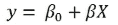

如您所猜想的，偏差系数实际上始终存在；无论您的预测变量情况如何，它都会出现。因此，即使在极端情况下，例如当所有 *X* 都缺失时，如果您标准化变量使它们具有零均值。

让我们看看实际操作，并了解如何正确缩放预测变量可以帮助修复缺失值，允许使用高级优化技术，如梯度下降、正则化和随机学习（关于后两种技术将在后续章节中详细介绍），以及轻松检测异常值。

首先，让我们上传用于分析的基本包和函数：

```py
In: import numpy as np
 import pandas as pd
 import matplotlib.pyplot as plt
 from sklearn.datasets import load_boston
 from sklearn import linear_model
 %matplotlib inline
 #To set float output to 5 decimals and to suppress printing of \small floating point values using scientific notation
 np.set_printoptions(precision=5, suppress=True)

```

请注意，波士顿数据集也被重新加载了。我们将 *y* 作为目标变量，将 *X* 作为预测变量的数组。

```py
In:	boston = load_boston()
 dataset = pd.DataFrame(boston.data, \columns=boston.feature_names)
 dataset['target'] = boston.target
 observations = len(dataset)
 variables = dataset.columns[:-1]
 X = dataset.ix[:,:-1]
 y = dataset['target'].values

```

由于我们还想对逻辑回归进行测试，我们现在将目标变量转换为二元响应，将所有高于 25 分值的分数设置为“1”级别。

```py
In: yq = np.array(y>25, dtype=int)

```

在这个操作之后，我们的定性响应变量被命名为 `yq`。

## 均值中心化

对于所有缩放操作，我们建议使用 Scikit-learn 包的 `preprocessing` 模块中的函数。特别是，我们将使用 `StandardScaler` 和 `MinMaxScaler`。像 Scikit-learn 中的所有类一样，它们都有 `fit` 方法，可以记录并存储允许正确缩放的参数。它们还提供了一个 `transform` 方法，可以立即应用于相同的数据（`fit_transform` 方法也可以做到这一点）或任何其他数据，例如用于验证、测试的数据，甚至以后的生产数据。

`StandardScaler` 类将通过移除均值来重新缩放你的变量，这一行为也称为中心化。实际上，在你的训练集中，重新缩放的变量将具有零均值，并且特征将被强制为单位方差。拟合后，该类将包含 `mean_` 和 `std_` 向量，使你能够访问使缩放成为可能的均值和标准差。因此，在随后的任何用于测试目的或生产中的预测的集合中，你将能够应用完全相同的转换，从而保持算法精确工作所需的数据一致性。

`MinMaxScaler` 类将根据你指定的范围重新缩放你的变量，设置新的最小值和最大值。拟合后，`min_` 和 `scale_` 将分别报告从原始变量中减去的最小值和用于将变量除以以获得预期最大值的缩放比例。

### 提示

如果你将这两个类别之一在训练后用于其他新的数据，新的变量可能会有不同的最大值和最小值，导致生成的转换变量超出范围（超过最大值或低于最小值，或具有异常值）。当这种情况发生时，重要的是要检查新数据是否有异常值，并质疑我们在定义转换和系数时是否使用了正确的训练数据。

现在，让我们上传这两个缩放类，并在对波士顿数据集拟合线性回归时获取系数和截距值的余数：

```py
In: from sklearn.preprocessing import StandardScaler
 from sklearn.preprocessing import MinMaxScaler
 linear_regression = linear_model.LinearRegression(normalize=False,\fit_intercept=True)
 linear_regression.fit(X,y)
 print ("coefficients: %s\nintercept: %0.3f" % \(linear_regression.coef_,linear_regression.intercept_))

Out:

```

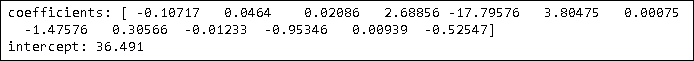

### 提示

如果你从你的 Jupyter Notebook 获得的结果是科学记数法，那么首先使用 `import numpy as np` 然后使用 `np.set_printoptions(precision=5, suppress=True)` 可能会有所帮助。

特别是，让我们注意到截距。根据线性回归公式，我们可以预期当所有预测变量为零时，这将是对应的回归输出。让我们也看看最小值，以检查它们是负数、零还是正数。

```py
In: dataset.min()

Out:

```

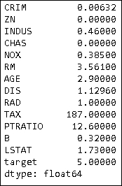

考虑到我们的变量范围，不可能出现所有预测变量都为零的情况，这意味着尽管截距仍然功能性和对模型正确工作至关重要，但它并不代表任何真正期望的值。

现在，作为一个初步的缩放操作，让我们仅仅将变量中心化，即移除均值，看看这个动作是否会在我们的线性回归中引起变化。

```py
In: centering = StandardScaler(with_mean=True, with_std=False)
 linear_regression.fit(centering.fit_transform(X),y)
 print ("coefficients: %s\nintercept: %s" % \(linear_regression.coef_,linear_regression.intercept_))

Out:

```

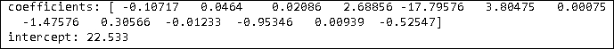

尽管系数保持不变，但现在截距为 **22.533**，这个值在我们的波士顿房价问题中具有特殊意义：

```py
In: print ('mean: %0.3f' % np.mean(y))

Out:mean: 22.533

```

将截距值设为目标值的平均值意味着，当一个或多个值缺失时，我们期望如果中心化了变量，它们将自动获得零值，并且我们的回归将自然地倾向于输出目标变量的平均值。

## 标准化

在这一点上，我们还可以尝试将所有内容缩放到单位方差并检查结果：

```py
In: standardization = StandardScaler(with_mean=True, with_std=True)
 linear_regression.fit(standardization.fit_transform(X),y)
 print ("coefficients: %s\nintercept: %0.3f" % \(linear_regression.coef_,linear_regression.intercept_))

Out:

```

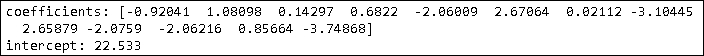

如预期的那样，现在系数不同了，每个系数现在代表在预测变量等效于标准差的变化后，目标变量的单位变化。然而，如果我们的预测变量分布不是正态分布（标准化意味着正态钟形分布），则这些尺度并不完全可比；尽管如此，我们现在可以比较每个预测变量的影响，并允许自动处理缺失值以及高级算法的正确运行。

## 归一化

归一化与标准化类似，通过作用于预测变量的范围进行缩放，但它具有不同的特性。实际上，在使用归一化时，零值是每个预测变量值域中的最小值。这意味着零不再代表平均值。此外，如果两端存在异常值（大多数值将挤压在 `[0,1]` 的某个区域，通常在值域的中心），则最大值和最小值之间的缩放可能会产生误导。

```py
In: scaling  = MinMaxScaler(feature_range=(0, 1))
 linear_regression.fit(scaling.fit_transform(X),y)
 print ("coefficients: %s\nintercept: %0.3f" % \(linear_regression.coef_,linear_regression.intercept_))

Out:

```

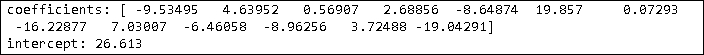

在 0 到 1 的范围内应用 `MinMaxScaler` 会极大地改变系数和截距，但在某些情况下这可能是可以接受的。事实上，当处理来自文本数据或日志的大数据时，我们有时会发现我们正在工作的矩阵并不是特别密集，零经常是遇到的最频繁的值。为了加快计算速度并允许巨大的矩阵保持在内存中，矩阵以稀疏格式存储。

稀疏矩阵并不占用它们大小所需的全部内存，它们只存储坐标和非零值。在这种情况下，标准化变量会将零值变为平均值，并且必须定义大量之前为零的单元格，导致矩阵占用更多的内存。在 0 到 1 之间进行缩放允许以可比较的顺序取值，并保留所有之前为零的条目，从而不修改内存中的矩阵维度。

## 逻辑回归案例

需要专门讨论逻辑回归。正如我们在上一章中所述，在逻辑回归中，我们建模响应概率的几率比。我们可以使用标准化系数作为处理缺失数据的技巧，就像在线性回归中看到的那样，但事情在尝试猜测线性回归分析中的目标数值时会有所不同。

让我们通过一个例子来探讨这个问题，以澄清情况。我们将使用波士顿数据集来演示逻辑回归案例，并将之前定义的 `yq` 向量用作响应变量。对于逻辑回归，这次我们不会使用 Scikit-learn 实现，而是使用 Statsmodels 包，这样我们可以轻松地展示模型中系数的一些见解：

```py
In: import statsmodels.api as sm
 Xq = sm.add_constant(standardization.fit_transform(X))
 logit = sm.Logit(yq, Xq)
 result = logit.fit()
 print (result.summary())

Out:

```

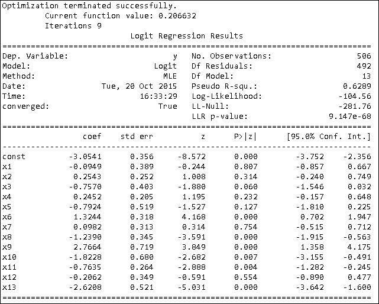

使用标准化的预测值，就像线性回归一样，我们可以用相同的尺度来解释系数，并将截距视为当所有预测值都取平均值时的响应。与线性回归相反，在逻辑回归中，预测值的一个单位变化会改变响应的优势比，其量级相当于系数本身的指数化：

```py
In: print ('odd ratios of coefficients: %s' % np.exp(result.params))

Out: odd ratios of coefficients: [  0.04717   0.90948   1.2896    0.46908   1.2779    0.45277   3.75996   1.10314   0.28966  15.9012    0.16158   0.46602   0.81363   0.07275]

```

我们回顾一下如何计算优势比：给定一个事件发生的概率 *p*，优势比是 *p* 与其补数到 1 的比率，优势比 = p / (1−p)。当优势比等于 1 时，我们的概率正好是 0.5。当概率高于 0.5 时，优势比高于 1；相反，当我们的概率小于 0.5 时，优势比低于 1。通过应用自然对数（正如逻辑回归所做的那样），值将分布在零值（50% 概率）周围。显然，处理概率更直观，因此，一个简单的转换，即 Sigmoid 转换，将系数转换为更可理解的概率：

```py
In: def sigmoid(p):
 return 1 / (1 + np.exp(-p))

 print ('intercept: %0.3f' % result.params[0])
 print ('probability of value above 25 when all predictors are \average: %0.3f' % 	sigmoid(result.params[0]))

Out: intercept: -3.054
 probability of value above 25 when all predictors
 are average: 0.045

```

使用 Sigmoid 函数将截距转换为概率，我们得到 `0.045`，这是当所有预测值都取平均值时，房屋价值超过 `25` 的概率。请注意，这样的概率与样本中的平均概率不同：

```py
In: print ('average likelihood of positive response: %0.3f' % 
 (sum(yq) /float(len(yq))))

Out: average likelihood of positive response: 0.245

```

实际上，这是在考虑任何可能的预测值时，房屋价值超过 `25` 的基线概率。我们从逻辑回归中提取的实际上是一个特定的概率，而不是一个普遍的概率。实际上，当你用只有一个截距（所谓的空模型）来建模逻辑回归，允许预测值自由变化时，你可以得到一个可比的似然性：

```py
In: C = np.ones(len(X))
 logit = sm.Logit(yq, C)
 result = logit.fit()
 print (result.summary())
 print ('\nprobability of value above 25 using just a constant: %0.3f' % 	sigmoid(result.params[0]))

Out:

```

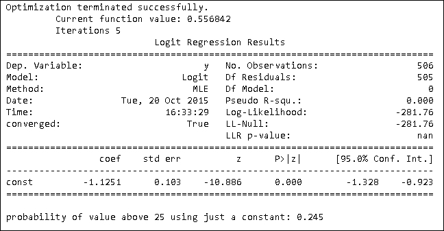

# 定性特征编码

除了本节迄今为止主要讨论的数值特征之外，你的大部分数据也将包含定性变量。数据库尤其倾向于记录人类可读和可理解的数据；因此，它们充满了定性数据，这些数据可以以文本或仅以单个标签的形式出现在数据字段中，解释信息，例如告诉你观察值的类别或其某些特征。

为了更好地理解定性变量，一个工作示例可以是天气数据集。这样的数据集描述了由于天气信息（如展望、温度、湿度和风速）而想要打网球的条件，这些信息都是可以通过数值测量来表示的。然而，你很容易在网上找到这样的数据，并且它们被记录在数据集中，这些数据集包含了它们的定性翻译，如“晴朗”或“阴天”，而不是数值卫星或气象站的测量。我们将处理这类数据，以展示即使这样，它仍然可以被转换成可以有效地包含到线性模型中的形式：

```py
In: outlook   = ['sunny', 'overcast', 'rainy']
 temperature = ['hot', 'mild', 'cool']
 humidity    = ['high', 'normal']
 windy       = ['TRUE', 'FALSE']

 weather_dataset = list()

 for o in outlook:
 for t in temperature:
 for h in humidity:
 for w in windy:
 weather_dataset.append([o,t,h,w])

 play = [0, 0, 1, 1, 1, 0, 1, 1, 0, 0, 0, 1, 1, 1, 1, 1, 1, 1, 1, 1, 0, 0, 1, 1, 0, 0, 0, 1, 0, 1, 0, 1, 0, 0, 0, 1]

```

线性回归器只有在被正确转换为数值后才能分析定性数据。一种常见的定性数据类型是名义变量，它们通过一组有限的文本标签来表示。例如，一个名义变量可以是产品的颜色或天气的展望（如我们的天气示例）。变量可以假设的文本值被称为级别；在我们的例子中，展望有三个级别：“晴朗”、“阴天”和“雨天”，所有这些都以字符串的形式表示。

如果我们认为这些中的任何一个都可能存在或不存在（每个标签排除另一个），我们可以轻松地将每个具有 n 个级别的名义变量转换成 n 个不同的变量，每个变量告诉我们某个特征是否存在。如果我们用 1 表示级别的存在，用 0 表示其不存在（类似于二进制编码，如计算机中的编码），我们将得到将定性信息转换为数值信息的工作转换（技术上它是布尔值，但为了实际目的，我们将其建模为 0-1 的数值整数）。这种转换后的变量在机器学习术语中被称为指标或二元变量，而在统计学中它们被描述为**二分法**（一个更技术性的术语）或虚拟变量。当级别存在时，它们在回归公式中作为截距的修饰符。

当变量的级别是有序的时候，还有另一种可能的转换。例如，它们可以是定性标签，如好、平均、可接受和差。在这种情况下，标签也可以转换为按照标签意义的顺序递增或递减的数字。因此，在我们的例子中，好可以是 3，平均 2，可接受 1，差 0。这种编码直接将定性变量转换为数值变量，但它只适用于可以排序的标签（即可以定义“大于”和“小于”关系的标签）。这种转换意味着，由于回归模型将为所有级别计算单个系数，因此从好到平均的产出差异与从可接受到差的产出差异相同。在现实中，这通常不成立，因为存在非线性。在这种情况下，二元编码仍然是最佳解决方案。

## 使用 Pandas 进行虚拟编码

将一组定性变量转换为二元变量的最快方式是使用 Pandas 函数 `get_dummies`：

```py
In: import pandas as pd
 df = pd.DataFrame(weather_dataset, columns=['outlook', \'temperature', 'humidity', 'windy'])

```

在将所有数据转换成 Pandas DataFrame 之后，调用单个变量和单个案例转换为二元变量的操作相当简单：

```py
In: print (pd.get_dummies(df.humidity).ix[:5,:])
Out:    high  normal
 0     1       0
 1     1       0
 2     0       1
 3     0       1
 4     1       0
 5     1       0

```

Pandas 可以轻松地将所有变量转换；你所需要做的只是指出你想要完全转换的 DataFrame 或指定要转换的变量：

```py
In: dummy_encoding = pd.get_dummies(df)

```

转换后，回归模型可以立即分析得到的新 DataFrame：

```py
In: import statsmodels.api as sm
 X = sm.add_constant(dummy_encoding)
 logit = sm.Logit(play, X)
 result = logit.fit()
 print (result.summary())

Out: 

```

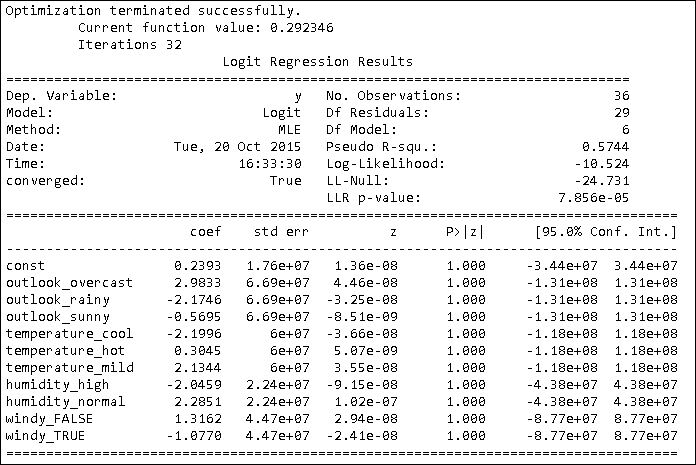

一些回归方法并不喜欢所有表示定性变量的二元变量（但我们的情况并非如此）。某些优化方法不喜欢完美的共线性，例如在完全二值化的情况下（实际上，如果你知道所有其他二分法，那么剩余的可以通过求和来完美猜测——当其他变量的和为零时，它具有值 1）。在这种情况下，你只需从每个二元变量集中删除一个你选择的级别。这样做，被省略的系数将包含在截距中，回归模型将像以前一样工作，尽管变量和系数有所不同：

```py
In: X.drop(['outlook_sunny', 'temperature_mild', 'humidity_normal', 'windy_FALSE'], inplace=True, axis=1)
 logit = sm.Logit(play, X)
 result = logit.fit()
 print (result.summary())

Out:

```

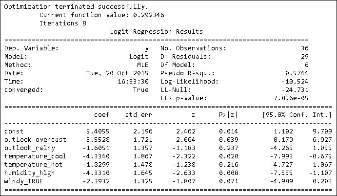

`get_dummies` 只有一个缺点：它直接构建二元变量，从你要转换的数据集中读取级别。因此，如果你首先从一个样本中构建一组二元变量，然后从另一个样本中构建另一组，由于样本中未出现稀有级别，可能会产生不同的转换数据集。

## DictVectorizer 和独热编码

Scikit-learn 包提供了一种方法，虽然不是那么直接，但可以将你的定性变量一致地转换为数值变量。

`DictVectorizer`类可以读取由字典列表组成的数据集，将字符串标签数据适当地转换为一系列二进制值，并保持数值数据不变。如果你已经在你的数据集中将定性变量编码为数值类型，你只需要在它们被`DictVectorizer`处理之前将它们转换为字符串值。

你需要做的第一件事是创建你数据集的字典表示，如下例所示：

```py
In: from sklearn.feature_extraction import DictVectorizer
 vectorizer = DictVectorizer(sparse = False)
 dict_representation = [{varname:var for var, varname in \zip(row,['outlook', 'temperature', 'humidity', 'windy'])}
 for row in weather_dataset]
 print (dict_representation[0])
 print (vectorizer.fit_transform(dict_representation))

Out: {'windy': 'TRUE', 'humidity': 'high', 'temperature': 'hot', 'outlook': 'sunny'}
 [[ 1\.  0\.  0\.  0\.  1\.  0\.  1\.  0\.  0\.  1.]
 [ 1\.  0\.  0\.  0\.  1\.  0\.  1\.  0\.  1\.  0.]
 [ 0\.  1\.  0\.  0\.  1\.  0\.  1\.  0\.  0\.  1.]
...

```

字典表示形式为字典列表，其键是变量的名称，值是它们的数值或标签值。为了获得这种表示，你需要复制你的数据集，如果你正在处理可用内存较少的情况，这可能会代表一个很大的限制。

另一方面，类别保留了转换的记忆，因此可以使用`transform`方法在任何其他数据样本上精确复制所有内容，克服了我们之前看到的 Pandas `get_dummies`方法的限制。

你也可以通过调用`features_names_`方法轻松可视化转换。

```py
In: print (vectorizer.feature_names_)

Out: ['humidity=high', 'humidity=normal', 'outlook=overcast', \
      'outlook=rainy', 'outlook=sunny', 'temperature=cool', \
      'temperature=hot', 'temperature=mild', 'windy=FALSE', \
      'windy=TRUE']

```

如果限制的二元化数量不足以证明将整个数据集转换为字典表示的合理性，你可以使用 Scikit-learn 中`preprocessing`包中的`LabelEncoder`和`LabelBinarizer`类，一次编码和转换一个变量。

`LabelEncoder`将标签转换为数字，`LabelBinarizer`将数字转换为二分法。所有这些操作在不同样本之间的一致性由 Scikit-learn 中所有类特有的`fit`和`transforms`方法保证，其中`fit`从数据中挑选并记录参数，而`transform`方法随后应用于新数据。

让我们在`outlook`变量上测试一个转换。我们首先将文本标签转换为数字：

```py
In: from sklearn.preprocessing import LabelEncoder, LabelBinarizer
label_encoder = LabelEncoder()
print (label_encoder.fit_transform(df.outlook))

Out: [2 2 2 2 2 2 2 2 2 2 2 2 0 0 0 0 0 0 0 0 0 0 0 0 1 1 1 1 1 1 1 1 1 1 1 1]

```

分配的数字由使用`inverse_transform`方法获得的标签列表中的位置给出：

```py
In: label_encoder.inverse_transform([0,1,2])

Out: array(['overcast', 'rainy', 'sunny'], dtype=object)

```

或者只需要求记录的课程，浏览`classes_`内部变量：

```py
In: print (label_encoder.classes_)

Out: ['overcast' 'rainy' 'sunny']

```

一旦进行数值编码，`LabelBinarizer`可以将所有内容转换为指示变量，允许你决定应该放置哪些值在二分法中。

事实上，如果你担心丢失的值，你可以将负值编码为`−1`，将缺失情况保留为`0`（在这种情况下，缺失值将被动地由截距项负责，就像之前看到的那样）。

```py
In: label_binarizer = LabelBinarizer(neg_label=0, pos_label=1, \sparse_output=False)
 print (label_binarizer.fit_transform( \label_encoder.fit_transform(df.outlook)))

Out: [[0 0 1]
 [0 0 1]
 [0 0 1]
...

```

这种方法的另一个优点是它允许稀疏表示，因此在处理大型数据集时可以节省内存。

## 特征哈希器

单热编码是一种强大的转换，它允许仅使用二进制变量来表示任何类型的数据。使用相同的方法，你甚至可以将文本转换为可以被线性回归模型分析的变量。

理念是将文本中任何特定单词的出现转换为特定的二元变量，这样模型就会分配一个与文本中单词出现相关的二元值。例如，如果你想分析拉丁格言 *Nomina sunt consequentia rerum*（这意味着“名称跟随事物”），你可以将所有文本转换为小写，并通过分词来列举文本中出现的所有不同单词。这样做是为了将它们（在我们的情况下，分词非常简单，我们只是通过空格分割）以通常被称为**词袋模型**（**BoW**）的表示方式分开：

```py
In: your_text = 'Nomina sunt consequentia rerum'
mapping_words_in_text = {word:position for position, word in enumerate(set(your_text.lower().split(' ')))}
print (mapping_words_in_text)

Out: {'rerum': 0, 'sunt': 1, 'consequentia': 2, 'nomina': 3}

```

上述代码只是将你的所有文本数据转换为一个字典，其中包含小写单词及其在二元变量向量中的位置索引。

这个向量的长度是字典的长度，并且当相应的单词出现在分析文本中时，每个二元标志具有单位值。因此，我们所有短语的向量是 `[1,1,1,1]`，而只包含单词 `'rerum'` 的短语的向量应该是 `[1,0,0,0]`，因为该单词的位置索引是 `0`。

比喻地说，你可以想象我们的向量就像一排灯；每次，你只打开那些对应于你正在分析文本中出现的单词的灯。

### 小贴士

将单词转换为指示符只是一个起点。你还可以计算一个单词在文本中出现的次数，并通过考虑你正在转换的文本长度来归一化这个计数。实际上，在较长的文本中，某些单词出现多次的可能性比在较短的文本中要高。通过归一化单词计数，例如，以这种方式，单词计数的总和不能超过某个数值，这样就会使所有文本看起来具有相同的长度。这些只是自然语言处理（**NLP**）中可能的一些转换，它们适用于线性回归模型。

Scikit-learn 包提供了一个专门用于自动将文本转换为二元变量向量的类；这就是 `CountVectorizer` 类。它允许将文本数据的列表或数组转换为稀疏矩阵。将 `binary` 参数设置为 `True`，在仅使用二元编码转换数据时，将稀疏矩阵表示为对应于单词出现在文本中的单位值集合。作为一个简单的例子，我们可以对以下文本系列进行编码：

```py
In: corpus = ['The quick fox jumped over the lazy dog', 'I sought a dog wondering around with a bird', 'My dog is named Fido']

```

语料库（对受语言学分析的文档集合的术语，因此常见的是双语语料库或甚至更异质的语料库）中唯一的共同单词是 `'dog'`。这应该反映在我们的矩阵中；事实上，只有一个列始终具有单位值：

```py
In: from sklearn.feature_extraction.text import CountVectorizer
textual_one_hot_encoder = CountVectorizer(binary=True)
textual_one_hot_encoder.fit(corpus)
vectorized_text = textual_one_hot_encoder.transform(corpus)
print(vectorized_text.todense())

Out: [[0 0 1 0 1 0 1 1 0 0 1 1 0 1 0 0]
 [1 1 1 0 0 0 0 0 0 0 0 0 1 0 1 1]
 [0 0 1 1 0 1 0 0 1 1 0 0 0 0 0 0]]

```

为了将生成的矩阵可视化为一个输出，否则它将仅由矩阵中单位值所在的坐标组成，我们需要使用`.todense()`方法将生成的稀疏矩阵转换为密集矩阵。

### 小贴士

由于这是一个玩具数据集，这种转换在我们的例子中不会产生太多影响。当你的语料库很大时，请注意不要做同样的事情，因为这可能会在你的系统上引起内存溢出错误。

我们注意到第三列有三个单位，所以我们想象它可能代表单词`'dog'`。我们可以通过要求一个表示字典和单词位置排列的列表来验证这一点，使用`.get_feature_names()`方法：

```py
In: print (textual_one_hot_encoder.get_feature_names())

Out: ['around', 'bird', 'dog', 'fido', 'fox', 'is', 'jumped', 'lazy', 'my', 'named', 'over', 'quick', 'sought', 'the', 'with', 'wondering']

```

利用快速构建单词字典的能力，你可以将其转换并用于文本预测。

使用这种表示可能遇到的唯一问题是当你遇到一个之前从未见过的单词时。让我们看看会发生什么：

```py
In: print (textual_one_hot_encoder.transform(['John went home today']).todense())

Out: [[0 0 0 0 0 0 0 0 0 0 0 0 0 0 0 0]]

```

这种行为实际上是可以预料的。由于短语中的单词之前都没有遇到过，所以它们在向量化的文本中没有空间容纳。

一个快速有效的解决方案是定义一个非常大的稀疏向量（在填充数据之前不会占用太多空间，无论维度如何），并使用哈希函数的特定特性来确定性地为向量中的每个单词分配一个位置，而无需在分配之前观察单词本身。这也被称为**哈希技巧**，可以使用 Scikit-learn 的`HashingVectorizers`应用。

```py
In: from sklearn.feature_extraction.text import HashingVectorizer
 hashing_trick = HashingVectorizer(n_features=11, binary=True, \norm=None, non_negative=True)
 M = hashing_trick.transform(corpus)
 print (M.todense())

Out: [[ 1\.  0\.  0\.  1\.  1\.  0\.  0\.  1\.  0\.  0\.  0.]
 [ 0\.  0\.  0\.  1\.  0\.  1\.  0\.  1\.  1\.  0\.  0.]
 [ 0\.  0\.  0\.  1\.  0\.  0\.  0\.  1\.  1\.  0\.  0.]]

```

`HashingVectorizer`类为你提供了许多选项来探索，特别是对于文本处理，例如允许更复杂的分词（甚至自定义分词），去除常见单词，去除重音符号，以及解析不同的编码。

在我们之前用`CountVectorizer`所做的事情的一个复制品中，我们固定了一个 11 个元素的输出向量。通过这样做，我们可以注意到并讨论先前输出中的两个相关特征。

首先，很明显单词的位置是不同的（它取决于哈希函数），我们无法获取一个字典，以了解哪个单词在哪个位置（但我们可以确信哈希函数已经正确地完成了其工作）。现在，我们不再担心向量化任何之前未见过的新的文本：

```py
In: print (hashing_trick.transform(['John is the owner of that dog']).todense())

Out: [[1\.  1\.  1\.  0\.  0\.  0\.  0\.  0\.  0\.  0\.  0.]]

```

第二件事是，通过仔细观察矩阵中单元值的分布，你会发现某些位置的值集中在特定位置，而其他位置则留空。这是由于在有限数量的位置中，哈希函数的*碰撞问题*导致的（实际上我们为了便于理解，将`n_features`参数设置为 11，但在实际分析中，将参数设置为更高的数值是好的实践）。

### 小贴士

为了避免任何不想要的冲突，一个好的`n_features`值应该在*2**21*和*2**24*之间，这取决于预期的文本多样性（多样性越大，向量应该越大）。

# 数字特征转换

数值特征可以进行转换，无论目标变量如何。这通常是某些分类器（尤其是基于距离的分类器）性能更好的先决条件。我们通常避免（除了特定情况，例如在建模百分比或具有长尾的分布时）转换目标变量，因为我们将会使目标变量与其他特征之间的任何现有线性关系变得非线性。

我们将继续在波士顿房价数据集上工作：

```py
In: import numpy as np
 boston = load_boston()
 labels = boston.feature_names
 X = boston.data
 y = boston.target
 print (boston.feature_names)

Out: ['CRIM' 'ZN' 'INDUS' 'CHAS' 'NOX' 'RM' 'AGE' 'DIS' \'RAD' 'TAX' 'PTRATIO' 'B' 'LSTAT']

```

如前所述，我们使用 Scikit-learn 的`LinearRegression`来拟合模型，这次我们使用`metrics`模块中的`r2_score`函数来测量其 R-squared 值：

```py
In: linear_regression = \linear_model.LinearRegression(fit_intercept=True)
 linear_regression.fit(X, y)

 from sklearn.metrics import r2_score
 print ("R-squared: %0.3f" % r2_score(y, \linear_regression.predict(X)))

Out: R-squared: 0.741

```

## 观察残差

残差是在预测值被移除后从原始响应中留下的部分。它是数字信息，告诉我们线性模型无法通过其系数和截距集来理解和预测。

使用 Scikit-learn 处理时，获取残差只需要一个操作：

```py
In: residuals = y - linear_regression.predict(X)
 print ("Head of residual %s" % residuals[:5])
 print ("Mean of residuals: %0.3f" % np.mean(residuals))
 print ("Standard deviation of residuals: %0.3f" \% np.std(residuals))

Out: Head of residual [-6.00821 -3.42986  4.12977  4.79186  8.25712]
 Mean of residuals: 0.000
 Standard deviation of residuals: 4.680

```

线性回归的残差总是具有零均值，其标准差取决于产生的误差大小。残差可以提供对异常观察和非线性的洞察，因为，在告诉我们剩余信息之后，它们可以引导我们到具体的问题数据点或数据中的令人困惑的模式。

对于检测非线性的特定问题，我们将使用基于残差的图表，称为**部分残差图**。在这个图表中，我们将回归残差与从变量的模型系数中得出的值相加，与变量的原始值本身进行比较：

```py
In: var = 7 # the variable in position 7 is DIS
 partial_residual = residuals + X[:,var] * \linear_regression.coef_[var]
 plt.plot(X[:,var], partial_residual, 'wo')
 plt.xlabel(boston.feature_names[var])
 plt.ylabel('partial residuals')
 plt.show()
Out: 

```

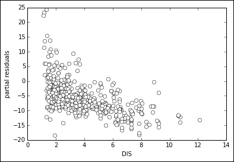

在计算了回归的残差之后，我们决定一次检查一个变量。在选择了我们的变量之后，我们通过将回归的残差与变量值的乘积乘以其系数相加来创建一个部分残差。通过这种方式，我们*提取*变量从回归线上，并将其放入残差中。现在，作为部分残差，我们既有误差，也有系数加权的变量。如果我们将其与变量本身绘制在一起，我们可以注意到是否存在任何非线性模式。如果有，我们知道我们应该尝试一些修改。

在我们的案例中，有一些迹象表明，当变量的值达到 2 之后，点开始弯曲，这是一个明显的非线性迹象，比如任何弯曲或与拉长的、直线型的点云不同的模式。平方、倒数、对数变换通常可以解决这类问题，而无需添加新的项，例如在使用多项式展开时：

```py
In: X_t = X.copy()
 X_t[:,var] = 1./np.sqrt(X_t[:,var])
 linear_regression.fit(X_t, y)
 partial_residual = residuals + X_t[:,var] * \linear_regression.coef_[var]
 plt.plot(X_t[:,var], partial_residual, 'wo')
 plt.xlabel(boston.feature_names[var])
 plt.ylabel('partial residuals')
 plt.show()
 print ("R-squared: %0.3f" % r2_score(y, \linear_regression.predict(X_t)))

Out: R-squared: 0.769

```

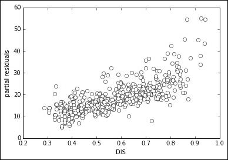

注意一下逆平方变换如何使部分残差图变得更直，这一点反映在更高的 R-squared 值上，表明模型捕捉数据分布的能力有所提高。

作为规则，以下转换应该始终尝试（单独或组合）以找到解决非线性问题的方法：

| 函数名称 | 函数 |
| --- | --- |
| 对数 | `np.log(x)` |
| 指数 | `np.exp(x)` |
| 平方 | `x**2` |
| 立方 | `x**3` |
| 平方根 | `np.sqrt(x)` |
| 立方根 | `x**(1./3.)` |
| 反函数 | `1./x` |

### 小贴士

表中建议的一些转换在归一化后或存在零和负值的情况下可能无法正常工作：对数转换需要大于零的正值，平方根不能与负值一起使用，反转换不能与零值一起操作。有时添加一个常数可能有所帮助（例如`np.log(x+1)`）。通常，只需根据你的数据值尝试可能的转换。

## 通过分箱进行总结

当难以确定确切的转换时，一个快速的解决方案是将连续的数值变量转换为一系列二进制变量，从而允许估计变量数值范围内的每个单独部分的系数。

虽然快速方便，但这种解决方案会增加你的数据集大小（除非你使用矩阵的稀疏表示）并且可能会对你的数据过度拟合。

首先，你将你的值分成等间隔的箱，并使用 Numpy 中的`histogram`函数来观察箱的边缘。之后，使用`digitize`函数，根据之前提供的箱边界将它们的值转换为箱号。最后，你可以使用之前存在的 Scikit-learn 中的`LabelBinarizer`将所有箱号转换为二进制变量。

在这个阶段，你所要做的就是用这组新的二进制指标替换之前的变量，并重新调整模型以检查改进：

```py
In: import numpy as np
 from sklearn.preprocessing import LabelBinarizer
 LB = LabelBinarizer()
 X_t = X.copy()
 edges = np.histogram(X_t[:,var], bins=20)[1]
 binning = np.digitize(X_t[:,var], edges)
 X_t = np.column_stack((np.delete(X_t, var, \axis=1),LB.fit_transform(binning)))
 linear_regression.fit(X_t, y)
 print ("R-squared: %0.3f" % r2_score(y, \linear_regression.predict(X_t)))

Out: R-squared: 0.768

```

# 缺失数据

缺失数据在现实生活中的数据中很常见，有时在随机发生中随机出现，更常见的是由于记录和处理中的某些偏差。所有线性模型都基于完整的数值矩阵工作，并且不能直接处理这类问题；因此，照顾好为算法处理提供合适的数据就取决于你了。

即使你的初始数据集没有缺失数据，在生成阶段仍然可能遇到缺失值。在这种情况下，最好的策略无疑是被动处理它们，就像本章开头所展示的那样，通过标准化所有数值变量。

### 小贴士

对于指示变量，为了被动地拦截缺失值，一种可能的策略是将标签的存在编码为`1`，其不存在编码为`-1`，将零值留给缺失值。

当缺失值从项目开始时就存在时，明确处理它们当然更好，试图找出是否存在任何系统性的缺失值模式。在 Python 数组中，Pandas 和 Scikit-learn 包都是基于它构建的，缺失值由一个特殊值标记，**非数字**（**NaN**），可以使用来自 NumPy 常数的值重复使用。

创建一个包含缺失值的玩具数组很容易：

```py
In: import Numpy as np
 example = np.array([1,2,np.nan,4,5])
 print (example)

Out: [  1\.   2\.  nan   4\.   5.]

```

同时，也可以发现向量中缺失值的位置（结果是布尔向量）：

```py
In: print (np.isnan(example))

Out: [False False  True False False]

```

通过切片或使用函数 `nan_to_num`，可以轻松地替换所有缺失元素，该函数将每个 `nan` 转换为零：

```py
In: print (np.nan_to_num(example))

Out: [ 1\.  2\.  0\.  4\.  5.]

```

使用切片，你可以选择比常数更复杂的东西，比如向量中有效元素的均值：

```py
In: missing = np.isnan(example)
 replacing_value = np.mean(example[~missing])
 example[missing] = replacing_value
 print (example)

Out: [ 1\.  2\.  3\.  4\.  5.]

```

## 缺失数据插补

当使用预测模型时，数据样本之间处理的一致性至关重要。如果你用某个常数或特定的均值来替换缺失值，那么在训练和生成阶段都应该保持一致。Scikit-learn 包在 `preprocessing` 模块中提供了 `Imputer` 类，它可以通过 `fit` 方法学习解决方案，然后通过 `transform` 方法一致地应用它。

让我们在向波士顿数据集中添加一些缺失值后演示这一点：

```py
In: from random import sample, seed
 import numpy as np
 seed(19)
 Xm = X.copy()
 missing = sample(range(len(y)), len(y)//4)
 Xm[missing,5] = np.nan
 print ("Header of Xm[:,5] : %s" % Xm[:10,5])

Out: Header of Xm[:,5] : [ 6.575    nan  7.185    nan  7.147  6.43   6.012  6.172    nan  6.004]

```

### 小贴士

由于采样过程的随机性，你得到相同的结果的可能性相当低。请注意，练习集设置了一个种子，这样你可以在你的电脑上得到相同的结果。

现在变量中应有大约四分之一的观测值缺失。让我们使用 `Imputer` 通过均值来替换它们：

```py
In: from sklearn.preprocessing import Imputer
 impute = Imputer(missing_values = 'NaN', strategy='mean', axis=1)
 print ("Header of imputed Xm[:,5] : %s" % \impute.fit_transform(Xm[:,5])[0][:10])

Out: Header of imputed Xm[:,5] : [ 6.575    6.25446  7.185    6.25446  7.147    6.43     6.012    6.172  6.25446  6.004  ]

```

`Imputer` 允许你定义任何值作为缺失值（有时在重新加工的数据集中，缺失值可以用负值或其他极端值编码）并选择替代策略，而不是均值。其他替代方案是 **中位数** 和 **众数**。如果你怀疑异常值正在影响并偏置平均值（在房价中，一些非常昂贵和专属的房屋或地区可能是原因），中位数是有用的。众数，即最频繁的值，如果你正在处理离散值（例如有限范围的整数序列），则是最佳选择。

## 跟踪缺失值

如果你怀疑缺失值模式中存在一些偏差，通过插补它们，你将失去任何痕迹。在插补之前，一个好的做法是创建一个二进制变量，记录所有缺失值的位置，并将其作为特征添加到数据集中。如前所述，使用 NumPy 创建这样一个新特征非常容易，将 `isnan` 创建的布尔向量转换为整数向量：

```py
In: missing_indicator = np.isnan(Xm[:,5]).astype(int)
 print ("Header of missing indicator : %s" \% missing_indicator[:10])

Out: Header of missing indicator : [0 1 1 0 0 0 0 0 1 1]

```

线性回归模型将为这个缺失值指标创建一个系数，如果存在任何模式，其信息值将通过系数捕捉。

# 异常值

在适当转换所有定量和定性变量并修复任何缺失数据后，剩下的只是检测任何可能的异常值，并通过从数据中删除它或将其作为缺失值处理来处理它。

异常值，有时也称为异常，是与其他所有观察到的值非常不同的观察值。它可以被视为一个不寻常的案例，脱颖而出，它可能是由错误（一个完全超出尺度的错误值）或仅仅是偶尔发生（虽然很少，但确实发生了）的值引起的。尽管理解异常值的来源可能有助于以最合适的方式解决问题（错误可以合法地删除；罕见的情况可以保留或限制，甚至可以将其作为缺失值处理），但最关心的是一个或多个异常值对回归分析结果的影响。回归分析中的任何异常数据都意味着回归系数的扭曲以及模型正确预测常规案例的能力受到限制。

### 小贴士

尽管控制异常值的重要性不言而喻，但遗憾的是，实践者往往忽略了这一活动，因为与其他章节中展示的其他准备工作相比，未能检测到异常值并不会阻止你正在进行的分析，你仍然会得到回归系数和结果（两者可能都相当不准确）。然而，分析过程顺利并不意味着分析本身就没有问题。异常值可能会根据异常值是在目标变量还是预测变量上出现而以两种方式扭曲分析。

为了检测异常值，有几种方法，一些基于对变量单独的观察（单变量方法，或称单变量方法），而另一些则基于将所有变量一起重新组合成一个综合度量（多变量方法）。

最佳的单变量方法基于标准化变量的观察和箱线图的绘制：

+   使用标准化变量，任何得分超过平均值的绝对值三个标准差的值都是可疑的，尽管如果分布不是正态分布，这样的经验法则并不很好地推广。

+   使用箱线图，**四分位数范围**（简称**IQR**；它是第 75 百分位数和第 25 百分位数之间的差值）用于检测超出第 75 百分位数和第 25 百分位数的可疑异常值。如果存在值超出 IQR 的例子，它们可以被认为是可疑的，尤其是如果它们的值超过 IQR 边界值的 1.5 倍。如果它们超过 IQR 限制的 3 倍，它们几乎可以肯定是异常值。

### 小贴士

Scikit-learn 包提供了一些类，用于使用复杂的方法自动检测异常值：`EllipticEnvelope`和`OneClassSVM`。尽管这两个复杂算法的详细论述超出了本文的范围，但如果异常值或异常数据是您数据中的主要问题，我们建议您查看这个网页，以获取一些您可以在脚本中采用的快速解决方案：[`scikit-learn.org/stable/modules/outlier_detection.html`](http://scikit-learn.org/stable/modules/outlier_detection.html)。否则，您也可以阅读我们之前出版的书籍 *Python 数据科学基础*，作者 *Alberto Boschetti* 和 *Luca Massaron*，由 *Packt Publishing* 出版。

## 响应中的异常值

寻找异常值的第一步是检查响应变量。在观察变量分布和回归残差的图表时，重要的是检查是否存在由于过高或过低而超出主要分布的值。

通常情况下，除非伴随有异常的自变量，否则响应中的异常值对估计系数的影响很小；然而，从统计学的角度来看，由于它们影响了均方根误差的量，它们减少了解释方差（平方 r）并增加了估计的标准误差。这两种影响在统计方法中都是一个问题，而对于数据科学目的来说，这些问题则微不足道。

为了确定哪些响应是异常值，我们首先应该监控目标分布。我们首先回忆一下波士顿数据集：

```py
In: boston = load_boston()
 dataset = pd.DataFrame(boston.data, columns=boston.feature_names)
 labels = boston.feature_names
 X = dataset
 y = boston.target

```

`箱线图`函数可以提示目标变量中的任何异常值：

```py
In: plt.boxplot(y,labels=('y'))
plt.show()

```

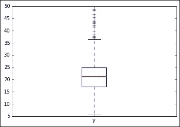

箱线图及其须须告诉我们，相当多的值超出了四分位数范围，因此它们是可疑的。我们还注意到在值 50 处有一定的集中；实际上，值被限制在 50。

在这一点上，我们可以尝试构建我们的回归模型并检查产生的残差。我们将使用均方根误差对其进行标准化。虽然这不是最精确的方法，但它仍然足够好，可以揭示任何显著的问题：

```py
In: scatter = plt.plot(linear_regression.predict(X), \standardized_residuals, 'wo')
 plt.plot([-10,50],[0,0], "r-")
 plt.plot([-10,50],[3,3], "r--")
 plt.plot([-10,50],[-3,-3], "r--")
 plt.xlabel('fitted values')
 plt.ylabel('standardized residuals')
 plt.show()

```

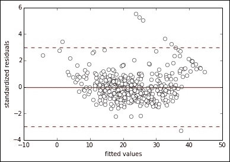

通过绘制回归拟合值与标准化残差的散点图，我们发现有几个异常值超过三个标准差，从零均值来看。特别是截顶值，在图中作为点线清晰可见，似乎存在问题。

## 自变量中的异常值

在检查目标变量后，现在我们也应该看看预测变量。如果异常观测值在目标变量中是异常值，那么在预测变量中的类似情况则被称为有影响力的或高杠杆观测值，因为它们真的可以影响不仅仅是**平方和误差**（**SSE**），这次影响系数和截距——简而言之，整个回归解（这就是为什么它们如此重要，需要捕捉）。

标准化后，我们开始使用箱线图来观察分布：

```py
In: standardization = StandardScaler(with_mean=True, with_std=True)
 Xs = standardization.fit_transform(X)
 boxplot = plt.boxplot(Xs[:,0:7],labels=labels[0:7])

```

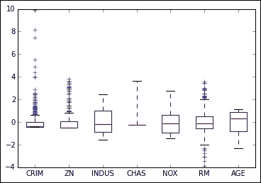

```py
In: boxplot = plt.boxplot(Xs[:,7:13],labels=labels[7:13])

```

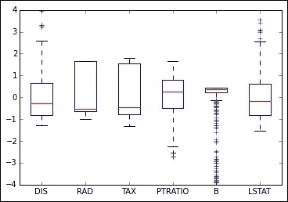

观察完所有箱线图后，我们可以得出结论，存在一些方差受限的变量，如**B**、**ZN**和**CRIM**，它们的特点是值的长尾。还有一些来自**DIS**和**LSTAT**的疑似案例。我们可以通过寻找超过表示阈值的值来界定所有这些案例，一个变量一个变量地，但一次性捕捉所有这些案例将是有帮助的。

**主成分分析**（**PCA**）是一种可以将复杂数据集简化为较少维度的技术，即数据集原始变量的总和。不深入探讨算法的技术细节，你只需知道算法产生的新维度具有递减的解释力；因此，将这些维度相互对比就像绘制整个数据集的信息一样。通过观察这些合成表示，你可以发现群组和孤立点，如果它们离图表中心非常远，那么它们对回归模型的影响也相当大。

```py
In: from sklearn.decomposition import PCA
 pca = PCA()
 pca.fit(Xs)
 C = pca.transform(Xs)
 print (pca.explained_variance_ratio_)

Out: [ 0.47097  0.11016  0.09547  0.06598  0.0642   0.05074 \0.04146  0.0305	0.02134  0.01694  0.01432  0.01301  0.00489]

In: import numpy as np
 import matplotlib.pyplot as plt
 explained_variance = pca.explained_variance_ratio_
 plt.title('Portion of explained variance by component')
 range_ = [r+1 for r in range(len(explained_variance))]
 plt.bar(range_,explained_variance, color="b", alpha=0.4, \align="center")
 plt.plot(range_,explained_variance,'ro-')
 for pos, pct in enumerate(explained_variance):
 plt.annotate(str(round(pct,2)), (pos+1,pct+0.007))
 plt.xticks(range_)
 plt.show()

Out:

```

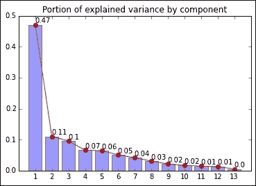

PCA 创建的第一个维度可以解释数据集信息的 47%，第二个和第三个分别是 11%和 9.5%（`explained_variance_ratio_`方法可以提供此类信息）。现在我们只需将第一个维度与第二个和第三个维度进行对比，寻找远离中心的孤立点，因为这些就是我们需要调查的高杠杆案例：

```py
In: scatter = plt.scatter(C[:,0],C[:,1], facecolors='none', \edgecolors='black')
 plt.xlabel('Dimension 1')
 plt.ylabel('Dimension 2')

```

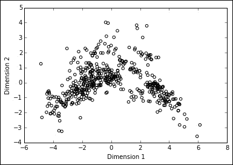

```py
In: scatter = plt.scatter(C[:,0],C[:,2], facecolors='none', \edgecolors='black')
 plt.xlabel('Dimension 1')
 plt.ylabel('Dimension 3')
Out:

```

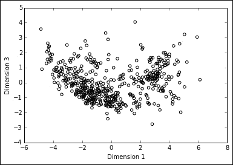

## 移除或替换异常值

在能够检测到异常值和有影响力的观测值之后，我们只需讨论我们可以如何处理它们。你可能认为只需删除它们就可以了，但相反，移除或替换一个异常值是需要仔细考虑的事情。

事实上，异常观测值可能由三个原因（相应的补救措施也随之改变）得到解释：

+   它们是异常值，因为它们是罕见事件，所以它们与其他观察结果相比显得不寻常。如果情况如此，删除数据点可能不是正确的解决方案，因为这些点是您想要建模的分布的一部分，它们之所以突出，仅仅是因为偶然。最好的解决方案是增加样本数量。如果增加样本量不可行，那么删除它们或尝试重新采样以避免它们被选中。

+   一些错误发生在数据处理中，异常观察值来自另一个分布（可能有一些数据被混合，可能是来自不同时间或另一个地理环境）。在这种情况下，需要立即删除。

+   该值是由于输入或处理错误而造成的错误。在这种情况下，该值必须被视为缺失值，并且您应该执行缺失值的插补，以获得合理的值。

### 小贴士

通常情况下，只有当数据点与您用于预测的数据不同，并且通过删除它们，您可以直接确认它们对回归模型的系数或截距有很大影响时，删除数据点才是必要的。在其他所有情况下，为了避免数据挖掘（关于数据挖掘如何负面地影响您的模型的内容将在下一章中详细介绍），应避免任何形式的筛选来改进模型。

# 摘要

在本章中，我们处理了您在准备数据以便由线性模型分析时可能遇到的各种问题。

我们首先讨论了变量的缩放和了解新变量的尺度不仅允许我们更好地洞察数据，而且帮助我们处理意外缺失的数据。

然后，我们学习了如何通过使用散列技巧来编码定性变量，并处理具有不可预测变量和文本信息的极端多样的可能级别。然后，我们回到定量变量，学习了如何将其转换为线性形状并获得更好的回归模型。

最后，我们处理了一些可能的数据异常，如缺失值和异常值，展示了一些简单而非常有效和高效的快速修复方法。

在此阶段，在继续到更复杂的线性模型之前，我们只需要说明可以帮助您获得真正优秀的预测引擎的数据科学原则，而不仅仅是数学曲线拟合练习。这正是下一章的主题。
