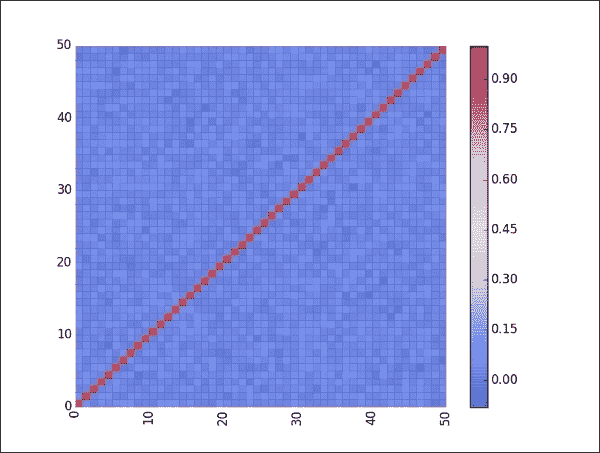
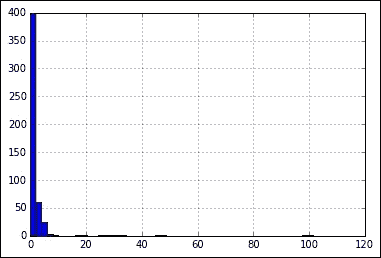
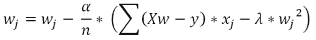
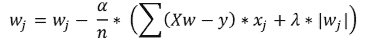

# 第六章：实现泛化

我们必须承认，到目前为止，我们推迟了线性模型必须接受测试和验证以有效预测其目标的关键真实时刻。到目前为止，我们只是通过天真地查看一系列拟合度指标来判断我们是否做得好，所有这些指标都在告诉我们线性模型能否仅基于我们的训练数据中的信息进行适当的预测。

除非你喜欢“沉或浮”的情况，在进入生产前，你将使用与新的软件相同的程序，你需要对你的模型应用正确的测试，并能够预测其现场表现。

此外，无论你对这类模型的技能和经验水平如何，你很容易被误导，认为只要基于你用来定义它的相同数据，你就是在构建一个好的模型。因此，我们将向您介绍样本内和样本外统计之间的基本区别，并展示当使用过多的预测变量、过少的预测变量或仅仅是错误的变量时，它们如何存在风险而偏离。

那么，我们现在终于准备好检查我们是否做得很好，或者是否需要从头开始重新思考一切了。在本书的这个关键章节中，在继续介绍更复杂的技术之前，我们将向您介绍关键的数据科学配方，以彻底测试您的模型，优化其性能，使其经济高效，并在没有任何顾虑的情况下，将其与真实、新鲜的数据进行对比。

在本章中，你将了解如何：

+   使用最合适的成本度量，在验证/测试集或使用交叉验证上测试你的模型

+   根据统计测试和实验选择最佳特征

+   通过调整成本函数使你的模型更加经济

+   使用稳定性选择，一种几乎自动化的变量选择方法

# 检查样本外数据

到目前为止，我们一直在努力使回归模型拟合数据，甚至通过修改数据本身（输入缺失数据、去除异常值、进行非线性转换或创建新特征）。通过关注如 R 平方等指标，我们尽力减少预测误差，尽管我们不知道这有多成功。

我们现在面临的问题是，我们不应该期望一个拟合良好的模型在生产过程中自动在所有新的数据上表现良好。

在定义和解释问题时，我们回忆起我们关于欠拟合所说的内容。由于我们正在使用线性模型，我们实际上期望将我们的工作应用于与响应变量具有线性关系的数据。具有线性关系意味着，在响应变量的水平上，我们的预测变量总是以相同的速率不断增加（或减少）。在散点图上，这可以通过一条直线和非常细长的点云来表示，这些点云可以被一条直线回归线穿过，预测误差很小或最小。

当关系是非线性的，变化率和方向是可变的（或者说是增加或减少）时，为了使线性模型更好地工作，我们将不得不尝试通过适当的变换使关系变得直线。否则，我们将不得不尝试通过非线性形状到线性形状的不总是成功的近似来猜测响应。

例如，如果关系是二次的（因此函数形状是抛物线），使用直线将导致在预测变量值的一定范围内对预测值的系统性低估或高估的问题。这种系统性错误称为偏差，它是简单模型（如线性回归）的典型特征。具有高偏差的预测模型将系统地倾向于在特定情况下产生错误的预测。由于预测的不准确性是一个不希望的特性，对于应该能够提供有效预测的工具来说，我们必须努力通过添加新变量和通过多项式扩展或其他变换来转换现有变量，以实现更好的响应拟合。这些努力构成了所谓的**特征创建阶段**。

通过这样做，我们可能会发现自己处于一个不同但同样有问题的情况。事实上，当我们使我们的模型越来越复杂时，它不仅会更好地拟合响应，通过捕捉更多未知函数与预测变量相关的部分，而且通过添加更多和更多的项，我们使模型能够接收那些仅与当前数据相关的信息（我们称之为噪声），这使得模型越来越不能正确地处理不同的数据。

你可以将其视为一种*记忆能力*，因此，学习算法越复杂，就有更多的空间来拟合我们从学习数据中使用的不是很有用的信息。这种记忆会带来非常不便的后果。尽管我们的模型似乎在我们的数据上拟合得很好，但一旦它应用于不同的数据集，它就会显示出其无法正确预测的能力。在这种情况下，与之前错误是系统性的（系统性低估或高估）相反，错误将显得是随机的，这取决于数据集。这被称为估计的方差，它可能对你来说是一个更大的问题，因为它可以在你测试它之前让你对其存在一无所知。它倾向于在更复杂的算法中发生，在其最简单的形式中，线性回归倾向于在估计上比方差呈现更高的偏差。无论如何，添加过多的项和交互作用或求助于多项式展开确实会使线性模型面临过拟合的风险。

## 通过样本分割进行测试

由于我们期望模型能够泛化到新的数据，而且我们很少仅仅对拟合或简单地记忆现有数据感兴趣，因此在构建模型时我们需要采取一些预防措施。为了对抗这个问题，多年来从数据中学习的实践已经定义了一系列基于科学验证和测试方法的程序，我们将展示并亲自实践这些方法。

首先，如果我们希望我们的模型在新数据上具有良好的泛化能力，我们必须在这种情况下对其进行测试。这意味着，如果获取新数据不是一项容易的任务或可行的任务，我们应该从一开始就为测试保留一些数据。我们可以通过随机将数据分为两部分，即训练集和测试集，使用 70-80%的数据进行训练，剩余的 20-30%用于测试目的。

Scikit-learn 的`cross_validation`模块提供了一系列方法，可以帮助我们处理所有这些操作。让我们通过操作我们常用的波士顿住房数据集来尝试一下：

```py
In: import pandas as pd
from sklearn.datasets import load_boston
boston = load_boston() 
dataset = pd.DataFrame(boston.data, columns=boston.feature_names)
dataset['target'] = boston.target
observations = len(dataset)
variables = dataset.columns[:-1]
X = dataset.ix[:,:-1]
y = dataset['target'].values
```

在加载完成后，我们首先将其分为训练和测试两部分：

```py
In: from sklearn.cross_validation import train_test_split
X_train, X_test, y_train, y_test = train_test_split(X, y,test_size=0.30, random_state=101)
print ("Train dataset sample size: %i" % len(X_train))
print ("Test dataset sample size: %i" % len(X_test))

Out:   Train dataset sample size: 354
Test dataset sample size: 152
```

`train_test_split`将根据`test_size`参数中指定的测试比例来分割数据。分割将是随机的，你可以通过在`random_state`参数中使用特定的数字种子来确定性控制结果（用于复现目的）（我们选择的种子是`101`）。

有时候，仅仅保留一个样本外数据（包含不在样本内——即用作从训练活动数据中学习的样本）是不够的，因为我们可能需要调整一些参数或做出特定的选择，并且我们希望测试替代方案而不必使用测试数据。解决方案是保留我们数据的一部分用于验证目的，这意味着检查哪些参数可能对我们模型是最优的。我们可以通过两步使用`train_test_split`来实现这一点：

```py
In: X_train, X_out_sample, y_train, y_out_sample = \
train_test_split(X, y, test_size=0.40, random_state=101)
X_validation, X_test, y_validation, y_test = \
train_test_split(X_out_sample, y_out_sample, test_size=0.50, random_state=101)
print ("Train dataset sample size: %i" % len(X_train))
print ("Validation dataset sample size: %i" % len(X_validation))
print ("Test dataset sample size: %i" % len(X_test))
Out:   Train dataset sample size: 303
Validation dataset sample size: 101
Test dataset sample size: 102
```

## 交叉验证

虽然在衡量假设的真实误差方面很有帮助，但将数据分为训练集和测试集（有时也分为验证集）会带来一些风险，你必须考虑到：

+   由于它涉及子采样（你随意抽取初始样本的一部分），你可能会承担抽取对训练和测试过于有利或不利的集的风险。

+   通过留出一部分样本，你减少了可以从中学习的示例数量，而线性模型需要尽可能多的示例来减少估计的方差，消除共线性变量，并正确地模拟非线性。

尽管我们总是建议抽取一个小测试样本（比如数据的 10%）作为你工作有效性的最终检查，但避免上述问题的最佳方法，以及轻松管理不同模型和参数的比较，是应用交叉验证，这要求你为训练和测试分割数据，但它会反复进行，直到每个观测值都扮演了训练和测试的角色。

换句话说，你决定将数据分割成多少互斥的部分，然后你反复使用除了不同的一次之外的所有折来训练你的模型；这起到了测试集的作用。

### 注意

你将数据分割成多少部分通常设置为 3、5、10 或 20，当你有少量训练数据时，你决定一个较大的分割数（每个分割称为**折**）。

当你完成验证后，使用所有可用的分割作为测试集，你首先计算结果的平均值，这以相当高的准确性告诉你，当面对新数据时（新数据但与手头的数据不太相似）你的模型的整体性能。然后你也注意到交叉验证性能的标准差。这很重要，因为如果存在高偏差（超过平均性能值的一半），这可能表明模型估计的方差很高，并且需要更多的数据才能良好工作。

在以下示例中，你可以看看`KFold`和`StratifiedKFold`（来自 Scikit-learn 的`cross_validation`模块）是如何工作的。

它们都是迭代器：你为每一轮交叉验证抽取训练和测试的索引，唯一的区别在于`KFold`只是进行随机抽取。相反，`StratifiedKFold`会考虑到你希望在训练和测试样本中分布的目标变量的分布，就像它在原始集合上一样。

作为两个类的参数，你应该提供：

+   `KFold`的观测计数和`StratifiedKFold`的目标向量

+   折叠数（通常选择 10，但如果你有大量观测值，可以减少折叠数，或者如果你的数据集很小，可以增加折叠数）

你还应该决定：

+   是否要打乱数据或按原样取（打乱总是推荐）

+   是否应用随机种子并使结果可重复

```py
In: from sklearn.cross_validation import cross_val_score, \
KFold, StratifiedKFold
from sklearn.metrics import make_scorer
from sklearn.preprocessing import PolynomialFeatures
from sklearn.linear_model import LinearRegression
import numpy as np
def RMSE(y_true, y_pred):
    return np.sum((y_true -y_pred)**2)
lm = LinearRegression()
cv_iterator = KFold(n=len(X), n_folds=10, shuffle=True,\ random_state=101)
edges = np.histogram(y, bins=5)[1]
binning = np.digitize(y, edges)
stratified_cv_iterator = StratifiedKFold(binning, n_folds=10,\ shuffle=True, random_state=101)

second_order=PolynomialFeatures(degree=2, interaction_only=False)
third_order=PolynomialFeatures(degree=3, interaction_only=True)

over_param_X = second_order.fit_transform(X)
extra_over_param_X = third_order.fit_transform(X)
cv_score = cross_val_score(lm, over_param_X, y, cv=cv_iterator,\ scoring='mean_squared_error', n_jobs=1)
```

### 注意

`n_jobs`参数将通过利用并行计算来设置参与结果计算的线程数。当它设置为`-1`时，将自动使用所有可用的线程，在您的计算机上尽可能快地加速计算。无论如何，根据您正在工作的系统，有时将参数设置为不同于`1`的值可能会导致问题，减慢结果。在我们的示例中，作为预防措施，它始终设置为`1`，但如果你需要缩短计算时间，你可以更改其值。

首先，我们尝试获取一个过参数化模型（波士顿数据集原始特征的二次多项式展开）的交叉验证分数。请注意，由于 Scikit-learn 中计算模型交叉验证的自动函数`cross_val_score`的内部机制，结果为负（尽管它们是平方误差）。这个函数需要模型、特征和目标变量作为输入。它还接受一个用于参数`cv`的交叉验证迭代器，一个用于`scoring`的字符串，表示要使用的评分函数的名称（更多内容请参阅：[`scikit-learn.org/stable/modules/model_evaluation.html`](http://scikit-learn.org/stable/modules/model_evaluation.html)）；最后，通过指定`n_jobs`来指定在您的 PC 上并行工作的线程数（`1`表示只有一个线程在工作，而`-1`表示使用系统中的所有可用线程）：

```py
In: print (cv_score)

Out: [-10.79792467 -19.21944292  -8.39077691 -14.79808458 -10.90565129  -7.08445784 -12.8788423  -16.80309722 -32.40034131 -13.66625192]
```

### 小贴士

均方误差为负是因为函数的内部机制只能最大化，而我们的成本指标需要最小化；这就是为什么它变成了负数

在去掉符号后，我们可以取平均值和标准差。在这里，我们还可以注意到标准差很高，因此我们可能需要尝试控制目标变量的分布，因为在房地产业务中，由于非常富有的住宅区，存在异常观测值：

```py
In: print ('Cv score: mean %0.3f std %0.3f' % (np.mean(np.abs(cv_score)), np.std(cv_score)))
Out: Cv score: mean 14.694 std 6.855
```

要应用这种控制，我们将目标变量分层；也就是说，我们将其划分为区间，并期望在交叉验证过程中保持区间分布：

```py
In:cv_score = cross_val_score(lm, over_param_X, y,\
cv=stratified_cv_iterator, scoring='mean_squared_error', \
n_jobs=1)
print ('Cv score: mean %0.3f std %0.3f' % \
       (np.mean(np.abs(cv_score)), np.std(cv_score)))
Out: Cv score: mean 13.584 std 5.226
```

最后，控制响应分布实际上降低了估计误差的标准差（以及我们的预期平均值）。在交叉验证中成功分层尝试表明，我们应该在正确分布的训练样本上训练，否则我们可能会得到一个由于采样不良而始终不能正常工作的结果模型。

### 小贴士

关于交叉验证的最后一个评论，我们建议主要用它来评估参数，并且始终依赖于一个小型的抽取测试集进行性能验证。实际上，这有点棘手，但如果交叉验证次数太多（例如改变种子）以寻找最佳性能，你最终会得到最佳结果，这是另一种称为窥探的过拟合形式（如果你对测试集做同样的事情也会发生）。相反，当你使用交叉验证来选择参数时，你只需决定在选项中哪个是最好的，而不是绝对交叉验证值。

## Bootstrapping

有时，如果训练数据真的非常小，即使是划分成折叠也可能惩罚模型的训练方式。重抽样技术允许通过尝试复制数据的潜在分布来重复训练和测试验证序列（允许对预期结果的均值和标准差进行精确估计）多次。

Bootstrapping 基于重复抽样的方法，这意味着允许一个观测值被多次抽取。通常，重抽样抽取的观测数与原始数据集的大小相当。此外，总有一部分观测值保持未动，相当于可用观测值的三分之一，可以用来验证：

```py
In: import random
def Bootstrap(n, n_iter=3, random_state=None):
      """
      Random sampling with replacement cross-validation generator.
      For each iter a sample bootstrap of the indexes [0, n) is
      generated and the function returns the obtained sample
      and a list of all the excluded indexes.
      """
      if random_state:
          random.seed(random_state)
      for j in range(n_iter):
          bs = [random.randint(0, n-1) for i in range(n)]
          out_bs = list({i for i in range(n)} - set(bs))
          yield bs, out_bs

boot = Bootstrap(n=10, n_iter=5, random_state=101)
for train_idx, validation_idx in boot:
print (train_idx, validation_idx)
```

输出将显示如下：


如前例所示（遗憾的是，这种方法不是 Scikit-learn 的一部分，最近已被弃用），在 10 个观测值中，平均有四个观测值可用于测试目的。然而，在重抽样过程中，不仅仅是排除的案例提供了洞察。模型实际上拟合到训练数据集，我们还可以检查在重抽样复制中系数是如何确定的，从而让我们了解每个系数的稳定性：

```py
In: import numpy as np
boot = Bootstrap(n=len(X), n_iter=10, random_state=101)
lm = LinearRegression()
bootstrapped_coef = np.zeros((10,13))
for k, (train_idx, validation_idx) in enumerate(boot):
       lm.fit(X.ix[train_idx,:],y[train_idx])
       bootstrapped_coef[k,:] = lm.coef_
```

例如，第十个系数索引（PTRATIO）在符号和值上都非常稳定：

```py
In: print(bootstrapped_coef[:,10])

Output: [-1.04150741 -0.93651754 -1.09205904 -1.10422447 -0.9982515
-0.79789273 -0.89421685 -0.92320895 -1.0276369  -0.79189224]
```

而第六个系数（AGE）具有很大的变异性，经常甚至改变符号：

```py
In: print(bootstrapped_coef[:,6])

Out: [-0.01930727  0.00053026 -0.00026774  0.00607945  0.02225979 -0.00089469  0.01922754  0.02164681  0.01243348 -0.02693115]
```

总之，bootstrap 是一种可以运行多次的复制形式，这允许你创建多个模型，并以类似交叉验证过程的方式评估它们的结果。

# 特征贪婪选择

通过跟随本书中的实验，你可能已经注意到，在线性回归模型中添加新变量总是大获成功。这尤其适用于训练误差，而且这种情况不仅发生在我们插入正确的变量时，也发生在我们放置错误的变量时。令人费解的是，当我们添加冗余或无用的变量时，模型拟合度总是或多或少地有所提高。

原因很容易解释；由于回归模型是高偏差模型，它们发现通过增加它们使用的系数数量来增加其复杂性是有益的。因此，一些新的系数可以用来拟合数据中存在的噪声和其他细节。这正是我们之前讨论的记忆/过度拟合效应。当你有与观察值一样多的系数时，你的模型可能会饱和（这是统计学中使用的术语），你可能会得到完美的预测，因为基本上你有一个系数来学习训练集中每个响应。

让我们用一个训练集（样本内观察）和一个测试集（样本外观察）的快速示例来使这个概念更具体。让我们首先找出我们有多少个案例和特征，以及基线性能是什么（对于样本内和样本外）：

```py
In: from sklearn.metrics import mean_squared_error
from sklearn.linear_model import LinearRegression
from sklearn.cross_validation import train_test_split
X_train, X_test, y_train, y_test = train_test_split(X, y, test_size=0.30, random_state=3)
lm = LinearRegression()
lm.fit(X_train,y_train)
print ('Train (cases, features) = %s' % str(X_train.shape))
print ('Test  (cases, features) = %s' % str(X_test.shape))
print ('In-sample  mean squared error %0.3f' % mean_squared_error(
        y_train,lm.predict(X_train)))
print ('Out-sample mean squared error %0.3f' % mean_squared_error(
        y_test,lm.predict(X_test)))

Out:   Train (cases, features) = (354, 13)
Test  (cases, features) = (152, 13)
In-sample  mean squared error 22.420
Out-sample mean squared error 22.440
```

### 小贴士

最佳方法将是使用交叉验证或自助法进行此类实验，而不仅仅是简单的训练/测试分割，但我们希望使其快速，这就是我们选择这种解决方案的原因。我们向您保证，使用更复杂的估计技术不会改变实验的结果。

因此，我们在样本内和样本外的误差是相似的。我们可以开始通过多项式展开来改进我们的模型：

```py
In: from sklearn.preprocessing import PolynomialFeatures
second_order=PolynomialFeatures(degree=2, interaction_only=False)
third_order=PolynomialFeatures(degree=3, interaction_only=True)
```

首先，我们应用二次多项式展开：

```py
In: lm.fit(second_order.fit_transform(X_train),y_train)
print ('(cases, features) = %s' % str(second_order.fit_transform(
            X_train).shape))
print ('In-sample  mean squared error %0.3f' %
mean_squared_error(y_train,lm.predict(second_order.fit_transform(
            X_train))))
print ('Out-sample mean squared error %0.3f' %
mean_squared_error(y_test,lm.predict(second_order.fit_transform(
            X_test))))
Out:   (cases, features) = (354, 105)
In-sample  mean squared error 5.522
Out-sample mean squared error 12.034
```

看起来，好的样本内结果与样本外测试结果几乎没有对应关系。尽管样本外性能有所提高，但结果缺乏可比性是过度拟合的明显迹象；模型中有些系数更有用，但大多数只是用来捕捉数据中的噪声。

现在，我们走向极端，测试三次多项式展开（尽管只使用交互项）：

```py
In: lm.fit(third_order.fit_transform(X_train), y_train)
print ('(cases, features) = %s' % str(third_order.fit_transform(
            X_train).shape))
print ('In-sample  mean squared error %0.3f' %
mean_squared_error(y_train,lm.predict(third_order.fit_transform(
            X_train))))
print ('Out-sample mean squared error %0.3f' %
mean_squared_error(y_test,lm.predict(third_order.fit_transform(
            X_test))))

Out:   (cases, features) = (354, 378)
In-sample  mean squared error 0.438
Out-sample mean squared error 85777.890
```

现在，显然我们的模型出了大问题。由于系数多于观察值（`p>n`），我们在训练集上实现了完美拟合。然而，在样本外验证中，我们的模型似乎达到了与随机数生成器相同的性能。在接下来的几段中，我们将向您展示如何利用增加的特征数量，而不会产生之前代码片段中展示的任何问题。

## Madelon 数据集

对于在众多嘈杂且共线的变量中选择最佳子集的任务，我们决定将我们常用的波士顿房价数据集与一个棘手的 Madelon 数据集（[`archive.ics.uci.edu/ml/datasets/Madelon`](https://archive.ics.uci.edu/ml/datasets/Madelon)）一起使用。这是一个人工数据集（使用算法生成），在 2003 年 NIPS（第七届神经信息处理系统年会）期间的一个特征选择竞赛中展出。

该数据集尤其具有挑战性，因为它是在将 32 个不同的点簇（16 个来自正组，16 个来自负组）放置在五维超立方体的顶点上生成的。从五个度量维度的各种变换中提取了 500 个特征和 2000 个案例。为了使事情更难，一些随机数被添加到特征中作为噪声，并且一些响应被翻转（翻转的占 1%）。所有这些复杂的变换使得处理建模相当困难，尤其是对于线性模型，因为大多数特征与响应的关系肯定是非线性的。这对我们的示例非常有帮助，因为它清楚地表明直接包含所有特征会损害样本外预测的准确性。

要下载并将这样一个有趣且具有挑战性的数据集上传到您的计算机上，请执行以下说明，并允许您的计算机从存储数据的外部网站下载数据所需的时间：

```py
In: try:
import urllib.request as urllib2
  except:
    import urllib2
  import numpy as np
  train_data = 'https://archive.ics.uci.edu/ml/machine-learning-databases/madelon/MADELON/madelon_train.data'
  validation_data = 'https://archive.ics.uci.edu/ml/machine-learning-databases/madelon/MADELON/madelon_valid.data'
train_response = 'https://archive.ics.uci.edu/ml/machine-learning-databases/madelon/MADELON/madelon_train.labels'
  validation_response = 'https://archive.ics.uci.edu/ml/machine-learning-databases/madelon/madelon_valid.labels'
try:
      Xt = np.loadtxt(urllib2.urlopen(train_data))
      yt = np.loadtxt(urllib2.urlopen(train_response))
      Xv = np.loadtxt(urllib2.urlopen(validation_data))
      yv = np.loadtxt(urllib2.urlopen(validation_response))
except:
    # In case downloading the data doesn't works, 
# just manually download the files into the working directory
      Xt = np.loadtxt('madelon_train.data')
      yt = np.loadtxt('madelon_train.labels')
      Xv = np.loadtxt('madelon_valid.data')
      yv = np.loadtxt('madelon_valid.labels')
```

在加载完训练集和验证集后，我们可以开始探索一些可用的信息：

```py
In: print ('Training set: %i observations %i feature' % (Xt.shape))
  print ('Validation set: %i observations %i feature' % (Xv.shape))
Out:  Training set: 2000 observations 500 feature
    Validation set: 600 observations 500 feature 
```

自然地，我们不会触及验证集（我们甚至不会瞥一眼，否则就是窥探），但我们可以尝试通过训练集来了解情况：

```py
In:from scipy.stats import describe
  print (describe(Xt))
```

输出相当长，并以矩阵形式呈现（因此在此处未报告），但它确实告诉我们关于数据集中每个特征的均值、最小值、最大值、方差、偏度和峰度的所有信息。快速浏览它并没有揭示任何特别之处；然而，它明确指出所有变量都近似呈正态分布，并且它们的值范围有限。我们可以使用变量之间的相关性图继续我们的探索：

```py
import matplotlib.pyplot as plt
import matplotlib as mpl
%matplotlib inline

def visualize_correlation_matrix(data, hurdle = 0.0):
    R = np.corrcoef(data, rowvar=0)
    R[np.where(np.abs(R)<hurdle)] = 0.0
    heatmap = plt.pcolor(R, cmap=mpl.cm.coolwarm, alpha=0.8)
    heatmap.axes.set_frame_on(False)
    plt.xticks(rotation=90)
    plt.tick_params(axis='both', which='both', bottom='off',\
                  top='off', left = 'off',right = 'off')
    plt.colorbar()
    plt.show()

visualize_correlation_matrix(Xt[:,100:150], hurdle=0.0)
```

查看以下截图：



简单浏览一下部分特征及其相关系数后，我们可以注意到其中只有几个具有显著的相关性，而其他则只有轻微的相关性。这给人一种它们之间关系嘈杂的印象，因此有效的选择变得相当复杂。

作为最后一步，我们检查一个简单的逻辑回归模型在曲线下面积指标测量的误差方面会得分如何。

### 小贴士

曲线下面积（AUC）是通过比较在不同分类阈值下正确正例率与错误率之间的比率得出的一个度量。计算起来有点棘手，所以我们建议始终依赖 `sklearn.metrics` 模块中的 `roc_auc_score` 函数。

逻辑回归将观察结果分类为正例，如果阈值超过 0.5，因为这种分割总是被证明是最优的，但我们可以自由地改变这个阈值。为了提高顶级结果选择的精度，我们只需将阈值从 0.5 提高到 1.0（提高阈值会增加所选范围内的准确性）。相反，如果我们打算增加猜测的正例总数，我们只需选择一个低于 0.5 的阈值，直到几乎为 0.0（降低阈值会增加所选范围内正例的覆盖率）。

AUC 错误度量帮助我们确定我们的预测是否按顺序排列得当，无论它们在价值方面的有效精度如何。因此，AUC 是评估选择算法的理想错误度量。如果你根据概率正确地排列结果，无论猜测的概率是否正确，你都可以通过改变 0.5 阈值——也就是说，通过选择一定数量的顶级结果——简单地选择用于你项目的正确选择。

在我们的案例中，基线 AUC 度量为 `0.602`，这是一个相当令人失望的值，因为随机选择应该给我们带来 `0.5` 的值（`1.0` 是可能的最大值）：

```py
In: from sklearn.cross_validation import cross_val_score
  from sklearn.linear_model import LogisticRegression
  logit = LogisticRegression()
  logit.fit(Xt,yt)

  from sklearn.metrics import roc_auc_score
  print ('Training area under the curve: %0.3f' % \roc_auc_score(yt,logit.predict_proba(Xt)[:,1]))
  print ('Validation area under the curve: %0.3f' % \roc_auc_score(yv,logit.predict_proba(Xv)[:,1]))

Out:   Training area under the curve: 0.824
    Validation area under the curve: 0.602
```

## 特征的单变量选择

```py
In addition, if interpreting your model is a valuable addition, you really should remove non-useful variables, striving for the simplest possible form of your linear model as dictated by Occam's razor, a commonplace practice in science, favoring simpler solutions against more complex ones when their difference in performance is not marked.
```

特征选择可以通过仅保留模型中最具预测性的变量集来帮助提高模型的样本外性能和其可读性，在某些情况下只是最好的那些，在其他情况下是协同工作效果最好的那些。

特征选择方法有很多。最简单的方法是单变量方法，它通过估计变量在单独考虑时相对于响应的预测值来评估变量的好坏。

这通常涉及使用统计测试，Scikit-learn 提供了三种可能的测试：

+   `f_regression` 类，它执行 F 测试（一种比较不同回归解决方案的统计测试）和 p 值（可以解释为观察到的差异是偶然发生的概率值），并揭示回归的最佳特征

+   `f_class`，这是一个 Anova F 测试（一种比较类别之间差异的统计测试），另一种对分类问题有用的统计和相关方法

+   `Chi2` 类，这是一个卡方测试（一种针对计数数据的统计测试），当你的问题是分类且你的答案变量是计数或二进制（在所有情况下，都是正数，如销售单位或赚取的金钱）时，是一个很好的选择

所有这些测试都会输出一个分数和一个用 p 值表示的统计测试。高分，由小的 p 值（小于 0.05，表示得分是通过运气获得的概率很低）证实，将为你提供确认，表明某个变量对你的目标预测是有用的。

在我们的例子中，我们将使用`f_class`（因为我们现在正在处理一个分类问题）并且我们将使用`SelectPercentile`函数帮助我们选择一定百分比的得分较高的特征：

```py
In: from sklearn.feature_selection import SelectPercentile, f_classif
selector = SelectPercentile(f_classif, percentile=50)
selector.fit(Xt,yt)
variable_filter = selector.get_support()
```

在选择了上半部分后，希望已经切掉了最不相关的特征并保留了重要的特征，我们在直方图上绘制我们的结果以揭示得分的分布：

```py
In: plt.hist(selector.scores_, bins=50, histtype='bar')
plt.grid()
plt.show()
```

看看下面的截图：



显然，大多数分数接近零，只有少数得分较高。现在我们将通过直接选择一个为了方便而经验性地选择的阈值来选择我们假设重要的特征：

```py
  In: variable_filter = selector.scores_ > 10
  print ("Number of filtered variables: %i" % \ np.sum(variable_filter))
  from sklearn.preprocessing import PolynomialFeatures
  interactions = PolynomialFeatures(degree=2, interaction_only=True)
  Xs = interactions.fit_transform(Xt[:,variable_filter])
  print ("Number of variables and interactions: %i" % Xs.shape[1])

Out:   Number of filtered variables: 13
Number of variables and interactions: 92
```

现在，我们已经将我们的数据集缩减到仅包含核心特征。在这个时候，测试多项式展开并尝试自动捕捉模型中的任何相关非线性关系是有意义的：

```py
In: logit.fit(Xs,yt)
Xvs = interactions.fit_transform(Xv[:,variable_filter])
 print ('Validation area Under the Curve ' + \
        'before recursive \ selection:   %0.3f' % \
        roc_auc_score(yv,logit.predict_proba(Xvs)[:,1]))

Out:   Validation area Under the Curve before 
recursive selection: 0.808
```

结果的验证分数（外部样本）约为 0.81，考虑到我们在训练集上的初始过拟合分数为 0.82，这是一个非常有希望的价值。当然，我们可以决定在这里停止，或者尝试进一步过滤多项式展开；特征选择实际上是一项永无止境的工作，尽管在某个点上你必须意识到，进一步的调整只能带来微小的增量结果。

## 递归特征选择

单变量选择的唯一问题是它将通过单独考虑每个特征，而不是验证它们如何协同工作来决定最佳特征。因此，冗余变量并不罕见地被选中（由于多重共线性）。

多变量方法，如递归消除，可以避免这个问题；然而，它计算成本更高。

递归消除通过从完整模型开始，并尝试依次排除每个变量，通过交叉验证估计来评估移除效果。如果某些变量对模型性能的影响可以忽略不计，那么消除算法就会剪枝它们。当任何进一步的移除被证明会损害模型正确预测的能力时，这个过程就会停止。

这里是`RFECV`，Scikit-learn 的递归消除实现的一个演示。我们将使用通过二次多项式扩展增强的波士顿数据集，因此这次我们处理的是一个回归问题：

```py
In: from sklearn.feature_selection import RFECV
from sklearn.cross_validation import KFold
from sklearn.cross_validation import train_test_split
X_train, X_test, y_train, y_test = \
    train_test_split(X, y, test_size=0.30, random_state=1)

lm = LinearRegression()
cv_iterator = KFold(
    n=len(X_train), n_folds=10, shuffle=True, random_state=101)
recursive_selector = RFECV(estimator=lm, step=1, cv=cv_iterator, scoring='mean_squared_error')
recursive_selector.fit(second_order.fit_transform(X_train),
y_train)
print ('Initial number of features : %i' % 
       second_order.fit_transform(X_train).shape[1])
print ('Optimal number of features : %i' % 
       recursive_selector.n_features_)

Out:   Initial number of features : 105
Optimal number of features : 52
```

给定一个估计器（我们的模型）、一个交叉验证迭代器和误差度量，`RFECV`会在一段时间后找出，可以放心地从模型中删除一半的特征，而不用担心会降低其性能：

```py
In: essential_X_train = recursive_selector.transform(
    second_order.fit_transform(X_train))
essential_X_test  = recursive_selector.transform(
    second_order.fit_transform(X_test))
lm.fit(essential_X_train, y_train)
print ('cases = %i features = %i' % essential_X_test.shape)
print ('In-sample  mean squared error %0.3f' % \ 
mean_squared_error(y_train,lm.predict(essential_X_train)))
print ('Out-sample mean squared error %0.3f' % \
mean_squared_error(y_test,lm.predict(essential_X_test)))

Out:   cases = 152 features = 52
In-sample  mean squared error 7.834
Out-sample mean squared error 11.523
```

基于测试的检查将揭示现在的外部样本性能为 11.5。为了进一步确认，我们还可以运行交叉验证并获得类似的结果：

```py
In: edges = np.histogram(y, bins=5)[1]
binning = np.digitize(y, edges)
stratified_cv_iterator = StratifiedKFold(binning, n_folds=10, shuffle=True, random_state=101)
essential_X = recursive_selector.transform(
    second_order.fit_transform(X))
cv_score = cross_val_score(
    lm, essential_X, y, cv=stratified_cv_iterator, 
    scoring='mean_squared_error', n_jobs=1)
print ('Cv score: mean %0.3f std %0.3f' % (np.mean(np.abs(cv_score)), np.std(cv_score)))

Out: Cv score: mean 11.400 std 3.779
```

# 通过网格搜索优化的正则化

正则化是修改回归模型中变量角色的另一种方法，以防止过拟合并实现更简单的函数形式。这种替代方法的有趣之处在于，它实际上不需要操作你的原始数据集，这使得它适合于从大量特征和观察中在线学习和预测的系统，而不需要人为干预。正则化通过使用对过于复杂的模型进行惩罚来丰富学习过程，以缩小（或减少到零）与预测项无关的变量或冗余变量的系数（如之前看到的共线性问题）。

## Ridge (L2 正则化)

Ridge 回归背后的思想简单直接：如果问题是存在许多变量，由于它们的系数影响回归模型，我们只需减少它们的系数，使它们的贡献最小化，这样它们就不会对结果产生太大影响。

通过计算不同的损失函数，这样的结果很容易实现。在考虑答案的错误时，可以通过施加一个依赖于系数大小的惩罚值来平衡损失函数。

在以下公式中，是对 第二章 中公式的一个重述，*接近简单线性回归* 段落 *梯度下降在起作用*，权重更新通过存在一个负项而修改，这个负项是权重减去一个由 lambda 表示的因子的平方。因此，系数越大，在梯度下降优化的更新阶段减少的幅度就越大：



在前面的公式中，每个单独的系数 `j`，其值由 `w[j]` 表示，通过梯度下降学习率 α `/ n` 进行更新，其中 `n` 是观察数的数量。学习率乘以预测的偏差总和（梯度）。新意在于梯度中存在一个惩罚项，该惩罚项是系数的平方乘以一个 `λ` lambda 系数。

这样，只有当存在优势（预测中的大偏差）时，错误才会传播到系数上，否则系数的值将减少。优势由 `λ` lambda 值控制，该值必须根据我们正在构建的特定模型进行经验性寻找。

一个例子将阐明这种新方法是如何工作的。首先，我们必须使用 Scikit-learn 中的`Ridge`类，如果我们的问题是回归，或者我们在`LogisticRegression`规范中使用惩罚参数（`LogisticRegression(C=1.0, penalty='l2', tol=0.01)`）：

```py
In: from sklearn.linear_model import Ridge
ridge = Ridge(normalize=True)
ridge.fit(second_order.fit_transform(X), y)
lm.fit(second_order.fit_transform(X), y)
```

正则化对模型的影响由`Ridge`中的`alpha`参数和`LogisticRegression`中的`C`参数控制。

`alpha`的值越小，系数值受正则化的控制就越少，其值随着正则化的增加而增加，系数就越会被压缩。其功能可以简单地记住作为一个压缩参数：值越高，模型的复杂性压缩就越高。然而，`LogisticRegression`中的 C 参数正好相反，较小的值对应于高正则化（*alpha = 1 / 2C*）。

在完全拟合模型之后，我们可以看看系数值的定义现在是如何的：

```py
In: print ('Average coefficient: Non regularized = %0.3f Ridge = \
%0.3f' % (np.mean(lm.coef_), np.mean(ridge.coef_)))
print ('Min coefficient: Non regularized = %0.3f Ridge = %0.3f' \
% (np.min(lm.coef_), np.min(ridge.coef_)))
print ('Max coefficient: Non regularized = %0.3f Ridge = %0.3f' \
% (np.max(lm.coef_), np.max(ridge.coef_)))

Out:   Average coefficient: Non regularized = 1.376 Ridge = -0.027
Min coefficient: Non regularized = -40.040 Ridge = -2.013
Max coefficient: Non regularized = 142.329 Ridge = 1.181
```

现在，平均系数值几乎接近零，并且值被放置在一个比之前更短的范围内。在正则化形式中，没有任何单个系数具有影响或，更糟糕的是，破坏预测的权重。

## 优化参数的网格搜索

到目前为止，我们还没有太多关于模型本身的决策要做，无论我们决定使用逻辑回归还是线性回归。重要的是正确地转换我们的变量（实际上，我们已经了解到这也不是一项容易的任务）；然而，L2 参数的引入带来了更多的复杂性，因为我们还必须启发式地设置一个值以最大化模型的性能。

继续使用交叉验证，这确保我们以现实的方式评估模型性能，解决这个问题的好方法是系统地检查给定参数可能值范围的模型结果。

Scikit-learn 包中的`GridSearchCV`类可以通过我们首选的`cv`迭代器和评分设置，在设置一个字典来解释模型中必须更改的参数（键）和要评估的值范围（与键相关的值列表）之后，将其分配给类的`param_grid`参数：

```py
In: from sklearn.grid_search import GridSearchCV
edges = np.histogram(y, bins=5)[1]
binning = np.digitize(y, edges)
stratified_cv_iterator = StratifiedKFold(
    binning, n_folds=10,shuffle=True, random_state=101)
search = GridSearchCV(
    param_grid={'alpha':np.logspace(-4,2,7)},
    estimator=ridge, scoring ='mean_squared_error', 
    n_jobs=1, refit=True, cv=stratified_cv_iterator)
search.fit(second_order.fit_transform(X), y)
print ('Best alpha: %0.5f' % search.best_params_['alpha'])
print ('Best CV mean squared error: %0.3f' % np.abs(
        search.best_score_))

Out:  Best alpha: 0.00100
Best CV mean squared error: 11.883
```

搜索的结果，当有大量可能的模型变体要测试时可能需要一些时间，可以通过属性`grid_scores_`来探索：

```py
In: search.grid_scores_
Out: 
[mean: -12.45899, std: 5.32834, params: {'alpha': 0.0001},
 mean: -11.88307, std: 4.92960, params: {'alpha': 0.001},
 mean: -12.64747, std: 4.66278, params: {'alpha': 0.01},
 mean: -16.83243, std: 5.28501, params: {'alpha': 0.1},
 mean: -22.91860, std: 5.95064, params: {'alpha': 1.0},
 mean: -37.81253, std: 8.63064, params: {'alpha': 10.0},
 mean: -66.65745, std: 10.35740, params: {'alpha': 100.0}]
```

当`alpha`为`0.001`时，达到了最大的评分值（实际上，我们应该使用 RMSE 的最小化结果，因此网格搜索使用 RMSE 的负值）。此外，交叉验证评分的标准差相对于我们的可能解决方案是最小的，这证实了它是我们目前可用的最佳解决方案。

### 小贴士

如果你想要进一步优化结果，只需使用第二次网格搜索探索获胜解决方案周围的价值范围——即在我们的特定情况下从 `0.0001` 到 `0.01`，你可能会找到一个稍微更好的值，从预期的结果或解决方案的稳定性（用标准差表示）的角度来看。

自然地，当涉及更多需要优化的参数时，`GridSearchCV` 可以有效地使用。请注意，参数越多，需要进行的试验就越多，结果是所有可能测试值的组合——即乘积。因此，如果你正在测试一个超参数的四个值和另一个超参数的四个值，最终你需要进行 *4 × 4* 次试验，并且根据交叉验证的折数，比如说在我们的例子中是 10，你将让你的 CPU 计算 *4 × 4 × 10 = 160* 个模型。更复杂的搜索甚至可能涉及测试成千上万的模型，尽管 `GridSearchCV` 可以并行化所有计算，但在某些情况下仍然可能是一个问题。我们将在下一段中讨论一个可能的解决方案。

### 小贴士

我们已经展示了如何使用更通用的 `GridSearchCV` 进行网格搜索。无论如何，Scikit-learn 提供了一个专门的功能，用于自动创建交叉验证优化的岭回归：`RidgeCV`。还有用于我们即将展示的其他正则化变体的自动化类，例如 `LassoCV` 和 `ElasticNetCV`。实际上，这些类除了比我们描述的方法更简洁外，在寻找最佳参数方面也更快，因为它们遵循一个优化路径（因此它们实际上并没有在网格上全面搜索）。

## 随机网格搜索

在网格中寻找良好的超参数组合是一项非常耗时的工作，尤其是如果有许多参数；组合的数量可能会急剧增加，因此你的 CPU 可能需要很长时间来计算结果。

此外，通常并非所有超参数都是重要的；在这种情况下，当进行网格搜索时，你实际上是在浪费时间检查大量彼此之间没有明显区别的解决方案，而忽略了检查关键参数的重要值。

解决方案是一个随机网格搜索，它不仅比网格搜索快得多，而且效率也更高，正如学者詹姆斯·伯格斯特拉和约书亚·本吉奥在论文中指出的（[`www.jmlr.org/papers/volume13/bergstra12a/bergstra12a.pdf`](http://www.jmlr.org/papers/volume13/bergstra12a/bergstra12a.pdf)）。

随机搜索通过从您指定的范围或分布中采样可能的参数来工作（`NumPy`包有很多可以使用的分布，但在这个测试中我们发现`logspace`函数对于系统地探索 L1/L2 范围是理想的）。给定一定数量的试验，您有很大机会可以得到正确的超参数。

这里，我们尝试使用从`100`个可能的值中采样的`10`个值（因此将我们的运行时间减少到网格搜索的`1/10`）：

```py
In: from sklearn.grid_search import RandomizedSearchCV
from scipy.stats import expon
np.random.seed(101)
search_func=RandomizedSearchCV(
    estimator=ridge, n_jobs=1, iid=False, refit=True, n_iter=10,
    param_distributions={'alpha':np.logspace(-4,2,100)}, 
    scoring='mean_squared_error', cv=stratified_cv_iterator)

search_func.fit(second_order.fit_transform(X), y)
print ('Best alpha: %0.5f' % search_func.best_params_['alpha'])
print ('Best CV mean squared error: %0.3f' % np.abs(
        search_func.best_score_))

Out:  Best alpha: 0.00046
Best CV mean squared error: 11.790
```

### 小贴士

作为一种启发式方法，随机搜索的试验次数取决于在网格搜索下可能尝试的组合数量。从统计概率的角度来看，已经观察到最有效的随机试验次数应该在 30 到 60 之间。超过 60 次随机试验不太可能比之前评估的从调整超参数中获得更多的性能提升。

## Lasso (L1 regularization)

岭回归实际上并不是一种选择方法。通过在模型中保留所有系数来惩罚无用的系数，并不能提供很多关于哪些变量在您的线性回归中表现最好的清晰信息，也不会提高其可理解性。

Lasso 正则化，由 Rob Tibshirani 最近提出，在正则化惩罚中使用绝对值而不是二次值，这确实有助于将许多系数值缩小到零，从而使您的结果系数向量变得稀疏：



再次，我们有一个类似于之前 L2 正则化的公式，但现在惩罚项由`λ` lambda 乘以系数的绝对值组成。

该过程与岭回归相同；您只需使用一个名为`Lasso`的不同类即可。如果您的问题是分类问题，在您的逻辑回归中只需指定参数`penalty`为`'l1'`：

```py
In: from sklearn.linear_model import Lasso
lasso = Lasso(alpha=1.0, normalize=True, max_iter=10**5)
#The following comment shows an example of L1 logistic regression
#lr_l1 = LogisticRegression(C=1.0, penalty='l1', tol=0.01)
```

让我们检查当使用`Lasso`时，之前在波士顿数据集上看到的线性回归正则化发生了什么变化：

```py
In: from sklearn.grid_search import RandomizedSearchCV
from scipy.stats import expon
np.random.seed(101)
search_func=RandomizedSearchCV(
    estimator=lasso, n_jobs=1, iid=False, refit=True, n_iter=15,
    param_distributions={'alpha':np.logspace(-5,2,100)}, 
    scoring='mean_squared_error', cv=stratified_cv_iterator)

search_func.fit(second_order.fit_transform(X), y)
print ('Best alpha: %0.5f' % search_func.best_params_['alpha'])
print ('Best CV mean squared error: %0.3f' % np.abs(
        search_func.best_score_))

Out:  Best alpha: 0.00006
Best CV mean squared error: 12.235
```

从性能的角度来看，我们得到了一个略差但可比较的均方误差值。

### 小贴士

您可能已经注意到，使用`Lasso`正则化比应用岭回归需要更多的时间（通常有更多的迭代）。一个加快事情的好策略是只对数据的一个子集应用 Lasso（这应该会花费更少的时间），找出最佳的 alpha 值，然后直接应用到您的完整样本上以验证性能结果是否一致。

然而，最有趣的是评估哪些系数被减少到零：

```py
In: print ('Zero value coefficients: %i out of %i' % \
(np.sum(~(search_func.best_estimator_.coef_==0.0)),
len(search_func.best_estimator_.coef_)))

Out:  Zero value coefficients: 85 out of 105
```

现在，我们的二次多项式展开已经减少到仅有`20`个工作变量，就像模型通过递归选择进行了简化，其优势在于你不需要改变数据集结构；你只需将你的数据应用到模型中，只有正确的变量才会为你计算出预测结果。

### 小贴士

如果你想知道首先使用哪种正则化，`ridge`还是`lasso`，一个很好的经验法则是首先运行一个没有任何正则化的线性回归，并检查标准化系数的分布。如果有许多值相似，那么`ridge`是最好的选择；如果你注意到只有少数重要系数和许多较小的系数，那么使用`lasso`来移除不重要的系数是可取的。在任何情况下，当你有比观察更多的变量时，你应该始终使用`lasso`。

## 弹性网络

Lasso 可以快速且几乎无障碍地减少预测模型中的工作变量数量，使其更加简单和更具可推广性。其策略很简单：它旨在仅保留对解有贡献的变量。因此，如果你在特征中偶然有几个强共线性变量，L1 正则化将仅保留其中一个，基于数据本身的特性（噪声和其他变量的相关性有助于选择）。

这样的特征无论如何可能因为 L1 解（噪声和相关性可能随着数据变化）的不稳定性而变得不理想，因为模型中包含所有相关变量可以保证模型更加可靠（特别是如果它们都依赖于模型中未包含的因素）。因此，通过结合 L1 和 L2 正则化的效果，已经设计出了弹性网络替代方法。

在弹性网络（Scikit-learn 的`ElasticNet`类）中，你始终有一个`alpha`参数，它控制正则化对模型系数确定的影响，还有一个`l1_ratio`参数，它有助于权衡成本函数正则化部分的 L1 和 L2 部分之间的组合。当参数为`0.0`时，L1 没有作用，因此相当于岭回归。当设置为`1.0`时，你有一个 lasso 回归。中间值通过混合两种正则化的效果起作用；因此，尽管一些变量将被减少到零值系数，但共线性变量将被减少到相同的系数，允许它们仍然存在于模型公式中。

在下面的例子中，我们尝试使用弹性网络正则化来解决我们的模型：

```py
In: from sklearn.linear_model import ElasticNet
elasticnet = ElasticNet(alpha=1.0, l1_ratio=0.15, normalize=True, max_iter=10**6, random_state=101)
  from sklearn.grid_search import RandomizedSearchCV
  from scipy.stats import expon
  np.random.seed(101)
  search_func=RandomizedSearchCV(estimator=elasticnet, param_distributions={'alpha':np.logspace(-5,2,100), 'l1_ratio':np.arange(0.0, 1.01, 0.05)}, n_iter=30, scoring='mean_squared_error', n_jobs=1, iid=False, 
refit=True, cv=stratified_cv_iterator)
search_func.fit(second_order.fit_transform(X), y)
print ('Best alpha: %0.5f' % search_func.best_params_['alpha'])
print ('Best l1_ratio: %0.5f' % \ search_func.best_params_['l1_ratio'])
print ('Best CV mean squared error: %0.3f' % \ np.abs(search_func.best_score_))

Out:  Best alpha: 0.00002
Best l1_ratio: 0.60000
Best CV mean squared error: 11.900
```

通过内省解决方案，我们意识到这是通过排除比纯 L1 解更多的变量来实现的；然而，最终的性能与 L2 解相似：

```py
In: print ('Zero value coefficients: %i out of %i' % (np.sum(~(search_func.best_estimator_.coef_==0.0)), len(search_func.best_estimator_.coef_))) 

Out:   Zero value coefficients: 102 out of 105
```

# 稳定性选择

如所示，L1 惩罚的优势在于使你的系数估计稀疏，并且实际上它充当了一个变量选择器，因为它倾向于只留下模型中的必要变量。另一方面，当数据变化时，选择本身往往是不稳定的，需要一定的努力来正确调整 C 参数，以使选择最有效。正如我们在讨论弹性网络时所看到的，特殊性在于 Lasso 在有两个高度相关变量时的行为；根据数据结构（噪声与其他变量的相关性），L1 正则化将只选择这两个变量中的一个。

在与生物信息学（DNA、分子研究）相关的研究领域，通常基于少量观察工作于大量变量。通常，这类问题被称为 p >> n（特征远多于案例）并且它们需要选择用于建模的特征。由于变量众多，并且它们之间也相当相关，因此求助于变量选择，无论是贪婪选择还是 L1 惩罚，可能会导致从相当大的可能解决方案范围内得到多个结果。来自牛津大学和苏黎世联邦理工学院（ETH Zurich）的两位学者，Nicolai Meinshausen 和 Peter Buhlmann，分别提出了尝试利用这种不稳定性并将其转化为更可靠选择的观点。

他们的想法很简单：由于 L1 惩罚受到数据集中存在的案例和变量的影响，在多重共线性情况下选择某个变量而不是其他变量，我们可以对案例和变量进行子采样，并反复用它们拟合一个 L1 惩罚模型。然后，对于每次运行，我们可以记录得到零系数的特征以及没有得到零系数的特征。通过汇总这些多个结果，我们可以计算每个特征得到非零值的频率统计。以这种方式，即使结果不稳定且不确定，最有信息量的特征会比信息量较少的特征更频繁地得到非零系数。最终，一个阈值可以帮助精确地保留重要的变量，并丢弃不重要的变量以及共线性但不太相关的变量。

### 小贴士

分数也可以解释为对每个变量在模型中角色的排序。

Scikit-learn 提供了两种稳定性选择的实现：`RandomizedLogisticRegression`用于分类任务，`RandomizedLasso`作为回归器。它们都在`linear_model`模块中。

它们还共享相同的几个关键超参数：

+   `C`：是正则化参数，默认设置为`1.0`。如果你能够通过交叉验证在所有数据上找到一个好的 C 值，就将这个数字放入参数中。否则，可以自信地使用默认值；这是一个很好的折衷方案。

+   `scaling`：是每次迭代要保留的特征的百分比；默认值`0.5`是一个很好的数值；如果数据中有许多冗余变量，则降低该数值。

+   `sample_fraction`：是要保留的观察值的百分比；如果怀疑数据中有异常值（因此它们不太可能被抽取），则应降低默认值`0.75`。

+   `n_resampling`：迭代次数；越多越好，但 200-300 次重采样应该能得到良好的结果。

## 在 Madelon 上进行实验

从我们过去的实验来看，稳定性选择确实有助于快速解决变量选择中固有的任何问题，即使处理的是稀疏变量，如转换为指示变量的文本数据。

为了证明其有效性，我们将将其应用于 Madelon 数据集，尝试在稳定性选择后获得更好的 AUC 分数：

```py
In: from sklearn.cross_validation import cross_val_score
  from sklearn.linear_model import RandomizedLogisticRegression
  from sklearn.preprocessing import PolynomialFeatures
  from sklearn.pipeline import make_pipeline
  threshold = 0.03 # empirically found value
  stability_selection = RandomizedLogisticRegression(n_resampling=300, n_jobs=1,
    random_state=101, scaling=0.15, 
    sample_fraction=0.50, selection_threshold=threshold)
  interactions = PolynomialFeatures(degree=4, interaction_only=True)
  model = make_pipeline(stability_selection, interactions, logit)
  model.fit(Xt,yt)
```

由于这是一个分类问题，我们将使用`RandomizedLogisticRegression`类，设置`300`次重采样，并子采样 15%的变量和 50%的观察值。作为阈值，我们将保留在模型中至少出现 3%时间的所有显著特征。这样的设置相当严格，但这是由于数据集存在高度冗余和 L1 解的极端不稳定性所致。

使用`make_pipeline`命令拟合解决方案允许我们创建一系列操作，首先在训练数据上拟合和使用，然后使用相同的配置重新应用于验证数据。其想法是首先根据稳定性选择选择重要的相关特征，然后使用多项式展开创建交互（仅乘法项）来捕捉数据中的非线性成分，并使用新导出的特征。如果我们不先选择应该使用哪些变量就创建多项式展开，那么我们的数据集在变量数量上会呈指数增长，甚至可能无法在内存中存储。

`RandomizedLogisticRegression`更像是一个预处理过滤器而不是预测模型：拟合后，虽然可以让我们查看生成的分数，但它不会基于创建的模型进行任何预测，但它将允许我们将任何类似于我们的数据集（相同数量的列）进行转换，只保留分数高于我们最初在实例化类时定义的阈值的列。

在我们的案例中，在完成重采样后，这可能需要一些时间，我们可以尝试找出模型保留了多少变量：

```py
In: print ('Number of features picked by stability selection: %i' % \ np.sum(model.steps[0][1].all_scores_ >= threshold))

Out: Number of features picked by stability selection: 19
```

在这里，19 个变量构成一个小集合，可以扩展为四变量交互类型`var1 × var2 × var3 × var4`，这使我们能够更好地映射 Madelon 数据集起源处的未知转换。

```py
In: from sklearn.metrics import roc_auc_score
print ('Area Under the Curve: %0.3f' % roc_auc_score(
            yv,model.predict_proba(Xv)[:,1]))

Out: Area Under the Curve: 0.885
```

对获得的概率估计进行最终测试揭示给我们，我们已经达到了`0.885`的 AUC 值，这是一个相当好的从初始`0.602`基线上的改进。

# 摘要

在本章中，我们覆盖了相当多的内容，最终探索了建模线性回归或分类模型任务中最实验性和科学的部分。

从泛化的主题开始，我们解释了模型可能出错的地方以及为什么总是很重要通过训练/测试分割、通过自助法和交叉验证来检查您工作的真实性能（尽管我们建议更多地使用后者进行验证工作而不是一般评估本身）。

模型复杂度作为估计中方差的一个来源，给了我们引入变量选择的机会，首先是通过贪婪选择特征，无论是单变量还是多变量，然后使用正则化技术，如岭回归、Lasso 和弹性网络。

最后，我们展示了 Lasso 的一个强大应用，称为稳定性选择，根据我们的经验，我们推荐您在许多特征选择问题中尝试这种方法。

在下一章中，我们将处理增量增长数据集的问题，提出即使您的数据集太大，难以及时装入工作计算机内存的问题，也可能有效的解决方案。
