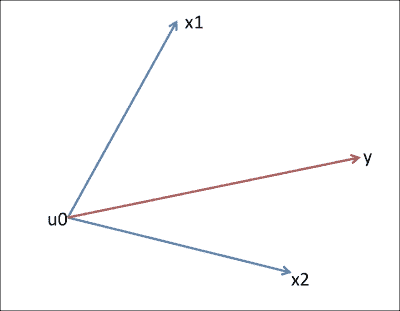
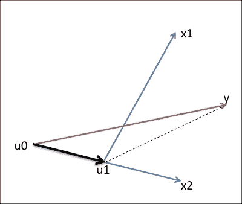
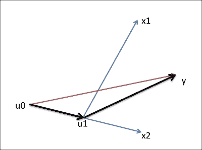
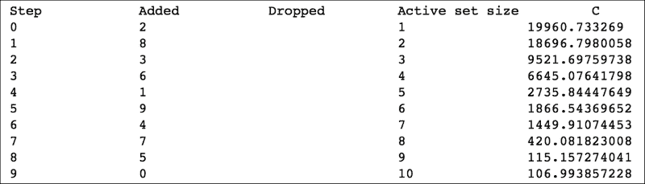
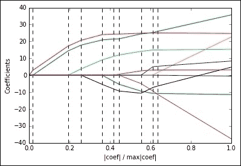
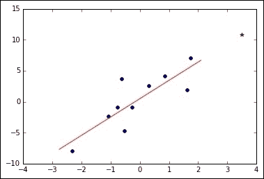
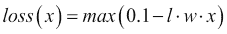
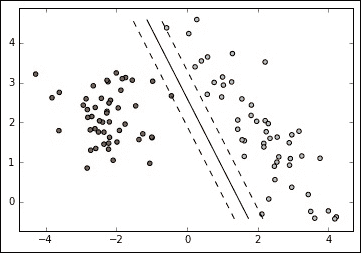
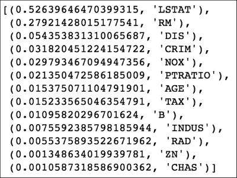
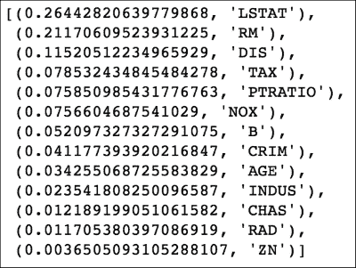

# 第八章. 高级回归方法

在本章中，我们将介绍一些高级回归方法。由于其中许多方法非常复杂，我们将跳过大多数数学公式，而是提供技术背后的思想以及一些实用建议，例如解释何时以及何时不使用该技术。我们将举例说明：

+   最小角度回归（LARS）

+   贝叶斯回归

+   使用 hinge loss 的 SGD 分类（注意这不是一个回归器，而是一个分类器）

+   回归树

+   回归器的集成（袋装和提升）

+   使用最小角度偏差的梯度提升回归器

# 最小角度回归

尽管与 Lasso（在第六章 Chapter 6 中看到）非常相似，但最小角度回归（或简称 LARS）是一种回归算法，它以快速和智能的方式选择模型中使用的最佳特征，即使它们彼此之间非常相关。LARS 是前向选择算法（也称为前向逐步回归）和前向分步回归算法的演变。

这是前向选择算法的工作原理，基于所有变量（包括目标变量）都已被先前归一化的假设：

1.  对于一个问题的所有可能的预测因子中，与目标变量 *y* 具有最大绝对相关性的那个被选中（即具有最大解释能力的那个）。让我们称它为 *p[1]*。

1.  所有其他预测因子现在都投影到 *p[1]* 最小角度回归上，并移除投影，创建一个与 *p[1]* 正交的残差向量。

1.  第一步在残差向量上重复进行，并再次选择相关性最高的预测因子。让我们称它为 *p²* 并应用下标。

1.  第二步重复进行，使用 *p[2]*，创建一个与 *p[2]*（以及 *p[1]*）正交的残差向量。

1.  此过程持续进行，直到预测令人满意，或者当最大绝对相关性低于设定的阈值。在每次迭代后，将一个新的预测因子添加到预测因子列表中，残差与它们都正交。

这种方法并不非常受欢迎，因为它由于其极端贪婪的方法存在严重的限制；然而，它相当快。现在让我们考虑我们有一个具有两个高度相关变量的回归问题。在这个数据集上，前向选择将基于第一个或第二个变量选择预测因子，然后，由于残差将非常低，将在远晚的步骤中重新考虑另一个变量（最终，永远不会）。这一事实将导致模型上的过拟合问题。如果两个高度相关的变量一起被选中，平衡新的预测因子，不是更好吗？这正是前向分步回归算法的核心思想，其中，在每一步中，最佳预测因子部分地添加到模型中。让我们在这里提供详细情况：

1.  在该模型中，每个特征都有一个关联权重为零——也就是说，对于每个特征 *i*，*w[i] = 0*。

1.  对于一个问题的所有可能的预测因子中，与目标变量 *y* 具有最大（绝对）相关性的那个部分添加到模型中——也就是说，在模型中，*w[i]* 的权重增加 *ε*。

1.  重复步骤 2，直到探索能力低于预定义的阈值。

与前向选择相比，这种方法有很大的改进，因为在相关特征的情况下，两者都将以相似权重出现在最终模型中。结果是很好的，但创建模型所需的巨大迭代次数是这个算法真正的大问题。再次，由于运行时间，这种方法变得不切实际。

LARS 算法的工作方式如下：

1.  在模型中，每个特征都有一个关联权重为零——也就是说，对于每个特征 *i*，*w[i] = 0*。

1.  对于一个问题的所有可能的预测因子中，与目标变量 *y* 具有最大（绝对）相关性的那个部分添加到模型中——也就是说，在模型中，*w[i]* 的权重增加 *ε*。

1.  继续增加 *w[i]*，直到任何其他预测因子（比如说 *j*）与残差向量的相关性等于当前预测因子的相关性。

1.  同时增加 *w[i]* 和 *w[j]*，直到另一个预测因子与残差向量的相关性等于当前预测因子的相关性。

1.  继续添加预测因子和权重，直到所有预测因子都在模型中，或者达到另一个终止标准，例如迭代次数。

这种解决方案能够组合最佳的前向选择和分步回归的部分，创建一个稳定、不太容易过拟合且快速的解决方案。在到达示例之前，你可能想知道为什么它被称为最小角度回归。答案非常简单：如果特征和输出在笛卡尔空间中表示为向量，在每次迭代中，LARS 都会将与残差向量最相关的变量包含在模型中，这是与残差产生最小角度的那个变量。实际上，整个过程可以直观地表达。

## LARS 的视觉展示



这里是视觉情况：两个预测因子（**x1**和**x2**），不一定正交，以及目标（**y**）。请注意，一开始，残差对应于目标。我们的模型从**u0**（所有权重都是*0*）开始。

然后，由于**x2**与残差之间的角度比**x1**小，我们开始向**x2**的方向*行走*，同时我们继续计算残差向量。现在，一个问题：我们应该在哪里停止？



我们应该在**u1**处停止，此时残差与**x1**之间的角度与残差与**x2**之间的角度相同。然后我们沿着**x1**和**x2**的合成方向前进，达到**y**。



## 代码示例

让我们现在在 Python 中使用 Diabetic 数据集来观察 LARS 的实际操作，该数据集包含 10 个数值变量（年龄、性别、体重、血压等），在 442 名患者身上测量，并在一年后显示疾病进展情况。首先，我们想可视化系数的权重路径。为此，`lars_path()`类对我们有所帮助（尤其是如果其训练是冗长的）：

```py
In:
%matplotlib inline
import matplotlib.pyplot as plt
import numpy as np

from sklearn import linear_model
from sklearn import datasets
from sklearn.preprocessing import StandardScaler

diabetes = datasets.load_diabetes()
X = StandardScaler().fit_transform(diabetes.data)
y = StandardScaler(with_mean=True, with_std=False) \
        .fit_transform(diabetes.target)

alphas, _, coefs = linear_model.lars_path(X, y, verbose=2)

xx = np.sum(np.abs(coefs.T), axis=1)
xx /= xx[-1]

plt.plot(xx, coefs.T)
ymin, ymax = plt.ylim()
plt.vlines(xx, ymin, ymax, linestyle='dashed')
plt.xlabel('|coef| / max|coef|')
plt.ylabel('Coefficients')
plt.axis('tight')
plt.show()

Out:
```



在输出表中，你可以看到模型中插入的第一个特征是数字 2，接着是数字 8，以此类推。在图像中，相反，你可以同时看到系数的值（彩色线条）和步骤（虚线线条）。记住，在每一步，一个系数变为非零，模型中的所有系数都是线性更新的。在图像的右侧，你可以找到权重的最终值。

这是查看 LARS 系数的图形方式；如果我们只需要回归器（正如我们在前面的章节中看到的），我们只需使用`Lars`类：

```py
In:
regr = linear_model.Lars()

regr.fit(X, y)

print("Coefficients are:", regr.coef_)
Out:
Coefficients are: 
[ -0.47623169 -11.40703082  24.72625713  15.42967916 -37.68035801
  22.67648701   4.80620008   8.422084    35.73471316   3.21661161]
```

如你所预期，回归对象可以使用`.fit`方法进行拟合，其权重（系数）正是之前截图中所显示的。为了获得模型的质量，与其他回归器类似，你可以使用 score 方法。关于训练数据，以下是评分输出：

```py
In:
print("R2 score is", regr.score(X,y))
Out:
R2 score is 0.517749425413
```

## LARS 总结

优点：

+   系数更新的智能方式产生了低过拟合

+   模型直观且易于解释

+   训练速度与 Forward Selection 相同

+   当特征数量与观测数量相当或更大时，它非常出色

缺点：

+   当特征数量非常大时，即特征数量远大于观测数量时，它可能工作得不是很好，因为在这种情况下，你很可能找到虚假的相关性

+   它不适用于非常嘈杂的特征

# 贝叶斯回归

贝叶斯回归与线性回归类似，如第三章《实际中的多重回归》中所述，但它不是预测一个值，而是预测其概率分布。让我们从一个例子开始：给定`X`，训练观察矩阵，和`y`，目标向量，线性回归创建一个模型（即一系列系数），该模型拟合与训练点具有最小误差的线。然后，当新的观察值到来时，模型应用于该点，并输出一个预测值。这就是线性回归的唯一输出，无法得出结论，该特定点的预测是否准确。让我们用一个非常简单的代码示例来说明：观察现象只有一个特征，观察的数量仅为`10`：

```py
In:
from sklearn.datasets import make_classification
from sklearn.datasets import make_regression

X, y = make_regression(n_samples=10, n_features=1, n_informative=1, noise=3, random_state=1)
```

现在，让我们拟合一个*经典*的线性回归模型，并尝试预测训练支持范围外的回归值（在这个简单示例中，我们预测一个`x`值是训练值最大值两倍的点的值）：

```py
In:
regr = linear_model.LinearRegression()
regr.fit(X, y)

test_x = 2*np.max(X)
pred_test_x = regr.predict(test_x)
pred_test_x
Out:
array([ 10.79983753])
```

现在我们来绘制训练点、拟合线和预测的测试点（图像最右侧的点）：

```py
In:
plt.scatter(X, y)
x_bounds = np.array([1.2*np.min(X), 1.2*np.max(X)]).reshape(-1, 1)
plt.plot(x_bounds, regr.predict(x_bounds) , 'r-')
plt.plot(test_x, pred_test_x, 'g*')
plt.show()
Out:
```



要有一个预测值的概率密度函数，我们应该从开始就改变假设和线性回归器中的某些步骤。由于这是一个高级算法，涉及的数学非常复杂，我们更愿意传达方法背后的思想，而不是展示一页又一页的数学公式。

首先，我们只能推断预测值的分布，如果每个变量都被建模为分布。实际上，这个模型中的权重被视为具有正态分布的随机变量，以零为中心（即球形的高斯分布）并且具有未知的方差（从数据中学习）。该算法施加的正则化与岭回归设置的正则化非常相似。

预测的输出是一个值（与线性回归完全一样）和一个方差值。使用该值作为均值，方差作为实际方差，我们就可以表示输出的概率分布：

```py
In:
regr = linear_model.BayesianRidge()
regr.fit(X, y)
Out:
BayesianRidge(alpha_1=1e-06, alpha_2=1e-06, compute_score=False, 
              copy_X=True, fit_intercept=True, lambda_1=1e-06, 
              lambda_2=1e-06, n_iter=300, normalize=False, 
              tol=0.001, verbose=False)
In:
from matplotlib.mlab import normpdf

mean = regr.predict(test_x)
stddev = regr.alpha_
plt_x = np.linspace(mean-3*stddev, mean+3*stddev,100)
plt.plot(plt_x, normpdf(plt_x, mean, stddev))
plt.show()
Out:
```


## 贝叶斯回归总结

优点：

+   对高斯噪声的鲁棒性

+   如果特征数量与观察数量相当，则非常好

缺点：

+   耗时

+   对变量施加的假设通常与实际情况相差甚远

# 使用 hinge 损失的 SGD 分类

在第四章 Chapter 4 中，*逻辑回归*，我们探讨了基于回归器的分类器，逻辑回归。其目标是拟合与一个点被分类为标签的概率相关的最佳概率函数。现在，算法的核心功能考虑了数据集的所有训练点：如果它只基于边界点呢？这正是线性 **支持向量机** (SVM) 分类器的情况，其中通过仅考虑接近分离边界的点来绘制线性决策平面。

除了在支撑向量（边界最近的点）上工作之外，SVM 还使用了一种新的决策损失，称为 **hinge**。以下是它的公式：



其中 t 是点 x 的预期标签，w 是分类器中的权重集。Hinge 损失有时也称为 **softmax**，因为它实际上是一个截断的最大值。在这个公式中，只使用了边界点（即支撑向量）。

在第一种情况下，这个函数虽然凸，但不可微，因此基于随机梯度下降（SGD）的方法在理论上是无效的。在实践中，由于它是一个连续函数，它有一个分段导数。这导致 SGD 可以在这个技术中被积极用于推导出快速和近似的解。

这里有一个 Python 中的例子：让我们使用 `SGDClassifier` 类（如第四章 Chapter 4 中所示），*逻辑回归*，并使用 `hinge` 损失，应用于从 `2` 个类别中抽取的 `100` 个点的数据集。通过这段代码，我们感兴趣的是看到分类器的决策边界和选择的支撑向量：

```py
In:
from sklearn.linear_model import SGDClassifier

# we create 50 separable points
X, y = make_classification(n_samples=100, n_features=2, 
                           n_informative=2, n_redundant=0,
                           n_clusters_per_class=1, class_sep=2, 
                           random_state=101)

# fit the model
clf = SGDClassifier(loss="hinge", n_iter=500, random_state=101, 
                    alpha=0.001)
clf.fit(X, y)

# plot the line, the points, and the nearest vectors to the plane
xx = np.linspace(np.min(X[:,0]), np.max(X[:,0]), 10)
yy = np.linspace(np.min(X[:,1]), np.max(X[:,1]), 10)

X1, X2 = np.meshgrid(xx, yy)
Z = np.empty(X1.shape)
for (i, j), val in np.ndenumerate(X1):
    x1 = val
    x2 = X2[i, j]
    p = clf.decision_function([[x1, x2]])
    Z[i, j] = p[0]
levels = [-1.0, 0.0, 1.0]
linestyles = ['dashed', 'solid', 'dashed']
plt.contour(X1, X2, Z, levels, colors='k', linestyles=linestyles)
plt.scatter(X[:, 0], X[:, 1], c=y, cmap=plt.cm.Paired)

plt.show()

Out:
```



图像展示了属于两个类别的点（左右两侧的点）和决策边界（类别之间的实线）。此外，它还包含两条虚线，它们连接每个类别的支撑向量（即这些线上的点是支撑向量）。决策边界简单地说是它们之间相同距离的线。

## 与逻辑回归的比较

逻辑回归学习者的目的是利用训练集的所有输入点，并输出一个概率。相反，带有铰链损失的 SGD 直接产生标签，并且只使用边界点来改进模型。它们的性能如何？让我们用一个具有 20 个特征（其中 5 个是有信息的，5 个是冗余的，10 个是随机的）和 10,000 个观察值的合成数据集进行测试。然后，我们将数据分为 70/30 作为训练集和测试集，并训练两个 SGD 分类器：一个带有铰链损失函数，另一个带有逻辑损失函数。最后，我们比较它们在测试集上的预测准确率：

```py
In:
from sklearn.cross_validation import train_test_split
from sklearn.metrics import accuracy_score

X, y = make_classification(n_samples=10000, n_features=20, 
                           n_informative=5, n_redundant=5,
                           n_clusters_per_class=2, class_sep=1,
                           random_state=101)

X_train, X_test, y_train, y_test =  train_test_split(
    X, y, test_size=0.3, random_state=101)

clf_1 = SGDClassifier(loss="hinge", random_state=101)
clf_1.fit(X_train, y_train)

clf_2 = SGDClassifier(loss="log", random_state=101)
clf_2.fit(X_train, y_train)

print('SVD            : ', accuracy_score(y_test, clf_1.predict(X_test)))
print('Log. Regression: ', accuracy_score(y_test, clf_2.predict(X_test)))
Out:
SVD            :  0.814333333333
Log. Regression:  0.756666666667
```

按照惯例，SVM 通常比逻辑回归更准确，但其性能并不出众。然而，SVM 在训练过程中的速度较慢；实际上，在训练时间方面，逻辑回归比 SVM 快 30% 以上。

```py
In:
%timeit clf_1.fit(X_train, y_train)  
Out:
100 loops, best of 3: 3.16 ms per loop
In:
%timeit clf_2.fit(X_train, y_train)
Out:
100 loops, best of 3: 4.86 ms per loop
```

## SVR

对于线性回归器/逻辑回归，即使 SVM 有回归对应物，称为 **支持向量回归器** (SVR)。它的数学公式非常长，超出了本书的范围。然而，由于它非常有效，我们认为描述它在实践中是如何工作的很重要，特别是应用于波士顿数据集并与线性回归模型进行比较：

```py
In:
from sklearn.svm import SVR
from sklearn.linear_model import SGDRegressor
from sklearn.metrics import mean_absolute_error
from sklearn.datasets import load_boston

boston = load_boston()
X = StandardScaler().fit_transform(boston['data'])
y = boston['target']

X_train, X_test, y_train, y_test =  train_test_split(
    X, y, test_size=0.3, random_state=101)

regr_1 = SVR(kernel='linear')
regr_1.fit(X_train, y_train)

regr_2 = SGDRegressor(random_state=101)
regr_2.fit(X_train, y_train)

print('SVR            : ', mean_absolute_error(y_test, regr_1.predict(X_test)))
print('Lin. Regression: ', mean_absolute_error(y_test, regr_2.predict(X_test)))
Out:
SVR            :  3.67434988716
Lin. Regression:  3.7487663498
```

## SVM 总结

优点如下：

+   可以使用 SGD 加速处理

+   输出通常比逻辑回归更准确（因为只有边界点在公式中）

缺点如下：

+   如果两个类别的点线性可分，则效果非常好，尽管对于非线性可分类别的扩展也是可用的。在这种情况下，尽管复杂性非常高，但结果通常仍然很好。

+   至于逻辑回归，它可以用于二分类问题。

# 回归树（CART）

一个非常常见的学习者，最近由于其速度而广泛使用，是回归树。它是一个非线性学习者，可以处理分类和数值特征，并且可以交替用于分类或回归；这就是为什么它通常被称为 **分类和回归树** (CART)。在本节中，我们将了解回归树是如何工作的。

树由一系列节点组成，这些节点将分支分成两个子节点。然后，每个分支都可以进入另一个节点，或者保持为叶子节点，带有预测值（或类别）。

从根节点（即整个数据集）开始：

1.  同时确定用于分割数据集的最佳特征*F1*以及最佳分割值。如果特征是数值型，分割值是一个阈值*T1*：在这种情况下，左子节点分支将是*F1*低于*T1*的观测值的集合，而右子节点分支是*F1*大于或等于*T1*的观测值的集合。如果特征是分类型，分割是在子集*S1*上进行的：*F1*特征属于这些级别的观测值组成左子节点分支，其余的观测值组成右子节点分支。

1.  然后该操作（独立地）对每个分支再次运行，递归地，直到没有更多分裂的机会。

1.  当分裂完成后，会创建一个叶子节点。叶子表示输出值。

你可以立即看到预测是即时的：你只需从根节点遍历到叶子节点，并在每个节点检查一个特征是否低于（或不低于）一个阈值，或者，是否有值在（或不在）一个集合内。

作为总结，我们讨论如何定义最佳的分割特征。关于最佳值或子集呢？对于回归树，我们使用方差减少的标准：在每个节点，对所有特征以及在该特征的所有值或级别进行广泛搜索。选择能够实现左右分支相对于输入集最佳方差组合，并将其标记为*最佳*。

注意，回归树为每个节点决定最优分割。这种局部优化方法不幸地导致次优结果。此外，建议对回归树进行剪枝；也就是说，你应该移除一些叶子节点以防止过拟合（例如，通过设置方差减少测量的最小阈值）。这就是回归树的缺点。另一方面，它们在某种程度上是准确的，并且相对快速地进行训练和测试。

在代码中，回归树与其他回归器一样简单：

```py
In:
from sklearn.tree import DecisionTreeRegressor

regr = DecisionTreeRegressor(random_state=101)
regr.fit(X_train, y_train)

mean_absolute_error(y_test, regr.predict(X_test))
Out:
3.2842105263157895
```

## 回归树总结

优点：

+   它可以模拟非线性行为

+   非常适合分类特征和数值特征，无需归一化

+   分类和回归使用相同的方法

+   快速训练，快速预测时间，内存占用小

缺点：

+   随机算法：它不优化完整解，只优化最佳选择。

+   当特征数量很多时，效果不佳。

+   叶子可以非常具体。在这种情况下，我们需要“剪枝树”，移除一些节点。

# Bagging 和 boosting

Bagging 和 boosting 是两种用于结合学习者的技术。这些技术被归类为通用名称**集成**（或元算法），因为最终目标实际上是将**弱**学习者集成起来，以创建一个更复杂但更准确的模型。弱学习者的定义并不正式，但理想情况下，它是一个快速、有时是线性的模型，不一定产生优秀的结果（只要它们比随机猜测好就足够了）。最终的集成通常是具有非线性学习者的模型，其性能随着模型中弱学习者数量的增加而提高（注意，这种关系是严格非线性的）。现在让我们看看它们是如何工作的。

## Bagging

Bagging 代表**Bootstrap Aggregating**，其最终目标是通过对弱学习者的结果进行平均来减少方差。现在让我们看看代码；我们将解释它是如何工作的。作为一个数据集，我们将重用之前示例中的波士顿数据集（及其验证分割）：

```py
In:
from sklearn.ensemble import BaggingRegressor
bagging = BaggingRegressor(SGDRegressor(), n_jobs=-1,
                           n_estimators=1000, random_state=101,
                           max_features=0.8)
bagging.fit(X_train, y_train)
mean_absolute_error(y_test, bagging.predict(X_test))
Out:
3.8345485952100629
```

Scikit-learn 的`BaggingRegressor`类是创建 Bagging 回归器的基类。它需要弱学习者（在示例中，它是一个`SGDRegressor`），回归器的总数（1,000），以及每个回归器中要使用的最大特征数（总数的 80%）。然后，Bagging 学习者就像之前看到的其他学习者一样，通过 fit 方法进行训练。在这个阶段，对于每个弱学习者：

+   X 训练数据集组成特征的 80%是随机选择的

+   弱学习者在训练集的替换样本的 bootstrap 上仅针对选定的特征进行训练

最后，Bagging 模型包含 1,000 个训练好的`SGDRegressors`。当从集成请求预测时，每个弱学习者都会做出预测，然后对结果进行平均，产生集成预测。

请注意，训练和预测操作都是针对弱学习者的；因此，它们可以在多个 CPU 上并行化（这就是为什么示例中的`n_jobs`是`-1`的原因；即，我们使用所有核心）。

最终结果，从 MAE 的角度来看，应该比单个`SGDRegressor`更好；另一方面，模型大约复杂了 1,000 倍。

通常，集成与决策树或回归树相关联。在这种情况下，回归集成的名称变为随机森林回归器（即，由多个树组成的森林）。由于这种技术通常用作*默认*的 Bagging 集成，Scikit-learn 中有一个专门的类：

```py
In:
from sklearn.ensemble import RandomForestRegressor

regr = RandomForestRegressor(n_estimators=100, 
                             n_jobs=-1, random_state=101)
regr.fit(X_train, y_train)
mean_absolute_error(y_test, regr.predict(X_test))
Out:
2.6412236842105261
```

随机森林的一个额外特性是它们能够对模型中的特征重要性进行排序（即，它们检测哪些特征产生了预测变量的最高变异）。以下是代码；请始终记住首先对特征矩阵进行归一化（我们已经在上一节中这样做过了）：

```py
In:
sorted(zip(regr.feature_importances_, boston['feature_names']),
       key=lambda x: -x[0])
Out:
```



列表按从最重要的特征到最不重要的特征排序（对于这个集成）。如果你更改弱学习者或任何其他参数，这个列表可能会改变。

## 提升

提升是一种结合（集成）弱学习者的方法，主要是为了减少预测偏差。与袋装不同，提升产生了一系列的预测者，其中每个输出都是下一个学习者的输入。我们将从一个例子开始，就像我们在前面的子节中做的那样：

```py
In:
from sklearn.ensemble import AdaBoostRegressor
booster = AdaBoostRegressor(SGDRegressor(), random_state=101,
                            n_estimators=100, learning_rate=0.01)

booster.fit(X_train, y_train)
mean_absolute_error(y_test, booster.predict(X_test))
Out:
3.8621128094354349
```

来自 Scikit-learn 的 `submodule` 集成中的 `AdaBoostRegressor` 类是创建提升回归器的基类。至于袋装，它需要一个弱学习者（一个 `SGDRegressor`），回归器的总数（100），以及学习率（0.01）。从一个未拟合的集成开始，对于每个弱学习者，训练如下：

+   给定训练集，已经拟合好的学习者的级联产生了一个预测

+   实际值与预测值之间的误差，乘以学习率，被计算

+   在那个错误集上训练一个新的弱学习者，并将其插入到已经训练好的学习者的级联的最后阶段

在训练阶段结束时，集成包含 100 个训练好的 `SGDRegressors`，它们以级联的形式组织。当从集成请求预测时，最终值是一个递归操作：从最后阶段开始，输出值是前一个阶段的预测值加上学习率乘以当前阶段的预测值。

学习率类似于随机梯度下降中的学习率。较小的学习率需要更多步骤来接近结果，但输出将更精细。较大的学习率需要更少的步骤，但可能接近一个不太准确的结果。

请注意，由于训练和测试不能独立地对每个弱学习者进行，因为要训练一个模型你需要前一个输出链，所以这限制了 CPU 的使用仅限于一个，限制了级联的长度。

在使用决策/回归树进行提升的情况下，Scikit-learn 包提供了一个预构建的类，称为 `GradientBoostingRegressor`。一个简短的代码片段应该足以演示它是如何工作的：

```py
In:
from sklearn.ensemble import GradientBoostingRegressor

regr = GradientBoostingRegressor(n_estimators=500, 
                                 learning_rate=0.01, 
                                 random_state=101)
regr.fit(X_train, y_train)
mean_absolute_error(y_test, regr.predict(X_test))
Out:
2.6148878419996806
```

即使使用提升，也有可能对特征重要性进行排序。事实上，这正是相同的方法：

```py
In:
sorted(zip(regr.feature_importances_, boston['feature_names']),
       key=lambda x: -x[0])
Out:
```



## 集成总结

优点如下：

+   基于弱学习者的强学习者

+   它们使随机学习成为可能

+   过程的随机性产生了一个稳健的解决方案

缺点如下：

+   训练时间相当长，以及内存占用

+   在提升集成中，学习步骤（alpha）的设置可能非常棘手，类似于随机梯度下降中的更新步骤

# 带有 LAD 的梯度提升回归器

这不仅仅是一种新技术，它还是一种技术集合，这些技术已经在本书中出现过，并引入了一个新的损失函数，即**最小绝对偏差**（LAD）。与之前章节中提到的最小二乘函数相比，使用 LAD 计算误差的 L1 范数。

基于 LAD 的回归学习器通常是鲁棒的但不够稳定，因为损失函数存在多个最小值（因此导致多个最佳解）。单独来看，这个损失函数似乎价值不大，但与梯度提升相结合，它创建了一个非常稳定的回归器，因为提升算法克服了 LAD 回归的限制。通过代码，这非常简单实现：

```py
In:
from sklearn.ensemble import GradientBoostingRegressor

regr = GradientBoostingRegressor('lad',
                                 n_estimators=500, 
                                 learning_rate=0.1, 
                                 random_state=101)
regr.fit(X_train, y_train)
mean_absolute_error(y_test, regr.predict(X_test))
Out:
2.6216986613160258
```

记得指定使用`'lad'`损失，否则默认使用最小二乘（L²）损失。此外，另一个损失函数`huber`结合了最小二乘损失和最小绝对偏差损失，创建了一个更加鲁棒的损失函数。要尝试它，只需在最后一段代码中插入字符串值`'huber'`代替`'lad'`。

## 基于 LAD 的 GBM 总结

优点是它结合了提升集成算法的强度与 LAD 损失，产生了一个非常稳定且鲁棒的学习者；缺点是训练时间非常高（与连续训练 N 个 LAD 学习器的时间完全相同）。

# 摘要

本章总结了我们在本书中关于回归方法的漫长旅程。我们看到了如何处理不同类型的回归建模，如何预处理数据，以及如何评估结果。在本章中，我们简要介绍了某些前沿技术。在下一章，也是最后一章中，我们将回归应用于现实世界的例子，并邀请您尝试一些具体的例子。
