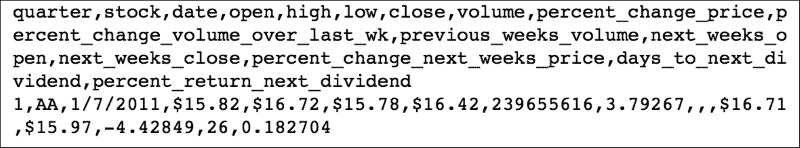
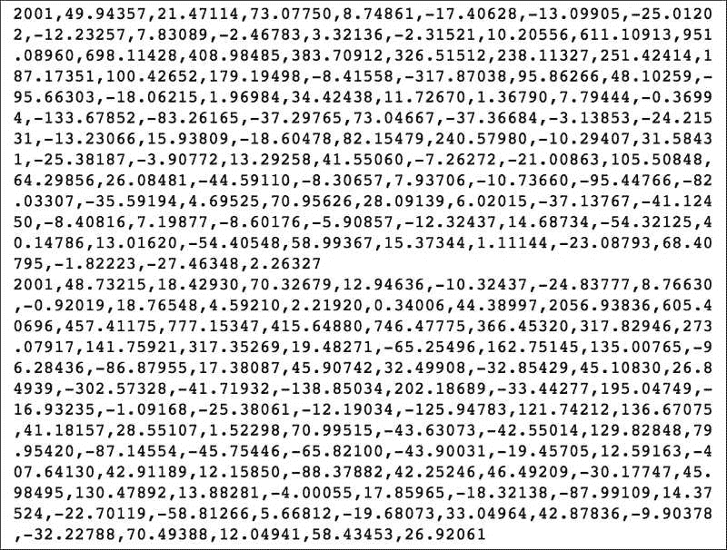
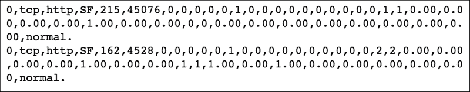
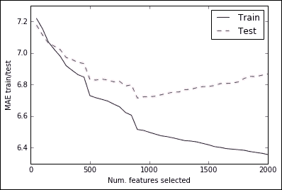
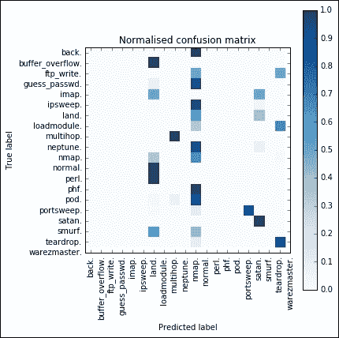
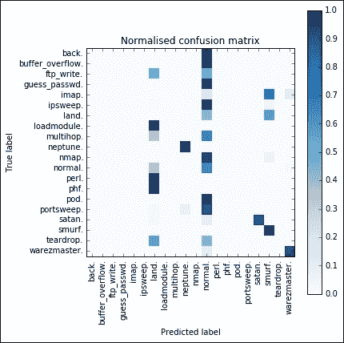
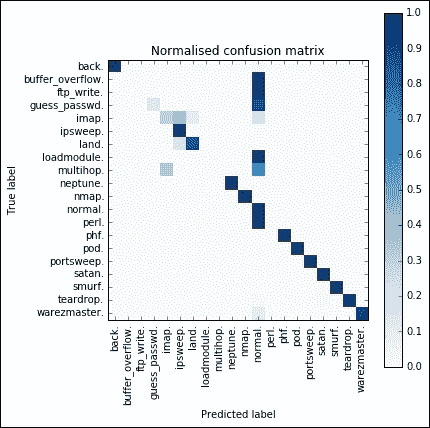
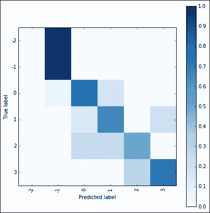
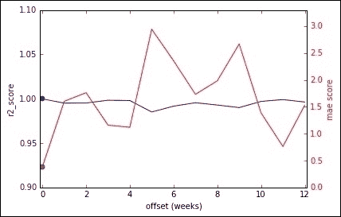
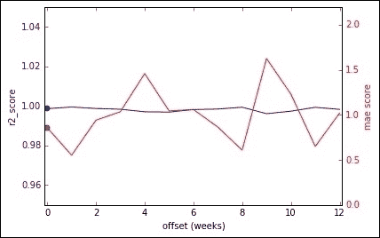

# 第九章。回归模型的实际应用

我们已经到达了本书的结尾章节。与前面的章节相比，本章在本质上非常实用，因为它主要包含大量代码，而没有数学或其他理论解释。它包括使用线性模型解决的实际数据科学问题的四个实例。最终目标是展示如何处理此类问题以及如何发展其解决方案背后的推理，以便它们可以作为类似挑战的蓝图使用。

对于每个问题，我们将描述要回答的问题，提供数据集的简要描述，并决定我们力求最大化的指标（或我们想要最小化的错误）。然后，在代码中，我们将提供成功完成每个问题的关键思想和直觉。此外，当运行代码时，模型将产生详细的输出，以便为读者提供决定下一步所需的所有信息。由于空间限制，输出将被截断，只包含关键行（截断的行在输出中用`[…]`表示），但在您的屏幕上，您将看到完整的画面。

### 小贴士

在本章中，每个部分都提供了一个独立的 IPython Notebook。它们是不同的问题，每个都是独立开发和展示的。

# 下载数据集

在本书的这一部分，我们将下载本章示例中将要使用的所有数据集。我们选择将它们存储在包含 IPython Notebook 的同一文件夹的单独子目录中。请注意，其中一些相当大（100+ MB）。

### 小贴士

我们要感谢 UCI 数据集存档的维护者和创建者。多亏了这样的存储库，建模和实现实验可重复性比以前容易得多。UCI 存档来自 Lichman, M. (2013)。UCI 机器学习仓库 [[`archive.ics.uci.edu/ml`](http://archive.ics.uci.edu/ml)]。加州大学欧文分校，信息与计算机科学学院，加州，欧文市。

对于每个数据集，我们首先下载它，然后展示前几行。首先，这有助于证明文件是否已正确下载、解包并放置在正确的位置；其次，它将展示文件本身的结构（标题、字段等）：

```py
In:
try:
    import urllib.request as urllib2
except:
    import urllib2
import requests, io, os
import zipfile, gzip

def download_from_UCI(UCI_url, dest):
    r = requests.get(UCI_url)
    filename = UCI_url.split('/')[-1]
    print ('Extracting in %s' %  dest)
    try:
        os.mkdir(dest)
    except:
        pass
    with open (os.path.join(dest, filename), 'wb') as fh:
        print ('\tdecompression %s' % filename)
        fh.write(r.content)

def unzip_from_UCI(UCI_url, dest):
    r = requests.get(UCI_url)
    z = zipfile.ZipFile(io.BytesIO(r.content))
    print ('Extracting in %s' %  dest)
    for name in z.namelist():
        print ('\tunzipping %s' % name)
        z.extract(name, path=dest)

def gzip_from_UCI(UCI_url, dest):
    response = urllib2.urlopen(UCI_url)
    compressed_file = io.BytesIO(response.read())
    decompressed_file = gzip.GzipFile(fileobj=compressed_file)
    filename = UCI_url.split('/')[-1][:-4]
    print ('Extracting in %s' %  dest)
    try:
        os.mkdir(dest)
    except:
        pass
    with open( os.path.join(dest, filename), 'wb') as outfile:
        print ('\tgunzipping %s' % filename)
        cnt = decompressed_file.read()
        outfile.write(cnt)
```

## 时间序列问题数据集

数据集来源：Brown, M. S., Pelosi, M. & Dirska, H. (2013)。用于道琼斯指数股票财务预测的动态半径物种保守遗传算法。模式识别中的机器学习和数据挖掘，7988，27-41。

```py
In:
UCI_url = 'https://archive.ics.uci.edu/ml/machine-learning-databases/00312/dow_jones_index.zip'
unzip_from_UCI(UCI_url, dest='./dji')
Out:
Extracting in ./dji
  unzipping dow_jones_index.data
  unzipping dow_jones_index.names
In:
! head -2 ./dji/dow_jones_index.data
Out:
```



## 回归问题数据集

数据集来源：Thierry Bertin-Mahieux, Daniel P.W. Ellis, Brian Whitman, 和 Paul Lamere. 《百万歌曲数据集》。在 2011 年第 12 届国际音乐信息检索学会（ISMIR）会议论文集中。

```py
In:
UCI_url = 'https://archive.ics.uci.edu/ml/machine-learning-databases/00203/YearPredictionMSD.txt.zip'
unzip_from_UCI(UCI_url, dest='./msd')
Out:
Extracting in ./msd
  unzipping YearPredictionMSD.txt
In:
! head -n 2 ./msd/YearPredictionMSD.txt
Out:
```



## 多类分类问题数据集

数据集来源：Salvatore J. Stolfo, Wei Fan, Wenke Lee, Andreas Prodromidis, 和 Philip K. Chan. 基于成本的建模与评估用于数据挖掘：应用于欺诈和入侵检测的 JAM 项目结果。

```py
In:
UCI_url = 'https://archive.ics.uci.edu/ml/machine-learning-databases/kddcup99-mld/kddcup.data.gz'
gzip_from_UCI(UCI_url, dest='./kdd')
Out:
Extracting in ./kdd
  gunzipping kddcup.dat
In:
!head -2 ./kdd/kddcup.dat
Out:
```



## 排名问题数据集

创建者/捐赠者：Jeffrey C. Schlimmer

```py
In:
UCI_url = 'https://archive.ics.uci.edu/ml/machine-learning-databases/autos/imports-85.data'
download_from_UCI(UCI_url, dest='./autos')
Out:
Extracting in ./autos
  decompression imports-85.data
In:
!head -2 ./autos/imports-85.data
Out:
```


# 回归问题

给定一些歌曲的描述符，这个问题的目标是预测歌曲的生产年份。这基本上是一个回归问题，因为要预测的目标变量是一个介于 1922 年和 2011 年之间的数字。

对于每首歌曲，除了生产年份外，还提供了 90 个属性。所有这些都与音色相关：其中 12 个与音色平均值相关，78 个属性描述了音色的协方差；所有特征都是数值（整数或浮点数）。

数据集由超过五十万个观测值组成。至于数据集背后的竞赛，作者尝试使用前 463,715 个观测值作为训练集，剩余的 51,630 个用于测试。

用于评估结果的指标是预测年份与测试集中歌曲的实际生产年份之间的**平均绝对误差**（**MAE**）。目标是使误差度量最小化。

### 注意

这个问题的完整描述和附加信息（关于特征提取阶段）可以在以下网站上找到：[`archive.ics.uci.edu/ml/datasets/YearPredictionMSD`](https://archive.ics.uci.edu/ml/datasets/YearPredictionMSD)

现在，让我们从一些 Python 代码开始。首先，我们加载数据集（记住，如果这个操作失败，意味着你应在运行上一节中的程序之前自行下载数据集）。然后，我们根据数据集提供的指南分割训练和测试部分。最后，我们打印出结果 DataFrame 的大小（以兆字节为单位），以便了解数据集的内存占用情况：

```py
In:
import matplotlib.pyplot as plt
%matplotlib inline  

import numpy as np
import pandas as pd

dataset = pd.read_csv('./msd/YearPredictionMSD.txt', 
                      header=None).as_matrix()
In:
X_train = dataset[:463715, 1:]
y_train = np.asarray(dataset[:463715, 0])

X_test = dataset[463715:, 1:]
y_test = np.asarray(dataset[463715:, 0])
In:
print("Dataset is MB:", dataset.nbytes/1E6)
del dataset
Out:
Dataset is MB: 375.17116
```

由于数据集接近 400 MB，因此它并不算特别小。因此，我们应该非常聪明地使用任何适当的技巧来处理它，以免耗尽内存（并且严重依赖交换文件）或甚至使我们的操作系统崩溃。

现在我们为比较设定一个基线：我们将使用普通的线性回归（vanilla 表示没有额外的风味；就像普通的冰淇淋一样，我们的模型使用标准的超参数）。然后我们打印训练时间（以秒为单位），训练集的 MAE 和测试集的 MAE：

```py
In:
from sklearn.linear_model import LinearRegression, SGDRegressor
from sklearn.cross_validation import KFold
from sklearn.metrics import mean_absolute_error
import time
In:
regr = LinearRegression()

tic = time.clock()
regr.fit(X_train, y_train)
print("Training time [s]:", time.clock()-tic)

print("MAE train set:", mean_absolute_error(y_train, 
                                  regr.predict(X_train)))

print("MAE test set:", mean_absolute_error(y_test, 
                                  regr.predict(X_test)))
Out:
Training time [s]: 9.989145000000002
MAE train set: 6.79557016727
MAE test set: 6.80049646319
```

使用线性回归，我们可以在大约 10 秒内实现 6.8 的 MAE。此外，学习器似乎稳定且健壮，因为训练集和测试集的 MAE 之间没有差异（归功于线性回归的泛化能力）。现在让我们尝试做得更好。我们测试了一种随机梯度下降的变化，看看我们是否能够更快地实现更好的 MAE（最终）。我们尝试了少量和大量迭代：

```py
In:
regr = SGDRegressor()

tic = time.clock()
regr.fit(X_train, y_train)
print("Training time [s]:", time.clock()-tic)

print("MAE train set:", mean_absolute_error(y_train, 
                                  regr.predict(X_train)))

print("MAE test set:", mean_absolute_error(y_test, 
                                  regr.predict(X_test)))
Out:
Training time [s]: 1.5492949999999972
MAE train set: 3.27482912145e+15
MAE test set: 3.30350427822e+15
In:
regr = SGDRegressor(n_iter=100)

tic = time.clock()
regr.fit(X_train, y_train)
print("Training time [s]:", time.clock()-tic)

print("MAE train set:", mean_absolute_error(y_train, 
                                  regr.predict(X_train)))

print("MAE test set:", mean_absolute_error(y_test, 
                                  regr.predict(X_test)))
Out:
Training time [s]: 24.713879
MAE train set: 2.12094618827e+15
MAE test set: 2.14161266897e+15
```

结果似乎表明，随机梯度下降回归不适用于数据集的形状：要获得更好的结果可能需要极大的毅力，并且需要非常长的时间。

现在，我们有两种选择：第一种是求助于高级分类器（如集成分类器）；否则，我们可以通过特征工程微调模型。对于这个问题，让我们选择第二种选择，因为本书的主要目标是研究线性模型。强烈建议读者尝试第一种方法进行比较。

现在我们尝试使用特征的多项式展开，然后进行特征选择步骤。这确保了我们拥有所有基于问题特征构建的特征，以便选择最佳特征并通过线性回归器运行。

由于我们事先不知道最佳特征数量，让我们将其视为一个参数，并绘制训练集和测试集的 MAE 作为变量。此外，由于我们正在进行回归任务，特征选择应该针对最佳的回归特征；因此，使用回归的 F 分数来对和选择前 K 个特征进行排序。

我们立即遇到了一个问题：多项式特征扩展创建了如此多的额外特征。由于我们在处理一个非常大的数据集，我们可能不得不对训练集进行子采样。让我们首先计算多项式扩展后的特征数量：

```py
In:
from sklearn.preprocessing import PolynomialFeatures
PolynomialFeatures().fit_transform(X_train[:10,:]).shape[1]
Out:
4186
```

当特征超过 4,000 个时，我们应该选择至少多 10 倍的数据观察，以避免过度拟合的风险。我们打乱数据集，并选择其十二分之一（因此观察数量约为 40,000）。为了管理这一点，我们可以使用 K 折交叉验证，并仅选择第一部分的测试集索引：

```py
In:
from sklearn.pipeline import Pipeline
from sklearn import feature_selection
from sklearn.feature_selection import SelectKBest
import gc

folds = 12
train_idx = list(KFold(X_train.shape[0], folds, random_state=101, shuffle=True))[0][1]

to_plot = []

for k_feat in range(50, 2001, 50):

    gc.collect()

    print('---------------------------')
    print("K = ", k_feat)

    poly = PolynomialFeatures()
    regr = LinearRegression()
    f_sel = SelectKBest(feature_selection.f_regression, k=k_feat)

    pipeline = Pipeline([('poly', poly), ('f_sel', f_sel), ('regr', regr)])

    tic = time.clock()
    pipeline.fit(X_train[train_idx], y_train[train_idx])
    print("Training time [s]:", time.clock()-tic)

    mae_train = mean_absolute_error(y_train[train_idx], pipeline.predict(X_train[train_idx]))
    mae_test = mean_absolute_error(y_test, pipeline.predict(X_test))

    print("MAE train set:", mae_train)

    print("MAE test set:", mae_test)

    to_plot.append((k_feat, mae_train, mae_test))
Out:
...[output]...
In:
plt.plot([x[0] for x in to_plot], [x[1] for x in to_plot], 'b', label='Train')
plt.plot([x[0] for x in to_plot], [x[2] for x in to_plot], 'r--', label='Test')
plt.xlabel('Num. features selected')
plt.ylabel('MAE train/test')
plt.legend(loc=0)

plt.show()
Out:
```



似乎我们已经找到了 K 的最佳值，即所选特征的数量，在 K=900。在这个时候：

+   训练集的 MAE 和测试集的 MAE 发生了分歧：如果我们使用超过 900 个特征，我们可能开始过度拟合。

+   测试集的 MAE 达到了最低点。测试集 MAE 的读数为 6.70。

+   这是性能和训练时间之间最佳的交易（23 秒）。

如果你有一台更好的机器（具有 16GB 或更多 RAM），你可以重新运行最后两个单元格，增加训练集的大小（例如，将折数从 12 改为 8 或 4）。结果应该会提高几个小数位，尽管训练会变得更长。

## 测试分类器而不是回归器

作为一个问题（我们不提供解决方案），我们可以将这个问题作为一个分类任务来解决，因为目标变量的数量“仅仅”是 89（虽然这比大多数分类问题都要多）。沿着这条路径，你将遇到不同类型的问题（在分类问题中 MAE 被错误地定义了）。我们鼓励读者尝试一下，并尝试将我们获得的结果与回归学习者的结果相匹配；这里是第一步：

```py
In:
print(np.unique(np.ascontiguousarray(y_train)))
print(len(np.unique(np.ascontiguousarray(y_train))))
Out:
[ 1922\.  1924\.  1925\.  1926\.  1927\.  1928\.  1929\.  1930\.  1931\.  1932.
  1933\.  1934\.  1935\.  1936\.  1937\.  1938\.  1939\.  1940\.  1941\.  1942.
  1943\.  1944\.  1945\.  1946\.  1947\.  1948\.  1949\.  1950\.  1951\.  1952.
  1953\.  1954\.  1955\.  1956\.  1957\.  1958\.  1959\.  1960\.  1961\.  1962.
  1963\.  1964\.  1965\.  1966\.  1967\.  1968\.  1969\.  1970\.  1971\.  1972.
  1973\.  1974\.  1975\.  1976\.  1977\.  1978\.  1979\.  1980\.  1981\.  1982.
  1983\.  1984\.  1985\.  1986\.  1987\.  1988\.  1989\.  1990\.  1991\.  1992.
  1993\.  1994\.  1995\.  1996\.  1997\.  1998\.  1999\.  2000\.  2001\.  2002.
  2003\.  2004\.  2005\.  2006\.  2007\.  2008\.  2009\.  2010\.  2011.]
89
In:
from sklearn.linear_model import SGDClassifier
regr = SGDClassifier('log', random_state=101)

tic = time.clock()
regr.fit(X_train, y_train)
print("Training time [s]:", time.clock()-tic)

print("MAE train set:", mean_absolute_error(y_train, 
                                  regr.predict(X_train)))

print("MAE test set:", mean_absolute_error(y_test, 
                                  regr.predict(X_test)))
Out:
Training time [s]: 117.23069399999986 
MAE train set: 7.88104546974 
MAE test set: 7.7926593066
```

# 一个不平衡的多类分类问题

给定一个从连接到互联网的主机流向/来自的包序列的描述，这个问题的目标是检测该序列是否表示恶意攻击。如果是，我们还应该对攻击类型进行分类。这是一个多类分类问题，因为可能的标签有多个。

对于每个观测，揭示了 42 个特征：请注意，其中一些是分类的，而其他的是数值的。数据集由近 500 万个观测组成（但在本练习中我们只使用前 100 万个，以避免内存限制），可能的标签数量为 23。其中之一代表非恶意情况（*正常*）；其余的代表了 22 种不同的网络攻击。应该注意，响应类别的频率是不平衡的：对于某些攻击有多个观测，而对于其他攻击则只有几个。

没有提供关于如何分割训练/测试集或如何评估结果的具体说明。在这个问题中，我们将采用探索性目标：尝试为所有标签揭示准确的信息。我们强烈建议读者采取一些额外步骤，调整学习器以最大化检测恶意活动的精确度。

### 注意

该问题的完整描述可以在网站上找到：[`archive.ics.uci.edu/ml/datasets/KDD+Cup+1999+Data`](https://archive.ics.uci.edu/ml/datasets/KDD+Cup+1999+Data).

首先，让我们加载数据。该文件不包含标题；因此，在用 pandas 加载时，我们必须指定列名：

```py
In:
import matplotlib.pyplot as plt
%matplotlib inline  
import matplotlib.pylab as pylab

import numpy as np
import pandas as pd

columns = ["duration", "protocol_type", "service", 
           "flag", "src_bytes", "dst_bytes", "land", 
           "wrong_fragment", "urgent", "hot", "num_failed_logins", 
           "logged_in", "num_compromised", "root_shell", 
           "su_attempted", "num_root", "num_file_creations", 
           "num_shells", "num_access_files", "num_outbound_cmds", 
           "is_host_login", "is_guest_login", "count", "srv_count", 
           "serror_rate", "srv_serror_rate", "rerror_rate", 
           "srv_rerror_rate", "same_srv_rate", "diff_srv_rate", 
           "srv_diff_host_rate", "dst_host_count", 
           "dst_host_srv_count", "dst_host_same_srv_rate", 
           "dst_host_diff_srv_rate", "dst_host_same_src_port_rate", 
           "dst_host_srv_diff_host_rate", "dst_host_serror_rate", 
           "dst_host_srv_serror_rate", "dst_host_rerror_rate", 
           "dst_host_srv_rerror_rate", "outcome"]

dataset = pd.read_csv('./kdd/kddcup.dat', names=columns, nrows=1000000)
```

现在我们来检查加载的数据集的前几行（为了了解数据集的整体形状），其大小（以观测和特征计），以及特征类型（以区分分类和数值类型）：

```py
In:
print(dataset.head())
Out:
...[head of the dataset] ...
In:
dataset.shape
Out:
(1000000, 42)
In:
dataset.dtypes
Out:
duration                         int64 
protocol_type                   object 
service                         object
flag                            object
src_bytes                        int64 
dst_bytes                        int64 
land                             int64 
wrong_fragment                   int64
 urgent                          int64 
hot                              int64 
num_failed_logins                int64 
logged_in                        int64 
num_compromised                  int64 
root_shell                       int64 
su_attempted                     int64 
num_root                         int64 
num_file_creations               int64 
num_shells                       int64 
num_access_files                 int64 
num_outbound_cmds                int64 
is_host_login                    int64 
is_guest_login                   int64 
count                            int64 
srv_count                        int64 
serror_rate                    float64 
srv_serror_rate                float64 
rerror_rate                    float64 
srv_rerror_rate                float64 
same_srv_rate                  float64 
diff_srv_rate                  float64 
srv_diff_host_rate             float64 
dst_host_count                   int64 
dst_host_srv_count               int64 
dst_host_same_srv_rate         float64 
dst_host_diff_srv_rate         float64 
dst_host_same_src_port_rate    float64 
dst_host_srv_diff_host_rate    float64 
dst_host_serror_rate           float64 
dst_host_srv_serror_rate       float64 
dst_host_rerror_rate           float64 
dst_host_srv_rerror_rate       float64 
outcome                         object 
dtype: object
```

由于它有 1M 行和 42 列，其中一些是分类的，看起来我们正在处理一个非常大的数据集。现在，让我们将目标变量从特征中分离出来，用序数编码包含攻击名称的字符串。为此，我们可以使用`LabelEncoder`对象：

```py
In:
sorted(dataset['outcome'].unique())
Out:
['back.',  'buffer_overflow.',  'ftp_write.',  'guess_passwd.',  'imap.',  'ipsweep.',  'land.',  'loadmodule.',  'multihop.',  'neptune.',  'nmap.',  'normal.',  'perl.',  'phf.',  'pod.',  'portsweep.', 'satan.',  'smurf.', 'teardrop.', 'warezmaster.']
In:
from sklearn.preprocessing import LabelEncoder

labels_enc = LabelEncoder()

labels = labels_enc.fit_transform(dataset['outcome'])
labels_map = labels_enc.classes_
Out:
array(['back.', 'buffer_overflow.', 'ftp_write.', 'guess_passwd.', 'imap.', 'ipsweep.', 'land.', 'loadmodule.', 'multihop.', 'neptune.', 'nmap.', 'normal.', 'perl.', 'phf.', 'pod.', 'portsweep.', 'satan.', 'smurf.', 'teardrop.', 'warezmaster.'], dtype=object)
```

目标和变量现在在一个单独的数组中，编码为整数。现在让我们从数据集中删除目标列，并对所有分类特征进行独热编码。为此，我们可以简单地使用 Pandas 的`get_dummies`函数。因此，数据集的新形状因此更大，因为现在构成分类特征的每个级别都是一个二进制特征：

```py
In:
dataset.drop('outcome', axis=1, inplace=True)
In:
observations = pd.get_dummies(dataset, sparse=True)
del dataset
In:
observations.shape
Out:
(1000000, 118)
```

由于我们有许多可用的观察结果，并且许多类别只包含少量样本，我们可以对数据集进行洗牌并分成两部分：一部分用于训练，另一部分用于测试：

```py
In:
from sklearn.cross_validation import train_test_split

X_train, X_test, y_train, y_test = \
    train_test_split(observations.as_matrix(), labels,
                    train_size=0.5, random_state=101)

del observations
```

由于我们的任务具有探索性，现在让我们定义一个函数来打印按每个类别的发生次数归一化的混淆矩阵：

```py
In:
def plot_normalised_confusion_matrix(cm, labels_str, title='Normalised confusion matrix', cmap=plt.cm.Blues):
    pylab.rcParams['figure.figsize'] = (6.0, 6.0)
    cm_normalized = cm.astype('float') / cm.sum(axis=1)[:, np.newaxis]
    plt.imshow(cm_normalized, interpolation='nearest', cmap=cmap)
    plt.title(title)
    plt.colorbar()
    tick_marks = np.arange(len(labels_str))
    plt.xticks(tick_marks, labels_str, rotation=90)
    plt.yticks(tick_marks, labels_str)
    plt.tight_layout()
    plt.ylabel('True label')
    plt.xlabel('Predicted label')
    plt.show()
```

现在，让我们为这个任务创建一个基线。在这个第一步中，我们将使用一个简单的`SGDClassifier`，带有逻辑损失。对于训练集和测试集，我们将打印解决方案的整体准确率、归一化混淆矩阵和分类报告（包含每个类别的精确率、召回率、F1 分数和支持）。

```py
In:
from sklearn.linear_model import SGDClassifier
from sklearn.metrics import classification_report, accuracy_score, confusion_matrix

clf = SGDClassifier('log', random_state=101)
clf.fit(X_train, y_train)

y_train_pred = clf.predict(X_train)
y_test_pred = clf.predict(X_test)

print("TRAIN SET")
print("Accuracy:", accuracy_score(y_train, y_train_pred))

print("Confusion matrix:")
plot_normalised_confusion_matrix(confusion_matrix(y_train, y_train_pred), labels_map)

print("Classification report:")
print(classification_report(y_train, y_train_pred, target_names=labels_map))

print("TEST SET")
print("Accuracy:", accuracy_score(y_test, y_test_pred))

print("Confusion matrix:")
plot_normalised_confusion_matrix(confusion_matrix(y_test, y_test_pred), labels_map)

print("Classification report:")
print(classification_report(y_test, y_test_pred, target_names=labels_map))

Out:
TRAIN SET 
Accuracy: 0.781702 
Confusion matrix:
```



```py
Classification report:
                  precision    recall  f1-score   support

           back.       0.00      0.00      0.00      1005
buffer_overflow.       0.00      0.00      0.00         1
      ftp_write.       0.00      0.00      0.00         2
   guess_passwd.       0.00      0.00      0.00        30
           imap.       0.00      0.00      0.00         2
        ipsweep.       0.00      0.00      0.00      3730
           land.       0.00      0.00      0.00        10
     loadmodule.       0.00      0.00      0.00         3
       multihop.       1.00      1.00      1.00    102522
        neptune.       0.06      0.00      0.00      1149
           nmap.       0.96      0.64      0.77    281101
         normal.       0.00      0.00      0.00         1
           perl.       0.00      0.00      0.00         2
            phf.       0.00      0.00      0.00        22
            pod.       0.00      0.00      0.00      1437
      portsweep.       1.00      0.88      0.93      2698
          satan.       0.99      0.99      0.99    106165
          smurf.       0.00      0.00      0.00       110
       teardrop.       0.00      0.90      0.01        10

     avg / total       0.96      0.78      0.85    500000

TEST SET
Accuracy: 0.781338
Confusion matrix:
```



```py
Classification report:
                  precision    recall  f1-score   support

           back.       0.00      0.00      0.00       997
buffer_overflow.       0.00      0.00      0.00         4
      ftp_write.       0.00      0.00      0.00         6
   guess_passwd.       0.00      0.00      0.00        23
           imap.       0.00      0.00      0.00        10
        ipsweep.       0.00      0.00      0.00      3849
           land.       0.00      0.00      0.00         7
     loadmodule.       0.00      0.00      0.00         2
       multihop.       0.00      0.00      0.00         3
        neptune.       1.00      1.00      1.00    102293
           nmap.       0.05      0.00      0.00      1167
         normal.       0.96      0.64      0.77    281286
           perl.       0.00      0.00      0.00         1
            phf.       0.00      0.00      0.00         1
            pod.       0.00      0.00      0.00        18
      portsweep.       0.00      0.00      0.00      1345
          satan.       1.00      0.88      0.94      2691
          smurf.       0.99      1.00      0.99    106198
       teardrop.       0.00      0.00      0.00        89
    warezmaster.       0.00      0.90      0.01        10

     avg / total       0.96      0.78      0.85    500000
```

尽管输出非常长，但在这个基线中，一些要点立即显现：

+   准确率低（0.80），但分类对过拟合具有弹性。

+   混淆矩阵中只有两条垂直线。这表明在训练阶段，分类器只拟合了两个类别。不出所料，它们是最多的。

+   通过查看分类报告，你可以得出相同的结论（即类别不平衡影响了结果）：只有少数几个类别的得分不为零。

这种问题非常常见，当你尝试在一个严重不平衡的数据集上拟合线性学习器时会发生。现在，让我们尝试对小的类别进行过采样，并对最流行的类别进行子采样。在下面的函数中，我们实现了一个带有替换的 bootstrap 算法，其中每个类别在输出数据中至少有`min_samples_out`个观察结果，最多有`max_samples_out`个。这应该迫使学习算法以相似权重考虑所有类别。

```py
In:
import random
random.seed(101)

def sample_class_with_replacement(X, y, label, min_samples_out, max_samples_out):
    rows = np.where(y==label)[0]

    if len(rows) == 0:
        raise Exception

    n_estraction = min(max(len(rows), min_samples_out), max_samples_out)
    extracted = [random.choice(rows) for _ in range(n_estraction)]

    return extracted

train_idx = []

for label in np.unique(labels):
    try:
        idx = sample_class_with_replacement(X_train, y_train, label, 500, 20000)
        train_idx.extend(idx)
    except:
        pass

X_train_sampled_balanced = X_train[train_idx, :]
y_train_sampled_balanced = y_train[train_idx]
```

现在，我们可以尝试比基线做得更好，通过在这个修改后的（平衡的）训练集上训练学习器，然后将其应用于测试集：

```py
In:
from sklearn.linear_model import SGDClassifier
from sklearn.metrics import classification_report, accuracy_score
from sklearn.metrics import confusion_matrix

clf = SGDClassifier('log', random_state=101)
clf.fit(X_train_sampled_balanced, y_train_sampled_balanced)

y_train_pred = clf.predict(X_train_sampled_balanced)
y_test_pred = clf.predict(X_test)

print("TRAIN SET")
print("Accuracy:", accuracy_score(y_train_sampled_balanced, y_train_pred))

print("Confusion matrix:")
plot_normalised_confusion_matrix(confusion_matrix(
        y_train_sampled_balanced, y_train_pred), labels_map)

print("Classification report:")
print(classification_report(y_train_sampled_balanced, y_train_pred, target_names=labels_map))

print("TEST SET")
print("Accuracy:", accuracy_score(y_test, y_test_pred))

print("Confusion matrix:")
plot_normalised_confusion_matrix(confusion_matrix(y_test, y_test_pred), labels_map)

print("Classification report:")
print(classification_report(y_test, y_test_pred, target_names=labels_map))
Out:
TRAIN SET
Accuracy: 0.712668335121
[...]
TEST SET
Accuracy: 0.723616
[...]
```

结果表明我们正在朝着正确的方向前进。混淆矩阵看起来更接近对角线（这意味着行和列之间的匹配更多地发生在对角线上），测试集中的准确率提高到 0.72。现在让我们尝试一些值来实现超参数优化，并将分数提升到最大。为此，我们运行网格搜索交叉验证，使用三折：

```py
In:
from sklearn.grid_search import GridSearchCV

parameters = {
    'loss': ('log', 'hinge'),
    'alpha': [0.1, 0.01, 0.001, 0.0001]
}

clfgs = GridSearchCV(SGDClassifier(random_state=101, n_jobs=1),
                   param_grid=parameters,
                   cv=3,
                   n_jobs=1,
                   scoring='accuracy'
                  )
clfgs.fit(X_train_sampled_balanced, y_train_sampled_balanced)
clf = clfgs.best_estimator_

print(clfgs.best_estimator_)

y_train_pred = clf.predict(X_train_sampled_balanced)
y_test_pred = clf.predict(X_test)

print("TRAIN SET")
print("Accuracy:", accuracy_score(y_train_sampled_balanced, 
                                  y_train_pred))

print("Confusion matrix:")
plot_normalised_confusion_matrix(
    confusion_matrix(y_train_sampled_balanced, y_train_pred), 
    labels_map)

print("Classification report:")
print(classification_report(
        y_train_sampled_balanced, y_train_pred,
        target_names=labels_map))

print("TEST SET")
print("Accuracy:", accuracy_score(y_test, y_test_pred))

print("Confusion matrix:")
plot_normalised_confusion_matrix(
    confusion_matrix(y_test, y_test_pred), labels_map)

print("Classification report:")
print(classification_report(
        y_test, y_test_pred, target_names=labels_map))

Out:
TRAIN SET
Accuracy: 0.695202531813
[...]
TEST SET
Accuracy: 0.706034
[...]
```

虽然我们运行了网格搜索交叉验证，但结果看起来与之前的实验相同。我们现在尝试不同的方法：由于存在许多输出类别，让我们尝试使用`OneVsOne`策略：而不是为每个类别拟合一个分类器，我们为每一对类别拟合一个分类器。这应该会产生一个更准确、但训练时间更长的模型。即使在这里，每个学习器也是通过网格搜索和三折进行交叉验证的：

```py
In:
from sklearn.multiclass import OneVsOneClassifier
from sklearn.grid_search import GridSearchCV

parameters = {
    'estimator__loss': ('log', 'hinge'),
    'estimator__alpha': [1.0, 0.1, 0.01, 0.001, 0.0001, 0.00001]
}

clfgs = GridSearchCV(OneVsOneClassifier(SGDClassifier(random_state=101, n_jobs=1)),
                   param_grid=parameters,
                   cv=3,
                   n_jobs=1,
                   scoring='accuracy'
                  )
clfgs.fit(X_train_sampled_balanced, y_train_sampled_balanced)
clf = clfgs.best_estimator_

y_train_pred = clf.predict(X_train_sampled_balanced)
y_test_pred = clf.predict(X_test)

print("TRAIN SET")
print("Accuracy:", accuracy_score(y_train_sampled_balanced, y_train_pred))

print("Confusion matrix:")
plot_normalised_confusion_matrix(confusion_matrix(y_train_sampled_balanced, y_train_pred), labels_map)

print("Classification report:")
print(classification_report(y_train_sampled_balanced, y_train_pred, target_names=labels_map))

print("TEST SET")
print("Accuracy:", accuracy_score(y_test, y_test_pred))

print("Confusion matrix:")
plot_normalised_confusion_matrix(confusion_matrix(y_test, y_test_pred), labels_map)

print("Classification report:")
print(classification_report(y_test, y_test_pred, target_names=labels_map))
Out:
TRAIN SET
Accuracy: 0.846250612429
[...]
TEST SET
Accuracy: 0.905708
[...]
```

结果在训练集和测试集中都更好。现在让我们尝试使用逻辑回归而不是`SGDClassifier`：

```py
In:
from sklearn.linear_model import LogisticRegression

clf = OneVsOneClassifier(LogisticRegression(random_state=101, n_jobs=1))
clf.fit(X_train_sampled_balanced, y_train_sampled_balanced)

y_train_pred = clf.predict(X_train_sampled_balanced)
y_test_pred = clf.predict(X_test)

print("TRAIN SET")
print("Accuracy:", accuracy_score(y_train_sampled_balanced, 
                                  y_train_pred))

print("Confusion matrix:")
plot_normalised_confusion_matrix(
    confusion_matrix(y_train_sampled_balanced, y_train_pred), 
    labels_map)

print("Classification report:")
print(classification_report(
        y_train_sampled_balanced, y_train_pred,
        target_names=labels_map))

print("TEST SET")
print("Accuracy:", accuracy_score(y_test, y_test_pred))

print("Confusion matrix:")
plot_normalised_confusion_matrix(
    confusion_matrix(y_test, y_test_pred), labels_map)

print("Classification report:")
print(classification_report(
        y_test, y_test_pred, target_names=labels_map))

Out:
TRAIN SET
Accuracy: 0.985712204876
Confusion matrix:
```


```py
Classification report:
                  precision    recall  f1-score   support

           back.       1.00      0.98      0.99      1005
buffer_overflow.       1.00      1.00      1.00       500
      ftp_write.       1.00      1.00      1.00       500
   guess_passwd.       1.00      0.11      0.19       500
           imap.       1.00      1.00      1.00       500
        ipsweep.       1.00      0.99      1.00      3730
           land.       1.00      1.00      1.00       500
     loadmodule.       1.00      0.32      0.49       500
       multihop.       1.00      1.00      1.00     20000
        neptune.       0.91      1.00      0.95      1149
           nmap.       0.97      1.00      0.98     20000
         normal.       1.00      1.00      1.00       500
           perl.       1.00      1.00      1.00       500
            phf.       0.99      1.00      1.00       500
            pod.       1.00      1.00      1.00      1437
      portsweep.       0.98      1.00      0.99      2698
          satan.       1.00      1.00      1.00     20000
          smurf.       1.00      1.00      1.00       500
       teardrop.       0.55      0.83      0.66       500

     avg / total       0.99      0.99      0.98     75519

TEST SET
Accuracy: 0.996818
Confusion matrix:
```



```py
Classification report:
                  precision    recall  f1-score   support

           back.       1.00      0.98      0.99       997
buffer_overflow.       0.00      0.00      0.00         4
      ftp_write.       0.00      0.00      0.00         6
   guess_passwd.       1.00      0.13      0.23        23
           imap.       0.43      0.30      0.35        10
        ipsweep.       0.97      0.99      0.98      3849
           land.       0.38      0.86      0.52         7
     loadmodule.       0.00      0.00      0.00         2
       multihop.       0.00      0.00      0.00         3
        neptune.       1.00      1.00      1.00    102293
           nmap.       0.52      0.99      0.68      1167
         normal.       1.00      1.00      1.00    281286
           perl.       0.00      0.00      0.00         1
            phf.       0.17      1.00      0.29         1
            pod.       0.26      1.00      0.42        18
      portsweep.       0.96      0.99      0.98      1345
          satan.       0.96      1.00      0.98      2691
          smurf.       1.00      1.00      1.00    106198
       teardrop.       0.99      0.98      0.98        89
    warezmaster.       0.45      0.90      0.60        10

     avg / total       1.00      1.00      1.00    500000
```

结果看起来比基线和之前的解决方案都要好。事实上：

1.  在平衡的训练集上测量的准确率接近在测试集上记录的准确率。这确保了模型的泛化能力。

1.  混淆矩阵几乎是对角线。这意味着所有类别都已包含在拟合（和预测）阶段。

1.  对于许多类别，包括支持度较小的类别，精确率/召回率和 F1 分数都不是零。

在这个阶段，我们对解决方案感到满意。如果您想进一步挖掘并测试整个五百万数据集上的更多模型假设，现在是时候转向非线性分类器了。在这样做的时候，请提前注意获取预测所需的复杂性和运行时间（毕竟，您正在使用包含超过一亿个值的数据库）。

# 一个排名问题

给定一辆车及其价格的一些描述符，这个问题的目标是预测这辆车比其价格所表明的风险程度。保险行业的精算师称这个过程为*符号化*，结果是排名：+3 表示这辆车有风险；-3 表示它相当安全（尽管数据集中的最低值是-2）。

车辆的描述包括其各种特征（品牌、燃料类型、车身风格、长度等）的规格。此外，您还可以获得与其他车辆相比的价格和标准化损失（这代表每辆车每年平均损失的均值，针对一定范围内的所有车辆进行了标准化）。

数据集中有 205 辆车，特征数量为 25；其中一些是分类的，而另一些是数值的。此外，数据集明确指出存在一些缺失值，使用字符串`"?"`进行编码。

虽然目标并没有在演示页面上直接说明，但我们的任务是使*标签排名损失*最小化，这是一个衡量我们排名表现好坏的指标。这个分数是基于概率的，完美的排名会得到零损失。使用回归分数，如 MAE 或 MSE，对这个任务几乎没有相关性，因为预测必须是一个整数；同样，一个分类分数，如`accuracy`，也没有意义，因为它没有告诉我们我们离完美解决方案有多远。我们将在代码中看到的另一个分数是**标签排名平均精度**（**LRAP**）。在这种情况下，完美的排名输出得分为一（与分类中的精确度意义相同）。有关这些指标的更多信息，请参阅 Scikit-learn 网站：[`scikit-learn.org/stable/modules/model_evaluation.html`](http://scikit-learn.org/stable/modules/model_evaluation.html)或 2009 年在神经信息处理系统会议（Advances in Neural Information Processing Systems Conference）上提出的*学习排名中的排名度量与损失函数*论文。

这个问题的完整描述可以在：[`archive.ics.uci.edu/ml/datasets/Automobile`](https://archive.ics.uci.edu/ml/datasets/Automobile)找到。

首先，让我们加载数据。CSV 文件没有标题；因此我们将手动设置列名。此外，由于数据集的作者已经发布了信息，所有的`"?"`字符串都将被处理为缺失数据，即 Pandas `NaN`值：

```py
In:
import matplotlib.pyplot as plt
%matplotlib inline  
import matplotlib.pylab as pylab

import numpy as np
import pandas as pd

columns = ["symboling","normalized-losses","make","fuel-type",
           "aspiration","num-of-doors","body-style","drive-wheels",
           "engine-location","wheel-base","length","width","height",
           "curb-weight","engine-type","num-of-cylinders",
           "engine-size","fuel-system","bore","stroke",
           "compression-ratio","horsepower","peak-rpm","city-mpg",
           "highway-mpg","price"]

dataset = pd.read_csv('./autos/imports-85.data', 
                       na_values="?", names=columns)
```

尽管这不能保证一切完美，但让我们先看看数据集的前几行。在这里，我们可以识别出缺失的数据（包含`NaN`值）并了解哪些特征是分类的，哪些是数值的：

```py
In:
print(dataset.head())
Out:
   symboling  normalized-losses         make fuel-type aspiration  \
0          3                NaN  alfa-romero       gas        std   
1          3                NaN  alfa-romero       gas        std   
2          1                NaN  alfa-romero       gas        std   
3          2                164         audi       gas        std   
4          2                164         audi       gas        std   

  num-of-doors   body-style drive-wheels engine-location  wheel-base  ...    \
0          two  convertible          rwd           front        88.6  ...     
1          two  convertible          rwd           front        88.6  ...     
2          two    hatchback          rwd           front        94.5  ...     
3         four        sedan          fwd           front        99.8  ...     
4         four        sedan          4wd           front        99.4  ...     

   engine-size  fuel-system  bore  stroke compression-ratio horsepower  \
0          130         mpfi  3.47    2.68                 9        111   
1          130         mpfi  3.47    2.68                 9        111   
2          152         mpfi  2.68    3.47                 9        154   
3          109         mpfi  3.19    3.40                10        102   
4          136         mpfi  3.19    3.40                 8        115   

   peak-rpm city-mpg  highway-mpg  price  
0      5000       21           27  13495  
1      5000       21           27  16500  
2      5000       19           26  16500  
3      5500       24           30  13950  
4      5500       18           22  17450  

[5 rows x 26 columns]
In:
dataset.dtypes
Out:
symboling              int64
normalized-losses    float64
make                  object
fuel-type             object
aspiration            object
num-of-doors          object
body-style            object
drive-wheels          object
engine-location       object
wheel-base           float64
length               float64
width                float64
height               float64
curb-weight            int64
engine-type           object
num-of-cylinders      object
engine-size            int64
fuel-system           object
bore                 float64
stroke               float64
compression-ratio    float64
horsepower           float64
peak-rpm             float64
city-mpg               int64
highway-mpg            int64
price                float64
dtype: object
```

看起来我们有很多分类特征。在这里，我们必须仔细考虑要做什么。数据集只包含 205 个观测值；因此，将所有分类特征转换为虚拟特征并不是一个好主意（我们可能会得到比观测值更多的特征）。让我们尽量保守地创建特征的数量。仔细检查特征，我们可以采用以下方法：

1.  一些分类特征实际上是（冗长的）数值：它们包含表示数量的数字。对于这些，我们只需要将单词映射到数字。在这种情况下，不需要创建额外的特征。

1.  一些其他分类特征实际上是二元的（两扇门对四扇门，柴油对汽油等）。对于这些，我们可以将两个级别映射到不同的值（0 和 1）。即使在这里，我们也不需要创建额外的特征。

1.  所有剩余的都应该进行虚拟编码。

这个过程在下面的单元格中展示。为了创建第一个映射，我们简单地使用 Pandas 提供的`map`方法。对于第二个映射，我们使用 Scikit-learn 提供的`LabelEncoder`对象；对于最后一个，我们使用前面示例中看到的`get_dummies`函数：

```py
In:
from sklearn.preprocessing import LabelEncoder

words_to_nums = {'two':2, 'three':3, 'four':4, 'five':5, 
                 'six':6, 'eight':8, 'twelve':12}

columns_to_map = ['num-of-cylinders', 'num-of-doors']
columns_to_dummy = ['make', 'body-style', 'drive-wheels', 
                    'engine-type', 'fuel-system']
columns_to_label_encode = ['fuel-type', 'aspiration', 
                           'engine-location']

for col in columns_to_map:
    dataset[col] = dataset[col].map(pd.Series(words_to_nums))

for col in columns_to_label_encode:
    dataset[col] = LabelEncoder().fit_transform(dataset[col])

dataset = pd.get_dummies(dataset, columns=columns_to_dummy)

dataset.shape
Out:
(205,66)
```

采用这种保守的方法，列的总数最终变为 66（之前是 26）。现在，让我们从 DataFrame 中提取目标值向量，然后将每个`NaN`值映射到特征的中间值，创建观测矩阵。

为什么我们使用中间值（而不是平均值）？因为数据集非常小，我们不希望引入新的值：

```py
In:
ranks = dataset['symboling'].as_matrix()
observations = dataset.drop('symboling', axis=1).as_matrix()
In:
from sklearn.preprocessing import Imputer
imp = Imputer(strategy="median", axis=0)
observations = imp.fit_transform(observations)
```

现在，是时候将观测值分成训练集和测试集了。由于数据集非常小，我们决定让测试集由 25%的观测值组成（大约 51 个样本）。此外，我们试图使测试集包含每个类别的样本百分比相同。为此，我们使用了`StratifiedKFold`类。

```py
In:
from sklearn.cross_validation import StratifiedKFold

kf = StratifiedKFold(ranks, 4, shuffle=True, random_state=101)
idxs = list(kf)[0]

X_train = observations[idxs[0], :]
X_test = observations[idxs[1], :]
y_train = ranks[idxs[0]]
y_test = ranks[idxs[1]]
```

下一步是创建两个函数：第一个应该将类别映射到每个类别的概率向量（例如，类别-2 变为向量`[1.0, 0.0, 0.0, 0.0, 0.0, 0.0]`；类别+3 变为向量`[0.0, 0.0, 0.0, 0.0, 0.0, 1.0]`，依此类推）。这一步是评分函数所必需的。

我们需要的第二个函数是检查分类器是否在包含所有类别的数据集上训练（由于我们正在操作由仅 153 个样本组成的训练集，我们将使用交叉验证，最好仔细检查每一步）。为此，我们使用简单的`assert`等式：

```py
In:
def prediction_to_probas(class_pred):

    probas = []
    for el in class_pred:
        prob = [0.]*6
        prob[el+2] = 1.0
        probas.append(prob)
    return np.array(probas)

def check_estimator(estimator):
        assert sum(
            np.abs(clf.classes_ - np.array([-2, -1, 0, 1, 2, 3]))
        ) == 0
```

现在，是时候进行分类了。我们最初将使用简单的`LogisticRegression`。由于我们有一个多类问题，我们可以在训练过程中使用多个 CPU。训练完分类器后，我们打印`Ranking loss`和`Ranking avg precision score`，以便用于比较的基线：

```py
In:
from sklearn.linear_model import LogisticRegression

clf = LogisticRegression(random_state=101)
clf.fit(X_train, y_train)
check_estimator(clf)

y_test_proba = prediction_to_probas(y_test)
y_pred_proba = clf.predict_proba(X_test)
In:
from sklearn.metrics import label_ranking_average_precision_score
from sklearn.metrics import label_ranking_loss

print("Ranking loss:", label_ranking_loss(y_test_proba, y_pred_proba))
print("Ranking avg precision:", label_ranking_average_precision_score(y_test_proba, y_pred_proba))
Out:
Ranking loss: 0.0905660377358
Ranking avg precision: 0.822327044025
```

基线结果已经不错了。`Ranking loss`接近零（在这种情况下，平均标签精确度接近`1`）。现在我们尝试通过使用网格搜索交叉验证来改进解决方案。由于训练集中的样本非常少，我们必须使用增强验证，其中每个折叠可能包含在其他折叠中出现的样本。`StratifiedShuffleSplit`是最好的选择，同时确保验证集包含每个类别的相同百分比样本。我们将创建五个折叠，每个折叠包含 70%的训练集作为训练，剩余的 30%作为测试。

我们最后应该创建的是用于交叉验证的评分函数：Scikit-learn 在`GridSearchCV`对象中不包含任何现成的学习到排名评分函数，因此我们必须自己构建它。我们决定将其构建为标签排名损失的负值：由于网格搜索的目标是最大化分数，我们必须将其反转以找到最小值：

```py
In:
from sklearn.grid_search import GridSearchCV
from sklearn.metrics import make_scorer
from sklearn.cross_validation import StratifiedShuffleSplit

def scorer(estimator, X, y):

    check_estimator(estimator)
    y_proba = prediction_to_probas(y)
    return -1*label_ranking_loss(y_proba, estimator.predict_proba(X))

params = {'C': np.logspace(-1, 1, 10)}

cv = StratifiedShuffleSplit(y_train, random_state=101,

                            n_iter=5, train_size=0.70)
gs_cv = GridSearchCV(LogisticRegression(random_state=101),
                     param_grid=params,
                     n_jobs=1,
                     cv=cv,
                     scoring=scorer)

gs_cv.fit(X_train, y_train)
clf = gs_cv.best_estimator_

y_pred_proba = clf.predict_proba(X_test)

print("Ranking loss:", 
      label_ranking_loss(y_test_proba, y_pred_proba))
print("Ranking avg precision:", 
      label_ranking_average_precision_score(y_test_proba, 
                                            y_pred_proba))
Out:
Ranking loss: 0.0716981132075
Ranking avg precision: 0.839622641509
```

通过结合超参数优化过程和交叉验证，我们已经能够提高性能。现在，让我们检查这个解决方案的混淆矩阵看起来如何：

```py
In:
from sklearn.metrics import confusion_matrix

def plot_normalised_confusion_matrix(cm):
    labels_str = [str(n) for n in range(-2, 4)]
    pylab.rcParams['figure.figsize'] = (6.0, 6.0)
    cm_normalized = cm.astype('float') / cm.sum(axis=1)[:, np.newaxis]
    plt.imshow(cm_normalized, interpolation='nearest', cmap=plt.cm.Blues)
    plt.colorbar()
    tick_marks = np.arange(len(labels_str))
    plt.xticks(tick_marks, labels_str, rotation=90)
    plt.yticks(tick_marks, labels_str)
    plt.tight_layout()
    plt.ylabel('True label')
    plt.xlabel('Predicted label')
    plt.show()

plot_normalised_confusion_matrix(confusion_matrix(y_test, clf.predict(X_test)), )
Out:
```



除了-2 类（我们确实非常少有样本）外，看起来相当对角。总体而言，我们认为排名损失低于 0.1 是一个非常好的结果。

# 一个时间序列问题

本章将要讨论的最后一个问题是关于时间预测。这些问题的标准名称是时间序列分析，因为预测是基于过去提取的描述符；因此，当前时间的输出将成为预测下一个时间点的特征。在这个练习中，我们使用 2011 年道琼斯指数中包含的几只股票的收盘价。

数据集由几个特征组成，但在这个问题中（为了使练习简短而完整），我们只使用 30 只测量股票每周的收盘价，按时间顺序排列。数据集跨越了六个月：我们使用数据集的前半部分（对应于观察年份的第一季度，有 12 周）来训练我们的算法，后半部分（包含第二季度，有 13 周）来测试预测。

此外，由于我们不期望读者有经济学背景，我们尽量使事情尽可能简单。在现实生活中，这样的预测可能过于简单，无法从市场中获利，但在这个简短的例子中，我们试图将重点放在时间序列分析上，摒弃所有其他输入和来源。

### 注意

该问题的完整描述可以在以下链接找到：[`archive.ics.uci.edu/ml/datasets/Dow+Jones+Index`](https://archive.ics.uci.edu/ml/datasets/Dow+Jones+Index).

根据与数据集一起分发的 readme 文件，没有缺失值；因此，加载操作相当直接：

```py
In:
import matplotlib.pyplot as plt
%matplotlib inline  

import numpy as np
import pandas as pd

dataset = pd.read_csv('./dji/dow_jones_index.data')
```

现在我们来尝试解码我们感兴趣的行（股票和收盘价）：看起来收盘价都是字符串，以`$`开头，后面跟着相对于收盘价的浮点值。然后我们应该选择正确的列，并将收盘价转换为正确的数据类型：

```py
In:
print(dataset.head())
Out:
   quarter stock       date    open    high     low   close     volume  \
0        1    AA   1/7/2011  $15.82  $16.72  $15.78  $16.42  239655616   
1        1    AA  1/14/2011  $16.71  $16.71  $15.64  $15.97  242963398   
2        1    AA  1/21/2011  $16.19  $16.38  $15.60  $15.79  138428495   
3        1    AA  1/28/2011  $15.87  $16.63  $15.82  $16.13  151379173   
4        1    AA   2/4/2011  $16.18  $17.39  $16.18  $17.14  154387761   

   percent_change_price  percent_change_volume_over_last_wk  \
0               3.79267                                 NaN   
1              -4.42849                            1.380223   
2              -2.47066                          -43.024959   
3               1.63831                            9.355500   
4               5.93325                            1.987452   

   previous_weeks_volume next_weeks_open next_weeks_close  \
0                    NaN          $16.71           $15.97   
1              239655616          $16.19           $15.79   
2              242963398          $15.87           $16.13   
3              138428495          $16.18           $17.14   
4              151379173          $17.33           $17.37   

   percent_change_next_weeks_price  days_to_next_dividend  \
0                        -4.428490                     26   
1                        -2.470660                     19   
2                         1.638310                     12   
3                         5.933250                      5   
4                         0.230814                     97   

   percent_return_next_dividend  
0                      0.182704  
1                      0.187852  
2                      0.189994  
3                      0.185989  
4                      0.175029  
In:
observations = {}

for el in dataset[['stock', 'close']].iterrows():

    stock = el[1].stock
    close = float(el[1].close.replace("$", ""))

    try:
        observations[stock].append(close)
    except KeyError:
        observations[stock] = [close]
```

现在我们为每只股票创建一个特征向量。在最简单的例子中，它只包含过去 25 周排序后的收盘价：

```py
In:
X = []
stock_names = sorted(observations.keys())

for stock in stock_names:
    X.append(observations[stock])

X = np.array(X)
```

现在我们来构建一个基线：我们可以尝试在最初的 12 周使用回归器，然后通过递归偏移数据来测试它——也就是说，为了预测第 13 周，我们使用前 12 周的数据；为了预测第 14 周的价值，我们使用以第 13 周结束的 12 周数据。依此类推。

注意，在这个非常简单的方法中，我们为所有股票独立地构建了一个分类器，不考虑它们的价格，并且我们使用 R²和 MAE 为每个分析周（第 13 周的评分，第 14 周的评分，依此类推）的学习者打分。最后，我们计算这些评分的均值和方差：

```py
In:
from sklearn.linear_model import LinearRegression
from sklearn.metrics import r2_score, mean_absolute_error

X_train = X[:, :12]
y_train = X[:, 12]

regr_1 = LinearRegression()
regr_1.fit(X_train, y_train)
In:
plot_vals = []

for offset in range(0, X.shape[1]-X_train.shape[1]):
    X_test = X[:, offset:12+offset]
    y_test = X[:, 12+offset]

    r2 = r2_score(y_test, regr_1.predict(X_test))
    mae = mean_absolute_error(y_test, regr_1.predict(X_test))

    print("offset=", offset, "r2_score=", r2)
    print("offset=", offset, "MAE     =", mae)

    plot_vals.append( (offset, r2, mae) )

print()
print("r2_score: mean=", np.mean([x[1] for x in plot_vals]), "variance=", np.var([x[1] for x in plot_vals]))
print("mae_score: mean=", np.mean([x[2] for x in plot_vals]), "variance=", np.var([x[2] for x in plot_vals]))
Out:
offset= 0 r2_score= 0.999813479679
offset= 0 MAE     = 0.384145971072
offset= 1 r2_score= 0.99504246854
offset= 1 MAE     = 1.602203752
offset= 2 r2_score= 0.995188278161
offset= 2 MAE     = 1.76248455475
offset= 3 r2_score= 0.998287091734
offset= 3 MAE     = 1.15856848271
offset= 4 r2_score= 0.997938802118
offset= 4 MAE     = 1.11955148717
offset= 5 r2_score= 0.985036566148
offset= 5 MAE     = 2.94239117688
offset= 6 r2_score= 0.991598279578
offset= 6 MAE     = 2.35632383083
offset= 7 r2_score= 0.995485519307
offset= 7 MAE     = 1.73191962456
offset= 8 r2_score= 0.992872581249
offset= 8 MAE     = 1.9828644662
offset= 9 r2_score= 0.990012202362
offset= 9 MAE     = 2.66825249081
offset= 10 r2_score= 0.996984329367
offset= 10 MAE     = 1.38682132207
offset= 11 r2_score= 0.999029861989
offset= 11 MAE     = 0.761720947323
offset= 12 r2_score= 0.996280599178
offset= 12 MAE     = 1.53124828142

r2_score: mean= 0.99489000457 variance= 1.5753065199e-05
mae_score: mean= 1.64526895291 variance= 0.487371842069
```

在 13 个测试周中，平均 R²为 0.99（方差为 0.0000157），平均 MAE 为 1.64（方差为 0.48）。这就是基线；让我们绘制它：

```py
In:
fig, ax1 = plt.subplots()
ax1.plot([x[0] for x in plot_vals], [x[1] for x in plot_vals], 'b-')
ax1.plot(plot_vals[0][0], plot_vals[0][1], 'bo')

ax1.set_xlabel('test week')
# Make the y-axis label and tick labels match the line color.
ax1.set_ylabel('r2_score', color='b')
for tl in ax1.get_yticklabels():
    tl.set_color('b')
ax1.set_ylim([0.9, 1.1])

ax2 = ax1.twinx()
ax2.plot([x[0] for x in plot_vals], [x[2] for x in plot_vals], 'r-')
ax2.plot(plot_vals[0][0], plot_vals[0][2], 'ro')
ax2.set_ylabel('mae score', color='r')
for tl in ax2.get_yticklabels():
    tl.set_color('r')
ax2.set_ylim([0, 3.3])

plt.xlim([-.1, 12.1])

plt.show()
Out:
```



我们能确定 12 周前的价值仍然是当前周的优良预测因子吗？现在让我们尝试通过减少训练周数来提高我们的分数。作为一个额外的优势，我们也将拥有更多的训练数据。让我们尝试使用`5`（略多于一个月）：

```py
In:
training_len = 5

X_train_short = X[:, :training_len]
y_train_short = X[:, training_len]

for offset in range(1, 12-training_len):
    X_train_short = np.vstack( (X_train_short, X[:, offset:training_len+offset]) )
    y_train_short = np.concatenate( (y_train_short, X[:, training_len+offset]) )    
In:
regr_2 = LinearRegression()
regr_2.fit(X_train_short, y_train_short)
In:
plot_vals = []

for offset in range(0, X.shape[1]-X_train.shape[1]):
    X_test = X[:, 12-training_len+offset:12+offset]
    y_test = X[:, 12+offset]

    r2 = r2_score(y_test, regr_2.predict(X_test))
    mae = mean_absolute_error(y_test, regr_2.predict(X_test))

    print("offset=", offset, "r2_score=", r2)
    print("offset=", offset, "MAE     =", mae)

    plot_vals.append( (offset, r2, mae) )

print()
print("r2_score: mean=", np.mean([x[1] for x in plot_vals]), "variance=", np.var([x[1] for x in plot_vals]))
print("mae_score: mean=", np.mean([x[2] for x in plot_vals]), "variance=", np.var([x[2] for x in plot_vals]))
Out:
offset= 0 r2_score= 0.998579501272
offset= 0 MAE     = 0.85687189133
offset= 1 r2_score= 0.999412004606
offset= 1 MAE     = 0.552138850961
offset= 2 r2_score= 0.998668959234
offset= 2 MAE     = 0.941052814674
offset= 3 r2_score= 0.998291291965
offset= 3 MAE     = 1.03476245234
offset= 4 r2_score= 0.997006831124
offset= 4 MAE     = 1.45857426198
offset= 5 r2_score= 0.996849578723
offset= 5 MAE     = 1.04394939395
offset= 6 r2_score= 0.998134003499
offset= 6 MAE     = 1.05938998285
offset= 7 r2_score= 0.998391605331
offset= 7 MAE     = 0.865007491822
offset= 8 r2_score= 0.999317752361
offset= 8 MAE     = 0.607975744054
offset= 9 r2_score= 0.996058731277
offset= 9 MAE     = 1.62548930127
offset= 10 r2_score= 0.997319345983
offset= 10 MAE     = 1.2305378204
offset= 11 r2_score= 0.999264102166
offset= 11 MAE     = 0.649407612032
offset= 12 r2_score= 0.998227164258
offset= 12 MAE     = 1.020568135

r2_score: mean= 0.998116990138 variance= 9.8330905525e-07
mae_score: mean= 0.995825057897 variance= 0.0908384278533
```

采用这种方法，R²和 MAE 的平均值都有所提高，并且它们的方差明显降低：

```py
In:
fig, ax1 = plt.subplots()
ax1.plot([x[0] for x in plot_vals], [x[1] for x in plot_vals], 'b-')
ax1.plot(plot_vals[0][0], plot_vals[0][1], 'bo')

ax1.set_xlabel('test week')
# Make the y-axis label and tick labels match the line color.
ax1.set_ylabel('r2_score', color='b')
for tl in ax1.get_yticklabels():
    tl.set_color('b')
ax1.set_ylim([0.95, 1.05])

ax2 = ax1.twinx()
ax2.plot([x[0] for x in plot_vals], [x[2] for x in plot_vals], 'r-')
ax2.plot(plot_vals[0][0], plot_vals[0][2], 'ro')
ax2.set_ylabel('mae score', color='r')
for tl in ax2.get_yticklabels():
    tl.set_color('r')
ax2.set_ylim([0, 2.2])

plt.xlim([-.1, 12.1])

plt.show()
Out:
```



由于这种方法似乎效果更好，我们现在尝试网格搜索最佳训练长度，范围从 1 到 12：

```py
In:
training_lens = range(1,13)
models = {}

for training_len in training_lens:
    X_train_short = X[:, :training_len]
    y_train_short = X[:, training_len]

    for offset in range(1, 12-training_len):
        X_train_short = np.vstack( (X_train_short, X[:, offset:training_len+offset]) )
        y_train_short = np.concatenate( (y_train_short, X[:, training_len+offset]) )

    regr_x = LinearRegression()
    regr_x.fit(X_train_short, y_train_short)
    models[training_len] = regr_x

    plot_vals = []

    for offset in range(0, X.shape[1]-X_train.shape[1]):
        X_test = X[:, 12-training_len+offset:12+offset]
        y_test = X[:, 12+offset]

        r2 = r2_score(y_test, regr_x.predict(X_test))
        mae = mean_absolute_error(y_test, regr_x.predict(X_test))

        plot_vals.append( (offset, r2, mae) )

    fig, ax1 = plt.subplots()
    ax1.plot([x[0] for x in plot_vals], [x[1] for x in plot_vals], 'b-')
    ax1.plot(plot_vals[0][0], plot_vals[0][1], 'bo')

    ax1.set_xlabel('test week')
    # Make the y-axis label and tick labels match the line color.
    ax1.set_ylabel('r2_score', color='b')
    for tl in ax1.get_yticklabels():
        tl.set_color('b')
    ax1.set_ylim([0.95, 1.05])

    ax2 = ax1.twinx()
    ax2.plot([x[0] for x in plot_vals], [x[2] for x in plot_vals], 'r-')
    ax2.plot(plot_vals[0][0], plot_vals[0][2], 'ro')
    ax2.set_ylabel('mae score', color='r')
    for tl in ax2.get_yticklabels():
        tl.set_color('r')
    ax2.set_ylim([0, max([2.2, 1.1*np.max([x[2] for x in plot_vals])])])

    plt.xlim([-.1, 12.1])

    plt.title("results with training_len={}".format(training_len))

    plt.show()

    print("r2_score: mean=", np.mean([x[1] for x in plot_vals]), "variance=", np.var([x[1] for x in plot_vals]))
    print("mae_score: mean=", np.mean([x[2] for x in plot_vals]), "variance=", np.var([x[2] for x in plot_vals]))

Out:
... [images are omitted] ...
results with training_len=1
r2_score: mean= 0.998224065712 variance= 1.00685934679e-06
mae_score: mean= 0.95962574798 variance= 0.0663013566722

results with training_len=2
r2_score: mean= 0.998198628321 variance= 9.17757825917e-07
mae_score: mean= 0.969741651259 variance= 0.0661101843822

results with training_len=3
r2_score: mean= 0.998223327997 variance= 8.57207677825e-07
mae_score: mean= 0.969261583196 variance= 0.0715715354908

results with training_len=4
r2_score: mean= 0.998223602314 variance= 7.91949263056e-07
mae_score: mean= 0.972853132744 variance= 0.0737436496017

results with training_len=5
r2_score: mean= 0.998116990138 variance= 9.8330905525e-07
mae_score: mean= 0.995825057897 variance= 0.0908384278533

results with training_len=6
r2_score: mean= 0.997953763986 variance= 1.14333232014e-06
mae_score: mean= 1.04107069762 variance= 0.100961792252

results with training_len=7
r2_score: mean= 0.997481850128 variance= 1.85277659214e-06
mae_score: mean= 1.19114613181 variance= 0.121982635728

results with training_len=8
r2_score: mean= 0.99715522262 variance= 3.27488548806e-06
mae_score: mean= 1.23998671525 variance= 0.173529737205

results with training_len=9
r2_score: mean= 0.995975415477 variance= 5.76973840581e-06
mae_score: mean= 1.48200981286 variance= 0.22134177338

results with training_len=10
r2_score: mean= 0.995828230003 variance= 4.92217626753e-06
mae_score: mean= 1.51007677609 variance= 0.209938740518

results with training_len=11
r2_score: mean= 0.994520917305 variance= 7.24129427869e-06
mae_score: mean= 1.78424593989 variance= 0.213259808552

results with training_len=12
r2_score: mean= 0.99489000457 variance= 1.5753065199e-05
mae_score: mean= 1.64526895291 variance= 0.487371842069
```

最佳折衷方案是`training_len=3`。

## 开放性问题

正如你所见，在这个例子中，我们没有对数据进行归一化处理，使用了价格高低不同的股票。这个事实可能会让学习者感到困惑，因为观察值没有相同的中心。通过一些预处理，我们可能会获得更好的结果，应用每只股票的归一化。你能想到我们还能做些什么，以及我们如何测试这个算法吗？

# 摘要

在本章中，我们探讨了涉及分类器和回归器的四个实际数据科学示例。我们强烈鼓励读者阅读、理解，并尝试添加更多步骤，以提高性能。
