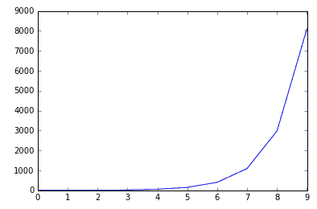

# 第一章：高性能机器学习——NumPy

在本章中，我们将涵盖以下内容：

+   NumPy 基础

+   加载鸢尾花数据集

+   查看鸢尾花数据集

+   使用 pandas 查看鸢尾花数据集

+   使用 NumPy 和 matplotlib 绘图

+   最小机器学习示例——SVM 分类

+   引入交叉验证

+   将所有内容整合在一起

+   机器学习概述——分类与回归

# 介绍

在本章中，我们将学习如何使用 scikit-learn 进行预测。机器学习强调衡量预测能力，而使用 scikit-learn 我们可以准确快速地进行预测。

我们将检查`iris`数据集，它包含三种鸢尾花类型的测量数据：*Iris Setosa*、*Iris Versicolor* 和 *Iris Virginica*。

为了衡量预测的强度，我们将：

+   保存一些数据以供测试

+   只使用训练数据构建模型

+   测量在测试集上的预测能力

预测——三种花卉类型中的一种是分类的。这类问题称为**分类问题**。

非正式地说，分类问的是，*它是苹果还是橙子？*与此对比，机器学习回归问题问的是，*有多少个苹果？*顺便说一下，回归问题的答案可以是*4.5 个苹果*。

通过其设计的演变，scikit-learn 主要通过四个类别来解决机器学习问题：

+   分类：

    +   非文本分类，例如鸢尾花的例子

    +   文本分类

+   回归

+   聚类

+   降维

# NumPy 基础

数据科学部分处理结构化数据表。`scikit-learn`库要求输入表格是二维 NumPy 数组。在本节中，你将了解`numpy`库。

# 如何操作...

我们将对 NumPy 数组进行一些操作。NumPy 数组的所有元素具有相同的数据类型，并且具有预定义的形状。让我们首先查看它们的形状。

# NumPy 数组的形状和维度

1.  首先导入 NumPy：

```py
import numpy as np
```

1.  生成一个包含 10 个数字的 NumPy 数组，类似于 Python 的`range(10)`方法：

```py
np.arange(10)
array([0, 1, 2, 3, 4, 5, 6, 7, 8, 9])
```

1.  数组看起来像一个只有一对括号的 Python 列表。这意味着它是单维的。存储数组并找出它的形状：

```py
array_1 = np.arange(10)
array_1.shape
(10L,)
```

1.  数组具有一个数据属性，`shape`。`array_1.shape`的类型是元组`(10L,)`，它的长度为`1`，在本例中是这样。维度的数量与元组的长度相同——在本例中是`1`维：

```py
array_1.ndim      #Find number of dimensions of array_1
1
```

1.  数组有 10 个元素。通过调用`reshape`方法重塑数组：

```py
array_1.reshape((5,2))
array([[0, 1],
 [2, 3],
 [4, 5],
 [6, 7],
 [8, 9]])
```

1.  这将把数组重塑为 5 x 2 的数据对象，类似于列表的列表（三维 NumPy 数组看起来像是列表的列表的列表）。你没有保存更改。请按以下方式保存重塑后的数组：

```py
array_1 = array_1.reshape((5,2))
```

1.  注意，`array_1`现在是二维的。这是预期的，因为它的形状有两个数字，看起来像是一个 Python 的列表的列表：

```py
array_1.ndim
2
```

# NumPy 广播

1.  通过广播将`1`添加到数组的每个元素中。请注意，数组的更改没有保存：

```py
array_1 + 1
array([[ 1,  2],
 [ 3,  4],
 [ 5,  6],
 [ 7,  8],
 [ 9, 10]])
```

**广播**这个术语指的是将较小的数组扩展或广播到较大的数组上。在第一个示例中，标量 `1` 被扩展为一个 5 x 2 的形状，并与 `array_1` 相加。

1.  创建一个新的 `array_2` 数组。观察当你将数组与自身相乘时会发生什么（这不是矩阵乘法；而是数组的逐元素乘法）：

```py
array_2 = np.arange(10)
array_2 * array_2
array([ 0,  1,  4,  9, 16, 25, 36, 49, 64, 81])
```

1.  每个元素都已被平方。这里发生了逐元素乘法。下面是一个更复杂的例子：

```py
array_2 = array_2 ** 2  #Note that this is equivalent to array_2 * array_2
array_2 = array_2.reshape((5,2))
array_2
array([[ 0,  1],
 [ 4,  9],
 [16, 25],
 [36, 49],
 [64, 81]])
```

1.  也修改 `array_1`：

```py
array_1 = array_1 + 1
array_1
array([[ 1,  2],
 [ 3,  4],
 [ 5,  6],
 [ 7,  8],
 [ 9, 10]])
```

1.  现在通过简单地将数组之间加上加号来逐元素地将 `array_1` 和 `array_2` 相加：

```py
array_1 + array_2
array([[ 1,  3],
 [ 7, 13],
 [21, 31],
 [43, 57],
 [73, 91]])
```

1.  正式的广播规则要求，当你比较两个数组的形状时，从右到左，所有的数字必须匹配或为 1。形状为**5 X 2**和**5 X 2**的两个数组从右到左都匹配。然而，形状为**5 X 2 X 1**与**5 X 2**不匹配，因为从右到左的第二个值，分别是**2**和**5**，不匹配：


# 初始化 NumPy 数组和数据类型

除了 `np.arange`，还有多种方法可以初始化 NumPy 数组：

1.  使用 `np.zeros` 初始化一个全为零的数组。`np.zeros((5,2))` 命令创建一个 5 x 2 的零数组：

```py
np.zeros((5,2))
array([[ 0.,  0.],
 [ 0.,  0.],
 [ 0.,  0.],
 [ 0.,  0.],
 [ 0.,  0.]])
```

1.  使用 `np.ones` 初始化一个全为 1 的数组。引入 `dtype` 参数，设置为 `np.int`，以确保这些 1 为 NumPy 整型。注意，scikit-learn 期望数组中的 `dtype` 为 `np.float` 类型。`dtype` 指的是 NumPy 数组中每个元素的类型，它在整个数组中保持一致。下面数组的每个元素都是 `np.int` 类型。

```py
np.ones((5,2), dtype = np.int)
array([[1, 1],
 [1, 1],
 [1, 1],
 [1, 1],
 [1, 1]])
```

1.  使用 `np.empty` 为特定大小和 `dtype` 的数组分配内存，但不初始化特定值：

```py
np.empty((5,2), dtype = np.float)
array([[  3.14724935e-316,   3.14859499e-316],
 [  3.14858945e-316,   3.14861159e-316],
 [  3.14861435e-316,   3.14861712e-316],
 [  3.14861989e-316,   3.14862265e-316],
 [  3.14862542e-316,   3.14862819e-316]])
```

1.  使用`np.zeros`、`np.ones`和`np.empty`为 NumPy 数组分配不同初始值的内存。

# 索引

1.  使用索引查找二维数组的值：

```py
array_1[0,0]   #Finds value in first row and first column.
1
```

1.  查看第一行：

```py
array_1[0,:]
array([1, 2])
```

1.  然后查看第一列：

```py
array_1[:,0]
array([1, 3, 5, 7, 9])
```

1.  查看沿两个轴的特定值。同时查看第二行到第四行：

```py
array_1[2:5, :]
array([[ 5,  6],
 [ 7,  8],
 [ 9, 10]])
```

1.  仅查看第一列的第二行到第四行：

```py
array_1[2:5,0]
array([5, 7, 9])
```

# 布尔数组

此外，NumPy 还使用布尔逻辑来处理索引：

1.  首先生成一个布尔数组：

```py
array_1 > 5
array([[False, False],
 [False, False],
 [False,  True],
 [ True,  True],
 [ True,  True]], dtype=bool)
```

1.  将布尔数组加上括号，以便通过布尔数组进行过滤：

```py
array_1[array_1 > 5]
array([ 6,  7,  8,  9, 10])
```

# 算术运算

1.  使用 `sum` 方法将数组的所有元素相加。回到 `array_1`：

```py
array_1
array([[ 1,  2],
 [ 3,  4],
 [ 5,  6],
 [ 7,  8],
 [ 9, 10]])
array_1.sum()
55
```

1.  按行求和：

```py
array_1.sum(axis = 1)
array([ 3,  7, 11, 15, 19])
```

1.  按列求和：

```py
array_1.sum(axis = 0)
array([25, 30])
```

1.  以类似的方式求每一列的均值。注意，均值数组的`dtype`为`np.float`：

```py
array_1.mean(axis = 0)
array([ 5.,  6.])
```

# NaN 值

1.  Scikit-learn 不接受 `np.nan` 值。假设有如下的 `array_3`：

```py
array_3 = np.array([np.nan, 0, 1, 2, np.nan])
```

1.  使用 `np.isnan` 函数创建一个特殊的布尔数组来查找 NaN 值：

```py
np.isnan(array_3)
array([ True, False, False, False,  True], dtype=bool)
```

1.  通过否定布尔数组并在表达式周围加上括号来过滤 NaN 值：

```py
array_3[~np.isnan(array_3)]
>array([ 0.,  1.,  2.])
```

1.  另一种方法是将 NaN 值设置为零：

```py
array_3[np.isnan(array_3)] = 0
array_3
array([ 0.,  0.,  1.,  2.,  0.])
```

# 它是如何工作的……

数据，在目前的最简意义上，是指由数字组成的二维表格，NumPy 对此处理得非常好。记住这一点，以防你忘记了 NumPy 的语法细节。Scikit-learn 仅接受没有缺失值（`np.nan`）的二维 NumPy 数组。

根据经验，最好是将 `np.nan` 更改为某个值，而不是丢弃数据。就个人而言，我喜欢追踪布尔掩码，并保持数据形状大致不变，因为这样可以减少编码错误并提高编码灵活性。

# 加载 iris 数据集

要使用 scikit-learn 进行机器学习，我们需要一些数据作为起点。我们将加载 `iris` 数据集，它是 scikit-learn 中几个数据集之一。

# 准备工作

一个 scikit-learn 程序开始时会有多个导入。在 Python 中，最好在 Jupyter Notebook 中加载 `numpy`、`pandas` 和 `pyplot` 库：

```py
import numpy as np    #Load the numpy library for fast array computations
import pandas as pd   #Load the pandas data-analysis library
import matplotlib.pyplot as plt   #Load the pyplot visualization library
```

如果你在 Jupyter Notebook 中，输入以下内容即可立即查看图形输出：

```py
%matplotlib inline 
```

# 如何操作…

1.  从 scikit-learn 的 `datasets` 模块中，访问 `iris` 数据集：

```py
from sklearn import datasets
iris = datasets.load_iris()
```

# 它是如何工作的…

同样，你也可以通过以下方式导入 `diabetes` 数据集：

```py
from sklearn import datasets  #Import datasets module from scikit-learn
diabetes = datasets.load_diabetes()   
```

看！你已经使用 `datasets` 模块中的 `load_diabetes()` 函数加载了 `diabetes` 数据集。要查看可用的数据集，输入：

```py
datasets.load_*?
```

一旦你尝试这个，你可能会发现有一个名为 `datasets.load_digits` 的数据集。要访问它，输入 `load_digits()` 函数，类似于其他加载函数：

```py
digits = datasets.load_digits()
```

要查看数据集的信息，输入 `digits.DESCR`。

# 查看 iris 数据集

现在我们已经加载了数据集，来看看里面有什么内容。`iris` 数据集涉及一个监督分类问题。

# 如何操作…

1.  要访问观测变量，输入：

```py
iris.data
```

这会输出一个 NumPy 数组：

```py
array([[ 5.1,  3.5,  1.4,  0.2],
 [ 4.9,  3\. ,  1.4,  0.2],
 [ 4.7,  3.2,  1.3,  0.2], 
#...rest of output suppressed because of length
```

1.  让我们检查一下 NumPy 数组：

```py
iris.data.shape
```

这会返回：

```py
(150L, 4L)
```

这意味着数据是 150 行 4 列。让我们看看第一行：

```py
iris.data[0]

array([ 5.1,  3.5,  1.4,  0.2])
```

第一行的 NumPy 数组包含四个数字。

1.  要确定它们的含义，输入：

```py
iris.feature_names
['sepal length (cm)',
 'sepal width (cm)',
 'petal length (cm)',
 'petal width (cm)']
```

特征或列名表示数据。它们是字符串，在这个例子中，它们对应于不同种类花的不同维度。综合来看，我们有 150 个花的样本，每个花有四个以厘米为单位的测量值。例如，第一个花的测量值为：萼片长度 5.1 cm，萼片宽度 3.5 cm，花瓣长度 1.4 cm，花瓣宽度 0.2 cm。现在，让我们以类似的方式查看输出变量：

```py
iris.target
```

这会返回一个输出数组：`0`、`1` 和 `2`。只有这三种输出。输入：

```py
iris.target.shape
```

你得到的形状是：

```py
(150L,)
```

这指的是长度为 150 的数组（150 x 1）。我们来看看这些数字代表什么：

```py
iris.target_names

array(['setosa', 'versicolor', 'virginica'], 
 dtype='|S10')
```

`iris.target_names` 变量的输出给出了 `iris.target` 变量中数字的英文名称。数字零对应于 `setosa` 花，数字一对应于 `versicolor` 花，数字二对应于 `virginica` 花。看看 `iris.target` 的第一行：

```py
iris.target[0]
```

这产生了零，因此我们之前检查的第一行观测结果对应于`setosa`花。

# 它是如何工作的...

在机器学习中，我们经常处理数据表和二维数组，这些数组对应于样本。在`iris`数据集中，我们有 150 个观测值，包含三种类型的花。对于新的观测值，我们希望预测这些观测值对应的花种类。这里的观测值是厘米为单位的测量数据。观察与真实物体相关的数据非常重要。引用我高中的物理老师的话，<q>"*不要忘记单位！*</q>"

`iris`数据集旨在用于监督式机器学习任务，因为它有一个目标数组，即我们希望从观测变量中预测的变量。此外，它是一个分类问题，因为我们可以从观测值中预测三个数字，每个花的类型对应一个数字。在分类问题中，我们试图区分不同的类别。最简单的情况是二分类。`iris`数据集有三种花类，因此它是一个多类分类问题。

# 还有更多...

使用相同的数据，我们可以用多种方式重新表述问题，或者提出新的问题。如果我们想要确定观测值之间的关系怎么办？我们可以将花瓣宽度定义为目标变量。我们可以将问题重新表述为回归问题，试图将目标变量预测为一个实数，而不仅仅是三个类别。从根本上说，这取决于我们想要预测什么。在这里，我们希望预测一种花的类型。

# 使用 Pandas 查看`iris`数据集

在这个示例中，我们将使用方便的`pandas`数据分析库来查看和可视化`iris`数据集。它包含了概念 o，一个数据框（dataframe），如果你使用 R 语言的数据框，可能会对它有所熟悉。

# 如何做到这一点...

你可以通过 Pandas 查看`iris`数据集，Pandas 是一个基于 NumPy 构建的库：

1.  创建一个包含观测变量`iris.data`的数据框，并以`columns`作为列名：

```py
import pandas as pd
iris_df = pd.DataFrame(iris.data, columns = iris.feature_names)
```

数据框比 NumPy 数组更易于使用。

1.  查看数据框中`sepal length`值的快速直方图：

```py
iris_df['sepal length (cm)'].hist(bins=30)
```


1.  你还可以通过`target`变量为直方图上色：

```py
for class_number in np.unique(iris.target):
 plt.figure(1)
 iris_df['sepal length (cm)'].iloc[np.where(iris.target == class_number)[0]].hist(bins=30)
```

1.  在这里，迭代每种花的目标数字，并为每个花绘制一个彩色直方图。考虑这一行：

```py
np.where(iris.target== class_number)[0]
```

它找到了每种花类别的 NumPy 索引位置：


观察到直方图有重叠。这鼓励我们将三个直方图建模为三个正态分布。如果我们仅将训练数据建模为三个正态分布而不是整个数据集，这在机器学习中是可行的。然后，我们使用测试集来测试我们刚刚构建的三个正态分布模型。最后，我们在测试集上测试我们预测的准确性。

# 它是如何工作的...

数据框架数据对象是一个二维的 NumPy 数组，包含列名和行名。在数据科学中，基本的数据对象看起来像一个二维表格，这可能与 SQL 的悠久历史有关。NumPy 还支持三维数组、立方体、四维数组等，这些也经常出现。

# 使用 NumPy 和 matplotlib 绘图

使用 NumPy 进行可视化的一个简单方法是使用 `matplotlib` 库。让我们快速创建一些可视化图形。

# 准备工作

首先导入 `numpy` 和 `matplotlib`。你可以使用 `%matplotlib inline` 命令在 IPython Notebook 中查看可视化图形：

```py
import numpy as np
 import matplotlib.pyplot as plt
 %matplotlib inline
```

# 如何操作...

1.  matplotlib 中的主要命令，伪代码如下：

```py
plt.plot(numpy array, numpy array of same length)
```

1.  通过放置两个相同长度的 NumPy 数组来绘制一条直线：

```py
plt.plot(np.arange(10), np.arange(10))
```


1.  绘制指数图：

```py
plt.plot(np.arange(10), np.exp(np.arange(10)))
```



1.  将两个图表并排放置：

```py
plt.figure()
plt.subplot(121)
plt.plot(np.arange(10), np.exp(np.arange(10)))
plt.subplot(122)
plt.scatter(np.arange(10), np.exp(np.arange(10)))
```

或者从上到下：

```py
plt.figure()
plt.subplot(211)
plt.plot(np.arange(10), np.exp(np.arange(10)))
plt.subplot(212)
plt.scatter(np.arange(10), np.exp(np.arange(10)))
```


子图命令中的前两个数字表示由 `plt.figure()` 实例化的图形中的网格大小。`plt.subplot(221)` 中提到的网格大小是 2 x 2，前两个数字表示网格的行列数。最后一个数字表示按阅读顺序遍历网格：从左到右，再从上到下。

1.  在 2 x 2 网格中绘图，按照从一到四的阅读顺序排列：

```py
plt.figure()
plt.subplot(221)
plt.plot(np.arange(10), np.exp(np.arange(10)))
plt.subplot(222)
plt.scatter(np.arange(10), np.exp(np.arange(10)))
plt.subplot(223)
plt.scatter(np.arange(10), np.exp(np.arange(10)))
plt.subplot(224)
plt.scatter(np.arange(10), np.exp(np.arange(10)))
```


1.  最后，使用真实数据：

```py
from sklearn.datasets import load_iris

iris = load_iris()
data = iris.data
target = iris.target

# Resize the figure for better viewing
plt.figure(figsize=(12,5))

# First subplot
plt.subplot(121)

# Visualize the first two columns of data:
plt.scatter(data[:,0], data[:,1], c=target)

# Second subplot
plt.subplot(122)

# Visualize the last two columns of data:
plt.scatter(data[:,2], data[:,3], c=target)
```

`c` 参数接受一个颜色数组——在此例中为 `iris` 目标中的颜色 `0`、`1` 和 `2`：


# 一个简化的机器学习配方 – SVM 分类

机器学习的核心是进行预测。为了进行预测，我们需要：

+   陈述要解决的问题

+   选择一个模型来解决问题

+   训练模型

+   进行预测

+   测量模型的表现

# 准备工作

回到鸢尾花示例，现在我们将观察数据的前两个特征（列）存储为 `X`，目标存储为 `y`，这是机器学习社区中的惯例：

```py
X = iris.data[:, :2] 
y = iris.target
```

# 如何操作...

1.  首先，我们陈述问题。我们试图从一组新的观察数据中确定花卉类型类别。这是一个分类任务。可用的数据包括一个目标变量，我们将其命名为 `y`。这属于监督分类问题。

监督学习的任务涉及使用输入变量和输出变量训练模型，从而预测输出变量的值。

1.  接下来，我们选择一个模型来解决监督分类问题。目前我们将使用支持向量分类器。由于其简单性和可解释性，它是一个常用的算法（*可解释性*意味着容易阅读和理解）。

1.  为了衡量预测性能，我们将数据集分为训练集和测试集。训练集是我们将从中学习的数据。测试集是我们保留的数据，并假装不知道它，以便衡量我们学习过程的性能。因此，导入一个将数据集拆分的函数：

```py
from sklearn.model_selection import train_test_split
```

1.  将该函数应用于观察数据和目标数据：

```py
X_train, X_test, y_train, y_test = train_test_split(X, y, test_size=0.25, random_state=1)
```

测试集大小为 0.25，即整个数据集的 25%。一个随机状态值 1 固定了函数的随机种子，使得每次调用该函数时都能得到相同的结果，这对现在保持结果一致性非常重要。

1.  现在加载一个常用的估算器——支持向量机：

```py
from sklearn.svm import SVC
```

1.  你已经从`svm`模块导入了支持向量分类器。现在创建一个线性 SVC 的实例：

```py
clf = SVC(kernel='linear',random_state=1)
```

随机状态被固定，以便以后使用相同的代码重现相同的结果。

scikit-learn 中的监督学习模型实现了一个`fit(X, y)`方法，用于训练模型并返回训练好的模型。`X`是观察数据的子集，`y`的每个元素对应于`X`中每个观察数据的目标。在这里，我们在训练数据上拟合了一个模型：

```py
clf.fit(X_train, y_train)
```

此时，`clf`变量是已经拟合或训练好的模型。

估算器还有一个`predict(X)`方法，该方法会对多个未标记的观察数据`X_test`进行预测，并返回预测值`y_pred`。请注意，该函数不会返回估算器本身，而是返回一组预测值：

```py
y_pred = clf.predict(X_test)
```

到目前为止，你已经完成了除最后一步以外的所有步骤。为了检查模型的表现，加载一个来自指标模块的评分器：

```py
from sklearn.metrics import accuracy_score
```

使用评分器，将预测结果与保留的测试目标进行比较：

```py
accuracy_score(y_test,y_pred)

0.76315789473684215
```

# 它是如何工作的……

即使对支持向量机的细节了解不多，我们也已经实现了一个预测模型。为了进行机器学习，我们保留了四分之一的数据，并检查了 SVC 在这些数据上的表现。最终，我们得到了一个衡量准确度的数值，或者说衡量模型表现的数值。

# 还有更多内容……

总结一下，我们将用不同的算法——逻辑回归——来执行所有步骤：

1.  首先，导入`LogisticRegression`：

```py
from sklearn.linear_model import LogisticRegression
```

1.  然后编写一个包含建模步骤的程序：

    1.  将数据分为训练集和测试集。

    1.  拟合逻辑回归模型。

    1.  使用测试观察数据进行预测。

    1.  使用`y_test`与`y_pred`来衡量预测的准确性：

```py
import matplotlib.pyplot as plt
from sklearn import datasets

from sklearn.model_selection import train_test_split
from sklearn.metrics import accuracy_score

X = iris.data[:, :2]   #load the iris data
y = iris.target
X_train, X_test, y_train, y_test = train_test_split(X, y, test_size=0.25, random_state=1)

#train the model
clf = LogisticRegression(random_state = 1)
clf.fit(X_train, y_train)

#predict with Logistic Regression
y_pred = clf.predict(X_test)

#examine the model accuracy
accuracy_score(y_test,y_pred)

0.60526315789473684
```

这个数值较低；然而，我们无法在支持向量分类（SVC）与逻辑回归分类模型之间做出结论。我们无法比较它们，因为我们不应该查看模型的测试集。如果我们在 SVC 和逻辑回归之间做出选择，那么该选择也将成为我们模型的一部分，因此测试集不能参与选择。交叉验证，我们接下来将要介绍的，是一种选择模型的方法。

# 引入交叉验证

我们感谢`iris`数据集，但正如你所记得的，它只有 150 个观测值。为了最大限度地利用这个数据集，我们将使用交叉验证。此外，在上一部分中，我们想比较两种不同分类器的性能——支持向量分类器和逻辑回归。交叉验证将帮助我们解决这个比较问题。

# 准备工作

假设我们想在支持向量分类器和逻辑回归分类器之间做选择。我们不能在不可用的测试集上衡量它们的表现。

那么，如果我们改为：

+   现在忘记测试集了吗？

+   将训练集拆分成两部分，一部分用于训练，另一部分用于测试训练结果？

使用之前部分中提到的`train_test_split`函数将训练集拆分为两部分：

```py
from sklearn.model_selection import train_test_split
X_train_2, X_test_2, y_train_2, y_test_2 = train_test_split(X_train, y_train, test_size=0.25, random_state=1)
```

`X_train_2`包含`X_train`数据的 75%，而`X_test_2`是剩下的 25%。`y_train_2`是目标数据的 75%，并与`X_train_2`的观测值相匹配。`y_test_2`是`y_train`中 25%的目标数据。

正如你可能预料的，你必须使用这些新的拆分来在两个模型之间做选择：SVC 和逻辑回归。通过编写一个预测程序来实现这一点。

# 如何做到...

1.  从导入所有库并加载`iris`数据集开始：

```py
from sklearn import datasets

from sklearn.model_selection import train_test_split
from sklearn.metrics import accuracy_score

#load the classifying models
from sklearn.linear_model import LogisticRegression
from sklearn.svm import SVC

iris = datasets.load_iris()
X = iris.data[:, :2]  #load the first two features of the iris data 
y = iris.target #load the target of the iris data

#split the whole set one time
#Note random state is 7 now
X_train, X_test, y_train, y_test = train_test_split(X, y, test_size=0.25, random_state=7)

#split the training set into parts
X_train_2, X_test_2, y_train_2, y_test_2 = train_test_split(X_train, y_train, test_size=0.25, random_state=7)
```

1.  创建一个 SVC 分类器实例并进行拟合：

```py
svc_clf = SVC(kernel = 'linear',random_state = 7)
svc_clf.fit(X_train_2, y_train_2)
```

1.  对逻辑回归做相同操作（逻辑回归的两行代码压缩成一行）：

```py
lr_clf = LogisticRegression(random_state = 7).fit(X_train_2, y_train_2)
```

1.  现在预测并检查 SVC 和逻辑回归在`X_test_2`上的表现：

```py
svc_pred = svc_clf.predict(X_test_2)
lr_pred = lr_clf.predict(X_test_2)

print "Accuracy of SVC:",accuracy_score(y_test_2,svc_pred)
print "Accuracy of LR:",accuracy_score(y_test_2,lr_pred)

Accuracy of SVC: 0.857142857143
Accuracy of LR: 0.714285714286
```

1.  SVC 的表现更好，但我们还没有看到原始的测试数据。选择 SVC 而非逻辑回归，并尝试在原始测试集上进行测试：

```py
print "Accuracy of SVC on original Test Set: ",accuracy_score(y_test, svc_clf.predict(X_test))

Accuracy of SVC on original Test Set:  0.684210526316
```

# 它是如何工作的...

在比较 SVC 和逻辑回归分类器时，你可能会感到疑惑（甚至有些怀疑），因为它们的得分差异很大。最终 SVC 的测试得分低于逻辑回归。为了解决这个问题，我们可以在 scikit-learn 中进行交叉验证。

交叉验证涉及将训练集拆分为多个部分，就像我们之前做的一样。为了与前面的示例相匹配，我们将训练集拆分为四个部分或折叠。我们将通过轮流选取其中一个折叠作为测试集，其他三个折叠作为训练集，来设计一个交叉验证迭代。这与之前的拆分相同，只不过进行了四次轮换，从某种意义上来说，测试集在四个折叠中轮换：


使用 scikit-learn，这个操作相对容易实现：

1.  我们从一个导入开始：

```py
from sklearn.model_selection import cross_val_score
```

1.  然后我们在四个折叠上生成准确度评分：

```py
svc_scores = cross_val_score(svc_clf, X_train, y_train, cv=4)
svc_scores 
array([ 0.82758621,  0.85714286,  0.92857143,  0.77777778])
```

1.  我们可以找到平均表现的均值和所有得分相对于均值的标准差来衡量得分的分布情况：

```py
print "Average SVC scores: ", svc_scores.mean()
print "Standard Deviation of SVC scores: ", svc_scores.std()

Average SVC scores:  0.847769567597
Standard Deviation of SVC scores:  0.0545962864696
```

1.  同样，对于逻辑回归实例，我们计算出四个得分：

```py
lr_scores = cross_val_score(lr_clf, X_train, y_train, cv=4)
print "Average SVC scores: ", lr_scores.mean()
print "Standard Deviation of SVC scores: ", lr_scores.std()

Average SVC scores:  0.748893906221
Standard Deviation of SVC scores:  0.0485633168699
```

现在我们有了多个得分，这证实了我们选择 SVC 而非逻辑回归。由于交叉验证，我们多次使用训练集，并且在其中有四个小的测试集来评分我们的模型。

请注意，我们的模型是一个更大的模型，包含以下内容：

+   通过交叉验证训练 SVM

+   通过交叉验证训练逻辑回归

+   在 SVM 和逻辑回归之间做选择

最终的选择是模型的一部分。

# 还有更多...

尽管我们付出了很多努力，并且 scikit-learn 语法非常优雅，但最终测试集上的得分仍然令人怀疑。原因在于测试集和训练集的划分未必平衡；训练集和测试集中的各个类别的比例可能不同。

通过使用分层的测试-训练划分，可以轻松解决这个问题：

```py
X_train, X_test, y_train, y_test = train_test_split(X, y, stratify=y)
```

通过将目标集选择为分层参数，目标类别会被平衡。这样可以使 SVC 的得分更接近。

```py
svc_scores = cross_val_score(svc_clf, X_train, y_train, cv=4)
print "Average SVC scores: " , svc_scores.mean()
print "Standard Deviation of SVC scores: ", svc_scores.std()
print "Score on Final Test Set:", accuracy_score(y_test, svc_clf.predict(X_test))

Average SVC scores:  0.831547619048
Standard Deviation of SVC scores:  0.0792488953372
Score on Final Test Set: 0.789473684211
```

此外，请注意，在前面的示例中，交叉验证过程默认会生成分层折叠：

```py
from sklearn.model_selection import cross_val_score
svc_scores = cross_val_score(svc_clf, X_train, y_train, cv = 4)
```

前面的代码等价于：

```py
from sklearn.model_selection import cross_val_score, StratifiedKFold
skf = StratifiedKFold(n_splits = 4)
svc_scores = cross_val_score(svc_clf, X_train, y_train, cv = skf)
```

# 将一切结合起来

现在，我们将执行与之前相同的步骤，只不过这次我们将重置、重新分组，并尝试一种新的算法：**K 最近邻**（**KNN**）。

# 如何做...

1.  从`sklearn`导入模型，然后进行平衡划分：

```py
from sklearn.neighbors import KNeighborsClassifier
X_train, X_test, y_train, y_test = train_test_split(X, y, stratify=y, random_state = 0) 
```

`random_state`参数在`train_test_split`函数中固定了`random_seed`。在前面的示例中，`random_state`被设置为零，可以设置为任何整数。

1.  通过改变`n_neighbors`参数构建两个不同的 KNN 模型。请注意，折叠次数现在为 10。十折交叉验证在机器学习领域中非常常见，尤其是在数据科学竞赛中：

```py
from sklearn.model_selection import cross_val_score
knn_3_clf = KNeighborsClassifier(n_neighbors = 3)
knn_5_clf = KNeighborsClassifier(n_neighbors = 5)

knn_3_scores = cross_val_score(knn_3_clf, X_train, y_train, cv=10)
knn_5_scores = cross_val_score(knn_5_clf, X_train, y_train, cv=10)
```

1.  评分并打印出选择的得分：

```py
print "knn_3 mean scores: ", knn_3_scores.mean(), "knn_3 std: ",knn_3_scores.std()
print "knn_5 mean scores: ", knn_5_scores.mean(), " knn_5 std: ",knn_5_scores.std()

knn_3 mean scores:  0.798333333333 knn_3 std:  0.0908142181722
knn_5 mean scores:  0.806666666667 knn_5 std:  0.0559320575496
```

两种最近邻类型的得分相似，但参数为`n_neighbors = 5`的 KNN 略微更稳定。这是一个*超参数优化*的例子，我们将在本书中仔细研究这一点。

# 还有更多...

你本来也可以简单地运行一个循环，更快地对函数进行评分：

```py
all_scores = []
for n_neighbors in range(3,9,1):
 knn_clf = KNeighborsClassifier(n_neighbors = n_neighbors)
 all_scores.append((n_neighbors, cross_val_score(knn_clf, X_train, y_train, cv=10).mean()))
sorted(all_scores, key = lambda x:x[1], reverse = True)  
```

其输出表明，`n_neighbors = 4`是一个不错的选择：

```py
[(4, 0.85111111111111115),
 (7, 0.82611111111111113),
 (6, 0.82333333333333347),
 (5, 0.80666666666666664),
 (3, 0.79833333333333334),
 (8, 0.79833333333333334)]
```

# 机器学习概述 – 分类与回归

在本篇中，我们将探讨如何将回归视为与分类非常相似。这是通过将回归的类别标签重新考虑为实数来实现的。在本节中，我们还将从非常广泛的角度来看待机器学习的多个方面，包括 scikit-learn 的目的。scikit-learn 使我们能够非常快速地找到有效的模型。我们不需要一开始就详细地推导出所有模型的细节，也不需要优化，直到找到一个表现良好的模型。因此，得益于 scikit-learn 的高效性，你的公司可以节省宝贵的开发时间和计算资源。

# scikit-learn 的目的

正如我们之前看到的，scikit-learn 允许我们相对快速地找到有效的模型。我们尝试了 SVC、逻辑回归和一些 KNN 分类器。通过交叉验证，我们选择了表现更好的模型。在实际应用中，经过尝试 SVM 和逻辑回归后，我们可能会专注于 SVM 并进一步优化它们。多亏了 scikit-learn，我们节省了大量时间和资源，包括精力。在工作中对现实数据集优化了 SVM 后，我们可能会为提高速度而在 Java 或 C 中重新实现它，并收集更多的数据。

# 监督学习与无监督学习

分类和回归是监督学习，因为我们知道观测数据的目标变量。聚类——在空间中为每个类别创建区域而不给予标签，是无监督学习。

# 准备好

在分类中，目标变量是多个类别之一，并且每个类别必须有多个实例。在回归中，每个目标变量只能有一个实例，因为唯一的要求是目标是一个实数。

在逻辑回归的情况下，我们之前看到，算法首先执行回归并为目标估算一个实数。然后，通过使用阈值来估计目标类别。在 scikit-learn 中，有`predict_proba`方法，它提供概率估算，将类似回归的实数估算与逻辑回归风格的分类类别关联起来。

任何回归都可以通过使用阈值转化为分类。二分类问题可以通过使用回归器看作回归问题。产生的目标变量将是实数，而不是原始的类别变量。

# 如何做...

# 快速 SVC——一个分类器和回归器

1.  从`datasets`模块加载`iris`：

```py
import numpy as np
import pandas as pd
from sklearn import datasets

iris = datasets.load_iris()
```

1.  为简便起见，只考虑目标`0`和`1`，分别对应 Setosa 和 Versicolor。使用布尔数组`iris.target < 2`来过滤目标`2`。将其放入括号中，作为筛选器在定义观测集`X`和目标集`y`时使用：

```py
X = iris.data[iris.target < 2]
y = iris.target[iris.target < 2]
```

1.  现在导入`train_test_split`并应用它：

```py
from sklearn.model_selection import train_test_split
from sklearn.metrics import accuracy_score

X_train, X_test, y_train, y_test = train_test_split(X, y, stratify=y, random_state= 7)
```

1.  通过导入 SVC 并使用交叉验证评分来准备并运行 SVC：

```py
from sklearn.svm import SVC
from sklearn.model_selection import cross_val_score

svc_clf = SVC(kernel = 'linear').fit(X_train, y_train)
svc_scores = cross_val_score(svc_clf, X_train, y_train, cv=4)
```

1.  和之前的部分一样，查看评分的平均值：

```py
svc_scores.mean()

0.94795321637426899
```

1.  通过从`sklearn.svm`导入`SVR`，对支持向量回归执行相同操作，该模块也包含 SVC：

```py
from sklearn.svm import SVR
```

1.  然后编写必要的语法来拟合模型。它与 SVC 的语法几乎相同，只需将一些`c`关键字替换为`r`：

```py
svr_clf = SVR(kernel = 'linear').fit(X_train, y_train)
```

# 创建评分器

要创建评分器，你需要：

+   一个评分函数，它将`y_test`（真实值）与`y_pred`（预测值）进行比较

+   确定高分是好是坏

在将 SVR 回归器传递给交叉验证之前，先通过提供两个元素来创建评分器：

1.  在实际操作中，首先导入`make_scorer`函数：

```py
from sklearn.metrics import make_scorer
```

1.  使用这个样本评分函数：

```py
#Only works for this iris example with targets 0 and 1
def for_scorer(y_test, orig_y_pred):
 y_pred = np.rint(orig_y_pred).astype(np.int)   #rounds prediction to the nearest integer
 return accuracy_score(y_test, y_pred)
```

`np.rint` 函数将预测值四舍五入到最接近的整数，希望它是目标值之一，即 `0` 或 `1`。`astype` 方法将预测值的类型更改为整数类型，因为原始目标是整数类型，并且在类型上保持一致性是更优的选择。四舍五入之后，评分函数使用你熟悉的旧版 `accuracy_score` 函数。

1.  现在，确定较高的分数是否更好。更高的准确度更好，因此在这种情况下，较高的分数更好。在 scikit 代码中：

```py
svr_to_class_scorer = make_scorer(for_scorer, greater_is_better=True) 
```

1.  最后，使用一个新的参数——评分参数，运行交叉验证：

```py
svr_scores = cross_val_score(svr_clf, X_train, y_train, cv=4, scoring = svr_to_class_scorer)
```

1.  计算均值：

```py
svr_scores.mean()

0.94663742690058483
```

SVR 回归器基础的分类器与传统的 SVC 分类器在准确率评分上相似。

# 它是如何工作的...

你可能会问，为什么我们从目标集合中去掉了类 `2`？

其原因在于，为了使用回归模型，我们的目标必须是预测一个实数。类别必须具备实数性质：即它们是有序的（非正式地说，如果我们有三个有序的类别 *x*、*y*、*z*，并且 *x* < *y* 且 *y* < *z*，那么 *x* < *z*）。通过去掉第三个类别，剩下的花类（Setosa 和 Versicolor）根据我们发明的属性变得有序：Setosaness 或 Versicolorness。

下次遇到类别时，你可以考虑它们是否可以排序。例如，如果数据集包含鞋码，那么它们可以排序，且可以应用回归模型，尽管没有人会有 12.125 号鞋。

# 还有更多...

# 线性与非线性

线性算法涉及直线或超平面。超平面是任何 *n* 维空间中的平面，它们往往易于理解和解释，因为它们涉及比率（带有偏移量）。一些始终单调增加或减少的函数可以通过变换映射到线性函数。例如，指数增长可以通过对数变换映射为一条直线。

非线性算法往往更难向同事和投资者解释，但非线性决策树集成通常表现得很好。我们之前探讨过的 KNN 就是一个非线性算法。在某些情况下，为了提高准确性，某些函数的增减方式不符合直观也可以被接受。

尝试一个简单的 SVC 并使用多项式核，如下所示：

```py
from sklearn.svm import SVC   #Usual import of SVC
svc_poly_clf = SVC(kernel = 'poly', degree= 3).fit(X_train, y_train)  #Polynomial Kernel of Degree 3
```

三次多项式核在二维空间中看起来像一条立方曲线。它能带来稍微更好的拟合效果，但请注意，它可能比在整个欧几里得空间中行为一致的线性核更难向他人解释：

```py
svc_poly_scores = cross_val_score(svc_clf, X_train, y_train, cv=4)
svc_poly_scores.mean()

0.95906432748538006
```

# 黑箱与非黑箱

为了提高效率，我们并没有非常详细地检查所使用的分类算法。当我们比较支持向量分类器（SVC）和逻辑回归时，我们选择了 SVM。那时，这两种算法都是黑箱，因为我们并不了解任何内部细节。一旦我们决定专注于 SVM，就可以继续计算分离超平面的系数，优化 SVM 的超参数，使用 SVM 处理大数据，并进行其他处理。由于其卓越的性能，SVM 值得我们投入时间。

# 可解释性

一些机器学习算法比其他算法更容易理解。这些算法通常也更容易向他人解释。例如，线性回归是众所周知的，容易理解，并能向潜在的投资者解释。SVM 则更加难以完全理解。

我的总体建议是：如果 SVM 在某个特定数据集上非常有效，尝试提高你在该特定问题情境中的 SVM 可解释性。同时，考虑某种方式将算法合并，比如使用线性回归作为 SVM 的输入。这样，你可以兼得两者的优点。

然而，这真的取决于具体情况。线性 SVM 相对简单，容易可视化和理解。将线性回归与 SVM 合并可能会使事情变得复杂。你可以通过并排比较它们来开始。

然而，如果你无法理解支持向量机（SVM）的数学细节和实践过程，请对自己宽容些，因为机器学习更关注预测性能，而非传统统计学。

# 一个管道

在编程中，管道是一个按顺序连接的过程集，其中一个过程的输出作为下一个过程的输入：


你可以用不同的过程替换流程中的任何一个步骤，也许这个替代的步骤在某些方面更好，而不会破坏整个系统。对于中间步骤的模型，你可以使用 SVC 或逻辑回归：


你还可以跟踪分类器本身，并从分类器构建一个流程图。以下是一个跟踪 SVC 分类器的管道：


在接下来的章节中，我们将看到 scikit-learn 是如何使用管道这一直观概念的。到目前为止，我们使用了一个简单的管道：训练、预测、测试。
