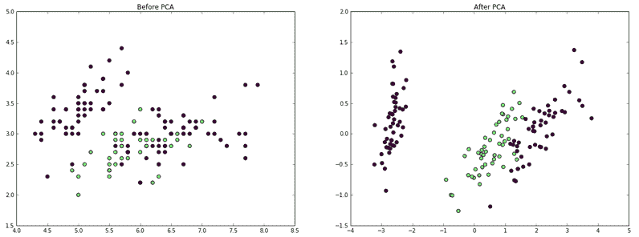
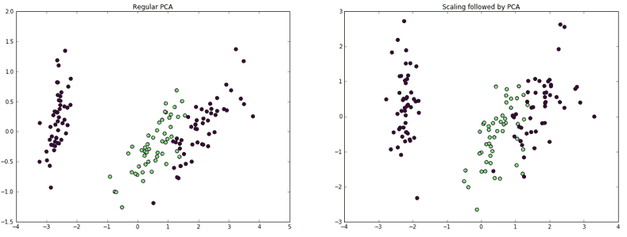
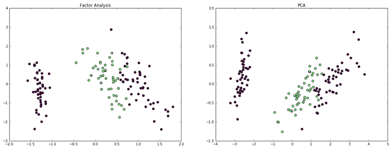
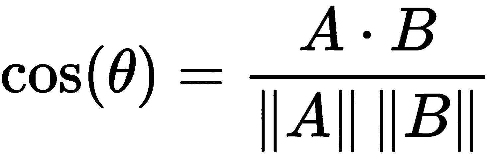
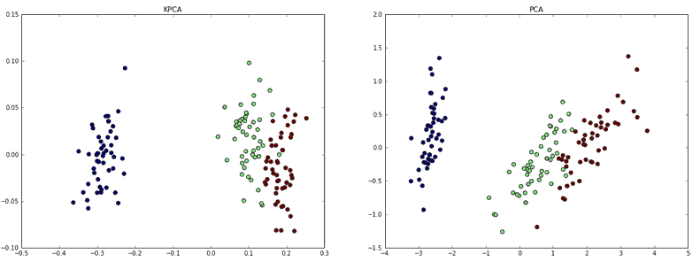
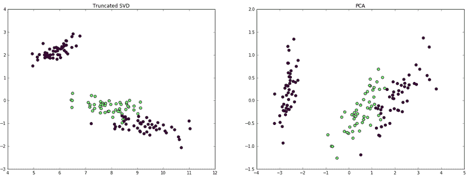
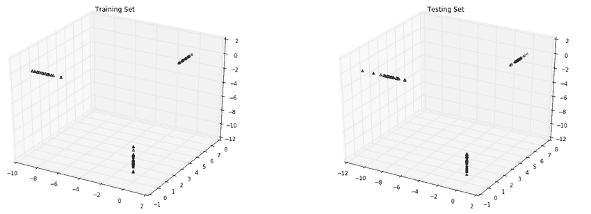
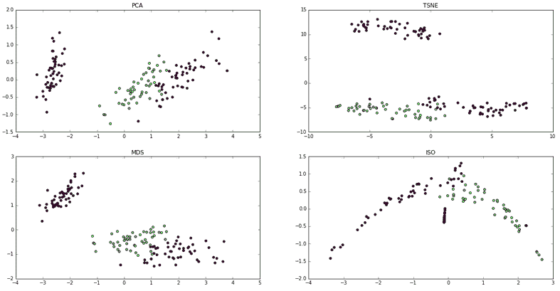
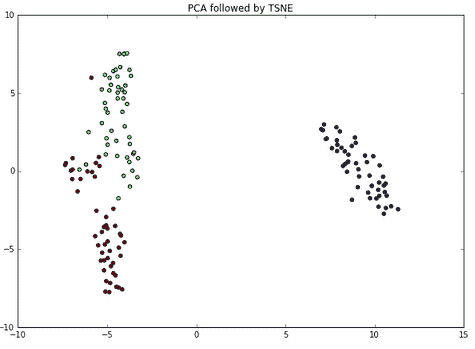

# 第三章：降维

在本章中，我们将涵盖以下食谱：

+   使用 PCA 进行降维

+   使用因子分析进行分解

+   使用核 PCA 进行非线性降维

+   使用截断 SVD 进行降维

+   使用分解进行分类与 DictionaryLearning

+   使用流形进行降维——t-SNE

+   测试通过管道减少维度的方法

# 介绍

在本章中，我们将减少输入到机器学习模型中的特征或输入数量。这是一个非常重要的操作，因为有时数据集有很多输入列，减少列数可以创建更简单的模型，减少计算能力的需求以进行预测。

本节使用的主要模型是**主成分分析**（**PCA**）。由于 PCA 的解释方差，您无需知道可以将数据集减少到多少特征。一个性能相似的模型是**截断奇异值分解**（**truncated SVD**）。最好首先选择一个线性模型，允许您知道可以将数据集减少到多少列，例如 PCA 或截断 SVD。

在本章后面，查看现代方法**t 分布随机邻居嵌入**（**t-SNE**），它使特征在低维度中更容易可视化。在最后一个食谱中，您可以检查一个复杂的管道和网格搜索，找到由降维与多个支持向量机组成的最佳复合估计器。

# 使用 PCA 进行降维

现在是时候将数学提升到一个新层次了！PCA 是本书中讨论的第一个相对高级的技术。到目前为止，所有的内容都只是简单的统计学，而 PCA 将统计学与线性代数结合起来，产生一个预处理步骤，有助于减少维度，这是简化模型的敌人。

# 准备工作

PCA 是 scikit-learn 中分解模块的一个成员。还有几种其他的分解方法，稍后将在本食谱中介绍。我们将使用鸢尾花数据集，但如果你使用自己的数据会更好：

```py
from sklearn import datasets
import matplotlib.pyplot as plt
import numpy as np
import pandas as pd
%matplotlib inline

iris = datasets.load_iris()
iris_X = iris.data
y = iris.target
```

# 如何实现...

1.  导入`decomposition`模块：

```py
from sklearn import decomposition
```

1.  实例化一个默认的 PCA 对象：

```py
pca = decomposition.PCA()
pca

PCA(copy=True, iterated_power='auto', n_components=None, random_state=None,
  svd_solver='auto', tol=0.0, whiten=False)
```

1.  与 scikit-learn 中的其他对象相比，PCA 对象所需的参数相对较少。现在 PCA 对象（一个 PCA 实例）已经创建，只需通过调用`fit_transform`方法来转换数据，`iris_X`作为参数：

```py
iris_pca = pca.fit_transform(iris_X)
iris_pca[:5]

array([[ -2.68420713e+00,   3.26607315e-01,  -2.15118370e-02,
          1.00615724e-03],
       [ -2.71539062e+00,  -1.69556848e-01,  -2.03521425e-01,
          9.96024240e-02],
       [ -2.88981954e+00,  -1.37345610e-01,   2.47092410e-02,
          1.93045428e-02],
       [ -2.74643720e+00,  -3.11124316e-01,   3.76719753e-02,
         -7.59552741e-02],
       [ -2.72859298e+00,   3.33924564e-01,   9.62296998e-02,
         -6.31287327e-02]])
```

1.  现在 PCA 对象已经拟合完成，我们可以看到它在解释方差方面的效果如何（将在接下来的*工作原理...*部分中进行说明）：

```py
pca.explained_variance_ratio_
array([ 0.92461621,  0.05301557,  0.01718514,  0.00518309])
```

# 它是如何工作的...

PCA 有一个通用的数学定义，并在数据分析中有特定的应用案例。PCA 找到一组正交方向，这些方向表示原始数据矩阵。

通常，PCA 通过将原始数据集映射到一个新空间来工作，其中矩阵的每个新列向量都是正交的。从数据分析的角度来看，PCA 将数据的协方差矩阵转换为可以解释方差某些百分比的列向量。例如，使用鸢尾花数据集，92.5%的整体方差可以通过第一个分量来解释。

这非常有用，因为维度问题在数据分析中很常见。许多应用于高维数据集的算法会在初始训练时出现过拟合，从而失去对测试集的泛化能力。如果数据的绝大部分结构可以通过更少的维度忠实地表示，那么这通常被认为是值得的权衡：

```py
pca = decomposition.PCA(n_components=2)
iris_X_prime = pca.fit_transform(iris_X)
iris_X_prime.shape
(150L, 2L)
```

现在我们的数据矩阵是 150 x 2，而不是 150 x 4。即便在减少维度为二之后，类别的可分性依然保持。我们可以看到这两维所表示的方差有多少：

```py
pca.explained_variance_ratio_.sum()
0.97763177502480336
```

为了可视化 PCA 的效果，让我们绘制鸢尾花数据集的前两维，并展示 PCA 变换前后的对比图：

```py
fig = plt.figure(figsize=(20,7))
ax = fig.add_subplot(121)
ax.scatter(iris_X[:,0],iris_X[:,1],c=y,s=40)
ax.set_title('Before PCA')

ax2 = fig.add_subplot(122)
ax2.scatter(iris_X_prime[:,0],iris_X_prime[:,1],c=y,s=40)
ax2.set_title('After PCA')
```



`PCA`对象也可以在一开始就考虑解释方差的数量。例如，如果我们希望至少解释 98%的方差，那么`PCA`对象将按如下方式创建：

```py
pca = decomposition.PCA(n_components=.98)
iris_X_prime = pca.fit(iris_X).transform(iris_X)
pca.explained_variance_ratio_.sum()
0.99481691454981014
```

由于我们希望解释的方差稍微多于两个分量示例，因此包含了第三个分量。

即使最终数据的维度是二维或三维，这两三列也包含了所有四个原始列的信息。

# 还有更多...

建议在使用 PCA 之前进行缩放。操作步骤如下：

```py
from sklearn import preprocessing

iris_X_scaled = preprocessing.scale(iris_X)
pca = decomposition.PCA(n_components=2)
iris_X_scaled = pca.fit_transform(iris_X_scaled)
```

这导致了如下图：

```py
fig = plt.figure(figsize=(20,7))
ax = fig.add_subplot(121)
ax.scatter(iris_X_prime[:,0],iris_X_prime[:,1],c=y,s=40)
ax.set_title('Regular PCA')

ax2 = fig.add_subplot(122)
ax2.scatter(iris_X_scaled[:,0],iris_X_scaled[:,1],c=y,s=40)
ax2.set_title('Scaling followed by PCA')
```



看起来有点差。无论如何，如果你考虑使用 PCA，始终应该考虑使用缩放后的 PCA。最好能通过管道按如下方式进行缩放：

```py
from sklearn.pipeline import Pipeline
from sklearn.preprocessing import StandardScaler

pipe = Pipeline([('scaler', StandardScaler()), ('pca',decomposition.PCA(n_components=2))])
iris_X_scaled = pipe.fit_transform(iris_X)
```

使用管道可以防止错误，并减少复杂代码的调试工作量。

# 使用因子分析进行分解

因子分析是我们可以用来减少维度的另一种技术。然而，因子分析有前提假设，而 PCA 没有。基本假设是存在一些隐含特征，它们决定了数据集的特征。

这个方法将提取样本中的显式特征，以期理解独立变量和因变量。

# 准备就绪

为了比较 PCA 和因子分析，我们再次使用鸢尾花数据集，但我们首先需要加载`FactorAnalysis`类：

```py
from sklearn import datasets
iris = datasets.load_iris()
iris_X = iris.data
from sklearn.decomposition import FactorAnalysis
```

# 如何做到这一点...

从编程角度来看，因子分析与 PCA 没有太大区别：

```py
fa = FactorAnalysis(n_components=2)
iris_two_dim = fa.fit_transform(iris.data)
iris_two_dim[:5]
array([[-1.33125848, -0.55846779],
       [-1.33914102,  0.00509715],
       [-1.40258715,  0.307983  ],
       [-1.29839497,  0.71854288],
       [-1.33587575, -0.36533259]])
```

将以下图与上一节中的图进行比较：



由于因子分析是一个概率变换，我们可以检查不同的方面，例如模型下观测值的对数似然性，甚至更好的是，比较不同模型的对数似然性。

因子分析并非没有缺点。原因在于你不是在拟合一个模型来预测结果，而是将模型作为准备步骤来拟合。这并不是什么坏事，但当你在训练实际模型时，错误会被累积。

# 工作原理...

因子分析与之前讲解的 PCA 相似，然而它们之间有一个重要的区别。PCA 是数据的线性变换，转到一个不同的空间，在这个空间里，第一个主成分解释了数据的方差，而每个后续主成分与第一个主成分正交。

例如，你可以将 PCA 想象成将一个*N*维的数据集降到某个*M*维的空间，其中*M* < *N*。

另一方面，因子分析假设只有*M*个重要特征，这些特征的线性组合（加噪声）创建了*N*维度的数据集。换句话说，你不是在对结果变量做回归，而是在对特征做回归，以确定数据集的潜在因子。

此外，一个大缺点是你不知道可以将数据降到多少列。PCA 会提供解释方差的指标，以指导你完成这一过程。

# 使用核 PCA 进行非线性降维

统计学中的大多数技术本质上是线性的，因此为了捕捉非线性，我们可能需要应用一些变换。PCA 当然是线性变换。在本步骤中，我们将看一下应用非线性变换，然后应用 PCA 进行降维。

# 准备工作

如果数据总是线性可分，生活会变得非常简单，但不幸的是，数据并非总是如此。核主成分分析（Kernel PCA）可以帮助解决这个问题。数据首先通过核函数进行处理，将数据投影到一个不同的空间；然后，执行 PCA。

为了熟悉核函数，一个很好的练习是思考如何生成能够被核 PCA 中可用的核函数分离的数据。在这里，我们将使用余弦核来完成。这个步骤的理论内容会比之前的更多。

在开始之前，加载鸢尾花数据集：

```py
from sklearn import datasets, decomposition
iris = datasets.load_iris()
iris_X = iris.data
```

# 如何操作...

余弦核通过比较在特征空间中表示的两个样本之间的角度来工作。当向量的大小扰动了用于比较样本的典型距离度量时，它就显得很有用。提醒一下，两个向量之间的余弦通过以下公式给出：



这意味着*A*和*B*之间的余弦是这两个向量的点积，通过各自的范数的乘积进行归一化。向量*A*和*B*的大小对这个计算没有影响。

所以，让我们回到鸢尾花数据集，使用它进行视觉对比：

```py
kpca = decomposition.KernelPCA(kernel='cosine', n_components=2)
iris_X_prime = kpca.fit_transform(iris_X)
```

然后，展示结果：



结果看起来稍微好一些，尽管我们需要进行测量才能确认。

# 它是如何工作的...

除了余弦核，还有几种不同的核可供选择。你甚至可以编写自己的核函数。可用的核如下：

+   多项式（Poly）

+   RBF（径向基函数）

+   Sigmoid

+   余弦

+   预计算

还有一些选项依赖于核的选择。例如，degree 参数将为多项式核、RBF 核和 Sigmoid 核指定度数；此外，gamma 将影响 RBF 或多项式核。

SVM 中的食谱将更详细地介绍 RBF 核函数。

核方法非常适合创建可分性，但如果使用不当，也可能导致过拟合。确保适当进行训练和测试。

幸运的是，现有的核是平滑的、连续的且可微的函数。它们不会像回归树那样产生锯齿状的边缘。

# 使用截断 SVD 来减少维度

截断 SVD 是一种矩阵分解技术，将矩阵*M*分解为三个矩阵*U*、Σ和*V*。这与 PCA 非常相似，不同之处在于，SVD 的分解是在数据矩阵上进行的，而 PCA 的分解则是在协方差矩阵上进行的。通常，SVD 在幕后用于找到矩阵的主成分。

# 准备工作

截断 SVD 不同于常规 SVD，它产生的分解结果列数等于指定的截断数。例如，对于一个*n* x *n*的矩阵，SVD 将产生*n*列的矩阵，而截断 SVD 将产生指定列数的矩阵。通过这种方式，维度得以减少。这里我们将再次使用鸢尾花数据集，供你与 PCA 结果进行比较：

```py
from sklearn.datasets import load_iris
iris = load_iris()
iris_X = iris.data
y = iris.target
```

# 如何操作...

这个对象与我们使用的其他对象形式相同。

首先，我们将导入所需的对象，然后拟合模型并检查结果：

```py
from sklearn.decomposition import TruncatedSVD
svd = TruncatedSVD(2)
iris_transformed = svd.fit_transform(iris_X)
```

然后，展示结果：



结果看起来相当不错。与 PCA 一样，有`explained_variance_ratio_`的解释方差：

```py
svd.explained_variance_ratio_
array([ 0.53028106,  0.44685765])
```

# 它是如何工作的...

现在我们已经了解了在 scikit-learn 中如何执行，让我们看看如何只使用 SciPy，并在这个过程中学到一些东西。

首先，我们需要使用 SciPy 的`linalg`执行 SVD：

```py
from scipy.linalg import svd
import numpy as np
D = np.array([[1, 2], [1, 3], [1, 4]])
D

array([[1, 2],
[1, 3],
[1, 4]])

U, S, V = svd(D, full_matrices=False)

U.shape, S.shape, V.shape
((3L, 2L), (2L,), (2L, 2L))
```

我们可以重构原始矩阵`D`，以确认`U`、`S`和`V`作为分解：

```py
np.dot(U.dot(np.diag(S)), V)

array([[1, 2],
[1, 3],
[1, 4]])
```

实际上，由截断 SVD 返回的矩阵是`U`和`S`矩阵的点积。如果我们想模拟截断，我们将丢弃最小的奇异值及其对应的`U`列向量。因此，如果我们想要一个单一的组件，我们将执行以下操作：

```py
new_S = S[0]
new_U = U[:, 0]
new_U.dot(new_S)

array([-2.20719466, -3.16170819, -4.11622173])
```

一般来说，如果我们想要截断到某个维度，例如*t*，我们会丢弃*N - t*个奇异值。

# 还有更多内容...

截断 SVD 有一些杂项内容值得注意，特别是在方法方面。

# 符号翻转

截断 SVD 有个陷阱。根据随机数生成器的状态，连续应用截断 SVD 可能会翻转输出的符号。为了避免这种情况，建议只进行一次截断 SVD 拟合，然后从那时起使用变换。这是管道方法的另一个好理由！

为了实现这一点，请执行以下操作：

```py
tsvd = TruncatedSVD(2)
tsvd.fit(iris_X)
tsvd.transform(iris_X)
```

# 稀疏矩阵

截断 SVD 相对于 PCA 的一个优势是，截断 SVD 可以作用于稀疏矩阵，而 PCA 不能。这是因为 PCA 必须计算协方差矩阵，而这需要在整个矩阵上进行操作。

# 使用分解方法通过 DictionaryLearning 进行分类

在这个示例中，我们将展示如何使用分解方法进行分类。`DictionaryLearning`试图将数据集转化为稀疏表示。

# 准备工作

使用`DictionaryLearning`，其思路是特征是结果数据集的基础。加载 iris 数据集：

```py
from sklearn.datasets import load_iris
iris = load_iris()
iris_X = iris.data
y = iris.target
```

此外，通过取`iris_X`和`y`的每隔一个元素来创建训练集。剩下的元素用来进行测试：

```py
X_train = iris_X[::2]
X_test = iris_X[1::2]
y_train = y[::2]
y_test = y[1::2]
```

# 如何实现...

1.  导入`DictionaryLearning`：

```py
from sklearn.decomposition import DictionaryLearning
```

1.  使用三个组件来表示三种鸢尾花：

```py
dl = DictionaryLearning(3)
```

1.  变换每隔一个数据点，这样我们就可以在学习器训练后，在结果数据点上测试分类器：

```py
transformed = dl.fit_transform(X_train)
transformed[:5]

array([[ 0\.        ,  6.34476574,  0\.        ],
       [ 0\.        ,  5.83576461,  0\.        ],
       [ 0\.        ,  6.32038375,  0\.        ],
       [ 0\.        ,  5.89318572,  0\.        ],
       [ 0\.        ,  5.45222715,  0\.        ]])
```

1.  现在通过简单输入以下命令来测试变换：

```py
test_transform = dl.transform(X_test)
```

我们可以可视化输出。注意每个值是如何在*x*、*y*或*z*轴上定位的，并且与其他值和零一起显示；这被称为稀疏性：

```py
from mpl_toolkits.mplot3d import Axes3D
import matplotlib.pyplot as plt

fig = plt.figure(figsize=(14,7))
ax = fig.add_subplot(121, projection='3d')
ax.scatter(transformed[:,0],transformed[:,1],transformed[:,2],c=y_train,marker = '^')
ax.set_title("Training Set")

ax2 = fig.add_subplot(122, projection='3d')
ax2.scatter(test_transform[:,0],test_transform[:,1],test_transform[:,2],c=y_test,marker = '^')
ax2.set_title("Testing Set")
```



如果你仔细观察，你会发现有一个训练错误。某个类别被误分类了。不过，错误只发生一次并不算大问题。分类中也有错误。如果你记得其他一些可视化，红色和绿色类别经常出现在彼此接近的位置。

# 它是如何工作的...

`DictionaryLearning`的背景包括信号处理和神经学。其思路是，在任何给定时刻，只有少数特征是活跃的。因此，`DictionaryLearning`试图在大多数特征应该为零的约束下，找到数据的合适表示。

# 使用流形进行维度降维 – t-SNE

# 准备工作

这是一个简短而实用的示例。

如果你阅读了本章的其余部分，你会发现我们已经在使用 iris 数据集进行很多维度降维。我们继续这种模式进行额外的简便比较。加载 iris 数据集：

```py
from sklearn.datasets import load_iris
iris = load_iris()
iris_X = iris.data
y = iris.target
```

加载`PCA`以及`manifold`模块中的一些类：

```py
from sklearn.decomposition import PCA
from sklearn.manifold import TSNE, MDS, Isomap

#Load visualization library
import matplotlib.pyplot as plt
%matplotlib inline
```

# 如何做...

1.  对`iris_X`应用所有变换。其中一个变换是 t-SNE：

```py
iris_pca = PCA(n_components = 2).fit_transform(iris_X)
iris_tsne = TSNE(learning_rate=200).fit_transform(iris_X)

iris_MDS = MDS(n_components = 2).fit_transform(iris_X)
iris_ISO = Isomap(n_components = 2).fit_transform(iris_X)
```

1.  绘制结果：

```py
plt.figure(figsize=(20, 10))
plt.subplot(221)
plt.title('PCA')
plt.scatter(iris_pca [:, 0], iris_pca [:, 1], c=y)

plt.subplot(222)
plt.scatter(iris_tsne[:, 0], iris_tsne[:, 1], c=y)
plt.title('TSNE')

plt.subplot(223)
plt.scatter(iris_MDS[:, 0], iris_MDS[:, 1], c=y)
plt.title('MDS')

plt.subplot(224)
plt.scatter(iris_ISO[:, 0], iris_ISO[:, 1], c=y)
plt.title('ISO')
```



t-SNE 算法最近很受欢迎，但它需要大量的计算时间和算力。ISO 生成了一个有趣的图形。

此外，在数据的维度非常高（超过 50 列）的情况下，scikit-learn 文档建议在 t-SNE 之前进行 PCA 或截断 SVD。鸢尾花数据集较小，但我们可以编写语法，在 PCA 之后执行 t-SNE：

```py
iris_pca_then_tsne = TSNE(learning_rate=200).fit_transform(iris_pca)
plt.figure(figsize=(10, 7))
plt.scatter(iris_pca_then_tsne[:, 0], iris_pca_then_tsne[:, 1], c=y)
plt.title("PCA followed by TSNE")
```



# 它是如何工作的...

在数学中，流形是一个在每个点局部欧几里得的空间，但它嵌入在更高维的空间中。例如，球体的外表面在三维空间中是一个二维流形。当我们在地球表面行走时，我们倾向于感知地面的二维平面，而不是整个三维空间。我们使用二维地图导航，而不是更高维的地图。

scikit-learn 中的`manifold`模块对于理解高维空间中的二维或三维空间非常有用。该模块中的算法收集关于某个点周围局部结构的信息，并试图保持这一结构。什么是一个点的邻居？一个点的邻居有多远？

例如，Isomap 算法试图在算法中保持所有点之间的测地距离，从最近邻搜索开始，接着是图搜索，再到部分特征值分解。该算法的目的是保持距离和流形的局部几何结构。**多维尺度法**（**MDS**）算法同样尊重距离。

t-SNE 将数据集中点对之间的欧几里得距离转化为概率。在每个点周围都有一个以该点为中心的高斯分布，概率分布表示任何其他点成为邻居的概率。相距很远的点，成为邻居的概率很低。在这里，我们将点的位置转化为距离，再转化为概率。t-SNE 通过利用两点成为邻居的概率，能够很好地保持局部结构。

从非常一般的角度来看，流形方法通过检查每个点的邻居来开始，这些邻居表示流形的局部结构，并试图以不同的方式保持该局部结构。这类似于你在邻里或街区上走动，构建你周围局部结构的二维地图，并专注于二维而不是三维。

# 使用管道进行降维的测试方法

在这里，我们将看到由降维和支持向量机组成的不同估算器的表现。

# 准备工作

加载鸢尾花数据集和一些降维库。对于这个特定的步骤来说，这是一个重要的步骤：

```py
import numpy as np
import matplotlib.pyplot as plt
from sklearn.datasets import load_iris
from sklearn.model_selection import GridSearchCV
from sklearn.pipeline import Pipeline
from sklearn.svm import SVC, LinearSVC
from sklearn.decomposition import PCA, NMF, TruncatedSVD
from sklearn.manifold import Isomap
%matplotlib inline
```

# 如何实现...

1.  实例化一个包含两大部分的管道对象：

    +   一个用于降维的对象

    +   具有 predict 方法的估算器

```py
pipe = Pipeline([
 ('reduce_dim', PCA()),
 ('classify', SVC())
])
```

1.  请注意以下代码中，Isomap 来自`manifold`模块，并且**非负矩阵分解**（**NMF**）算法利用 SVD 将矩阵分解为非负因子，其主要目的是与其他算法进行性能比较，但在**自然语言处理**（**NLP**）中非常有用，因为矩阵分解的结果不能为负。现在输入以下参数网格：

```py
param_grid = [
 {
 'reduce_dim': [PCA(), NMF(),Isomap(),TruncatedSVD()],
 'reduce_dim__n_components': [2, 3],
 'classify' : [SVC(), LinearSVC()],
 'classify__C': [1, 10, 100, 1000]
 },
]
```

这个参数网格将允许 scikit-learn 通过一些降维技术与两种 SVM 类型结合：线性 SVC 和用于分类的 SVC。

1.  现在运行一次网格搜索：

```py
grid = GridSearchCV(pipe, cv=3, n_jobs=-1, param_grid=param_grid)
iris = load_iris()
grid.fit(iris.data, iris.target)
```

1.  现在查看最佳参数，以确定最佳模型。使用 PCA 和 SVC 是最佳模型：

```py
grid.best_params_

{'classify': SVC(C=10, cache_size=200, class_weight=None, coef0=0.0,
   decision_function_shape=None, degree=3, gamma='auto', kernel='rbf',
   max_iter=-1, probability=False, random_state=None, shrinking=True,
   tol=0.001, verbose=False),
 'classify__C': 10,
 'reduce_dim': PCA(copy=True, iterated_power='auto', n_components=3, random_state=None,
   svd_solver='auto', tol=0.0, whiten=False),
 'reduce_dim__n_components': 3}

grid.best_score_

0.97999999999999998
```

1.  如果你想创建一个结果的数据框，使用以下命令：

```py
import pandas as pd
results_df = pd.DataFrame(grid.cv_results_)
```

1.  最后，你可以通过`grid.predict(X_test)`方法对未见实例进行预测，`X_test`是测试集。我们将在后续章节中进行几次网格搜索。

# 它是如何工作的……

网格搜索进行交叉验证，以确定最佳得分。在这种情况下，所有数据都用于三折交叉验证。对于本书的其余部分，我们将保留一些数据用于测试，以确保模型不会出现异常行为。

关于你刚才看到的管道的最后一点：`sklearn.decomposition`方法将用于管道中的第一个降维步骤，但并非所有流形方法都设计为适用于管道。
