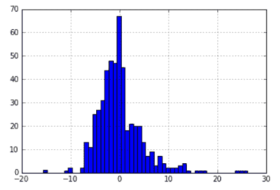
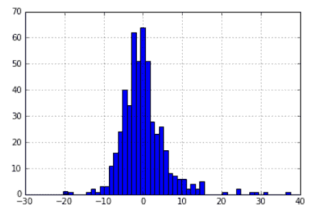
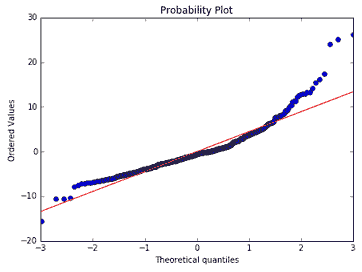
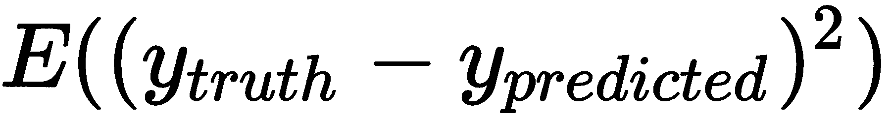
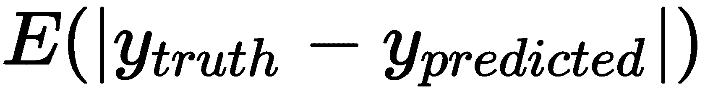
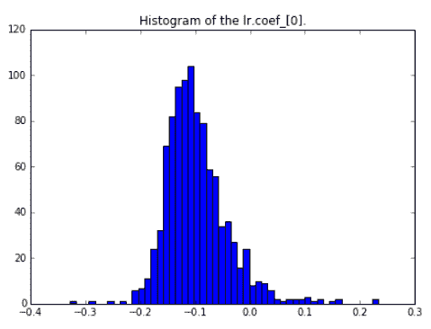
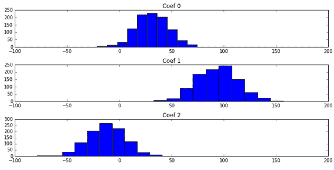
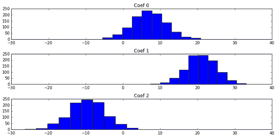
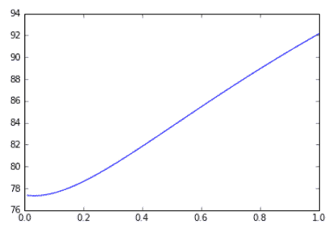
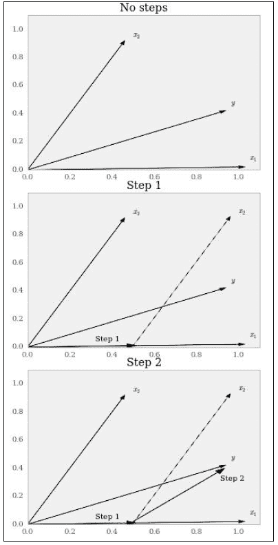

# 第四章：使用 scikit-learn 进行线性模型

本章包含以下几个步骤：

+   通过数据拟合一条直线

+   使用机器学习通过数据拟合一条直线

+   评估线性回归模型

+   使用岭回归克服线性回归的不足

+   优化岭回归参数

+   使用稀疏性正则化模型

+   采用更基础的方法使用 LARS 进行正则化

# 介绍

我推测我们天生能很好地感知线性函数。它们非常容易可视化、解释和说明。线性回归非常古老，可能是第一个统计模型。

在本章中，我们将采用机器学习方法进行线性回归。

请注意，这一章节与降维和 PCA 章节类似，涉及使用线性模型选择最佳特征。即使您决定不使用线性模型进行预测回归，也可以选择最有效的特征。

还要注意，线性模型提供了许多机器学习算法使用背后的直觉。例如，RBF 核 SVM 具有平滑边界，从近距离看，它们看起来像一条直线。因此，如果你记住你的线性模型直觉，解释 SVM 就会变得容易。

# 通过数据拟合一条直线

现在我们将从线性回归的基础建模开始。传统线性回归是第一个，因此可能是最基本的模型——数据的一条直线。

直观地说，对于大多数人来说很熟悉：一个输入变量的变化会按比例改变输出变量。许多人在学校、报纸的数据图表、工作中的演示中都见过它，因此你可以很容易向同事和投资者解释它。

# 准备工作

波士顿数据集非常适合用于回归分析。波士顿数据集包括波士顿多个地区的房屋中位数价格。它还包括可能影响房价的其他因素，例如犯罪率。首先，导入`datasets`模块，然后我们可以加载数据集：

```py
from sklearn import datasets boston = datasets.load_boston()
```

# 如何做...

实际上，在 scikit-learn 中使用线性回归非常简单。线性回归的 API 基本上与你从前一章已经熟悉的 API 相同。

1.  首先，导入`LinearRegression`对象并创建一个对象：

```py
from sklearn.linear_model import LinearRegression lr = LinearRegression()
```

1.  现在，只需将独立变量和因变量传递给`LinearRegression`的`fit`方法即可开始：

```py
lr.fit(boston.data, boston.target)
LinearRegression(copy_X=True, fit_intercept=True, n_jobs=1, normalize=False)
```

1.  现在，要获得预测结果，请执行以下操作：

```py
predictions = lr.predict(boston.data)
```

1.  你已经获得了线性回归生成的预测结果。现在，进一步探索`LinearRegression`类。查看残差，即实际目标集和预测目标集之间的差异：

```py
import numpy as np import pandas as pd import matplotlib.pyplot as plt  #within an Ipython notebook: 
%matplotlib inline 

pd.Series(boston.target - predictions).hist(bins=50)
```



表达特征系数及其名称的常见模式是`zip(boston.feature_names, lr.coef_)`。

1.  通过键入`lr.coef_`找到线性回归的系数：

```py
lr.coef_

array([ -1.07170557e-01,   4.63952195e-02,   2.08602395e-02,
         2.68856140e+00,  -1.77957587e+01,   3.80475246e+00,
         7.51061703e-04,  -1.47575880e+00,   3.05655038e-01,
        -1.23293463e-02,  -9.53463555e-01,   9.39251272e-03,
        -5.25466633e-01])
```

所以，回到数据上，我们可以看到哪些因素与结果呈负相关，哪些因素呈正相关。例如，正如预期的那样，城镇的人均犯罪率的增加与波士顿的房价呈负相关。人均犯罪率是回归分析中的第一个系数。

1.  你还可以查看截距，即当所有输入变量为零时目标的预测值：

```py
lr.intercept_

36.491103280361955
```

1.  如果你忘记了系数或截距属性的名称，可以输入 `dir(lr)`：

```py
[... #partial output due to length
 'coef_',
 'copy_X',
 'decision_function',
 'fit',
 'fit_intercept',
 'get_params',
 'intercept_',
 'n_jobs',
 'normalize',
 'predict',
 'rank_',
 'residues_',
 'score',
 'set_params',
 'singular_']
```

对于许多 scikit-learn 预测器，参数名以单词加一个下划线结尾，如 `coef_` 或 `intercept_`，这些参数特别值得关注。使用 `dir` 命令是检查 scikit 预测器实现中可用项的好方法。

# 它是如何工作的...

线性回归的基本思想是找到满足 *y = Xv* 的 *v* 系数集合，其中 *X* 是数据矩阵。对于给定的 *X* 值，通常不太可能找到一个完全满足方程的系数集合；如果存在不精确的规格或测量误差，误差项将被添加进来。

因此，方程变为 *y = Xv + e*，其中 *e* 被假定为正态分布，并且与 *X* 的值独立。从几何角度来看，这意味着误差项与 *X* 垂直。虽然这超出了本书的范围，但你可能想亲自证明 E(*Xv*) = 0。

# 还有更多内容...

`LinearRegression` 对象可以自动对输入进行标准化（或缩放）：

```py
lr2 = LinearRegression(normalize=True)
lr2.fit(boston.data, boston.target)
LinearRegression(copy_X=True, fit_intercept=True, normalize=True) 
predictions2 = lr2.predict(boston.data)
```

# 使用机器学习拟合数据线

使用机器学习的线性回归涉及在未见过的数据上测试线性回归算法。在这里，我们将进行 10 折交叉验证：

+   将数据集分成 10 个部分

+   在 9 个部分上进行训练，剩下的部分用来测试

+   重复这个过程 10 次，以便每一部分都能作为测试集一次

# 准备工作

如前一节所示，加载你想要应用线性回归的数据集，这里是波士顿住房数据集：

```py
from sklearn import datasets
boston = datasets.load_boston()
```

# 如何操作...

执行线性回归的步骤如下：

1.  导入 `LinearRegression` 对象并创建一个实例：

```py
from sklearn.linear_model import LinearRegression
lr = LinearRegression()
```

1.  将自变量和因变量传递给 `LinearRegression` 的 `fit` 方法：

```py
lr.fit(boston.data, boston.target)

LinearRegression(copy_X=True, fit_intercept=True, n_jobs=1, normalize=False)
```

1.  现在，为了获得 10 折交叉验证的预测结果，执行以下操作：

```py
from sklearn.model_selection import cross_val_predict

predictions_cv = cross_val_predict(lr, boston.data, boston.target, cv=10)
```

1.  观察残差，即真实数据与预测值之间的差异，它们比前一节中没有交叉验证的线性回归的残差更接近正态分布：

```py
import numpy as np
import pandas as pd
import matplotlib.pyplot as plt

#within Ipython
%matplotlib inline 

pd.Series(boston.target - predictions_cv).hist(bins=50)

```

1.  以下是通过交叉验证获得的新残差。与没有交叉验证时的情况相比，正态分布变得更加对称：



# 评估线性回归模型

在这个步骤中，我们将查看我们的回归如何拟合基础数据。我们在上一节中拟合了一个回归模型，但没有太关注我们实际的拟合效果。拟合模型后，首先要问的问题显然是：模型拟合得如何？在这个步骤中，我们将深入探讨这个问题。

# 准备工作

让我们使用 `lr` 对象和波士顿数据集——回到你在 *数据拟合直线* 章节中的代码。现在，`lr` 对象会有很多有用的方法，因为模型已经拟合完毕。

# 如何操作...

1.  从 IPython 开始，导入多个库，包括 `numpy`、`pandas` 和 `matplotlib` 用于可视化：

```py
import numpy as np
import pandas as pd
import matplotlib.pyplot as plt

%matplotlib inline
```

1.  值得查看 Q-Q 图。我们这里使用 `scipy`，因为它有内置的概率图：

```py
from scipy.stats import probplot
f = plt.figure(figsize=(7, 5))
ax = f.add_subplot(111)
tuple_out = probplot(boston.target - predictions_cv, plot=ax)
```

以下屏幕截图展示了概率图：



1.  输入 `tuple_out[1]`，你将得到以下结果：

```py
(4.4568597454452306, -2.9208080837569337e-15, 0.94762914118318298)
```

这是一个形式为 *(slope, intercept, r)* 的元组，其中 *slope* 和 *intercept* 来自最小二乘拟合，而 *r* 是决定系数的平方根。

1.  在这里，我们之前看到的偏斜值变得更清晰了。我们还可以查看一些其他的拟合指标；**均方误差** (**MSE**) 和 **均值绝对偏差** (**MAD**) 是两种常见的指标。让我们在 Python 中定义每个指标并使用它们。

```py
def MSE(target, predictions):
 squared_deviation = np.power(target - predictions, 2)
 return np.mean(squared_deviation)

MSE(boston.target, predictions)

21.897779217687503

def MAD(target, predictions):
 absolute_deviation = np.abs(target - predictions)
 return np.mean(absolute_deviation)

MAD(boston.target, predictions)

3.2729446379969205
```

1.  现在你已经看到了使用 NumPy 计算误差的公式，你还可以使用 `sklearn.metrics` 模块快速获取误差：

```py
from sklearn.metrics import mean_absolute_error, mean_squared_error

print 'MAE: ', mean_absolute_error(boston.target, predictions)
print 'MSE: ', mean_squared_error(boston.target, predictions)

 'MAE: ', 3.2729446379969205
 'MSE: ', 21.897779217687503
```

# 它是如何工作的...

MSE 的公式非常简单：



它将每个预测值与实际值之间的偏差平方后再取平均，这实际上是我们优化的目标，用于找到线性回归的最佳系数。高斯-马尔科夫定理实际上保证了线性回归的解是最优的，因为系数具有最小的期望平方误差且是无偏的。在下一节中，我们将探讨当我们允许系数存在偏差时会发生什么。MAD 是绝对误差的期望误差：



在拟合线性回归时，MAD 并没有被使用，但它值得一看。为什么？想一想每个指标的作用，以及在每种情况下哪些错误更重要。例如，在 MSE 中，较大的错误会比其他项受到更多的惩罚，因为平方项的存在。离群值有可能显著地扭曲结果。

# 还有更多...

有一点被略过了，那就是系数本身是随机变量，因此它们具有分布。让我们使用自助法（bootstrapping）来查看犯罪率系数的分布。自助法是一种常见的技术，用来了解估计的不确定性：

```py
n_bootstraps = 1000
len_boston = len(boston.target)
subsample_size = np.int(0.5*len_boston)

subsample = lambda: np.random.choice(np.arange(0, len_boston),size=subsample_size)
coefs = np.ones(n_bootstraps) #pre-allocate the space for the coefs
for i in range(n_bootstraps):
 subsample_idx = subsample()
 subsample_X = boston.data[subsample_idx]
 subsample_y = boston.target[subsample_idx]
 lr.fit(subsample_X, subsample_y)
 coefs[i] = lr.coef_[0]
```

现在，我们可以查看系数的分布：

```py
import matplotlib.pyplot as plt
f = plt.figure(figsize=(7, 5))
ax = f.add_subplot(111)
ax.hist(coefs, bins=50)
ax.set_title("Histogram of the lr.coef_[0].")
```

以下是生成的直方图：



我们还可能需要查看自助法（bootstrapping）生成的置信区间：

```py
np.percentile(coefs, [2.5, 97.5])

array([-0.18497204,  0.03231267])
```

这很有趣；事实上，有理由相信犯罪率可能对房价没有影响。注意零值位于**置信区间**（**CI**）-0.18 到 0.03 之间，这意味着它可能不起作用。还值得指出的是，自助法可能会带来更好的系数估计，因为自助法的均值收敛速度比使用常规估计方法找出系数要快。

# 使用岭回归克服线性回归的不足

在本节中，我们将学习岭回归。它与普通的线性回归不同；它引入了一个正则化参数来收缩系数。当数据集包含共线性因素时，这非常有用。

岭回归在共线性存在的情况下非常强大，甚至可以建模多项式特征：向量 *x*、*x*²、*x*³，……这些特征高度共线且相关。

# 准备开始

让我们加载一个有效秩较低的数据集，并通过系数来比较岭回归和线性回归。如果你不熟悉秩，它是线性独立列和线性独立行中的较小者。线性回归的一个假设是数据矩阵是满秩的。

# 如何操作...

1.  首先，使用`make_regression`创建一个包含三个预测变量的简单数据集，但其`effective_rank`为`2`。有效秩意味着，尽管矩阵在技术上是满秩的，但许多列之间存在高度的共线性：

```py
from sklearn.datasets import make_regression
reg_data, reg_target = make_regression(n_samples=2000,n_features=3, effective_rank=2, noise=10)
```

1.  首先，让我们回顾一下上一章使用自助法的常规线性回归：

```py
import numpy as np
n_bootstraps = 1000
len_data = len(reg_data)
subsample_size = np.int(0.5*len_data)
subsample = lambda: np.random.choice(np.arange(0, len_data),size=subsample_size)

coefs = np.ones((n_bootstraps, 3))
for i in range(n_bootstraps):
 subsample_idx = subsample()
 subsample_X = reg_data[subsample_idx]
 subsample_y = reg_target[subsample_idx]
 lr.fit(subsample_X, subsample_y)
 coefs[i][0] = lr.coef_[0]
 coefs[i][1] = lr.coef_[1]
 coefs[i][2] = lr.coef_[2]
```

1.  可视化系数：



1.  使用岭回归执行相同的步骤：

```py
from sklearn.linear_model import Ridge
r = Ridge()
n_bootstraps = 1000
len_data = len(reg_data)
subsample_size = np.int(0.5*len_data)
subsample = lambda: np.random.choice(np.arange(0, len_data),size=subsample_size)

coefs_r = np.ones((n_bootstraps, 3))
for i in range(n_bootstraps):
 subsample_idx = subsample()
 subsample_X = reg_data[subsample_idx]
 subsample_y = reg_target[subsample_idx]
 r.fit(subsample_X, subsample_y)
 coefs_r[i][0] = r.coef_[0]
 coefs_r[i][1] = r.coef_[1]
 coefs_r[i][2] = r.coef_[2]
```

1.  可视化结果：

```py
import matplotlib.pyplot as plt
plt.figure(figsize=(10, 5))

ax1 = plt.subplot(311, title ='Coef 0')
ax1.hist(coefs_r[:,0])

ax2 = plt.subplot(312,sharex=ax1, title ='Coef 1')
ax2.hist(coefs_r[:,1])

ax3 = plt.subplot(313,sharex=ax1, title ='Coef 2')
ax3.hist(coefs_r[:,2])
plt.tight_layout()
```



别被图表的相似宽度欺骗；岭回归的系数要接近零。

1.  让我们看一下系数之间的平均差异：

```py
np.var(coefs, axis=0)

array([ 228.91620444,  380.43369673,  297.21196544])
```

所以，平均而言，线性回归的系数要远高于岭回归的系数。这种差异是系数中的偏差（暂时忽略线性回归系数可能存在的偏差）。那么，岭回归的优势是什么呢？

1.  好吧，来看一下我们系数的方差：

```py
np.var(coefs_r, axis=0) 

array([ 19.28079241,  15.53491973,  21.54126386])
```

方差已经显著降低。这就是机器学习中常常讨论的偏差-方差权衡。接下来的内容将介绍如何调整岭回归中的正则化参数，这是这一权衡的核心。

# 优化岭回归参数

一旦你开始使用岭回归进行预测或了解你正在建模的系统中的关系，你就会开始考虑 alpha 的选择。

例如，使用普通最小二乘 (**OLS**) 回归可能会显示两个变量之间的关系；然而，当通过 alpha 进行正则化时，这种关系不再显著。这可能是一个是否需要做出决策的问题。

# 做好准备

通过交叉验证，我们将调整岭回归的 alpha 参数。如果你还记得，在岭回归中，gamma 参数通常在调用 `RidgeRegression` 时被表示为 alpha，因此，出现的问题是，最优的 alpha 值是什么？创建一个回归数据集，然后我们开始吧：

```py
from sklearn.datasets import make_regression
reg_data, reg_target = make_regression(n_samples=100, n_features=2, effective_rank=1, noise=10)
```

# 如何进行...

在 `linear_models` 模块中，有一个叫做 `RidgeCV` 的对象，代表岭回归交叉验证。它执行的交叉验证类似于 **留一交叉验证** (**LOOCV**)。

1.  在背后，它将为除了一个样本之外的所有样本训练模型。然后它会评估预测这个测试样本的误差：

```py
from sklearn.linear_model import RidgeCV
rcv = RidgeCV(alphas=np.array([.1, .2, .3, .4]))
rcv.fit(reg_data, reg_target)
```

1.  在我们拟合回归之后，alpha 属性将是最佳的 alpha 选择：

```py
rcv.alpha_

0.10000000000000001
```

1.  在之前的例子中，它是第一个选择。我们可能想要集中关注 `.1` 附近的值：

```py
rcv2 = RidgeCV(alphas=np.array([.08, .09, .1, .11, .12]))
rcv2.fit(reg_data, reg_target)

rcv2.alpha_

0.080000000000000002
```

我们可以继续这个探索，但希望这些机制已经很清晰了。

# 它是如何工作的...

这些机制可能很清楚，但我们应该再谈谈为什么，并定义最优值的含义。在交叉验证的每个步骤中，模型会对测试样本进行误差评分。默认情况下，本质上是平方误差。

我们可以强制 `RidgeCV` 对象存储交叉验证值；这将帮助我们可视化它所做的工作：

```py
alphas_to_test = np.linspace(0.01, 1)
rcv3 = RidgeCV(alphas=alphas_to_test, store_cv_values=True)
rcv3.fit(reg_data, reg_target)
```

如你所见，我们测试了从 `0.01` 到 `1` 的一堆点（共 50 个）。由于我们将 `store_cv_values` 设置为 `True`，我们可以访问这些值：

```py
rcv3.cv_values_.shape

(100L, 50L)
```

所以，在初始回归中我们有 100 个值，并测试了 50 个不同的 alpha 值。现在我们可以访问所有 50 个值的误差。因此，我们可以找到最小的均值误差，并选择它作为 alpha：

```py
smallest_idx = rcv3.cv_values_.mean(axis=0).argmin()
alphas_to_test[smallest_idx]

0.030204081632653063
```

这与 `RidgeCV` 类的 `rcv3` 实例找到的最佳值一致：

```py
rcv3.alpha_

0.030204081632653063
```

也值得可视化正在发生的事情。为此，我们将绘制所有 50 个测试 alpha 的均值：

```py
plt.plot(alphas_to_test, rcv3.cv_values_.mean(axis=0))
```



# 还有更多...

如果我们想使用自己的评分函数，也可以这么做。由于我们之前查找了 MAD，我们就用它来评分差异。首先，我们需要定义我们的损失函数。我们将从 `sklearn.metrics` 导入它：

```py
from sklearn.metrics import mean_absolute_error
```

在定义损失函数后，我们可以使用 `sklearn` 中的 `make_scorer` 函数。这将确保我们的函数被标准化，从而让 scikit 的对象知道如何使用它。此外，因为这是一个损失函数而不是评分函数，所以越低越好，因此需要让 `sklearn` 翻转符号，将其从最大化问题转变为最小化问题：

```py
from sklearn.metrics import make_scorer
MAD_scorer = make_scorer(mean_absolute_error, greater_is_better=False)
```

按照之前的方式继续寻找最小的负 MAD 分数：

```py
rcv4 = RidgeCV(alphas=alphas_to_test, store_cv_values=True, scoring=MAD_scorer)
rcv4.fit(reg_data, reg_target)
smallest_idx = rcv4.cv_values_.mean(axis=0).argmin()
```

查看最低的得分：

```py
rcv4.cv_values_.mean(axis=0)[smallest_idx]

-0.021805192650070034
```

它发生在 alpha 为 `0.01` 时：

```py
alphas_to_test[smallest_idx]

0.01
```

# 贝叶斯岭回归

此外，scikit-learn 还包含贝叶斯岭回归，它允许轻松估计置信区间。（注意，获取以下贝叶斯岭回归置信区间特别需要 scikit-learn 0.19.0 或更高版本。）

创建一条斜率为`3`且没有截距的直线，简化起见：

```py
X = np.linspace(0, 5)
y_truth = 3 * X
y_noise = np.random.normal(0, 0.5, len(y_truth)) #normally distributed noise with mean 0 and spread 0.1
y_noisy = (y_truth + y_noise)
```

导入、实例化并拟合贝叶斯岭回归模型。请注意，一维的`X`和`y`变量必须进行重塑：

```py
from sklearn.linear_model import BayesianRidge
br_inst = BayesianRidge().fit(X.reshape(-1, 1), y_noisy)
```

编写以下代码以获取正则化线性回归的误差估计：

```py
y_pred, y_err = br_inst.predict(X.reshape(-1, 1), return_std=True)
```

绘制结果。噪声数据是蓝色的点，绿色的线条大致拟合它：

```py
plt.figure(figsize=(7, 5))
plt.scatter(X, y_noisy)
plt.title("Bayesian Ridge Line With Error Bars")
plt.errorbar(X, y_pred, y_err, color='green')
```


最后，关于贝叶斯岭回归的补充说明，你可以通过交叉验证网格搜索对参数`alpha_1`、`alpha_2`、`lambda_1`和`lambda_2`进行超参数优化。

# 使用稀疏性来正则化模型

**最小绝对收缩与选择算子**（**LASSO**）方法与岭回归非常相似，也与**最小角回归**（**LARS**）类似。它与岭回归的相似之处在于我们通过一定的惩罚量来惩罚回归，而与 LARS 的相似之处在于它可以作为参数选择，通常会导致一个稀疏的系数向量。LASSO 和 LARS 都可以去除数据集中的许多特征，这取决于数据集的特点以及如何应用这些方法，这可能是你想要的，也可能不是。（而岭回归则保留所有特征，这使得你可以用来建模多项式函数或包含相关特征的复杂函数。）

# 正在准备

为了明确，LASSO 回归并非万能。使用 LASSO 回归可能会带来计算上的后果。正如我们在本配方中看到的，我们将使用一个不可微的损失函数，因此需要特定的、更重要的是、影响性能的解决方法。

# 如何操作...

执行 LASSO 回归的步骤如下：

1.  让我们回到可靠的`make_regression`函数，并使用相同的参数创建一个数据集：

```py
import numpy as np
from sklearn.datasets import make_regression
reg_data, reg_target = make_regression(n_samples=200, n_features=500, n_informative=5, noise=5)
```

1.  接下来，我们需要导入`Lasso`对象：

```py
from sklearn.linear_model import Lasso
lasso = Lasso()
```

1.  LASSO 包含许多参数，但最有趣的参数是`alpha`。它用于调整`Lasso`方法的惩罚项。目前，保持它为 1。顺便说一下，就像岭回归一样，如果这个项为零，LASSO 就等同于线性回归：

```py
lasso.fit(reg_data, reg_target)
```

1.  再次查看有多少系数保持非零：

```py
np.sum(lasso.coef_ != 0)

7

lasso_0 = Lasso(0)
lasso_0.fit(reg_data, reg_target)
np.sum(lasso_0.coef_ != 0)

500
```

我们的系数没有一个变为零，这正是我们预期的。实际上，如果你运行这个，你可能会收到来自 scikit-learn 的警告，建议你选择`LinearRegression`。

# 它是如何工作的...

# LASSO 交叉验证 – LASSOCV

选择最合适的 lambda 是一个关键问题。我们可以自己指定 lambda，或者使用交叉验证根据现有数据找到最佳选择：

```py
from sklearn.linear_model import LassoCV
lassocv = LassoCV()
lassocv.fit(reg_data, reg_target)
```

LASSOCV 将具有作为属性的最合适的 lambda。scikit-learn 在其符号中大多使用 alpha，但文献中使用 lambda：

```py
 lassocv.alpha_

0.75182924196508782
```

系数的数量可以通过常规方式访问：

```py
lassocv.coef_[:5]

array([-0., -0.,  0.,  0., -0.])
```

让 LASSOCV 选择最合适的最佳拟合，我们得到`15`个非零系数：

```py
np.sum(lassocv.coef_ != 0)

15
```

# LASSO 用于特征选择

LASSO 通常可以用于其他方法的特征选择。例如，您可以运行 LASSO 回归来获取合适数量的特征，然后在其他算法中使用这些特征。

为了获取我们想要的特征，创建一个基于非零列的掩码数组，然后过滤掉非零列，保留我们需要的特征：

```py
mask = lassocv.coef_ != 0
new_reg_data = reg_data[:, mask]
new_reg_data.shape

(200L, 15L)
```

# 采用更基本的方法进行 LARS 的正则化

借用 Gilbert Strang 对高斯消元法的评估，LARS 是一个你可能最终会考虑的想法，除非它已经在 Efron、Hastie、Johnstone 和 Tibshirani 的工作中被发现[1]。

# 准备工作

LARS 是一种回归技术，非常适合高维问题，即*p >> n*，其中*p*表示列或特征，*n*是样本的数量。

# 如何操作...

1.  首先，导入必要的对象。我们使用的数据将包含 200 个数据点和 500 个特征。我们还将选择低噪声和少量的信息性特征：

```py
from sklearn.datasets import make_regression
reg_data, reg_target = make_regression(n_samples=200, n_features=500, n_informative=10, noise=2)
```

1.  由于我们使用了 10 个信息性特征，让我们也指定希望 LARS 中有 10 个非零系数。我们可能事先无法确切知道信息性特征的数量，但这对学习来说是有帮助的：

```py
from sklearn.linear_model import Lars
lars = Lars(n_nonzero_coefs=10)
lars.fit(reg_data, reg_target)
```

1.  然后我们可以验证 LARS 返回正确数量的非零系数：

```py
np.sum(lars.coef_ != 0)

 10
```

1.  问题是为什么使用更少的特征更有用。为了说明这一点，让我们保留一半的数据并训练两个 LARS 模型，一个具有 12 个非零系数，另一个没有预定数量。我们在这里使用 12 是因为我们可能对重要特征的数量有所了解，但我们可能不确定确切的数量：

```py
train_n = 100
lars_12 = Lars(n_nonzero_coefs=12)
lars_12.fit(reg_data[:train_n], reg_target[:train_n])
lars_500 = Lars() # it's 500 by default
lars_500.fit(reg_data[:train_n], reg_target[:train_n]);

np.mean(np.power(reg_target[train_n:] - lars_12.predict(reg_data[train_n:]), 2))
```

1.  现在，为了查看每个特征如何拟合未知数据，请执行以下操作：

```py
87.115080975821513

np.mean(np.power(reg_target[train_n:] - lars_500.predict(reg_data[train_n:]), 2))

2.1212501492030518e+41
```

如果你错过了，再看看；测试集上的误差显然非常高。这就是高维数据集的问题所在；给定大量特征，通常不难在训练样本上得到一个拟合良好的模型，但过拟合成为了一个巨大的问题。

# 它是如何工作的...

LARS 通过反复选择与残差相关的特征来工作。在几何上，相关性实际上是特征和残差之间的最小角度；这也是 LARS 得名的原因。

选择第一个特征后，LARS 将继续沿最小角度方向移动，直到另一个特征与残差的相关性达到相同的程度。然后，LARS 将开始沿这两个特征的组合方向移动。为了直观地理解这一点，考虑以下图表：



所以，我们沿着**x1**移动，直到**x1**受到**y**的拉力与**x2**受到**y**的拉力相等。发生这种情况时，我们沿着一条路径移动，这条路径的角度等于**x1**和**x2**之间的角度除以二。

# 还有更多…

就像我们使用交叉验证来调整岭回归一样，我们也可以对 LARS 做同样的操作：

```py
from sklearn.linear_model import LarsCV
lcv = LarsCV()
lcv.fit(reg_data, reg_target)
```

使用交叉验证可以帮助我们确定使用的非零系数的最佳数量。这里，结果如下：

```py
np.sum(lcv.coef_ != 0)

23
```

# 参考文献

1.  Bradley Efron, Trevor Hastie, Iain Johnstone, 和 Robert Tibshirani, *最小角回归*, 《统计年鉴》32(2) 2004: 第 407–499 页, doi:10.1214/009053604000000067, MR2060166。
