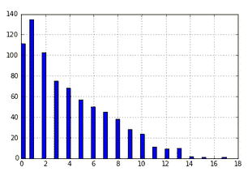
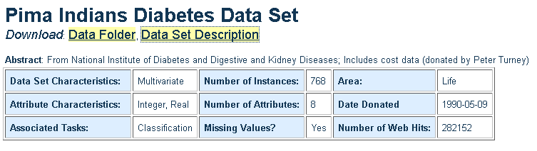
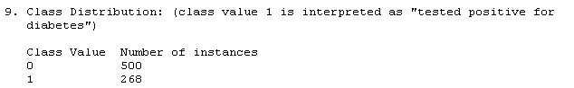

# 第五章：线性模型 – 逻辑回归

在本章中，我们将涵盖以下内容：

+   从 UCI 库加载数据

+   使用 pandas 查看 Pima 印第安人糖尿病数据集

+   查看 UCI Pima 印第安人数据集网页

+   使用逻辑回归进行机器学习

+   使用混淆矩阵检查逻辑回归错误

+   改变逻辑回归中的分类阈值

+   接收器操作特征 – ROC 分析

+   绘制没有上下文的 ROC 曲线

+   整合所有内容 – UCI 乳腺癌数据集

# 介绍

线性回归是一种非常古老的方法，是传统统计学的一部分。*机器学习线性回归*涉及训练集和测试集。通过这种方式，它可以与其他模型和算法通过*交叉验证*进行比较。*传统线性回归*则在整个数据集上进行训练和测试。这仍然是一种常见的做法，可能是因为线性回归往往是欠拟合，而非过拟合。

# 使用线性方法进行分类 – 逻辑回归

如第一章所示，*高效机器学习 – NumPy*，逻辑回归是一种分类方法。在某些情况下，它也可以作为回归器使用，因为它计算一个类别的实数概率，然后再进行分类预测。考虑到这一点，我们来探索**加利福尼亚大学欧文分校**（**UCI**）提供的 Pima 印第安人糖尿病数据集。

# 从 UCI 库加载数据

我们将加载的第一个数据集是 Pima 印第安人糖尿病数据集。这需要访问互联网。数据集由 Sigillito V.（1990）提供，存储在 UCI 机器学习库中（[`archive.ics.uci.edu/ml/machine-learning-databases/pima-indians-diabetes/pima-indians-diabetes.data`](https://archive.ics.uci.edu/ml/machine-learning-databases/pima-indians-diabetes/pima-indians-diabetes.data)），约翰·霍普金斯大学应用物理实验室，马里兰州劳雷尔。

如果你是开源老手，首先想到的可能是，这个数据库的许可证/授权是什么？这是一个非常重要的问题。UCI 库有一个使用政策，要求我们在使用数据库时引用它。我们可以使用它，但必须给予他们应有的赞扬并提供引用。

# 如何操作...

1.  打开 IPython 并导入`pandas`：

```py
import pandas as pd
```

1.  将 Pima 印第安人糖尿病数据集的网页地址作为字符串输入，如下所示：

```py
data_web_address = "https://archive.ics.uci.edu/ml/machine-learning-databases/pima-indians-diabetes/pima-indians-diabetes.data"
```

1.  将数据的列名输入为列表：

```py
column_names = ['pregnancy_x', 
 'plasma_con', 
 'blood_pressure', 
 'skin_mm', 
 'insulin', 
 'bmi', 
 'pedigree_func', 
 'age', 
 'target']
```

1.  将特征名称存储为一个列表。排除`target`列，这是`column_names`中的最后一列，因为它不是特征：

```py
feature_names = column_names[:-1]
```

1.  创建一个 pandas 数据框来存储输入数据：

```py
all_data = pd.read_csv(data_web_address , names=column_names)
```

# 使用 pandas 查看 Pima 印第安人糖尿病数据集

# 如何操作...

1.  你可以通过多种方式查看数据。查看数据框的顶部：

```py
all_data.head()
```


1.  这里似乎没有什么问题，除了可能有一个胰岛素水平为零的情况。这可能吗？那`skin_mm`变量呢？它可以是零吗？在你的 IPython 中做个注释：

```py
#Is an insulin level of 0 possible? Is a skin_mm of 0 possible?
```

1.  使用`describe()`方法获取数据框的粗略概览：

```py
all_data.describe()
```


1.  再次在笔记本中做个注释，记录其他零值的情况：

```py
#The features plasma_con, blood_pressure, skin_mm, insulin, bmi have 0s as values. These values could be physically impossible.
```

1.  绘制`pregnancy_x`变量的直方图。将`hist()`方法中的 bins 参数设置为 50，以获得更多的区间和更高分辨率的图像；否则，图像会难以阅读：

```py
#If within a notebook, include this line to visualize within the notebook.
%matplotlib inline

#The default is bins=10 which is hard to read in the visualization.
all_data.pregnancy_x.hist(bins=50)
```



1.  为数据框中的所有列绘制直方图。在方法中将`figsize`设置为元组`(15,9)`，并再次将 bins 设置为`50`；否则，图像会很难读取：

```py
all_data.hist(figsize=(15,9),bins=50)
```

`blood_pressure`和`bmi`看起来呈正态分布，除了异常的零值。

`pedigree_func`和`plasma_con`变量呈偏态正态分布（可能是对数正态分布）。`age`和`pregnancy_x`变量在某种程度上呈衰减状态。胰岛素和`skin_mm`变量看起来除了零值很多外，可能呈正态分布。

1.  最后，注意`target`变量中的类别不平衡。使用`value_counts()` pandas 系列方法重新检查这种不平衡：

```py
all_data.target.value_counts()

0    500
1    268
Name: target, dtype: int64
```

在许多情况下，人的描述是类别零而不是类别一。

# 查看 UCI Pima Indians 数据集的网页

我们进行了初步的探索性分析，以大致了解数据。现在我们将阅读 UCI Pima Indians 数据集的文档。

# 怎么做...

# 查看引用政策

1.  访问[`archive.ics.uci.edu/ml/datasets/pima+indians+diabetes`](https://archive.ics.uci.edu/ml/datasets/pima+indians+diabetes)。

1.  这里是关于 UCI Pima Indians 糖尿病数据集的所有信息。首先，滚动到页面底部，查看他们的引用政策。糖尿病数据集的通用 UCI 引用政策可以在以下链接找到：[`archive.ics.uci.edu/ml/citation_policy.html`](https://archive.ics.uci.edu/ml/citation_policy.html)。

1.  通用政策表示，若要发布使用数据集的材料，请引用 UCI 存储库。

# 阅读关于缺失值和上下文的说明

1.  页面顶部有重要链接和数据集摘要。摘要提到数据集中存在缺失值：



1.  在摘要下方，有一个属性描述（这就是我最初为列命名的方式）：


1.  那么这些类别变量到底意味着什么呢？目标变量中的零和一分别代表什么？为了弄清楚这一点，点击摘要上方的“数据集描述”链接。滚动到页面的第九点，那里会给出所需的信息：



这意味着 1 代表糖尿病的阳性结果。这是重要信息，并且在数据分析中提供了上下文。

1.  最后，有一个免责声明指出：正如一个仓库用户所指出的那样，这不可能是正确的：在某些地方有零值，而这些地方在生物学上是不可能的，例如血压属性。很可能零值表示缺失数据。

因此，我们在数据探索阶段怀疑某些不可能出现的零值时是正确的。许多数据集都有损坏或缺失的值。

# 使用逻辑回归进行机器学习

你熟悉训练和测试分类器的步骤。使用逻辑回归时，我们将执行以下操作：

+   将数据加载到特征和目标数组 `X` 和 `y` 中

+   将数据拆分为训练集和测试集

+   在训练集上训练逻辑回归分类器

+   在测试集上测试分类器的性能

# 准备中

# 定义 X、y——特征和目标数组

让我们开始使用 scikit-learn 的逻辑回归进行预测。首先执行必要的导入并设置输入变量 X 和目标变量 `y`：

```py
import numpy as np
import pandas as pd

X = all_data[feature_names]
y = all_data['target']
```

# 如何操作...

# 提供训练集和测试集

1.  导入 `train_test_split` 以为 `X` 和 `y` 创建测试集和训练集：输入和目标。注意 `stratify=y`，它会将分类变量 `y` 进行分层。这意味着 `y_train` 和 `y_test` 中的零和一的比例是相同的：

```py
from sklearn.model_selection import train_test_split
X_train, X_test, y_train, y_test = train_test_split(X, y, test_size=0.2, random_state=7,stratify=y)
```

# 训练逻辑回归模型

1.  现在导入 `LogisticRegression` 并将其拟合到训练数据上：

```py
from sklearn.linear_model import LogisticRegression
lr = LogisticRegression()
lr.fit(X_train,y_train)
```

1.  在测试集上进行预测并将其存储为 `y_pred`：

```py
y_pred = lr.predict(X_test)
```

# 对逻辑回归进行评分

1.  使用 `accuracy_score` 检查预测的准确性，这是分类正确的百分比：

```py
from sklearn.metrics import accuracy_score
accuracy_score(y_test,y_pred)

0.74675324675324672
```

所以，我们得到了一个分数，但这个分数是我们在这些情况下可以使用的最佳度量吗？我们能做得更好吗？也许可以。请看一下下面的结果混淆矩阵。

# 使用混淆矩阵检查逻辑回归的错误

# 准备中

导入并查看我们构建的逻辑回归的混淆矩阵：

```py
from sklearn.metrics import confusion_matrix
confusion_matrix(y_test, y_pred,labels = [1,0])

array([[27, 27],
 [12, 88]])
```

我向混淆矩阵传递了三个参数：

+   `y_test`：测试目标集

+   `y_pred`：我们的逻辑回归预测

+   `labels`：指代阳性类别

`labels = [1,0]` 表示阳性类别为 `1`，阴性类别为 `0`。在医学背景下，我们在探索 Pima 印第安糖尿病数据集时发现，类别 `1` 测试为糖尿病阳性。

这是混淆矩阵，再次以 pandas 数据框形式呈现：


# 如何操作...

# 阅读混淆矩阵

这个小的数字数组具有以下含义：


混淆矩阵不仅告诉我们分类过程中发生了什么，还能提供准确率评分。矩阵从左上到右下的对角线元素表示正确的分类。共有 27 + 88 = 115 个正确分类。对角线之外，共犯了 27 + 12 = 39 个错误分类。注意，115 / (115 + 39)再次得到分类器的准确度，大约为 0.75。

让我们再次关注错误。在混淆矩阵中，27 个人被错误地标记为没有糖尿病，尽管他们确实患有糖尿病。在实际情况下，这是比那些被认为患有糖尿病但实际上没有的人更严重的错误。第一类可能会回家后忘记，而第二类则可能会重新测试。

# 上下文中的一般混淆矩阵

一般的混淆矩阵，其中正类表示识别一种病症（此处为糖尿病），因此具有医学诊断背景：


# 改变逻辑回归中的分类阈值

# 准备工作

我们将利用以下事实：在逻辑回归分类中，存在回归过程，用于最小化那些本应被诊断为糖尿病的人却被送回家的次数。通过调用估算器的`predict_proba()`方法来实现：

```py
y_pred_proba = lr.predict_proba(X_test)
```

这将得到一个概率数组。查看该数组：

```py
y_pred_proba

array([[ 0.87110309,  0.12889691],
 [ 0.83996356,  0.16003644],
 [ 0.81821721,  0.18178279],
 [ 0.73973464,  0.26026536],
 [ 0.80392034,  0.19607966], ...
```

在第一行，类别`0`的概率约为 0.87，类别`1`的概率为 0.13。注意，作为概率，这些数字加起来为 1。由于只有两类，这个结果可以看作是一个回归器，一个关于类别为`1`（或`0`）概率的实数。通过直方图可视化类别为`1`的概率。

取数组的第二列，将其转换为 pandas 序列并绘制直方图：

```py
pd.Series(y_pred_proba[:,1]).hist()
```


在概率直方图中，相比选择 1 的高概率，低概率的选择较多。例如，选择 1 的概率通常在 0.1 到 0.2 之间。在逻辑回归中，算法默认只有在概率大于 0.5（即一半）时才会选择 1。现在，将其与开始时的目标直方图进行对比：

```py
all_data['target'].hist()
```


在接下来的步骤中，我们将：

+   调用类方法`y_pred_proba()`

+   使用具有特定阈值的`binarize`函数

+   查看由阈值生成的混淆矩阵

# 如何操作...

1.  要基于阈值选择分类类，请使用`preprocessing`模块中的`binarize`。首先导入它：

```py
from sklearn.preprocessing import binarize
```

1.  查看`y_pred_proba`的前两列：

```py
array([[ 0.87110309,  0.12889691],
 [ 0.83996356,  0.16003644]
```

1.  然后尝试对`y_pred_proba`使用`binarize`函数，设置阈值为`0.5`。查看结果：

```py
y_pred_default = binarize(y_pred_proba, threshold=0.5)
y_pred_default

array([[ 1.,  0.],
 [ 1.,  0.],
 [ 1.,  0.],
 [ 1.,  0.],
 [ 1.,  0.],
 [ 1.,  0.]
```

1.  `binarize`函数如果`y_pred_proba`中的值大于 0.5，则用`1`填充数组；否则填入`0`。在第一行，0.87 大于 0.5，而 0.13 不大于。因此，为了二值化，将 0.87 替换为`1`，将 0.13 替换为`0`。现在，查看`y_pred_default`的第一列：

```py
y_pred_default[:,1]

array([ 0.,  0.,  0.,  0.,  0.,  0 ...
```

这恢复了默认逻辑回归分类器在阈值`0.5`下所做的决策。

1.  在 NumPy 数组上尝试混淆矩阵函数会得到我们遇到的第一个混淆矩阵（请注意，标签再次选择为`[1,0]`）：

```py
confusion_matrix(y_test, y_pred_default[:,1],labels = [1,0])

array([[27, 27],
 [12, 88]])
```

1.  尝试不同的阈值，使得类别`1`有更高的选择概率。查看其混淆矩阵：

```py
y_pred_low = binarize(y_pred_proba, threshold=0.2)
confusion_matrix(y_test, y_pred_low[:,1],labels=[1,0]) #positive class is 1 again

array([[50,  4],
 [48, 52]])
```

通过更改阈值，我们增加了预测类别`1`的概率——增加了混淆矩阵第一列中数字的大小。现在，第一列的总和为 50 + 48 = 98。之前，第一列是 27 + 12 = 39，数字要小得多。现在只有四个人被错误分类为没有糖尿病，尽管他们实际上有。请注意，在某些情况下，这是一件好事。

当算法预测为零时，它很可能是正确的。当它预测为一时，它通常不准确。假设你经营一家医院。你可能喜欢这个测试，因为你很少会送走一个看似没有糖尿病的人，尽管他实际上有糖尿病。每当你送走那些确实有糖尿病的人时，他们就无法尽早治疗，导致医院、保险公司和他们自己都面临更高的费用。

你可以衡量测试在预测为零时的准确性。观察混淆矩阵的第二列，[4, 52]。在这种情况下，准确率为 52 / (52 + 4)，大约是 0.93。这叫做**负预测值**（**NPV**）。你可以编写一个函数来根据阈值计算 NPV：

```py
from __future__ import division #In Python 2.x
import matplotlib.pyplot as plt

def npv_func(th):
 y_pred_low = binarize(y_pred_proba, threshold=th)

 second_column = confusion_matrix(y_test, y_pred_low[:,1],labels=[1,0])[:,1]
 npv = second_column[1]/second_column.sum()
 return npv

npv_func(0.2)

0.9285714285714286
```

然后绘制它：

```py
ths = np.arange(0,1,0.05)

npvs = []
for th in np.arange(0,1.00,0.05):
 npvs.append(npv_func(th)) 

plt.plot(ths,npvs)
```


# 接收者操作特征 – ROC 分析

沿着检查 NPV 的思路，还有一些标准的度量方法用于检查混淆矩阵中的单元格。

# 准备就绪

# 敏感性

敏感性，像上一节中的 NPV 一样，是混淆矩阵单元格的数学函数。敏感性是接受测试且实际患有疾病的人群中，正确标记为有疾病的人群的比例，在这个例子中是糖尿病：


从数学角度看，它是正确标记为有疾病（TP）的患者与实际有疾病的所有人（TP + FN）之比。首先，回顾混淆矩阵的单元格。重点关注**真实**行，对应于*所有患有糖尿病的人*：


因此：


敏感性另一个名字是**真正阳性率**（**TPR**）。

# 从视觉角度来看

从另一个角度来看，混淆矩阵非常直观。让我们用直方图（下一张图中的左列）来可视化有糖尿病的阳性类别和没有糖尿病的阴性类别。每个类别大致呈正态分布。借助 SciPy，我可以找到最佳拟合的正态分布。右下角注明了阈值被设置为 0.5，这是逻辑回归中的默认设置。观察阈值是如何让我们选择**假阴性**（**FN**）和**假阳性**（**FP**）的，尽管这种选择并不完美。


# 如何操作...

# 在 scikit-learn 中计算 TPR

1.  scikit-learn 提供了方便的函数，用于根据阳性类别的概率向量`y_pred_proba[:,1]`来计算逻辑回归的敏感度或 TPR：

```py
from sklearn.metrics import roc_curve

fpr, tpr, ths = roc_curve(y_test, y_pred_proba[:,1])
```

这里，给定阳性类别向量，scikit-learn 中的`roc_curve`函数返回了一个包含三个数组的元组：

+   TPR 数组（记作`tpr`）

+   FPR 数组（记作`fpr`）

+   用于计算 TPR 和 FPR 的自定义阈值集（记作`ths`）

详细说明**假阳性率**（**FPR**），它描述了假警报的发生率。它是错误地认为没有糖尿病的人却被判定为有糖尿病的比例：


这是一个没有糖尿病的人的陈述。从数学角度来看，混淆矩阵的单元格如下：


# 绘制敏感度图

1.  在*y*轴绘制敏感度，在*x*轴绘制阈值：

```py
plt.plot(ths,tpr)
```


1.  因此，阈值越低，敏感度越高。查看阈值为`0.1`时的混淆矩阵：

```py
y_pred_th= binarize(y_pred_proba, threshold=0.1)
confusion_matrix(y_test, y_pred_th[:,1],labels=[1,0])

array([[54,  0],
 [81, 19]])
```

1.  在这种情况下，没有人会误以为自己得了糖尿病。然而，就像我们在计算 NPV 时的情况一样，当测试预测某人患有糖尿病时，它的准确性非常低。这种情况下的最佳情形是当阈值为`0.146`时：

```py
y_pred_th = binarize(y_pred_proba, threshold=0.146)
confusion_matrix(y_test, y_pred_th[:,1],labels=[1,0])

array([[54,  0],
 [67, 33]])
```

即便如此，当预测某人患有糖尿病时，测试结果也不起作用。它的有效性为 33 / (33 + 121) = 0.21，或者说 21%的准确率。

# 还有更多...

# 非医疗背景下的混淆矩阵

假设你是一位银行工作人员，想要确定一个客户是否值得获得购买房屋的抵押贷款。接下来是一个可能的混淆矩阵，展示了根据银行可用的客户数据是否应该给某人抵押贷款。

任务是对人群进行分类，并决定他们是否应该获得抵押贷款。在这种情况下，可以为每种情况分配一个数字。当混淆矩阵中的每个单元格都有明确的成本时，找到最佳分类器就更容易了：


# 绘制没有上下文的 ROC 曲线

# 如何操作...

ROC 曲线是任何分类器的诊断工具，没有任何上下文。没有上下文意味着我们尚不知道哪个错误类型（FP 或 FN）是更不可取的。让我们立即使用概率向量 `y_pred_proba[:,1]` 绘制它：

```py
from sklearn.metrics import roc_curve

fpr, tpr, ths = roc_curve(y_test, y_pred_proba[:,1])
plt.plot(fpr,tpr)
```


ROC 曲线是 FPR（假警报）在 *x* 轴和 TPR（找出所有有病且确实有病的人）在 *y* 轴上的图示。没有上下文时，它是一个衡量分类器性能的工具。

# 完美分类器

完美的分类器无论如何都会有 TPR 为 1，**假警报率**（**FAR**）：


在前面的图表中，FN 非常小；因此 TPR，TP / (TP + FN)，接近 1\. 其 ROC 曲线呈 L 形：


# 不完美的分类器

在以下图像中，分布重叠，类别之间无法区分：


在不完美的分类器中，FN 和 TN 几乎相等，FP 和 TP 也几乎相等。因此，通过替代，TPR TP/ (TP + FP) 几乎等于**假阴性率**（**FNR**）FP/ (FP + TN)。即使您改变阈值，这也是成立的。因此，我们得到的 ROC 曲线是斜率大约为 1 的直线：


# AUC – ROC 曲线下面积

L 形完美分类器的面积是 1 x 1 = 1\. 坏分类器的面积是 0.5\. 为了衡量分类器的性能，scikit-learn 提供了一个便捷的 **ROC 曲线下面积**（**AUC**）计算函数：

```py
from sklearn.metrics import auc

auc(fpr,tpr)

0.825185185185
```

# 将所有内容整合在一起 – UCI 乳腺癌数据集

# 如何做到...

数据集感谢 Street, N (1990)，UCI 机器学习库提供 ([`archive.ics.uci.edu/ml/machine-learning-databases/breast-cancer-wisconsin/breast-cancer-wisconsin.data`](https://archive.ics.uci.edu/ml/machine-learning-databases/breast-cancer-wisconsin/breast-cancer-wisconsin.data))，威斯康星大学，麦迪逊，WI：计算机科学系：

1.  阅读引用/许可证信息后，从 UCI 加载数据集：

```py
import numpy as np
import pandas as pd
data_web_address = data_web_address = "https://archive.ics.uci.edu/ml/machine-learning-databases/breast-cancer-wisconsin/breast-cancer-wisconsin.data"
column_names = ['radius',
 'texture',
 'perimeter',
 'area',
 'smoothness' 
 ,'compactness',
 'concavity',
 'concave points', 
 'symmetry',
 'malignant']

feature_names = column_names[:-1]
all_data = pd.read_csv(data_web_address , names=column_names)
```

1.  查看数据类型：

```py
all_data.dtypes

radius             int64
texture            int64
perimeter          int64
area               int64
smoothness         int64
compactness       object
concavity          int64
concave points     int64
symmetry           int64
malignant          int64
dtype: object
```

结果表明，特征紧凑度具有像 `?` 这样的特征。目前，我们不使用这个特征。

1.  现在，阅读文档，目标变量设置为 `2`（没有癌症）和 `4`（有癌症）。将变量更改为 `0` 代表没有癌症，`1` 代表有癌症：

```py
#changing the state of having cancer to 1, not having cancer to 0
all_data['malignant'] = all_data['malignant'].astype(np.int)
all_data['malignant'] = np.where(all_data['malignant'] == 4, 1,0) #4, and now 1 means malignant
all_data['malignant'].value_counts()

0    458
1    241
Name: malignant, dtype: int64
```

1.  定义 `X` 和 `y`：

```py
X = all_data[[col for col in feature_names if col != 'compactness']]
y = all_data.malignant
```

1.  将 `X` 和 `y` 分割成训练集和测试集：

```py
from sklearn.model_selection import train_test_split
X_train, X_test, y_train, y_test = train_test_split(X, y, test_size=0.2, random_state=7,stratify=y)

#Train and test the Logistic Regression. Use the method #predict_proba().
from sklearn.linear_model import LogisticRegression

lr = LogisticRegression()
lr.fit(X_train,y_train)
y_pred_proba = lr.predict_proba(X_test)
```

1.  绘制 ROC 曲线并计算 AUC 分数：

```py
import matplotlib.pyplot as plt
from sklearn.metrics import roc_curve, auc, roc_auc_score

fpr, tpr, ths = roc_curve(y_test, y_pred_proba[:,1])

auc_score = auc(fpr,tpr)
plt.plot(fpr,tpr,label="AUC Score:" + str(auc_score))
plt.xlabel('fpr',fontsize='15')
plt.ylabel('tpr',fontsize='15')
plt.legend(loc='best')
```


这个分类器表现得相当不错。

# 未来项目的概要

总体而言，对于未来的分类项目，您可以执行以下操作：

1.  加载您能找到的最佳数据，以解决特定问题。

1.  确定是否有分类上下文：是 FP 更好还是 FN 更好？

1.  使用 ROC-AUC 分数对数据进行无上下文的训练和测试。如果几个算法在此步骤中表现不佳，您可能需要回到第 1 步。

1.  如果上下文很重要，可以使用混淆矩阵进行探索。

逻辑回归特别适合执行这些步骤，尽管任何具有 `predict_proba()` 方法的算法也能非常相似地工作。作为一个练习，如果您有雄心，可以将此过程推广到其他算法甚至是一般回归。这里的主要观点是，并非所有的错误都是相同的，这一点在健康数据集中尤其重要，因为治疗所有患有某种病症的患者非常关键。

关于乳腺癌数据集的最后一点：观察数据由细胞测量值组成。您可以通过自动化计算机查看图片并使用传统程序或机器学习找到这些测量值来收集这些数据。
