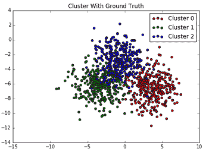
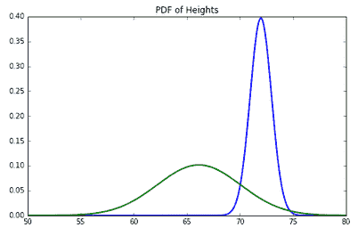
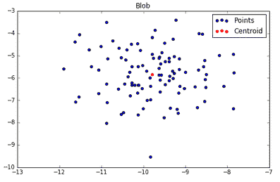

# 第六章：使用距离度量构建模型

本章将介绍以下配方：

+   使用 k-means 对数据进行聚类

+   优化质心数量

+   评估聚类的正确性

+   使用 MiniBatch k-means 处理更多数据

+   使用 k-means 聚类对图像进行量化

+   在特征空间中找到最接近的对象

+   使用高斯混合模型进行概率聚类

+   使用 k-means 进行异常值检测

+   使用 KNN 进行回归

# 介绍

本章我们将讨论聚类。聚类通常与无监督技术一起使用。这些技术假设我们不知道结果变量。这会导致实践中的结果和目标出现模糊，但尽管如此，聚类仍然很有用。正如我们将看到的那样，我们可以在监督环境中使用聚类来定位我们的估计。这或许是聚类如此有效的原因；它可以处理各种情况，且结果通常是，在没有更好术语的情况下，可以说是合理的。

本章我们将涵盖各种应用，从图像处理到回归和异常值检测。聚类与类别的分类相关。你有一个有限的簇或类别集。与分类不同，你事先并不知道这些类别。此外，聚类通常可以通过连续的、概率性的或优化的视角来看待。

不同的解释会导致不同的权衡。我们将讨论如何在这里拟合模型，这样当你遇到聚类问题时，你就有工具可以尝试多种模型。

# 使用 k-means 对数据进行聚类

在数据集中，我们观察到一些点聚集在一起。使用 k-means，我们将把所有点分到不同的组或簇中。

# 准备工作

首先，让我们演示一些简单的聚类操作，然后我们将讨论 k-means 如何工作：

```py
import numpy as np
import pandas as pd

from sklearn.datasets import make_blobs
blobs, classes = make_blobs(500, centers=3)
```

此外，由于我们将进行一些绘图操作，按如下方式导入 `matplotlib`：

```py
import matplotlib.pyplot as plt
%matplotlib inline  #Within an ipython notebook
```

# 如何进行……

我们将通过一个简单的示例，演示如何对虚拟数据的簇进行聚类。然后，我们将简要介绍 k-means 如何工作，以寻找最佳的簇数：

1.  观察我们的簇，我们可以看到有三个明显的聚类：

```py
f, ax = plt.subplots(figsize=(7.5, 7.5))
rgb = np.array(['r', 'g', 'b'])
ax.scatter(blobs[:, 0], blobs[:, 1], color=rgb[classes])
ax.set_title("Blobs")
```


现在我们可以使用 k-means 找到这些簇的中心。

1.  在第一个示例中，我们假设我们知道有三个中心：

```py
from sklearn.cluster import KMeans
kmean = KMeans(n_clusters=3)

kmean.fit(blobs)
KMeans(algorithm='auto', copy_x=True, init='k-means++', max_iter=300,
    n_clusters=3, n_init=10, n_jobs=1, precompute_distances='auto',
    random_state=None, tol=0.0001, verbose=0)
kmean.cluster_centers_ 
array([[ 3.48939154, -0.92786786],
 [-2.05114953,  1.58697731],
 [ 1.58182736, -6.80678064]])
f, ax = plt.subplots(figsize=(7.5, 7.5))
ax.scatter(blobs[:, 0], blobs[:, 1], color=rgb[classes])
ax.scatter(kmean.cluster_centers_[:, 0],kmean.cluster_centers_[:, 1], marker='*', s=250,color='black', label='Centers')
ax.set_title("Blobs")
ax.legend(loc='best')
```

1.  以下截图显示了输出结果：


1.  其他属性也很有用。例如，`labels_` 属性将为每个点生成预期的标签：

```py
kmean.labels_[:5]
array([2, 0, 1, 1, 0])
```

我们可以检查 `kmean.labels_` 是否与类别相同，但由于 k-means 在开始时并不知道类别，它无法将样本索引值分配给两个类别：

```py
classes[:5]
array([2, 0, 1, 1, 0])
```

随时交换类别中的 `1` 和 `0`，检查它们是否与 `labels_` 匹配。变换函数非常有用，因为它会输出每个点与质心之间的距离：

```py
kmean.transform(blobs)[:5]
array([[ 6.75214231, 9.29599311, 0.71314755], [ 3.50482136, 6.7010513 , 9.68538042], [ 6.07460324, 1.91279125, 7.74069472], [ 6.29191797, 0.90698131, 8.68432547], [ 2.84654338, 6.07653639, 3.64221613]])
```

# 它是如何工作的……

k-means 实际上是一个非常简单的算法，旨在最小化群内距离均值的平方和。我们将再次最小化平方和！

它首先设置一个预设的簇数 K，然后在以下步骤之间交替进行：

+   将每个观察值分配给最近的簇

+   通过计算分配给该簇的每个观察值的均值来更新每个质心

这一过程会一直持续，直到满足某个特定的标准。质心很难解释，而且确定我们是否有正确数量的质心也非常困难。理解数据是否标记过是很重要的，因为这将直接影响你可以使用的评估方法。

# 优化质心数量

在进行 k-means 聚类时，我们实际上无法事先知道正确的簇数，因此找出这一点是一个重要步骤。一旦我们知道（或估计）了质心的数量，问题就开始更像一个分类问题，因为我们可以使用的知识量大大增加了。

# 准备开始

对无监督技术的模型性能进行评估是一项挑战。因此，`sklearn`提供了几种在已知真实标签的情况下评估聚类的方法，而在未知真实标签的情况下，方法则非常有限。

我们将从单一簇模型开始并评估其相似度。这更多是为了操作上的需要，因为测量单一簇数量的相似度显然对于找到真实的簇数并没有什么用处。

# 如何做...

1.  为了开始，我们将创建几个簇状数据，用于模拟数据的聚类：

```py
from sklearn.datasets import make_blobs
import numpy as np
blobs, classes = make_blobs(500, centers=3)

from sklearn.cluster import KMeans
kmean = KMeans(n_clusters=3)
kmean.fit(blobs)
KMeans(algorithm='auto', copy_x=True, init='k-means++', max_iter=300,
 n_clusters=3, n_init=10, n_jobs=1, precompute_distances='auto',
 random_state=None, tol=0.0001, verbose=0)
```

1.  首先，我们来看轮廓距离。轮廓距离是群内不相似度与最接近的群外不相似度之间的差值与这两个值的最大值之比。可以将其视为衡量簇与簇之间分离度的标准。让我们看看从点到簇中心的距离分布；这对于理解轮廓距离很有帮助：

```py
from sklearn import metrics
silhouette_samples = metrics.silhouette_samples(blobs, kmean.labels_)
np.column_stack((classes[:5], silhouette_samples[:5]))
array([[ 0\.        ,  0.69568017],
       [ 0\.        ,  0.76789931],
       [ 0\.        ,  0.62470466],
       [ 0\.        ,  0.6266658 ],
       [ 2\.        ,  0.63975981]])
```

1.  以下是部分输出：


1.  注意，通常情况下，接近 1 的系数越多（这很好），得分越高。

# 它是如何工作的...

轮廓系数的平均值通常用于描述整个模型的拟合度：

```py
silhouette_samples.mean()
0.5633513643546264
```

这是非常常见的，实际上，metrics 模块暴露了一个函数，可以得到我们刚刚得到的值：

```py
metrics.silhouette_score(blobs, kmean.labels_)
0.5633513643546264
import matplotlib.pyplot as plt
%matplotlib inline

blobs, classes = make_blobs(500, centers=10)
silhouette_avgs = []
for k in range(2, 60):
 kmean = KMeans(n_clusters=k).fit(blobs)
 silhouette_avgs.append(metrics.silhouette_score(blobs, kmean.labels_))

f, ax = plt.subplots(figsize=(7, 5))
ax.plot(silhouette_avgs)
```

以下是输出：


这张图显示了随着质心数量的增加，轮廓系数的平均值变化。我们可以看到，根据数据生成过程，最佳的簇数是 3；但在这里，看起来它大约是 7 或 8。这就是聚类的现实；通常，我们无法获得正确的簇数。我们只能希望对簇数进行某种程度的估算。

# 评估簇的正确性

我们稍微谈了一下当真实标签未知时如何评估聚类。然而，我们还没有讨论如何在已知簇的情况下评估 k-means。在很多情况下，这个是不可知的；然而，如果有外部标注，我们将知道真实标签或至少知道某种代理标签。

# 准备好了

所以，让我们假设一个世界，假设有一个外部代理为我们提供真实标签。

我们将创建一个简单的数据集，以几种方式评估与真实标签的正确性度量，然后进行讨论：

```py
from sklearn import datasets
from sklearn import cluster

blobs, ground_truth = datasets.make_blobs(1000, centers=3,cluster_std=1.75)
```

# 如何操作...

1.  在讲解度量标准之前，我们先来看一下数据集：

```py
%matplotlib inline
import matplotlib.pyplot as plt

f, ax = plt.subplots(figsize=(7, 5))
colors = ['r', 'g', 'b']
for i in range(3):
 p = blobs[ground_truth == i]
 ax.scatter(p[:,0], p[:,1], c=colors[i],
 label="Cluster {}".format(i))
ax.set_title("Cluster With Ground Truth")
ax.legend()
```



1.  为了拟合一个 k-means 模型，我们将从聚类模块创建一个 `KMeans` 对象：

```py
kmeans = cluster.KMeans(n_clusters=3)
kmeans.fit(blobs)
KMeans(algorithm='auto', copy_x=True, init='k-means++', max_iter=300,
 n_clusters=3, n_init=10, n_jobs=1, precompute_distances='auto',
 random_state=None, tol=0.0001, verbose=0)
kmeans.cluster_centers_
array([[ 3.61594791, -6.6125572 ],
       [-0.76071938, -2.73916602],
       [-3.64641767, -6.23305142]])
```

1.  现在我们已经拟合了模型，让我们看看聚类中心：

```py
f, ax = plt.subplots(figsize=(7, 5))
colors = ['r', 'g', 'b']
for i in range(3): 
 p = blobs[ground_truth == i]
 ax.scatter(p[:,0], p[:,1], c=colors[i], label="Cluster {}".format(i))
```

以下是输出结果：


1.  现在我们可以将聚类性能视为分类练习，其相关的度量标准在这里也同样适用：

```py
for i in range(3):
 print (kmeans.labels_ == ground_truth)[ground_truth == i].astype(int).mean()
0.946107784431
0.135135135135
0.0750750750751
```

显然，我们有一些反向的簇。所以，让我们先解决这个问题，然后再看看准确性：

```py
new_ground_truth = ground_truth.copy()
new_ground_truth[ground_truth == 1] = 2
new_ground_truth[ground_truth == 2] = 1
0.946107784431
0.852852852853
0.891891891892
```

所以，我们大约有 90% 的时间是正确的。我们将看的第二个相似性度量是互信息得分：

```py
from sklearn import metrics
metrics.normalized_mutual_info_score(ground_truth, kmeans.labels_)
0.66467613668253844
```

当得分趋向 0 时，标签分配可能不是通过相似的过程生成的；然而，接近 1 的得分意味着两个标签之间有很大的相似性。

例如，让我们看看当互信息得分本身时会发生什么：

```py
metrics.normalized_mutual_info_score(ground_truth, ground_truth)
1.0
```

从名称上看，我们可以推测这可能是一个未归一化的 `mutual_info_score`：

```py
metrics.mutual_info_score(ground_truth, kmeans.labels_)
0.72971342940406325
```

这些非常接近；然而，归一化互信息是互信息除以每个集合真实标签和分配标签的熵乘积的平方根。

# 还有更多内容...

我们还没有讨论过的一个聚类度量，并且这个度量不依赖于真实标签的是惯性。它目前作为度量并没有得到很好的文档化。然而，它是 k-means 最小化的一个度量。

惯性是每个点与其分配的簇之间的平方差之和。我们可以通过一点 NumPy 来确定这一点：

```py
kmeans.inertia_
4849.9842988128385
```

# 使用 MiniBatch k-means 处理更多数据

K-means 是一种不错的方法；然而，它对于大量数据并不理想。这是由于 k-means 的复杂性。话虽如此，我们可以通过 MiniBatch k-means 以更好的算法复杂度获得近似解。

# 准备好了

MiniBatch k-means 是 k-means 的更快实现。K-means 在计算上非常昂贵；该问题是 NP 难问题。

然而，使用 MiniBatch k-means，我们可以通过数量级加速 k-means。这是通过使用许多叫做 MiniBatches 的子样本来实现的。考虑到子抽样的收敛性，提供了良好的初始条件时，可以实现对常规 k-means 的接近近似。

# 如何操作...

1.  让我们对 MiniBatch 聚类进行一些非常高层次的分析。首先，我们将看一下整体速度差异，然后再看一下估计误差：

```py
import numpy as np
from sklearn.datasets import make_blobs
blobs, labels = make_blobs(int(1e6), 3)

from sklearn.cluster import KMeans, MiniBatchKMeans
kmeans = KMeans(n_clusters=3)
minibatch = MiniBatchKMeans(n_clusters=3)
```

理解这些指标的目的是为了揭示问题。因此，在确保基准的最高准确性方面非常小心。关于这个主题有很多信息可供参考；如果你真的想深入了解为什么 MiniBatch k-means 在扩展性方面更好，建议查看现有的资料。

1.  现在设置完成了，我们可以测量时间差异：

```py
%time kmeans.fit(blobs) #IPython Magic
Wall time: 7.88 s 
KMeans(algorithm='auto', copy_x=True, init='k-means++', max_iter=300,
    n_clusters=3, n_init=10, n_jobs=1, precompute_distances='auto',
    random_state=None, tol=0.0001, verbose=0)
%time minibatch.fit(blobs)
Wall time: 2.66 s 
MiniBatchKMeans(batch_size=100, compute_labels=True, init='k-means++',
        init_size=None, max_iter=100, max_no_improvement=10, n_clusters=3,
        n_init=3, random_state=None, reassignment_ratio=0.01, tol=0.0,
        verbose=0)
```

1.  CPU 时间上有很大的差异。聚类性能的差异如下所示：

```py
kmeans.cluster_centers_
array([[-3.74304286, -0.4289715 , -8.69684375],
       [-5.73689621, -6.39166391,  6.18598804],
       [ 0.63866644, -9.93289824,  3.24425045]])
minibatch.cluster_centers_
array([[-3.72580548, -0.46135647, -8.63339789],
       [-5.67140979, -6.33603949,  6.21512625],
       [ 0.64819477, -9.87197712,  3.26697532]])
```

1.  查看这两个数组；找到的中心点是按照相同顺序排列的。这是随机的—聚类不必按相同顺序排列。查看第一个聚类中心之间的距离：

```py
from sklearn.metrics import pairwise
pairwise.pairwise_distances(kmeans.cluster_centers_[0].reshape(1, -1), minibatch.cluster_centers_[0].reshape(1, -1))
array([[ 0.07328909]])
```

1.  这似乎非常接近。对角线将包含聚类中心的差异：

```py
np.diag(pairwise.pairwise_distances(kmeans.cluster_centers_, minibatch.cluster_centers_))
array([ 0.07328909,  0.09072807,  0.06571599])
```

# 工作原理...

这里的批次很关键。通过批次迭代以找到批次均值；对于下一次迭代，相对于当前迭代更新前一批次均值。有几个选项决定了一般 k-means 的行为和参数，这些参数决定了 MiniBatch k-means 的更新方式。

`batch_size`参数决定了批处理的大小。仅供娱乐，让我们来运行 MiniBatch；但是这次我们将批处理大小设置为与数据集大小相同：

```py
minibatch = MiniBatchKMeans(batch_size=len(blobs))
%time minibatch.fit(blobs)
Wall time: 1min 
MiniBatchKMeans(batch_size=1000000, compute_labels=True, init='k-means++',
        init_size=None, max_iter=100, max_no_improvement=10, n_clusters=8,
        n_init=3, random_state=None, reassignment_ratio=0.01, tol=0.0,
        verbose=0)
```

显然，这违背了问题的本意，但它确实说明了一个重要的观点。选择不良的初始条件可能会影响模型的收敛效果，特别是聚类模型。对于 MiniBatch k-means，不能保证会达到全局最优解。

MiniBatch k-means 中有许多有力的教训。它利用了许多随机样本的力量，类似于自助法。在创建大数据的算法时，您可以在许多机器上并行处理许多随机样本。

# 使用 k-means 聚类量化图像

图像处理是一个重要的话题，聚类在其中有一些应用。值得指出的是，Python 中有几个非常好的图像处理库。`scikit-image`是 scikit-learn 的姊妹项目。如果您想要做一些复杂的事情，不妨看看它。

本章的重点之一是图像也是数据，聚类可以用来尝试猜测图像中某些物体的位置。聚类可以是图像处理流程的一部分。

# 准备工作

在这个示例中我们将会有一些乐趣。目标是使用一个聚类方法来对图像进行模糊处理。首先，我们将使用 SciPy 来读取图像。图像被转换为一个三维数组；`x`和`y`坐标描述了高度和宽度，第三维表示每个像素的 RGB 值。

首先，下载或将一个 `.jpg` 图像移动到你的 IPython 笔记本所在的文件夹。你可以使用你自己的照片。我使用的是一张名为 `headshot.jpg` 的自己的照片。

# 怎么做……

1.  现在，让我们用 Python 读取图像：

```py
%matplotlib inline
import matplotlib.pyplot as plt
from scipy import ndimage
img = ndimage.imread("headshot.jpg")
plt.figure(figsize = (10,7))
plt.imshow(img)
```

看到以下图片：


1.  就是我！现在我们有了图像，让我们检查一下它的维度：

```py
img.shape
(379L, 337L, 3L)
```

要实际对图像进行量化，我们需要将其转换为二维数组，长度为 379 x 337，宽度为 RGB 值。更好的理解方式是将其看作是三维空间中的一组数据点，接着对这些点进行聚类，以减少图像中远离的颜色——这是一种简单的量化方法。

1.  首先，让我们重新整理一下我们的数组；它是一个 NumPy 数组，因此操作起来很简单：

```py
x, y, z = img.shape
long_img = img.reshape(x*y, z)
long_img.shape
(127723L, 3L)
```

1.  现在我们可以开始聚类过程。首先，让我们导入聚类模块并创建一个 k-means 对象。我们将传递 `n_clusters=5`，这样我们就有五个聚类，或者说，五种不同的颜色。这将是一个很好的练习，帮助我们使用轮廓距离，这个在*优化质心数量*的练习中已经讲解过：

```py
from sklearn import cluster
k_means = cluster.KMeans(n_clusters=5)
k_means.fit(long_img)
centers = k_means.cluster_centers_
centers
array([[ 169.01964615,  123.08399844,   99.6097561 ],
       [  45.79271071,   94.56844879,  120.00911162],
       [ 218.74043562,  202.152748  ,  184.14355039],
       [  67.51082485,  151.50671141,  201.9408963 ],
       [ 169.69235986,  189.63274724,  143.75511521]])
```

# 它是如何工作的……

现在我们有了中心点，接下来我们需要的是标签。这将告诉我们哪些点应该与哪些聚类相关联：

```py
labels = k_means.labels_
labels
array([4, 4, 4, ..., 3, 3, 3])
```

此时，我们只需进行最简单的 NumPy 数组操作，然后稍作调整，就可以得到新的图像：

```py
plt.figure(figsize = (10,7))
plt.imshow(centers[labels].reshape(x, y, z))
```

以下是结果图像：


聚类将图像分成了几个区域。

# 在特征空间中寻找最接近的对象

有时，最简单的方法是找出两个对象之间的距离。我们只需要找出一个距离度量，计算成对距离，并将结果与预期的进行比较。

# 准备工作

scikit-learn 中的一个底层工具是 `sklearn.metrics.pairwise`。它包含了用于计算矩阵 X 中向量之间或 X 和 Y 中向量之间距离的服务器函数。这对于信息检索很有帮助。例如，给定一组具有属性 X 的客户，我们可能想选择一个参考客户，找到与该客户最相似的客户。

事实上，我们可能想根据相似度来对客户进行排名，而这种相似度是通过距离函数来衡量的。相似度的质量取决于特征空间的选择以及我们对空间进行的任何变换。我们将通过几种不同的距离衡量场景来进行讲解。

# 如何做……

我们将使用 `pairwise_distances` 函数来确定对象之间的相似性。请记住，相似性本质上就是通过我们定义的距离函数来衡量的：

1.  首先，让我们从 metrics 模块中导入成对距离函数，并创建一个数据集进行操作：

```py
import numpy as np

from sklearn.metrics import pairwise
from sklearn.datasets import make_blobs
points, labels = make_blobs()
```

1.  检查距离的最简单方法是 `pairwise_distances`：

```py
distances = pairwise.pairwise_distances(points)
```

`distances`是一个 N x N 矩阵，对角线上的值为 0。在最简单的情况下，让我们查看每个点与第一个点之间的距离：

```py
np.diag(distances) [:5] 
distances[0][:5]
array([ 0\. , 4.24926332, 8.8630893 , 5.01378992, 10.05620093])
```

1.  按照接近程度对点进行排名非常简单，使用 np.argsort：

```py
ranks = np.argsort(distances[0])
ranks[:5]
array([ 0, 63, 6, 21, 17], dtype=int64)
```

1.  `argsort`的一个优点是，现在我们可以对`points`矩阵进行排序，从而获得实际的点：

```py
points[ranks][:5]
 array([[-0.15728042, -5.76309092],
 [-0.20720885, -5.52734277],
 [-0.08686778, -6.42054076],
 [ 0.33493582, -6.29824601],
 [-0.89842683, -5.78335127]])
sp_points = points[ranks][:5]
```

1.  看到最接近的点是什么样子是很有用的，如下所示。选定的点[0]被涂成绿色。最接近的点被涂成红色（除了选定的点）。

请注意，除了某些保证之外，这个过程按预期工作：

```py
import matplotlib.pyplot as plt
%matplotlib inline

plt.figure(figsize=(10,7))
plt.scatter(points[:,0], points[:,1], label = 'All Points')
plt.scatter(sp_points[:,0],sp_points[:,1],color='red', label='Closest Points')
plt.scatter(points[0,0],points[0,1],color='green', label = 'Chosen Point')

plt.legend()
```


# 它是如何工作的...

给定某个距离函数，每个点通过成对的函数进行测量。考虑两个点，表示为 N 维空间中的向量，具有分量*p[i]*和*q[i]*；默认情况下是欧几里得距离，其公式如下：


口头上，这个过程是计算两个向量每个分量之间的差值，平方这些差异，求和所有差异，然后求平方根。这个过程看起来非常熟悉，因为我们在研究均方误差时用过类似的东西。如果我们取平方根，我们就得到了相同的结果。事实上，常用的一个度量是均方根偏差（RMSE），它就是应用的距离函数。

在 Python 中，这看起来如下所示：

```py
def euclid_distances(x, y):
 return np.power(np.power(x - y, 2).sum(), .5)
euclid_distances(points[0], points[1])
4.249263322917467  
```

在 scikit-learn 中还有其他一些函数，但 scikit-learn 还将使用 SciPy 的距离函数。在写这本书时，scikit-learn 的距离函数支持稀疏矩阵。有关距离函数的更多信息，请查阅 SciPy 文档：

+   `cityblock`

+   `cosine`

+   `euclidean`

+   `l1`

+   `l2`

+   `manhattan`

我们现在可以解决问题了。例如，如果我们站在网格的原点上，而这些线是街道，我们需要走多远才能到达点*(5, 5)*？

```py
 pairwise.pairwise_distances([[0, 0], [5, 5]], metric='cityblock')[0]
array([  0.,  10.])
```

# 还有更多...

使用成对距离，我们可以找到比特向量之间的相似度。对于 N 维向量*p*和*q*，问题就变成了计算汉明距离，其定义如下：


使用以下命令：

```py
X = np.random.binomial(1, .5, size=(2, 4)).astype(np.bool)
X
array([[False, False, False, False],
 [False, True, True, True]], dtype=bool)
pairwise.pairwise_distances(X, metric='hamming')
array([[ 0\. , 0.75],
 [ 0.75, 0\. ]])
```

请注意，scikit-learn 的`hamming`度量返回的是汉明距离除以向量的长度，在此情况下为`4`。

# 使用高斯混合模型进行概率聚类

在 k-means 中，我们假设簇的方差是相等的。这导致了一种空间的划分，决定了簇的分配方式；但是，如果方差不相等，并且每个簇点与其有某种概率关联，应该如何处理呢？

# 准备工作

有一种更具概率性的方式来看待 k-means 聚类。硬性 k-means 聚类等同于应用一个具有协方差矩阵 `S` 的高斯混合模型（GMM），其中协方差矩阵 `S` 可以分解为误差和单位矩阵的乘积。这对于每个聚类来说都是相同的协方差结构，导致聚类呈球形。然而，如果我们允许 S 变化，则可以估计 GMM 并用于预测。我们将首先在一维空间中看看这种方法如何运作，然后扩展到更多维度。

# 如何操作...

1.  首先，我们需要创建一些数据。例如，我们可以模拟女性和男性的身高。在整个例子中，我们将使用这个例子。它是一个简单的示例，但希望它能够展示我们在 N 维空间中试图实现的目标，这样稍微更容易进行可视化：

```py
import numpy as np

N = 1000
in_m = 72
in_w = 66
s_m = 2
s_w = s_m
m = np.random.normal(in_m, s_m, N)
w = np.random.normal(in_w, s_w, N)
from matplotlib import pyplot as plt
%matplotlib inline
f, ax = plt.subplots(figsize=(7, 5))
ax.set_title("Histogram of Heights")
ax.hist(m, alpha=.5, label="Men");
ax.hist(w, alpha=.5, label="Women");
ax.legend()
```

这是输出结果：


1.  接下来，我们可能有兴趣对子集进行抽样，拟合分布，然后预测剩余的组：

```py
 random_sample = np.random.choice([True, False], size=m.size)
 m_test = m[random_sample]
 m_train = m[~random_sample]
 w_test = w[random_sample]
 w_train = w[~random_sample]
```

1.  现在，我们需要根据训练集获取男性和女性身高的经验分布：

```py
from scipy import stats
m_pdf = stats.norm(m_train.mean(), m_train.std())
w_pdf = stats.norm(w_train.mean(), w_train.std())
```

对于测试集，我们将根据数据点来自某个分布的似然度进行计算，最有可能的分布将被分配到相应的标签。

1.  我们当然会查看我们的准确度：

```py
m_pdf.pdf(m[0])
0.19762291119664221
w_pdf.pdf(m[0])
0.00085042279862613103
```

1.  注意似然度的差异。假设我们在男性概率较高时进行猜测，但如果女性的概率更高时，我们会覆盖这些猜测：

```py
guesses_m = np.ones_like(m_test)
guesses_m[m_pdf.pdf(m_test) &lt; w_pdf.pdf(m_test)] = 0
```

1.  显然，问题是我们有多准确。由于如果我们猜对了，`guesses_m` 将是 *1*，如果猜错了，则为 *0*，我们可以取向量的均值来计算准确度：

```py
guesses_m.mean()
0.94176706827309242
```

1.  还不错！现在，为了查看我们在女性组上的表现，我们使用以下命令：

```py
guesses_w = np.ones_like(w_test)
guesses_w[m_pdf.pdf(w_test) > w_pdf.pdf(w_test)] = 0
guesses_w.mean()
 0.93775100401606426
```

1.  让我们允许不同组之间的方差有所不同。首先，创建一些新的数据：

```py
s_m = 1
s_w = 4
m = np.random.normal(in_m, s_m, N)
w = np.random.normal(in_w, s_w, N)
```

1.  然后，创建一个训练集：

```py
m_test = m[random_sample]
m_train = m[~random_sample]
w_test = w[random_sample]
w_train = w[~random_sample]
f, ax = plt.subplots(figsize=(7, 5))
ax.set_title("Histogram of Heights")
ax.hist(m_train, alpha=.5, label="Men");
ax.hist(w_train, alpha=.5, label="Women");
ax.legend()
```


1.  现在我们可以创建相同的概率密度函数（PDFs）：

```py
m_pdf = stats.norm(m_train.mean(), m_train.std())
w_pdf = stats.norm(w_train.mean(), w_train.std())

x = np.linspace(50,80,300)
plt.figure(figsize=(8,5))
plt.title('PDF of Heights')
plt.plot(x, m_pdf.pdf(x), 'k', linewidth=2, color='blue', label='Men')
plt.plot(x, w_pdf.pdf(x), 'k', linewidth=2, color='green',label='Women')
```

1.  以下是输出结果：



你可以在一个多维空间中想象这个过程：

```py
class_A = np.random.normal(0, 1, size=(100, 2))
class_B = np.random.normal(4, 1.5, size=(100, 2))
f, ax = plt.subplots(figsize=(8, 5))
plt.title('Random 2D Normal Draws')
ax.scatter(class_A[:,0], class_A[:,1], label='A', c='r')
ax.scatter(class_B[:,0], class_B[:,1], label='B')
```


# 它是如何工作的...

好的，现在我们已经看过如何根据分布来分类数据点，接下来我们看看如何在 scikit-learn 中实现这一点：

```py
from sklearn.mixture import GaussianMixture
gmm = GaussianMixture(n_components=2)
X = np.row_stack((class_A, class_B))
y = np.hstack((np.ones(100), np.zeros(100)))
```

由于我们是认真的数据科学家，我们将创建一个训练集：

```py
train = np.random.choice([True, False], 200)
gmm.fit(X[train])
GaussianMixture(covariance_type='full', init_params='kmeans', max_iter=100,
 means_init=None, n_components=2, n_init=1, precisions_init=None,
 random_state=None, reg_covar=1e-06, tol=0.001, verbose=0,
 verbose_interval=10, warm_start=False, weights_init=None)
```

拟合和预测的方式与在 scikit-learn 中拟合其他对象时相同：

```py
gmm.fit(X[train])
gmm.predict(X[train])[:5]
array([0, 0, 0, 0, 0], dtype=int64)
```

在模型拟合之后，还有其他方法值得关注。例如，使用 `score_samples`，我们可以获得每个标签的每个样本的似然度。

# 使用 k-means 进行异常值检测

在这个例子中，我们将讨论 k-means 在异常值检测中的辩论和机制。它在隔离某些类型的错误时可能有用，但使用时需要小心。

# 准备工作

我们将使用 k-means 对一组点进行异常值检测。值得注意的是，在异常值和异常值检测方面有许多不同的观点。一方面，我们可能通过移除异常值去除了一些由数据生成过程产生的点；另一方面，异常值可能是由于测量误差或其他外部因素导致的。

这是我们对这个辩论给出的最大信任。接下来的部分将关注识别异常值；我们将假设移除异常值的选择是合理的。异常值检测的过程是找到簇的质心，然后通过计算与质心的距离来识别潜在的异常值点。

# 如何操作……

1.  首先，我们将生成一个包含 100 个点的单一簇，然后识别出距离质心最远的五个点。这些点可能是异常值：

```py
from sklearn.datasets import make_blobs
X, labels = make_blobs(100, centers=1)
import numpy as np
```

1.  k-means 聚类必须具有一个单一的质心，这是很重要的。这个概念类似于用于异常值检测的单类 SVM：

```py
from sklearn.cluster import KMeans
kmeans = KMeans(n_clusters=1)
kmeans.fit(X)
KMeans(algorithm='auto', copy_x=True, init='k-means++', max_iter=300,
 n_clusters=1, n_init=10, n_jobs=1, precompute_distances='auto',
 random_state=None, tol=0.0001, verbose=0)
```

1.  现在，让我们看看这个图。正在家里一起操作的朋友们，试着猜猜哪些点会被识别为五个异常值之一：

```py
import matplotlib.pyplot as plt
%matplotlib inline

f, ax = plt.subplots(figsize=(8, 5))
ax.set_title("Blob")
ax.scatter(X[:, 0], X[:, 1], label='Points')
ax.scatter(kmeans.cluster_centers_[:, 0],kmeans.cluster_centers_[:, 1], label='Centroid',color='r')
ax.legend()
```

以下是输出结果：



1.  现在，让我们识别出最接近的五个点：

```py
distances = kmeans.transform(X)

# argsort returns an array of indexes which will sort the array in ascending order
# so we reverse it via [::-1] and take the top five with [:5]

sorted_idx = np.argsort(distances.ravel())[::-1][:5]
```

1.  让我们看看哪些点离得最远：

```py
f, ax = plt.subplots(figsize=(7, 5))
ax.set_title("Single Cluster")
ax.scatter(X[:, 0], X[:, 1], label='Points')
ax.scatter(kmeans.cluster_centers_[:, 0],kmeans.cluster_centers_[:, 1],label='Centroid', color='r')
ax.scatter(X[sorted_idx][:, 0], X[sorted_idx][:, 1],label='Extreme Value', edgecolors='g',facecolors='none', s=100)
ax.legend(loc='best')
```

以下是输出结果：


1.  如果我们愿意，去除这些点是很简单的：

```py
new_X = np.delete(X, sorted_idx, axis=0) 
```

此外，随着这些点的移除，质心明显发生了变化：

```py
new_kmeans = KMeans(n_clusters=1)
new_kmeans.fit(new_X)
```

1.  让我们可视化一下旧质心和新质心之间的差异：

```py
f, ax = plt.subplots(figsize=(7, 5))
ax.set_title("Extreme Values Removed")
ax.scatter(new_X[:, 0], new_X[:, 1], label='Pruned Points')
ax.scatter(kmeans.cluster_centers_[:, 0],kmeans.cluster_centers_[:, 1], label='Old Centroid',color='r',s=80, alpha=.5)
ax.scatter(new_kmeans.cluster_centers_[:, 0],new_kmeans.cluster_centers_[:, 1], label='New Centroid',color='m', s=80, alpha=.5)
 ax.legend(loc='best')
```

以下是输出结果：


很明显，质心几乎没有移动，这在移除五个最极端的值时是可以预期的。这个过程可以重复进行，直到我们满意数据能代表这个过程。

# 它是如何工作的……

正如我们已经看到的，高斯分布和 k-means 聚类之间有着根本的联系。让我们基于质心和样本协方差矩阵创建一个经验高斯分布，并查看每个点的概率——理论上，这就是我们移除的那五个点。这实际上表明我们已经移除了最不可能出现的值。距离和可能性之间的这种关系非常重要，在你的机器学习训练中会经常遇到。使用以下命令创建经验高斯分布：

```py
from scipy import stats
emp_dist = stats.multivariate_normal(kmeans.cluster_centers_.ravel())
lowest_prob_idx = np.argsort(emp_dist.pdf(X))[:5]
np.all(X[sorted_idx] == X[lowest_prob_idx]) 

True
```

# 使用 KNN 进行回归

回归在本书的其他部分已经涉及，但我们也可能想对特征空间中的小范围进行回归。我们可以认为我们的数据集受到多个数据处理过程的影响。如果这是真的，只有在相似的数据点上进行训练才是明智的选择。

# 准备工作

我们的老朋友——回归，可以在聚类的背景下使用。回归显然是一种监督学习技术，因此我们将使用**K-最近邻**（**KNN**）聚类，而不是 K 均值聚类。对于 KNN 回归，我们将使用特征空间中离测试点最近的 K 个点来构建回归模型，而不是像常规回归那样使用整个特征空间。

# 如何实现…

对于这个示例，我们将使用`iris`数据集。如果我们想预测每朵花的花瓣宽度，通过鸢尾花种类进行聚类可能会为我们带来更好的结果。KNN 回归不会根据种类进行聚类，但我们会假设相同种类的样本在特征空间中会较为接近，在这个例子中，即花瓣长度：

1.  我们将使用`iris`数据集进行这个示例：

```py
import numpy as np
from sklearn import datasets
iris = datasets.load_iris()
iris.feature_names
```

1.  我们将尝试基于萼片的长度和宽度预测花瓣长度。我们还将拟合一个常规的线性回归，看看 KNN 回归与它相比表现如何：

```py
 X = iris.data[:,:2]
 y = iris.data[:,2]

 from sklearn.linear_model import LinearRegression
 lr = LinearRegression()
 lr.fit(X, y)
 print "The MSE is: {:.2}".format(np.power(y - lr.predict(X),2).mean())

The MSE is: 0.41
```

1.  现在，对于 KNN 回归，使用以下代码：

```py
from sklearn.neighbors import KNeighborsRegressor
knnr = KNeighborsRegressor(n_neighbors=10)
knnr.fit(X, y)
print "The MSE is: {:.2}".format(np.power(y - knnr.predict(X),2).mean()) 

The MSE is: 0.17
```

1.  让我们看看当我们让 KNN 回归使用离测试点最近的 10 个点时，结果会是怎样：

```py
f, ax = plt.subplots(nrows=2, figsize=(7, 10))
ax[0].set_title("Predictions")
ax[0].scatter(X[:, 0], X[:, 1], s=lr.predict(X)*80, label='LR Predictions', color='c', edgecolors='black')
ax[1].scatter(X[:, 0], X[:, 1], s=knnr.predict(X)*80, label='k-NN Predictions', color='m', edgecolors='black')
ax[0].legend()
ax[1].legend()
```


1.  预测结果大部分是接近的，这可能是显而易见的，但让我们看看 Setosa 种类的预测结果与实际值的对比：

```py
setosa_idx = np.where(iris.target_names=='setosa')
setosa_mask = iris.target == setosa_idx[0]
y[setosa_mask][:5]
array([ 1.4,  1.4,  1.3,  1.5,  1.4])
knnr.predict(X)[setosa_mask][:5]
array([ 1.46,  1.47,  1.51,  1.42,  1.48])
lr.predict(X)[setosa_mask][:5]
array([ 1.83762646,  2.1510849 ,  1.52707371,  1.48291658,  1.52562087])
```

1.  再次查看图表，我们看到 Setosa 种类（左上角的聚类）在常规线性回归中被大大高估，而 KNN 则非常接近实际值。

# 它是如何工作的..

KNN 回归非常简单，通过取离测试点最近的*K*个点的平均值来计算。让我们手动预测一个点：

```py
 example_point = X[0]
```

现在，我们需要找到离我们的`example_point`最近的 10 个点：

```py
from sklearn.metrics import pairwise
distances_to_example = pairwise.pairwise_distances(X)[0]
ten_closest_points = X[np.argsort(distances_to_example)][:10]
ten_closest_y = y[np.argsort(distances_to_example)][:10]
ten_closest_y.mean() 

1.46
```

我们可以看到，结果非常接近预期。
