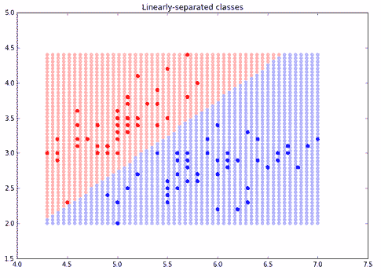
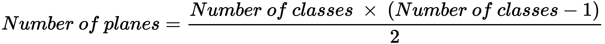
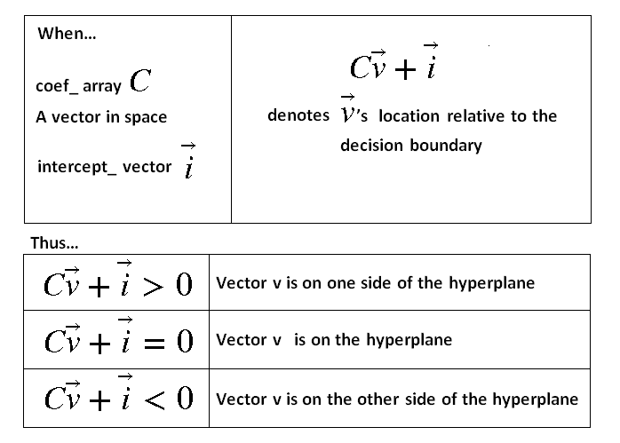
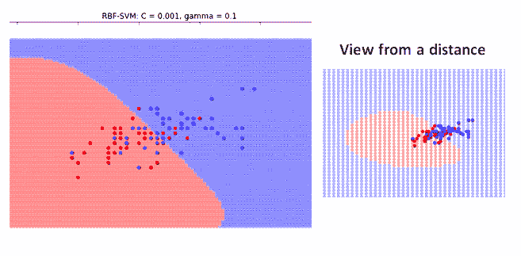
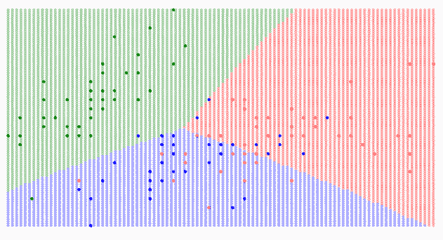

# 第八章：支持向量机

在本章中，我们将涵盖以下内容：

+   使用线性 SVM 进行数据分类

+   优化 SVM

+   使用 SVM 进行多类分类

+   支持向量回归

# 介绍

在本章中，我们将首先使用**支持向量机**（**SVM**）与线性核，以大致了解 SVM 的工作原理。它们创建一个超平面，或在多个维度中的线性面，最佳地分隔数据。

在二维空间中，这很容易看出：超平面是分隔数据的直线。我们将看到 SVM 的系数和截距数组。它们一起唯一地描述了一个`scikit-learn`线性 SVC 预测器。

在本章的其余部分，SVM 使用**径向基函数**（**RBF**）核。它们是非线性的，但具有平滑的分隔面。在实际应用中，SVM 在许多数据集上表现良好，因此是`scikit-learn`库的一个重要组成部分。

# 使用线性 SVM 进行数据分类

在第一章中，我们看到了一些使用 SVM 进行分类的示例。我们重点讨论了 SVM 在分类性能上略优于逻辑回归，但大部分时间我们并未深入探讨 SVM。

在这里，我们将更仔细地关注它们。虽然 SVM 没有容易的概率解释，但它们有一个直观的几何解释。线性 SVM 的主要思想是通过最佳的平面分隔两个类。

让我们使用 SVM 对两个类进行线性分隔。

# 准备工作

让我们从加载并可视化`scikit-learn`中提供的鸢尾花数据集开始：

# 加载数据

加载部分鸢尾花数据集。这将使我们能够与第一章进行轻松的比较：

```py
#load the libraries we have been using
import numpy as np 
import pandas as pd 
import matplotlib.pyplot as plt  #Library for visualization

from sklearn import datasets

iris = datasets.load_iris()
X_w = iris.data[:, :2]  #load the first two features of the iris data 
y_w = iris.target         #load the target of the iris data
```

现在，我们将使用 NumPy 掩码来关注前两个类：

```py
#select only the first two classes for both the feature set and target set
#the first two classes of the iris dataset: Setosa (0), Versicolour (1)

X = X_w[y_w < 2] 
y = y_w[y_w < 2]

```

# 可视化这两个类

使用 matplotlib 绘制`0`和`1`类。请记住，`X_0[:,0]`表示 NumPy 数组的第一列。

在以下代码中，`X_0`表示与目标`y`为`0`相对应的输入子集，而`X_1`是目标值为`1`的匹配子集：

```py
X_0 = X[y == 0]
X_1 = X[y == 1]

#to visualize within IPython:
%matplotlib inline 
plt.figure(figsize=(10,7)) #change figure-size for easier viewing
plt.scatter(X_0[:,0],X_0[:,1], color = 'red')
plt.scatter(X_1[:,0],X_1[:,1], color = 'blue')
```


从图表中可以清楚地看出，我们可以找到一条直线来分隔这两个类。

# 如何操作...

找到 SVM 直线的过程很简单。这与任何`scikit-learn`的监督学习估计器的过程相同：

1.  创建训练集和测试集。

1.  创建 SVM 模型实例。

1.  将 SVM 模型拟合到加载的数据。

1.  使用 SVM 模型进行预测，并在准备好对未见数据进行预测之前，衡量模型的性能。

让我们开始吧：

1.  将前两个类的前两个特征的数据集进行划分。对目标集进行分层：

```py
from sklearn.model_selection import train_test_split
X_train, X_test, y_train, y_test = train_test_split(X, y, test_size=0.2, random_state=7,stratify=y)
```

1.  创建 SVM 模型实例。将核设置为线性，因为我们希望有一条线来分隔这个例子中涉及的两个类：

```py
from sklearn.svm import SVC

svm_inst = SVC(kernel='linear')
```

1.  拟合模型（训练模型）：

```py
svm_inst.fit(X_train,y_train)
```

1.  使用测试集进行预测：

```py
y_pred = svm_inst.predict(X_test)
```

1.  测量 SVM 在测试集上的表现：

```py
from sklearn.metrics import accuracy_score

accuracy_score(y_test, y_pred) 

1.0
```

它在测试集上表现得非常好。这并不奇怪，因为当我们可视化每个类别时，它们很容易被视觉上分开。

1.  通过在二维网格上使用估算器，来可视化决策边界，即分隔类别的直线：

```py
from itertools import product

#Minima and maxima of both features
xmin, xmax = np.percentile(X[:, 0], [0, 100])
ymin, ymax = np.percentile(X[:, 1], [0, 100])

#Grid/Cartesian product with itertools.product
test_points = np.array([[xx, yy] for xx, yy in product(np.linspace(xmin, xmax), np.linspace(ymin, ymax))])

#Predictions on the grid
test_preds = svm_inst.predict(test_points)
```

1.  通过为预测着色来绘制网格。请注意，我们已经修改了之前的可视化图像，加入了 SVM 的预测：

```py
X_0 = X[y == 0]
X_1 = X[y == 1]

%matplotlib inline
plt.figure(figsize=(10,7))   #change figure-size for easier viewing
plt.scatter(X_0[:,0],X_0[:,1], color = 'red')
plt.scatter(X_1[:,0],X_1[:,1], color = 'blue')

colors = np.array(['r', 'b'])
plt.scatter(test_points[:, 0], test_points[:, 1], color=colors[test_preds], alpha=0.25)
plt.scatter(X[:, 0], X[:, 1], color=colors[y])
plt.title("Linearly-separated classes")
```



我们通过在二维网格上进行预测，详细描述了 SVM 线性决策边界。

# 它是如何工作的……

有时，在整个网格上进行预测计算可能非常昂贵，尤其是当 SVM 预测许多类别且维度较高时。在这种情况下，您将需要访问 SVM 决策边界的几何信息。

线性决策边界，一个超平面，是由一个垂直于超平面的向量和一个截距唯一确定的。法向量包含在 SVM 实例的`coef_ data`属性中。截距包含在 SVM 实例的`intercept_ data`属性中。查看这两个属性：

```py
svm_inst.coef_

array([[ 2.22246001, -2.2213921 ]])

svm_inst.intercept_

array([-5.00384439])
```

您可能会很快发现，`coef_[0]` 向量垂直于我们绘制的分隔两个鸢尾花类别的直线。

每次，这两个 NumPy 数组 `svm_inst.coef_` 和 `svm_inst.intercept_` 的行数是相同的。每一行对应一个分隔相关类别的平面。在这个例子中，两个类别通过一个超平面线性分开。特定的 SVM 类型，SVC 在这种情况下实现了一个一对一分类器：它会绘制一个唯一的平面来分隔每一对类别。

如果我们尝试分离三个类别，那么有三种可能的组合，3 x 2/2 = 3。对于 *n* 个类别，SVC 提供的平面数如下：



`coef_ data` 属性中的列数是数据中特征的数量，在本例中是两个。

要找到关于空间中某一点的决策，求解以下方程为零：



如果您只关心平面的唯一性，可以存储元组`(coef_, intercept_)`。

# 还有更多……

此外，您还可以查看实例的参数以了解更多信息：

```py
svm_inst

SVC(C=1.0, cache_size=200, class_weight=None, coef0=0.0,
 decision_function_shape=None, degree=3, gamma='auto', kernel='linear',
 max_iter=-1, probability=False, random_state=None, shrinking=True,
 tol=0.001, verbose=False)
```

传统上，SVC 预测性能通过以下参数进行优化：C、gamma 和核的形状。C 描述了 SVM 的边距，默认设置为 1。边距是超平面两侧没有类别示例的空白区域。如果数据集有许多噪声观察值，可以尝试使用交叉验证来提高 C 的值。C 与边距上的错误成正比，随着 C 值的增大，SVM 将尝试使边距更小。

关于 SVM 的最后一点是，我们可以重新缩放数据，并通过交叉验证测试该缩放效果。方便的是，鸢尾花数据集中的所有输入单位都是厘米，所以不需要重新缩放，但对于任意数据集，你应该考虑这个问题。

# 优化 SVM

在本示例中，我们将继续使用鸢尾花数据集，但使用两种难以区分的品种——变色鸢尾和维吉尼卡鸢尾。

在本节中，我们将重点关注以下内容：

+   **设置 scikit-learn 管道**：一系列变换，最后是一个预测模型

+   **网格搜索**：对多个版本的支持向量机（SVM）进行性能扫描，并改变其参数

# 准备工作

加载鸢尾花数据集中的两个类别和两个特征：

```py
#load the libraries we have been using
import numpy as np
import pandas as pd
import matplotlib.pyplot as plt

from sklearn import datasets

iris = datasets.load_iris()
X_w = iris.data[:, :2]  #load the first two features of the iris data 
y_w = iris.target       #load the target of the iris data

X = X_w[y_w != 0]
y = y_w[y_w != 0]

X_1 = X[y == 1]
X_2 = X[y == 2]
```

# 如何操作...

1.  首先将数据分为训练集和测试集：

```py
from sklearn.model_selection import train_test_split
X_train, X_test, y_train, y_test = train_test_split(X, y, test_size=0.2, random_state=7,stratify=y)
```

# 构建一个管道

1.  然后构建一个包含两个步骤的管道：一个缩放步骤和一个 SVM 步骤。在将数据传递给 SVM 之前，最好先进行缩放：

```py
from sklearn.svm import SVC
from sklearn.pipeline import Pipeline
from sklearn.preprocessing import StandardScaler

svm_est = Pipeline([('scaler',StandardScaler()),('svc',SVC())])
```

请注意，在管道中，缩放步骤的名称是`scaler`，SVM 的名称是`svc`。这些名称在接下来的步骤中将非常关键。还要注意，默认的 SVM 是 RBF SVM，它是非线性的。

# 为管道构建参数网格

1.  以对数方式改变相关的 RBF 参数 C 和 gamma，每次改变一个数量级：

```py
Cs = [0.001, 0.01, 0.1, 1, 10]
gammas = [0.001, 0.01, 0.1, 1, 10]
```

1.  最后，将参数网格构建成字典。SVM 参数字典的键名以`svc__`开头，取管道 SVM 的名称并加上两个下划线。然后是 SVM 估计器内的参数名称，`C`和`gamma`：

```py
param_grid = dict(svc__gamma=gammas, svc__C=Cs)
```

# 提供交叉验证方案

1.  以下是一个分层且经过洗牌的拆分。`n_splits`参数指的是数据集将被拆分成的折叠数或尝试次数。`test_size`参数则指每个折叠中留出来用于测试的数据量。估计器将在每个折叠中使用测试集评分：

```py
from sklearn.model_selection import StratifiedShuffleSplit

cv = StratifiedShuffleSplit(n_splits=5, test_size=0.2, random_state=7)
```

分层洗牌的最重要元素是，每个折叠都保持每个类别样本的比例。

1.  对于普通的交叉验证方案，将`cv`设置为一个整数，表示折叠的数量：

```py
cv = 10
```

# 执行网格搜索

网格搜索需要三个必需的元素：

+   估计器

+   参数网格

+   一个交叉验证方案

1.  我们有这三项元素。设置网格搜索，并在训练集上运行：

```py
from sklearn.model_selection import GridSearchCV

grid_cv = GridSearchCV(svm_est, param_grid=param_grid, cv=cv)
grid_cv.fit(X_train, y_train)
```

1.  查找通过网格搜索找到的最佳参数：

```py
grid_cv.best_params_

{'svc__C': 10, 'svc__gamma': 0.1}
```

1.  查找与最佳估计器相关的最佳得分：

```py
grid_cv.best_score_

0.71250000000000002
```

# 还有更多内容...

让我们从其他角度看一下 SVM 分类。

# 随机网格搜索替代方案

scikit-learn 的`GridSearchCV`会执行一个完整的扫描，以寻找估计器的最佳参数集。在此情况下，它会搜索由`param_grid`参数指定的 5 x 5 = 25（C，gamma）对。

另一种选择是使用`RandomizedSearchCV`，通过使用以下这一行代替`GridSearchCV`所用的那一行：

```py
from sklearn.model_selection import RandomizedSearchCV

rand_grid = RandomizedSearchCV(svm_est, param_distributions=param_grid, cv=cv,n_iter=10)
rand_grid.fit(X_train, y_train)
```

它得到了相同的`C`和`gamma`：

```py
rand_grid.best_params_

{'svc__C': 10, 'svc__gamma': 0.001}
```

# 可视化非线性 RBF 决策边界

使用类似于之前配方的代码可视化 RBF 决策边界。首先，创建一个网格并预测网格上每个点对应的类别：

```py
from itertools import product

#Minima and maxima of both features
xmin, xmax = np.percentile(X[:, 0], [0, 100])
ymin, ymax = np.percentile(X[:, 1], [0, 100])

#Grid/Cartesian product with itertools.product
test_points = np.array([[xx, yy] for xx, yy in product(np.linspace(xmin, xmax), np.linspace(ymin, ymax))])

#Predictions on the grid
test_preds = grid_cv.predict(test_points)
```

现在可视化网格：

```py
X_1 = X[y == 1]
X_2 = X[y == 2]

%matplotlib inline
plt.figure(figsize=(10,7))   #change figure-size for easier viewing
plt.scatter(X_2[:,0],X_2[:,1], color = 'red')
plt.scatter(X_1[:,0],X_1[:,1], color = 'blue')

colors = np.array(['r', 'b'])
plt.scatter(test_points[:, 0], test_points[:, 1], color=colors[test_preds-1], alpha=0.25)
plt.scatter(X[:, 0], X[:, 1], color=colors[y-1]) 
plt.title("RBF-separated classes")
```

请注意，在结果图中，RBF 曲线看起来相当直，但实际上它对应的是一条轻微的曲线。这是一个 gamma = 0.1 和 C = 0.001 的 SVM：



# C 和 gamma 的更多含义

更直观地说，gamma 参数决定了单个样本对每单位距离的影响程度。如果 gamma 较低，则样本在较长距离处具有影响。如果 gamma 较高，则它们的影响仅限于较短的距离。SVM 在其实现中选择支持向量，gamma 与这些向量的影响半径成反比。

关于 C，较低的 C 会使决策面更加平滑，而较高的 C 会使 SVM 尝试正确分类所有样本，导致不太平滑的决策面。

# 使用 SVM 进行多类别分类

我们将扩展前面的配方，通过两个特征对所有鸢尾花类型进行分类。这不是二分类问题，而是多分类问题。这些步骤是在之前配方的基础上扩展的。

# 准备就绪

对于多分类问题，SVC 分类器（scikit 的 SVC）可以稍作修改。为此，我们将使用鸢尾数据集中的所有三个类别。

为每个类别加载两个特征：

```py
#load the libraries we have been using
import numpy as np
import pandas as pd
import matplotlib.pyplot as plt

from sklearn import datasets

iris = datasets.load_iris()
X = iris.data[:, :2]  #load the first two features of the iris data 
y = iris.target       #load the target of the iris data

X_0 = X[y == 0]
X_1 = X[y == 1]
X_2 = X[y == 2]
```

将数据拆分为训练集和测试集：

```py
from sklearn.model_selection import train_test_split
X_train, X_test, y_train, y_test = train_test_split(X, y, test_size=0.2, random_state=7,stratify=y)
```

# 如何操作...

# OneVsRestClassifier

1.  在管道中加载 `OneVsRestClassifier`：

```py
from sklearn.svm import SVC
from sklearn.pipeline import Pipeline
from sklearn.preprocessing import StandardScaler
from sklearn.multiclass import OneVsRestClassifier

svm_est = Pipeline([('scaler',StandardScaler()),('svc',OneVsRestClassifier(SVC()))])
```

1.  设置参数网格：

```py
Cs = [0.001, 0.01, 0.1, 1, 10]
gammas = [0.001, 0.01, 0.1, 1, 10]
```

1.  构建参数网格。注意，表示 `OneVsRestClassifier` SVC 的语法非常特殊。当在管道中命名为 `svc` 时，字典中的参数键名以 `svc__estimator__` 开头：

```py
param_grid = dict(svc__estimator__gamma=gammas, svc__estimator__C=Cs)
```

1.  加载一个随机化的超参数搜索。拟合它：

```py
from sklearn.model_selection import RandomizedSearchCV
from sklearn.model_selection import StratifiedShuffleSplit

cv = StratifiedShuffleSplit(n_splits=5, test_size=0.2, random_state=7)
rand_grid = RandomizedSearchCV(svm_est, param_distributions=param_grid, cv=cv,n_iter=10)
rand_grid.fit(X_train, y_train)
```

1.  查找最佳参数：

```py
rand_grid.best_params_

{'svc__estimator__C': 10, 'svc__estimator__gamma': 0.1}
```

# 可视化它

我们将通过调用训练好的 SVM 来预测二维网格中每个点的类别：

```py
%matplotlib inline
from itertools import product

#Minima and maxima of both features
xmin, xmax = np.percentile(X[:, 0], [0, 100])
ymin, ymax = np.percentile(X[:, 1], [0, 100])

#Grid/Cartesian product with itertools.product
test_points = np.array([[xx, yy] for xx, yy in product(np.linspace(xmin, xmax,100), np.linspace(ymin, ymax,100))])

#Predictions on the grid
test_preds = rand_grid.predict(test_points)

plt.figure(figsize=(15,9))   #change figure-size for easier viewing

plt.scatter(X_0[:,0],X_0[:,1], color = 'green')
plt.scatter(X_1[:,0],X_1[:,1], color = 'blue')
plt.scatter(X_2[:,0],X_2[:,1], color = 'red')

colors = np.array(['g', 'b', 'r'])
plt.tight_layout()
plt.scatter(test_points[:, 0], test_points[:, 1], color=colors[test_preds], alpha=0.25)
plt.scatter(X[:, 0], X[:, 1], color=colors[y])
```



SVM 生成的边界通常是平滑曲线，这与我们将在接下来的章节中看到的基于树的边界非常不同。

# 如何操作...

`OneVsRestClassifier` 创建许多二元 SVC 分类器：每个类别与其他类别进行对比。在这种情况下，将计算三个决策边界，因为有三个类别。这种类型的分类器很容易理解，因为决策边界和面较少。

如果有 10 个类别，使用默认的 `OneVsOneClassifier`（SVC）会有 10 x 9/2 = 45 个边界。另一方面，使用 `OneVsAllClassifier` 会有 10 个边界。

# 支持向量回归

我们将利用 SVM 分类的配方，在 scikit-learn 的糖尿病数据集上执行支持向量回归。

# 准备就绪

加载糖尿病数据集：

```py
#load the libraries we have been using
import numpy as np
import pandas as pd
import matplotlib.pyplot as plt

from sklearn import datasets

diabetes = datasets.load_diabetes()

X = diabetes.data
y = diabetes.target
```

将数据划分为训练集和测试集。此情况下回归问题没有分层：

```py
from sklearn.model_selection import train_test_split
X_train, X_test, y_train, y_test = train_test_split(X, y, test_size=0.2, random_state=7)
```

# 如何操作...

1.  在管道中创建一个`OneVsRestClassifier`，并从`sklearn.svm`导入**支持向量回归**（**SVR**）：

```py
from sklearn.svm import SVR
from sklearn.pipeline import Pipeline
from sklearn.preprocessing import StandardScaler
from sklearn.multiclass import OneVsRestClassifier

svm_est = Pipeline([('scaler',StandardScaler()),('svc',OneVsRestClassifier(SVR()))])
```

1.  创建一个参数网格：

```py
Cs = [0.001, 0.01, 0.1, 1]
gammas = [0.001, 0.01, 0.1]

param_grid = dict(svc__estimator__gamma=gammas, svc__estimator__C=Cs)
```

1.  执行随机搜索以寻找最佳超参数，C 和 gamma：

```py
from sklearn.model_selection import RandomizedSearchCV
from sklearn.model_selection import StratifiedShuffleSplit

rand_grid = RandomizedSearchCV(svm_est, param_distributions=param_grid, cv=5,n_iter=5,scoring='neg_mean_absolute_error')
rand_grid.fit(X_train, y_train)
```

1.  查看最佳参数：

```py
rand_grid.best_params_

{'svc__estimator__C': 10, 'svc__estimator__gamma': 0.1}
```

1.  查看最佳分数：

```py
rand_grid.best_score_

-58.059490084985839
```

分数似乎不是很好。尝试不同的算法和不同的评分设置，看看哪个表现最好。
