# 第九章：树算法与集成方法

本章将涵盖以下内容：

+   使用决策树进行基本分类

+   使用 pydot 可视化决策树

+   调整决策树

+   使用决策树进行回归

+   使用交叉验证减少过拟合

+   实现随机森林回归

+   使用最近邻法进行包外回归

+   调整梯度提升树

+   调整 AdaBoost 回归器

+   使用 scikit-learn 编写堆叠聚合器

# 介绍

本章重点讨论决策树和集成算法。决策算法容易解释和可视化，因为它们是我们熟悉的决策过程的概述。集成方法可以部分解释和可视化，但它们包含许多部分（基础估计器），因此我们不能总是轻松地读取它们。

集成学习的目标是多个估计器比单个估计器表现更好。scikit-learn 中实现了两种集成方法：平均方法和提升方法。平均方法（如随机森林、包外法、额外树）通过平均多个估计器的预测来减少方差。提升方法（如梯度提升和 AdaBoost）通过依次构建基础估计器来减少偏差，从而减少整个集成方法的偏差。

许多集成方法的共同特点是使用随机性来构建预测器。例如，随机森林使用随机性（正如其名字所示），我们也将通过许多模型参数的搜索来利用随机性。本章中的随机性思路可以帮助你在工作中降低计算成本，并生成更高分的算法。

本章最后介绍了一个堆叠聚合器，它是一个可能非常不同模型的集成方法。堆叠中的数据分析部分是将多个机器学习算法的预测作为输入。

很多数据科学任务计算量很大。如果可能的话，使用多核计算机。在整个过程中，有一个名为 `n_jobs` 的参数设置为 `-1`，它会利用计算机的所有核心。

# 使用决策树进行基本分类

在这里，我们使用决策树进行基本分类。决策树用于分类时，是一系列决策，用于确定分类结果或类别结果。此外，决策树可以通过 SQL 由同一公司内的其他人员查看数据来进行检查。

# 准备工作

重新加载鸢尾花数据集并将数据分为训练集和测试集：

```py
from sklearn.datasets import load_iris

iris = load_iris()

X = iris.data
y = iris.target

from sklearn.model_selection import train_test_split

X_train, X_test, y_train, y_test = train_test_split(X, y, test_size=0.3, stratify=y)
```

# 如何实现...

1.  导入决策树分类器并在训练集上训练它：

```py
from sklearn.tree import DecisionTreeClassifier

dtc = DecisionTreeClassifier()     #Instantiate tree class
dtc.fit(X_train, y_train)
```

1.  然后在测试集上测量准确度：

```py
from sklearn.metrics import accuracy_score

y_pred = dtc.predict(X_test)
accuracy_score(y_test, y_pred)

0.91111111111111109
```

决策树看起来很准确。让我们进一步检查它。

# 使用 pydot 可视化决策树

如果您想生成图表，请安装 `pydot` 库。不幸的是，对于 Windows 来说，这个安装可能会比较复杂。如果您在安装 `pydot` 时遇到困难，请专注于查看图表，而不是重现它们。

# 如何操作...

1.  在 IPython Notebook 中，执行多个导入并键入以下脚本：

```py
import numpy as np
from sklearn import tree
from sklearn.externals.six import StringIO
import pydot
from IPython.display import Image

dot_iris = StringIO() 
tree.export_graphviz(dtc, out_file = dot_iris, feature_names = iris.feature_names) 
graph = pydot.graph_from_dot_data(dot_iris.getvalue())
Image(graph.create_png())
```

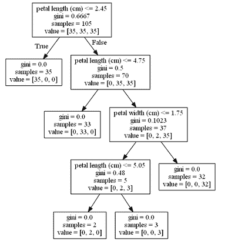

# 它是如何工作的...

这是通过训练生成的决策树；通过在 `X_train` 和 `y_train` 上调用 `fit` 方法来得到的。仔细查看它，从树的顶部开始。您在训练集中有 105 个样本。训练集被分成三组，每组 35 个：*value = [35, 35, 35]*。具体来说，这些是 35 个 Setosa、35 个 Versicolor 和 35 个 Virginica 花：

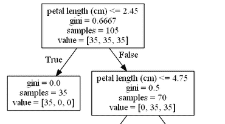

第一个决策是花瓣长度是否小于或等于 2.45。如果答案为真，或者是，花朵将被分类为第一类，*value = [35, 0, 0]*。该花被分类为 Setosa 类别。在鸢尾花数据集分类的多个示例中，这是最容易分类的一个。

否则，如果花瓣长度大于 2.45，第一个决策将导致一个较小的决策树。这个较小的决策树仅包含最后两类花：Versicolour 和 Virginica，*value = [0, 35, 35]*。

算法继续生成一个四层的完整树，深度为 4（注意，最上层节点不算在层数之内）。用正式语言来说，图中表现决策的三个节点被称为**分裂**。

# 还有更多...

你可能会想知道在决策树的可视化中，gini 参考是什么。Gini 指的是 gini 函数，它衡量分裂的质量，三个节点表示一个决策。当算法运行时，考虑了优化 gini 函数的几个分裂。选择产生最佳 gini 不纯度度量的分裂。

另一个选择是测量熵来确定如何分割树。您可以尝试这两种选择，并通过交叉验证确定哪种效果最好。按如下方式更改决策树中的标准：

```py
from sklearn.tree import DecisionTreeClassifier

dtc = DecisionTreeClassifier(criterion='entropy')
dtc.fit(X_train, y_train)
```

这将生成如下决策树图：

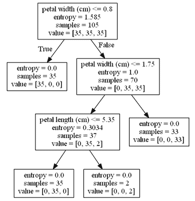

您可以使用 `GridSearchCV` 检查此标准在交叉验证下的表现，并在参数网格中更改标准参数。我们将在下一节中进行此操作。

# 调整决策树

我们将继续深入探索鸢尾花数据集，重点关注前两个特征（花萼长度和花萼宽度），优化决策树并创建一些可视化图表。

# 准备工作

1.  加载鸢尾花数据集，专注于前两个特征。并将数据分为训练集和测试集：

```py
from sklearn.datasets import load_iris

iris = load_iris()
X = iris.data[:,:2]
y = iris.target

from sklearn.model_selection import train_test_split

X_train, X_test, y_train, y_test = train_test_split(X, y, test_size=0.3, stratify=y)
```

1.  使用 pandas 查看数据：

```py
import pandas as pd
pd.DataFrame(X,columns=iris.feature_names[:2])
```

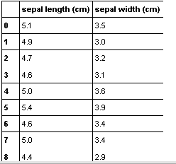

1.  在优化决策树之前，我们先试试一个默认参数的单一决策树。实例化并训练一个决策树：

```py
from sklearn.tree import DecisionTreeClassifier

dtc = DecisionTreeClassifier()     #Instantiate tree with default parameters
dtc.fit(X_train, y_train)
```

1.  测量准确度分数：

```py
from sklearn.metrics import accuracy_score

y_pred = dtc.predict(X_test)
accuracy_score(y_test, y_pred)

0.66666666666666663
```

使用`graphviz`可视化树，揭示了一棵非常复杂的树，包含许多节点和层级（这张图片仅供参考：如果你看不懂也没关系！它是一棵非常深的树，存在很多过拟合！）：

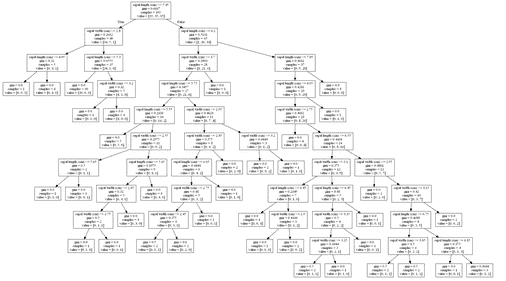

这是过拟合的一个例子。决策树非常复杂。整个鸢尾数据集由 150 个样本组成，而一个非常复杂的树是不可取的。回想一下，在之前的章节中，我们使用了线性 SVM，它通过几条直线简单地划分空间。

在继续之前，使用 matplotlib 可视化训练数据点：

```py
import matplotlib.pyplot as plt
%matplotlib inline

plt.figure(figsize=((12,6)))
plt.xlabel(iris.feature_names[0])
plt.ylabel(iris.feature_names[1])

plt.scatter(X_train[:, 0], X_train[:, 1], c=y_train)
```

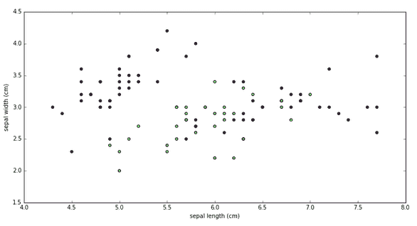

# 如何实现...

1.  为了优化决策树的性能，使用`GridSearchCV`。首先实例化一个决策树：

```py
from sklearn.tree import DecisionTreeClassifier
dtc = DecisionTreeClassifier()
```

1.  然后，实例化并训练`GridSearchCV`：

```py
from sklearn.model_selection import GridSearchCV, cross_val_score

param_grid = {'criterion':['gini','entropy'], 'max_depth' : [3,5,7,20]}

gs_inst = GridSearchCV(dtc,param_grid=param_grid,cv=5)
gs_inst.fit(X_train, y_train)
```

请注意，在参数网格`param_grid`中，我们将分割评分标准在`gini`和`entropy`之间变化，并调整树的`max_depth`。

1.  现在尝试在测试集上评分准确度：

```py
from sklearn.metrics import accuracy_score

y_pred_gs = gs_inst.predict(X_test)
accuracy_score(y_test, y_pred_gs)

0.68888888888888888
```

准确度略有提高。让我们更详细地看看`GridSearchCV`。

1.  查看网格搜索中尝试的所有决策树的分数：

```py
gs_inst.grid_scores_

[mean: 0.78095, std: 0.09331, params: {'criterion': 'gini', 'max_depth': 3},
 mean: 0.68571, std: 0.08832, params: {'criterion': 'gini', 'max_depth': 5},
 mean: 0.70476, std: 0.08193, params: {'criterion': 'gini', 'max_depth': 7},
 mean: 0.66667, std: 0.09035, params: {'criterion': 'gini', 'max_depth': 20},
 mean: 0.78095, std: 0.09331, params: {'criterion': 'entropy', 'max_depth': 3},
 mean: 0.69524, std: 0.11508, params: {'criterion': 'entropy', 'max_depth': 5},
 mean: 0.72381, std: 0.09712, params: {'criterion': 'entropy', 'max_depth': 7},
 mean: 0.67619, std: 0.09712, params: {'criterion': 'entropy', 'max_depth': 20}]
```

请注意，这种方法将在未来版本的 scikit-learn 中不可用。你可以使用`zip(gs_inst.cv_results_['mean_test_score'],gs_inst.cv_results_['params'])`来产生类似的结果。

从这个分数列表中，你可以看到较深的树表现得比浅层的树差。详细来说，训练集中的数据被分为五部分，训练发生在四部分中，而测试发生在五部分中的一部分。非常深的树会过拟合：它们在训练集上表现很好，但在交叉验证的五个测试集上表现很差。

1.  使用`best_estimator_`属性选择表现最好的树：

```py
gs_inst.best_estimator_

DecisionTreeClassifier(class_weight=None, criterion='gini', max_depth=3,
 max_features=None, max_leaf_nodes=None,
 min_impurity_split=1e-07, min_samples_leaf=1,
 min_samples_split=2, min_weight_fraction_leaf=0.0,
 presort=False, random_state=None, splitter='best')
```

1.  使用`graphviz`可视化树：

```py
import numpy as np
from sklearn import tree
from sklearn.externals.six import StringIO

import pydot
from IPython.display import Image

dot_iris = StringIO()
tree.export_graphviz(gs_inst.best_estimator_, out_file = dot_iris, feature_names = iris.feature_names[:2])
graph = pydot.graph_from_dot_data(dot_iris.getvalue())

Image(graph.create_png())
```

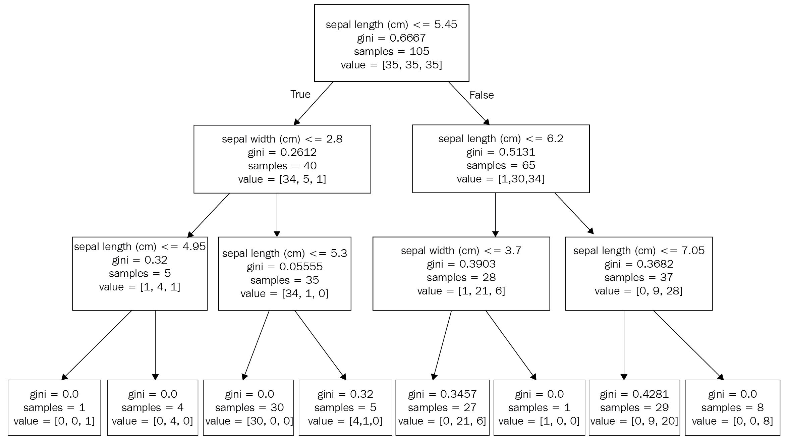

# 还有更多...

1.  为了获得更多的洞察，我们将创建一个额外的可视化。首先按如下方式创建一个 NumPy 网格：

```py
grid_interval = 0.02

x_min, x_max = X[:, 0].min() - .5, X[:, 0].max() + .5
y_min, y_max = X[:, 1].min() - .5, X[:, 1].max() + .5

xmin, xmax = np.percentile(X[:, 0], [0, 100])
ymin, ymax = np.percentile(X[:, 1], [0, 100])

xmin_plot, xmax_plot = xmin - .5, xmax + .5
ymin_plot, ymax_plot = ymin - .5, ymax + .5

xx, yy = np.meshgrid(np.arange(xmin_plot, xmax_plot, grid_interval),
np.arange(ymin_plot, ymax_plot, grid_interval))
```

1.  使用网格搜索中的`best_estimator_`属性，预测刚刚创建的 NumPy 网格上的场景：

```py
test_preds = gs_inst.best_estimator_.predict(np.array(zip(xx.ravel(), yy.ravel())))
```

1.  看一下可视化结果：

```py
import matplotlib.pyplot as plt
%matplotlib inline

X_0 = X[y == 0]
X_1 = X[y == 1]
X_2 = X[y == 2]

plt.figure(figsize=(15,8)) #change figure-size for easier viewing
plt.scatter(X_0[:,0],X_0[:,1], color = 'red')
plt.scatter(X_1[:,0],X_1[:,1], color = 'blue')
plt.scatter(X_2[:,0],X_2[:,1], color = 'green')

colors = np.array(['r', 'b','g'])
plt.scatter(xx.ravel(), yy.ravel(), color=colors[test_preds], alpha=0.15)
plt.scatter(X[:, 0], X[:, 1], color=colors[y])
plt.title("Decision Tree Visualization")
plt.xlabel(iris.feature_names[0])
plt.ylabel(iris.feature_names[1])
```

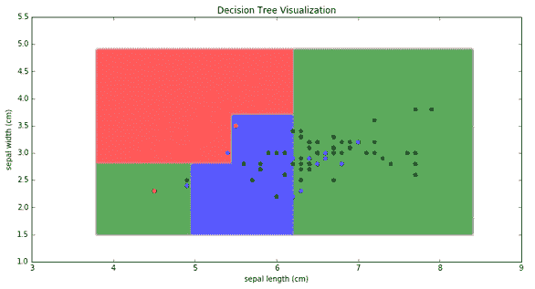

1.  使用这种类型的可视化，你可以看到决策树尝试构建矩形来分类鸢尾花的种类。每个分割都会创建一条与某个特征垂直的线。在下面的图中，有一条垂直线表示第一个决策，是否花萼长度大于（线的右边）或小于（线的左边）5.45。键入`plt.axvline(x = 5.45, color='black')`与前面的代码一起，会得到如下结果：

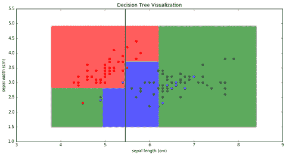

1.  可视化前三行：

```py
plt.axvline(x = 5.45, color='black')
plt.axvline(x = 6.2, color='black')
plt.plot((xmin_plot, 5.45), (2.8, 2.8), color='black')
```

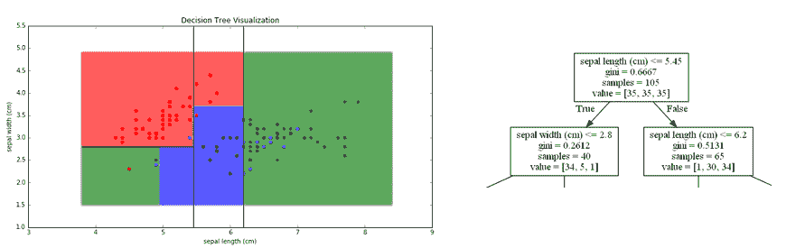

水平线 `sepal_width = 2.8` 比较短，并且结束于 `x = 5.45`，因为它不适用于 *sepal_length >= 5.45* 的情况。最终，多个矩形区域被创建。

1.  下图展示了应用于过拟合的非常大的决策树的相同类型的可视化。决策树分类器试图将一个矩形框住鸢尾花数据集中许多特定样本，这显示了它在面对新样本时的泛化能力差：

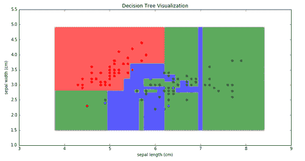

1.  最后，你还可以绘制最大深度如何影响交叉验证得分。编写一个网格搜索脚本，设置最大深度范围从 2 到 51：

```py
from sklearn.tree import DecisionTreeClassifier
dtc = DecisionTreeClassifier()

from sklearn.model_selection import GridSearchCV, cross_val_score

max_depths = range(2,51)
param_grid = {'max_depth' : max_depths}

gs_inst = GridSearchCV(dtc, param_grid=param_grid,cv=5)
gs_inst.fit(X_train, y_train)

plt.plot(max_depths,gs_inst.cv_results_['mean_test_score'])
plt.xlabel('Max Depth')
plt.ylabel("Cross-validation Score")
```

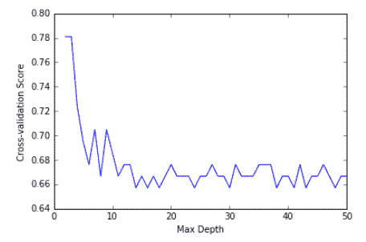

该图从另一个角度展示了，较高的最大深度倾向于降低交叉验证得分。

# 使用决策树进行回归

回归树和分类树非常相似。开发回归模型的过程包括四个部分：

+   加载数据集

+   将数据集拆分为训练集/测试集

+   实例化一个决策树回归器并训练它

+   在测试子集上评分模型

# 准备工作

对于这个例子，加载 scikit-learn 的糖尿病数据集：

```py
#Use within an Jupyter notebook
%matplotlib inline 

import numpy as np
import pandas as pd
import matplotlib.pyplot as plt

from sklearn.datasets import load_diabetes

diabetes = load_diabetes()

X = diabetes.data
y = diabetes.target

X_feature_names = ['age', 'gender', 'body mass index', 'average blood pressure','bl_0','bl_1','bl_2','bl_3','bl_4','bl_5']
```

现在我们已经加载了数据集，必须将数据分为训练集和测试集。在此之前，使用 pandas 可视化目标变量：

```py
pd.Series(y).hist(bins=50)
```

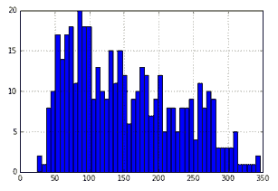

这是一个回归示例，我们在拆分数据集时不能使用 `stratify=y`。相反，我们将对目标变量进行分箱：我们将记录目标变量是否小于 50，或在 50 到 100 之间，等等。

创建宽度为 50 的区间：

```py
bins = 50*np.arange(8)
bins

array([ 0, 50, 100, 150, 200, 250, 300, 350])
```

使用 `np.digitize` 对目标变量进行分箱：

```py
binned_y = np.digitize(y, bins)
```

使用 pandas 可视化 `binned_y` 变量：

```py
pd.Series(binned_y).hist(bins=50)
```

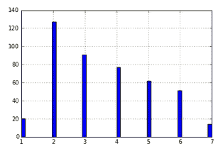

NumPy 数组 `binned_y` 记录了每个 `y` 元素所属的区间。现在，将数据集拆分为训练集和测试集，并对 `binned_y` 数组进行分层：

```py
from sklearn.model_selection import train_test_split

X_train, X_test, y_train, y_test = train_test_split(X, y, test_size=0.2,stratify=binned_y)
```

# 如何操作...

1.  为了创建一个决策树回归器，实例化决策树并训练它：

```py
from sklearn.tree import DecisionTreeRegressor

dtr = DecisionTreeRegressor()
dtr.fit(X_train, y_train)
```

1.  为了衡量模型的准确性，使用测试集对目标变量进行预测：

```py
y_pred = dtr.predict(X_test)
```

1.  使用误差度量比较 `y_test`（真实值）和 `y_pred`（模型预测）。这里使用 `mean_absolute_error`，它是 `y_test` 和 `y_pred` 之间差异的绝对值的平均值：

```py
from sklearn.metrics import mean_absolute_error
mean_absolute_error(y_test, y_pred)

58.49438202247191
```

1.  作为替代方案，衡量平均绝对百分比误差，它是绝对值差异的平均值，差异被除以真实值元素的大小。这衡量了相对于真实值元素大小的误差幅度：

```py
(np.abs(y_test - y_pred)/(y_test)).mean()

0.4665997687095611
```

因此，我们已经建立了关于糖尿病数据集的性能基准。模型的任何变化都可能影响误差度量。

# 还有更多...

1.  使用 pandas，你可以快速可视化误差的分布。将真实值`y_test`和预测值`y_pred`之间的差异转换为直方图：

```py
pd.Series((y_test - y_pred)).hist(bins=50)
```

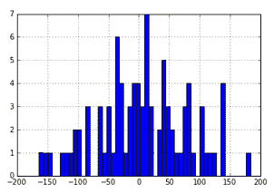

1.  你也可以对百分比误差进行同样的操作：

```py
pd.Series((y_test - y_pred)/(y_test)).hist(bins=50)
```

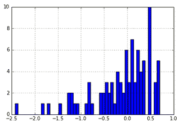

1.  最后，使用前面部分的代码，查看决策树本身。注意，我们并未对最大深度进行优化：

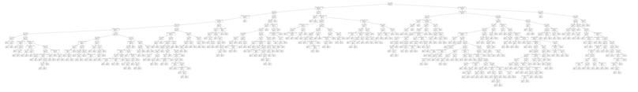

这棵树非常复杂，很可能会发生过拟合。

# 使用交叉验证减少过拟合

在这里，我们将使用前面食谱中的糖尿病数据集进行交叉验证，以提高性能。首先加载数据集，如前面的食谱中所示：

```py
%matplotlib inline
import numpy as np
import pandas as pd
import matplotlib.pyplot as plt

from sklearn.datasets import load_diabetes

diabetes = load_diabetes()

X = diabetes.data
y = diabetes.target

X_feature_names = ['age', 'gender', 'body mass index', 'average blood pressure','bl_0','bl_1','bl_2','bl_3','bl_4','bl_5']

bins = 50*np.arange(8)
binned_y = np.digitize(y, bins)

from sklearn.model_selection import train_test_split
X_train, X_test, y_train, y_test = train_test_split(X, y, test_size=0.2,stratify=binned_y)
```

# 如何操作...

1.  使用网格搜索来减少过拟合。导入决策树并实例化它：

```py
from sklearn.tree import DecisionTreeRegressor

dtr = DecisionTreeRegressor()
```

1.  然后，导入`GridSearchCV`并实例化该类：

```py
from sklearn.model_selection import GridSearchCV

gs_inst = GridSearchCV(dtr, param_grid = {'max_depth': [3,5,7,9,20]},cv=10)
gs_inst.fit(X_train, y_train)
```

1.  查看使用`best_estimator_`属性的最佳估计器：

```py
gs_inst.best_estimator_

DecisionTreeRegressor(criterion='mse', max_depth=3, max_features=None,
 max_leaf_nodes=None, min_impurity_split=1e-07,
 min_samples_leaf=1, min_samples_split=2,
 min_weight_fraction_leaf=0.0, presort=False, random_state=None,
 splitter='best')
```

1.  最佳估计器的`max_depth`为`3`。现在检查误差指标：

```py
y_pred = gs_inst.predict(X_test)

from sklearn.metrics import mean_absolute_error
mean_absolute_error(y_test, y_pred)

54.299263338774338
```

1.  检查平均百分比误差：

```py
(np.abs(y_test - y_pred)/(y_test)).mean()

0.4672742120960478
```

# 还有更多...

最后，使用`graphviz`可视化最佳回归树：

```py
import numpy as np
from sklearn import tree
from sklearn.externals.six import StringIO

import pydot
from IPython.display import Image

dot_diabetes = StringIO()
tree.export_graphviz(gs_inst.best_estimator_, out_file = dot_diabetes, feature_names = X_feature_names)
graph = pydot.graph_from_dot_data(dot_diabetes.getvalue())

Image(graph.create_png())
```

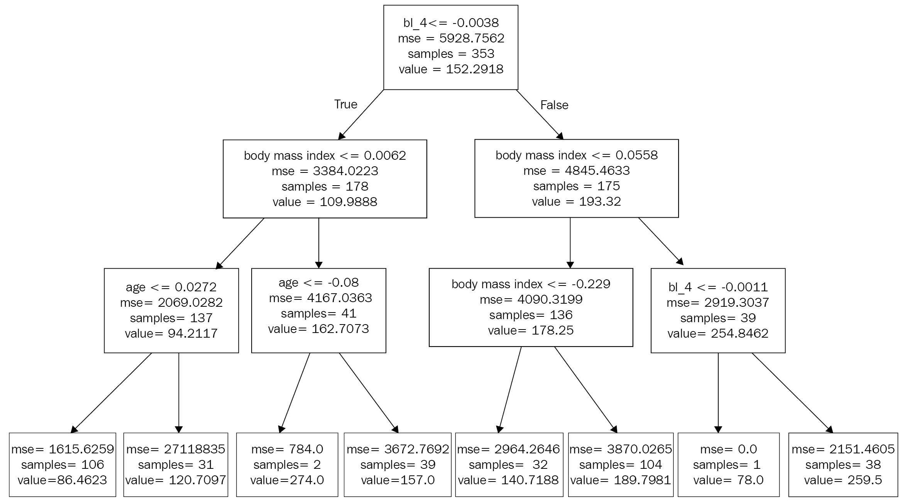

该树具有更好的准确度指标，并且已经通过交叉验证以最小化过拟合。

# 实现随机森林回归

随机森林是一种集成算法。集成算法将多种算法结合使用以提高预测准确性。Scikit-learn 有几种集成算法，大多数都使用树来预测。让我们从扩展决策树回归开始，使用多棵决策树在随机森林中共同工作。

随机森林是由多个决策树组成的混合体，每棵树都为最终预测提供一个投票。最终的随机森林通过平均所有树的结果来计算最终输出。

# 准备就绪

像我们之前使用决策树一样加载糖尿病回归数据集。将所有数据分成训练集和测试集：

```py
%matplotlib inline

import numpy as np
import pandas as pd
import matplotlib.pyplot as plt

from sklearn.datasets import load_diabetes

diabetes = load_diabetes()

X = diabetes.data
y = diabetes.target

X_feature_names = ['age', 'gender', 'body mass index', 'average blood pressure','bl_0','bl_1','bl_2','bl_3','bl_4','bl_5']

#bin target variable for better sampling
bins = 50*np.arange(8)
binned_y = np.digitize(y, bins)

from sklearn.model_selection import train_test_split
X_train, X_test, y_train, y_test = train_test_split(X, y, test_size=0.2,stratify=binned_y)
```

# 如何操作...

1.  让我们深入了解并导入并实例化一个随机森林。训练这个随机森林：

```py
from sklearn.ensemble import RandomForestRegressor

rft = RandomForestRegressor()
rft.fit(X_train, y_train)
```

1.  测量预测误差。尝试在测试集上运行随机森林：

```py
y_pred = rft.predict(X_test)

from sklearn.metrics import mean_absolute_error
mean_absolute_error(y_test, y_pred)

48.539325842696627

(np.abs(y_test - y_pred)/(y_test)).mean()

0.42821508503434541
```

与单棵决策树相比，误差略有下降。

1.  要访问构成随机森林的任何一棵树，请使用`estimators_`属性：

```py
rft.estimators_

[DecisionTreeRegressor(criterion='mse', max_depth=None, max_features='auto',
 max_leaf_nodes=None, min_impurity_split=1e-07,
 min_samples_leaf=1, min_samples_split=2,
 min_weight_fraction_leaf=0.0, presort=False,
 random_state=492413116, splitter='best')
...
```

1.  要在`graphviz`中查看列表中的第一棵树，请参考列表中的第一个元素`rft.estimators_[0]`：

```py
import numpy as np
from sklearn import tree
from sklearn.externals.six import StringIO

import pydot
from IPython.display import Image

dot_diabetes = StringIO()
tree.export_graphviz(rft.estimators_[0], out_file = dot_diabetes, feature_names = X_feature_names)
graph = pydot.graph_from_dot_data(dot_diabetes.getvalue())

Image(graph.create_png()) 
```

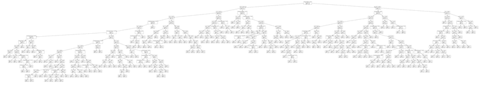

1.  要查看第二棵树，请使用`best_rft.estimators_[1]`。要查看最后一棵树，请使用`best_rft.estimators_[9]`，因为默认情况下，有 10 棵树，索引从 0 到 9，这些树构成了随机森林。

1.  随机森林的一个附加特性是通过`feature_importances_`属性来确定特征的重要性：

```py
rft.feature_importances_

array([ 0.06103037, 0.00969354, 0.34865274, 0.09091215, 0.04331388,

 0.04376602, 0.04827391, 0.02430837, 0.23251334, 0.09753567])
```

1.  你也可以可视化特征的重要性：

```py
fig, ax = plt.subplots(figsize=(10,5))

bar_rects = ax.bar(np.arange(10), rft.feature_importances_,color='r',align='center')
ax.xaxis.set_ticks(np.arange(10))
ax.set_xticklabels(X_feature_names, rotation='vertical')
```

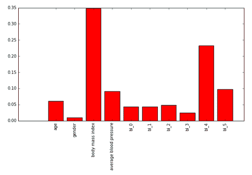

最具影响力的特征是**体重指数**（**BMI**），其次是`bl_4`（六项血清测量中的第四项），然后是平均血压。

# 最近邻的 Bagging 回归

Bagging 是一种附加的集成方法，有趣的是，它不一定涉及决策树。它在第一个训练集的随机子集上构建多个基础估计器实例。在本节中，我们尝试将**k-最近邻**（**KNN**）作为基础估计器。

实际上，bagging 估计器对于减少复杂基础估计器（例如，具有多个层次的决策树）的方差非常有效。另一方面，boosting 通过减少弱模型的偏差（例如，层次较少的决策树或线性模型）来提升性能。

为了尝试 bagging，我们将使用 scikit-learn 的随机网格搜索来寻找最佳参数，即超参数搜索。像之前一样，我们将进行以下流程：

1.  确定在算法中需要优化的参数（这些是研究人员在文献中认为最值得优化的参数）。

1.  创建一个参数分布，其中最重要的参数会发生变化。

1.  执行随机网格搜索。如果你使用的是集成方法，开始时保持较低的估计器数量。

1.  使用上一阶段的最佳参数和多个估计器。

# 准备工作

再次加载上一节中使用的糖尿病数据集：

```py
import numpy as np
import pandas as pd

from sklearn.datasets import load_diabetes
diabetes = load_diabetes()

X = diabetes.data
y = diabetes.target

X_feature_names = ['age', 'gender', 'body mass index', 'average blood pressure','bl_0','bl_1','bl_2','bl_3','bl_4','bl_5']

#bin target variable for better sampling
bins = 50*np.arange(8)
binned_y = np.digitize(y, bins)

from sklearn.model_selection import train_test_split
X_train, X_test, y_train, y_test = train_test_split(X, y, test_size=0.2,stratify=binned_y)
```

# 如何操作...

1.  首先，导入`BaggingRegressor`和`KNeighborsRegressor`。另外，还需要导入`RandomizedSearchCV`：

```py
from sklearn.ensemble import BaggingRegressor
from sklearn.neighbors import KNeighborsRegressor
from sklearn.model_selection import RandomizedSearchCV
```

1.  然后，为网格搜索设置一个参数分布。对于 bagging 元估计器，一些要变化的参数包括`max_samples`、`max_features`、`oob_score`和估计器数量`n_estimators`。估计器的数量初始设置为较低的 100，以便在尝试大量估计器之前优化其他参数。

1.  此外，还有一个 KNN 算法的参数列表。它被命名为`base_estimator__n_neighbors`，其中`n_neighbors`是 KNN 类中的内部名称。`base_estimator`是`BaggingRegressor`类中基础估计器的名称。`base_estimator__n_neighbors`列表包含数字`3`和`5`，它们表示最近邻算法中的邻居数量：

```py
param_dist = {
 'max_samples': [0.5,1.0],
 'max_features' : [0.5,1.0],
 'oob_score' : [True, False],
 'base_estimator__n_neighbors': [3,5],
 'n_estimators': [100]
 }
```

1.  实例化`KNeighboursRegressor`类，并将其作为`BaggingRegressor`中的`base_estimator`：

```py
single_estimator = KNeighborsRegressor()
ensemble_estimator = BaggingRegressor(base_estimator = single_estimator)
```

1.  最后，实例化并运行一个随机搜索。进行几次迭代，`n_iter = 5`，因为这可能会耗时较长：

```py
pre_gs_inst_bag = RandomizedSearchCV(ensemble_estimator,
 param_distributions = param_dist,
 cv=3,
 n_iter = 5,
 n_jobs=-1)

pre_gs_inst_bag.fit(X_train, y_train)
```

1.  查看随机搜索运行中的最佳参数：

```py
pre_gs_inst_bag.best_params_

{'base_estimator__n_neighbors': 5,
 'max_features': 1.0,
 'max_samples': 0.5,
 'n_estimators': 100,
 'oob_score': True}
```

1.  使用最佳参数训练`BaggingRegressor`，除了`n_estimators`，你可以增加它。在这种情况下，我们将估计器的数量增加到 1,000：

```py
rs_bag = BaggingRegressor(**{'max_features': 1.0,
 'max_samples': 0.5,
 'n_estimators': 1000,
 'oob_score': True,
 'base_estimator': KNeighborsRegressor(n_neighbors=5)})

rs_bag.fit(X_train, y_train)
```

1.  最后，在测试集上评估算法的表现。虽然该算法的表现不如其他算法，但我们可以在后续的堆叠聚合器中使用它：

```py
y_pred = rs_bag.predict(X_test)

from sklearn.metrics import r2_score, mean_absolute_error

print "R-squared",r2_score(y_test, y_pred)
print "MAE : ",mean_absolute_error(y_test, y_pred)
print "MAPE : ",(np.abs(y_test - y_pred)/y_test).mean()

R-squared 0.498096653258
MAE :  44.3642741573
MAPE :  0.419361955306
```

如果仔细观察，你会发现，在上一节中，袋装回归的表现稍微优于随机森林，因为无论是平均绝对误差还是平均绝对百分误差都更好。始终记住，你不必将集成学习仅限于树形结构——在这里，你可以使用 KNN 算法构建一个集成回归器。

# 调整梯度提升树

我们将使用梯度提升树来分析加利福尼亚住房数据集。我们整体的方法与之前相同：

1.  关注梯度提升算法中的重要参数：

    +   `max_features`

    +   `max_depth`

    +   `min_samples_leaf`

    +   `learning_rate`

    +   `loss`

1.  创建一个参数分布，其中最重要的参数会有所变化。

1.  执行随机网格搜索。如果使用集成方法，开始时保持估计器的数量较低。

1.  使用上一阶段的最佳参数和更多估计器进行训练。

# 准备就绪

加载加利福尼亚住房数据集，并将加载的数据集分为训练集和测试集：

```py
%matplotlib inline 

from __future__ import division #Load within Python 2.7 for regular division
import numpy as np
import pandas as pd
import matplotlib.pyplot as plt

from sklearn.datasets import fetch_california_housing

cali_housing = fetch_california_housing()

X = cali_housing.data
y = cali_housing.target

#bin output variable to split training and testing sets into two similar sets
bins = np.arange(6)
binned_y = np.digitize(y, bins)

from sklearn.model_selection import train_test_split
X_train, X_test, y_train, y_test = train_test_split(X, y, test_size=0.2,stratify=binned_y)
```

# 如何操作...

1.  加载梯度提升算法和随机网格搜索：

```py
from sklearn.ensemble import GradientBoostingRegressor
from sklearn.model_selection import RandomizedSearchCV
```

1.  为梯度提升树创建一个参数分布：

```py
param_dist = {'max_features' : ['log2',1.0],
 'max_depth' : [3, 5, 7, 10],
 'min_samples_leaf' : [2, 3, 5, 10],
 'n_estimators': [50, 100],
 'learning_rate' : [0.0001,0.001,0.01,0.05,0.1,0.3],
 'loss' : ['ls','huber']
 }
```

1.  运行网格搜索以找到最佳参数。进行 30 次迭代的随机搜索：

```py
pre_gs_inst = RandomizedSearchCV(GradientBoostingRegressor(warm_start=True),
 param_distributions = param_dist,
 cv=3,
 n_iter = 30, n_jobs=-1)
pre_gs_inst.fit(X_train, y_train)
```

1.  现在以数据框形式查看报告。查看报告的函数已经封装，可以多次使用：

```py
import numpy as np
import pandas as pd

def get_grid_df(fitted_gs_estimator):
 res_dict = fitted_gs_estimator.cv_results_

 results_df = pd.DataFrame()
 for key in res_dict.keys():
 results_df[key] = res_dict[key]

 return results_df

def group_report(results_df):
 param_cols = [x for x in results_df.columns if 'param' in x and x is not 'params']
 focus_cols = param_cols + ['mean_test_score']

 print "Grid CV Report \n"

 output_df = pd.DataFrame(columns = ['param_type','param_set',
 'mean_score','mean_std'])
 cc = 0
 for param in param_cols:
 for key,group in results_df.groupby(param):
 output_df.loc[cc] = (param, key, group['mean_test_score'].mean(), group['mean_test_score'].std())
 cc += 1
 return output_df
```

1.  查看展示梯度提升树在不同参数设置下表现的数据框：

```py
results_df = get_grid_df(pre_gs_inst)
group_report(results_df)
```

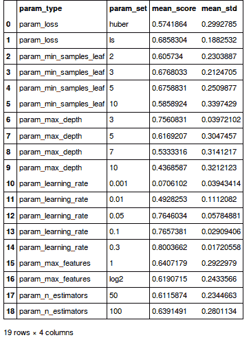

从这个数据框来看；`ls`作为损失函数明显优于`huber`，`3`是最佳的`min_samples_leaf`（但`4`也可能表现不错），`3`是最佳的`max_depth`（尽管`1`或`2`也能有效），`0.3`作为学习率效果很好（`0.2`或`0.4`也可以），`max_features`为`1.0`效果良好，但也可以是其他数字（如特征的一半：`0.5`）。

1.  有了这些信息，尝试另一次随机搜索：

```py
param_dist = {'max_features' : ['sqrt',0.5,1.0],
 'max_depth' : [2,3,4],
 'min_samples_leaf' : [3, 4],
 'n_estimators': [50, 100],
 'learning_rate' : [0.2,0.25, 0.3, 0.4],
 'loss' : ['ls','huber']
 }
 pre_gs_inst = RandomizedSearchCV(GradientBoostingRegressor(warm_start=True),
 param_distributions = param_dist,
 cv=3,
 n_iter = 30, n_jobs=-1)
 pre_gs_inst.fit(X_train, y_train)
```

1.  查看生成的新报告：

```py
results_df = get_grid_df(pre_gs_inst)
group_report(results_df)
```

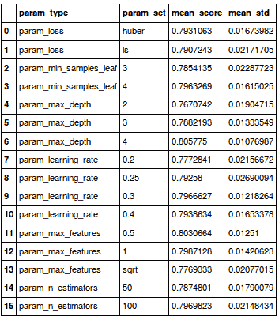

1.  有了这些信息，你可以使用以下参数分布再进行一次随机搜索：

```py
param_dist = {'max_features' : [0.4, 0.5, 0.6],
 'max_depth' : [5,6],
 'min_samples_leaf' : [4,5],
 'n_estimators': [300],
 'learning_rate' : [0.3],
 'loss' : ['ls','huber']
 }
```

1.  将结果存储在`rs_gbt`中，并使用 4,000 个估计器最后一次进行训练：

```py
rs_gbt = GradientBoostingRegressor(warm_start=True,
 max_features = 0.5,
 min_samples_leaf = 4,
 learning_rate=0.3,
 max_depth = 6,
 n_estimators = 4000,loss = 'huber')

rs_gbt.fit(X_train, y_train)
```

1.  使用 scikit-learn 的`metrics`模块描述测试集上的误差：

```py
y_pred = rs_gbt.predict(X_test)

from sklearn.metrics import r2_score, mean_absolute_error

print "R-squared",r2_score(y_test, y_pred)
print "MAE : ",mean_absolute_error(y_test, y_pred)
print "MAPE : ",(np.abs(y_test - y_pred)/y_test).mean()

R-squared 0.84490423214
MAE : 0.302125381378
MAPE : 0.169831775387
```

如果你还记得，随机森林的 R 平方值略低，为 0.8252。这种算法稍微好一些。对于两者，我们都进行了随机化搜索。请注意，如果你频繁地进行树的超参数优化，可以自动化多个随机化参数搜索。

# 还有更多内容...

现在，我们将优化一个梯度提升分类器，而不是回归器。过程非常相似。

# 寻找梯度提升分类器的最佳参数

使用梯度提升树进行分类与我们之前做的回归非常相似。我们将再次执行以下操作：

1.  查找梯度提升分类器的最佳参数。这些参数与梯度提升回归器相同，不同之处在于损失函数选项有所不同。参数名称相同，具体如下：

    +   `max_features`

    +   `max_depth`

    +   `min_samples_leaf`

    +   `learning_rate`

    +   `loss`

1.  使用最佳参数运行估计器，但在估计器中使用更多的树。在下面的代码中，请注意损失函数（称为 deviance）的变化。为了进行分类，我们将使用一个二元变量。回顾目标集 `y` 的可视化：

```py
pd.Series(y).hist(bins=50)
```

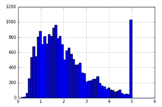

在最右侧，似乎存在异常：分布中的许多值等于五。也许我们想将该数据集分开并单独分析。作为这个过程的一部分，我们可能希望能够预先确定一个点是否应该属于异常集。我们将构建一个分类器，将 `y` 大于或等于五的点分离出来：

1.  首先，将数据集分割为训练集和测试集。对分箱变量 `binned_y` 进行分层：

```py
bins = np.arange(6)
binned_y = np.digitize(y, bins)

from sklearn.model_selection import train_test_split
X_train, X_test, y_train, y_test = train_test_split(X, y, test_size=0.2,stratify=binned_y)
```

1.  创建一个二元变量，当目标变量 `y` 大于或等于 5 时其值为 `1`，小于 5 时为 `0`。注意，如果二元变量为 `1`，则表示它属于异常集：

```py
y_binary = np.where(y >= 5, 1,0)
```

1.  现在，使用 `X_train` 的形状将二元变量分割为 `y_train_binned` 和 `y_test_binned`：

```py
train_shape = X_train.shape[0]

y_train_binned = y_binary[:train_shape]
y_test_binned = y_binary[train_shape:]
```

1.  执行随机网格搜索：

```py
from sklearn.ensemble import GradientBoostingClassifier
from sklearn.model_selection import RandomizedSearchCV
param_dist = {'max_features' : ['log2',0.5,1.0],
 'max_depth' : [2,3,6],
 'min_samples_leaf' : [1,2,3,10],
 'n_estimators': [100],
 'learning_rate' : [0.1,0.2,0.3,1],
 'loss' : ['deviance']
 }
pre_gs_inst = RandomizedSearchCV(GradientBoostingClassifier(warm_start=True),
 param_distributions = param_dist,
 cv=3,
 n_iter = 10, n_jobs=-1)

pre_gs_inst.fit(X_train, y_train_binned)
```

1.  查看最佳参数：

```py
pre_gs_inst.best_params_

{'learning_rate': 0.2,
 'loss': 'deviance',
 'max_depth': 2,
 'max_features': 1.0,
 'min_samples_leaf': 2,
 'n_estimators': 50}
```

1.  增加估计器数量并训练最终的估计器：

```py
gbc = GradientBoostingClassifier(**{'learning_rate': 0.2,
 'loss': 'deviance',
 'max_depth': 2,
 'max_features': 1.0,
 'min_samples_leaf': 2,
 'n_estimators': 1000, 'warm_start':True}).fit(X_train, y_train_binned)
```

1.  查看算法的性能：

```py
y_pred = gbc.predict(X_test)

from sklearn.metrics import accuracy_score
accuracy_score(y_test_binned, y_pred)

0.93580426356589153
```

该算法是一个二分类器，准确率大约为 94%，能够判断房屋是否属于异常集。梯度提升分类器的超参数优化非常相似，具有与梯度提升回归相同的重要参数。

# 调整 AdaBoost 回归器

在 AdaBoost 回归器中，重要的调节参数是 `learning_rate` 和 `loss`。与之前的算法一样，我们将执行随机参数搜索，以找到该算法能达到的最佳分数。

# 如何操作...

1.  导入算法和随机网格搜索。尝试一个随机的参数分布：

```py
from sklearn.ensemble import AdaBoostRegressor
from sklearn.model_selection import RandomizedSearchCV

param_dist = {
 'n_estimators': [50, 100],
 'learning_rate' : [0.01,0.05,0.1,0.3,1],
 'loss' : ['linear', 'square', 'exponential']
 }

pre_gs_inst = RandomizedSearchCV(AdaBoostRegressor(),
 param_distributions = param_dist,
 cv=3,
 n_iter = 10,
 n_jobs=-1)

pre_gs_inst.fit(X_train, y_train)
```

1.  查看最佳参数：

```py
pre_gs_inst.best_params_

{'learning_rate': 0.05, 'loss': 'linear', 'n_estimators': 100}
```

1.  这些表明进行另一次带有参数分布的随机搜索：

```py
param_dist = {
 'n_estimators': [100],
 'learning_rate' : [0.04,0.045,0.05,0.055,0.06],
 'loss' : ['linear']
 }
```

1.  复制包含最佳参数的字典。将副本中的估计器数量增加到 3,000：

```py
import copy
ada_best = copy.deepcopy(pre_gs_inst.best_params_)
ada_best['n_estimators'] = 3000
```

1.  训练最终的 AdaBoost 模型：

```py
rs_ada = AdaBoostRegressor(**ada_best)
rs_ada.fit(X_train, y_train)
```

1.  在测试集上衡量模型性能：

```py
y_pred = rs_ada.predict(X_test)

from sklearn.metrics import r2_score, mean_absolute_error

print "R-squared",r2_score(y_test, y_pred)
print "MAE : ",mean_absolute_error(y_test, y_pred)
print "MAPE : ",(np.abs(y_test - y_pred)/y_test).mean()

R-squared 0.485619387823
MAE : 0.708716094846
MAPE : 0.524923208329
```

不幸的是，这个模型明显不如其他树模型表现得好。我们将暂时搁置它，不再进一步优化，因为这样做会增加更多的训练时间和 Python 开发时间。

# 还有更多...

我们已经找到了几个算法的最佳参数。下面是一个表格，总结了每个算法在交叉验证下需要优化的参数。建议您从优化这些参数开始：

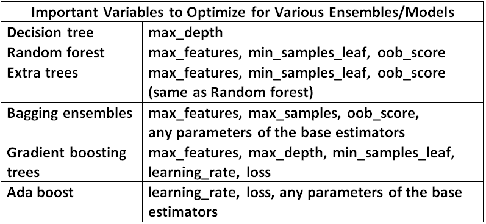

# 使用 scikit-learn 编写堆叠聚合器

在本节中，我们将使用 scikit-learn 编写一个堆叠聚合器。堆叠聚合器将可能非常不同类型的模型进行混合。我们看到的许多集成算法混合的是同类型的模型，通常是决策树。

堆叠聚合器中的基本过程是，我们使用几个机器学习算法的预测作为训练另一个机器学习算法的输入。

更详细地说，我们使用一对 `X` 和 `y` 集合（`X_1`，`y_1`）训练两个或多个机器学习算法。然后我们在第二个 `X` 集（`X_stack`）上做出预测，得到 `y_pred_1`、`y_pred_2` 等。

这些预测，`y_pred_1` 和 `y_pred_2`，成为一个机器学习算法的输入，训练输出为 `y_stack`。最后，可以在第三个输入集 `X_3` 和真实标签集 `y_3` 上衡量错误。

在一个示例中会更容易理解。

# 如何操作...

1.  再次从加利福尼亚住房数据集加载数据。观察我们如何再次创建分箱，以便对一个连续变量进行分层：

```py
%matplotlib inline

import numpy as np
import pandas as pd
import matplotlib.pyplot as plt

from sklearn.datasets import fetch_california_housing

cali_housing = fetch_california_housing()

X = cali_housing.data
y = cali_housing.target

bins = np.arange(6)

from __future__ import division

from sklearn.model_selection import train_test_split

binned_y = np.digitize(y, bins)

from sklearn.ensemble import RandomForestRegressor, AdaBoostRegressor, ExtraTreesRegressor, GradientBoostingRegressor

from sklearn.model_selection import GridSearchCV
```

1.  现在通过使用 `train_test_split` 两次，将一对 `X` 和 `y` 拆分为三个 `X` 和 `y` 对，输入和输出。注意我们在每个阶段如何对连续变量进行分层：

```py
X_train_prin, X_test_prin, y_train_prin, y_test_prin = train_test_split(X, y,
 test_size=0.2,
 stratify=binned_y)

binned_y_train_prin = np.digitize(y_train_prin, bins)

X_1, X_stack, y_1, y_stack = train_test_split(X_train_prin, 
 y_train_prin,
 test_size=0.33,
 stratify=binned_y_train_prin )
```

1.  使用 `RandomizedSearchCV` 查找堆叠聚合器中第一个算法的最佳参数，在此例中是多个最近邻模型的袋装算法：

```py
from sklearn.ensemble import BaggingRegressor
from sklearn.neighbors import KNeighborsRegressor

from sklearn.model_selection import RandomizedSearchCV

param_dist = {
 'max_samples': [0.5,1.0],
 'max_features' : [0.5,1.0],
 'oob_score' : [True, False],
 'base_estimator__n_neighbors': [3,5],
 'n_estimators': [100]
 }

single_estimator = KNeighborsRegressor()
ensemble_estimator = BaggingRegressor(base_estimator = single_estimator)

pre_gs_inst_bag = RandomizedSearchCV(ensemble_estimator,
 param_distributions = param_dist,
 cv=3,
 n_iter = 5,
 n_jobs=-1)

pre_gs_inst_bag.fit(X_1, y_1)
```

1.  使用最佳参数，训练一个使用多个估算器的袋装回归器，在此例中为 3,000 个估算器：

```py
rs_bag = BaggingRegressor(**{'max_features': 0.5,
 'max_samples': 0.5,
 'n_estimators': 3000,
 'oob_score': False, 
 'base_estimator': KNeighborsRegressor(n_neighbors=3)})

rs_bag.fit(X_1, y_1)
```

1.  对 `X_1` 和 `y_1` 集合进行梯度提升算法的相同处理：

```py
from sklearn.ensemble import GradientBoostingRegressor
from sklearn.model_selection import RandomizedSearchCV

param_dist = {'max_features' : ['log2',0.4,0.5,0.6,1.0],
 'max_depth' : [2,3, 4, 5,6, 7, 10],
 'min_samples_leaf' : [1,2, 3, 4, 5, 10],
 'n_estimators': [50, 100],
 'learning_rate' : [0.01,0.05,0.1,0.25,0.275,0.3,0.325],
 'loss' : ['ls','huber']
 }
pre_gs_inst = RandomizedSearchCV(GradientBoostingRegressor(warm_start=True),
param_distributions = param_dist,
 cv=3,
 n_iter = 30, n_jobs=-1)
 pre_gs_inst.fit(X_1, y_1)
```

1.  使用更多估算器训练最佳参数集：

```py
gbt_inst = GradientBoostingRegressor(**{'learning_rate': 0.05,
 'loss': 'huber',
 'max_depth': 10,
 'max_features': 0.4,
 'min_samples_leaf': 5,
 'n_estimators': 3000,
 'warm_start': True}).fit(X_1, y_1)
```

1.  使用 `X_stack` 和两个算法预测目标：

```py
y_pred_bag = rs_bag.predict(X_stack)
y_pred_gbt = gbt_inst.predict(X_stack)
```

1.  查看每个算法产生的指标（错误率）。查看袋装回归器的指标：

```py
from sklearn.metrics import r2_score, mean_absolute_error

print "R-squared",r2_score(y_stack, y_pred_bag)
print "MAE : ",mean_absolute_error(y_stack, y_pred_bag)
print "MAPE : ",(np.abs(y_stack- y_pred_bag)/y_stack).mean()

R-squared 0.527045729567
MAE : 0.605868386902
MAPE : 0.397345752723
```

1.  查看梯度提升的指标：

```py
from sklearn.metrics import r2_score, mean_absolute_error

print "R-squared",r2_score(y_stack, y_pred_gbt)
print "MAE : ",mean_absolute_error(y_stack, y_pred_gbt)
print "MAPE : ",(np.abs(y_stack - y_pred_gbt)/y_stack).mean()

R-squared 0.841011059404
MAE : 0.297099247278
MAPE : 0.163956322255
```

1.  创建一个包含两个算法预测的 DataFrame。或者，你也可以创建一个 NumPy 数组来存储数据：

```py
y_pred_bag = rs_bag.predict(X_stack)
y_pred_gbt = gbt_inst.predict(X_stack)

preds_df = pd.DataFrame(columns = ['bag', 'gbt'])

preds_df['bag'] = y_pred_bag
preds_df['gbt'] = y_pred_gbt
```

1.  查看新的预测数据框：

```py
preds_df
```

>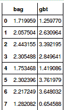

1.  查看预测列之间的相关性。这些列是相关的，但不是完全相关。理想的情况是算法之间没有完全相关，并且两个算法都表现良好。在这种情况下，袋装回归器的表现远不如梯度提升：

```py
preds_df.corr()
```

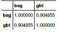

1.  现在使用第三个算法进行随机搜索。这个算法将前两个算法的预测作为输入。我们将使用额外的树回归器对其他两个算法的预测进行预测：

```py
from sklearn.ensemble import ExtraTreesRegressor
from sklearn.model_selection import RandomizedSearchCV

param_dist = {'max_features' : ['sqrt','log2',1.0],
 'min_samples_leaf' : [1, 2, 3, 7, 11],
 'n_estimators': [50, 100],
 'oob_score': [True, False]}

pre_gs_inst = RandomizedSearchCV(ExtraTreesRegressor(warm_start=True,bootstrap=True),
 param_distributions = param_dist,
 cv=3,
 n_iter = 15)

pre_gs_inst.fit(preds_df.values, y_stack)
```

1.  复制参数字典，并在复制的字典中增加估算器的数量。如果你想查看最终的字典，可以查看：

```py
import copy

 param_dict = copy.deepcopy(pre_gs_inst.best_params_)

 param_dict['n_estimators'] = 2000
 param_dict['warm_start'] = True
 param_dict['bootstrap'] = True
 param_dict['n_jobs'] = -1

 param_dict

{'bootstrap': True,
 'max_features': 1.0,
 'min_samples_leaf': 11,
 'n_estimators': 2000,
 'n_jobs': -1,
 'oob_score': False,
 'warm_start': True}
```

1.  在预测数据框上训练额外的树回归器，使用 `y_stack` 作为目标：

```py
final_etr = ExtraTreesRegressor(**param_dict)
final_etr.fit(preds_df.values, y_stack)
```

1.  为了检查堆叠聚合器的整体性能，你需要一个函数，该函数以`X`集合为输入，通过袋装回归器和梯度提升创建一个数据框，并最终在这些预测上进行预测：

```py
def handle_X_set(X_train_set):
 y_pred_bag = rs_bag.predict(X_train_set)
 y_pred_gbt = gbt_inst.predict(X_train_set)
 preds_df = pd.DataFrame(columns = ['bag', 'gbt'])

 preds_df['bag'] = y_pred_bag
 preds_df['gbt'] = y_pred_gbt

 return preds_df.values

def predict_from_X_set(X_train_set):
 return final_etr.predict(handle_X_set(X_train_set)) 
```

1.  使用`X_test_prin`进行预测，这是我们刚刚创建的有用的`predict_from_X_set`函数，在留出的`X`集合上进行预测：

```py
y_pred = predict_from_X_set(X_test_prin)
```

1.  测量模型的性能：

```py
from sklearn.metrics import r2_score, mean_absolute_error

print "R-squared",r2_score(y_test_prin, y_pred)
print "MAE : ",mean_absolute_error(y_test_prin, y_pred)
print "MAPE : ",(np.abs(y_test_prin- y_pred)/y_test_prin).mean()

R-squared 0.844114615094
MAE : 0.298422222752
MAPE : 0.173901911714
```

接下来怎么办？R 平方指标略有改善，我们为这一小小的提升付出了很多努力。接下来我们可以编写更健壮、更像生产环境的代码，为堆叠器添加许多不相关的估计器，使其更易于操作。

此外，我们可以进行特征工程——通过数学和/或加利福尼亚房地产行业的领域知识来改进数据列。你还可以尝试对不同的输入使用不同的算法。两个列：纬度和经度，非常适合随机森林，而其他输入可以通过线性算法来很好地建模。

第三，我们可以在数据集上探索不同的算法。对于这个数据集，我们专注于复杂的、高方差的算法。我们也可以尝试一些简单的高偏差算法。这些替代算法可能有助于我们最终使用的堆叠聚合器。

最后，关于堆叠器，你可以通过交叉验证旋转`X_stacker`集合，以最大化训练集的利用率。
