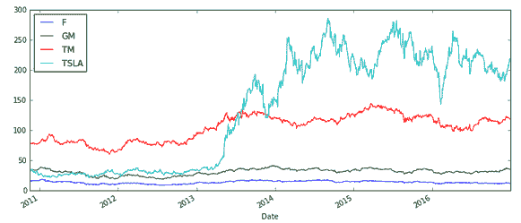
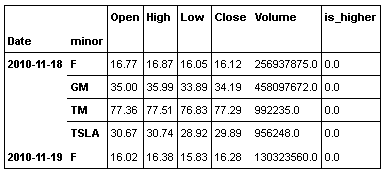
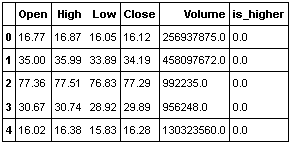
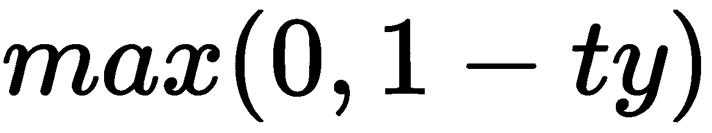
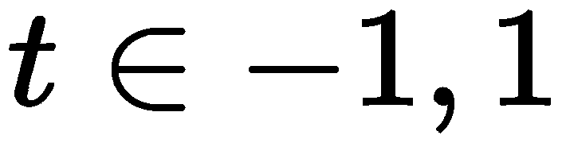
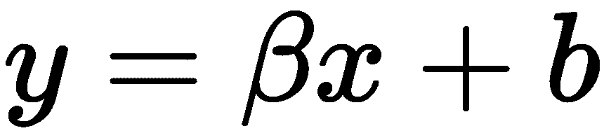
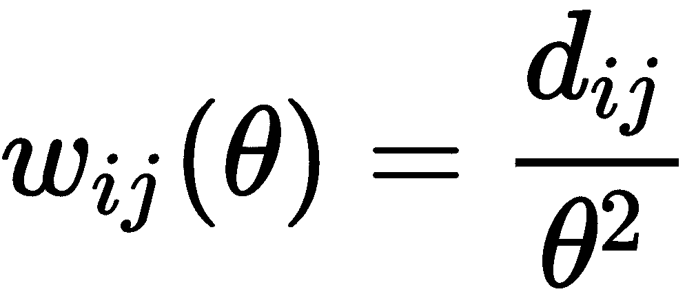

# 第十章：使用 scikit-learn 进行文本和多类分类

本章将涵盖以下食谱：

+   使用 LDA 进行分类

+   使用 QDA（非线性 LDA）进行工作

+   使用 SGD 进行分类

+   使用朴素贝叶斯分类文档

+   半监督学习中的标签传播

# 使用 LDA 进行分类

**线性判别分析**（**LDA**）试图通过特征的线性组合来预测结果变量。LDA 通常用作预处理步骤。我们将在本例中演示这两种方法。

# 做好准备

在这个食谱中，我们将执行以下操作：

1.  从 Google 获取股票数据。

1.  将其重新排列成我们习惯的形式。

1.  创建 LDA 对象以拟合和预测类别标签。

1.  给出一个如何使用 LDA 进行降维的例子。

在开始第 1 步并从 Google 获取股票数据之前，安装一个支持最新股票读取器的 pandas 版本。可以在 Anaconda 命令行中输入以下命令：

```py
conda install -c anaconda pandas-datareader
```

请注意，你的 pandas 版本将会更新。如果这成为问题，可以为当前的 pandas 版本创建一个新的环境。现在打开一个 notebook，检查`pandas-datareader`是否能够正确导入：

```py
from `pandas-datareader` import data
```

如果导入正确，将不会显示任何错误。

# 如何操作...

在这个例子中，我们将执行类似于 Altman Z 分数的分析。在他的论文中，Altman 根据几个财务指标分析了一家公司在两年内违约的可能性。以下内容摘自 Altman Z 分数的维基百科页面：

| **Z 分数公式** | **描述** |
| --- | --- |
| *T1 = 营运资本 / 总资产* | 该指标衡量公司的流动资产与公司规模的关系。 |
| *T2 = 留存收益 / 总资产* | 该指标衡量盈利能力，反映了公司的年龄和盈利能力。 |
| *T3 = 息税前利润 / 总资产* | 该指标衡量税收和杠杆因素之外的运营效率。它认为运营盈利对公司长期生存至关重要。 |
| *T4 = 股本市值 / 总负债账面价值* | 这增加了市场维度，可以揭示证券价格波动作为潜在的预警信号。 |
| *T5 = 销售额 / 总资产* | 这是衡量总资产周转率的标准指标（不同产业之间差异很大）。 |

参考 Altman, Edward I.（1968 年 9 月）发表的文章《*财务比率、判别分析与公司破产预测*》，《金融学杂志》：189–209。

在本分析中，我们将通过 pandas 查看来自 Google 的财务数据。我们将尝试预测基于当前股票属性，六个月后的股价是否会更高。显然，这远不如 Altman 的 Z 分数那样精确。

1.  首先进行几个导入，并存储你将使用的股票代码、数据的开始日期和结束日期：

```py
%matplotlib inline

from pandas_datareader import data
import pandas as pd

tickers = ["F", "TM", "GM", "TSLA"]

first_date = '2009-01-01'
last_date = '2016-12-31'
```

1.  现在，让我们获取股票数据：

```py
stock_panel = data.DataReader(tickers, 'google', first_date, last_date)
```

1.  这个数据结构是 pandas 中的一个面板。它类似于 **在线分析处理** (**OLAP**) 立方体或 3D 数据框。让我们来看一下数据，更加熟悉一下收盘价，因为在比较时，我们关心的就是这些：

```py
stock_df = stock_panel.Close.dropna()
stock_df.plot(figsize=(12, 5))
```

以下是输出结果：



好的，那么现在我们需要将每只股票的价格与它六个月后的价格进行比较。如果更高，我们将其编码为 1，否则为 0。

1.  为此，我们将数据框向后移动 180 天并进行比较：

```py
#this dataframe indicates if the stock was higher in 180 days
classes = (stock_df.shift(-180) > stock_df).astype(int)
```

1.  接下来，我们需要做的是将数据集展开：

```py
X = stock_panel.to_frame()
classes = classes.unstack()
classes = classes.swaplevel(0, 1).sort_index()
classes = classes.to_frame()
classes.index.names = ['Date', 'minor']
data = X.join(classes).dropna()
data.rename(columns={0: 'is_higher'}, inplace=True)
data.head()
```

以下是输出结果：



1.  好的，现在我们需要在 NumPy 中创建矩阵。为此，我们将使用 `patsy` 库。这是一个很棒的库，可以用来创建类似于 R 中的设计矩阵：

```py
import patsy
X = patsy.dmatrix("Open + High + Low + Close + Volume + is_higher - 1", data.reset_index(),return_type='dataframe')
X.head()
```

以下是输出结果：



`patsy` 是一个非常强大的包；例如，假设我们想应用预处理。在 `patsy` 中，像 R 一样，我们可以修改公式，来对应设计矩阵中的修改。这里不会做，但如果我们想将值缩放到均值为 0，标准差为 1，函数将是 *scale(open) + scale(high)*。

1.  现在我们已经有了数据集，让我们来拟合 LDA 对象：

```py
from sklearn.discriminant_analysis import LinearDiscriminantAnalysis as LDA
lda = LDA()
lda.fit(X.iloc[:, :-1], X.iloc[:, -1]);
```

1.  我们可以看到，在预测数据集时表现得还不错。当然，我们还想通过其他参数来改进这个模型并进行测试：

```py
from sklearn.metrics import classification_report
print classification_report(X.iloc[:, -1].values,
lda.predict(X.iloc[:, :-1]))

 precision    recall  f1-score   support

 0.0       0.64      0.81      0.72      3432
 1.0       0.64      0.42      0.51      2727

avg / total       0.64      0.64      0.62      6159
```

这些度量描述了模型以不同方式拟合数据的效果。

`precision` 和 `recall` 参数非常相似。从某些方面来看，正如以下列表所示，它们可以被看作是条件比例：

+   `precision`：给定模型预测的正值，实际正确的比例是多少？这也是为什么 precision 的另一个名称是 **正预测值** (**PPV**) 的原因。

+   `recall`：在已知某一类别为真时，我们选择的比例是多少？我说选择是因为 `recall` 是搜索问题中常见的度量指标。例如，可能有一组与搜索词相关的网页——返回的比例。在第五章，*线性模型 - 逻辑回归*，你见过一个另一名称的 recall，叫做敏感度。

`f1-score` 参数试图总结 `recall` 和 `precision` 之间的关系。

# 它是如何工作的...

LDA 实际上与我们之前做的聚类非常相似。我们从数据中拟合了一个基本模型。然后，一旦我们拥有模型，就尝试预测并比较在每个类别中给定数据的似然性。我们选择那个更可能的选项。

LDA 实际上是**二次判别分析**（**QDA**）的一种简化，我们将在下一个实例中讨论它。这里我们假设每个类别的协方差是相同的，但在 QDA 中，这个假设被放宽。想一想 KNN 与**高斯混合模型**（**GMM**）之间的联系，以及这里和那里之间的关系。

# 使用 QDA —— 非线性 LDA

QDA 是一个常见技术的推广，如二次回归。它只是一个模型的推广，允许更多复杂的模型拟合，但像所有事物一样，当允许复杂性渗入时，我们也使自己的生活变得更加困难。

# 准备工作

我们将在上一个实例的基础上扩展，并通过 QDA 对象来看 QDA。

我们说过我们对模型的协方差做了假设。这里我们将放宽这个假设。

# 如何操作...

1.  QDA 恰好是`qda`模块的成员。使用以下命令来使用 QDA：

```py
from sklearn.discriminant_analysis import QuadraticDiscriminantAnalysis as QDA
qda = QDA()

qda.fit(X.iloc[:, :-1], X.iloc[:, -1])
predictions = qda.predict(X.iloc[:, :-1])
predictions.sum()

2686.0

from sklearn.metrics import classification_report
print classification_report(X.iloc[:, -1].values, predictions)
             precision    recall  f1-score   support

 0.0       0.65      0.66      0.65      3432
 1.0       0.56      0.55      0.56      2727

avg / total       0.61      0.61      0.61      6159
```

正如你所见，整体上差不多。如果回顾*使用 LDA 进行分类*的实例，我们可以看到与 QDA 对象在类别零上的大变化，以及类别一上的细微差别。

正如我们在上一个实例中所讨论的，我们基本上是在这里比较似然。但我们如何比较似然呢？我们不妨使用手头的价格来尝试分类`is_higher`。

# 它是如何工作的...

我们假设收盘价服从对数正态分布。为了计算每个类别的似然，我们需要创建收盘价的子集，并为每个类别准备训练集和测试集。我们将使用内置的交叉验证方法：

```py
from sklearn.model_selection import ShuffleSplit
import scipy.stats as sp

shuffle_split_inst = ShuffleSplit()

for test, train in shuffle_split_inst.split(X):
 train_set = X.iloc[train]
 train_close = train_set.Close

 train_0 = train_close[~train_set.is_higher.astype(bool)]
 train_1 = train_close[train_set.is_higher.astype(bool)]

 test_set = X.iloc[test]
 test_close = test_set.Close.values

ll_0 = sp.norm.pdf(test_close, train_0.mean())
ll_1 = sp.norm.pdf(test_close, train_1.mean())
```

现在我们已经有了两个类别的似然，可以进行比较并分配类别：

```py
(ll_0 > ll_1).mean()

0.14486740032473389
```

# 使用 SGD 进行分类

**随机梯度下降**（**SGD**）是用于拟合回归模型的基本技术。SGD 在分类或回归中的应用有自然的联系。

# 准备工作

在回归分析中，我们最小化了一个惩罚错误选择的代价函数，它是在一个连续尺度上进行的，但对于分类问题，我们将最小化一个惩罚两个（或更多）情况的代价函数。

# 如何操作...

1.  首先，让我们创建一些非常基本的数据：

```py
from sklearn import datasets
X, y = datasets.make_classification(n_samples = 500)
```

1.  将数据分割成训练集和测试集：

```py
from sklearn.model_selection import train_test_split
X_train, X_test, y_train, y_test = train_test_split(X,y,stratify=y)
```

1.  实例化并训练分类器：

```py
from sklearn import linear_model
sgd_clf = linear_model.SGDClassifier()
#As usual, we'll fit the model:
sgd_clf.fit(X_train, y_train)
```

1.  测量测试集上的性能：

```py
from sklearn.metrics import accuracy_score
accuracy_score(y_test,sgd_clf.predict(X_test))

0.80000000000000004
```

# 还有更多...

我们可以设置`class_weight`参数来考虑数据集中不同程度的不平衡。

合页损失函数定义如下：



这里，`t`是真实分类，表示*+1*表示一个类别，*-1*表示另一个类别。系数向量由从模型中拟合的*y*表示，*x*是感兴趣的值。还有一个截距用于辅助计算。换句话说：



# 使用朴素贝叶斯分类文档

朴素贝叶斯是一个非常有趣的模型。它有点类似于 KNN，因为它做了一些假设，这些假设可能会过于简化现实，但在许多情况下仍然表现良好。

# 准备好

在这个实例中，我们将使用朴素贝叶斯进行文档分类，使用的是`sklearn`。我个人的一个例子是使用会计中的账户描述词汇，例如应付账款，来判断它属于损益表、现金流量表还是资产负债表。

基本思想是使用标注测试语料库中的单词频率来学习文档的分类。然后，我们可以将其应用于训练集，并尝试预测标签。

我们将使用`sklearn`中的`newgroups`数据集来玩转朴素贝叶斯模型。这是一个非平凡量的数据集，所以我们会直接获取它，而不是加载它。我们还将限制类别为`rec.autos`和`rec.motorcycles`：

```py
import numpy as np
from sklearn.datasets import fetch_20newsgroups
categories = ["rec.autos", "rec.motorcycles"]
newgroups = fetch_20newsgroups(categories=categories)
#take a look
print "\n".join(newgroups.data[:1])

From: gregl@zimmer.CSUFresno.EDU (Greg Lewis)
Subject: Re: WARNING.....(please read)...
Keywords: BRICK, TRUCK, DANGER
Nntp-Posting-Host: zimmer.csufresno.edu
Organization: CSU Fresno
Lines: 33
...

newgroups.target_names

['rec.autos', 'rec.motorcycles']
```

现在我们有了新组，我们需要将每个文档表示为词袋模型。这种表示法也正是朴素贝叶斯名称的由来。该模型是“朴素”的，因为文档分类时并不考虑文档内部的词汇协方差。这可能被认为是一个缺陷，但事实证明，朴素贝叶斯在许多情况下都能合理有效地工作。

我们需要将数据预处理成词袋矩阵。这是一个稀疏矩阵，当文档中存在某个单词时，就会有对应的条目。这个矩阵可能会变得非常大，如下所示：

```py
from sklearn.feature_extraction.text import CountVectorizer
count_vec = CountVectorizer()
bow = count_vec.fit_transform(newgroups.data)
```

这个矩阵是一个稀疏矩阵，它的维度是文档数量和每个单词的数量。矩阵中的文档和单词值是特定术语的频率：

```py
bow

<1192x19177 sparse matrix of type '<type 'numpy.int64'>'
 with 164296 stored elements in Compressed Sparse Row format>
```

实际上，我们需要将矩阵转换为稠密数组，以便用于朴素贝叶斯对象。所以，我们需要将其转换回来：

```py
bow = np.array(bow.todense())
```

显然，大多数条目都是零，但我们可能想要重新构建文档计数以进行合理性检查：

```py
words = np.array(count_vec.get_feature_names())
words[bow[0] > 0][:5]

array([u'10pm', u'1qh336innfl5', u'33', u'93740',
 u'___________________________________________________________________'], 
 dtype='<U79')
```

现在，这些是第一个文档中的示例吗？我们可以使用以下命令来检查：

```py
'10pm' in newgroups.data[0].lower()

True

'1qh336innfl5' in newgroups.data[0].lower()

True
```

# 如何操作...

好吧，准备数据比平常多花了一些时间，但我们处理的是文本数据，这些数据不像我们平常处理的矩阵数据那样可以迅速表示。

1.  然而，现在我们准备好了，就可以启动分类器并拟合我们的模型：

```py
from sklearn import naive_bayes
clf = naive_bayes.GaussianNB().fit(X_train, y_train)
```

1.  将`bow`和`newgroups.target`分别重命名为`X`和`y`。在拟合模型之前，我们先将数据集拆分为训练集和测试集：

```py
X = bow
y = newgroups.target

from sklearn.model_selection import train_test_split

X_train, X_test, y_train, y_test = train_test_split(X, y, test_size = 0.5,stratify=y)
```

1.  现在我们在测试集上拟合了一个模型，并试图预测训练集，以确定哪些类别与哪些文章相对应，让我们来看看大致的准确性：

```py
from sklearn.metrics import accuracy_score
accuracy_score(y_test,clf.predict(X_test) )

0.94630872483221473
```

# 它是如何工作的...

朴素贝叶斯的基本思想是，我们可以根据特征向量估算某个数据点属于某个类别的概率。

通过贝叶斯公式可以重新排列，得到**最大后验**（**MAP**）估计特征向量。这个 MAP 估计选择了特征向量的概率最大化的类别。

# 还有更多...

我们也可以将朴素贝叶斯扩展到多类工作。我们不再假设高斯似然，而是使用多项式似然。

首先，让我们获取第三类数据：

```py
from sklearn.datasets import fetch_20newsgroups
mn_categories = ["rec.autos", "rec.motorcycles", "talk.politics.guns"]
mn_newgroups = fetch_20newsgroups(categories=mn_categories)
```

我们需要像处理分类问题一样对其进行向量化：

```py
mn_bow = count_vec.fit_transform(mn_newgroups.data)
mn_bow = np.array(mn_bow.todense())
```

将`mn_bow`和`mn_newgroups.target`分别重命名为`X`和`y`。让我们创建一个训练集和一个测试集，并使用训练数据训练一个多项式贝叶斯模型：

```py
X = mn_bow
y = mn_newgroups.target

from sklearn.model_selection import train_test_split
X_train, X_test, y_train, y_test = train_test_split(X, y, test_size = 0.5,stratify=y)

from sklearn.naive_bayes import MultinomialNB
clf = MultinomialNB().fit(X_train, y_train)
```

测量模型准确度：

```py
from sklearn.metrics import accuracy_score
 accuracy_score(y_test,clf.predict(X_test) )

0.96317606444188719
```

这并不完全令人惊讶，我们表现得相当不错。我们在双类情况下表现得相当好，而且由于有人猜测`talk.politics.guns`类别与其他两个类别相对独立，因此我们应该表现得相当好。

# 半监督学习中的标签传播

标签传播是一种半监督技术，利用标记数据和未标记数据来学习未标记数据。通常，受益于分类算法的数据很难标记。例如，标记数据可能非常昂贵，因此只有一部分数据进行人工标记才是具有成本效益的。尽管如此，似乎有慢慢增长的趋势支持公司雇佣分类学家。

# 准备工作

另一个问题领域是审查数据。你可以想象一个情况，时间的前沿将影响你收集标记数据的能力。例如，假设你对患者进行了测量并给他们服用了实验药物。在某些情况下，如果药物反应足够迅速，你可以测量药物的效果，但你可能还想预测反应较慢的药物的效果。药物可能对某些患者引起致命反应，可能需要采取挽救生命的措施。

# 怎么做...

1.  为了表示半监督或审查数据，我们需要进行一些数据预处理。首先，我们将通过一个简单的例子进行演示，然后再处理一些更复杂的情况：

```py
from sklearn import datasets
d = datasets.load_iris()
```

1.  由于我们将对数据进行修改，所以让我们创建副本并在目标名称的副本中添加一个未标记成员。这样以后更容易识别数据：

```py
X = d.data.copy()
y = d.target.copy()
names = d.target_names.copy()
names = np.append(names, ['unlabeled'])
names

array(['setosa', 'versicolor', 'virginica', 'unlabeled'], 
 dtype='|S10')
```

1.  现在，让我们用`-1`更新`y`。这表示未标记的情况。这也是我们在名称末尾添加未标记的原因：

```py
y[np.random.choice([True, False], len(y))] = -1
```

1.  我们的数据现在有一堆`-1`与实际数据交错在一起：

```py
y[:10]

array([ 0, -1, -1, 0, 0, 0, 0, -1, 0, -1])

names[y[:10]]

array(['setosa', 'unlabeled', 'unlabeled', 'setosa', 'setosa', 'setosa',
 'setosa', 'unlabeled', 'setosa', 'unlabeled'], 
 dtype='|S10')
```

1.  我们显然有很多未标记的数据，现在的目标是使用`LabelPropagation`方法来预测标签：

```py
from sklearn import semi_supervised
lp = semi_supervised.LabelPropagation()
lp.fit(X, y)

LabelPropagation(alpha=1, gamma=20, kernel='rbf', max_iter=30, n_jobs=1,
 n_neighbors=7, tol=0.001)
```

1.  测量准确度评分：

```py
preds = lp.predict(X)
(preds == d.target).mean()

0.97333333333333338
```

还不错，尽管我们使用了所有数据，这有点像作弊。另外，鸢尾花数据集是一个相对分离的数据集。

使用整个数据集让人联想到更传统的统计方法。选择不在测试集上进行测量减少了我们对预测的关注，鼓励我们更多地理解和解释整个数据集。如前所述，理解与黑箱预测的区别在于传统统计学和机器学习。

顺便说一下，让我们来看一下 `LabelSpreading`，它是 `LabelPropagation` 的姊妹类。我们将在本节 *如何工作...* 中对 `LabelPropagation` 和 `LabelSpreading` 做出技术性区分，但它们非常相似：

```py
ls = semi_supervised.LabelSpreading()
```

`LabelSpreading` 比 `LabelPropagation` 更加鲁棒和抗噪声，正如它的工作方式所观察到的那样：

```py
ls.fit(X, y)

LabelSpreading(alpha=0.2, gamma=20, kernel='rbf', max_iter=30, n_jobs=1,
 n_neighbors=7, tol=0.001)
```

测量准确率得分：

```py
(ls.predict(X) == d.target).mean()

0.96666666666666667
```

不要将标签传播算法遗漏的一个案例看作是它表现较差的标志。关键是我们可能赋予它一定的能力，使其在训练集上进行良好的预测，并能适用于更广泛的情况。

# 它是如何工作的……

标签传播通过创建一个数据点的图来工作，边缘上根据以下公式设置权重：



该算法通过标记的数据点将其标签传播到未标记的数据点。这个传播过程在一定程度上由边缘权重决定。

边缘权重可以放置在一个转移概率矩阵中。我们可以通过迭代的方式来确定实际标签的良好估计值。
