# 第一章：使用 Scala 进行实用机器学习与 Spark

在本章中，我们将涵盖：

+   下载和安装 JDK

+   下载和安装 IntelliJ

+   下载和安装 Spark

+   配置 IntelliJ 以与 Spark 配合并运行 Spark ML 示例代码

+   使用 Spark 运行示例 ML 代码

+   确定实际机器学习的数据来源

+   使用 IntelliJ IDE 运行第一个程序的 Apache Spark 2.0

+   如何将图形添加到您的 Spark 程序中

# 介绍

随着集群计算的最新进展以及大数据的崛起，机器学习领域已经被推到了计算的前沿。长期以来，实现大规模数据科学的交互平台一直是一个现实的梦想。 

以下三个领域共同促成并加速了大规模交互式数据科学：

+   **Apache Spark**：一个统一的数据科学技术平台，将快速计算引擎和容错数据结构结合成一个设计良好且集成的产品

+   **机器学习**：一种人工智能领域，使机器能够模仿一些最初仅由人脑执行的任务

+   **Scala**：一种现代的基于 JVM 的语言，它建立在传统语言的基础上，但将函数式和面向对象的概念结合起来，而不像其他语言那样冗长。

首先，我们需要设置开发环境，其中将包括以下组件：

+   Spark

+   IntelliJ 社区版 IDE

+   Scala

本章的配方将为您提供安装和配置 IntelliJ IDE、Scala 插件和 Spark 的详细说明。设置开发环境后，我们将继续运行 Spark ML 示例代码之一，以测试设置。

# Apache Spark

Apache Spark 正在成为大数据分析的事实标准平台和交易语言，作为**Hadoop**范例的补充。Spark 使数据科学家能够立即按照最有利于其工作流程的方式工作。Spark 的方法是在完全分布式的方式处理工作负载，而无需**MapReduce**（**MR**）或将中间结果重复写入磁盘。

Spark 提供了一个易于使用的统一技术堆栈中的分布式框架，这使得它成为数据科学项目的首选平台，这些项目往往需要一个最终朝着解决方案合并的迭代算法。由于其内部工作原理，这些算法生成大量中间结果，这些结果需要在中间步骤中从一阶段传递到下一阶段。对于大多数数据科学项目来说，需要一个具有强大本地分布式**机器学习库**（**MLlib**）的交互式工具，这排除了基于磁盘的方法。

Spark 对集群计算有不同的方法。它解决问题的方式是作为技术堆栈而不是生态系统。大量集中管理的库与一个快速的计算引擎相结合，可以支持容错数据结构，这使得 Spark 成为首选的大数据分析平台，取代了 Hadoop。

Spark 采用模块化方法，如下图所示：

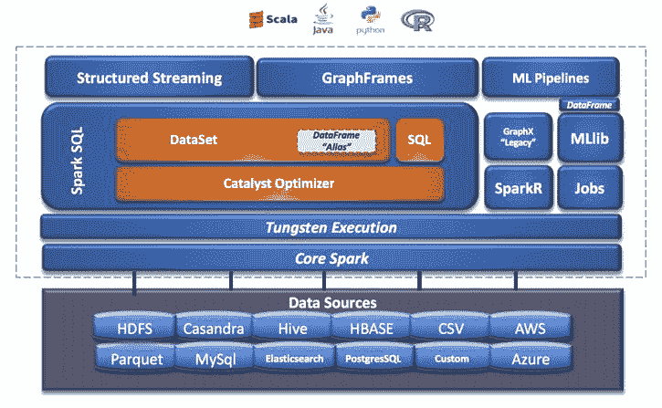

# 机器学习

机器学习的目标是生产可以模仿人类智能并自动执行一些传统上由人脑保留的任务的机器和设备。机器学习算法旨在在相对较短的时间内处理非常大的数据集，并近似得出人类需要更长时间处理的答案。

机器学习领域可以分为许多形式，从高层次上来看，可以分为监督学习和无监督学习。监督学习算法是一类使用训练集（即标记数据）来计算概率分布或图形模型的机器学习算法，从而使它们能够对新数据点进行分类，而无需进一步的人为干预。无监督学习是一种用于从不带标记响应的输入数据集中推断的机器学习算法。

Spark 提供了丰富的机器学习算法，可以在大型数据集上部署，无需进一步编码。下图描述了 Spark 的 MLlib 算法作为思维导图。Spark 的 MLlib 旨在利用并行性，同时具有容错的分布式数据结构。Spark 将这些数据结构称为**弹性分布式数据集**或**RDDs**：

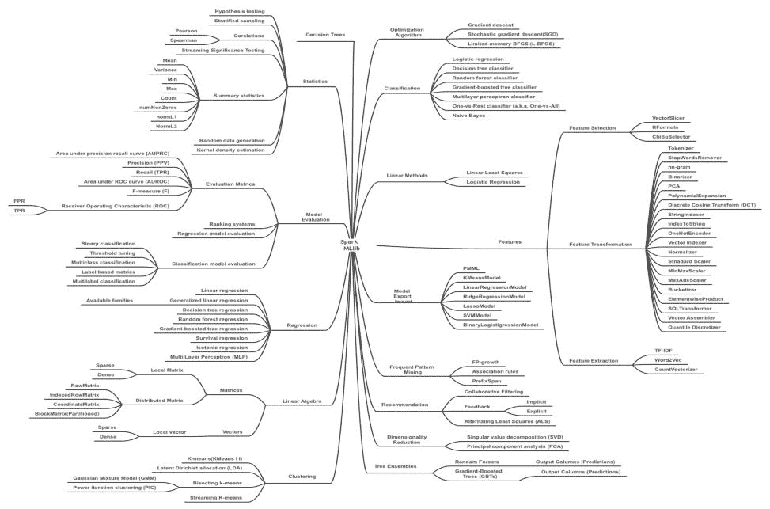

# Scala

**Scala**是一种现代编程语言，正在成为传统编程语言（如**Java**和**C++**）的替代品。Scala 是一种基于 JVM 的语言，不仅提供了简洁的语法，而且还将面向对象和函数式编程结合到了一个极其简洁和非常强大的类型安全语言中。

Scala 采用灵活和富有表现力的方法，使其非常适合与 Spark 的 MLlib 交互。Spark 本身是用 Scala 编写的事实证明了 Scala 语言是一种全方位的编程语言，可以用来创建具有重大性能需求的复杂系统代码。

Scala 通过解决一些 Java 的缺点，同时避免了全有或全无的方法，继承了 Java 的传统。Scala 代码编译成 Java 字节码，从而使其能够与丰富的 Java 库互换使用。能够在 Scala 和 Java 之间使用 Java 库提供了连续性和丰富的环境，使软件工程师能够构建现代和复杂的机器学习系统，而不必完全脱离 Java 传统和代码库。

Scala 完全支持功能丰富的函数式编程范式，标准支持 lambda、柯里化、类型接口、不可变性、惰性求值和一种类似 Perl 的模式匹配范式，而不带有神秘的语法。由于 Scala 支持代数友好的数据类型、匿名函数、协变、逆变和高阶函数，因此 Scala 非常适合机器学习编程。

以下是 Scala 中的 hello world 程序：

```scala
object HelloWorld extends App { 
   println("Hello World!") 
 } 
```

在 Scala 中编译和运行`HelloWorld`看起来像这样：

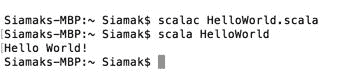

《Apache Spark 机器学习食谱》采用实用的方法，以开发人员为重点提供多学科视角。本书侧重于**机器学习**、**Apache Spark**和**Scala**的交互和凝聚力。我们还采取额外步骤，教您如何设置和运行开发环境，使其熟悉开发人员，并提供必须在交互式 shell 中运行的代码片段，而不使用现代 IDE 提供的便利设施：

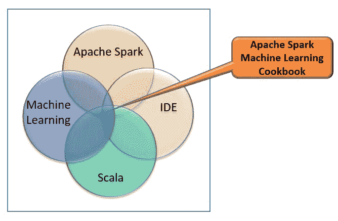

# 本书中使用的软件版本和库

以下表格提供了本书中使用的软件版本和库的详细列表。如果您按照本章中的安装说明进行安装，将包括此处列出的大部分项目。可能需要特定配方的任何其他 JAR 或库文件都将通过各自配方中的额外安装说明进行覆盖：

| **核心系统** | **版本** |
| --- | --- |
| Spark | 2.0.0 |
| Java | 1.8 |
| IntelliJ IDEA | 2016.2.4 |
| Scala-sdk | 2.11.8 |

将需要的其他 JAR 如下：

| **其他 JAR** | **版本** |
| --- | --- |
| `bliki-core` | 3.0.19 |
| `breeze-viz` | 0.12 |
| `Cloud9` | 1.5.0 |
| `Hadoop-streaming` | 2.2.0 |
| `JCommon` | 1.0.23 |
| `JFreeChart` | 1.0.19 |
| `lucene-analyzers-common` | 6.0.0 |
| `Lucene-Core` | 6.0.0 |
| `scopt` | 3.3.0 |
| `spark-streaming-flume-assembly` | 2.0.0 |
| `spark-streaming-kafka-0-8-assembly` | 2.0.0 |

我们还在 Spark 2.1.1 上测试了本书中的所有配方，并发现程序按预期执行。建议您在学习目的上使用这些表中列出的软件版本和库。

为了跟上快速变化的 Spark 领域和文档，本书中提到的 Spark 文档的 API 链接指向 Spark 2.x.x 的最新版本，但是配方中的 API 引用明确是针对 Spark 2.0.0 的。

本书提供的所有 Spark 文档链接都将指向 Spark 网站上的最新文档。如果您希望查找特定版本的 Spark 文档（例如，Spark 2.0.0），请使用以下 URL 在 Spark 网站上查找相关文档：

[`spark.apache.org/documentation.html`](https://spark.apache.org/documentation.html)

我们将代码尽可能简化，以便清晰地展示，而不是展示 Scala 的高级功能。

# 下载和安装 JDK

第一步是下载 Scala/Spark 开发所需的 JDK 开发环境。

# 准备工作

当您准备好下载和安装 JDK 时，请访问以下链接：

[`www.oracle.com/technetwork/java/javase/downloads/index.html`](http://www.oracle.com/technetwork/java/javase/downloads/index.html)

# 如何做...

下载成功后，请按照屏幕上的说明安装 JDK。

# 下载和安装 IntelliJ

IntelliJ Community Edition 是用于 Java SE、Groovy、Scala 和 Kotlin 开发的轻量级 IDE。为了完成设置您的机器学习与 Spark 开发环境，需要安装 IntelliJ IDE。

# 准备工作

当您准备好下载和安装 IntelliJ 时，请访问以下链接：

[`www.jetbrains.com/idea/download/`](https://www.jetbrains.com/idea/download/)

# 如何做...

在撰写本文时，我们使用的是 IntelliJ 15.x 或更高版本（例如，版本 2016.2.4）来测试本书中的示例，但是请随时下载最新版本。下载安装文件后，双击下载的文件（.exe）并开始安装 IDE。如果您不想进行任何更改，请将所有安装选项保持默认设置。按照屏幕上的说明完成安装：

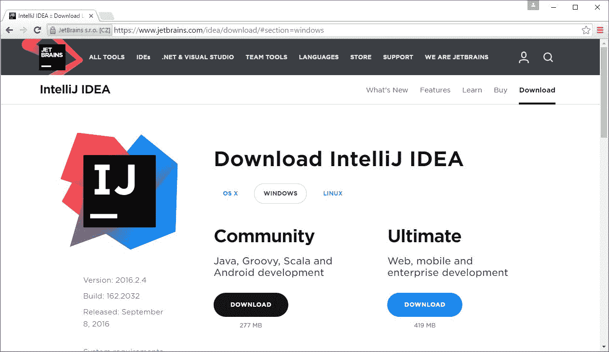

# 下载和安装 Spark

现在我们继续下载和安装 Spark。

# 准备工作

当您准备好下载和安装 Spark 时，请访问 Apache 网站上的此链接：

[`spark.apache.org/downloads.html`](http://spark.apache.org/downloads.html)

# 如何做...

转到 Apache 网站并选择所需的下载参数，如此屏幕截图所示：

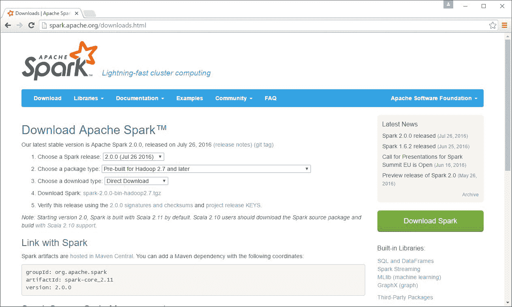

确保接受默认选择（点击下一步）并继续安装。

# 配置 IntelliJ 以便与 Spark 一起工作并运行 Spark ML 示例代码

在能够运行 Spark 提供的示例或本书中列出的任何程序之前，我们需要运行一些配置以确保项目设置正确。

# 准备工作

在配置项目结构和全局库时，我们需要特别小心。设置好一切后，我们继续运行 Spark 团队提供的示例 ML 代码以验证设置。示例代码可以在 Spark 目录下找到，也可以通过下载带有示例的 Spark 源代码获得。

# 如何做...

以下是配置 IntelliJ 以使用 Spark MLlib 并在示例目录中运行 Spark 提供的示例 ML 代码的步骤。示例目录可以在 Spark 的主目录中找到。使用 Scala 示例继续：

1.  单击“Project Structure...”选项，如下截图所示，以配置项目设置：

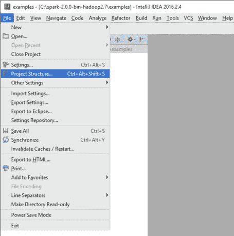

1.  验证设置：

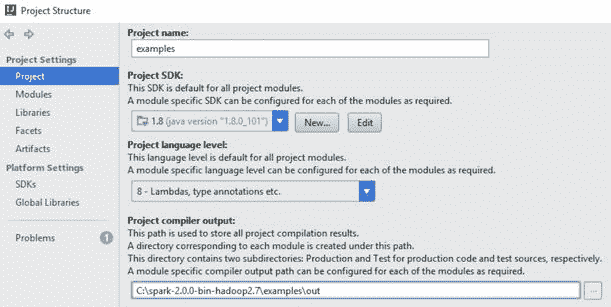

1.  配置全局库。选择 Scala SDK 作为全局库：

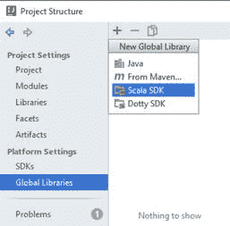

1.  选择新的 Scala SDK 的 JAR 文件并让下载完成：

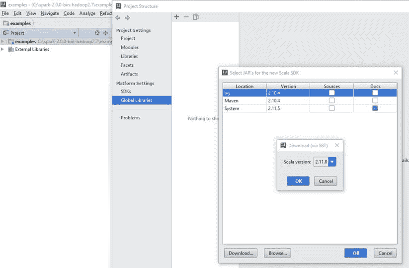

1.  选择项目名称：

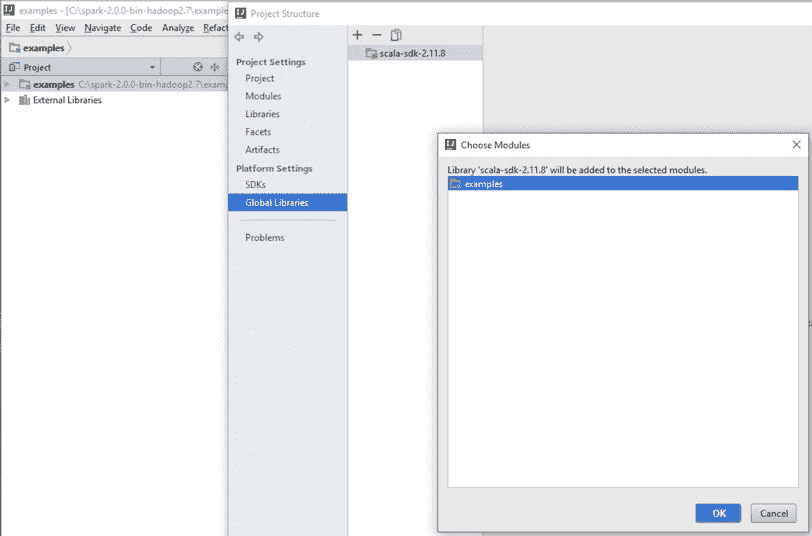

1.  验证设置和额外的库：

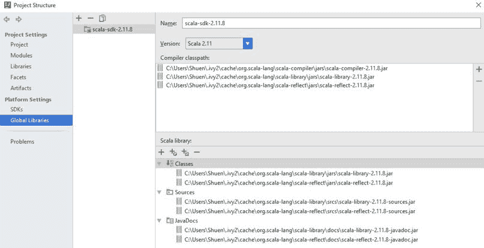

1.  添加依赖的 JAR 文件。在左侧窗格的项目设置下选择模块，然后单击依赖项选择所需的 JAR 文件，如下截图所示：

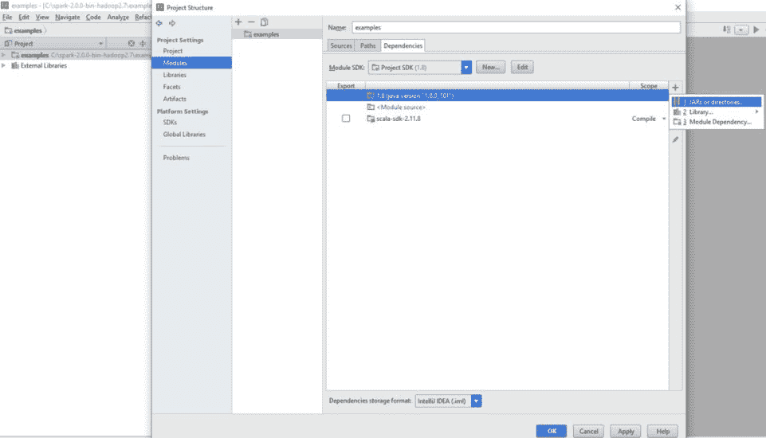

1.  选择 Spark 提供的 JAR 文件。选择 Spark 的默认安装目录，然后选择`lib`目录：

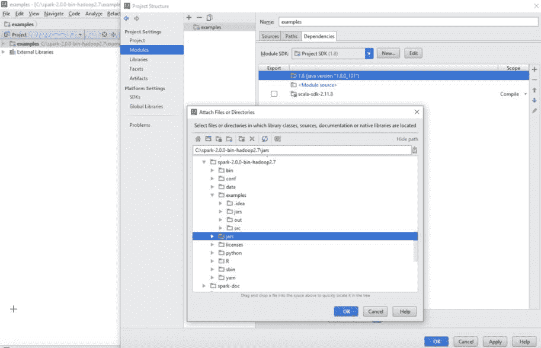

1.  然后我们选择提供给 Spark 的示例 JAR 文件。

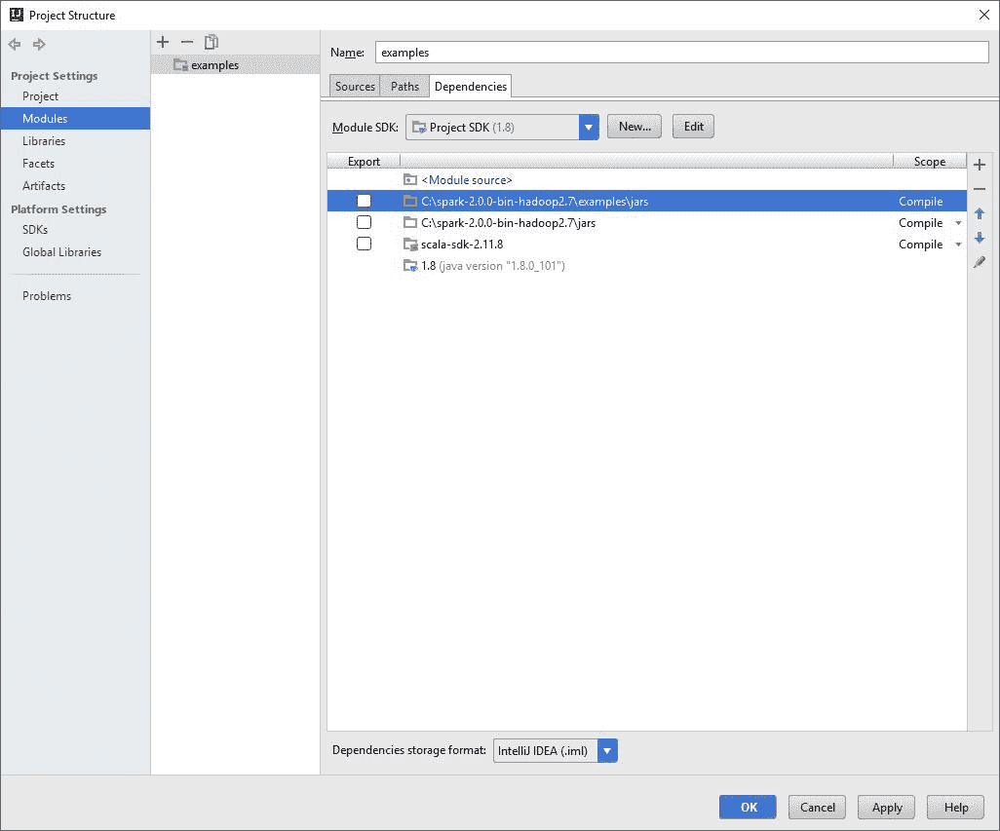

1.  通过验证在左侧窗格中选择并导入所有列在`External Libraries`下的 JAR 文件来添加所需的 JAR 文件：

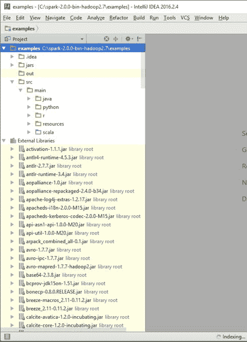

1.  Spark 2.0 使用 Scala 2.11。运行示例需要两个新的流 JAR 文件，Flume 和 Kafka，并可以从以下 URL 下载：

+   [`repo1.maven.org/maven2/org/apache/spark/spark-streaming-flume-assembly_2.11/2.0.0/spark-streaming-flume-assembly_2.11-2.0.0.jar`](https://repo1.maven.org/maven2/org/apache/spark/spark-streaming-flume-assembly_2.11/2.0.0/spark-streaming-flume-assembly_2.11-2.0.0.jar)

+   [`repo1.maven.org/maven2/org/apache/spark/spark-streaming-kafka-0-8-assembly_2.11/2.0.0/spark-streaming-kafka-0-8-assembly_2.11-2.0.0.jar`](https://repo1.maven.org/maven2/org/apache/spark/spark-streaming-kafka-0-8-assembly_2.11/2.0.0/spark-streaming-kafka-0-8-assembly_2.11-2.0.0.jar)

下一步是下载并安装 Flume 和 Kafka 的 JAR 文件。出于本书的目的，我们使用了 Maven 存储库：

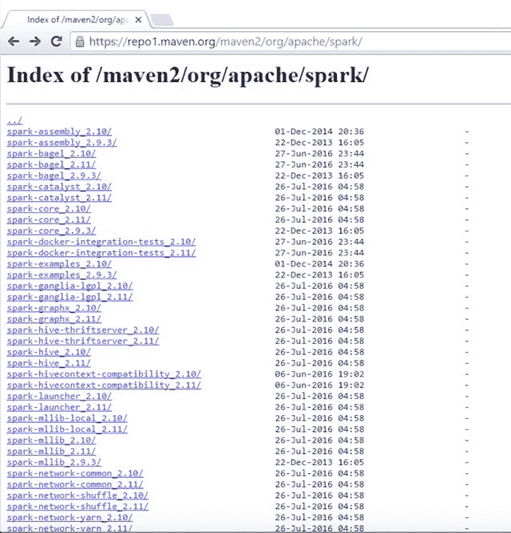

1.  下载并安装 Kafka 组件：

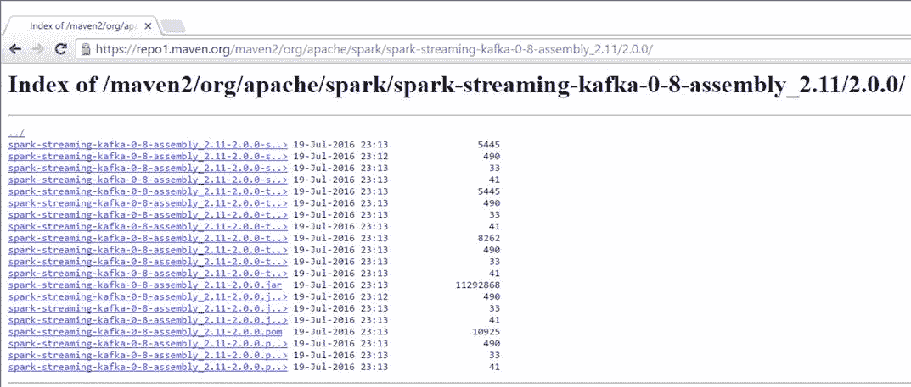

1.  下载并安装 Flume 组件：

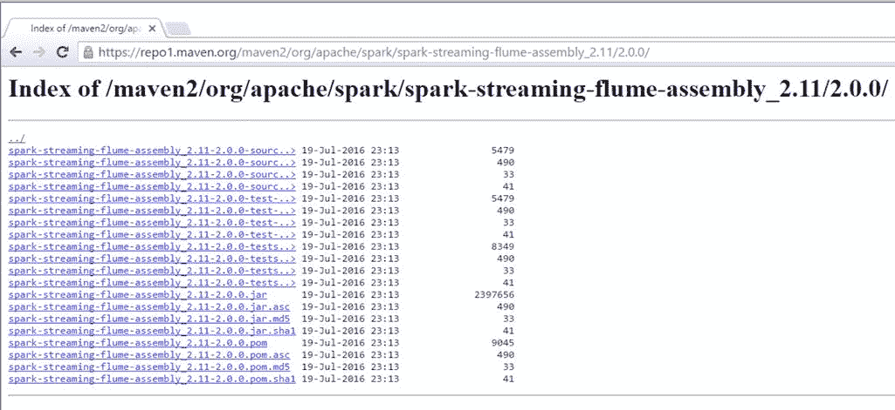

1.  下载完成后，将下载的 JAR 文件移动到 Spark 的`lib`目录中。我们在安装 Spark 时使用了`C`驱动器：

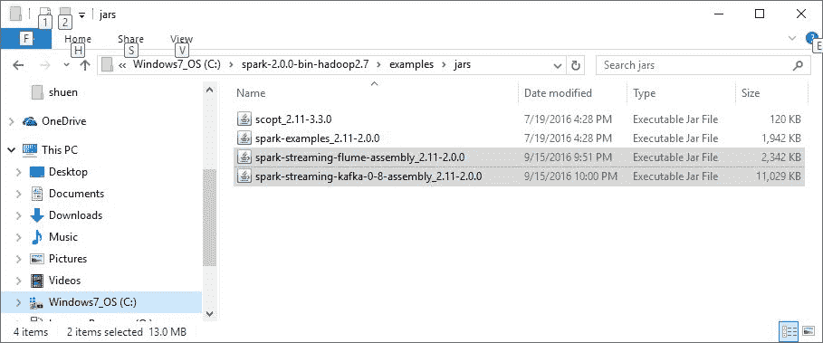

1.  打开您的 IDE 并验证左侧的`External Libraries`文件夹中的所有 JAR 文件是否存在于您的设置中，如下截图所示：

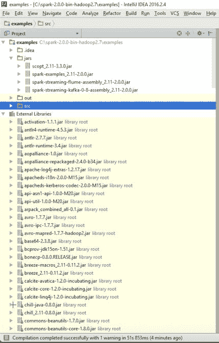

1.  构建 Spark 中的示例项目以验证设置：

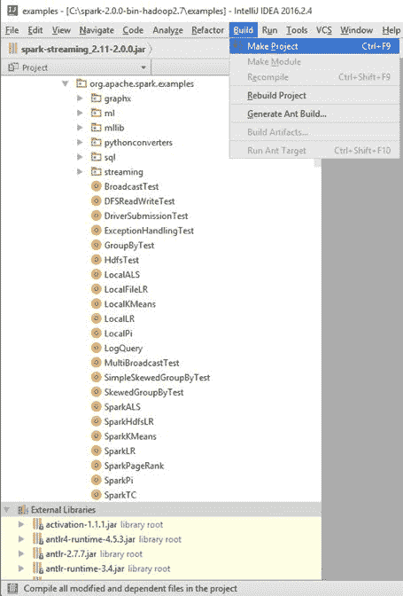

1.  验证构建是否成功：

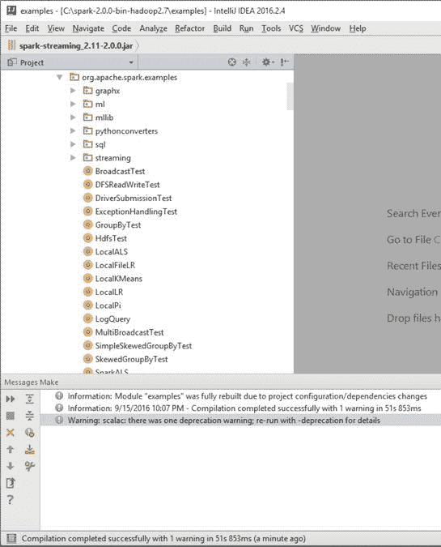

# 还有更多...

在 Spark 2.0 之前，我们需要来自 Google 的另一个名为**Guava**的库来促进 I/O 并提供一组丰富的方法来定义表，然后让 Spark 在集群中广播它们。由于依赖问题很难解决，Spark 2.0 不再使用 Guava 库。如果您使用的是 2.0 之前的 Spark 版本（1.5.2 版本需要），请确保使用 Guava 库。Guava 库可以在以下 URL 中访问：

[`github.com/google/guava/wiki`](https://github.com/google/guava/wiki)

您可能想使用版本为 15.0 的 Guava，可以在这里找到：

[`mvnrepository.com/artifact/com.google.guava/guava/15.0`](https://mvnrepository.com/artifact/com.google.guava/guava/15.0)

如果您正在使用以前博客中的安装说明，请确保从安装集中排除 Guava 库。

# 另请参阅

如果还有其他第三方库或 JAR 文件需要完成 Spark 安装，您可以在以下 Maven 存储库中找到：

[`repo1.maven.org/maven2/org/apache/spark/`](https://repo1.maven.org/maven2/org/apache/spark/)

# 从 Spark 运行示例 ML 代码

我们可以通过简单地从 Spark 源树下载示例代码并将其导入到 IntelliJ 中来验证设置，以确保其运行。

# 准备就绪

我们将首先运行逻辑回归代码从样本中验证安装。在下一节中，我们将继续编写同样程序的我们自己的版本，并检查输出以了解其工作原理。

# 如何做...

1.  转到源目录并选择要运行的 ML 样本代码文件。我们选择了逻辑回归示例。

如果您在您的目录中找不到源代码，您可以随时下载 Spark 源代码，解压缩，然后相应地提取示例目录。

1.  选择示例后，选择编辑配置...，如下面的截图所示：

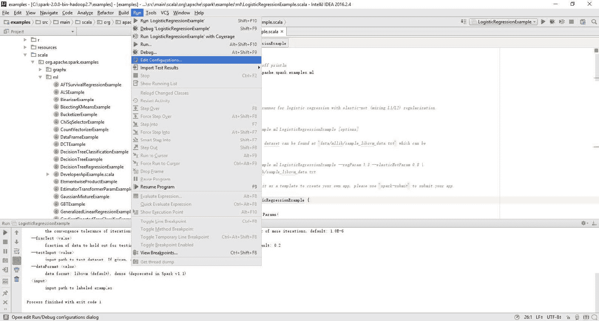

1.  在配置选项卡中，定义以下选项：

+   VM 选项：所示的选择允许您运行独立的 Spark 集群

+   程序参数：我们应该传递给程序的内容

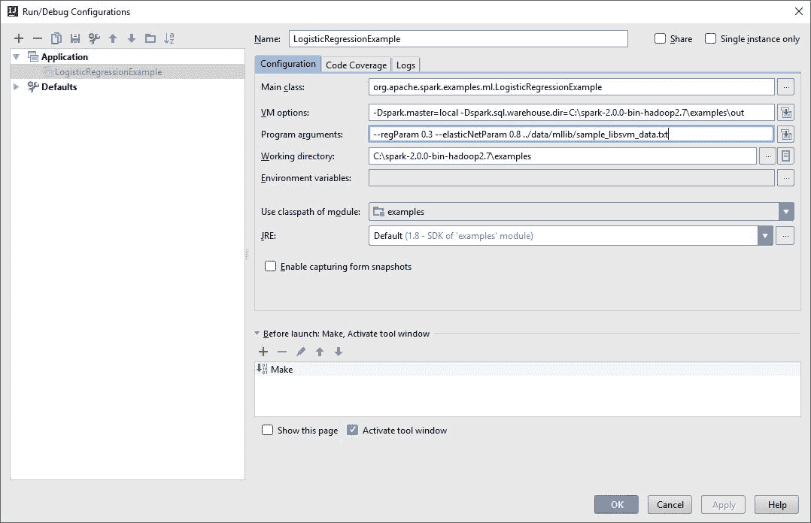

1.  通过转到运行'LogisticRegressionExample'来运行逻辑回归，如下面的截图所示：

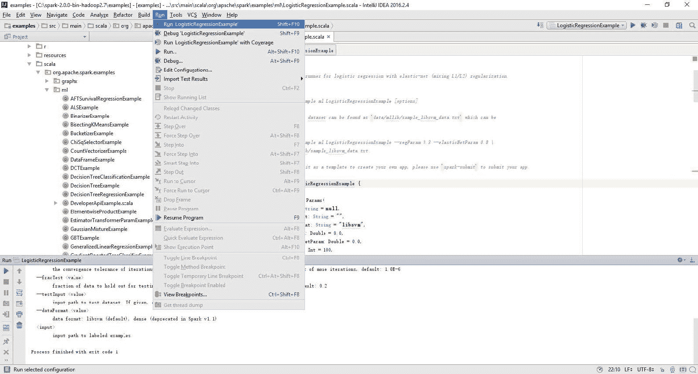

1.  验证退出代码，并确保其如下面的截图所示：

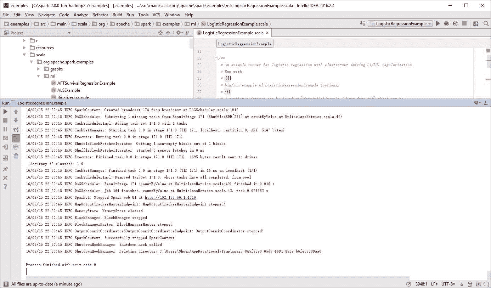

# 识别实际机器学习的数据来源

过去获取机器学习项目的数据是一个挑战。然而，现在有一套丰富的公共数据源，专门适用于机器学习。

# 准备就绪

除了大学和政府来源外，还有许多其他开放数据源可用于学习和编写自己的示例和项目。我们将列出数据来源，并向您展示如何最好地获取和下载每一章的数据。

# 如何做...

以下是一些值得探索的开源数据列表，如果您想在这个领域开发应用程序：

+   *UCI 机器学习库*：这是一个具有搜索功能的广泛库。在撰写本文时，有超过 350 个数据集。您可以单击[`archive.ics.uci.edu/ml/index.html`](https://archive.ics.uci.edu/ml/index.html)链接查看所有数据集，或使用简单搜索（*Ctrl* + *F*）查找特定集。

+   *Kaggle 数据集*：您需要创建一个帐户，但您可以下载任何用于学习以及参加机器学习竞赛的数据集。 [`www.kaggle.com/competitions`](https://www.kaggle.com/competitions)链接提供了有关探索和了解 Kaggle 以及机器学习竞赛内部运作的详细信息。

+   *MLdata.org*：一个向所有人开放的公共网站，其中包含机器学习爱好者的数据集存储库。

+   *Google 趋势*：您可以在[`www.google.com/trends/explore`](http://www.google.com/trends/explore)上找到自 2004 年以来任何给定术语的搜索量统计（作为总搜索量的比例）。

+   *中央情报局世界概况*：[`www.cia.gov/library/publications/the-world-factbook/`](https://www.cia.gov/library/publications/the-world-factbook/)链接提供了有关 267 个国家的历史、人口、经济、政府、基础设施和军事的信息。

# 另请参阅

机器学习数据的其他来源：

+   短信垃圾邮件数据：[`www.dt.fee.unicamp.br/~tiago/smsspamcollection/`](http://www.dt.fee.unicamp.br/~tiago/smsspamcollection/)

+   来自 Lending Club 的金融数据集[`www.lendingclub.com/info/download-data.action`](https://www.lendingclub.com/info/download-data.action)

+   来自 Yahoo 的研究数据[`webscope.sandbox.yahoo.com/index.php`](http://webscope.sandbox.yahoo.com/index.php)

+   亚马逊 AWS 公共数据集[`aws.amazon.com/public-data-sets/`](http://aws.amazon.com/public-data-sets/)

+   来自 Image Net 的标记视觉数据[`www.image-net.org`](http://www.image-net.org)

+   人口普查数据集[`www.census.gov`](http://www.census.gov)

+   编译的 YouTube 数据集[`netsg.cs.sfu.ca/youtubedata/`](http://netsg.cs.sfu.ca/youtubedata/)

+   从 MovieLens 网站收集的评分数据[`grouplens.org/datasets/movielens/`](http://grouplens.org/datasets/movielens/)

+   Enron 数据集对公众开放[`www.cs.cmu.edu/~enron/`](http://www.cs.cmu.edu/~enron/)

+   经典书籍《统计学习要素》的数据集[`statweb.stanford.edu/~tibs/ElemStatLearn/data.htmlIMDB`](http://statweb.stanford.edu/~tibs/ElemStatLearn/data.htmlIMDB)

+   电影数据集[`www.imdb.com/interfaces`](http://www.imdb.com/interfaces)

+   百万歌曲数据集[`labrosa.ee.columbia.edu/millionsong/`](http://labrosa.ee.columbia.edu/millionsong/)

+   语音和音频数据集[`labrosa.ee.columbia.edu/projects/`](http://labrosa.ee.columbia.edu/projects/)

+   人脸识别数据[`www.face-rec.org/databases/`](http://www.face-rec.org/databases/)

+   社会科学数据[`www.icpsr.umich.edu/icpsrweb/ICPSR/studies`](http://www.icpsr.umich.edu/icpsrweb/ICPSR/studies)

+   康奈尔大学的大量数据集[`arxiv.org/help/bulk_data_s3`](http://arxiv.org/help/bulk_data_s3)

+   Guttenberg 项目数据集[`www.gutenberg.org/wiki/Gutenberg:Offline_Catalogs`](http://www.gutenberg.org/wiki/Gutenberg:Offline_Catalogs)

+   世界银行的数据集[`data.worldbank.org`](http://data.worldbank.org)

+   来自 World Net 的词汇数据库[`wordnet.princeton.edu`](http://wordnet.princeton.edu)

+   纽约市警察局的碰撞数据[`nypd.openscrape.com/#/`](http://nypd.openscrape.com/#/)

+   国会投票和其他数据集[`voteview.com/dwnl.htm`](http://voteview.com/dwnl.htm)

+   斯坦福大学的大型图数据集[`snap.stanford.edu/data/index.html`](http://snap.stanford.edu/data/index.html)

+   来自 datahub 的丰富数据集[`datahub.io/dataset`](https://datahub.io/dataset)

+   Yelp 的学术数据集[`www.yelp.com/academic_dataset`](https://www.yelp.com/academic_dataset)

+   来自 GitHub 的数据来源[`github.com/caesar0301/awesome-public-datasets`](https://github.com/caesar0301/awesome-public-datasets)

+   Reddit 的数据集存档[`www.reddit.com/r/datasets/`](https://www.reddit.com/r/datasets/)

有一些专门的数据集（例如，西班牙文本分析和基因和 IMF 数据）可能会引起您的兴趣：

+   哥伦比亚的数据集（西班牙语）：[`www.datos.gov.co/frm/buscador/frmBuscador.aspx`](http://www.datos.gov.co/frm/buscador/frmBuscador.aspx)

+   癌症研究数据集[`www.broadinstitute.org/cgi-bin/cancer/datasets.cgi`](http://www.broadinstitute.org/cgi-bin/cancer/datasets.cgi)

+   Pew 的研究数据[`www.pewinternet.org/datasets/`](http://www.pewinternet.org/datasets/)

+   来自伊利诺伊州/美国的数据[`data.illinois.gov`](https://data.illinois.gov)

+   来自 freebase.com 的数据[`www.freebase.com`](http://www.freebase.com)

+   联合国及其相关机构的数据集[`data.un.org`](http://data.un.org)

+   国际货币基金组织数据集[`www.imf.org/external/data.htm`](http://www.imf.org/external/data.htm)

+   英国政府数据[`data.gov.uk`](https://data.gov.uk)

+   来自爱沙尼亚的开放数据[`pub.stat.ee/px-web.2001/Dialog/statfile1.asp`](http://pub.stat.ee/px-web.2001/Dialog/statfile1.asp)

+   R 中的许多 ML 库包含可以导出为 CSV 的数据[`www.r-project.org`](https://www.r-project.org)

+   基因表达数据集[`www.ncbi.nlm.nih.gov/geo/`](http://www.ncbi.nlm.nih.gov/geo/)

# 使用 IntelliJ IDE 运行您的第一个 Apache Spark 2.0 程序

该程序的目的是让您熟悉使用刚刚设置的 Spark 2.0 开发环境编译和运行配方。我们将在后面的章节中探讨组件和步骤。

我们将编写我们自己的版本的 Spark 2.0.0 程序，并检查输出，以便我们了解它是如何工作的。需要强调的是，这个简短的示例只是一个简单的 RDD 程序，使用 Scala 语法糖，以确保在开始处理更复杂的示例之前，您已经正确设置了环境。

# 如何做...

1.  在 IntelliJ 或您选择的 IDE 中启动一个新项目。确保包含必要的 JAR 文件。

1.  下载本书的示例代码，找到`myFirstSpark20.scala`文件，并将代码放在以下目录中。

我们在 Windows 机器上的`C:\spark-2.0.0-bin-hadoop2.7\`目录中安装了 Spark 2.0。

1.  将`myFirstSpark20.scala`文件放在`C:\spark-2.0.0-bin-hadoop2.7\examples\src\main\scala/spark/ml/cookbook/chapter1`目录中：

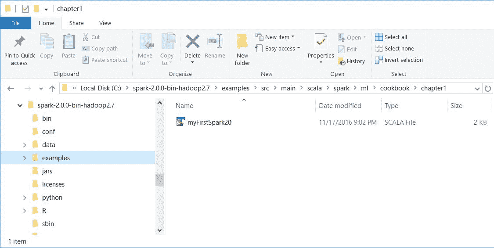

请注意，Mac 用户在 Mac 机器上的`/Users/USERNAME/spark/spark-2.0.0-bin-hadoop2.7/`目录中安装了 Spark 2.0。

将`myFirstSpark20.scala`文件放在`/Users/USERNAME/spark/spark-2.0.0-bin-hadoop2.7/examples/src/main/scala/spark/ml/cookbook/chapter1`目录中。

1.  设置程序所在的包位置：

```scala
package spark.ml.cookbook.chapter1 
```

1.  导入 Spark 会话所需的必要包，以便访问集群和`log4j.Logger`来减少 Spark 产生的输出量：

```scala
import org.apache.spark.sql.SparkSession 
import org.apache.log4j.Logger 
import org.apache.log4j.Level 
```

1.  将输出级别设置为`ERROR`以减少 Spark 的日志输出：

```scala
Logger.getLogger("org").setLevel(Level.ERROR) 
```

1.  通过使用构建器模式指定配置来初始化 Spark 会话，从而使 Spark 集群的入口点可用：

```scala
val spark = SparkSession 
.builder 
.master("local[*]")
 .appName("myFirstSpark20") 
.config("spark.sql.warehouse.dir", ".") 
.getOrCreate() 
```

`myFirstSpark20`对象将在本地模式下运行。上一个代码块是开始创建`SparkSession`对象的典型方式。

1.  然后我们创建了两个数组变量：

```scala
val x = Array(1.0,5.0,8.0,10.0,15.0,21.0,27.0,30.0,38.0,45.0,50.0,64.0) 
val y = Array(5.0,1.0,4.0,11.0,25.0,18.0,33.0,20.0,30.0,43.0,55.0,57.0) 
```

1.  然后让 Spark 基于之前创建的数组创建两个 RDD：

```scala
val xRDD = spark.sparkContext.parallelize(x) 
val yRDD = spark.sparkContext.parallelize(y) 
```

1.  接下来，让 Spark 在`RDD`上操作；`zip()`函数将从之前提到的两个 RDD 创建一个新的`RDD`：

```scala
val zipedRDD = xRDD.zip(yRDD) 
zipedRDD.collect().foreach(println) 
```

在运行时的控制台输出中（有关如何在 IntelliJ IDE 中运行程序的更多详细信息），您将看到这个：

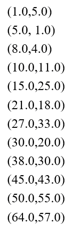

1.  现在，我们对`xRDD`和`yRDD`的值进行求和，并计算新的`zipedRDD`的总值。我们还计算了`zipedRDD`的项目计数：

```scala
val xSum = zipedRDD.map(_._1).sum() 
val ySum = zipedRDD.map(_._2).sum() 
val xySum= zipedRDD.map(c => c._1 * c._2).sum() 
val n= zipedRDD.count() 
```

1.  我们在控制台中打印出先前计算的值：

```scala
println("RDD X Sum: " +xSum) 
println("RDD Y Sum: " +ySum) 
println("RDD X*Y Sum: "+xySum) 
println("Total count: "+n) 
```

这是控制台输出：

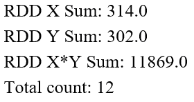

1.  我们通过停止 Spark 会话来关闭程序：

```scala
spark.stop() 
```

1.  程序完成后，IntelliJ 项目资源管理器中的`myFirstSpark20.scala`布局将如下所示：

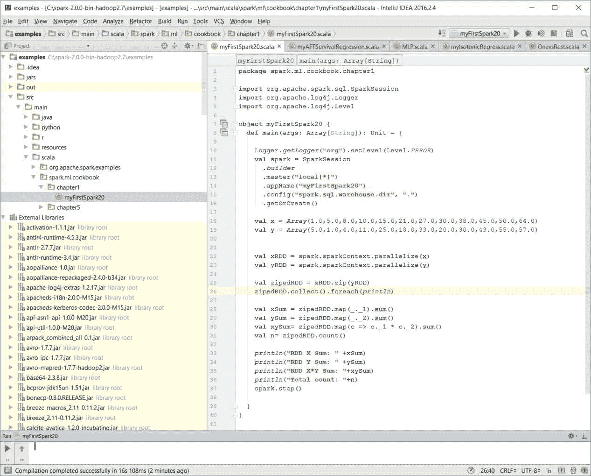

1.  确保没有编译错误。您可以通过重新构建项目来测试：

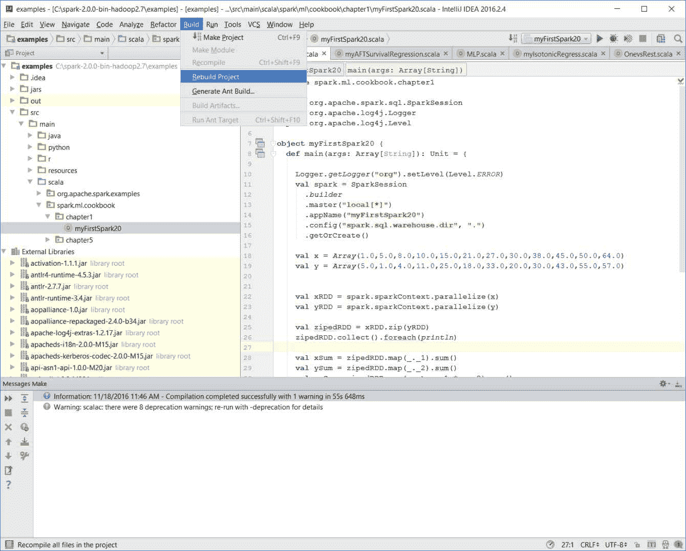

重建完成后，控制台上应该会有一个构建完成的消息：

```scala
Information: November 18, 2016, 11:46 AM - Compilation completed successfully with 1 warning in 55s 648ms
```

1.  您可以通过右键单击项目资源管理器中的`myFirstSpark20`对象，并选择上下文菜单选项（如下一截图所示）`Run myFirstSpark20`来运行上一个程序。

您也可以使用菜单栏中的运行菜单执行相同的操作。

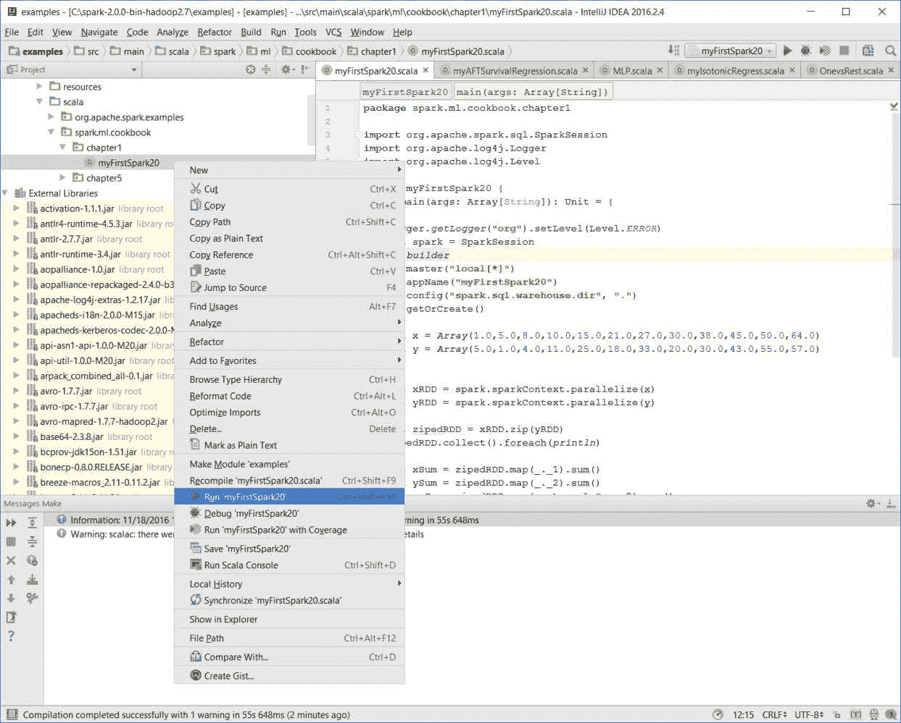

1.  程序成功执行后，您将看到以下消息：

```scala
Process finished with exit code 0
```

这也显示在以下截图中：

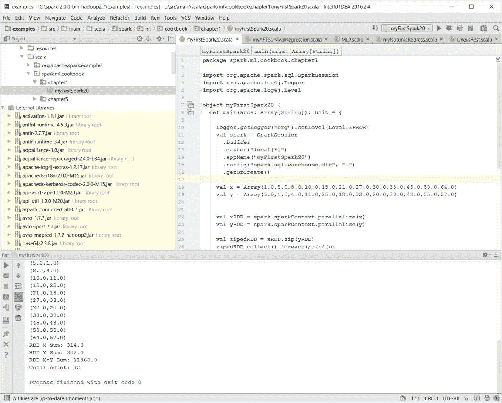

1.  使用相同的上下文菜单，Mac 用户可以执行此操作。

将代码放在正确的路径中。

# 工作原理...

在这个例子中，我们编写了我们的第一个 Scala 程序`myFirstSpark20.scala`，并展示了在 IntelliJ 中执行程序的步骤。我们将代码放在了 Windows 和 Mac 的步骤中描述的路径中。

在`myFirstSpark20`代码中，我们看到了创建`SparkSession`对象的典型方式，以及如何使用`master()`函数将其配置为在本地模式下运行。我们从数组对象中创建了两个 RDD，并使用简单的`zip()`函数创建了一个新的 RDD。

我们还对创建的 RDD 进行了简单的求和计算，然后在控制台中显示了结果。最后，我们通过调用`spark.stop()`退出并释放资源。

# 还有更多...

Spark 可以从[`spark.apache.org/downloads.html`](http://spark.apache.org/downloads.html)下载。

有关与 RDD 相关的 Spark 2.0 文档可以在[`spark.apache.org/docs/latest/programming-guide.html#rdd-operations`](http://spark.apache.org/docs/latest/programming-guide.html#rdd-operations)找到。

# 另请参阅

+   有关 JetBrain IntelliJ 的更多信息，请访问[`www.jetbrains.com/idea/`](https://www.jetbrains.com/idea/)。

# 如何将图形添加到您的 Spark 程序

在这个示例中，我们讨论了如何使用 JFreeChart 将图形图表添加到您的 Spark 2.0.0 程序中。

# 如何做...

1.  设置 JFreeChart 库。可以从[`sourceforge.net/projects/jfreechart/files/`](https://sourceforge.net/projects/jfreechart/files/)网站下载 JFreeChart JAR 文件。

1.  我们在本书中涵盖的 JFreeChart 版本是 JFreeChart 1.0.19，如下截图所示。可以从[`sourceforge.net/projects/jfreechart/files/1.%20JFreeChart/1.0.19/jfreechart-1.0.19.zip/download`](https://sourceforge.net/projects/jfreechart/files/1.%20JFreeChart/1.0.19/jfreechart-1.0.19.zip/download)网站下载：

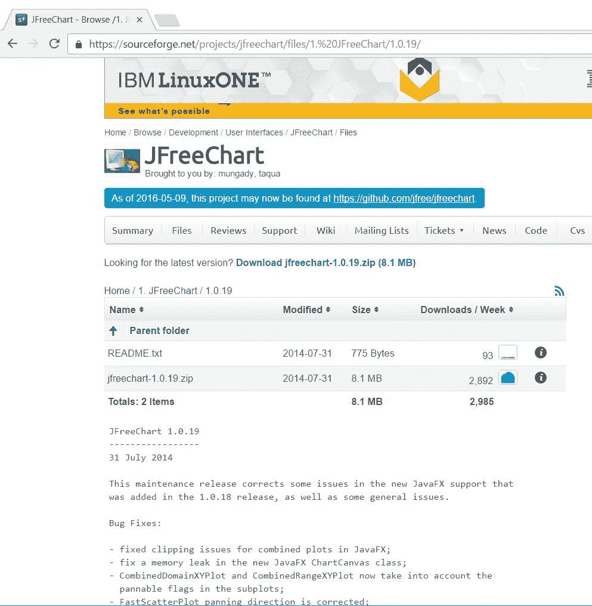

1.  一旦 ZIP 文件下载完成，解压它。我们在 Windows 机器上将 ZIP 文件解压到`C:\`，然后继续找到解压目标目录下的`lib`目录。

1.  然后找到我们需要的两个库（JFreeChart 需要 JCommon），`JFreeChart-1.0.19.jar`和`JCommon-1.0.23`：

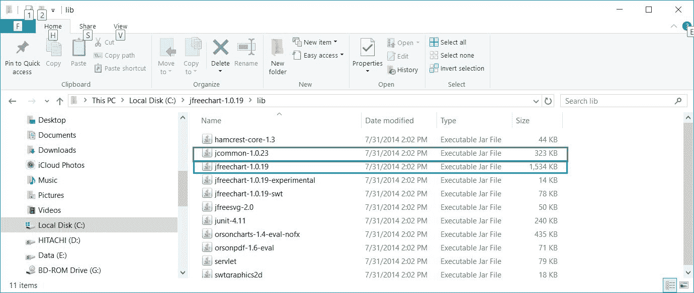

1.  现在我们将之前提到的两个 JAR 文件复制到`C:\spark-2.0.0-bin-hadoop2.7\examples\jars\`目录中。

1.  如前面设置部分中提到的，此目录在 IntelliJ IDE 项目设置的类路径中：

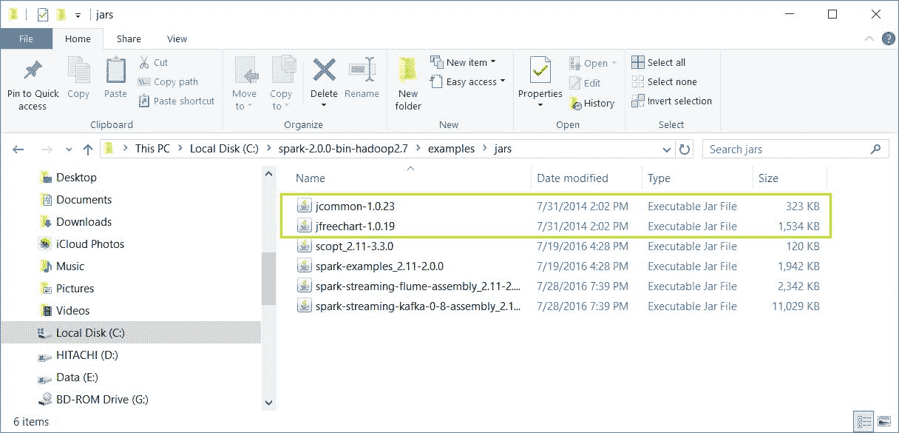

在 macOS 中，您需要将前面提到的两个 JAR 文件放在`/Users/USERNAME/spark/spark-2.0.0-bin-hadoop2.7/examples\jars\`目录中。

1.  在 IntelliJ 或您选择的 IDE 中启动一个新项目。确保包含必要的 JAR 文件。

1.  下载该书的示例代码，找到`MyChart.scala`，并将代码放在以下目录中。

1.  我们在 Windows 的`C:\spark-2.0.0-bin-hadoop2.7\`目录中安装了 Spark 2.0。将`MyChart.scala`放在`C:\spark-2.0.0-bin-hadoop2.7\examples\src\main\scala\spark\ml\cookbook\chapter1`目录中。

1.  设置程序将驻留的包位置：

```scala
  package spark.ml.cookbook.chapter1
```

1.  导入 Spark 会话所需的包，以便访问集群和`log4j.Logger`以减少 Spark 产生的输出量。

1.  导入用于图形的必要 JFreeChart 包：

```scala
import java.awt.Color 
import org.apache.log4j.{Level, Logger} 
import org.apache.spark.sql.SparkSession 
import org.jfree.chart.plot.{PlotOrientation, XYPlot} 
import org.jfree.chart.{ChartFactory, ChartFrame, JFreeChart} 
import org.jfree.data.xy.{XYSeries, XYSeriesCollection} 
import scala.util.Random 
```

1.  将输出级别设置为`ERROR`以减少 Spark 的日志输出：

```scala
Logger.getLogger("org").setLevel(Level.ERROR) 
```

1.  使用构建模式指定配置初始化 Spark 会话，从而为 Spark 集群提供入口点：

```scala
val spark = SparkSession 
  .builder 
  .master("local[*]") 
  .appName("myChart") 
  .config("spark.sql.warehouse.dir", ".") 
  .getOrCreate() 
```

1.  `myChart`对象将在本地模式下运行。前面的代码块是创建`SparkSession`对象的典型开始。

1.  然后我们使用随机数创建一个 RDD，并将数字与其索引进行压缩：

```scala
val data = spark.sparkContext.parallelize(Random.shuffle(1 to 15).zipWithIndex) 
```

1.  我们在控制台打印出 RDD：

```scala
data.foreach(println) 
```

这是控制台输出：

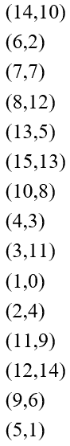

1.  然后我们为 JFreeChart 创建一个数据系列来显示：

```scala
val xy = new XYSeries("") 
data.collect().foreach{ case (y: Int, x: Int) => xy.add(x,y) } 
val dataset = new XYSeriesCollection(xy) 
```

1.  接下来，我们从 JFreeChart 的`ChartFactory`创建一个图表对象，并设置基本配置：

```scala
val chart = ChartFactory.createXYLineChart( 
  "MyChart",  // chart title 
  "x",               // x axis label 
  "y",                   // y axis label 
  dataset,                   // data 
  PlotOrientation.VERTICAL, 
  false,                    // include legend 
  true,                     // tooltips 
  false                     // urls 
)
```

1.  我们从图表中获取绘图对象，并准备显示图形：

```scala
val plot = chart.getXYPlot() 
```

1.  首先配置绘图：

```scala
configurePlot(plot) 
```

1.  `configurePlot`函数定义如下；它为图形部分设置了一些基本的颜色方案：

```scala
def configurePlot(plot: XYPlot): Unit = { 
  plot.setBackgroundPaint(Color.WHITE) 
  plot.setDomainGridlinePaint(Color.BLACK) 
  plot.setRangeGridlinePaint(Color.BLACK) 
  plot.setOutlineVisible(false) 
} 
```

1.  现在我们展示`chart`：

```scala
show(chart) 
```

1.  `show()`函数定义如下。这是一个非常标准的基于帧的图形显示函数：

```scala
def show(chart: JFreeChart) { 
  val frame = new ChartFrame("plot", chart) 
  frame.pack() 
  frame.setVisible(true) 
}
```

1.  一旦`show(chart)`成功执行，将弹出以下窗口：

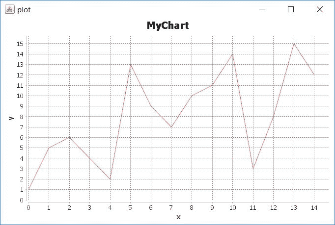

1.  通过停止 Spark 会话来关闭程序：

```scala
spark.stop() 
```

# 它是如何工作的...

在这个示例中，我们编写了`MyChart.scala`，并看到了在 IntelliJ 中执行程序的步骤。我们在 Windows 和 Mac 的步骤中描述的路径中放置了代码。

在代码中，我们看到了创建`SparkSession`对象的典型方式以及如何使用`master()`函数。我们从 1 到 15 范围内的随机整数数组创建了一个 RDD，并将其与索引进行了压缩。

然后，我们使用 JFreeChart 来组合一个基本的图表，其中包含一个简单的*x*和*y*轴，并使用我们在前面步骤中从原始 RDD 生成的数据集来提供图表。

我们为图表设置了架构，并调用了 JFreeChart 中的`show()`函数，以显示一个带有*x*和*y*轴的线性图表。

最后，我们通过调用`spark.stop()`退出并释放资源。

# 还有更多...

有关 JFreeChart 的更多信息，请访问以下网站：

+   [`www.jfree.org/jfreechart/`](http://www.jfree.org/jfreechart/)

+   [`www.jfree.org/jfreechart/api/javadoc/index.html`](http://www.jfree.org/jfreechart/api/javadoc/index.html)

# 另请参阅

Additional examples about the features and capabilities of JFreeChart can be found at the following website:

[`www.jfree.org/jfreechart/samples.html`](http://www.jfree.org/jfreechart/samples.html)
