# 第二章：机器学习与 Spark 的线性代数基础

在本章中，我们将涵盖以下内容：

+   向量和矩阵的包导入和初始设置

+   创建 DenseVector 并在 Spark 2.0 中设置

+   创建 SparseVector 并在 Spark 2.0 中设置

+   创建 DenseMatrix 并在 Spark 2.0 中设置

+   使用 Spark 2.0 的稀疏本地矩阵

+   使用 Spark 2.0 进行向量运算

+   使用 Spark 2.0 进行矩阵运算

+   Spark 2.0 ML 库中的分布式矩阵

+   在 Spark 2.0 中探索 RowMatrix

+   在 Spark 2.0 中探索分布式 IndexedRowMatrix

+   在 Spark 2.0 中探索分布式 CoordinateMatrix

+   在 Spark 2.0 中探索分布式 BlockMatrix

# 介绍

线性代数是**机器学习**（**ML**）和**数学** **编程**（**MP**）的基石。在处理 Spark 的机器库时，必须了解 Scala 提供的 Vector/Matrix 结构（默认导入）与 Spark 提供的 ML、MLlib Vector、Matrix 设施有所不同。后者由 RDD 支持，是所需的数据结构，如果要使用 Spark（即并行性）进行大规模矩阵/向量计算（例如，某些情况下用于衍生定价和风险分析的 SVD 实现替代方案，具有更高的数值精度）。Scala Vector/Matrix 库提供了丰富的线性代数操作，如点积、加法等，在 ML 管道中仍然有其自己的位置。总之，使用 Scala Breeze 和 Spark 或 Spark ML 之间的关键区别在于，Spark 设施由 RDD 支持，允许同时分布式、并发计算和容错，而无需任何额外的并发模块或额外的工作（例如，Akka + Breeze）。

几乎所有的机器学习算法都使用某种形式的分类或回归机制（不一定是线性的）来训练模型，然后通过比较训练输出和实际输出来最小化错误。例如，在 Spark 中任何推荐系统的实现都会严重依赖于矩阵分解、因子分解、近似或**单值分解**（**SVD**）。另一个与处理大型数据集的维度约简有关的机器学习领域是**主成分分析**（**PCA**），它严重依赖于线性代数、因子分解和矩阵操作。

当我们第一次在 Spark 1.x.x 中检查 Spark ML 和 MLlib 算法的源代码时，我们很快注意到向量和矩阵使用 RDD 作为许多重要算法的基础。

当我们重新审视 Spark 2.0 和机器学习库的源代码时，我们注意到一些有趣的变化需要在以后考虑。以下是从 Spark 1.6.2 到 Spark 2.0.0 的一些变化的示例，这些变化影响了我们在 Spark 中的一些线性代数代码：

+   在之前的版本（Spark 1.6.x）中，您可以通过使用`toBreeze()`函数直接将`DenseVector`或`SparseVector`（参见[`spark.apache.org/docs/1.5.2/api/java/org/apache/spark/mllib/linalg/Vectors.html`](https://spark.apache.org/docs/1.5.2/api/java/org/apache/spark/mllib/linalg/Vectors.html)）转换为`BreezeVector`实例，如下面的代码所示：

```scala
val w3 = w1.toBreeze // spark 1.6.x code
val w4 = w2.toBreeze //spark 1.6.x code
```

+   在 Spark 2.0 中，`toBreeze()`函数不仅已更改为`asBreeze()`，而且还已降级为私有函数

+   为了解决这个问题，可以使用以下代码片段之一将前面的向量转换为常用的`BreezeVector`实例：

```scala
val w3 = new BreezeVector(x.toArray)//x.asBreeze, spark 2.0
val w4 = new BreezeVector(y.toArray)//y.asBreeze, spark 2.0
```

Scala 是一种简洁的语言，对象导向和函数式编程范式可以在其中共存而不冲突。虽然在机器学习范式中，函数式编程更受青睐，但在初始数据收集和稍后的展示阶段使用面向对象的方法也没有问题。

在大规模分布式矩阵方面，我们的经验表明，当处理大矩阵集 10⁹至 10¹³至 10²⁷等时，您必须更深入地研究分布式操作中固有的网络操作和洗牌。根据我们的经验，当您以规模运行时，本地和分布式矩阵/向量操作的组合（例如，点积，乘法等）在操作时效果最佳。

以下图片描述了可用 Spark 向量和矩阵的分类：

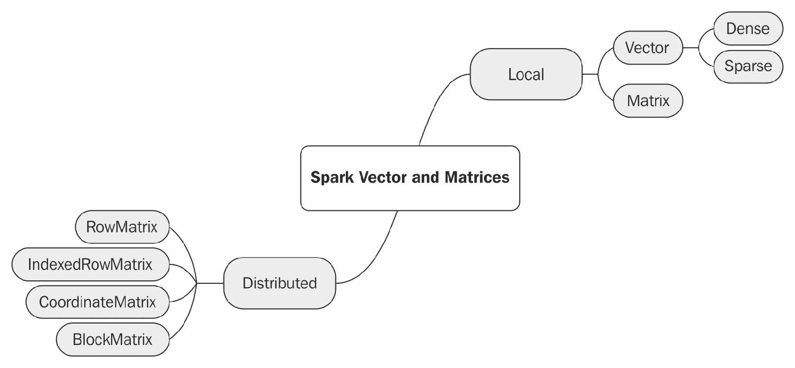

# 包导入和向量矩阵的初始设置

在我们可以在 Spark 中编程或使用向量和矩阵工件之前，我们首先需要导入正确的包，然后设置`SparkSession`，以便我们可以访问集群句柄。

在这个简短的配方中，我们突出了一系列可以涵盖大多数 Spark 线性代数操作的包。接下来的各个配方将包括特定程序所需的确切子集。

# 如何做...

1.  在 IntelliJ 或您选择的 IDE 中启动一个新项目。确保包含必要的 JAR 文件。

1.  设置程序将驻留的包位置：

```scala
package spark.ml.cookbook.chapter2
```

1.  导入用于向量和矩阵操作的必要包：

```scala
import org.apache.spark.mllib.linalg.distributed.RowMatrix
import org.apache.spark.mllib.linalg.distributed.{IndexedRow, IndexedRowMatrix}
import org.apache.spark.mllib.linalg.distributed.{CoordinateMatrix, MatrixEntry}
import org.apache.spark.sql.{SparkSession}
import org.apache.spark.rdd._
import org.apache.spark.mllib.linalg._
import breeze.linalg.{DenseVector => BreezeVector}
import Array._
import org.apache.spark.mllib.linalg.DenseMatrix
import org.apache.spark.mllib.linalg.SparseVector
```

1.  导入设置`log4j`的包。这一步是可选的，但我们强烈建议这样做（随着开发周期的推移，适当更改级别）：

```scala
import org.apache.log4j.Logger
import org.apache.log4j.Level
```

1.  将日志级别设置为警告和错误，以减少输出。有关包要求，请参阅上一步：

```scala
Logger.getLogger("org").setLevel(Level.ERROR)
Logger.getLogger("akka").setLevel(Level.ERROR)
```

1.  设置 Spark 上下文和应用程序参数，以便 Spark 可以运行：

```scala
val spark = SparkSession
 .builder
 .master("local[*]")
 .appName("myVectorMatrix")
 .config("spark.sql.warehouse.dir", ".")
 .getOrCreate()
```

# 还有更多...

在 Spark 2.0 之前，SparkContext 和 SQLContext 必须分别初始化。如果您计划在 Spark 的早期版本中运行代码，请参考以下代码片段。

设置应用程序参数，以便 Spark 可以运行（使用 Spark 1.5.2 或 Spark 1.6.1）：

```scala
val conf = new SparkConf().setMaster("local[*]").setAppName("myVectorMatrix").setSparkHome("C:\\spark-1.5.2-bin-hadoop2.6")
 val sc = new SparkContext(conf)
 val sqlContext = new SQLContext(sc)
```

# 另请参阅

SparkSession 是 Spark 2.x.x 及以上版本中集群的新入口点。SparkSession 统一了对集群和所有数据的访问。它统一了对 SparkContext、SQLContext 或 HiveContext 的访问，同时使得使用 DataFrame 和 Dataset API 更加容易。我们将在第四章中专门的配方中重新讨论 SparkSession，*实现强大的机器学习系统的常见配方*。

参考以下图片：

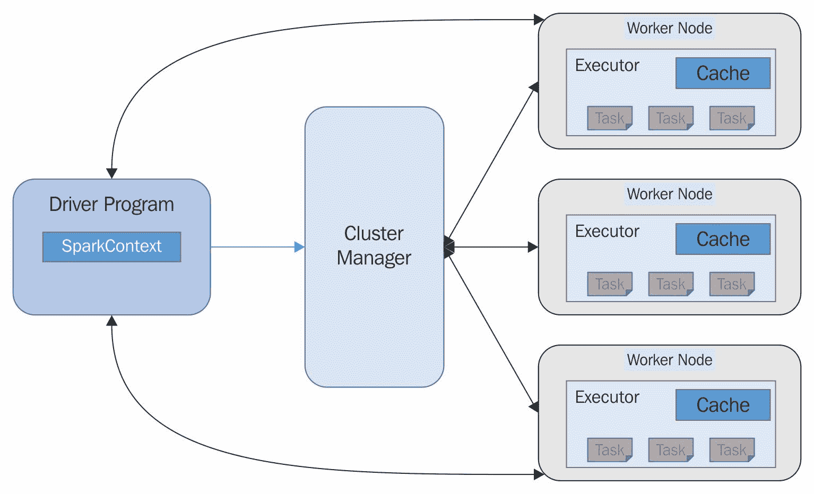

方法调用的文档可以在[`spark.apache.org/docs/2.0.0/api/scala/#org.apache.spark.sql.SparkSession`](https://spark.apache.org/docs/2.0.0/api/scala/#org.apache.spark.sql.SparkSession)中查看。

# 创建 DenseVector 并在 Spark 2.0 中设置

在这个配方中，我们将使用 Spark 2.0 机器库来探索`DenseVectors`。

Spark 提供了两种不同类型的向量设施（密集和稀疏），用于存储和操作将用于机器学习或优化算法中的特征向量。

# 如何做...

1.  在本节中，我们将研究使用 Spark 2.0 机器库的`DenseVectors`示例，这些示例最有可能用于实现/增强现有的机器学习程序。这些示例还有助于更好地理解 Spark ML 或 MLlib 源代码和底层实现（例如，单值分解）。

1.  在这里，我们将从数组创建 ML 向量特征（具有独立变量），这是一个常见用例。在这种情况下，我们有三个几乎完全填充的 Scala 数组，对应于客户和产品特征集。我们将这些数组转换为 Scala 中相应的`DenseVectors`：

```scala
val CustomerFeatures1: Array[Double] = Array(1,3,5,7,9,1,3,2,4,5,6,1,2,5,3,7,4,3,4,1)
 val CustomerFeatures2: Array[Double] = Array(2,5,5,8,6,1,3,2,4,5,2,1,2,5,3,2,1,1,1,1)
 val ProductFeatures1: Array[Double]  = Array(0,1,1,0,1,1,1,0,0,1,1,1,1,0,1,2,0,1,1,0)
```

设置变量以从数组创建向量。从数组转换为`DenseVector`：

```scala
val x = Vectors.dense(CustomerFeatures1)
 val y = Vectors.dense(CustomerFeatures2)
 val z = Vectors.dense(ProductFeatures1)
```

1.  下一步是创建`DenseVector`并通过初始化赋值。

这是最常引用的情况，通常用于处理批量输入的类构造函数：

```scala
val denseVec2 = Vectors.dense(5,3,5,8,5,3,4,2,1,6)
```

1.  以下是另一个示例，展示了在初始化期间从字符串转换为双精度的即时转换。在这里，我们从一个字符串开始，并在内联中调用`toDouble`：

```scala
val xyz = Vectors.dense("2".toDouble, "3".toDouble, "4".toDouble)
 println(xyz)
```

输出如下：

```scala
[2.0,3.0,4.0]
```

# 它是如何工作的...

1.  该方法构造函数的签名为：

```scala
DenseVector (double[] values)
```

1.  该方法继承自以下内容，使其具体方法对所有例程可用：

```scala
interface class java.lang.Object
interface org.apache.spark.mllib.linalg. Vector
```

1.  有几个感兴趣的方法调用：

1.  制作向量的深拷贝：

```scala
DenseVector copy()
```

1.  1.  转换为`SparseVector`。如果您的向量很长，并且在进行了一定数量的操作后密度减小（例如，将不贡献的成员归零），则会执行此操作：

```scala
SparseVector toSparse()
```

1.  1.  查找非零元素的数量。如果密度 ID 较低，则这很有用，因此您可以即时转换为 SparseVector：

```scala
Int numNonzeros()
```

+   1.  将向量转换为数组。在处理需要与 RDD 或使用 Spark ML 作为子系统的专有算法进行紧密交互的分布式操作时，这通常是必要的：

```scala
Double[] toArray()
```

# 还有更多...

必须小心，不要将`Breeze`库提供的向量功能与 Spark ML 向量混合使用。要使用 ML 库算法，您需要使用其本机数据结构，但您始终可以从 ML 向量转换为`Breeze`，进行所有数学运算，然后在使用 ML 库算法（例如 ALS 或 SVD）时转换为 Spark 所需的数据结构。

我们需要向量和矩阵导入语句，这样我们才能使用 ML 库本身，否则 Scala 向量和矩阵将默认使用。当程序无法在集群上扩展时，这是导致许多混乱的根源。

以下图示了一个图解视图，这应该有助于澄清主题：

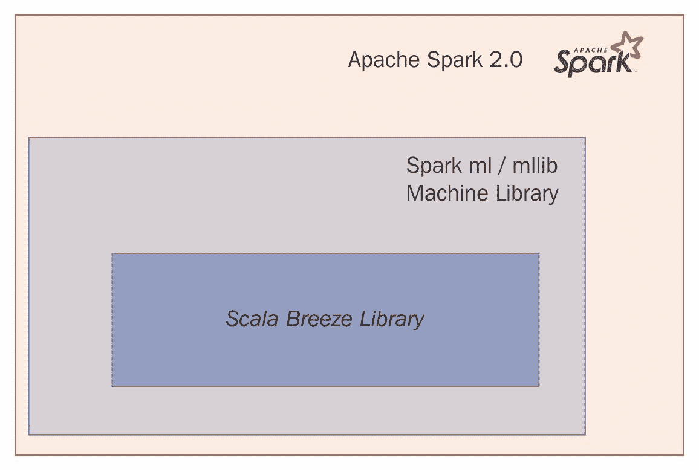

# 另请参阅

+   构造函数的文档可在[`spark.apache.org/docs/latest/api/java/org/apache/spark/mllib/linalg/DenseVector.html#constructor_summary`](https://spark.apache.org/docs/latest/api/java/org/apache/spark/mllib/linalg/DenseVector.html#constructor_summary)找到

+   方法调用的文档可在[`spark.apache.org/docs/latest/api/java/org/apache/spark/mllib/linalg/DenseVector.html#method_summary`](https://spark.apache.org/docs/latest/api/java/org/apache/spark/mllib/linalg/DenseVector.html#method_summary)找到

# 创建 SparseVector 并使用 Spark 进行设置

在这个示例中，我们检查了几种`SparseVector`的创建类型。当向量的长度增加（百万级）且密度保持较低（非零成员较少）时，稀疏表示变得越来越有利于`DenseVector`。

# 如何做...

1.  在 IntelliJ 或您选择的 IDE 中启动一个新项目。确保包含必要的 JAR 文件。

1.  导入向量和矩阵操作所需的必要包：

```scala
import org.apache.spark.sql.{SparkSession}
import org.apache.spark.mllib.linalg._
import breeze.linalg.{DenseVector => BreezeVector}
import Array._
import org.apache.spark.mllib.linalg.SparseVector
```

1.  设置 Spark 上下文和应用程序参数，以便 Spark 可以运行。有关更多详细信息和变体，请参见本章的第一个示例：

```scala
val spark = SparkSession
 .builder
 .master("local[*]")
 .appName("myVectorMatrix")
 .config("spark.sql.warehouse.dir", ".")
 .getOrCreate()
```

1.  在这里，我们看一下创建与其等效的 DenseVector 相对应的 ML SparseVector。调用包括三个参数：向量的大小，非零数据的索引，最后是数据本身。

在下面的示例中，我们可以比较密集与 SparseVector 的创建。如您所见，四个非零元素（5、3、8、9）对应于位置（0、2、18、19），而数字 20 表示总大小：

```scala
val denseVec1 = Vectors.dense(5,0,3,0,0,0,0,0,0,0,0,0,0,0,0,0,0,0,8,9)
val sparseVec1 = Vectors.sparse(20, Array(0,2,18,19), Array(5, 3, 8,9))
```

1.  为了更好地理解数据结构，我们比较输出和一些重要属性，这些属性对我们有所帮助，特别是在使用向量进行动态编程时。

首先，我们看一下 DenseVector 的打印输出，以查看其表示：

```scala

println(denseVec1.size)
println(denseVec1.numActives)
println(denseVec1.numNonzeros)
println("denceVec1 presentation = ",denseVec1)
```

输出如下：

```scala
denseVec1.size = 20

denseVec1.numActives = 20

denseVec1.numNonzeros = 4

(denseVec1 presentation = ,[5.0,0.0,3.0,0.0,0.0,
0.0,0.0,0.0,0.0,0.0,0.0,0.0,0.0,0.0,0.0,0.0,0.0,0.0,8.0,9.0])

```

1.  接下来，我们看一下 SparseVector 的打印输出，以查看其内部表示：

```scala
println(sparseVec1.size)
println(sparseVec1.numActives)
println(sparseVec1.numNonzeros)
println("sparseVec1 presentation = ",sparseVec1)
```

如果我们比较内部表示和元素数量与活跃和非零元素的对比，您会发现 SparseVector 只存储非零元素和索引以减少存储需求。

输出如下：

```scala
denseVec1.size = 20
println(sparseVec1.numActives)= 4
sparseVec1.numNonzeros = 4
 (sparseVec1 presentation = ,(20,[0,2,18,19],[5.0,3.0,8.0,9.0]))
```

1.  我们可以根据需要在稀疏向量和密集向量之间进行转换。您可能想这样做的原因是，外部数学和线性代数不符合 Spark 的内部表示。我们明确指定了变量类型以阐明观点，但在实际操作中可以消除该额外声明：

```scala
val ConvertedDenseVect : DenseVector= sparseVec1.toDense
 val ConvertedSparseVect : SparseVector= denseVec1.toSparse
println("ConvertedDenseVect =", ConvertedDenseVect)
 println("ConvertedSparseVect =", ConvertedSparseVect)
```

输出如下：

```scala
(ConvertedDenseVect =,[5.0,0.0,3.0,0.0,0.0,0.0,0.0,0.0,
0.0,0.0,0.0,0.0,0.0,0.0,0.0,0.0,0.0,0.0,8.0,9.0])
(ConvertedSparseVect =,(20,[0,2,18,19],[5.0,3.0,8.0,9.0])) 
```

# 工作原理...

1.  此方法构造函数的签名为：

```scala
SparseVector(int size, int[] indices, double[] values)
```

该方法继承自以下内容，使其具体方法对所有例程可用：

```scala
interface class java.lang.Object  
```

有几个与向量相关的方法调用是有趣的：

1.  1.  对向量进行深拷贝：

```scala
SparseVector Copy() 
```

1.  1.  转换为`SparseVector`。如果您的向量很长，并且密度在多次操作后减少（例如，将不贡献的成员归零），则会执行此操作：

```scala
DenseVector toDense()
```

1.  1.  查找非零元素的数量。这很有用，因此您可以在需要时将其转换为稀疏向量，如果密度 ID 较低。

```scala
Int numNonzeros()
```

1.  1.  将向量转换为数组。在处理需要与 RDD 或使用 Spark ML 作为子系统的专有算法进行 1:1 交互的分布式操作时，通常需要这样做：

```scala
Double[] toArray() 
```

# 还有更多...

1.  必须记住，密集向量和稀疏向量是本地向量，不得与分布式设施混淆（例如，分布式矩阵，如 RowMatrix 类）。

1.  本地机器上向量的基本数学运算将由两个库提供：

+   +   **Breeze**：[`www.scalanlp.org/`](http://www.scalanlp.org/)

+   **JBLAS**：[`jblas.org/`](http://jblas.org/)

还有一个与向量直接相关的数据结构，称为 LabeledPoint，我们在第四章中介绍过，*实现强大的机器学习系统的常见配方*。简而言之，它是一种数据结构，用于存储 ML 数据，包括特征向量和标签（例如，回归中的自变量和因变量）。

+   **LIBSVM**：[`www.csie.ntu.edu.tw/~cjlin/libsvm/`](http://www.csie.ntu.edu.tw/~cjlin/libsvm/)

+   **LIBLINEAR**：[`www.csie.ntu.edu.tw/~cjlin/liblinear/`](http://www.csie.ntu.edu.tw/~cjlin/liblinear/)

# 另请参阅

+   构造函数的文档可在[`spark.apache.org/docs/latest/api/java/org/apache/spark/mllib/linalg/SparseVector.html#constructor_summary`](https://spark.apache.org/docs/latest/api/java/org/apache/spark/mllib/linalg/SparseVector.html#constructor_summary)找到

+   方法调用的文档可在[`spark.apache.org/docs/latest/api/java/org/apache/spark/mllib/linalg/SparseVector.html#method_summary`](https://spark.apache.org/docs/latest/api/java/org/apache/spark/mllib/linalg/SparseVector.html#method_summary)找到

# 创建密集矩阵并使用 Spark 2.0 进行设置

在这个配方中，我们探讨了您在 Scala 编程中可能需要的矩阵创建示例，以及在阅读许多用于机器学习的开源库的源代码时可能需要的示例。

Spark 提供了两种不同类型的本地矩阵设施（密集和稀疏），用于在本地级别存储和操作数据。简单来说，将矩阵视为向量的列是一种思考方式。

# 准备工作

在这里要记住的关键是，该配方涵盖了存储在一台机器上的本地矩阵。我们将在本章中介绍的另一个配方*Spark2.0 ML 库中的分布式矩阵*，用于存储和操作分布式矩阵。

# 如何做...

1.  在 IntelliJ 或您选择的 IDE 中启动一个新项目。确保包含必要的 JAR 文件。

1.  导入向量和矩阵操作所需的包：

```scala
 import org.apache.spark.sql.{SparkSession}
 import org.apache.spark.mllib.linalg._
 import breeze.linalg.{DenseVector => BreezeVector}
 import Array._
 import org.apache.spark.mllib.linalg.SparseVector
```

1.  设置 Spark 会话和应用程序参数，以便 Spark 可以运行：

```scala
val spark = SparkSession
 .builder
 .master("local[*]")
 .appName("myVectorMatrix")
 .config("spark.sql.warehouse.dir", ".")
 .getOrCreate()
```

1.  在这里，我们将从 Scala 数组创建 ML 向量特征。让我们定义一个 2x2 的密集矩阵，并用数组实例化它：

```scala
val MyArray1= Array(10.0, 11.0, 20.0, 30.3)
val denseMat3 = Matrices.dense(2,2,MyArray1)   
```

输出如下：

```scala
DenseMat3=
10.0  20.0  
11.0  30.3 
```

通过初始化一步构建密集矩阵并分配值：

通过内联定义数组直接构造密集本地矩阵。这是一个 3x3 的数组，有九个成员。您可以将其视为三列三个向量（3x3）：

```scala
val denseMat1 = Matrices.dense(3,3,Array(23.0, 11.0, 17.0, 34.3, 33.0, 24.5, 21.3,22.6,22.2))
```

输出如下：

```scala
    denseMat1=
    23.0  34.3  21.3  
    11.0  33.0  22.6  
    17.0  24.5  22.2

```

这是另一个示例，展示了使用向量内联实例化密集本地矩阵。这是一个常见情况，您将向量收集到矩阵（列顺序）中，然后对整个集合执行操作。最常见的情况是收集向量，然后使用分布式矩阵执行分布式并行操作。

在 Scala 中，我们使用`++`运算符与数组实现连接：

```scala
val v1 = Vectors.dense(5,6,2,5)
 val v2 = Vectors.dense(8,7,6,7)
 val v3 = Vectors.dense(3,6,9,1)
 val v4 = Vectors.dense(7,4,9,2)

 val Mat11 = Matrices.dense(4,4,v1.toArray ++ v2.toArray ++ v3.toArray ++ v4.toArray)
 println("Mat11=\n", Mat11)
```

输出如下：

```scala
    Mat11=
    5.0  8.0  3.0  7.0  
   6.0  7.0  6.0  4.0  
   2.0  6.0  9.0  9.0  
   5.0  7.0  1.0  2.0

```

# 它是如何工作的...

1.  此方法构造函数的签名为（按列主要密集矩阵）：

```scala
DenseMatrix(int numRows, int numCols, double[] values)
DenseMatrix(int numRows, int numCols, double[] values, boolean isTransposed)
```

1.  该方法继承自以下内容，使其具体方法对所有例程可用：

+   接口类 java.lang.Object

+   java.io.Serializable

+   矩阵

1.  有几个感兴趣的方法调用：

1.  从向量中提供的值生成对角矩阵：

```scala
static DenseMatrix(Vector vector) 
```

1.  1.  创建一个单位矩阵。单位矩阵是对角线为 1，其他元素为 0 的矩阵：

```scala
static eye(int n) 
```

1.  1.  跟踪矩阵是否被转置：

```scala
boolean isTransposed()
```

1.  1.  创建一个包含一组随机数的矩阵-从均匀分布中抽取：

```scala
static DenseMatrix rand(int numRows, int numCols, java.util.Random rng) 
```

1.  1.  创建一个包含一组随机数的矩阵-从高斯分布中抽取：

```scala
static DenseMatrix randn(int numRows, int numCols, java.util.Random rng) 
```

1.  1.  转置矩阵：

```scala
DenseMatrix transpose() 
```

1.  1.  对向量进行深拷贝：

```scala
DenseVector Copy() 
```

1.  1.  转换为稀疏向量。如果您的向量很长，并且密度在一系列操作后减少（例如，将不贡献的成员归零），则会执行此操作：

```scala
SparseVector toSparse() 
```

1.  1.  查找非零元素的数量。这很有用，因此您可以根据需要将其转换为稀疏向量，如果密度 ID 较低：

```scala
Int numNonzeros()
```

1.  1.  获取矩阵中存储的所有值：

```scala
Double[] Values()
```

# 还有更多...

在 Spark 中处理矩阵最困难的部分是习惯于列顺序与行顺序。要记住的关键是，Spark ML 使用的底层库更适合使用列存储机制。以下是一个示例：

1.  给定定义 2x2 矩阵的矩阵：

```scala
val denseMat3 = Matrices.dense(2,2, Array(10.0, 11.0, 20.0, 30.3))
```

1.  矩阵实际上存储为：

```scala
10.0  20.0 
11.0 30.3
```

您从值集合的左侧移动到右侧，然后从列到列进行矩阵的放置。

1.  如您所见，矩阵按行存储的假设与 Spark 方法不一致。从 Spark 的角度来看，以下顺序是不正确的：

```scala
 10.0  11.0 
 20.0 30.3
```

# 另请参阅

+   构造函数的文档可在[`spark.apache.org/docs/latest/api/java/org/apache/spark/mllib/linalg/DenseMatrix.html#constructor_summary`](https://spark.apache.org/docs/latest/api/java/org/apache/spark/mllib/linalg/DenseMatrix.html#constructor_summary)找到

+   方法调用的文档可在[`spark.apache.org/docs/latest/api/java/org/apache/spark/mllib/linalg/DenseMatrix.html#method_summary`](https://spark.apache.org/docs/latest/api/java/org/apache/spark/mllib/linalg/DenseMatrix.html#method_summary)找到

# 使用 Spark 2.0 的稀疏本地矩阵

在这个示例中，我们专注于稀疏矩阵的创建。在上一个示例中，我们看到了如何声明和存储本地密集矩阵。许多机器学习问题领域可以表示为矩阵中的一组特征和标签。在大规模机器学习问题中（例如，疾病在大型人口中的传播，安全欺诈，政治运动建模等），许多单元格将为 0 或 null（例如，患有某种疾病的人数与健康人口的当前数量）。

为了帮助存储和实时操作的高效性，稀疏本地矩阵专门用于以列表加索引的方式高效存储单元格，从而实现更快的加载和实时操作。

# 如何做到...

1.  在 IntelliJ 或您选择的 IDE 中启动新项目。确保包含必要的 JAR 文件。

1.  导入向量和矩阵操作所需的包：

```scala
 import org.apache.spark.mllib.linalg.distributed.RowMatrix
 import org.apache.spark.mllib.linalg.distributed.{IndexedRow, IndexedRowMatrix}
 import org.apache.spark.mllib.linalg.distributed.{CoordinateMatrix, MatrixEntry}
 import org.apache.spark.sql.{SparkSession}
 import org.apache.spark.mllib.linalg._
 import breeze.linalg.{DenseVector => BreezeVector}
 import Array._
 import org.apache.spark.mllib.linalg.DenseMatrix
 import org.apache.spark.mllib.linalg.SparseVector
```

1.  设置 Spark 上下文和应用程序参数，以便 Spark 可以运行-有关更多详细信息和变体，请参见本章的第一个配方：

```scala
val spark = SparkSession
 .builder
 .master("local[*]")
 .appName("myVectorMatrix")
 .config("spark.sql.warehouse.dir", ".")
 .getOrCreate()
```

1.  由于我们将稀疏表示存储为压缩列存储（CCS），因此稀疏矩阵的创建要复杂一些，也称为 Harwell-Boeing 稀疏矩阵格式。 请参见*它是如何工作...*以获取详细说明。

我们声明并创建一个本地的 3x2 稀疏矩阵，只有三个非零成员：

```scala
 val sparseMat1= Matrices.sparse(3,2 ,Array(0,1,3), Array(0,1,2), Array(11,22,33))
```

让我们检查输出，以便我们充分理解在较低级别发生的情况。 这三个值将被放置在（0,0），（1,1），（2,1）：

```scala
 println("Number of Columns=",sparseMat1.numCols)
 println("Number of Rows=",sparseMat1.numRows)
 println("Number of Active elements=",sparseMat1.numActives)
 println("Number of Non Zero elements=",sparseMat1.numNonzeros)
 println("sparseMat1 representation of a sparse matrix and its value=\n",sparseMat1)
```

输出如下：

```scala
(Number of Columns=,2)
(Number of Rows=,3)
(Number of Active elements=,3)
(Number of Non Zero elements=,3)
sparseMat1 representation of a sparse matrix and its value= 3 x 2 CSCMatrix
(0,0) 11.0
(1,1) 22.0
(2,1) 33.0)
```

进一步澄清，这是稀疏矩阵的代码，该矩阵在 Spark 的文档页面上有所说明（请参阅以下标题为*另请参阅*的部分）。 这是一个 3x3 矩阵，有六个非零值。 请注意，声明的顺序是：矩阵大小，列指针，行索引，值作为最后一个成员：

```scala
/* from documentation page
 1.0 0.0 4.0
 0.0 3.0 5.0
 2.0 0.0 6.0
 *
 */
 //[1.0, 2.0, 3.0, 4.0, 5.0, 6.0], rowIndices=[0, 2, 1, 0, 1, 2], colPointers=[0, 2, 3, 6]
 val sparseMat33= Matrices.sparse(3,3 ,Array(0, 2, 3, 6) ,Array(0, 2, 1, 0, 1, 2),Array(1.0, 2.0, 3.0, 4.0, 5.0, 6.0))
 println(sparseMat33)
```

输出如下：

```scala
3 x 3 CSCMatrix
(0,0) 1.0
(2,0) 2.0
(1,1) 3.0
(0,2) 4.0
(1,2) 5.0
(2,2) 6.0
```

+   列指针= [0,2,3,6]

+   行索引= [0,2,1,0,1,2]

+   非零值= [1.0,2.0,3.0,4.0,5.0,6.0]

# 它是如何工作的...

根据我们的经验，大多数稀疏矩阵的困难来自于对**压缩行存储**（**CRS**）和**压缩列存储**（**CCS**）之间差异的理解不足。 我们强烈建议读者深入研究这个主题，以清楚地理解这些差异。

简而言之，Spark 使用 CCS 格式来处理转置目标矩阵：

1.  此方法调用构造函数有两个不同的签名：

1.  +   `SparseMatrix（int numRows，int numCols，int[] colPtrs，int[] rowIndices，double[] values）`

+   稀疏矩阵（int numRows，int numCols，int[] colPtrs，int[] rowIndices，double[] values，boolean isTransposed）

在第二个选项中，我们指示矩阵已经声明为转置，因此将以不同方式处理矩阵。

1.  该方法继承自以下内容，使它们的具体方法对所有例程可用：

+   接口类 java.lang.Object

+   java.io.Serializable

+   矩阵

1.  有几个感兴趣的方法调用：

+   从向量中提供的值生成对角矩阵：

```scala
static SparseMatrix spdiag(Vector vector)
```

1.  +   创建一个单位矩阵。 单位矩阵是一个对角线为 1，其他任何元素为 0 的矩阵：

```scala
static speye(int n)
```

1.  +   跟踪矩阵是否转置：

```scala
boolean isTransposed()
```

1.  +   创建一个具有一组随机数的矩阵-从均匀分布中抽取：

```scala
static SparseMatrix sprand(int numRows, int numCols, java.util.Random rng)
```

1.  +   创建一个具有一组随机数的矩阵-从高斯分布中抽取：

```scala
static SparseMatrix sprandn(int numRows, int numCols, java.util.Random rng)
```

1.  +   转置矩阵：

```scala
SparseMatrix transpose()
```

1.  +   对向量进行深层复制

```scala
SparseMatrix Copy()
```

1.  +   转换为稀疏向量。 如果您的向量很长，并且在一些操作后密度减小（例如，将不贡献的成员归零），则会执行此操作：

```scala
DenseMatrix toDense()
```

1.  +   查找非零元素的数量。 这很有用，因此您可以根据需要将其转换为稀疏向量（例如，如果密度 ID 较低）：

```scala
Int numNonzeros()
```

1.  +   获取矩阵中存储的所有值：

```scala
Double[] Values()
```

1.  +   还有其他对应于稀疏矩阵特定操作的调用。 以下是一个示例，但我们强烈建议您熟悉手册页面（请参阅*还有更多...*部分）：

1.  1.  1.  获取行索引：`int rowIndices()`

1.  检查是否转置：`booleanisTransposed()`

1.  获取列指针：`int[]colPtrs()`

# 还有更多...

再次强调，在许多机器学习应用中，由于特征空间的大尺寸特性不是线性分布的，最终会处理稀疏性。 举例来说，我们以最简单的情况为例，有 10 个客户指示他们对产品线中四个主题的亲和力：

|  | **主题 1** | **主题 2** | **主题 3** | **主题 4** |
| --- | --- | --- | --- | --- |
| **Cust 1** | 1 | 0 | 0 | 0 |
| **Cust 2** | 0 | 0 | 0 | 1 |
| **Cust 3** | 0 | 0 | 0 | 0 |
| **Cust 4** | 0 | 1 | 0 | 0 |
| **Cust 5** | 1 | 1 | 1 | 0 |
| **Cust 6** | 0 | 0 | 0 | 0 |
| **Cust 7** | 0 | 0 | 1 | 0 |
| **Cust 8** | 0 | 0 | 0 | 0 |
| **客户 9** | 1 | 0 | 1 | 1 |
| **客户 10** | 0 | 0 | 0 | 0 |

正如你所看到的，大部分元素都是 0，当我们增加客户和主题的数量到数千万（M x N）时，将它们存储为密集矩阵是不可取的。SparseVector 和矩阵有助于以高效的方式存储和操作这些稀疏结构。

# 另请参阅

+   构造函数的文档可在[`spark.apache.org/docs/latest/api/java/org/apache/spark/mllib/linalg/SparseMatrix.html#constructor_summary`](https://spark.apache.org/docs/latest/api/java/org/apache/spark/mllib/linalg/SparseMatrix.html#constructor_summary)找到

+   方法调用的文档可在[`spark.apache.org/docs/latest/api/java/org/apache/spark/mllib/linalg/SparseMatrix.html#method_summary`](https://spark.apache.org/docs/latest/api/java/org/apache/spark/mllib/linalg/SparseMatrix.html#method_summary)找到

# 使用 Spark 2.0 进行向量运算

在本教程中，我们使用`Breeze`库进行底层操作，探索了在 Spark 环境中进行向量加法的方法。向量允许我们收集特征，然后通过线性代数运算（如加法、减法、转置、点积等）对其进行操作。

# 操作步骤...

1.  在 IntelliJ 或您选择的 IDE 中启动一个新项目。确保包含必要的 JAR 文件。

1.  导入向量和矩阵操作所需的包：

```scala
 import org.apache.spark.mllib.linalg.distributed.RowMatrix
 import org.apache.spark.mllib.linalg.distributed.{IndexedRow, IndexedRowMatrix}
 import org.apache.spark.mllib.linalg.distributed.{CoordinateMatrix, MatrixEntry}
 import org.apache.spark.sql.{SparkSession}
 import org.apache.spark.mllib.linalg._
 import breeze.linalg.{DenseVector => BreezeVector}
 import Array._
 import org.apache.spark.mllib.linalg.DenseMatrix
 import org.apache.spark.mllib.linalg.SparseVector
```

1.  设置 Spark 会话和应用程序参数，以便 Spark 可以运行：

```scala
val spark = SparkSession
 .builder
 .master("local[*]")
 .appName("myVectorMatrix")
 .config("spark.sql.warehouse.dir", ".")
 .getOrCreate()
```

1.  我们创建向量：

```scala
val w1 = Vectors.dense(1,2,3)
val w2 = Vectors.dense(4,-5,6)
```

1.  我们将向量从 Spark 公共接口转换为`Breeze`（库）工件，以便使用丰富的向量操作符：

```scala
val w1 = Vectors.dense(1,2,3)
val w2 = Vectors.dense(4,-5,6) 
val w3 = new BreezeVector(w1.toArray)//w1.asBreeze
val w4=  new BreezeVector(w2.toArray)// w2.asBreeze
println("w3 + w4 =",w3+w4)
println("w3 - w4 =",w3+w4)
println("w3 * w4 =",w3.dot(w4)) 
```

1.  让我们看一下输出并理解结果。要了解向量加法、减法和乘法的操作原理，请参阅本教程中的*How it works...*部分。

输出如下：

```scala
w3 + w4 = DenseVector(5.0, -3.0, 9.0)
w3 - w4 = DenseVector(5.0, -3.0, 9.0)
w3 * w4 =12.0 
```

1.  使用 Breeze 库转换的稀疏和密集向量的向量操作包括：

```scala
val sv1 = Vectors.sparse(10, Array(0,2,9), Array(5, 3, 13))
val sv2 = Vectors.dense(1,0,1,1,0,0,1,0,0,13)
println("sv1 - Sparse Vector = ",sv1)
println("sv2 - Dense Vector = ",sv2)
println("sv1 * sv2 =", new BreezeVector(sv1.toArray).dot(new BreezeVector(sv2.toArray)))
```

这是一种替代方法，但它的缺点是使用了一个私有函数（请参阅 Spark 2.x.x 的实际源代码）。我们建议使用之前介绍的方法：

```scala
println("sv1  * sve2  =", sv1.asBreeze.dot(sv2.asBreeze))
```

我们来看一下输出：

```scala
sv1 - Sparse Vector =  (10,[0,2,9],[5.0,3.0,13.0]) 
sv2 - Dense  Vector = [1.0,0.0,1.0,1.0,0.0,0.0,1.0,0.0,0.0,13.0] 
sv1 * sv2 = 177.0
```

# 操作原理...

向量是数学工件，允许我们表达大小和方向。在机器学习中，我们将对象/用户的偏好收集到向量和矩阵中，以便利用分布式操作规模化。

向量通常是一些属性的元组，通常用于机器学习算法。这些向量通常是实数（测量值），但很多时候我们使用二进制值来表示对特定主题的偏好或偏见的存在或不存在。

向量可以被看作是行向量或列向量。列向量的表示更适合于机器学习思维。列向量表示如下：

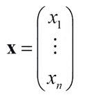

行向量表示如下：

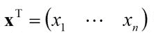

向量加法表示如下：

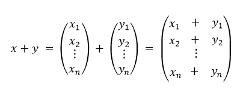

向量减法表示如下：

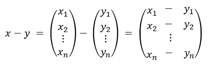

向量乘法或“点”积表示如下：

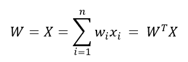

# 还有更多...

Spark ML 和 MLlib 库提供的公共接口，无论是用于稀疏向量还是密集向量，目前都缺少进行完整向量运算所需的运算符。我们必须将我们的本地向量转换为`Breeze`库向量，以便使用线性代数运算符。

在 Spark 2.0 之前，转换为`Breeze`（`toBreeze`）的方法是可用的，但现在该方法已更改为`asBreeze()`并且变为私有！需要快速阅读源代码以了解新的范式。也许这种变化反映了 Spark 核心开发人员希望减少对底层`Breeze`库的依赖。

如果你使用的是 Spark 2.0 之前的任何版本（Spark 1.5.1 或 1.6.1），请使用以下代码片段进行转换。

Spark 2.0 之前的示例 1：

```scala
val w1 = Vectors.dense(1,2,3)
 val w2 = Vectors.dense(4,-5,6)
 val w3 = w1.toBreeze
 val w4= w2.toBreeze
 println("w3 + w4 =",w3+w4)
 println("w3 - w4 =",w3+w4)
 println("w3 * w4 =",w3.dot(w4))
```

Spark 2.0 之前的示例 2：

```scala
println("sv1 - Sparse Vector = ",sv1)
 println("sv2 - Dense Vector = ",sv2)
 println("sv1 * sv2 =", sv1.toBreeze.dot(sv2.toBreeze))
```

# 另请参阅

+   `Breeze`库文档可在[`www.scalanlp.org/api/breeze/#breeze.package`](http://www.scalanlp.org/api/breeze/#breeze.package)找到

+   `Linalg`库文档可在[`spark.apache.org/docs/latest/api/java/allclasses-noframe.html`](https://spark.apache.org/docs/latest/api/java/allclasses-noframe.html)找到

# 使用 Spark 2.0 执行矩阵运算

在这个示例中，我们探讨了 Spark 中的矩阵操作，如加法、转置和乘法。更复杂的操作，如逆、SVD 等，将在未来的章节中介绍。Spark ML 库的本机稀疏和密集矩阵提供了乘法运算符，因此不需要显式转换为`Breeze`。

矩阵是分布式计算的工作马。收集的 ML 特征可以以矩阵配置的形式进行排列，并在规模上进行操作。许多 ML 方法，如**ALS**（**交替最小二乘法**）和**SVD**（**奇异值分解**），依赖于高效的矩阵和向量操作来实现大规模机器学习和训练。

# 如何做...

1.  在 IntelliJ 或您选择的 IDE 中启动一个新项目。确保包含必要的 JAR 文件。

1.  导入必要的包进行向量和矩阵操作：

```scala
 import org.apache.spark.mllib.linalg.distributed.RowMatrix
 import org.apache.spark.mllib.linalg.distributed.{IndexedRow, IndexedRowMatrix}
 import org.apache.spark.mllib.linalg.distributed.{CoordinateMatrix, MatrixEntry}
 import org.apache.spark.sql.{SparkSession}
 import org.apache.spark.mllib.linalg._
 import breeze.linalg.{DenseVector => BreezeVector}
 import Array._
 import org.apache.spark.mllib.linalg.DenseMatrix
 import org.apache.spark.mllib.linalg.SparseVector
```

1.  设置 Spark 会话和应用程序参数，以便 Spark 可以运行：

```scala
val spark = SparkSession
 .builder
 .master("local[*]")
 .appName("myVectorMatrix")
 .config("spark.sql.warehouse.dir", ".")
 .getOrCreate()
```

1.  我们创建了矩阵：

```scala
val sparseMat33= Matrices.sparse(3,3 ,Array(0, 2, 3, 6) ,Array(0, 2, 1, 0, 1, 2),Array(1.0, 2.0, 3.0, 4.0, 5.0, 6.0))
val denseFeatureVector= Vectors.dense(1,2,1)
val denseVec13 = Vectors.dense(5,3,0)
```

1.  将矩阵和向量相乘并打印结果。这是一个非常有用的操作，在大多数 Spark ML 案例中都是一个常见主题。我们使用`SparseMatrix`来演示密集、稀疏和矩阵是可互换的，只有密度（例如非零元素的百分比）和性能应该是选择的标准：

```scala
val result0 = sparseMat33.multiply(denseFeatureVector)
println("SparseMat33 =", sparseMat33)
 println("denseFeatureVector =", denseFeatureVector)
 println("SparseMat33 * DenseFeatureVector =", result0)
```

输出如下：

```scala
(SparseMat33 =,3 x 3 CSCMatrix
(0,0) 1.0
(2,0) 2.0
(1,1) 3.0
(0,2) 4.0
(1,2) 5.0
(2,2) 6.0)
denseFeatureVector =,[1.0,2.0,1.0]
SparseMat33 * DenseFeatureVector = [5.0,11.0,8.0]
```

1.  将`DenseMatrix`与`DenseVector`相乘。

这是为了完整性考虑，将帮助用户更轻松地跟随矩阵和向量乘法，而不用担心稀疏性：

```scala
println("denseVec2 =", denseVec13)
println("denseMat1 =", denseMat1)
val result3= denseMat1.multiply(denseVec13)
println("denseMat1 * denseVect13 =", result3) 
```

输出如下：

```scala
    denseVec2 =,[5.0,3.0,0.0]
    denseMat1 =  23.0  34.3  21.3  
                          11.0  33.0  22.6  
                          17.0  24.5  22.2 
    denseMat1 * denseVect13 =,[217.89,154.0,158.5]

```

1.  我们演示了矩阵的转置，这是一种交换行和列的操作。如果你参与 Spark ML 或数据工程，这是一个重要的操作，几乎每天都会用到。

在这里我们演示了两个步骤：

1.  1.  将稀疏矩阵转置并通过输出检查新的结果矩阵：

```scala
val transposedMat1= sparseMat1.transpose
 println("transposedMat1=\n",transposedMat1)
```

输出如下：

```scala

Original sparseMat1 =,3 x 2 CSCMatrix
(0,0) 11.0
(1,1) 22.0
(2,1) 33.0)

(transposedMat1=,2 x 3 CSCMatrix
(0,0) 11.0
(1,1) 22.0
(1,2) 33.0)

1.0  4.0  7.0  
2.0  5.0  8.0  
3.0  6.0  9.0

```

1.  1.  演示转置的转置产生原始矩阵：

```scala
val transposedMat1= sparseMat1.transpose
println("transposedMat1=\n",transposedMat1)         println("Transposed twice", denseMat33.transpose.transpose) // we get the original back
```

输出如下：

```scala
Matrix transposed twice=
1.0  4.0  7.0  
2.0  5.0  8.0  
3.0  6.0  9.0

```

转置密集矩阵并通过输出检查新的结果矩阵：

这样更容易看到行和列索引是如何交换的：

```scala
val transposedMat2= denseMat1.transpose
 println("Original sparseMat1 =", denseMat1)
 println("transposedMat2=" ,transposedMat2)
Original sparseMat1 =
23.0  34.3  21.3  
11.0  33.0  22.6  
17.0  24.5  22.2 
transposedMat2=
23.0  11.0  17.0  
34.3  33.0  24.5  
21.3  22.6  22.2   
```

1.  1.  现在我们来看矩阵乘法以及在代码中的表现。

我们声明了两个 2x2 的密集矩阵：

```scala
// Matrix multiplication
 val dMat1: DenseMatrix= new DenseMatrix(2, 2, Array(1.0, 3.0, 2.0, 4.0))
 val dMat2: DenseMatrix = new DenseMatrix(2, 2, Array(2.0,1.0,0.0,2.0))

 println("dMat1 * dMat2 =", dMat1.multiply(dMat2)) //A x B
 println("dMat2 * dMat1 =", dMat2.multiply(dMat1)) //B x A   not the same as A xB
```

输出如下：

```scala
dMat1 =,1.0  2.0  
               3.0  4.0  
dMat2 =,2.0  0.0  
       1.0 2.0 
dMat1 * dMat2 =,4.0   4.0  
                              10.0  8.0
//Note: A x B is not the same as B x A
dMat2 * dMat1 = 2.0   4.0   
                               7.0  10.0

```

# 它是如何工作的...

矩阵可以被看作是向量的列。矩阵是涉及线性代数变换的分布式计算的强大工具。可以通过矩阵收集和操作各种属性或特征表示。

简而言之，矩阵是二维*m x n*数组，其中元素可以使用两个元素的下标*i*和*j*来引用（通常是实数）：

矩阵表示如下：

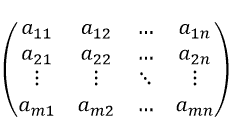

矩阵转置表示如下：

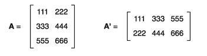

矩阵乘法表示如下：

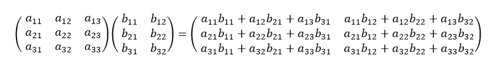

向量矩阵乘法或“点”积表示如下：

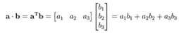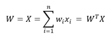

*Spark 2.0 ML 库中的分布式矩阵*：在接下来的四个配方中，我们将介绍 Spark 中的四种分布式矩阵类型。Spark 提供了对由 RDD 支持的分布式矩阵的全面支持。Spark 支持分布式计算的事实并不意味着开发人员可以不考虑并行性来规划他们的算法。

底层的 RDD 提供了存储在矩阵中的数据的全面并行性和容错性。Spark 捆绑了 MLLIB 和 LINALG，它们共同提供了一个公共接口，并支持那些由于其大小或链式操作的复杂性而需要完整集群支持的矩阵。

Spark ML 提供了四种类型的分布式矩阵来支持并行性：`RowMatrix`、`IndexedRowMatrix`、`CoordinateMatrix`和`BlockMatrix`：

+   `RowMatrix`：表示与 ML 库兼容的面向行的分布式矩阵

+   `IndexedRowMatrix`：与`RowMatrix`类似，但具有一个额外的好处，即对行进行索引。这是`RowMatrix`的一个专门版本，其中矩阵本身是从`IndexedRow`（索引，向量）数据结构的 RDD 创建的。要可视化它，想象一个矩阵，其中每一行都是一对（长，RDD），并且已经为您完成了它们的配对（`zip`函数）。这将允许您在给定算法的计算路径中将索引与 RDD 一起携带（规模上的矩阵运算）。

+   `CoordinateMatrix`：用于坐标的非常有用的格式（例如，在投影空间中的*x*、*y*、*z*坐标）

+   `BlockMatrix`：由本地维护的矩阵块组成的分布式矩阵

我们将简要介绍这四种类型的创建，然后迅速转向一个更复杂（代码和概念）的用例，涉及`RowMatrix`，这是一个典型的 ML 用例，涉及大规模并行分布式矩阵操作（例如乘法）与本地矩阵。

如果您计划编写或设计大型矩阵操作，您必须深入了解 Spark 内部，例如核心 Spark 以及在每个版本的 Spark 中分期、流水线和洗牌的工作方式（每个版本中的持续改进和优化）。

在着手进行大规模矩阵和优化之旅之前，我们还建议以下几点：

Apache Spark 中矩阵计算和优化的来源可在[`www.kdd.org/kdd2016/papers/files/adf0163-bosagh-zadehAdoi.pdf`](http://www.kdd.org/kdd2016/papers/files/adf0163-bosagh-zadehAdoi.pdf)和[`pdfs.semanticscholar.org/a684/fc37c79a3276af12a21c1af1ebd8d47f2d6a.pdf`](https://pdfs.semanticscholar.org/a684/fc37c79a3276af12a21c1af1ebd8d47f2d6a.pdf)找到。

使用 Spark 进行高效大规模分布式矩阵计算的来源可在[`www.computer.org/csdl/proceedings/big-data/2015/9926/00/07364023.pdf`](https://www.computer.org/csdl/proceedings/big-data/2015/9926/00/07364023.pdf)和[`dl.acm.org/citation.cfm?id=2878336&preflayout=flat`](http://dl.acm.org/citation.cfm?id=2878336&preflayout=flat)找到。

探索矩阵依赖关系以实现高效的分布式矩阵计算的来源可在[`net.pku.edu.cn/~cuibin/Papers/2015-SIGMOD-DMac.pdf`](http://net.pku.edu.cn/~cuibin/Papers/2015-SIGMOD-DMac.pdf)和[`dl.acm.org/citation.cfm?id=2723712`](http://dl.acm.org/citation.cfm?id=2723712)找到。

# 探索 Spark 2.0 中的 RowMatrix

在这个配方中，我们探索了 Spark 提供的`RowMatrix`功能。`RowMatrix`顾名思义，是一个面向行的矩阵，但缺少可以在`RowMatrix`的计算生命周期中定义和传递的索引。这些行是 RDD，它们提供了分布式计算和容错性。

矩阵由本地向量的行组成，通过 RDDs 并行化和分布。简而言之，每行将是一个 RDD，但列的总数将受到本地向量最大大小的限制。在大多数情况下，这不是问题，但出于完整性考虑，我们觉得应该提一下。

# 如何做...

1.  在 IntelliJ 或您选择的 IDE 中启动一个新项目。确保包含必要的 JAR 文件。

1.  导入向量和矩阵操作所需的包：

```scala
 import org.apache.spark.mllib.linalg.distributed.RowMatrix
 import org.apache.spark.mllib.linalg.distributed.{IndexedRow, IndexedRowMatrix}
 import org.apache.spark.mllib.linalg.distributed.{CoordinateMatrix, MatrixEntry}
 import org.apache.spark.sql.{SparkSession}
 import org.apache.spark.mllib.linalg._
 import breeze.linalg.{DenseVector => BreezeVector}
 import Array._
 import org.apache.spark.mllib.linalg.DenseMatrix
 import org.apache.spark.mllib.linalg.SparseVector
```

1.  设置 Spark 上下文和应用程序参数，以便 Spark 可以运行。有关更多详细信息和变体，请参阅本章的第一个配方：

```scala
val spark = SparkSession
 .builder
 .master("local[*]")
 .appName("myVectorMatrix")
 .config("spark.sql.warehouse.dir", ".")
 .getOrCreate()
```

1.  由于分布式计算（非顺序）的性质，警告语句的数量和时间返回的输出会有所不同。消息与实际输出的交错程度取决于执行路径，这导致输出难以阅读。在以下语句中，我们将`log4j`消息从警告（WARN - 默认）提升到错误（ERROR）以便更清晰。我们建议开发人员详细跟踪警告消息，以了解这些操作的并行性质并充分理解 RDD 的概念：

```scala
import Log4J logger and the level
import org.apache.log4j.Logger
 import org.apache.log4j.Level
```

将级别设置为错误：

```scala
Logger.getLogger("org").setLevel(Level.ERROR)
Logger.getLogger("akka").setLevel(Level.ERROR)
```

最初的输出如下

```scala
Logger.getLogger("org").setLevel(Level.WARN)
Logger.getLogger("akka").setLevel(Level.WARN)
```

1.  我们定义了两个密集向量的序列数据结构。

Scala 密集本地向量的序列，这将是分布式`RowMatrix`的数据：

```scala
val dataVectors = Seq(
   Vectors.dense(0.0, 1.0, 0.0),
   Vectors.dense(3.0, 1.0, 5.0),
   Vectors.dense(0.0, 7.0, 0.0)
 )
```

Scala 密集本地向量的序列，这将是本地身份矩阵的数据。线性代数的快速检查表明，任何矩阵乘以一个单位矩阵将产生相同的原始矩阵（即，*A x I = A*）。我们喜欢使用单位矩阵来证明乘法有效，并且原始矩阵上计算的原始统计量与原始* x *单位矩阵相同：

```scala
val identityVectors = Seq(
   Vectors.dense(1.0, 0.0, 0.0),
   Vectors.dense(0.0, 1.0, 0.0),
   Vectors.dense(0.0, 0.0, 1.0)
 )
```

1.  通过并行化基础密集向量到 RDDs，创建我们的第一个分布式矩阵。

从现在开始，我们的密集向量现在是由 RDD 支持的新分布式向量中的行（即，所有 RDD 操作都得到充分支持！）。

将原始序列（由向量组成）转换为 RDDs。我们将在下一章详细介绍 RDDs。在这个单一语句中，我们已经将一个本地数据结构转换为了一个分布式工件：

```scala
val distMat33 = new RowMatrix(sc.parallelize(dataVectors))

```

我们计算一些基本统计量，以验证`RowMatrix`是否正确构建。要记住的是，密集向量现在是行而不是列（这是导致许多混淆的根源）：

```scala
println("distMatt33 columns - Count =", distMat33.computeColumnSummaryStatistics().count)
 println("distMatt33 columns - Mean =", distMat33.computeColumnSummaryStatistics().mean)
 println("distMatt33 columns - Variance =", distMat33.computeColumnSummaryStatistics().variance)
 println("distMatt33 columns - CoVariance =", distMat33.computeCovariance())
```

输出如下：

计算的统计量（均值、方差、最小值、最大值等）是针对每列而不是整个矩阵的。这就是为什么您看到均值和方差对应于每列的三个数字的原因。

```scala
    distMatt33 columns - Count =            3
    distMatt33 columns - Mean =             [ 1.0, 3.0, 1.66 ]
    (distMatt33 columns - Variance =      [ 3.0,12.0,8.33 ]
    (distMatt33 columns - CoVariance = 3.0   -3.0  5.0                
                                                            -3.0  12.0  -5.0               
                                                             5.0   -5.0  8.33  
```

1.  在这一步中，我们从身份向量的数据结构中创建我们的本地矩阵。要记住的一点是，乘法需要一个本地矩阵而不是分布式矩阵。请查看调用签名以进行验证。我们使用`map`、`toArray`和`flatten`操作符来创建一个 Scala 扁平化数组数据结构，该数据结构可以作为创建本地矩阵的参数之一，如下一步所示：

```scala
val flatArray = identityVectors.map(x => x.toArray).flatten.toArray 
 dd.foreach(println(_))
```

1.  我们将本地矩阵创建为单位矩阵，以便验证乘法*A * I = A*：

```scala
 val dmIdentity: Matrix = Matrices.dense(3, 3, flatArray)
```

1.  我们将分布式矩阵乘以本地矩阵，并创建一个新的分布式矩阵。这是一个典型的用例，您最终会将一个高瘦的本地矩阵与大规模分布式矩阵相乘，以实现规模和结果矩阵的继承降维：

```scala
val distMat44 = distMat33.multiply(dmIdentity)
 println("distMatt44 columns - Count =", distMat44.computeColumnSummaryStatistics().count)
 println("distMatt44 columns - Mean =", distMat44.computeColumnSummaryStatistics().mean)
 println("distMatt44 columns - Variance =", distMat44.computeColumnSummaryStatistics().variance)
 println("distMatt44 columns - CoVariance =", distMat44.computeCovariance())
```

1.  比较第 7 步和第 8 步，我们实际上看到操作进行正确，并且我们可以通过描述性统计和协方差矩阵验证*A x I = A*，使用分布式和本地矩阵。

输出如下：

```scala
distMatt44 columns - Count = 3
distMatt44 columns - Mean = [ 1.0, 3.0, 1.66 ]
distMatt44 columns - Variance = [ 3.0,12.0,8.33 ]
distMatt44 columns - CoVariance = 3.0 -3.0 5.0 
 -3.0 12.0 -5.0 
 5.0 -5.0 8.33
```

# 工作原理...

1.  此方法构造函数的签名为：

+   `RowMatrix(RDD<Vector> rows)`

+   `RowMatrix(RDD<Vector>, long nRows, Int nCols)`

1.  该方法继承自以下内容，使它们的具体方法对所有例程可用：

+   接口类 java.lang.Object

+   实现以下接口：

+   记录

+   分布式矩阵

1.  有一些有趣的方法调用：

+   计算描述性统计，如均值、最小值、最大值、方差等：

1.  +   +   `MultivariateStatisticalSummary`

+   `computeColumnSummaryStatistics()`

+   从原始计算协方差矩阵：

+   `Matrix computeCovariance()`

+   计算 Gramian 矩阵，也称为 Gram 矩阵

(*A^TA* ):

+   ``Matrix computeGramianMatrix()``

+   计算 PCA 组件：

+   `Matrix computePrincipalComponents(int k)`

*k*是主成分的数量

1.  +   计算原始矩阵的 SVD 分解：

+   `SingularValueDecomposition<RowMatrix, Matrix> computeSVD(int k, boolean compute, double rCond)`

*k*是要保留的前导奇异值的数量（*0<k<=n*）。

+   +   相乘：

1.  +   +   `RowMatrix Multiply(Matrix B)`

+   行：

+   `RDD<Vector> rows()`

+   计算 QR 分解：

+   `QRDecomposition<RowMatrix, Matrix> tallSkinnyQR(boolean computeQ))`

+   找到非零元素的数量。如果密度较低，这很有用，因此您可以在需要时转换为 SparseVector：

+   `Int numNonzeros()`

+   获取矩阵中存储的所有值：

+   `Double[] Values()`

+   其他：

+   计算列之间的相似性（在文档分析中非常有用）。有两种可用的方法，这些方法在第十二章中有介绍，*使用 Spark 2.0 ML 库实现文本分析*

1.  +   +   我们发现对于动态规划很有用的列数和行数

# 还有更多...

在使用稀疏或密集元素（向量或块矩阵）时，还有一些额外的因素需要考虑。通常情况下，通过本地矩阵进行乘法是更可取的，因为它不需要昂贵的洗牌。

在处理大矩阵时，更喜欢简单和控制，这四种分布式矩阵类型简化了设置和操作。这四种类型各有优缺点，必须根据以下三个标准进行考虑和权衡：

+   基础数据的稀疏度或密度

+   在使用这些功能时将进行的洗牌。

+   处理边缘情况时的网络容量利用率

出于上述原因，尤其是为了减少分布式矩阵操作（例如两个 RowMatrix 相乘）期间所需的洗牌（即网络瓶颈），我们更喜欢使用本地矩阵进行乘法，以显着减少洗牌。虽然这乍看起来有点违反直觉，但在实践中，对于我们遇到的情况来说是可以的。原因是当我们将一个大矩阵与一个向量或高瘦矩阵相乘时，结果矩阵足够小，可以放入内存中。

另一个需要注意的地方是返回的信息（行或本地矩阵）必须足够小，以便可以将其返回给驱动程序。

对于导入，我们需要本地和分布式向量和矩阵导入，以便我们可以使用 ML 库进行工作。否则，默认情况下将使用 Scala 向量和矩阵。

# 另请参阅

+   构造函数的文档可在[`spark.apache.org/docs/latest/api/java/org/apache/spark/mllib/linalg/distributed/RowMatrix.html#constructor_summary`](https://spark.apache.org/docs/latest/api/java/org/apache/spark/mllib/linalg/distributed/RowMatrix.html#constructor_summary)找到

+   方法调用的文档可在[`spark.apache.org/docs/latest/api/java/org/apache/spark/mllib/linalg/distributed/RowMatrix.html#method_summary`](https://spark.apache.org/docs/1.5.2/api/java/org/apache/spark/mllib/linalg/distributed/RowMatrix.html#method_summary)找到

# 在 Spark 2.0 中探索分布式 IndexedRowMatrix

在这个教程中，我们介绍了`IndexRowMatrix`，这是本章中我们介绍的第一个专门的分布式矩阵。`IndexedRowMatrix`的主要优势是索引可以与行（RDD）一起传递，这就是数据本身。

在`IndexRowMatrix`的情况下，我们有一个由开发人员定义的索引，它与给定的行永久配对，对于随机访问非常有用。索引不仅有助于随机访问，而且在执行`join()`操作时也用于标识行本身。

# 如何做...

1.  在 IntelliJ 或您选择的 IDE 中启动一个新项目。确保包含必要的 JAR 文件。

1.  导入向量和矩阵操作所需的包：

```scala
    import org.apache.spark.mllib.linalg.distributed.RowMatrix
      import org.apache.spark.mllib.linalg.distributed.{IndexedRow, IndexedRowMatrix}
      import org.apache.spark.mllib.linalg.distributed.{CoordinateMatrix, MatrixEntry}
      import org.apache.spark.sql.{SparkSession}
      import org.apache.spark.mllib.linalg._
      import breeze.linalg.{DenseVector => BreezeVector}
      import Array._
      import org.apache.spark.mllib.linalg.DenseMatrix
      import org.apache.spark.mllib.linalg.SparseVector
```

1.  设置 Spark 上下文和应用程序参数，以便 Spark 可以运行。有关更多详细信息和变体，请参见本章的第一个教程：

```scala
val spark = SparkSession
 .builder
 .master("local[*]")
 .appName("myVectorMatrix")
 .config("spark.sql.warehouse.dir", ".")
 .getOrCreate()
```

1.  我们从原始数据向量开始，然后继续构造一个适当的数据结构（即 RowIndex）来容纳索引和向量。

1.  然后我们继续构造`IndexedRowMatrix`并显示访问。对于那些使用过 LIBSVM 的人来说，这种格式接近标签和向量的工件，但标签现在是索引（即长）。

1.  从一系列向量作为`IndexedRowMatrix`的基本数据结构开始：

```scala
val dataVectors = Seq(
   Vectors.dense(0.0, 1.0, 0.0),
   Vectors.dense(3.0, 1.0, 5.0),
   Vectors.dense(0.0, 7.0, 0.0)
 )
```

1.  从一系列向量作为`IndexedRowMatrix`的基本数据结构开始：

```scala
   val distInxMat1 
 = sc.parallelize( List( IndexedRow( 0L, dataVectors(0)), IndexedRow( 1L, dataVectors(1)), IndexedRow( 1L, dataVectors(2)))) 
println("distinct elements=", distInxMat1.distinct().count()) 
```

输出如下：

```scala
(distinct elements=,3)
```

# 工作原理...

索引是一个长数据结构，为`IndexedRowMatrix`的每一行提供了一个有意义的行索引。实现底层的动力是 RDDs，它们从一开始就在并行环境中提供了分布式弹性数据结构的所有优势。

`IndexedRowMatrix`的主要优势是索引可以与数据本身（RDD）一起传递。我们可以定义并携带数据（矩阵的实际行）的索引，这在`join()`操作需要键来选择特定数据行时非常有用。

下图显示了`IndexedRowMatrix`的图解视图，应有助于澄清主题：

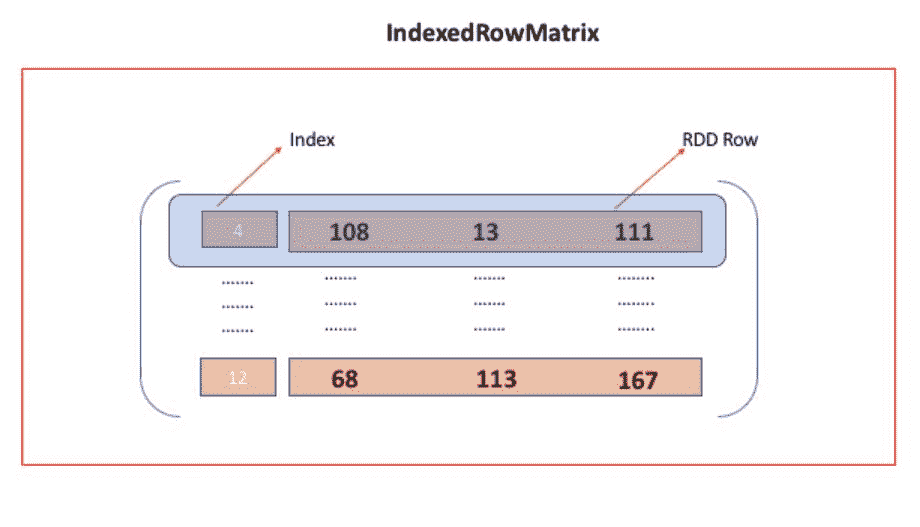

定义可能不清晰，因为您需要重复定义索引和数据来组成原始矩阵。以下代码片段显示了内部列表中（索引，数据）的重复以供参考：

```scala
List( IndexedRow( 0L, dataVectors(0)), IndexedRow( 1L, dataVectors(1)), IndexedRow( 1L, dataVectors(2)))
```

其他操作与前一篇中介绍的`IndexRow`矩阵类似。

# 另请参阅

+   构造函数的文档可在[`spark.apache.org/docs/latest/api/java/org/apache/spark/mllib/linalg/distributed/IndexedRowMatrix.html#constructor_summary`](https://spark.apache.org/docs/latest/api/java/org/apache/spark/mllib/linalg/distributed/IndexedRowMatrix.html#constructor_summary)找到。

+   方法调用的文档可在[`spark.apache.org/docs/latest/api/java/org/apache/spark/mllib/linalg/distributed/IndexedRowMatrix.html#method_summary`](https://spark.apache.org/docs/latest/api/java/org/apache/spark/mllib/linalg/distributed/IndexedRowMatrix.html#method_summary)找到。

# 在 Spark 2.0 中探索分布式 CoordinateMatrix

在这个教程中，我们介绍了专门的分布式矩阵的第二种形式。在处理需要处理通常较大的 3D 坐标系（x，y，z）的 ML 实现时，这是非常方便的。这是一种将坐标数据结构打包成分布式矩阵的便捷方式。

# 如何做...

1.  在 IntelliJ 或您选择的 IDE 中启动一个新项目。确保包含必要的 JAR 文件。

1.  导入向量和矩阵操作所需的包：

```scala
 import org.apache.spark.mllib.linalg.distributed.RowMatrix
 import org.apache.spark.mllib.linalg.distributed.{IndexedRow, IndexedRowMatrix}
 import org.apache.spark.mllib.linalg.distributed.{CoordinateMatrix, MatrixEntry}
 import org.apache.spark.sql.{SparkSession}
 import org.apache.spark.mllib.linalg._
 import breeze.linalg.{DenseVector => BreezeVector}
 import Array._
 import org.apache.spark.mllib.linalg.DenseMatrix
 import org.apache.spark.mllib.linalg.SparseVector
```

1.  设置 Spark 上下文和应用程序参数，以便 Spark 可以运行。有关更多详细信息和变体，请参见本章的第一个教程：

```scala
val spark = SparkSession
 .builder
 .master("local[*]")
 .appName("myVectorMatrix")
 .config("spark.sql.warehouse.dir", ".")
 .getOrCreate()
```

1.  我们从`MatrixEntry`的 SEQ 开始，它对应于每个坐标，并将放置在`CoordinateMatrix`中。请注意，这些条目不再可以是实数（毕竟它们是 x、y、z 坐标）：

```scala
val CoordinateEntries = Seq(
   MatrixEntry(1, 6, 300),
   MatrixEntry(3, 1, 5),
   MatrixEntry(1, 7, 10)
 )
```

1.  我们实例化调用并构造`CoordinateMatrix`。我们需要额外的步骤来创建 RDD，我们已经在构造函数中使用 Spark 上下文进行了展示（即`sc.parallelize`）：

```scala
val distCordMat1 = new CoordinateMatrix( sc.parallelize(CoordinateEntries.toList)) 
```

1.  我们打印第一个`MatrixEntry`以验证矩阵元素。我们将在下一章中讨论 RDD，但请注意，“count（）”本身就是一个动作，使用“collect（）”将是多余的：

```scala
 println("First Row (MatrixEntry) =",distCordMat1.entries.first())
```

输出如下：

```scala
    First Row (MatrixEntry) =,MatrixEntry(1,6,300.0)

```

# 它是如何工作的...

1.  `CoordinateMatrix`是一种专门的矩阵，其中每个条目都是一个坐标系或三个数字的元组（长，长，长对应于*x*，*y*，*z*坐标）。相关的数据结构是`MatrixEntry`，其中将存储坐标，然后放置在`CoordinateMatrix`的位置。以下代码片段演示了`MaxEntry`的使用，这似乎本身就是一个混乱的来源。

1.  下图显示了`CoordinateMatrix`的图示视图，这应该有助于澄清主题：

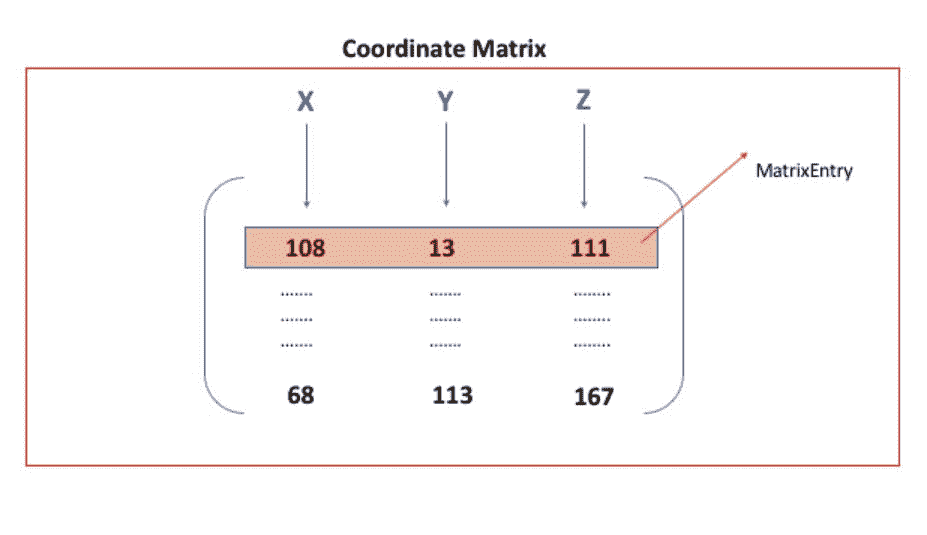

包含三个坐标的代码片段是：

```scala
MatrixEntry(1, 6, 300), MatrixEntry(3, 1, 5), MatrixEntry(1, 7, 10)
```

`MaxEntry`只是一个必需的结构，用于保存坐标。除非您需要修改 Spark 提供的源代码（请参阅 GitHub`CoordinateMatrix.scala`）以定义一个更专业的容器（压缩），否则没有必要进一步了解它：

1.  +   `CoordinateMatrix`也由 RDD 支持，这让您可以从一开始就利用并行性。

+   您还需要导入`IndexedRow`，这样您就可以在实例化`IndexedRowMatrix`之前定义带有索引的行。

+   这个矩阵可以转换为`RowMatrix`、`IndexedRowMatrix`和`BlockMatrix`。

稀疏坐标系统还带来了高效的存储、检索和操作的附加好处（例如，所有设备与位置的安全威胁矩阵）。

# 另请参阅

+   构造函数的文档位于[`spark.apache.org/docs/latest/api/java/org/apache/spark/mllib/linalg/distributed/CoordinateMatrix.html#constructor_summary`](https://spark.apache.org/docs/latest/api/java/org/apache/spark/mllib/linalg/distributed/CoordinateMatrix.html#constructor_summary)

+   方法调用的文档位于[`spark.apache.org/docs/latest/api/java/org/apache/spark/mllib/linalg/distributed/CoordinateMatrix.html#method_summary`](https://spark.apache.org/docs/latest/api/java/org/apache/spark/mllib/linalg/distributed/CoordinateMatrix.html#method_summary)

+   MaxEntry 的文档位于[`spark.apache.org/docs/latest/api/java/index.html`](http://spark.apache.org/docs/latest/api/java/index.html)

# 在 Spark 2.0 中探索分布式 BlockMatrix

在这个示例中，我们探索了`BlockMatrix`，这是一个很好的抽象和其他矩阵块的占位符。简而言之，它是其他矩阵（矩阵块）的矩阵，可以作为单元访问。

```scala
CoordinateMatrix to a BlockMatrix and then do a quick check for its validity and access one of its properties to show that it was set up properly. BlockMatrix code takes longer to set up and it needs a real life application (not enough space) to demonstrate and show its properties in action.
```

# 如何做...

1.  在 IntelliJ 或您选择的编辑器中启动一个新项目，并确保所有必要的 JAR 文件（Scala 和 Spark）对您的应用程序可用。

1.  导入用于向量和矩阵操作的必要包：

```scala
import org.apache.spark.mllib.linalg.distributed.RowMatrix
 import org.apache.spark.mllib.linalg.distributed.{IndexedRow, IndexedRowMatrix}
 import org.apache.spark.mllib.linalg.distributed.{CoordinateMatrix, MatrixEntry}
 import org.apache.spark.sql.{SparkSession}
 import org.apache.spark.mllib.linalg._
 import breeze.linalg.{DenseVector => BreezeVector}
 import Array._
 import org.apache.spark.mllib.linalg.DenseMatrix
 import org.apache.spark.mllib.linalg.SparseVector
```

1.  设置 Spark 上下文和应用程序参数，以便 Spark 可以运行。有关更多详细信息和变化，请参见本章的第一个示例：

```scala
val spark = SparkSession
 .builder
 .master("local[*]")
 .appName("myVectorMatrix")
 .config("spark.sql.warehouse.dir", ".")
 .getOrCreate()
```

1.  快速创建一个`CoordinateMatrix`以用作转换的基础：

```scala
val distCordMat1 = new CoordinateMatrix( sc.parallelize(CoordinateEntries.toList))
```

1.  我们将`CoordinateMatrix`转换为`BlockMatrix`：

```scala
val distBlkMat1 =  distCordMat1.toBlockMatrix().cache() 
```

1.  这是一个非常有用的矩阵类型的调用。在现实生活中，通常需要在进行计算之前检查设置：

```scala
distBlkMat1.validate() 
println("Is block empty =", distBlkMat1.blocks.isEmpty()) 
```

输出如下：

```scala
Is block empty =,false
```

# 它是如何工作的...

矩阵块将被定义为（int，int，Matrix）的元组。这种矩阵的独特之处在于它具有`Add()`和`Multiply()`函数，这些函数可以将另一个`BlockMatrix`作为分布式矩阵的第二个参数。虽然一开始设置它有点令人困惑（特别是在数据到达时），但有一些辅助函数可以帮助您验证您的工作，并确保`BlockMatrix`被正确设置。这种类型的矩阵可以转换为本地的`IndexRowMatrix`和`CoordinateMatrix`。`BlockMatrix`最常见的用例之一是拥有`CoordinateMatrices`的`BlockMatrix`。

# 另请参阅

+   构造函数的文档可在[`spark.apache.org/docs/latest/api/java/org/apache/spark/mllib/linalg/distributed/BlockMatrix.html#constructor_summary`](https://spark.apache.org/docs/latest/api/java/org/apache/spark/mllib/linalg/distributed/BlockMatrix.html#constructor_summary)找到。

+   方法调用的文档可在[`spark.apache.org/docs/latest/api/java/org/apache/spark/mllib/linalg/distributed/BlockMatrix.html#method_summary`](https://spark.apache.org/docs/latest/api/java/org/apache/spark/mllib/linalg/distributed/BlockMatrix.html#method_summary)找到。
