# 第三章：Spark 的三大数据武士-完美搭档

在本章中，我们将涵盖以下内容： 

+   使用内部数据源创建 Spark 2.0 的 RDDs

+   使用外部数据源创建 Spark 2.0 的 RDDs

+   使用 Spark 2.0 的 filter() API 转换 RDDs

+   使用超级有用的 flatMap() API 转换 RDD

+   使用集合操作 API 转换 RDDs

+   使用 groupBy()和 reduceByKey()进行 RDD 转换/聚合

+   使用 zip() API 转换 RDDs

+   使用配对键值 RDD 进行连接转换

+   使用配对键值 RDD 进行减少和分组转换

+   从 Scala 数据结构创建数据框

+   在没有 SQL 的情况下以编程方式操作数据框

+   从外部源加载数据框和设置

+   使用标准 SQL 语言的数据框- SparkSQL

+   使用 Scala 序列使用数据集 API

+   从 RDDs 创建和使用数据集，然后再次转换

+   使用数据集 API 和 SQL 一起处理 JSON

+   使用领域对象使用数据集 API 进行函数式编程

# 介绍

Spark 的三大工作马是 RDD、数据框架和数据集 API，用于高效处理规模化数据。虽然每个都有其自身的优点，但新的范式转变更青睐数据集作为统一的数据 API，以满足单一接口中的所有数据整理需求。

新的 Spark 2.0 数据集 API 是一组类型安全的领域对象集合，可以通过转换（类似于 RDD 的 filter、`map`、`flatMap()`等）并行使用功能或关系操作。为了向后兼容，数据集有一个名为**DataFrame**的视图，它是一组无类型的行。在本章中，我们演示了所有三个 API 集。前面的图总结了 Spark 数据整理的关键组件的优缺点：

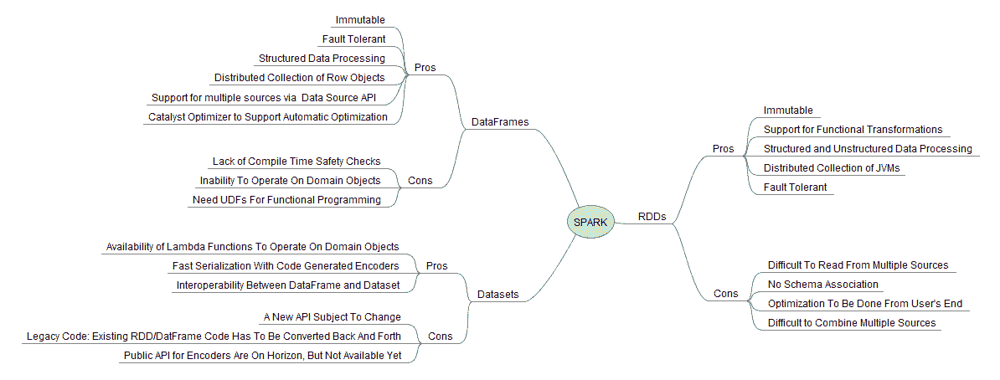

机器学习中的高级开发人员必须理解并能够无障碍地使用所有三个 API 集，用于算法增强或遗留原因。虽然我们建议每个开发人员都应该向高级数据集 API 迁移，但您仍然需要了解 RDDs，以针对 Spark 核心系统进行编程。例如，投资银行和对冲基金经常阅读机器学习、数学规划、金融、统计或人工智能领域的领先期刊，然后使用低级 API 编写研究以获得竞争优势。

# RDDs-一切的开始...

RDD API 是 Spark 开发人员的关键工具包，因为它偏向于在函数式编程范式中对数据进行低级控制。RDD 强大的地方也使得新手程序员更难使用。虽然理解 RDD API 和手动优化技术（例如，在`groupBy()`操作之前的`filter()`）可能很容易，但编写高级代码需要持续的练习和流利。

当数据文件、块或数据结构转换为 RDD 时，数据被分解成称为**分区**的较小单元（类似于 Hadoop 中的拆分），并分布在节点之间，以便它们可以同时并行操作。Spark 提供了这种功能，可以在规模上立即使用，无需额外编码。框架会为您处理所有细节，您可以专注于编写代码，而不必担心数据。

要欣赏底层 RDD 的天才和优雅，必须阅读这个主题的原始论文，这被认为是这个主题上的最佳作品。可以在这里访问论文：

[`www.usenix.org/system/files/conference/nsdi12/nsdi12-final138.pdf`](https://www.usenix.org/system/files/conference/nsdi12/nsdi12-final138.pdf)

Spark 中有许多类型的 RDD 可以简化编程。下面的思维导图描述了 RDD 的部分分类。建议 Spark 上的程序员至少了解可用的 RDD 类型，甚至是不太知名的类型，如**RandomRDD**、**VertexRDD**、**HadoopRDD**、**JdbcRDD**和**UnionRDD**，以避免不必要的编码。

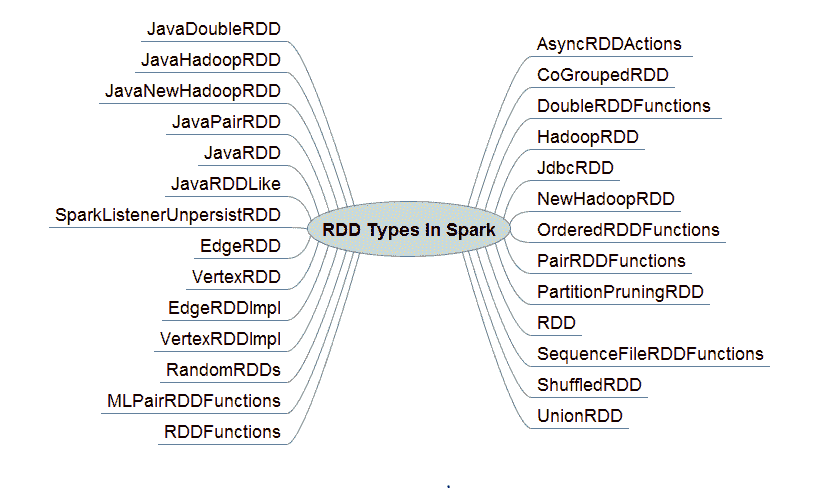

# DataFrame - 通过高级 API 将 API 和 SQL 统一的自然演变。

Spark 开发人员社区一直致力于为社区提供易于使用的高级 API，从伯克利的 AMPlab 时代开始。数据 API 的下一个演变是当 Michael Armbrust 为社区提供了 SparkSQL 和 Catalyst 优化器，这使得使用简单且广为人知的 SQL 接口在 Spark 中实现了数据虚拟化。DataFrame API 是利用 SparkSQL 的自然演变，通过将数据组织成命名列来利用 SparkSQL。

DataFrame API 使得通过 SQL 进行数据整理对于许多熟悉 R（data.frame）或 Python/Pandas（pandas.DataFrame）的数据科学家和开发人员变得可行。

# 数据集 - 一个高级统一的数据 API

数据集是一个不可变的对象集合，它被建模/映射到传统的关系模式。有四个属性使其成为未来首选的方法。我们特别喜欢数据集 API，因为我们发现它与 RDD 非常相似，具有通常的转换操作符（例如`filter()`、`map()`、`flatMap()`等）。数据集将遵循类似 RDD 的延迟执行范式。试图调和 DataFrame 和 DataSet 的最佳方法是将 DataFrame 视为可以被视为`Dataset[Row]`的别名。

+   **强类型安全**：我们现在在统一的数据 API 中既有编译时（语法错误）又有运行时安全，这有助于机器学习开发人员不仅在开发过程中，还可以在运行时防范意外。由于数据中的缺陷而在 Scala 或 Python 中使用 DataFrame 或 RDD Lambda 遇到意外运行时错误的开发人员将更好地理解和欣赏来自 Spark 社区和 Databricks（[`databricks.com`](https://databricks.com)）的这一新贡献。

+   **启用 Tungsten 内存管理**：Tungsten 使 Apache Spark 更加接近裸金属（即利用`sun.misc.Unsafe`接口）。编码器便于将 JVM 对象映射到表格格式（见下图）。如果您使用数据集 API，Spark 将 JVM 对象映射到内部 Tungsten 堆外二进制格式，这更加高效。虽然 Tungsten 内部的细节超出了机器学习食谱的范围，但值得一提的是，基准测试显示使用堆外内存管理与 JVM 对象相比有显著改进。值得一提的是，在 Spark 中可用之前，堆外内存管理的概念在 Apache Flink 中一直是内在的。Spark 开发人员意识到了 Tungsten 项目的重要性，自 Spark 1.4、1.5 和 1.6 以来，一直到 Spark 2.0+的当前状态。再次强调，尽管在撰写本文时 DataFrame 将得到支持，并且已经详细介绍过（大多数生产系统仍然是 Spark 2.0 之前的版本），我们鼓励您开始思考数据集范式。下图显示了 RDD、DataFrame 和 DataSet 与 Tungsten 项目的演进路线之间的关系：

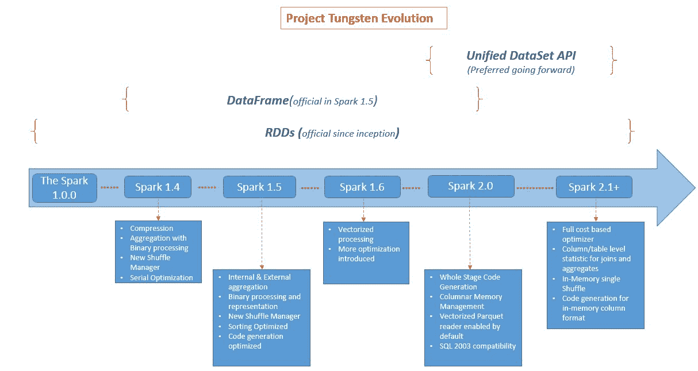

+   **编码器**：编码器是 Spark 2.0 中的 Spark 序列化和反序列化（即 SerDe）框架。编码器无缝处理将 JVM 对象映射到表格格式的操作，您可以在底层获取并根据需要进行修改（专家级别）。

+   与标准 Java 序列化和其他序列化方案（例如 Kryo）不同，编码器不使用运行时反射来动态发现对象内部以进行序列化。相反，编码器代码在编译时为给定对象生成并编译为字节码，这将导致更快的操作（不使用反射）来序列化和反序列化对象。运行时的反射对象内部（例如，查找字段及其格式）会带来额外的开销，在 Spark 2.0 中不存在。如果需要，仍然可以使用 Kryo、标准 java 序列化或任何其他序列化技术（边缘情况和向后兼容性）。

+   标准数据类型和对象（由标准数据类型制成）的编码器在 Tungsten 中是开箱即用的。使用快速非正式的程序基准测试，使用 Hadoop MapReduce 开发人员广泛使用的 Kryo 序列化来回序列化对象，与编码器相比，发现了显着的 4 倍到 8 倍的改进。当我们查看源代码并深入了解后，我们意识到编码器实际上使用运行时代码生成（在字节码级别！）来打包和解包对象。为了完整起见，我们提到对象似乎也更小，但更多细节以及为什么会这样的原因超出了本书的范围。

+   Encoder[T]是 DataSet[T]的内部构件，它只是记录的模式。您可以根据需要在 Scala 中使用底层数据的元组（例如 Long、Double 和 Int）创建自定义编码器。在开始自定义编码器之前（例如，想要在 DataSet[T]中存储自定义对象），请确保查看 Spark 源目录中的`[Encoders.scala](https://github.com/apache/spark/blob/v2.0.0/sql/catalyst/src/main/scala/org/apache/spark/sql/Encoders.scala#L270-L316)`和`[SQLImplicits.scala](https://github.com/apache/spark/blob/v2.0.0/sql/core/src/main/scala/org/apache/spark/sql/SQLImplicits.scala#L77-L96)`。Spark 的计划和战略方向是在未来的版本中提供一个公共 API。

+   **Catalyst 优化器友好**：使用 Catalyst，API 手势被转换为使用目录（用户定义的函数）的逻辑查询计划，并最终将逻辑计划转换为物理计划，这通常比原始方案提出的更有效（即使您尝试在`filter()`之前使用`groupBy()`，它也足够聪明地安排它的顺序）。为了更好地理解，请参见下图：

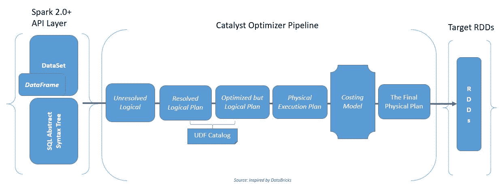

对于 Spark 2.0 之前的用户值得注意：

+   `SparkSession`现在是系统的唯一入口点。SQLContext 和 HiveContext 被 SparkSession 取代。

+   对于 Java 用户，请确保将 DataFrame 替换为`Dataset<Row>`

+   通过`SparkSession`使用新的目录接口执行`cacheTable()`、`dropTempView()`、`createExternalTable()`、`ListTable()`等。

+   DataFrame 和 DataSet API：

+   `unionALL()`已被弃用；现在应该使用`union()`

+   `explode()`应该被`functions.explode()`加`select()`或`flatMap()`替换

+   `registerTempTable`已被弃用，替换为`createOrReplaceTempView()`

# 使用内部数据源在 Spark 2.0 中创建 RDD

在 Spark 中有四种创建 RDD 的方法。它们从`parallelize()`方法用于在客户端驱动程序代码中进行简单测试和调试到流式 RDD，用于近实时响应。在本教程中，我们提供了几个示例来演示使用内部源创建 RDD。流式情况将在第十三章中的流式 Spark 示例中进行介绍，因此我们可以以有意义的方式来解决它。

# 如何做到...

1.  在 IntelliJ 或您选择的 IDE 中启动一个新项目。确保包含必要的 JAR 文件。

1.  设置程序将驻留的包位置：

```scala
package spark.ml.cookbook.chapter3
```

1.  导入必要的包：

```scala
import breeze.numerics.pow 
import org.apache.spark.sql.SparkSession 
import Array._
```

1.  导入设置`log4j`日志级别的包。这一步是可选的，但我们强烈建议这样做（随着开发周期的推移，适当更改级别）。

```scala
import org.apache.log4j.Logger 
import org.apache.log4j.Level 
```

1.  设置日志级别为警告和错误，以减少输出。有关包要求，请参阅上一步。

```scala
Logger.getLogger("org").setLevel(Level.ERROR) 
Logger.getLogger("akka").setLevel(Level.ERROR)
```

1.  设置 Spark 上下文和应用程序参数，以便 Spark 可以运行：

```scala
val spark = SparkSession 
  .builder 
  .master("local[*]") 
  .appName("myRDD") 
  .config("Spark.sql.warehouse.dir", ".") 
  .getOrCreate() 
```

1.  我们声明两个本地数据结构来保存数据，然后再使用任何分布式 RDD。需要注意的是，这里的数据将通过本地数据结构保存在驱动程序的堆空间中。我们在这里明确提到，因为程序员在使用`parallelize()`技术进行大数据集测试时会遇到多种问题。如果使用这种技术，请确保驱动程序本地有足够的空间来保存数据。

```scala
val SignalNoise: Array[Double] = Array(0.2,1.2,0.1,0.4,0.3,0.3,0.1,0.3,0.3,0.9,1.8,0.2,3.5,0.5,0.3,0.3,0.2,0.4,0.5,0.9,0.1) 
val SignalStrength: Array[Double] = Array(6.2,1.2,1.2,6.4,5.5,5.3,4.7,2.4,3.2,9.4,1.8,1.2,3.5,5.5,7.7,9.3,1.1,3.1,2.1,4.1,5.1) 
```

1.  我们使用`parallelize()`函数将本地数据分发到集群中。

```scala
val parSN=spark.sparkContext.parallelize(SignalNoise) // parallelized signal noise RDD 
val parSS=spark.sparkContext.parallelize(SignalStrength)  // parallelized signal strength 
```

1.  让我们看看 Spark 如何看待这两种数据结构的区别。可以通过打印两个数据结构句柄来完成：一个本地数组和一个集群并行集合（即 RDD）。

输出如下：

```scala
    Signal Noise Local Array ,[D@2ab0702e)
    RDD Version of Signal Noise on the cluster  
    ,ParallelCollectionRDD[0] at parallelize at myRDD.scala:45)
```

1.  Spark 尝试根据集群的配置自动设置分区数（即 Hadoop 中的分区），但有时我们需要手动设置分区数。`parallelize()`函数提供了第二个参数，允许您手动设置分区数。

```scala
val parSN=spark.sparkContext.parallelize(SignalNoise) // parallelized signal noise RDD set with default partition 
val parSS=spark.sparkContext.parallelize(SignalStrength)  // parallelized signal strength set with default partition 
val parSN2=spark.sparkContext.parallelize(SignalNoise,4) // parallelized signal noise set with 4 partition 
val parSS2=spark.sparkContext.parallelize(SignalStrength,8)  // parallelized signal strength set with 8 partition 
println("parSN partition length ", parSN.partitions.length ) 
println("parSS partition length ", parSS.partitions.length ) 
println("parSN2 partition length ",parSN2.partitions.length ) 
println("parSS2 partition length ",parSS2.partitions.length ) 
```

输出如下：

```scala
parSN partition length ,2
parSS partition length ,2
parSN2 partition length ,4
parSS2 partition length ,8

```

在前两行中，Spark 默认选择了两个分区，接下来两行中，我们分别将分区数设置为 4 和 8。

# 工作原理...

客户端驱动程序中保存的数据被并行化并分布到集群中，使用分区 RDD 的数量（第二个参数）作为指导。生成的 RDD 是 Spark 的魔力，它启动了一切（参考 Matei Zaharia 的原始白皮书）。

生成的 RDD 现在是完全分布式的数据结构，具有容错性和血统，可以使用 Spark 框架并行操作。

我们从[`www.gutenberg.org/`](http://www.gutenberg.org/)读取了查尔斯·狄更斯的《双城记》文本文件到 Spark RDD 中。然后我们继续拆分和标记数据，并使用 Spark 的操作符（例如`map`，`flatMap()`等）打印总词数。

# 使用外部数据源使用 Spark 2.0 创建 RDD

在本教程中，我们提供了几个示例来演示使用外部来源创建 RDD。

# 操作步骤...

1.  在 IntelliJ 或您选择的 IDE 中启动一个新项目。确保包含必要的 JAR 文件。

1.  设置程序将驻留的包位置：

```scala
package spark.ml.cookbook.chapter3 
```

1.  导入必要的包：

```scala
import breeze.numerics.pow 
import org.apache.spark.sql.SparkSession 
import Array._
```

1.  导入设置`log4j`日志级别的包。这一步是可选的，但我们强烈建议这样做（随着开发周期的推移，适当更改级别）。

```scala
import org.apache.log4j.Logger 
import org.apache.log4j.Level 
```

1.  设置日志级别为警告和错误，以减少输出。有关包要求，请参阅上一步。

```scala
Logger.getLogger("org").setLevel(Level.ERROR) 
Logger.getLogger("akka").setLevel(Level.ERROR) 
```

1.  设置 Spark 上下文和应用程序参数，以便 Spark 可以运行。

```scala
val spark = SparkSession 
  .builder 
  .master("local[*]") 
  .appName("myRDD") 
  .config("Spark.sql.warehouse.dir", ".") 
  .getOrCreate()
```

1.  我们从古腾堡计划获取数据。这是一个获取实际文本的好来源，从*莎士比亚*的完整作品到*查尔斯·狄更斯*。

1.  从以下来源下载文本并将其存储在本地目录中：

+   来源：[`www.gutenberg.org`](http://www.gutenberg.org)

+   选择的书籍：*查尔斯·狄更斯的《双城记》*

+   URL：[`www.gutenberg.org/cache/epub/98/pg98.txt`](http://www.gutenberg.org/cache/epub/98/pg98.txt)

1.  再次使用`SparkContext`，通过`SparkSession`可用，并使用其`textFile()`函数来读取外部数据源，并在集群中并行化。值得注意的是，Spark 在幕后使用一次单一调用来加载各种格式（例如文本、S3 和 HDFS），并使用`protocol:filepath`组合将数据并行化到集群中，为开发人员完成了所有工作。

1.  为了演示，我们使用`textFile()`方法从`SparkContext`通过`SparkSession`读取存储为 ASCII 文本的书籍，然后在幕后创建跨集群的分区 RDDs。

```scala
val book1 = spark.sparkContext.textFile("../data/sparkml2/chapter3/a.txt") 
```

输出将如下所示：

```scala
Number of lines = 16271
```

1.  尽管我们还没有涵盖 Spark 转换运算符，但我们将看一个小的代码片段，它将使用空格将文件分割成单词。在现实生活中，需要使用正则表达式来处理所有的边缘情况和所有的空格变化（参考本章中的*使用 filter() API 转换 RDDs*配方）。

+   我们使用一个 lambda 函数来接收每一行，并使用空格作为分隔符将其分割成单词。

+   我们使用 flatMap 来将单词列表的数组（即，每行的单词组对应于该行的一个不同的数组/列表）分解。简而言之，我们想要的是单词列表，而不是每行的单词列表。

```scala
val book2 = book1.flatMap(l => l.split(" ")) 
println(book1.count())
```

输出将如下所示：

```scala
Number of words = 143228  
```

# 它是如何工作的...

我们从[`www.gutenberg.org/`](http://www.gutenberg.org/)读取了一本名为《双城记》的小说，并将其存储为 RDD，然后通过使用空格作为分隔符的 lambda 表达式的`.split()`和`.flatmap()`来对单词进行标记。然后，我们使用 RDD 的`.count()`方法输出单词的总数。虽然这很简单，但您必须记住，这个操作是在 Spark 的分布式并行框架中进行的，只需要几行代码。

# 还有更多...

使用外部数据源创建 RDDs，无论是文本文件、Hadoop HDFS、序列文件、Casandra 还是 Parquet 文件，都非常简单。再次使用`SparkSession`（Spark 2.0 之前使用`SparkContext`）来获取对集群的控制。一旦执行函数（例如，textFile Protocol: file path），数据就会被分成更小的片段（分区），并自动流向集群，变成可供计算使用的容错分布式集合，可以并行操作。

1.  在处理真实情况时，有许多变化需要考虑。根据我们自己的经验，最好的建议是在编写自己的函数或连接器之前查阅文档。Spark 要么直接支持您的数据源，要么供应商有一个可以下载的连接器来完成相同的工作。

1.  我们经常看到的另一种情况是生成许多小文件（通常在`HDFS`目录中），需要将它们并行化为 RDDs 以供使用。`SparkContext`有一个名为`wholeTextFiles()`的方法，它允许您读取包含多个文件的目录，并将每个文件作为（文件名，内容）键值对返回。我们发现这在使用 lambda 架构进行多阶段机器学习时非常有用，其中模型参数作为批处理计算，然后每天在 Spark 中更新。

在这个例子中，我们读取多个文件，然后打印第一个文件进行检查。

`spark.sparkContext.wholeTextFiles()`函数用于读取大量小文件，并将它们呈现为（K,V）或键值对：

```scala
val dirKVrdd = spark.sparkContext.wholeTextFiles("../data/sparkml2/chapter3/*.txt") // place a large number of small files for demo 
println ("files in the directory as RDD ", dirKVrdd) 
println("total number of files ", dirKVrdd.count()) 
println("Keys ", dirKVrdd.keys.count()) 
println("Values ", dirKVrdd.values.count()) 
dirKVrdd.collect() 
println("Values ", dirKVrdd.first()) 
```

运行上述代码后，您将得到以下输出：

```scala
    files in the directory as RDD ,../data/sparkml2/chapter3/*.txt
    WholeTextFileRDD[10] at wholeTextFiles at myRDD.scala:88)
    total number of files 2
    Keys ,2
    Values ,2
    Values ,(file:/C:/spark-2.0.0-bin-hadoop2.7/data/sparkml2/chapter3/a.txt,
    The Project Gutenberg EBook of A Tale of Two Cities, 
    by Charles Dickens

```

# 另请参阅

Spark 文档中关于`textFile()`和`wholeTextFiles()`函数的说明：

[`spark.apache.org/docs/latest/api/scala/index.html#org.apache.spark.SparkContext`](http://spark.apache.org/docs/latest/api/scala/index.html#org.apache.spark.SparkContext)

`textFile()` API 是与外部数据源交互的单一抽象。协议/路径的制定足以调用正确的解码器。我们将演示从 ASCII 文本文件、Amazon AWS S3 和 HDFS 读取的代码片段，用户可以利用这些代码片段构建自己的系统。

+   路径可以表示为简单路径（例如，本地文本文件）到具有所需协议的完整 URI（例如，AWS 存储桶的 s3n）到具有服务器和端口配置的完整资源路径（例如，从 Hadoop 集群读取 HDFS 文件）。

+   `textFile()`方法还支持完整目录、正则表达式通配符和压缩格式。看一下这个示例代码：

```scala
val book1 = spark.sparkContext.textFile("C:/xyz/dailyBuySel/*.tif")
```

+   `textFile()`方法在末尾有一个可选参数，定义了 RDD 所需的最小分区数。

例如，我们明确指示 Spark 将文件分成 13 个分区：

```scala
val book1 = spark.sparkContext.textFile("../data/sparkml2/chapter3/a.txt", 13) 
```

您还可以选择指定 URI 来从其他来源（如 HDFS 和 S3）读取和创建 RDD，通过指定完整的 URI（协议：路径）。以下示例演示了这一点：

1.  从 Amazon S3 存储桶中读取和创建文件。需要注意的是，如果 AWS 秘钥中有斜杠，URI 中的 AWS 内联凭据将会中断。请参阅此示例文件：

```scala
spark.sparkContext.hadoopConfiguration.set("fs.s3n.awsAccessKeyId", "xyz") 
spark.sparkContext.hadoopConfiguration.set("fs.s3n.awsSecretAccessKey", "....xyz...") 
S3Rdd = spark.sparkContext.textFile("s3n://myBucket01/MyFile01") 
```

1.  从 HDFS 读取非常相似。在这个例子中，我们从本地 Hadoop 集群读取，但在现实世界的情况下，端口号将是不同的，并由管理员设置。

```scala
val hdfsRDD = spark.sparkContext.textFile("hdfs:///localhost:9000/xyz/top10Vectors.txt") 
```

# 使用 Spark 2.0 使用`filter()`API 转换 RDD

在这个示例中，我们探索了 RDD 的`filter()`方法，用于选择基本 RDD 的子集并返回新的过滤后的 RDD。格式与`map()`类似，但是 lambda 函数选择要包含在结果 RDD 中的成员。

# 如何做...

1.  在 IntelliJ 或您选择的 IDE 中开始一个新项目。确保包含必要的 JAR 文件。

1.  设置程序所在的软件包位置：

```scala
package spark.ml.cookbook.chapter3
```

1.  导入必要的软件包：

```scala
import breeze.numerics.pow 
import org.apache.spark.sql.SparkSession 
import Array._
```

1.  导入设置`log4j`日志级别的软件包。这一步是可选的，但我们强烈建议（随着开发周期的推移，适当更改级别）。

```scala
import org.apache.log4j.Logger 
import org.apache.log4j.Level 
```

1.  将日志级别设置为警告和错误以减少输出。查看上一步的软件包要求。

```scala
Logger.getLogger("org").setLevel(Level.ERROR) 
Logger.getLogger("akka").setLevel(Level.ERROR) 
```

1.  设置 Spark 上下文和应用程序参数，以便 Spark 可以运行。

```scala
val spark = SparkSession 
  .builder 
  .master("local[*]") 
  .appName("myRDD") 
  .config("Spark.sql.warehouse.dir", ".") 
  .getOrCreate() 
```

1.  添加以下行以使示例编译通过。`pow()`函数将允许我们将任何数字提升到任意幂（例如，平方该数字）：

```scala
import breeze.numerics.pow
```

1.  我们创建一些数据并`parallelize()`它以获得我们的基本 RDD。我们还使用`textFile()`从我们之前从[`www.gutenberg.org/cache/epub/98/pg98.txt`](http://www.gutenberg.org/cache/epub/98/pg98.txt)链接下载的文本文件创建初始（例如，基本 RDD）：

```scala
val num : Array[Double] = Array(1,2,3,4,5,6,7,8,9,10,11,12,13) 
  val numRDD=sc.parallelize(num) 
  val book1 = spark.sparkContext.textFile("../data/sparkml2/chapter3/a.txt")
```

1.  我们应用`filter()`函数到 RDD 中，以演示`filter()`函数的转换。我们使用`filter()`函数从原始 RDD 中选择奇数成员。

1.  `filter()`函数并行迭代 RDD 的成员，并应用 mod 函数（%）并将其与 1 进行比较。简而言之，如果除以 2 后有余数，那么它必须是奇数。

```scala
  val myOdd= num.filter( i => (i%2) == 1) 
```

这是上一行的第二种变体，但在这里我们演示了`_`（下划线）的使用，它充当通配符。我们在 Scala 中使用这种表示法来缩写明显的内容：

```scala
val myOdd2= num.filter(_ %2 == 1) // 2nd variation using scala notation  
myOdd.take(3).foreach(println) 
```

在运行上述代码时，您将获得以下输出：

```scala
1.0
3.0
5.0
```

1.  另一个例子将 map 和 filter 结合在一起。这段代码首先对每个数字进行平方，然后应用`filter`函数从原始 RDD 中选择奇数。

```scala
val myOdd3= num.map(pow(_,2)).filter(_ %2 == 1) 
myOdd3.take(3).foreach(println)  
```

输出将如下所示：

```scala
1.0
9.0
25.0
```

1.  在这个例子中，我们使用`filter()`方法来识别少于 30 个字符的行。结果 RDD 将只包含短行。对计数和输出的快速检查验证了结果。只要格式符合函数语法，RDD 转换函数就可以链接在一起。

```scala
val shortLines = book1.filter(_.length < 30).filter(_.length > 0) 
  println("Total number of lines = ", book1.count()) 
  println("Number of Short Lines = ", shortLines.count()) 
  shortLines.take(3).foreach(println) 
```

运行上述代码后，您将获得以下输出：

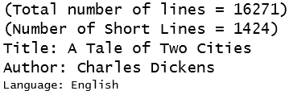

1.  在这个例子中，我们使用`contain()`方法来过滤包含任何大小写组合的单词`two`的句子。我们使用多个方法链接在一起来找到所需的句子。

```scala
val theLines = book1.map(_.trim.toUpperCase()).filter(_.contains("TWO")) 
println("Total number of lines = ", book1.count()) 
println("Number of lines with TWO = ", theLines.count()) 
theLines.take(3).foreach(println) 
```

# 它是如何工作的...

使用几个示例演示了`filter()` API。在第一个示例中，我们通过使用 lambda 表达式`.filter(i => (i%2) == 1)`遍历了一个 RDD 并输出了奇数，利用了模（modulus）函数。

在第二个示例中，我们通过使用 lambda 表达式`num.map(pow(_,2)).filter(_ %2 == 1)`将结果映射到一个平方函数，使其变得有趣一些。

在第三个示例中，我们遍历文本并使用 lambda 表达式`.filter(_.length < 30).filter(_.length > 0)`过滤出短行（例如，少于 30 个字符的行），以打印短行与总行数（`.count()`）作为输出。

# 还有更多...

`filter()` API 遍历并应用于`filter()`中提供的选择条件的并行分布式集合（即 RDD），以便通过 lambda 包含或排除结果 RDD 中的元素。组合使用`map()`，它转换每个元素，和`filter()`，它选择一个子集，在 Spark ML 编程中是一个强大的组合。

稍后我们将看到，使用`DataFrame` API，可以使用类似的`Filter()` API 来实现相同的效果，这是在 R 和 Python（pandas）中使用的更高级框架。

# 另请参阅

+   `.filter()`的文档，这是 RDD 的一个方法调用，可在[`spark.apache.org/docs/latest/api/scala/index.html#org.apache.spark.api.java.JavaRDD`](http://spark.apache.org/docs/2.0.0/api/scala/index.html#org.apache.spark.api.java.JavaRDD)上找到。

+   `BloomFilter()`的文档-为了完整起见，请注意已经存在一个布隆过滤器函数，并建议避免自行编写代码。我们将在第十三章《Spark 流处理和机器学习库》中解决这个问题，以匹配 Spark 的视图和布局。同样的链接是[`spark.apache.org/docs/latest/api/scala/index.html#org.apache.spark.util.sketch.BloomFilter`](http://spark.apache.org/docs/latest/api/scala/index.html#org.apache.spark.util.sketch.BloomFilter)。

# 使用非常有用的 flatMap() API 转换 RDD

在这个示例中，我们研究了`flatMap()`方法，这经常让初学者感到困惑；然而，仔细研究后，我们证明它是一个清晰的概念，它像`map`一样将 lambda 函数应用于每个元素，然后将结果 RDD 展平为单个结构（而不是具有子列表的列表，我们创建一个由所有子列表元素组成的单个列表）。

# 如何做...

1.  在 IntelliJ 或您选择的 IDE 中启动一个新项目。确保包含必要的 JAR 文件。

1.  设置程序所在的软件包位置

```scala
package spark.ml.cookbook.chapter3 
```

1.  导入必要的软件包

```scala
import breeze.numerics.pow 
import org.apache.spark.sql.SparkSession 
import Array._
```

1.  导入用于设置`log4j`日志级别的软件包。这一步是可选的，但我们强烈建议这样做（随着开发周期的推移，适当更改级别）。

```scala
import org.apache.log4j.Logger 
import org.apache.log4j.Level 
```

1.  将日志级别设置为警告和错误以减少输出。有关软件包要求，请参阅上一步。

```scala
Logger.getLogger("org").setLevel(Level.ERROR) 
Logger.getLogger("akka").setLevel(Level.ERROR) 
```

1.  设置 Spark 上下文和应用程序参数，以便 Spark 可以运行。

```scala
val spark = SparkSession 
  .builder 
  .master("local[*]") 
  .appName("myRDD") 
  .config("Spark.sql.warehouse.dir", ".") 
  .getOrCreate() 
```

1.  我们使用`textFile()`函数从我们之前从[`www.gutenberg.org/cache/epub/98/pg98.txt`](http://www.gutenberg.org/cache/epub/98/pg98.txt)下载的文本文件创建初始（即基本 RDD）：

```scala
val book1 = spark.sparkContext.textFile("../data/sparkml2/chapter3/a.txt")
```

1.  我们将 map 函数应用于 RDDs 以演示`map()`函数的转换。首先，我们以错误的方式进行演示：我们首先尝试根据正则表达式*[\s\W]+]*使用`map()`来分隔所有单词，以演示生成的 RDD 是一个列表的列表，其中每个列表对应于一行和该行中的标记化单词。这个例子演示了初学者在使用`flatMap()`时可能引起混淆的地方。

1.  以下行修剪每行，然后将行拆分为单词。结果 RDD（即 wordRDD2）将是一个单词列表的列表，而不是整个文件的单个单词列表。

```scala
val wordRDD2 = book1.map(_.trim.split("""[\s\W]+""") ).filter(_.length > 0) 
wordRDD2.take(3)foreach(println(_)) 
```

运行上述代码后，您将获得以下输出。

```scala
[Ljava.lang.String;@1e60b459
[Ljava.lang.String;@717d7587
[Ljava.lang.String;@3e906375
```

1.  我们使用`flatMap()`方法不仅进行映射，还将列表扁平化，因此最终得到的 RDD 由单词本身组成。我们修剪和拆分单词（即标记化），然后过滤长度大于零的单词，然后将其映射到大写形式。

```scala
val wordRDD3 = book1.flatMap(_.trim.split("""[\s\W]+""") ).filter(_.length > 0).map(_.toUpperCase()) 
println("Total number of lines = ", book1.count()) 
println("Number of words = ", wordRDD3.count()) 
```

在这种情况下，使用`flatMap()`扁平化列表后，我们可以按预期获得单词列表。

```scala
wordRDD3.take(5)foreach(println(_)) 
```

输出如下：

```scala
Total number of lines = 16271
Number of words = 141603
THE
PROJECT
GUTENBERG
EBOOK
OF  
```

# 它是如何工作的...

在这个简短的例子中，我们读取一个文本文件，然后使用`flatMap(_.trim.split("""[\s\W]+""")` lambda 表达式来拆分单词（即对其进行标记），以便获得一个包含标记内容的单个 RDD。此外，我们使用`filter()`API`filter(_.length > 0)`来排除空行，并在`.map()`API 中使用 lambda 表达式`.map(_.toUpperCase())`将结果映射到大写形式。

有些情况下，我们不希望为基本 RDD 的每个元素都返回一个列表（例如，为与一行对应的单词获取一个列表）。我们有时更喜欢有一个单一的扁平化列表，它是平的并且对应于文档中的每个单词。简而言之，我们希望得到一个包含所有元素的单一列表，而不是一个列表的列表。

# 还有更多...

函数`glom()`是一个函数，它允许您将 RDD 中的每个分区建模为一个数组，而不是一个行列表。虽然在大多数情况下可能会产生结果，但`glom()`允许您减少分区之间的洗牌。

尽管在下面的文本中，方法 1 和 2 看起来很相似，用于计算 RDD 中最小数的方法，但`glom()`函数将通过首先将`min()`应用于所有分区，然后发送结果数据来减少网络上的数据洗牌。查看差异的最佳方法是在 10M+ RDD 上使用它，并相应地观察 IO 和 CPU 使用情况。

+   第一种方法是在不使用`glom()`的情况下找到最小值：

```scala
val minValue1= numRDD.reduce(_ min _) 
println("minValue1 = ", minValue1)
```

运行上述代码后，您将获得以下输出：

```scala
minValue1 = 1.0
```

+   第二种方法是使用`glom()`找到最小值，这将导致将最小函数局部应用于一个分区，然后通过洗牌发送结果。

```scala
val minValue2 = numRDD.glom().map(_.min).reduce(_ min _) 
println("minValue2 = ", minValue2) 
```

运行上述代码后，您将获得以下输出：

```scala
minValue1 = 1.0  
```

# 另请参阅

+   有关`flatMap()`、`PairFlatMap()`和 RDD 下其他变体的文档可在[`spark.apache.org/docs/latest/api/scala/index.html#org.apache.spark.api.java.JavaRDD`](http://spark.apache.org/docs/latest/api/scala/index.html#org.apache.spark.api.java.JavaRDD)上找到

+   RDD 下`FlatMap()`函数的文档可在[`spark.apache.org/docs/latest/api/scala/index.html#org.apache.spark.api.java.function.FlatMapFunction`](http://spark.apache.org/docs/2.0.0/api/scala/index.html#org.apache.spark.api.java.function.FlatMapFunction)上找到

+   `PairFlatMap()`函数的文档-对于成对数据元素非常有用的变体可在[`spark.apache.org/docs/latest/api/scala/index.html#org.apache.spark.api.java.function.PairFlatMapFunction`](http://spark.apache.org/docs/2.0.0/api/scala/index.html#org.apache.spark.api.java.function.PairFlatMapFunction)上找到

+   `flatMap()`方法将提供的函数（lambda 或通过 def 命名的函数）应用于每个元素，展平结构，并生成新的 RDD。

# 使用集合操作 API 转换 RDD

在这个示例中，我们探讨了 RDD 上的集合操作，比如`intersection()`、`union()`、`subtract()`和`distinct()`以及`Cartesian()`。让我们以分布式方式实现通常的集合操作。

# 如何做...

1.  在 IntelliJ 或您选择的 IDE 中开始一个新项目。确保包含必要的 JAR 文件。

1.  设置程序将驻留的包位置

```scala
package spark.ml.cookbook.chapter3
```

1.  导入必要的包

```scala
import breeze.numerics.pow 
import org.apache.spark.sql.SparkSession 
import Array._
```

1.  导入用于设置`log4j`日志级别的包。这一步是可选的，但我们强烈建议这样做（随着开发周期的推移，适当更改级别）。

```scala
import org.apache.log4j.Logger 
import org.apache.log4j.Level 
```

1.  将日志级别设置为警告和错误，以减少输出。有关包要求，请参阅上一步。

```scala
Logger.getLogger("org").setLevel(Level.ERROR) 
Logger.getLogger("akka").setLevel(Level.ERROR) 
```

1.  设置 Spark 上下文和应用程序参数，以便 Spark 可以运行。

```scala
val spark = SparkSession 
  .builder 
  .master("local[*]") 
  .appName("myRDD") 
  .config("Spark.sql.warehouse.dir", ".") 
  .getOrCreate() 
```

1.  设置示例的数据结构和 RDD：

```scala
val num : Array[Double]    = Array(1,2,3,4,5,6,7,8,9,10,11,12,13) 
val odd : Array[Double]    = Array(1,3,5,7,9,11,13) 
val even : Array[Double]    = Array(2,4,6,8,10,12) 
```

1.  我们将`intersection()`函数应用于 RDD，以演示转换：

```scala
val intersectRDD = numRDD.intersection(oddRDD) 
```

运行上述代码后，您将获得以下输出：

```scala
1.0
3.0
5.0
```

1.  我们将`union()`函数应用于 RDD，以演示转换：

```scala
    val unionRDD = oddRDD.union(evenRDD) 
```

运行上述代码后，您将获得以下输出：

```scala
1.0
2.0
3.0
4.0

```

1.  我们将`subract()`函数应用于 RDD，以演示转换：

```scala
val subtractRDD = numRDD.subtract(oddRDD) 
```

运行上述代码后，您将获得以下输出：

```scala
2.0
4.0
6.0
8.0

```

1.  我们将`distinct()`函数应用于 RDD，以演示转换：

```scala
val namesRDD = spark.sparkContext.parallelize(List("Ed","Jain", "Laura", "Ed")) 
val ditinctRDD = namesRDD.distinct() 
```

运行上述代码后，您将获得以下输出：

```scala
"ED"
"Jain"
"Laura"

```

1.  我们将`distinct()`函数应用于 RDD，以演示转换。

```scala
val cartesianRDD = oddRDD.cartesian(evenRDD) 
cartesianRDD.collect.foreach(println) 
```

运行上述代码后，您将获得以下输出：

```scala
(1.0,2.0)
(1.0,4.0)
(1.0,6.0)
(3.0,2.0)
(3.0,4.0)
(3.0,6.0)   
```

# 它是如何工作的...

在这个例子中，我们从三组数字数组（奇数、偶数和它们的组合）开始，然后将它们作为参数传递到集合操作 API 中。我们介绍了如何使用`intersection()`、`union()`、`subtract()`、`distinct()`和`cartesian()` RDD 操作符。

# 另请参阅

虽然 RDD 集合操作符易于使用，但必须小心数据洗牌，Spark 必须在后台执行一些操作（例如，交集）。

值得注意的是，union 操作符不会从生成的 RDD 集合中删除重复项。

# RDD 转换/聚合与 groupBy()和 reduceByKey()

在这个示例中，我们探讨了`groupBy()`和`reduceBy()`方法，它们允许我们根据键对值进行分组。由于内部洗牌，这是一个昂贵的操作。我们首先更详细地演示了`groupby()`，然后涵盖了`reduceBy()`，以展示编码这些操作的相似性，同时强调了`reduceBy()`操作符的优势。

# 如何做...

1.  在 IntelliJ 或您选择的 IDE 中开始一个新项目。确保包含必要的 JAR 文件。

1.  设置程序将驻留的包位置：

```scala
package spark.ml.cookbook.chapter3 
```

1.  导入必要的包：

```scala
import breeze.numerics.pow 
import org.apache.spark.sql.SparkSession 
import Array._
```

1.  导入用于设置`log4j`日志级别的包。这一步是可选的，但我们强烈建议这样做（随着开发周期的推移，适当更改级别）：

```scala
import org.apache.log4j.Logger 
import org.apache.log4j.Level 
```

1.  将日志级别设置为警告和错误，以减少输出。有关包要求，请参阅上一步。

```scala
Logger.getLogger("org").setLevel(Level.ERROR) 
Logger.getLogger("akka").setLevel(Level.ERROR) 
```

1.  设置 Spark 上下文和应用程序参数，以便 Spark 可以运行：

```scala
val spark = SparkSession 
  .builder 
  .master("local[*]") 
  .appName("myRDD") 
  .config("Spark.sql.warehouse.dir", ".") 
  .getOrCreate() 
```

1.  设置示例的数据结构和 RDD。在这个例子中，我们使用范围工具创建了一个 RDD，并将其分成三个分区（即，显式参数集）。它只是创建了 1 到 12 的数字，并将它们放入 3 个分区。

```scala
    val rangeRDD=sc.parallelize(1 to 12,3)
```

1.  我们将`groupBy()`函数应用于 RDD，以演示转换。在这个例子中，我们使用`mod`函数将分区 RDD 标记为奇数/偶数。

```scala
val groupByRDD= rangeRDD.groupBy( i => {if (i % 2 == 1) "Odd" 
  else "Even"}).collect 
groupByRDD.foreach(println) 
```

运行上述代码后，您将获得以下输出：

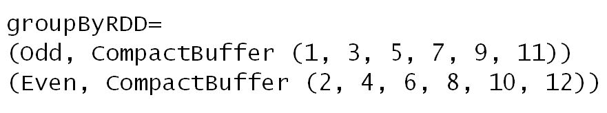

1.  现在我们已经看到了如何编写`groupBy()`，我们转而演示`reduceByKey()`。

1.  为了看到编码上的差异，同时更有效地产生相同的输出，我们设置了一个包含两个字母（即`a`和`b`）的数组，以便我们可以通过对它们进行求和来展示聚合。

```scala
val alphabets = Array("a", "b", "a", "a", "a", "b") // two type only to make it simple 
```

1.  在这一步中，我们使用 Spark 上下文来生成并行化的 RDD：

```scala
val alphabetsPairsRDD = spark.sparkContext.parallelize(alphabets).map(alphabets => (alphabets, 1)) 
```

1.  我们首先应用`groupBy()`函数，使用通常的 Scala 语法`(_+_)`来遍历 RDD 并在按字母类型（即被视为键）进行聚合时进行求和：

```scala
val countsUsingGroup = alphabetsPairsRDD.groupByKey() 
  .map(c => (c._1, c._2.sum)) 
  .collect() 
```

1.  我们首先应用`reduceByKey()`函数，使用通常的 Scala 语法`(_+_)`来遍历 RDD 并在按字母类型（即被视为键）进行聚合时进行求和。

```scala
val countsUsingReduce = alphabetsPairsRDD 
  .reduceByKey(_ + _) 
  .collect()
```

1.  我们输出了结果：

```scala
println("Output for  groupBy") 
countsUsingGroup.foreach(println(_)) 
println("Output for  reduceByKey") 
countsUsingReduce.foreach(println(_)) 
```

运行上述代码后，您将得到以下输出：

```scala
Output for groupBy
(b,2)
(a,4)
Output for reduceByKey
(b,2)
(a,4)  
```

# 它是如何工作的...

在这个例子中，我们创建了从一到十二的数字，并将它们放在三个分区中。然后我们使用简单的模运算将它们分成奇数/偶数。`groupBy()`用于将它们聚合成奇数/偶数两组。这是一个典型的聚合问题，对于 SQL 用户来说应该很熟悉。在本章的后面，我们将使用`DataFrame`重新讨论这个操作，它也利用了 SparkSQL 引擎提供的更好的优化技术。在后面的部分，我们演示了`groupBy()`和`reduceByKey()`的相似之处。我们设置了一个字母数组（即`a`和`b`），然后将它们转换为 RDD。然后我们根据键（即唯一的字母 - 在这种情况下只有两个）对它们进行聚合，并打印出每个组的总数。

# 还有更多...

鉴于 Spark 更倾向于 Dataset/DataFrame 范式而不是低级别的 RDD 编码，我们必须认真考虑在 RDD 上执行`groupBy()`的原因。虽然有合法的情况需要这个操作，但读者们被建议重新构思他们的解决方案，以利用 SparkSQL 子系统及其名为**Catalyst**的优化器。

Catalyst 优化器在构建优化的查询计划时考虑了 Scala 强大的特性，比如**模式匹配**和**准引用**。

+   有关 Scala 模式匹配的文档可在[`docs.scala-lang.org/tutorials/tour/pattern-matching.html`](http://docs.scala-lang.org/tutorials/tour/pattern-matching.html)找到

+   有关 Scala 准引用的文档可在[`docs.scala-lang.org/overviews/quasiquotes/intro.html`](http://docs.scala-lang.org/overviews/quasiquotes/intro.html)找到

运行时效率考虑：`groupBy()`函数按键对数据进行分组。这个操作会导致内部的数据重分配，可能会导致执行时间的爆炸；必须始终优先使用`reduceByKey()`系列的操作，而不是直接使用`groupBy()`方法。`groupBy()`方法由于数据重分配而是一个昂贵的操作。每个组由键和属于该键的项目组成。Spark 不保证与键对应的值的顺序。

有关这两个操作的解释，请参阅 Databricks 知识库博客：

[`databricks.gitbooks.io/databricks-Spark-knowledge-base/content/best_practices/prefer_reducebykey_over_groupbykey.html`](https://databricks.gitbooks.io/databricks-spark-knowledge-base/content/best_practices/prefer_reducebykey_over_groupbykey.html)

# 另请参阅

RDD 下`groupBy()`和`reduceByKey()`操作的文档：

[`spark.apache.org/docs/latest/api/scala/index.html#org.apache.spark.api.java.JavaRDD`](http://spark.apache.org/docs/latest/api/scala/index.html#org.apache.spark.api.java.JavaRDD)

# 使用 zip() API 转换 RDD

在这个示例中，我们探讨了`zip（）`函数。对于我们中的一些人来说，在 Python 或 Scala 中，`zip（）`是一个熟悉的方法，它允许您在应用内函数之前对项目进行配对。使用 Spark，它可以用于便捷地在对之间进行 RDD 算术。从概念上讲，它以这样的方式组合两个 RDD，使得一个 RDD 的每个成员与占据相同位置的第二个 RDD 配对（即，它将两个 RDD 对齐并将成员配对）。

# 如何做...

1.  在 IntelliJ 或您选择的 IDE 中启动一个新项目。确保包含必要的 JAR 文件。

1.  设置程序所在的包位置

```scala
package spark.ml.cookbook.chapter3 
```

1.  导入必要的包

```scala
    import org.apache.spark.sql.SparkSession 
```

1.  导入设置`log4j`日志级别的包。这一步是可选的，但我们强烈建议这样做（随着开发周期的推移，适当更改级别）。

```scala
import org.apache.log4j.Logger 
import org.apache.log4j.Level 
```

1.  将日志级别设置为警告和错误，以减少输出。有关包要求，请参阅上一步。

```scala
Logger.getLogger("org").setLevel(Level.ERROR) 
Logger.getLogger("akka").setLevel(Level.ERROR) 
```

1.  设置 Spark 上下文和应用程序参数，以便 Spark 可以运行。

```scala
val spark = SparkSession 
.builder 
.master("local[*]") 
.appName("myRDD") 
.config("Spark.sql.warehouse.dir", ".") 
.getOrCreate() 
```

1.  为示例设置数据结构和 RDD。在这个例子中，我们从`Array[]`创建了两个 RDD，并让 Spark 决定分区的数量（即`parallize（）`方法中的第二个参数未设置）。

```scala
val SignalNoise: Array[Double] = Array(0.2,1.2,0.1,0.4,0.3,0.3,0.1,0.3,0.3,0.9,1.8,0.2,3.5,0.5,0.3,0.3,0.2,0.4,0.5,0.9,0.1) 
val SignalStrength: Array[Double] = Array(6.2,1.2,1.2,6.4,5.5,5.3,4.7,2.4,3.2,9.4,1.8,1.2,3.5,5.5,7.7,9.3,1.1,3.1,2.1,4.1,5.1) 
val parSN=spark.sparkContext.parallelize(SignalNoise) // parallelized signal noise RDD 
val parSS=spark.sparkContext.parallelize(SignalStrength)  // parallelized signal strength 
```

1.  我们将`zip（）`函数应用于 RDD，以演示转换。在这个例子中，我们使用 mod 函数将分区 RDD 的范围标记为奇数/偶数。我们使用`zip（）`函数将两个 RDD（SignalNoiseRDD 和 SignalStrengthRDD）中的元素配对，以便我们可以应用`map（）`函数并计算它们的比率（噪声与信号比）。我们可以使用这种技术执行几乎所有涉及两个 RDD 的个体成员的算术或非算术操作。

1.  两个 RDD 成员的配对作为元组或行。由`zip（）`创建的对的个体成员可以通过它们的位置（例如`._1`和`._2`）访问

```scala
val zipRDD= parSN.zip(parSS).map(r => r._1 / r._2).collect() 
println("zipRDD=") 
zipRDD.foreach(println) 
```

运行上述代码后，您将获得以下输出：

```scala
zipRDD=
0.03225806451612903
1.0
0.08333333333333334
0.0625
0.05454545454545454  
```

# 它是如何工作的...

在这个例子中，我们首先设置了两个代表信号噪声和信号强度的数组。它们只是一组我们可以从 IoT 平台接收到的测量数字。然后，我们继续配对这两个单独的数组，使每个成员看起来就像它们最初被输入为一对（x，y）。然后，我们继续分割这对，并使用以下代码片段产生噪声到信号比：

```scala
val zipRDD= parSN.zip(parSS).map(r => r._1 / r._2) 
```

`zip（）`方法有许多涉及分区的变体。开发人员应熟悉`zip（）`方法与分区的各种变体（例如`zipPartitions`）。

# 另请参阅

+   RDD 下`zip（）`和`zipPartitions（）`操作的文档可在[`spark.apache.org/docs/latest/api/scala/index.html#org.apache.spark.api.java.JavaRDD`](http://spark.apache.org/docs/latest/api/scala/index.html#org.apache.spark.api.java.JavaRDD)找到

# 使用配对键值 RDD 进行连接转换

在这个示例中，我们介绍了`KeyValueRDD`对 RDD 和支持的连接操作，如`join（）`，`leftOuterJoin`和`rightOuterJoin（）`，以及`fullOuterJoin（）`，作为传统和更昂贵的集合操作 API 的替代方法，例如`intersection（）`，`union（）`，`subtraction（）`，`distinct（）`，`cartesian（）`等。

我们将演示`join（）`，`leftOuterJoin`和`rightOuterJoin（）`，以及`fullOuterJoin（）`，以解释键值对 RDD 的强大和灵活性。

```scala
println("Full Joined RDD = ") 
val fullJoinedRDD = keyValueRDD.fullOuterJoin(keyValueCity2RDD) 
fullJoinedRDD.collect().foreach(println(_)) 
```

# 如何做...

1.  为示例设置数据结构和 RDD：

```scala
val keyValuePairs = List(("north",1),("south",2),("east",3),("west",4)) 
val keyValueCity1 = List(("north","Madison"),("south","Miami"),("east","NYC"),("west","SanJose")) 
val keyValueCity2 = List(("north","Madison"),("west","SanJose"))
```

1.  将列表转换为 RDDs：

```scala
val keyValueRDD = spark.sparkContext.parallelize(keyValuePairs) 
val keyValueCity1RDD = spark.sparkContext.parallelize(keyValueCity1) 
val keyValueCity2RDD = spark.sparkContext.parallelize(keyValueCity2) 
```

1.  我们可以访问对 RDD 内部的`keys`和`values`。

```scala
val keys=keyValueRDD.keys 
val values=keyValueRDD.values 
```

1.  我们将`mapValues（）`函数应用于对 RDD，以演示转换。在这个例子中，我们使用 map 函数通过将每个元素加 100 来提升值。这是一种引入数据噪声（即抖动）的常用技术。

```scala
val kvMappedRDD = keyValueRDD.mapValues(_+100) 
kvMappedRDD.collect().foreach(println(_)) 
```

运行上述代码后，您将获得以下输出：

```scala
(north,101)
(south,102)
(east,103)
(west,104)

```

1.  我们将`join()`函数应用于 RDD，以演示转换。我们使用`join()`来连接两个 RDD。我们基于键（即北、南等）连接两个 RDD。

```scala
println("Joined RDD = ") 
val joinedRDD = keyValueRDD.join(keyValueCity1RDD) 
joinedRDD.collect().foreach(println(_)) 
```

运行上述代码后，您将获得以下输出：

```scala
(south,(2,Miami))
(north,(1,Madison))
(west,(4,SanJose))
(east,(3,NYC))
```

1.  我们将`leftOuterJoin()`函数应用于 RDD，以演示转换。`leftOuterjoin`类似于关系左外连接。Spark 用`None`而不是`NULL`来替换成员缺失，这在关系系统中很常见。

```scala
println("Left Joined RDD = ") 
val leftJoinedRDD = keyValueRDD.leftOuterJoin(keyValueCity2RDD) 
leftJoinedRDD.collect().foreach(println(_)) 
```

运行上述代码后，您将获得以下输出：

```scala
(south,(2,None))
(north,(1,Some(Madison)))
(west,(4,Some(SanJose)))
(east,(3,None))

```

1.  我们将应用`rightOuterJoin()`到 RDD，以演示转换。这类似于关系系统中的右外连接。

```scala
println("Right Joined RDD = ") 
val rightJoinedRDD = keyValueRDD.rightOuterJoin(keyValueCity2RDD) 
rightJoinedRDD.collect().foreach(println(_)) 
```

运行上述代码后，您将获得以下输出：

```scala
(north,(Some(1),Madison))
(west,(Some(4),SanJose))  
```

1.  然后，我们将`fullOuterJoin()`函数应用于 RDD，以演示转换。这类似于关系系统中的全外连接。

```scala
val fullJoinedRDD = keyValueRDD.fullOuterJoin(keyValueCity2RDD) 
fullJoinedRDD.collect().foreach(println(_)) 
```

运行上述代码后，您将获得以下输出：

```scala
Full Joined RDD = 
(south,(Some(2),None))
(north,(Some(1),Some(Madison)))
(west,(Some(4),Some(SanJose)))
(east,(Some(3),None))
```

# 工作原理...

在这个示例中，我们声明了三个列表，表示关系表中可用的典型数据，可以使用连接器导入到 Casandra 或 RedShift（这里没有显示以简化示例）。我们使用了三个列表中的两个，表示城市名称（即数据表），并将它们与表示方向（例如，定义表）的第一个列表进行了连接。第一步是定义三个成对值的列表。然后，我们将它们并行化为键值 RDD，以便我们可以在第一个 RDD（即方向）和另外两个表示城市名称的 RDD 之间执行连接操作。我们应用了连接函数到 RDD，以演示转换。

我们演示了`join()`，`leftOuterJoin`和`rightOuterJoin()`，以及`fullOuterJoin()`，以展示与键值对 RDD 结合时的强大和灵活性。

# 还有更多...

`join()`及其在 RDD 下的变体的文档可在[`spark.apache.org/docs/latest/api/scala/index.html#org.apache.spark.api.java.JavaRDD`](http://spark.apache.org/docs/latest/api/scala/index.html#org.apache.spark.api.java.JavaRDD)上找到。

# 使用配对键值 RDD 进行减少和分组转换

在这个示例中，我们探讨了减少和按键分组。`reduceByKey()`和`groupbyKey()`操作比`reduce()`和`groupBy()`更有效，通常更受欢迎。这些函数提供了方便的设施，以较少的洗牌来聚合值并按键组合，这在大型数据集上是有问题的。

# 如何做...

1.  在 IntelliJ 或您选择的 IDE 中启动一个新项目。确保包含必要的 JAR 文件。

1.  设置程序所在的软件包位置

```scala
package spark.ml.cookbook.chapter3
```

1.  导入必要的软件包

```scala
import org.apache.spark.sql.SparkSession 
```

1.  导入用于设置`log4j`日志级别的软件包。这一步是可选的，但我们强烈建议这样做（随着开发周期的推移，适当更改级别）。

```scala
import org.apache.log4j.Logger 
import org.apache.log4j.Level 
```

1.  将日志级别设置为警告和错误，以减少输出。请参阅上一步的软件包要求：

```scala
Logger.getLogger("org").setLevel(Level.ERROR) 
Logger.getLogger("akka").setLevel(Level.ERROR)
```

1.  设置 Spark 上下文和应用程序参数，以便 Spark 可以运行。

```scala
val spark = SparkSession 
  .builder 
  .master("local[*]") 
  .appName("myRDD") 
  .config("Spark.sql.warehouse.dir", ".") 
  .getOrCreate() 
```

1.  设置示例的数据结构和 RDD：

```scala
val signaltypeRDD = spark.sparkContext.parallelize(List(("Buy",1000),("Sell",500),("Buy",600),("Sell",800))) 
```

1.  我们应用`groupByKey()`来演示转换。在这个例子中，我们在分布式环境中将所有买入和卖出信号分组在一起。

```scala
val signaltypeRDD = spark.sparkContext.parallelize(List(("Buy",1000),("Sell",500),("Buy",600),("Sell",800))) 
val groupedRDD = signaltypeRDD.groupByKey() 
groupedRDD.collect().foreach(println(_)) 
```

运行上述代码后，您将获得以下输出：

```scala
Group By Key RDD = 
(Sell, CompactBuffer(500, 800))
(Buy, CompactBuffer(1000, 600))
```

1.  我们将`reduceByKey()`函数应用于 RDD 的一对，以演示转换。在这个例子中，函数是为买入和卖出信号的总成交量求和。`(_+_)`的 Scala 表示法简单地表示一次添加两个成员，并从中产生单个结果。就像`reduce()`一样，我们可以应用任何函数（即对于简单函数的内联和对于更复杂情况的命名函数）。

```scala
println("Reduce By Key RDD = ") 
val reducedRDD = signaltypeRDD.reduceByKey(_+_) 
reducedRDD.collect().foreach(println(_))   
```

运行上述代码后，您将获得以下输出：

```scala
Reduce By Key RDD = 
(Sell,1300)
(Buy,1600)  
```

# 工作原理...

在这个例子中，我们声明了一个项目列表，表示出售或购买的物品及其相应的价格（即典型的商业交易）。然后我们使用 Scala 的简写符号`(_+_)`来计算总和。在最后一步中，我们为每个键组（即`Buy`或`Sell`）提供了总和。键-值 RDD 是一个强大的构造，可以减少编码，同时提供将配对值分组到聚合桶中所需的功能。`groupByKey()`和`reduceByKey()`函数模拟了相同的聚合功能，而`reduceByKey()`由于在组装最终结果时数据洗牌较少，因此更有效。

# 另见

有关 RDD 下`groupByKey()`和`reduceByKey()`操作的文档可在[`spark.apache.org/docs/latest/api/scala/index.html#org.apache.spark.api.java.JavaRDD`](http://spark.apache.org/docs/latest/api/scala/index.html#org.apache.spark.api.java.JavaRDD)找到。

# 从 Scala 数据结构创建 DataFrames

在这个配方中，我们探讨了`DataFrame` API，它提供了比 RDD 更高级的抽象级别，用于处理数据。该 API 类似于 R 和 Python 数据框架工具（pandas）。

`DataFrame`简化了编码，并允许您使用标准 SQL 来检索和操作数据。Spark 保留了有关 DataFrames 的附加信息，这有助于 API 轻松地操作框架。每个`DataFrame`都将有一个模式（可以从数据中推断或显式定义），这使我们可以像查看 SQL 表一样查看框架。SparkSQL 和 DataFrame 的秘密武器是，催化剂优化器将在幕后工作，通过重新排列管道中的调用来优化访问。

# 如何做...

1.  在 IntelliJ 或您选择的 IDE 中启动一个新项目。确保包含必要的 JAR 文件。

1.  设置程序将驻留的包位置：

```scala
package spark.ml.cookbook.chapter3 
```

1.  设置与 DataFrames 和所需数据结构相关的导入，并根据需要创建 RDD：

```scala
import org.apache.spark.sql._
```

1.  导入设置`log4j`日志级别的包。这一步是可选的，但我们强烈建议这样做（随着开发周期的推移，适当更改级别）。

```scala
import org.apache.log4j.Logger 
import org.apache.log4j.Level 
```

1.  将日志级别设置为警告和错误，以减少输出。有关包要求，请参阅上一步。

```scala
Logger.getLogger("org").setLevel(Level.ERROR) 
Logger.getLogger("akka").setLevel(Level.ERROR) 
```

1.  设置 Spark 上下文和应用程序参数，以便 Spark 可以运行。

```scala
val spark = SparkSession 
  .builder 
  .master("local[*]") 
  .appName("myDataFrame") 
  .config("Spark.sql.warehouse.dir", ".") 
  .getOrCreate() 
```

1.  我们设置了 Scala 数据结构作为两个`List()`对象和一个序列（即`Seq()`）。然后我们将`List`结构转换为 RDD，以便进行下一步的 DataFrame 转换：

```scala
val signaltypeRDD = spark.sparkContext.parallelize(List(("Buy",1000),("Sell",500),("Buy",600),("Sell",800))) 
val numList = List(1,2,3,4,5,6,7,8,9) 
val numRDD = spark.sparkContext.parallelize(numList) 
val myseq = Seq( ("Sammy","North",113,46.0),("Sumi","South",110,41.0), ("Sunny","East",111,51.0),("Safron","West",113,2.0 )) 
```

1.  我们使用`parallelize()`方法将一个列表转换为 RDD，并使用 RDD 的`toDF()`方法将其转换为 DataFrame。`show()`方法允许我们查看 DataFrame，这类似于 SQL 表。

```scala
val numDF = numRDD.toDF("mylist") 
numDF.show 
```

在运行上述代码时，您将获得以下输出：

```scala
+------+
|mylist|
+------+
|     1|
|     2|
|     3|
|     4|
|     5|
|     6|
|     7|
|     8|
|     9|
+------+
```

1.  在下面的代码片段中，我们使用`createDataFrame()`显式地从一个通用的 Scala **Seq**（**Sequence**）数据结构创建一个 DataFrame，同时命名列。

```scala
val df1 = spark.createDataFrame(myseq).toDF("Name","Region","dept","Hours") 
```

1.  在接下来的两个步骤中，我们使用`show()`方法查看内容，然后继续使用`printSchema()`来显示基于类型推断的模式。在这个例子中，DataFrame 正确地识别了 Seq 中的整数和双精度作为两列数字的有效类型。

```scala
df1.show() 
df1.printSchema() 
```

在运行上述代码时，您将获得以下输出：

```scala
+------+------+----+-----+
|  Name|Region|dept|Hours|
+------+------+----+-----+
| Sammy| North| 113| 46.0|
|  Sumi| South| 110| 41.0|
| Sunny|  East| 111| 51.0|
|Safron|  West| 113|  2.0|
+------+------+----+-----+

root
|-- Name: string (nullable = true)
|-- Region: string (nullable = true)
|-- dept: integer (nullable = false)
|-- Hours: double (nullable = false) 

```

# 它是如何工作的...

在这个配方中，我们取了两个列表和一个 Seq 数据结构，并将它们转换为 DataFrame，并使用`df1.show()`和`df1.printSchema()`来显示表的内容和模式。

DataFrames 可以从内部和外部源创建。就像 SQL 表一样，DataFrames 有与之关联的模式，可以通过 Scala case 类或`map()`函数来推断或显式定义。

# 还有更多...

为了确保完整性，我们包括了我们在 Spark 2.0.0 之前使用的`import`语句来运行代码（即 Spark 1.5.2）：

```scala
import org.apache.spark._
import org.apache.spark.rdd.RDD 
import org.apache.spark.sql.SQLContext 
import org.apache.spark.mllib.linalg 
import org.apache.spark.util 
import Array._
import org.apache.spark.sql._
import org.apache.spark.sql.types 
import org.apache.spark.sql.DataFrame 
import org.apache.spark.sql.Row; 
import org.apache.spark.sql.types.{ StructType, StructField, StringType}; 
```

# 另请参阅

DataFrame 的文档可在[`spark.apache.org/docs/latest/sql-programming-guide.html`](https://spark.apache.org/docs/latest/sql-programming-guide.html)上找到。

如果您发现隐式转换存在任何问题，请仔细检查是否已包含了隐式导入语句。

Spark 2.0 的示例代码：

```scala
import sqlContext.implicits 
```

# 在没有使用 SQL 的情况下以编程方式操作 DataFrame

在这个配方中，我们探讨如何仅通过代码和方法调用来操作 DataFrame（而不使用 SQL）。DataFrame 有自己的方法，允许您使用编程方法执行类似 SQL 的操作。我们演示了一些这些命令，比如`select()`、`show()`和`explain()`，以表明 DataFrame 本身能够在不使用 SQL 的情况下处理和操作数据。

# 如何做...

1.  在 IntelliJ 或您选择的 IDE 中启动一个新项目。确保包含必要的 JAR 文件。

1.  设置程序所在的包位置

```scala
package spark.ml.cookbook.chapter3 
```

1.  设置与 DataFrame 相关的导入和所需的数据结构，并根据需要创建 RDDs

```scala
import org.apache.spark.sql._
```

1.  导入设置`log4j`日志级别的包。这一步是可选的，但我们强烈建议这样做（随着开发周期的推移，适当更改级别）。

```scala
import org.apache.log4j.Logger 
import org.apache.log4j.Level 
```

1.  设置日志级别为警告和错误，以减少输出。有关包要求，请参阅上一步。

```scala
Logger.getLogger("org").setLevel(Level.ERROR) 
Logger.getLogger("akka").setLevel(Level.ERROR) 
```

1.  设置 Spark 上下文和应用程序参数，以便 Spark 可以运行。

```scala
val spark = SparkSession 
  .builder 
  .master("local[*]") 
  .appName("myDataFrame") 
  .config("Spark.sql.warehouse.dir", ".") 
  .getOrCreate() 
```

1.  我们从外部来源创建了一个 RDD，这是一个逗号分隔的文本文件：

```scala
val customersRDD = spark.sparkContext.textFile("../data/sparkml2/chapter3/customers13.txt") //Customer file
```

1.  这是客户数据文件的快速查看

```scala
Customer data file    1101,susan,nyc,23 1204,adam,chicago,76
1123,joe,london,65
1109,tiffany,chicago,20

```

1.  在为相应的客户数据文件创建 RDD 之后，我们继续使用`map()`函数从 RDD 中显式解析和转换数据类型。在这个例子中，我们要确保最后一个字段（即年龄）表示为整数。

```scala
val custRDD = customersRDD.map { 
  line => val cols = line.trim.split(",") 
    (cols(0).toInt, cols(1), cols(2), cols(3).toInt) 
} 
```

1.  在第三步中，我们使用`toDF()`调用将 RDD 转换为 DataFrame。

```scala
    val custDF = custRDD.toDF("custid","name","city","age") 
```

1.  一旦 DataFrame 准备好，我们希望快速显示内容以进行视觉验证，并打印和验证模式。

```scala
custDF.show() 
custDF.printSchema() 
```

运行上述代码后，您将得到以下输出：

```scala
+------+-------+-------+---+
|custid|   name|   city|age|
+------+-------+-------+---+
|  1101|  susan|    nyc| 23|
|  1204|   adam|chicago| 76|
|  1123|    joe| london| 65|
|  1109|tiffany|chicago| 20|
+------+-------+-------+---+

root
|-- custid: integer (nullable = false)
|-- name: string (nullable = true)
|-- city: string (nullable = true)
|-- age: integer (nullable = false)
```

1.  在 DataFrame 准备好并经过检查后，我们继续演示通过`show()`、`select()`、`sort()`、`groupBy()`和`explain()`API 对 DataFrame 进行访问和操作。

1.  我们使用`filter()`方法来列出年龄超过 25 岁的客户：

```scala
custDF.filter("age > 25.0").show() 
```

运行上述代码后，您将得到以下输出：

```scala
+------+----+-------+---+ 
|custid|name|   city|age| 
+------+----+-------+---+ 
|  1204|adam|chicago| 76| 
|  1123| joe| london| 65| 
+------+----+-------+---+ 
```

1.  我们使用`select()`方法来显示客户的姓名。

```scala
custDF.select("name").show() 
```

运行上述代码后，您将得到以下输出。

```scala
+-------+ 
|   name| 
+-------+ 
|  susan| 
|   adam| 
|    joe| 
|tiffany| 
+-------+ 
```

1.  我们使用`select()`来列出多个列：

```scala
custDF.select("name","city").show() 
```

运行上述代码后，您将得到以下输出：

```scala
    +-------+-------+
    |   name|   city|
    +-------+-------+
    |  susan|    nyc|
    |   adam|chicago|
    |    joe| london|
    |tiffany|chicago|
    +-------+-------+
```

1.  我们使用另一种语法来显示和引用 DataFrame 中的字段：

```scala
custDF.select(custDF("name"),custDF("city"),custDF("age")).show() 
```

运行上述代码后，您将得到以下输出：

```scala
+-------+-------+---+
|   name|   city|age|
+-------+-------+---+
|  susan|    nyc| 23|
|   adam|chicago| 76|
|    joe| london| 65|
|tiffany|chicago| 20|
+-------+-------+---+  
```

1.  使用`select()`和谓词，列出年龄小于 50 岁的客户的姓名和城市：

```scala
custDF.select(custDF("name"),custDF("city"),custDF("age") <50).show() 
```

运行上述代码后，您将得到以下输出：

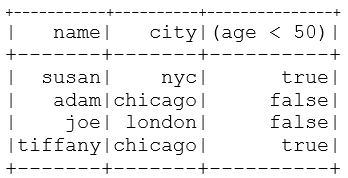

1.  我们使用`sort()`和`groupBy()`来按客户所在城市对客户进行排序和分组：

```scala
custDF.sort("city").groupBy("city").count().show() 
```

运行上述代码后，您将得到以下输出。

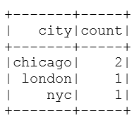

1.  我们还可以要求执行计划：这个命令在我们使用 SQL 来访问和操作 DataFrame 的即将到来的配方中将更加相关。

```scala
custDF.explain()  
```

运行上述代码后，您将得到以下输出：

```scala
== Physical Plan ==
TungstenProject [_1#10 AS custid#14,_2#11 AS name#15,_3#12 AS city#16,_4#13 AS age#17]
 Scan PhysicalRDD[_1#10,_2#11,_3#12,_4#13]
```

# 它是如何工作的...

在这个例子中，我们从文本文件中加载数据到 RDD，然后使用`.toDF()`API 将其转换为 DataFrame 结构。然后，我们使用内置方法如`select()`、`filter()`、`show()`和`explain()`来模拟 SQL 查询，这些方法帮助我们通过 API 程序化地探索数据（无需 SQL）。`explain()`命令显示查询计划，这对于消除瓶颈非常有用。

DataFrame 提供了多种数据整理方法。

对于那些熟悉 DataFrame API 和来自 R 的包（[`cran.r-project.org`](https://cran.r-project.org)）如 dplyr 或旧版本的人，我们有一个编程 API，其中包含一系列广泛的方法，让您可以通过 API 进行所有数据整理。

对于那些更喜欢使用 SQL 的人，您可以简单地使用 SQL 来检索和操作数据，就像使用 Squirrel 或 Toad 查询数据库一样。

# 还有更多...

为了确保完整性，我们包括了我们在 Spark 2.0.0 之前使用的`import`语句来运行代码（即 Spark 1.5.2）：

```scala
import org.apache.spark._

 import org.apache.spark.rdd.RDD
 import org.apache.spark.sql.SQLContext
 import org.apache.spark.mllib.linalg._
 import org.apache.spark.util._
 import Array._
 import org.apache.spark.sql._
 import org.apache.spark.sql.types._
 import org.apache.spark.sql.DataFrame
 import org.apache.spark.sql.Row;
 import org.apache.spark.sql.types.{ StructType, StructField, StringType};
```

# 参见

DataFrame 的文档可在[`spark.apache.org/docs/latest/sql-programming-guide.html`](https://spark.apache.org/docs/latest/sql-programming-guide.html)找到。

如果您发现隐式转换有任何问题，请仔细检查是否已包含了隐式`import`语句。

Spark 2.0 的示例`import`语句：

```scala
import sqlContext.implicits._
```

# 从外部源加载 DataFrame 和设置

在这个示例中，我们使用 SQL 来进行数据操作。Spark 提供的既实用又 SQL 接口的方法在生产环境中非常有效，我们不仅需要机器学习，还需要使用 SQL 访问现有数据源，以确保与现有基于 SQL 的系统的兼容性和熟悉度。DataFrame 与 SQL 使得在现实生活中进行集成的过程更加优雅。

# 如何做...

1.  在 IntelliJ 或您选择的 IDE 中启动一个新项目。确保包含必要的 JAR 文件。

1.  设置程序所在的包位置：

```scala
package spark.ml.cookbook.chapter3
```

1.  设置与 DataFrame 相关的导入和所需的数据结构，并根据需要创建 RDD：

```scala
import org.apache.spark.sql._
```

1.  导入用于设置`log4j`日志级别的包。这一步是可选的，但我们强烈建议这样做（随着开发周期的推移，适当更改级别）。

```scala
import org.apache.log4j.Logger
import org.apache.log4j.Level
```

1.  将日志级别设置为警告和`Error`以减少输出。有关包要求，请参阅上一步：

```scala
Logger.getLogger("org").setLevel(Level.ERROR)
Logger.getLogger("akka").setLevel(Level.ERROR)
```

1.  设置 Spark 上下文和应用程序参数，以便 Spark 可以运行。

```scala
val spark = SparkSession
 .builder
 .master("local[*]")
 .appName("myDataFrame")
 .config("Spark.sql.warehouse.dir", ".")
 .getOrCreate()
```

1.  我们创建与`customer`文件对应的 DataFrame。在这一步中，我们首先创建一个 RDD，然后使用`toDF()`将 RDD 转换为 DataFrame 并命名列。

```scala
val customersRDD = spark.sparkContext.textFile("../data/sparkml2/chapter3/customers13.txt") //Customer file 

val custRDD = customersRDD.map {
   line => val cols = line.trim.split(",")
     (cols(0).toInt, cols(1), cols(2), cols(3).toInt) 
} 
val custDF = custRDD.toDF("custid","name","city","age")   
```

客户数据内容供参考：

```scala
custDF.show()
```

运行上述代码后，您将得到以下输出：

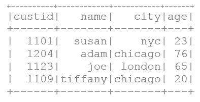

1.  我们创建与`product`文件对应的 DataFrame。在这一步中，我们首先创建一个 RDD，然后使用`toDF()`将 RDD 转换为 DataFrame 并命名列。

```scala
val productsRDD = spark.sparkContext.textFile("../data/sparkml2/chapter3/products13.txt") //Product file
 val prodRDD = productsRDD.map {
     line => val cols = line.trim.split(",")
       (cols(0).toInt, cols(1), cols(2), cols(3).toDouble) 
}  
```

1.  我们将`prodRDD`转换为 DataFrame：

```scala
val prodDF = prodRDD.toDF("prodid","category","dept","priceAdvertised")
```

1.  使用 SQL select，我们显示表的内容。

产品数据内容：

```scala
prodDF.show()
```

运行上述代码后，您将得到以下输出：

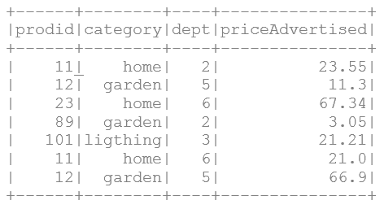

1.  我们创建与`sales`文件对应的 DataFrame。在这一步中，我们首先创建一个 RDD，然后使用`toDF()`将 RDD 转换为 DataFrame 并命名列。

```scala
val salesRDD = spark.sparkContext.textFile("../data/sparkml2/chapter3/sales13.txt") *//Sales file* val saleRDD = salesRDD.map {
     line => val cols = line.trim.split(",")
       (cols(0).toInt, cols(1).toInt, cols(2).toDouble)
}
```

1.  我们将`saleRDD`转换为 DataFrame：

```scala
val saleDF = saleRDD.toDF("prodid", "custid", "priceSold")  
```

1.  我们使用 SQL select 来显示表。

销售数据内容：

```scala
saleDF.show()
```

运行上述代码后，您将得到以下输出：

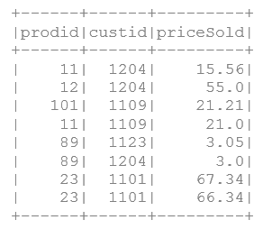

1.  我们打印客户、产品和销售 DataFrame 的模式，以验证列定义和类型转换后的模式：

```scala
custDF.printSchema()
productDF.printSchema()
salesDF. printSchema()
```

运行上述代码后，您将得到以下输出：

```scala
root
 |-- custid: integer (nullable = false)
 |-- name: string (nullable = true)
 |-- city: string (nullable = true)
 |-- age: integer (nullable = false)
root
 |-- prodid: integer (nullable = false)
 |-- category: string (nullable = true)
 |-- dept: string (nullable = true)
 |-- priceAdvertised: double (nullable = false)
root
 |-- prodid: integer (nullable = false)
 |-- custid: integer (nullable = false)
 |-- priceSold: double (nullable = false)
```

# 工作原理...

在此示例中，我们首先将数据加载到 RDD 中，然后使用`toDF()`方法将其转换为 DataFrame。DataFrame 非常擅长推断类型，但有时需要手动干预。我们在创建 RDD 后（采用延迟初始化范式）使用`map()`函数来处理数据，可以进行类型转换，也可以调用更复杂的用户定义函数（在`map()`方法中引用）进行转换或数据整理。最后，我们使用`show()`和`printSchema()`来检查三个 DataFrame 的模式。

# 还有更多...

为确保完整性，我们包括了在 Spark 2.0.0 之前使用的`import`语句来运行代码（即 Spark 1.5.2）：

```scala
import org.apache.spark._
 import org.apache.spark.rdd.RDD
 import org.apache.spark.sql.SQLContext
 import org.apache.spark.mllib.linalg._
 import org.apache.spark.util._
 import Array._
 import org.apache.spark.sql._
 import org.apache.spark.sql.types._
 import org.apache.spark.sql.DataFrame
 import org.apache.spark.sql.Row;
 import org.apache.spark.sql.types.{ StructType, StructField, StringType};
```

# 另请参阅

DataFrame 的文档可在[`spark.apache.org/docs/latest/sql-programming-guide.html`](https://spark.apache.org/docs/latest/sql-programming-guide.html)找到。

如果您发现隐式转换存在问题，请仔细检查是否已包含了隐式`import`语句。

Spark 1.5.2 的示例`import`语句：

```scala
 import sqlContext.implicits._
```

# 使用标准 SQL 语言的 DataFrames - SparkSQL

在本示例中，我们演示了如何使用 DataFrame 的 SQL 功能执行基本的 CRUD 操作，但并没有限制您使用 Spark 提供的 SQL 接口进行任何所需的复杂操作（即 DML）。

# 如何做...

1.  在 IntelliJ 或您选择的 IDE 中启动新项目。确保包含必要的 JAR 文件。

1.  设置程序将驻留的包位置

```scala
package spark.ml.cookbook.chapter3
```

1.  设置与 DataFrames 和所需数据结构相关的导入，并根据需要创建 RDDs

```scala
import org.apache.spark.sql._
```

1.  导入设置`log4j`日志级别的包。这一步是可选的，但我们强烈建议这样做（随着开发周期的推进，适当更改级别）。

```scala
import org.apache.log4j.Logger
 import org.apache.log4j.Level
```

1.  设置日志级别为警告和`ERROR`，以减少输出。有关包要求，请参见上一步。

```scala
Logger.getLogger("org").setLevel(Level.ERROR)
Logger.getLogger("akka").setLevel(Level.ERROR)
```

1.  设置 Spark 上下文和应用程序参数，以便 Spark 可以运行。

```scala
val spark = SparkSession
 .builder
 .master("local[*]")
 .appName("myDataFrame")
 .config("Spark.sql.warehouse.dir", ".")
 .getOrCreate()
```

1.  我们将使用上一个示例中创建的 DataFrames 来演示 DataFrame 的 SQL 功能。您可以参考上一步了解详情。

```scala
a. customerDF with columns: "custid","name","city","age" b. productDF with Columns: "prodid","category","dept","priceAdvertised" c. saleDF with columns: "prodid", "custid", "priceSold"

val customersRDD =spark.sparkContext.textFile("../data/sparkml2/chapter3/customers13.txt") //Customer file

val custRDD = customersRDD.map {
   line => val cols = line.trim.split(",")
     (cols(0).toInt, cols(1), cols(2), cols(3).toInt)
}
val custDF = custRDD.toDF("custid","name","city","age") 
val productsRDD = spark.sparkContext.textFile("../data/sparkml2/chapter3/products13.txt") //Product file

val prodRDD = productsRDD.map {
     line => val cols = line.trim.split(",")
       (cols(0).toInt, cols(1), cols(2), cols(3).toDouble)       } 

val prodDF = prodRDD.toDF("prodid","category","dept","priceAdvertised")

val salesRDD = spark.sparkContext.textFile("../data/sparkml2/chapter3/sales13.txt") *//Sales file* val saleRDD = salesRDD.map {
     line => val cols = line.trim.split(",")
       (cols(0).toInt, cols(1).toInt, cols(2).toDouble)
   }
val saleDF = saleRDD.toDF("prodid", "custid", "priceSold")
```

1.  在我们可以通过 SQL 对 DataFrame 进行查询之前，我们必须将 DataFrame 注册为临时表，以便 SQL 语句可以在不使用任何 Scala/Spark 语法的情况下引用它。这一步可能会让许多初学者感到困惑，因为我们并没有创建任何表（临时或永久），但`registerTempTable()`（Spark 2.0 之前）和`createOrReplaceTempView()`（Spark 2.0+）的调用在 SQL 中创建了一个名称，SQL 语句可以在其中引用，而无需额外的 UDF 或任何特定领域的查询语言。简而言之，Spark 在后台保留了额外的元数据（`registerTempTable()`调用），这有助于在执行阶段进行查询。

1.  创建名为`customers`的`CustDf` DataFrame：

```scala
custDF.createOrReplaceTempView("customers")
```

1.  创建名为`product`的`prodDf` DataFrame：

```scala
prodDF.createOrReplaceTempView("products")
```

1.  创建名为`sales`的`saleDf` DataFrame，以便 SQL 语句能够识别：

```scala
saleDF.createOrReplaceTempView("sales")
```

1.  现在一切准备就绪，让我们演示 DataFrames 与标准 SQL 的强大功能。对于那些不愿意使用 SQL 的人来说，编程方式始终是一个选择。

1.  在此示例中，我们演示了如何从 customers 表中选择列（实际上并不是 SQL 表，但您可以将其抽象为 SQL 表）。

```scala
val query1DF = spark.sql ("select custid, name from customers")
 query1DF.show()
```

运行上述代码后，您将获得以下输出。

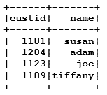

1.  从 customer 表中选择多列：

```scala
val query2DF = spark.sql("select prodid, priceAdvertised from products")
 query2DF.show()
```

运行上述代码后，您将获得以下输出。

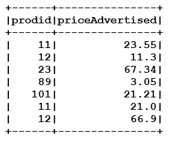

1.  我们打印了 customer、product 和 sales DataFrames 的模式，以便在列定义和类型转换后进行验证：

```scala
val query3DF = spark.sql("select sum(priceSold) as totalSold from sales")
query3DF.show()
```

运行上述代码后，您将获得以下输出。

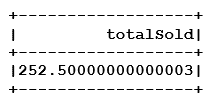

1.  在这个示例中，我们连接销售和产品表，并列出所有购买了打折超过 20%的产品的客户。这个 SQL 连接了销售和产品表，然后使用一个简单的公式来找到以深度折扣出售的产品。重申一下，DataFrame 的关键方面是我们使用标准 SQL 而没有任何特殊的语法。

```scala
val query4DF = spark.sql("select custid, priceSold, priceAdvertised from sales s, products p where (s.priceSold/p.priceAdvertised < .80) and p.prodid = s.prodid")
query4DF.show()
```

运行上述代码后，您将得到以下输出。

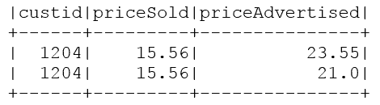

我们可以始终使用`explain()`方法来检查 Spark SQL 用于执行查询的物理查询计划。

```scala
query4DF.explain()
```

运行上述代码后，您将得到以下输出：

```scala
== Physical Plan ==
TungstenProject [custid#30,priceSold#31,priceAdvertised#25]
 Filter ((priceSold#31 / priceAdvertised#25) < 0.8)
 SortMergeJoin [prodid#29], [prodid#22]
 TungstenSort [prodid#29 ASC], false, 0
 TungstenExchange hashpartitioning(prodid#29)
 TungstenProject [_1#26 AS prodid#29,_2#27 AS custid#30,_3#28 AS priceSold#31]
 Scan PhysicalRDD[_1#26,_2#27,_3#28]
 TungstenSort [prodid#22 ASC], false, 0
 TungstenExchange hashpartitioning(prodid#22)
 TungstenProject [_4#21 AS priceAdvertised#25,_1#18 AS prodid#22]
 Scan PhysicalRDD[_1#18,_2#19,_3#20,_4#21]
```

# 它是如何工作的...

使用 SQL 处理 DataFrame 的基本工作流程是首先通过内部 Scala 数据结构或外部数据源填充 DataFrame，然后使用`createOrReplaceTempView()`调用将 DataFrame 注册为类似 SQL 的工件。

当您使用 DataFrame 时，您将获得 Spark 存储的额外元数据的好处（无论是 API 还是 SQL 方法），这在编码和执行过程中都会对您有所帮助。

虽然 RDD 仍然是核心 Spark 的主力军，但趋势是采用 DataFrame 方法，它已经在 Python/Pandas 或 R 等语言中成功展示了其能力。

# 还有更多...

DataFrame 作为表进行注册已经发生了变化。请参考这个：

+   对于 Spark 2.0.0 之前的版本：`registerTempTable()`

+   对于 Spark 版本 2.0.0 及之前：`createOrReplaceTempView()`

在 Spark 2.0.0 之前将 DataFrame 注册为 SQL 表类似的工件：

在我们可以通过 SQL 查询使用 DataFrame 之前，我们必须将 DataFrame 注册为临时表，以便 SQL 语句可以引用它而不需要任何 Scala/Spark 语法。这一步可能会让许多初学者感到困惑，因为我们并没有创建任何表（临时或永久），但是`registerTempTable()`调用在 SQL 领域创建了一个名称，SQL 语句可以引用它而不需要额外的 UDF 或任何特定于领域的查询语言。

+   将`CustDf` DataFrame 注册为 SQL 语句识别为`customers`的名称：

```scala
custDF.registerTempTable("customers")
```

+   将`prodDf` DataFrame 注册为 SQL 语句识别为`product`的名称：

```scala
custDF.registerTempTable("customers")
```

+   将`saleDf` DataFrame 注册为 SQL 语句识别为`sales`的名称：

```scala
custDF.registerTempTable("customers")
```

为了确保完整性，我们包括了我们在 Spark 2.0.0 之前使用的`import`语句来运行代码（即 Spark 1.5.2）：

```scala
import org.apache.spark._

 import org.apache.spark.rdd.RDD
 import org.apache.spark.sql.SQLContext
 import org.apache.spark.mllib.linalg._
 import org.apache.spark.util._
 import Array._
 import org.apache.spark.sql._
 import org.apache.spark.sql.types._
 import org.apache.spark.sql.DataFrame
 import org.apache.spark.sql.Row;
 import org.apache.spark.sql.types.{ StructType, StructField, StringType};
```

# 另请参阅

DataFrame 的文档可在[`spark.apache.org/docs/latest/sql-programming-guide.html`](https://spark.apache.org/docs/latest/sql-programming-guide.html)找到。

如果您遇到隐式转换的问题，请仔细检查是否已经包含了隐式`import`语句。

Spark 1.5.2 的示例`import`语句

```scala
 import sqlContext.implicits._
```

DataFrame 是一个庞大的子系统，值得单独写一本书。它使得规模化的复杂数据操作对 SQL 程序员可用。

# 使用 Scala 序列处理数据集 API

在这个示例中，我们将研究新的 Dataset 以及它如何与*seq* Scala 数据结构一起工作。我们经常看到 ML 库中使用的 LabelPoint 数据结构与 Scala 序列（即 seq 数据结构）之间存在关系，这些数据结构与数据集很好地配合。

数据集被定位为未来的统一 API。重要的是要注意，DataFrame 仍然作为别名`Dataset[Row]`可用。我们已经通过 DataFrame 示例广泛涵盖了 SQL 示例，因此我们将集中精力研究数据集的其他变化。

# 如何做...

1.  在 IntelliJ 或您选择的 IDE 中启动一个新项目。确保包含必要的 JAR 文件。

1.  设置程序所在的包位置

```scala
package spark.ml.cookbook.chapter3
```

1.  导入必要的包以获取对集群的访问以及`Log4j.Logger`以减少 Spark 产生的输出量。

```scala
import org.apache.log4j.{Level, Logger}
import org.apache.spark.sql.SparkSession
```

1.  定义一个 Scala `case class`来对数据进行建模，`Car`类将代表电动和混合动力汽车。

```scala
case class Car(make: String, model: String, price: Double,
style: String, kind: String)
```

1.  让我们创建一个 Scala 序列，并用电动车和混合动力车填充它。

```scala
val *carData* =
*Seq*(
*Car*("Tesla", "Model S", 71000.0, "sedan","electric"),
*Car*("Audi", "A3 E-Tron", 37900.0, "luxury","hybrid"),
*Car*("BMW", "330e", 43700.0, "sedan","hybrid"),
*Car*("BMW", "i3", 43300.0, "sedan","electric"),
*Car*("BMW", "i8", 137000.0, "coupe","hybrid"),
*Car*("BMW", "X5 xdrive40e", 64000.0, "suv","hybrid"),
*Car*("Chevy", "Spark EV", 26000.0, "coupe","electric"),
*Car*("Chevy", "Volt", 34000.0, "sedan","electric"),
*Car*("Fiat", "500e", 32600.0, "coupe","electric"),
*Car*("Ford", "C-Max Energi", 32600.0, "wagon/van","hybrid"),
*Car*("Ford", "Focus Electric", 29200.0, "sedan","electric"),
*Car*("Ford", "Fusion Energi", 33900.0, "sedan","electric"),
*Car*("Hyundai", "Sonata", 35400.0, "sedan","hybrid"),
*Car*("Kia", "Soul EV", 34500.0, "sedan","electric"),
*Car*("Mercedes", "B-Class", 42400.0, "sedan","electric"),
*Car*("Mercedes", "C350", 46400.0, "sedan","hybrid"),
*Car*("Mercedes", "GLE500e", 67000.0, "suv","hybrid"),
*Car*("Mitsubishi", "i-MiEV", 23800.0, "sedan","electric"),
*Car*("Nissan", "LEAF", 29000.0, "sedan","electric"),
*Car*("Porsche", "Cayenne", 78000.0, "suv","hybrid"),
*Car*("Porsche", "Panamera S", 93000.0, "sedan","hybrid"),
*Car*("Tesla", "Model X", 80000.0, "suv","electric"),
*Car*("Tesla", "Model 3", 35000.0, "sedan","electric"),
*Car*("Volvo", "XC90 T8", 69000.0, "suv","hybrid"),
*Car*("Cadillac", "ELR", 76000.0, "coupe","hybrid")
)

```

1.  将输出级别配置为`ERROR`，以减少 Spark 的日志输出。

```scala
   Logger.getLogger("org").setLevel(Level.ERROR)
   Logger.getLogger("akka").setLevel(Level.ERROR)
```

1.  创建一个 SparkSession，以便访问 Spark 集群，包括底层会话对象的属性和函数。

```scala
val spark = SparkSession
.builder
.master("local[*]")
.appName("mydatasetseq")
.config("Spark.sql.warehouse.dir", ".")
.getOrCreate()

```

1.  导入 Spark implicits，只需导入即可添加行为。

```scala
import spark.implicits._
```

1.  接下来，我们将利用 Spark 会话的`createDataset()`方法从汽车数据序列创建一个数据集。

```scala
val cars = spark.createDataset(MyDatasetData.carData) 
// carData is put in a separate scala object MyDatasetData
```

1.  让我们打印出结果，确认我们的方法调用将序列转换为 Spark 数据集。

```scala
infecars.show(false)
+----------+--------------+--------+---------+--------+
|make |model |price |style |kind |
```

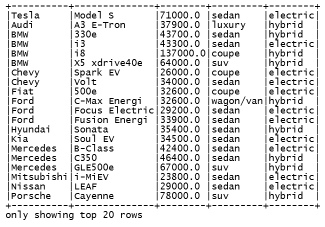

1.  打印出数据集的隐含列名。现在我们可以使用类属性名称作为列名。

```scala
cars.columns.foreach(println)
make
model
price
style
kind
```

1.  让我们展示自动生成的模式，并验证推断出的数据类型。

```scala
println(cars.schema)
StructType(StructField(make,StringType,true), StructField(model,StringType,true), StructField(price,DoubleType,false), StructField(style,StringType,true), StructField(kind,StringType,true))
```

1.  最后，我们将按价格过滤数据集，引用`Car`类属性价格作为列，并展示结果。

```scala
cars.filter(cars("price") > 50000.00).show()
```

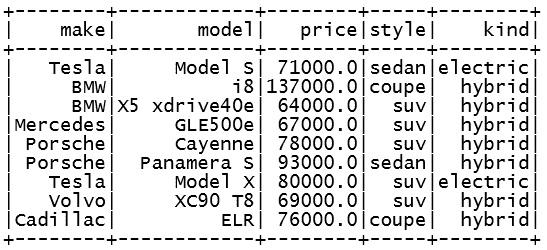

1.  我们通过停止 Spark 会话来关闭程序。

```scala
spark.stop()
```

# 工作原理...

在这个示例中，我们介绍了 Spark 的数据集功能，这个功能首次出现在 Spark 1.6 中，并在随后的版本中进一步完善。首先，我们使用 Spark 会话的`createDataset()`方法从 Scala 序列创建了一个数据集实例。接下来，我们打印出关于生成的数据集的元信息，以确保创建的过程符合预期。最后，我们使用 Spark SQL 的片段来按价格列过滤数据集，找出价格大于$50,000.00 的数据，并展示执行的最终结果。

# 还有更多...

数据集有一个名为[DataFrame](https://spark.apache.org/docs/2.0.0/api/scala/org/apache/spark/sql/package.html#DataFrame=org.apache.spark.sql.Dataset%5Borg.apache.spark.sql.Row%5D)的视图，它是一个未命名的[行](https://spark.apache.org/docs/2.0.0/api/scala/org/apache/spark/sql/Row.html)数据集。数据集仍然保留了 RDD 的所有转换能力，比如`filter()`、`map()`、`flatMap()`等等。这是我们发现数据集易于使用的原因之一，如果我们已经使用 RDD 在 Spark 中编程。

# 另请参阅

+   数据集的文档可以在[`spark.apache.org/docs/latest/api/scala/index.html#org.apache.spark.sql.Dataset`](http://spark.apache.org/docs/latest/api/scala/index.html#org.apache.spark.sql.Dataset)找到。

+   KeyValue 分组的数据集可以在[`spark.apache.org/docs/latest/api/scala/index.html#org.apache.spark.sql.KeyValueGroupedDataset`](http://spark.apache.org/docs/latest/api/scala/index.html#org.apache.spark.sql.KeyValueGroupedDataset)找到。

+   关系分组的数据集可以在[`spark.apache.org/docs/latest/api/scala/index.html#org.apache.spark.sql.RelationalGroupedDataset`](http://spark.apache.org/docs/latest/api/scala/index.html#org.apache.spark.sql.RelationalGroupedDataset)找到。

# 从 RDD 创建和使用数据集，然后再转回去

在这个示例中，我们探讨了如何使用 RDD 并与数据集交互，以构建多阶段的机器学习流水线。尽管数据集（在概念上被认为是具有强类型安全性的 RDD）是未来的发展方向，但您仍然必须能够与其他机器学习算法或返回/操作 RDD 的代码进行交互，无论是出于传统还是编码的原因。在这个示例中，我们还探讨了如何创建和转换数据集到 RDD，然后再转回去。

# 如何做...

1.  在 IntelliJ 或您选择的 IDE 中启动一个新项目。确保包含必要的 JAR 文件。

1.  设置程序所在的包位置：

```scala
package spark.ml.cookbook.chapter3
```

1.  导入 Spark 会话所需的包，以便访问集群和`Log4j.Logger`，以减少 Spark 产生的输出量。

```scala
import org.apache.log4j.{Level, Logger}
import org.apache.spark.sql.SparkSession
```

1.  定义一个 Scala case 类来建模处理数据。

```scala
case class Car(make: String, model: String, price: Double,
style: String, kind: String)
```

1.  让我们创建一个 Scala 序列，并用电动车和混合动力车填充它。

```scala
val carData =
Seq(
Car("Tesla", "Model S", 71000.0, "sedan","electric"),
Car("Audi", "A3 E-Tron", 37900.0, "luxury","hybrid"),
Car("BMW", "330e", 43700.0, "sedan","hybrid"),
Car("BMW", "i3", 43300.0, "sedan","electric"),
Car("BMW", "i8", 137000.0, "coupe","hybrid"),
Car("BMW", "X5 xdrive40e", 64000.0, "suv","hybrid"),
Car("Chevy", "Spark EV", 26000.0, "coupe","electric"),
Car("Chevy", "Volt", 34000.0, "sedan","electric"),
Car("Fiat", "500e", 32600.0, "coupe","electric"),
Car("Ford", "C-Max Energi", 32600.0, "wagon/van","hybrid"),
Car("Ford", "Focus Electric", 29200.0, "sedan","electric"),
Car("Ford", "Fusion Energi", 33900.0, "sedan","electric"),
Car("Hyundai", "Sonata", 35400.0, "sedan","hybrid"),
Car("Kia", "Soul EV", 34500.0, "sedan","electric"),
Car("Mercedes", "B-Class", 42400.0, "sedan","electric"),
Car("Mercedes", "C350", 46400.0, "sedan","hybrid"),
Car("Mercedes", "GLE500e", 67000.0, "suv","hybrid"),
Car("Mitsubishi", "i-MiEV", 23800.0, "sedan","electric"),
Car("Nissan", "LEAF", 29000.0, "sedan","electric"),
Car("Porsche", "Cayenne", 78000.0, "suv","hybrid"),
Car("Porsche", "Panamera S", 93000.0, "sedan","hybrid"),
Car("Tesla", "Model X", 80000.0, "suv","electric"),
Car("Tesla", "Model 3", 35000.0, "sedan","electric"),
Car("Volvo", "XC90 T8", 69000.0, "suv","hybrid"),
Car("Cadillac", "ELR", 76000.0, "coupe","hybrid")
)

```

1.  将输出级别设置为`ERROR`，以减少 Spark 的日志输出。

```scala
Logger.getLogger("org").setLevel(Level.ERROR)
Logger.getLogger("akka").setLevel(Level.ERROR)
```

1.  使用构建器模式初始化 Spark 会话，从而为 Spark 集群提供入口点。

```scala
val spark = SparkSession
.builder
.master("local[*]")
.appName("mydatasetrdd")
.config("Spark.sql.warehouse.dir", ".")
.getOrCreate()
```

1.  接下来，我们从 Spark 会话中检索对 Spark 上下文的引用，因为我们稍后将需要它来生成 RDD。

```scala
val sc = spark.sparkContext
```

1.  导入 Spark implicits，因此只需导入即可添加行为。

```scala
import spark.implicits._
```

1.  让我们从汽车数据序列中创建一个 RDD。

```scala
val rdd = spark.makeRDD(MyDatasetData.carData)
```

1.  接下来，我们将使用 Spark 的会话`createDataset()`方法从包含汽车数据的 RDD 创建数据集。

```scala
val cars = spark.createDataset(*rdd*)
```

1.  让我们打印出数据集，以验证创建是否按预期进行，通过`show`方法。

```scala
cars.show(false)
```

运行上述代码后，您将获得以下输出。

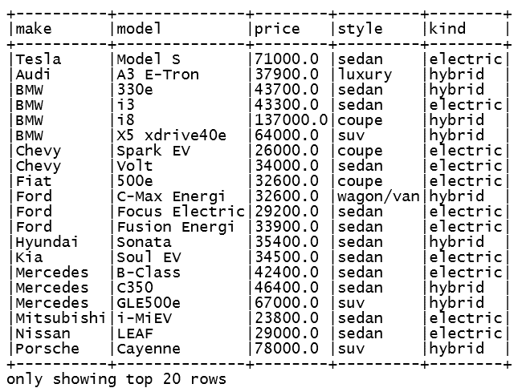

1.  接下来，我们将打印出暗示的列名。

```scala
cars.columns.foreach(println)
make
model
price
style
kind
```

1.  让我们显示自动生成的模式，并验证推断的数据类型是否正确。

```scala
*println*(cars.schema)
StructType(StructField(make,StringType,true), StructField(model,StringType,true), StructField(price,DoubleType,false), StructField(style,StringType,true), StructField(kind,StringType,true))
```

1.  现在，让我们按制造商对数据集进行分组，并计算数据集中制造商的数量。

```scala
cars.groupBy("make").count().show()
```

运行上述代码后，您将获得以下输出。

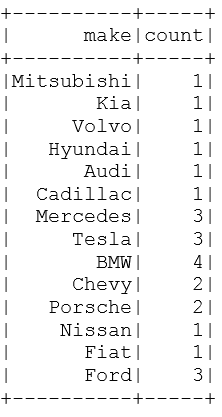

1.  下一步将使用 Spark 的 SQL 对数据集进行过滤，按制造商过滤特斯拉的值，并将结果数据集转换回 RDD。

```scala
val carRDD = cars.where("make = 'Tesla'").rdd
Car(Tesla,Model X,80000.0,suv,electric)
Car(Tesla,Model 3,35000.0,sedan,electric)
Car(Tesla,Model S,71000.0,sedan,electric)
```

1.  最后，利用`foreach()`方法显示 RDD 的内容。

```scala
carRDD.foreach(println)
Car(Tesla,Model X,80000.0,suv,electric)
Car(Tesla,Model 3,35000.0,sedan,electric)
Car(Tesla,Model S,71000.0,sedan,electric)
```

1.  我们通过停止 Spark 会话来关闭程序。

```scala
spark.stop() 
```

# 它是如何工作的...

在本节中，我们将 RDD 转换为数据集，最终将其转换回 RDD。我们从一个 Scala 序列开始，然后将其更改为 RDD。创建 RDD 后，调用了 Spark 的会话`createDataset()`方法，将 RDD 作为参数传递，同时接收数据集作为结果。

接下来，数据集按制造商列进行分组，计算各种汽车制造商的存在。下一步涉及过滤制造商为特斯拉的数据集，并将结果转换回 RDD。最后，我们通过 RDD 的`foreach()`方法显示了结果 RDD。

# 还有更多...

Spark 中的数据集源文件只有大约 2500 多行的 Scala 代码。这是一段非常好的代码，可以在 Apache 许可下进行专门化利用。我们列出以下 URL，并鼓励您至少扫描该文件并了解在使用数据集时缓冲如何发挥作用。

托管在 GitHub 上的数据集源代码可在[`github.com/apache/spark/blob/master/sql/core/src/main/scala/org/apache/spark/sql/Dataset.scala`](https://github.com/apache/spark/blob/master/sql/core/src/main/scala/org/apache/spark/sql/Dataset.scala)找到。

# 另请参阅

+   数据集的文档可以在[`spark.apache.org/docs/latest/api/scala/index.html#org.apache.spark.sql.Dataset`](http://spark.apache.org/docs/latest/api/scala/index.html#org.apache.spark.sql.Dataset)找到

+   可以在[`spark.apache.org/docs/latest/api/scala/index.html#org.apache.spark.sql.KeyValueGroupedDataset`](http://spark.apache.org/docs/latest/api/scala/index.html#org.apache.spark.sql.KeyValueGroupedDataset)找到分组的数据集

+   可以在[`spark.apache.org/docs/latest/api/scala/index.html#org.apache.spark.sql.RelationalGroupedDataset`](http://spark.apache.org/docs/latest/api/scala/index.html#org.apache.spark.sql.RelationalGroupedDataset)找到关系分组的数据集

# 使用数据集 API 和 SQL 一起处理 JSON

在这个示例中，我们将探讨如何使用数据集处理 JSON。在过去 5 年中，JSON 格式已迅速成为数据互操作性的事实标准。

我们探讨了数据集如何使用 JSON 并执行 API 命令，如`select()`。然后，我们通过创建视图（即`createOrReplaceTempView()`）并执行 SQL 查询来展示如何轻松使用 API 和 SQL 来查询 JSON 文件。

# 如何做...

1.  在 IntelliJ 或您选择的 IDE 中启动一个新项目。确保包含必要的 JAR 文件。

1.  我们将使用名为`cars.json`的 JSON 数据文件，该文件是为此示例创建的：

```scala
{"make": "Telsa", "model": "Model S", "price": 71000.00, "style": "sedan", "kind": "electric"}
{"make": "Audi", "model": "A3 E-Tron", "price": 37900.00, "style": "luxury", "kind": "hybrid"}
{"make": "BMW", "model": "330e", "price": 43700.00, "style": "sedan", "kind": "hybrid"}
```

1.  设置程序将驻留的包位置

```scala
package spark.ml.cookbook.chapter3
```

1.  导入 Spark 会话所需的包，以便访问集群和`Log4j.Logger`以减少 Spark 产生的输出量。

```scala
import org.apache.log4j.{Level, Logger}
import org.apache.spark.sql.SparkSession
```

1.  定义一个 Scala `case class`来对数据进行建模。

```scala
case class Car(make: String, model: String, price: Double,
style: String, kind: String)
```

1.  将输出级别设置为`ERROR`以减少 Spark 的日志输出。

```scala
Logger.getLogger("org").setLevel(Level.ERROR)
Logger.getLogger("akka").setLevel(Level.ERROR)
```

1.  初始化一个 Spark 会话，为访问 Spark 集群创建一个入口点。

```scala
val spark = SparkSession
.builder
.master("local[*]")
.appName("mydatasmydatasetjsonetrdd")
.config("Spark.sql.warehouse.dir", ".")
.getOrCreate()
```

1.  导入 Spark implicits，只需导入即可添加行为。

```scala
import spark.implicits._
```

1.  现在，我们将 JSON 数据文件加载到内存中，指定类类型为`Car`。

```scala
val cars = spark.read.json("../data/sparkml2/chapter3/cars.json").as[Car]
```

1.  让我们打印出我们生成的`Car`类型数据集中的数据。

```scala
cars.show(false)
```

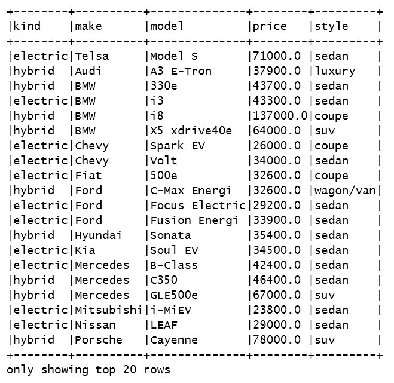

1.  接下来，我们将显示数据集的列名，以验证汽车的 JSON 属性名称是否被正确处理。

```scala
cars.columns.foreach(println)
make
model
price
style
kind
```

1.  让我们看看自动生成的模式并验证推断出的数据类型。

```scala
println(cars.schema)
StructType(StructField(make,StringType,true), StructField(model,StringType,true), StructField(price,DoubleType,false), StructField(style,StringType,true), StructField(kind,StringType,true))
```

1.  在这一步中，我们将选择数据集的`make`列，通过应用`distinct`方法去除重复项，并显示结果。

```scala
cars.select("make").distinct().show()
```

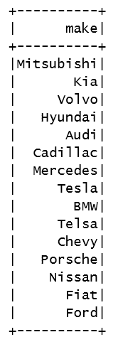

1.  接下来，在汽车数据集上创建一个视图，以便我们可以针对数据集执行一个文字 Spark SQL 查询字符串。

```scala
cars.createOrReplaceTempView("cars")
```

1.  最后，我们执行一个 Spark SQL 查询，过滤数据集以获取电动汽车，并仅返回三个已定义的列。

```scala
spark.sql("select make, model, kind from cars where kind = 'electric'").show()
```

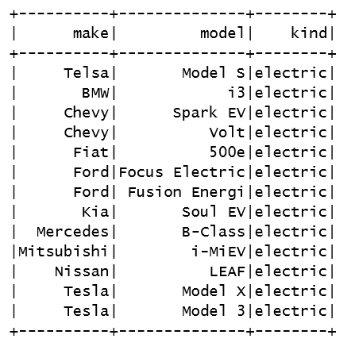

1.  我们通过停止 Spark 会话来关闭程序。

```scala
spark.stop() 
```

# 它是如何工作的...

读取**JavaScript 对象表示**（**JSON**）数据文件并将其转换为 Spark 数据集非常简单。在过去几年中，JSON 已经成为广泛使用的数据格式，Spark 对该格式的支持非常丰富。

在第一部分中，我们演示了通过 Spark 会话中内置的 JSON 解析功能将 JSON 加载到数据集中。您应该注意 Spark 的内置功能，它将 JSON 数据转换为汽车 case 类。

在第二部分中，我们演示了在数据集上应用 Spark SQL 来整理所述数据以达到理想状态。我们利用数据集的 select 方法检索`make`列，并应用`distinct`方法来去除重复项。接下来，我们在汽车数据集上设置了一个视图，以便我们可以对其应用 SQL 查询。最后，我们使用会话的 SQL 方法来执行针对数据集的文字 SQL 查询字符串，检索任何属于电动汽车的项目。

# 还有更多...

要完全理解和掌握数据集 API，请确保理解`Row`和`Encoder`的概念。

数据集遵循*延迟执行*范例，这意味着只有通过调用 Spark 中的操作才会执行。当我们执行操作时，Catalyst 查询优化器会生成逻辑计划，并生成用于优化并行分布式执行的物理计划。有关所有详细步骤，请参见介绍中的图。

`Row`的文档可在[`spark.apache.org/docs/latest/api/scala/index.html#org.apache.spark.sql.Dataset`](http://spark.apache.org/docs/latest/api/scala/index.html#org.apache.spark.sql.Dataset)找到。

`Encoder`的文档可在[`spark.apache.org/docs/latest/api/scala/index.html#org.apache.spark.sql.Encoder`](http://spark.apache.org/docs/latest/api/scala/index.html#org.apache.spark.sql.Encoder)找到。

# 另请参阅

+   数据集的文档可在[`spark.apache.org/docs/latest/api/scala/index.html#org.apache.spark.sql.Dataset`](http://spark.apache.org/docs/latest/api/scala/index.html#org.apache.spark.sql.Dataset)找到。

+   KeyValue 分组数据集的文档可在[`spark.apache.org/docs/latest/api/scala/index.html#org.apache.spark.sql.KeyValueGroupedDataset`](http://spark.apache.org/docs/latest/api/scala/index.html#org.apache.spark.sql.KeyValueGroupedDataset)找到。

+   关系分组数据集的文档[`spark.apache.org/docs/latest/api/scala/index.html#org.apache.spark.sql.RelationalGroupedDataset`](http://spark.apache.org/docs/latest/api/scala/index.html#org.apache.spark.sql.RelationalGroupedDataset)

再次，请务必下载并探索数据集源文件，该文件来自 GitHub，大约有 2500 多行。探索 Spark 源代码是学习 Scala 高级编程、Scala 注解和 Spark 2.0 本身的最佳途径。

对于 Spark 2.0 之前的用户值得注意的是：

+   SparkSession 是系统的唯一入口点。SQLContext 和 HiveContext 已被 SparkSession 取代。

+   对于 Java 用户，请确保用`Dataset<Row>`替换 DataFrame。

+   通过 SparkSession 使用新的目录接口来执行`cacheTable()`、`dropTempView()`、`createExternalTable()`和`ListTable()`等操作。

+   DataFrame 和 DataSet API

+   `unionALL()`已被弃用，现在应该使用`union()`。

+   `explode()`应该被`functions.explode()`加上`select()`或`flatMap()`替换

+   `registerTempTable`已被弃用，并被`createOrReplaceTempView()`取代

+   `Dataset()` API 源代码（即`Dataset.scala`）可以在 GitHub 上找到[`github.com/apache/spark/blob/master/sql/core/src/main/scala/org/apache/spark/sql/Dataset.scala`](https://github.com/apache/spark/blob/master/sql/core/src/main/scala/org/apache/spark/sql/Dataset.scala)

# 使用领域对象的 DataSet API 进行函数式编程

在这个示例中，我们探索了如何使用 DataSet 进行函数式编程。我们使用 DataSet 和函数式编程来按照汽车的型号（领域对象）进行分离。

# 如何做...

1.  在 IntelliJ 或您选择的 IDE 中启动一个新项目。确保包含必要的 JAR 文件。

1.  使用 package 指令提供正确的路径

```scala
package spark.ml.cookbook.chapter3
```

1.  导入必要的 Spark 上下文包以访问集群和`Log4j.Logger`以减少 Spark 产生的输出量。

```scala
import org.apache.log4j.{Level, Logger}
import org.apache.spark.sql.{Dataset, SparkSession}
import spark.ml.cookbook.{Car, mydatasetdata}
import scala.collection.mutable
import scala.collection.mutable.ListBuffer
import org.apache.log4j.{Level, Logger}
import org.apache.spark.sql.SparkSession
```

1.  定义一个 Scala case 来包含我们的数据进行处理，我们的汽车类将代表电动车和混合动力车。

```scala
case class Car(make: String, model: String, price: Double,
style: String, kind: String)
```

1.  让我们创建一个包含电动车和混合动力车的`Seq`。

```scala
val carData =
Seq(
Car("Tesla", "Model S", 71000.0, "sedan","electric"),
Car("Audi", "A3 E-Tron", 37900.0, "luxury","hybrid"),
Car("BMW", "330e", 43700.0, "sedan","hybrid"),
Car("BMW", "i3", 43300.0, "sedan","electric"),
Car("BMW", "i8", 137000.0, "coupe","hybrid"),
Car("BMW", "X5 xdrive40e", 64000.0, "suv","hybrid"),
Car("Chevy", "Spark EV", 26000.0, "coupe","electric"),
Car("Chevy", "Volt", 34000.0, "sedan","electric"),
Car("Fiat", "500e", 32600.0, "coupe","electric"),
Car("Ford", "C-Max Energi", 32600.0, "wagon/van","hybrid"),
Car("Ford", "Focus Electric", 29200.0, "sedan","electric"),
Car("Ford", "Fusion Energi", 33900.0, "sedan","electric"),
Car("Hyundai", "Sonata", 35400.0, "sedan","hybrid"),
Car("Kia", "Soul EV", 34500.0, "sedan","electric"),
Car("Mercedes", "B-Class", 42400.0, "sedan","electric"),
Car("Mercedes", "C350", 46400.0, "sedan","hybrid"),
Car("Mercedes", "GLE500e", 67000.0, "suv","hybrid"),
Car("Mitsubishi", "i-MiEV", 23800.0, "sedan","electric"),
Car("Nissan", "LEAF", 29000.0, "sedan","electric"),
Car("Porsche", "Cayenne", 78000.0, "suv","hybrid"),
Car("Porsche", "Panamera S", 93000.0, "sedan","hybrid"),
Car("Tesla", "Model X", 80000.0, "suv","electric"),
Car("Tesla", "Model 3", 35000.0, "sedan","electric"),
Car("Volvo", "XC90 T8", 69000.0, "suv","hybrid"),
Car("Cadillac", "ELR", 76000.0, "coupe","hybrid")
)

```

1.  将输出级别设置为`ERROR`以减少 Spark 的输出。

```scala
Logger.getLogger("org").setLevel(Level.ERROR)
Logger.getLogger("akka").setLevel(Level.ERROR)
```

1.  创建一个 SparkSession，以访问 Spark 集群和底层会话对象属性，如 SparkContext 和 SparkSQLContext。

```scala
val spark = SparkSession
.builder
.master("local[*]")
.appName("mydatasetseq")
.config("spark.sql.warehouse.dir", ".")
.getOrCreate()

```

1.  导入 spark implicits，因此只需导入即可添加行为。

```scala
import spark.implicits._
```

1.  现在，我们将使用 SparkSessions 的`createDataset()`函数从汽车数据 Seq 创建一个 DataSet。

```scala
val cars = spark.createDataset(MyDatasetData.carData)
```

1.  显示数据集以了解如何在后续步骤中转换数据。

```scala
cars.show(false)
```

运行上述代码后，您将得到以下输出。

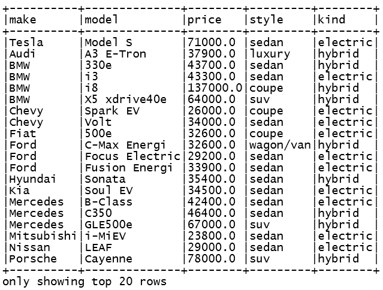

1.  现在我们构建一个功能序列步骤，将原始数据集转换为按制造商分组的数据，并附上所有不同的型号。

```scala
val modelData = cars.groupByKey(_.make).mapGroups({
case (make, car) => {
val carModel = new ListBuffer[String]()
           car.map(_.model).foreach({
               c =>  carModel += c
         })
         (make, carModel)
        }
      })
```

1.  让我们显示之前的函数逻辑序列的结果以进行验证。

```scala
  modelData.show(false)
```

运行上述代码后，您将得到以下输出。

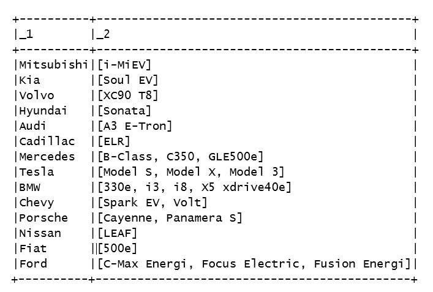

1.  通过停止 Spark 会话来关闭程序。

```scala
spark.stop()
```

# 它是如何工作的...

在这个例子中，我们使用 Scala 序列数据结构来保存原始数据，即一系列汽车及其属性。使用`createDataset()`，我们创建一个 DataSet 并填充它。然后，我们使用`groupBy`和`mapGroups()`来使用函数范式与 DataSet 列出汽车的型号。在 DataSet 之前，使用这种形式的函数式编程与领域对象并不是不可能的（例如，使用 RDD 的 case 类或使用 DataFrame 的 UDF），但是 DataSet 构造使这变得简单和内在化。

# 还有更多...

确保在所有的 DataSet 编码中包含`implicits`语句：

```scala
import spark.implicits._
```

# 另请参阅

数据集的文档可以在[`spark.apache.org/docs/latest/api/scala/index.html#org.apache.spark.sql.Dataset`](http://spark.apache.org/docs/latest/api/scala/index.html#org.apache.spark.sql.Dataset)中访问。
