# 第四章：实现强大机器学习系统的常见配方

在本章中，我们将涵盖：

+   Spark 的基本统计 API，帮助您构建自己的算法

+   用于现实生活机器学习应用的 ML 管道

+   使用 Spark 进行数据归一化

+   拆分用于训练和测试的数据

+   使用新的 Dataset API 的常见操作

+   在 Spark 2.0 中从文本文件创建和使用 RDD 与 DataFrame 与 Dataset

+   Spark ML 的 LabeledPoint 数据结构

+   在 Spark 2.0+中访问 Spark 集群

+   在 Spark 2.0 之前访问 Spark 集群

+   在 Spark 2.0 中通过 SparkSession 对象获取 SparkContext 的访问权限

+   在 Spark 2.0 中进行新模型导出和 PMML 标记

+   使用 Spark 2.0 进行回归模型评估

+   使用 Spark 2.0 进行二元分类模型评估

+   使用 Spark 2.0 进行多标签分类模型评估

+   使用 Spark 2.0 进行多类别分类模型评估

+   使用 Scala Breeze 库在 Spark 2.0 中进行图形处理

# 介绍

在从运行小型企业到创建和管理关键任务应用的各行业中，都有一些常见的任务需要作为几乎每个工作流程的一部分包含在内。即使是构建强大的机器学习系统也是如此。在 Spark 机器学习中，这些任务包括从拆分数据进行模型开发（训练、测试、验证）到归一化输入特征向量数据以通过 Spark API 创建 ML 管道。本章提供了一组配方，以使读者思考实际上需要实施端到端机器学习系统的内容。

本章试图演示任何强大的 Spark 机器学习系统实现中存在的一些常见任务。为了避免在本书的每个配方中重复引用这些常见任务，我们在本章中将这些常见任务作为简短的配方因子出来，这些配方可以在阅读其他章节时根据需要加以利用。这些配方可以作为独立的任务或作为更大系统中的管道子任务。请注意，这些常见配方在后面的章节中强调了机器学习算法的更大背景，同时也在本章中作为独立的配方包括在内，以确保完整性。

# Spark 的基本统计 API，帮助您构建自己的算法

在这个配方中，我们涵盖了 Spark 的多元统计摘要（即*Statistics.colStats*），如相关性、分层抽样、假设检验、随机数据生成、核密度估计等，这些可以应用于极大的数据集，同时利用 RDD 的并行性和弹性。

# 如何做...

1.  在 IntelliJ 或您选择的 IDE 中启动一个新项目。确保包含必要的 JAR 文件。

1.  设置程序所在的包位置：

```scala
package spark.ml.cookbook.chapter4
```

1.  导入必要的包以访问 Spark 会话以及`log4j.Logger`以减少 Spark 产生的输出量：

```scala
import org.apache.spark.mllib.linalg.Vectors
import org.apache.spark.mllib.stat.Statistics
import org.apache.spark.sql.SparkSession
import org.apache.log4j.Logger
import org.apache.log4j.Level
```

1.  将输出级别设置为`ERROR`，以减少 Spark 的日志输出：

```scala
Logger.getLogger("org").setLevel(Level.ERROR)
Logger.getLogger("akka").setLevel(Level.ERROR)
```

1.  使用构建器模式初始化 Spark 会话，从而使 Spark 集群的入口点可用：

```scala
val spark = SparkSession
.builder
.master("local[*]")
.appName("Summary Statistics")
.config("spark.sql.warehouse.dir", ".")
.getOrCreate()
```

1.  让我们检索 SparkContext 下面的 Spark 会话，以在生成 RDD 时使用：

```scala
val sc = spark.sparkContext
```

1.  现在我们使用手工制作的数据创建一个 RDD，以说明摘要统计的用法：

```scala
val rdd = sc.parallelize(
  Seq(
    Vectors.dense(0, 1, 0),
    Vectors.dense(1.0, 10.0, 100.0),
    Vectors.dense(3.0, 30.0, 300.0),
    Vectors.dense(5.0, 50.0, 500.0),
    Vectors.dense(7.0, 70.0, 700.0),
    Vectors.dense(9.0, 90.0, 900.0),
    Vectors.dense(11.0, 110.0, 1100.0)
  )
)
```

1.  我们通过调用`colStats()`方法并将 RDD 作为参数传递来使用 Spark 的统计对象：

```scala
val summary = Statistics.colStats(rdd)
```

`colStats()`方法将返回一个`MultivariateStatisticalSummary`，其中包含计算的摘要统计信息：

```scala
println("mean:" + summary.mean)
println("variance:" +summary.variance)
println("none zero" + summary.numNonzeros)
println("min:" + summary.min)
println("max:" + summary.max)
println("count:" + summary.count)
mean:[5.142857142857142,51.57142857142857,514.2857142857142]
variance:[16.80952380952381,1663.952380952381,168095.2380952381]
none zero[6.0,7.0,6.0]
min:[0.0,1.0,0.0]
max:[11.0,110.0,1100.0]
count:7
```

1.  通过停止 Spark 会话来关闭程序：

```scala
spark.stop()
```

# 工作原理...

我们从密集向量数据创建了一个 RDD，然后使用统计对象对其进行了摘要统计。一旦`colStats()`方法返回，我们就可以获取摘要统计，如均值、方差、最小值、最大值等。

# 还有更多...

无法强调足够大型数据集上的统计 API 有多么高效。这些 API 将为您提供实现任何统计学习算法的基本元素。根据我们对半矩阵分解和全矩阵分解的研究和经验，我们鼓励您首先阅读源代码，并确保在实现自己的功能之前，Spark 中没有已经实现的等效功能。

虽然我们在这里只展示了基本的统计摘要，但 Spark 默认配备了以下功能：

+   相关性：`Statistics.corr(seriesX, seriesY, "type of correlation")`：

+   Pearson（默认）

+   Spearman

+   分层抽样 - RDD API：

+   使用替换 RDD

+   无需替换 - 需要额外的传递

+   假设检验：

+   向量 - `Statistics.chiSqTest( vector )`

+   矩阵 - `Statistics.chiSqTest( dense matrix )`

+   **Kolmogorov-Smirnov**（**KS**）相等性检验 - 单侧或双侧：

+   `Statistics.kolmogorovSmirnovTest(RDD, "norm", 0, 1)`

+   随机数据生成器 - `normalRDD()`：

+   正态 - 可以指定参数

+   许多选项加上`map()`来生成任何分布

+   核密度估计器 - `KernelDensity().estimate( data )`

在统计学中，可以在[`en.wikipedia.org/wiki/Goodness_of_fit`](https://en.wikipedia.org/wiki/Goodness_of_fit)链接中找到对*拟合优度*概念的快速参考。

# 参见

更多多元统计摘要的文档：

+   [`spark.apache.org/docs/latest/api/scala/index.html#org.apache.spark.mllib.stat.MultivariateStatisticalSummary`](https://spark.apache.org/docs/latest/api/scala/index.html#org.apache.spark.mllib.stat.MultivariateStatisticalSummary)

# 用于实际机器学习应用的 ML 流水线

这是两个覆盖 Spark 2.0 中 ML 流水线的食谱中的第一个。有关 ML 流水线的更高级处理，例如 API 调用和参数提取等其他详细信息，请参见本书的后续章节。

在这个示例中，我们尝试创建一个单一的流水线，可以对文本进行标记化，使用 HashingTF（一种旧技巧）来映射词项频率，运行回归来拟合模型，然后预测一个新词项属于哪个组（例如，新闻过滤，手势分类等）。

# 如何做...

1.  在 IntelliJ 或您选择的 IDE 中启动一个新项目。确保包含必要的 JAR 文件。

1.  设置程序所在的包位置：

```scala
package spark.ml.cookbook.chapter4
```

1.  导入必要的包以便 Spark 会话可以访问集群和`log4j.Logger`以减少 Spark 产生的输出量：

```scala
import org.apache.spark.ml.Pipeline
import org.apache.spark.ml.classification.LogisticRegression
import org.apache.spark.ml.feature.{HashingTF, Tokenizer}
import org.apache.spark.sql.SparkSession
import org.apache.log4j.{Level, Logger}
```

1.  将输出级别设置为`ERROR`以减少 Spark 的日志输出：

```scala
Logger.getLogger("org").setLevel(Level.ERROR)
Logger.getLogger("akka").setLevel(Level.ERROR)
```

1.  使用构建器模式初始化 Spark 会话，从而为 Spark 集群提供入口点：

```scala
val spark = SparkSession
.builder
.master("local[*]")
.appName("My Pipeline")
.config("spark.sql.warehouse.dir", ".")
.getOrCreate()
```

1.  让我们创建一个包含几个随机文本文档的训练集 DataFrame：

```scala
val trainset = spark.createDataFrame(Seq(
 (1L, 1, "spark rocks"),
 (2L, 0, "flink is the best"),
 (3L, 1, "Spark rules"),
 (4L, 0, "mapreduce forever"),
 (5L, 0, "Kafka is great")
 )).toDF("id", "label", "words")
```

1.  创建一个标记化器来解析文本文档为单独的词项：

```scala
val tokenizer = new Tokenizer()
 .setInputCol("words")
 .setOutputCol("tokens")
```

1.  创建一个 HashingTF 来将词项转换为特征向量：

```scala
val hashingTF = new HashingTF()
 .setNumFeatures(1000)
 .setInputCol(tokenizer.getOutputCol)
 .setOutputCol("features")
```

1.  创建一个逻辑回归类来生成一个模型，以预测一个新的文本文档属于哪个组：

```scala
val lr = new LogisticRegression()
 .setMaxIter(15)
 .setRegParam(0.01)
```

1.  接下来，我们构建一个包含三个阶段的数据流水线：

```scala
val pipeline = new Pipeline()
 .setStages(Array(tokenizer, hashingTF, lr))
```

1.  现在，我们训练模型，以便稍后进行预测：

```scala
val model = pipeline.fit(trainset)
```

1.  让我们创建一个测试数据集来验证我们训练好的模型：

```scala
val testSet = spark.createDataFrame(Seq(
 (10L, 1, "use spark please"),
 (11L, 2, "Kafka")
 )).toDF("id", "label", "words")
```

1.  最后，我们使用训练好的模型转换测试集，生成预测：

```scala
model.transform(testSet).select("probability", "prediction").show(false)
```

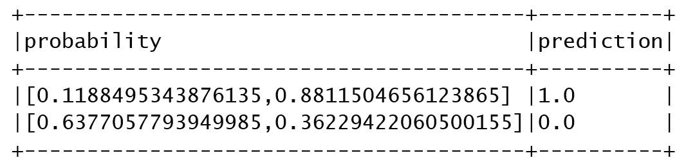

1.  通过停止 Spark 会话来关闭程序：

```scala
spark.stop()
```

# 它是如何工作的...

在本节中，我们研究了如何使用 Spark 构建一个简单的机器学习流水线。我们首先创建了一个由两组文本文档组成的 DataFrame，然后设置了一个流水线。

首先，我们创建了一个分词器，将文本文档解析为术语，然后创建了 HashingTF 来将术语转换为特征。然后，我们创建了一个逻辑回归对象，以预测新文本文档属于哪个组。

其次，我们通过向其传递参数数组来构建管道，指定三个执行阶段。您会注意到每个后续阶段都将结果提供为指定的列，同时使用前一阶段的输出列作为输入。

最后，我们通过在管道对象上调用`fit()`并定义一组测试数据来训练模型以进行验证。接下来，我们使用模型转换测试集，确定测试集中的文本文档属于定义的两个组中的哪一个。

# 还有更多...

Spark ML 中的管道受到了 Python 中 scikit-learn 的启发，这里提供了参考：

[`scikit-learn.org/stable/`](http://scikit-learn.org/stable/)

ML 管道使得在 Spark 中组合多个算法以实现生产任务变得容易。在现实情况下，很少会看到由单个算法组成的用例。通常，一些合作的 ML 算法一起工作以实现复杂的用例。例如，在基于 LDA 的系统（例如新闻简报）或人类情感检测中，核心系统之前和之后有许多步骤，需要作为单个管道来实现任何有意义且值得投入生产的系统。请参阅以下链接，了解需要使用管道来实现强大系统的真实用例：

[`www.thinkmind.org/index.php?view=article&articleid=achi_2013_15_50_20241`](https://www.thinkmind.org/index.php?view=article&articleid=achi_2013_15_50_20241)

# 另见

更多多元统计摘要的文档：

+   管道文档可在[`spark.apache.org/docs/latest/api/scala/index.html#org.apache.spark.ml.Pipeline`](https://spark.apache.org/docs/latest/api/scala/index.html#org.apache.spark.ml.Pipeline)找到

+   在加载和保存`.load()`、`.save()`方法时有用的管道模型：[`spark.apache.org/docs/latest/api/scala/index.html#org.apache.spark.ml.PipelineModel`](https://spark.apache.org/docs/latest/api/scala/index.html#org.apache.spark.ml.PipelineModel)

+   管道阶段信息可在[`spark.apache.org/docs/latest/api/scala/index.html#org.apache.spark.ml.PipelineStage`](https://spark.apache.org/docs/latest/api/scala/index.html#org.apache.spark.ml.PipelineStage)找到

+   HashingTF，一种将序列映射到文本分析中的词频的老技巧，可在[`spark.apache.org/docs/latest/api/scala/index.html#org.apache.spark.mllib.feature.HashingTF`](https://spark.apache.org/docs/latest/api/scala/index.html#org.apache.spark.mllib.feature.HashingTF)找到

# 使用 Spark 对数据进行归一化

在这个示例中，我们演示了在将数据导入 ML 算法之前对数据进行归一化（缩放）。有很多 ML 算法，比如**支持向量机**（**SVM**），它们使用缩放后的输入向量而不是原始值效果更好。

# 如何做...

1.  转到 UCI 机器学习库并下载[`archive.ics.uci.edu/ml/machine-learning-databases/wine/wine.data`](http://archive.ics.uci.edu/ml/machine-learning-databases/wine/wine.data)文件。

1.  在 IntelliJ 或您选择的 IDE 中启动一个新项目。确保包含必要的 JAR 文件。

1.  设置程序所在的包位置：

```scala
package spark.ml.cookbook.chapter4
```

1.  导入必要的包，以便 Spark 会话可以访问集群和`log4j.Logger`以减少 Spark 产生的输出量：

```scala
import org.apache.spark.sql.SparkSession
import org.apache.spark.ml.linalg.{Vector, Vectors}
import org.apache.spark.ml.feature.MinMaxScaler
```

1.  定义一个将葡萄酒数据解析为元组的方法：

```scala
def parseWine(str: String): (Int, Vector) = {
val columns = str.split(",")
(columns(0).toInt, Vectors.dense(columns(1).toFloat, columns(2).toFloat, columns(3).toFloat))
 }
```

1.  将输出级别设置为`ERROR`以减少 Spark 的日志输出：

```scala
Logger.getLogger("org").setLevel(Level.ERROR)
Logger.getLogger("akka").setLevel(Level.ERROR)
```

1.  使用构建器模式初始化 Spark 会话，从而为 Spark 集群提供入口点：

```scala
val spark = SparkSession
.builder
.master("local[*]")
.appName("My Normalize")
.getOrCreate()
```

1.  导入`spark.implicits`，因此只需一个`import`即可添加行为：

```scala
import spark.implicits._
```

1.  现在，我们将葡萄酒数据加载到内存中，仅取前四列，并将后三列转换为新的特征向量：

```scala
val data = Spark.read.text("../data/sparkml2/chapter4/wine.data").as[String].map(parseWine)
```

1.  接下来，我们生成一个包含两列的 DataFrame：

```scala
val df = data.toDF("id", "feature")
```

1.  现在，我们将打印 DataFrame 模式并显示其中包含的数据：

```scala
df.printSchema()
df.show(false)
```

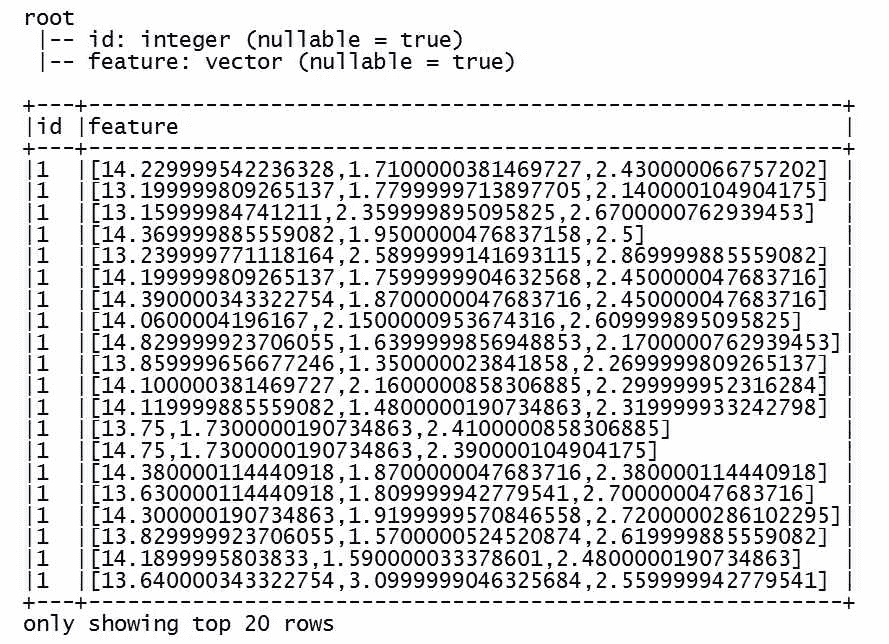

1.  最后，我们生成了缩放模型，并将特征转换为一个在负一和正一之间的常见范围，显示结果：

```scala
val scale = new MinMaxScaler()
      .setInputCol("feature")
      .setOutputCol("scaled")
      .setMax(1)
      .setMin(-1)
scale.fit(df).transform(df).select("scaled").show(false)
```

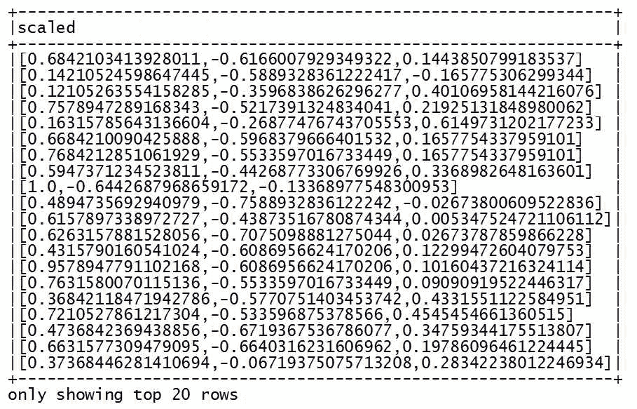

1.  我们通过停止 Spark 会话来关闭程序：

```scala
spark.stop()
```

# 它是如何工作的...

在这个例子中，我们探讨了特征缩放，这是大多数机器学习算法（如**分类器**）中的关键步骤。我们首先加载了葡萄酒数据文件，提取了一个标识符，并使用接下来的三列创建了一个特征向量。

然后，我们创建了一个`MinMaxScaler`对象，配置了一个最小和最大范围，以便将我们的值缩放到。我们通过在缩放器类上执行`fit()`方法来调用缩放模型，然后使用模型来缩放 DataFrame 中的值。

最后，我们显示了生成的 DataFrame，并注意到特征向量值的范围在负 1 和正 1 之间。

# 还有更多...

通过研究**单位向量**的概念，可以更好地理解归一化和缩放的根源。请参阅以下链接以获取一些关于单位向量的常见参考资料：

+   您可以参考[`en.wikipedia.org/wiki/Unit_vector`](https://en.wikipedia.org/wiki/Unit_vector)中的单位向量

+   对于标量，您可以参考[`en.wikipedia.org/wiki/Scalar_(mathematics)`](https://en.wikipedia.org/wiki/Scalar_(mathematics))

对于输入敏感的算法，例如 SVM，建议对特征的缩放值（例如，范围从 0 到 1）进行训练，而不是原始向量表示的绝对值。

# 另请参阅

`MinMaxScaler`的文档可在[`spark.apache.org/docs/latest/api/scala/index.html#org.apache.spark.ml.feature.MinMaxScaler`](https://spark.apache.org/docs/latest/api/scala/index.html#org.apache.spark.ml.feature.MinMaxScaler)找到

我们想强调`MinMaxScaler`是一个广泛的 API，它扩展了`Estimator`（来自 ML 管道的概念），正确使用时可以实现编码效率和高准确性结果。

# 为训练和测试拆分数据

在这个示例中，您将学习使用 Spark 的 API 将可用的输入数据拆分成可用于训练和验证阶段的不同数据集。通常使用 80/20 的拆分，但也可以根据您的偏好考虑拆分数据的其他变化。

# 如何做...

1.  转到 UCI 机器学习库并下载[`archive.ics.uci.edu/ml/machine-learning-databases/00359/NewsAggregatorDataset.zip`](http://archive.ics.uci.edu/ml/machine-learning-databases/00359/NewsAggregatorDataset.zip)文件。

1.  在 IntelliJ 或您选择的 IDE 中启动一个新项目。确保包含必要的 JAR 文件。

1.  设置程序所在的包位置：

```scala
package spark.ml.cookbook.chapter4
```

1.  导入 Spark 会话所需的包，以便访问集群和`log4j.Logger`，以减少 Spark 产生的输出量：

```scala
import org.apache.spark.sql.SparkSession
import org.apache.log4j.{ Level, Logger}
```

1.  将输出级别设置为`ERROR`以减少 Spark 的日志输出：

```scala
Logger.getLogger("org").setLevel(Level.ERROR)
Logger.getLogger("akka").setLevel(Level.ERROR)
```

1.  使用构建器模式初始化 Spark 会话，从而为 Spark 集群提供入口点：

```scala
val spark = SparkSession
.builder
.master("local[*]")
.appName("Data Splitting")
.getOrCreate()
```

1.  我们首先通过 Spark 会话的`csv()`方法加载数据文件，以解析和加载数据到数据集中：

```scala
val data = spark.read.csv("../data/sparkml2/chapter4/newsCorpora.csv")
```

1.  现在，我们计算 CSV 加载程序解析并加载到内存中的项目数。我们稍后需要这个值来调和数据拆分。

```scala
val rowCount = data.count()
println("rowCount=" + rowCount)
```

1.  接下来，我们利用数据集的`randomSplit`方法将数据分成两个桶，每个桶分配 80%和 20%的数据：

```scala
val splitData = data.randomSplit(Array(0.8, 0.2))
```

1.  `randomSplit`方法返回一个包含两组数据的数组，第一组数据占 80%的训练集，下一组占 20%的测试集：

```scala
val trainingSet = splitData(0)
val testSet = splitData(1)
```

1.  让我们为训练集和测试集生成计数：

```scala
val trainingSetCount = trainingSet.count()
val testSetCount = testSet.count()
```

1.  现在我们对值进行调和，并注意到原始行数为`415606`，训练集和测试集的最终总和等于`415606`：

```scala
println("trainingSetCount=" + trainingSetCount)
println("testSetCount=" + testSetCount)
println("setRowCount=" + (trainingSetCount+testSetCount))
rowCount=415606
trainingSetCount=332265
testSetCount=83341
setRowCount=415606
```

1.  我们通过停止 Spark 会话来关闭程序：

```scala
spark.stop()
```

# 它是如何工作的...

我们首先加载数据文件`newsCorpora.csv`，然后通过附加到数据集对象的`randomSplit()`方法来拆分数据集。

# 还有更多...

为了验证结果，我们必须建立一个 Delphi 技术，其中测试数据对模型是完全未知的。有关详细信息，请参阅 Kaggle 竞赛[`www.kaggle.com/competitions`](https://www.kaggle.com/competitions)。

强大的 ML 系统需要三种类型的数据集：

+   **训练数据集**：用于将模型拟合到样本

+   **验证数据集**：用于估计由训练集拟合的模型的增量或预测误差

+   **测试数据集**：用于在选择最终模型后评估模型的泛化误差

# 另请参阅

`randomSplit()`的文档可在[`spark.apache.org/docs/latest/api/scala/index.html#org.apache.spark.api.java.JavaRDD@randomSplit(weights:Array%5BDouble%5D):Array%5Borg.apache.spark.api.java.JavaRDD%5BT%5D%5D`](https://spark.apache.org/docs/latest/api/scala/index.html#org.apache.spark.api.java.JavaRDD@randomSplit(weights:Array%5BDouble%5D):Array%5Borg.apache.spark.api.java.JavaRDD%5BT%5D%5D)找到。

`randomSplit()`是 RDD 内的一个方法调用。虽然 RDD 方法调用的数量可能令人不知所措，但掌握这个 Spark 概念和 API 是必须的。

API 签名如下：

```scala
def randomSplit(weights: Array[Double]): Array[JavaRDD[T]]
```

使用提供的权重随机拆分此 RDD。

# 新的 Dataset API 的常见操作

在这个示例中，我们涵盖了 Dataset API，这是 Spark 2.0 及更高版本中数据处理的未来方向。在第三章，*Spark 的三大数据武士-机器学习的完美组合*中，我们涵盖了三个详细的数据集示例，本章中我们涵盖了一些使用这些新 API 集的常见重复操作。此外，我们演示了由 Spark SQL Catalyst 优化器生成的查询计划。

# 如何做...

1.  在 IntelliJ 或您选择的 IDE 中启动一个新项目。确保包含必要的 JAR 文件。

1.  我们将使用一个名为`cars.json`的 JSON 数据文件，该文件是为本示例创建的：

```scala
name,city
Bears,Chicago
Packers,Green Bay
Lions,Detroit
Vikings,Minnesota
```

1.  设置程序所在的包位置：

```scala
package spark.ml.cookbook.chapter4
```

1.  导入必要的包以便 Spark 会话可以访问集群和`log4j.Logger`以减少 Spark 产生的输出量：

```scala
import org.apache.spark.ml.Pipeline
import org.apache.spark.ml.classification.LogisticRegression
import org.apache.spark.ml.feature.{HashingTF, Tokenizer}
import org.apache.spark.sql.SparkSession
import org.apache.log4j.{Level, Logger}
```

1.  定义一个 Scala `case class`来建模数据：

```scala
case class Team(name: String, city: String)
```

1.  将输出级别设置为`ERROR`以减少 Spark 的日志输出：

```scala
Logger.getLogger("org").setLevel(Level.ERROR)
Logger.getLogger("akka").setLevel(Level.ERROR)
```

1.  使用构建模式初始化 Spark 会话，从而为 Spark 集群提供入口点：

```scala
val spark = SparkSession
.builder
.master("local[*]")
.appName("My Dataset")
.config("spark.sql.warehouse.dir", ".")
.getOrCreate()
```

1.  导入`spark.implicits`，因此只需一个`import`就可以添加行为：

```scala
import spark.implicits._
```

1.  让我们从 Scala 列表创建一个数据集并打印结果：

```scala
val champs = spark.createDataset(List(Team("Broncos", "Denver"), Team("Patriots", "New England")))
champs.show(false)
```

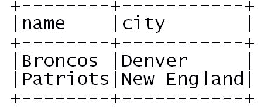

1.  接下来，我们将加载一个 CSV 文件到内存中，并将其转换为`Team`类型的数据集：

```scala
val teams = spark.read
 .option("Header", "true")
 .csv("../data/sparkml2/chapter4/teams.csv")
 .as[Team]

 teams.show(false)
```

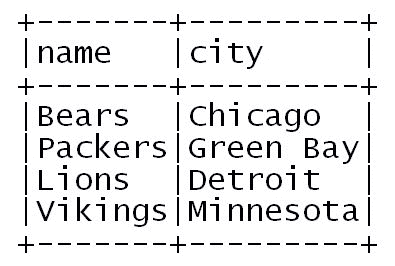

1.  现在我们通过使用`map`函数对团队数据集进行横向遍历，生成一个新的城市名称数据集：

```scala
val cities = teams.map(t => t.city)
cities.show(false)
```

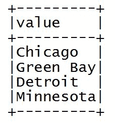

1.  显示检索城市名称的执行计划：

```scala
cities.explain()
== Physical Plan ==
*SerializeFromObject [staticinvoke(class org.apache.spark.unsafe.types.UTF8String, StringType, fromString, input[0, java.lang.String, true], true) AS value#26]
+- *MapElements <function1>, obj#25: java.lang.String
+- *DeserializeToObject newInstance(class Team), obj#24: Team
+- *Scan csv [name#9,city#10] Format: CSV, InputPaths: file:teams.csv, PartitionFilters: [], PushedFilters: [], ReadSchema: struct<name:string,city:string>
```

1.  最后，我们将`teams`数据集保存为 JSON 文件：

```scala
teams.write
.mode(SaveMode.Overwrite)
.json("../data/sparkml2/chapter4/teams.json"){"name":"Bears","city":"Chicago"}
{"name":"Packers","city":"Green Bay"}
{"name":"Lions","city":"Detroit"}
{"name":"Vikings","city":"Minnesota"}
```

1.  通过停止 Spark 会话来关闭程序：

```scala
spark.stop()
```

# 它是如何工作的...

首先，我们从 Scala 列表创建了一个数据集，并显示输出以验证数据集的创建是否符合预期。其次，我们将一个**逗号分隔值**（**CSV**）文件加载到内存中，将其转换为类型为`Team`的数据集。第三，我们在数据集上执行`map()`函数，构建了一个团队城市名称列表，并打印出用于生成数据集的执行计划。最后，我们将之前加载的`teams`数据集持久化到一个 JSON 格式的文件中，以备将来使用。

# 还有更多...

请注意一些关于数据集的有趣点：

+   数据集使用*延迟*评估

+   数据集利用了 Spark SQL Catalyst 优化器

+   数据集利用了钨的非堆内存管理

+   在接下来的两年中，仍将有许多系统保持在 Spark 2.0 之前，因此出于实际原因，您仍必须学习和掌握 RDD 和 DataFrame。

# 另请参阅

数据集的文档可在[`spark.apache.org/docs/latest/api/scala/index.html#org.apache.spark.sql.Dataset`](https://spark.apache.org/docs/latest/api/scala/index.html#org.apache.spark.sql.Dataset)找到。

# 在 Spark 2.0 中从文本文件创建和使用 RDD 与 DataFrame 与 Dataset

在这个示例中，我们探讨了从文本文件创建 RDD、DataFrame 和 Dataset 以及它们之间关系的微妙差异，通过一个简短的示例代码：

```scala
Dataset: spark.read.textFile()
RDD: spark.sparkContext.textFile()
DataFrame: spark.read.text()
```

假设`spark`是会话名称

# 如何做...

1.  在 IntelliJ 或您选择的 IDE 中启动一个新项目。确保包含必要的 JAR 文件。

1.  设置程序所在的包位置：

```scala
package spark.ml.cookbook.chapter4
```

1.  导入必要的包以便 Spark 会话可以访问集群和`log4j.Logger`以减少 Spark 产生的输出量：

```scala
import org.apache.log4j.{Level, Logger}
import org.apache.spark.sql.SparkSession
```

1.  我们还定义了一个`case class`来存储使用的数据：

```scala
case class Beatle(id: Long, name: String)
```

1.  将输出级别设置为`ERROR`以减少 Spark 的日志输出：

```scala
Logger.getLogger("org").setLevel(Level.ERROR)
```

1.  使用构建器模式初始化 Spark 会话，从而为 Spark 集群提供入口点：

```scala
val spark = SparkSession
.builder
.master("local[*]")
.appName("DatasetvsRDD")
.config("spark.sql.warehouse.dir", ".")
.getOrCreate()
```

1.  在下面的代码块中，我们让 Spark 从文本文件中*创建数据集*对象。

文本文件包含非常简单的数据（每行包含逗号分隔的 ID 和名称）：

```scala
import spark.implicits._

val ds = spark.read.textFile("../data/sparkml2/chapter4/beatles.txt").map(line => {
val tokens = line.split(",")
Beatle(tokens(0).toLong, tokens(1))
}).as[Beatle]
```

我们读取文件并解析文件中的数据。数据集对象由 Spark 创建。我们在控制台中确认类型，然后显示数据：

```scala
println("Dataset Type: " + ds.getClass)
ds.show()
```

从控制台输出：

```scala
Dataset Type: class org.apache.spark.sql.Dataset
```

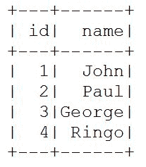

1.  现在我们使用与前一步非常相似的方式创建了一个包含相同数据文件的 RDD：

```scala
val rdd = spark.sparkContext.textFile("../data/sparkml2/chapter4/beatles.txt").map(line => {
val tokens = line.split(",")
Beatle(tokens(0).toLong, tokens(1))
 })
```

然后我们确认它是一个 RDD，并在控制台中显示数据：

```scala
println("RDD Type: " + rdd.getClass)
rdd.collect().foreach(println)
```

请注意，方法非常相似但不同。

从控制台输出：

```scala
RDD Type: class org.apache.spark.rdd.MapPartitionsRDD
Beatle(1,John)
Beatle(2,Paul)
Beatle(3,George)
Beatle(4,Ringo)
```

1.  DataFrame 是 Spark 社区常用的另一种数据结构。我们展示了使用相同的方法基于相同的数据文件创建 DataFrame 的类似方式：

```scala
val df = spark.read.text("../data/sparkml2/chapter4/beatles.txt").map(
 row => { // Dataset[Row]
val tokens = row.getString(0).split(",")
 Beatle(tokens(0).toLong, tokens(1))
 }).toDF("bid", "bname")
```

然后我们确认它是一个 DataFrame。

```scala
 println("DataFrame Type: " + df.getClass)
 df.show()
```

请注意`DataFrame = Dataset[Row]`，因此类型是 Dataset。

从控制台输出：

```scala
DataFrame Type: class org.apache.spark.sql.Dataset
```

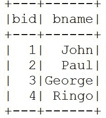

1.  我们通过停止 Spark 会话来关闭程序：

```scala
spark.stop()
```

# 工作原理...

我们使用相同的文本文件使用类似的方法创建了一个 RDD、DataFrame 和 Dataset 对象，并使用`getClass`方法确认了类型：

```scala
Dataset: spark.read.textFile
RDD: spark.sparkContext.textFile
DataFrame: spark.read.text
```

请注意它们非常相似，有时会令人困惑。Spark 2.0 已经将 DataFrame 转换为`Dataset[Row]`的别名，使其真正成为一个数据集。我们展示了前面的方法，让用户选择一个示例来创建他们自己的数据类型。

# 还有更多...

数据类型的文档可在[`spark.apache.org/docs/latest/sql-programming-guide.html`](http://spark.apache.org/docs/latest/sql-programming-guide.html)找到。

如果您不确定手头有什么样的数据结构（有时差异并不明显），请使用`getClass`方法进行验证。

Spark 2.0 已经将 DataFrame 转换为`Dataset[Row]`的别名。虽然 RDD 和 Dataram 在不久的将来仍然是完全可行的，但最好学习并编写新项目时使用数据集。

# 另请参阅

RDD 和 Dataset 的文档可在以下网站找到：

+   [`spark.apache.org/docs/latest/api/scala/index.html#org.apache.spark.rdd.RDD`](http://spark.apache.org/docs/latest/api/scala/index.html#org.apache.spark.rdd.RDD)

+   [`spark.apache.org/docs/latest/api/scala/index.html#org.apache.spark.sql.Dataset`](http://spark.apache.org/docs/latest/api/scala/index.html#org.apache.spark.sql.Dataset)

# Spark ML 的 LabeledPoint 数据结构

**LabeledPoint**是一个自从早期就存在的数据结构，用于打包特征向量和标签，以便在无监督学习算法中使用。我们演示了一个简短的配方，使用 LabeledPoint、**Seq**数据结构和 DataFrame 来运行数据的二元分类的逻辑回归。这里重点是 LabeledPoint，回归算法在第五章和第六章中有更深入的介绍，*Spark 2.0 中的回归和分类的实用机器学习-第 I 部分*和*Spark 2.0 中的回归和分类的实用机器学习-第 II 部分*。

# 如何做...

1.  在 IntelliJ 或您选择的 IDE 中启动一个新项目。确保包含必要的 JAR 文件。

1.  设置程序所在的包位置：

```scala
package spark.ml.cookbook.chapter4
```

1.  导入必要的包以使 SparkContext 能够访问集群：

```scala
import org.apache.spark.ml.feature.LabeledPoint
import org.apache.spark.ml.linalg.Vectors
import org.apache.spark.ml.classification.LogisticRegression
import org.apache.spark.sql._

```

1.  创建 Spark 的配置和 SparkContext，以便我们可以访问集群：

```scala
val spark = SparkSession
.builder
.master("local[*]")
.appName("myLabeledPoint")
.config("spark.sql.warehouse.dir", ".")
.getOrCreate()
```

1.  我们使用`SparseVector`和`DenseVector`创建 LabeledPoint。在以下代码块中，前四个 LabeledPoints 是由`DenseVector`创建的，最后两个 LabeledPoints 是由`SparseVector`创建的：

```scala
val myLabeledPoints = spark.createDataFrame(Seq(
 LabeledPoint(1.0, Vectors.dense(0.0, 1.1, 0.1)),
 LabeledPoint(0.0, Vectors.dense(2.0, 1.0, -1.0)),
 LabeledPoint(0.0, Vectors.dense(2.0, 1.3, 1.0)),
 LabeledPoint(1.0, Vectors.dense(0.0, 1.2, -0.5)),

 LabeledPoint(0.0, Vectors.sparse(3, Array(0,2), Array(1.0,3.0))),
 LabeledPoint(1.0, Vectors.sparse(3, Array(1,2), Array(1.2,-0.4)))

 ))
```

DataFrame 对象是从前面的 LabeledPoint 创建的。

1.  我们验证原始数据计数和处理数据计数。

1.  您可以对创建的 DataFrame 使用`show()`函数调用：

```scala
myLabeledPoints.show()
```

1.  您将在控制台中看到以下内容：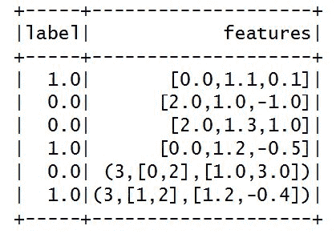

1.  我们从刚刚创建的数据结构中创建一个简单的 LogisticRegression 模型：

```scala
val lr = new LogisticRegression()

 lr.setMaxIter(5)
 .setRegParam(0.01)
 val model = lr.fit(myLabeledPoints)

 println("Model was fit using parameters: " + model.parent.extractParamMap())
```

在控制台中，它将显示以下`model`参数：

```scala
Model was fit using parameters: {
 logreg_6aebbb683272-elasticNetParam: 0.0,
 logreg_6aebbb683272-featuresCol: features,
 logreg_6aebbb683272-fitIntercept: true,
 logreg_6aebbb683272-labelCol: label,
 logreg_6aebbb683272-maxIter: 5,
 logreg_6aebbb683272-predictionCol: prediction,
 logreg_6aebbb683272-probabilityCol: probability,
 logreg_6aebbb683272-rawPredictionCol: rawPrediction,
 logreg_6aebbb683272-regParam: 0.01,
 logreg_6aebbb683272-standardization: true,
 logreg_6aebbb683272-threshold: 0.5,
 logreg_6aebbb683272-tol: 1.0E-6
}
```

1.  然后通过停止 Spark 会话来关闭程序：

```scala
spark.stop()
```

# 工作原理...

我们使用了一个 LabeledPoint 数据结构来建模特征并驱动逻辑回归模型的训练。我们首先定义了一组 LabeledPoints，用于创建进一步处理的 DataFrame。然后，我们创建了一个逻辑回归对象，并将 LabeledPoint DataFrame 作为参数传递给它，以便训练我们的模型。Spark ML API 被设计为与 LabeledPoint 格式良好配合，并且需要最少的干预。

# 还有更多...

LabeledPoint 是一种常用的结构，用于将数据打包为`Vector` + `Label`，可用于监督式机器学习算法。LabeledPoint 的典型布局如下：

```scala
Seq( 
LabeledPoint (Label, Vector(data, data, data)) 
...... 
LabeledPoint (Label, Vector(data, data, data)) 
) 
```

请注意，不仅稠密向量，而且稀疏向量也可以与 LabeledPoint 一起使用，这将在效率上产生巨大的差异，特别是在测试和开发过程中，如果您有一个大型稀疏数据集存储在驱动程序中。

# 另请参阅

+   LabeledPoint API 文档可在[`spark.apache.org/docs/latest/api/scala/index.html#org.apache.spark.ml.feature.LabeledPoint`](https://spark.apache.org/docs/latest/api/scala/index.html#org.apache.spark.ml.feature.LabeledPoint)找到

+   DenseVector API 文档可在[`spark.apache.org/docs/latest/api/scala/index.html#org.apache.spark.ml.linalg.DenseVector`](https://spark.apache.org/docs/latest/api/scala/index.html#org.apache.spark.ml.linalg.DenseVector)找到

+   SparseVector API 文档可在[`spark.apache.org/docs/latest/api/scala/index.html#org.apache.spark.ml.linalg.SparseVector`](https://spark.apache.org/docs/latest/api/scala/index.html#org.apache.spark.ml.linalg.SparseVector)找到

# 在 Spark 2.0 中访问 Spark 集群

在这个示例中，我们演示了如何使用名为`SparkSession`的单一访问点来访问 Spark 集群。Spark 2.0 将多个上下文（如 SQLContext、HiveContext）抽象为一个统一的入口点`SparkSession`，这样可以以统一的方式访问所有 Spark 子系统。

# 如何做...

1.  在 IntelliJ 或您选择的 IDE 中启动一个新项目。确保包含必要的 JAR 文件。

1.  设置程序所在的包位置：

```scala
package spark.ml.cookbook.chapter4
```

1.  导入 SparkContext 所需的包，以便访问集群。

1.  在 Spark 2.x 中，更常用的是`SparkSession`。

```scala
import org.apache.spark.sql.SparkSession
```

1.  创建 Spark 的配置和`SparkSession`，以便我们可以访问集群：

```scala
val spark = SparkSession
.builder
.master("local[*]") // if use cluster master("spark://master:7077")
.appName("myAccesSparkCluster20")
.config("spark.sql.warehouse.dir", ".")
.getOrCreate()
```

上述代码利用`master()`函数将集群类型设置为`local`。提供了一个注释，显示如何在特定端口上运行本地集群。

如果两者都存在，`-D`选项值将被代码中设置的集群主参数覆盖。

在`SparkSession`对象中，我们通常使用`master()`函数，而在 Spark 2.0 之前，在`SparkConf`对象中，使用`setMaster()`函数。

以下是连接到不同模式的集群的三种示例方式：

1.  在`local`模式下运行：

```scala
master("local") 
```

1.  在集群模式下运行：

```scala
master("spark://yourmasterhostIP:port") 
```

1.  传递主值：

```scala
 -Dspark.master=local
```

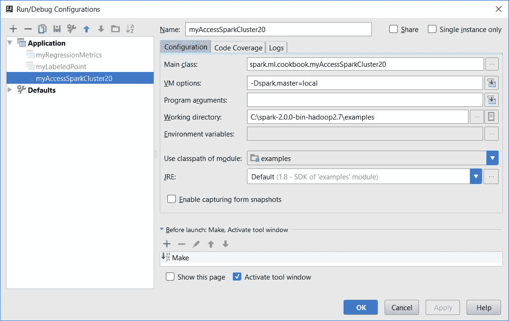

1.  我们读取一个 CSV 文件，并使用以下代码将 CSV 文件解析为 Spark：

```scala
val df = spark.read
       .option("header","True")
       .csv("../data/sparkml2/chapter4/mySampleCSV.csv")
```

1.  我们在控制台中显示 DataFrame：

```scala
df.show()
```

1.  您将在控制台中看到以下内容：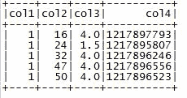

1.  然后通过停止 Spark 会话来关闭程序：

```scala
spark.stop()
```

# 它是如何工作的...

在这个例子中，我们展示了如何使用本地和远程选项连接到 Spark 集群。首先，我们创建一个`SparkSession`对象，通过使用`master()`函数指定集群是本地还是远程，从而获得对 Spark 集群的访问。您还可以通过在启动客户端程序时传递 JVM 参数来指定主位置。此外，您还可以配置应用程序名称和工作数据目录。接下来，您调用了`getOrCreate()`方法来创建一个新的`SparkSession`或将一个引用交给您一个已经存在的会话。最后，我们执行一个小的示例程序来证明我们的`SparkSession`对象创建是有效的。

# 还有更多...

Spark 会话有许多可以设置和使用的参数和 API，但值得咨询 Spark 文档，因为其中一些方法/参数标有实验状态或留空-用于非实验状态（截至我们上次检查为止，至少有 15 个）。

还要注意的一点是使用`spark.sql.warehouse.dir`来设置表的位置。Spark 2.0 使用`spark.sql.warehouse.dir`来设置存储表的仓库位置，而不是`hive.metastore.warehouse.dir`。`spark.sql.warehouse.dir`的默认值是`System.getProperty("user.dir")`。

还可以查看`spark-defaults.conf`以获取更多详细信息。

还值得注意的是：

+   我们从 Spark 2.0 文档中选择了一些我们喜欢和有趣的 API：

```scala
Def version: String
```

此应用程序运行的 Spark 版本：

+   Def **sql**(sqlText: String): [DataFrame](https://spark.apache.org/docs/latest/api/scala/org/apache/spark/sql/package.html#DataFrame=org.apache.spark.sql.Dataset%5Borg.apache.spark.sql.Row%5D)

使用 Spark 执行 SQL 查询，将结果作为[DataFrame](https://spark.apache.org/docs/latest/api/scala/org/apache/spark/sql/package.html#DataFrame=org.apache.spark.sql.Dataset%5Borg.apache.spark.sql.Row%5D)返回- **首选 Spark 2.0**

+   Val **sqlContext**：[SQLContext](https://spark.apache.org/docs/latest/api/scala/org/apache/spark/sql/SQLContext.html)

[SQLContext](https://spark.apache.org/docs/latest/api/scala/org/apache/spark/sql/SQLContext.html)的包装版本，用于向后兼容。

+   懒惰的 val **conf**：[RuntimeConfig](https://spark.apache.org/docs/latest/api/scala/org/apache/spark/sql/RuntimeConfig.html)

Spark 的运行时配置界面。

+   懒惰的 val **catalog**：[Catalog](https://spark.apache.org/docs/latest/api/scala/org/apache/spark/sql/catalog/Catalog.html)

用户可以通过它创建、删除、更改或查询底层数据库、表、函数等的接口。

+   **Def newSession(): SparkSession**

使用隔离的 SQL 配置和临时表启动一个新会话；注册的函数是隔离的，但共享底层的[SparkContext](https://spark.apache.org/docs/latest/api/scala/org/apache/spark/SparkContext.html)和缓存数据。

+   **Def **udf**: [UDFRegistration](https://spark.apache.org/docs/latest/api/scala/org/apache/spark/sql/UDFRegistration.html)

一组用于注册用户定义函数（UDF）的方法。

我们可以通过 Spark 会话直接创建 DataFrame 和 Dataset。这是有效的，但在 Spark 2.0.0 中被标记为实验性的。

如果您要进行任何与 SQL 相关的工作，现在 SparkSession 是访问 Spark SQL 的入口点。SparkSession 是您必须创建的第一个对象，以创建 Spark SQL 应用程序。

# 另请参阅

`SparkSession` API 文档的文档可在[`spark.apache.org/docs/latest/api/scala/index.html#org.apache.spark.sql.SparkSession`](https://spark.apache.org/docs/latest/api/scala/index.html#org.apache.spark.sql.SparkSession)上找到。

# 在 Spark 2.0 之前获取对 Spark 集群的访问

这是一个*Spark 2.0 之前的配方*，但对于想要快速比较和对比将 Spark 2.0 之前的程序移植到 Spark 2.0 的新范式的开发人员来说是有帮助的。

# 如何做...

1.  在 IntelliJ 或您选择的 IDE 中启动一个新项目。确保包含必要的 JAR 文件。

1.  设置程序将驻留的包位置：

```scala
package spark.ml.cookbook.chapter4
```

1.  导入 SparkContext 所需的包以访问集群：

```scala
import org.apache.spark.{SparkConf, SparkContext}
```

1.  创建 Spark 的配置和 SparkContext，以便我们可以访问集群：

```scala
val conf = new SparkConf()
.setAppName("MyAccessSparkClusterPre20")
.setMaster("local[4]") // if cluster setMaster("spark://MasterHostIP:7077")
.set("spark.sql.warehouse.dir", ".")

val sc = new SparkContext(conf)
```

上述代码利用`setMaster()`函数来设置集群主位置。正如您所看到的，我们是在`local`模式下运行代码。

如果两者都存在，那么`-D`选项值将被代码中设置的集群主参数覆盖）。

以下是连接到不同模式下集群的三种示例方式：

1.  在本地模式下运行：

```scala
setMaster("local")
```

1.  在集群模式下运行：

```scala
setMaster("spark://yourmasterhostIP:port")
```

1.  通过以下方式传递主值：

```scala
-Dspark.master=local
```

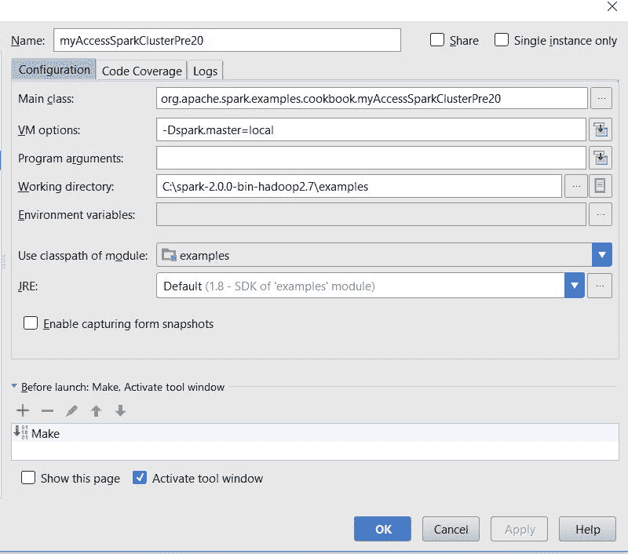

1.  我们使用上述 SparkContext 来读取 CSV 文件并使用以下代码将 CSV 文件解析为 Spark：

```scala
val file = sc.textFile("../data/sparkml2/chapter4/mySampleCSV.csv")
val headerAndData = file.map(line => line.split(",").map(_.trim))
val header = headerAndData.first
val data = headerAndData.filter(_(0) != header(0))
val maps = data.map(splits => header.zip(splits).toMap)
```

1.  我们获取样本结果并在控制台中打印它们：

```scala
val result = maps.take(4)
result.foreach(println)
```

1.  然后您将在控制台中看到以下内容：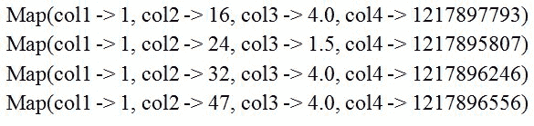

1.  然后我们通过停止 SparkContext 来关闭程序：

```scala
sc.stop()
```

# 它是如何工作的...

在这个例子中，我们展示了如何在 Spark 2.0 之前使用本地和远程模式连接到 Spark 集群。首先，我们创建一个`SparkConf`对象并配置所有必需的参数。我们将指定主位置、应用程序名称和工作数据目录。接下来，我们创建一个 SparkContext，传递`SparkConf`作为参数来访问 Spark 集群。此外，您还可以在启动客户端程序时通过传递 JVM 参数来指定主位置。最后，我们执行一个小的示例程序来证明我们的 SparkContext 正常运行。

# 还有更多...

在 Spark 2.0 之前，通过**SparkContext**获取对 Spark 集群的访问。

对子系统的访问，如 SQL，是特定名称上下文（例如，SQLContext**）。

Spark 2.0 通过创建一个统一的访问点（即`SparkSession`）来改变我们访问集群的方式。

# 另请参阅

SparkContext 的文档可在[`spark.apache.org/docs/latest/api/scala/index.html#org.apache.spark.SparkContext`](https://spark.apache.org/docs/latest/api/scala/index.html#org.apache.spark.SparkContext)上找到。

# 在 Spark 2.0 中通过 SparkSession 对象访问 SparkContext

在这个示例中，我们演示了如何使用 SparkSession 对象在 Spark 2.0 中获取 SparkContext。这个示例将演示从 RDD 到数据集的创建、使用和来回转换。这是重要的原因是，即使我们更喜欢数据集，我们仍然必须能够使用和增强大部分使用 RDD 的遗留（Spark 2.0 之前）代码。

# 如何做...

1.  在 IntelliJ 或您选择的 IDE 中启动新项目。确保包含必要的 JAR 文件。

1.  设置程序所在的包位置：

```scala
package spark.ml.cookbook.chapter4
```

1.  导入 Spark 会话所需的必要包，以访问集群和`log4j.Logger`以减少 Spark 产生的输出量：

```scala
import org.apache.log4j.{Level, Logger}
import org.apache.spark.sql.SparkSession
import scala.util.Random
```

1.  将输出级别设置为`ERROR`以减少 Spark 的日志输出：

```scala
Logger.getLogger("org").setLevel(Level.ERROR)
```

1.  使用构建模式初始化 Spark 会话，从而为 Spark 集群提供入口点：

```scala
val session = SparkSession
.builder
.master("local[*]")
.appName("SessionContextRDD")
.config("spark.sql.warehouse.dir", ".")
.getOrCreate()
```

1.  我们首先展示了如何使用`sparkContext`创建 RDD。以下代码示例在 Spark 1.x 中非常常见：

```scala
import session.implicits._

 // SparkContext
val context = session.sparkContext
```

我们获取`SparkContext`对象：

```scala
println("SparkContext")

val rdd1 = context.makeRDD(Random.shuffle(1 to 10).toList)
rdd1.collect().foreach(println)
println("-" * 45)

val rdd2 = context.parallelize(Random.shuffle(20 to 30).toList)
rdd2.collect().foreach(println)
println("\n End of SparkContext> " + ("-" * 45))
```

我们首先从`makeRDD`方法创建了`rdd1`并在控制台中显示了 RDD：

```scala
SparkContext
4
6
1
10
5
2
7
3
9
8
```

然后我们使用`parallelize`方法生成了`rdd2`，并在控制台中显示了 RDD 中的数据。

从控制台输出：

```scala
25
28
30
29
20
22
27
23
24
26
21
 End of SparkContext
```

1.  现在我们展示了使用`session`对象创建数据集的方法：

```scala
val dataset1 = session.range(40, 50)
 dataset1.show()

val dataset2 = session.createDataset(Random.shuffle(60 to 70).toList)
 dataset2.show()
```

我们使用不同的方法生成了`dataset1`和`dataset2`。

从控制台输出：

对于 dataset1：

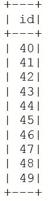

对于 dataset2：

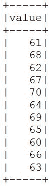

1.  我们展示了如何从数据集中检索基础 RDD：

```scala
// retrieve underlying RDD from Dataset
val rdd3 = dataset2.rdd
rdd3.collect().foreach(println)
```

从控制台输出：

```scala
61
68
62
67
70
64
69
65
60
66
63
```

1.  以下代码块显示了将 RDD 转换为数据集对象的方法：

```scala
// convert rdd to Dataset
val rdd4 = context.makeRDD(Random.shuffle(80 to 90).toList)
val dataset3 = session.createDataset(rdd4)
dataset3.show()
```

从控制台输出：

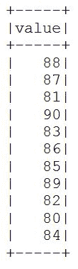

1.  通过停止 Spark 会话来关闭程序：

```scala
session.stop()
```

# 它是如何工作的...

我们使用 SparkContext 创建了 RDD；这在 Spark 1.x 中被广泛使用。我们还演示了在 Spark 2.0 中使用 Session 对象创建数据集的方法。在生产中，来回转换是必要的，以处理 Spark 2.0 之前的代码。

这个示例的技术信息是，虽然 DataSet 是未来数据处理的首选方法，但我们始终可以使用 API 来回转换为 RDD，反之亦然。

# 还有更多...

有关数据类型的更多信息，请访问[`spark.apache.org/docs/latest/sql-programming-guide.html`](http://spark.apache.org/docs/latest/sql-programming-guide.html)。

# 另请参阅

SparkContext 和 SparkSession 的文档可在以下网站找到：

+   [`spark.apache.org/docs/latest/api/scala/index.html#org.apache.spark.SparkContext`](http://spark.apache.org/docs/latest/api/scala/index.html#org.apache.spark.SparkContext)

+   [`spark.apache.org/docs/latest/api/scala/index.html#org.apache.spark.sql.SparkSession`](http://spark.apache.org/docs/latest/api/scala/index.html#org.apache.spark.sql.SparkSession)

# Spark 2.0 中的新模型导出和 PMML 标记

在这个示例中，我们探索了 Spark 2.0 中可用的模型导出功能，以使用**预测模型标记语言**（**PMML**）。这种标准的基于 XML 的语言允许您在其他系统上导出和运行您的模型（某些限制适用）。您可以在*还有更多...*部分中获取更多信息。

# 如何做...

1.  在 IntelliJ 或您选择的 IDE 中启动新项目。确保包含必要的 JAR 文件。

1.  设置程序所在的包位置：

```scala
package spark.ml.cookbook.chapter4
```

1.  导入 SparkContext 所需的必要包以访问集群：

```scala
import org.apache.spark.mllib.linalg.Vectors
import org.apache.spark.sql.SparkSession
import org.apache.spark.mllib.clustering.KMeans
```

1.  创建 Spark 的配置和 SparkContext：

```scala
val spark = SparkSession
.builder
.master("local[*]")   // if use cluster master("spark://master:7077")
.appName("myPMMLExport")
.config("spark.sql.warehouse.dir", ".")
.getOrCreate()
```

1.  我们从文本文件中读取数据；数据文件包含 KMeans 模型的样本数据集：

```scala
val data = spark.sparkContext.textFile("../data/sparkml2/chapter4/my_kmeans_data_sample.txt")

val parsedData = data.map(s => Vectors.dense(s.split(' ').map(_.toDouble))).cache()
```

1.  我们设置了 KMeans 模型的参数，并使用前述数据集和参数训练模型：

```scala
val numClusters = 2
val numIterations = 10
val model = KMeans.train(parsedData, numClusters, numIterations)
```

1.  我们已经有效地从我们刚刚创建的数据结构中创建了一个简单的 KMeans 模型（通过将聚类数设置为 2）。

```scala
println("MyKMeans PMML Model:\n" + model.toPMML)
```

在控制台中，它将显示以下模型：

```scala
MyKMeans PMML Model:
<?xml version="1.0" encoding="UTF-8" standalone="yes"?>
<PMML version="4.2" >
    <Header description="k-means clustering">
        <Application name="Apache Spark MLlib" version="2.0.0"/>
        <Timestamp>2016-11-06T13:34:57</Timestamp>
    </Header>
    <DataDictionary numberOfFields="3">
        <DataField name="field_0" optype="continuous" dataType="double"/>
        <DataField name="field_1" optype="continuous" dataType="double"/>
        <DataField name="field_2" optype="continuous" dataType="double"/>
    </DataDictionary>
    <ClusteringModel modelName="k-means" functionName="clustering" modelClass="centerBased" numberOfClusters="2">
        <MiningSchema>
            <MiningField name="field_0" usageType="active"/>
            <MiningField name="field_1" usageType="active"/>
            <MiningField name="field_2" usageType="active"/>
        </MiningSchema>
        <ComparisonMeasure kind="distance">
            <squaredEuclidean/>
        </ComparisonMeasure>
        <ClusteringField field="field_0" compareFunction="absDiff"/>
        <ClusteringField field="field_1" compareFunction="absDiff"/>
        <ClusteringField field="field_2" compareFunction="absDiff"/>
        <Cluster name="cluster_0">
            <Array n="3" type="real">9.06 9.179999999999998 9.12</Array>
        </Cluster>
        <Cluster name="cluster_1">
            <Array n="3" type="real">0.11666666666666665 0.11666666666666665 0.13333333333333333</Array>
        </Cluster>
    </ClusteringModel>
</PMML>
```

1.  然后我们将 PMML 导出到数据目录中的 XML 文件中：

```scala
model.toPMML("../data/sparkml2/chapter4/myKMeansSamplePMML.xml")
```

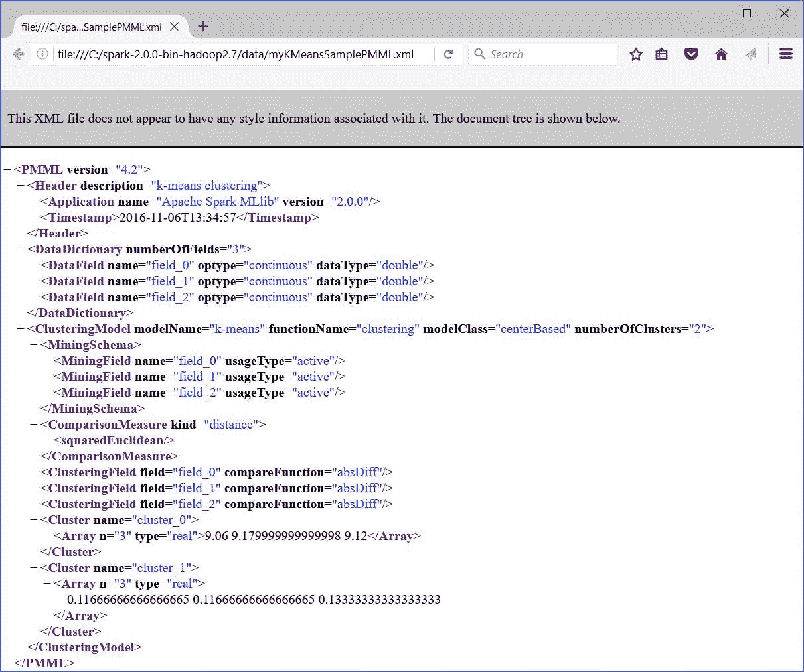

1.  然后我们通过停止 Spark 会话来关闭程序：

```scala
spark.stop()
```

# 它是如何工作的...

在训练模型后，下一步将是保存模型以供将来使用。在这个示例中，我们首先训练了一个 KMeans 模型，以生成后续步骤中的持久性模型信息。一旦我们有了训练好的模型，我们在模型上调用`toPMML()`方法，将其转换为 PMML 进行存储。该方法的调用会生成一个 XML 文档，然后 XML 文档文本可以轻松地持久化到文件中。

# 还有更多...

PMML 是由数据挖掘组（DMG）制定的标准。该标准通过允许您在一个系统上构建，然后在生产中部署到另一个系统，实现了跨平台的互操作性。PMML 标准已经获得了动力，并已被大多数供应商采用。在其核心，该标准基于一个 XML 文档，其中包括以下内容：

+   带有一般信息的标题

+   描述第三个组件（模型）使用的字段级定义的字典

+   模型结构和参数

截至目前，Spark 2.0 机器库对 PMML 导出的支持目前仅限于：

+   线性回归

+   逻辑回归

+   岭回归

+   套索

+   SVM

+   KMeans

您可以在 Spark 中将模型导出为以下文件类型：

+   本地文件系统：

```scala
Model_a.toPMML("/xyz/model-name.xml")
```

+   分布式文件系统：

```scala
Model_a.toPMML(SparkContext, "/xyz/model-name")
```

+   输出流--充当管道：

```scala
Model_a.toPMML(System.out)
```

# 另请参阅

`PMMLExportable` API 文档的文档在[`spark.apache.org/docs/latest/api/scala/index.html#org.apache.spark.mllib.pmml.PMMLExportable`](http://spark.apache.org/docs/latest/api/scala/index.html#org.apache.spark.mllib.pmml.PMMLExportable)。

# 使用 Spark 2.0 进行回归模型评估

在这个示例中，我们探讨了如何评估回归模型（在本例中是回归决策树）。Spark 提供了**RegressionMetrics**工具，它具有基本的统计功能，如**均方误差**（MSE），R-Squared 等。

这个示例的目标是了解 Spark 开箱即用提供的评估指标。最好集中在第 8 步，因为我们在第五章中更详细地介绍了回归，*Spark 2.0 中的实用机器学习-回归和分类第一部分*和第六章，*Spark 2.0 中的实用机器学习-回归和分类第二部分*以及整本书中。

# 如何做...

1.  在 IntelliJ 或您选择的 IDE 中启动一个新项目。确保包含必要的 JAR 文件。

1.  设置程序将驻留的包位置：

```scala
package spark.ml.cookbook.chapter4
```

1.  导入必要的包以便 SparkContext 可以访问集群：

```scala
import org.apache.spark.mllib.evaluation.RegressionMetrics
import org.apache.spark.mllib.linalg.Vectors
import org.apache.spark.mllib.regression.LabeledPoint
import org.apache.spark.mllib.tree.DecisionTree
import org.apache.spark.sql.SparkSession
```

1.  创建 Spark 的配置和 SparkContext：

```scala
val spark = SparkSession
.builder
.master("local[*]")
.appName("myRegressionMetrics")
.config("spark.sql.warehouse.dir", ".")
.getOrCreate()
```

1.  我们利用威斯康星州乳腺癌数据集作为回归模型的示例数据集。

威斯康星州乳腺癌数据集是从威斯康星大学医院的 William H Wolberg 博士那里获得的。数据集是定期获得的，因为 Wolberg 博士报告了他的临床病例。

有关数据集的更多详细信息可以在第九章中找到，*优化-使用梯度下降进行下坡*。

```scala
val rawData = spark.sparkContext.textFile("../data/sparkml2/chapter4/breast-cancer-wisconsin.data")
val data = rawData.map(_.trim)
   .filter(text => !(text.isEmpty || text.indexOf("?") > -1))
   .map { line =>
 val values = line.split(',').map(_.toDouble)
 val slicedValues = values.slice(1, values.size)
 val featureVector = Vectors.dense(slicedValues.init)
 val label = values.last / 2 -1
      LabeledPoint(label, featureVector)

   }
```

我们将数据加载到 Spark 中，并过滤数据中的缺失值。

1.  我们将数据集按 70:30 的比例分割成两个数据集，一个用于训练模型，另一个用于测试模型：

```scala
val splits = data.randomSplit(Array(0.7, 0.3))
val (trainingData, testData) = (splits(0), splits(1))
```

1.  我们设置参数并使用`DecisionTree`模型，在训练数据集之后，我们使用测试数据集进行预测：

```scala
val categoricalFeaturesInfo = Map[Int, Int]()
val impurity = "variance" val maxDepth = 5
val maxBins = 32

val model = DecisionTree.trainRegressor(trainingData, categoricalFeaturesInfo, impurity,
maxDepth, maxBins)
val predictionsAndLabels = testData.map(example =>
(model.predict(example.features), example.label)
)
```

1.  我们实例化`RegressionMetrics`对象并开始评估：

```scala
val metrics = new RegressionMetrics(predictionsAndLabels)
```

1.  我们在控制台中打印出统计值：

```scala
// Squared error
println(s"MSE = ${metrics.meanSquaredError}")
 println(s"RMSE = ${metrics.rootMeanSquaredError}")

 // R-squared
println(s"R-squared = ${metrics.r2}")

 // Mean absolute error
println(s"MAE = ${metrics.meanAbsoluteError}")

 // Explained variance
println(s"Explained variance = ${metrics.explainedVariance}")
```

从控制台输出：

```scala
MSE = 0.06071332254584681
RMSE = 0.2464007356844675
R-squared = 0.7444017305996473
MAE = 0.0691747572815534
Explained variance = 0.22591111058744653
```

1.  然后我们通过停止 Spark 会话来关闭程序：

```scala
spark.stop()
```

# 它是如何工作的...

在这个示例中，我们探讨了生成回归度量标准来帮助我们评估回归模型。我们开始加载一个乳腺癌数据文件，然后将其按 70/30 的比例分割，以创建训练和测试数据集。接下来，我们训练了一个`DecisionTree`回归模型，并利用它对我们的测试集进行了预测。最后，我们拿到了预测结果，并生成了回归度量标准，这给了我们平方误差，R 平方，平均绝对误差和解释的方差。

# 还有更多...

我们可以使用`RegressionMetrics()`来生成以下统计量：

+   MSE

+   RMSE

+   R 平方

+   MAE

+   解释的方差

有关回归验证的文档可在[`en.wikipedia.org/wiki/Regression_validation`](https://en.wikipedia.org/wiki/Regression_validation)上找到。

R 平方/决定系数可在[`en.wikipedia.org/wiki/Coefficient_of_determination`](https://en.wikipedia.org/wiki/Coefficient_of_determination)上找到。

# 另请参阅

+   威斯康星州乳腺癌数据集可以在 ftp://ftp.cs.wisc.edu/math-prog/cpo-dataset/machine-learn/cancer/cancer1/datacum 上下载

+   回归度量标准文档可在[`spark.apache.org/docs/latest/api/scala/index.html#org.apache.spark.mllib.evaluation.RegressionMetrics`](http://spark.apache.org/docs/latest/api/scala/index.html#org.apache.spark.mllib.evaluation.RegressionMetrics)上找到。

# 使用 Spark 2.0 进行二元分类模型评估

在这个示例中，我们演示了在 Spark 2.0 中使用`BinaryClassificationMetrics`工具以及其应用于评估具有二元结果的模型（例如逻辑回归）。

这里的目的不是展示回归本身，而是演示如何使用常见的度量标准（如**接收器操作特征**（**ROC**），ROC 曲线下面积，阈值等）来评估它。

我们建议您专注于第 8 步，因为我们在第五章中更详细地介绍了回归，*使用 Spark 2.0 进行回归和分类的实际机器学习-第 I 部分*和第六章中更详细地介绍了回归和分类的实际机器学习-第 II 部分*。

# 如何做...

1.  在 IntelliJ 或您选择的 IDE 中启动一个新项目。确保包含必要的 JAR 文件。

1.  设置程序所在的包位置：

```scala
package spark.ml.cookbook.chapter4
```

1.  导入必要的包以使 SparkContext 能够访问集群：

```scala
import org.apache.spark.sql.SparkSession
import org.apache.spark.mllib.classification.LogisticRegressionWithLBFGS
import org.apache.spark.mllib.evaluation.BinaryClassificationMetrics
import org.apache.spark.mllib.regression.LabeledPoint
import org.apache.spark.mllib.util.MLUtils
```

1.  创建 Spark 的配置和 SparkContext：

```scala
val spark = SparkSession
.builder
.master("local[*]")
.appName("myBinaryClassification")
.config("spark.sql.warehouse.dir", ".")
.getOrCreate()
```

1.  我们下载了数据集，最初来自 UCI，并对其进行修改以适应代码的需要：

```scala
// Load training data in LIBSVM format
//https://www.csie.ntu.edu.tw/~cjlin/libsvmtools/datasets/binary.html
val data = MLUtils.loadLibSVMFile(spark.sparkContext, "../data/sparkml2/chapter4/myBinaryClassificationData.txt")
```

数据集是一个修改后的数据集。原始的成年人数据集有 14 个特征，其中六个是连续的，八个是分类的。在这个数据集中，连续特征被离散化为分位数，并且每个分位数由一个二进制特征表示。我们修改了数据以适应代码的目的。数据集特征的详细信息可以在[`archive.ics.uci.edu/ml/index.php`](http://archive.ics.uci.edu/ml/index.php) UCI 网站上找到。

1.  我们将数据集随机分成 60:40 的训练和测试部分，然后得到模型：

```scala
val Array(training, test) = data.randomSplit(Array(0.6, 0.4), seed = 11L)
 training.cache()

 // Run training algorithm to build the model
val model = new LogisticRegressionWithLBFGS()
 .setNumClasses(2)
 .run(training)
```

1.  我们使用训练数据集创建模型进行预测：

```scala
val predictionAndLabels = test.map { case LabeledPoint(label, features) =>
 val prediction = model.predict(features)
 (prediction, label)
 }
```

1.  我们从预测中创建`BinaryClassificationMetrics`对象，并开始对指标进行评估：

```scala
val metrics = new BinaryClassificationMetrics(predictionAndLabels)
```

1.  我们在控制台中按`Threashold`打印出精度：

```scala
val precision = metrics.precisionByThreshold
 precision.foreach { case (t, p) =>
 println(s"Threshold: $t, Precision: $p")
 }
```

从控制台输出：

```scala
Threshold: 2.9751613212299755E-210, Precision: 0.5405405405405406
Threshold: 1.0, Precision: 0.4838709677419355
Threshold: 1.5283665404870175E-268, Precision: 0.5263157894736842
Threshold: 4.889258814400478E-95, Precision: 0.5
```

1.  我们在控制台中打印出`recallByThreshold`：

```scala
val recall = metrics.recallByThreshold
 recall.foreach { case (t, r) =>
 println(s"Threshold: $t, Recall: $r")
 }
```

从控制台输出：

```scala
Threshold: 1.0779893231660571E-300, Recall: 0.6363636363636364
Threshold: 6.830452412352692E-181, Recall: 0.5151515151515151
Threshold: 0.0, Recall: 1.0
Threshold: 1.1547199216963482E-194, Recall: 0.5757575757575758
```

1.  我们在控制台中打印出`fmeasureByThreshold`：

```scala
val f1Score = metrics.fMeasureByThreshold
 f1Score.foreach { case (t, f) =>
 println(s"Threshold: $t, F-score: $f, Beta = 1")
 }
```

从控制台输出：

```scala
Threshold: 1.0, F-score: 0.46874999999999994, Beta = 1
Threshold: 4.889258814400478E-95, F-score: 0.49230769230769234, Beta = 1
Threshold: 2.2097791212639423E-117, F-score: 0.48484848484848486, Beta = 1

val beta = 0.5
val fScore = metrics.fMeasureByThreshold(beta)
f1Score.foreach { case (t, f) =>
  println(s"Threshold: $t, F-score: $f, Beta = 0.5")
}
```

从控制台输出：

```scala
Threshold: 2.9751613212299755E-210, F-score: 0.5714285714285714, Beta = 0.5
Threshold: 1.0, F-score: 0.46874999999999994, Beta = 0.5
Threshold: 1.5283665404870175E-268, F-score: 0.5633802816901409, Beta = 0.5
Threshold: 4.889258814400478E-95, F-score: 0.49230769230769234, Beta = 0.5
```

1.  我们在控制台中打印出`Area Under Precision Recall Curve`：

```scala
val auPRC = metrics.areaUnderPR
println("Area under precision-recall curve = " + auPRC)
```

从控制台输出：

```scala
Area under precision-recall curve = 0.5768388996048239
```

1.  我们在控制台中打印出 ROC 曲线下面积：

```scala
val thresholds = precision.map(_._1)

val roc = metrics.roc

val auROC = metrics.areaUnderROC
println("Area under ROC = " + auROC)
```

从控制台输出：

```scala
Area under ROC = 0.6983957219251337
```

1.  然后通过停止 Spark 会话来关闭程序：

```scala
spark.stop()
```

# 它是如何工作的...

在这个示例中，我们调查了二元分类指标的评估。首先，我们加载了数据，它是以`libsvm`格式，然后将其按 60:40 的比例分割，从而创建了训练和测试数据集。接下来，我们训练了一个逻辑回归模型，然后从我们的测试集生成了预测。

一旦我们有了预测结果，我们创建了一个二元分类指标对象。最后，我们检索真正率、阳性预测值、接收器操作曲线、接收器操作曲线下面积、精度-召回曲线下面积和 F-度量来评估我们的模型适应性。

# 还有更多...

Spark 提供以下指标以便进行评估：

+   TPR - 真正率

+   PPV - 阳性预测值

+   F - F-度量

+   ROC - 接收器操作曲线

+   AUROC - 接收器操作曲线下面积

+   AUORC - 精度-召回曲线下面积

以下链接应提供有关指标的良好入门材料：

+   [`en.wikipedia.org/wiki/Receiver_operating_characteristic`](https://en.wikipedia.org/wiki/Receiver_operating_characteristic)

+   [`en.wikipedia.org/wiki/Sensitivity_and_specificity`](https://en.wikipedia.org/wiki/Sensitivity_and_specificity)

+   [`en.wikipedia.org/wiki/F1_score`](https://en.wikipedia.org/wiki/F1_score)

# 另请参阅

原始数据集信息的文档可在以下链接找到：

+   [`www.csie.ntu.edu.tw/~cjlin/libsvmtools/datasets/binary.html`](https://www.csie.ntu.edu.tw/~cjlin/libsvmtools/datasets/binary.html)

+   [`archive.ics.uci.edu/ml/datasets.html`](http://archive.ics.uci.edu/ml/datasets.html)

二元分类指标的文档可在以下链接找到：[`spark.apache.org/docs/latest/api/scala/index.html#org.apache.spark.mllib.evaluation.BinaryClassificationMetrics`](http://spark.apache.org/docs/latest/api/scala/index.html#org.apache.spark.mllib.evaluation.BinaryClassificationMetrics)。

# 使用 Spark 2.0 进行多类分类模型评估

在这个示例中，我们探讨了`MulticlassMetrics`，它允许您评估将输出分类到两个以上标签的模型（例如，红色、蓝色、绿色、紫色、不知道）。它突出了混淆矩阵（`confusionMatrix`）和模型准确性的使用。

# 如何做...

1.  在 IntelliJ 或您选择的 IDE 中启动一个新项目。确保包含必要的 JAR 文件。

1.  设置程序所在的包位置：

```scala
package spark.ml.cookbook.chapter4
```

1.  导入必要的包以便 SparkContext 可以访问集群：

```scala
import org.apache.spark.sql.SparkSession
import org.apache.spark.mllib.classification.LogisticRegressionWithLBFGS
import org.apache.spark.mllib.evaluation.MulticlassMetrics
import org.apache.spark.mllib.regression.LabeledPoint
import org.apache.spark.mllib.util.MLUtils
```

1.  创建 Spark 的配置和 SparkContext：

```scala
val spark = SparkSession
.builder
.master("local[*]")
.appName("myMulticlass")
.config("spark.sql.warehouse.dir", ".")
.getOrCreate()
```

1.  我们下载了最初来自 UCI 的数据集，并对其进行修改以适应代码的需要：

```scala
// Load training data in LIBSVM format
//https://www.csie.ntu.edu.tw/~cjlin/libsvmtools/datasets/multiclass.html
val data = MLUtils.loadLibSVMFile(spark.sparkContext, "../data/sparkml2/chapter4/myMulticlassIrisData.txt")
```

数据集是一个修改后的数据集。原始的鸢尾花植物数据集有四个特征。我们修改了数据以适应代码的目的。数据集特征的详细信息可以在 UCI 网站上找到。

1.  我们将数据集随机分成 60%的训练部分和 40%的测试部分，然后得到模型：

```scala
val Array(training, test) = data.randomSplit(Array(0.6, 0.4), seed = 11L)
 training.cache()

 // Run training algorithm to build the model
val model = new LogisticRegressionWithLBFGS()
 .setNumClasses(3)
 .run(training)
```

1.  我们在测试数据集上计算原始分数：

```scala
val predictionAndLabels = test.map { case LabeledPoint(label, features) =>
 val prediction = model.predict(features)
 (prediction, label)
 }
```

1.  我们从预测中创建了`MulticlassMetrics`对象，并开始对指标进行评估：

```scala
val metrics = new MulticlassMetrics(predictionAndLabels)
```

1.  我们在控制台中打印出混淆矩阵：

```scala
println("Confusion matrix:")
println(metrics.confusionMatrix)
```

从控制台输出：

```scala
Confusion matrix: 
18.0 0.0 0.0 
0.0 15.0 8.0 
0.0 0.0 22.0
```

1.  我们在控制台中打印出总体统计信息：

```scala
val accuracy = metrics.accuracy
println("Summary Statistics")
println(s"Accuracy = $accuracy")
```

从控制台输出：

```scala
Summary Statistics
Accuracy = 0.873015873015873
```

1.  我们在控制台中按标签值打印出精度：

```scala
val labels = metrics.labels
labels.foreach { l =>
 println(s"Precision($l) = " + metrics.precision(l))
 }
```

从控制台输出：

```scala
Precision(0.0) = 1.0
Precision(1.0) = 1.0
Precision(2.0) = 0.7333333333333333
```

1.  我们在控制台中按标签打印出召回率：

```scala
labels.foreach { l =>
println(s"Recall($l) = " + metrics.recall(l))
 }
```

从控制台输出：

```scala
Recall(0.0) = 1.0
Recall(1.0) = 0.6521739130434783
Recall(2.0) = 1.0
```

1.  我们在控制台中按标签打印出假阳性率：

```scala
labels.foreach { l =>
 println(s"FPR($l) = " + metrics.falsePositiveRate(l))
 }
```

从控制台输出：

```scala
FPR(0.0) = 0.0
FPR(1.0) = 0.0
FPR(2.0) = 0.1951219512195122
```

1.  我们在控制台中按标签打印出 F-度量：

```scala
labels.foreach { l =>
 println(s"F1-Score($l) = " + metrics.fMeasure(l))
 }
```

从控制台输出：

```scala
F1-Score(0.0) = 1.0
F1-Score(1.0) = 0.7894736842105263
F1-Score(2.0) = 0.846153846153846
```

1.  我们在控制台中打印出加权统计值：

```scala
println(s"Weighted precision: ${metrics.weightedPrecision}")
 println(s"Weighted recall: ${metrics.weightedRecall}")
 println(s"Weighted F1 score: ${metrics.weightedFMeasure}")
 println(s"Weighted false positive rate: ${metrics.weightedFalsePositiveRate}")
```

从控制台输出：

```scala
Weighted precision: 0.9068783068783068
Weighted recall: 0.873015873015873
Weighted F1 score: 0.8694171325750273
Weighted false positive rate: 0.06813782423538521
```

1.  然后通过停止 Spark 会话来关闭程序：

```scala
spark.stop()
```

# 它是如何工作的...

在这个教程中，我们探索了为多类别模型生成评估指标。首先，我们将 Iris 数据加载到内存中，并将其按比例 60:40 拆分。其次，我们训练了一个逻辑回归模型，分类数设置为三。第三，我们对测试数据集进行了预测，并利用`MultiClassMetric`生成评估测量。最后，我们评估了诸如模型准确度、加权精度、加权召回率、加权 F1 分数、加权假阳性率等指标。

# 还有更多...

虽然本书的范围不允许对混淆矩阵进行完整处理，但提供了简短的解释和链接作为快速参考。

混淆矩阵只是一个错误矩阵的花哨名称。它主要用于无监督学习来可视化性能。它是一个布局，以两个维度捕获实际与预测结果的相同标签集：

**混淆矩阵**

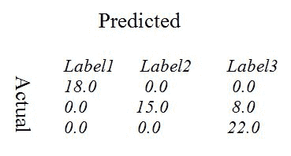

要快速了解无监督和监督统计学习系统中的混淆矩阵，请参阅[`en.wikipedia.org/wiki/Confusion_matrix`](https://en.wikipedia.org/wiki/Confusion_matrix)。

# 另请参阅

原始数据集信息的文档可在以下网站找到：

+   [`www.csie.ntu.edu.tw/~cjlin/libsvmtools/datasets/multiclass.html`](https://www.csie.ntu.edu.tw/~cjlin/libsvmtools/datasets/multiclass.html)

+   [`archive.ics.uci.edu/ml/datasets/Iris`](http://archive.ics.uci.edu/ml/datasets/Iris)

多类别分类指标的文档可在以下网址找到：

+   [`spark.apache.org/docs/latest/api/scala/index.html#org.apache.spark.mllib.evaluation.MulticlassMetrics`](http://spark.apache.org/docs/latest/api/scala/index.html#org.apache.spark.mllib.evaluation.MulticlassMetrics)

# 使用 Spark 2.0 进行多标签分类模型评估

在这个教程中，我们探讨了 Spark 2.0 中的多标签分类`MultilabelMetrics`，这不应该与处理多类别分类`MulticlassMetrics`的先前教程混淆。探索这个教程的关键是集中在评估指标，如汉明损失、准确度、f1 度量等，以及它们的测量。

# 如何做...

1.  在 IntelliJ 或您选择的 IDE 中启动新项目。确保包含必要的 JAR 文件。

1.  设置程序将驻留的包位置：

```scala
package spark.ml.cookbook.chapter4
```

1.  导入必要的包以便 SparkContext 可以访问集群：

```scala
import org.apache.spark.sql.SparkSession
import org.apache.spark.mllib.evaluation.MultilabelMetrics
import org.apache.spark.rdd.RDD
```

1.  创建 Spark 的配置和 SparkContext：

```scala
val spark = SparkSession
.builder
.master("local[*]")
.appName("myMultilabel")
.config("spark.sql.warehouse.dir", ".")
.getOrCreate()
```

1.  我们为评估模型创建数据集：

```scala
val data: RDD[(Array[Double], Array[Double])] = spark.sparkContext.parallelize(
Seq((Array(0.0, 1.0), Array(0.1, 2.0)),
     (Array(0.0, 2.0), Array(0.1, 1.0)),
     (Array.empty[Double], Array(0.0)),
     (Array(2.0), Array(2.0)),
     (Array(2.0, 0.0), Array(2.0, 0.0)),
     (Array(0.0, 1.0, 2.0), Array(0.0, 1.0)),
     (Array(1.0), Array(1.0, 2.0))), 2)
```

1.  我们从预测中创建`MultilabelMetrics`对象，并开始对指标进行评估：

```scala
val metrics = new MultilabelMetrics(data)
```

1.  我们在控制台中打印出总体统计摘要：

```scala
println(s"Recall = ${metrics.recall}")
println(s"Precision = ${metrics.precision}")
println(s"F1 measure = ${metrics.f1Measure}")
println(s"Accuracy = ${metrics.accuracy}")
```

从控制台输出：

```scala
Recall = 0.5
Precision = 0.5238095238095238
F1 measure = 0.4952380952380952
Accuracy = 0.4523809523809524
```

1.  我们在控制台中打印出各个标签值：

```scala
metrics.labels.foreach(label =>
 println(s"Class $label precision = ${metrics.precision(label)}"))
 metrics.labels.foreach(label => println(s"Class $label recall = ${metrics.recall(label)}"))
 metrics.labels.foreach(label => println(s"Class $label F1-score = ${metrics.f1Measure(label)}"))
```

从控制台输出：

```scala
Class 0.0 precision = 0.5
Class 1.0 precision = 0.6666666666666666
Class 2.0 precision = 0.5
Class 0.0 recall = 0.6666666666666666
Class 1.0 recall = 0.6666666666666666
Class 2.0 recall = 0.5
Class 0.0 F1-score = 0.5714285714285715
Class 1.0 F1-score = 0.6666666666666666
Class 2.0 F1-score = 0.5
```

1.  我们在控制台中打印出微观统计值：

```scala
println(s"Micro recall = ${metrics.microRecall}")
println(s"Micro precision = ${metrics.microPrecision}")
println(s"Micro F1 measure = ${metrics.microF1Measure}")
From the console output:
Micro recall = 0.5
Micro precision = 0.5454545454545454
Micro F1 measure = 0.5217391304347826
```

1.  我们在控制台中打印出指标中的汉明损失和子集准确度：

```scala
println(s"Hamming loss = ${metrics.hammingLoss}")
println(s"Subset accuracy = ${metrics.subsetAccuracy}")
From the console output:
Hamming loss = 0.39285714285714285
Subset accuracy = 0.2857142857142857
```

1.  然后通过停止 Spark 会话来关闭程序。

```scala
spark.stop()
```

# 它是如何工作的...

在这个教程中，我们调查了为多标签分类模型生成评估指标。我们首先手动创建了一个用于模型评估的数据集。接下来，我们将我们的数据集作为参数传递给`MultilabelMetrics`并生成评估指标。最后，我们打印出各种指标，如微观召回率、微观精度、微观 f1 度量、汉明损失、子集准确度等。

# 还有更多...

请注意，多标签和多类别分类听起来相似，但它们是两回事。

所有多标签`MultilabelMetrics()`方法试图做的只是将多个输入（x）映射到二进制向量（y），而不是典型分类系统中的数值。

与多标签分类相关的重要指标是（参见前面的代码）：

+   准确度

+   汉明损失

+   精度

+   召回

+   F1

每个参数的详细解释超出了范围，但以下链接提供了多标签指标的简短处理：

[`en.wikipedia.org/wiki/Multi-label_classification`](https://en.wikipedia.org/wiki/Multi-label_classification)

# 另请参阅

多标签分类指标的文档：

+   [`spark.apache.org/docs/latest/api/scala/index.html#org.apache.spark.mllib.evaluation.MultilabelMetrics`](http://spark.apache.org/docs/latest/api/scala/index.html#org.apache.spark.mllib.evaluation.MultilabelMetrics)

# 在 Spark 2.0 中使用 Scala Breeze 库进行图形处理

在这个示例中，我们将使用 Scala Breeze 线性代数库（部分）的`scatter()`和`plot()`函数来绘制二维数据的散点图。一旦在 Spark 集群上计算出结果，可以在驱动程序中使用可操作数据进行绘制，也可以在后端生成 JPEG 或 GIF 并推动效率和速度（在基于 GPU 的分析数据库中很受欢迎，如 MapD）。

# 如何操作...

1.  首先，我们需要下载必要的 ScalaNLP 库。从 Maven 仓库下载 JAR 文件，网址为[`repo1.maven.org/maven2/org/scalanlp/breeze-viz_2.11/0.12/breeze-viz_2.11-0.12.jar`](https://repo1.maven.org/maven2/org/scalanlp/breeze-viz_2.11/0.12/breeze-viz_2.11-0.12.jar)。

1.  在 Windows 机器上的`C:\spark-2.0.0-bin-hadoop2.7\examples\jars`目录中放置 JAR 文件：

1.  在 macOS 中，请将 JAR 文件放在正确的路径下。对于我们的设置示例，路径为`/Users/USERNAME/spark/spark-2.0.0-bin-hadoop2.7/examples/jars/`。

1.  以下是显示 JAR 文件的示例截图：

1.  在 IntelliJ 或您选择的 IDE 中启动一个新项目。确保包含必要的 JAR 文件。

1.  设置程序所在的包位置：

```scala
package spark.ml.cookbook.chapter4
```

1.  导入必要的包以便 Spark 会话可以访问集群和`log4j.Logger`以减少 Spark 产生的输出量：

```scala
import org.apache.log4j.{Level, Logger}
import org.apache.spark.sql.SparkSession
import breeze.plot._

import scala.util.Random
```

1.  将输出级别设置为`ERROR`以减少 Spark 的日志输出：

```scala
Logger.getLogger("org").setLevel(Level.ERROR)
```

1.  通过使用构建器模式指定配置来初始化 Spark 会话，从而为 Spark 集群提供入口点：

```scala
val spark = SparkSession
.builder
.master("local[*]")
.appName("myBreezeChart")
.config("spark.sql.warehouse.dir", ".")
.getOrCreate()
```

1.  现在我们创建图形对象，并设置图形的参数：

```scala
import spark.implicits._

val fig = Figure()
val chart = fig.subplot(0)

chart.title = "My Breeze-Viz Chart" chart.xlim(21,100)
chart.ylim(0,100000)
```

1.  我们从随机数创建一个数据集，并显示数据集。

1.  数据集将在以后使用。

```scala
val ages = spark.createDataset(Random.shuffle(21 to 100).toList.take(45)).as[Int]

 ages.show(false)
```

从控制台输出：

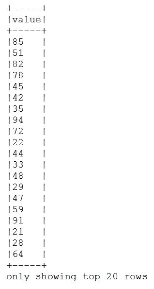

1.  我们收集数据集，并设置*x*和*y*轴。

1.  对于照片部分，我们将数据类型转换为 double，并将值派生为`y2`。

1.  我们使用 Breeze 库的 scatter 方法将数据放入图表中，并使用 Breeze 的 plot 方法绘制对角线：

```scala
val x = ages.collect()
val y = Random.shuffle(20000 to 100000).toList.take(45)

val x2 = ages.collect().map(xx => xx.toDouble)
val y2 = x2.map(xx => (1000 * xx) + (xx * 2))

chart += scatter(x, y, _ => 0.5)
chart += plot(x2, y2)

chart.xlabel = "Age" chart.ylabel = "Income" fig.refresh()
```

1.  我们为*x*轴和*y*轴设置标签，并刷新图形对象。

1.  以下是生成的 Breeze 图表：

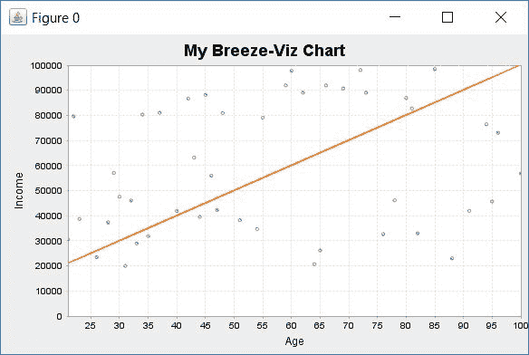

1.  通过停止 Spark 会话来关闭程序：

```scala
spark.stop()
```

# 它是如何工作的...

在这个示例中，我们从随机数中创建了一个 Spark 数据集。然后创建了一个 Breeze 图，并设置了基本参数。我们从创建的数据集中派生了*x*和*y*数据。

我们使用 Breeze 库的`scatter()`和`plot()`函数来使用 Breeze 库进行图形处理。

# 还有更多...

可以使用 Breeze 作为更复杂和强大的图表库（如前一章中演示的 JFreeChart）的替代方案。ScalaNLP 项目倾向于使用 Scala 好用的功能，比如隐式转换，使编码相对容易。

Breeze 图形 JAR 文件可以在[`central.maven.org/maven2/org/scalanlp/breeze-viz_2.11/0.12/breeze-viz_2.11-0.12.jar`](http://central.maven.org/maven2/org/scalanlp/breeze-viz_2.11/0.12/breeze-viz_2.11-0.12.jar)下载。

有关 Breeze 图形的更多信息，请访问[`github.com/scalanlp/breeze/wiki/Quickstart`](https://github.com/scalanlp/breeze/wiki/Quickstart)。

API 文档（请注意，API 文档未必是最新的）可在[`www.scalanlp.org/api/breeze/#package`](http://www.scalanlp.org/api/breeze/#package)找到。

注意，一旦您进入根包，您需要点击 Breeze 查看详细信息。

# 另请参阅

有关 Breeze 的更多信息，请参阅 GitHub 上的原始材料[`github.com/scalanlp/breeze`](https://github.com/scalanlp/breeze)。

注意，一旦您进入根包，您需要点击 Breeze 查看详细信息。

有关 Breeze API 文档的更多信息，请下载[`repo1.maven.org/maven2/org/scalanlp/breeze-viz_2.11/0.12/breeze-viz_2.11-0.12-javadoc.jar`](https://repo1.maven.org/maven2/org/scalanlp/breeze-viz_2.11/0.12/breeze-viz_2.11-0.12-javadoc.jar) JAR。
