# 第五章：在 Spark 2.0 中进行回归和分类的实用机器学习-第一部分

在本章中，我们将涵盖以下内容：

+   将线性回归线拟合到数据的传统方法

+   Spark 2.0 中的广义线性回归

+   Spark 2.0 中具有 Lasso 和 L-BFGS 的线性回归 API

+   Spark 2.0 中具有 Lasso 和自动优化选择的线性回归 API

+   Spark 2.0 中具有岭回归和自动优化选择的线性回归 API

+   Apache Spark 2.0 中的等保回归

+   Apache Spark 2.0 中的多层感知器分类器

+   Apache Spark 2.0 中的一对多分类器（One-vs-All）

+   Apache Spark 2.0 中的生存回归-参数 AFT 模型

# 介绍

本章与下一章一起，涵盖了 Spark 2.0 ML 和 MLlib 库中可用的回归和分类的基本技术。Spark 2.0 通过将基于 RDD 的回归（见下一章）移动到维护模式来突显新的方向，同时强调**线性回归**和**广义回归**。

在高层次上，新的 API 设计更倾向于对弹性网的参数化，以产生岭回归与 Lasso 回归以及两者之间的一切，而不是命名 API（例如，`LassoWithSGD`）。新的 API 方法是一个更清晰的设计，并迫使您学习弹性网及其在特征工程中的作用，这在数据科学中仍然是一门艺术。我们提供充分的例子、变化和注释，以指导您应对这些技术中的复杂性。

以下图表描述了本章中回归和分类覆盖范围（第一部分）：

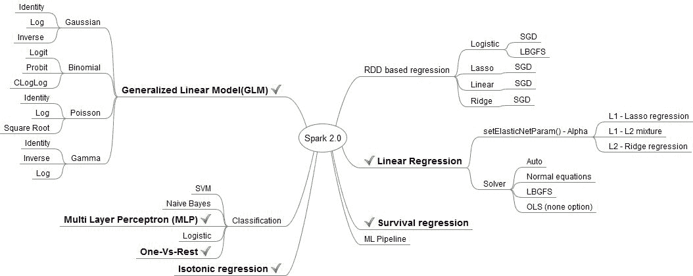

首先，您将学习如何使用代数方程通过 Scala 代码和 RDD 从头开始实现线性回归，以便了解数学和为什么我们需要迭代优化方法来估计大规模回归系统的解决方案。其次，我们探讨**广义线性模型**（**GLM**）及其各种统计分布家族和链接函数，同时强调当前实现中仅限于 4,096 个参数的限制。第三，我们解决**线性回归模型**（**LRM**）以及如何使用弹性网参数化来混合和匹配 L1 和 L2 惩罚函数，以实现逻辑回归、岭回归、Lasso 等。我们还探讨了求解器（即优化器）方法以及如何设置它以使用 L-BFGS 优化、自动优化选择等。

在探索 GLM 和线性回归配方之后，我们继续提供更多外来的回归/分类方法的配方，例如等保回归、多层感知器（即神经元网络的形式）、一对多和生存回归，以展示 Spark 2.0 处理线性技术无法解决的情况的能力和完整性。随着 21 世纪初金融世界风险的增加和基因组的新进展，Spark 2.0 还将四种重要方法（等保回归、多层感知器、一对多和生存回归或参数 AFT）整合到一个易于使用的机器学习库中。规模化的参数 AFT 方法应该特别受到金融、数据科学家或精算专业人士的关注。

尽管一些方法，比如`LinearRegression()` API，从理论上来说自 1.3x+版本就已经可用，但重要的是要注意，Spark 2.0 将它们全部整合到一个易于使用和可维护的 API 中（即向后兼容），以 glmnet R 的方式移动基于 RDD 的回归 API 到维护模式。L-BFGS 优化器和正规方程占据主导地位，而 SGD 在 RDD-based APIs 中可用以实现向后兼容。

弹性网络是首选方法，不仅可以绝对处理 L1（Lasso 回归）和 L2（岭回归）的正则化方法，还可以提供类似拨盘的机制，使用户能够微调惩罚函数（参数收缩与选择）。虽然我们在 1.4.2 中使用了弹性网功能，但 Spark 2.0 将所有内容整合在一起，无需处理每个单独的 API 进行参数调整（根据最新数据动态选择模型时很重要）。当我们开始深入研究这些配方时，我们强烈鼓励用户探索各种参数设置`setElasticNetParam()`和`setSolver()`配置，以掌握这些强大的 API。重要的是不要混淆惩罚函数`setElasticNetParam(value: Double)`（L1，L2，OLs，弹性网：线性混合 L1/L2），这些是正则化或模型惩罚方案与与成本函数优化技术相关的优化（正常，L-BFGS，自动等）技术。

需要注意的是，基于 RDD 的回归仍然非常重要，因为有很多当前的 ML 实现系统严重依赖于以前的 API 体系及其 SGD 优化器。请参阅下一章，了解基于 RDD 的回归的完整处理和教学笔记。

# 用传统的方法将线性回归线拟合到数据

在这个配方中，我们使用 RDD 和封闭形式公式从头开始编写一个简单的线性方程。我们之所以将这个作为第一个配方，是为了演示您可以始终通过 RDD 实现任何给定的统计学习算法，以实现使用 Apache Spark 的计算规模。

# 如何做...

1.  在 IntelliJ 或您选择的 IDE 中启动一个新项目。确保包含必要的 JAR 文件。

1.  设置程序所在的包位置：

```scala
package spark.ml.cookbook.chapter5
```

1.  导入必要的包，以便`SparkSession`获得对集群的访问，以及`log4j.Logger`以减少 Spark 产生的输出量：

```scala
import org.apache.spark.sql.SparkSession
import scala.math._
import org.apache.log4j.Logger
import org.apache.log4j.Level
```

1.  使用构建模式初始化`SparkSession`，指定配置，从而使 Spark 集群的入口点可用：

```scala
val spark = SparkSession
 .builder
 .master("local[4]")
 .appName("myRegress01_20")
 .config("spark.sql.warehouse.dir", ".")
 .getOrCreate()
```

1.  将输出级别设置为`ERROR`以减少 Spark 的输出：

```scala
Logger.getLogger("org").setLevel(Level.ERROR)
Logger.getLogger("akka").setLevel(Level.ERROR)
```

1.  我们创建两个数组，表示因变量（即`y`）和自变量（即`x`）：

```scala
val x = Array(1.0,5.0,8.0,10.0,15.0,21.0,27.0,30.0,38.0,45.0,50.0,64.0)
val y = Array(5.0,1.0,4.0,11.0,25.0,18.0,33.0,20.0,30.0,43.0,55.0,57.0)
```

1.  我们使用`sc.parallelize(x)`将两个数组转换为 RDD：

```scala
val xRDD = sc.parallelize(x)
val yRDD = sc.parallelize(y)
```

1.  在这一步中，我们演示了 RDD 的`zip()`方法，它从两个 RDD 中创建因变量/自变量元组*(y,x)*。我们介绍这个函数，因为您经常需要学习如何在机器学习算法中使用成对工作：

```scala
val zipedRDD = xRDD.zip(yRDD)
```

1.  为了确保我们理解`zip()`功能，让我们来看一下输出，但一定要包括`collect()`或其他形式的操作，以确保数据按顺序呈现。如果我们不使用操作方法，RDD 的输出将是随机的：

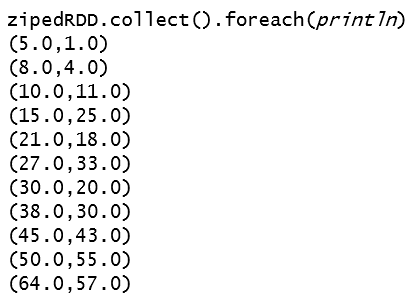

1.  这是一个重要的步骤，演示了如何迭代、访问和计算每个成员。为了计算回归线，我们需要计算和、乘积和平均值（即*sum(x)*、*sum(y)*和*sum (x * y)*）。`map(_._1).sum()`函数是一种机制，RDD 对被迭代，但只考虑第一个元素：

```scala
val xSum = zipedRDD.map(_._1).sum()
val ySum = zipedRDD.map(_._2).sum()
val xySum= zipedRDD.map(c => c._1 * c._2).sum()
```

1.  在这一步中，我们继续计算每个 RDD 对成员的平均值以及它们的乘积。这些单独的计算（即*mean(x)*、*mean(y)*和*mean(x*y)*），以及平均平方，将用于计算回归线的斜率和截距。虽然我们可以从前面的统计数据中手动计算平均值，但我们应该确保熟悉 RDD 内在可用的方法：

```scala
val n= zipedRDD.count() 
val xMean = zipedRDD.map(_._1).mean()
val yMean = zipedRDD.map(_._2).mean()
val xyMean = zipedRDD.map(c => c._1 * c._2).mean()
```

1.  这是最后一步，我们计算`x`和`y`的平方的平均值：

```scala
val xSquaredMean = zipedRDD.map(_._1).map(x => x * x).mean()
val ySquaredMean = zipedRDD.map(_._2).map(y => y * y).mean()
```

1.  我们打印统计信息以供参考：

```scala
println("xMean yMean xyMean", xMean, yMean, xyMean) 
xMean yMean xyMean ,26.16,25.16,989.08 
```

1.  我们计算公式的`分子`和`分母`：

```scala
val numerator = xMean * yMean  - xyMean
val denominator = xMean * xMean - xSquaredMean
```

1.  我们最终计算回归线的斜率：

```scala
val slope = numerator / denominator
println("slope %f5".format(slope))

slope 0.9153145 
```

1.  现在我们计算截距并打印。如果你不想要截距（截距设置为`0`），那么斜率的公式需要稍作修改。你可以在其他来源（如互联网）中寻找更多细节并找到所需的方程：

```scala
val b_intercept = yMean - (slope*xMean)
println("Intercept", b_intercept) 

Intercept,1.21
```

1.  使用斜率和截距，我们将回归线方程写成如下形式：

```scala
Y = 1.21 + .9153145 * X
```

# 它是如何工作的...

我们声明了两个 Scala 数组，将它们并行化为两个分开的`x()`和`y()`的 RDD，然后使用 RDD API 中的`zip()`方法产生了一个成对的（即，压缩的）RDD。它产生了一个 RDD，其中每个成员都是一个*(x，y)*对。然后我们继续计算均值，总和等，并应用上述封闭形式的公式来找到回归线的截距和斜率。

在 Spark 2.0 中，另一种选择是直接使用 GLM API。值得一提的是，GLM 支持的封闭正态形式方案的最大参数数量限制为 4,096。

我们使用了封闭形式的公式来证明与一组数字（*Y1，X1），...，（Yn，Xn）*相关联的回归线简单地是最小化平方误差和的线。在简单的回归方程中，该线如下：

+   回归线的斜率 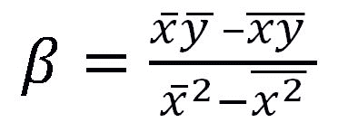

+   回归线的偏移 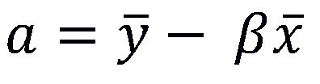

+   回归线的方程 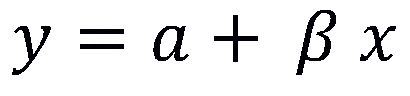

回归线简单地是最小化平方误差和的最佳拟合线。对于一组点（因变量，自变量），有许多直线可以穿过这些点并捕捉到一般的线性关系，但只有其中一条线是最小化所有拟合误差的线。

例如，我们呈现了线*Y = 1.21 + .9153145 * X*。下图显示了这样一条线，我们使用封闭形式的公式计算了斜率和偏移。线性模型由线性方程表示，代表了我们使用封闭形式公式得到的给定数据的最佳线性模型（*斜率=.915345*，*截距=1.21*）：

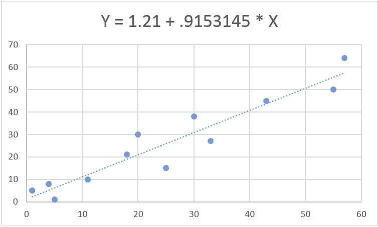

在前面的图中绘制的数据点如下：

```scala
(Y, X)
(5.0,    1.0) 
(8.0,    4.0) 
(10.0,   11.0) 
(15.0,   25.0) 
(21.0,   18.0) 
(27.0,   33.0) 
(30.0,   20.0) 
(38.0,   30.0) 
(45.0,   43.0) 
(50.0,   55.0) 
(64.0,   57.0) 
```

# 还有更多...

值得注意的是，并非所有的回归形式都有封闭形式的公式，或者在大型数据集上变得非常低效（即，不切实际）-这就是我们使用 SGD 或 L-BFGS 等优化技术的原因。

从之前的教程中，你应该确保缓存与机器学习算法相关的任何 RDD 或数据结构，以避免由于 Spark 优化和维护血统（即，延迟实例化）的方式而导致的延迟实例化。

# 另请参阅

我们推荐一本来自斯坦福大学的书，可以从以下网站免费下载。无论你是新手还是高级从业者，这都是一本经典必读的书：

《统计学习的要素，数据挖掘，推断和预测，第二版》，Hastie，Tibshirani 和 Friedman（2009）。Springer-Verlag ([`web.stanford.edu/~hastie/ElemStatLearn/`](http://web.stanford.edu/~hastie/ElemStatLearn/))。

# Spark 2.0 中的广义线性回归

本教程涵盖了 Spark 2.0 中的**广义回归模型**（**GLM**）实现。Spark 2.0 中的`GeneralizedLinearRegression`与 R 中的`glmnet`实现之间存在很大的相似性。这个 API 是一个受欢迎的补充，允许你选择和设置分布族（例如，高斯）和链接函数（例如，反对数）的 API。

# 如何做...

1.  我们使用了 UCI 机器库存储中的房屋数据集。

1.  从以下网址下载整个数据集：

+   [`archive.ics.uci.edu/ml/datasets/Housing`](https://archive.ics.uci.edu/ml/datasets/Housing)

+   [`archive.ics.uci.edu/ml/machine-learning-databases/housing/`](https://archive.ics.uci.edu/ml/machine-learning-databases/housing/)

数据集由 14 列组成，前 13 列是自变量（即特征），试图解释美国波士顿自住房的中位价格（即最后一列）。

我们已经选择并清理了前八列作为特征。我们使用前 200 行来训练和预测房价的中位数：

+   +   **CRIM**：按城镇人均犯罪率

+   **ZN**：超过 25,000 平方英尺的住宅用地比例

+   **INDUS**：每个城镇的非零售业务面积比例

+   **CHAS**：查尔斯河虚拟变量（如果地块与河流相接则为 1；否则为 0）

+   **NOX**：一氧化氮浓度（每千万份之一）

+   **RM**：每个住宅的平均房间数

+   **AGE**：1940 年前建成的自住单位比例

1.  请使用`housing8.csv`文件，并确保将其移动到以下目录：

```scala
../data/sparkml2/chapter5/housing8.csv
```

1.  在 IntelliJ 或您选择的 IDE 中开始一个新项目。确保包含必要的 JAR 文件。

1.  设置程序所在的包位置：

```scala
package spark.ml.cookbook.chapter5.
```

1.  导入`SparkSession`所需的必要包，以便访问集群和`log4j.Logger`以减少 Spark 产生的输出量：

```scala
import org.apache.spark.ml.feature.LabeledPoint
import org.apache.spark.ml.linalg.Vectors
import org.apache.spark.ml.regression.GeneralizedLinearRegression
import org.apache.spark.sql.SparkSession
import org.apache.log4j.{Level, Logger}
```

1.  将输出级别设置为`ERROR`以减少 Spark 的日志输出：

```scala
Logger.getLogger("org").setLevel(Level.ERROR)
Logger.getLogger("akka").setLevel(Level.ERROR)
```

1.  初始化`SparkSession`指定配置以访问 Spark 集群：

```scala
val spark = SparkSession
.builder
.master("local[*]")
.appName("GLR")
.config("spark.sql.warehouse.dir", ".")
.getOrCreate()
```

1.  我们需要导入数据转换例程的隐式：

```scala
import spark.implicits._
```

1.  接下来，我们将住房数据加载到数据集中：

```scala
val data = spark.read.textFile( "../data/sparkml2/ /chapter5/housing8.csv" ).as[ String ]
```

1.  让我们解析住房数据并将其转换为标签点：

```scala
val regressionData = data.map { line =>
val columns = line.split(',')
LabeledPoint(columns(13).toDouble , Vectors.dense(columns(0).toDouble,columns(1).toDouble, columns(2).toDouble, columns(3).toDouble,columns(4).toDouble,
columns(5).toDouble,columns(6).toDouble, columns(7).toDouble))
}
```

1.  现在使用以下代码显示加载的数据：

```scala
regressionData.show(false)
```

输出如下所示：

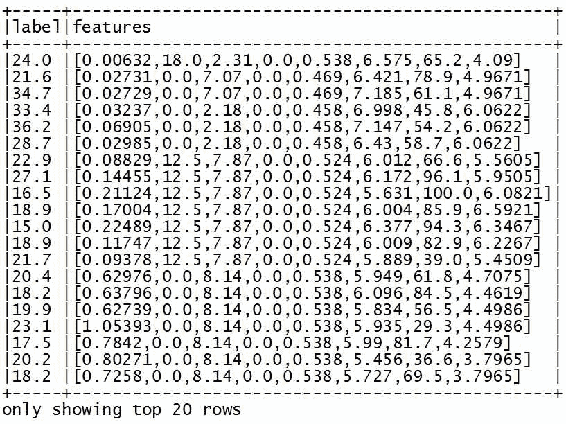

1.  接下来，我们为生成一个新模型配置了一个广义线性回归算法：

```scala
val glr = new GeneralizedLinearRegression()
.setMaxIter(1000)
.setRegParam(0.03) //the value ranges from 0.0 to 1.0\. Experimentation required to identify the right value.
.setFamily("gaussian")
.setLink( "identity" )
```

请随意尝试不同的参数以获得更好的拟合效果。

1.  我们将模型拟合到住房数据：

```scala
val glrModel = glr.fit(regressionData)
```

1.  然后，我们检索摘要数据以判断模型的准确性：

```scala
val summary = glrModel.summary
```

1.  最后，我们打印出摘要统计信息：

```scala
val summary = glrModel.summary
summary.residuals().show()
println("Residual Degree Of Freedom: " + summary.residualDegreeOfFreedom)
println("Residual Degree Of Freedom Null: " + summary.residualDegreeOfFreedomNull)
println("AIC: " + summary.aic)
println("Dispersion: " + summary.dispersion)
println("Null Deviance: " + summary.nullDeviance)
println("Deviance: " +summary.deviance)
println("p-values: " + summary.pValues.mkString(","))
println("t-values: " + summary.tValues.mkString(","))
println("Coefficient Standard Error: " + summary.coefficientStandardErrors.mkString(","))
}

```

1.  通过停止`SparkSession`来关闭程序：

```scala
spark.stop()
```

# 工作原理...

在这个示例中，我们展示了广义线性回归算法的运行情况。我们首先将 CSV 文件加载和解析为数据集。接下来，我们创建了一个广义线性回归算法，并通过将数据集传递给`fit()`方法来生成一个新模型。完成拟合操作后，我们从模型中检索摘要统计信息，并显示计算出的值以调整准确性。

在这个例子中，我们探索了使用*高斯*分布和*身份*拟合数据，但还有许多其他配置可以用来解决特定的回归拟合问题，这些将在下一节中解释。

# 还有更多...

Spark 2.0 中的 GLM 是一个通用的回归模型，可以支持许多配置。我们对 Spark 2.0.0 初始版本提供的众多系列印象深刻。

重要的是要注意，截至 Spark 2.0.2：

+   目前回归的最大参数数量限制为 4,096 个。

+   目前唯一支持的优化（即求解器）是**迭代重新加权最小二乘法**（**IRLS**），这也是默认求解器。

+   当您将求解器设置为*auto*时，它默认为 IRLS。

+   `setRegParam()`设置 L2 正则化的正则化参数。根据 Spark 2.0 文档，正则化项为*0.5 * regParam * L2norm(coefficients)²* - 请确保您理解其影响。

如果您不确定如何处理分布拟合，我们强烈推荐我们最喜欢的书之一，*用 R 拟合统计分布手册*，在建模芝加哥期货交易所小麦等农产品时为我们提供了很好的帮助，它具有反向波动率笑曲线（与股票非常不同）。

配置和可用选项如下：

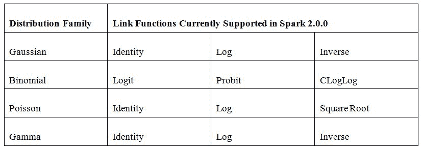

一定要尝试不同的族和链接函数，以确保您对基础分布的假设是正确的。

# 另请参阅

`GeneralizedLinearRegression()`的文档可在以下链接找到：

[`spark.apache.org/docs/latest/api/scala/index.html#org.apache.spark.ml.regression.GeneralizedLinearRegression`](http://spark.apache.org/docs/latest/api/scala/index.html#org.apache.spark.ml.regression.GeneralizedLinearRegression)

`GeneralizedLinearRegression`中的一些重要 API 调用：

+   `def **setFamily**(value: String): GeneralizedLinearRegression.this.type`

+   `def **setLink**(value: String): GeneralizedLinearRegression.this.type`

+   `def **setMaxIter**(value: Int): GeneralizedLinearRegression.this.type`

+   `def **setRegParam**(value: Double): GeneralizedLinearRegression.this.type`

+   `def **setSolver**(value: String): GeneralizedLinearRegression.this.type`

+   `def **setFitIntercept**(value: Boolean): GeneralizedLinearRegression.this.type`

求解器目前是 IRLS；快速参考可在以下链接找到：

[`en.wikipedia.org/wiki/Iteratively_reweighted_least_squares`](https://en.wikipedia.org/wiki/Iteratively_reweighted_least_squares)

要完全理解 Spark 2.0+中 GLM 和线性回归的新方法，请务必参考并了解 R 中 CRAN glmnet 的实现：

+   主页可在[`cran.r-project.org/web/packages/glmnet/index.html`](https://cran.r-project.org/web/packages/glmnet/index.html)找到

+   用户指南可在[`cran.r-project.org/web/packages/glmnet/glmnet.pdf`](https://cran.r-project.org/web/packages/glmnet/glmnet.pdf)找到

# Spark 2.0 中带有 Lasso 和 L-BFGS 的线性回归 API

在这个示例中，我们将演示如何使用 Spark 2.0 的`LinearRegression()` API 来展示一个统一/参数化的 API，以全面的方式处理线性回归，能够在不会出现 RDD 命名 API 的向后兼容问题的情况下进行扩展。我们展示如何使用`setSolver()`将优化方法设置为一阶内存高效的 L-BFGS，它可以轻松处理大量参数（即在稀疏配置中）。

在这个示例中，`.setSolver()`设置为`lbgfs`，这使得 L-BFGS（详见基于 RDD 的回归）成为选择的优化方法。`.setElasticNetParam()`未设置，因此默认值`0`仍然有效，这使得这是一个 Lasso 回归。

# 如何做...

1.  我们使用 UCI 机器库存储中的住房数据集。

1.  从以下链接下载整个数据集：

+   [`archive.ics.uci.edu/ml/datasets/Housing`](https://archive.ics.uci.edu/ml/datasets/Housing)

+   [`archive.ics.uci.edu/ml/machine-learning-databases/housing/`](https://archive.ics.uci.edu/ml/machine-learning-databases/housing/)

数据集由 14 列组成，前 13 列是独立变量（即特征），试图解释美国波士顿自住房的中位价格（即最后一列）。

我们选择并清理了前八列作为特征。我们使用前 200 行来训练和预测中位价格：

+   +   **CRIM**：按城镇划分的人均犯罪率

+   **ZN**：用于 25,000 平方英尺以上地块的住宅用地比例

+   **INDUS**：每个城镇的非零售业务土地比例

+   **CHAS**：查尔斯河虚拟变量（如果地块与河流相接，则为`1`；否则为`0`）

+   **NOX**：一氧化氮浓度（每千万分之一）

+   **RM**：每个住宅的平均房间数

+   **AGE**：1940 年前建成的自住单位比例

1.  请使用`housing8.csv`文件，并确保将其移动到以下目录：

```scala
../data/sparkml2/chapter5/housing8.csv
```

1.  在 IntelliJ 或您选择的 IDE 中启动一个新项目。确保包含必要的 JAR 文件。

1.  设置程序所在的包位置：

```scala
package spark.ml.cookbook.chapter5.
```

1.  导入必要的包，以便`SparkSession`访问集群和`log4j.Logger`减少 Spark 产生的输出量：

```scala
import org.apache.spark.ml.regression.LinearRegression
import org.apache.spark.ml.feature.LabeledPoint
import org.apache.spark.sql.SparkSession
import org.apache.spark.ml.linalg.Vectors
import org.apache.log4j.{Level, Logger}
```

1.  将输出级别设置为`ERROR`以减少 Spark 的日志输出：

```scala
Logger.getLogger("org").setLevel(Level.ERROR)
 Logger.getLogger("akka").setLevel(Level.ERROR)
```

1.  初始化`SparkSession`，指定配置以访问 Spark 集群：

```scala
val spark = SparkSession
.builder
.master("local[*]")
.appName("myRegress02")
.config("spark.sql.warehouse.dir", ".")
.getOrCreate()

```

1.  我们需要导入数据转换例程的隐式：

```scala
import spark.implicits._
```

1.  接下来，我们将房屋数据加载到数据集中：

```scala
val data = spark.read.text(
  "../data/sparkml2/chapter5/housing8.csv"
).as[
  String
]

```

1.  让我们解析房屋数据并将其转换为标签点：

```scala
val RegressionDataSet = data.map { line =>
val columns = line.split(',')
LabeledPoint(columns(13).toDouble , Vectors.dense(columns(0).toDouble,columns(1).toDouble, columns(2).toDouble, columns(3).toDouble,columns(4).toDouble,
columns(5).toDouble,columns(6).toDouble, columns(7).toDouble
))
}
```

1.  现在显示加载的数据：

```scala
RegressionDataSet.show(false)
```

输出如下所示：


1.  接下来，我们配置线性回归算法以生成模型：

```scala
val numIterations = 10
val lr = new LinearRegression()
.setMaxIter(numIterations)
.setSolver("l-bfgs")
```

1.  现在我们将模型拟合到房屋数据中：

```scala
val myModel = lr.fit(RegressionDataSet)
```

1.  接下来，我们检索摘要数据以调和模型的准确性：

```scala
val summary = myModel.summary
```

1.  最后，我们打印出摘要统计信息：

```scala
println ( "training Mean Squared Error = " + summary. meanSquaredError )
println("training Root Mean Squared Error = " + summary.rootMeanSquaredError) }
training Mean Squared Error = 13.608987362865541
training Root Mean Squared Error = 3.689036102136375
```

1.  通过停止`SparkSession`来关闭程序：

```scala
spark.stop()
```

# 它是如何工作的...

在这个示例中，我们再次使用房屋数据来演示 Spark 2.0 的`LinearRegression()`API，使用 L-BFGS 优化选项。我们读取文件，解析数据，并选择回归的特定列。我们通过接受默认参数来保持示例简短，但在运行`.fit()`方法之前，将迭代次数（用于收敛到解决方案）和优化方法设置为`lbfgs`。然后，我们继续输出一些快速指标（即 MSE 和 RMSE）仅用于演示。我们展示了如何使用 RDD 自己实现/计算这些指标。使用 Spark 2.0 的本机功能/指标和基于 RDD 的回归示例，我们展示了 Spark 现在可以直接完成这些指标，这证明了我们从 Spark 1.0.1 走过了多远！

对于少量列使用牛顿优化技术（例如`lbfgs`）是一种过度，稍后在本书中进行演示，以便读者能够在实际环境中的大型数据集上使用这些示例（例如，从第一章中提到的典型癌症/基因组数据）。

# 还有更多...

弹性网（由 DB Tsai 和其他人贡献）和由 Alpine Labs 推广的技术从 Spark 1.4 和 1.5 开始引起了我们的关注，现在已成为 Spark 2.0 中的事实标准技术。

为了水平设置，弹性网是 L1 和 L2 惩罚的线性组合。它可以在概念上被建模为一个可以决定在惩罚中包含多少 L1 和多少 L2 的旋钮（收缩与选择）。

我们想强调的是，现在我们可以通过参数设置来选择回归类型，而不是命名的 API。这是与基于 RDD 的 API（即现在处于维护模式）的重要分歧，我们稍后在本章中进行演示。

以下表格提供了一个快速设置参数的备忘单，以在 Lasso、Ridge、OLS 和弹性网之间进行选择。

请参阅以下表格`setElasticNetParam(value: Double)`：

| **回归类型** | **惩罚** | **参数** |
| --- | --- | --- |
| Lasso | L1 | 0 |
| Ridge | L2 | 1 |
| 弹性网 | L1 + L2 | 0.0 < alpha < 1.0 |
| OLS | 普通最小二乘法 | 无 |

通过以下简要处理来了解正则化是如何通过弹性网参数（对应于 Alpha）来控制的：

+   简单：[`en.wikipedia.org/wiki/Elastic_net_regularization`](https://en.wikipedia.org/wiki/Elastic_net_regularization)

+   完整：[`www.stat.purdue.edu/~tlzhang/mathstat/ElasticNet.pdf`](http://www.stat.purdue.edu/~tlzhang/mathstat/ElasticNet.pdf)

+   使用基因组数据：[`www.ncbi.nlm.nih.gov/pmc/articles/PMC3232376/`](https://www.ncbi.nlm.nih.gov/pmc/articles/PMC3232376/)

# 另请参阅

+   `LinearRegression()`的文档：[`spark.apache.org/docs/latest/api/scala/index.html#org.apache.spark.ml.regression.LinearRegression`](http://spark.apache.org/docs/latest/api/scala/index.html#org.apache.spark.ml.regression.LinearRegression)

+   一定要查看实际的源代码，因为它扩展了* Regressor*本身：[`github.com/apache/spark/blob/v2.0.2/mllib/src/main/scala/org/apache/spark/ml/regression/LinearRegression.scala`](https://github.com/apache/spark/blob/v2.0.2/mllib/src/main/scala/org/apache/spark/ml/regression/LinearRegression.scala)

+   `LinearRegression`中一些重要的 API 调用：

+   `def setElasticNetParam(value: Double): LinearRegression.this.type`

+   `def **setRegParam**(value: Double): LinearRegression.this.type`

+   `def **setSolver**(value: String): LinearRegression.this.type`

+   `def **setMaxIter**(value: Int): LinearRegression.this.type`

+   `def **setFitIntercept**(value: Boolean): LinearRegression.this.type`

Spark ML 的一个重要方面是其简单而异常强大的 API 集，它允许开发人员在现有集群上轻松扩展到数十亿行，而几乎不需要额外的工作。您会惊讶于 Lasso 可以用于发现相关特征集的规模，而 L-BFGS 优化（不需要直接的海森矩阵存在）可以轻松处理大量特征。Spark 2.0 源代码中 LBFGS 的`updater`实现的细节超出了本书的范围。

由于其复杂性，我们将在后续章节中介绍与这些 ML 算法相关的优化。

# Spark 2.0 中具有 Lasso 和'auto'优化选择的线性回归 API

在这个配方中，我们通过显式选择 LASSO 回归`setElasticNetParam(0.0)`来构建上一个配方`LinearRegression`，同时让 Spark 2.0 使用`setSolver('auto')`自行选择优化。*我们再次提醒，基于 RDD 的回归 API 现在处于维护模式，这是未来的首选方法。

# 如何做...

1.  我们使用 UCI 机器库存储的住房数据集。

1.  从以下网址下载整个数据集：

+   [`archive.ics.uci.edu/ml/datasets/Housing`](https://archive.ics.uci.edu/ml/datasets/Housing)

+   [`archive.ics.uci.edu/ml/machine-learning-databases/housing/`](https://archive.ics.uci.edu/ml/machine-learning-databases/housing/)

数据集由 14 列组成，前 13 列是独立变量（即特征），试图解释美国波士顿自有住房的中位价格（即最后一列）。

我们已经选择并清理了前八列作为特征。我们使用前 200 行来训练和预测中位数价格：

+   +   **CRIM:** 按城镇划分的人均犯罪率

+   **ZN:** 用于超过 25,000 平方英尺的住宅用地比例

+   **INDUS:** 每个城镇的非零售业务面积比例

+   **CHAS:** 查尔斯河虚拟变量（如果地块边界河流，则为`1`；否则为`0`）

+   **NOX:** 一氧化氮浓度（每 1000 万份之一）

+   **RM:** 每个住宅的平均房间数

+   **AGE**: 1940 年前建造的自有住房的比例

1.  请使用`housing8.csv`文件，并确保将其移动到以下目录：

```scala
 ../data/sparkml2/chapter5/housing8.csv
```

1.  在 IntelliJ 或您选择的 IDE 中开始一个新项目。确保包含必要的 JAR 文件。

1.  设置程序所在的包位置：

```scala
package spark.ml.cookbook.chapter5.
```

1.  导入必要的包，以便`SparkSession`访问集群和`Log4j.Logger`减少 Spark 产生的输出量：

```scala
import org.apache.spark.ml.regression.LinearRegression
import org.apache.spark.ml.feature.LabeledPoint
import org.apache.spark.sql.SparkSession
import org.apache.spark.ml.linalg.Vectors
import org.apache.log4j.{Level, Logger}
```

1.  将输出级别设置为`ERROR`以减少 Spark 的日志输出：

```scala
Logger.getLogger("org").setLevel(Level.ERROR)
 Logger.getLogger("akka").setLevel(Level.ERROR)
```

1.  初始化一个`SparkSession`，指定配置以访问 Spark 集群：

```scala
val spark = SparkSession
.builder
.master("local[*]")
.appName("myRegress03")
.config("spark.sql.warehouse.dir", ".")
.getOrCreate()
```

1.  我们需要导入数据转换例程的隐式：

```scala
import spark.implicits._
```

1.  接下来，我们将住房数据加载到数据集中：

```scala
val data = spark.read.text( "../data/sparkml2/chapter5/housing8.csv" ).as[ String ]
```

1.  让我们解析住房数据并将其转换为标签点：

```scala
val RegressionDataSet = data.map { line =>
val columns = line.split(',')
LabeledPoint(columns(13).toDouble , Vectors.dense(columns(0).toDouble,columns(1).toDouble, columns(2).toDouble, columns(3).toDouble,columns(4).toDouble,
columns(5).toDouble,columns(6).toDouble, columns(7).toDouble
))
}
```

1.  现在显示加载的数据：

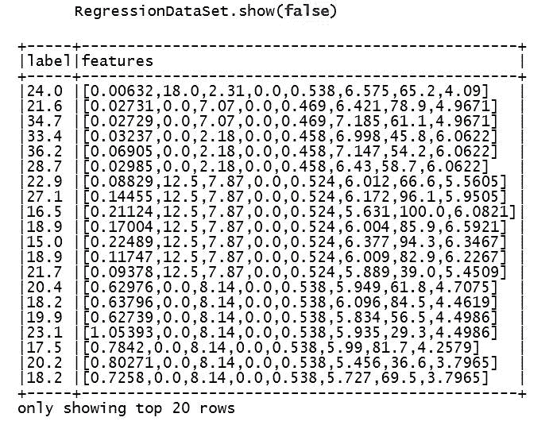

1.  接下来，我们配置一个线性回归算法来生成模型：

```scala
val lr = new LinearRegression()
.setMaxIter(1000)
.setElasticNetParam(0.0)
.setRegParam(0.01)
.setSolver( "auto" )
```

1.  现在我们将模型拟合到住房数据中：

```scala
val myModel = lr.fit(RegressionDataSet)
```

1.  接下来，我们检索摘要数据以调和模型的准确性：

```scala
val summary = myModel.summary
```

1.  最后，我们打印摘要统计信息：

```scala
println ( "training Mean Squared Error = " + summary. meanSquaredError )
println("training Root Mean Squared Error = " + summary.rootMeanSquaredError) }
training Mean Squared Error = 13.609079490110766
training Root Mean Squared Error = 3.6890485887435482
```

1.  我们通过停止`SparkSession`来关闭程序：

```scala
spark.stop()
```

# 它是如何工作的...

我们读取住房数据并加载选定的列，并使用它们来预测住房单位的价格。我们使用以下代码片段选择回归为 LASSO，并让 Spark 自行选择优化：

```scala
val lr = new LinearRegression()
.setMaxIter(1000)
.setElasticNetParam(0.0)
.setRegParam(0.01)
.setSolver( "auto" )
```

我们将`setMaxIter()`更改为`1000`以进行演示。默认设置为`100`。

# 还有更多...

虽然 Spark 对 L-BFGS 有很好的实现，请参阅以下链接，快速了解 BFGS 及其内部工作原理，因为它与这个示例相关：

+   BFGS 的简单处理：[`en.wikipedia.org/wiki/Broyden-Fletcher-Goldfarb-Shanno_algorithm`](https://en.wikipedia.org/wiki/Broyden-Fletcher-Goldfarb-Shanno_algorithm)

+   来自*机器学习研究杂志*，也是一个很好的有限内存 BGFS 处理的数学编程视角：[`www.jmlr.org/papers/volume14/hennig13a/hennig13a.pdf`](http://www.jmlr.org/papers/volume14/hennig13a/hennig13a.pdf)

还可以查看基于 RDD 的回归示例，以了解有关 LBGFS 的更多详细信息。如果您需要了解 BFGS 技术的实现细节，请参考以下链接。

这个 C 语言实现帮助我们在代码级别开发对一阶优化的扎实理解：[`www.chokkan.org/software/liblbfgs/`](http://www.chokkan.org/software/liblbfgs/)

+   *cctbx*还提供了很好的实现细节，如果您需要了解更多：[`cctbx.sourceforge.net`](http://cctbx.sourceforge.net)

+   哈佛大学关于 R 中 L-BFGS 的很好的处理：[`cran.r-project.org/web/packages/lbfgs/vignettes/Vignette.pdf`](https://cran.r-project.org/web/packages/lbfgs/vignettes/Vignette.pdf)

# 另请参阅

+   `LinearRegression()`的文档：[`spark.apache.org/docs/latest/api/scala/index.html#org.apache.spark.ml.regression.LinearRegression`](http://spark.apache.org/docs/latest/api/scala/index.html#org.apache.spark.ml.regression.LinearRegression)

+   BFGS 和 L-BFGS 的文档：

+   [`en.wikipedia.org/wiki/Broyden-Fletcher-Goldfarb-Shanno_algorithm`](https://en.wikipedia.org/wiki/Broyden-Fletcher-Goldfarb-Shanno_algorithm)

+   [`en.wikipedia.org/wiki/Limited-memory_BFGS`](https://en.wikipedia.org/wiki/Limited-memory_BFGS)

# Spark 2.0 中具有岭回归和“自动”优化选择的线性回归 API

在这个示例中，我们使用`LinearRegression`接口实现岭回归。我们使用弹性网参数来设置适当的值以进行完整的 L2 惩罚，从而相应地选择岭回归。

# 如何做到...

1.  我们使用 UCI 机器库存储的住房数据集。

1.  从以下网址下载整个数据集：

+   [`archive.ics.uci.edu/ml/datasets/Housing`](https://archive.ics.uci.edu/ml/datasets/Housing)

+   [`archive.ics.uci.edu/ml/machine-learning-databases/housing/`](https://archive.ics.uci.edu/ml/machine-learning-databases/housing/)

数据集由 14 列组成，前 13 列是独立变量（即特征），试图解释美国波士顿自住房的中位价格（即最后一列）。

我们选择并清理了前八列作为特征。我们使用前 200 行来训练和预测中位价格：

1.  +   CRIM：按城镇计算的人均犯罪率

+   ZN：用于超过 25,000 平方英尺的地块的住宅用地比例

+   INDUS：每个城镇非零售业务英亩的比例

+   CHAS：查尔斯河虚拟变量（如果地区与河流相接则为 1；否则为 0）

+   NOX：一氧化氮浓度（每千万分之一）

+   RM：每个住宅的平均房间数

+   AGE：1940 年前建成的自住单位比例

1.  请使用`housing8.csv`文件，并确保将其移动到以下目录：

```scala
 ../data/sparkml2/chapter5/housing8.csv
```

1.  在 IntelliJ 或您选择的 IDE 中启动一个新项目。确保包含必要的 JAR 文件。

1.  设置程序将驻留的包位置：

```scala
package spark.ml.cookbook.chapter5.
```

1.  导入必要的包以便`SparkSession`访问集群和`Log4j.Logger`减少 Spark 产生的输出量：

```scala
import org.apache.spark.ml.feature.LabeledPoint
import org.apache.spark.ml.linalg.Vectors
import org.apache.spark.ml.regression.LinearRegression
import org.apache.spark.sql.SparkSession
import org.apache.log4j.{Level, Logger}
```

1.  将输出级别设置为`ERROR`以减少 Spark 的日志输出：

```scala
Logger.getLogger("org").setLevel(Level.ERROR)
 Logger.getLogger("akka").setLevel(Level.ERROR)
```

1.  初始化`SparkSession`，指定配置以访问 Spark 集群：

```scala
val spark = SparkSession
.builder
.master("local[*]")
.appName("myRegress04")
.config("spark.sql.warehouse.dir", ".")
.getOrCreate()
```

1.  我们需要导入数据转换例程的隐式：

```scala
import spark.implicits._
```

1.  接下来，我们将房屋数据加载到数据集中：

```scala
val data = spark.read.text( "../data/sparkml2/chapter5/housing8.csv" ).as[ String ]
```

1.  让我们解析房屋数据并将其转换为标签点：

```scala
val RegressionDataSet = data.map { line =>
val columns = line.split(',')
LabeledPoint(columns(13).toDouble , Vectors.dense(columns(0).toDouble,columns(1).toDouble, columns(2).toDouble, columns(3).toDouble,columns(4).toDouble,
columns(5).toDouble,columns(6).toDouble, columns(7).toDouble
))
}
```

1.  现在显示加载的数据：

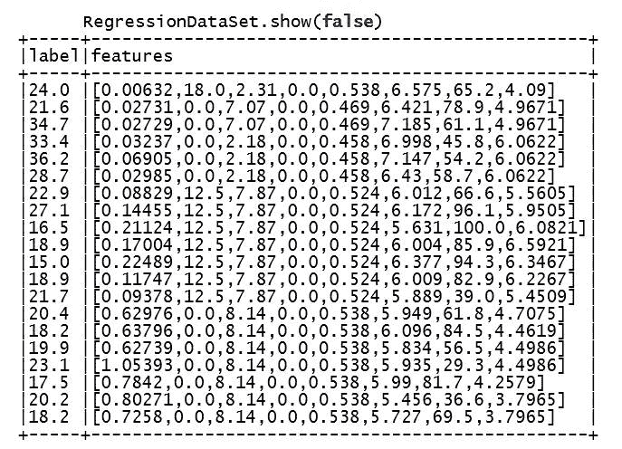

1.  接下来，我们配置线性回归算法以生成模型：

```scala
val lr = new LinearRegression()
.setMaxIter(1000)
.setElasticNetParam(1.0)
.setRegParam(0.01)
.setSolver( "auto" )
```

1.  现在，我们将模型拟合到房屋数据：

```scala
val myModel = lr.fit(RegressionDataSet)
```

1.  接下来，我们检索摘要数据以调和模型的准确性：

```scala
val summary = myModel.summary
```

1.  最后，我们打印出摘要统计信息：

```scala
println ( "training Mean Squared Error = " + summary. meanSquaredError )
println("training Root Mean Squared Error = " + summary.rootMeanSquaredError) }
training Mean Squared Error = 13.61187856748311
training Root Mean Squared Error = 3.6894279458315906
```

1.  通过停止`SparkSession`来关闭程序：

```scala
spark.stop()
```

# 它是如何工作的...

我们通过读取房屋数据并加载适当的列来加载数据。然后，我们继续设置将强制`LinearRegression()`执行岭回归的参数，同时保持优化为'auto'。以下代码显示了如何使用线性回归 API 来设置所需的回归类型为岭回归：

```scala
val lr = new LinearRegression()
.setMaxIter(1000)
.setElasticNetParam(1.0)
.setRegParam(0.01)
.setSolver( "auto" )
```

然后我们使用`.fit()`将模型拟合到数据。最后，我们使用`.summary`提取模型摘要并打印模型的 MSE 和 RMSE。

# 还有更多...

为了确保我们清楚岭回归和 Lasso 回归之间的区别，我们必须首先强调参数收缩（即，我们使用平方根函数压缩权重，但从不将其设置为零）和特征工程或参数选择之间的区别（即，我们将参数收缩到`0`，从而导致一些参数从模型中完全消失）：

+   岭回归：[`en.wikipedia.org/wiki/Tikhonov_regularization`](https://en.wikipedia.org/wiki/Tikhonov_regularization)

+   Lasso 回归：[`en.wikipedia.org/wiki/Lasso_(statistics)`](https://en.wikipedia.org/wiki/Lasso_(statistics))

+   弹性网络 - 斯坦福大学：[`web.stanford.edu/~hastie/TALKS/enet_talk.pdf`](http://web.stanford.edu/~hastie/TALKS/enet_talk.pdf)

# 另请参阅

线性回归文档：[`spark.apache.org/docs/latest/api/scala/index.html#org.apache.spark.ml.regression.LinearRegression`](http://spark.apache.org/docs/latest/api/scala/index.html#org.apache.spark.ml.regression.LinearRegression)

# Apache Spark 2.0 中的等渗回归

在这个示例中，我们演示了 Spark 2.0 中的`IsotonicRegression()`函数。当数据中期望有顺序并且我们想要将递增的有序线（即，表现为阶梯函数）拟合到一系列观察中时，使用等渗或单调回归。术语**等渗回归**（**IR**）和**单调回归**（**MR**）在文献中是同义的，可以互换使用。

简而言之，我们尝试使用`IsotonicRegression()`配方提供比朴素贝叶斯和 SVM 的一些缺点更好的拟合。虽然它们都是强大的分类器，但朴素贝叶斯缺乏 P（C | X）的良好估计，**支持向量机**（**SVM**）最多只提供代理（可以使用超平面距离），在某些情况下并不是准确的估计器。

# 如何做...

1.  转到网站下载文件并将文件保存到以下代码块中提到的数据路径。我们使用著名的鸢尾花数据并将一步线拟合到观察中。我们使用库中以`LIBSVM`格式的鸢尾花数据来演示 IR。

我们选择的文件名是`iris.scale.txt` [`www.csie.ntu.edu.tw/~cjlin/libsvmtools/datasets/multiclass/iris.scale`](https://www.csie.ntu.edu.tw/~cjlin/libsvmtools/datasets/multiclass/iris.scale)。

1.  在 IntelliJ 或您选择的 IDE 中启动新项目。确保包含必要的 JAR 文件。

1.  设置程序将驻留的包位置：

```scala
package spark.ml.cookbook.chapter5
```

1.  导入必要的包，以便`SparkSession`可以访问集群和`Log4j.Logger`以减少 Spark 产生的输出量：

```scala
import org.apache.spark.sql.SparkSession
 import org.apache.spark.ml.regression.IsotonicRegression
```

1.  将输出级别设置为`ERROR`以减少 Spark 的日志输出：

```scala
Logger.getLogger("org").setLevel(Level.ERROR)
Logger.getLogger("akka").setLevel(Level.ERROR)
```

1.  使用构建模式初始化`SparkSession`，从而使 Spark 集群的入口点可用：

```scala
val spark = SparkSession
 .builder
 .master("local[4]")
 .appName("myIsoTonicRegress")
 .config("spark.sql.warehouse.dir", ".")
 .getOrCreate()
```

1.  然后我们读入数据文件，打印出数据模式，并在控制台中显示数据：

```scala
val data = spark.read.format("libsvm")
 .load("../data/sparkml2/chapter5/iris.scale.txt")
 data.printSchema()
 data.show(false)
```

我们得到以下控制台输出：

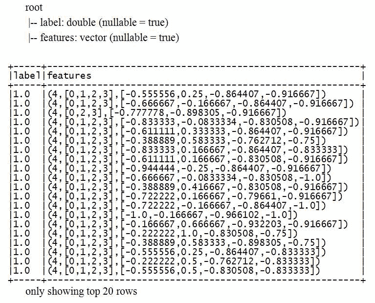

1.  然后，我们将数据集分割为训练集和测试集，比例为*0.7:0.3*：

```scala
val Array(training, test) = data.randomSplit(Array(0.7, 0.3), seed = System.currentTimeMillis())
```

1.  接下来，我们创建`IsotonicRegression`对象并将其拟合到训练数据中：

```scala
val itr = new IsotonicRegression()

 val itrModel = itr.fit(training)
```

1.  现在我们在控制台中打印出模型边界和预测：

```scala
println(s"Boundaries in increasing order: ${itrModel.boundaries}")
 println(s"Predictions associated with the boundaries: ${itrModel.predictions}")
```

我们得到以下控制台输出：

```scala
Boundaries in increasing order: [-1.0,-0.666667,-0.666667,-0.5,-0.5,-0.388889,-0.388889,-0.333333,-0.333333,-0.222222,-0.222222,-0.166667,-0.166667,0.111111,0.111111,0.333333,0.333333,0.5,0.555555,1.0]
Predictions associated with the boundaries: [1.0,1.0,1.1176470588235294,1.1176470588235294,1.1666666666666663,1.1666666666666663,1.3333333333333333,1.3333333333333333,1.9,1.9,2.0,2.0,2.3571428571428577,2.3571428571428577,2.5333333333333314,2.5333333333333314,2.7777777777777786,2.7777777777777786,3.0,3.0]
```

1.  我们让模型转换测试数据并显示结果：

```scala
itrModel.transform(test).show()
```

我们得到以下控制台输出：

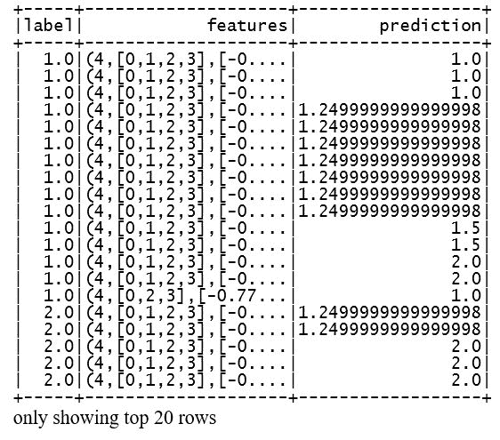

1.  我们通过停止`SparkSession`来关闭程序：

```scala
spark.stop()
```

# 它是如何工作的...

在这个例子中，我们探索了等距回归模型的特性。我们首先以`libsvm`格式将数据集文件读入 Spark。然后我们分割数据（*70/30*）并进行下一步。接下来，我们通过调用`.show()`函数在控制台中显示 DataFrame。然后，我们创建了`IsotonicRegression()`对象，并通过调用`fit(data)`函数让模型自行运行。在这个示例中，我们保持简单，没有改变任何默认参数，但读者应该进行实验，并使用 JChart 包来绘制线条，看看增长和阶梯线条结果的影响。

最后，我们在控制台中显示了模型边界和预测，并使用模型转换测试数据集，并在控制台中显示包含预测字段的结果 DataFrame。所有 Spark ML 算法对超参数值都很敏感。虽然设置这些参数没有硬性规定，但在投入生产之前需要进行大量的科学方法实验。

我们在前几章中介绍了 Spark 提供的许多模型评估设施，并在整本书中讨论了评估指标，而没有重复。Spark 提供以下模型评估方法。开发人员必须根据正在评估的算法类型（例如，离散、连续、二进制、多类等）选择特定的评估指标设施。

我们将单独使用配方来覆盖评估指标，但请参阅以下链接，了解 Spark 的模型评估覆盖范围：[`spark.apache.org/docs/latest/mllib-evaluation-metrics.html`](http://spark.apache.org/docs/latest/mllib-evaluation-metrics.html)。

# 还有更多...

在撰写本文时，Spark 2.0 实现具有以下限制：

+   仅支持单特征（即单变量）算法：

```scala
def setFeaturesCol(value: String): IsotonicRegression.this.type
```

+   目前的实现设置为**并行池相邻违反者算法**（**PAVA**）：

+   截至 Spark 2.1.0，它是单变量单调实现

+   查看 CRAN 实现，如 Spark 2.0：[`cran.r-project.org/web/packages/isotone/vignettes/isotone.pdf`](https://cran.r-project.org/web/packages/isotone/vignettes/isotone.pdf)

+   参见 UCLA 论文（PAVA）：[`gifi.stat.ucla.edu/janspubs/2009/reports/deleeuw_hornik_mair_R_09.pdf`](http://gifi.stat.ucla.edu/janspubs/2009/reports/deleeuw_hornik_mair_R_09.pdf)

+   参见威斯康星大学：[`www.biostat.wisc.edu/sites/default/files/tr_116.pdf`](https://www.biostat.wisc.edu/sites/default/files/tr_116.pdf)

+   等距回归的文档：

+   [`spark.apache.org/docs/latest/ml-classification-regression.html#isotonic-regression`](https://spark.apache.org/docs/latest/ml-classification-regression.html#isotonic-regression)

+   [`spark.apache.org/docs/latest/api/scala/index.html#org.apache.spark.ml.regression.IsotonicRegression`](https://spark.apache.org/docs/latest/api/scala/index.html#org.apache.spark.ml.regression.IsotonicRegression)

+   [`spark.apache.org/docs/latest/api/scala/index.html#org.apache.spark.ml.regression.IsotonicRegressionModel`](https://spark.apache.org/docs/latest/api/scala/index.html#org.apache.spark.ml.regression.IsotonicRegressionModel)

# 另请参阅

有关保序回归的更多信息，请参见：

[`en.wikipedia.org/wiki/Isotonic_regression`](https://en.wikipedia.org/wiki/Isotonic_regression)

保序回归线最终成为一个阶梯函数，而不是线性回归，即一条直线。以下图（来源：维基百科）提供了一个很好的参考：

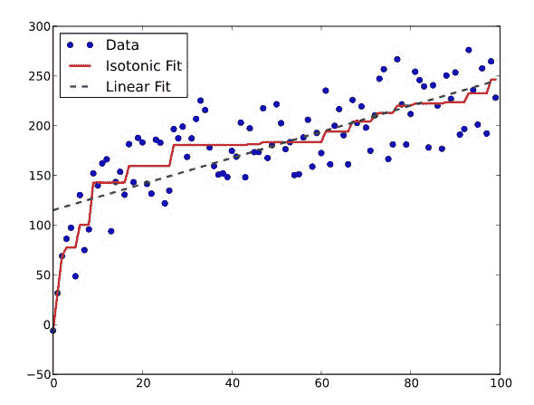

# Apache Spark 2.0 中的多层感知器分类器

在这个示例中，我们探索了 Spark 2.0 的**多层感知器分类器**（**MLPC**），这是前馈神经网络的另一个名称。我们使用鸢尾花数据集来预测描述输入的特征向量的二元结果。要记住的关键点是，即使名称听起来有点复杂，MLP 本质上只是用于无法通过简单的线性线或超平面分离的数据的非线性分类器。

# 如何做...

1.  转到`LIBSVM`数据：分类（多类）存储库，并从以下 URL 下载文件：[`www.csie.ntu.edu.tw/~cjlin/libsvmtools/datasets/multiclass/iris.scale`](https://www.csie.ntu.edu.tw/~cjlin/libsvmtools/datasets/multiclass/iris.scale)

1.  在 IntelliJ 或您选择的 IDE 中启动一个新项目。确保包含必要的 JAR 文件。

1.  设置程序所在的包位置：

```scala
package spark.ml.cookbook.chapter5
```

1.  导入`SparkSession`所需的包，以访问集群，并导入`Log4j.Logger`以减少 Spark 产生的输出量：

```scala
import org.apache.spark.ml.classification
.MultilayerPerceptronClassifier
import org.apache.spark.ml.evaluation.
MulticlassClassificationEvaluator
import org.apache.spark.sql.SparkSession
import org.apache.log4j.{ Level, Logger}
```

1.  将输出级别设置为`ERROR`，以减少 Spark 的日志输出：

```scala
 Logger.getLogger("org").setLevel(Level.ERROR)
 Logger.getLogger("akka").setLevel(Level.ERROR)
```

1.  初始化`SparkSession`，指定配置以访问 Spark 集群：

```scala
val spark = SparkSession
 .builder
 .master("local[*]")
 .appName("MLP")
 .getOrCreate()
```

1.  首先，我们将`libsvm`格式的数据文件加载到内存中：

```scala
val data = spark.read.format( "libsvm" )
.load("../data/sparkml2/chapter5/iris.scale.txt")
```

1.  现在显示加载的数据：

从控制台，这是输出：

```scala
data.show(false)
```


1.  接下来，我们利用数据集的`randomSplit`方法将数据分成两个桶，每个桶分配 80%和 20%的数据：

```scala
val splitData = data.randomSplit(Array( 0.8 , 0.2 ), seed = System.currentTimeMillis())
```

1.  `randomSplit`方法返回一个包含两组数据的数组，其中训练集占 80%，测试集占 20%：

```scala
val train = splitData(0)
 val test = splitData(1)
```

1.  接下来，我们配置多层感知器分类器，输入层为四个节点，隐藏层为五个节点，输出为四个节点：

```scala
val layers = ArrayInt
val mlp = new MultilayerPerceptronClassifier()
.setLayers(layers)
.setBlockSize(110)
.setSeed(System.currentTimeMillis())
.setMaxIter(145)
```

+   +   **Blocksize**：用于将输入数据堆叠在矩阵中以加快计算速度的块大小。这更多是一个效率参数，推荐的大小在`10`和`1000`之间。该参数涉及将数据推入分区以提高效率的总量。

+   **MaxIter**：运行模型的最大迭代次数。

+   **Seed**：如果未设置权重，则设置权重初始化的种子。

在 GitHub 上 Spark 源代码的以下两行显示了代码中的默认设置：

```scala
setDefault(maxIter->100, tol -> 1e-6, blockSize ->128, solver -> MultilayerPerceptronClassifier.LBFGS, stepSize ->0.03)
```

要更好地理解参数和种子，请查看 MLP 源代码[`github.com/apache/spark/blob/master/mllib/src/main/scala/org/apache/spark/ml/classification/MultilayerPerceptronClassifier.scala`](https://github.com/apache/spark/blob/master/mllib/src/main/scala/org/apache/spark/ml/classification/MultilayerPerceptronClassifier.scala)。

1.  我们通过调用 fit 方法生成模型：

```scala
val mlpModel = mlp.fit(train)
```

1.  接下来，我们利用训练好的模型对测试数据进行转换，并显示预测结果：

```scala
val result = mlpModel.transform(test)
result.show(false)
```

结果将像以下内容一样显示在控制台上：

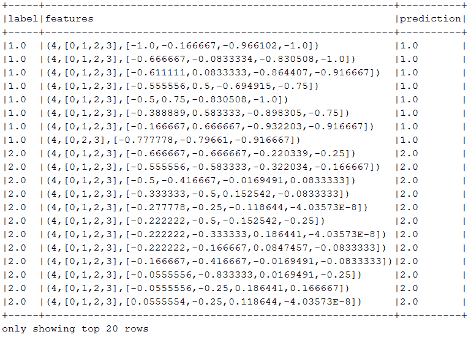

1.  最后，我们从结果中提取预测和标签，并将它们传递给多类分类评估器以生成准确度值：

```scala
val predictions = result.select("prediction", "label")
val eval = new MulticlassClassificationEvaluator().setMetricName("accuracy")
println("Accuracy: " + eval.evaluate(predictions))
Accuracy: 0.967741935483871
```

1.  通过停止`SparkSession`来关闭程序：

```scala
spark.stop()
```

# 它是如何工作的...

在这个示例中，我们演示了多层感知器分类器的用法。我们首先加载了经典的鸢尾花数据集，格式为`libsvm`。接下来，我们将数据集分成 80%的训练集数据和 20%的测试集数据。在定义阶段，我们配置了一个输入层有四个节点，一个隐藏层有五个节点，一个输出层有四个节点的多层感知器分类器。我们通过调用`fit()`方法生成了一个训练模型，然后利用训练模型进行预测。

最后，我们获取了预测和标签，并将它们传递给多类分类评估器，计算准确度值。

在没有太多实验和拟合的情况下，对预测与实际情况进行简单的目测似乎非常令人印象深刻，并且证明了为什么神经网络（与上世纪 90 年代的版本大不相同）重新受到青睐。它们在捕捉非线性表面方面做得很好。以下是一些非线性表面的例子（来源：Mac App Store 上的 Graphing Calculator 4）。

以下图显示了一个样本非线性情况的二维描述：

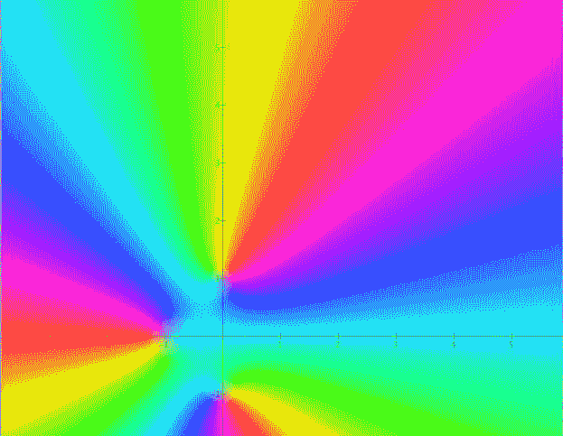

以下图显示了一个样本非线性情况的三维描述。

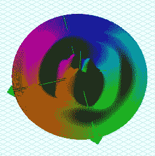

一般来说，神经网络首先由以下代码示例定义：

```scala
val layers = ArrayInt
val mlp = new MultilayerPerceptronClassifier()
.setLayers(layers)
.setBlockSize(110)
.setSeed(System.currentTimeMillis())
.setMaxIter(145)
```

这定义了网络的物理配置。在这种情况下，我们有一个*4 x 5 x 4* MLP，意思是四个输入层，五个隐藏层和四个输出层。通过使用`setBlockSize(110)`方法将`BlockSize`设置为 110，但默认值为 128。重要的是要有一个良好的随机函数来初始化权重，在这种情况下是当前系统时间`setSeed(System.*currentTimeMillis*()`。`setMaxIter(145)`是`setSolver()`方法使用的最大迭代次数，默认为`l-bfgs`求解器。

# 还有更多...

**多层感知器**（**MLP**）或**前馈网络**（**FFN**）通常是人们在毕业于**受限玻尔兹曼机**（**RBM**）和**循环神经网络**（**RRN**）之前首先了解的神经网络类型，这些类型在深度学习中很常见。虽然 MLP 在技术上可以被配置/称为深度网络，但必须进行一些调查并了解为什么它被认为是通往深度学习网络的第一步（仅此而已）。

在 Spark 2.0 的实现中，Sigmoid 函数（非线性激活）用于深度可堆叠网络配置（超过三层），将输出映射到`Softmax`函数，以创建一个能够捕捉数据极端非线性行为的非平凡映射表面。

Spark 使用 Sigmoid 函数通过易于使用的 API 在可堆叠的配置中实现非线性映射。以下图显示了 Sigmoid 函数及其在 Mac 上的图形计算器软件上的图形。

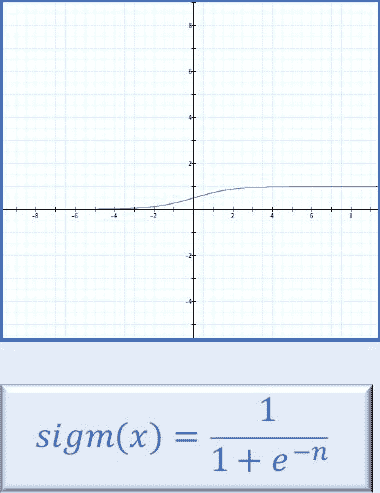

# 另请参阅

+   Spark 2.0 MLP 的文档：[`spark.apache.org/docs/latest/api/scala/index.html#org.apache.spark.ml.classification.MultilayerPerceptronClassifier`](http://spark.apache.org/docs/latest/api/scala/index.html#org.apache.spark.ml.classification.MultilayerPerceptronClassifier)

+   有关 MLP 的快速介绍，请参阅以下内容：

+   [`en.wikipedia.org/wiki/Multilayer_perceptron`](https://en.wikipedia.org/wiki/Multilayer_perceptron)

+   [`en.wikipedia.org/wiki/Perceptron`](https://en.wikipedia.org/wiki/Perceptron)

+   [`www.di.ubi.pt/~lfbaa/pubs/NN2008.pdf`](http://www.di.ubi.pt/~lfbaa/pubs/NN2008.pdf)

+   请参阅 Spark MLP 源代码：[`github.com/apache/spark/blob/master/mllib/src/main/scala/org/apache/spark/ml/classification/MultilayerPerceptronClassifier.scala`](https://github.com/apache/spark/blob/master/mllib/src/main/scala/org/apache/spark/ml/classification/MultilayerPerceptronClassifier.scala)

理解深度信念网络（绝对最低限度）及其与简单 MLP 的对比所需的经典论文：

+   深度置信网络：[`www.cs.toronto.edu/~hinton/absps/fastnc.pdf`](https://www.cs.toronto.edu/~hinton/absps/fastnc.pdf)

+   堆叠自动编码器：[`papers.nips.cc/paper/3048-greedy-layer-wise-training-of-deep-networks.pdf`](http://papers.nips.cc/paper/3048-greedy-layer-wise-training-of-deep-networks.pdf)

+   稀疏表示：[`www.cs.nyu.edu/~ranzato/publications/ranzato-nips06.pdf`](http://www.cs.nyu.edu/~ranzato/publications/ranzato-nips06.pdf)

`MultilayerPerceptronClassifier`中的一些重要的 API 调用：**

`BlockSize`默认设置为 128 - 只有在您完全掌握 MLP 时才应开始调整此参数：

+   `def **setLayers**(value: Array[Int]): MultilayerPerceptronClassifier.this.type`

+   `def **setFeaturesCol**(value: String): MultilayerPerceptronClassifier`

+   `def **setLabelCol**(value: String): MultilayerPerceptronClassifier`

+   ``def **setSeed**(value: Long): MultilayerPerceptronClassifier.this.type``

+   `def **setBlockSize**(value: Int): MultilayerPerceptronClassifier.this.type`

+   `def **setSolver**(value: String): MultilayerPerceptronClassifier.this.type`

# Apache Spark 2.0 中的 One-vs-Rest 分类器（One-vs-All）

在这个示例中，我们演示了 Apache Spark 2.0 中的 One-vs-Rest。我们尝试通过`OneVsRest()`分类器使二元逻辑回归适用于多类/多标签分类问题。该示例是一个两步方法，首先我们配置一个`LogisticRegression()`对象，然后在`OneVsRest()`分类器中使用它来解决使用逻辑回归的多类分类问题。

# 如何做...

1.  转到`LIBSVM`数据：分类（多类）存储库，并下载文件：[`www.csie.ntu.edu.tw/~cjlin/libsvmtools/datasets/multiclass/iris.scale`](https://www.csie.ntu.edu.tw/~cjlin/libsvmtools/datasets/multiclass/iris.scale)

1.  在 IntelliJ 或您选择的 IDE 中启动一个新项目。确保包含必要的 JAR 文件。

1.  设置程序所在的包位置：

```scala
package spark.ml.cookbook.chapter5
```

1.  导入必要的包，以便`SparkSession`可以访问集群，`Log4j.Logger`可以减少 Spark 产生的输出量：

```scala
import org.apache.spark.sql.SparkSession
import org.apache.spark.ml.classification
.{LogisticRegression, OneVsRest}
import org.apache.spark.ml.evaluation
.MulticlassClassificationEvaluator
import org.apache.log4j.{ Level, Logger}
```

1.  将输出级别设置为`ERROR`，以减少 Spark 的日志输出：

```scala
Logger.getLogger("org").setLevel(Level.ERROR)
 Logger.getLogger("akka").setLevel(Level.ERROR)
```

1.  初始化一个`SparkSession`，指定配置，构建一个 Spark 集群的入口点：

```scala
val spark = SparkSession
 .builder
 .master("local[*]")
 .appName("One-vs-Rest")
 .getOrCreate()
```

1.  我们首先将`libsvm`格式的数据文件加载到内存中：

```scala
 val data = spark.read.format("libsvm")
 .load("../data/sparkml2/chapter5/iris.scale.txt")
```

1.  现在显示加载的数据：

```scala
data.show(false)
```

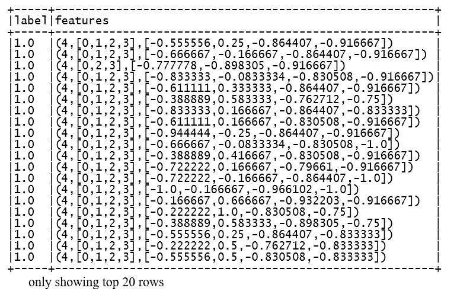

1.  接下来，我们利用数据集的`randomSplit`方法，将数据集按 80%的训练数据和 20%的测试数据进行分割：

```scala
val Array (train, test) = data.randomSplit(Array( 0.8 , 0.2 ), seed = System.currentTimeMillis())
```

1.  让我们配置一个逻辑回归算法，用作 One-vs-Rest 算法的分类器：

```scala
val lrc = new LogisticRegression()
.setMaxIter(15)
.setTol(1E-3)
.setFitIntercept(true)
```

1.  接下来，我们创建一个 one versus rest 对象，将我们新创建的逻辑回归对象作为参数传递：

```scala
val ovr = new OneVsRest().setClassifier(lrc)
```

1.  通过在我们的 one-vs-rest 对象上调用 fit 方法生成模型：

```scala
val ovrModel = ovr.fit(train)
```

1.  现在，我们将使用训练好的模型为测试数据生成预测并显示结果：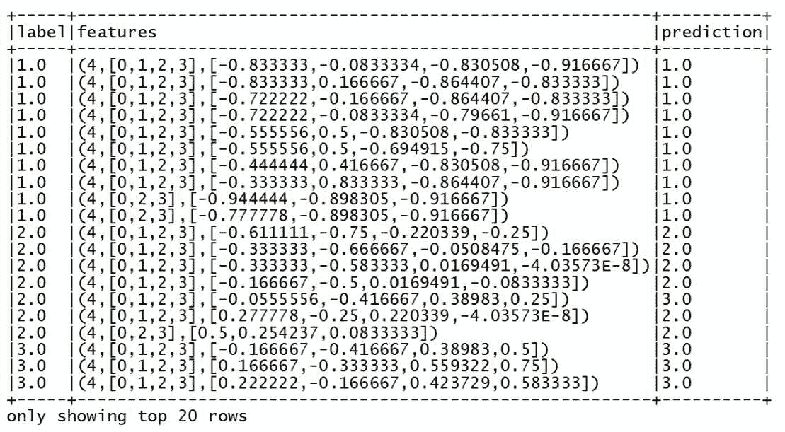

1.  最后，我们将预测传递给多类分类评估器，生成准确度值：

```scala
val eval = new MulticlassClassificationEvaluator()
.setMetricName("accuracy")
val accuracy = eval.evaluate(predictions)
println("Accuracy: " + eval.evaluate(predictions))
Accuracy: 0.9583333333333334
```

1.  通过停止`SparkSession`来关闭程序：

```scala
spark.stop()
```

# 工作原理...

在这个示例中，我们演示了 One-vs-Rest 分类器的用法。我们首先加载了经典的 Iris 数据集，格式为`libsvm`。接下来，我们将数据集按 80%的比例分割为训练数据集和 20%的测试数据集。我们提醒用户注意，我们如何使用系统时间来进行分割的随机性如下：

```scala
data.randomSplit(Array( 0.8 , 0.2 ), seed = System.currentTimeMillis())
```

该算法最好可以描述为一个三步过程：

1.  我们首先配置回归对象，而无需手头上有基本的逻辑模型，以便将其输入到我们的分类器中：

```scala
LogisticRegression()
.setMaxIter(15)
.setTol(1E-3)
.setFitIntercept(true)
```

1.  在下一步中，我们将配置好的回归模型输入到我们的分类器中，并调用`fit()`函数来完成相应的工作：

```scala
val ovr = new OneVsRest().setClassifier(lrc)
```

1.  我们生成了一个训练模型，并通过该模型转换了测试数据。最后，我们将预测传递给多类分类评估器，生成一个准确度值。

# 还有更多...

这种算法的典型用法是将关于一个人的不同新闻项目标记和打包到各种类别中（例如友好与敌对、温和与欢欣等）。在医疗账单中的另一个用途可能是将患者诊断分类为用于自动结算和收入循环最大化的不同医疗编码。

一对多：如下图所示，这通过二元逻辑回归解决了一个*n*标签分类问题：

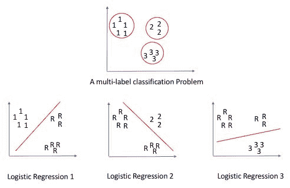

# 另请参阅

Spark 2.0 关于`OneVsRest()`的文档可以在以下找到：

[`spark.apache.org/docs/latest/api/scala/index.html#org.apache.spark.ml.classification.OneVsRest`](http://spark.apache.org/docs/latest/api/scala/index.html#org.apache.spark.ml.classification.OneVsRest)

另一种可视化方法是，评估给定二元分类器是否可以将 n 类输入分解为*N*个逻辑回归，然后选择最能描述数据的那个。以下是使用 Python 中 Scikit Learn 库的此分类器的众多示例：

[`scikit-learn.org/stable/modules/generated/sklearn.multiclass.OneVsOneClassifier.html#sklearn.multiclass.OneVsOneClassifier`](http://scikit-learn.org/stable/modules/generated/sklearn.multiclass.OneVsOneClassifier.html#sklearn.multiclass.OneVsOneClassifier)

但我们建议您在 GitHub 上对实际的 Scala 源代码进行快速扫描（仅不到 400 行）：

[`github.com/apache/spark/blob/v2.0.2/mllib/src/main/scala/org/apache/spark/ml/classification/OneVsRest.scala`](https://github.com/apache/spark/blob/v2.0.2/mllib/src/main/scala/org/apache/spark/ml/classification/OneVsRest.scala)

# 生存回归 - 参数 AFT 模型在 Apache Spark 2.0 中

在这个教程中，我们探索了 Spark 2.0 对生存回归的实现，这不是典型的比例危险模型，而是**加速失效时间**（**AFT**）模型。这是一个重要的区别，应该在运行这个教程时牢记，否则结果将毫无意义。

生存回归分析关注的是*事件发生时间*的模型，这在医学、保险和任何时候对主题的生存能力感兴趣的情况下都很常见。我的一位合著者碰巧是一位受过全面训练的医生（除了是计算机科学家），所以我们使用了该领域一本备受尊敬的书中的真实数据集 HMO-HIM+研究，以便获得合理的输出。

目前，我们正在使用这种技术来进行干旱建模，以预测农产品在长期时间范围内的价格影响和预测。

# 如何做...

1.  前往 UCLA 网站下载文件：

[`stats.idre.ucla.edu/stat/r/examples/asa/hmohiv.csv`](https://stats.idre.ucla.edu/stat/r/examples/asa/hmohiv.csv)

我们使用的数据集是 David W Hosmer 和 Stanley Lemeshow（1999）的书《应用生存分析：事件发生时间数据的回归建模》中的实际数据。数据来自 HMO-HIM+研究，数据包含以下字段：

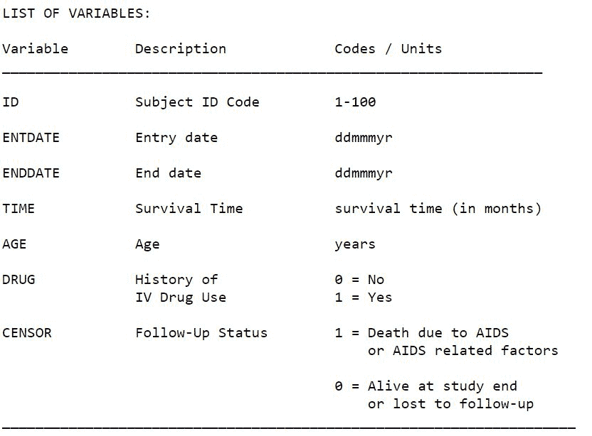

1.  在 IntelliJ 或您选择的 IDE 中启动一个新项目。确保包含必要的 JAR 文件。

1.  设置程序所在的包位置：

```scala
package spark.ml.cookbook.chapter5
```

1.  导入`SparkSession`所需的包，以便访问集群，以及`Log4j.Logger`以减少 Spark 产生的输出量：

```scala
import org.apache.log4j.{Level, Logger}
 import org.apache.spark.ml.linalg.Vectors
 import org.apache.spark.ml.regression.AFTSurvivalRegression
 import org.apache.spark.sql.SparkSession
```

1.  将输出级别设置为`ERROR`，以减少 Spark 的日志输出：

```scala
Logger.getLogger("org").setLevel(Level.ERROR)
Logger.getLogger("akka").setLevel(Level.ERROR)
```

1.  使用构建器模式初始化`SparkSession`，指定配置，从而为 Spark 集群提供入口点：

```scala
val spark = SparkSession
 .builder
 .master("local[4]")
 .appName("myAFTSurvivalRegression")
 .config("spark.sql.warehouse.dir", ".")
 .getOrCreate()
```

1.  然后我们读取`csv`文件，跳过第一行（标题）。

注意：有多种方法可以将`csv`文件读入 Spark DataFrame：

```scala
val file = spark.sparkContext.textFile("../data/sparkml2/chapter5/hmohiv.csv")
 val headerAndData = file.map(line => line.split(",").map(_.trim))
 val header = headerAndData.first
 val rawData = headerAndData.filter(_(0) != header(0))
```

1.  我们将字段从字符串转换为双精度。我们只对 ID、时间、年龄和审查字段感兴趣。然后这四个字段形成一个 DataFrame：

```scala
val df = spark.createDataFrame(rawData
 .map { line =>
 val id = line(0).toDouble
 val time =line(1).toDouble
 val age = line(2).toDouble
 val censor = line(4).toDouble
 (id, censor,Vectors.dense(time,age))
 }).toDF("label", "censor", "features")
```

新的`features`字段是由`time`和`age`字段组成的向量。

1.  接下来，我们在控制台中显示了 DataFrame：

```scala
df.show()
```

从控制台，这是输出：

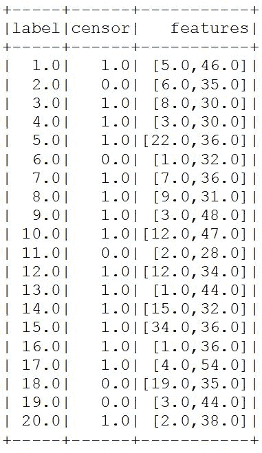

1.  现在我们将创建`AFTSurvivalRegression`对象，并设置参数。

对于这个特定的配方，分位数概率设置为 0.3 和 0.6。这些值描述了分位数的边界，它们是概率的数值向量，其值范围在*0.0*到*1.0* [*0.0,1.0*]之间。例如，使用(0.25, 0.5, 0.75)作为分位数概率向量是一个常见的主题。

分位数列名设置为*quantiles*。

在下面的代码中，我们创建了`AFTSurvivalRegression()`对象，并设置了列名和分位数概率向量。

来自 Spark 在 GitHub 上的源代码的以下代码显示了默认值：

```scala
 @Since("1.6.0")
def getQuantileProbabilities: Array[Double] = $(quantileProbabilities)
setDefault(quantileProbabilities -> Array(0.01, 0.05, 0.1, 0.25, 0.5, 0.75, 0.9, 0.95, 0.99)) 
```

要了解参数化和种子，可以在 GitHub 上参考*Spark Source Code for Survival Regression* [`github.com/apache/spark/blob/master/mllib/src/main/scala/org/apache/spark/ml/regression/AFTSurvivalRegression.scala`](https://github.com/apache/spark/blob/master/mllib/src/main/scala/org/apache/spark/ml/regression/AFTSurvivalRegression.scala)。

```scala
val aft = new AFTSurvivalRegression()
 .setQuantileProbabilities(Array(0.3, 0.6))
 .setQuantilesCol("quantiles")
```

1.  我们让模型运行：

```scala
val aftmodel = aft.fit(df)
```

1.  我们将模型数据打印到控制台：

```scala
println(s"Coefficients: ${aftmodel.coefficients} ")
 println(s"Intercept: ${aftmodel.intercept}" )
 println(s"Scale: ${aftmodel.scale}")
```

控制台中将看到以下输出：

```scala
Coefficients: [6.601321816135838E-4,-0.02053601452465816]
Intercept: 4.887746420937845
Scale: 0.572288831706005
```

1.  我们使用前面的模型转换了数据集，并在控制台中显示了结果：

```scala
aftmodel.transform(df).show(false)
```

控制台中将看到以下输出：

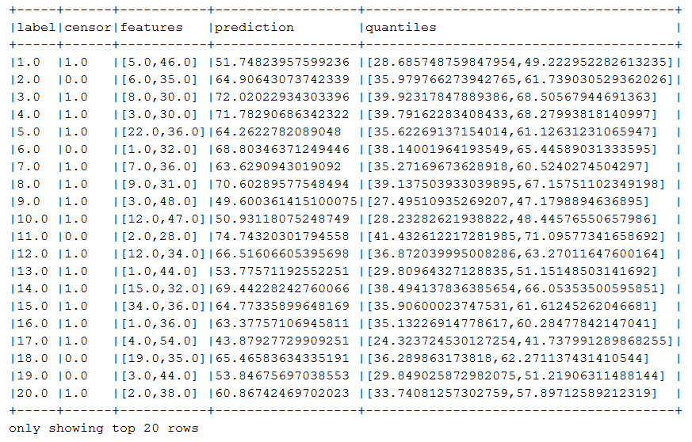

1.  我们通过停止`SparkSession`来关闭程序：

```scala
spark.stop()
```

# 工作原理...

我们探索了**加速失效时间**（**AFT**）模型的特征。我们首先使用`sparkContext.textFile()`将数据集文件读入 Spark。有多种方法可以读取`csv`格式文件。我们只选择了一个显示更详细步骤的方法。

接下来，我们过滤了头行，并将感兴趣的字段从字符串转换为双精度，然后将双精度数据集转换为具有新`features`字段的新 DataFrame。

然后，我们创建了`AFTSurvivalRegression`对象并设置了分位数参数，并通过调用`fit(data)`函数让模型自行运行。

最后，我们显示了模型摘要，并使用模型转换了数据集，并显示了包括预测和分位数字段的结果 DataFrame。

# 还有更多...

Spark 实现的生存回归（`AFTSurvivalRegression`）*：*

+   **模型：**加速失效时间（AFT）。

+   **参数化：**使用威布尔分布。

+   **优化：**Spark 选择 AFT 是因为它更容易并行化，并将问题视为具有 L-BFGS 作为优化方法的凸优化问题。

+   **R/SparkR 用户：**在没有拦截器的情况下拟合`AFTSurvivalRegressionModel`到具有常数非零列的数据集时，Spark MLlib 会对常数非零列输出零系数。这种行为与 R `survival::survreg`不同。（来自 Spark 2.0.2 文档）

您应该将结果视为发生感兴趣事件的时间，比如疾病的发生、赢得或失去、按揭违约时间、婚姻、离婚、毕业后找到工作等。这些模型的独特之处在于*时间事件*是一个持续时间，并不一定有解释变量（也就是说，它只是一段时间，以天、月或年为单位）。

您可能使用生存模型而不是简单回归（即诱人）的原因如下：

+   需要将结果变量建模为时间事件

+   审查-并非所有数据都是已知的或使用的（在使用来自过去几个世纪的长期商品数据时很常见）

+   非正态分布的结果-通常是时间的情况

+   这可能是多变量分析的情况，也可能不是。

尽管在此处概述了生存回归的两种方法，但在撰写本文时，Spark 2.0 仅支持 AFT 模型，而不支持最广为人知的比例风险模型：

+   比例风险模型（PH）：

+   比例性假设随时间而定

+   在考虑时间内通过协方差乘以常数

+   示例：Cox 比例风险模型

+   **hx(y) = h0(y)*g(X)**

+   加速时间故障（ATF）- Spark 2.0 实施：

+   可以假设或违反比例性假设

+   通过协方差乘以常数值以获得回归系数值可能是：

+   加速

+   减速

+   允许回归展开的阶段：

+   疾病的阶段

+   生存能力的阶段

+   *Yx * g(X) = Y0*

*Sx(y) = S0(yg(X))*

*其中，*

*Y*：生存时间，

*X*：协变量向量，

*hx(y)*：危险函数，

*Sx(y)*：给定*X*的*Y*的生存函数，

*Yx*：给定*X*的*Y*

+   参数建模 - 时间变量的基础分布：

+   指数

+   Weibull - Spark 2.0 实施

+   对数逻辑

+   正态

+   伽马

+   另请参阅 - 在 R 中非常受欢迎 - 我们使用了这两个软件包：

+   Library(survival)：标准生存分析

+   Library(eha)：用于 AFT 建模

`SurvivalRegression`的文档可在以下网址找到：

+   [`spark.apache.org/docs/latest/api/scala/index.html#org.apache.spark.ml.regression.AFTSurvivalRegressionModel`](http://spark.apache.org/docs/latest/api/scala/index.html#org.apache.spark.ml.regression.AFTSurvivalRegressionModel)

+   [`spark.apache.org/docs/latest/ml-classification-regression.html#survival-regression`](https://spark.apache.org/docs/latest/ml-classification-regression.html#survival-regression)

`HMOHIV`数据集的原始格式可在以下网址找到 - 以访客身份连接：

ftp://ftp.wiley.com/public/sci_tech_med/survival

可以在以下网址找到 Proportional 与 AFT（Spark 2.0）风险模型的深入完整比较：

[`ecommons.usask.ca/bitstream/handle/10388/etd-03302009-140638/JiezhiQiThesis.pdf`](https://ecommons.usask.ca/bitstream/handle/10388/etd-03302009-140638/JiezhiQiThesis.pdf)

具有图表的端到端真实世界医学研究：

[`www.researchgate.net/profile/Richard_Kay2/publication/254087561_On_the_Use_of_the_Accelerated_Failure_Time_Model_as_an_Alternative_to_the_Proportional_Hazards_Model_in_the_Treatment_of_Time_to_Event_Data_A_Case_Study_in_Influenza/links/548ed67e0cf225bf66a710ce.pdf`](https://www.researchgate.net/profile/Richard_Kay2/publication/254087561_On_the_Use_of_the_Accelerated_Failure_Time_Model_as_an_Alternative_to_the_Proportional_Hazards_Model_in_the_Treatment_of_Time_to_Event_Data_A_Case_Study_in_Influenza/links/548ed67e0cf225bf66a710ce.pdf)

# 另请参阅

+   AFT 生存实施的文档：

+   [`spark.apache.org/docs/latest/api/scala/index.html#org.apache.spark.ml.feature.MinMaxScaler`](https://spark.apache.org/docs/latest/api/scala/index.html#org.apache.spark.ml.feature.MinMaxScaler)

+   [`spark.apache.org/docs/latest/api/scala/index.html#org.apache.spark.ml.regression.AFTSurvivalRegression`](https://spark.apache.org/docs/latest/api/scala/index.html#org.apache.spark.ml.regression.AFTSurvivalRegression)

+   [`spark.apache.org/docs/latest/api/scala/index.html#org.apache.spark.ml.regression.AFTSurvivalRegressionModel`](https://spark.apache.org/docs/latest/api/scala/index.html#org.apache.spark.ml.regression.AFTSurvivalRegressionModel)

+   Spark 生存回归的源代码可在 GitHub 上找到：[`github.com/apache/spark/blob/master/mllib/src/main/scala/org/apache/spark/ml/regression/AFTSurvivalRegression.scala`](https://github.com/apache/spark/blob/master/mllib/src/main/scala/org/apache/spark/ml/regression/AFTSurvivalRegression.scala)
