# 第六章：在 Spark 2.0 中使用回归和分类的实用机器学习 - 第二部分

在 Spark 2.0 中使用逻辑回归探索 ML 管道和数据框

+   在 Spark 2.0 中使用 SGD 优化的线性回归

+   在 Spark 2.0 中使用 SGD 优化的逻辑回归

+   在这一章中，Spark 2.0 中回归和分类的后半部分，我们重点介绍了基于 RDD 的回归，这是目前许多现有 Spark ML 实现中的实践。由于现有的代码库，预期中级到高级的从业者能够使用这些技术。

+   在 Spark 2.0 中使用 SGD 优化的 Lasso 回归

+   在 Spark 2.0 中使用 L-BFGS 优化的逻辑回归

+   在本章中，我们将涵盖以下配方：

+   使用 Spark 2.0 MLlib 的朴素贝叶斯机器学习

+   [`archive.ics.uci.edu/ml/machine-learning-databases/housing/`](https://archive.ics.uci.edu/ml/machine-learning-databases/housing/)

# 介绍

使用 Spark 2.0 的支持向量机（SVM）

在本章中，您将学习如何使用各种回归（线性、逻辑、岭和套索）以及**随机梯度下降**（**SGD**）和 L-BFGS 优化来实现一个小型应用程序，使用线性但强大的分类器，如**支持向量机**（**SVM**）和**朴素贝叶斯**分类器，使用 Apache Spark API。我们将每个配方与适当的样本拟合度量相结合（例如，MSE、RMSE、ROC 和二进制和多类度量），以展示 Spark MLlib 的强大和完整性。我们介绍了基于 RDD 的线性、逻辑、岭和套索回归，然后讨论了 SVM 和朴素贝叶斯，以展示更复杂的分类器。

以下图表描述了本章中的回归和分类覆盖范围：

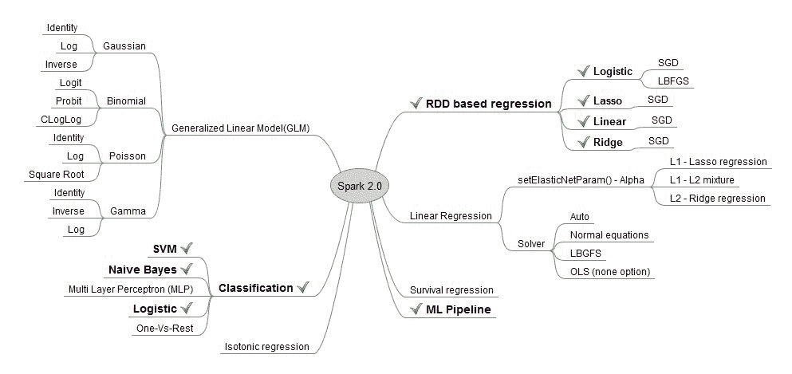

有报道称在实际应用中使用 SGD 进行回归存在问题，但这些问题很可能是由于 SGD 的调优不足或者未能理解大型参数系统中这种技术的利弊。

在本章和以后，我们开始朝着更完整（即插即用）的回归和分类系统迈进，这些系统可以在构建机器学习应用程序时加以利用。虽然每个配方都是一个独立的程序，但可以使用 Spark 的 ML 管道来组装一个更复杂的系统，以创建一个端到端的机器学习系统（例如，通过朴素贝叶斯对癌症簇进行分类，然后使用套索对每个部分进行参数选择）。您将在本章的最后一个配方中看到 ML 管道的一个很好的例子。虽然两个回归和分类章节为您提供了 Spark 2.0 分类中可用内容的良好示例，但我们将更复杂的方法保留到以后的章节中。

最好使用数据科学中的最新方法，但在毕业到更复杂的模型之前，掌握基础知识是很重要的，从 GLM、LRM、岭回归、套索和 SVM 开始 - 确保您了解何时使用每个模型。

# 在 Spark 2.0 中使用 SGD 优化的线性回归

在这个配方中，我们使用 Spark 基于 RDD 的回归 API 来演示如何使用迭代优化技术来最小化成本函数，并得出线性回归的解决方案。

我们将研究 Spark 如何使用迭代方法来收敛到回归问题的解决方案，使用一种称为**梯度下降**的众所周知的方法。Spark 提供了一种更实用的实现，称为 SGD，用于计算截距（在本例中设置为 0）和参数的权重。

# 在这个配方中，我们使用 Spark 基于 RDD 的回归 API 来演示如何使用迭代优化技术来最小化成本函数，并得出线性回归的解决方案。

1.  我们使用了 UCI 机器库存储中的一个房屋数据集。您可以从以下网址下载整个数据集：

在 Spark 2.0 中使用 SGD 优化的岭回归

数据集包括 14 列，前 13 列是独立变量（特征），试图解释美国波士顿自住房的中位价格（最后一列）。

我们选择并清理了前八列作为特征。我们使用前 200 行来训练和预测中位价格：

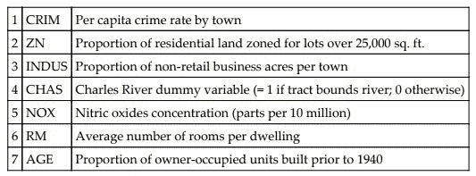

1.  在 IntelliJ 或您选择的 IDE 中开始一个新项目。确保必要的 JAR 文件已包含。

1.  设置程序所在的包位置：

```scala
package spark.ml.cookbook.chapter6
```

1.  导入必要的 Spark 会话包以访问集群和`Log4j.Logger`以减少 Spark 产生的输出量：

```scala
import org.apache.spark.mllib.regression.{LabeledPoint, LinearRegressionWithSGD}
import org.apache.spark.sql.SparkSession
import org.apache.spark.mllib.linalg.{Vector, Vectors}
import org.apache.log4j.Logger
import org.apache.log4j.Level
```

1.  使用构建器模式初始化一个 SparkSession，指定配置，从而为 Spark 集群提供入口点：

```scala
val spark = SparkSession
 .builder
 .master("local[4]")
 .appName("myRegress02")
 .config("spark.sql.warehouse.dir", ".")
 .getOrCreate()
```

1.  将输出级别设置为 ERROR 以减少 Spark 的输出：

```scala
 Logger.getLogger("org").setLevel(Level.ERROR)
 Logger.getLogger("akka").setLevel(Level.ERROR)
```

1.  我们摄取并并行化数据集（仅前 200 行）：

```scala
val data = sc.textFile("../data/sparkml2/chapter6/housing8.csv") 
```

1.  我们获取并并行化 RDD（即数据变量），并使用`map()`函数拆分列。然后我们继续遍历列，并将它们存储在 Spark 所需的结构中（LabeledPoint）。LabeledPoint 是一个数据结构，第一列是因变量（即标签），后面是一个 DenseVector（即`Vectors.Dense`）。我们必须以这种格式呈现数据，以供 Spark 的`LinearRegressionWithSGD()`算法使用：

```scala
val RegressionDataSet = data.map { line =>
   val columns = line.split(',')

   LabeledPoint(columns(13).toDouble , Vectors.dense(columns(0).toDouble,columns(1).toDouble, columns(2).toDouble, columns(3).toDouble,columns(4).toDouble,
     columns(5).toDouble,columns(6).toDouble, columns(7).toDouble
   ))
 }
```

1.  现在我们通过输出来检查回归数据，以熟悉 LabeledPoint 数据结构：

```scala
RegressionDataSet.collect().foreach(println(_)) 

(24.0,[0.00632,18.0,2.31,0.0,0.538,6.575,65.2,4.09]) 
(21.6,[0.02731,0.0,7.07,0.0,0.469,6.421,78.9,4.9671]) 
(34.7,[0.02729,0.0,7.07,0.0,0.469,7.185,61.1,4.9671]) 
(33.4,[0.03237,0.0,2.18,0.0,0.458,6.998,45.8,6.0622]) 
(36.2,[0.06905,0.0,2.18,0.0,0.458,7.147,54.2,6.0622]) 
```

1.  我们设置模型参数，即迭代次数和 SGD 步长。由于这是梯度下降方法，必须尝试各种值，找到能够得到良好拟合并避免浪费资源的最佳值。我们通常使用迭代次数从 100 到 20000（极少情况下），SGD 步长从.01 到.00001 的值范围：

```scala
val numIterations = 1000
 val stepsSGD      = .001
```

1.  我们调用构建模型：

```scala
   val myModel = LinearRegressionWithSGD.train(RegressionDataSet, numIterations,stepsSGD) 
```

1.  在这一步中，我们使用数据集使用在前一步中构建的模型来预测值。然后将预测值和标记值放入`predictedLabelValue`数据结构中。澄清一下，前一步是构建模型（即决定数据的拟合），而这一步使用模型进行预测：

```scala
val predictedLabelValue = RegressionDataSet.map { lp => val predictedValue = myModel.predict(lp.features)
   (lp.label, predictedValue)
 }
```

1.  在这一步中，我们检查截距（默认情况下未选择截距）和八列的权重（列 0 到 7）：

```scala
println("Intercept set:",myModel.intercept)
 println("Model Weights:",myModel.weights)
```

输出如下：

```scala
Intercept set: 0.0
 Model Weights:,[-0.03734048699612366,0.254990126659302,0.004917402413769299,
 0.004611027094514264,0.027391067379836438,0.6401657695067162,0.1911635554630619,0.408578077994874])
```

1.  为了感受预测值，我们使用`takesample()`函数随机选择了二十个值，但不进行替换。在这种情况下，我们仅展示了其中七个值的数值：

```scala
predictedLabelValue.takeSample(false,5).foreach(println(_)) 
```

输出如下：

```scala
(21.4,21.680880143786645)
 (18.4,24.04970929955823)
 (15.0,27.93421483734525)
 (41.3,23.898190127554827)
 (23.6,21.29583657363941)
 (33.3,34.58611522445151)
 (23.8,19.93920838257026)
```

1.  我们使用均方根误差（其中之一）来量化拟合。拟合可以得到显著改善（更多数据、步骤 SGD、迭代次数，最重要的是特征工程的实验），但我们将其留给统计书籍来探讨。以下是 RMSD 的公式：

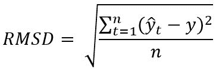

```scala
val MSE = predictedLabelValue.map{ case(l, p) => math.pow((l - p), 2)}.reduce(_ + _) / predictedLabelValue.count
 val RMSE = math.sqrt(MSE)println("training Mean Squared Error = " + MSE)
 println("training Root Mean Squared Error = " + RMSE)
```

输出如下：

```scala
training Mean Squared Error = 91.45318188628684
training Root Mean Squared Error = 9.563115699722912
```

# 工作原理...

我们使用了来自房屋数据（自变量）文件的选定列来预测房屋价格（因变量）。我们使用了基于 RDD 的回归方法，采用 SGD 优化器进行迭代求解。然后我们输出了截距和每个参数的权重。在最后一步，我们使用样本数据进行了预测并显示了输出。最后一步是输出模型的 MSE 和 RMSE 值。请注意，这仅用于演示目的，您应该使用第四章中演示的评估指标，*实施强大机器学习系统的常见方法*，进行模型评估和最终选择过程。

此方法构造函数的签名如下：

```scala
newLinearRegressionWithSGD()
```

参数的默认值：

+   `stepSize= 1.0`

+   `numIterations= 100`

+   ``miniBatchFraction= 1.0``

`miniBatchFraction`是一个重要的参数，它对性能有重大影响。这在学术文献中被称为批量梯度与梯度。

# 还有更多...

1.  我们还可以使用构造函数更改默认的拦截行为，创建一个新的回归模型，然后相应地使用`setIntercept(true)`：

示例代码如下：

```scala
  val myModel = new LinearRegressionWithSGD().setIntercept(true)
```

1.  如果模型的权重计算为 NaN，则必须更改模型参数（SGD 步数或迭代次数），直到收敛。例如，模型权重未正确计算（通常由于参数选择不当导致 SGD 存在收敛问题）。第一步应该是使用更精细的 SGD 步长参数：

```scala
(Model Weights:,[NaN,NaN,NaN,NaN,NaN,NaN,NaN,NaN]) 
```

# 另请参阅

我们在第九章中详细介绍了梯度下降和 SGD，*优化 - 用梯度下降下山*。在本章中，读者应该将 SGD 抽象为一种优化技术，用于最小化拟合一系列点的损失函数。有一些参数会影响 SGD 的行为，我们鼓励读者将这些参数改变到极端值，观察性能不佳和不收敛（即结果将显示为 NaN）。

`LinearRegressionWithSGD()`构造函数的文档位于以下 URL：

[`spark.apache.org/docs/latest/api/scala/index.html#org.apache.spark.package`](http://spark.apache.org/docs/latest/api/scala/index.html#org.apache.spark.package)

# Spark 2.0 中带有 SGD 优化的逻辑回归

在这个示例中，我们使用 UCI 机器库存储库中的入学数据来构建并训练一个模型，以预测基于给定一组特征（GRE、GPA 和等级）的学生入学情况，使用基于 RDD 的`LogisticRegressionWithSGD()` Apache Spark API 集。

这个示例演示了优化（SGD）和正则化（惩罚模型的复杂性或过拟合）。我们强调它们是两个不同的概念，常常让初学者感到困惑。在接下来的章节中，我们将更详细地演示这两个概念，因为理解它们对于成功学习机器学习是至关重要的。

# 如何做...

1.  我们使用了来自 UCLA **数字研究和教育**（**IDRE**）的入学数据集。您可以从以下 URL 下载整个数据集：

+   对于主页，您可以参考[`www.ats.ucla.edu/stat/`](http://www.ats.ucla.edu/stat/)

+   对于数据文件，您可以参考[`stats.idre.ucla.edu/stat/data/binary.csv`](https://stats.idre.ucla.edu/stat/data/binary.csv)

数据集包括四列，第一列是因变量（标签 - 学生是否被录取），接下来的三列是解释变量，即将解释学生入学情况的特征。

我们选择并清理了前三列作为特征。我们使用前 200 行来训练和预测中位数价格：

+   +   入学 - 0，1 表示学生是否被录取

+   GRE - 研究生录取考试的分数

+   GPA - 平均成绩

+   RANK - 排名

以下是前 10 行的样本数据：

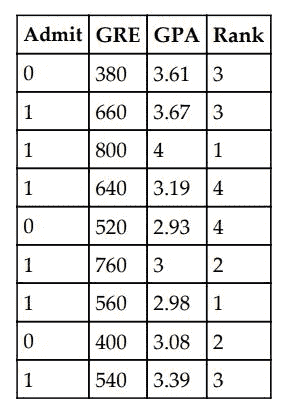

1.  在 IntelliJ 或您选择的 IDE 中启动一个新项目。确保包含必要的 JAR 文件。

1.  设置程序所在的包位置：

```scala
package spark.ml.cookbook.chapter6
```

1.  导入必要的包以便 Spark 会话可以访问集群，并使用`Log4j.Logger`来减少 Spark 产生的输出量：

```scala
import org.apache.spark.mllib.classification.LogisticRegressionWithSGD
 import org.apache.spark.mllib.linalg.Vectors
 import org.apache.spark.mllib.regression.{LabeledPoint, LassoWithSGD}
 import org.apache.spark.sql.{SQLContext, SparkSession}
 import org.apache.spark.{SparkConf, SparkContext}
 import org.apache.spark.ml.classification.{LogisticRegression, LogisticRegressionModel}
import org.apache.log4j.Logger
import org.apache.log4j.Level
```

1.  初始化`SparkSession`，使用构建器模式指定配置，从而为 Spark 集群提供入口点：

```scala
val spark = SparkSession
 .builder
 .master("local[4]")
 .appName("myRegress05")
 .config("spark.sql.warehouse.dir", ".")
 .getOrCreate()
```

1.  将输出级别设置为`ERROR`以减少 Spark 的输出：

```scala
Logger.getLogger("org").setLevel(Level.ERROR)
 Logger.getLogger("akka").setLevel(Level.ERROR)
```

1.  加载数据文件并将其转换为 RDD：

```scala
val data = sc.textFile("../data/sparkml2/chapter6/admission1.csv")
```

1.  通过拆分数据并将其转换为双精度，同时构建一个 LabeledPoint（Spark 所需的数据结构）数据集来摄取数据。第 1 列（位置 0）是回归中的因变量，而第 2 到第 4 列（GRE、GPA、Rank）是特征：

```scala
val RegressionDataSet = data.map { line =>
   val columns = line.split(',')

   LabeledPoint(columns(0).toDouble , Vectors.dense(columns(1).toDouble,columns(2).toDouble, columns(3).toDouble ))

 }
```

1.  我们加载数据集后检查数据集，这是一直建议的，还演示了标签点内部，这是一个单一值（例如标签或因变量），后面是我们试图用来解释因变量的 DenseVector 特征：

```scala
RegressionDataSet.collect().foreach(println(_)) 

(0.0,[380.0,3.61,3.0]) 
(1.0,[660.0,3.67,3.0]) 
(1.0,[800.0,4.0,1.0]) 
(1.0,[640.0,3.19,4.0])      
   . . . . .  
. . . . . 
. . . . . 
. . . . .
```

1.  我们为`LogisticRegressionWithSGD()`设置了模型参数。

这些参数最终控制拟合，因此需要一定程度的实验才能获得良好的拟合。我们在上一个示例中看到了前两个参数。第三个参数的值将影响权重的选择。您必须进行实验并使用模型选择技术来决定最终值。在本示例的*还有更多...*部分，我们基于两个极端值展示了特征的权重选择（即哪些权重设置为 0）：

```scala
// Logistic Regression with SGD r Model parameters

val numIterations = 100
val stepsSGD = .00001
val regularizationParam = .05 // 1 is the default
```

1.  使用 LabeledPoint 和前述参数创建和训练逻辑回归模型，调用`LogisticRegressionWithSGD()`：

```scala
val myLogisticSGDModel = LogisticRegressionWithSGD.train(RegressionDataSet, numIterations,stepsSGD, regularizationParam) 
```

1.  使用我们的模型和数据集预测值（类似于所有 Spark 回归方法）：

```scala
val predictedLabelValue = RegressionDataSet.map { lp => val predictedValue =  myLogisticSGDModel.predict(lp.features)
   (lp.label, predictedValue)
 }
```

1.  我们打印出模型的截距和权重。如果将值与线性或岭回归进行比较，您将看到选择效果。在极端值或选择具有更多共线性的数据集时，效果将更加显著。

在这个例子中，通过设置权重为 0.0，套索消除了三个参数，使用了正则化参数（例如 4.13）：

```scala
println("Intercept set:",myRidgeModel.intercept) 
println("Model Weights:",myRidgeModel.weights) 

(Intercept set:,0.0) 
(Model Weights:,[-0.0012241832336285247,-7.351033538710254E-6,-8.625514722380274E-6])
```

从统计学的模型参数选择原则仍然适用于我们是否使用 Spark MLlib。例如，参数权重为-8.625514722380274E-6 可能太小而无法包含在模型中。我们需要查看每个参数的`t-statistic`和`p value`，并决定最终的模型。

1.  我们随机选择 20 个预测值，并直观地检查预测结果（这里只显示了前五个值）：

```scala
(0.0,0.0) 
(1.0,0.0) 
(1.0,0.0) 
(0.0,0.0) 
(1.0,0.0) 
. . . . .   
. . . . .   
```

1.  我们计算 RMSE 并显示结果：

```scala
val MSE = predictedLabelValue.map{ case(l, p) => math.pow((l - p), 2)}.reduce(_ + _) / predictedLabelValue.count

val RMSE = math.sqrt(MSE)

println("training Mean Squared Error = " + MSE) 
println("training Root Mean Squared Error = " + RMSE)
```

输出如下：

```scala
training Mean Squared Error = 0.3175 
```

```scala
training Root Mean Squared Error = 0.5634713834792322
```

# 它是如何工作的...

我们使用入学数据，并尝试使用逻辑回归来预测具有给定特征集（向量）的学生是否被录取（标签）。我们拟合了回归，设置了 SGD 参数（您应该进行实验），并运行了 API。然后，我们输出回归系数的截距和模型权重。使用模型，我们预测并输出一些预测值以进行视觉检查。最后一步是输出模型的 MSE 和 RMSE 值。请注意，这仅用于演示目的，您应该使用上一章中演示的评估指标进行模型评估和最终选择过程。通过查看 SME 和 RMSE，我们可能需要不同的模型、参数设置、参数或更多数据点来做得更好。

该方法构造函数的签名如下：

```scala
newLogisticRegressionWithSGD()
```

参数的默认值：

+   `stepSize`= 1.0

+   `numIterations`= 100

+   `regParm`= 0.01

+   `miniBatchFraction`= 1.0

# 还有更多...

虽然非逻辑回归试图发现将解释因素（特征）与方程左侧的数值变量相关联的线性或非线性关系，逻辑回归试图将特征集分类到一组离散类别（例如通过/不通过，好/坏或多类）。

理解逻辑回归的最佳方法是将左侧的领域视为一组离散的结果（即分类类），用于标记新的预测。使用离散标签（例如 0 或 1），我们能够预测一组特征是否属于特定类别（例如疾病的存在或不存在）。

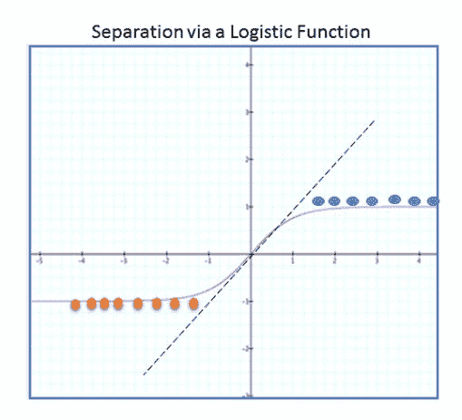

简而言之，常规回归和逻辑回归之间的主要区别是可以在左侧使用的变量类型。 在常规回归中，预测的结果（即标签）将是一个数值，而在逻辑回归中，预测是从可能结果的离散类别中进行选择（即标签）。

出于时间和空间的考虑，我们不在每个示例中涵盖将数据集分割为训练和测试的内容，因为我们在之前的示例中已经演示了这一点。 我们也不使用任何缓存，但强调现实生活中的应用必须缓存数据，因为 Spark 中使用了惰性实例化、分阶段和优化的方式。 请参阅第四章，*实施强大的机器学习系统的常见示例*，以参考有关缓存和训练/测试数据拆分的示例。

如果模型的权重计算为 NaN，则必须更改模型参数（即 SGD 步骤或迭代次数），直到收敛。

# 另请参阅

这是构造函数的文档：

[`spark.apache.org/docs/latest/api/scala/index.html#org.apache.spark.mllib.classification.LogisticRegressionWithSGD`](http://spark.apache.org/docs/latest/api/scala/index.html#org.apache.spark.mllib.classification.LogisticRegressionWithSGD)

# Spark 2.0 中的 SGD 优化岭回归

在这个示例中，我们使用 UCI 机器库存储库中的入学数据来构建并训练一个模型，以使用基于 RDD 的`LogisticRegressionWithSGD()` Apache Spark API 集来预测学生入学。 我们使用一组给定的特征（GRE，GPA 和 Rank）在入学期间用于预测模型权重，使用岭回归。 我们在另一个示例中演示了输入特征标准化，但应该注意的是，参数标准化对结果有重要影响，特别是在岭回归设置中。

Spark 的岭回归 API（`LogisticRegressionWithSGD`）旨在处理多重共线性（解释变量或特征相关，并且独立和随机分布的特征变量的假设有些错误）。 岭回归是关于收缩（通过 L2 正则化或二次函数进行惩罚）一些参数，从而减少它们的影响，进而降低复杂性。 需要记住的是，`LogisticRegressionWithSGD()`没有套索效应，其中一些参数实际上被减少到零（即被消除）。 岭回归只是收缩参数，而不是将它们设为零（收缩后仍将保留一些小效果）。

# 如何做...

1.  我们使用 UCI 机器库存储库中的房屋数据集。 您可以从以下 URL 下载整个数据集：

[`archive.ics.uci.edu/ml/machine-learning-databases/housing/`](https://archive.ics.uci.edu/ml/machine-learning-databases/housing/)

数据集包括 14 列，前 13 列是独立变量（即特征），试图解释美国波士顿自住房的中位价格（最后一列）。

我们选择并清理了前八列作为特征。 我们使用前 200 行来训练和预测中位价格。

| 1 | CRIM | 按城镇人均犯罪率 |
| --- | --- | --- |
| 2 | ZN | 用于超过 25,000 平方英尺的地块的住宅用地比例 |
| 3 | INDUS | 每个镇的非零售业务面积比例 |
| 4 | CHAS | 查尔斯河虚拟变量（如果地块与河流相接则为 1；否则为 0） |
| 5 | NOX | 一氧化氮浓度（每 1000 万份之） |
| 6 | RM | 每个住宅的平均房间数 |
| 7 | AGE | 1940 年之前建造的自住单位比例 |

1.  在 IntelliJ 或您选择的 IDE 中启动新项目。 确保包含必要的 JAR 文件。

1.  设置程序所在的包位置：

```scala
package spark.ml.cookbook.chapter6
```

1.  导入必要的包以使 SparkSession 能够访问集群和`Log4j.Logger`以减少 Spark 产生的输出量：

```scala
import org.apache.spark.mllib.regression.{LabeledPoint, LinearRegressionWithSGD, RidgeRegressionWithSGD}
 import org.apache.spark.sql.{SQLContext, SparkSession}

 import org.apache.spark.ml.tuning.{ParamGridBuilder, TrainValidationSplit}
 import org.apache.spark.mllib.linalg.{Vector, Vectors}
import org.apache.log4j.Logger
import org.apache.log4j.Level
```

1.  使用构建器模式初始化 SparkSession，从而为 Spark 集群提供入口点：

```scala
val spark = SparkSession
 .builder
 .master("local[4]")
 .appName("myRegress03")
 .config("spark.sql.warehouse.dir", ".")
 .getOrCreate()
```

1.  为了有效地展示岭回归中模型参数的收缩（它会收缩到一个小值，但永远不会被消除），我们使用相同的房屋数据文件，并清理和使用前八列来预测最后一列的值（房屋价格中位数）：

```scala
val data = sc.textFile("../data/sparkml2/chapter6/housing8.csv")
```

1.  通过拆分数据并将其转换为 double，同时构建一个 LabeledPoint（Spark 所需的数据结构）数据集来摄取数据：

```scala
val RegressionDataSet = data.map { line =>
   val columns = line.split(',')

   LabeledPoint(columns(13).toDouble , Vectors.dense(columns(0).toDouble,columns(1).toDouble, columns(2).toDouble, columns(3).toDouble,columns(4).toDouble,
     columns(5).toDouble,columns(6).toDouble, columns(7).toDouble
   ))

 }
```

1.  加载数据集后检查数据集，这是一直建议的，还演示了 LabeledPoint 的内部结构，它是一个单一值（标签/因变量），后跟我们试图用来解释因变量的特征的 DenseVector：

```scala
RegressionDataSet.collect().foreach(println(_)) 

(24.0,[0.00632,18.0,2.31,0.0,0.538,6.575,65.2,4.09]) 
(21.6,[0.02731,0.0,7.07,0.0,0.469,6.421,78.9,4.9671]) 
(34.7,[0.02729,0.0,7.07,0.0,0.469,7.185,61.1,4.9671]) 

. . . . .  
. . . . . 
. . . . . 
. . . . . 

(33.3,[0.04011,80.0,1.52,0.0,0.404,7.287,34.1,7.309]) 
(30.3,[0.04666,80.0,1.52,0.0,0.404,7.107,36.6,7.309]) 
(34.6,[0.03768,80.0,1.52,0.0,0.404,7.274,38.3,7.309]) 
(34.9,[0.0315,95.0,1.47,0.0,0.403,6.975,15.3,7.6534]) 
```

我们为`RidgeRegressionWithSGD()`设置了模型参数。

在本教程的*还有更多...*部分，我们基于两个极端值展示了收缩效应。

```scala
// Ridge regression Model parameters
 val numIterations = 1000
 val stepsSGD = .001
 val regularizationParam = 1.13 
```

1.  使用上述参数调用`RidgeRegressionWithSGD()`和 LabeledPoint 创建和训练岭回归模型：

```scala
val myRidgeModel = RidgeRegressionWithSGD.train(RegressionDataSet, numIterations,stepsSGD, regularizationParam) 
```

1.  使用我们的模型和数据集预测数值（类似于所有 Spark 回归方法）：

```scala
val predictedLabelValue = RegressionDataSet.map { lp => val predictedValue = myRidgeModel.predict(lp.features)
   (lp.label, predictedValue)
 }
```

1.  打印模型截距和权重。如果将值与线性回归进行比较，您将看到收缩效应。在选择具有更多共线性的数据集或极端值时，效果将更加明显：

```scala
println("Intercept set:",myRidgeModel.intercept)
 println("Model Weights:",myRidgeModel.weights) 

(Intercept set:,0.0) 
(Model Weights:,[-0.03570346878210774,0.2577081687536239,0.005415957423129407,0.004368409890400891, 0.026279497009143078,0.6130086051124276,0.19363086562068213,0.392655338663542])
```

1.  随机选择 20 个预测数值并直观地检查预测结果（仅显示前五个值）：

```scala
(23.9,15.121761357965845) 
(17.0,23.11542703857021) 
(20.5,24.075526274194395) 
(28.0,19.209708926376237) 
(13.3,23.386162089812697) 

. . . . .   
. . . . .
```

1.  计算 RMSE 并显示结果：

```scala
val MSE = predictedLabelValue.map{ case(l, p) => math.pow((l - p), 2)}.reduce(_ + _) / predictedLabelValue.count
 val RMSE = math.sqrt(MSE)

 println("training Mean Squared Error = " + MSE)
 println("training Root Mean Squared Error = " + RMSE) 
```

输出如下：

```scala
training Mean Squared Error = 92.60723710764655
training Root Mean Squared Error = 9.623265407731752  
```

# 工作原理...

为了能够与其他回归方法进行比较并观察收缩效应，我们再次使用房屋数据并使用`RidgeRegressionWithSGD.train`训练模型。在拟合模型后，我们输出了刚刚训练的模型的截距和参数权重。然后我们使用`*.predict()*`API 预测数值。在输出 MSE 和 RMSE 之前，我们打印了预测值并直观地检查了前 20 个数字。

此方法构造函数的签名如下：

```scala
new RidgeRegressionWithSGD()
```

这些参数最终控制了拟合，因此需要一定程度的实验来实现良好的拟合。我们在上一个教程中看到了前两个参数。第三个参数将根据所选的值影响权重的收缩。您必须进行实验并使用模型选择技术来决定最终值。

参数的默认值：

+   `stepSize` = 1.0

+   `numIterations` = 100

+   `regParm` = 0.01

+   `miniBatchFraction` = 1.0

我们在第九章中详细介绍了优化和 L1（绝对值）与 L2（平方），“优化 - 使用梯度下降下山”，但是对于本教程的目的，读者应该了解岭回归使用 L2 进行惩罚（即收缩一些参数），而即将到来的教程“Spark 2.0 中使用 SGD 优化的套索回归”使用 L1 进行惩罚（即根据所使用的阈值消除一些参数）。我们鼓励用户将本教程的权重与线性回归和套索回归教程进行比较，以亲自看到效果。我们使用相同的房屋数据集来展示效果。

以下图表显示了带有正则化函数的岭回归：

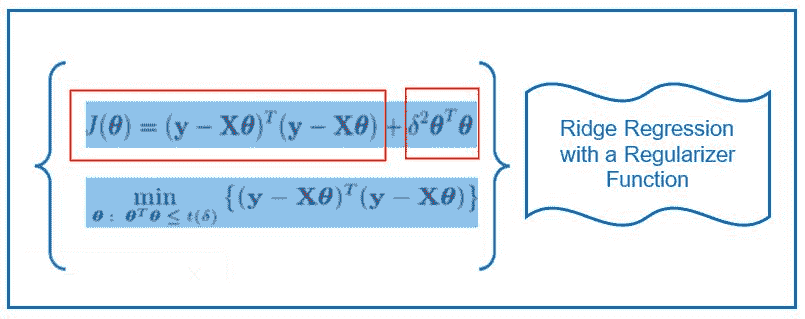

简而言之，这是通过添加一个小的偏差因子（岭回归）来处理特征依赖的一种补救措施，它使用正则化惩罚来减少变量。岭回归会收缩解释变量，但永远不会将其设置为 0，不像套索回归会消除变量。

本示例的范围仅限于演示 Spark 中岭回归的 API 调用。岭回归的数学和深入解释是统计书籍中多章的主题。为了更好地理解，我们强烈建议读者在考虑 L1、L2、... L4 正则化以及岭回归和线性 PCA 之间的关系的同时，熟悉这个概念。

# 还有更多...

参数的收缩量因参数选择而异，但权重收缩需要共线性的存在。您可以通过使用真正随机（由随机生成器生成的 IID 解释变量）与高度相互依赖的特征（例如，腰围和体重）来自行证明这一点。

以下是极端正则化值的两个示例以及它们对模型权重和收缩的影响：

```scala
val regularizationParam = .00001
(Model Weights:,
[-0.0373404807799996, 0.25499013376755847, 0.0049174051853082094, 0.0046110262713086455, 0.027391063252456684, 0.6401656691002464, 0.1911635644638509, 0.4085780172461439 ]) 

val regularizationParam = 50
(Model Weights:,[-0.012912409941749588, 0.2792184353165915, 0.016208621185873275, 0.0014162706383970278, 0.011205887829385417, 0.2466274224421205, 0.2261797091664634, 0.1696120633704305])
```

如果模型的权重计算为 NaN，则必须更改模型参数（SGD 步骤或迭代次数），直到收敛。

这是一个由于参数选择不当而未正确计算模型权重的示例。第一步应该是使用更精细的 SGD 步骤参数：

```scala
(Model Weights:,[NaN,NaN,NaN,NaN,NaN,NaN,NaN,NaN])
```

# 另请参阅

以下是构造函数的文档：

[`spark.apache.org/docs/latest/api/scala/index.html#org.apache.spark.mllib.regression.RidgeRegressionWithSGD`](http://spark.apache.org/docs/latest/api/scala/index.html#org.apache.spark.mllib.regression.RidgeRegressionWithSGD)

# Spark 2.0 中使用 SGD 优化的套索回归

在本示例中，我们将使用先前示例中的住房数据集，以演示 Spark 的基于 RDD 的套索回归`LassoWithSGD()`，它可以通过将其他权重设置为零（因此根据阈值消除一些参数）来选择一部分参数，同时减少其他参数的影响（正则化）。我们再次强调，岭回归减少了参数权重，但从不将其设置为零。

`LassoWithSGD()`是 Spark 的基于 RDD 的套索（最小绝对收缩和选择算子）API，这是一种回归方法，同时执行变量选择和正则化，以消除不贡献的解释变量（即特征），从而提高预测的准确性。基于**普通最小二乘法**（**OLS**）的套索可以轻松扩展到其他方法，例如**广义线性方法**（**GLM**）。

# 操作步骤...

1.  在 IntelliJ 或您选择的 IDE 中启动新项目。确保包含必要的 JAR 文件。

1.  设置程序所在的包位置：

```scala
package spark.ml.cookbook.chapter6
```

1.  导入 SparkSession 所需的必要包，以便访问集群和`Log4j.Logger`以减少 Spark 产生的输出量：

```scala
import org.apache.spark.mllib.regression.{LabeledPoint, LassoWithSGD, LinearRegressionWithSGD, RidgeRegressionWithSGD}
 import org.apache.spark.sql.{SQLContext, SparkSession}
 import org.apache.spark.ml.classification.LogisticRegression
 import org.apache.spark.ml.tuning.{ParamGridBuilder, TrainValidationSplit}
 import org.apache.spark.mllib.linalg.{Vector, Vectors}
import org.apache.log4j.Logger
import org.apache.log4j.Level
```

1.  使用构建器模式初始化 SparkSession，从而为 Spark 集群提供入口点：

```scala
val spark = SparkSession
 .builder
 .master("local[4]")
 .appName("myRegress04")
 .config("spark.sql.warehouse.dir", ".")
 .getOrCreate()
```

1.  为了有效地演示岭回归模型参数的收缩（它将收缩到一个小值，但永远不会被消除），我们使用相同的住房数据文件，并清理并使用前八列来预测最后一列的值（中位数住房价格）：

```scala
val data = sc.textFile("../data/sparkml2/chapter6/housing8.csv")
```

1.  我们通过拆分数据并将其转换为双精度来摄取数据，同时构建一个 LabeledPoint（Spark 所需的数据结构）数据集：

```scala
val RegressionDataSet = data.map { line => 
val columns = line.split(',')

  LabeledPoint(columns(13).toDouble , Vectors.dense(columns(0).toDouble,columns(1).toDouble, columns(2).toDouble, columns(3).toDouble,columns(4).toDouble,

    columns(5).toDouble,columns(6).toDouble, columns(7).toDouble

  ))

} 
```

1.  加载数据集后，我们检查数据集，这是一直建议的，并演示标签点的内部，这是一个值（即标签/因变量），后跟我们试图用来解释因变量的特征的 DenseVector：

```scala
   RegressionDataSet.collect().foreach(println(_)) 

(24.0,[0.00632,18.0,2.31,0.0,0.538,6.575,65.2,4.09]) 
   . . . . .  
. . . . . 
. . . . . 
. . . . . 
   (34.6,[0.03768,80.0,1.52,0.0,0.404,7.274,38.3,7.309]) 
(34.9,[0.0315,95.0,1.47,0.0,0.403,6.975,15.3,7.6534]) 
```

1.  我们设置了`lassoWithSGD()`的模型参数。这些参数最终控制拟合，因此需要一定程度的实验来获得良好的拟合。我们在前面的配方中看到了前两个参数。第三个参数的值将影响权重的选择。您必须进行实验并使用模型选择技术来决定最终值。在本配方的*更多内容*部分，我们展示了基于两个极端值的特征的权重选择（即哪些权重设置为 0）：

```scala
// Lasso regression Model parameters

val numIterations = 1000 
val stepsSGD = .001 
val regularizationParam = 1.13  
```

1.  我们通过调用`RidgeRegressionWithSGD()`和我们的 LabeledPoint 来创建和训练岭回归模型，使用了前述参数：

```scala
val myRidgeModel = LassoWithSGD.train(RegressionDataSet, numIterations,stepsSGD, regularizationParam) 
```

1.  我们使用我们的模型和数据集来预测值（与所有 Spark 回归方法类似）：

```scala
val predictedLabelValue = RegressionDataSet.map { lp => val predictedValue = myRidgeModel.predict(lp.features) 
  (lp.label, predictedValue)

} 
```

1.  我们打印我们的模型截距和权重。如果将值与线性或岭回归进行比较，您将看到选择效果。在极端值或选择具有更多共线性的数据集时，效果将更加显著。

在这个例子中，套索通过设置权重为 0.0 使用正则化参数（例如 4.13）消除了三个参数。

```scala
println("Intercept set:",myRidgeModel.intercept) 
println("Model Weights:",myRidgeModel.weights) 

(Intercept set:,0.0) 
(Model Weights:,[-0.0,0.2714890393052161,0.0,0.0,0.0,0.4659131582283458 ,0.2090072656520274,0.2753771238137026]) 

```

1.  我们随机选择了 20 个预测值，并直观地检查了预测结果（这里只显示了前五个值）：

```scala
(18.0,24.145326403899134) 
(29.1,25.00830500878278) 
(23.1,10.127919006877956) 
(18.5,21.133621139346403) 
(22.2,15.755470439755092) 
. . . . .   
. . . . .   
```

1.  我们计算 RMSE 并展示结果：

```scala
val MSE = predictedLabelValue.map{ case(l, p) => math.pow((l - p), 2)}.reduce(_ + _) / predictedLabelValue.count

val RMSE = math.sqrt(MSE)

println("training Mean Squared Error = " + MSE) 
println("training Root Mean Squared Error = " + RMSE) 
```

输出如下：

```scala
training Mean Squared Error = 99.84312606110213
 training Root Mean Squared Error = 9.992153224460788
```

# 工作原理...

同样，我们使用了房屋数据，这样我们可以将这种方法与岭回归进行比较，并展示套索不仅像岭回归一样收缩参数，而且它会一直进行下去，并将那些没有显著贡献的参数设置为零。

此方法构造函数的签名如下：

```scala
new LassoWithSGD()
```

参数的默认值：

+   `stepSize`= 1.0

+   `numIterations`= 100

+   `regParm`= 0.01

+   `miniBatchFraction`= 1.0

作为提醒，岭回归减少了参数的权重，但并不会消除它们。在数据挖掘/机器学习中处理大量参数时，如果没有深度学习系统，通常会优先选择套索，以减少 ML 管道早期阶段的输入数量，至少在探索阶段。

由于套索能够根据阈值选择一部分权重（即参数），因此在高级数据挖掘和机器学习中扮演着重要角色。简而言之，套索回归根据阈值决定包括或排除哪些参数（即将权重设置为 0）。

虽然岭回归可以大大减少参数对整体结果的贡献，但它永远不会将权重减少到零。套索回归通过能够将特征的权重减少到零（因此选择了贡献最大的特征子集）而不同于岭回归。

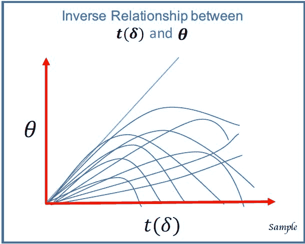

# 更多内容...

参数选择（即将一些权重设置为零）随正则化参数值的变化而变化。

这是两个极端正则化值的例子，以及它们对模型权重和收缩的影响：

```scala
val regularizationParam = .30
```

在这种情况下，我们使用套索消除了一个参数：

```scala
   (Model Weights:,[-0.02870908693284211,0.25634834423693936,1.707233741603369E-4, 0.0,0.01866468882602282,0.6259954005818621,0.19327180817037548,0.39741266136942227]) 
```

```scala
val regularizationParam = 4.13
```

在这种情况下，我们使用套索消除了四个参数：

```scala
(Model Weights:,[-0.0,0.2714890393052161,0.0,0.0,0.0, 0.4659131582283458,0.2090072656520274,0.2753771238137026])
```

如果模型的权重计算为 NaN，则必须更改模型参数（即 SGD 步骤或迭代次数），直到收敛。

这是一个模型权重计算不正确的例子（即 SGD 中的收敛问题），这是由于参数选择不当。第一步应该是使用更精细的 SGD 步骤参数：

```scala
(Model Weights:,[NaN,NaN,NaN,NaN,NaN,NaN,NaN,NaN])
```

# 另请参阅

这是构造函数的文档：

[`spark.apache.org/docs/latest/api/scala/index.html#org.apache.spark.mllib.regression.LassoWithSGD`](http://spark.apache.org/docs/latest/api/scala/index.html#org.apache.spark.mllib.regression.LassoWithSGD)

# Spark 2.0 中使用 L-BFGS 优化的逻辑回归

在这个示例中，我们将再次使用 UCI 录取数据集，以便演示 Spark 基于 RDD 的逻辑回归解决方案，`LogisticRegressionWithLBFGS()`，用于某些类型的 ML 问题中存在的大量参数。

对于非常大的变量空间，我们建议使用 L-BFGS，因为可以使用更新来近似二阶导数的 Hessian 矩阵。如果您的 ML 问题涉及数百万或数十亿个参数，我们建议使用深度学习技术。

# 如何做...

1.  我们使用 UCLA IDRE 的录取数据集。您可以从以下网址下载整个数据集：

+   要查看主页，请访问[`www.ats.ucla.edu/stat/`](http://www.ats.ucla.edu/stat/)链接。

+   要查看数据文件，请访问[`stats.idre.ucla.edu/stat/data/binary.csv`](https://stats.idre.ucla.edu/stat/data/binary.csv)链接。

数据集包括四列，第一列是因变量（即标签-学生是否被录取），接下来的三列是自变量（解释学生录取的特征）。

我们选择并清理了前八列作为特征。我们使用前 200 行来训练和预测中位数价格。

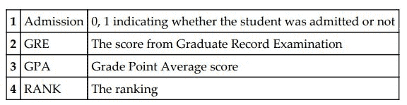

以下是前三行的一些示例数据：

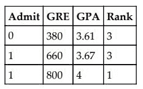

1.  在 IntelliJ 或您选择的 IDE 中开始一个新项目。确保包含必要的 JAR 文件。

1.  设置程序所在的包位置：

```scala
package spark.ml.cookbook.chapter6
```

1.  导入 SparkSession 所需的包，以便访问集群和`Log4j.Logger`以减少 Spark 产生的输出量：

```scala
import org.apache.spark.mllib.linalg.Vectors
 import org.apache.spark.mllib.regression.LabeledPoint
 import org.apache.spark.mllib.classification.LogisticRegressionWithLBFGS
 import org.apache.spark.sql.{SQLContext, SparkSession}
 import org.apache.log4j.Logger
 import org.apache.log4j.Level
```

1.  使用构建器模式初始化 SparkSession，从而为 Spark 集群提供入口点：

```scala
val spark = SparkSession
 .builder
.master("local[4]")
 .appName("myRegress06")
 .config("spark.sql.warehouse.dir", ".")
 .getOrCreate()
```

1.  加载数据文件并将其转换为 RDD：

```scala
val data = sc.textFile("../data/sparkml2/chapter6/admission1.csv")
```

1.  通过拆分数据并转换为双精度来摄取数据，同时构建一个 LabeledPoint（即 Spark 所需的数据结构）数据集。列 1（即位置 0）是回归中的因变量，而列 2 到 4（即 GRE、GPA、Rank）是特征：

```scala
val RegressionDataSet = data.map { line =>
   val columns = line.split(',')

   LabeledPoint(columns(0).toDouble , Vectors.dense(columns(1).toDouble,columns(2).toDouble, columns(3).toDouble ))

 }
```

1.  加载后检查数据集，这是一直建议的，还演示标签点内部，这是一个单一值（即标签/因变量），后面是我们试图用来解释因变量的特征的 DenseVector：

```scala
RegressionDataSet.collect().foreach(println(_)) 

(0.0,[380.0,3.61,3.0]) 
(1.0,[660.0,3.67,3.0]) 
(1.0,[800.0,4.0,1.0]) 
(1.0,[640.0,3.19,4.0])      
   . . . . .  
. . . . . 
. . . . . 
. . . . . 

```

1.  使用新运算符创建一个 LBFGS 回归对象，并将截距设置为 false，以便我们可以与`logisticregressionWithSGD()`示例进行公平比较：

```scala
val myLBFGSestimator = new LogisticRegressionWithLBFGS().setIntercept(false) 
```

1.  使用`run()`方法使用数据集创建训练好的模型（即结构化为 LabeledPoint）：

```scala
val model1 = myLBFGSestimator.run(RegressionDataSet)
```

1.  模型已经训练好。使用`predict()`方法来预测并分类相应的组。在接下来的行中，只需使用一个密集向量来定义两个学生的数据（GRE、GPA 和 Rank 特征），并让它预测学生是否被录取（0 表示被拒绝，1 表示学生将被录取）：

```scala
// predict a single applicant on the go
 val singlePredict1 = model1.predict(Vectors.dense(700,3.4, 1))
 println(singlePredict1)

val singlePredict2 = model1.predict(Vectors.dense(150,3.4, 1))
 println(singlePredict2) 

```

输出将如下所示：

```scala
1.0   
0.0   
```

1.  为了展示一个稍微复杂的过程，为五名学生定义一个 SEQ 数据结构，并尝试在下一步使用`map()`和`predict()`来批量预测。很明显，此时可以读取任何数据文件并转换，以便我们可以预测更大的数据块：

```scala
   val newApplicants=Seq(
   (Vectors.dense(380.0, 3.61, 3.0)),
   (Vectors.dense(660.0, 3.67, 3.0)),
   (Vectors.dense(800.0, 1.3, 1.0)),
   (Vectors.dense(640.0, 3.19, 4.0)),
   (Vectors.dense(520.0, 2.93, 1.0))
 )
```

1.  现在使用`map()`和`predict()`来运行 SEQ 数据结构，并使用训练好的模型批量产生预测：

```scala
 val predictedLabelValue = newApplicants.map {lp => val predictedValue =  model1.predict(lp)
   ( predictedValue)
 }
```

1.  查看学生的输出和预测结果。0 或 1 的存在表示基于模型的学生被拒绝或接受：

```scala
predictedLabelValue.foreach(println(_)) 

Output: 
0.0 
0.0 
1.0 
0.0 
1.0 
```

# 工作原理...

我们使用 UCI 入学数据和`LogisticRegressionWithLBFGS()`来预测学生是否被录取。截距被设置为 false，使用`.run()`和`.predict()` API 来预测拟合模型。这里的重点是 L-BFGS 适用于大量参数，特别是在存在大量稀疏性时。无论使用了什么优化技术，我们再次强调岭回归可以减少参数权重，但永远不会将其设置为零。

此方法构造函数的签名如下：

```scala
LogisticRegressionWithLBFGS ()
```

Spark 中的 L-BFGS 优化，`L-BFGS()`，基于牛顿优化算法（在点处使用曲率和曲线的 2^(nd)导数），可以被认为是寻找可微函数上的稳定点的最大似然函数。这种算法的收敛应该特别注意（也就是说，需要最优或梯度为零）。

请注意，本示例仅用于演示目的，您应该使用第四章中演示的评估指标进行模型评估和最终选择过程。

# 还有更多...

`LogisticRegressionWithLBFGS()`对象有一个名为`setNumClasses()`的方法，允许它处理多项式（也就是说，超过两个组）。默认情况下，它设置为二，这是二元逻辑回归。

L-BFGS 是原始 BFGS（Broyden-Fletcher-Goldfarb-Shanno）方法的有限内存适应。L-BFGS 非常适合处理大量变量的回归模型。它是一种带有有限内存的 BFGS 近似，它试图在搜索大搜索空间时估计 Hessian 矩阵。

我们鼓励读者退后一步，将问题视为回归加上优化技术（使用 SGD 的回归与使用 L-BFGS 的回归）。在这个示例中，我们使用了逻辑回归，它本身是线性回归的一种形式，只是标签是离散的，再加上一个优化算法（也就是说，我们选择了 L-BFGS 而不是 SGD）来解决问题。

为了欣赏 L-BFGS 的细节，必须了解 Hessian 矩阵及其作用，以及在优化中使用稀疏矩阵配置时出现的大量参数（Hessian 或 Jacobian 技术）的困难。

# 另请参阅

这是构造函数的文档：

[`spark.apache.org/docs/latest/api/scala/index.html#org.apache.spark.mllib.classification.LogisticRegressionWithLBFGS`](http://spark.apache.org/docs/latest/api/scala/index.html#org.apache.spark.mllib.classification.LogisticRegressionWithLBFGS)

# Spark 2.0 中的支持向量机（SVM）

在这个示例中，我们使用 Spark 的基于 RDD 的 SVM API `SVMWithSGD`与 SGD 将人口分类为两个二进制类，并使用计数和`BinaryClassificationMetrics`来查看模型性能。

为了节省时间和空间，我们使用了已经提供给 Spark 的样本`LIBSVM`格式，但提供了由台湾大学提供的额外数据文件的链接，以便读者可以自行进行实验。**支持向量机**（**SVM**）作为一个概念基本上非常简单，除非你想深入了解它在 Spark 或任何其他软件包中的实现细节。

虽然 SVM 背后的数学超出了本书的范围，但鼓励读者阅读以下教程和原始 SVM 论文，以便更深入地理解。

原始文件是由*Vapnik*和*Chervonenkis*（1974 年，1979 年-俄语）编写的，还有*Vapnik*的 1982 年翻译他的 1979 年著作：

[`www.amazon.com/Statistical-Learning-Theory-Vladimir-Vapnik/dp/0471030031`](https://www.amazon.com/Statistical-Learning-Theory-Vladimir-Vapnik/dp/0471030031)

对于更现代的写作，我们建议从我们的图书馆中选择以下三本书：

+   *V. Vapnik 的《统计学习理论的本质》*：

[`www.amazon.com/Statistical-Learning-Information-Science-Statistics/dp/0387987800`](https://www.amazon.com/Statistical-Learning-Information-Science-Statistics/dp/0387987800)

+   *B. Scholkopf 和 A. Smola 的《使用核方法学习：支持向量机、正则化、优化和更多》*：

[`mitpress.mit.edu/books/learning-kernels`](https://mitpress.mit.edu/books/learning-kernels)

+   *K. Murphy 的《机器学习：概率视角》*：

[`mitpress.mit.edu/books/machine-learning-0`](https://mitpress.mit.edu/books/machine-learning-0)

# 如何做...

1.  在 IntelliJ 或您选择的 IDE 中启动一个新项目。确保包含必要的 JAR 文件。

1.  设置程序所在的包位置：

```scala
package spark.ml.cookbook.chapter6
```

1.  导入必要的 SparkSession 包以访问集群和`Log4j.Logger`以减少 Spark 产生的输出量：

```scala
import org.apache.spark.mllib.util.MLUtils
 import org.apache.spark.mllib.classification.{SVMModel, SVMWithSGD}
 import org.apache.spark.mllib.evaluation.{BinaryClassificationMetrics, MultilabelMetrics, binary}
 import org.apache.spark.sql.{SQLContext, SparkSession}
import org.apache.log4j.Logger
import org.apache.log4j.Level
```

1.  使用构建模式初始化 SparkSession，从而为 Spark 集群提供入口点：

```scala
val spark = SparkSession
 .builder
.master("local[4]")
 .appName("mySVM07")
 .config("spark.sql.warehouse.dir", ".")
 .getOrCreate()
```

1.  Spark 提供了 MLUtils 包，使我们能够读取任何格式正确的`libsvm`文件。我们使用`LoadLibSVMFile()`来加载 Spark 附带的一个短样本文件（100 行），以便进行简单的实验。`sample_libsvm_data`文件可以在 Spark 主目录的`.../data/mlib/`目录中找到。我们只需将文件复制到我们自己的 Windows 机器上的目录中：

```scala
val dataSetSVM = MLUtils.loadLibSVMFile(sc," ../data/sparkml2/chapter6/sample_libsvm_data.txt") 
```

1.  打印并检查样本文件的内容输出。输出中包含了简短版本的内容以供参考：

```scala
println("Top 10 rows of LibSVM data")
 dataSetSVM.collect().take(10).foreach(println(_)) 

Output: 
(0.0,(692,[127,128,129,130,131,154, .... ])) 
(1.0,(692,[158,159,160,161,185,186, .... ])) 

```

1.  检查确保所有数据都已加载，并且文件没有重复：

```scala
println(" Total number of data vectors =", dataSetSVM.count())
 val distinctData = dataSetSVM.distinct().count()
 println("Distinct number of data vectors = ", distinctData) 

Output: 
( Total number of data vectors =,100) 
(Distinct number of data vectors = ,100) 
```

1.  在这一步中，将数据分成两组（80/20），并准备相应地训练模型。`allDataSVM`变量将根据拆分比例随机选择两个部分。这些部分可以通过索引 0 和 1 来引用，分别指代训练和测试数据集。您还可以在`randomSplit()`中使用第二个参数来定义随机拆分的初始种子：

```scala
val trainingSetRatio = .20
 val populationTestSetRatio = .80

val splitRatio = Array(trainingSetRatio, populationTestSetRatio) 

 val allDataSVM = dataSetSVM.randomSplit(splitRatio)
```

1.  将迭代次数设置为 100。接下来的两个参数是 SGD 步骤和正则化参数-我们在这里使用默认值，但您必须进行实验以确保算法收敛：

```scala
val numIterations = 100 

 val myModelSVM = SVMWithSGD.train(allDataSVM(0), numIterations,1,1)
```

1.  在上一步中训练模型之后，现在使用`map()`和`predict()`函数来预测测试数据的结果（即拆分数据的索引 1）：

```scala
val predictedClassification = allDataSVM(1).map( x => (myModelSVM.predict(x.features), x.label)) 
```

1.  通过输出直观地检查预测（为方便起见进行了缩短）。接下来的步骤尝试量化我们的预测效果：

```scala
   predictedClassification.collect().foreach(println(_)) 

(1.0,1.0) 
(1.0,1.0) 
(1.0,1.0) 
(1.0,1.0) 
(0.0,0.0) 
(0.0,1.0) 
(0.0,0.0) 
   ....... 
   ....... 
```

1.  首先，使用快速计数/比率方法来感受准确度。由于我们没有设置种子，数字将因运行而异（但保持稳定）：

```scala
 val falsePredictions = predictedClassification.filter(p => p._1 != p._2)

println(allDataSVM(0).count())
 println(allDataSVM(1).count())

println(predictedClassification.count())
 println(falsePredictions.count()) 

Output: 
13 
87 
87 
2 
```

1.  现在使用更正式的方法来量化 ROC（即曲线下面积）。这是最基本的准确度标准之一。读者可以在这个主题上找到许多教程。我们使用标准和专有方法（即手工编码）的组合来量化测量。

1.  Spark 自带了一个二元分类量化测量。使用这个来收集测量：

```scala
val metrics = new BinaryClassificationMetrics(predictedClassification) 

```

1.  访问`areaUnderROC()`方法以获取 ROC 测量：

```scala
val areaUnderROCValue = metrics.areaUnderROC() 

  println("The area under ROC curve = ", areaUnderROCValue) 

  Output: 
  (The area under ROC curve = ,0.9743589743589743) 
```

# 工作原理...

我们使用了 Spark 提供的样本数据，格式为`LIBSVM`，来运行 SVM 分类配方。在读取文件后，我们使用`SVMWithSGD.train`来训练模型，然后继续将数据预测为两组标记输出，0 和 1。我们使用`BinaryClassificationMetrics`指标来衡量性能。我们专注于一个流行的指标，即 ROC 曲线下面积，使用`metrics.areaUnderROC()`来衡量性能。

该方法构造函数的签名如下：

```scala
new SVMWithSGD()
```

参数的默认值：

+   `stepSize`= 1.0

+   `numIterations`= 100

+   `regParm`= 0.01

+   `miniBatchFraction`= 1.0

建议读者尝试各种参数以获得最佳设置。

SVM 之所以伟大，是因为一些点落在错误的一侧是可以接受的，但模型会惩罚模型选择最佳拟合。

Spark 中的 SVM 实现使用 SGD 优化来对特征集的标签进行分类。当我们在 Spark 中使用 SVM 时，我们需要将数据准备成一种称为`libsvm`的格式。用户可以使用以下链接了解格式，并从国立台湾大学获取`libsvm`格式的现成数据集：

[`www.csie.ntu.edu.tw/~cjlin/libsvm/`](https://www.csie.ntu.edu.tw/~cjlin/libsvm/)

[`www.csie.ntu.edu.tw/~cjlin/libsvmtools/datasets/`](https://www.csie.ntu.edu.tw/~cjlin/libsvmtools/datasets/)

简而言之，`libsvm`格式如下：

```scala
<label> <index1>:<value1> <index2>:<value2> ...
```

可以使用 Python 或 Scala 程序创建管道，将文本文件转换为所需的`libsvm`格式。

Spark 在`/data/mlib`目录中有大量各种算法的示例文件。我们鼓励读者在熟悉 Spark MLlib 算法时使用这些文件：

```scala
SVMWithSGD() 
```

**接收器操作特性**（**ROC**）是一个图形绘图，说明了二元分类器系统的诊断能力，随着其判别阈值的变化。

ROC 的教程可以在以下链接找到：

[`en.wikipedia.org/wiki/Receiver_operating_characteristic`](https://en.wikipedia.org/wiki/Receiver_operating_characteristic)

# 还有更多...

您可以使用`libsvm`格式的公开可用数据源，也可以使用 Spark API 调用`SVMDataGenerator()`，该调用会生成 SVM 的样本数据（即，高斯分布）：

```scala
object SVMDataGenerator() 
```

SVM 背后的想法可以总结如下：不是使用线性判别（例如，在许多线中选择一条线）和目标函数（例如，最小二乘法）来分隔和标记左侧变量，而是首先使用最大分隔边界（如下图所示），然后在最大边界之间绘制实线。另一种思考方式是如何使用两条线（下图中的虚线）来最大程度地分隔类别（即，最好和最具有歧视性的分隔器）。简而言之，我们能够分隔类别的越宽，歧视性就越好，因此，在标记类别时更准确。

执行以下步骤以了解有关 SVM 的更多信息：

1.  选择最能够分隔两组的最宽边界。

1.  其次，绘制一条分隔最宽边界的线。这将作为线性判别。

1.  目标函数：最大化两条分隔线。

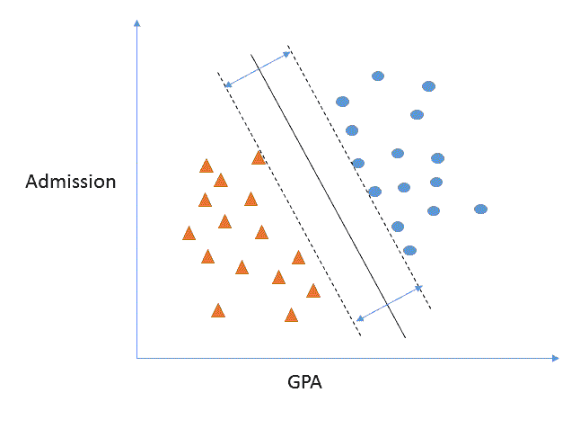

# 另请参阅

这是构造函数的文档：

[`spark.apache.org/docs/latest/api/scala/index.html#org.apache.spark.mllib.classification.SVMWithSGD`](http://spark.apache.org/docs/latest/api/scala/index.html#org.apache.spark.mllib.classification.SVMWithSGD)

# 使用 Spark 2.0 MLlib 的朴素贝叶斯机器学习

在这个示例中，我们使用著名的鸢尾花数据集，并使用 Apache Spark API `NaiveBayes()`来对给定的一组观测属于三类花中的哪一类进行分类/预测。这是一个多类分类器的示例，并需要多类度量来衡量拟合度。之前的示例使用了二元分类和度量来衡量拟合度。

# 如何做...

1.  对于朴素贝叶斯练习，我们使用一个名为`iris.data`的著名数据集，可以从 UCI 获得。该数据集最初是由 R. Fisher 在 1930 年代引入的。该集是一个多元数据集，具有被分类为三组的花属性测量。

简而言之，通过测量四列，我们试图将一种物种分类为三类鸢尾花中的一类（即，鸢尾花 Setosa，鸢尾花 Versicolor，鸢尾花 Virginica）。

我们可以从这里下载数据：

[`archive.ics.uci.edu/ml/datasets/Iris/`](https://archive.ics.uci.edu/ml/datasets/Iris/)

列定义如下：

+   +   以厘米为单位的萼片长度

+   以厘米为单位的萼片宽度

+   以厘米为单位的花瓣长度

+   以厘米为单位的花瓣宽度

+   类：

+   +   +   -- 鸢尾花山鸢尾 => 用 0 替换

+   -- 鸢尾花变色鸢尾 => 用 1 替换

+   -- 鸢尾花维吉尼亚 => 用 2 替换

我们需要对数据执行的步骤/操作如下：

+   +   下载并用数字值替换第五列（即标签或分类类别），从而生成 iris.data.prepared 数据文件。朴素贝叶斯调用需要数字标签而不是文本，这在大多数工具中都很常见。

+   删除文件末尾的额外行。

+   使用`distinct()`调用在程序内去除重复项。

1.  在 IntelliJ 或您选择的 IDE 中开始一个新项目。确保包含必要的 JAR 文件。

1.  设置程序所在的包位置：

```scala
package spark.ml.cookbook.chapter6
```

1.  导入 SparkSession 所需的包，以访问集群和`Log4j.Logger`以减少 Spark 产生的输出量：

```scala

 import org.apache.spark.mllib.linalg.{Vector, Vectors}
 import org.apache.spark.mllib.regression.LabeledPoint
 import org.apache.spark.mllib.classification.{NaiveBayes, NaiveBayesModel}
 import org.apache.spark.mllib.evaluation.{BinaryClassificationMetrics, MulticlassMetrics, MultilabelMetrics, binary}
 import org.apache.spark.sql.{SQLContext, SparkSession}

 import org.apache.log4j.Logger
 import org.apache.log4j.Level
```

1.  初始化一个 SparkSession，使用构建器模式指定配置，从而为 Spark 集群提供一个入口点：

```scala
val spark = SparkSession
 .builder
 .master("local[4]")
 .appName("myNaiveBayes08")
 .config("spark.sql.warehouse.dir", ".")
 .getOrCreate()
```

1.  加载`iris.data`文件并将数据文件转换为 RDDs：

```scala
val data = sc.textFile("../data/sparkml2/chapter6/iris.data.prepared.txt") 
```

1.  使用`map()`解析数据，然后构建一个 LabeledPoint 数据结构。在这种情况下，最后一列是标签，前四列是特征。同样，我们将最后一列的文本（即鸢尾花的类别）替换为相应的数值（即 0、1、2）：

```scala
val NaiveBayesDataSet = data.map { line =>
   val columns = line.split(',')

   LabeledPoint(columns(4).toDouble , Vectors.dense(columns(0).toDouble,columns(1).toDouble,columns(2).toDouble,columns(3).toDouble ))

 }
```

1.  然后确保文件不包含任何冗余行。在这种情况下，有三行冗余。我们将使用不同的数据集继续：

```scala
println(" Total number of data vectors =", NaiveBayesDataSet.count())
 val distinctNaiveBayesData = NaiveBayesDataSet.distinct()
 println("Distinct number of data vectors = ", distinctNaiveBayesData.count()) 

Output: 

(Total number of data vectors =,150) 
(Distinct number of data vectors = ,147) 
```

1.  我们通过检查输出来检查数据：

```scala
distinctNaiveBayesData.collect().take(10).foreach(println(_)) 

Output: 
(2.0,[6.3,2.9,5.6,1.8]) 
(2.0,[7.6,3.0,6.6,2.1]) 
(1.0,[4.9,2.4,3.3,1.0]) 
(0.0,[5.1,3.7,1.5,0.4]) 
(0.0,[5.5,3.5,1.3,0.2]) 
(0.0,[4.8,3.1,1.6,0.2]) 
(0.0,[5.0,3.6,1.4,0.2]) 
(2.0,[7.2,3.6,6.1,2.5]) 
.............. 
................ 
............. 
```

1.  使用 30%和 70%的比例将数据分割为训练集和测试集。在这种情况下，13L 只是一个种子数（L 代表长数据类型），以确保在使用`randomSplit()`方法时结果不会因运行而改变：

```scala
val allDistinctData = distinctNaiveBayesData.randomSplit(Array(.30,.70),13L)
 val trainingDataSet = allDistinctData(0)
 val testingDataSet = allDistinctData(1)
```

1.  打印每个集合的计数：

```scala
println("number of training data =",trainingDataSet.count())
 println("number of test data =",testingDataSet.count()) 

Output: 
(number of training data =,44) 
(number of test data =,103) 
```

1.  使用`train()`和训练数据集构建模型：

```scala
         val myNaiveBayesModel = NaiveBayes.train(trainingDataSet) 
```

1.  使用训练数据集加上`map()`和`predict()`方法根据它们的特征对花进行分类：

```scala
val predictedClassification = testingDataSet.map( x => (myNaiveBayesModel.predict(x.features), x.label)) 
```

1.  通过输出检查预测：

```scala
predictedClassification.collect().foreach(println(_)) 

(2.0,2.0) 
(1.0,1.0) 
(0.0,0.0) 
(0.0,0.0) 
(0.0,0.0) 
(2.0,2.0) 
....... 
....... 
.......
```

1.  使用`MulticlassMetrics()`创建多类分类器的度量。提醒一下，这与之前的方法不同，之前我们使用的是`BinaryClassificationMetrics()`：

```scala
val metrics = new MulticlassMetrics(predictedClassification) 
```

1.  使用常用的混淆矩阵来评估模型：

```scala
val confusionMatrix = metrics.confusionMatrix
 println("Confusion Matrix= \n",confusionMatrix) 

Output: 
   (Confusion Matrix=  
   ,35.0  0.0   0.0    
    0.0   34.0  0.0    
    0.0   14.0  20.0  ) 
```

1.  我们检查其他属性来评估模型：

```scala
val myModelStat=Seq(metrics.precision,metrics.fMeasure,metrics.recall)
 myModelStat.foreach(println(_)) 

Output: 
0.8640776699029126 
0.8640776699029126 
0.8640776699029126  
```

# 工作原理...

我们使用了 IRIS 数据集进行这个方法，但是我们提前准备了数据，然后使用`NaiveBayesDataSet.distinct()` API 选择了不同数量的行。然后我们使用`NaiveBayes.train()` API 训练模型。在最后一步，我们使用`.predict()`进行预测，然后通过`MulticlassMetrics()`评估模型性能，输出混淆矩阵、精度和 F-度量。

这里的想法是根据选择的特征集（即特征工程）对观察结果进行分类，使其对应于左侧的标签。这里的不同之处在于，我们将联合概率应用于分类的条件概率。这个概念被称为**贝叶斯定理**，最初由 18 世纪的托马斯·贝叶斯提出。必须满足独立性的强烈假设，以使贝叶斯分类器正常工作。

在高层次上，我们实现这种分类方法的方式是简单地将贝叶斯定理应用于我们的数据集。作为基本统计学的复习，贝叶斯定理可以写成如下形式：

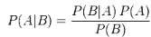

该公式说明了给定 B 为真时 A 为真的概率等于给定 A 为真时 B 为真的概率乘以 A 为真的概率除以 B 为真的概率。这是一个复杂的句子，但如果我们退后一步思考，它就会有意义。

贝叶斯分类器是一个简单而强大的分类器，允许用户考虑整个概率特征空间。要欣赏其简单性，必须记住概率和频率是同一枚硬币的两面。贝叶斯分类器属于增量学习器类，遇到新样本时会更新自身。这使得模型能够在新观察到达时即时更新自身，而不仅仅在批处理模式下运行。

# 还有更多...

我们使用不同的指标评估了一个模型。由于这是一个多类分类器，我们必须使用`MulticlassMetrics()`来检查模型的准确性。

有关更多信息，请参见以下链接：

[`spark.apache.org/docs/latest/api/scala/index.html#org.apache.spark.mllib.evaluation.MulticlassMetrics`](http://spark.apache.org/docs/latest/api/scala/index.html#org.apache.spark.mllib.evaluation.MulticlassMetrics)

# 另请参阅

这是构造函数的文档：

[`spark.apache.org/docs/latest/api/scala/index.html#org.apache.spark.ml.classification.NaiveBayes`](http://spark.apache.org/docs/latest/api/scala/index.html#org.apache.spark.ml.classification.NaiveBayes)

# 在 Spark 2.0 中使用逻辑回归探索 ML 管道和数据框

我们已经尽力以尽可能简单的方式详细呈现代码，以便您可以开始，而无需使用 Scala 的额外语法糖。

# 准备工作

在这个教程中，我们将 ML 管道和逻辑回归结合起来，以演示如何将各种步骤组合成单个管道，该管道在数据框上操作，使其在转换和传输过程中。我们跳过了一些步骤，比如数据拆分和模型评估，并将它们保留到后面的章节中，以使程序更短，但提供了管道、数据框、估计器和转换器的全面处理。

这个教程探讨了管道和数据框在管道中传输并进行操作的细节。

# 如何做...

1.  在 IntelliJ 或您选择的 IDE 中启动一个新项目。确保包含必要的 JAR 文件。

1.  设置程序所在的包位置：

```scala
package spark.ml.cookbook.chapter6
```

1.  导入`LogisticRegression`包，以构建和训练模型所需。在 Spark MLlib 中有其他形式的`LogisticRegression`，但现在我们只集中在基本的逻辑回归方法上：

```scala
import org.apache.spark.ml.classification.LogisticRegression
```

1.  导入 SparkSession，以便我们可以通过 SparkSession 获得对集群、Spark SQL 以及 DataFrame 和 Dataset 抽象的访问：

```scala
org.apache.spark.sql.SparkSession
```

1.  从`ml.linlang`导入 Vector 包。这将允许我们从 Spark 生态系统中导入和使用向量，包括密集和稀疏向量：

```scala
import org.apache.spark.ml.linalg.Vector
```

1.  从`log4j`导入必要的包，这样我们就可以将输出级别设置为 ERROR，并使程序的输出更简洁：

```scala
import org.apache.log4j.Logger
 import org.apache.log4j.Level
```

1.  使用导入的 SparkSession 设置各种参数，以成功初始化并获得对 Spark 集群的控制。在 Spark 2.0 中，实例化和访问 Spark 的方式已经发生了变化。有关更多详细信息，请参阅本教程中的*There's more...*部分。

1.  设置参数如下：

```scala
val spark = SparkSession
 .builder
 .master("local[*]")
 .appName("myfirstlogistic")
 .config("spark.sql.warehouse.dir", ".")
 .getOrCreate()
```

1.  设置您需要的 Spark 集群类型，并定义获取对 Spark 的访问所需的其他参数。

1.  在这里，将其设置为本地集群，并让它抓取尽可能多的线程/核心。您可以使用数字而不是`*`来告诉 Spark 确切有多少核心/线程

```scala
master("local[*]")
```

1.  您可以选择指定要分配的确切核心数，而不是使用`*`：

```scala
master("local[2]")
```

这将分配两个核心。这在资源有限的较小笔记本电脑上可能会很方便。

1.  设置应用程序名称，以便在集群上运行多个应用程序时易于跟踪：

```scala
appName("myfirstlogistic")
```

1.  相对于 Spark 主目录配置工作目录：

```scala
config("spark.sql.warehouse.dir", ".")
```

1.  现在我们继续构建所需的数据结构，以容纳下载的学生入学数据的前 20 行（请参阅前一个示例）：

```scala
val trainingdata=Seq(
 (0.0, Vectors.dense(380.0, 3.61, 3.0)),
 (1.0, Vectors.dense(660.0, 3.67, 3.0)),
 (1.0, Vectors.dense(800.0, 1.3, 1.0)),
 (1.0, Vectors.dense(640.0, 3.19, 4.0)),
 (0.0, Vectors.dense(520.0, 2.93, 4.0)),
 (1.0, Vectors.dense(760.0, 3.00, 2.0)),
 (1.0, Vectors.dense(560.0, 2.98, 1.0)),
 (0.0, Vectors.dense(400.0, 3.08, 2.0)),
 (1.0, Vectors.dense(540.0, 3.39, 3.0)),
 (0.0, Vectors.dense(700.0, 3.92, 2.0)),
 (0.0, Vectors.dense(800.0, 4.0, 4.0)),
 (0.0, Vectors.dense(440.0, 3.22, 1.0)),
 (1.0, Vectors.dense(760.0, 4.0, 1.0)),
 (0.0, Vectors.dense(700.0, 3.08, 2.0)),
 (1.0, Vectors.dense(700.0, 4.0, 1.0)),
 (0.0, Vectors.dense(480.0, 3.44, 3.0)),
 (0.0, Vectors.dense(780.0, 3.87, 4.0)),
 (0.0, Vectors.dense(360.0, 2.56, 3.0)),
 (0.0, Vectors.dense(800.0, 3.75, 2.0)),
 (1.0, Vectors.dense(540.0, 3.81, 1.0))
 )
```

1.  理解给定行的最佳方法是将其视为两部分：

+   标签 - 0.0，表示学生未被录取。

+   特征向量 - `Vectors.dense(380.0, 3.61, 3.0)`，显示了学生的 GRE、GPA 和 RANK。我们将在接下来的章节中介绍密集向量的细节。

1.  SEQ 是具有特殊属性的 Scala 集合。序列可以被视为具有定义顺序的可迭代数据结构。有关 SEQ 的更多信息，请参阅以下 URL：

[`www.scala-lang.org/api/current/index.html#scala.collection.Seq`](http://www.scala-lang.org/api/current/index.html#scala.collection.Seq)

1.  下一步将 SEQ 结构转换为 DataFrame。我们强烈建议您在任何新编程中使用 DataFrame 和 Dataset，而不是低级别的 RDD，以便与新的 Spark 编程范式保持一致：

```scala
val trainingDF = spark.createDataFrame(trainingdata).toDF("label", "features")
```

`label`和`feature`将成为 DataFrame 中的列标题。

1.  Estimator 是一个接受 DataFrame 作为其数据的 API 抽象，并通过调用`Fit`函数生成实际模型。在这里，我们从 Spark MLlib 中的`LogisticRegression`类创建一个 Estimator，然后将最大迭代次数设置为 80；默认值为 100。我们将正则化参数设置为 0.01，并告诉模型我们也想拟合一个截距：

```scala
val lr_Estimator = new LogisticRegression().setMaxIter(80).setRegParam(0.01).setFitIntercept(true)
```

1.  为了更好地了解程序的功能，请查看以下输出并检查参数：

```scala
println("LogisticRegression parameters:\n" + lr_Estimator.explainParams() + "\n")
```

输出如下：

```scala
Admission_lr_Model parameters:
{
logreg_34d0e7f2a3f9-elasticNetParam: 0.0,
logreg_34d0e7f2a3f9-featuresCol: features,
logreg_34d0e7f2a3f9-fitIntercept: true,
logreg_34d0e7f2a3f9-labelCol: label,
logreg_34d0e7f2a3f9-maxIter: 80,
logreg_34d0e7f2a3f9-predictionCol: prediction,
logreg_34d0e7f2a3f9-probabilityCol: probability,
logreg_34d0e7f2a3f9-rawPredictionCol: rawPrediction,
logreg_34d0e7f2a3f9-regParam: 0.01,
logreg_34d0e7f2a3f9-standardization: true,
logreg_34d0e7f2a3f9-threshold: 0.5,
logreg_34d0e7f2a3f9-tol: 1.0E-6
}
```

1.  以下是如何解释和理解前一步中列出的`Admission_lr_Model`参数：

+   `elasticNetParam`: ElasticNet 混合参数，范围为[0, 1]。对于 alpha = 0，惩罚是 L2 惩罚。对于 alpha = 1，它是 L1 惩罚（默认值：0.0）。

+   `featuresCol`: 特征列名称（默认值：features）。

+   `fitIntercept`: 是否拟合截距项（默认值：true，当前值：true）。

+   `labelCol`: 标签列名称（默认值：label）。

+   `maxIter`: 最大迭代次数（>= 0）（默认值：100，当前值：80）。

+   `predictionCol`: 预测列名称（默认值：prediction）。

+   `probabilityCol`: 预测类条件概率的列名。请注意，并非所有模型都输出经过良好校准的概率估计！这些概率应被视为置信度，而不是精确概率（默认值：probability）。

+   `rawPredictionCol`: 原始预测，也称为置信度，列名（默认值：rawPrediction）。

+   `regParam`: 正则化参数（>= 0）（默认值：0.0，当前值：0.01）。

+   `standardization`: 在拟合模型之前是否对训练特征进行标准化（默认值：true）。

+   `threshold`: 二元分类预测中的阈值，范围为[0, 1]（默认值：0.5）。

+   `thresholds`: 多类分类中的阈值，用于调整预测每个类的概率。数组的长度必须等于类的数量，其值>= 0。预测具有最大值 p/t 的类，其中 p 是该类的原始概率，t 是类的阈值（未定义）。

+   `tol`: 迭代算法的收敛容限（默认值：1.0E-6）。

1.  现在调用 fit 准备好的 DataFrame 并生成我们的逻辑回归模型：

```scala
val Admission_lr_Model=lr_Estimator.fit(trainingDF)
```

1.  现在探索模型摘要，以了解拟合后我们得到了什么。我们需要了解组件，以便知道要提取什么内容进行下一步操作：

```scala
println(Admission_lr_Model.summary.predictions)
```

以下是输出：

```scala
Admission_lr_Model Summary:
[label: double, features: vector ... 3 more fields]
```

1.  现在从我们的训练 DataFrame 构建实际和最终模型。取我们创建的 Estimator，并让它通过执行 transform 函数来运行模型。现在我们将有一个新的 DataFrame，其中所有部分都被填充（例如，预测）。打印我们的 DataFrame 的模式，以了解新填充的 DataFrame 的情况：

```scala
// Build the model and predict
 val predict=Admission_lr_Model.transform(trainingDF)
```

这是实际的转换步骤。

1.  打印模式以了解新填充的 DataFrame：

```scala
// print a schema as a guideline
predict.printSchema()
```

输出如下：

```scala
root
|-- label: double (nullable = false)
|-- features: vector (nullable = true)
|-- rawPrediction: vector (nullable = true)
|-- probability: vector (nullable = true)
|-- prediction: double (nullable = true)
```

前两列是我们的标签和特征向量，就像我们在 API 调用中设置的那样，当转换为 DataFrame 时。`rawPredictions`列被称为置信度。概率列将包含我们的概率对。最后一列，预测，将是我们模型预测的结果。这向我们展示了拟合模型的结构以及每个参数可用的信息。

1.  我们现在继续提取回归模型的参数。为了使代码清晰简单，我们将每个参数的属性分别提取到一个集合中：

```scala
// Extract pieces that you need looking at schema and parameter
// explanation output earlier in the program
// Code made verbose for clarity
val label1=predict.select("label").collect()
val features1=predict.select("features").collect()
val probability=predict.select("probability").collect()
val prediction=predict.select("prediction").collect()
val rawPrediction=predict.select("rawPrediction").collect()
```

1.  仅供信息目的，我们打印原始训练集的数量：

```scala
println("Training Set Size=", label1.size )
```

输出如下：

```scala
(Training Set Size=,20)
```

1.  我们现在继续提取每一行的模型预测（结果、置信度和概率）：

```scala
println("No. Original Feature Vector Predicted Outcome confidence probability")
 println("--- --------------------------- ---------------------- 
 ------------------------- --------------------")
 for( i <- 0 to label1.size-1) {
 print(i, " ", label1(i), features1(i), " ", prediction(i), " ", rawPrediction(i), " ", probability(i))
 println()
 }
```

输出如下：

```scala
No. Original Feature Vector Predicted Outcome confidence probability
--- --------------------------- ---------------------- ------------------------- --------------------
(0, ,[0.0],[[380.0,3.61,3.0]], ,[0.0], ,[[1.8601472910617978,-1.8601472910617978]], ,[[0.8653141150964327,0.13468588490356728]])
(1, ,[1.0],[[660.0,3.67,3.0]], ,[0.0], ,[[0.6331801846053525,-0.6331801846053525]], ,[[0.6532102092668394,0.34678979073316063]])
(2, ,[1.0],[[800.0,1.3,1.0]], ,[1.0], ,[[-2.6503754234982932,2.6503754234982932]], ,[[0.06596587423646814,0.9340341257635318]])
(3, ,[1.0],[[640.0,3.19,4.0]], ,[0.0], ,[[1.1347022244505625,-1.1347022244505625]], ,[[0.7567056336714486,0.2432943663285514]])
(4, ,[0.0],[[520.0,2.93,4.0]], ,[0.0], ,[[1.5317564062962097,-1.5317564062962097]], ,[[0.8222631520883197,0.17773684791168035]])
(5, ,[1.0],[[760.0,3.0,2.0]], ,[1.0], ,[[-0.8604923106990942,0.8604923106990942]], ,[[0.2972364981043905,0.7027635018956094]])
(6, ,[1.0],[[560.0,2.98,1.0]], ,[1.0], ,[[-0.6469082170084807,0.6469082170084807]], ,[[0.3436866013868022,0.6563133986131978]])
(7, ,[0.0],[[400.0,3.08,2.0]], ,[0.0], ,[[0.803419600659086,-0.803419600659086]], ,[[0.6907054912633392,0.30929450873666076]])
(8, ,[1.0],[[540.0,3.39,3.0]], ,[0.0], ,[[1.0192401951528316,-1.0192401951528316]], ,[[0.7348245722723596,0.26517542772764036]])
(9, ,[0.0],[[700.0,3.92,2.0]], ,[1.0], ,[[-0.08477122662243242,0.08477122662243242]], ,[[0.4788198754740347,0.5211801245259653]])
(10, ,[0.0],[[800.0,4.0,4.0]], ,[0.0], ,[[0.8599949503972665,-0.8599949503972665]], ,[[0.7026595993369233,0.29734040066307665]])
(11, ,[0.0],[[440.0,3.22,1.0]], ,[0.0], ,[[0.025000247291374955,-0.025000247291374955]], ,[[0.5062497363126953,0.49375026368730474]])
(12, ,[1.0],[[760.0,4.0,1.0]], ,[1.0], ,[[-0.9861694953382877,0.9861694953382877]], ,[[0.27166933762974904,0.728330662370251]])
(13, ,[0.0],[[700.0,3.08,2.0]], ,[1.0], ,[[-0.5465264211455029,0.5465264211455029]], ,[[0.3666706806887138,0.6333293193112862]])
```

1.  通过查看上一步的输出，我们可以检查模型的表现以及它的预测与实际情况的对比。在接下来的章节中，我们将使用模型来预测结果。

以下是一些来自几行的示例：

1.  +   **第 10 行**：模型预测正确

+   **第 13 行**：模型预测错误

1.  在最后一步，我们停止集群并发出资源释放的信号：

```scala
spark.stop()
```

# 它是如何工作的...

我们首先定义了一个`Seq`数据结构来容纳一系列向量，每个向量都是一个标签和一个特征向量。然后我们将数据结构转换为 DataFrame，并通过`Estimator.fit()`运行它以产生适合数据的模型。我们检查了模型的参数和 DataFrame 模式，以了解产生的模型。然后我们继续组合`.select()`和`.predict()`来分解 DataFrame，然后循环显示预测和结果。

虽然我们不必使用流水线（Spark 中从 scikit-learn 借鉴的工作流概念，[`scikit-learn.org/stable/index.html`](http://scikit-learn.org/stable/index.html)）来运行回归，但我们决定向您展示 Spark ML 流水线和逻辑回归算法的强大功能。

根据我们的经验，所有生产 ML 代码都使用一种流水线形式来组合多个步骤（例如，整理数据、聚类和回归）。接下来的章节将向您展示如何在开发过程中使用这些算法而不使用流水线来减少编码。

# 还有更多...

由于我们刚刚看到如何在 Scala 和 Spark 中编写流水线概念的代码，让我们重新审视并以高层次定义一些概念，以便对其有一个坚实的概念理解。

# 管道

Spark 通过标准化 API 使机器学习流水线（MLlib）中的步骤组合变得容易，这些 API 可以组合成工作流程（即在 Spark 中称为流水线）。虽然可以在不使用这些流水线的情况下调用回归，但一个工作系统（即端到端）的现实需要我们采取多步流水线方法。

流水线的概念来自另一个流行的库**scikit-learn**：

+   **转换器**：转换器是一种可以将一个 DataFrame 转换为另一个 DataFrame 的方法。

+   **估计器**：估计器在 DataFrame 上操作，以产生一个转换器。

# 向量

向量的基类支持密集向量和稀疏向量。根本区别在于对于稀疏数据结构的表示效率。这里选择了密集向量，因为训练数据每行都是有意义的，几乎没有稀疏性。在处理稀疏向量、矩阵等情况时，稀疏元组将同时包含索引和相应的值。

# 另请参阅

虽然使用 Spark 文档和 Scala 参考是可选的，也许对于本章来说还为时过早，但它们被包含在内是为了完整性：

+   Scala 中的 SEQ 文档可在[`www.scala-lang.org/api/current/index.html#scala.collection.Seq`](http://www.scala-lang.org/api/current/index.html#scala.collection.Seq)找到

+   Spark DataFrame 文档可在[`spark.apache.org/docs/latest/sql-programming-guide.html`](http://spark.apache.org/docs/latest/sql-programming-guide.html)找到

+   Spark 向量文档可在[`spark.apache.org/docs/latest/api/scala/index.html#org.apache.spark.ml.linalg.Vectors$`](http://spark.apache.org/docs/latest/api/scala/index.html#org.apache.spark.ml.linalg.Vectors%24)找到

+   Spark 管道文档可在以下网址找到：

+   [`spark.apache.org/docs/latest/api/scala/index.html#org.apache.spark.ml.Pipeline`](http://spark.apache.org/docs/latest/api/scala/index.html#org.apache.spark.ml.Pipeline)

+   [`spark.apache.org/docs/latest/api/scala/index.html#org.apache.spark.ml.PipelineModel`](http://spark.apache.org/docs/latest/api/scala/index.html#org.apache.spark.ml.PipelineModel)

+   [`spark.apache.org/docs/latest/api/scala/index.html#org.apache.spark.ml.PipelineStage`](http://spark.apache.org/docs/latest/api/scala/index.html#org.apache.spark.ml.PipelineStage)

+   你也应该熟悉 Spark 中的基本线性代数包，你可以参考[`spark.apache.org/docs/latest/mllib-statistics.html`](http://spark.apache.org/docs/latest/mllib-statistics.html)

+   熟悉基本数据类型，特别是向量，是非常推荐的，你可以参考[`spark.apache.org/docs/latest/mllib-data-types.html`](http://spark.apache.org/docs/latest/mllib-data-types.html)链接
