# 第七章：使用 Spark 扩展的推荐引擎

在本章中，我们将涵盖：

+   在 Spark 2.0 中设置可扩展的推荐引擎所需的数据

+   在 Spark 2.0 中探索推荐系统的电影数据细节

+   在 Spark 2.0 中探索推荐系统的评分数据细节

+   在 Spark 2.0 中构建可扩展的协同过滤推荐引擎

# 引言

在之前的章节中，我们使用简短的配方和极其简化的代码来演示 Spark 机器库的基本构建块和概念。在本章中，我们提出了一个更为发展的应用程序，该应用程序使用 Spark 的 API 和设施来解决特定的机器学习库领域。本章的配方数量较少；然而，我们进入了更多的机器学习应用设置。

在本章中，我们探讨了推荐系统及其实现，使用了一种称为交替最小二乘法（ALS）的矩阵分解技术，该技术依赖于称为潜在因子模型的潜在因子。简而言之，当我们尝试将用户-物品评分的大矩阵因子分解为两个较低排名、较瘦的矩阵时，我们经常面临一个非线性或非凸优化问题，这是非常难以解决的。我们很擅长通过固定一个腿并部分解决另一个腿，然后来回进行（因此交替）来解决凸优化问题；我们可以使用已知的优化技术并行地更好地解决这种因子分解（因此发现一组潜在因子）。

我们使用一个流行的数据集（电影镜头数据集）来实现推荐引擎，但与其他章节不同的是，我们使用两个配方来探索数据，并展示如何将图形元素（例如 JFreeChart 流行库）引入到您的 Spark 机器学习工具包中。

以下图显示了本章中概念和配方的流程，以演示 ALS 推荐应用程序：

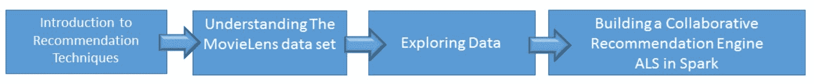

推荐引擎已经存在很长时间，并且在 20 世纪 90 年代的早期电子商务系统中使用，使用的技术范围从硬编码产品关联到基于内容的推荐，由个人资料驱动。现代系统使用协同过滤（CF）来解决早期系统的缺点，并解决现代商业系统（例如亚马逊、Netflix、eBay、新闻等）中必须竞争的规模和延迟（例如，最大 100 毫秒及以下）。

现代系统使用基于历史互动和记录的协同过滤（CF）（页面浏览、购买、评分等）。这些系统主要解决两个主要问题，即可扩展性和稀疏性（也就是说，我们并没有所有电影或歌曲的所有评分）。大多数系统使用交替最小二乘法与加权λ正则化的变体，可以在大多数主要平台上并行化（例如 Spark）。话虽如此，为了商业目的实施的实际系统使用许多增强功能来处理偏见（也就是说，并非所有电影和用户都是平等的）和时间问题（也就是说，用户的选择会改变，物品的库存也会改变），这些问题存在于今天的生态系统中。在智能和领先的电子商务系统上工作过后，构建一个有竞争力的推荐系统并不是一种纯粹的方法，而是一种实用的方法，它使用多种技术，最少使用协同过滤、基于内容的过滤和相似性这三种技术，以亲和矩阵/热图作为上下文。

鼓励读者查阅有关推荐系统中冷启动问题的白皮书和资料。

为了设定背景，以下图表提供了可用于构建推荐系统的方法的高级分类。我们简要介绍了每种系统的优缺点，但集中讨论了在 Spark 中可用的矩阵分解（潜在因子模型）。虽然**单值分解**（**SVD**）和**交替最小二乘法**（**ALS**）都可用，但由于 SVD 在处理缺失数据等方面的缺点，我们集中讨论了 MovieLens 数据中的 ALS 实现。我们将在第十一章中详细探讨 SVD，*大数据中的高维度问题*。

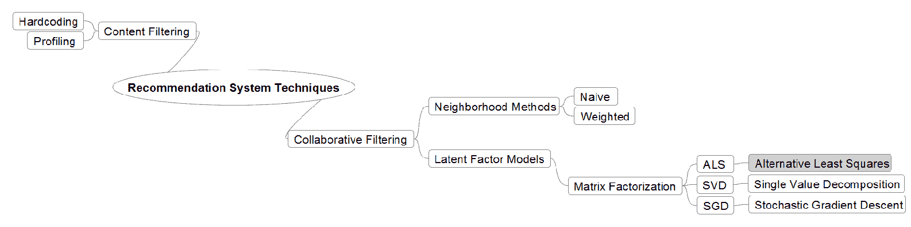

下一节将解释所使用的推荐引擎技术。

# 内容过滤

内容过滤是推荐引擎的最初技术之一。它依赖于用户档案来进行推荐。这种方法主要依赖于用户的预先存在的档案（类型、人口统计学、收入、地理位置、邮政编码）和库存的特征（产品、电影或歌曲的特征）来推断属性，然后进行过滤和采取行动。主要问题是预先存在的知识通常是不完整的并且获取成本高昂。这种技术已有十多年历史，但仍在使用中。

# 协同过滤

协同过滤是现代推荐系统的主要工具，它依赖于生态系统中用户的互动而不是档案来进行推荐。

这种技术依赖于过去的用户行为和产品评分，并不假设任何预先存在的知识。简而言之，用户对库存商品进行评分，假设是客户口味随时间相对稳定，这可以被利用来提供推荐。话虽如此，一个智能系统将会根据任何可用的上下文（例如，用户是从中国登录的女性）来增强和重新排序推荐。

这类技术的主要问题是冷启动，但其无领域限制、更高的准确性和易扩展性的优势使其在大数据时代成为赢家。

# 邻域方法

这种技术主要作为**加权本地邻域**实现。在其核心，它是一种相似性技术，且在对商品和用户的假设上依赖较多。虽然这种技术易于理解和实现，但该算法在可扩展性和准确性方面存在缺陷。

# 潜在因子模型技术

这种技术试图通过推断从评分中推断出的次要潜在因子集来解释用户对库存商品（例如，亚马逊上的产品）的评分。其优势在于不需要提前了解这些因子（类似于 PCA 技术），而是仅仅从评分中推断出来。我们使用矩阵分解技术来推导潜在因子，这种技术因其极端的可扩展性、预测的准确性和灵活性（允许偏差和用户和库存的时间特性）而备受欢迎。

+   **奇异值分解（SVD）**：SVD 从早期就在 Spark 中可用，但由于其在处理现实生活中数据稀疏性（例如，用户通常不会对所有东西进行评分）、过拟合和顺序（我们真的需要生成底部的 1,000 个推荐吗？）等问题，我们建议不将其作为核心技术使用。

+   **随机梯度下降**（**SGD**）：SGD 易于实现，并且由于其一次查看一个电影和一个用户/商品向量的方法（选择一个电影并为该用户更新配置文件），因此具有更快的运行时间。我们可以根据需要在 Spark 中使用矩阵设施和 SGD 来实现这一点。

+   **交替最小二乘法**（**ALS**）：在开始这个旅程之前，请参阅 ALS。在 Spark 中，ALS 可以从一开始就利用并行化。Spark 在内部实现了完整的矩阵分解，与常见的观点相反，即 Spark 使用了一半的分解。我们鼓励读者参考源代码，以验证这一点。Spark 提供了用于**显式**（可用评分）和**隐式**（需要间接推断的）的 API，例如，播放曲目的时间长度而不是评分。我们通过在示例中引入数学和直觉来讨论偏差和时间问题，以阐明我们的观点。

# 在 Spark 2.0 中设置可扩展推荐引擎所需的数据

在这个示例中，我们将检查下载 MovieLens 公共数据集，并首次探索数据。我们将使用 MovieLens 数据集中基于客户评分的显式数据。MovieLens 数据集包含来自 6,000 个用户对 4,000 部电影的 1,000,000 个评分。

您将需要以下一种命令行工具来检索指定的数据：`curl`（Mac 推荐）或`wget`（Windows 或 Linux 推荐）。

# 如何做...

1.  您可以使用以下任一命令开始下载数据集：

```scala
wget http://files.grouplens.org/datasets/movielens/ml-1m.zip
```

您也可以使用以下命令：

```scala
curl http://files.grouplens.org/datasets/movielens/ml-1m.zip -o ml-1m.zip
```

1.  现在您需要解压缩 ZIP：

```scala
unzip ml-1m.zip
creating: ml-1m/
inflating: ml-1m/movies.dat
inflating: ml-1m/ratings.dat
inflating: ml-1m/README
inflating: ml-1m/users.dat
```

该命令将创建一个名为`ml-1m`的目录，并在其中解压缩数据文件。

1.  切换到`m1-1m`目录：

```scala
cd m1-1m
```

1.  现在我们开始通过验证`movies.dat`中的数据格式来进行数据探索的第一步：

```scala
head -5 movies.dat
1::Toy Story (1995)::Animation|Children's|Comedy
2::Jumanji (1995)::Adventure|Children's|Fantasy
3::Grumpier Old Men (1995)::Comedy|Romance
4::Waiting to Exhale (1995)::Comedy|Drama
5::Father of the Bride Part II (1995)::Comedy
```

1.  现在我们来看一下评分数据，了解它的格式：

```scala
head -5 ratings.dat
1::1193::5::978300760
1::661::3::978302109
1::914::3::978301968
1::3408::4::978300275
1::2355::5::978824291
```

# 工作原理...

MovieLens 数据集是原始 Netflix KDD 杯数据集的一个很好的替代品。该数据集包含多个集合，从小（100K 集）到大（1M 和 20M 集）。对于那些有兴趣调整源代码以添加自己的增强（例如，更改正则化技术）的用户来说，数据集的范围使得研究从 100K 到 20M 的数据规模效果和 Spark 利用率与执行者性能曲线变得容易。

下载的 URL 是[`grouplens.org/datasets/movielens/`](http://grouplens.org/datasets/movielens/)。

# 还有更多...

仔细查看我们从哪里下载数据，因为在[`files.grouplens.org/datasets/`](http://files.grouplens.org/datasets/)上还有更多数据集可供使用。

以下图表描述了数据的大小和范围。在本章中，我们使用小数据集，因此它可以轻松运行在资源有限的小型笔记本电脑上。

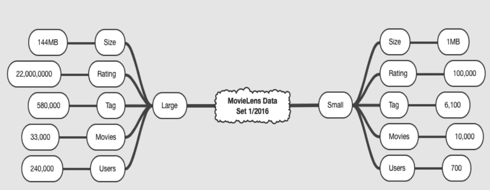

来源：MovieLens

# 另请参阅

请阅读解压数据的目录中包含的 README 文件。README 文件包含有关数据文件格式和数据描述的信息。

还有一个 MovieLens 基因标签集，可用于参考。

+   计算标签电影 1100 万

+   从 1100 个标签中获取相关性分数

+   应用于 10000 部电影

对于那些有兴趣探索原始 Netflix 数据集的用户，请参阅[`academictorrents.com/details/9b13183dc4d60676b773c9e2cd6de5e5542cee9a`](http://academictorrents.com/details/9b13183dc4d60676b773c9e2cd6de5e5542cee9a) URL。

# 在 Spark 2.0 中探索用于推荐系统的电影数据细节

在这个示例中，我们将开始通过将数据解析为 Scala `case`类并生成一个简单的度量来探索电影数据文件。关键在于获得对我们的数据的理解，因此在后期阶段，如果出现模糊的结果，我们将有一些见解，以便对我们结果的正确性做出知情的结论。

这是探索电影数据集的两个示例中的第一个。数据探索是统计分析和机器学习中的重要第一步。

快速了解数据的最佳方法之一是生成其数据可视化，我们将使用 JFreeChart 来实现这一点。确保您对数据感到舒适，并首先了解每个文件中的内容以及它试图传达的故事非常重要。

在我们做任何其他事情之前，我们必须始终探索、理解和可视化数据。大多数机器学习和其他系统的性能和缺失都可以追溯到对数据布局及其随时间变化的理解不足。如果我们看一下这个配方中第 14 步中给出的图表，就会立即意识到电影随年份分布不均匀，而是呈高峰态偏斜。虽然我们不打算在本书中探索此属性以进行优化和抽样，但这一点对于电影数据的性质非常重要。

# 如何做...

1.  在 IntelliJ 或您选择的 IDE 中启动一个新项目。确保包含必要的 JAR 文件。

1.  JFreeChart JAR 可以从[`sourceforge.net/projects/jfreechart/files/`](https://sourceforge.net/projects/jfreechart/files/)网站下载。

1.  请确保 JFreeChart 库及其依赖项（JCommon）在本章的类路径上。

1.  我们为 Scala 程序定义包信息：

```scala
package spark.ml.cookbook.chapter7
```

1.  导入必要的包：

```scala
import java.text.DecimalFormat
 import org.apache.log4j.{Level, Logger}
 import org.apache.spark.sql.SparkSession
 import org.jfree.chart.{ChartFactory, ChartFrame, JFreeChart}
 import org.jfree.chart.axis.NumberAxis
 import org.jfree.chart.plot.PlotOrientation
 import org.jfree.data.xy.{XYSeries, XYSeriesCollection}
```

1.  现在我们定义一个 Scala`case class`来建模电影数据：

```scala
case class MovieData(movieId: Int, title: String, year: Int, genre: Seq[String])
```

1.  让我们定义一个函数，在稍后将调用它来在窗口中显示 JFreeChart。此软件包中有许多图表和绘图选项可供探索：

```scala
def show(chart: JFreeChart) {
 val frame = new ChartFrame("plot", chart)
 frame.pack()
 frame.setVisible(true)
 }
```

1.  在这一步中，我们定义了一个函数，用于将`movie.dat`文件中的单行数据解析为我们的电影`case class`：

```scala
def parseMovie(str: String): MovieData = {
 val columns = str.split("::")
 *assert*(columns.size == 3)

 val titleYearStriped = """\(|\)""".r.replaceAllIn(columns(1), " ")
 val titleYearData = titleYearStriped.split(" ")

 *MovieData*(columns(0).toInt,
 titleYearData.take(titleYearData.size - 1).mkString(" "),
 titleYearData.last.toInt,
 columns(2).split("|"))
 }
```

1.  我们准备开始构建我们的`main`函数，所以让我们从定义我们的`movie.dat`文件的位置开始：

```scala
 val movieFile = "../data/sparkml2/chapter7/movies.dat"
```

1.  创建 Spark 的会话对象并设置配置：

```scala
val spark = SparkSession
 .*builder* .master("local[*]")
 .appName("MovieData App")
 .config("spark.sql.warehouse.dir", ".")
 .config("spark.executor.memory", "2g")
 .getOrCreate()
```

1.  日志消息的交错导致输出难以阅读；因此，将日志级别设置为`ERROR`：

```scala
Logger.getLogger("org").setLevel(Level.ERROR)
```

1.  创建一个包含数据文件中所有电影的数据集：

```scala
import spark.implicits._
val movies = spark.read.textFile(movieFile).map(parseMovie)  
```

1.  使用 Spark SQL 将所有电影按年份分组：

```scala
movies.createOrReplaceTempView("movies")
val moviesByYear = spark.sql("select year, count(year) as count from movies group by year order by year")
```

1.  现在我们显示一个按发行年份分组的直方图图表：

```scala
val histogramDataset = new XYSeriesCollection()
 val xy = new XYSeries("")
 moviesByYear.collect().foreach({
 row => xy.add(row.getAsInt, row.getAsLong)
 })

 histogramDataset.addSeries(xy)

 val chart = ChartFactory.createHistogram(
 "", "Year", "Movies Per Year", histogramDataset, PlotOrientation.VERTICAL, false, false, false)
 val chartPlot = chart.getXYPlot()

 val xAxis = chartPlot.getDomainAxis().asInstanceOf[NumberAxis]
 xAxis.setNumberFormatOverride(new DecimalFormat("####"))

 show(chart)
```

1.  查看生成的图表，以对电影数据集有一个良好的了解。读者可以探索至少另外两到四种可视化数据的方法。

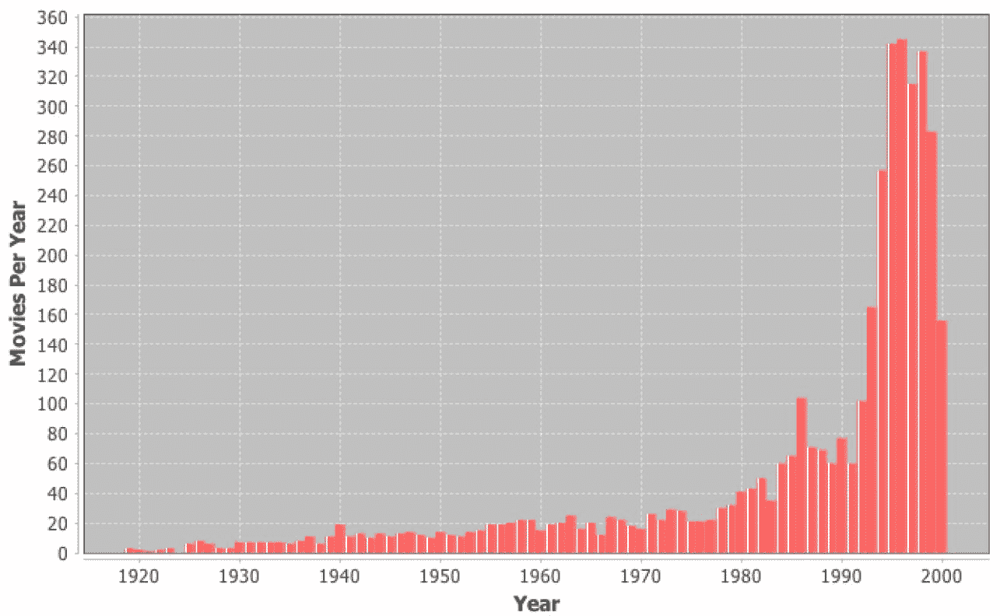

1.  通过停止 Spark 会话来关闭程序：

```scala
spark.stop()  
```

# 它是如何工作的...

当程序开始执行时，我们在驱动程序中初始化了一个 SparkContext，以开始处理数据的任务。这意味着数据必须适合驱动程序的内存（用户站点），这在这种情况下不是服务器要求。必须设计替代的分割和征服方法来处理极端数据集（部分检索和在目的地进行组装）。

我们继续加载和解析数据文件，将其转换为具有电影数据类型的数据集。然后，电影数据集按年份分组，生成了一个以年份为键的电影映射，附有相关电影的桶。

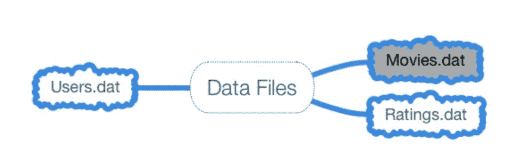

接下来，我们提取了与特定年份关联的电影数量的年份，以生成我们的直方图。然后我们收集了数据，导致整个结果数据集在驱动程序上实现，并将其传递给 JFreeChart 来构建数据可视化。

# 还有更多...

由于其灵活性，您需要注意我们对 Spark SQL 的使用。更多信息可在[`spark.apache.org/docs/latest/sql-programming-guide.html#running-sql-queries-programmatically`](http://spark.apache.org/docs/latest/sql-programming-guide.html#running-sql-queries-programmatically)上找到。

# 另请参阅

有关使用 JFreechart 的更多信息，请参阅 JFreeChart API 文档[`www.jfree.org/jfreechart/api.html`](http://www.jfree.org/jfreechart/api.html)。

您可以在[`www.tutorialspoint.com/jfreechart/`](http://www.tutorialspoint.com/jfreechart/)链接找到关于 JFreeChart 的良好教程。

JFreeChart 本身的链接是[`www.jfree.org/index.html`](http://www.jfree.org/index.html)。

# 探索 Spark 2.0 中推荐系统的评分数据细节

在本示例中，我们从用户/评分的角度探索数据，以了解数据文件的性质和属性。我们将开始通过将数据解析为 Scala case class 并生成可视化来探索评分数据文件。稍后将使用评分数据生成推荐引擎的特征。再次强调，任何数据科学/机器学习练习的第一步应该是数据的可视化和探索。

再次，快速了解数据的最佳方法是生成其数据可视化，我们将使用 JFreeChart 散点图来实现这一点。通过 JFreeChart 绘制的*用户评分*图表显示出与多项分布和异常值相似的特征，以及随着评分增加而增加的稀疏性。

# 如何做...

1.  在 IntelliJ 或您选择的 IDE 中启动一个新项目。确保包含必要的 JAR 文件。

1.  我们为 Scala 程序定义包信息：

```scala
package spark.ml.cookbook.chapter7
```

1.  导入必要的包：

```scala
import java.text.DecimalFormat
 import org.apache.log4j.{Level, Logger}
 import org.apache.spark.sql.SparkSession
 import org.jfree.chart.{ChartFactory, ChartFrame, JFreeChart}
 import org.jfree.chart.axis.NumberAxis
 import org.jfree.chart.plot.PlotOrientation
 import org.jfree.data.xy.{XYSeries, XYSeriesCollection}
```

1.  现在我们定义一个 Scala `case class`来建模评分数据：

```scala
case class Rating(userId: Int, movieId: Int, rating: Float, timestamp: Long)
```

1.  让我们定义一个函数，在窗口中显示一个 JFreeChart：

```scala
def show(chart: JFreeChart) {
 val frame = new ChartFrame("plot", chart)
 frame.pack()
 frame.setVisible(true)
 }
```

1.  在此步骤中，我们定义了一个函数，用于将`ratings.dat`文件中的单行数据解析为评分`case class`：

```scala
def parseRating(str: String): Rating = {
 val columns = str.split("::")
 assert(columns.size == 4)
 Rating(columns(0).toInt, columns(1).toInt, columns(2).toFloat, columns(3).toLong)
 }
```

1.  我们准备开始构建我们的`main`函数，所以让我们从我们的`ratings.dat`文件的位置开始：

```scala
val ratingsFile = "../data/sparkml2/chapter7/ratings.dat"
```

1.  创建 Spark 的配置，SparkSession。在本例中，我们首次展示如何在小型笔记本电脑上设置 Spark 执行器内存（例如 2GB）。如果要使用大型数据集（144MB 集），必须增加此分配：

```scala
val spark = SparkSession
 .*builder* .master("local[*]")
 .appName("MovieRating App")
 .config("spark.sql.warehouse.dir", ".")
 .config("spark.executor.memory", "2g")
 .getOrCreate()
```

1.  日志消息的交错导致输出难以阅读；因此，将日志级别设置为`ERROR`：

```scala
Logger.getLogger("org").setLevel(Level.ERROR)
```

1.  创建一个包含数据文件中所有评分的数据集：

```scala
import spark.implicits._
 val ratings = spark.read.textFile(ratingsFile).map(*parseRating*)
```

1.  现在我们将评分数据集转换为内存表视图，可以在其中执行 Spark SQL 查询：

```scala
ratings.createOrReplaceTempView("ratings")
```

1.  现在，我们生成一个按用户分组的所有用户评分列表，以及它们的总数：

```scala
val resultDF = spark.sql("select ratings.userId, count(*) as count from ratings group by ratings.userId")
resultDF.show(25, false);
```

从控制台输出：

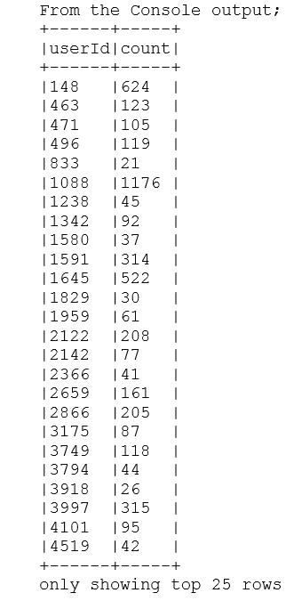

1.  显示一个散点图表，显示每个用户的评分。我们选择散点图来展示从上一个示例中不同的数据观察方式。我们鼓励读者探索标准化技术（例如，去除均值）或波动性变化制度（例如，GARCH）来探索此数据集的自回归条件异方差性质（这超出了本书的范围）。建议读者参考任何高级时间序列书籍，以了解时间变化波动性和如何在使用之前进行纠正。

```scala
val scatterPlotDataset = new XYSeriesCollection()
 val xy = new XYSeries("")

 resultDF.collect().foreach({r => xy.add( r.getAsInteger, r.getAsInteger) })

 scatterPlotDataset.addSeries(xy)

 val chart = ChartFactory.*createScatterPlot*(
 "", "User", "Ratings Per User", scatterPlotDataset, PlotOrientation.*VERTICAL*, false, false, false)
 val chartPlot = chart.getXYPlot()

 val xAxis = chartPlot.getDomainAxis().asInstanceOf[NumberAxis]
 xAxis.setNumberFormatOverride(new DecimalFormat("####"))
```

1.  显示图表：

```scala
*show*(chart)
```

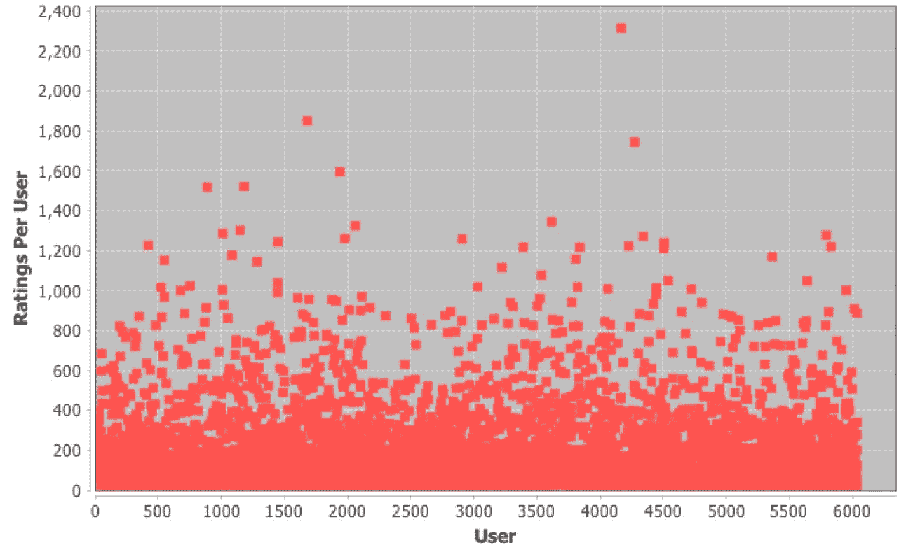

1.  通过停止 Spark 会话来关闭程序：

```scala
spark.stop()
```

# 工作原理...

我们首先加载和解析数据文件，将其转换为具有数据类型评分的数据集，最后将其转换为 DataFrame。然后使用 DataFrame 执行了一个 Spark SQL 查询，按用户对其总数对所有评分进行了分组。

我们在第三章“Spark 的三大数据武士——机器学习完美结合”中探索了数据集/DataFrame，但我们鼓励用户刷新并深入了解数据集/DataFrame API。对 API 及其概念（延迟实例化、分阶段、流水线和缓存）的充分理解对每个 Spark 开发人员至关重要。

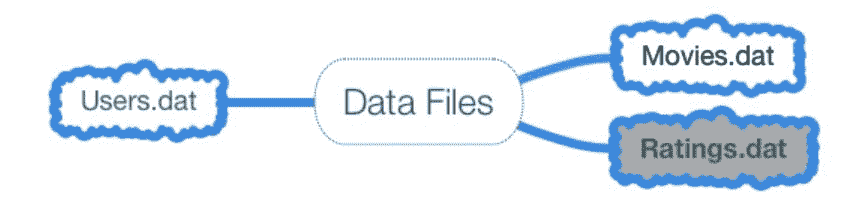

最后，我们将结果集传递给 JFreeChart 散点图组件以显示我们的图表。

# 还有更多...

Spark DataFrame 是一个分布式的数据集合，组织成命名列。所有 DataFrame 操作也会自动并行化和分布在集群上。此外，DataFrame 像 RDD 一样是惰性评估的。

# 另请参阅

可以在[`spark.apache.org/docs/latest/sql-programming-guide.html`](http://spark.apache.org/docs/latest/sql-programming-guide.html)找到有关 DataFrame 的文档。

可以在[`www.tutorialspoint.com/jfreechart/`](http://www.tutorialspoint.com/jfreechart/)找到关于 JFreeChart 的很好的教程。

JFreeChart 可以从[`www.jfree.org/index.html`](http://www.jfree.org/index.html) URL 下载。

# 在 Spark 2.0 中构建可扩展的协同过滤推荐引擎

在这个示例中，我们将演示一个利用协同过滤技术的推荐系统。在核心上，协同过滤分析用户之间的关系以及库存之间的依赖关系（例如，电影、书籍、新闻文章或歌曲），以识别基于一组称为**潜在因素**的次要因素的用户与项目之间的关系（例如，女性/男性，快乐/悲伤，活跃/ pass）。关键在于您不需要提前知道潜在因素。

推荐将通过 ALS 算法生成，这是一种协同过滤技术。在高层次上，协同过滤涉及根据收集到的先前已知偏好以及许多其他用户的偏好来预测用户可能感兴趣的内容。我们将使用 MovieLens 数据集的评分数据，并将其转换为推荐算法的输入特征。

# 如何做...

1.  在 IntelliJ 或您选择的 IDE 中开始一个新项目。确保包含必要的 JAR 文件。

1.  我们为 Scala 程序定义包信息：

```scala
package spark.ml.cookbook.chapter7
```

1.  导入必要的包：

```scala
import org.apache.log4j.{Level, Logger}
 import org.apache.spark.sql.SparkSession
 import org.apache.spark.ml.recommendation.ALS
```

1.  现在我们定义两个 Scala 案例类，来建模电影和评分数据：

```scala
case class Movie(movieId: Int, title: String, year: Int, genre: Seq[String])
 case class FullRating(userId: Int, movieId: Int, rating: Float, timestamp: Long)
```

1.  在这一步中，我们定义了用于将`ratings.dat`文件中的单行数据解析为评分`case class`的函数，以及用于将`movies.dat`文件中的单行数据解析为电影`case class`的函数：

```scala
def parseMovie(str: String): Movie = {
val columns = str.split("::")
*assert*(columns.size == 3)

val titleYearStriped = """\(|\)""".r.replaceAllIn(columns(1), " ")
val titleYearData = titleYearStriped.split(" ")

*Movie*(columns(0).toInt,
     titleYearData.take(titleYearData.size - 1).mkString(" "),
     titleYearData.last.toInt,
     columns(2).split("|"))
 }

def parseFullRating(str: String): FullRating = {
val columns = str.split("::")
*assert*(columns.size == 4)
*FullRating*(columns(0).toInt, columns(1).toInt, columns(2).toFloat, columns(3).toLong)
 }
```

1.  我们准备开始构建我们的`main`函数，所以让我们从`movie.dat`和`ratings.dat`文件的位置开始：

```scala
val movieFile = "../data/sparkml2/chapter7/movies.dat" val ratingsFile = "../data/sparkml2/chapter7/ratings.dat"
```

1.  创建一个 SparkSession 对象及其相关配置：

```scala
val spark = SparkSession
 .builder
.master("local[*]")
 .appName("MovieLens App")
 .config("spark.sql.warehouse.dir", ".")
 .config("spark.executor.memory", "2g")
 .getOrCreate()
```

1.  日志消息的交错导致输出难以阅读；因此，将日志级别设置为`ERROR`：

```scala
Logger.getLogger("org").setLevel(Level.ERROR)
```

1.  创建所有评分的数据集，并将其注册为内存中的临时视图，以便可以使用 SQL 进行查询：

```scala
val ratings = spark.read.textFile(ratingsFile).map(*parseFullRating*)

 val movies = spark.read.textFile(movieFile).map(*parseMovie*).cache()
 movies.createOrReplaceTempView("movies")
```

1.  对视图执行 SQL 查询：

```scala
val rs = spark.sql("select movies.title from movies")
rs.show(25)
```

从控制台输出：

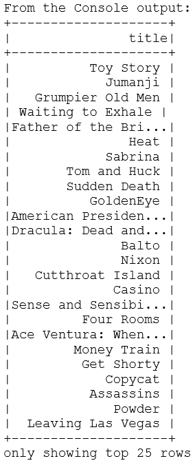

1.  我们将评分数据分类为训练和测试数据集。训练数据将用于训练交替最小二乘推荐机器学习算法，而测试数据将稍后用于评估预测和测试数据之间的准确性：

```scala
val splits = ratings.randomSplit(*Array*(0.8, 0.2), 0L)
val training = splits(0).cache()
val test = splits(1).cache()

val numTraining = training.count()
val numTest = test.count()
*println*(s"Training: $numTraining, test: $numTest.")
```

1.  现在创建一个虚构的用户，用户 ID 为零，生成几个评分的数据集。稍后这个用户将帮助我们更好地理解 ALS 算法计算的预测：

```scala
val testWithOurUser = spark.createDataset(Seq(
  FullRating(0, 260, 0f, 0), // Star Wars: Episode IV - A New Hope
  FullRating(0, 261, 0f, 0), // Little Women
  FullRating(0, 924, 0f, 0), // 2001: A Space Odyssey
  FullRating(0, 1200, 0f, 0), // Aliens
  FullRating(0, 1307, 0f, 0) // When Harry Met Sally...
)).as[FullRating]

val trainWithOurUser = spark.createDataset(Seq(
  FullRating(0, 76, 3f, 0), // Screamers
  FullRating(0, 165, 4f, 0), // Die Hard: With a Vengeance
  FullRating(0, 145, 2f, 0), // Bad Boys
  FullRating(0, 316, 5f, 0), // Stargate
  FullRating(0, 1371, 5f, 0), // Star Trek: The Motion Picture
  FullRating(0, 3578, 4f, 0), // Gladiator
  FullRating(0, 3528, 1f, 0) // Prince of Tides
)).as[FullRating]
```

1.  使用数据集联合方法将`testWithOurUser`附加到原始训练集。还要在原始训练集和测试集上使用`unpersist`方法释放资源：

```scala
val testSet = test.union(testWithOurUser)
 test.unpersist()
val trainSet = training.union(trainWithOurUser)
 training.unpersist()
```

1.  创建 ALS 对象并设置参数。

使用训练数据集获取模型。

```scala
val als = new ALS()
 .setUserCol("userId")
 .setItemCol("movieId")
 .setRank(10)
 .setMaxIter(10)
 .setRegParam(0.1)
 .setNumBlocks(10)
val model = als.fit(trainSet.toDF)
```

1.  让模型在测试数据集上运行：

```scala
val predictions = model.transform(testSet.toDF())
 predictions.cache()
 predictions.show(10, false)
```

从控制台输出：

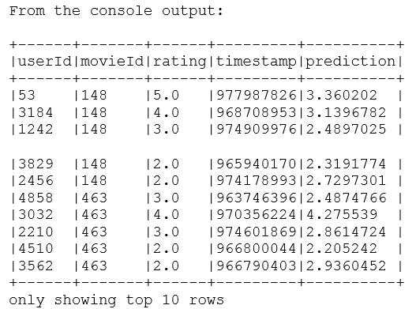

1.  构建一个内存表，其中包含 Spark SQL 查询的所有预测：

```scala
val allPredictions = predictions.join(movies, movies("movieId") === predictions("movieId"), "left")

```

1.  从表中检索评分和预测，并在控制台中显示前 20 行：

```scala
allPredictions.select("userId", "rating", "prediction", "title")show(false)
```

从控制台输出：

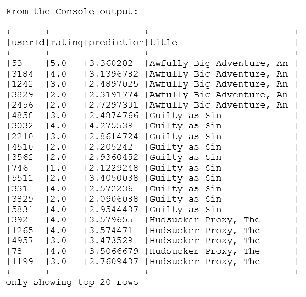

1.  现在获取特定用户的电影预测：

```scala
allPredictions.select("userId", "rating", "prediction", "title").where("userId=0").show(false)
```

从控制台输出：

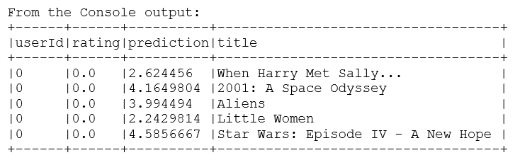

1.  通过停止 Spark 会话来关闭程序：

```scala
spark.stop()
```

# 它是如何工作的...

由于程序的复杂性，我们提供了一个概念性的解释，然后继续解释程序的细节。

以下图示了 ALS 的概念视图以及它是如何将用户/电影/评分矩阵进行因式分解的，这是一个高阶矩阵，分解为一个较低阶的高瘦矩阵和一个潜在因素的向量：f(用户)和 f(电影)。

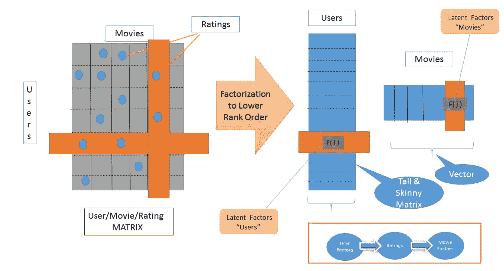

另一种思考方式是，这些因素可以用来将电影放置在一个*n*维空间中，以便与给定用户的推荐匹配。将机器学习视为在一个维度变量空间中进行搜索查询总是令人满意的。要记住的是，潜在因素（学习的几何空间）并非预先定义，可以低至 10 到 100 或 1000，具体取决于正在搜索或进行因式分解的内容。因此，我们的推荐可以被视为在 n 维空间中放置概率质量。以下图提供了一个可能的两因子模型（二维）的极其简化的视图，以证明这一点：

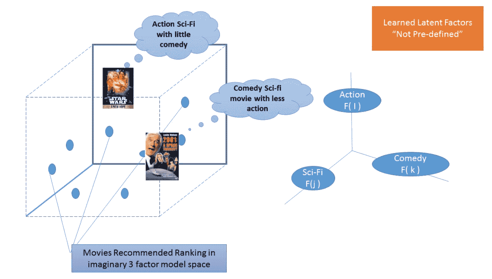

虽然 ALS 的实现在不同系统中可能有所不同，但在其核心是一个带有加权正则化的迭代全因子分解方法（在 Spark 中）。Spark 的文档和教程提供了对实际数学和算法性质的见解。它描述了算法如下：

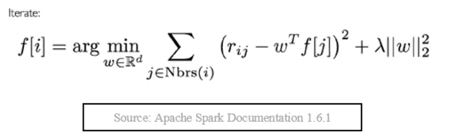

理解这个公式/算法的最佳方法是将其视为一个迭代装置，它通过在输入之间交替（即固定一个输入，然后近似/优化另一个输入，然后来回进行），试图发现潜在因素，同时试图最小化与加权 lambda 的正则化惩罚相关的最小二乘误差（MSE）。更详细的解释将在下一节中提供。

程序流程如下：

+   示例从 MovieLens 数据集中加载了评分和电影数据。加载的数据随后被转换为 Scala 案例类以进行进一步处理。下一步是将评分数据分成训练集和测试集。训练集数据用于训练机器学习算法。训练是机器学习中用于构建模型以便提供所需结果的过程。测试数据将用于验证最终结果。

+   虚构的用户，或者用户 ID 为零，配置了一个未包含在原始数据集中的单个用户，以帮助通过在现有数据集上创建一个包含随机信息的数据集，并最终将其附加到训练集中，从而为结果提供见解。然后，通过将训练集数据传递给 ALS 算法，包括用户 ID、电影 ID 和评分，从 Spark 中产生了一个矩阵因子分解模型。对用户 ID 为零和测试数据集进行了预测生成。

+   最终结果是通过将评分信息与电影数据相结合，以便在原始评分旁边理解和显示结果。最后一步是计算生成评分的均方根误差，其中包含在测试数据集中的现有评分。RMSE 将告诉我们训练模型的准确性。

# 还有更多...

尽管在本质上 ALS 是一个带有额外正则化惩罚的简单线性代数运算，但人们经常在处理 ALS 时遇到困难。ALS 之所以强大，是因为它能够并行化处理规模（例如 Spotify）。

用通俗的语言来说，ALS 涉及以下内容：

+   使用 ALS，基本上要对评级矩阵 X（1 亿多用户根本不是问题）和用户产品评级进行因式分解为 A 和 B 两个矩阵，其秩较低（参见任何入门线性代数书）。问题在于，通常它变成了一个非常难解的非线性优化问题。为了解决 ALS，引入了一个简单的解决方案（**A**代表**Alternating**），其中你固定其中一个矩阵并部分解决另一个（另一个矩阵）使用最小二乘法进行优化（**LS**代表**Least Square**）。一旦这一步完成，然后交替进行，但这次你固定第二个矩阵并解决第一个。

+   为了控制过拟合，我们在原方程中引入了一个正则化项。这一步通常是加权正则化，并由参数 lambda 控制惩罚或平滑的程度。

+   简而言之，这一方法的矩阵因式分解非常适合并行操作，这是 Spark 在其核心的特长。

为了深入理解 ALS 算法，我们引用了两篇被认为是这一领域经典的原始论文：

从 ACM 数字图书馆使用[`dl.acm.org/citation.cfm?id=1608614`](http://dl.acm.org/citation.cfm?id=1608614)链接。

从 IEEE 数字图书馆[`ieeexplore.ieee.org/xpl/login.jsp?tp=&arnumber=5197422&url=http%3A%2F%2Fieeexplore.ieee.org%2Fxpls%2Fabs_all.jsp%3Farnumber%3D5197422`](http://ieeexplore.ieee.org/xpl/login.jsp?tp=&arnumber=5197422&url=http%3A%2F%2Fieeexplore.ieee.org%2Fxpls%2Fabs_all.jsp%3Farnumber%3D5197422)。

以下图显示了从数学角度更深入地理解 ALS，这是之前引用的原始论文：

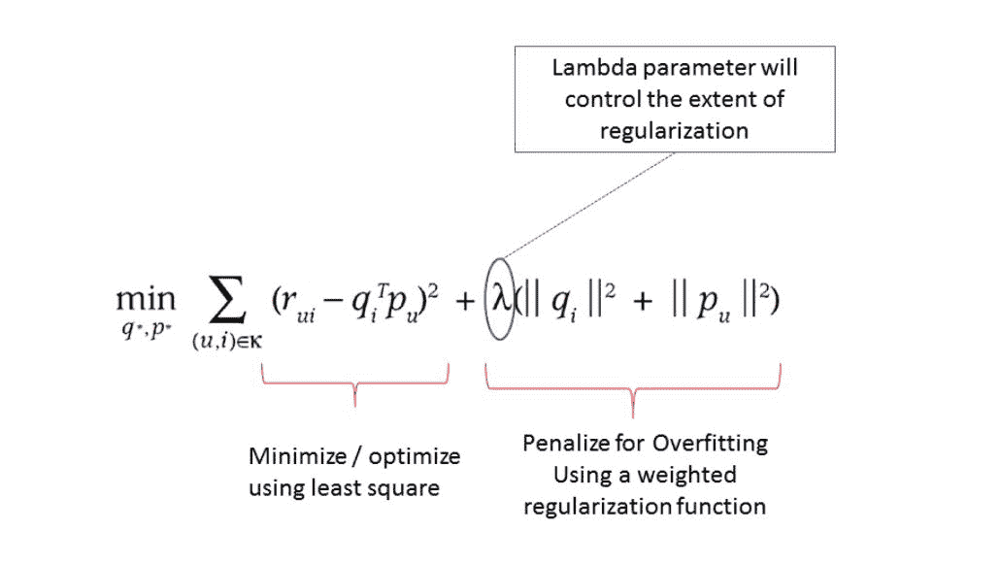

使用 RankingMetrics 类来评估模型性能。参数与用于评估回归模型（二元和多项式）的类相似：

+   Recall

+   Precision

+   fMeasure

MLlib 提供的 RankingMetrics 类可用于评估模型并量化模型的有效性。

RankingMetrics API 文档可在[`spark.apache.org/docs/latest/api/scala/index.html#org.apache.spark.mllib.evaluation.RankingMetrics`](http://spark.apache.org/docs/latest/api/scala/index.html#org.apache.spark.mllib.evaluation.RankingMetrics)找到。

# 另见

Spark 2.0 ML 文档可用于探索 ALS API：

+   [`spark.apache.org/docs/latest/mllib-collaborative-filtering.html`](https://spark.apache.org/docs/latest/mllib-collaborative-filtering.html)

+   [`spark.apache.org/docs/latest/api/scala/index.html#org.apache.spark.ml.recommendation.ALS`](https://spark.apache.org/docs/latest/api/scala/index.html#org.apache.spark.ml.recommendation.ALS)

+   [`spark.apache.org/docs/latest/api/scala/index.html#org.apache.spark.ml.recommendation.ALSModel`](https://spark.apache.org/docs/latest/api/scala/index.html#org.apache.spark.ml.recommendation.ALSModel)

Spark 2.0 MLlib 文档可在[`spark.apache.org/docs/latest/api/scala/index.html#org.apache.spark.mllib.recommendation.ALS`](https://spark.apache.org/docs/latest/api/scala/index.html#org.apache.spark.mllib.recommendation.ALS)找到。

ALS 参数及其默认构造形成了一个具有默认参数的 ALS 实例，如下所示：

```scala
{numBlocks: -1, rank: 10, iterations: 10, lambda: 0.
numBlocks: -1,
rank: 10,
iterations: 10,
lambda: 0.01,
implicitPrefs: false,
alpha: 1.0
```

# 处理隐式输入以进行训练

有时实际观察（评级）不可用，必须处理暗示的反馈参数。这可以是简单的，比如在参与期间听哪个音轨，看了多长时间的电影，或者上下文（提前索引）或者导致切换的原因（Netflix 电影在开始、中间或接近特定场景时被放弃）。第三个示例中提供的示例通过使用`ALS.train()`来处理显式反馈。

Spark ML 库提供了一种替代方法`ALS.trainImplicit()`，有四个超参数来控制算法并解决隐式数据问题。如果您有兴趣测试这个方法（它与显式方法非常相似），您可以使用 100 万首歌曲数据集进行简单的训练和预测。您可以从[`labrosa.ee.columbia.edu/millionsong/`](http://labrosa.ee.columbia.edu/millionsong/) URL 下载用于实验的数据集。

协同过滤的优缺点如下：

| **优点** | **缺点** |
| --- | --- |

| 可扩展 | 冷启动问题

+   库存中添加了新项目

+   生态系统中添加了新用户

|

| 发现难以找到且常常难以捉摸的数据属性，而无需配置文件 | 需要相当数量的数据 |
| --- | --- |
| 更准确 |  |
| 便携 |  |
